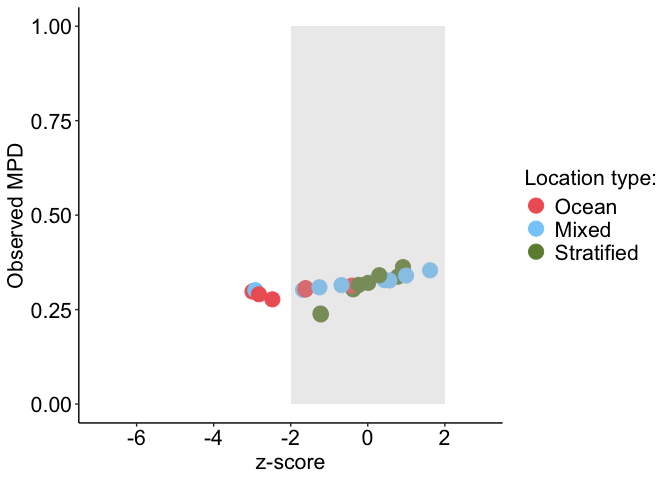
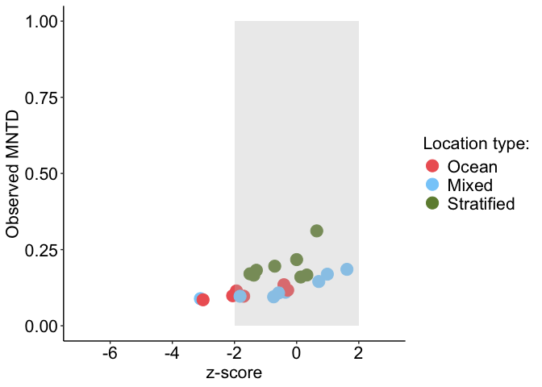
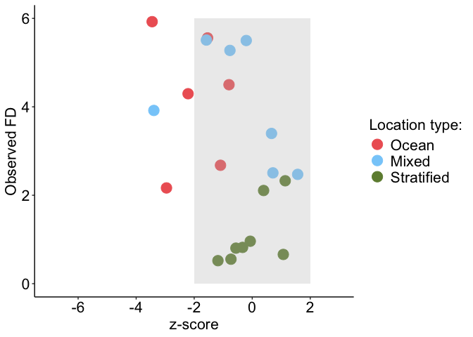

Functional diversity analyses
================

### Load packages and files

``` r
# Load the knitr package if not already loaded
library(knitr)

# Source the R Markdown file
knit("/Users/bailey/Documents/research/Fish_Biodiversity/src/collection/load_collection_data.Rmd", output = "/Users/bailey/Documents/research/Fish_Biodiversity/src/collection/load_collection_data.md")
```

    ## 
    ## 
    ## processing file: /Users/bailey/Documents/research/Fish_Biodiversity/src/collection/load_collection_data.Rmd

    ##   |                  |          |   0%  |                  |          |   4%                                                                          |                  |.         |   8% [Bringing everything together load modifying files packages]             |                  |.         |  12%                                                                          |                  |..        |  17% [Bringing everything together load in modifying files]                   |                  |..        |  21%                                                                          |                  |..        |  25% [Check species names across files]                                       |                  |...       |  29%                                                                          |                  |...       |  33% [Modify environment data]                                                |                  |....      |  38%                                                                          |                  |....      |  42% [Modify incidence matrices]                                              |                  |.....     |  46%                                                                          |                  |.....     |  50% [Modify phylogeny]                                                       |                  |.....     |  54%                                                                          |                  |......    |  58% [Modify trait data]                                                      |                  |......    |  62%                                                                          |                  |.......   |  67% [Modify Location_type data frames]                                       |                  |.......   |  71%                                                                          |                  |........  |  75% [Modify Location_type trait data]                                        |                  |........  |  79%                                                                          |                  |........  |  83% [Location_type trait data tests]                                         |                  |......... |  88%                                                                          |                  |......... |  92% [Modify site trait data frames]                                          |                  |..........|  96%                                                                          |                  |..........| 100% [Bringing everything together load out modified files and session info]

    ## output file: /Users/bailey/Documents/research/Fish_Biodiversity/src/collection/load_collection_data.md

    ## [1] "/Users/bailey/Documents/research/Fish_Biodiversity/src/collection/load_collection_data.md"

``` r
# Packages
library(picante)
```

    ## Loading required package: vegan

    ## Loading required package: permute

    ## Loading required package: lattice

    ## 
    ## Attaching package: 'vegan'

    ## The following object is masked from 'package:phytools':
    ## 
    ##     scores

    ## Loading required package: nlme

    ## 
    ## Attaching package: 'nlme'

    ## The following object is masked from 'package:dplyr':
    ## 
    ##     collapse

``` r
library(vegan)
library(phytools)
library(ggplot2)
library(ggrepel)
library(caret)
```

    ## 
    ## Attaching package: 'caret'

    ## The following object is masked from 'package:vegan':
    ## 
    ##     tolerance

``` r
library(BAT)
```

    ## Warning: replacing previous import 'e1071::element' by 'ggplot2::element' when
    ## loading 'hypervolume'

    ## 
    ## Attaching package: 'BAT'

    ## The following object is masked from 'package:ggplot2':
    ## 
    ##     alpha

    ## The following object is masked from 'package:tidyr':
    ## 
    ##     fill

    ## The following objects are masked from 'package:base':
    ## 
    ##     beta, gamma

``` r
library(pairwiseAdonis)
```

    ## Loading required package: cluster

    ## 
    ## Attaching package: 'cluster'

    ## The following object is masked from 'package:maps':
    ## 
    ##     votes.repub

``` r
library(emmeans)
```

    ## Welcome to emmeans.
    ## Caution: You lose important information if you filter this package's results.
    ## See '? untidy'

``` r
library(car)
```

    ## Loading required package: carData

    ## 
    ## Attaching package: 'car'

    ## The following object is masked from 'package:dplyr':
    ## 
    ##     recode

``` r
# Site vectors
surveyed_sites <- c("BCM", "CLM", "FLK", "GLK", "HLM", "HLO", "IBK", "LCN", "LLN", "MLN", "NCN", "NLK", "NLN", "NLU", "OCM", "OCO", "OLO", "OTM", "RCA", "SLN", "TLN", "ULN")

surveyed_sites_wo_LCN <- c("BCM", "CLM", "FLK", "GLK", "HLM", "HLO", "IBK", "LLN", "MLN", "NCN", "NLK", "NLN", "NLU", "OCM", "OCO", "OLO", "OTM", "RCA", "SLN", "TLN", "ULN")

surveyed_sites_wo_OCO <- c("BCM", "CLM", "FLK", "GLK", "HLM", "HLO", "IBK", "LCN", "LLN", "MLN", "NCN", "NLK", "NLN", "NLU", "OCM", "OLO", "OTM", "RCA", "SLN", "TLN", "ULN")

surveyed_sites_wo_HLO <- c("BCM", "CLM", "FLK", "GLK", "HLM", "IBK", "LCN", "LLN", "MLN", "NCN", "NLK", "NLN", "NLU", "OCM", "OCO", "OLO", "OTM", "RCA", "SLN", "TLN", "ULN")

surveyed_sites_wo_TLN_HLM <- c("BCM", "CLM", "FLK", "GLK", "HLO", "IBK", "LCN", "LLN", "MLN", "NCN", "NLK", "NLN", "NLU", "OCM", "OCO", "OLO", "OTM", "RCA", "SLN", "ULN")

surveyed_sites_env <- c("BCM", "CLM", "FLK", "GLK", "HLM", "HLO", "IBK", "LLN", "MLN", "NCN", "NLK", "NLN", "NLU", "OLO", "OTM", "RCA", "SLN", "TLN", "ULN")

ocean_mixed_sites <- c("FLK", "HLO", "IBK", "LCN", "LLN", "MLN", "NCN", "NLN", "NLU", "OCM", "OCO", "OLO", "RCA", "ULN")

ocean_mixed_sites_env <- c("FLK", "HLO", "IBK", "LLN", "MLN", "NCN", "NLN", "NLU", "OLO", "RCA", "ULN")

ocean_stratified_sites <- c("BCM", "CLM", "GLK", "HLM", "IBK", "LCN", "NCN", "NLK", "OCM", "OCO", "OTM", "RCA", "SLN", "TLN")

ocean_stratified_sites_env <- c("BCM", "CLM", "GLK", "HLM", "IBK", "NCN", "NLK", "OTM", "RCA", "SLN", "TLN")

mixed_stratified_lakes <- c("BCM", "CLM", "FLK", "GLK", "HLM", "HLO", "LLN", "MLN", "NLK", "NLN", "NLU", "OLO", "OTM", "SLN", "TLN", "ULN")

ocean_sites <- c("IBK", "LCN", "NCN", "OCM", "OCO", "RCA")

ocean_sites_env <- c("IBK", "NCN", "RCA")

mixed_lakes <- c("FLK", "HLO", "LLN", "MLN", "NLN", "NLU", "OLO", "ULN")

stratified_lakes <- c("BCM", "CLM", "GLK", "HLM", "NLK", "OTM", "SLN", "TLN")

# Define your custom colors
custom_colors <- c("Reference" = "black", "Ocean" = "#EE6363", "Mixed" = "#87CEFA", "Stratified" = "#6E8B3D")

env_cont <- "#FFB90F"

set.seed(123)
```

### Edit input files

``` r
env <- env[order(env$X),]
presabs_lake <- presabs_lake[order(row.names(presabs_lake)),]
surveyed_sites_lake <- surveyed_sites_lake[order(row.names(surveyed_sites_lake)),]

Location_type_group_ref <- env[,"Location_type"]
Location_type_group <- env[surveyed_sites,"Location_type"]

straits_na <- which(rowSums(is.na(straits)) > 0)
straits_clean <- straits[-straits_na, ]
```

# Functional Diversity

### Identify traits with variation

``` r
## Reference
# Determine which traits have variance
nzv <- nearZeroVar(traits)
nzv
```

    ## integer(0)

``` r
# All traits have variation

traits$presence_sum <- rowSums(presabs_species)  # Sum occurrences across all sites
# Ensure traits_numeric is a data frame
mod <-  lm(presence_sum ~ BodyShapeI + DemersPelag + OperculumPresent + MaxLengthTL + Troph + DepthMin + DepthMax + TempPrefMin + TempPrefMax + FeedingPath + RepGuild2 + ParentalCare + WaterPref + DorsalSpinesMean, traits)
summary(mod)
```

    ## 
    ## Call:
    ## lm(formula = presence_sum ~ BodyShapeI + DemersPelag + OperculumPresent + 
    ##     MaxLengthTL + Troph + DepthMin + DepthMax + TempPrefMin + 
    ##     TempPrefMax + FeedingPath + RepGuild2 + ParentalCare + WaterPref + 
    ##     DorsalSpinesMean, data = traits)
    ## 
    ## Residuals:
    ##     Min      1Q  Median      3Q     Max 
    ## -1.6137 -0.6768 -0.3531  0.0526 12.2027 
    ## 
    ## Coefficients:
    ##                       Estimate Std. Error t value Pr(>|t|)    
    ## (Intercept)          2.6908970  1.6929838   1.589 0.112151    
    ## BodyShapeI2s         0.7134603  0.4509856   1.582 0.113839    
    ## BodyShapeI3f         0.7184052  0.4508056   1.594 0.111214    
    ## BodyShapeI4e         0.6939366  0.4520646   1.535 0.124964    
    ## BodyShapeI5l         0.5260132  0.4721222   1.114 0.265377    
    ## DemersPelag2pn      -0.2705386  0.2737268  -0.988 0.323123    
    ## DemersPelag3p       -0.7505488  1.2534547  -0.599 0.549398    
    ## DemersPelag4po      -0.1211062  0.3705341  -0.327 0.743828    
    ## DemersPelag5d       -0.4626085  0.1364634  -3.390 0.000715 ***
    ## DemersPelag6bp      -0.3574284  0.2538203  -1.408 0.159260    
    ## DemersPelag7bd       0.2451175  1.2234277   0.200 0.841229    
    ## OperculumPresentyes  0.3711498  0.0876401   4.235 2.41e-05 ***
    ## MaxLengthTL         -0.0000217  0.0007159  -0.030 0.975821    
    ## Troph               -0.1086047  0.0817110  -1.329 0.183986    
    ## DepthMin            -0.0036201  0.0034454  -1.051 0.293553    
    ## DepthMax            -0.0000868  0.0003638  -0.239 0.811471    
    ## TempPrefMin          0.0519679  0.0222752   2.333 0.019767 *  
    ## TempPrefMax         -0.0614448  0.0599027  -1.026 0.305161    
    ## FeedingPathp        -0.1307345  0.0925640  -1.412 0.158028    
    ## RepGuild22eb        -0.4328537  0.4713257  -0.918 0.358556    
    ## RepGuild23n         -0.6764647  0.4471733  -1.513 0.130531    
    ## RepGuild24t         -0.6146815  0.4810022  -1.278 0.201456    
    ## RepGuild25h         -0.9890426  1.1956561  -0.827 0.408244    
    ## RepGuild26s         -0.6392609  0.4987003  -1.282 0.200072    
    ## ParentalCare2m      -0.5531592  0.5453568  -1.014 0.310584    
    ## ParentalCare3p      -0.7564641  0.4608894  -1.641 0.100921    
    ## ParentalCare4n      -0.6356969  0.5166541  -1.230 0.218717    
    ## WaterPref2bs         0.2840775  0.1229165   2.311 0.020946 *  
    ## WaterPref3a          0.7526872  0.1862863   4.040 5.58e-05 ***
    ## WaterPref4b          0.0318851  1.2526535   0.025 0.979696    
    ## WaterPref5fb         0.1306558  0.5272456   0.248 0.804313    
    ## WaterPref6f          0.2861852  0.6483562   0.441 0.658980    
    ## DorsalSpinesMean     0.0221649  0.0125085   1.772 0.076579 .  
    ## ---
    ## Signif. codes:  0 '***' 0.001 '**' 0.01 '*' 0.05 '.' 0.1 ' ' 1
    ## 
    ## Residual standard error: 1.528 on 1667 degrees of freedom
    ##   (24 observations deleted due to missingness)
    ## Multiple R-squared:  0.068,  Adjusted R-squared:  0.0501 
    ## F-statistic: 3.801 on 32 and 1667 DF,  p-value: 7.522e-12

``` r
rms::vif(mod)
```

    ##        BodyShapeI2s        BodyShapeI3f        BodyShapeI4e        BodyShapeI5l 
    ##           26.649284           35.090143           30.268831           12.663803 
    ##      DemersPelag2pn       DemersPelag3p      DemersPelag4po       DemersPelag5d 
    ##            1.069413            1.344441            1.162392            1.352421 
    ##      DemersPelag6bp      DemersPelag7bd OperculumPresentyes         MaxLengthTL 
    ##            1.156647            1.280800            1.363029            1.895574 
    ##               Troph            DepthMin            DepthMax         TempPrefMin 
    ##            1.522357            2.620143            1.943623            2.688081 
    ##         TempPrefMax        FeedingPathp        RepGuild22eb         RepGuild23n 
    ##            3.121962            1.369398           12.225085           31.308560 
    ##         RepGuild24t         RepGuild25h         RepGuild26s      ParentalCare2m 
    ##            7.105026            1.223312           44.986852            6.541658 
    ##      ParentalCare3p      ParentalCare4n        WaterPref2bs         WaterPref3a 
    ##           37.780554           48.319826            1.097236            1.267030 
    ##         WaterPref4b        WaterPref5fb         WaterPref6f    DorsalSpinesMean 
    ##            1.342723            1.066029            1.076586            2.088104

``` r
car::vif(mod)
```

    ##                       GVIF Df GVIF^(1/(2*Df))
    ## BodyShapeI        3.411923  4        1.165802
    ## DemersPelag       3.119262  6        1.099439
    ## OperculumPresent  1.363029  1        1.167489
    ## MaxLengthTL       1.895574  1        1.376798
    ## Troph             1.522357  1        1.233838
    ## DepthMin          2.620143  1        1.618686
    ## DepthMax          1.943623  1        1.394139
    ## TempPrefMin       2.688081  1        1.639537
    ## TempPrefMax       3.121962  1        1.766908
    ## FeedingPath       1.369398  1        1.170213
    ## RepGuild2        52.640048  5        1.486386
    ## ParentalCare     37.128063  3        1.826489
    ## WaterPref         2.034620  5        1.073614
    ## DorsalSpinesMean  2.088104  1        1.445027

``` r
# RepGuild1 and RepGuild2 are aliases

# Trait distance calculation
traits_keep <- c("BodyShapeI", "DemersPelag", "OperculumPresent", "MaxLengthTL", "Troph", "DepthMin", "DepthMax", "TempPrefMin", "TempPrefMax", "FeedingPath", "RepGuild2", "ParentalCare", "WaterPref", "DorsalSpinesMean")
traits_vif <- traits[,traits_keep]

# Suppose categorical columns are 1-3 and 10-13
dummy_converted <- BAT::dummy(traits_vif, convert = c(1:3,10:13))
str(dummy_converted)
```

    ##  num [1:1724, 1:39] 0 0 0 0 0 0 0 0 0 0 ...
    ##  - attr(*, "dimnames")=List of 2
    ##   ..$ : NULL
    ##   ..$ : chr [1:39] "BodyShapeI.1o" "BodyShapeI.2s" "BodyShapeI.3f" "BodyShapeI.4e" ...

``` r
row.names(dummy_converted) <- row.names(traits_vif)

traits_dist <- gower(traits_vif, convert = c(1:3,10:13), weight = c(0.2,0.14,0.5,1,1,1,1,1,1,0.5,0.2,0.25,0.25,1))
traits_clust <- hclust(traits_dist,"average")
traits_tree <- as.phylo(traits_clust)


## Surveyed sites
# Determine which traits have variance
nzv <- nearZeroVar(straits)
nzv
```

    ## [1] 2

``` r
# DemersPelag has no variation

straits$presence_sum <- rowSums(surveyed_sites_species)  # Sum occurrences across all sites
# Ensure straits_numeric is a data frame
mod <-  lm(presence_sum ~ BodyShapeI + OperculumPresent + MaxLengthTL + Troph + DepthMin + DepthMax + TempPrefMin + TempPrefMax + FeedingPath + RepGuild2 + ParentalCare + WaterPref + DorsalSpinesMean, straits)
summary(mod)
```

    ## 
    ## Call:
    ## lm(formula = presence_sum ~ BodyShapeI + OperculumPresent + MaxLengthTL + 
    ##     Troph + DepthMin + DepthMax + TempPrefMin + TempPrefMax + 
    ##     FeedingPath + RepGuild2 + ParentalCare + WaterPref + DorsalSpinesMean, 
    ##     data = straits)
    ## 
    ## Residuals:
    ##     Min      1Q  Median      3Q     Max 
    ## -4.1223 -1.7162 -0.5149  0.9708  9.2324 
    ## 
    ## Coefficients:
    ##                      Estimate Std. Error t value Pr(>|t|)   
    ## (Intercept)          2.747921  26.383107   0.104  0.91714   
    ## BodyShapeI2s         8.865859   4.501084   1.970  0.05011 . 
    ## BodyShapeI3f         9.678157   4.469116   2.166  0.03141 * 
    ## BodyShapeI4e         9.371918   4.451885   2.105  0.03640 * 
    ## BodyShapeI5l         8.718795   4.694057   1.857  0.06457 . 
    ## OperculumPresentyes  0.886427   0.459851   1.928  0.05517 . 
    ## MaxLengthTL         -0.005259   0.006449  -0.815  0.41569   
    ## Troph               -0.488821   0.334417  -1.462  0.14523   
    ## DepthMin            -0.121188   0.046855  -2.586  0.01033 * 
    ## DepthMax             0.013385   0.006337   2.112  0.03578 * 
    ## TempPrefMin          0.458240   0.175164   2.616  0.00950 **
    ## TempPrefMax         -0.401754   0.913469  -0.440  0.66050   
    ## FeedingPathp        -0.388418   0.479110  -0.811  0.41840   
    ## RepGuild22eb        -2.713529   2.782956  -0.975  0.33059   
    ## RepGuild23n         -4.866405   2.613964  -1.862  0.06396 . 
    ## RepGuild24t         -4.396258   2.708204  -1.623  0.10594   
    ## RepGuild26s         -4.769057   2.860485  -1.667  0.09687 . 
    ## ParentalCare2m      -3.516499   2.439742  -1.441  0.15089   
    ## ParentalCare3p      -4.130168   2.006203  -2.059  0.04069 * 
    ## ParentalCare4n      -3.924847   2.239042  -1.753  0.08099 . 
    ## WaterPref2bs         0.390157   0.479530   0.814  0.41673   
    ## WaterPref3a          2.156145   0.782921   2.754  0.00637 **
    ## DorsalSpinesMean     0.079604   0.073033   1.090  0.27690   
    ## ---
    ## Signif. codes:  0 '***' 0.001 '**' 0.01 '*' 0.05 '.' 0.1 ' ' 1
    ## 
    ## Residual standard error: 2.623 on 223 degrees of freedom
    ##   (3 observations deleted due to missingness)
    ## Multiple R-squared:  0.2132, Adjusted R-squared:  0.1355 
    ## F-statistic: 2.746 on 22 and 223 DF,  p-value: 9.16e-05

``` r
rms::vif(mod)
```

    ##        BodyShapeI2s        BodyShapeI3f        BodyShapeI4e        BodyShapeI5l 
    ##          159.945958          172.783698          130.653845            9.488429 
    ## OperculumPresentyes         MaxLengthTL               Troph            DepthMin 
    ##            1.777374            2.525748            1.714540            1.583170 
    ##            DepthMax         TempPrefMin         TempPrefMax        FeedingPathp 
    ##            3.586064            2.123964            2.447730            1.460756 
    ##        RepGuild22eb         RepGuild23n         RepGuild24t         RepGuild26s 
    ##           15.852072           52.522651           10.224568           71.557916 
    ##      ParentalCare2m      ParentalCare3p      ParentalCare4n        WaterPref2bs 
    ##            5.063143           34.361958           43.843286            1.141666 
    ##         WaterPref3a    DorsalSpinesMean 
    ##            1.332457            2.175458

``` r
car::vif(mod)
```

    ##                       GVIF Df GVIF^(1/(2*Df))
    ## BodyShapeI        8.454690  4        1.305832
    ## OperculumPresent  1.777374  1        1.333182
    ## MaxLengthTL       2.525748  1        1.589260
    ## Troph             1.714540  1        1.309405
    ## DepthMin          1.583170  1        1.258241
    ## DepthMax          3.586064  1        1.893690
    ## TempPrefMin       2.123964  1        1.457383
    ## TempPrefMax       2.447730  1        1.564522
    ## FeedingPath       1.460756  1        1.208617
    ## RepGuild2        46.456285  4        1.615774
    ## ParentalCare     29.516419  3        1.757967
    ## WaterPref         1.465432  2        1.100250
    ## DorsalSpinesMean  2.175458  1        1.474943

``` r
# RepGuild1 and RepGuild2 are aliases

# Trait distance calculation
straits_keep <- c("BodyShapeI", "OperculumPresent", "MaxLengthTL", "Troph", "DepthMin", "DepthMax", "TempPrefMin", "TempPrefMax", "FeedingPath", "RepGuild2", "ParentalCare", "WaterPref", "DorsalSpinesMean")
straits_vif <- straits[,straits_keep]

# Suppose categorical columns are 1, 2, and 9-12
dummy_converted <- BAT::dummy(straits_vif, convert = c(1:2,9:12))
str(dummy_converted)
```

    ##  num [1:249, 1:29] 0 0 0 0 0 0 0 0 0 0 ...
    ##  - attr(*, "dimnames")=List of 2
    ##   ..$ : NULL
    ##   ..$ : chr [1:29] "BodyShapeI.1o" "BodyShapeI.2s" "BodyShapeI.3f" "BodyShapeI.4e" ...

``` r
row.names(dummy_converted) <- row.names(straits_vif)

straits_dist <- BAT::gower(straits_vif, convert = c(1:2,9:12), weight = c(0.2,0.5,1,1,1,1,1,1,0.5,0.2,0.25,0.25,1))
straits_clust <- hclust(straits_dist,"average")
straits_tree <- as.phylo(straits_clust)
```

## FD alpha Diversity

### FD alpha mntd, mpd, and pd calculations of traits and files to be saved

``` r
## Reference
# Dispersion
traits_disp <- dispersion(comm = presabs_lake, distance = traits_dist, abund = F)
write.csv(traits_disp, "/Users/bailey/Documents/research/Fish_Biodiversity/data/analyses/FD/traits_disp.csv")

#Mean pairwise distances
traits_sesmpd <- ses.mpd(presabs_lake, traits_dist, null.model = "taxa.labels", abundance.weighted = FALSE, runs = 999, iterations = 1000)
write.csv(traits_sesmpd, "/Users/bailey/Documents/research/Fish_Biodiversity/data/analyses/FD/traits_sesmpd.csv")

#Mean nearest taxon distances
traits_sesmntd <- ses.mntd(presabs_lake, traits_dist, null.model = "taxa.labels", abundance.weighted = FALSE, runs = 999, iterations = 1000)
write.csv(traits_sesmntd, "/Users/bailey/Documents/research/Fish_Biodiversity/data/analyses/FD/traits_sesmntd.csv")

#Faith's PD
traits_sespd <- ses.pd(presabs_lake, traits_tree, null.model = "taxa.labels", runs = 999, iterations = 1000, include.root = TRUE)
write.csv(traits_sespd, "/Users/bailey/Documents/research/Fish_Biodiversity/data/analyses/FD/traits_sespd.csv")


## Surveyed sites
# Dispersion
straits_disp <- dispersion(comm = surveyed_sites_lake, distance = straits_dist, abund = F)
write.csv(straits_disp, "/Users/bailey/Documents/research/Fish_Biodiversity/data/analyses/FD/straits_disp.csv")

#Mean pairwise distances
straits_sesmpd <- ses.mpd(surveyed_sites_lake, straits_dist, null.model = "taxa.labels", abundance.weighted = FALSE, runs = 999, iterations = 1000)
write.csv(straits_sesmpd, "/Users/bailey/Documents/research/Fish_Biodiversity/data/analyses/FD/straits_sesmpd.csv")

#Mean nearest taxon distances
straits_sesmntd <- ses.mntd(surveyed_sites_lake, straits_dist, null.model = "taxa.labels", abundance.weighted = FALSE, runs = 999, iterations = 1000)
write.csv(straits_sesmntd, "/Users/bailey/Documents/research/Fish_Biodiversity/data/analyses/FD/straits_sesmntd.csv")

#Faith's PD
straits_sespd <- ses.pd(surveyed_sites_lake, straits_tree, null.model = "taxa.labels", runs = 999, iterations = 1000, include.root = TRUE)
write.csv(straits_sespd, "/Users/bailey/Documents/research/Fish_Biodiversity/data/analyses/FD/straits_sespd.csv")
```

### FD alpha files mntd, mpd, and pd to read into R

- Read in Functional Diversity files and combine with env data

``` r
## Reference
# Dispersion 
traits_disp <-read.csv("/Users/bailey/Documents/research/Fish_Biodiversity/data/analyses/FD/traits_disp.csv")
traits_disp_env <- merge(traits_disp, env, by = "X", sort = F)
traits_disp_env$measure <- "traits_disp"
traits_disp_env$Location_type <- factor(traits_disp_env$Location_type, levels = c("Reference", "Ocean", "Mixed", "Stratified"))
row.names(traits_disp_env) <- traits_disp_env$X

# Mean pairwise distances
traits_sesmpd <- read.csv("/Users/bailey/Documents/research/Fish_Biodiversity/data/analyses/FD/traits_sesmpd.csv")
traits_sesmpd_env <- merge(traits_sesmpd, env, by = "X", sort = F)
traits_sesmpd_env$measure <- "traits_sesmpd"
traits_sesmpd_env$Location_type <- factor(traits_sesmpd_env$Location_type, levels = c("Reference", "Ocean", "Mixed", "Stratified"))
row.names(traits_sesmpd_env) <- traits_sesmpd_env$X

# Mean nearest taxon distances
traits_sesmntd <- read.csv("/Users/bailey/Documents/research/Fish_Biodiversity/data/analyses/FD/traits_sesmntd.csv")
traits_sesmntd_env <- merge(traits_sesmntd, env, by = "X", sort = F)
traits_sesmntd_env$measure <- "traits_sesmntd"
traits_sesmntd_env$Location_type <- factor(traits_sesmntd_env$Location_type, levels = c("Reference", "Ocean", "Mixed", "Stratified"))
row.names(traits_sesmntd_env) <- traits_sesmntd_env$X

#Faith's PD
traits_sespd <- read.csv("/Users/bailey/Documents/research/Fish_Biodiversity/data/analyses/FD/traits_sespd.csv")
traits_sespd_env <- merge(traits_sespd, env, by = "X", sort = F)
traits_sespd_env$measure <- "traits_sespd"
traits_sespd_env$Location_type <- factor(traits_sespd_env$Location_type, levels = c("Reference", "Ocean", "Mixed", "Stratified"))
straits_sespd_env <- merge(traits_sespd_env, traits_disp, by = "X", sort = F)
row.names(traits_sespd_env) <- traits_sespd_env$X


## Surveyed sites
# Dispersion 
straits_disp <-read.csv("/Users/bailey/Documents/research/Fish_Biodiversity/data/analyses/FD/straits_disp.csv")
straits_disp_env <- merge(straits_disp, env, by = "X", sort = F)
straits_disp_env$measure <- "straits_disp"
straits_disp_env$Location_type <- factor(straits_disp_env$Location_type, levels = c("Ocean", "Mixed", "Stratified"))
row.names(straits_disp_env) <- straits_disp_env$X

# Mean pairwise distances
straits_sesmpd <- read.csv("/Users/bailey/Documents/research/Fish_Biodiversity/data/analyses/FD/straits_sesmpd.csv")
straits_sesmpd_env <- merge(straits_sesmpd, env, by = "X", sort = F)
straits_sesmpd_env$measure <- "straits_sesmpd"
straits_sesmpd_env$Location_type <- factor(straits_sesmpd_env$Location_type, levels = c("Ocean", "Mixed", "Stratified"))
row.names(straits_sesmpd_env) <- straits_sesmpd_env$X

# Mean nearest taxon distances
straits_sesmntd <- read.csv("/Users/bailey/Documents/research/Fish_Biodiversity/data/analyses/FD/straits_sesmntd.csv")
straits_sesmntd_env <- merge(straits_sesmntd, env, by = "X", sort = F)
straits_sesmntd_env$measure <- "straits_sesmntd"
straits_sesmntd_env$Location_type <- factor(straits_sesmntd_env$Location_type, levels = c("Ocean", "Mixed", "Stratified"))
row.names(straits_sesmntd_env) <- straits_sesmntd_env$X

#Faith's PD
straits_sespd <-read.csv("/Users/bailey/Documents/research/Fish_Biodiversity/data/analyses/FD/straits_sespd.csv")
straits_sespd_env <- merge(straits_sespd, env, by = "X", sort = F)
straits_sespd_env$measure <- "straits_sespd"
straits_sespd_env$Location_type <- factor(straits_sespd_env$Location_type, levels = c("Ocean", "Mixed", "Stratified"))
straits_sespd_env <- merge(straits_sespd_env, straits_disp, by = "X", sort = F)
row.names(straits_sespd_env) <- straits_sespd_env$X
```

### FD alpha outliers for each Location type

``` r
outlier_FD_alpha <- straits_sespd_env %>%
  group_by(Location_type) %>%
  mutate(
    Q1 = quantile(pd.obs.z, 0.25),
    Q3 = quantile(pd.obs.z, 0.75),
    IQR = Q3 - Q1,
    lower_bound = Q1 - 1.5 * IQR,
    upper_bound = Q3 + 1.5 * IQR,
    is_outlier = pd.obs.z < lower_bound | pd.obs.z > upper_bound
  )

outlier_FD_alpha <- as.data.frame(outlier_FD_alpha)
row.names(outlier_FD_alpha) <- outlier_FD_alpha$X

# Create the plot
(outlier_FD_alpha_plot <- ggplot(outlier_FD_alpha, aes(x = Location_type, y = pd.obs.z, fill = Location_type)) +
  geom_violin(alpha = 0.9, draw_quantiles = c(0.25, 0.5, 0.75), aes(fill = Location_type)) +
  geom_jitter(aes(color = is_outlier), width = 0.1, size = 2, alpha = 0.7) +
  scale_color_manual(values = c("FALSE" = "black", "TRUE" = "purple")) +
  scale_fill_manual(values = custom_colors) +
  geom_text_repel(data = outlier_FD_alpha, label = outlier_FD_alpha$X, size = 3, point.padding = 7, max.overlaps = 30, nudge_x = -0.01) +
  theme(text = element_text(size = 12),
        legend.position = "right",
        legend.title = element_text(size = 12),
        legend.text = element_text(size = 12),
        axis.title = element_text(size = 12),
        axis.line = element_line(color = "black"),
        panel.background = element_rect(fill='transparent'),
        plot.background = element_rect(fill='transparent', color=NA),
        panel.grid.major = element_blank(),
        panel.grid.minor = element_blank(),
        panel.border = element_blank(),
        axis.text = element_text(color = "black", size = 12)) +
  # scale_y_continuous(expand = c(0,0.5)) +
  labs(y = expression(paste(alpha, "FRic-z")), x = "Location type", color = "Outlier:", tag = "c") +
  guides(color = "none", fill = "none"))
```

    ## Warning: The `draw_quantiles` argument of `geom_violin()` is deprecated as of ggplot2
    ## 4.0.0.
    ## ℹ Please use the `quantiles.linetype` argument instead.
    ## This warning is displayed once every 8 hours.
    ## Call `lifecycle::last_lifecycle_warnings()` to see where this warning was
    ## generated.

<!-- -->

``` r
ggsave("/Users/bailey/Documents/research/Fish_Biodiversity/figures/FD/outlier_FD_alpha.jpg", outlier_FD_alpha_plot, width = 3.25, height = 3.34, units = "in")
```

### Identify VIF of environmental and geographic variables

``` r
library(MASS)
```

    ## 
    ## Attaching package: 'MASS'

    ## The following object is masked from 'package:dplyr':
    ## 
    ##     select

``` r
# Determine which env variables have variance
environment <- c("temperature_median", "salinity_median", "oxygen_median", "pH_median")
nzv <- nearZeroVar(env[,environment])
nzv
```

    ## integer(0)

``` r
# All env variables have variance

mod <-  lm(pd.obs.z ~ temperature_median + salinity_median + oxygen_median + pH_median, straits_sespd_env)
summary(mod)
```

    ## 
    ## Call:
    ## lm(formula = pd.obs.z ~ temperature_median + salinity_median + 
    ##     oxygen_median + pH_median, data = straits_sespd_env)
    ## 
    ## Residuals:
    ##     Min      1Q  Median      3Q     Max 
    ## -2.0141 -0.6416  0.2708  0.5372  2.5195 
    ## 
    ## Coefficients:
    ##                    Estimate Std. Error t value Pr(>|t|)  
    ## (Intercept)         3.07579   14.39601   0.214   0.8339  
    ## temperature_median  0.02430    0.27623   0.088   0.9312  
    ## salinity_median     0.09993    0.14069   0.710   0.4892  
    ## oxygen_median      -0.93212    0.38096  -2.447   0.0282 *
    ## pH_median          -0.46431    2.49022  -0.186   0.8548  
    ## ---
    ## Signif. codes:  0 '***' 0.001 '**' 0.01 '*' 0.05 '.' 0.1 ' ' 1
    ## 
    ## Residual standard error: 1.161 on 14 degrees of freedom
    ##   (3 observations deleted due to missingness)
    ## Multiple R-squared:  0.4653, Adjusted R-squared:  0.3125 
    ## F-statistic: 3.045 on 4 and 14 DF,  p-value: 0.05322

``` r
car::Anova(mod, type = 3)
```

    ## Anova Table (Type III tests)
    ## 
    ## Response: pd.obs.z
    ##                     Sum Sq Df F value  Pr(>F)  
    ## (Intercept)         0.0615  1  0.0456 0.83390  
    ## temperature_median  0.0104  1  0.0077 0.93116  
    ## salinity_median     0.6800  1  0.5045 0.48919  
    ## oxygen_median       8.0697  1  5.9867 0.02822 *
    ## pH_median           0.0469  1  0.0348 0.85477  
    ## Residuals          18.8711 14                  
    ## ---
    ## Signif. codes:  0 '***' 0.001 '**' 0.01 '*' 0.05 '.' 0.1 ' ' 1

``` r
rms::vif(mod)
```

    ## temperature_median    salinity_median      oxygen_median          pH_median 
    ##           1.385456           3.435415           2.209454           4.821892

``` r
car::vif(mod)
```

    ## temperature_median    salinity_median      oxygen_median          pH_median 
    ##           1.385456           3.435415           2.209454           4.821892

``` r
mod <-  lm(pd.obs.z ~ temperature_median + salinity_median + oxygen_median, straits_sespd_env)
summary(mod)
```

    ## 
    ## Call:
    ## lm(formula = pd.obs.z ~ temperature_median + salinity_median + 
    ##     oxygen_median, data = straits_sespd_env)
    ## 
    ## Residuals:
    ##     Min      1Q  Median      3Q     Max 
    ## -1.9849 -0.6498  0.1929  0.5178  2.5482 
    ## 
    ## Coefficients:
    ##                     Estimate Std. Error t value Pr(>|t|)   
    ## (Intercept)         0.974526   8.664547   0.112    0.912   
    ## temperature_median  0.002999   0.243279   0.012    0.990   
    ## salinity_median     0.079612   0.086086   0.925    0.370   
    ## oxygen_median      -0.978987   0.276904  -3.535    0.003 **
    ## ---
    ## Signif. codes:  0 '***' 0.001 '**' 0.01 '*' 0.05 '.' 0.1 ' ' 1
    ## 
    ## Residual standard error: 1.123 on 15 degrees of freedom
    ##   (3 observations deleted due to missingness)
    ## Multiple R-squared:  0.4639, Adjusted R-squared:  0.3567 
    ## F-statistic: 4.327 on 3 and 15 DF,  p-value: 0.02189

``` r
car::Anova(mod, type = 3)
```

    ## Anova Table (Type III tests)
    ## 
    ## Response: pd.obs.z
    ##                     Sum Sq Df F value   Pr(>F)   
    ## (Intercept)         0.0160  1  0.0127 0.911940   
    ## temperature_median  0.0002  1  0.0002 0.990325   
    ## salinity_median     1.0786  1  0.8552 0.369712   
    ## oxygen_median      15.7645  1 12.4996 0.002997 **
    ## Residuals          18.9179 15                    
    ## ---
    ## Signif. codes:  0 '***' 0.001 '**' 0.01 '*' 0.05 '.' 0.1 ' ' 1

``` r
rms::vif(mod)
```

    ## temperature_median    salinity_median      oxygen_median 
    ##           1.148556           1.374749           1.247588

``` r
car::vif(mod)
```

    ## temperature_median    salinity_median      oxygen_median 
    ##           1.148556           1.374749           1.247588

``` r
environment <- c("temperature_median", "salinity_median", "oxygen_median")

mod <- aov(salinity_median ~ Location_type, straits_sespd_env)
summary(mod)
```

    ##               Df Sum Sq Mean Sq F value   Pr(>F)    
    ## Location_type  2 147.34   73.67   13.61 0.000353 ***
    ## Residuals     16  86.62    5.41                     
    ## ---
    ## Signif. codes:  0 '***' 0.001 '**' 0.01 '*' 0.05 '.' 0.1 ' ' 1
    ## 3 observations deleted due to missingness

``` r
mod <- aov(pd.obs.z ~ salinity_median + Location_type, straits_sespd_env)
car::vif(mod)
```

    ##                     GVIF Df GVIF^(1/(2*Df))
    ## salinity_median 2.701125  1        1.643510
    ## Location_type   2.701125  2        1.281995

``` r
mod <- aov(oxygen_median ~ Location_type, straits_sespd_env)
summary(mod)
```

    ##               Df Sum Sq Mean Sq F value   Pr(>F)    
    ## Location_type  2 14.440    7.22      19 5.95e-05 ***
    ## Residuals     16  6.081    0.38                     
    ## ---
    ## Signif. codes:  0 '***' 0.001 '**' 0.01 '*' 0.05 '.' 0.1 ' ' 1
    ## 3 observations deleted due to missingness

``` r
mod <- aov(pd.obs.z ~ oxygen_median + Location_type, straits_sespd_env)
car::vif(mod)
```

    ##                   GVIF Df GVIF^(1/(2*Df))
    ## oxygen_median 3.374424  1        1.836961
    ## Location_type 3.374424  2        1.355345

``` r
mod <- aov(temperature_median ~ Location_type, straits_sespd_env)
summary(mod)
```

    ##               Df Sum Sq Mean Sq F value Pr(>F)
    ## Location_type  2   2.94   1.470   1.092  0.359
    ## Residuals     16  21.54   1.346               
    ## 3 observations deleted due to missingness

``` r
mod <- aov(pd.obs.z ~ temperature_median + Location_type, straits_sespd_env)
car::vif(mod)
```

    ##                        GVIF Df GVIF^(1/(2*Df))
    ## temperature_median 1.136543  1        1.066088
    ## Location_type      1.136543  2        1.032515

``` r
SR_ss_env <- straits_sespd_env[surveyed_sites_env,]
SR_ss_env$Location_type <- factor(SR_ss_env$Location_type, levels = c("Ocean", "Mixed", "Stratified"))

# Run linear discriminant analysis of environmental variables
LDA <- lda(SR_ss_env[,environment], SR_ss_env$Location_type)
spe.class <- predict(LDA)$class
spe.post <- predict(LDA)$posterior
(spe.table <- table(SR_ss_env$Location_type, spe.class))
```

    ##             spe.class
    ##              Ocean Mixed Stratified
    ##   Ocean          1     2          0
    ##   Mixed          0     8          0
    ##   Stratified     0     0          8

``` r
diag(prop.table(spe.table, 1))
```

    ##      Ocean      Mixed Stratified 
    ##  0.3333333  1.0000000  1.0000000

``` r
# Determine which geo variables have variance
geography <- c("volume_m3_w_chemocline", "volume_m3", "surface_area_m2", "distance_to_ocean_min_m", "distance_to_ocean_mean_m", "distance_to_ocean_median_m", "tidal_lag_time_minutes", "tidal_efficiency", "perimeter_fromSat", "max_depth", "logArea")
nzv <- nearZeroVar(env[,geography])
nzv
```

    ## integer(0)

``` r
# All geo variables have variance

mod <-  lm(pd.obs.z ~ volume_m3_w_chemocline + volume_m3 + surface_area_m2 + distance_to_ocean_min_m + distance_to_ocean_mean_m + distance_to_ocean_median_m + tidal_lag_time_minutes + tidal_efficiency + perimeter_fromSat + max_depth + logArea, straits_sespd_env)
summary(mod)
```

    ## 
    ## Call:
    ## lm(formula = pd.obs.z ~ volume_m3_w_chemocline + volume_m3 + 
    ##     surface_area_m2 + distance_to_ocean_min_m + distance_to_ocean_mean_m + 
    ##     distance_to_ocean_median_m + tidal_lag_time_minutes + tidal_efficiency + 
    ##     perimeter_fromSat + max_depth + logArea, data = straits_sespd_env)
    ## 
    ## Residuals:
    ##     Min      1Q  Median      3Q     Max 
    ## -1.1722 -0.3204  0.0861  0.2658  1.2391 
    ## 
    ## Coefficients:
    ##                              Estimate Std. Error t value Pr(>|t|)   
    ## (Intercept)                 9.942e+00  5.077e+00   1.958   0.0819 . 
    ## volume_m3_w_chemocline     -4.883e-06  1.855e-06  -2.632   0.0273 * 
    ## volume_m3                   4.943e-06  1.922e-06   2.572   0.0301 * 
    ## surface_area_m2            -6.333e-07  1.849e-06  -0.342   0.7399   
    ## distance_to_ocean_min_m    -3.890e-02  1.014e-02  -3.835   0.0040 **
    ## distance_to_ocean_mean_m    7.741e-02  4.308e-02   1.797   0.1059   
    ## distance_to_ocean_median_m -5.264e-02  3.959e-02  -1.329   0.2164   
    ## tidal_lag_time_minutes     -1.273e-02  1.189e-02  -1.071   0.3119   
    ## tidal_efficiency           -4.771e+00  3.167e+00  -1.507   0.1662   
    ## perimeter_fromSat           3.142e-04  7.828e-04   0.401   0.6975   
    ## max_depth                  -1.217e-01  5.216e-02  -2.334   0.0445 * 
    ## logArea                    -5.915e-01  5.066e-01  -1.168   0.2730   
    ## ---
    ## Signif. codes:  0 '***' 0.001 '**' 0.01 '*' 0.05 '.' 0.1 ' ' 1
    ## 
    ## Residual standard error: 0.8432 on 9 degrees of freedom
    ##   (1 observation deleted due to missingness)
    ## Multiple R-squared:  0.8459, Adjusted R-squared:  0.6575 
    ## F-statistic:  4.49 on 11 and 9 DF,  p-value: 0.0161

``` r
car::Anova(mod, type = 3)
```

    ## Anova Table (Type III tests)
    ## 
    ## Response: pd.obs.z
    ##                             Sum Sq Df F value   Pr(>F)   
    ## (Intercept)                 2.7267  1  3.8349 0.081869 . 
    ## volume_m3_w_chemocline      4.9247  1  6.9262 0.027279 * 
    ## volume_m3                   4.7028  1  6.6142 0.030098 * 
    ## surface_area_m2             0.0834  1  0.1173 0.739866   
    ## distance_to_ocean_min_m    10.4579  1 14.7083 0.003996 **
    ## distance_to_ocean_mean_m    2.2958  1  3.2289 0.105909   
    ## distance_to_ocean_median_m  1.2566  1  1.7673 0.216423   
    ## tidal_lag_time_minutes      0.8160  1  1.1477 0.311927   
    ## tidal_efficiency            1.6138  1  2.2698 0.166187   
    ## perimeter_fromSat           0.1145  1  0.1611 0.697532   
    ## max_depth                   3.8725  1  5.4464 0.044472 * 
    ## logArea                     0.9692  1  1.3631 0.273002   
    ## Residuals                   6.3992  9                    
    ## ---
    ## Signif. codes:  0 '***' 0.001 '**' 0.01 '*' 0.05 '.' 0.1 ' ' 1

``` r
rms::vif(mod)
```

    ##     volume_m3_w_chemocline                  volume_m3 
    ##                 6433.74411                 6855.30224 
    ##            surface_area_m2    distance_to_ocean_min_m 
    ##                   22.87840                   18.42491 
    ##   distance_to_ocean_mean_m distance_to_ocean_median_m 
    ##                  825.68615                  687.45478 
    ##     tidal_lag_time_minutes           tidal_efficiency 
    ##                   21.17746                   27.90908 
    ##          perimeter_fromSat                  max_depth 
    ##                   94.39757                   10.74366 
    ##                    logArea 
    ##                   25.70304

``` r
car::vif(mod)
```

    ##     volume_m3_w_chemocline                  volume_m3 
    ##                 6433.74411                 6855.30224 
    ##            surface_area_m2    distance_to_ocean_min_m 
    ##                   22.87840                   18.42491 
    ##   distance_to_ocean_mean_m distance_to_ocean_median_m 
    ##                  825.68615                  687.45478 
    ##     tidal_lag_time_minutes           tidal_efficiency 
    ##                   21.17746                   27.90908 
    ##          perimeter_fromSat                  max_depth 
    ##                   94.39757                   10.74366 
    ##                    logArea 
    ##                   25.70304

``` r
mod <-  lm(pd.obs.z ~ distance_to_ocean_min_m + max_depth + logArea, straits_sespd_env)
summary(mod)
```

    ## 
    ## Call:
    ## lm(formula = pd.obs.z ~ distance_to_ocean_min_m + max_depth + 
    ##     logArea, data = straits_sespd_env)
    ## 
    ## Residuals:
    ##      Min       1Q   Median       3Q      Max 
    ## -2.46040 -0.66271  0.08111  0.54825  2.08206 
    ## 
    ## Coefficients:
    ##                          Estimate Std. Error t value Pr(>|t|)  
    ## (Intercept)              2.137361   1.729541   1.236   0.2324  
    ## distance_to_ocean_min_m  0.005874   0.003900   1.506   0.1494  
    ## max_depth               -0.002723   0.028669  -0.095   0.9254  
    ## logArea                 -0.317793   0.171855  -1.849   0.0809 .
    ## ---
    ## Signif. codes:  0 '***' 0.001 '**' 0.01 '*' 0.05 '.' 0.1 ' ' 1
    ## 
    ## Residual standard error: 1.242 on 18 degrees of freedom
    ## Multiple R-squared:  0.3322, Adjusted R-squared:  0.2209 
    ## F-statistic: 2.984 on 3 and 18 DF,  p-value: 0.05866

``` r
car::Anova(mod, type = 3)
```

    ## Anova Table (Type III tests)
    ## 
    ## Response: pd.obs.z
    ##                          Sum Sq Df F value  Pr(>F)  
    ## (Intercept)              2.3548  1  1.5272 0.23242  
    ## distance_to_ocean_min_m  3.4980  1  2.2686 0.14936  
    ## max_depth                0.0139  1  0.0090 0.92537  
    ## logArea                  5.2725  1  3.4195 0.08092 .
    ## Residuals               27.7540 18                  
    ## ---
    ## Signif. codes:  0 '***' 0.001 '**' 0.01 '*' 0.05 '.' 0.1 ' ' 1

``` r
rms::vif(mod)
```

    ## distance_to_ocean_min_m               max_depth                 logArea 
    ##                1.258244                1.497112                1.392300

``` r
car::vif(mod)
```

    ## distance_to_ocean_min_m               max_depth                 logArea 
    ##                1.258244                1.497112                1.392300

``` r
geography <- c("distance_to_ocean_min_m", "max_depth", "logArea")

mod <- aov(distance_to_ocean_min_m ~ Location_type, straits_sespd_env)
summary(mod)
```

    ##               Df Sum Sq Mean Sq F value   Pr(>F)    
    ## Location_type  2  80935   40468   16.49 7.05e-05 ***
    ## Residuals     19  46637    2455                     
    ## ---
    ## Signif. codes:  0 '***' 0.001 '**' 0.01 '*' 0.05 '.' 0.1 ' ' 1

``` r
mod <- aov(pd.obs.z ~ distance_to_ocean_min_m + Location_type, straits_sespd_env)
car::vif(mod)
```

    ##                             GVIF Df GVIF^(1/(2*Df))
    ## distance_to_ocean_min_m 2.735421  1        1.653911
    ## Location_type           2.735421  2        1.286045

``` r
mod <- aov(max_depth ~ Location_type, straits_sespd_env)
summary(mod)
```

    ##               Df Sum Sq Mean Sq F value Pr(>F)
    ## Location_type  2    535   267.5   2.235  0.134
    ## Residuals     19   2274   119.7

``` r
mod <- aov(pd.obs.z ~ max_depth + Location_type, straits_sespd_env)
car::vif(mod)
```

    ##                   GVIF Df GVIF^(1/(2*Df))
    ## max_depth     1.235315  1        1.111447
    ## Location_type 1.235315  2        1.054252

``` r
mod <- aov(logArea ~ Location_type, straits_sespd_env)
summary(mod)
```

    ##               Df Sum Sq Mean Sq F value Pr(>F)
    ## Location_type  2  14.37   7.184   2.341  0.123
    ## Residuals     19  58.32   3.069

``` r
mod <- aov(pd.obs.z ~ logArea + Location_type, straits_sespd_env)
car::vif(mod)
```

    ##                   GVIF Df GVIF^(1/(2*Df))
    ## logArea       1.246371  1        1.116410
    ## Location_type 1.246371  2        1.056603

``` r
SR_ss_geo <- straits_sespd_env[surveyed_sites,]
SR_ss_geo$Location_type <- factor(SR_ss_geo$Location_type, levels = c("Ocean", "Mixed", "Stratified"))

# Run linear discriminant analysis of geographical variables
LDA <- lda(SR_ss_geo[,geography], SR_ss_geo$Location_type)
spe.class <- predict(LDA)$class
spe.post <- predict(LDA)$posterior
(spe.table <- table(SR_ss_geo$Location_type, spe.class))
```

    ##             spe.class
    ##              Ocean Mixed Stratified
    ##   Ocean          4     2          0
    ##   Mixed          0     8          0
    ##   Stratified     0     2          6

``` r
diag(prop.table(spe.table, 1))
```

    ##      Ocean      Mixed Stratified 
    ##  0.6666667  1.0000000  0.7500000

``` r
# Combine environment and geography
mod <-  lm(pd.obs.z ~ salinity_median + oxygen_median + temperature_median + distance_to_ocean_min_m + max_depth + logArea, straits_sespd_env)
summary(mod)
```

    ## 
    ## Call:
    ## lm(formula = pd.obs.z ~ salinity_median + oxygen_median + temperature_median + 
    ##     distance_to_ocean_min_m + max_depth + logArea, data = straits_sespd_env)
    ## 
    ## Residuals:
    ##      Min       1Q   Median       3Q      Max 
    ## -1.57170 -0.54610  0.03928  0.57347  1.41700 
    ## 
    ## Coefficients:
    ##                           Estimate Std. Error t value Pr(>|t|)   
    ## (Intercept)             -13.480243   9.835035  -1.371  0.19558   
    ## salinity_median           0.254889   0.129140   1.974  0.07189 . 
    ## oxygen_median            -0.877987   0.276340  -3.177  0.00796 **
    ## temperature_median        0.295760   0.265077   1.116  0.28637   
    ## distance_to_ocean_min_m   0.009975   0.006092   1.637  0.12750   
    ## max_depth                -0.046905   0.035874  -1.307  0.21554   
    ## logArea                  -0.043685   0.245648  -0.178  0.86182   
    ## ---
    ## Signif. codes:  0 '***' 0.001 '**' 0.01 '*' 0.05 '.' 0.1 ' ' 1
    ## 
    ## Residual standard error: 1.019 on 12 degrees of freedom
    ##   (3 observations deleted due to missingness)
    ## Multiple R-squared:  0.647,  Adjusted R-squared:  0.4705 
    ## F-statistic: 3.666 on 6 and 12 DF,  p-value: 0.02644

``` r
car::Anova(mod, type = 3)
```

    ## Anova Table (Type III tests)
    ## 
    ## Response: pd.obs.z
    ##                          Sum Sq Df F value   Pr(>F)   
    ## (Intercept)              1.9501  1  1.8786 0.195582   
    ## salinity_median          4.0439  1  3.8957 0.071885 . 
    ## oxygen_median           10.4785  1 10.0946 0.007963 **
    ## temperature_median       1.2922  1  1.2449 0.286375   
    ## distance_to_ocean_min_m  2.7828  1  2.6808 0.127502   
    ## max_depth                1.7746  1  1.7095 0.215542   
    ## logArea                  0.0328  1  0.0316 0.861819   
    ## Residuals               12.4564 12                    
    ## ---
    ## Signif. codes:  0 '***' 0.001 '**' 0.01 '*' 0.05 '.' 0.1 ' ' 1

``` r
rms::vif(mod)
```

    ##         salinity_median           oxygen_median      temperature_median 
    ##                3.758774                1.509635                1.656753 
    ## distance_to_ocean_min_m               max_depth                 logArea 
    ##                3.720344                2.979442                2.810937

``` r
car::vif(mod)
```

    ##         salinity_median           oxygen_median      temperature_median 
    ##                3.758774                1.509635                1.656753 
    ## distance_to_ocean_min_m               max_depth                 logArea 
    ##                3.720344                2.979442                2.810937

``` r
mod <-  lm(pd.obs.z ~ oxygen_median + temperature_median + distance_to_ocean_min_m + logArea, straits_sespd_env)
summary(mod)
```

    ## 
    ## Call:
    ## lm(formula = pd.obs.z ~ oxygen_median + temperature_median + 
    ##     distance_to_ocean_min_m + logArea, data = straits_sespd_env)
    ## 
    ## Residuals:
    ##      Min       1Q   Median       3Q      Max 
    ## -2.03410 -0.51762  0.04771  0.64992  2.38427 
    ## 
    ## Coefficients:
    ##                           Estimate Std. Error t value Pr(>|t|)  
    ## (Intercept)              2.0164056  7.9484718   0.254   0.8034  
    ## oxygen_median           -0.7523897  0.2965631  -2.537   0.0237 *
    ## temperature_median       0.0958925  0.2746456   0.349   0.7322  
    ## distance_to_ocean_min_m  0.0004292  0.0040987   0.105   0.9181  
    ## logArea                 -0.2422336  0.1912592  -1.267   0.2260  
    ## ---
    ## Signif. codes:  0 '***' 0.001 '**' 0.01 '*' 0.05 '.' 0.1 ' ' 1
    ## 
    ## Residual standard error: 1.132 on 14 degrees of freedom
    ##   (3 observations deleted due to missingness)
    ## Multiple R-squared:  0.4917, Adjusted R-squared:  0.3465 
    ## F-statistic: 3.386 on 4 and 14 DF,  p-value: 0.03893

``` r
car::Anova(mod, type = 3)
```

    ## Anova Table (Type III tests)
    ## 
    ## Response: pd.obs.z
    ##                          Sum Sq Df F value  Pr(>F)  
    ## (Intercept)              0.0825  1  0.0644 0.80343  
    ## oxygen_median            8.2468  1  6.4365 0.02371 *
    ## temperature_median       0.1562  1  0.1219 0.73217  
    ## distance_to_ocean_min_m  0.0140  1  0.0110 0.91809  
    ## logArea                  2.0552  1  1.6041 0.22599  
    ## Residuals               17.9375 14                  
    ## ---
    ## Signif. codes:  0 '***' 0.001 '**' 0.01 '*' 0.05 '.' 0.1 ' ' 1

``` r
rms::vif(mod)
```

    ##           oxygen_median      temperature_median distance_to_ocean_min_m 
    ##                1.408629                1.440908                1.364232 
    ##                 logArea 
    ##                1.380536

``` r
car::vif(mod)
```

    ##           oxygen_median      temperature_median distance_to_ocean_min_m 
    ##                1.408629                1.440908                1.364232 
    ##                 logArea 
    ##                1.380536

``` r
envgeo <- c("oxygen_median", "temperature_median", "distance_to_ocean_min_m", "logArea")


# Run linear discriminant analysis of geographical variables
LDA <- lda(SR_ss_env[,envgeo], SR_ss_env$Location_type)
spe.class <- predict(LDA)$class
spe.post <- predict(LDA)$posterior
(spe.table <- table(SR_ss_env$Location_type, spe.class))
```

    ##             spe.class
    ##              Ocean Mixed Stratified
    ##   Ocean          3     0          0
    ##   Mixed          1     7          0
    ##   Stratified     0     1          7

``` r
diag(prop.table(spe.table, 1))
```

    ##      Ocean      Mixed Stratified 
    ##      1.000      0.875      0.875

### FD alpha & Location type

``` r
### Location_type
# Run ANOVA on the original data
anova_FRic_result <- aov(pd.obs ~ Location_type, data = straits_sespd_env[surveyed_sites,])
# Shapiro-Wilk test on residuals
shapiro.test(residuals(anova_FRic_result))
```

    ## 
    ##  Shapiro-Wilk normality test
    ## 
    ## data:  residuals(anova_FRic_result)
    ## W = 0.96412, p-value = 0.5767

``` r
# Levene’s test for homogeneity of variance
car::leveneTest(residuals(anova_FRic_result) ~ SR_env[surveyed_sites,"Location_type"])
```

    ## Levene's Test for Homogeneity of Variance (center = median)
    ##       Df F value  Pr(>F)  
    ## group  2  3.3588 0.05636 .
    ##       19                  
    ## ---
    ## Signif. codes:  0 '***' 0.001 '**' 0.01 '*' 0.05 '.' 0.1 ' ' 1

``` r
summary(anova_FRic_result)
```

    ##               Df Sum Sq Mean Sq F value   Pr(>F)    
    ## Location_type  2  55.59  27.797    14.1 0.000176 ***
    ## Residuals     19  37.46   1.971                     
    ## ---
    ## Signif. codes:  0 '***' 0.001 '**' 0.01 '*' 0.05 '.' 0.1 ' ' 1

``` r
# Perform Tukey's HSD test
tukey_FRic_result <- TukeyHSD(anova_FRic_result)
print(tukey_FRic_result)
```

    ##   Tukey multiple comparisons of means
    ##     95% family-wise confidence level
    ## 
    ## Fit: aov(formula = pd.obs ~ Location_type, data = straits_sespd_env[surveyed_sites, ])
    ## 
    ## $Location_type
    ##                        diff       lwr       upr     p adj
    ## Mixed-Ocean       0.3485385 -1.577884  2.274961 0.8907333
    ## Stratified-Ocean -3.0930323 -5.019455 -1.166610 0.0017669
    ## Stratified-Mixed -3.4415708 -5.225091 -1.658050 0.0002791

``` r
# Sites
N <- length(anova_FRic_result$residuals)
# Categories
k <- length(anova_FRic_result$coefficients)
# Sum of squares
SS <- sum(resid(anova_FRic_result)^2) # from anova, the residual SS
# Mean squares
MS <- SS/(N-k)
# Balanced
BSE <- sqrt(MS / 8)
# Unbalanced
USE <- sqrt((MS/2)*((1/6)+(1/8)))

# Get differences
Location_type <- tukey_FRic_result$Location_type

# q-values
(OM_q <- (abs(Location_type[1,1]))/USE)
```

    ## [1] 0.6500172

``` r
(MS_q <- (abs(Location_type[3,1]))/BSE)
```

    ## [1] 6.932729

``` r
(SO_q <- (abs(Location_type[2,1]))/USE)
```

    ## [1] 5.768443

``` r
# Check values here https://www.socscistatistics.com/pvalues/qdistribution.aspx


# Run ANOVA on the FRicz data
anova_FRicz_result <- aov(pd.obs.z ~ Location_type, data = straits_sespd_env[surveyed_sites,])
# Shapiro-Wilk test on residuals
shapiro.test(residuals(anova_FRicz_result))
```

    ## 
    ##  Shapiro-Wilk normality test
    ## 
    ## data:  residuals(anova_FRicz_result)
    ## W = 0.96315, p-value = 0.5554

``` r
# Levene’s test for homogeneity of variance
car::leveneTest(residuals(anova_FRicz_result) ~ SR_env[surveyed_sites,"Location_type"])
```

    ## Levene's Test for Homogeneity of Variance (center = median)
    ##       Df F value Pr(>F)
    ## group  2  1.1615 0.3343
    ##       19

``` r
summary(anova_FRicz_result)
```

    ##               Df Sum Sq Mean Sq F value Pr(>F)  
    ## Location_type  2  14.11   7.056   4.884 0.0194 *
    ## Residuals     19  27.45   1.445                 
    ## ---
    ## Signif. codes:  0 '***' 0.001 '**' 0.01 '*' 0.05 '.' 0.1 ' ' 1

``` r
# Perform Tukey's HSD test
tukey_FRicz_result <- TukeyHSD(anova_FRicz_result)
print(tukey_FRicz_result)
```

    ##   Tukey multiple comparisons of means
    ##     95% family-wise confidence level
    ## 
    ## Fit: aov(formula = pd.obs.z ~ Location_type, data = straits_sespd_env[surveyed_sites, ])
    ## 
    ## $Location_type
    ##                       diff        lwr      upr     p adj
    ## Mixed-Ocean      1.5142982 -0.1347099 3.163306 0.0752525
    ## Stratified-Ocean 1.9732688  0.3242607 3.622277 0.0176555
    ## Stratified-Mixed 0.4589706 -1.0677143 1.985655 0.7291612

``` r
# Sites
N <- length(anova_FRicz_result$residuals)
# Categories
k <- length(anova_FRicz_result$coefficients)
# Sum of squares
SS <- sum(resid(anova_FRicz_result)^2) # from anova, the residual SS
# Mean squares
MS <- SS/(N-k)
# Balanced
BSE <- sqrt(MS / 8)
# Unbalanced
USE <- sqrt((MS/2)*((1/6)+(1/8)))

# Get differences
Location_type <- tukey_FRicz_result$Location_type

# q-values
(OM_q <- (abs(Location_type[1,1]))/USE)
```

    ## [1] 3.299243

``` r
(MS_q <- (abs(Location_type[3,1]))/BSE)
```

    ## [1] 1.080093

``` r
(SO_q <- (abs(Location_type[2,1]))/USE)
```

    ## [1] 4.299214

``` r
# Check values here https://www.socscistatistics.com/pvalues/qdistribution.aspx


# Run ANOVA on the FRicz data without HLO
anova_FRicz_result <- aov(pd.obs.z ~ Location_type, data = straits_sespd_env[surveyed_sites_wo_HLO,])
# Shapiro-Wilk test on residuals
shapiro.test(residuals(anova_FRicz_result))
```

    ## 
    ##  Shapiro-Wilk normality test
    ## 
    ## data:  residuals(anova_FRicz_result)
    ## W = 0.95531, p-value = 0.4271

``` r
# Levene’s test for homogeneity of variance
car::leveneTest(residuals(anova_FRicz_result) ~ SR_env[surveyed_sites_wo_HLO,"Location_type"])
```

    ## Levene's Test for Homogeneity of Variance (center = median)
    ##       Df F value Pr(>F)
    ## group  2  0.4265 0.6592
    ##       18

``` r
summary(anova_FRicz_result)
```

    ##               Df Sum Sq Mean Sq F value  Pr(>F)   
    ## Location_type  2  16.34   8.170   8.235 0.00289 **
    ## Residuals     18  17.86   0.992                   
    ## ---
    ## Signif. codes:  0 '***' 0.001 '**' 0.01 '*' 0.05 '.' 0.1 ' ' 1

``` r
# Perform Tukey's HSD test
tukey_FRicz_result <- TukeyHSD(anova_FRicz_result)
print(tukey_FRicz_result)
```

    ##   Tukey multiple comparisons of means
    ##     95% family-wise confidence level
    ## 
    ## Fit: aov(formula = pd.obs.z ~ Location_type, data = straits_sespd_env[surveyed_sites_wo_HLO, ])
    ## 
    ## $Location_type
    ##                        diff        lwr      upr     p adj
    ## Mixed-Ocean      1.92807576  0.5137595 3.342392 0.0071787
    ## Stratified-Ocean 1.97326883  0.6003562 3.346181 0.0047596
    ## Stratified-Mixed 0.04519307 -1.2704895 1.360876 0.9957729

``` r
# Sites
N <- length(anova_FRicz_result$residuals)
# Categories
k <- length(anova_FRicz_result$coefficients)
# Sum of squares
SS <- sum(resid(anova_FRicz_result)^2) # from anova, the residual SS
# Mean squares
MS <- SS/(N-k)
# Balanced
BSE <- sqrt(MS / 8)
# Unbalanced
USE <- sqrt((MS/2)*((1/6)+(1/8)))

# Get differences
Location_type <- tukey_FRicz_result$Location_type

# q-values
(OM_q <- (abs(Location_type[1,1]))/USE)
```

    ## [1] 5.068794

``` r
(MS_q <- (abs(Location_type[3,1]))/BSE)
```

    ## [1] 0.1283293

``` r
(SO_q <- (abs(Location_type[2,1]))/USE)
```

    ## [1] 5.187604

``` r
# Run ANOVA on the FDisp data
anova_FDisp_result <- aov(Dispersion ~ Location_type, data = straits_sespd_env[surveyed_sites,])
# Shapiro-Wilk test on residuals
shapiro.test(residuals(anova_FDisp_result))
```

    ## 
    ##  Shapiro-Wilk normality test
    ## 
    ## data:  residuals(anova_FDisp_result)
    ## W = 0.9268, p-value = 0.1052

``` r
# Levene’s test for homogeneity of variance
car::leveneTest(residuals(anova_FDisp_result) ~ SR_env[surveyed_sites,"Location_type"])
```

    ## Levene's Test for Homogeneity of Variance (center = median)
    ##       Df F value  Pr(>F)  
    ## group  2  2.6615 0.09572 .
    ##       19                  
    ## ---
    ## Signif. codes:  0 '***' 0.001 '**' 0.01 '*' 0.05 '.' 0.1 ' ' 1

``` r
summary(anova_FDisp_result)
```

    ##               Df  Sum Sq  Mean Sq F value Pr(>F)
    ## Location_type  2 0.00409 0.002047   1.088  0.357
    ## Residuals     19 0.03574 0.001881

``` r
# Perform Tukey's HSD test
tukey_FDisp_result <- TukeyHSD(anova_FDisp_result)
print(tukey_FDisp_result)
```

    ##   Tukey multiple comparisons of means
    ##     95% family-wise confidence level
    ## 
    ## Fit: aov(formula = Dispersion ~ Location_type, data = straits_sespd_env[surveyed_sites, ])
    ## 
    ## $Location_type
    ##                         diff         lwr        upr     p adj
    ## Mixed-Ocean       0.03361133 -0.02589755 0.09312022 0.3436874
    ## Stratified-Ocean  0.01262651 -0.04688237 0.07213540 0.8532099
    ## Stratified-Mixed -0.02098482 -0.07607934 0.03410970 0.6055183

``` r
# Sites
N <- length(anova_FDisp_result$residuals)
# Categories
k <- length(anova_FDisp_result$coefficients)
# Sum of squares
SS <- sum(resid(anova_FDisp_result)^2) # from anova, the residual SS
# Mean squares
MS <- SS/(N-k)
# Balanced
BSE <- sqrt(MS / 8)
# Unbalanced
USE <- sqrt((MS/2)*((1/6)+(1/8)))

# Get differences
Location_type <- tukey_FDisp_result$Location_type

# q-values
(OM_q <- (abs(Location_type[1,1]))/USE)
```

    ## [1] 2.029222

``` r
(MS_q <- (abs(Location_type[3,1]))/BSE)
```

    ## [1] 1.36843

``` r
(SO_q <- (abs(Location_type[2,1]))/USE)
```

    ## [1] 0.7623024

``` r
# Check values here https://www.socscistatistics.com/pvalues/qdistribution.aspx
```

### FD alpha env and geo plots

``` r
# Temperature
FD_alpha_T_plot <- ggplot(data = straits_sespd_env[surveyed_sites_env,], mapping = aes(y = pd.obs.z, x = temperature_median, color = Location_type, fill = Location_type)) + 
  geom_point(stat = 'identity',
  size = 4,
  alpha = 1) + 
  geom_smooth(method = "lm", se = FALSE) +
  geom_text_repel(label = straits_sespd_env[surveyed_sites_env,1], size = 5, point.padding = 3) +
  scale_color_manual(values = custom_colors) +
  scale_fill_manual(values = custom_colors) +
  theme_bw() +
  theme(text = element_text(size = 16),legend.title =  element_text(size = 16), legend.text = element_text(size = 16),
  axis.text = element_text(size = 16, color = "black"),
  axis.line = element_line(color = "black"),
  panel.background = element_rect(fill='transparent'),
  plot.background = element_rect(fill='transparent', color=NA),
  panel.grid.major = element_blank(),
  panel.grid.minor = element_blank(),
  panel.border = element_blank()) + 
  labs(x="Temperature (ºC)", y=expression(paste(alpha, "FRic-z")), colour = "Location type:", fill = "Location type:", tag = "a")
(FD_alpha_T_plot <- FD_alpha_T_plot + guides(color = guide_legend(override.aes = list(label = ""))))
```

    ## `geom_smooth()` using formula = 'y ~ x'

<!-- -->

``` r
ggsave("/Users/bailey/Documents/research/Fish_Biodiversity/figures/FD/FD_alpha_T_plot.jpg", plot = FD_alpha_T_plot, width = 6.26, height = 6, units = "in")
```

    ## `geom_smooth()` using formula = 'y ~ x'

``` r
# Salinity
FD_alpha_S_plot <- ggplot(data = straits_sespd_env[surveyed_sites_env,], mapping = aes(y = pd.obs.z, x = salinity_median, color = Location_type, fill = Location_type)) + 
  geom_point(stat = 'identity',
  size = 4,
  alpha = 1) + 
  geom_smooth(method = "lm", se = FALSE) +
  geom_text_repel(label = straits_sespd_env[surveyed_sites_env,1], size = 5, point.padding = 3) +
  scale_color_manual(values = custom_colors) +
  scale_fill_manual(values = custom_colors) +
  theme_bw() +
  theme(text = element_text(size = 16),legend.title =  element_text(size = 16), legend.text = element_text(size = 16),
  axis.text = element_text(size = 16, color = "black"),
  axis.line = element_line(color = "black"),
  panel.background = element_rect(fill='transparent'),
  plot.background = element_rect(fill='transparent', color=NA),
  panel.grid.major = element_blank(),
  panel.grid.minor = element_blank(),
  panel.border = element_blank()) + 
  labs(x="Salinity (ppt)", y=expression(paste(alpha, "FRic-z")), colour = "Location type:", fill = "Location type:", tag = "b")
(FD_alpha_S_plot <- FD_alpha_S_plot + guides(color = guide_legend(override.aes = list(label = ""))))
```

    ## `geom_smooth()` using formula = 'y ~ x'

<!-- -->

``` r
ggsave("/Users/bailey/Documents/research/Fish_Biodiversity/figures/FD/FD_alpha_S_plot.jpg", plot = FD_alpha_S_plot, width = 6.26, height = 6, units = "in")
```

    ## `geom_smooth()` using formula = 'y ~ x'

``` r
# Oxygen
FD_alpha_O_plot <- ggplot(data = straits_sespd_env[surveyed_sites_env,], mapping = aes(y = pd.obs.z, x = oxygen_median, color = Location_type, fill = Location_type)) + 
  geom_point(stat = 'identity',
  size = 4,
  alpha = 1) + 
  geom_smooth(method = "lm", se = FALSE) +
  geom_text_repel(label = straits_sespd_env[surveyed_sites_env,1], size = 5, point.padding = 3) +
  scale_color_manual(values = custom_colors) +
  scale_fill_manual(values = custom_colors) +
  theme_bw() +
  theme(text = element_text(size = 16),legend.title =  element_text(size = 16), legend.text = element_text(size = 16),
  axis.text = element_text(size = 16, color = "black"),
  axis.line = element_line(color = "black"),
  panel.background = element_rect(fill='transparent'),
  plot.background = element_rect(fill='transparent', color=NA),
  panel.grid.major = element_blank(),
  panel.grid.minor = element_blank(),
  panel.border = element_blank()) + 
  labs(x="Oxygen (mg/L)", y=expression(paste(alpha, "FRic-z")), colour = "Location type:", fill = "Location type:", tag = "c")
(FD_alpha_O_plot <- FD_alpha_O_plot + guides(color = guide_legend(override.aes = list(label = ""))))
```

    ## `geom_smooth()` using formula = 'y ~ x'

<!-- -->

``` r
ggsave("/Users/bailey/Documents/research/Fish_Biodiversity/figures/FD/FD_alpha_O_plot.jpg", plot = FD_alpha_O_plot, width = 6.26, height = 6, units = "in")
```

    ## `geom_smooth()` using formula = 'y ~ x'

``` r
# Distance from the ocean mean
FD_alpha_D_plot <- ggplot(data = straits_sespd_env[surveyed_sites,], mapping = aes(y = pd.obs.z, x = distance_to_ocean_min_m, color = Location_type, fill = Location_type)) + 
  geom_point(stat = 'identity',
  size = 4,
  alpha = 1) + 
  geom_smooth(method = "lm", se = FALSE) +
  geom_text_repel(label = straits_sespd_env[surveyed_sites,1], size = 5, point.padding = 3) +
  scale_color_manual(values = custom_colors) +
  scale_fill_manual(values = custom_colors) +
  theme_bw() +
  theme(text = element_text(size = 16),legend.title =  element_text(size = 16), legend.text = element_text(size = 16),
  axis.text = element_text(size = 16, color = "black"),
  axis.line = element_line(color = "black"),
  panel.background = element_rect(fill='transparent'),
  plot.background = element_rect(fill='transparent', color=NA),
  panel.grid.major = element_blank(),
  panel.grid.minor = element_blank(),
  panel.border = element_blank()) + 
  labs(x="Isolation (m)", y=expression(paste(alpha, "FRic-z")), colour = "Location type:", fill = "Location type:", tag = "a")
(FD_alpha_D_plot <- FD_alpha_D_plot + guides(color = guide_legend(override.aes = list(label = ""))))
```

    ## `geom_smooth()` using formula = 'y ~ x'

<!-- -->

``` r
ggsave("/Users/bailey/Documents/research/Fish_Biodiversity/figures/FD/FD_alpha_D_plot.jpg", plot = FD_alpha_D_plot, width = 6.26, height = 6, units = "in")
```

    ## `geom_smooth()` using formula = 'y ~ x'

``` r
# Max depth
FD_alpha_MD_plot <- ggplot(data = straits_sespd_env[surveyed_sites,], mapping = aes(y = pd.obs.z, x = max_depth, color = Location_type, fill = Location_type)) + 
  geom_point(stat = 'identity',
  size = 4,
  alpha = 1) + 
  geom_smooth(method = "lm", se = FALSE) +
  geom_text_repel(label = straits_sespd_env[surveyed_sites,1], size = 5, point.padding = 3) +
  scale_color_manual(values = custom_colors) +
  scale_fill_manual(values = custom_colors) +
  theme_bw() +
  theme(text = element_text(size = 16),legend.title =  element_text(size = 16), legend.text = element_text(size = 16),
  axis.text = element_text(size = 16, color = "black"),
  axis.line = element_line(color = "black"),
  panel.background = element_rect(fill='transparent'),
  plot.background = element_rect(fill='transparent', color=NA),
  panel.grid.major = element_blank(),
  panel.grid.minor = element_blank(),
  panel.border = element_blank()) + 
  labs(x="Age (m)", y=expression(paste(alpha, "FRic-z")), colour = "Location type:", fill = "Location type:", tag = "b")
(FD_alpha_MD_plot <- FD_alpha_MD_plot + guides(color = guide_legend(override.aes = list(label = ""))))
```

    ## `geom_smooth()` using formula = 'y ~ x'

<!-- -->

``` r
ggsave("/Users/bailey/Documents/research/Fish_Biodiversity/figures/FD/FD_alpha_MD_plot.jpg", plot = FD_alpha_MD_plot, width = 6.26, height = 6, units = "in")
```

    ## `geom_smooth()` using formula = 'y ~ x'

``` r
# Log Area
FD_alpha_LA_plot <- ggplot(data = straits_sespd_env[surveyed_sites,], mapping = aes(y = pd.obs.z, x = logArea, color = Location_type, fill = Location_type)) + 
  geom_point(stat = 'identity',
  size = 4,
  alpha = 1) + 
  geom_smooth(method = "lm", se = FALSE) +
  geom_text_repel(label = straits_sespd_env[surveyed_sites,1], size = 5, point.padding = 3) +
  scale_color_manual(values = custom_colors) +
  scale_fill_manual(values = custom_colors) +
  theme_bw() +
  theme(text = element_text(size = 16),legend.title =  element_text(size = 16), legend.text = element_text(size = 16),
  axis.text = element_text(size = 16, color = "black"),
  axis.line = element_line(color = "black"),
  panel.background = element_rect(fill='transparent'),
  plot.background = element_rect(fill='transparent', color=NA),
  panel.grid.major = element_blank(),
  panel.grid.minor = element_blank(),
  panel.border = element_blank()) + 
  labs(x="Log Area (m"^"2"~")", y=expression(paste(alpha, "FRic-z")), colour = "Location type:", fill = "Location type:", tag = "c")
(FD_alpha_LA_plot <- FD_alpha_LA_plot + guides(color = guide_legend(override.aes = list(label = ""))))
```

    ## `geom_smooth()` using formula = 'y ~ x'

<!-- -->

``` r
ggsave("/Users/bailey/Documents/research/Fish_Biodiversity/figures/FD/FD_alpha_LA_plot.jpg", plot = FD_alpha_LA_plot, width = 6.26, height = 6, units = "in")
```

    ## `geom_smooth()` using formula = 'y ~ x'

### FD alpha with env and geo linear models & ANCOVAs

``` r
par(mfrow=c(2,2)) 
##### FRicz ANCOVAs
#### Environmental
### Surveyed sites
## Temperature
# Interaction
FD_FRicz_am_temp <- aov(pd.obs.z ~ temperature_median * Location_type, data = straits_sespd_env[surveyed_sites_env,])
# Shapiro-Wilk test on residuals
shapiro.test(residuals(FD_FRicz_am_temp))
```

    ## 
    ##  Shapiro-Wilk normality test
    ## 
    ## data:  residuals(FD_FRicz_am_temp)
    ## W = 0.93166, p-value = 0.1858

``` r
# Levene’s test for homogeneity of variance
car::leveneTest(residuals(FD_FRicz_am_temp) ~ straits_sespd_env[surveyed_sites_env,"Location_type"])
```

    ## Levene's Test for Homogeneity of Variance (center = median)
    ##       Df F value Pr(>F)
    ## group  2  0.6984 0.5119
    ##       16

``` r
# Check for outliers
outlierTest(FD_FRicz_am_temp)
```

    ## No Studentized residuals with Bonferroni p < 0.05
    ## Largest |rstudent|:
    ##      rstudent unadjusted p-value Bonferroni p
    ## HLO -3.288193           0.006481      0.12314

``` r
# Plot residuals
plot(FD_FRicz_am_temp)
```

    ## Warning in sqrt(crit * p * (1 - hh)/hh): NaNs produced
    ## Warning in sqrt(crit * p * (1 - hh)/hh): NaNs produced

<!-- -->

``` r
# Summarize the ANCOVA results
summary(FD_FRicz_am_temp)
```

    ##                                  Df Sum Sq Mean Sq F value Pr(>F)
    ## temperature_median                1  0.204   0.204   0.114  0.741
    ## Location_type                     2  9.659   4.829   2.694  0.105
    ## temperature_median:Location_type  2  2.121   1.061   0.592  0.568
    ## Residuals                        13 23.306   1.793

``` r
# p-values
temp_p_values <- summary(FD_FRicz_am_temp)[[1]][, "Pr(>F)"]
p_values <- c(temp_p_values[1:3])
(adjusted_p_values <- p.adjust(p_values, method = "bonferroni"))
```

    ## [1] 1.000000 0.315021 1.000000

``` r
# ANCOVA
FD_FRicz_am_temp <- aov(pd.obs.z ~ temperature_median + Location_type, data = straits_sespd_env[surveyed_sites_env,])
# Shapiro-Wilk test on residuals
shapiro.test(residuals(FD_FRicz_am_temp))
```

    ## 
    ##  Shapiro-Wilk normality test
    ## 
    ## data:  residuals(FD_FRicz_am_temp)
    ## W = 0.96057, p-value = 0.5836

``` r
# Levene’s test for homogeneity of variance
car::leveneTest(residuals(FD_FRicz_am_temp) ~ straits_sespd_env[surveyed_sites_env,"Location_type"])
```

    ## Levene's Test for Homogeneity of Variance (center = median)
    ##       Df F value Pr(>F)
    ## group  2  0.9513  0.407
    ##       16

``` r
# Check for outliers
outlierTest(FD_FRicz_am_temp)
```

    ## No Studentized residuals with Bonferroni p < 0.05
    ## Largest |rstudent|:
    ##      rstudent unadjusted p-value Bonferroni p
    ## HLO -2.933428           0.010897      0.20705

``` r
# Plot residuals
plot(FD_FRicz_am_temp)
```

<!-- -->

``` r
### Ocean & Mixed sites
FD_FRicz_OM_am_temp <- aov(pd.obs.z ~ temperature_median * Location_type, data = straits_sespd_env[ocean_mixed_sites_env,])
summary(FD_FRicz_OM_am_temp)
```

    ##                                  Df Sum Sq Mean Sq F value Pr(>F)
    ## temperature_median                1  0.824   0.824   0.313  0.593
    ## Location_type                     1  5.295   5.295   2.014  0.199
    ## temperature_median:Location_type  1  1.968   1.968   0.748  0.416
    ## Residuals                         7 18.407   2.630

``` r
FD_FRicz_OM_am_temp <- aov(pd.obs.z ~ temperature_median + Location_type, data = straits_sespd_env[ocean_mixed_sites_env,])
# Shapiro-Wilk test on residuals
shapiro.test(residuals(FD_FRicz_OM_am_temp))
```

    ## 
    ##  Shapiro-Wilk normality test
    ## 
    ## data:  residuals(FD_FRicz_OM_am_temp)
    ## W = 0.96538, p-value = 0.8365

``` r
# Levene’s test for homogeneity of variance
car::leveneTest(residuals(FD_FRicz_OM_am_temp) ~ straits_sespd_env[ocean_mixed_sites_env,"Location_type"])
```

    ## Levene's Test for Homogeneity of Variance (center = median)
    ##       Df F value Pr(>F)
    ## group  1  0.5009  0.497
    ##        9

``` r
### Ocean & Stratified sites
FD_FRicz_OS_am_temp <- aov(pd.obs.z ~ temperature_median * Location_type, data = straits_sespd_env[ocean_stratified_sites_env,])
summary(FD_FRicz_OS_am_temp)
```

    ##                                  Df Sum Sq Mean Sq F value Pr(>F)  
    ## temperature_median                1  0.146   0.146   0.154 0.7067  
    ## Location_type                     1  9.673   9.673  10.152 0.0154 *
    ## temperature_median:Location_type  1  1.765   1.765   1.852 0.2157  
    ## Residuals                         7  6.670   0.953                 
    ## ---
    ## Signif. codes:  0 '***' 0.001 '**' 0.01 '*' 0.05 '.' 0.1 ' ' 1

``` r
FD_FRicz_OS_am_temp <- aov(pd.obs.z ~ temperature_median + Location_type, data = straits_sespd_env[ocean_stratified_sites_env,])
# Shapiro-Wilk test on residuals
shapiro.test(residuals(FD_FRicz_OS_am_temp))
```

    ## 
    ##  Shapiro-Wilk normality test
    ## 
    ## data:  residuals(FD_FRicz_OS_am_temp)
    ## W = 0.93173, p-value = 0.4286

``` r
# Levene’s test for homogeneity of variance
car::leveneTest(residuals(FD_FRicz_OS_am_temp) ~ straits_sespd_env[ocean_stratified_sites_env,"Location_type"])
```

    ## Levene's Test for Homogeneity of Variance (center = median)
    ##       Df F value Pr(>F)
    ## group  1  0.2707 0.6154
    ##        9

``` r
### Mixed & Stratified lakes
FD_FRicz_MS_am_temp <- aov(pd.obs.z ~ temperature_median * Location_type, data = straits_sespd_env[mixed_stratified_lakes,])

FD_FRicz_MS_am_temp <- aov(pd.obs.z ~ temperature_median + Location_type, data = straits_sespd_env[mixed_stratified_lakes,])
# Shapiro-Wilk test on residuals
shapiro.test(residuals(FD_FRicz_MS_am_temp))
```

    ## 
    ##  Shapiro-Wilk normality test
    ## 
    ## data:  residuals(FD_FRicz_MS_am_temp)
    ## W = 0.94457, p-value = 0.4088

``` r
# Levene’s test for homogeneity of variance
car::leveneTest(residuals(FD_FRicz_MS_am_temp) ~ straits_sespd_env[mixed_stratified_lakes,"Location_type"])
```

    ## Levene's Test for Homogeneity of Variance (center = median)
    ##       Df F value Pr(>F)
    ## group  1  1.7121 0.2118
    ##       14

``` r
### Mixed lakes
FD_FRicz_M_am_temp <- aov(pd.obs.z ~ temperature_median, data = straits_sespd_env[mixed_lakes,])
# Shapiro-Wilk test on residuals
shapiro.test(residuals(FD_FRicz_M_am_temp))
```

    ## 
    ##  Shapiro-Wilk normality test
    ## 
    ## data:  residuals(FD_FRicz_M_am_temp)
    ## W = 0.9317, p-value = 0.5317

``` r
### Stratified lakes
FD_FRicz_S_am_temp <- aov(pd.obs.z ~ temperature_median, data = straits_sespd_env[stratified_lakes,])
# Shapiro-Wilk test on residuals
shapiro.test(residuals(FD_FRicz_S_am_temp))
```

    ## 
    ##  Shapiro-Wilk normality test
    ## 
    ## data:  residuals(FD_FRicz_S_am_temp)
    ## W = 0.91361, p-value = 0.3802

``` r
## Salinity
# Interaction
FD_FRicz_am_sal <- aov(pd.obs.z ~ salinity_median * Location_type, data = straits_sespd_env[surveyed_sites_env,])
# Shapiro-Wilk test on residuals
shapiro.test(residuals(FD_FRicz_am_sal))
```

    ## 
    ##  Shapiro-Wilk normality test
    ## 
    ## data:  residuals(FD_FRicz_am_sal)
    ## W = 0.93007, p-value = 0.1737

``` r
# Levene’s test for homogeneity of variance
car::leveneTest(residuals(FD_FRicz_am_sal) ~ straits_sespd_env[surveyed_sites_env,"Location_type"])
```

    ## Levene's Test for Homogeneity of Variance (center = median)
    ##       Df F value Pr(>F)
    ## group  2  1.7612 0.2036
    ##       16

``` r
# Check for outliers
outlierTest(FD_FRicz_am_sal)
```

    ## No Studentized residuals with Bonferroni p < 0.05
    ## Largest |rstudent|:
    ##      rstudent unadjusted p-value Bonferroni p
    ## HLO -3.386754          0.0054003      0.10261

``` r
# Plot residuals
plot(FD_FRicz_am_sal)
```

<!-- -->

``` r
# Summarize the ANCOVA results
summary(FD_FRicz_am_sal)
```

    ##                               Df Sum Sq Mean Sq F value Pr(>F)  
    ## salinity_median                1  0.570   0.570   0.481 0.5000  
    ## Location_type                  2 11.634   5.817   4.914 0.0257 *
    ## salinity_median:Location_type  2  7.696   3.848   3.251 0.0717 .
    ## Residuals                     13 15.390   1.184                 
    ## ---
    ## Signif. codes:  0 '***' 0.001 '**' 0.01 '*' 0.05 '.' 0.1 ' ' 1

``` r
# p-values
sal_p_values <- summary(FD_FRicz_am_sal)[[1]][, "Pr(>F)"]
p_values <- c(sal_p_values[1:3])
(adjusted_p_values <- p.adjust(p_values, method = "bonferroni"))
```

    ## [1] 1.00000000 0.07722746 0.21495563

``` r
# ANCOVA
FD_FRicz_am_sal <- aov(pd.obs.z ~ salinity_median + Location_type, data = straits_sespd_env[surveyed_sites_env,])
# Shapiro-Wilk test on residuals
shapiro.test(residuals(FD_FRicz_am_sal))
```

    ## 
    ##  Shapiro-Wilk normality test
    ## 
    ## data:  residuals(FD_FRicz_am_sal)
    ## W = 0.95437, p-value = 0.4673

``` r
# Levene’s test for homogeneity of variance
car::leveneTest(residuals(FD_FRicz_am_sal) ~ straits_sespd_env[surveyed_sites_env,"Location_type"])
```

    ## Levene's Test for Homogeneity of Variance (center = median)
    ##       Df F value  Pr(>F)  
    ## group  2  3.4296 0.05761 .
    ##       16                  
    ## ---
    ## Signif. codes:  0 '***' 0.001 '**' 0.01 '*' 0.05 '.' 0.1 ' ' 1

``` r
# Check for outliers
outlierTest(FD_FRicz_am_sal)
```

    ## No Studentized residuals with Bonferroni p < 0.05
    ## Largest |rstudent|:
    ##      rstudent unadjusted p-value Bonferroni p
    ## HLO -3.204469          0.0063637      0.12091

``` r
# Plot residuals
plot(FD_FRicz_am_sal)
```

<!-- -->

``` r
### Ocean & Mixed sites
FD_FRicz_OM_am_sal <- aov(pd.obs.z ~ salinity_median * Location_type, data = straits_sespd_env[ocean_mixed_sites_env,])
summary(FD_FRicz_OM_am_sal)
```

    ##                               Df Sum Sq Mean Sq F value Pr(>F)  
    ## salinity_median                1 11.117  11.117   5.647 0.0492 *
    ## Location_type                  1  0.345   0.345   0.175 0.6880  
    ## salinity_median:Location_type  1  1.251   1.251   0.636 0.4515  
    ## Residuals                      7 13.781   1.969                 
    ## ---
    ## Signif. codes:  0 '***' 0.001 '**' 0.01 '*' 0.05 '.' 0.1 ' ' 1

``` r
FD_FRicz_OM_am_sal <- aov(pd.obs.z ~ salinity_median + Location_type, data = straits_sespd_env[ocean_mixed_sites_env,])
# Shapiro-Wilk test on residuals
shapiro.test(residuals(FD_FRicz_OM_am_sal))
```

    ## 
    ##  Shapiro-Wilk normality test
    ## 
    ## data:  residuals(FD_FRicz_OM_am_sal)
    ## W = 0.94478, p-value = 0.5781

``` r
# Levene’s test for homogeneity of variance
car::leveneTest(residuals(FD_FRicz_OM_am_sal) ~ straits_sespd_env[ocean_mixed_sites_env,"Location_type"])
```

    ## Levene's Test for Homogeneity of Variance (center = median)
    ##       Df F value Pr(>F)
    ## group  1   0.001 0.9758
    ##        9

``` r
### Ocean & Stratified sites
FD_FRicz_OS_am_sal <- aov(pd.obs.z ~ salinity_median * Location_type, data = straits_sespd_env[ocean_stratified_sites_env,])
summary(FD_FRicz_OS_am_sal)
```

    ##                               Df Sum Sq Mean Sq F value  Pr(>F)   
    ## salinity_median                1  0.719   0.719   1.092 0.33067   
    ## Location_type                  1 12.465  12.465  18.931 0.00335 **
    ## salinity_median:Location_type  1  0.461   0.461   0.700 0.43027   
    ## Residuals                      7  4.609   0.658                   
    ## ---
    ## Signif. codes:  0 '***' 0.001 '**' 0.01 '*' 0.05 '.' 0.1 ' ' 1

``` r
FD_FRicz_OS_am_sal <- aov(pd.obs.z ~ salinity_median + Location_type, data = straits_sespd_env[ocean_stratified_sites_env,])
# Shapiro-Wilk test on residuals
shapiro.test(residuals(FD_FRicz_OS_am_sal))
```

    ## 
    ##  Shapiro-Wilk normality test
    ## 
    ## data:  residuals(FD_FRicz_OS_am_sal)
    ## W = 0.94797, p-value = 0.6182

``` r
# Levene’s test for homogeneity of variance
car::leveneTest(residuals(FD_FRicz_OS_am_sal) ~ straits_sespd_env[ocean_stratified_sites_env,"Location_type"])
```

    ## Levene's Test for Homogeneity of Variance (center = median)
    ##       Df F value Pr(>F)
    ## group  1  3.1236  0.111
    ##        9

``` r
### Mixed & Stratified lakes
FD_FRicz_MS_am_sal <- aov(pd.obs.z ~ salinity_median * Location_type, data = straits_sespd_env[mixed_stratified_lakes,])
summary(FD_FRicz_MS_am_sal)
```

    ##                               Df Sum Sq Mean Sq F value Pr(>F)  
    ## salinity_median                1  0.080   0.080   0.078 0.7853  
    ## Location_type                  1  3.064   3.064   2.967 0.1106  
    ## salinity_median:Location_type  1  7.226   7.226   6.999 0.0214 *
    ## Residuals                     12 12.390   1.032                 
    ## ---
    ## Signif. codes:  0 '***' 0.001 '**' 0.01 '*' 0.05 '.' 0.1 ' ' 1

``` r
# p-values
sal_p_values <- summary(FD_FRicz_MS_am_sal)[[1]][, "Pr(>F)"]
p_values <- c(sal_p_values[1:3])
(adjusted_p_values <- p.adjust(p_values, method = "bonferroni"))
```

    ## [1] 1.00000000 0.33181061 0.06405873

``` r
# ANCOVA
FD_FRicz_MS_am_sal <- aov(pd.obs.z ~ salinity_median + Location_type, data = straits_sespd_env[mixed_stratified_lakes,])
# Shapiro-Wilk test on residuals
shapiro.test(residuals(FD_FRicz_MS_am_sal))
```

    ## 
    ##  Shapiro-Wilk normality test
    ## 
    ## data:  residuals(FD_FRicz_MS_am_sal)
    ## W = 0.93813, p-value = 0.3268

``` r
# Levene’s test for homogeneity of variance
car::leveneTest(residuals(FD_FRicz_MS_am_sal) ~ straits_sespd_env[mixed_stratified_lakes,"Location_type"])
```

    ## Levene's Test for Homogeneity of Variance (center = median)
    ##       Df F value  Pr(>F)  
    ## group  1  6.9487 0.01955 *
    ##       14                  
    ## ---
    ## Signif. codes:  0 '***' 0.001 '**' 0.01 '*' 0.05 '.' 0.1 ' ' 1

``` r
### Mixed lakes
FD_FRicz_M_am_sal <- aov(pd.obs.z ~ salinity_median, data = straits_sespd_env[mixed_lakes,])
# Shapiro-Wilk test on residuals
shapiro.test(residuals(FD_FRicz_M_am_sal))
```

    ## 
    ##  Shapiro-Wilk normality test
    ## 
    ## data:  residuals(FD_FRicz_M_am_sal)
    ## W = 0.90257, p-value = 0.3047

``` r
### Stratified lakes
FD_FRicz_S_am_sal <- aov(pd.obs.z ~ salinity_median, data = straits_sespd_env[stratified_lakes,])
# Shapiro-Wilk test on residuals
shapiro.test(residuals(FD_FRicz_S_am_sal))
```

    ## 
    ##  Shapiro-Wilk normality test
    ## 
    ## data:  residuals(FD_FRicz_S_am_sal)
    ## W = 0.94208, p-value = 0.6317

``` r
## Oxygen
# Interaction
FD_FRicz_am_oxy <- aov(pd.obs.z ~ oxygen_median * Location_type, data = straits_sespd_env[surveyed_sites_env,])
# Shapiro-Wilk test on residuals
shapiro.test(residuals(FD_FRicz_am_oxy))
```

    ## 
    ##  Shapiro-Wilk normality test
    ## 
    ## data:  residuals(FD_FRicz_am_oxy)
    ## W = 0.94386, p-value = 0.309

``` r
# Levene’s test for homogeneity of variance
car::leveneTest(residuals(FD_FRicz_am_oxy) ~ straits_sespd_env[surveyed_sites_env,"Location_type"])
```

    ## Levene's Test for Homogeneity of Variance (center = median)
    ##       Df F value Pr(>F)
    ## group  2  0.7803 0.4749
    ##       16

``` r
# Check for outliers
outlierTest(FD_FRicz_am_oxy)
```

    ## No Studentized residuals with Bonferroni p < 0.05
    ## Largest |rstudent|:
    ##     rstudent unadjusted p-value Bonferroni p
    ## OLO 3.219012           0.007368      0.13999

``` r
# Plot residuals
plot(FD_FRicz_am_oxy)
```

    ## Warning in sqrt(crit * p * (1 - hh)/hh): NaNs produced
    ## Warning in sqrt(crit * p * (1 - hh)/hh): NaNs produced

<!-- -->

``` r
# Summarize the ANCOVA results
summary(FD_FRicz_am_oxy)
```

    ##                             Df Sum Sq Mean Sq F value  Pr(>F)   
    ## oxygen_median                1 15.191  15.191  16.589 0.00132 **
    ## Location_type                2  4.402   2.201   2.404 0.12934   
    ## oxygen_median:Location_type  2  3.793   1.896   2.071 0.16567   
    ## Residuals                   13 11.904   0.916                   
    ## ---
    ## Signif. codes:  0 '***' 0.001 '**' 0.01 '*' 0.05 '.' 0.1 ' ' 1

``` r
# p-values
oxy_p_values <- summary(FD_FRicz_am_oxy)[[1]][, "Pr(>F)"]
p_values <- c(oxy_p_values[1:3])
(adjusted_p_values <- p.adjust(p_values, method = "bonferroni"))
```

    ## [1] 0.003955097 0.388019422 0.497007589

``` r
# ANCOVA
FD_FRicz_am_oxy <- aov(pd.obs.z ~ oxygen_median + Location_type, data = straits_sespd_env[surveyed_sites_env,])
# Shapiro-Wilk test on residuals
shapiro.test(residuals(FD_FRicz_am_oxy))
```

    ## 
    ##  Shapiro-Wilk normality test
    ## 
    ## data:  residuals(FD_FRicz_am_oxy)
    ## W = 0.9581, p-value = 0.5355

``` r
# Levene’s test for homogeneity of variance
car::leveneTest(residuals(FD_FRicz_am_oxy) ~ straits_sespd_env[surveyed_sites_env,"Location_type"])
```

    ## Levene's Test for Homogeneity of Variance (center = median)
    ##       Df F value Pr(>F)
    ## group  2   0.257 0.7765
    ##       16

``` r
# Check for outliers
outlierTest(FD_FRicz_am_oxy)
```

    ## No Studentized residuals with Bonferroni p < 0.05
    ## Largest |rstudent|:
    ##     rstudent unadjusted p-value Bonferroni p
    ## HLO -2.86391           0.012502      0.23754

``` r
# Plot residuals
plot(FD_FRicz_am_oxy)
```

<!-- -->

``` r
### Ocean & Mixed sites
FD_FRicz_OM_am_oxy <- aov(pd.obs.z ~ oxygen_median * Location_type, data = straits_sespd_env[ocean_mixed_sites_env,])
summary(FD_FRicz_OM_am_oxy)
```

    ##                             Df Sum Sq Mean Sq F value  Pr(>F)   
    ## oxygen_median                1 16.636  16.636  12.271 0.00995 **
    ## Location_type                1  0.089   0.089   0.066 0.80502   
    ## oxygen_median:Location_type  1  0.278   0.278   0.205 0.66432   
    ## Residuals                    7  9.490   1.356                   
    ## ---
    ## Signif. codes:  0 '***' 0.001 '**' 0.01 '*' 0.05 '.' 0.1 ' ' 1

``` r
FD_FRicz_OM_am_oxy <- aov(pd.obs.z ~ oxygen_median + Location_type, data = straits_sespd_env[ocean_mixed_sites_env,])
# Shapiro-Wilk test on residuals
shapiro.test(residuals(FD_FRicz_OM_am_oxy))
```

    ## 
    ##  Shapiro-Wilk normality test
    ## 
    ## data:  residuals(FD_FRicz_OM_am_oxy)
    ## W = 0.93914, p-value = 0.5105

``` r
# Levene’s test for homogeneity of variance
car::leveneTest(residuals(FD_FRicz_OM_am_oxy) ~ straits_sespd_env[ocean_mixed_sites_env,"Location_type"])
```

    ## Levene's Test for Homogeneity of Variance (center = median)
    ##       Df F value Pr(>F)
    ## group  1  0.5674 0.4706
    ##        9

``` r
### Ocean & Stratified sites
FD_FRicz_OS_am_oxy <- aov(pd.obs.z ~ oxygen_median * Location_type, data = straits_sespd_env[ocean_stratified_sites_env,])
summary(FD_FRicz_OS_am_oxy)
```

    ##                             Df Sum Sq Mean Sq F value   Pr(>F)    
    ## oxygen_median                1 13.521  13.521  30.193 0.000912 ***
    ## Location_type                1  0.003   0.003   0.006 0.939545    
    ## oxygen_median:Location_type  1  1.597   1.597   3.565 0.100949    
    ## Residuals                    7  3.135   0.448                     
    ## ---
    ## Signif. codes:  0 '***' 0.001 '**' 0.01 '*' 0.05 '.' 0.1 ' ' 1

``` r
# p-values
oxy_p_values <- summary(FD_FRicz_OS_am_oxy)[[1]][, "Pr(>F)"]
p_values <- c(oxy_p_values[1:3])
(adjusted_p_values <- p.adjust(p_values, method = "bonferroni"))
```

    ## [1] 0.002734648 1.000000000 0.302845972

``` r
#ANCOVA
FD_FRicz_OS_am_oxy <- aov(pd.obs.z ~ oxygen_median + Location_type, data = straits_sespd_env[ocean_stratified_sites_env,])
# Shapiro-Wilk test on residuals
shapiro.test(residuals(FD_FRicz_OS_am_oxy))
```

    ## 
    ##  Shapiro-Wilk normality test
    ## 
    ## data:  residuals(FD_FRicz_OS_am_oxy)
    ## W = 0.93552, p-value = 0.4693

``` r
# Levene’s test for homogeneity of variance
car::leveneTest(residuals(FD_FRicz_OS_am_oxy) ~ straits_sespd_env[ocean_stratified_sites_env,"Location_type"])
```

    ## Levene's Test for Homogeneity of Variance (center = median)
    ##       Df F value Pr(>F)
    ## group  1  0.6674 0.4351
    ##        9

``` r
### Mixed & Stratified lakes
FD_FRicz_MS_am_oxy <- aov(pd.obs.z ~ oxygen_median * Location_type, data = straits_sespd_env[mixed_stratified_lakes,])
summary(FD_FRicz_MS_am_oxy)
```

    ##                             Df Sum Sq Mean Sq F value Pr(>F)  
    ## oxygen_median                1  6.354   6.354   6.817 0.0228 *
    ## Location_type                1  2.593   2.593   2.783 0.1211  
    ## oxygen_median:Location_type  1  2.629   2.629   2.821 0.1189  
    ## Residuals                   12 11.184   0.932                 
    ## ---
    ## Signif. codes:  0 '***' 0.001 '**' 0.01 '*' 0.05 '.' 0.1 ' ' 1

``` r
FD_FRicz_MS_am_oxy <- aov(pd.obs.z ~ oxygen_median + Location_type, data = straits_sespd_env[mixed_stratified_lakes,])
# Shapiro-Wilk test on residuals
shapiro.test(residuals(FD_FRicz_MS_am_oxy))
```

    ## 
    ##  Shapiro-Wilk normality test
    ## 
    ## data:  residuals(FD_FRicz_MS_am_oxy)
    ## W = 0.92272, p-value = 0.1865

``` r
# Levene’s test for homogeneity of variance
car::leveneTest(residuals(FD_FRicz_MS_am_oxy) ~ straits_sespd_env[mixed_stratified_lakes,"Location_type"])
```

    ## Levene's Test for Homogeneity of Variance (center = median)
    ##       Df F value Pr(>F)
    ## group  1  0.6498 0.4337
    ##       14

``` r
### Mixed lakes
FD_FRicz_M_am_oxy <- aov(pd.obs.z ~ oxygen_median, data = straits_sespd_env[mixed_lakes,])
# Shapiro-Wilk test on residuals
shapiro.test(residuals(FD_FRicz_M_am_oxy))
```

    ## 
    ##  Shapiro-Wilk normality test
    ## 
    ## data:  residuals(FD_FRicz_M_am_oxy)
    ## W = 0.94888, p-value = 0.6999

``` r
### Stratified lakes
FD_FRicz_S_am_oxy <- aov(pd.obs.z ~ oxygen_median, data = straits_sespd_env[stratified_lakes,])
# Shapiro-Wilk test on residuals
shapiro.test(residuals(FD_FRicz_S_am_oxy))
```

    ## 
    ##  Shapiro-Wilk normality test
    ## 
    ## data:  residuals(FD_FRicz_S_am_oxy)
    ## W = 0.92652, p-value = 0.485

``` r
# Summarize ANCOVA results and calculate pairwise comparisons
summary(FD_FRicz_am_temp)
```

    ##                    Df Sum Sq Mean Sq F value Pr(>F)  
    ## temperature_median  1  0.204   0.204   0.120 0.7336  
    ## Location_type       2  9.659   4.829   2.849 0.0894 .
    ## Residuals          15 25.428   1.695                 
    ## ---
    ## Signif. codes:  0 '***' 0.001 '**' 0.01 '*' 0.05 '.' 0.1 ' ' 1

``` r
FD_FRicz_amp_temp <- emmeans(FD_FRicz_am_temp, pairwise ~ Location_type, adjust = "bonferroni")
FD_FRicz_amp_temp$contrasts
```

    ##  contrast           estimate    SE df t.ratio p.value
    ##  Ocean - Mixed        -1.664 0.887 15  -1.876  0.2405
    ##  Ocean - Stratified   -2.113 0.893 15  -2.365  0.0957
    ##  Mixed - Stratified   -0.449 0.694 15  -0.648  1.0000
    ## 
    ## P value adjustment: bonferroni method for 3 tests

``` r
summary(FD_FRicz_am_sal)
```

    ##                 Df Sum Sq Mean Sq F value Pr(>F)  
    ## salinity_median  1   0.57   0.570    0.37 0.5520  
    ## Location_type    2  11.63   5.817    3.78 0.0469 *
    ## Residuals       15  23.09   1.539                 
    ## ---
    ## Signif. codes:  0 '***' 0.001 '**' 0.01 '*' 0.05 '.' 0.1 ' ' 1

``` r
FD_FRicz_amp_sal <- emmeans(FD_FRicz_am_sal, pairwise ~ Location_type, adjust = "bonferroni")
FD_FRicz_amp_sal$contrasts
```

    ##  contrast           estimate    SE df t.ratio p.value
    ##  Ocean - Mixed         -1.75 0.843 15  -2.078  0.1658
    ##  Ocean - Stratified    -3.11 1.160 15  -2.675  0.0519
    ##  Mixed - Stratified    -1.36 0.958 15  -1.420  0.5286
    ## 
    ## P value adjustment: bonferroni method for 3 tests

``` r
summary(FD_FRicz_am_oxy)
```

    ##               Df Sum Sq Mean Sq F value  Pr(>F)   
    ## oxygen_median  1 15.191  15.191  14.516 0.00171 **
    ## Location_type  2  4.402   2.201   2.103 0.15660   
    ## Residuals     15 15.697   1.046                   
    ## ---
    ## Signif. codes:  0 '***' 0.001 '**' 0.01 '*' 0.05 '.' 0.1 ' ' 1

``` r
FD_FRicz_amp_oxy <- emmeans(FD_FRicz_am_oxy, pairwise ~ Location_type, adjust = "bonferroni")
FD_FRicz_amp_oxy$contrasts
```

    ##  contrast           estimate    SE df t.ratio p.value
    ##  Ocean - Mixed        -0.657 0.767 15  -0.857  1.0000
    ##  Ocean - Stratified    0.735 1.160 15   0.632  1.0000
    ##  Mixed - Stratified    1.393 0.794 15   1.754  0.2993
    ## 
    ## P value adjustment: bonferroni method for 3 tests

``` r
# p-values
temp_p_values <- summary(FD_FRicz_am_temp)[[1]][, "Pr(>F)"]
sal_p_values <- summary(FD_FRicz_am_sal)[[1]][, "Pr(>F)"]
oxy_p_values <- summary(FD_FRicz_am_oxy)[[1]][, "Pr(>F)"]
p_values <- c(temp_p_values[1:3], sal_p_values[1:3], oxy_p_values[1:3])
(adjusted_p_values <- p.adjust(p_values, method = "bonferroni"))
```

    ## [1] 1.00000000 0.53627259         NA 1.00000000 0.28113539         NA 0.01024802
    ## [8] 0.93960131         NA

``` r
# Summarize OM lm results
summary(FD_FRicz_OM_am_temp)
```

    ##                    Df Sum Sq Mean Sq F value Pr(>F)
    ## temperature_median  1  0.824   0.824   0.324  0.585
    ## Location_type       1  5.295   5.295   2.079  0.187
    ## Residuals           8 20.375   2.547

``` r
summary(FD_FRicz_OM_am_sal)
```

    ##                 Df Sum Sq Mean Sq F value Pr(>F)  
    ## salinity_median  1 11.117  11.117   5.916 0.0411 *
    ## Location_type    1  0.345   0.345   0.184 0.6796  
    ## Residuals        8 15.032   1.879                 
    ## ---
    ## Signif. codes:  0 '***' 0.001 '**' 0.01 '*' 0.05 '.' 0.1 ' ' 1

``` r
summary(FD_FRicz_OM_am_oxy)
```

    ##               Df Sum Sq Mean Sq F value  Pr(>F)   
    ## oxygen_median  1 16.636  16.636  13.625 0.00612 **
    ## Location_type  1  0.089   0.089   0.073 0.79387   
    ## Residuals      8  9.768   1.221                   
    ## ---
    ## Signif. codes:  0 '***' 0.001 '**' 0.01 '*' 0.05 '.' 0.1 ' ' 1

``` r
# p-values
temp_p_values <- summary(FD_FRicz_OM_am_temp)[[1]][, "Pr(>F)"]
sal_p_values <- summary(FD_FRicz_OM_am_sal)[[1]][, "Pr(>F)"]
oxy_p_values <- summary(FD_FRicz_OM_am_oxy)[[1]][, "Pr(>F)"]
p_values <- c(temp_p_values[1:3], sal_p_values[1:3], oxy_p_values[1:3])
(adjusted_p_values <- p.adjust(p_values, method = "bonferroni"))
```

    ## [1] 1.0000000 1.0000000        NA 0.2463142 1.0000000        NA 0.0367195
    ## [8] 1.0000000        NA

``` r
# Summarize OS lm results
summary(FD_FRicz_OS_am_temp)
```

    ##                    Df Sum Sq Mean Sq F value Pr(>F)  
    ## temperature_median  1  0.146   0.146   0.139 0.7191  
    ## Location_type       1  9.673   9.673   9.175 0.0163 *
    ## Residuals           8  8.435   1.054                 
    ## ---
    ## Signif. codes:  0 '***' 0.001 '**' 0.01 '*' 0.05 '.' 0.1 ' ' 1

``` r
summary(FD_FRicz_OS_am_sal)
```

    ##                 Df Sum Sq Mean Sq F value  Pr(>F)   
    ## salinity_median  1  0.719   0.719   1.135 0.31781   
    ## Location_type    1 12.465  12.465  19.668 0.00218 **
    ## Residuals        8  5.070   0.634                   
    ## ---
    ## Signif. codes:  0 '***' 0.001 '**' 0.01 '*' 0.05 '.' 0.1 ' ' 1

``` r
summary(FD_FRicz_OS_am_oxy)
```

    ##               Df Sum Sq Mean Sq F value  Pr(>F)   
    ## oxygen_median  1 13.521  13.521  22.862 0.00139 **
    ## Location_type  1  0.003   0.003   0.005 0.94714   
    ## Residuals      8  4.731   0.591                   
    ## ---
    ## Signif. codes:  0 '***' 0.001 '**' 0.01 '*' 0.05 '.' 0.1 ' ' 1

``` r
# p-values
temp_p_values <- summary(FD_FRicz_OS_am_temp)[[1]][, "Pr(>F)"]
sal_p_values <- summary(FD_FRicz_OS_am_sal)[[1]][, "Pr(>F)"]
oxy_p_values <- summary(FD_FRicz_OS_am_oxy)[[1]][, "Pr(>F)"]
p_values <- c(temp_p_values[1:3], sal_p_values[1:3], oxy_p_values[1:3])
(adjusted_p_values <- p.adjust(p_values, method = "bonferroni"))
```

    ## [1] 1.000000000 0.098009351          NA 1.000000000 0.013097201          NA
    ## [7] 0.008328606 1.000000000          NA

``` r
# Summarize MS lm results
summary(FD_FRicz_MS_am_temp)
```

    ##                    Df Sum Sq Mean Sq F value Pr(>F)
    ## temperature_median  1  0.509  0.5087   0.304  0.591
    ## Location_type       1  0.505  0.5046   0.302  0.592
    ## Residuals          13 21.747  1.6728

``` r
summary(FD_FRicz_MS_am_sal)
```

    ##                 Df Sum Sq Mean Sq F value Pr(>F)
    ## salinity_median  1  0.080  0.0801   0.053  0.821
    ## Location_type    1  3.064  3.0638   2.030  0.178
    ## Residuals       13 19.616  1.5089

``` r
summary(FD_FRicz_MS_am_oxy)
```

    ##               Df Sum Sq Mean Sq F value Pr(>F)  
    ## oxygen_median  1  6.354   6.354   5.980 0.0295 *
    ## Location_type  1  2.593   2.593   2.441 0.1422  
    ## Residuals     13 13.813   1.063                 
    ## ---
    ## Signif. codes:  0 '***' 0.001 '**' 0.01 '*' 0.05 '.' 0.1 ' ' 1

``` r
# p-values
temp_p_values <- summary(FD_FRicz_MS_am_temp)[[1]][, "Pr(>F)"]
sal_p_values <- summary(FD_FRicz_MS_am_sal)[[1]][, "Pr(>F)"]
oxy_p_values <- summary(FD_FRicz_MS_am_oxy)[[1]][, "Pr(>F)"]
p_values <- c(temp_p_values[1:3], sal_p_values[1:3], oxy_p_values[1:3])
(adjusted_p_values <- p.adjust(p_values, method = "bonferroni"))
```

    ## [1] 1.0000000 1.0000000        NA 1.0000000 1.0000000        NA 0.1767959
    ## [8] 0.8532947        NA

``` r
# Summarize M lm results
summary(FD_FRicz_M_am_temp)
```

    ##                    Df Sum Sq Mean Sq F value Pr(>F)
    ## temperature_median  1  0.333  0.3334    0.12  0.741
    ## Residuals           6 16.637  2.7728

``` r
summary(FD_FRicz_M_am_sal)
```

    ##                 Df Sum Sq Mean Sq F value Pr(>F)
    ## salinity_median  1  6.189   6.189   3.445  0.113
    ## Residuals        6 10.781   1.797

``` r
summary(FD_FRicz_M_am_oxy)
```

    ##               Df Sum Sq Mean Sq F value Pr(>F)  
    ## oxygen_median  1   8.20   8.200   5.611 0.0556 .
    ## Residuals      6   8.77   1.462                 
    ## ---
    ## Signif. codes:  0 '***' 0.001 '**' 0.01 '*' 0.05 '.' 0.1 ' ' 1

``` r
# p-values
temp_p_values <- summary(FD_FRicz_M_am_temp)[[1]][, "Pr(>F)"]
sal_p_values <- summary(FD_FRicz_M_am_sal)[[1]][, "Pr(>F)"]
oxy_p_values <- summary(FD_FRicz_M_am_oxy)[[1]][, "Pr(>F)"]
p_values <- c(temp_p_values[1:3], sal_p_values[1:3], oxy_p_values[1:3])
(adjusted_p_values <- p.adjust(p_values, method = "bonferroni"))
```

    ## [1] 1.0000000        NA        NA 0.3385564        NA        NA 0.1668694
    ## [8]        NA        NA

``` r
# Summarize S lm results
summary(FD_FRicz_S_am_temp)
```

    ##                    Df Sum Sq Mean Sq F value Pr(>F)
    ## temperature_median  1  0.048  0.0478   0.059  0.817
    ## Residuals           6  4.899  0.8166

``` r
summary(FD_FRicz_S_am_sal)
```

    ##                 Df Sum Sq Mean Sq F value Pr(>F)  
    ## salinity_median  1  3.338   3.338   12.45 0.0124 *
    ## Residuals        6  1.609   0.268                 
    ## ---
    ## Signif. codes:  0 '***' 0.001 '**' 0.01 '*' 0.05 '.' 0.1 ' ' 1

``` r
summary(FD_FRicz_S_am_oxy)
```

    ##               Df Sum Sq Mean Sq F value Pr(>F)  
    ## oxygen_median  1  2.533  2.5330   6.295  0.046 *
    ## Residuals      6  2.414  0.4024                 
    ## ---
    ## Signif. codes:  0 '***' 0.001 '**' 0.01 '*' 0.05 '.' 0.1 ' ' 1

``` r
# p-values
temp_p_values <- summary(FD_FRicz_S_am_temp)[[1]][, "Pr(>F)"]
sal_p_values <- summary(FD_FRicz_S_am_sal)[[1]][, "Pr(>F)"]
oxy_p_values <- summary(FD_FRicz_S_am_oxy)[[1]][, "Pr(>F)"]
p_values <- c(temp_p_values[1:3], sal_p_values[1:3], oxy_p_values[1:3])
(adjusted_p_values <- p.adjust(p_values, method = "bonferroni"))
```

    ## [1] 1.00000000         NA         NA 0.03717451         NA         NA 0.13788414
    ## [8]         NA         NA

``` r
#### Geographical
### Surveyed sites
## Distance
# Interaction
FD_FRicz_am_dist <- aov(pd.obs.z ~ distance_to_ocean_min_m * Location_type, data = straits_sespd_env[surveyed_sites,])
# Shapiro-Wilk test on residuals
shapiro.test(residuals(FD_FRicz_am_dist))
```

    ## 
    ##  Shapiro-Wilk normality test
    ## 
    ## data:  residuals(FD_FRicz_am_dist)
    ## W = 0.96636, p-value = 0.6271

``` r
# Levene’s test for homogeneity of variance
car::leveneTest(residuals(FD_FRicz_am_dist) ~ straits_sespd_env[surveyed_sites,"Location_type"])
```

    ## Levene's Test for Homogeneity of Variance (center = median)
    ##       Df F value Pr(>F)
    ## group  2  1.6905  0.211
    ##       19

``` r
# Check for outliers
outlierTest(FD_FRicz_am_dist)
```

    ## No Studentized residuals with Bonferroni p < 0.05
    ## Largest |rstudent|:
    ##     rstudent unadjusted p-value Bonferroni p
    ## NLU 2.025754           0.060961           NA

``` r
# Plot residuals
plot(FD_FRicz_am_dist)
```

    ## Warning: not plotting observations with leverage one:
    ##   19

<!-- -->

``` r
# Summarize the ANCOVA results
summary(FD_FRicz_am_dist)
```

    ##                                       Df Sum Sq Mean Sq F value Pr(>F)  
    ## distance_to_ocean_min_m                1  6.274   6.274   5.844 0.0279 *
    ## Location_type                          2  7.995   3.998   3.724 0.0470 *
    ## distance_to_ocean_min_m:Location_type  2 10.115   5.057   4.711 0.0246 *
    ## Residuals                             16 17.175   1.073                 
    ## ---
    ## Signif. codes:  0 '***' 0.001 '**' 0.01 '*' 0.05 '.' 0.1 ' ' 1

``` r
# p-values
dist_p_values <- summary(FD_FRicz_am_dist)[[1]][, "Pr(>F)"]
p_values <- c(dist_p_values[1:3])
(adjusted_p_values <- p.adjust(p_values, method = "bonferroni"))
```

    ## [1] 0.08378011 0.14097470 0.07383600

``` r
# ANCOVA
FD_FRicz_am_dist <- aov(pd.obs.z ~ distance_to_ocean_min_m + Location_type, data = straits_sespd_env[surveyed_sites,])
# Shapiro-Wilk test on residuals
shapiro.test(residuals(FD_FRicz_am_dist))
```

    ## 
    ##  Shapiro-Wilk normality test
    ## 
    ## data:  residuals(FD_FRicz_am_dist)
    ## W = 0.96354, p-value = 0.5639

``` r
# Levene’s test for homogeneity of variance
car::leveneTest(residuals(FD_FRicz_am_dist) ~ straits_sespd_env[surveyed_sites,"Location_type"])
```

    ## Levene's Test for Homogeneity of Variance (center = median)
    ##       Df F value Pr(>F)
    ## group  2  1.5863 0.2306
    ##       19

``` r
# Check for outliers
outlierTest(FD_FRicz_am_dist)
```

    ## No Studentized residuals with Bonferroni p < 0.05
    ## Largest |rstudent|:
    ##      rstudent unadjusted p-value Bonferroni p
    ## HLO -3.270171          0.0045113     0.099249

``` r
# Plot residuals
plot(FD_FRicz_am_dist)
```

<!-- -->

``` r
### Ocean & Mixed sites
FD_FRicz_OM_am_dist <- aov(pd.obs.z ~ distance_to_ocean_min_m * Location_type, data = straits_sespd_env[ocean_mixed_sites,])
summary(FD_FRicz_OM_am_dist)
```

    ##                                       Df Sum Sq Mean Sq F value Pr(>F)  
    ## distance_to_ocean_min_m                1 14.587  14.587   9.933 0.0103 *
    ## Location_type                          1  0.276   0.276   0.188 0.6740  
    ## distance_to_ocean_min_m:Location_type  1  0.814   0.814   0.554 0.4738  
    ## Residuals                             10 14.685   1.469                 
    ## ---
    ## Signif. codes:  0 '***' 0.001 '**' 0.01 '*' 0.05 '.' 0.1 ' ' 1

``` r
FD_FRicz_OM_am_dist <- aov(pd.obs.z ~ distance_to_ocean_min_m + Location_type, data = straits_sespd_env[ocean_mixed_sites,])
# Shapiro-Wilk test on residuals
shapiro.test(residuals(FD_FRicz_OM_am_dist))
```

    ## 
    ##  Shapiro-Wilk normality test
    ## 
    ## data:  residuals(FD_FRicz_OM_am_dist)
    ## W = 0.94211, p-value = 0.4461

``` r
# Levene’s test for homogeneity of variance
car::leveneTest(residuals(FD_FRicz_OM_am_dist) ~ straits_sespd_env[ocean_mixed_sites,"Location_type"])
```

    ## Levene's Test for Homogeneity of Variance (center = median)
    ##       Df F value Pr(>F)
    ## group  1  0.0618 0.8079
    ##       12

``` r
### Ocean & Stratified sites
FD_FRicz_OS_am_dist <- aov(pd.obs.z ~ distance_to_ocean_min_m * Location_type, data = straits_sespd_env[ocean_stratified_sites,])
summary(FD_FRicz_OS_am_dist)
```

    ##                                       Df Sum Sq Mean Sq F value  Pr(>F)   
    ## distance_to_ocean_min_m                1  4.235   4.235   5.314 0.04387 * 
    ## Location_type                          1 11.619  11.619  14.580 0.00338 **
    ## distance_to_ocean_min_m:Location_type  1  0.003   0.003   0.004 0.95125   
    ## Residuals                             10  7.969   0.797                   
    ## ---
    ## Signif. codes:  0 '***' 0.001 '**' 0.01 '*' 0.05 '.' 0.1 ' ' 1

``` r
FD_FRicz_OS_am_dist <- aov(pd.obs.z ~ distance_to_ocean_min_m + Location_type, data = straits_sespd_env[ocean_stratified_sites,])
# Shapiro-Wilk test on residuals
shapiro.test(residuals(FD_FRicz_OS_am_dist))
```

    ## 
    ##  Shapiro-Wilk normality test
    ## 
    ## data:  residuals(FD_FRicz_OS_am_dist)
    ## W = 0.96572, p-value = 0.8149

``` r
# Levene’s test for homogeneity of variance
car::leveneTest(residuals(FD_FRicz_OS_am_dist) ~ straits_sespd_env[ocean_stratified_sites,"Location_type"])
```

    ## Levene's Test for Homogeneity of Variance (center = median)
    ##       Df F value Pr(>F)
    ## group  1  2.2518 0.1593
    ##       12

``` r
### Mixed & Stratified lakes
FD_FRicz_MS_am_dist <- aov(pd.obs.z ~ distance_to_ocean_min_m * Location_type, data = straits_sespd_env[mixed_stratified_lakes,])
summary(FD_FRicz_MS_am_dist)
```

    ##                                       Df Sum Sq Mean Sq F value  Pr(>F)   
    ## distance_to_ocean_min_m                1  0.080   0.080   0.083 0.77883   
    ## Location_type                          1  0.904   0.904   0.928 0.35440   
    ## distance_to_ocean_min_m:Location_type  1 10.081  10.081  10.344 0.00741 **
    ## Residuals                             12 11.694   0.975                   
    ## ---
    ## Signif. codes:  0 '***' 0.001 '**' 0.01 '*' 0.05 '.' 0.1 ' ' 1

``` r
# p-values
dist_p_values <- summary(FD_FRicz_MS_am_dist)[[1]][, "Pr(>F)"]
p_values <- c(dist_p_values[1:3])
(adjusted_p_values <- p.adjust(p_values, method = "bonferroni"))
```

    ## [1] 1.00000000 1.00000000 0.02221803

``` r
# ANCOVA
#FD_FRicz_MS_am_dist <- aov(pd.obs.z ~ distance_to_ocean_min_m + Location_type, data = straits_sespd_env[mixed_stratified_lakes,])
# Shapiro-Wilk test on residuals
shapiro.test(residuals(FD_FRicz_MS_am_dist))
```

    ## 
    ##  Shapiro-Wilk normality test
    ## 
    ## data:  residuals(FD_FRicz_MS_am_dist)
    ## W = 0.97434, p-value = 0.903

``` r
# Levene’s test for homogeneity of variance
car::leveneTest(residuals(FD_FRicz_MS_am_dist) ~ straits_sespd_env[mixed_stratified_lakes,"Location_type"])
```

    ## Levene's Test for Homogeneity of Variance (center = median)
    ##       Df F value  Pr(>F)  
    ## group  1  3.4634 0.08387 .
    ##       14                  
    ## ---
    ## Signif. codes:  0 '***' 0.001 '**' 0.01 '*' 0.05 '.' 0.1 ' ' 1

``` r
### Mixed lakes
FD_FRicz_M_am_dist <- aov(pd.obs.z ~ distance_to_ocean_min_m, data = straits_sespd_env[mixed_lakes,])
# Shapiro-Wilk test on residuals
shapiro.test(residuals(FD_FRicz_M_am_dist))
```

    ## 
    ##  Shapiro-Wilk normality test
    ## 
    ## data:  residuals(FD_FRicz_M_am_dist)
    ## W = 0.94879, p-value = 0.6991

``` r
### Stratified lakes
FD_FRicz_S_am_dist <- aov(pd.obs.z ~ distance_to_ocean_min_m, data = straits_sespd_env[stratified_lakes,])
# Shapiro-Wilk test on residuals
shapiro.test(residuals(FD_FRicz_S_am_dist))
```

    ## 
    ##  Shapiro-Wilk normality test
    ## 
    ## data:  residuals(FD_FRicz_S_am_dist)
    ## W = 0.91828, p-value = 0.4161

``` r
## Max Depth
# Interaction
FD_FRicz_am_mxd <- aov(pd.obs.z ~ max_depth * Location_type, data = straits_sespd_env[surveyed_sites,])
# Shapiro-Wilk test on residuals
shapiro.test(residuals(FD_FRicz_am_mxd))
```

    ## 
    ##  Shapiro-Wilk normality test
    ## 
    ## data:  residuals(FD_FRicz_am_mxd)
    ## W = 0.94705, p-value = 0.2757

``` r
# Levene’s test for homogeneity of variance
car::leveneTest(residuals(FD_FRicz_am_mxd) ~ straits_sespd_env[surveyed_sites,"Location_type"])
```

    ## Levene's Test for Homogeneity of Variance (center = median)
    ##       Df F value Pr(>F)
    ## group  2  0.6414 0.5376
    ##       19

``` r
# Check for outliers
outlierTest(FD_FRicz_am_mxd)
```

    ## No Studentized residuals with Bonferroni p < 0.05
    ## Largest |rstudent|:
    ##     rstudent unadjusted p-value Bonferroni p
    ## MLN 2.201537           0.043767      0.96287

``` r
# Plot residuals
plot(FD_FRicz_am_mxd)
```

<!-- -->

``` r
# Summarize the ANCOVA results
summary(FD_FRicz_am_mxd)
```

    ##                         Df Sum Sq Mean Sq F value  Pr(>F)   
    ## max_depth                1  0.427   0.427   0.494 0.49205   
    ## Location_type            2 16.895   8.448   9.779 0.00168 **
    ## max_depth:Location_type  2 10.414   5.207   6.027 0.01119 * 
    ## Residuals               16 13.822   0.864                   
    ## ---
    ## Signif. codes:  0 '***' 0.001 '**' 0.01 '*' 0.05 '.' 0.1 ' ' 1

``` r
# p-values
mxd_p_values <- summary(FD_FRicz_am_mxd)[[1]][, "Pr(>F)"]
p_values <- c(mxd_p_values[1:3])
(adjusted_p_values <- p.adjust(p_values, method = "bonferroni"))
```

    ## [1] 1.000000000 0.005042244 0.033578418

``` r
# ANCOVA
#FD_FRicz_am_mxd <- aov(pd.obs.z ~ max_depth + Location_type, data = straits_sespd_env[surveyed_sites,])
# Shapiro-Wilk test on residuals
#shapiro.test(residuals(FD_FRicz_am_mxd))
# Levene’s test for homogeneity of variance
#car::leveneTest(residuals(FD_FRicz_am_mxd) ~ straits_sespd_env[surveyed_sites,"Location_type"])
# Check for outliers
#outlierTest(FD_FRicz_am_mxd)
# Plot residuals
#plot(FD_FRicz_am_mxd)

### Ocean & Mixed sites
FD_FRicz_OM_am_mxd <- aov(pd.obs.z ~ max_depth * Location_type, data = straits_sespd_env[ocean_mixed_sites,])
summary(FD_FRicz_OM_am_mxd)
```

    ##                         Df Sum Sq Mean Sq F value  Pr(>F)   
    ## max_depth                1 12.618  12.618  12.592 0.00528 **
    ## Location_type            1  6.609   6.609   6.595 0.02798 * 
    ## max_depth:Location_type  1  1.115   1.115   1.112 0.31638   
    ## Residuals               10 10.020   1.002                   
    ## ---
    ## Signif. codes:  0 '***' 0.001 '**' 0.01 '*' 0.05 '.' 0.1 ' ' 1

``` r
FD_FRicz_OM_am_mxd <- aov(pd.obs.z ~ max_depth + Location_type, data = straits_sespd_env[ocean_mixed_sites,])
# Shapiro-Wilk test on residuals
shapiro.test(residuals(FD_FRicz_OM_am_mxd))
```

    ## 
    ##  Shapiro-Wilk normality test
    ## 
    ## data:  residuals(FD_FRicz_OM_am_mxd)
    ## W = 0.90521, p-value = 0.1343

``` r
# Levene’s test for homogeneity of variance
car::leveneTest(residuals(FD_FRicz_OM_am_mxd) ~ straits_sespd_env[ocean_mixed_sites,"Location_type"])
```

    ## Levene's Test for Homogeneity of Variance (center = median)
    ##       Df F value Pr(>F)
    ## group  1  0.3325 0.5748
    ##       12

``` r
### Ocean & Stratified sites
FD_FRicz_OS_am_mxd <- aov(pd.obs.z ~ max_depth * Location_type, data = straits_sespd_env[ocean_stratified_sites,])
summary(FD_FRicz_OS_am_mxd)
```

    ##                         Df Sum Sq Mean Sq F value  Pr(>F)   
    ## max_depth                1  1.363   1.363   2.187 0.16993   
    ## Location_type            1 12.068  12.068  19.365 0.00133 **
    ## max_depth:Location_type  1  4.163   4.163   6.680 0.02720 * 
    ## Residuals               10  6.232   0.623                   
    ## ---
    ## Signif. codes:  0 '***' 0.001 '**' 0.01 '*' 0.05 '.' 0.1 ' ' 1

``` r
# p-values
mxd_p_values <- summary(FD_FRicz_OS_am_mxd)[[1]][, "Pr(>F)"]
p_values <- c(mxd_p_values[1:3])
(adjusted_p_values <- p.adjust(p_values, method = "bonferroni"))
```

    ## [1] 0.509801961 0.004001939 0.081613449

``` r
# ANCOVA
FD_FRicz_OS_am_mxd <- aov(pd.obs.z ~ max_depth + Location_type, data = straits_sespd_env[ocean_stratified_sites,])
# Shapiro-Wilk test on residuals
shapiro.test(residuals(FD_FRicz_OS_am_mxd))
```

    ## 
    ##  Shapiro-Wilk normality test
    ## 
    ## data:  residuals(FD_FRicz_OS_am_mxd)
    ## W = 0.93359, p-value = 0.3424

``` r
# Levene’s test for homogeneity of variance
car::leveneTest(residuals(FD_FRicz_OS_am_mxd) ~ straits_sespd_env[ocean_stratified_sites,"Location_type"])
```

    ## Levene's Test for Homogeneity of Variance (center = median)
    ##       Df F value Pr(>F)
    ## group  1  0.1807 0.6783
    ##       12

``` r
### Mixed & Stratified lakes
FD_FRicz_MS_am_mxd <- aov(pd.obs.z ~ max_depth * Location_type, data = straits_sespd_env[mixed_stratified_lakes,])
summary(FD_FRicz_MS_am_mxd)
```

    ##                         Df Sum Sq Mean Sq F value  Pr(>F)   
    ## max_depth                1  0.191   0.191   0.202 0.66143   
    ## Location_type            1  1.633   1.633   1.721 0.21415   
    ## max_depth:Location_type  1  9.543   9.543  10.053 0.00806 **
    ## Residuals               12 11.392   0.949                   
    ## ---
    ## Signif. codes:  0 '***' 0.001 '**' 0.01 '*' 0.05 '.' 0.1 ' ' 1

``` r
# p-values
mxd_p_values <- summary(FD_FRicz_MS_am_mxd)[[1]][, "Pr(>F)"]
p_values <- c(mxd_p_values[1:3])
(adjusted_p_values <- p.adjust(p_values, method = "bonferroni"))
```

    ## [1] 1.00000000 0.64245205 0.02417887

``` r
# ANCOVA
#FD_FRicz_MS_am_mxd <- aov(pd.obs.z ~ max_depth + Location_type, data = straits_sespd_env[mixed_stratified_lakes,])
# Shapiro-Wilk test on residuals
shapiro.test(residuals(FD_FRicz_MS_am_mxd))
```

    ## 
    ##  Shapiro-Wilk normality test
    ## 
    ## data:  residuals(FD_FRicz_MS_am_mxd)
    ## W = 0.94213, p-value = 0.3759

``` r
# Levene’s test for homogeneity of variance
car::leveneTest(residuals(FD_FRicz_MS_am_mxd) ~ straits_sespd_env[mixed_stratified_lakes,"Location_type"])
```

    ## Levene's Test for Homogeneity of Variance (center = median)
    ##       Df F value Pr(>F)
    ## group  1  0.2466 0.6272
    ##       14

``` r
### Mixed lakes
FD_FRicz_M_am_mxd <- aov(pd.obs.z ~ max_depth, data = straits_sespd_env[mixed_lakes,])
# Shapiro-Wilk test on residuals
shapiro.test(residuals(FD_FRicz_M_am_mxd))
```

    ## 
    ##  Shapiro-Wilk normality test
    ## 
    ## data:  residuals(FD_FRicz_M_am_mxd)
    ## W = 0.90998, p-value = 0.3539

``` r
### Stratified lakes
FD_FRicz_S_am_mxd <- aov(pd.obs.z ~ max_depth, data = straits_sespd_env[stratified_lakes,])
# Shapiro-Wilk test on residuals
shapiro.test(residuals(FD_FRicz_S_am_mxd))
```

    ## 
    ##  Shapiro-Wilk normality test
    ## 
    ## data:  residuals(FD_FRicz_S_am_mxd)
    ## W = 0.83397, p-value = 0.06528

``` r
## Log Area
# Interaction
FD_FRicz_am_lga <- aov(pd.obs.z ~ logArea * Location_type, data = straits_sespd_env[surveyed_sites,])
# Shapiro-Wilk test on residuals
shapiro.test(residuals(FD_FRicz_am_lga))
```

    ## 
    ##  Shapiro-Wilk normality test
    ## 
    ## data:  residuals(FD_FRicz_am_lga)
    ## W = 0.93709, p-value = 0.1723

``` r
# Levene’s test for homogeneity of variance
car::leveneTest(residuals(FD_FRicz_am_lga) ~ straits_sespd_env[surveyed_sites,"Location_type"])
```

    ## Levene's Test for Homogeneity of Variance (center = median)
    ##       Df F value Pr(>F)
    ## group  2  0.6667  0.525
    ##       19

``` r
# Check for outliers
outlierTest(FD_FRicz_am_lga)
```

    ## No Studentized residuals with Bonferroni p < 0.05
    ## Largest |rstudent|:
    ##     rstudent unadjusted p-value Bonferroni p
    ## HLO -3.44399          0.0036162     0.079556

``` r
# Plot residuals
plot(FD_FRicz_am_lga)
```

<!-- -->

``` r
# Summarize the ANCOVA results
summary(FD_FRicz_am_lga)
```

    ##                       Df Sum Sq Mean Sq F value Pr(>F)  
    ## logArea                1  9.739   9.739   7.893 0.0126 *
    ## Location_type          2  8.041   4.020   3.258 0.0650 .
    ## logArea:Location_type  2  4.037   2.019   1.636 0.2257  
    ## Residuals             16 19.742   1.234                 
    ## ---
    ## Signif. codes:  0 '***' 0.001 '**' 0.01 '*' 0.05 '.' 0.1 ' ' 1

``` r
# p-values
lga_p_values <- summary(FD_FRicz_am_lga)[[1]][, "Pr(>F)"]
p_values <- c(lga_p_values[1:3])
(adjusted_p_values <- p.adjust(p_values, method = "bonferroni"))
```

    ## [1] 0.03778229 0.19501670 0.67715056

``` r
# ANCOVA
FD_FRicz_am_lga <- aov(pd.obs.z ~ logArea + Location_type, data = straits_sespd_env[surveyed_sites,])
# Shapiro-Wilk test on residuals
shapiro.test(residuals(FD_FRicz_am_lga))
```

    ## 
    ##  Shapiro-Wilk normality test
    ## 
    ## data:  residuals(FD_FRicz_am_lga)
    ## W = 0.96878, p-value = 0.6829

``` r
# Levene’s test for homogeneity of variance
car::leveneTest(residuals(FD_FRicz_am_lga) ~ straits_sespd_env[surveyed_sites,"Location_type"])
```

    ## Levene's Test for Homogeneity of Variance (center = median)
    ##       Df F value Pr(>F)
    ## group  2  0.3883 0.6834
    ##       19

``` r
# Check for outliers
outlierTest(FD_FRicz_am_lga)
```

    ## No Studentized residuals with Bonferroni p < 0.05
    ## Largest |rstudent|:
    ##     rstudent unadjusted p-value Bonferroni p
    ## HLO -3.25528          0.0046585      0.10249

``` r
# Plot residuals
plot(FD_FRicz_am_lga)
```

<!-- -->

``` r
### Ocean & Mixed sites
FD_FRicz_OM_am_lga <- aov(pd.obs.z ~ logArea * Location_type, data = straits_sespd_env[ocean_mixed_sites,])
summary(FD_FRicz_OM_am_lga)
```

    ##                       Df Sum Sq Mean Sq F value Pr(>F)  
    ## logArea                1 12.665  12.665   8.073 0.0175 *
    ## Location_type          1  1.609   1.609   1.026 0.3351  
    ## logArea:Location_type  1  0.400   0.400   0.255 0.6245  
    ## Residuals             10 15.687   1.569                 
    ## ---
    ## Signif. codes:  0 '***' 0.001 '**' 0.01 '*' 0.05 '.' 0.1 ' ' 1

``` r
FD_FRicz_OM_am_lga <- aov(pd.obs.z ~ logArea + Location_type, data = straits_sespd_env[ocean_mixed_sites,])
# Shapiro-Wilk test on residuals
shapiro.test(residuals(FD_FRicz_OM_am_lga))
```

    ## 
    ##  Shapiro-Wilk normality test
    ## 
    ## data:  residuals(FD_FRicz_OM_am_lga)
    ## W = 0.93227, p-value = 0.3282

``` r
# Levene’s test for homogeneity of variance
car::leveneTest(residuals(FD_FRicz_OM_am_lga) ~ straits_sespd_env[ocean_mixed_sites,"Location_type"])
```

    ## Levene's Test for Homogeneity of Variance (center = median)
    ##       Df F value Pr(>F)
    ## group  1  0.6612  0.432
    ##       12

``` r
### Ocean & Stratified sites
FD_FRicz_OS_am_lga <- aov(pd.obs.z ~ logArea * Location_type, data = straits_sespd_env[ocean_stratified_sites,])
summary(FD_FRicz_OS_am_lga)
```

    ##                       Df Sum Sq Mean Sq F value  Pr(>F)   
    ## logArea                1  5.510   5.510   8.377 0.01599 * 
    ## Location_type          1  8.973   8.973  13.644 0.00415 **
    ## logArea:Location_type  1  2.767   2.767   4.207 0.06738 . 
    ## Residuals             10  6.577   0.658                   
    ## ---
    ## Signif. codes:  0 '***' 0.001 '**' 0.01 '*' 0.05 '.' 0.1 ' ' 1

``` r
FD_FRicz_OS_am_lga <- aov(pd.obs.z ~ logArea + Location_type, data = straits_sespd_env[ocean_stratified_sites,])
# Shapiro-Wilk test on residuals
shapiro.test(residuals(FD_FRicz_OS_am_lga))
```

    ## 
    ##  Shapiro-Wilk normality test
    ## 
    ## data:  residuals(FD_FRicz_OS_am_lga)
    ## W = 0.95567, p-value = 0.6517

``` r
# Levene’s test for homogeneity of variance
car::leveneTest(residuals(FD_FRicz_OS_am_lga) ~ straits_sespd_env[ocean_stratified_sites,"Location_type"])
```

    ## Levene's Test for Homogeneity of Variance (center = median)
    ##       Df F value Pr(>F)
    ## group  1   8e-04 0.9779
    ##       12

``` r
### Mixed & Stratified lakes
FD_FRicz_MS_am_lga <- aov(pd.obs.z ~ logArea * Location_type, data = straits_sespd_env[mixed_stratified_lakes,])
summary(FD_FRicz_MS_am_lga)
```

    ##                       Df Sum Sq Mean Sq F value Pr(>F)
    ## logArea                1  0.473   0.473   0.330  0.577
    ## Location_type          1  1.229   1.229   0.857  0.373
    ## logArea:Location_type  1  3.838   3.838   2.675  0.128
    ## Residuals             12 17.219   1.435

``` r
FD_FRicz_MS_am_lga <- aov(pd.obs.z ~ logArea + Location_type, data = straits_sespd_env[mixed_stratified_lakes,])
# Shapiro-Wilk test on residuals
shapiro.test(residuals(FD_FRicz_MS_am_lga))
```

    ## 
    ##  Shapiro-Wilk normality test
    ## 
    ## data:  residuals(FD_FRicz_MS_am_lga)
    ## W = 0.96946, p-value = 0.8298

``` r
# Levene’s test for homogeneity of variance
car::leveneTest(residuals(FD_FRicz_MS_am_lga) ~ straits_sespd_env[mixed_stratified_lakes,"Location_type"])
```

    ## Levene's Test for Homogeneity of Variance (center = median)
    ##       Df F value Pr(>F)
    ## group  1  0.5904  0.455
    ##       14

``` r
### Mixed lakes
FD_FRicz_M_am_lga <- aov(pd.obs.z ~ logArea, data = straits_sespd_env[mixed_lakes,])
# Shapiro-Wilk test on residuals
shapiro.test(residuals(FD_FRicz_M_am_lga))
```

    ## 
    ##  Shapiro-Wilk normality test
    ## 
    ## data:  residuals(FD_FRicz_M_am_lga)
    ## W = 0.92523, p-value = 0.4737

``` r
### Stratified lakes
FD_FRicz_S_am_lga <- aov(pd.obs.z ~ logArea, data = straits_sespd_env[stratified_lakes,])
# Shapiro-Wilk test on residuals
shapiro.test(residuals(FD_FRicz_S_am_lga))
```

    ## 
    ##  Shapiro-Wilk normality test
    ## 
    ## data:  residuals(FD_FRicz_S_am_lga)
    ## W = 0.83921, p-value = 0.07393

``` r
# Summarize ANCOVA results and calculate pairwise comparisons
summary(FD_FRicz_am_dist)
```

    ##                         Df Sum Sq Mean Sq F value Pr(>F)  
    ## distance_to_ocean_min_m  1  6.274   6.274   4.138 0.0569 .
    ## Location_type            2  7.995   3.998   2.637 0.0990 .
    ## Residuals               18 27.289   1.516                 
    ## ---
    ## Signif. codes:  0 '***' 0.001 '**' 0.01 '*' 0.05 '.' 0.1 ' ' 1

``` r
FD_FRicz_amp_dist <- emmeans(FD_FRicz_am_dist, pairwise ~ Location_type, adjust = "bonferroni")
FD_FRicz_amp_dist$contrasts
```

    ##  contrast           estimate   SE df t.ratio p.value
    ##  Ocean - Mixed        -1.633 0.76 18  -2.149  0.1365
    ##  Ocean - Stratified   -2.251 1.09 18  -2.067  0.1603
    ##  Mixed - Stratified   -0.618 0.79 18  -0.783  1.0000
    ## 
    ## P value adjustment: bonferroni method for 3 tests

``` r
summary(FD_FRicz_am_mxd)
```

    ##                         Df Sum Sq Mean Sq F value  Pr(>F)   
    ## max_depth                1  0.427   0.427   0.494 0.49205   
    ## Location_type            2 16.895   8.448   9.779 0.00168 **
    ## max_depth:Location_type  2 10.414   5.207   6.027 0.01119 * 
    ## Residuals               16 13.822   0.864                   
    ## ---
    ## Signif. codes:  0 '***' 0.001 '**' 0.01 '*' 0.05 '.' 0.1 ' ' 1

``` r
FD_FRicz_amp_mxd <- emmeans(FD_FRicz_am_mxd, pairwise ~ Location_type, adjust = "bonferroni")
```

    ## NOTE: Results may be misleading due to involvement in interactions

``` r
FD_FRicz_amp_mxd$contrasts
```

    ##  contrast           estimate    SE df t.ratio p.value
    ##  Ocean - Mixed        -1.172 0.539 16  -2.176  0.1346
    ##  Ocean - Stratified   -1.956 0.547 16  -3.577  0.0076
    ##  Mixed - Stratified   -0.784 0.528 16  -1.484  0.4719
    ## 
    ## P value adjustment: bonferroni method for 3 tests

``` r
summary(FD_FRicz_am_lga)
```

    ##               Df Sum Sq Mean Sq F value Pr(>F)  
    ## logArea        1  9.739   9.739   7.372 0.0142 *
    ## Location_type  2  8.041   4.020   3.043 0.0727 .
    ## Residuals     18 23.779   1.321                 
    ## ---
    ## Signif. codes:  0 '***' 0.001 '**' 0.01 '*' 0.05 '.' 0.1 ' ' 1

``` r
FD_FRicz_amp_lga <- emmeans(FD_FRicz_am_lga, pairwise ~ Location_type, adjust = "bonferroni")
FD_FRicz_amp_lga$contrasts
```

    ##  contrast           estimate    SE df t.ratio p.value
    ##  Ocean - Mixed         -1.01 0.691 18  -1.457  0.4870
    ##  Ocean - Stratified    -1.62 0.656 18  -2.464  0.0721
    ##  Mixed - Stratified    -0.61 0.582 18  -1.049  0.9242
    ## 
    ## P value adjustment: bonferroni method for 3 tests

``` r
# p-values
dist_p_values <- summary(FD_FRicz_am_dist)[[1]][, "Pr(>F)"]
mxd_p_values <- summary(FD_FRicz_am_mxd)[[1]][, "Pr(>F)"]
lga_p_values <- summary(FD_FRicz_am_lga)[[1]][, "Pr(>F)"]
p_values <- c(dist_p_values[1:3], mxd_p_values[1:3], lga_p_values[1:3])
(adjusted_p_values <- p.adjust(p_values, method = "bonferroni"))
```

    ## [1] 0.39856204 0.69302289         NA 1.00000000 0.01176524 0.07834964 0.09931560
    ## [8] 0.50885839         NA

``` r
# Summarize OM lm results
summary(FD_FRicz_OM_am_dist)
```

    ##                         Df Sum Sq Mean Sq F value  Pr(>F)   
    ## distance_to_ocean_min_m  1 14.587  14.587  10.353 0.00819 **
    ## Location_type            1  0.276   0.276   0.196 0.66681   
    ## Residuals               11 15.499   1.409                   
    ## ---
    ## Signif. codes:  0 '***' 0.001 '**' 0.01 '*' 0.05 '.' 0.1 ' ' 1

``` r
summary(FD_FRicz_OM_am_mxd)
```

    ##               Df Sum Sq Mean Sq F value  Pr(>F)   
    ## max_depth      1 12.618  12.618  12.465 0.00471 **
    ## Location_type  1  6.609   6.609   6.529 0.02675 * 
    ## Residuals     11 11.135   1.012                   
    ## ---
    ## Signif. codes:  0 '***' 0.001 '**' 0.01 '*' 0.05 '.' 0.1 ' ' 1

``` r
summary(FD_FRicz_OM_am_lga)
```

    ##               Df Sum Sq Mean Sq F value Pr(>F)  
    ## logArea        1 12.665  12.665    8.66 0.0134 *
    ## Location_type  1  1.609   1.609    1.10 0.3167  
    ## Residuals     11 16.087   1.462                 
    ## ---
    ## Signif. codes:  0 '***' 0.001 '**' 0.01 '*' 0.05 '.' 0.1 ' ' 1

``` r
# p-values
dist_p_values <- summary(FD_FRicz_OM_am_dist)[[1]][, "Pr(>F)"]
mxd_p_values <- summary(FD_FRicz_OM_am_mxd)[[1]][, "Pr(>F)"]
lga_p_values <- summary(FD_FRicz_OM_am_lga)[[1]][, "Pr(>F)"]
p_values <- c(dist_p_values[1:3], mxd_p_values[1:3], lga_p_values[1:3])
(adjusted_p_values <- p.adjust(p_values, method = "bonferroni"))
```

    ## [1] 0.04916724 1.00000000         NA 0.02826006 0.16050130         NA 0.08028418
    ## [8] 1.00000000         NA

``` r
# Summarize OS lm results
summary(FD_FRicz_OS_am_dist)
```

    ##                         Df Sum Sq Mean Sq F value  Pr(>F)   
    ## distance_to_ocean_min_m  1  4.235   4.235   5.843 0.03418 * 
    ## Location_type            1 11.619  11.619  16.032 0.00207 **
    ## Residuals               11  7.973   0.725                   
    ## ---
    ## Signif. codes:  0 '***' 0.001 '**' 0.01 '*' 0.05 '.' 0.1 ' ' 1

``` r
summary(FD_FRicz_OS_am_mxd)
```

    ##               Df Sum Sq Mean Sq F value  Pr(>F)   
    ## max_depth      1  1.363   1.363   1.443 0.25494   
    ## Location_type  1 12.068  12.068  12.771 0.00437 **
    ## Residuals     11 10.395   0.945                   
    ## ---
    ## Signif. codes:  0 '***' 0.001 '**' 0.01 '*' 0.05 '.' 0.1 ' ' 1

``` r
summary(FD_FRicz_OS_am_lga)
```

    ##               Df Sum Sq Mean Sq F value  Pr(>F)   
    ## logArea        1  5.510   5.510   6.486 0.02715 * 
    ## Location_type  1  8.973   8.973  10.564 0.00773 **
    ## Residuals     11  9.344   0.849                   
    ## ---
    ## Signif. codes:  0 '***' 0.001 '**' 0.01 '*' 0.05 '.' 0.1 ' ' 1

``` r
# p-values
dist_p_values <- summary(FD_FRicz_OS_am_dist)[[1]][, "Pr(>F)"]
mxd_p_values <- summary(FD_FRicz_OS_am_mxd)[[1]][, "Pr(>F)"]
lga_p_values <- summary(FD_FRicz_OS_am_lga)[[1]][, "Pr(>F)"]
p_values <- c(dist_p_values[1:3], mxd_p_values[1:3], lga_p_values[1:3])
(adjusted_p_values <- p.adjust(p_values, method = "bonferroni"))
```

    ## [1] 0.20505288 0.01243251         NA 1.00000000 0.02620438         NA 0.16289015
    ## [8] 0.04639774         NA

``` r
# Summarize MS lm results
summary(FD_FRicz_MS_am_dist)
```

    ##                                       Df Sum Sq Mean Sq F value  Pr(>F)   
    ## distance_to_ocean_min_m                1  0.080   0.080   0.083 0.77883   
    ## Location_type                          1  0.904   0.904   0.928 0.35440   
    ## distance_to_ocean_min_m:Location_type  1 10.081  10.081  10.344 0.00741 **
    ## Residuals                             12 11.694   0.975                   
    ## ---
    ## Signif. codes:  0 '***' 0.001 '**' 0.01 '*' 0.05 '.' 0.1 ' ' 1

``` r
summary(FD_FRicz_MS_am_mxd)
```

    ##                         Df Sum Sq Mean Sq F value  Pr(>F)   
    ## max_depth                1  0.191   0.191   0.202 0.66143   
    ## Location_type            1  1.633   1.633   1.721 0.21415   
    ## max_depth:Location_type  1  9.543   9.543  10.053 0.00806 **
    ## Residuals               12 11.392   0.949                   
    ## ---
    ## Signif. codes:  0 '***' 0.001 '**' 0.01 '*' 0.05 '.' 0.1 ' ' 1

``` r
summary(FD_FRicz_MS_am_lga)
```

    ##               Df Sum Sq Mean Sq F value Pr(>F)
    ## logArea        1  0.473  0.4729   0.292  0.598
    ## Location_type  1  1.229  1.2295   0.759  0.399
    ## Residuals     13 21.057  1.6198

``` r
# p-values
dist_p_values <- summary(FD_FRicz_MS_am_dist)[[1]][, "Pr(>F)"]
mxd_p_values <- summary(FD_FRicz_MS_am_mxd)[[1]][, "Pr(>F)"]
lga_p_values <- summary(FD_FRicz_MS_am_lga)[[1]][, "Pr(>F)"]
p_values <- c(dist_p_values[1:3], mxd_p_values[1:3], lga_p_values[1:3])
(adjusted_p_values <- p.adjust(p_values, method = "bonferroni"))
```

    ## [1] 1.00000000 1.00000000 0.05924808 1.00000000 1.00000000 0.06447700 1.00000000
    ## [8] 1.00000000         NA

``` r
# Summarize M lm results
summary(FD_FRicz_M_am_dist)
```

    ##                         Df Sum Sq Mean Sq F value Pr(>F)  
    ## distance_to_ocean_min_m  1  7.765   7.765   5.061 0.0655 .
    ## Residuals                6  9.205   1.534                 
    ## ---
    ## Signif. codes:  0 '***' 0.001 '**' 0.01 '*' 0.05 '.' 0.1 ' ' 1

``` r
summary(FD_FRicz_M_am_mxd)
```

    ##             Df Sum Sq Mean Sq F value Pr(>F)  
    ## max_depth    1   9.38   9.380   7.415 0.0345 *
    ## Residuals    6   7.59   1.265                 
    ## ---
    ## Signif. codes:  0 '***' 0.001 '**' 0.01 '*' 0.05 '.' 0.1 ' ' 1

``` r
summary(FD_FRicz_M_am_lga)
```

    ##             Df Sum Sq Mean Sq F value Pr(>F)
    ## logArea      1  3.805   3.805   1.734  0.236
    ## Residuals    6 13.165   2.194

``` r
# p-values
dist_p_values <- summary(FD_FRicz_M_am_dist)[[1]][, "Pr(>F)"]
mxd_p_values <- summary(FD_FRicz_M_am_mxd)[[1]][, "Pr(>F)"]
lga_p_values <- summary(FD_FRicz_M_am_lga)[[1]][, "Pr(>F)"]
p_values <- c(dist_p_values[1:3], mxd_p_values[1:3], lga_p_values[1:3])
(adjusted_p_values <- p.adjust(p_values, method = "bonferroni"))
```

    ## [1] 0.1963983        NA        NA 0.1035006        NA        NA 0.7078190
    ## [8]        NA        NA

``` r
# Summarize S lm results
summary(FD_FRicz_S_am_dist)
```

    ##                         Df Sum Sq Mean Sq F value Pr(>F)  
    ## distance_to_ocean_min_m  1  2.458  2.4579   5.925 0.0509 .
    ## Residuals                6  2.489  0.4149                 
    ## ---
    ## Signif. codes:  0 '***' 0.001 '**' 0.01 '*' 0.05 '.' 0.1 ' ' 1

``` r
summary(FD_FRicz_S_am_mxd)
```

    ##             Df Sum Sq Mean Sq F value Pr(>F)
    ## max_depth    1  1.145  1.1454   1.808  0.227
    ## Residuals    6  3.802  0.6336

``` r
summary(FD_FRicz_S_am_lga)
```

    ##             Df Sum Sq Mean Sq F value Pr(>F)
    ## logArea      1  0.893  0.8927   1.321  0.294
    ## Residuals    6  4.054  0.6757

``` r
# p-values
dist_p_values <- summary(FD_FRicz_S_am_dist)[[1]][, "Pr(>F)"]
mxd_p_values <- summary(FD_FRicz_S_am_mxd)[[1]][, "Pr(>F)"]
lga_p_values <- summary(FD_FRicz_S_am_lga)[[1]][, "Pr(>F)"]
p_values <- c(dist_p_values[1:3], mxd_p_values[1:3], lga_p_values[1:3])
(adjusted_p_values <- p.adjust(p_values, method = "bonferroni"))
```

    ## [1] 0.1526469        NA        NA 0.6821446        NA        NA 0.8824078
    ## [8]        NA        NA

``` r
##### FDisp ANCOVAs
#### Environmental
### Surveyed sites
## Temperature
# Interaction
FD_FDisp_am_temp <- aov(Dispersion ~ temperature_median * Location_type, data = straits_sespd_env[surveyed_sites_env,])
# Shapiro-Wilk test on residuals
shapiro.test(residuals(FD_FDisp_am_temp))
```

    ## 
    ##  Shapiro-Wilk normality test
    ## 
    ## data:  residuals(FD_FDisp_am_temp)
    ## W = 0.93514, p-value = 0.2152

``` r
# Levene’s test for homogeneity of variance
car::leveneTest(residuals(FD_FDisp_am_temp) ~ straits_sespd_env[surveyed_sites_env,"Location_type"])
```

    ## Levene's Test for Homogeneity of Variance (center = median)
    ##       Df F value  Pr(>F)  
    ## group  2  3.3966 0.05896 .
    ##       16                  
    ## ---
    ## Signif. codes:  0 '***' 0.001 '**' 0.01 '*' 0.05 '.' 0.1 ' ' 1

``` r
# Check for outliers
outlierTest(FD_FDisp_am_temp)
```

    ## No Studentized residuals with Bonferroni p < 0.05
    ## Largest |rstudent|:
    ##      rstudent unadjusted p-value Bonferroni p
    ## SLN -3.360453          0.0056694      0.10772

``` r
# Plot residuals
plot(FD_FDisp_am_temp)
```

    ## Warning in sqrt(crit * p * (1 - hh)/hh): NaNs produced
    ## Warning in sqrt(crit * p * (1 - hh)/hh): NaNs produced

<!-- -->

``` r
# Summarize the ANCOVA results
summary(FD_FDisp_am_temp)
```

    ##                                  Df  Sum Sq   Mean Sq F value Pr(>F)
    ## temperature_median                1 0.00093 0.0009345   0.381  0.548
    ## Location_type                     2 0.00455 0.0022741   0.927  0.420
    ## temperature_median:Location_type  2 0.00017 0.0000864   0.035  0.965
    ## Residuals                        13 0.03188 0.0024521

``` r
# ANCOVA
FD_FDisp_am_temp <- aov(Dispersion ~ temperature_median + Location_type, data = straits_sespd_env[surveyed_sites_env,])
# Shapiro-Wilk test on residuals
shapiro.test(residuals(FD_FDisp_am_temp))
```

    ## 
    ##  Shapiro-Wilk normality test
    ## 
    ## data:  residuals(FD_FDisp_am_temp)
    ## W = 0.94514, p-value = 0.3256

``` r
# Levene’s test for homogeneity of variance
car::leveneTest(residuals(FD_FDisp_am_temp) ~ straits_sespd_env[surveyed_sites_env,"Location_type"])
```

    ## Levene's Test for Homogeneity of Variance (center = median)
    ##       Df F value  Pr(>F)  
    ## group  2  3.3099 0.06267 .
    ##       16                  
    ## ---
    ## Signif. codes:  0 '***' 0.001 '**' 0.01 '*' 0.05 '.' 0.1 ' ' 1

``` r
# Check for outliers
outlierTest(FD_FDisp_am_temp)
```

    ## No Studentized residuals with Bonferroni p < 0.05
    ## Largest |rstudent|:
    ##      rstudent unadjusted p-value Bonferroni p
    ## CLM -3.523771          0.0033721      0.06407

``` r
# Plot residuals
plot(FD_FDisp_am_temp)
```

<!-- -->

``` r
## Salinity
# Interaction
FD_FDisp_am_sal <- aov(Dispersion ~ salinity_median * Location_type, data = straits_sespd_env[surveyed_sites_env,])
# Shapiro-Wilk test on residuals
shapiro.test(residuals(FD_FDisp_am_sal))
```

    ## 
    ##  Shapiro-Wilk normality test
    ## 
    ## data:  residuals(FD_FDisp_am_sal)
    ## W = 0.9449, p-value = 0.3225

``` r
# Levene’s test for homogeneity of variance
car::leveneTest(residuals(FD_FDisp_am_sal) ~ straits_sespd_env[surveyed_sites_env,"Location_type"])
```

    ## Levene's Test for Homogeneity of Variance (center = median)
    ##       Df F value  Pr(>F)  
    ## group  2   4.929 0.02149 *
    ##       16                  
    ## ---
    ## Signif. codes:  0 '***' 0.001 '**' 0.01 '*' 0.05 '.' 0.1 ' ' 1

``` r
# Check for outliers
outlierTest(FD_FDisp_am_sal)
```

    ## No Studentized residuals with Bonferroni p < 0.05
    ## Largest |rstudent|:
    ##     rstudent unadjusted p-value Bonferroni p
    ## GLK 3.110766           0.009008      0.17115

``` r
# Plot residuals
plot(FD_FDisp_am_sal)
```

<!-- -->

``` r
# Summarize the ANCOVA results
summary(FD_FDisp_am_sal)
```

    ##                               Df   Sum Sq  Mean Sq F value Pr(>F)  
    ## salinity_median                1 0.005312 0.005312   3.178  0.098 .
    ## Location_type                  2 0.006514 0.003257   1.948  0.182  
    ## salinity_median:Location_type  2 0.003974 0.001987   1.189  0.336  
    ## Residuals                     13 0.021732 0.001672                 
    ## ---
    ## Signif. codes:  0 '***' 0.001 '**' 0.01 '*' 0.05 '.' 0.1 ' ' 1

``` r
# ANCOVA
FD_FDisp_am_sal <- aov(Dispersion ~ salinity_median + Location_type, data = straits_sespd_env[surveyed_sites_env,])
# Shapiro-Wilk test on residuals
shapiro.test(residuals(FD_FDisp_am_sal))
```

    ## 
    ##  Shapiro-Wilk normality test
    ## 
    ## data:  residuals(FD_FDisp_am_sal)
    ## W = 0.97784, p-value = 0.9145

``` r
# Levene’s test for homogeneity of variance
car::leveneTest(residuals(FD_FDisp_am_sal) ~ straits_sespd_env[surveyed_sites_env,"Location_type"])
```

    ## Levene's Test for Homogeneity of Variance (center = median)
    ##       Df F value Pr(>F)  
    ## group  2  2.7255 0.0958 .
    ##       16                 
    ## ---
    ## Signif. codes:  0 '***' 0.001 '**' 0.01 '*' 0.05 '.' 0.1 ' ' 1

``` r
# Check for outliers
outlierTest(FD_FDisp_am_sal)
```

    ## No Studentized residuals with Bonferroni p < 0.05
    ## Largest |rstudent|:
    ##     rstudent unadjusted p-value Bonferroni p
    ## GLK 2.862575           0.012535      0.23817

``` r
# Plot residuals
plot(FD_FDisp_am_sal)
```

<!-- -->

``` r
## Oxygen
# Interaction
FD_FDisp_am_oxy <- aov(Dispersion ~ oxygen_median * Location_type, data = straits_sespd_env[surveyed_sites_env,])
# Shapiro-Wilk test on residuals
shapiro.test(residuals(FD_FDisp_am_oxy))
```

    ## 
    ##  Shapiro-Wilk normality test
    ## 
    ## data:  residuals(FD_FDisp_am_oxy)
    ## W = 0.9241, p-value = 0.1348

``` r
# Levene’s test for homogeneity of variance
car::leveneTest(residuals(FD_FDisp_am_oxy) ~ straits_sespd_env[surveyed_sites_env,"Location_type"])
```

    ## Levene's Test for Homogeneity of Variance (center = median)
    ##       Df F value Pr(>F)  
    ## group  2  3.2158  0.067 .
    ##       16                 
    ## ---
    ## Signif. codes:  0 '***' 0.001 '**' 0.01 '*' 0.05 '.' 0.1 ' ' 1

``` r
# Check for outliers
outlierTest(FD_FDisp_am_oxy)
```

    ## No Studentized residuals with Bonferroni p < 0.05
    ## Largest |rstudent|:
    ##     rstudent unadjusted p-value Bonferroni p
    ## GLK 3.275279           0.006638      0.12612

``` r
# Plot residuals
plot(FD_FDisp_am_oxy)
```

    ## Warning in sqrt(crit * p * (1 - hh)/hh): NaNs produced
    ## Warning in sqrt(crit * p * (1 - hh)/hh): NaNs produced

<!-- -->

``` r
# Summarize the ANCOVA results
summary(FD_FDisp_am_oxy)
```

    ##                             Df   Sum Sq  Mean Sq F value Pr(>F)
    ## oxygen_median                1 0.000820 0.000820   0.356  0.561
    ## Location_type                2 0.006570 0.003285   1.428  0.275
    ## oxygen_median:Location_type  2 0.000234 0.000117   0.051  0.951
    ## Residuals                   13 0.029908 0.002301

``` r
# ANCOVA
FD_FDisp_am_oxy <- aov(Dispersion ~ oxygen_median + Location_type, data = straits_sespd_env[surveyed_sites_env,])
# Shapiro-Wilk test on residuals
shapiro.test(residuals(FD_FDisp_am_oxy))
```

    ## 
    ##  Shapiro-Wilk normality test
    ## 
    ## data:  residuals(FD_FDisp_am_oxy)
    ## W = 0.93075, p-value = 0.1788

``` r
# Levene’s test for homogeneity of variance
car::leveneTest(residuals(FD_FDisp_am_oxy) ~ straits_sespd_env[surveyed_sites_env,"Location_type"])
```

    ## Levene's Test for Homogeneity of Variance (center = median)
    ##       Df F value  Pr(>F)  
    ## group  2  2.9215 0.08288 .
    ##       16                  
    ## ---
    ## Signif. codes:  0 '***' 0.001 '**' 0.01 '*' 0.05 '.' 0.1 ' ' 1

``` r
# Check for outliers
outlierTest(FD_FDisp_am_oxy)
```

    ## No Studentized residuals with Bonferroni p < 0.05
    ## Largest |rstudent|:
    ##     rstudent unadjusted p-value Bonferroni p
    ## GLK 3.339445          0.0048651     0.092436

``` r
# Plot residuals
plot(FD_FDisp_am_oxy)
```

<!-- -->

``` r
# Summarize ANCOVA results and calculate pairwise comparisons
summary(FD_FDisp_am_temp)
```

    ##                    Df  Sum Sq   Mean Sq F value Pr(>F)
    ## temperature_median  1 0.00093 0.0009345   0.437  0.518
    ## Location_type       2 0.00455 0.0022741   1.064  0.370
    ## Residuals          15 0.03205 0.0021366

``` r
FD_FDisp_amp_temp <- emmeans(FD_FDisp_am_temp, pairwise ~ Location_type, adjust = "bonferroni")
FD_FDisp_amp_temp$contrasts
```

    ##  contrast           estimate     SE df t.ratio p.value
    ##  Ocean - Mixed      -0.03848 0.0315 15  -1.223  0.7210
    ##  Ocean - Stratified -0.00887 0.0317 15  -0.280  1.0000
    ##  Mixed - Stratified  0.02962 0.0246 15   1.202  0.7435
    ## 
    ## P value adjustment: bonferroni method for 3 tests

``` r
summary(FD_FDisp_am_sal)
```

    ##                 Df   Sum Sq  Mean Sq F value Pr(>F)  
    ## salinity_median  1 0.005312 0.005312   3.100 0.0987 .
    ## Location_type    2 0.006514 0.003257   1.901 0.1838  
    ## Residuals       15 0.025706 0.001714                 
    ## ---
    ## Signif. codes:  0 '***' 0.001 '**' 0.01 '*' 0.05 '.' 0.1 ' ' 1

``` r
FD_FDisp_amp_sal <- emmeans(FD_FDisp_am_sal, pairwise ~ Location_type, adjust = "bonferroni")
FD_FDisp_amp_sal$contrasts
```

    ##  contrast           estimate     SE df t.ratio p.value
    ##  Ocean - Mixed       -0.0406 0.0281 15  -1.444  0.5076
    ##  Ocean - Stratified  -0.0740 0.0388 15  -1.907  0.2276
    ##  Mixed - Stratified  -0.0334 0.0320 15  -1.044  0.9388
    ## 
    ## P value adjustment: bonferroni method for 3 tests

``` r
summary(FD_FDisp_am_oxy)
```

    ##               Df  Sum Sq  Mean Sq F value Pr(>F)
    ## oxygen_median  1 0.00082 0.000820   0.408  0.533
    ## Location_type  2 0.00657 0.003285   1.635  0.228
    ## Residuals     15 0.03014 0.002010

``` r
FD_FDisp_amp_oxy <- emmeans(FD_FDisp_am_oxy, pairwise ~ Location_type, adjust = "bonferroni")
FD_FDisp_amp_oxy$contrasts
```

    ##  contrast           estimate     SE df t.ratio p.value
    ##  Ocean - Mixed       -0.0145 0.0336 15  -0.431  1.0000
    ##  Ocean - Stratified   0.0445 0.0510 15   0.873  1.0000
    ##  Mixed - Stratified   0.0590 0.0348 15   1.696  0.3315
    ## 
    ## P value adjustment: bonferroni method for 3 tests

``` r
# p-values
temp_p_values <- summary(FD_FDisp_am_temp)[[1]][, "Pr(>F)"]
sal_p_values <- summary(FD_FDisp_am_sal)[[1]][, "Pr(>F)"]
oxy_p_values <- summary(FD_FDisp_am_oxy)[[1]][, "Pr(>F)"]
p_values <- c(temp_p_values[1:3], sal_p_values[1:3], oxy_p_values[1:3])
(adjusted_p_values <- p.adjust(p_values, method = "bonferroni"))
```

    ## [1] 1.0000000 1.0000000        NA 0.5920474 1.0000000        NA 1.0000000
    ## [8] 1.0000000        NA

``` r
### Mixed lakes
FD_FDisp_env_M_lm <- lm(Dispersion ~ salinity_median + oxygen_median + temperature_median, straits_sespd_env[mixed_lakes,])
summary(FD_FDisp_env_M_lm)
```

    ## 
    ## Call:
    ## lm(formula = Dispersion ~ salinity_median + oxygen_median + temperature_median, 
    ##     data = straits_sespd_env[mixed_lakes, ])
    ## 
    ## Residuals:
    ##       FLK       HLO       LLN       MLN       NLN       NLU       OLO       ULN 
    ## -0.013219 -0.013584 -0.014859  0.021970 -0.008559  0.014231  0.019563 -0.005542 
    ## 
    ## Coefficients:
    ##                     Estimate Std. Error t value Pr(>|t|)
    ## (Intercept)         1.475031   0.987229   1.494    0.209
    ## salinity_median    -0.033094   0.022951  -1.442    0.223
    ## oxygen_median      -0.019157   0.018565  -1.032    0.360
    ## temperature_median  0.005146   0.014245   0.361    0.736
    ## 
    ## Residual standard error: 0.02093 on 4 degrees of freedom
    ## Multiple R-squared:  0.6366, Adjusted R-squared:  0.3641 
    ## F-statistic: 2.336 on 3 and 4 DF,  p-value: 0.2152

``` r
car::Anova(FD_FDisp_env_M_lm, type = 3)
```

    ## Anova Table (Type III tests)
    ## 
    ## Response: Dispersion
    ##                        Sum Sq Df F value Pr(>F)
    ## (Intercept)        0.00097773  1  2.2324 0.2095
    ## salinity_median    0.00091065  1  2.0792 0.2228
    ## oxygen_median      0.00046636  1  1.0648 0.3604
    ## temperature_median 0.00005715  1  0.1305 0.7362
    ## Residuals          0.00175191  4

``` r
p_values <- summary(FD_FDisp_env_M_lm)$coefficients[, "Pr(>|t|)"]
(adjusted_p_values <- p.adjust(p_values, method = "bonferroni"))
```

    ##        (Intercept)    salinity_median      oxygen_median temperature_median 
    ##          0.8378080          0.8910955          1.0000000          1.0000000

``` r
### Stratified lakes
FD_FDisp_env_S_lm <- lm(Dispersion ~ salinity_median + oxygen_median + temperature_median, straits_sespd_env[stratified_lakes,])
summary(FD_FDisp_env_S_lm)
```

    ## 
    ## Call:
    ## lm(formula = Dispersion ~ salinity_median + oxygen_median + temperature_median, 
    ##     data = straits_sespd_env[stratified_lakes, ])
    ## 
    ## Residuals:
    ##       BCM       CLM       GLK       HLM       NLK       OTM       SLN       TLN 
    ##  0.023249 -0.060272  0.070592 -0.026985 -0.036131  0.046041 -0.025018  0.008523 
    ## 
    ## Coefficients:
    ##                    Estimate Std. Error t value Pr(>|t|)
    ## (Intercept)        -0.64855    0.65434  -0.991    0.378
    ## salinity_median     0.01770    0.01016   1.742    0.156
    ## oxygen_median       0.03342    0.04480   0.746    0.497
    ## temperature_median  0.01559    0.01449   1.076    0.343
    ## 
    ## Residual standard error: 0.05918 on 4 degrees of freedom
    ## Multiple R-squared:  0.5214, Adjusted R-squared:  0.1624 
    ## F-statistic: 1.453 on 3 and 4 DF,  p-value: 0.3532

``` r
car::Anova(FD_FDisp_env_S_lm, type = 3)
```

    ## Anova Table (Type III tests)
    ## 
    ## Response: Dispersion
    ##                       Sum Sq Df F value Pr(>F)
    ## (Intercept)        0.0034404  1  0.9824 0.3777
    ## salinity_median    0.0106264  1  3.0343 0.1565
    ## oxygen_median      0.0019491  1  0.5566 0.4971
    ## temperature_median 0.0040536  1  1.1575 0.3426
    ## Residuals          0.0140084  4

``` r
p_values <- summary(FD_FDisp_env_S_lm)$coefficients[, "Pr(>|t|)"]
(adjusted_p_values <- p.adjust(p_values, method = "bonferroni"))
```

    ##        (Intercept)    salinity_median      oxygen_median temperature_median 
    ##          1.0000000          0.6259446          1.0000000          1.0000000

``` r
#### Geographical
### Surveyed sites
## Distance
# Interaction
FD_FDisp_am_dist <- aov(Dispersion ~ distance_to_ocean_min_m * Location_type, data = straits_sespd_env[surveyed_sites,])
# Shapiro-Wilk test on residuals
shapiro.test(residuals(FD_FDisp_am_dist))
```

    ## 
    ##  Shapiro-Wilk normality test
    ## 
    ## data:  residuals(FD_FDisp_am_dist)
    ## W = 0.97024, p-value = 0.7165

``` r
# Levene’s test for homogeneity of variance
car::leveneTest(residuals(FD_FDisp_am_dist) ~ straits_sespd_env[surveyed_sites,"Location_type"])
```

    ## Levene's Test for Homogeneity of Variance (center = median)
    ##       Df F value  Pr(>F)  
    ## group  2  3.1807 0.06435 .
    ##       19                  
    ## ---
    ## Signif. codes:  0 '***' 0.001 '**' 0.01 '*' 0.05 '.' 0.1 ' ' 1

``` r
# Check for outliers
outlierTest(FD_FDisp_am_dist)
```

    ## No Studentized residuals with Bonferroni p < 0.05
    ## Largest |rstudent|:
    ##      rstudent unadjusted p-value Bonferroni p
    ## SLN -2.621037           0.019274      0.40476

``` r
# Plot residuals
plot(FD_FDisp_am_dist)
```

    ## Warning: not plotting observations with leverage one:
    ##   19

<!-- -->

``` r
# Summarize the ANCOVA results
summary(FD_FDisp_am_dist)
```

    ##                                       Df   Sum Sq  Mean Sq F value Pr(>F)  
    ## distance_to_ocean_min_m                1 0.002382 0.002382   1.775 0.2014  
    ## Location_type                          2 0.011193 0.005596   4.172 0.0348 *
    ## distance_to_ocean_min_m:Location_type  2 0.004800 0.002400   1.789 0.1990  
    ## Residuals                             16 0.021464 0.001341                 
    ## ---
    ## Signif. codes:  0 '***' 0.001 '**' 0.01 '*' 0.05 '.' 0.1 ' ' 1

``` r
# ANCOVA
FD_FDisp_am_dist <- aov(Dispersion ~ distance_to_ocean_min_m + Location_type, data = straits_sespd_env[surveyed_sites,])
# Shapiro-Wilk test on residuals
shapiro.test(residuals(FD_FDisp_am_dist))
```

    ## 
    ##  Shapiro-Wilk normality test
    ## 
    ## data:  residuals(FD_FDisp_am_dist)
    ## W = 0.98186, p-value = 0.9426

``` r
# Levene’s test for homogeneity of variance
car::leveneTest(residuals(FD_FDisp_am_dist) ~ straits_sespd_env[surveyed_sites,"Location_type"])
```

    ## Levene's Test for Homogeneity of Variance (center = median)
    ##       Df F value Pr(>F)
    ## group  2  1.6594 0.2167
    ##       19

``` r
# Check for outliers
outlierTest(FD_FDisp_am_dist)
```

    ## No Studentized residuals with Bonferroni p < 0.05
    ## Largest |rstudent|:
    ##      rstudent unadjusted p-value Bonferroni p
    ## SLN -2.648491           0.016894      0.37166

``` r
# Plot residuals
plot(FD_FDisp_am_dist)
```

<!-- -->

``` r
## Max Depth
# Interaction
FD_FDisp_am_mxd <- aov(Dispersion ~ max_depth * Location_type, data = straits_sespd_env[surveyed_sites,])
# Shapiro-Wilk test on residuals
shapiro.test(residuals(FD_FDisp_am_mxd))
```

    ## 
    ##  Shapiro-Wilk normality test
    ## 
    ## data:  residuals(FD_FDisp_am_mxd)
    ## W = 0.91515, p-value = 0.06037

``` r
# Levene’s test for homogeneity of variance
car::leveneTest(residuals(FD_FDisp_am_mxd) ~ straits_sespd_env[surveyed_sites,"Location_type"])
```

    ## Levene's Test for Homogeneity of Variance (center = median)
    ##       Df F value Pr(>F)  
    ## group  2  3.9567 0.0366 *
    ##       19                 
    ## ---
    ## Signif. codes:  0 '***' 0.001 '**' 0.01 '*' 0.05 '.' 0.1 ' ' 1

``` r
# Check for outliers
outlierTest(FD_FDisp_am_mxd)
```

    ## No Studentized residuals with Bonferroni p < 0.05
    ## Largest |rstudent|:
    ##      rstudent unadjusted p-value Bonferroni p
    ## CLM -3.352953          0.0043589     0.095895

``` r
# Plot residuals
plot(FD_FDisp_am_mxd)
```

<!-- -->

``` r
# Summarize the ANCOVA results
summary(FD_FDisp_am_mxd)
```

    ##                         Df   Sum Sq  Mean Sq F value Pr(>F)
    ## max_depth                1 0.000056 0.000056   0.029  0.867
    ## Location_type            2 0.004042 0.002021   1.052  0.372
    ## max_depth:Location_type  2 0.005002 0.002501   1.302  0.299
    ## Residuals               16 0.030738 0.001921

``` r
# ANCOVA
FD_FDisp_am_mxd <- aov(Dispersion ~ max_depth + Location_type, data = straits_sespd_env[surveyed_sites,])
# Shapiro-Wilk test on residuals
shapiro.test(residuals(FD_FDisp_am_mxd))
```

    ## 
    ##  Shapiro-Wilk normality test
    ## 
    ## data:  residuals(FD_FDisp_am_mxd)
    ## W = 0.92754, p-value = 0.109

``` r
# Levene’s test for homogeneity of variance
car::leveneTest(residuals(FD_FDisp_am_mxd) ~ straits_sespd_env[surveyed_sites,"Location_type"])
```

    ## Levene's Test for Homogeneity of Variance (center = median)
    ##       Df F value Pr(>F)
    ## group  2  2.5571 0.1039
    ##       19

``` r
# Check for outliers
outlierTest(FD_FDisp_am_mxd)
```

    ## No Studentized residuals with Bonferroni p < 0.05
    ## Largest |rstudent|:
    ##      rstudent unadjusted p-value Bonferroni p
    ## SLN -3.148823          0.0058578      0.12887

``` r
# Plot residuals
plot(FD_FDisp_am_mxd)
```

<!-- -->

``` r
## Log Area
# Interaction
FD_FDisp_am_lga <- aov(Dispersion ~ logArea * Location_type, data = straits_sespd_env[surveyed_sites,])
# Shapiro-Wilk test on residuals
shapiro.test(residuals(FD_FDisp_am_lga))
```

    ## 
    ##  Shapiro-Wilk normality test
    ## 
    ## data:  residuals(FD_FDisp_am_lga)
    ## W = 0.93753, p-value = 0.1759

``` r
# Levene’s test for homogeneity of variance
car::leveneTest(residuals(FD_FDisp_am_lga) ~ straits_sespd_env[surveyed_sites,"Location_type"])
```

    ## Levene's Test for Homogeneity of Variance (center = median)
    ##       Df F value  Pr(>F)  
    ## group  2  3.5367 0.04946 *
    ##       19                  
    ## ---
    ## Signif. codes:  0 '***' 0.001 '**' 0.01 '*' 0.05 '.' 0.1 ' ' 1

``` r
# Check for outliers
outlierTest(FD_FDisp_am_lga)
```

    ## No Studentized residuals with Bonferroni p < 0.05
    ## Largest |rstudent|:
    ##      rstudent unadjusted p-value Bonferroni p
    ## CLM -3.505797          0.0031854     0.070079

``` r
# Plot residuals
plot(FD_FDisp_am_lga)
```

<!-- -->

``` r
# Summarize the ANCOVA results
summary(FD_FDisp_am_lga)
```

    ##                       Df   Sum Sq  Mean Sq F value Pr(>F)
    ## logArea                1 0.001130 0.001130   0.597  0.451
    ## Location_type          2 0.003031 0.001515   0.801  0.466
    ## logArea:Location_type  2 0.005411 0.002706   1.430  0.268
    ## Residuals             16 0.030267 0.001892

``` r
# ANCOVA
FD_FDisp_am_lga <- aov(Dispersion ~ logArea + Location_type, data = straits_sespd_env[surveyed_sites,])
# Shapiro-Wilk test on residuals
shapiro.test(residuals(FD_FDisp_am_lga))
```

    ## 
    ##  Shapiro-Wilk normality test
    ## 
    ## data:  residuals(FD_FDisp_am_lga)
    ## W = 0.92163, p-value = 0.08216

``` r
# Levene’s test for homogeneity of variance
car::leveneTest(residuals(FD_FDisp_am_lga) ~ straits_sespd_env[surveyed_sites,"Location_type"])
```

    ## Levene's Test for Homogeneity of Variance (center = median)
    ##       Df F value  Pr(>F)  
    ## group  2  2.9507 0.07656 .
    ##       19                  
    ## ---
    ## Signif. codes:  0 '***' 0.001 '**' 0.01 '*' 0.05 '.' 0.1 ' ' 1

``` r
# Check for outliers
outlierTest(FD_FDisp_am_lga)
```

    ## No Studentized residuals with Bonferroni p < 0.05
    ## Largest |rstudent|:
    ##      rstudent unadjusted p-value Bonferroni p
    ## SLN -3.063963          0.0070263      0.15458

``` r
# Plot residuals
plot(FD_FDisp_am_lga)
```

<!-- -->

``` r
# Summarize ANCOVA results and calculate pairwise comparisons
summary(FD_FDisp_am_dist)
```

    ##                         Df   Sum Sq  Mean Sq F value Pr(>F)  
    ## distance_to_ocean_min_m  1 0.002382 0.002382   1.632  0.218  
    ## Location_type            2 0.011193 0.005596   3.836  0.041 *
    ## Residuals               18 0.026264 0.001459                 
    ## ---
    ## Signif. codes:  0 '***' 0.001 '**' 0.01 '*' 0.05 '.' 0.1 ' ' 1

``` r
FD_FDisp_amp_dist <- emmeans(FD_FDisp_am_dist, pairwise ~ Location_type, adjust = "bonferroni")
FD_FDisp_amp_dist$contrasts
```

    ##  contrast           estimate     SE df t.ratio p.value
    ##  Ocean - Mixed       -0.0627 0.0236 18  -2.659  0.0479
    ##  Ocean - Stratified  -0.0808 0.0338 18  -2.392  0.0836
    ##  Mixed - Stratified  -0.0182 0.0245 18  -0.741  1.0000
    ## 
    ## P value adjustment: bonferroni method for 3 tests

``` r
summary(FD_FDisp_am_mxd)
```

    ##               Df  Sum Sq  Mean Sq F value Pr(>F)
    ## max_depth      1 0.00006 0.000056   0.028  0.869
    ## Location_type  2 0.00404 0.002021   1.018  0.381
    ## Residuals     18 0.03574 0.001986

``` r
FD_FDisp_amp_mxd <- emmeans(FD_FDisp_am_mxd, pairwise ~ Location_type, adjust = "bonferroni")
FD_FDisp_amp_mxd$contrasts
```

    ##  contrast           estimate     SE df t.ratio p.value
    ##  Ocean - Mixed       -0.0337 0.0241 18  -1.397  0.5381
    ##  Ocean - Stratified  -0.0122 0.0256 18  -0.477  1.0000
    ##  Mixed - Stratified   0.0214 0.0244 18   0.877  1.0000
    ## 
    ## P value adjustment: bonferroni method for 3 tests

``` r
summary(FD_FDisp_am_lga)
```

    ##               Df  Sum Sq  Mean Sq F value Pr(>F)
    ## logArea        1 0.00113 0.001130   0.570   0.46
    ## Location_type  2 0.00303 0.001515   0.764   0.48
    ## Residuals     18 0.03568 0.001982

``` r
FD_FDisp_amp_lga <- emmeans(FD_FDisp_am_lga, pairwise ~ Location_type, adjust = "bonferroni")
FD_FDisp_amp_lga$contrasts
```

    ##  contrast           estimate     SE df t.ratio p.value
    ##  Ocean - Mixed       -0.0314 0.0268 18  -1.174  0.7666
    ##  Ocean - Stratified  -0.0111 0.0254 18  -0.437  1.0000
    ##  Mixed - Stratified   0.0203 0.0225 18   0.902  1.0000
    ## 
    ## P value adjustment: bonferroni method for 3 tests

``` r
# p-values
dist_p_values <- summary(FD_FDisp_am_dist)[[1]][, "Pr(>F)"]
mxd_p_values <- summary(FD_FDisp_am_mxd)[[1]][, "Pr(>F)"]
lga_p_values <- summary(FD_FDisp_am_lga)[[1]][, "Pr(>F)"]
p_values <- c(dist_p_values[1:3], mxd_p_values[1:3], lga_p_values[1:3])
(adjusted_p_values <- p.adjust(p_values, method = "bonferroni"))
```

    ## [1] 1.0000000 0.2458189        NA 1.0000000 1.0000000        NA 1.0000000
    ## [8] 1.0000000        NA

``` r
### Mixed lakes
FD_FDisp_geo_M_lm <- lm(Dispersion ~ distance_to_ocean_min_m + max_depth + logArea, straits_sespd_env[mixed_lakes,])
summary(FD_FDisp_geo_M_lm)
```

    ## 
    ## Call:
    ## lm(formula = Dispersion ~ distance_to_ocean_min_m + max_depth + 
    ##     logArea, data = straits_sespd_env[mixed_lakes, ])
    ## 
    ## Residuals:
    ##       FLK       HLO       LLN       MLN       NLN       NLU       OLO       ULN 
    ## -0.016198 -0.007869 -0.016527  0.009663  0.018939 -0.002464  0.028891 -0.014436 
    ## 
    ## Coefficients:
    ##                           Estimate Std. Error t value Pr(>|t|)   
    ## (Intercept)              0.5208531  0.0638670   8.155  0.00123 **
    ## distance_to_ocean_min_m  0.0001392  0.0003777   0.368  0.73119   
    ## max_depth               -0.0011128  0.0016503  -0.674  0.53707   
    ## logArea                 -0.0065799  0.0084709  -0.777  0.48067   
    ## ---
    ## Signif. codes:  0 '***' 0.001 '**' 0.01 '*' 0.05 '.' 0.1 ' ' 1
    ## 
    ## Residual standard error: 0.02291 on 4 degrees of freedom
    ## Multiple R-squared:  0.5647, Adjusted R-squared:  0.2382 
    ## F-statistic:  1.73 on 3 and 4 DF,  p-value: 0.2986

``` r
car::Anova(FD_FDisp_geo_M_lm, type = 3)
```

    ## Anova Table (Type III tests)
    ## 
    ## Response: Dispersion
    ##                           Sum Sq Df F value  Pr(>F)   
    ## (Intercept)             0.034895  1 66.5086 0.00123 **
    ## distance_to_ocean_min_m 0.000071  1  0.1358 0.73119   
    ## max_depth               0.000239  1  0.4547 0.53707   
    ## logArea                 0.000317  1  0.6034 0.48067   
    ## Residuals               0.002099  4                   
    ## ---
    ## Signif. codes:  0 '***' 0.001 '**' 0.01 '*' 0.05 '.' 0.1 ' ' 1

``` r
p_values <- summary(FD_FDisp_geo_M_lm)$coefficients[, "Pr(>|t|)"]
(adjusted_p_values <- p.adjust(p_values, method = "bonferroni"))
```

    ##             (Intercept) distance_to_ocean_min_m               max_depth 
    ##             0.004921869             1.000000000             1.000000000 
    ##                 logArea 
    ##             1.000000000

``` r
### Stratified lakes
FD_FDisp_geo_S_lm <- lm(Dispersion ~ distance_to_ocean_min_m + max_depth + logArea, straits_sespd_env[stratified_lakes,])
summary(FD_FDisp_geo_S_lm)
```

    ## 
    ## Call:
    ## lm(formula = Dispersion ~ distance_to_ocean_min_m + max_depth + 
    ##     logArea, data = straits_sespd_env[stratified_lakes, ])
    ## 
    ## Residuals:
    ##       BCM       CLM       GLK       HLM       NLK       OTM       SLN       TLN 
    ##  0.017429 -0.044982  0.043721 -0.024758  0.042197 -0.009887 -0.004698 -0.019022 
    ## 
    ## Coefficients:
    ##                           Estimate Std. Error t value Pr(>|t|)  
    ## (Intercept)              0.1172582  0.2596983   0.452   0.6750  
    ## distance_to_ocean_min_m -0.0007141  0.0002207  -3.236   0.0318 *
    ## max_depth               -0.0016940  0.0031343  -0.540   0.6176  
    ## logArea                  0.0453237  0.0321269   1.411   0.2311  
    ## ---
    ## Signif. codes:  0 '***' 0.001 '**' 0.01 '*' 0.05 '.' 0.1 ' ' 1
    ## 
    ## Residual standard error: 0.04217 on 4 degrees of freedom
    ## Multiple R-squared:  0.757,  Adjusted R-squared:  0.5747 
    ## F-statistic: 4.153 on 3 and 4 DF,  p-value: 0.1013

``` r
car::Anova(FD_FDisp_geo_S_lm, type = 3)
```

    ## Anova Table (Type III tests)
    ## 
    ## Response: Dispersion
    ##                            Sum Sq Df F value Pr(>F)  
    ## (Intercept)             0.0003626  1  0.2039 0.6750  
    ## distance_to_ocean_min_m 0.0186221  1 10.4709 0.0318 *
    ## max_depth               0.0005195  1  0.2921 0.6176  
    ## logArea                 0.0035396  1  1.9903 0.2311  
    ## Residuals               0.0071138  4                 
    ## ---
    ## Signif. codes:  0 '***' 0.001 '**' 0.01 '*' 0.05 '.' 0.1 ' ' 1

``` r
p_values <- summary(FD_FDisp_geo_S_lm)$coefficients[, "Pr(>|t|)"]
(adjusted_p_values <- p.adjust(p_values, method = "bonferroni"))
```

    ##             (Intercept) distance_to_ocean_min_m               max_depth 
    ##               1.0000000               0.1271909               1.0000000 
    ##                 logArea 
    ##               0.9245528

``` r
par(mfrow=c(1,1))
```

### FD alpha z-scores & dispersion

``` r
# Functional richness and dispersion
FD_alpha_plot <- ggplot(data = straits_sespd_env, mapping = aes(y = pd.obs.z, x = Dispersion, color = Location_type, fill = Location_type)) + 
  geom_point(stat = 'identity',
    size = 4,
    alpha = 1) + 
  geom_text_repel(label = straits_sespd_env[,1], size = 5, point.padding = 3) +
  scale_color_manual(values = custom_colors) +
  scale_fill_manual(values = custom_colors) +
  theme_bw() +
  theme(text = element_text(size = 14),
    legend.position = "bottom", 
    legend.title = element_text(size = 14), 
    legend.text = element_text(size = 14), 
    axis.text = element_text(size = 14, color = "black"),
    axis.line = element_line(color = "black"),
    panel.background = element_rect(fill='transparent'),
    plot.background = element_rect(fill='transparent', color=NA),
    panel.grid.major = element_blank(),
    panel.grid.minor = element_blank(),
    panel.border = element_blank()) + 
  labs(x=expression(paste(alpha, "FDisp")), y=expression(paste(alpha, "FRic-z")), colour = "Location type:", fill = "Location type:", tag = "b")
(FD_alpha_plot <- FD_alpha_plot + guides(color = guide_legend(override.aes = list(label = ""))))
```

<!-- -->

``` r
ggsave("/Users/bailey/Documents/research/Fish_Biodiversity/figures/FD/FD_alpha_plot.jpg", plot = FD_alpha_plot, width = 4.88, height = 6, units = "in")
```

## FD beta diversity

### FD beta diversity of individual traits, dispersion, and PERMANOVA

``` r
## Run individual trait Functional Diversity analysis
# Body Shape
FD_beta_BS <- BAT::beta(surveyed_sites_lake, straits[, "BodyShapeI", drop = FALSE], abund = FALSE)
(FD_beta_BS_BD <- betadisper(FD_beta_BS$Btotal, Location_type_group))
```

    ## Warning in betadisper(FD_beta_BS$Btotal, Location_type_group): some squared
    ## distances are negative and changed to zero

    ## 
    ##  Homogeneity of multivariate dispersions
    ## 
    ## Call: betadisper(d = FD_beta_BS$Btotal, group = Location_type_group)
    ## 
    ## No. of Positive Eigenvalues: 3
    ## No. of Negative Eigenvalues: 1
    ## 
    ## Average distance to median:
    ##      Ocean      Mixed Stratified 
    ##    0.08333    0.13057    0.17625 
    ## 
    ## Eigenvalues for PCoA axes:
    ##    PCoA1    PCoA2    PCoA3    PCoA4 
    ##  0.44444  0.35835  0.10304 -0.06896

``` r
(FD_beta_BS_AOV <- anova(FD_beta_BS_BD))
```

    ## Analysis of Variance Table
    ## 
    ## Response: Distances
    ##           Df  Sum Sq  Mean Sq F value Pr(>F)
    ## Groups     2 0.02977 0.014887   0.604 0.5568
    ## Residuals 19 0.46828 0.024646

``` r
(FD_beta_BS_THSD <- TukeyHSD(FD_beta_BS_BD))
```

    ##   Tukey multiple comparisons of means
    ##     95% family-wise confidence level
    ## 
    ## Fit: aov(formula = distances ~ group, data = df)
    ## 
    ## $group
    ##                        diff        lwr       upr     p adj
    ## Mixed-Ocean      0.04723377 -0.1681593 0.2626269 0.8441142
    ## Stratified-Ocean 0.09291369 -0.1224794 0.3083068 0.5281069
    ## Stratified-Mixed 0.04567992 -0.1537353 0.2450952 0.8313064

``` r
(FD_beta_BS_PM <- adonis2(FD_beta_BS$Btotal ~ env[surveyed_sites,"Location_type"], permutations = 999))
```

    ## Permutation test for adonis under reduced model
    ## Permutation: free
    ## Number of permutations: 999
    ## 
    ## adonis2(formula = FD_beta_BS$Btotal ~ env[surveyed_sites, "Location_type"], permutations = 999)
    ##          Df SumOfSqs      R2      F Pr(>F)
    ## Model     2  0.12409 0.14828 1.6539  0.175
    ## Residual 19  0.71278 0.85172              
    ## Total    21  0.83687 1.00000

``` r
(FD_beta_BS_PM_pair <- pairwise.adonis(FD_beta_BS$Btotal, env[surveyed_sites,"Location_type"], p.adjust.m = "bonferroni", perm = 999))
```

    ##                 pairs Df   SumsOfSqs   F.Model         R2 p.value p.adjusted
    ## 1 Stratified vs Mixed  1 0.108888889 2.4218888 0.14747931   0.145      0.435
    ## 2 Stratified vs Ocean  1 0.067460317 1.5338346 0.11333333   0.328      0.984
    ## 3      Mixed vs Ocean  1 0.003095238 0.1384206 0.01140351   1.000      1.000
    ##   sig
    ## 1    
    ## 2    
    ## 3

``` r
(FD_beta_rep_BS_PM <- adonis2(FD_beta_BS$Brepl ~ env[surveyed_sites,"Location_type"], permutations = 999))
```

    ## Permutation test for adonis under reduced model
    ## Permutation: free
    ## Number of permutations: 999
    ## 
    ## adonis2(formula = FD_beta_BS$Brepl ~ env[surveyed_sites, "Location_type"], permutations = 999)
    ##          Df SumOfSqs      R2       F Pr(>F)
    ## Model     2 -0.16505 -1.4086 -5.5558  0.967
    ## Residual 19  0.28222  2.4086               
    ## Total    21  0.11717  1.0000

``` r
(FD_beta_rep_BS_PM_pair <- pairwise.adonis(FD_beta_BS$Brepl, env[surveyed_sites,"Location_type"], p.adjust.m = "bonferroni", perm = 999))
```

    ##                 pairs Df    SumsOfSqs    F.Model    R2 p.value p.adjusted sig
    ## 1 Stratified vs Mixed  1 -0.141111111 -7.0000000 -1.00   0.986          1    
    ## 2 Stratified vs Ocean  1 -0.095238095 -5.1428571 -0.75   0.937          1    
    ## 3      Mixed vs Ocean  1 -0.002857143 -0.5714286 -0.05   0.785          1

``` r
# Operculum Present
FD_beta_OP <- BAT::beta(surveyed_sites_lake, straits[, "OperculumPresent", drop = FALSE], abund = FALSE)
(FD_beta_OP_BD <- betadisper(FD_beta_OP$Btotal, Location_type_group))
```

    ## 
    ##  Homogeneity of multivariate dispersions
    ## 
    ## Call: betadisper(d = FD_beta_OP$Btotal, group = Location_type_group)
    ## 
    ## No. of Positive Eigenvalues: 1
    ## No. of Negative Eigenvalues: 0
    ## 
    ## Average distance to median:
    ##      Ocean      Mixed Stratified 
    ##  8.095e-18  1.041e-17  6.250e-02 
    ## 
    ## Eigenvalues for PCoA axes:
    ##  PCoA1 
    ## 0.2386

``` r
(FD_beta_OP_AOV <- anova(FD_beta_OP_BD))
```

    ## Analysis of Variance Table
    ## 
    ## Response: Distances
    ##           Df   Sum Sq   Mean Sq F value Pr(>F)
    ## Groups     2 0.019886 0.0099432  0.8636 0.4375
    ## Residuals 19 0.218750 0.0115132

``` r
(FD_beta_OP_THSD <- TukeyHSD(FD_beta_OP_BD))
```

    ##   Tukey multiple comparisons of means
    ##     95% family-wise confidence level
    ## 
    ## Fit: aov(formula = distances ~ group, data = df)
    ## 
    ## $group
    ##                          diff         lwr       upr     p adj
    ## Mixed-Ocean      6.505213e-17 -0.14721474 0.1472147 1.0000000
    ## Stratified-Ocean 6.250000e-02 -0.08471474 0.2097147 0.5384199
    ## Stratified-Mixed 6.250000e-02 -0.07379436 0.1987944 0.4876159

``` r
(FD_beta_OP_PM <- adonis2(FD_beta_OP$Btotal ~ env[surveyed_sites,"Location_type"], permutations = 999))
```

    ## Permutation test for adonis under reduced model
    ## Permutation: free
    ## Number of permutations: 999
    ## 
    ## adonis2(formula = FD_beta_OP$Btotal ~ env[surveyed_sites, "Location_type"], permutations = 999)
    ##          Df SumOfSqs      R2      F Pr(>F)
    ## Model     2 0.019886 0.08333 0.8636      1
    ## Residual 19 0.218750 0.91667              
    ## Total    21 0.238636 1.00000

``` r
(FD_beta_OP_PM_pair <- pairwise.adonis(FD_beta_OP$Btotal, env[surveyed_sites,"Location_type"], p.adjust.m = "bonferroni", perm = 999))
```

    ##                 pairs Df  SumsOfSqs   F.Model         R2 p.value p.adjusted sig
    ## 1 Stratified vs Mixed  1 0.01562500 1.0000000 0.06666667       1          1    
    ## 2 Stratified vs Ocean  1 0.01339286 0.7346939 0.05769231       1          1    
    ## 3      Mixed vs Ocean  1 0.00000000       NaN        NaN      NA         NA

``` r
(FD_beta_rep_OP_PM <- adonis2(FD_beta_OP$Brepl ~ env[surveyed_sites,"Location_type"], permutations = 999))
```

    ## Permutation test for adonis under reduced model
    ## Permutation: free
    ## Number of permutations: 999
    ## 
    ## adonis2(formula = FD_beta_OP$Brepl ~ env[surveyed_sites, "Location_type"], permutations = 999)
    ##          Df SumOfSqs  R2   F Pr(>F)
    ## Model     2        0 NaN NaN       
    ## Residual 19        0 NaN           
    ## Total    21        0 NaN

``` r
(FD_beta_rep_OP_PM_pair <- pairwise.adonis(FD_beta_OP$Brepl, env[surveyed_sites,"Location_type"], p.adjust.m = "bonferroni", perm = 999))
```

    ##                 pairs Df SumsOfSqs F.Model  R2 p.value p.adjusted sig
    ## 1 Stratified vs Mixed  1         0     NaN NaN      NA         NA    
    ## 2 Stratified vs Ocean  1         0     NaN NaN      NA         NA    
    ## 3      Mixed vs Ocean  1         0     NaN NaN      NA         NA

``` r
# Maximum Length
FD_beta_ML <- BAT::beta(surveyed_sites_lake, straits[, "MaxLengthTL", drop = FALSE], abund = FALSE)
(FD_beta_ML_BD <- betadisper(FD_beta_ML$Btotal, Location_type_group))
```

    ## Warning in betadisper(FD_beta_ML$Btotal, Location_type_group): some squared
    ## distances are negative and changed to zero

    ## 
    ##  Homogeneity of multivariate dispersions
    ## 
    ## Call: betadisper(d = FD_beta_ML$Btotal, group = Location_type_group)
    ## 
    ## No. of Positive Eigenvalues: 11
    ## No. of Negative Eigenvalues: 4
    ## 
    ## Average distance to median:
    ##      Ocean      Mixed Stratified 
    ##    0.10794    0.16442    0.01531 
    ## 
    ## Eigenvalues for PCoA axes:
    ## (Showing 8 of 15 eigenvalues)
    ##     PCoA1     PCoA2     PCoA3     PCoA4     PCoA5     PCoA6     PCoA7     PCoA8 
    ## 5.234e-01 4.977e-02 1.766e-02 6.025e-03 1.101e-03 7.605e-04 4.890e-05 1.092e-05

``` r
(FD_beta_ML_AOV <- anova(FD_beta_ML_BD))
```

    ## Analysis of Variance Table
    ## 
    ## Response: Distances
    ##           Df  Sum Sq  Mean Sq F value Pr(>F)
    ## Groups     2 0.09036 0.045180  2.5959 0.1008
    ## Residuals 19 0.33068 0.017404

``` r
(FD_beta_ML_THSD <- TukeyHSD(FD_beta_ML_BD))
```

    ##   Tukey multiple comparisons of means
    ##     95% family-wise confidence level
    ## 
    ## Fit: aov(formula = distances ~ group, data = df)
    ## 
    ## $group
    ##                         diff        lwr        upr     p adj
    ## Mixed-Ocean       0.05648379 -0.1245178 0.23748541 0.7118627
    ## Stratified-Ocean -0.09262665 -0.2736283 0.08837497 0.4123275
    ## Stratified-Mixed -0.14911044 -0.3166854 0.01846449 0.0864315

``` r
(FD_beta_ML_PM <- adonis2(FD_beta_ML$Btotal ~ env[surveyed_sites,"Location_type"], permutations = 999))
```

    ## Permutation test for adonis under reduced model
    ## Permutation: free
    ## Number of permutations: 999
    ## 
    ## adonis2(formula = FD_beta_ML$Btotal ~ env[surveyed_sites, "Location_type"], permutations = 999)
    ##          Df SumOfSqs      R2      F Pr(>F)  
    ## Model     2  0.11024 0.18889 2.2124  0.099 .
    ## Residual 19  0.47339 0.81111                
    ## Total    21  0.58364 1.00000                
    ## ---
    ## Signif. codes:  0 '***' 0.001 '**' 0.01 '*' 0.05 '.' 0.1 ' ' 1

``` r
(FD_beta_ML_PM_pair <- pairwise.adonis(FD_beta_ML$Btotal, env[surveyed_sites,"Location_type"], p.adjust.m = "bonferroni", perm = 999))
```

    ##                 pairs Df  SumsOfSqs   F.Model         R2 p.value p.adjusted sig
    ## 1 Stratified vs Mixed  1 0.10829545 4.7931222 0.25504662   0.002      0.006   *
    ## 2 Stratified vs Ocean  1 0.03743915 2.8201855 0.19029354   0.008      0.024   .
    ## 3      Mixed vs Ocean  1 0.01203500 0.3065166 0.02490685   0.668      1.000

``` r
(FD_beta_rep_ML_PM <- adonis2(FD_beta_ML$Brepl ~ env[surveyed_sites,"Location_type"], permutations = 999))
```

    ## Permutation test for adonis under reduced model
    ## Permutation: free
    ## Number of permutations: 999
    ## 
    ## adonis2(formula = FD_beta_ML$Brepl ~ env[surveyed_sites, "Location_type"], permutations = 999)
    ##          Df   SumOfSqs       R2       F Pr(>F)
    ## Model     2 -0.0008442 -0.28352 -2.0985  0.938
    ## Residual 19  0.0038219  1.28352               
    ## Total    21  0.0029776  1.00000

``` r
(FD_beta_rep_ML_PM_pair <- pairwise.adonis(FD_beta_ML$Brepl, env[surveyed_sites,"Location_type"], p.adjust.m = "bonferroni", perm = 999))
```

    ##                 pairs Df     SumsOfSqs     F.Model          R2 p.value
    ## 1 Stratified vs Mixed  1 -4.398947e-04 -3.48049731 -0.33086139   0.852
    ## 2 Stratified vs Ocean  1 -8.033927e-04 -4.69722634 -0.64321127   0.979
    ## 3      Mixed vs Ocean  1 -2.049788e-05 -0.06435983 -0.00539224   0.691
    ##   p.adjusted sig
    ## 1          1    
    ## 2          1    
    ## 3          1

``` r
# Trophic Level
FD_beta_T <- BAT::beta(surveyed_sites_lake, straits[, "Troph", drop = FALSE], abund = FALSE)
(FD_beta_T_BD <- betadisper(FD_beta_T$Btotal, Location_type_group))
```

    ## Warning in betadisper(FD_beta_T$Btotal, Location_type_group): some squared
    ## distances are negative and changed to zero

    ## 
    ##  Homogeneity of multivariate dispersions
    ## 
    ## Call: betadisper(d = FD_beta_T$Btotal, group = Location_type_group)
    ## 
    ## No. of Positive Eigenvalues: 11
    ## No. of Negative Eigenvalues: 1
    ## 
    ## Average distance to median:
    ##      Ocean      Mixed Stratified 
    ##   0.056047   0.008992   0.419319 
    ## 
    ## Eigenvalues for PCoA axes:
    ## (Showing 8 of 12 eigenvalues)
    ##     PCoA1     PCoA2     PCoA3     PCoA4     PCoA5     PCoA6     PCoA7     PCoA8 
    ## 1.885e+00 3.486e-01 1.322e-01 7.932e-02 2.705e-02 1.592e-02 5.227e-04 5.605e-05

``` r
(FD_beta_T_AOV <- anova(FD_beta_T_BD))
```

    ## Analysis of Variance Table
    ## 
    ## Response: Distances
    ##           Df  Sum Sq Mean Sq F value    Pr(>F)    
    ## Groups     2 0.78256 0.39128  92.952 1.543e-10 ***
    ## Residuals 19 0.07998 0.00421                      
    ## ---
    ## Signif. codes:  0 '***' 0.001 '**' 0.01 '*' 0.05 '.' 0.1 ' ' 1

``` r
(FD_beta_T_THSD <- TukeyHSD(FD_beta_T_BD))
```

    ##   Tukey multiple comparisons of means
    ##     95% family-wise confidence level
    ## 
    ## Fit: aov(formula = distances ~ group, data = df)
    ## 
    ## $group
    ##                         diff        lwr       upr     p adj
    ## Mixed-Ocean      -0.04705459 -0.1360707 0.0419615 0.3897511
    ## Stratified-Ocean  0.36327248  0.2742564 0.4522886 0.0000000
    ## Stratified-Mixed  0.41032707  0.3279142 0.4927400 0.0000000

``` r
(FD_beta_T_PM <- adonis2(FD_beta_T$Btotal ~ env[surveyed_sites,"Location_type"], permutations = 999))
```

    ## Permutation test for adonis under reduced model
    ## Permutation: free
    ## Number of permutations: 999
    ## 
    ## adonis2(formula = FD_beta_T$Btotal ~ env[surveyed_sites, "Location_type"], permutations = 999)
    ##          Df SumOfSqs     R2      F Pr(>F)   
    ## Model     2  0.98446 0.4003 6.3411  0.003 **
    ## Residual 19  1.47488 0.5997                 
    ## Total    21  2.45934 1.0000                 
    ## ---
    ## Signif. codes:  0 '***' 0.001 '**' 0.01 '*' 0.05 '.' 0.1 ' ' 1

``` r
(FD_beta_T_PM_pair <- pairwise.adonis(FD_beta_T$Btotal, env[surveyed_sites,"Location_type"], p.adjust.m = "bonferroni", perm = 999))
```

    ##                 pairs Df  SumsOfSqs  F.Model        R2 p.value p.adjusted sig
    ## 1 Stratified vs Mixed  1 0.79959231 7.699799 0.3548327   0.002      0.006   *
    ## 2 Stratified vs Ocean  1 0.62362001 5.085246 0.2976396   0.027      0.081    
    ## 3      Mixed vs Ocean  1 0.00957265 4.723669 0.2824541   0.027      0.081

``` r
(FD_beta_rep_T_PM <- adonis2(FD_beta_T$Brepl ~ env[surveyed_sites,"Location_type"], permutations = 999))
```

    ## Permutation test for adonis under reduced model
    ## Permutation: free
    ## Number of permutations: 999
    ## 
    ## adonis2(formula = FD_beta_T$Brepl ~ env[surveyed_sites, "Location_type"], permutations = 999)
    ##          Df  SumOfSqs    R2       F Pr(>F)
    ## Model     2 -0.022340 -1.75 -6.0455  0.982
    ## Residual 19  0.035106  2.75               
    ## Total    21  0.012766  1.00

``` r
(FD_beta_rep_T_PM_pair <- pairwise.adonis(FD_beta_T$Brepl, env[surveyed_sites,"Location_type"], p.adjust.m = "bonferroni", perm = 999))
```

    ##                 pairs Df     SumsOfSqs   F.Model         R2 p.value p.adjusted
    ## 1 Stratified vs Mixed  1 -1.755308e-02 -7.000000 -1.0000000   1.000      1.000
    ## 2 Stratified vs Ocean  1 -1.504550e-02 -5.142857 -0.7500000   0.945      1.000
    ## 3      Mixed vs Ocean  1  3.597467e-31  3.278475  0.2145813   0.165      0.495
    ##   sig
    ## 1    
    ## 2    
    ## 3

``` r
# Preferred Depth Minimum
FD_beta_DMin <- BAT::beta(surveyed_sites_lake, straits[, "DepthMin", drop = FALSE], abund = FALSE)
(FD_beta_DMin_BD <- betadisper(FD_beta_DMin$Btotal, Location_type_group))
```

    ## 
    ##  Homogeneity of multivariate dispersions
    ## 
    ## Call: betadisper(d = FD_beta_DMin$Btotal, group = Location_type_group)
    ## 
    ## No. of Positive Eigenvalues: 2
    ## No. of Negative Eigenvalues: 0
    ## 
    ## Average distance to median:
    ##      Ocean      Mixed Stratified 
    ##  9.909e-16  8.333e-03  6.250e-02 
    ## 
    ## Eigenvalues for PCoA axes:
    ##    PCoA1    PCoA2 
    ## 0.238315 0.002797

``` r
(FD_beta_DMin_AOV <- anova(FD_beta_DMin_BD))
```

    ## Analysis of Variance Table
    ## 
    ## Response: Distances
    ##           Df  Sum Sq   Mean Sq F value Pr(>F)
    ## Groups     2 0.01721 0.0086048  0.7343  0.493
    ## Residuals 19 0.22264 0.0117178

``` r
(FD_beta_DMin_THSD <- TukeyHSD(FD_beta_DMin_BD))
```

    ##   Tukey multiple comparisons of means
    ##     95% family-wise confidence level
    ## 
    ## Fit: aov(formula = distances ~ group, data = df)
    ## 
    ## $group
    ##                         diff         lwr       upr     p adj
    ## Mixed-Ocean      0.008333333 -0.14018421 0.1568509 0.9888671
    ## Stratified-Ocean 0.062500000 -0.08601755 0.2110175 0.5440766
    ## Stratified-Mixed 0.054166667 -0.08333386 0.1916672 0.5853185

``` r
(FD_beta_DMin_PM <- adonis2(FD_beta_DMin$Btotal ~ env[surveyed_sites,"Location_type"], permutations = 999))
```

    ## Permutation test for adonis under reduced model
    ## Permutation: free
    ## Number of permutations: 999
    ## 
    ## adonis2(formula = FD_beta_DMin$Btotal ~ env[surveyed_sites, "Location_type"], permutations = 999)
    ##          Df SumOfSqs      R2      F Pr(>F)
    ## Model     2 0.018472 0.07661 0.7882      1
    ## Residual 19 0.222639 0.92339              
    ## Total    21 0.241111 1.00000

``` r
(FD_beta_DMin_PM_pair <- pairwise.adonis(FD_beta_DMin$Btotal, env[surveyed_sites,"Location_type"], p.adjust.m = "bonferroni", perm = 999))
```

    ##                 pairs Df    SumsOfSqs   F.Model         R2 p.value p.adjusted
    ## 1 Stratified vs Mixed  1 0.0134725765 0.8471839 0.05706024       1          1
    ## 2 Stratified vs Ocean  1 0.0133928571 0.7346939 0.05769231       1          1
    ## 3      Mixed vs Ocean  1 0.0002380952 0.7346939 0.05769231       1          1
    ##   sig
    ## 1    
    ## 2    
    ## 3

``` r
(FD_beta_rep_DMin_PM <- adonis2(FD_beta_DMin$Brepl ~ env[surveyed_sites,"Location_type"], permutations = 999))
```

    ## Permutation test for adonis under reduced model
    ## Permutation: free
    ## Number of permutations: 999
    ## 
    ## adonis2(formula = FD_beta_DMin$Brepl ~ env[surveyed_sites, "Location_type"], permutations = 999)
    ##          Df    SumOfSqs       R2       F Pr(>F)
    ## Model     2 -1.3290e-31 -0.08076 -0.7099  0.844
    ## Residual 19  1.7786e-30  1.08076               
    ## Total    21  1.6457e-30  1.00000

``` r
(FD_beta_rep_DMin_PM_pair <- pairwise.adonis(FD_beta_DMin$Brepl, env[surveyed_sites,"Location_type"], p.adjust.m = "bonferroni", perm = 999))
```

    ##                 pairs Df     SumsOfSqs    F.Model          R2 p.value
    ## 1 Stratified vs Mixed  1 -3.163661e-32 -0.6959329 -0.05230978   0.699
    ## 2 Stratified vs Ocean  1 -3.216486e-31 -3.3792395 -0.39198856   0.988
    ## 3      Mixed vs Ocean  1  1.489562e-31  1.0049698  0.07727583   0.441
    ##   p.adjusted sig
    ## 1          1    
    ## 2          1    
    ## 3          1

``` r
# Preferred Depth Maximum
FD_beta_DMax <- BAT::beta(surveyed_sites_lake, straits_clean[, "DepthMax", drop = FALSE], abund = FALSE)
(FD_beta_DMax_BD <- betadisper(FD_beta_DMax$Btotal, Location_type_group))
```

    ## 
    ##  Homogeneity of multivariate dispersions
    ## 
    ## Call: betadisper(d = FD_beta_DMax$Btotal, group = Location_type_group)
    ## 
    ## No. of Positive Eigenvalues: 5
    ## No. of Negative Eigenvalues: 0
    ## 
    ## Average distance to median:
    ##      Ocean      Mixed Stratified 
    ##   0.010820   0.062500   0.004024 
    ## 
    ## Eigenvalues for PCoA axes:
    ##     PCoA1     PCoA2     PCoA3     PCoA4     PCoA5 
    ## 2.411e-01 1.029e-03 6.243e-06 2.087e-07 7.113e-08

``` r
(FD_beta_DMax_AOV <- anova(FD_beta_DMax_BD))
```

    ## Analysis of Variance Table
    ## 
    ## Response: Distances
    ##           Df   Sum Sq   Mean Sq F value Pr(>F)
    ## Groups     2 0.015875 0.0079377  0.6868 0.5153
    ## Residuals 19 0.219594 0.0115576

``` r
(FD_beta_DMax_THSD <- TukeyHSD(FD_beta_DMax_BD))
```

    ##   Tukey multiple comparisons of means
    ##     95% family-wise confidence level
    ## 
    ## Fit: aov(formula = distances ~ group, data = df)
    ## 
    ## $group
    ##                          diff         lwr       upr     p adj
    ## Mixed-Ocean       0.051679511 -0.09581907 0.1991781 0.6528974
    ## Stratified-Ocean -0.006796344 -0.15429493 0.1407022 0.9924772
    ## Stratified-Mixed -0.058475855 -0.19503301 0.0780813 0.5328686

``` r
(FD_beta_DMax_PM <- adonis2(FD_beta_DMax$Btotal ~ env[surveyed_sites,"Location_type"], permutations = 999))
```

    ## Permutation test for adonis under reduced model
    ## Permutation: free
    ## Number of permutations: 999
    ## 
    ## adonis2(formula = FD_beta_DMax$Btotal ~ env[surveyed_sites, "Location_type"], permutations = 999)
    ##          Df SumOfSqs      R2    F Pr(>F)
    ## Model     2 0.022436 0.09265 0.97  0.264
    ## Residual 19 0.219727 0.90735            
    ## Total    21 0.242163 1.00000

``` r
(FD_beta_DMax_PM_pair <- pairwise.adonis(FD_beta_DMax$Btotal, env[surveyed_sites,"Location_type"], p.adjust.m = "bonferroni", perm = 999))
```

    ##                 pairs Df    SumsOfSqs  F.Model         R2 p.value p.adjusted
    ## 1 Stratified vs Mixed  1 0.0166836659 1.067123 0.07082458   0.054      0.162
    ## 2 Stratified vs Ocean  1 0.0001605757 1.971704 0.14112125   0.223      0.669
    ## 3      Mixed vs Ocean  1 0.0160289687 0.875909 0.06802696   0.439      1.000
    ##   sig
    ## 1    
    ## 2    
    ## 3

``` r
(FD_beta_rep_DMax_PM <- adonis2(FD_beta_DMax$Brepl ~ env[surveyed_sites,"Location_type"], permutations = 999))
```

    ## Permutation test for adonis under reduced model
    ## Permutation: free
    ## Number of permutations: 999
    ## 
    ## adonis2(formula = FD_beta_DMax$Brepl ~ env[surveyed_sites, "Location_type"], permutations = 999)
    ##          Df    SumOfSqs       R2       F Pr(>F)
    ## Model     2 -3.3469e-31 -0.12659 -1.0674    0.9
    ## Residual 19  2.9786e-30  1.12659               
    ## Total    21  2.6439e-30  1.00000

``` r
(FD_beta_rep_DMax_PM_pair <- pairwise.adonis(FD_beta_DMax$Brepl, env[surveyed_sites,"Location_type"], p.adjust.m = "bonferroni", perm = 999))
```

    ##                 pairs Df     SumsOfSqs    F.Model          R2 p.value
    ## 1 Stratified vs Mixed  1 -4.160009e-31 -3.0781759 -0.28183716   0.962
    ## 2 Stratified vs Ocean  1 -9.432789e-32 -0.9550756 -0.08647190   0.730
    ## 3      Mixed vs Ocean  1  4.382358e-32  0.1825985  0.01498847   0.637
    ##   p.adjusted sig
    ## 1          1    
    ## 2          1    
    ## 3          1

``` r
# Preferred Temperature Minimum
FD_beta_TMin <- BAT::beta(surveyed_sites_lake, straits[, "TempPrefMin", drop = FALSE], abund = FALSE)
(FD_beta_TMin_BD <- betadisper(FD_beta_TMin$Btotal, Location_type_group))
```

    ## 
    ##  Homogeneity of multivariate dispersions
    ## 
    ## Call: betadisper(d = FD_beta_TMin$Btotal, group = Location_type_group)
    ## 
    ## No. of Positive Eigenvalues: 10
    ## No. of Negative Eigenvalues: 6
    ## 
    ## Average distance to median:
    ##      Ocean      Mixed Stratified 
    ##     0.1444     0.1580     0.3001 
    ## 
    ## Eigenvalues for PCoA axes:
    ## (Showing 8 of 16 eigenvalues)
    ##    PCoA1    PCoA2    PCoA3    PCoA4    PCoA5    PCoA6    PCoA7    PCoA8 
    ## 1.497465 0.742113 0.221929 0.080618 0.029435 0.015949 0.003644 0.001314

``` r
(FD_beta_TMin_AOV <- anova(FD_beta_TMin_BD))
```

    ## Analysis of Variance Table
    ## 
    ## Response: Distances
    ##           Df  Sum Sq  Mean Sq F value  Pr(>F)  
    ## Groups     2 0.11194 0.055969  4.0674 0.03386 *
    ## Residuals 19 0.26145 0.013760                  
    ## ---
    ## Signif. codes:  0 '***' 0.001 '**' 0.01 '*' 0.05 '.' 0.1 ' ' 1

``` r
(FD_beta_TMin_THSD <- TukeyHSD(FD_beta_TMin_BD))
```

    ##   Tukey multiple comparisons of means
    ##     95% family-wise confidence level
    ## 
    ## Fit: aov(formula = distances ~ group, data = df)
    ## 
    ## $group
    ##                        diff          lwr       upr     p adj
    ## Mixed-Ocean      0.01360189 -0.147339848 0.1745436 0.9749408
    ## Stratified-Ocean 0.15563432 -0.005307425 0.3165761 0.0590889
    ## Stratified-Mixed 0.14203242 -0.006970676 0.2910355 0.0633188

``` r
(FD_beta_TMin_PM <- adonis2(FD_beta_TMin$Btotal ~ env[surveyed_sites,"Location_type"], permutations = 999))
```

    ## Permutation test for adonis under reduced model
    ## Permutation: free
    ## Number of permutations: 999
    ## 
    ## adonis2(formula = FD_beta_TMin$Btotal ~ env[surveyed_sites, "Location_type"], permutations = 999)
    ##          Df SumOfSqs      R2      F Pr(>F)    
    ## Model     2   1.1730 0.48719 9.0255  0.001 ***
    ## Residual 19   1.2346 0.51281                  
    ## Total    21   2.4076 1.00000                  
    ## ---
    ## Signif. codes:  0 '***' 0.001 '**' 0.01 '*' 0.05 '.' 0.1 ' ' 1

``` r
(FD_beta_TMin_PM_pair <- pairwise.adonis(FD_beta_TMin$Btotal, env[surveyed_sites,"Location_type"], p.adjust.m = "bonferroni", perm = 999))
```

    ##                 pairs Df SumsOfSqs   F.Model         R2 p.value p.adjusted sig
    ## 1 Stratified vs Mixed  1 0.9358946 12.227247 0.46620398   0.001      0.003   *
    ## 2 Stratified vs Ocean  1 0.7376632  8.793552 0.42289802   0.001      0.003   *
    ## 3      Mixed vs Ocean  1 0.0359633  1.103690 0.08422743   0.290      0.870

``` r
(FD_beta_rep_TMin_PM <- adonis2(FD_beta_TMin$Brepl ~ env[surveyed_sites,"Location_type"], permutations = 999))
```

    ## Permutation test for adonis under reduced model
    ## Permutation: free
    ## Number of permutations: 999
    ## 
    ## adonis2(formula = FD_beta_TMin$Brepl ~ env[surveyed_sites, "Location_type"], permutations = 999)
    ##          Df SumOfSqs      R2      F Pr(>F)   
    ## Model     2 0.154398 0.68972 21.117  0.008 **
    ## Residual 19 0.069459 0.31028                 
    ## Total    21 0.223857 1.00000                 
    ## ---
    ## Signif. codes:  0 '***' 0.001 '**' 0.01 '*' 0.05 '.' 0.1 ' ' 1

``` r
(FD_beta_rep_TMin_PM_pair <- pairwise.adonis(FD_beta_TMin$Brepl, env[surveyed_sites,"Location_type"], p.adjust.m = "bonferroni", perm = 999))
```

    ##                 pairs Df     SumsOfSqs   F.Model         R2 p.value p.adjusted
    ## 1 Stratified vs Mixed  1  0.0967467352 19.823925  0.5860918   0.037      0.111
    ## 2 Stratified vs Ocean  1  0.1325761904 22.904330  0.6562031   0.013      0.039
    ## 3      Mixed vs Ocean  1 -0.0005187787 -5.485463 -0.8420342   0.931      1.000
    ##   sig
    ## 1    
    ## 2   .
    ## 3

``` r
# Preferred Temperature Maximum
FD_beta_TMax <- BAT::beta(surveyed_sites_lake, straits[, "TempPrefMax", drop = FALSE], abund = FALSE)
(FD_beta_TMax_BD <- betadisper(FD_beta_TMax$Btotal, Location_type_group))
```

    ## 
    ##  Homogeneity of multivariate dispersions
    ## 
    ## Call: betadisper(d = FD_beta_TMax$Btotal, group = Location_type_group)
    ## 
    ## No. of Positive Eigenvalues: 7
    ## No. of Negative Eigenvalues: 4
    ## 
    ## Average distance to median:
    ##      Ocean      Mixed Stratified 
    ##     0.1617     0.2430     0.1507 
    ## 
    ## Eigenvalues for PCoA axes:
    ## (Showing 8 of 11 eigenvalues)
    ##      PCoA1      PCoA2      PCoA3      PCoA4      PCoA5      PCoA6      PCoA7 
    ##  1.175e+00  7.863e-01  1.565e-01  8.697e-02  2.044e-02  4.424e-03  4.134e-05 
    ##      PCoA8 
    ## -1.723e-02

``` r
(FD_beta_TMax_AOV <- anova(FD_beta_TMax_BD))
```

    ## Analysis of Variance Table
    ## 
    ## Response: Distances
    ##           Df  Sum Sq  Mean Sq F value Pr(>F)
    ## Groups     2 0.03950 0.019752  0.3815  0.688
    ## Residuals 19 0.98377 0.051777

``` r
(FD_beta_TMax_THSD <- TukeyHSD(FD_beta_TMax_BD))
```

    ##   Tukey multiple comparisons of means
    ##     95% family-wise confidence level
    ## 
    ## Fit: aov(formula = distances ~ group, data = df)
    ## 
    ## $group
    ##                         diff        lwr       upr     p adj
    ## Mixed-Ocean       0.08136072 -0.2308322 0.3935537 0.7878800
    ## Stratified-Ocean -0.01096956 -0.3231625 0.3012234 0.9956177
    ## Stratified-Mixed -0.09233029 -0.3813648 0.1967042 0.7006019

``` r
(FD_beta_TMax_PM <- adonis2(FD_beta_TMax$Btotal ~ env[surveyed_sites,"Location_type"], permutations = 999))
```

    ## Permutation test for adonis under reduced model
    ## Permutation: free
    ## Number of permutations: 999
    ## 
    ## adonis2(formula = FD_beta_TMax$Btotal ~ env[surveyed_sites, "Location_type"], permutations = 999)
    ##          Df SumOfSqs      R2      F Pr(>F)   
    ## Model     2  0.63483 0.30603 4.1894  0.002 **
    ## Residual 19  1.43955 0.69397                 
    ## Total    21  2.07438 1.00000                 
    ## ---
    ## Signif. codes:  0 '***' 0.001 '**' 0.01 '*' 0.05 '.' 0.1 ' ' 1

``` r
(FD_beta_TMax_PM_pair <- pairwise.adonis(FD_beta_TMax$Btotal, env[surveyed_sites,"Location_type"], p.adjust.m = "bonferroni", perm = 999))
```

    ##                 pairs Df SumsOfSqs  F.Model        R2 p.value p.adjusted sig
    ## 1 Stratified vs Mixed  1 0.5283357 6.030554 0.3010678   0.003      0.009   *
    ## 2 Stratified vs Ocean  1 0.1848869 2.886430 0.1938967   0.026      0.078    
    ## 3      Mixed vs Ocean  1 0.2088908 2.835890 0.1911506   0.060      0.180

``` r
(FD_beta_rep_TMax_PM <- adonis2(FD_beta_TMax$Brepl ~ env[surveyed_sites,"Location_type"], permutations = 999))
```

    ## Permutation test for adonis under reduced model
    ## Permutation: free
    ## Number of permutations: 999
    ## 
    ## adonis2(formula = FD_beta_TMax$Brepl ~ env[surveyed_sites, "Location_type"], permutations = 999)
    ##          Df SumOfSqs      R2      F Pr(>F)  
    ## Model     2  0.11460 0.56345 12.261  0.051 .
    ## Residual 19  0.08879 0.43655                
    ## Total    21  0.20339 1.00000                
    ## ---
    ## Signif. codes:  0 '***' 0.001 '**' 0.01 '*' 0.05 '.' 0.1 ' ' 1

``` r
(FD_beta_rep_TMax_PM_pair <- pairwise.adonis(FD_beta_TMax$Brepl, env[surveyed_sites,"Location_type"], p.adjust.m = "bonferroni", perm = 999))
```

    ##                 pairs Df  SumsOfSqs    F.Model         R2 p.value p.adjusted
    ## 1 Stratified vs Mixed  1 0.12269800 29.4284410 0.67763061   0.018      0.054
    ## 2 Stratified vs Ocean  1 0.03796205 14.9756587 0.55515451   0.153      0.459
    ## 3      Mixed vs Ocean  1 0.00189775  0.2564812 0.02092617   0.557      1.000
    ##   sig
    ## 1    
    ## 2    
    ## 3

``` r
# Feeding Pathway
FD_beta_FP <- BAT::beta(surveyed_sites_lake, straits[, "FeedingPath", drop = FALSE], abund = FALSE)
(FD_beta_FP_BD <- betadisper(FD_beta_FP$Btotal, Location_type_group))
```

    ## 
    ##  Homogeneity of multivariate dispersions
    ## 
    ## Call: betadisper(d = FD_beta_FP$Btotal, group = Location_type_group)
    ## 
    ## No. of Positive Eigenvalues: 1
    ## No. of Negative Eigenvalues: 0
    ## 
    ## Average distance to median:
    ##      Ocean      Mixed Stratified 
    ##  6.939e-18  1.214e-17  1.250e-01 
    ## 
    ## Eigenvalues for PCoA axes:
    ##  PCoA1 
    ## 0.4545

``` r
(FD_beta_FP_AOV <- anova(FD_beta_FP_BD))
```

    ## Analysis of Variance Table
    ## 
    ## Response: Distances
    ##           Df  Sum Sq  Mean Sq F value Pr(>F)
    ## Groups     2 0.07955 0.039773  2.0152 0.1608
    ## Residuals 19 0.37500 0.019737

``` r
(FD_beta_FP_THSD <- TukeyHSD(FD_beta_FP_BD))
```

    ##   Tukey multiple comparisons of means
    ##     95% family-wise confidence level
    ## 
    ## Fit: aov(formula = distances ~ group, data = df)
    ## 
    ## $group
    ##                           diff         lwr       upr     p adj
    ## Mixed-Ocean      -1.561251e-17 -0.19274933 0.1927493 1.0000000
    ## Stratified-Ocean  1.250000e-01 -0.06774933 0.3177493 0.2508645
    ## Stratified-Mixed  1.250000e-01 -0.05345121 0.3034512 0.2031343

``` r
(FD_beta_FP_PM <- adonis2(FD_beta_FP$Btotal ~ env[surveyed_sites,"Location_type"], permutations = 999))
```

    ## Permutation test for adonis under reduced model
    ## Permutation: free
    ## Number of permutations: 999
    ## 
    ## adonis2(formula = FD_beta_FP$Btotal ~ env[surveyed_sites, "Location_type"], permutations = 999)
    ##          Df SumOfSqs    R2      F Pr(>F)
    ## Model     2  0.07955 0.175 2.0152  0.296
    ## Residual 19  0.37500 0.825              
    ## Total    21  0.45455 1.000

``` r
(FD_beta_FP_PM_pair <- pairwise.adonis(FD_beta_FP$Btotal, env[surveyed_sites,"Location_type"], p.adjust.m = "bonferroni", perm = 999))
```

    ##                 pairs Df  SumsOfSqs  F.Model        R2 p.value p.adjusted sig
    ## 1 Stratified vs Mixed  1 0.06250000 2.333333 0.1428571   0.462      0.924    
    ## 2 Stratified vs Ocean  1 0.05357143 1.714286 0.1250000   0.481      0.962    
    ## 3      Mixed vs Ocean  1 0.00000000      NaN       NaN      NA         NA

``` r
(FD_beta_rep_FP_PM <- adonis2(FD_beta_FP$Brepl ~ env[surveyed_sites,"Location_type"], permutations = 999))
```

    ## Permutation test for adonis under reduced model
    ## Permutation: free
    ## Number of permutations: 999
    ## 
    ## adonis2(formula = FD_beta_FP$Brepl ~ env[surveyed_sites, "Location_type"], permutations = 999)
    ##          Df SumOfSqs  R2   F Pr(>F)
    ## Model     2        0 NaN NaN       
    ## Residual 19        0 NaN           
    ## Total    21        0 NaN

``` r
(FD_beta_rep_FP_PM_pair <- pairwise.adonis(FD_beta_FP$Brepl, env[surveyed_sites,"Location_type"], p.adjust.m = "bonferroni", perm = 999))
```

    ##                 pairs Df SumsOfSqs F.Model  R2 p.value p.adjusted sig
    ## 1 Stratified vs Mixed  1         0     NaN NaN      NA         NA    
    ## 2 Stratified vs Ocean  1         0     NaN NaN      NA         NA    
    ## 3      Mixed vs Ocean  1         0     NaN NaN      NA         NA

``` r
# Egg Strategy
FD_beta_RG <- BAT::beta(surveyed_sites_lake, straits[, "RepGuild2", drop = FALSE], abund = FALSE)
(FD_beta_RG_BD <- betadisper(FD_beta_RG$Btotal, Location_type_group))
```

    ## Warning in betadisper(FD_beta_RG$Btotal, Location_type_group): some squared
    ## distances are negative and changed to zero

    ## 
    ##  Homogeneity of multivariate dispersions
    ## 
    ## Call: betadisper(d = FD_beta_RG$Btotal, group = Location_type_group)
    ## 
    ## No. of Positive Eigenvalues: 4
    ## No. of Negative Eigenvalues: 2
    ## 
    ## Average distance to median:
    ##      Ocean      Mixed Stratified 
    ##     0.1000     0.0750     0.2412 
    ## 
    ## Eigenvalues for PCoA axes:
    ##    PCoA1    PCoA2    PCoA3    PCoA4    PCoA5    PCoA6 
    ##  0.72496  0.51693  0.19241  0.03141 -0.07329 -0.12917

``` r
(FD_beta_RG_AOV <- anova(FD_beta_RG_BD))
```

    ## Analysis of Variance Table
    ## 
    ## Response: Distances
    ##           Df  Sum Sq  Mean Sq F value  Pr(>F)  
    ## Groups     2 0.12514 0.062570  3.2564 0.06081 .
    ## Residuals 19 0.36508 0.019215                  
    ## ---
    ## Signif. codes:  0 '***' 0.001 '**' 0.01 '*' 0.05 '.' 0.1 ' ' 1

``` r
(FD_beta_RG_THSD <- TukeyHSD(FD_beta_RG_BD))
```

    ##   Tukey multiple comparisons of means
    ##     95% family-wise confidence level
    ## 
    ## Fit: aov(formula = distances ~ group, data = df)
    ## 
    ## $group
    ##                         diff         lwr       upr     p adj
    ## Mixed-Ocean      -0.02500186 -0.21518440 0.1651807 0.9405594
    ## Stratified-Ocean  0.14114897 -0.04903356 0.3313315 0.1701310
    ## Stratified-Mixed  0.16615083 -0.00992398 0.3422256 0.0664123

``` r
(FD_beta_RG_PM <- adonis2(FD_beta_RG$Btotal ~ env[surveyed_sites,"Location_type"], permutations = 999))
```

    ## Permutation test for adonis under reduced model
    ## Permutation: free
    ## Number of permutations: 999
    ## 
    ## adonis2(formula = FD_beta_RG$Btotal ~ env[surveyed_sites, "Location_type"], permutations = 999)
    ##          Df SumOfSqs      R2      F Pr(>F)   
    ## Model     2  0.36130 0.28601 3.8055  0.005 **
    ## Residual 19  0.90194 0.71399                 
    ## Total    21  1.26324 1.00000                 
    ## ---
    ## Signif. codes:  0 '***' 0.001 '**' 0.01 '*' 0.05 '.' 0.1 ' ' 1

``` r
(FD_beta_RG_PM_pair <- pairwise.adonis(FD_beta_RG$Btotal, env[surveyed_sites,"Location_type"], p.adjust.m = "bonferroni", perm = 999))
```

    ##                 pairs Df  SumsOfSqs   F.Model         R2 p.value p.adjusted sig
    ## 1 Stratified vs Mixed  1 0.32225694 5.7209405 0.29009471   0.005      0.015   .
    ## 2 Stratified vs Ocean  1 0.18779762 2.8636983 0.19266391   0.062      0.186    
    ## 3      Mixed vs Ocean  1 0.01166667 0.6131387 0.04861111   0.701      1.000

``` r
(FD_beta_rep_RG_PM <- adonis2(FD_beta_RG$Brepl ~ env[surveyed_sites,"Location_type"], permutations = 999))
```

    ## Permutation test for adonis under reduced model
    ## Permutation: free
    ## Number of permutations: 999
    ## 
    ## adonis2(formula = FD_beta_RG$Brepl ~ env[surveyed_sites, "Location_type"], permutations = 999)
    ##          Df SumOfSqs       R2       F Pr(>F)
    ## Model     2 -0.11516 -0.45614 -2.9759  0.995
    ## Residual 19  0.36764  1.45614               
    ## Total    21  0.25247  1.00000

``` r
(FD_beta_rep_RG_PM_pair <- pairwise.adonis(FD_beta_RG$Brepl, env[surveyed_sites,"Location_type"], p.adjust.m = "bonferroni", perm = 999))
```

    ##                 pairs Df   SumsOfSqs   F.Model          R2 p.value p.adjusted
    ## 1 Stratified vs Mixed  1 -0.07715278 -3.436589 -0.32532943   0.995          1
    ## 2 Stratified vs Ocean  1 -0.10232143 -3.747593 -0.45412117   0.983          1
    ## 3      Mixed vs Ocean  1  0.00952381  1.224490  0.09259259   0.558          1
    ##   sig
    ## 1    
    ## 2    
    ## 3

``` r
# Parental Care
FD_beta_PC <- BAT::beta(surveyed_sites_lake, straits[, "ParentalCare", drop = FALSE], abund = FALSE)
(FD_beta_PC_BD <- betadisper(FD_beta_PC$Btotal, Location_type_group))
```

    ## Warning in betadisper(FD_beta_PC$Btotal, Location_type_group): some squared
    ## distances are negative and changed to zero

    ## 
    ##  Homogeneity of multivariate dispersions
    ## 
    ## Call: betadisper(d = FD_beta_PC$Btotal, group = Location_type_group)
    ## 
    ## No. of Positive Eigenvalues: 4
    ## No. of Negative Eigenvalues: 2
    ## 
    ## Average distance to median:
    ##      Ocean      Mixed Stratified 
    ##     0.1662     0.1562     0.1464 
    ## 
    ## Eigenvalues for PCoA axes:
    ##    PCoA1    PCoA2    PCoA3    PCoA4    PCoA5    PCoA6 
    ##  1.15653  0.38132  0.29734  0.07416 -0.04217 -0.12291

``` r
(FD_beta_PC_AOV <- anova(FD_beta_PC_BD))
```

    ## Analysis of Variance Table
    ## 
    ## Response: Distances
    ##           Df  Sum Sq  Mean Sq F value Pr(>F)
    ## Groups     2 0.00134 0.000671  0.0191 0.9811
    ## Residuals 19 0.66900 0.035211

``` r
(FD_beta_PC_THSD <- TukeyHSD(FD_beta_PC_BD))
```

    ##   Tukey multiple comparisons of means
    ##     95% family-wise confidence level
    ## 
    ## Fit: aov(formula = distances ~ group, data = df)
    ## 
    ## $group
    ##                          diff        lwr       upr     p adj
    ## Mixed-Ocean      -0.009914030 -0.2673625 0.2475344 0.9947389
    ## Stratified-Ocean -0.019717416 -0.2771659 0.2377310 0.9793691
    ## Stratified-Mixed -0.009803386 -0.2481543 0.2285476 0.9940008

``` r
(FD_beta_PC_PM <- adonis2(FD_beta_PC$Btotal ~ env[surveyed_sites,"Location_type"], permutations = 999))
```

    ## Permutation test for adonis under reduced model
    ## Permutation: free
    ## Number of permutations: 999
    ## 
    ## adonis2(formula = FD_beta_PC$Btotal ~ env[surveyed_sites, "Location_type"], permutations = 999)
    ##          Df SumOfSqs     R2      F Pr(>F)    
    ## Model     2  0.83237 0.4772 8.6714  0.001 ***
    ## Residual 19  0.91191 0.5228                  
    ## Total    21  1.74428 1.0000                  
    ## ---
    ## Signif. codes:  0 '***' 0.001 '**' 0.01 '*' 0.05 '.' 0.1 ' ' 1

``` r
(FD_beta_PC_PM_pair <- pairwise.adonis(FD_beta_PC$Btotal, env[surveyed_sites,"Location_type"], p.adjust.m = "bonferroni", perm = 999))
```

    ##                 pairs Df    SumsOfSqs    F.Model          R2 p.value p.adjusted
    ## 1 Stratified vs Mixed  1  0.666072251 13.7719575  0.49589437   0.002      0.006
    ## 2 Stratified vs Ocean  1  0.554384302 10.2113581  0.45973587   0.001      0.003
    ## 3      Mixed vs Ocean  1 -0.007594627 -0.1840292 -0.01557461   0.842      1.000
    ##   sig
    ## 1   *
    ## 2   *
    ## 3

``` r
(FD_beta_rep_PC_PM <- adonis2(FD_beta_PC$Brepl ~ env[surveyed_sites,"Location_type"], permutations = 999))
```

    ## Permutation test for adonis under reduced model
    ## Permutation: free
    ## Number of permutations: 999
    ## 
    ## adonis2(formula = FD_beta_PC$Brepl ~ env[surveyed_sites, "Location_type"], permutations = 999)
    ##          Df SumOfSqs       R2       F Pr(>F)
    ## Model     2 -0.02787 -0.27481 -2.0479  0.879
    ## Residual 19  0.12929  1.27481               
    ## Total    21  0.10142  1.00000

``` r
(FD_beta_rep_PC_PM_pair <- pairwise.adonis(FD_beta_PC$Brepl, env[surveyed_sites,"Location_type"], p.adjust.m = "bonferroni", perm = 999))
```

    ##                 pairs Df   SumsOfSqs       F.Model          R2 p.value
    ## 1 Stratified vs Mixed  1  0.01984422 -5.124859e+18  1.00000000   1.000
    ## 2 Stratified vs Ocean  1 -0.05623105 -5.219162e+00 -0.76969284   0.994
    ## 3      Mixed vs Ocean  1 -0.01024401 -9.508121e-01 -0.08605267   0.744
    ##   p.adjusted sig
    ## 1          1    
    ## 2          1    
    ## 3          1

``` r
# Water habitat Preference
straits_augmented <- rbind(straits, straits[rownames(straits) == "Toxotes_jaculatrix", ])
rownames(straits_augmented)[nrow(straits_augmented)] <- "Dummy_Species"
FD_beta_WP <- BAT::beta(surveyed_sites_lake, straits_augmented[, "WaterPref", drop = FALSE], abund = FALSE)
(FD_beta_WP_BD <- betadisper(FD_beta_WP$Btotal, Location_type_group))
```

    ## Warning in betadisper(FD_beta_WP$Btotal, Location_type_group): some squared
    ## distances are negative and changed to zero

    ## 
    ##  Homogeneity of multivariate dispersions
    ## 
    ## Call: betadisper(d = FD_beta_WP$Btotal, group = Location_type_group)
    ## 
    ## No. of Positive Eigenvalues: 3
    ## No. of Negative Eigenvalues: 1
    ## 
    ## Average distance to median:
    ##      Ocean      Mixed Stratified 
    ##    0.09722    0.09375    0.18454 
    ## 
    ## Eigenvalues for PCoA axes:
    ##   PCoA1   PCoA2   PCoA3   PCoA4 
    ##  0.4444  0.4017  0.2640 -0.1423

``` r
(FD_beta_WP_AOV <- anova(FD_beta_WP_BD))
```

    ## Analysis of Variance Table
    ## 
    ## Response: Distances
    ##           Df  Sum Sq  Mean Sq F value Pr(>F)
    ## Groups     2 0.04064 0.020319  0.7622 0.4804
    ## Residuals 19 0.50652 0.026659

``` r
(FD_beta_WP_THSD <- TukeyHSD(FD_beta_WP_BD))
```

    ##   Tukey multiple comparisons of means
    ##     95% family-wise confidence level
    ## 
    ## Fit: aov(formula = distances ~ group, data = df)
    ## 
    ## $group
    ##                          diff        lwr       upr     p adj
    ## Mixed-Ocean      -0.003472222 -0.2274862 0.2205418 0.9991455
    ## Stratified-Ocean  0.087315519 -0.1366985 0.3113295 0.5917496
    ## Stratified-Mixed  0.090787741 -0.1166089 0.2981844 0.5185090

``` r
(FD_beta_WP_PM <- adonis2(FD_beta_WP$Btotal ~ env[surveyed_sites,"Location_type"], permutations = 999))
```

    ## Permutation test for adonis under reduced model
    ## Permutation: free
    ## Number of permutations: 999
    ## 
    ## adonis2(formula = FD_beta_WP$Btotal ~ env[surveyed_sites, "Location_type"], permutations = 999)
    ##          Df SumOfSqs      R2      F Pr(>F)   
    ## Model     2  0.24876 0.25704 3.2867   0.01 **
    ## Residual 19  0.71904 0.74296                 
    ## Total    21  0.96780 1.00000                 
    ## ---
    ## Signif. codes:  0 '***' 0.001 '**' 0.01 '*' 0.05 '.' 0.1 ' ' 1

``` r
(FD_beta_WP_PM_pair <- pairwise.adonis(FD_beta_WP$Btotal, env[surveyed_sites,"Location_type"], p.adjust.m = "bonferroni", perm = 999))
```

    ##                 pairs Df  SumsOfSqs  F.Model        R2 p.value p.adjusted sig
    ## 1 Stratified vs Mixed  1 0.19314236 4.814529 0.2558942   0.007      0.021   .
    ## 2 Stratified vs Ocean  1 0.09457672 1.885714 0.1358025   0.157      0.471    
    ## 3      Mixed vs Ocean  1 0.07560351 3.303929 0.2158876   0.097      0.291

``` r
(FD_beta_rep_WP_PM <- adonis2(FD_beta_WP$Brepl ~ env[surveyed_sites,"Location_type"], permutations = 999))
```

    ## Permutation test for adonis under reduced model
    ## Permutation: free
    ## Number of permutations: 999
    ## 
    ## adonis2(formula = FD_beta_WP$Brepl ~ env[surveyed_sites, "Location_type"], permutations = 999)
    ##          Df  SumOfSqs     R2       F Pr(>F)
    ## Model     2 -0.060606 -0.375 -2.5909  0.857
    ## Residual 19  0.222222  1.375               
    ## Total    21  0.161616  1.000

``` r
(FD_beta_rep_WP_PM_pair <- pairwise.adonis(FD_beta_WP$Brepl, env[surveyed_sites,"Location_type"], p.adjust.m = "bonferroni", perm = 999))
```

    ##                 pairs Df     SumsOfSqs   F.Model          R2 p.value p.adjusted
    ## 1 Stratified vs Mixed  1 -1.111111e-01 -7.000000 -1.00000000   0.859      1.000
    ## 2 Stratified vs Ocean  1  3.174603e-02  1.714286  0.12500000   0.453      1.000
    ## 3      Mixed vs Ocean  1  8.739034e-32  1.027345  0.07886064   0.304      0.912
    ##   sig
    ## 1    
    ## 2    
    ## 3

``` r
# Dorsal Spines Mean
FD_beta_DS <- BAT::beta(surveyed_sites_lake, straits[, "DorsalSpinesMean", drop = FALSE], abund = FALSE)
(FD_beta_DS_BD <- betadisper(FD_beta_DS$Btotal, Location_type_group))
```

    ## Warning in betadisper(FD_beta_DS$Btotal, Location_type_group): some squared
    ## distances are negative and changed to zero

    ## 
    ##  Homogeneity of multivariate dispersions
    ## 
    ## Call: betadisper(d = FD_beta_DS$Btotal, group = Location_type_group)
    ## 
    ## No. of Positive Eigenvalues: 10
    ## No. of Negative Eigenvalues: 3
    ## 
    ## Average distance to median:
    ##      Ocean      Mixed Stratified 
    ##    0.06886    0.05665    0.47184 
    ## 
    ## Eigenvalues for PCoA axes:
    ## (Showing 8 of 13 eigenvalues)
    ##    PCoA1    PCoA2    PCoA3    PCoA4    PCoA5    PCoA6    PCoA7    PCoA8 
    ## 2.174590 0.714139 0.225799 0.095939 0.049400 0.029249 0.012557 0.004629

``` r
(FD_beta_DS_AOV <- anova(FD_beta_DS_BD))
```

    ## Analysis of Variance Table
    ## 
    ## Response: Distances
    ##           Df  Sum Sq Mean Sq F value    Pr(>F)    
    ## Groups     2 0.85614 0.42807  38.097 2.246e-07 ***
    ## Residuals 19 0.21349 0.01124                      
    ## ---
    ## Signif. codes:  0 '***' 0.001 '**' 0.01 '*' 0.05 '.' 0.1 ' ' 1

``` r
(FD_beta_DS_THSD <- TukeyHSD(FD_beta_DS_BD))
```

    ##   Tukey multiple comparisons of means
    ##     95% family-wise confidence level
    ## 
    ## Fit: aov(formula = distances ~ group, data = df)
    ## 
    ## $group
    ##                         diff        lwr       upr     p adj
    ## Mixed-Ocean      -0.01220569 -0.1576405 0.1332291 0.9752840
    ## Stratified-Ocean  0.40298950  0.2575547 0.5484243 0.0000031
    ## Stratified-Mixed  0.41519519  0.2805487 0.5498417 0.0000007

``` r
(FD_beta_DS_PM <- adonis2(FD_beta_DS$Btotal ~ env[surveyed_sites,"Location_type"], permutations = 999))
```

    ## Permutation test for adonis under reduced model
    ## Permutation: free
    ## Number of permutations: 999
    ## 
    ## adonis2(formula = FD_beta_DS$Btotal ~ env[surveyed_sites, "Location_type"], permutations = 999)
    ##          Df SumOfSqs      R2      F Pr(>F)   
    ## Model     2   1.1927 0.37257 5.6411  0.003 **
    ## Residual 19   2.0086 0.62743                 
    ## Total    21   3.2014 1.00000                 
    ## ---
    ## Signif. codes:  0 '***' 0.001 '**' 0.01 '*' 0.05 '.' 0.1 ' ' 1

``` r
(FD_beta_DS_PM_pair <- pairwise.adonis(FD_beta_DS$Btotal, env[surveyed_sites,"Location_type"], p.adjust.m = "bonferroni", perm = 999))
```

    ##                 pairs Df   SumsOfSqs   F.Model         R2 p.value p.adjusted
    ## 1 Stratified vs Mixed  1 0.911577736 6.5346483 0.31822548   0.003      0.009
    ## 2 Stratified vs Ocean  1 0.823904532 5.1673165 0.30099733   0.017      0.051
    ## 3      Mixed vs Ocean  1 0.008576451 0.6817644 0.05375943   0.557      1.000
    ##   sig
    ## 1   *
    ## 2    
    ## 3

``` r
(FD_beta_rep_DS_PM <- adonis2(FD_beta_DS$Brepl ~ env[surveyed_sites,"Location_type"], permutations = 999))
```

    ## Permutation test for adonis under reduced model
    ## Permutation: free
    ## Number of permutations: 999
    ## 
    ## adonis2(formula = FD_beta_DS$Brepl ~ env[surveyed_sites, "Location_type"], permutations = 999)
    ##          Df SumOfSqs      R2       F Pr(>F)
    ## Model     2 -0.12446 -1.0906 -4.9558  0.963
    ## Residual 19  0.23859  2.0906               
    ## Total    21  0.11413  1.0000

``` r
(FD_beta_rep_DS_PM_pair <- pairwise.adonis(FD_beta_DS$Brepl, env[surveyed_sites,"Location_type"], p.adjust.m = "bonferroni", perm = 999))
```

    ##                 pairs Df    SumsOfSqs   F.Model         R2 p.value p.adjusted
    ## 1 Stratified vs Mixed  1 -0.095226024 -5.606494 -0.6679561   0.929      1.000
    ## 2 Stratified vs Ocean  1 -0.087863477 -4.419217 -0.5829499   0.911      1.000
    ## 3      Mixed vs Ocean  1  0.001112666 16.767138  0.5828574   0.071      0.213
    ##   sig
    ## 1    
    ## 2    
    ## 3

``` r
p_values <- c(FD_beta_BS_PM$`Pr(>F)`[1], FD_beta_OP_PM$`Pr(>F)`[1], FD_beta_ML_PM$`Pr(>F)`[1], FD_beta_T_PM$`Pr(>F)`[1], FD_beta_DMin_PM$`Pr(>F)`[1], FD_beta_DMax_PM$`Pr(>F)`[1], FD_beta_TMin_PM$`Pr(>F)`[1], FD_beta_TMax_PM$`Pr(>F)`[1], FD_beta_FP_PM$`Pr(>F)`[1], FD_beta_RG_PM$`Pr(>F)`[1], FD_beta_PC_PM$`Pr(>F)`[1], FD_beta_WP_PM$`Pr(>F)`[1], FD_beta_DS_PM$`Pr(>F)`[1])
adjusted_p_values <- p.adjust(p_values, method = "bonferroni")
adjusted_p_values
```

    ##  [1] 1.000 1.000 1.000 0.039 1.000 1.000 0.013 0.026 1.000 0.065 0.013 0.130
    ## [13] 0.039

``` r
straits_sub_keep <- c("Troph", "TempPrefMin", "ParentalCare", "DorsalSpinesMean")
straits_sub <- straits[,straits_sub_keep]

# Suppose categorical columns are 1, 2, and 9-12
dummy_converted <- BAT::dummy(straits_sub, convert = c(3))
str(dummy_converted)
```

    ##  num [1:249, 1:7] 2.68 3.01 2.7 2 2.99 ...
    ##  - attr(*, "dimnames")=List of 2
    ##   ..$ : NULL
    ##   ..$ : chr [1:7] "Troph" "TempPrefMin" "ParentalCare.1b" "ParentalCare.2m" ...

``` r
row.names(dummy_converted) <- row.names(straits_sub)

straits_sub_dist <- BAT::gower(straits_sub, convert = c(3), weight = c(1,1,0.25,1))
straits_sub_clust <- hclust(straits_sub_dist,"average")
straits_sub_tree <- as.phylo(straits_sub_clust)
```

### FD beta diversity distance calculations plus dispersion and PERMANOVA

``` r
### Regular
# Reference
FD_beta_ref_dist <- BAT::beta(presabs_lake, traits_tree, abund = F)
(FD_beta_ref_BD <- betadisper(FD_beta_ref_dist$Btotal, Location_type_group_ref))
```

    ## 
    ##  Homogeneity of multivariate dispersions
    ## 
    ## Call: betadisper(d = FD_beta_ref_dist$Btotal, group =
    ## Location_type_group_ref)
    ## 
    ## No. of Positive Eigenvalues: 22
    ## No. of Negative Eigenvalues: 0
    ## 
    ## Average distance to median:
    ##  Reference      Ocean      Mixed Stratified 
    ##     0.0000     0.4190     0.3921     0.4176 
    ## 
    ## Eigenvalues for PCoA axes:
    ## (Showing 8 of 22 eigenvalues)
    ##  PCoA1  PCoA2  PCoA3  PCoA4  PCoA5  PCoA6  PCoA7  PCoA8 
    ## 2.0111 0.8095 0.5689 0.4356 0.3868 0.3360 0.2601 0.2202

``` r
(FD_beta_ref_AOV <- anova(FD_beta_ref_BD))
```

    ## Analysis of Variance Table
    ## 
    ## Response: Distances
    ##           Df  Sum Sq  Mean Sq F value   Pr(>F)   
    ## Groups     3 0.16325 0.054416  7.7137 0.001436 **
    ## Residuals 19 0.13403 0.007054                    
    ## ---
    ## Signif. codes:  0 '***' 0.001 '**' 0.01 '*' 0.05 '.' 0.1 ' ' 1

``` r
(FD_beta_ref_THSD <- TukeyHSD(FD_beta_ref_BD))
```

    ##   Tukey multiple comparisons of means
    ##     95% family-wise confidence level
    ## 
    ## Fit: aov(formula = distances ~ group, data = df)
    ## 
    ## $group
    ##                              diff         lwr       upr     p adj
    ## Ocean-Reference       0.419003415  0.16391262 0.6740942 0.0009885
    ## Mixed-Reference       0.392075999  0.14158181 0.6425702 0.0016027
    ## Stratified-Reference  0.417579759  0.16708557 0.6680740 0.0008487
    ## Mixed-Ocean          -0.026927416 -0.15447282 0.1006180 0.9327648
    ## Stratified-Ocean     -0.001423656 -0.12896906 0.1261217 0.9999885
    ## Stratified-Mixed      0.025503760 -0.09258034 0.1435879 0.9285004

``` r
(FD_beta_ref_PM <- adonis2(FD_beta_ref_dist$Btotal ~ env[,"Location_type"], permutations = 999))
```

    ## Permutation test for adonis under reduced model
    ## Permutation: free
    ## Number of permutations: 999
    ## 
    ## adonis2(formula = FD_beta_ref_dist$Btotal ~ env[, "Location_type"], permutations = 999)
    ##          Df SumOfSqs      R2      F Pr(>F)    
    ## Model     3   2.6129 0.40869 4.3774  0.001 ***
    ## Residual 19   3.7804 0.59131                  
    ## Total    22   6.3932 1.00000                  
    ## ---
    ## Signif. codes:  0 '***' 0.001 '**' 0.01 '*' 0.05 '.' 0.1 ' ' 1

``` r
(FD_beta_ref_PM_pair <- pairwise.adonis(FD_beta_ref_dist$Btotal, env[,"Location_type"], p.adjust.m = "bonferroni", perm = 999))
```

    ## Set of permutations < 'minperm'. Generating entire set.

    ##                     pairs Df SumsOfSqs  F.Model        R2 p.value p.adjusted
    ## 1     Stratified vs Mixed  1 1.3747500 7.214007 0.3400587   0.001      0.006
    ## 2     Stratified vs Ocean  1 1.2944861 6.107968 0.3373083   0.003      0.018
    ## 3 Stratified vs Reference  1 0.6965531 3.407870 0.3274320   0.111      0.666
    ## 4          Mixed vs Ocean  1 0.2826488 1.443555 0.1073789   0.096      0.576
    ## 5      Mixed vs Reference  1 0.6283884 3.555477 0.3368372   0.093      0.558
    ## 6      Ocean vs Reference  1 0.5850584 2.629619 0.3446592   0.143      0.858
    ##   sig
    ## 1   *
    ## 2   .
    ## 3    
    ## 4    
    ## 5    
    ## 6

``` r
# Surveyed sites total
FD_beta_dist <- BAT::beta(surveyed_sites_lake, straits_tree, abund = F)
(FD_beta_BD <- betadisper(FD_beta_dist$Btotal, Location_type_group))
```

    ## 
    ##  Homogeneity of multivariate dispersions
    ## 
    ## Call: betadisper(d = FD_beta_dist$Btotal, group = Location_type_group)
    ## 
    ## No. of Positive Eigenvalues: 21
    ## No. of Negative Eigenvalues: 0
    ## 
    ## Average distance to median:
    ##      Ocean      Mixed Stratified 
    ##     0.4458     0.4244     0.4356 
    ## 
    ## Eigenvalues for PCoA axes:
    ## (Showing 8 of 21 eigenvalues)
    ##  PCoA1  PCoA2  PCoA3  PCoA4  PCoA5  PCoA6  PCoA7  PCoA8 
    ## 1.9531 0.8289 0.4341 0.4065 0.3841 0.2946 0.2543 0.2199

``` r
(FD_beta_AOV <- anova(FD_beta_BD))
```

    ## Analysis of Variance Table
    ## 
    ## Response: Distances
    ##           Df   Sum Sq   Mean Sq F value Pr(>F)
    ## Groups     2 0.001584 0.0007922  0.1097 0.8967
    ## Residuals 19 0.137230 0.0072226

``` r
(FD_beta_THSD <- TukeyHSD(FD_beta_BD))
```

    ##   Tukey multiple comparisons of means
    ##     95% family-wise confidence level
    ## 
    ## Fit: aov(formula = distances ~ group, data = df)
    ## 
    ## $group
    ##                         diff         lwr        upr     p adj
    ## Mixed-Ocean      -0.02135322 -0.13795399 0.09524755 0.8882253
    ## Stratified-Ocean -0.01016736 -0.12676813 0.10643341 0.9733483
    ## Stratified-Mixed  0.01118586 -0.09676548 0.11913720 0.9625957

``` r
(FD_beta_PM <- adonis2(FD_beta_dist$Btotal ~ env[surveyed_sites,"Location_type"], permutations = 999))
```

    ## Permutation test for adonis under reduced model
    ## Permutation: free
    ## Number of permutations: 999
    ## 
    ## adonis2(formula = FD_beta_dist$Btotal ~ env[surveyed_sites, "Location_type"], permutations = 999)
    ##          Df SumOfSqs      R2      F Pr(>F)    
    ## Model     2   2.0318 0.32314 4.5354  0.001 ***
    ## Residual 19   4.2558 0.67686                  
    ## Total    21   6.2876 1.00000                  
    ## ---
    ## Signif. codes:  0 '***' 0.001 '**' 0.01 '*' 0.05 '.' 0.1 ' ' 1

``` r
(FD_beta_PM_pair <- pairwise.adonis(FD_beta_dist$Btotal, env[surveyed_sites,"Location_type"], p.adjust.m = "bonferroni", perm = 999))
```

    ##                 pairs Df SumsOfSqs  F.Model        R2 p.value p.adjusted sig
    ## 1 Stratified vs Mixed  1 1.3408457 6.240659 0.3083229   0.001      0.003   *
    ## 2 Stratified vs Ocean  1 1.2956283 5.536264 0.3157037   0.001      0.003   *
    ## 3      Mixed vs Ocean  1 0.3647621 1.623953 0.1191984   0.069      0.207

``` r
# Surveyed sites replacement
(FD_beta_rep_BD <- betadisper(FD_beta_dist$Brepl, Location_type_group))
```

    ## Warning in betadisper(FD_beta_dist$Brepl, Location_type_group): some squared
    ## distances are negative and changed to zero

    ## 
    ##  Homogeneity of multivariate dispersions
    ## 
    ## Call: betadisper(d = FD_beta_dist$Brepl, group = Location_type_group)
    ## 
    ## No. of Positive Eigenvalues: 16
    ## No. of Negative Eigenvalues: 5
    ## 
    ## Average distance to median:
    ##      Ocean      Mixed Stratified 
    ##     0.2578     0.2103     0.1941 
    ## 
    ## Eigenvalues for PCoA axes:
    ## (Showing 8 of 21 eigenvalues)
    ##  PCoA1  PCoA2  PCoA3  PCoA4  PCoA5  PCoA6  PCoA7  PCoA8 
    ## 0.4756 0.3385 0.3194 0.2876 0.2007 0.1834 0.1542 0.1412

``` r
(FD_beta_rep_AOV <- anova(FD_beta_rep_BD))
```

    ## Analysis of Variance Table
    ## 
    ## Response: Distances
    ##           Df   Sum Sq   Mean Sq F value Pr(>F)
    ## Groups     2 0.014536 0.0072682  0.4759 0.6285
    ## Residuals 19 0.290163 0.0152717

``` r
(FD_beta_rep_THSD <- TukeyHSD(FD_beta_rep_BD))
```

    ##   Tukey multiple comparisons of means
    ##     95% family-wise confidence level
    ## 
    ## Fit: aov(formula = distances ~ group, data = df)
    ## 
    ## $group
    ##                         diff        lwr       upr     p adj
    ## Mixed-Ocean      -0.04749962 -0.2170498 0.1220506 0.7596261
    ## Stratified-Ocean -0.06369211 -0.2332423 0.1058581 0.6136394
    ## Stratified-Mixed -0.01619249 -0.1731655 0.1407805 0.9629236

``` r
(FD_beta_rep_PM <- adonis2(FD_beta_dist$Brepl ~ env[surveyed_sites,"Location_type"], permutations = 999))
```

    ## Permutation test for adonis under reduced model
    ## Permutation: free
    ## Number of permutations: 999
    ## 
    ## adonis2(formula = FD_beta_dist$Brepl ~ env[surveyed_sites, "Location_type"], permutations = 999)
    ##          Df SumOfSqs      R2       F Pr(>F)
    ## Model     2 -0.06386 -0.0515 -0.4653  0.938
    ## Residual 19  1.30369  1.0515               
    ## Total    21  1.23984  1.0000

``` r
(FD_beta_rep_PM_pair <- pairwise.adonis(FD_beta_dist$Brepl, env[surveyed_sites,"Location_type"], p.adjust.m = "bonferroni", perm = 999))
```

    ##                 pairs Df  SumsOfSqs   F.Model         R2 p.value p.adjusted sig
    ## 1 Stratified vs Mixed  1 -0.2316810 -3.817049 -0.3748470   0.997      1.000    
    ## 2 Stratified vs Ocean  1 -0.1064742 -1.502439 -0.1431227   0.959      1.000    
    ## 3      Mixed vs Ocean  1  0.2709086  3.583356  0.2299476   0.003      0.009   *

``` r
# Surveyed sites richness
(FD_beta_ric_BD <- betadisper(FD_beta_dist$Brich, Location_type_group))
```

    ## Warning in betadisper(FD_beta_dist$Brich, Location_type_group): some squared
    ## distances are negative and changed to zero

    ## 
    ##  Homogeneity of multivariate dispersions
    ## 
    ## Call: betadisper(d = FD_beta_dist$Brich, group = Location_type_group)
    ## 
    ## No. of Positive Eigenvalues: 14
    ## No. of Negative Eigenvalues: 7
    ## 
    ## Average distance to median:
    ##      Ocean      Mixed Stratified 
    ##     0.1827     0.2171     0.2496 
    ## 
    ## Eigenvalues for PCoA axes:
    ## (Showing 8 of 21 eigenvalues)
    ##   PCoA1   PCoA2   PCoA3   PCoA4   PCoA5   PCoA6   PCoA7   PCoA8 
    ## 2.37838 0.66631 0.11120 0.06237 0.03634 0.02617 0.02273 0.01824

``` r
(FD_beta_ric_AOV <- anova(FD_beta_ric_BD))
```

    ## Analysis of Variance Table
    ## 
    ## Response: Distances
    ##           Df  Sum Sq   Mean Sq F value Pr(>F)
    ## Groups     2 0.01542 0.0077124  0.2947 0.7481
    ## Residuals 19 0.49719 0.0261681

``` r
(FD_beta_ric_THSD <- TukeyHSD(FD_beta_ric_BD))
```

    ##   Tukey multiple comparisons of means
    ##     95% family-wise confidence level
    ## 
    ## Fit: aov(formula = distances ~ group, data = df)
    ## 
    ## $group
    ##                        diff        lwr       upr     p adj
    ## Mixed-Ocean      0.03436521 -0.1875773 0.2563077 0.9186070
    ## Stratified-Ocean 0.06690787 -0.1550347 0.2888504 0.7279074
    ## Stratified-Mixed 0.03254266 -0.1729362 0.2380215 0.9150291

``` r
(FD_beta_ric_PM <- adonis2(FD_beta_dist$Brich ~ env[surveyed_sites,"Location_type"], permutations = 999))
```

    ## Permutation test for adonis under reduced model
    ## Permutation: free
    ## Number of permutations: 999
    ## 
    ## adonis2(formula = FD_beta_dist$Brich ~ env[surveyed_sites, "Location_type"], permutations = 999)
    ##          Df SumOfSqs      R2      F Pr(>F)    
    ## Model     2   1.7385 0.54277 11.277  0.001 ***
    ## Residual 19   1.4646 0.45723                  
    ## Total    21   3.2031 1.00000                  
    ## ---
    ## Signif. codes:  0 '***' 0.001 '**' 0.01 '*' 0.05 '.' 0.1 ' ' 1

``` r
(FD_beta_ric_PM_pair <- pairwise.adonis(FD_beta_dist$Brich, env[surveyed_sites,"Location_type"], p.adjust.m = "bonferroni", perm = 999))
```

    ##                 pairs Df  SumsOfSqs    F.Model          R2 p.value p.adjusted
    ## 1 Stratified vs Mixed  1  1.4425823 17.0897143  0.54969030   0.002      0.006
    ## 2 Stratified vs Ocean  1  1.0960478 12.9949843  0.51990368   0.004      0.012
    ## 3      Mixed vs Ocean  1 -0.0127217 -0.2076379 -0.01760783   0.998      1.000
    ##   sig
    ## 1   *
    ## 2   .
    ## 3

``` r
# A subset of traits that are significant
FD_beta_sub_dist <- BAT::beta(surveyed_sites_lake, straits_sub_tree, abund = F)
(FD_beta_sub_BD <- betadisper(FD_beta_sub_dist$Btotal, Location_type_group))
```

    ## 
    ##  Homogeneity of multivariate dispersions
    ## 
    ## Call: betadisper(d = FD_beta_sub_dist$Btotal, group =
    ## Location_type_group)
    ## 
    ## No. of Positive Eigenvalues: 21
    ## No. of Negative Eigenvalues: 0
    ## 
    ## Average distance to median:
    ##      Ocean      Mixed Stratified 
    ##     0.3843     0.3680     0.4349 
    ## 
    ## Eigenvalues for PCoA axes:
    ## (Showing 8 of 21 eigenvalues)
    ##  PCoA1  PCoA2  PCoA3  PCoA4  PCoA5  PCoA6  PCoA7  PCoA8 
    ## 2.1035 0.8031 0.3521 0.2943 0.2733 0.2533 0.2206 0.1887

``` r
(FD_beta_sub_AOV <- anova(FD_beta_sub_BD))
```

    ## Analysis of Variance Table
    ## 
    ## Response: Distances
    ##           Df   Sum Sq   Mean Sq F value Pr(>F)
    ## Groups     2 0.019143 0.0095716  1.8039 0.1917
    ## Residuals 19 0.100817 0.0053062

``` r
(FD_beta_sub_THSD <- TukeyHSD(FD_beta_sub_BD))
```

    ##   Tukey multiple comparisons of means
    ##     95% family-wise confidence level
    ## 
    ## Fit: aov(formula = distances ~ group, data = df)
    ## 
    ## $group
    ##                         diff         lwr        upr     p adj
    ## Mixed-Ocean      -0.01633455 -0.11627574 0.08360664 0.9097901
    ## Stratified-Ocean  0.05050377 -0.04943742 0.15044496 0.4210848
    ## Stratified-Mixed  0.06683832 -0.02568924 0.15936589 0.1852401

``` r
(FD_beta_sub_PM <- adonis2(FD_beta_sub_dist$Btotal ~ env[surveyed_sites,"Location_type"], permutations = 999))
```

    ## Permutation test for adonis under reduced model
    ## Permutation: free
    ## Number of permutations: 999
    ## 
    ## adonis2(formula = FD_beta_sub_dist$Btotal ~ env[surveyed_sites, "Location_type"], permutations = 999)
    ##          Df SumOfSqs      R2      F Pr(>F)    
    ## Model     2   2.0882 0.36988 5.5765  0.001 ***
    ## Residual 19   3.5575 0.63012                  
    ## Total    21   5.6457 1.00000                  
    ## ---
    ## Signif. codes:  0 '***' 0.001 '**' 0.01 '*' 0.05 '.' 0.1 ' ' 1

``` r
(FD_beta_sub_PM_pair <- pairwise.adonis(FD_beta_sub_dist$Btotal, env[surveyed_sites,"Location_type"], p.adjust.m = "bonferroni", perm = 999))
```

    ##                 pairs Df SumsOfSqs  F.Model        R2 p.value p.adjusted sig
    ## 1 Stratified vs Mixed  1  1.476811 7.849556 0.3592547   0.002      0.006   *
    ## 2 Stratified vs Ocean  1  1.350042 6.580986 0.3541785   0.001      0.003   *
    ## 3      Mixed vs Ocean  1  0.243697 1.448238 0.1076898   0.136      0.408

``` r
# A subset of traits that are significant, Surveyed sites replacement
(FD_beta_sub_rep_BD <- betadisper(FD_beta_sub_dist$Brepl, Location_type_group))
```

    ## Warning in betadisper(FD_beta_sub_dist$Brepl, Location_type_group): some
    ## squared distances are negative and changed to zero

    ## 
    ##  Homogeneity of multivariate dispersions
    ## 
    ## Call: betadisper(d = FD_beta_sub_dist$Brepl, group =
    ## Location_type_group)
    ## 
    ## No. of Positive Eigenvalues: 15
    ## No. of Negative Eigenvalues: 6
    ## 
    ## Average distance to median:
    ##      Ocean      Mixed Stratified 
    ##     0.2095     0.1639     0.1700 
    ## 
    ## Eigenvalues for PCoA axes:
    ## (Showing 8 of 21 eigenvalues)
    ##  PCoA1  PCoA2  PCoA3  PCoA4  PCoA5  PCoA6  PCoA7  PCoA8 
    ## 0.3511 0.2636 0.2445 0.2010 0.1615 0.1272 0.1206 0.1132

``` r
(FD_beta_sub_rep_AOV <- anova(FD_beta_sub_rep_BD))
```

    ## Analysis of Variance Table
    ## 
    ## Response: Distances
    ##           Df  Sum Sq  Mean Sq F value Pr(>F)
    ## Groups     2 0.00806 0.004031  0.2207  0.804
    ## Residuals 19 0.34699 0.018262

``` r
(FD_beta_sub_rep_THSD <- TukeyHSD(FD_beta_sub_rep_BD))
```

    ##   Tukey multiple comparisons of means
    ##     95% family-wise confidence level
    ## 
    ## Fit: aov(formula = distances ~ group, data = df)
    ## 
    ## $group
    ##                         diff        lwr       upr     p adj
    ## Mixed-Ocean      -0.04563391 -0.2310437 0.1397759 0.8081957
    ## Stratified-Ocean -0.03953593 -0.2249457 0.1458738 0.8518705
    ## Stratified-Mixed  0.00609798 -0.1655581 0.1777541 0.9955208

``` r
(FD_beta_sub_rep_PM <- adonis2(FD_beta_sub_dist$Brepl ~ env[surveyed_sites,"Location_type"], permutations = 999))
```

    ## Permutation test for adonis under reduced model
    ## Permutation: free
    ## Number of permutations: 999
    ## 
    ## adonis2(formula = FD_beta_sub_dist$Brepl ~ env[surveyed_sites, "Location_type"], permutations = 999)
    ##          Df SumOfSqs       R2       F Pr(>F)
    ## Model     2 -0.19345 -0.24106 -1.8453  0.994
    ## Residual 19  0.99595  1.24106               
    ## Total    21  0.80250  1.00000

``` r
(FD_beta_sub_rep_PM_pair <- pairwise.adonis(FD_beta_sub_dist$Brepl, env[surveyed_sites,"Location_type"], p.adjust.m = "bonferroni", perm = 999))
```

    ##                 pairs Df  SumsOfSqs   F.Model         R2 p.value p.adjusted sig
    ## 1 Stratified vs Mixed  1 -0.2327036 -4.968448 -0.5501213   1.000      1.000    
    ## 2 Stratified vs Ocean  1 -0.2146253 -3.661353 -0.4390825   0.996      1.000    
    ## 3      Mixed vs Ocean  1  0.1765762  3.348646  0.2181721   0.022      0.066

``` r
# A subset of traits that are significant, Surveyed sites richness
(FD_beta_sub_ric_BD <- betadisper(FD_beta_sub_dist$Brich, Location_type_group))
```

    ## Warning in betadisper(FD_beta_sub_dist$Brich, Location_type_group): some
    ## squared distances are negative and changed to zero

    ## 
    ##  Homogeneity of multivariate dispersions
    ## 
    ## Call: betadisper(d = FD_beta_sub_dist$Brich, group =
    ## Location_type_group)
    ## 
    ## No. of Positive Eigenvalues: 14
    ## No. of Negative Eigenvalues: 7
    ## 
    ## Average distance to median:
    ##      Ocean      Mixed Stratified 
    ##     0.1605     0.1992     0.2673 
    ## 
    ## Eigenvalues for PCoA axes:
    ## (Showing 8 of 21 eigenvalues)
    ##   PCoA1   PCoA2   PCoA3   PCoA4   PCoA5   PCoA6   PCoA7   PCoA8 
    ## 2.52940 0.67786 0.16272 0.06588 0.03108 0.02746 0.02538 0.01632

``` r
(FD_beta_sub_ric_AOV <- anova(FD_beta_sub_ric_BD))
```

    ## Analysis of Variance Table
    ## 
    ## Response: Distances
    ##           Df  Sum Sq  Mean Sq F value Pr(>F)
    ## Groups     2 0.04160 0.020801  0.8897 0.4272
    ## Residuals 19 0.44423 0.023380

``` r
(FD_beta_sub_ric_THSD <- TukeyHSD(FD_beta_sub_ric_BD))
```

    ##   Tukey multiple comparisons of means
    ##     95% family-wise confidence level
    ## 
    ## Fit: aov(formula = distances ~ group, data = df)
    ## 
    ## $group
    ##                        diff        lwr       upr     p adj
    ## Mixed-Ocean      0.03870907 -0.1710793 0.2484974 0.8866405
    ## Stratified-Ocean 0.10675277 -0.1030356 0.3165411 0.4162580
    ## Stratified-Mixed 0.06804370 -0.1261826 0.2622700 0.6529607

``` r
(FD_beta_sub_ric_PM <- adonis2(FD_beta_sub_dist$Brich ~ env[surveyed_sites,"Location_type"], permutations = 999))
```

    ## Permutation test for adonis under reduced model
    ## Permutation: free
    ## Number of permutations: 999
    ## 
    ## adonis2(formula = FD_beta_sub_dist$Brich ~ env[surveyed_sites, "Location_type"], permutations = 999)
    ##          Df SumOfSqs      R2      F Pr(>F)    
    ## Model     2   2.0428 0.59284 13.832  0.001 ***
    ## Residual 19   1.4030 0.40716                  
    ## Total    21   3.4457 1.00000                  
    ## ---
    ## Signif. codes:  0 '***' 0.001 '**' 0.01 '*' 0.05 '.' 0.1 ' ' 1

``` r
(FD_beta_sub_ric_PM_pair <- pairwise.adonis(FD_beta_sub_dist$Brich, env[surveyed_sites,"Location_type"], p.adjust.m = "bonferroni", perm = 999))
```

    ##                 pairs Df   SumsOfSqs    F.Model          R2 p.value p.adjusted
    ## 1 Stratified vs Mixed  1  1.61935634 18.8045692  0.57323018   0.001      0.003
    ## 2 Stratified vs Ocean  1  1.36718558 16.4554500  0.57828817   0.001      0.003
    ## 3      Mixed vs Ocean  1 -0.00782751 -0.1556941 -0.01314506   1.000      1.000
    ##   sig
    ## 1   *
    ## 2   *
    ## 3

``` r
# Without LCN
FD_beta_wo_LCN_dist <- BAT::beta(surveyed_sites_lake[surveyed_sites_wo_LCN,], straits_tree, abund = F)
(FD_beta_wo_LCN_BD <- betadisper(FD_beta_wo_LCN_dist$Btotal, Location_type_group[-c(8)]))
```

    ## 
    ##  Homogeneity of multivariate dispersions
    ## 
    ## Call: betadisper(d = FD_beta_wo_LCN_dist$Btotal, group =
    ## Location_type_group[-c(8)])
    ## 
    ## No. of Positive Eigenvalues: 20
    ## No. of Negative Eigenvalues: 0
    ## 
    ## Average distance to median:
    ##      Ocean      Mixed Stratified 
    ##     0.4027     0.4244     0.4356 
    ## 
    ## Eigenvalues for PCoA axes:
    ## (Showing 8 of 20 eigenvalues)
    ##  PCoA1  PCoA2  PCoA3  PCoA4  PCoA5  PCoA6  PCoA7  PCoA8 
    ## 1.9524 0.7642 0.4312 0.3961 0.3430 0.2825 0.2333 0.2088

``` r
(FD_beta_wo_LCN_AOV <- anova(FD_beta_wo_LCN_BD))
```

    ## Analysis of Variance Table
    ## 
    ## Response: Distances
    ##           Df   Sum Sq   Mean Sq F value Pr(>F)
    ## Groups     2 0.003337 0.0016684   0.267 0.7686
    ## Residuals 18 0.112460 0.0062478

``` r
(FD_beta_wo_LCN_THSD <- TukeyHSD(FD_beta_wo_LCN_BD))
```

    ##   Tukey multiple comparisons of means
    ##     95% family-wise confidence level
    ## 
    ## Fit: aov(formula = distances ~ group, data = df)
    ## 
    ## $group
    ##                        diff         lwr       upr     p adj
    ## Mixed-Ocean      0.02169303 -0.09331111 0.1366972 0.8809030
    ## Stratified-Ocean 0.03287889 -0.08212525 0.1478830 0.7493928
    ## Stratified-Mixed 0.01118586 -0.08967944 0.1120512 0.9569068

``` r
(FD_beta_wo_LCN_PM <- adonis2(FD_beta_wo_LCN_dist$Btotal ~ env[surveyed_sites_wo_LCN,"Location_type"], permutations = 999))
```

    ## Permutation test for adonis under reduced model
    ## Permutation: free
    ## Number of permutations: 999
    ## 
    ## adonis2(formula = FD_beta_wo_LCN_dist$Btotal ~ env[surveyed_sites_wo_LCN, "Location_type"], permutations = 999)
    ##          Df SumOfSqs      R2     F Pr(>F)    
    ## Model     2   2.1479 0.35769 5.012  0.001 ***
    ## Residual 18   3.8571 0.64231                 
    ## Total    20   6.0050 1.00000                 
    ## ---
    ## Signif. codes:  0 '***' 0.001 '**' 0.01 '*' 0.05 '.' 0.1 ' ' 1

``` r
(FD_beta_wo_LCN_PM_pair <- pairwise.adonis(FD_beta_wo_LCN_dist$Btotal, env[surveyed_sites_wo_LCN,"Location_type"], p.adjust.m = "bonferroni", perm = 999))
```

    ##                 pairs Df SumsOfSqs  F.Model        R2 p.value p.adjusted sig
    ## 1 Stratified vs Mixed  1 1.3408457 6.240659 0.3083229   0.001      0.003   *
    ## 2 Stratified vs Ocean  1 1.3492702 6.159691 0.3589628   0.001      0.003   *
    ## 3      Mixed vs Ocean  1 0.4702208 2.252225 0.1699507   0.008      0.024   .

``` r
# Without OCO
FD_beta_wo_OCO_dist <- BAT::beta(surveyed_sites_lake[surveyed_sites_wo_OCO,], straits_tree, abund = F)
(FD_beta_wo_OCO_BD <- betadisper(FD_beta_wo_OCO_dist$Btotal, Location_type_group[-c(8)]))
```

    ## 
    ##  Homogeneity of multivariate dispersions
    ## 
    ## Call: betadisper(d = FD_beta_wo_OCO_dist$Btotal, group =
    ## Location_type_group[-c(8)])
    ## 
    ## No. of Positive Eigenvalues: 20
    ## No. of Negative Eigenvalues: 0
    ## 
    ## Average distance to median:
    ##      Ocean      Mixed Stratified 
    ##     0.4061     0.4536     0.4845 
    ## 
    ## Eigenvalues for PCoA axes:
    ## (Showing 8 of 20 eigenvalues)
    ##  PCoA1  PCoA2  PCoA3  PCoA4  PCoA5  PCoA6  PCoA7  PCoA8 
    ## 1.9431 0.8247 0.4339 0.3957 0.3017 0.2561 0.2305 0.2065

``` r
(FD_beta_wo_OCO_AOV <- anova(FD_beta_wo_OCO_BD))
```

    ## Analysis of Variance Table
    ## 
    ## Response: Distances
    ##           Df   Sum Sq   Mean Sq F value Pr(>F)
    ## Groups     2 0.018913 0.0094567  0.9033 0.4228
    ## Residuals 18 0.188447 0.0104693

``` r
(FD_beta_wo_OCO_THSD <- TukeyHSD(FD_beta_wo_OCO_BD))
```

    ##   Tukey multiple comparisons of means
    ##     95% family-wise confidence level
    ## 
    ## Fit: aov(formula = distances ~ group, data = df)
    ## 
    ## $group
    ##                        diff         lwr       upr     p adj
    ## Mixed-Ocean      0.04750480 -0.10136581 0.1963754 0.6991346
    ## Stratified-Ocean 0.07839637 -0.07047423 0.2272670 0.3901657
    ## Stratified-Mixed 0.03089158 -0.09967658 0.1614597 0.8198438

``` r
(FD_beta_wo_OCO_PM <- adonis2(FD_beta_wo_OCO_dist$Btotal ~ env[surveyed_sites_wo_OCO,"Location_type"], permutations = 999))
```

    ## Permutation test for adonis under reduced model
    ## Permutation: free
    ## Number of permutations: 999
    ## 
    ## adonis2(formula = FD_beta_wo_OCO_dist$Btotal ~ env[surveyed_sites_wo_OCO, "Location_type"], permutations = 999)
    ##          Df SumOfSqs      R2      F Pr(>F)    
    ## Model     2   2.0111 0.33939 4.6238  0.001 ***
    ## Residual 18   3.9146 0.66061                  
    ## Total    20   5.9257 1.00000                  
    ## ---
    ## Signif. codes:  0 '***' 0.001 '**' 0.01 '*' 0.05 '.' 0.1 ' ' 1

``` r
(FD_beta_wo_OCO_PM_pair <- pairwise.adonis(FD_beta_wo_OCO_dist$Btotal, env[surveyed_sites_wo_OCO,"Location_type"], p.adjust.m = "bonferroni", perm = 999))
```

    ##                 pairs Df SumsOfSqs  F.Model        R2 p.value p.adjusted sig
    ## 1 Stratified vs Mixed  1 1.3408457 6.240659 0.3083229   0.001      0.003   *
    ## 2 Stratified vs Ocean  1 1.2568622 5.604056 0.3375113   0.003      0.009   *
    ## 3      Mixed vs Ocean  1 0.3415934 1.596160 0.1267180   0.075      0.225

``` r
# Without TLN and HLM
FD_beta_wo_TLN_HLM_dist <- BAT::beta(surveyed_sites_lake[surveyed_sites_wo_TLN_HLM,], straits_tree, abund = F)
(FD_beta_wo_TLN_HLM_BD <- betadisper(FD_beta_wo_TLN_HLM_dist$Btotal, Location_type_group[-c(5,21)]))
```

    ## 
    ##  Homogeneity of multivariate dispersions
    ## 
    ## Call: betadisper(d = FD_beta_wo_TLN_HLM_dist$Btotal, group =
    ## Location_type_group[-c(5, 21)])
    ## 
    ## No. of Positive Eigenvalues: 19
    ## No. of Negative Eigenvalues: 0
    ## 
    ## Average distance to median:
    ##      Ocean      Mixed Stratified 
    ##     0.4458     0.4244     0.3810 
    ## 
    ## Eigenvalues for PCoA axes:
    ## (Showing 8 of 19 eigenvalues)
    ##  PCoA1  PCoA2  PCoA3  PCoA4  PCoA5  PCoA6  PCoA7  PCoA8 
    ## 1.9210 0.7536 0.4299 0.3920 0.2897 0.2639 0.2190 0.2024

``` r
(FD_beta_wo_TLN_HLM_AOV <- anova(FD_beta_wo_TLN_HLM_BD))
```

    ## Analysis of Variance Table
    ## 
    ## Response: Distances
    ##           Df   Sum Sq   Mean Sq F value Pr(>F)
    ## Groups     2 0.013164 0.0065819  1.0439 0.3736
    ## Residuals 17 0.107187 0.0063051

``` r
(FD_beta_wo_TLN_HLM_THSD <- TukeyHSD(FD_beta_wo_TLN_HLM_BD))
```

    ##   Tukey multiple comparisons of means
    ##     95% family-wise confidence level
    ## 
    ## Fit: aov(formula = distances ~ group, data = df)
    ## 
    ## $group
    ##                         diff        lwr        upr     p adj
    ## Mixed-Ocean      -0.02135322 -0.1313646 0.08865813 0.8732513
    ## Stratified-Ocean -0.06475682 -0.1823639 0.05285025 0.3568257
    ## Stratified-Mixed -0.04340360 -0.1534150 0.06660774 0.5794772

``` r
(FD_beta_wo_TLN_HLM_PM <- adonis2(FD_beta_wo_TLN_HLM_dist$Btotal ~ env[surveyed_sites_wo_TLN_HLM,"Location_type"], permutations = 999))
```

    ## Permutation test for adonis under reduced model
    ## Permutation: free
    ## Number of permutations: 999
    ## 
    ## adonis2(formula = FD_beta_wo_TLN_HLM_dist$Btotal ~ env[surveyed_sites_wo_TLN_HLM, "Location_type"], permutations = 999)
    ##          Df SumOfSqs      R2     F Pr(>F)    
    ## Model     2   2.1485 0.37491 5.098  0.001 ***
    ## Residual 17   3.5823 0.62509                 
    ## Total    19   5.7308 1.00000                 
    ## ---
    ## Signif. codes:  0 '***' 0.001 '**' 0.01 '*' 0.05 '.' 0.1 ' ' 1

``` r
(FD_beta_wo_TLN_HLM_PM_pair <- pairwise.adonis(FD_beta_wo_TLN_HLM_dist$Btotal, env[surveyed_sites_wo_TLN_HLM,"Location_type"], p.adjust.m = "bonferroni", perm = 999))
```

    ##                 pairs Df SumsOfSqs  F.Model        R2 p.value p.adjusted sig
    ## 1 Stratified vs Mixed  1 1.5147870 7.786645 0.3935303   0.001      0.003   *
    ## 2 Stratified vs Ocean  1 1.3880695 6.502235 0.3940215   0.002      0.006   *
    ## 3      Mixed vs Ocean  1 0.3647621 1.623953 0.1191984   0.047      0.141

``` r
# Mixed and stratified lakes
FD_beta_MS_dist<- BAT::beta(surveyed_sites_lake[mixed_stratified_lakes,], straits_tree, abund = F)
# Ocean sites and mixed lakes
FD_beta_OM_dist<- BAT::beta(surveyed_sites_lake[ocean_mixed_sites,], straits_tree, abund = F)
# Stratified lakes and ocean sites
FD_beta_SO_dist<- BAT::beta(surveyed_sites_lake[ocean_stratified_sites,], straits_tree, abund = F)
# Mixed lakes
FD_beta_M_dist<- BAT::beta(surveyed_sites_lake[mixed_lakes,], straits_tree, abund = F)
# Stratified lakes
FD_beta_S_dist<- BAT::beta(surveyed_sites_lake[stratified_lakes,], straits_tree, abund = F)


### Environmental
# Surveyed sites
FD_beta_env_dist <- BAT::beta(surveyed_sites_lake[surveyed_sites_env,], straits_tree, abund = F)
# A subset of traits that are significant
FD_beta_sub_env_dist <- BAT::beta(surveyed_sites_lake[surveyed_sites_env,], straits_sub_tree, abund = F)
# Mixed and stratified lakes
FD_beta_env_MS_dist<- BAT::beta(surveyed_sites_lake[mixed_stratified_lakes,], straits_tree, abund = F)
# Ocean sites and mixed lakes
FD_beta_env_OM_dist<- BAT::beta(surveyed_sites_lake[ocean_mixed_sites_env,], straits_tree, abund = F)
# Stratified lakes and ocean sites
FD_beta_env_SO_dist<- BAT::beta(surveyed_sites_lake[ocean_stratified_sites_env,], straits_tree, abund = F)


### Geographic
# Surveyed sites
FD_beta_geo_dist <- BAT::beta(surveyed_sites_lake[surveyed_sites,], straits_tree, abund = F)
# A subset of traits that are significant
FD_beta_sub_geo_dist <- BAT::beta(surveyed_sites_lake[surveyed_sites,], straits_sub_tree, abund = F)
# Mixed and stratified lakes
FD_beta_geo_MS_dist<- BAT::beta(surveyed_sites_lake[mixed_stratified_lakes,], straits_tree, abund = F)
# Ocean sites and mixed lakes
FD_beta_geo_OM_dist<- BAT::beta(surveyed_sites_lake[ocean_mixed_sites,], straits_tree, abund = F)
# Stratified lakes and ocean sites
FD_beta_geo_SO_dist<- BAT::beta(surveyed_sites_lake[ocean_stratified_sites,], straits_tree, abund = F)
```

### FD beta q values of dispersion statistics

``` r
# Sites
N <- 22
# Categories
k <- 3
# Sum of squares
SS <- FD_beta_AOV$`Sum Sq`[2]
# Mean of squares
MS <- FD_beta_AOV$`Mean Sq`[2]
# q value
q.value <- qtukey(p = 0.95, nmeans = k, df = N - k)
# Balanced
BSE <- sqrt(MS / 8)
# Unbalanced
USE <- sqrt((MS/2)*((1/6)+(1/8)))

group <- FD_beta_THSD$group

(OM_q <- (abs(group[1,1]))/USE)
```

    ## [1] 0.657942

``` r
(SO_q <- (abs(group[2,1]))/USE)
```

    ## [1] 0.3132797

``` r
(MS_q <- (abs(group[3,1]))/BSE)
```

    ## [1] 0.3722778

``` r
# Check values here https://www.socscistatistics.com/pvalues/qdistribution.aspx
```

### FD beta trait dispersions

- The dissimilarity between sites of the same Location type

``` r
# Dispersion within-groups
FD_beta_BD_dist <- FD_beta_BD$distances
FD_beta_BD_dist <- as.data.frame(FD_beta_BD_dist)
FD_beta_BD_dist$X <- row.names(FD_beta_BD_dist)
FD_beta_BD_dist_env <- merge(FD_beta_BD_dist, env[surveyed_sites,], by = "X", sort = F)

# Add levels to Location_type column
FD_beta_BD_dist_env$Location_type <- factor(FD_beta_BD_dist_env$Location_type, levels = c("Ocean", "Mixed", "Stratified"))

# Determine outliers based on dispersion of sites by Location type
outlier_FD_beta_BD_dist_env <- FD_beta_BD_dist_env %>%
  group_by(Location_type) %>%
  mutate(
    Q1 = quantile(FD_beta_BD_dist, 0.25),
    Q3 = quantile(FD_beta_BD_dist, 0.75),
    IQR = Q3 - Q1,
    lower_bound = Q1 - 1.5 * IQR,
    upper_bound = Q3 + 1.5 * IQR,
    is_outlier = FD_beta_BD_dist < lower_bound | FD_beta_BD_dist > upper_bound
  )

outlier_FD_beta_BD_dist_env$is_outlier
```

    ##   25%   25%   25%   25%   25%   25%   25%   25%   25%   25%   25%   25%   25% 
    ## FALSE FALSE FALSE FALSE FALSE FALSE FALSE FALSE FALSE FALSE FALSE FALSE FALSE 
    ##   25%   25%   25%   25%   25%   25%   25%   25%   25% 
    ## FALSE FALSE FALSE  TRUE FALSE FALSE FALSE FALSE FALSE

``` r
# Plot dispersion
(FD_beta_BD_dist_env_plot <- ggplot(FD_beta_BD_dist_env, aes(x = Location_type, y = FD_beta_BD_dist, color = Location_type, fill = Location_type)) +
  geom_violin(alpha = 0.6, draw_quantiles = c(0.25, 0.5, 0.75), aes(color = Location_type, fill = Location_type)) +
  scale_color_manual(values = custom_colors) +
  scale_fill_manual(values = custom_colors) +
  guides(fill = "none", color = "none") +
  geom_jitter(shape = 21,
            size = 4,
            alpha = 0.8,
            width = 0.1) +
    geom_text_repel(data = FD_beta_BD_dist_env, label = FD_beta_BD_dist_env$X, size = 5, point.padding = 7, max.overlaps = 30, nudge_x = -0.01) +
  theme_bw() +
  theme(text = element_text(size = 17), legend.text = element_text(size = 17),
    panel.background = element_rect(fill='transparent'),
    plot.background = element_rect(fill='transparent', color=NA),
    panel.grid.major = element_blank(),
    panel.grid.minor = element_blank(),
    panel.border = element_blank(), axis.text = element_text(size = 17, color = "black"),
    axis.line = element_line(color = "black")) +
  scale_y_continuous(expand = c(0,0.05)) +
  xlab("Location type") +
  ylab("Distance to Centroid") +
  labs(color = "Location_type", tag = "a"))
```

<!-- -->

``` r
ggsave("/Users/bailey/Documents/research/Fish_Biodiversity/figures/FD/FD_beta_BD_dist_plot.jpg", FD_beta_BD_dist_env_plot, width = 5.4, height = 6, units = "in")
```

### FD beta NMDS

``` r
### Regular
# Reference
FD_beta_ref_NMDS <- metaMDS(FD_beta_ref_dist$Btotal, try = 1000, parallel = 4, trymax = 500, maxit = 500)
# Surveyed sites 
FD_beta_NMDS <- metaMDS(FD_beta_dist$Btotal, try = 1000, parallel = 4, trymax = 500, maxit = 500)
round(FD_beta_NMDS$stress, digits = 2)
FD_beta_rep_NMDS <- metaMDS(FD_beta_dist$Brepl, try = 1000, parallel = 4, trymax = 500, maxit = 500)
FD_beta_ric_NMDS <- metaMDS(FD_beta_dist$Brich, try = 1000, parallel = 4, trymax = 500, maxit = 500)
# A subset of traits that are significant
FD_beta_sub_NMDS <- metaMDS(FD_beta_sub_dist$Btotal, try = 1000, parallel = 4, trymax = 500, maxit = 500)
# Without LCN
FD_beta_wo_LCN_NMDS <- metaMDS(FD_beta_wo_LCN_dist$Btotal, try = 1000, parallel = 4, trymax = 500, maxit = 500)
# Without TLN and HLM
FD_beta_wo_TLN_HLM_NMDS <- metaMDS(FD_beta_wo_TLN_HLM_dist$Btotal, try = 1000, parallel = 4, trymax = 500, maxit = 500)
# Mixed and stratified lakes
FD_beta_MS_NMDS <- metaMDS(FD_beta_MS_dist$Btotal, try = 1000, parallel = 4, trymax = 500, maxit = 500)
# Ocean sites and mixed lakes
FD_beta_OM_NMDS <- metaMDS(FD_beta_OM_dist$Btotal, try = 1000, parallel = 4, trymax = 500, maxit = 500)
# Stratified lakes and ocean sites
FD_beta_SO_NMDS <- metaMDS(FD_beta_SO_dist$Btotal, try = 1000, parallel = 4, trymax = 500, maxit = 500)
# Mixed lakes
FD_beta_M_NMDS <- metaMDS(FD_beta_M_dist$Btotal, try = 1000, parallel = 4, trymax = 500, maxit = 500)
```

    ## Warning in metaMDS(FD_beta_M_dist$Btotal, try = 1000, parallel = 4, trymax =
    ## 500, : stress is (nearly) zero: you may have insufficient data

``` r
# Stratified lakes
FD_beta_S_NMDS <- metaMDS(FD_beta_S_dist$Btotal, try = 1000, parallel = 4, trymax = 500, maxit = 500)


### Environmental
# Surveyed sites 
FD_beta_env_NMDS <- metaMDS(FD_beta_env_dist$Btotal, try = 1000, parallel = 4, trymax = 500, maxit = 500)
# A subset of traits that are significant
FD_beta_sub_env_NMDS <- metaMDS(FD_beta_sub_env_dist$Btotal, try = 1000, parallel = 4, trymax = 500, maxit = 500)
# Mixed and stratified lakes
FD_beta_env_MS_NMDS <- metaMDS(FD_beta_env_MS_dist$Btotal, try = 1000, parallel = 4, trymax = 500, maxit = 500)
# Ocean sites and mixed lakes
FD_beta_env_OM_NMDS <- metaMDS(FD_beta_env_OM_dist$Btotal, try = 1000, parallel = 4, trymax = 500, maxit = 500)
# Stratified lakes and ocean sites
FD_beta_env_SO_NMDS <- metaMDS(FD_beta_env_SO_dist$Btotal, try = 1000, parallel = 4, trymax = 500, maxit = 500)


### Geographic
# Surveyed sites 
FD_beta_geo_NMDS <- metaMDS(FD_beta_geo_dist$Btotal, try = 1000, parallel = 4, trymax = 500, maxit = 500)
# A subset of traits that are significant
FD_beta_sub_geo_NMDS <- metaMDS(FD_beta_sub_geo_dist$Btotal, try = 1000, parallel = 4, trymax = 500, maxit = 500)
# Mixed and stratified lakes
FD_beta_geo_MS_NMDS <- metaMDS(FD_beta_geo_MS_dist$Btotal, try = 1000, parallel = 4, trymax = 500, maxit = 500)
# Ocean sites and mixed lakes
FD_beta_geo_OM_NMDS <- metaMDS(FD_beta_geo_OM_dist$Btotal, try = 1000, parallel = 4, trymax = 500, maxit = 500)
# Stratified lakes and ocean sites
FD_beta_geo_SO_NMDS <- metaMDS(FD_beta_geo_SO_dist$Btotal, try = 1000, parallel = 4, trymax = 500, maxit = 500)
```

### Load an envfit analysis function for adjusting p-values

- Need to run this function for downstream analyses in this Markdown
  file

``` r
# Function p.adjust.envfit
# Calculates adjusted P values for results stored in envfit object,
# created using envfit function from vegan, which fits supplementary variables
# onto axes of unconstrained ordination. 
# Arguments: 
# x - envfit object
# method - method for correction of multiple testing issue (default = 'bonferroni',
#          see ''?p.adjust' for more options)
# n - optional, number of tests for which to correct; if not given, the number is
#          taken as the number of tests conducted by envfit function (for both vectors and factors).
# Author: David Zeleny
p.adjust.envfit <- function (x, method = 'bonferroni', n)
{
  x.new <- x
  if (!is.null (x$vectors)) pval.vectors <- x$vectors$pvals else pval.vectors <- NULL
  if (!is.null (x$factors)) pval.factors <- x$factors$pvals else pval.factors <- NULL
  if (missing (n)) n <- length (pval.vectors) + length (pval.factors)
  if (!is.null (x$vectors)) x.new$vectors$pvals <- p.adjust (x$vectors$pvals, method = method, n = n)
  if (!is.null (x$factors)) x.new$factors$pvals <- p.adjust (x$factors$pvals, method = method, n = n)
  cat ('Adjustment of significance by', method, 'method')
  return (x.new)
}
```

### FD beta varitation partitioning of env and geo variables

``` r
env_var <- env[surveyed_sites_env,environment]
geo_var <- env[surveyed_sites_env,geography]
FD_beta_varpart <- varpart(FD_beta_env_dist$Btotal, env_var, geo_var)
FD_beta_varpart$part
```

    ## No. of explanatory tables: 2 
    ## Total variation (SS): 5.365 
    ## No. of observations: 19 
    ## 
    ## Partition table:
    ##                      Df R.squared Adj.R.squared Testable
    ## [a+c] = X1            3   0.42771       0.31326     TRUE
    ## [b+c] = X2            3   0.34734       0.21681     TRUE
    ## [a+b+c] = X1+X2       6   0.57595       0.36392     TRUE
    ## Individual fractions                                    
    ## [a] = X1|X2           3                 0.14711     TRUE
    ## [b] = X2|X1           3                 0.05066     TRUE
    ## [c]                   0                 0.16614    FALSE
    ## [d] = Residuals                         0.63608    FALSE
    ## ---
    ## Use function 'dbrda' to test significance of fractions of interest

``` r
# Open a jpg device
png("/Users/bailey/Documents/research/Fish_Biodiversity/figures/FD/FD_beta_varpart.jpg", width = 4.5, height = 4.5, units = "in", res = 300, type = "cairo")
# Plot the variation partitioning results
par(mar = c(3, 3, 3, 3) + 1)  # Increase bottom margin if needed
plot(FD_beta_varpart,
     Xnames = c("Env", "Geo"),
     bg = c("mediumpurple", "orange"), alpha = 80,
     digits = 1,
     asp = 1)
# Close the jpg device
dev.off()
```

    ## quartz_off_screen 
    ##                 2

``` r
plot(FD_beta_varpart,
     Xnames = c("Env", "Geo"),
     bg = c("mediumpurple", "orange"), alpha = 80,
     digits = 1,
     asp = 1)
```

<!-- -->

### FD beta env and geo correlated variables using envfit

``` r
### Environmental
# Surveyed sites 
# For figure
(FD_beta_env_ef <- envfit(FD_beta_env_NMDS, env[surveyed_sites_env,"S"], permutations = 999, na.rm = TRUE, strata = env[surveyed_sites_env,"Location_type"]))
```

    ## 
    ## ***VECTORS
    ## 
    ##                                 NMDS1    NMDS2     r2 Pr(>r)  
    ## env[surveyed_sites_env, "S"]  0.98567 -0.16867 0.7866  0.015 *
    ## ---
    ## Signif. codes:  0 '***' 0.001 '**' 0.01 '*' 0.05 '.' 0.1 ' ' 1
    ## Blocks:  strata 
    ## Permutation: free
    ## Number of permutations: 999

``` r
(FD_beta_env_efp <- p.adjust.envfit(FD_beta_env_ef))
```

    ## Adjustment of significance by bonferroni method

    ## 
    ## ***VECTORS
    ## 
    ##                                 NMDS1    NMDS2     r2 Pr(>r)  
    ## env[surveyed_sites_env, "S"]  0.98567 -0.16867 0.7866  0.015 *
    ## ---
    ## Signif. codes:  0 '***' 0.001 '**' 0.01 '*' 0.05 '.' 0.1 ' ' 1
    ## Blocks:  strata 
    ## Permutation: free
    ## Number of permutations: 999

``` r
# A subset of traits that are significant
# For figure
(FD_beta_sub_env_ef <- envfit(FD_beta_sub_env_NMDS, env[surveyed_sites_env,"S"], permutations = 999, na.rm = TRUE, strata = env[surveyed_sites_env,"Location_type"]))
```

    ## 
    ## ***VECTORS
    ## 
    ##                                NMDS1   NMDS2     r2 Pr(>r)  
    ## env[surveyed_sites_env, "S"] 0.88197 0.47130 0.8329  0.012 *
    ## ---
    ## Signif. codes:  0 '***' 0.001 '**' 0.01 '*' 0.05 '.' 0.1 ' ' 1
    ## Blocks:  strata 
    ## Permutation: free
    ## Number of permutations: 999

``` r
(FD_beta_sub_env_efp <- p.adjust.envfit(FD_beta_sub_env_ef))
```

    ## Adjustment of significance by bonferroni method

    ## 
    ## ***VECTORS
    ## 
    ##                                NMDS1   NMDS2     r2 Pr(>r)  
    ## env[surveyed_sites_env, "S"] 0.88197 0.47130 0.8329  0.012 *
    ## ---
    ## Signif. codes:  0 '***' 0.001 '**' 0.01 '*' 0.05 '.' 0.1 ' ' 1
    ## Blocks:  strata 
    ## Permutation: free
    ## Number of permutations: 999

``` r
# Surveyed sites by Location_type
(FD_beta_env_A_ef <- envfit(FD_beta_env_NMDS, env[surveyed_sites_env,environment], permutations = 999, na.rm = TRUE, strata = env[surveyed_sites_env,"Location_type"]))
```

    ## 
    ## ***VECTORS
    ## 
    ##                       NMDS1    NMDS2     r2 Pr(>r)  
    ## temperature_median -0.50886 -0.86085 0.0817  0.720  
    ## salinity_median     0.98567 -0.16867 0.7866  0.015 *
    ## oxygen_median       0.65107  0.75902 0.5426  0.681  
    ## ---
    ## Signif. codes:  0 '***' 0.001 '**' 0.01 '*' 0.05 '.' 0.1 ' ' 1
    ## Blocks:  strata 
    ## Permutation: free
    ## Number of permutations: 999

``` r
(FD_beta_env_A_efp <- p.adjust.envfit(FD_beta_env_A_ef))
```

    ## Adjustment of significance by bonferroni method

    ## 
    ## ***VECTORS
    ## 
    ##                       NMDS1    NMDS2     r2 Pr(>r)  
    ## temperature_median -0.50886 -0.86085 0.0817  1.000  
    ## salinity_median     0.98567 -0.16867 0.7866  0.045 *
    ## oxygen_median       0.65107  0.75902 0.5426  1.000  
    ## ---
    ## Signif. codes:  0 '***' 0.001 '**' 0.01 '*' 0.05 '.' 0.1 ' ' 1
    ## Blocks:  strata 
    ## Permutation: free
    ## Number of permutations: 999

``` r
# Mixed and stratified lakes
(FD_beta_env_MS_ef <- envfit(FD_beta_env_MS_NMDS, env[mixed_stratified_lakes,environment], permutations = 999, na.rm = TRUE, strata = env[mixed_stratified_lakes,"Location_type"]))
```

    ## 
    ## ***VECTORS
    ## 
    ##                       NMDS1    NMDS2     r2 Pr(>r)   
    ## temperature_median -0.41042 -0.91190 0.1286  0.669   
    ## salinity_median     0.87813  0.47842 0.7915  0.008 **
    ## oxygen_median       0.73852 -0.67423 0.3531  0.881   
    ## ---
    ## Signif. codes:  0 '***' 0.001 '**' 0.01 '*' 0.05 '.' 0.1 ' ' 1
    ## Blocks:  strata 
    ## Permutation: free
    ## Number of permutations: 999

``` r
(FD_beta_env_MS_efp <- p.adjust.envfit(FD_beta_env_MS_ef))
```

    ## Adjustment of significance by bonferroni method

    ## 
    ## ***VECTORS
    ## 
    ##                       NMDS1    NMDS2     r2 Pr(>r)  
    ## temperature_median -0.41042 -0.91190 0.1286  1.000  
    ## salinity_median     0.87813  0.47842 0.7915  0.024 *
    ## oxygen_median       0.73852 -0.67423 0.3531  1.000  
    ## ---
    ## Signif. codes:  0 '***' 0.001 '**' 0.01 '*' 0.05 '.' 0.1 ' ' 1
    ## Blocks:  strata 
    ## Permutation: free
    ## Number of permutations: 999

``` r
# Ocean sites and mixed lakes
(FD_beta_env_OM_ef <- envfit(FD_beta_env_OM_NMDS, env[ocean_mixed_sites_env,environment], permutations = 999, na.rm = TRUE, strata = env[ocean_mixed_sites_env,"Location_type"]))
```

    ## 
    ## ***VECTORS
    ## 
    ##                       NMDS1    NMDS2     r2 Pr(>r)   
    ## temperature_median  0.12307  0.99240 0.0850  0.631   
    ## salinity_median     0.75689 -0.65354 0.7838  0.009 **
    ## oxygen_median       0.98474 -0.17401 0.7122  0.052 . 
    ## ---
    ## Signif. codes:  0 '***' 0.001 '**' 0.01 '*' 0.05 '.' 0.1 ' ' 1
    ## Blocks:  strata 
    ## Permutation: free
    ## Number of permutations: 999

``` r
(FD_beta_env_OM_efp <- p.adjust.envfit(FD_beta_env_OM_ef))
```

    ## Adjustment of significance by bonferroni method

    ## 
    ## ***VECTORS
    ## 
    ##                       NMDS1    NMDS2     r2 Pr(>r)  
    ## temperature_median  0.12307  0.99240 0.0850  1.000  
    ## salinity_median     0.75689 -0.65354 0.7838  0.027 *
    ## oxygen_median       0.98474 -0.17401 0.7122  0.156  
    ## ---
    ## Signif. codes:  0 '***' 0.001 '**' 0.01 '*' 0.05 '.' 0.1 ' ' 1
    ## Blocks:  strata 
    ## Permutation: free
    ## Number of permutations: 999

``` r
# Stratified lakes and ocean sites
(FD_beta_env_SO_ef <- envfit(FD_beta_env_SO_NMDS, env[ocean_stratified_sites_env,environment], permutations = 999, na.rm = TRUE, strata = env[ocean_stratified_sites_env,"Location_type"]))
```

    ## 
    ## ***VECTORS
    ## 
    ##                       NMDS1    NMDS2     r2 Pr(>r)  
    ## temperature_median -0.18007 -0.98365 0.0837  0.623  
    ## salinity_median     0.98621  0.16550 0.7783  0.015 *
    ## oxygen_median       0.63904  0.76917 0.4350  0.934  
    ## ---
    ## Signif. codes:  0 '***' 0.001 '**' 0.01 '*' 0.05 '.' 0.1 ' ' 1
    ## Blocks:  strata 
    ## Permutation: free
    ## Number of permutations: 999

``` r
(FD_beta_env_SO_efp <- p.adjust.envfit(FD_beta_env_SO_ef))
```

    ## Adjustment of significance by bonferroni method

    ## 
    ## ***VECTORS
    ## 
    ##                       NMDS1    NMDS2     r2 Pr(>r)  
    ## temperature_median -0.18007 -0.98365 0.0837  1.000  
    ## salinity_median     0.98621  0.16550 0.7783  0.045 *
    ## oxygen_median       0.63904  0.76917 0.4350  1.000  
    ## ---
    ## Signif. codes:  0 '***' 0.001 '**' 0.01 '*' 0.05 '.' 0.1 ' ' 1
    ## Blocks:  strata 
    ## Permutation: free
    ## Number of permutations: 999

``` r
# Mixed lakes
(FD_beta_M_ef <- envfit(FD_beta_M_NMDS, env[mixed_lakes,c("temperature_median","salinity_median","oxygen_median","distance_to_ocean_min_m","max_depth","logArea")], permutations = 999, na.rm = TRUE))
```

    ## 
    ## ***VECTORS
    ## 
    ##                              NMDS1      NMDS2     r2 Pr(>r)  
    ## temperature_median      -0.0000238 -1.0000000 0.3520  0.330  
    ## salinity_median          0.0000933  1.0000000 0.7884  0.017 *
    ## oxygen_median            0.0144492 -0.9999000 0.5809  0.127  
    ## distance_to_ocean_min_m -0.0031417 -1.0000000 0.3114  0.403  
    ## max_depth                0.0006757  1.0000000 0.7177  0.060 .
    ## logArea                  0.0004351 -1.0000000 0.6833  0.045 *
    ## ---
    ## Signif. codes:  0 '***' 0.001 '**' 0.01 '*' 0.05 '.' 0.1 ' ' 1
    ## Permutation: free
    ## Number of permutations: 999

``` r
(FD_beta_M_efp <- p.adjust.envfit(FD_beta_M_ef))
```

    ## Adjustment of significance by bonferroni method

    ## 
    ## ***VECTORS
    ## 
    ##                              NMDS1      NMDS2     r2 Pr(>r)
    ## temperature_median      -0.0000238 -1.0000000 0.3520  1.000
    ## salinity_median          0.0000933  1.0000000 0.7884  0.102
    ## oxygen_median            0.0144492 -0.9999000 0.5809  0.762
    ## distance_to_ocean_min_m -0.0031417 -1.0000000 0.3114  1.000
    ## max_depth                0.0006757  1.0000000 0.7177  0.360
    ## logArea                  0.0004351 -1.0000000 0.6833  0.270
    ## Permutation: free
    ## Number of permutations: 999

``` r
# Stratified lakes
(FD_beta_S_ef <- envfit(FD_beta_S_NMDS, env[stratified_lakes,c("temperature_median","salinity_median","oxygen_median","distance_to_ocean_min_m","max_depth","logArea")], permutations = 999, na.rm = TRUE))
```

    ## 
    ## ***VECTORS
    ## 
    ##                            NMDS1    NMDS2     r2 Pr(>r)   
    ## temperature_median      -0.09332 -0.99564 0.2354  0.537   
    ## salinity_median          0.97845  0.20650 0.7837  0.021 * 
    ## oxygen_median           -0.90494  0.42554 0.8374  0.010 **
    ## distance_to_ocean_min_m -0.90803 -0.41892 0.5110  0.185   
    ## max_depth                0.18827 -0.98212 0.1589  0.630   
    ## logArea                 -0.08383 -0.99648 0.1544  0.672   
    ## ---
    ## Signif. codes:  0 '***' 0.001 '**' 0.01 '*' 0.05 '.' 0.1 ' ' 1
    ## Permutation: free
    ## Number of permutations: 999

``` r
(FD_beta_S_efp <- p.adjust.envfit(FD_beta_S_ef))
```

    ## Adjustment of significance by bonferroni method

    ## 
    ## ***VECTORS
    ## 
    ##                            NMDS1    NMDS2     r2 Pr(>r)  
    ## temperature_median      -0.09332 -0.99564 0.2354  1.000  
    ## salinity_median          0.97845  0.20650 0.7837  0.126  
    ## oxygen_median           -0.90494  0.42554 0.8374  0.060 .
    ## distance_to_ocean_min_m -0.90803 -0.41892 0.5110  1.000  
    ## max_depth                0.18827 -0.98212 0.1589  1.000  
    ## logArea                 -0.08383 -0.99648 0.1544  1.000  
    ## ---
    ## Signif. codes:  0 '***' 0.001 '**' 0.01 '*' 0.05 '.' 0.1 ' ' 1
    ## Permutation: free
    ## Number of permutations: 999

``` r
### Geographic
# Surveyed sites
# For figure
(FD_beta_geo_ef <- envfit(FD_beta_geo_NMDS, env[surveyed_sites,geography], permutations = 999, na.rm = TRUE, strata = env[surveyed_sites,"Location_type"]))
```

    ## 
    ## ***VECTORS
    ## 
    ##                            NMDS1    NMDS2     r2 Pr(>r)  
    ## distance_to_ocean_min_m -0.81806 -0.57513 0.6512  0.035 *
    ## max_depth               -0.33428  0.94247 0.0515  0.972  
    ## logArea                  0.25250  0.96760 0.1907  0.209  
    ## ---
    ## Signif. codes:  0 '***' 0.001 '**' 0.01 '*' 0.05 '.' 0.1 ' ' 1
    ## Blocks:  strata 
    ## Permutation: free
    ## Number of permutations: 999

``` r
(FD_beta_geo_efp <- p.adjust.envfit(FD_beta_geo_ef))
```

    ## Adjustment of significance by bonferroni method

    ## 
    ## ***VECTORS
    ## 
    ##                            NMDS1    NMDS2     r2 Pr(>r)
    ## distance_to_ocean_min_m -0.81806 -0.57513 0.6512  0.105
    ## max_depth               -0.33428  0.94247 0.0515  1.000
    ## logArea                  0.25250  0.96760 0.1907  0.627
    ## Blocks:  strata 
    ## Permutation: free
    ## Number of permutations: 999

``` r
# A subset of traits that are significant
# For figure
(FD_beta_sub_geo_ef <- envfit(FD_beta_sub_geo_NMDS, env[surveyed_sites,geography], permutations = 999, na.rm = TRUE, strata = env[surveyed_sites,"Location_type"]))
```

    ## 
    ## ***VECTORS
    ## 
    ##                            NMDS1    NMDS2     r2 Pr(>r)  
    ## distance_to_ocean_min_m -0.86781  0.49689 0.6334  0.091 .
    ## max_depth               -0.40848 -0.91277 0.0610  0.972  
    ## logArea                  0.17514 -0.98454 0.2014  0.134  
    ## ---
    ## Signif. codes:  0 '***' 0.001 '**' 0.01 '*' 0.05 '.' 0.1 ' ' 1
    ## Blocks:  strata 
    ## Permutation: free
    ## Number of permutations: 999

``` r
(FD_beta_sub_geo_efp <- p.adjust.envfit(FD_beta_sub_geo_ef))
```

    ## Adjustment of significance by bonferroni method

    ## 
    ## ***VECTORS
    ## 
    ##                            NMDS1    NMDS2     r2 Pr(>r)
    ## distance_to_ocean_min_m -0.86781  0.49689 0.6334  0.273
    ## max_depth               -0.40848 -0.91277 0.0610  1.000
    ## logArea                  0.17514 -0.98454 0.2014  0.402
    ## Blocks:  strata 
    ## Permutation: free
    ## Number of permutations: 999

``` r
# Surveyed sites by Location_type
(FD_beta_geo_A_ef <- envfit(FD_beta_geo_NMDS, env[surveyed_sites,geography], permutations = 999, na.rm = TRUE, strata = env[surveyed_sites,"Location_type"]))
```

    ## 
    ## ***VECTORS
    ## 
    ##                            NMDS1    NMDS2     r2 Pr(>r)  
    ## distance_to_ocean_min_m -0.81806 -0.57513 0.6512  0.041 *
    ## max_depth               -0.33428  0.94247 0.0515  0.971  
    ## logArea                  0.25250  0.96760 0.1907  0.194  
    ## ---
    ## Signif. codes:  0 '***' 0.001 '**' 0.01 '*' 0.05 '.' 0.1 ' ' 1
    ## Blocks:  strata 
    ## Permutation: free
    ## Number of permutations: 999

``` r
(FD_beta_geo_A_efp <- p.adjust.envfit(FD_beta_geo_A_ef))
```

    ## Adjustment of significance by bonferroni method

    ## 
    ## ***VECTORS
    ## 
    ##                            NMDS1    NMDS2     r2 Pr(>r)
    ## distance_to_ocean_min_m -0.81806 -0.57513 0.6512  0.123
    ## max_depth               -0.33428  0.94247 0.0515  1.000
    ## logArea                  0.25250  0.96760 0.1907  0.582
    ## Blocks:  strata 
    ## Permutation: free
    ## Number of permutations: 999

``` r
# Mixed and stratified lakes
(FD_beta_geo_MS_ef <- envfit(FD_beta_geo_MS_NMDS, env[mixed_stratified_lakes,geography], permutations = 999, na.rm = TRUE, strata = env[mixed_stratified_lakes,"Location_type"]))
```

    ## 
    ## ***VECTORS
    ## 
    ##                            NMDS1    NMDS2     r2 Pr(>r)
    ## distance_to_ocean_min_m -0.92412 -0.38211 0.5124  0.178
    ## max_depth               -0.31389 -0.94946 0.1004  0.900
    ## logArea                  0.20176  0.97944 0.0008  0.997
    ## Blocks:  strata 
    ## Permutation: free
    ## Number of permutations: 999

``` r
(FD_beta_geo_MS_efp <- p.adjust.envfit(FD_beta_geo_MS_ef))
```

    ## Adjustment of significance by bonferroni method

    ## 
    ## ***VECTORS
    ## 
    ##                            NMDS1    NMDS2     r2 Pr(>r)
    ## distance_to_ocean_min_m -0.92412 -0.38211 0.5124  0.534
    ## max_depth               -0.31389 -0.94946 0.1004  1.000
    ## logArea                  0.20176  0.97944 0.0008  1.000
    ## Blocks:  strata 
    ## Permutation: free
    ## Number of permutations: 999

``` r
# Ocean sites and mixed lakes
(FD_beta_geo_OM_ef <- envfit(FD_beta_geo_OM_NMDS, env[ocean_mixed_sites,geography], permutations = 999, na.rm = TRUE, strata = env[ocean_mixed_sites,"Location_type"]))
```

    ## 
    ## ***VECTORS
    ## 
    ##                            NMDS1    NMDS2     r2 Pr(>r)  
    ## distance_to_ocean_min_m -0.94461  0.32819 0.2677  0.205  
    ## max_depth                0.79048  0.61249 0.5637  0.012 *
    ## logArea                  0.79174 -0.61086 0.3491  0.196  
    ## ---
    ## Signif. codes:  0 '***' 0.001 '**' 0.01 '*' 0.05 '.' 0.1 ' ' 1
    ## Blocks:  strata 
    ## Permutation: free
    ## Number of permutations: 999

``` r
(FD_beta_geo_OM_efp <- p.adjust.envfit(FD_beta_geo_OM_ef))
```

    ## Adjustment of significance by bonferroni method

    ## 
    ## ***VECTORS
    ## 
    ##                            NMDS1    NMDS2     r2 Pr(>r)  
    ## distance_to_ocean_min_m -0.94461  0.32819 0.2677  0.615  
    ## max_depth                0.79048  0.61249 0.5637  0.036 *
    ## logArea                  0.79174 -0.61086 0.3491  0.588  
    ## ---
    ## Signif. codes:  0 '***' 0.001 '**' 0.01 '*' 0.05 '.' 0.1 ' ' 1
    ## Blocks:  strata 
    ## Permutation: free
    ## Number of permutations: 999

``` r
# Stratified lakes and ocean sites
(FD_beta_geo_SO_ef <- envfit(FD_beta_geo_SO_NMDS, env[ocean_stratified_sites,geography], permutations = 999, na.rm = TRUE, strata = env[ocean_stratified_sites,"Location_type"]))
```

    ## 
    ## ***VECTORS
    ## 
    ##                            NMDS1    NMDS2     r2 Pr(>r)
    ## distance_to_ocean_min_m -0.94927 -0.31447 0.7100  0.123
    ## max_depth               -0.36031 -0.93283 0.0731  0.885
    ## logArea                  0.44801 -0.89403 0.2360  0.416
    ## Blocks:  strata 
    ## Permutation: free
    ## Number of permutations: 999

``` r
(FD_beta_geo_SO_efp <- p.adjust.envfit(FD_beta_geo_SO_ef))
```

    ## Adjustment of significance by bonferroni method

    ## 
    ## ***VECTORS
    ## 
    ##                            NMDS1    NMDS2     r2 Pr(>r)
    ## distance_to_ocean_min_m -0.94927 -0.31447 0.7100  0.369
    ## max_depth               -0.36031 -0.93283 0.0731  1.000
    ## logArea                  0.44801 -0.89403 0.2360  1.000
    ## Blocks:  strata 
    ## Permutation: free
    ## Number of permutations: 999

### FD beta Mantel correlation tests

``` r
### Environmental
# Surveyed sites
env_dist_t <- dist(scaled_env[surveyed_sites_env,"temperature_median"], method = "euclidean")
(FD_beta_env_mant_t <- mantel(FD_beta_env_dist$Btotal, env_dist_t, method = "spearman", permutations = 999, na.rm = TRUE, strata = env[surveyed_sites_env,"Location_type"]))
```

    ## 
    ## Mantel statistic based on Spearman's rank correlation rho 
    ## 
    ## Call:
    ## mantel(xdis = FD_beta_env_dist$Btotal, ydis = env_dist_t, method = "spearman",      permutations = 999, strata = env[surveyed_sites_env, "Location_type"],      na.rm = TRUE) 
    ## 
    ## Mantel statistic r: 0.2633 
    ##       Significance: 0.189 
    ## 
    ## Upper quantiles of permutations (null model):
    ##   90%   95% 97.5%   99% 
    ## 0.304 0.331 0.366 0.406 
    ## Blocks:  strata 
    ## Permutation: free
    ## Number of permutations: 999

``` r
env_dist_s <- dist(scaled_env[surveyed_sites_env,"salinity_median"], method = "euclidean")
(FD_beta_env_mant_s <- mantel(FD_beta_env_dist$Btotal, env_dist_s, method = "spearman", permutations = 999, na.rm = TRUE, strata = env[surveyed_sites_env,"Location_type"]))
```

    ## 
    ## Mantel statistic based on Spearman's rank correlation rho 
    ## 
    ## Call:
    ## mantel(xdis = FD_beta_env_dist$Btotal, ydis = env_dist_s, method = "spearman",      permutations = 999, strata = env[surveyed_sites_env, "Location_type"],      na.rm = TRUE) 
    ## 
    ## Mantel statistic r: 0.6898 
    ##       Significance: 0.004 
    ## 
    ## Upper quantiles of permutations (null model):
    ##   90%   95% 97.5%   99% 
    ## 0.578 0.605 0.634 0.655 
    ## Blocks:  strata 
    ## Permutation: free
    ## Number of permutations: 999

``` r
env_dist_o <- dist(scaled_env[surveyed_sites_env,"oxygen_median"], method = "euclidean")
(FD_beta_env_mant_o <- mantel(FD_beta_env_dist$Btotal, env_dist_o, method = "spearman", permutations = 999, na.rm = TRUE, strata = env[surveyed_sites_env,"Location_type"]))
```

    ## 
    ## Mantel statistic based on Spearman's rank correlation rho 
    ## 
    ## Call:
    ## mantel(xdis = FD_beta_env_dist$Btotal, ydis = env_dist_o, method = "spearman",      permutations = 999, strata = env[surveyed_sites_env, "Location_type"],      na.rm = TRUE) 
    ## 
    ## Mantel statistic r: 0.4623 
    ##       Significance: 0.434 
    ## 
    ## Upper quantiles of permutations (null model):
    ##   90%   95% 97.5%   99% 
    ## 0.583 0.617 0.638 0.676 
    ## Blocks:  strata 
    ## Permutation: free
    ## Number of permutations: 999

``` r
# Adjust p-values
FD_beta_env_mant_pv <- rbind(FD_beta_env_mant_t$signif, FD_beta_env_mant_s$signif, FD_beta_env_mant_o$signif)
FD_beta_env_mant_pv <- FD_beta_env_mant_pv[,1]
(FD_beta_env_mant_pv <- p.adjust(FD_beta_env_mant_pv, method = "bonferroni"))
```

    ## [1] 0.567 0.012 1.000

``` r
# Mixed and stratified lakes
env_MS_dist_t <- dist(scaled_env[mixed_stratified_lakes,"temperature_median"], method = "euclidean")
(FD_beta_env_MS_mant_t <- mantel(FD_beta_env_MS_dist$Btotal, env_MS_dist_t, method = "spearman", permutations = 999, na.rm = TRUE, strata = env[mixed_stratified_lakes,"Location_type"]))
```

    ## 
    ## Mantel statistic based on Spearman's rank correlation rho 
    ## 
    ## Call:
    ## mantel(xdis = FD_beta_env_MS_dist$Btotal, ydis = env_MS_dist_t,      method = "spearman", permutations = 999, strata = env[mixed_stratified_lakes,          "Location_type"], na.rm = TRUE) 
    ## 
    ## Mantel statistic r: 0.2687 
    ##       Significance: 0.216 
    ## 
    ## Upper quantiles of permutations (null model):
    ##   90%   95% 97.5%   99% 
    ## 0.317 0.370 0.403 0.444 
    ## Blocks:  strata 
    ## Permutation: free
    ## Number of permutations: 999

``` r
env_MS_dist_s <- dist(scaled_env[mixed_stratified_lakes,"salinity_median"], method = "euclidean")
(FD_beta_env_MS_mant_s <- mantel(FD_beta_env_MS_dist$Btotal, env_MS_dist_s, method = "spearman", permutations = 999, na.rm = TRUE, strata = env[mixed_stratified_lakes,"Location_type"]))
```

    ## 
    ## Mantel statistic based on Spearman's rank correlation rho 
    ## 
    ## Call:
    ## mantel(xdis = FD_beta_env_MS_dist$Btotal, ydis = env_MS_dist_s,      method = "spearman", permutations = 999, strata = env[mixed_stratified_lakes,          "Location_type"], na.rm = TRUE) 
    ## 
    ## Mantel statistic r: 0.6801 
    ##       Significance: 0.007 
    ## 
    ## Upper quantiles of permutations (null model):
    ##   90%   95% 97.5%   99% 
    ## 0.554 0.598 0.636 0.659 
    ## Blocks:  strata 
    ## Permutation: free
    ## Number of permutations: 999

``` r
env_MS_dist_o <- dist(scaled_env[mixed_stratified_lakes,"oxygen_median"], method = "euclidean")
(FD_beta_env_MS_mant_o <- mantel(FD_beta_env_MS_dist$Btotal, env_MS_dist_o, method = "spearman", permutations = 999, na.rm = TRUE, strata = env[mixed_stratified_lakes,"Location_type"]))
```

    ## 
    ## Mantel statistic based on Spearman's rank correlation rho 
    ## 
    ## Call:
    ## mantel(xdis = FD_beta_env_MS_dist$Btotal, ydis = env_MS_dist_o,      method = "spearman", permutations = 999, strata = env[mixed_stratified_lakes,          "Location_type"], na.rm = TRUE) 
    ## 
    ## Mantel statistic r: 0.3098 
    ##       Significance: 0.573 
    ## 
    ## Upper quantiles of permutations (null model):
    ##   90%   95% 97.5%   99% 
    ## 0.473 0.514 0.546 0.579 
    ## Blocks:  strata 
    ## Permutation: free
    ## Number of permutations: 999

``` r
# Adjust p-values
FD_beta_env_MS_mant_pv <- rbind(FD_beta_env_MS_mant_t$signif, FD_beta_env_MS_mant_s$signif, FD_beta_env_MS_mant_o$signif)
FD_beta_env_MS_mant_pv <- FD_beta_env_MS_mant_pv[,1]
(FD_beta_env_MS_mant_pv <- p.adjust(FD_beta_env_MS_mant_pv, method = "bonferroni"))
```

    ## [1] 0.648 0.021 1.000

``` r
# Ocean sites and mixed lakes
env_OM_dist_t <- dist(scaled_env[ocean_mixed_sites_env,"temperature_median"], method = "euclidean")
(FD_beta_env_OM_mant_t <- mantel(FD_beta_env_OM_dist$Btotal, env_OM_dist_t, method = "spearman", permutations = 999, na.rm = TRUE, strata = env[ocean_mixed_sites_env,"Location_type"]))
```

    ## 
    ## Mantel statistic based on Spearman's rank correlation rho 
    ## 
    ## Call:
    ## mantel(xdis = FD_beta_env_OM_dist$Btotal, ydis = env_OM_dist_t,      method = "spearman", permutations = 999, strata = env[ocean_mixed_sites_env,          "Location_type"], na.rm = TRUE) 
    ## 
    ## Mantel statistic r: -0.06717 
    ##       Significance: 0.606 
    ## 
    ## Upper quantiles of permutations (null model):
    ##   90%   95% 97.5%   99% 
    ## 0.146 0.203 0.297 0.397 
    ## Blocks:  strata 
    ## Permutation: free
    ## Number of permutations: 999

``` r
env_OM_dist_s <- dist(scaled_env[ocean_mixed_sites_env,"salinity_median"], method = "euclidean")
(FD_beta_env_OM_mant_s <- mantel(FD_beta_env_OM_dist$Btotal, env_OM_dist_s, method = "spearman", permutations = 999, na.rm = TRUE, strata = env[ocean_mixed_sites_env,"Location_type"]))
```

    ## 
    ## Mantel statistic based on Spearman's rank correlation rho 
    ## 
    ## Call:
    ## mantel(xdis = FD_beta_env_OM_dist$Btotal, ydis = env_OM_dist_s,      method = "spearman", permutations = 999, strata = env[ocean_mixed_sites_env,          "Location_type"], na.rm = TRUE) 
    ## 
    ## Mantel statistic r: 0.461 
    ##       Significance: 0.025 
    ## 
    ## Upper quantiles of permutations (null model):
    ##   90%   95% 97.5%   99% 
    ## 0.330 0.424 0.454 0.529 
    ## Blocks:  strata 
    ## Permutation: free
    ## Number of permutations: 999

``` r
env_OM_dist_o <- dist(scaled_env[ocean_mixed_sites_env,"oxygen_median"], method = "euclidean")
(FD_beta_env_OM_mant_o <- mantel(FD_beta_env_OM_dist$Btotal, env_OM_dist_o, method = "spearman", permutations = 999, na.rm = TRUE, strata = env[ocean_mixed_sites_env,"Location_type"]))
```

    ## 
    ## Mantel statistic based on Spearman's rank correlation rho 
    ## 
    ## Call:
    ## mantel(xdis = FD_beta_env_OM_dist$Btotal, ydis = env_OM_dist_o,      method = "spearman", permutations = 999, strata = env[ocean_mixed_sites_env,          "Location_type"], na.rm = TRUE) 
    ## 
    ## Mantel statistic r: 0.5468 
    ##       Significance: 0.03 
    ## 
    ## Upper quantiles of permutations (null model):
    ##   90%   95% 97.5%   99% 
    ## 0.341 0.456 0.552 0.628 
    ## Blocks:  strata 
    ## Permutation: free
    ## Number of permutations: 999

``` r
# Adjust p-values
FD_beta_env_OM_mant_pv <- rbind(FD_beta_env_OM_mant_t$signif, FD_beta_env_OM_mant_s$signif, FD_beta_env_OM_mant_o$signif)
FD_beta_env_OM_mant_pv <- FD_beta_env_OM_mant_pv[,1]
(FD_beta_env_OM_mant_pv <- p.adjust(FD_beta_env_OM_mant_pv, method = "bonferroni"))
```

    ## [1] 1.000 0.075 0.090

``` r
# Stratified lakes and ocean sites
env_SO_dist_t <- dist(scaled_env[ocean_stratified_sites_env,"temperature_median"], method = "euclidean")
(FD_beta_env_SO_mant_t <- mantel(FD_beta_env_SO_dist$Btotal, env_SO_dist_t, method = "spearman", permutations = 999, na.rm = TRUE, strata = env[ocean_stratified_sites_env,"Location_type"]))
```

    ## 
    ## Mantel statistic based on Spearman's rank correlation rho 
    ## 
    ## Call:
    ## mantel(xdis = FD_beta_env_SO_dist$Btotal, ydis = env_SO_dist_t,      method = "spearman", permutations = 999, strata = env[ocean_stratified_sites_env,          "Location_type"], na.rm = TRUE) 
    ## 
    ## Mantel statistic r: -0.0456 
    ##       Significance: 0.431 
    ## 
    ## Upper quantiles of permutations (null model):
    ##    90%    95%  97.5%    99% 
    ## 0.0522 0.0784 0.1034 0.1432 
    ## Blocks:  strata 
    ## Permutation: free
    ## Number of permutations: 999

``` r
env_SO_dist_s <- dist(scaled_env[ocean_stratified_sites_env,"salinity_median"], method = "euclidean")
(FD_beta_env_SO_mant_s <- mantel(FD_beta_env_SO_dist$Btotal, env_SO_dist_s, method = "spearman", permutations = 999, na.rm = TRUE, strata = env[ocean_stratified_sites_env,"Location_type"]))
```

    ## 
    ## Mantel statistic based on Spearman's rank correlation rho 
    ## 
    ## Call:
    ## mantel(xdis = FD_beta_env_SO_dist$Btotal, ydis = env_SO_dist_s,      method = "spearman", permutations = 999, strata = env[ocean_stratified_sites_env,          "Location_type"], na.rm = TRUE) 
    ## 
    ## Mantel statistic r: 0.5743 
    ##       Significance: 0.009 
    ## 
    ## Upper quantiles of permutations (null model):
    ##   90%   95% 97.5%   99% 
    ## 0.458 0.498 0.535 0.557 
    ## Blocks:  strata 
    ## Permutation: free
    ## Number of permutations: 999

``` r
env_SO_dist_o <- dist(scaled_env[ocean_stratified_sites_env,"oxygen_median"], method = "euclidean")
(FD_beta_env_SO_mant_o <- mantel(FD_beta_env_SO_dist$Btotal, env_SO_dist_o, method = "spearman", permutations = 999, na.rm = TRUE, strata = env[ocean_stratified_sites_env,"Location_type"]))
```

    ## 
    ## Mantel statistic based on Spearman's rank correlation rho 
    ## 
    ## Call:
    ## mantel(xdis = FD_beta_env_SO_dist$Btotal, ydis = env_SO_dist_o,      method = "spearman", permutations = 999, strata = env[ocean_stratified_sites_env,          "Location_type"], na.rm = TRUE) 
    ## 
    ## Mantel statistic r: 0.6786 
    ##       Significance: 0.143 
    ## 
    ## Upper quantiles of permutations (null model):
    ##   90%   95% 97.5%   99% 
    ## 0.692 0.720 0.746 0.771 
    ## Blocks:  strata 
    ## Permutation: free
    ## Number of permutations: 999

``` r
# Adjust p-values
FD_beta_env_SO_mant_pv <- rbind(FD_beta_env_SO_mant_t$signif, FD_beta_env_SO_mant_s$signif, FD_beta_env_SO_mant_o$signif)
FD_beta_env_SO_mant_pv <- FD_beta_env_SO_mant_pv[,1]
(FD_beta_env_SO_mant_pv <- p.adjust(FD_beta_env_SO_mant_pv, method = "bonferroni"))
```

    ## [1] 1.000 0.027 0.429

``` r
# Mixed lakes
env_M_dist_t <- dist(scaled_env[mixed_lakes,"temperature_median"], method = "euclidean")
(FD_beta_M_mant_t <- mantel(FD_beta_M_dist$Btotal, env_M_dist_t, method = "spearman", permutations = 999, na.rm = TRUE))
```

    ## 
    ## Mantel statistic based on Spearman's rank correlation rho 
    ## 
    ## Call:
    ## mantel(xdis = FD_beta_M_dist$Btotal, ydis = env_M_dist_t, method = "spearman",      permutations = 999, na.rm = TRUE) 
    ## 
    ## Mantel statistic r: -0.1456 
    ##       Significance: 0.756 
    ## 
    ## Upper quantiles of permutations (null model):
    ##   90%   95% 97.5%   99% 
    ## 0.251 0.354 0.472 0.718 
    ## Permutation: free
    ## Number of permutations: 999

``` r
env_M_dist_s <- dist(scaled_env[mixed_lakes,"salinity_median"], method = "euclidean")
(FD_beta_M_mant_s <- mantel(FD_beta_M_dist$Btotal, env_M_dist_s, method = "spearman", permutations = 999, na.rm = TRUE))
```

    ## 
    ## Mantel statistic based on Spearman's rank correlation rho 
    ## 
    ## Call:
    ## mantel(xdis = FD_beta_M_dist$Btotal, ydis = env_M_dist_s, method = "spearman",      permutations = 999, na.rm = TRUE) 
    ## 
    ## Mantel statistic r: 0.2261 
    ##       Significance: 0.129 
    ## 
    ## Upper quantiles of permutations (null model):
    ##   90%   95% 97.5%   99% 
    ## 0.258 0.346 0.393 0.447 
    ## Permutation: free
    ## Number of permutations: 999

``` r
env_M_dist_o <- dist(scaled_env[mixed_lakes,"oxygen_median"], method = "euclidean")
(FD_beta_M_mant_o <- mantel(FD_beta_M_dist$Btotal, env_M_dist_o, method = "spearman", permutations = 999, na.rm = TRUE))
```

    ## 
    ## Mantel statistic based on Spearman's rank correlation rho 
    ## 
    ## Call:
    ## mantel(xdis = FD_beta_M_dist$Btotal, ydis = env_M_dist_o, method = "spearman",      permutations = 999, na.rm = TRUE) 
    ## 
    ## Mantel statistic r: 0.2381 
    ##       Significance: 0.1 
    ## 
    ## Upper quantiles of permutations (null model):
    ##   90%   95% 97.5%   99% 
    ## 0.231 0.374 0.490 0.648 
    ## Permutation: free
    ## Number of permutations: 999

``` r
geo_M_dist_dm <- dist(scaled_env[mixed_lakes,"distance_to_ocean_min_m"], method = "euclidean")
(FD_beta_M_mant_dm <- mantel(FD_beta_M_dist$Btotal, geo_M_dist_dm, method = "spearman", permutations = 999, na.rm = TRUE))
```

    ## 
    ## Mantel statistic based on Spearman's rank correlation rho 
    ## 
    ## Call:
    ## mantel(xdis = FD_beta_M_dist$Btotal, ydis = geo_M_dist_dm, method = "spearman",      permutations = 999, na.rm = TRUE) 
    ## 
    ## Mantel statistic r: 0.1478 
    ##       Significance: 0.194 
    ## 
    ## Upper quantiles of permutations (null model):
    ##   90%   95% 97.5%   99% 
    ## 0.228 0.307 0.367 0.726 
    ## Permutation: free
    ## Number of permutations: 999

``` r
geo_M_dist_md <- dist(scaled_env[mixed_lakes,"max_depth"], method = "euclidean")
(FD_beta_M_mant_md <- mantel(FD_beta_M_dist$Btotal, geo_M_dist_md, method = "spearman", permutations = 999, na.rm = TRUE))
```

    ## 
    ## Mantel statistic based on Spearman's rank correlation rho 
    ## 
    ## Call:
    ## mantel(xdis = FD_beta_M_dist$Btotal, ydis = geo_M_dist_md, method = "spearman",      permutations = 999, na.rm = TRUE) 
    ## 
    ## Mantel statistic r: 0.6348 
    ##       Significance: 0.004 
    ## 
    ## Upper quantiles of permutations (null model):
    ##   90%   95% 97.5%   99% 
    ## 0.270 0.403 0.524 0.580 
    ## Permutation: free
    ## Number of permutations: 999

``` r
geo_M_dist_la <- dist(scaled_env[mixed_lakes,"logArea"], method = "euclidean")
(FD_beta_M_mant_la <- mantel(FD_beta_M_dist$Btotal, geo_M_dist_la, method = "spearman", permutations = 999, na.rm = TRUE))
```

    ## 
    ## Mantel statistic based on Spearman's rank correlation rho 
    ## 
    ## Call:
    ## mantel(xdis = FD_beta_M_dist$Btotal, ydis = geo_M_dist_la, method = "spearman",      permutations = 999, na.rm = TRUE) 
    ## 
    ## Mantel statistic r: 0.4193 
    ##       Significance: 0.026 
    ## 
    ## Upper quantiles of permutations (null model):
    ##   90%   95% 97.5%   99% 
    ## 0.222 0.339 0.417 0.525 
    ## Permutation: free
    ## Number of permutations: 999

``` r
# Adjust p-values
FD_beta_M_mant_pv <- rbind(FD_beta_M_mant_t$signif, FD_beta_M_mant_s$signif, FD_beta_M_mant_o$signif, FD_beta_M_mant_dm$signif, FD_beta_M_mant_md$signif, FD_beta_M_mant_la$signif)
FD_beta_M_mant_pv <- FD_beta_M_mant_pv[,1]
(FD_beta_M_mant_pv <- p.adjust(FD_beta_M_mant_pv, method = "bonferroni"))
```

    ## [1] 1.000 0.774 0.600 1.000 0.024 0.156

``` r
# Stratified lakes
env_S_dist_t <- dist(scaled_env[stratified_lakes,"temperature_median"], method = "euclidean")
(FD_beta_S_mant_t <- mantel(FD_beta_S_dist$Btotal, env_S_dist_t, method = "spearman", permutations = 999, na.rm = TRUE))
```

    ## 
    ## Mantel statistic based on Spearman's rank correlation rho 
    ## 
    ## Call:
    ## mantel(xdis = FD_beta_S_dist$Btotal, ydis = env_S_dist_t, method = "spearman",      permutations = 999, na.rm = TRUE) 
    ## 
    ## Mantel statistic r: -0.06349 
    ##       Significance: 0.584 
    ## 
    ## Upper quantiles of permutations (null model):
    ##   90%   95% 97.5%   99% 
    ## 0.304 0.381 0.458 0.550 
    ## Permutation: free
    ## Number of permutations: 999

``` r
env_S_dist_s <- dist(scaled_env[stratified_lakes,"salinity_median"], method = "euclidean")
(FD_beta_S_mant_s <- mantel(FD_beta_S_dist$Btotal, env_S_dist_s, method = "spearman", permutations = 999, na.rm = TRUE))
```

    ## 
    ## Mantel statistic based on Spearman's rank correlation rho 
    ## 
    ## Call:
    ## mantel(xdis = FD_beta_S_dist$Btotal, ydis = env_S_dist_s, method = "spearman",      permutations = 999, na.rm = TRUE) 
    ## 
    ## Mantel statistic r: 0.4532 
    ##       Significance: 0.015 
    ## 
    ## Upper quantiles of permutations (null model):
    ##   90%   95% 97.5%   99% 
    ## 0.262 0.337 0.420 0.478 
    ## Permutation: free
    ## Number of permutations: 999

``` r
env_S_dist_o <- dist(scaled_env[stratified_lakes,"oxygen_median"], method = "euclidean")
(FD_beta_S_mant_o <- mantel(FD_beta_S_dist$Btotal, env_S_dist_o, method = "spearman", permutations = 999, na.rm = TRUE))
```

    ## 
    ## Mantel statistic based on Spearman's rank correlation rho 
    ## 
    ## Call:
    ## mantel(xdis = FD_beta_S_dist$Btotal, ydis = env_S_dist_o, method = "spearman",      permutations = 999, na.rm = TRUE) 
    ## 
    ## Mantel statistic r: 0.468 
    ##       Significance: 0.014 
    ## 
    ## Upper quantiles of permutations (null model):
    ##   90%   95% 97.5%   99% 
    ## 0.277 0.356 0.416 0.483 
    ## Permutation: free
    ## Number of permutations: 999

``` r
geo_S_dist_dm <- dist(scaled_env[stratified_lakes,"distance_to_ocean_min_m"], method = "euclidean")
(FD_beta_S_mant_dm <- mantel(FD_beta_S_dist$Btotal, geo_S_dist_dm, method = "spearman", permutations = 999, na.rm = TRUE))
```

    ## 
    ## Mantel statistic based on Spearman's rank correlation rho 
    ## 
    ## Call:
    ## mantel(xdis = FD_beta_S_dist$Btotal, ydis = geo_S_dist_dm, method = "spearman",      permutations = 999, na.rm = TRUE) 
    ## 
    ## Mantel statistic r: 0.1379 
    ##       Significance: 0.235 
    ## 
    ## Upper quantiles of permutations (null model):
    ##   90%   95% 97.5%   99% 
    ## 0.238 0.318 0.406 0.499 
    ## Permutation: free
    ## Number of permutations: 999

``` r
geo_S_dist_md <- dist(scaled_env[stratified_lakes,"max_depth"], method = "euclidean")
(FD_beta_S_mant_md <- mantel(FD_beta_S_dist$Btotal, geo_S_dist_md, method = "spearman", permutations = 999, na.rm = TRUE))
```

    ## 
    ## Mantel statistic based on Spearman's rank correlation rho 
    ## 
    ## Call:
    ## mantel(xdis = FD_beta_S_dist$Btotal, ydis = geo_S_dist_md, method = "spearman",      permutations = 999, na.rm = TRUE) 
    ## 
    ## Mantel statistic r: -0.01807 
    ##       Significance: 0.511 
    ## 
    ## Upper quantiles of permutations (null model):
    ##   90%   95% 97.5%   99% 
    ## 0.297 0.377 0.454 0.531 
    ## Permutation: free
    ## Number of permutations: 999

``` r
geo_S_dist_la <- dist(scaled_env[stratified_lakes,"logArea"], method = "euclidean")
(FD_beta_S_mant_la <- mantel(FD_beta_S_dist$Btotal, geo_S_dist_la, method = "spearman", permutations = 999, na.rm = TRUE))
```

    ## 
    ## Mantel statistic based on Spearman's rank correlation rho 
    ## 
    ## Call:
    ## mantel(xdis = FD_beta_S_dist$Btotal, ydis = geo_S_dist_la, method = "spearman",      permutations = 999, na.rm = TRUE) 
    ## 
    ## Mantel statistic r:  0.15 
    ##       Significance: 0.218 
    ## 
    ## Upper quantiles of permutations (null model):
    ##   90%   95% 97.5%   99% 
    ## 0.278 0.449 0.555 0.604 
    ## Permutation: free
    ## Number of permutations: 999

``` r
# Adjust p-values
FD_beta_S_mant_pv <- rbind(FD_beta_S_mant_t$signif, FD_beta_S_mant_s$signif, FD_beta_S_mant_o$signif, FD_beta_S_mant_dm$signif, FD_beta_S_mant_md$signif, FD_beta_S_mant_la$signif)
FD_beta_S_mant_pv <- FD_beta_S_mant_pv[,1]
(FD_beta_S_mant_pv <- p.adjust(FD_beta_S_mant_pv, method = "bonferroni"))
```

    ## [1] 1.000 0.090 0.084 1.000 1.000 1.000

``` r
### Geographic
# Surveyed sites
geo_dist_dm <- dist(scaled_env[surveyed_sites,"distance_to_ocean_min_m"], method = "euclidean")
(FD_beta_geo_mant_dm <- mantel(FD_beta_geo_dist$Btotal, geo_dist_dm, method = "spearman", permutations = 999, na.rm = TRUE, strata = env[surveyed_sites,"Location_type"]))
```

    ## 
    ## Mantel statistic based on Spearman's rank correlation rho 
    ## 
    ## Call:
    ## mantel(xdis = FD_beta_geo_dist$Btotal, ydis = geo_dist_dm, method = "spearman",      permutations = 999, strata = env[surveyed_sites, "Location_type"],      na.rm = TRUE) 
    ## 
    ## Mantel statistic r: 0.4764 
    ##       Significance: 0.081 
    ## 
    ## Upper quantiles of permutations (null model):
    ##   90%   95% 97.5%   99% 
    ## 0.467 0.491 0.524 0.564 
    ## Blocks:  strata 
    ## Permutation: free
    ## Number of permutations: 999

``` r
geo_dist_md <- dist(scaled_env[surveyed_sites,"max_depth"], method = "euclidean")
(FD_beta_geo_mant_md <- mantel(FD_beta_geo_dist$Btotal, geo_dist_md, method = "spearman", permutations = 999, na.rm = TRUE, strata = env[surveyed_sites,"Location_type"]))
```

    ## 
    ## Mantel statistic based on Spearman's rank correlation rho 
    ## 
    ## Call:
    ## mantel(xdis = FD_beta_geo_dist$Btotal, ydis = geo_dist_md, method = "spearman",      permutations = 999, strata = env[surveyed_sites, "Location_type"],      na.rm = TRUE) 
    ## 
    ## Mantel statistic r: 0.07136 
    ##       Significance: 0.602 
    ## 
    ## Upper quantiles of permutations (null model):
    ##   90%   95% 97.5%   99% 
    ## 0.203 0.238 0.264 0.299 
    ## Blocks:  strata 
    ## Permutation: free
    ## Number of permutations: 999

``` r
geo_dist_la <- dist(scaled_env[surveyed_sites,"logArea"], method = "euclidean")
(FD_beta_geo_mant_la <- mantel(FD_beta_geo_dist$Btotal, geo_dist_la, method = "spearman", permutations = 999, na.rm = TRUE, strata = env[surveyed_sites,"Location_type"]))
```

    ## 
    ## Mantel statistic based on Spearman's rank correlation rho 
    ## 
    ## Call:
    ## mantel(xdis = FD_beta_geo_dist$Btotal, ydis = geo_dist_la, method = "spearman",      permutations = 999, strata = env[surveyed_sites, "Location_type"],      na.rm = TRUE) 
    ## 
    ## Mantel statistic r: 0.05644 
    ##       Significance: 0.207 
    ## 
    ## Upper quantiles of permutations (null model):
    ##    90%    95%  97.5%    99% 
    ## 0.0765 0.0922 0.1037 0.1141 
    ## Blocks:  strata 
    ## Permutation: free
    ## Number of permutations: 999

``` r
# Adjust p-values
FD_beta_geo_mant_pv <- rbind(FD_beta_geo_mant_dm$signif, FD_beta_geo_mant_md$signif, FD_beta_geo_mant_la$signif)
FD_beta_geo_mant_pv <- FD_beta_geo_mant_pv[,1]
(FD_beta_geo_mant_pv <- p.adjust(FD_beta_geo_mant_pv, method = "bonferroni"))
```

    ## [1] 0.243 1.000 0.621

``` r
# Mixed and stratified lakes 
geo_MS_dist_dm <- dist(scaled_env[mixed_stratified_lakes,"distance_to_ocean_min_m"], method = "euclidean")
(FD_beta_geo_MS_mant_dm <- mantel(FD_beta_geo_MS_dist$Btotal, geo_MS_dist_dm, method = "spearman", permutations = 999, na.rm = TRUE, strata = env[mixed_stratified_lakes,"Location_type"]))
```

    ## 
    ## Mantel statistic based on Spearman's rank correlation rho 
    ## 
    ## Call:
    ## mantel(xdis = FD_beta_geo_MS_dist$Btotal, ydis = geo_MS_dist_dm,      method = "spearman", permutations = 999, strata = env[mixed_stratified_lakes,          "Location_type"], na.rm = TRUE) 
    ## 
    ## Mantel statistic r: 0.3313 
    ##       Significance: 0.093 
    ## 
    ## Upper quantiles of permutations (null model):
    ##   90%   95% 97.5%   99% 
    ## 0.323 0.374 0.412 0.466 
    ## Blocks:  strata 
    ## Permutation: free
    ## Number of permutations: 999

``` r
geo_MS_dist_md <- dist(scaled_env[mixed_stratified_lakes,"max_depth"], method = "euclidean")
(FD_beta_geo_MS_mant_md <- mantel(FD_beta_geo_MS_dist$Btotal, geo_MS_dist_md, method = "spearman", permutations = 999, na.rm = TRUE, strata = env[mixed_stratified_lakes,"Location_type"]))
```

    ## 
    ## Mantel statistic based on Spearman's rank correlation rho 
    ## 
    ## Call:
    ## mantel(xdis = FD_beta_geo_MS_dist$Btotal, ydis = geo_MS_dist_md,      method = "spearman", permutations = 999, strata = env[mixed_stratified_lakes,          "Location_type"], na.rm = TRUE) 
    ## 
    ## Mantel statistic r: 0.001975 
    ##       Significance: 0.77 
    ## 
    ## Upper quantiles of permutations (null model):
    ##   90%   95% 97.5%   99% 
    ## 0.222 0.274 0.306 0.335 
    ## Blocks:  strata 
    ## Permutation: free
    ## Number of permutations: 999

``` r
geo_MS_dist_la <- dist(scaled_env[mixed_stratified_lakes,"logArea"], method = "euclidean")
(FD_beta_geo_MS_mant_la <- mantel(FD_beta_geo_MS_dist$Btotal, geo_MS_dist_la, method = "spearman", permutations = 999, na.rm = TRUE, strata = env[mixed_stratified_lakes,"Location_type"]))
```

    ## 
    ## Mantel statistic based on Spearman's rank correlation rho 
    ## 
    ## Call:
    ## mantel(xdis = FD_beta_geo_MS_dist$Btotal, ydis = geo_MS_dist_la,      method = "spearman", permutations = 999, strata = env[mixed_stratified_lakes,          "Location_type"], na.rm = TRUE) 
    ## 
    ## Mantel statistic r: -0.02799 
    ##       Significance: 0.645 
    ## 
    ## Upper quantiles of permutations (null model):
    ##    90%    95%  97.5%    99% 
    ## 0.0832 0.1031 0.1254 0.1461 
    ## Blocks:  strata 
    ## Permutation: free
    ## Number of permutations: 999

``` r
# Adjust p-values
FD_beta_geo_MS_mant_pv <- rbind(FD_beta_geo_MS_mant_dm$signif, FD_beta_geo_MS_mant_md$signif, FD_beta_geo_MS_mant_la$signif)
FD_beta_geo_MS_mant_pv <- FD_beta_geo_MS_mant_pv[,1]
(FD_beta_geo_MS_mant_pv <- p.adjust(FD_beta_geo_MS_mant_pv, method = "bonferroni"))
```

    ## [1] 0.279 1.000 1.000

``` r
# Ocean sites and mixed lakes
geo_OM_dist_dm <- dist(scaled_env[ocean_mixed_sites,"distance_to_ocean_min_m"], method = "euclidean")
(FD_beta_geo_OM_mant_dm <- mantel(FD_beta_geo_OM_dist$Btotal, geo_OM_dist_dm, method = "spearman", permutations = 999, na.rm = TRUE, strata = env[ocean_mixed_sites,"Location_type"]))
```

    ## 
    ## Mantel statistic based on Spearman's rank correlation rho 
    ## 
    ## Call:
    ## mantel(xdis = FD_beta_geo_OM_dist$Btotal, ydis = geo_OM_dist_dm,      method = "spearman", permutations = 999, strata = env[ocean_mixed_sites,          "Location_type"], na.rm = TRUE) 
    ## 
    ## Mantel statistic r: 0.1269 
    ##       Significance: 0.173 
    ## 
    ## Upper quantiles of permutations (null model):
    ##   90%   95% 97.5%   99% 
    ## 0.169 0.207 0.258 0.329 
    ## Blocks:  strata 
    ## Permutation: free
    ## Number of permutations: 999

``` r
geo_OM_dist_md <- dist(scaled_env[ocean_mixed_sites,"max_depth"], method = "euclidean")
(FD_beta_geo_OM_mant_md <- mantel(FD_beta_geo_OM_dist$Btotal, geo_OM_dist_md, method = "spearman", permutations = 999, na.rm = TRUE, strata = env[ocean_mixed_sites,"Location_type"]))
```

    ## 
    ## Mantel statistic based on Spearman's rank correlation rho 
    ## 
    ## Call:
    ## mantel(xdis = FD_beta_geo_OM_dist$Btotal, ydis = geo_OM_dist_md,      method = "spearman", permutations = 999, strata = env[ocean_mixed_sites,          "Location_type"], na.rm = TRUE) 
    ## 
    ## Mantel statistic r: 0.2624 
    ##       Significance: 0.048 
    ## 
    ## Upper quantiles of permutations (null model):
    ##   90%   95% 97.5%   99% 
    ## 0.178 0.255 0.305 0.389 
    ## Blocks:  strata 
    ## Permutation: free
    ## Number of permutations: 999

``` r
geo_OM_dist_la <- dist(scaled_env[ocean_mixed_sites,"logArea"], method = "euclidean")
(FD_beta_geo_OM_mant_la <- mantel(FD_beta_geo_OM_dist$Btotal, geo_OM_dist_la, method = "spearman", permutations = 999, na.rm = TRUE, strata = env[ocean_mixed_sites,"Location_type"]))
```

    ## 
    ## Mantel statistic based on Spearman's rank correlation rho 
    ## 
    ## Call:
    ## mantel(xdis = FD_beta_geo_OM_dist$Btotal, ydis = geo_OM_dist_la,      method = "spearman", permutations = 999, strata = env[ocean_mixed_sites,          "Location_type"], na.rm = TRUE) 
    ## 
    ## Mantel statistic r: 0.2333 
    ##       Significance: 0.072 
    ## 
    ## Upper quantiles of permutations (null model):
    ##   90%   95% 97.5%   99% 
    ## 0.214 0.251 0.279 0.311 
    ## Blocks:  strata 
    ## Permutation: free
    ## Number of permutations: 999

``` r
# Adjust p-values
FD_beta_geo_OM_mant_pv <- rbind( FD_beta_geo_OM_mant_dm$signif, FD_beta_geo_OM_mant_md$signif, FD_beta_geo_OM_mant_la$signif)
FD_beta_geo_OM_mant_pv <- FD_beta_geo_OM_mant_pv[,1]
(FD_beta_geo_OM_mant_pv <- p.adjust(FD_beta_geo_OM_mant_pv, method = "bonferroni"))
```

    ## [1] 0.519 0.144 0.216

``` r
# Stratified lakes and ocean sites
geo_SO_dist_dm <- dist(scaled_env[ocean_stratified_sites,"distance_to_ocean_min_m"], method = "euclidean")
(FD_beta_geo_SO_mant_dm <- mantel(FD_beta_geo_SO_dist$Btotal, geo_SO_dist_dm, method = "spearman", permutations = 999, na.rm = TRUE, strata = env[ocean_stratified_sites,"Location_type"]))
```

    ## 
    ## Mantel statistic based on Spearman's rank correlation rho 
    ## 
    ## Call:
    ## mantel(xdis = FD_beta_geo_SO_dist$Btotal, ydis = geo_SO_dist_dm,      method = "spearman", permutations = 999, strata = env[ocean_stratified_sites,          "Location_type"], na.rm = TRUE) 
    ## 
    ## Mantel statistic r: 0.5571 
    ##       Significance: 0.095 
    ## 
    ## Upper quantiles of permutations (null model):
    ##   90%   95% 97.5%   99% 
    ## 0.552 0.583 0.619 0.649 
    ## Blocks:  strata 
    ## Permutation: free
    ## Number of permutations: 999

``` r
geo_SO_dist_md <- dist(scaled_env[ocean_stratified_sites,"max_depth"], method = "euclidean")
(FD_beta_geo_SO_mant_md <- mantel(FD_beta_geo_SO_dist$Btotal, geo_SO_dist_md, method = "spearman", permutations = 999, na.rm = TRUE, strata = env[ocean_stratified_sites,"Location_type"]))
```

    ## 
    ## Mantel statistic based on Spearman's rank correlation rho 
    ## 
    ## Call:
    ## mantel(xdis = FD_beta_geo_SO_dist$Btotal, ydis = geo_SO_dist_md,      method = "spearman", permutations = 999, strata = env[ocean_stratified_sites,          "Location_type"], na.rm = TRUE) 
    ## 
    ## Mantel statistic r: -0.02717 
    ##       Significance: 0.708 
    ## 
    ## Upper quantiles of permutations (null model):
    ##   90%   95% 97.5%   99% 
    ## 0.141 0.173 0.206 0.248 
    ## Blocks:  strata 
    ## Permutation: free
    ## Number of permutations: 999

``` r
geo_SO_dist_la <- dist(scaled_env[ocean_stratified_sites,"logArea"], method = "euclidean")
(FD_beta_geo_SO_mant_la <- mantel(FD_beta_geo_SO_dist$Btotal, geo_SO_dist_la, method = "spearman", permutations = 999, na.rm = TRUE, strata = env[ocean_stratified_sites,"Location_type"]))
```

    ## 
    ## Mantel statistic based on Spearman's rank correlation rho 
    ## 
    ## Call:
    ## mantel(xdis = FD_beta_geo_SO_dist$Btotal, ydis = geo_SO_dist_la,      method = "spearman", permutations = 999, strata = env[ocean_stratified_sites,          "Location_type"], na.rm = TRUE) 
    ## 
    ## Mantel statistic r: 0.2922 
    ##       Significance: 0.136 
    ## 
    ## Upper quantiles of permutations (null model):
    ##   90%   95% 97.5%   99% 
    ## 0.303 0.322 0.345 0.358 
    ## Blocks:  strata 
    ## Permutation: free
    ## Number of permutations: 999

``` r
# Adjust p-values
FD_beta_geo_SO_mant_pv <- rbind( FD_beta_geo_SO_mant_dm$signif, FD_beta_geo_SO_mant_md$signif, FD_beta_geo_SO_mant_la$signif)
FD_beta_geo_SO_mant_pv <- FD_beta_geo_SO_mant_pv[,1]
(FD_beta_geo_SO_mant_pv <- p.adjust(FD_beta_geo_SO_mant_pv, method = "bonferroni"))
```

    ## [1] 0.285 1.000 0.408

### FD beta NMDS ordination plots

``` r
# FD beta total NMDS scores
FD_beta_NMDS_data.scores <- as.data.frame(scores(FD_beta_NMDS))
FD_beta_NMDS_data.scores$Location_type <- env[surveyed_sites,"Location_type"]
FD_beta_NMDS_data.scores$Lakes <- env[surveyed_sites,1]
FD_beta_NMDS_data.scores$Location_type <- factor(FD_beta_NMDS_data.scores$Location_type, levels = c("Ocean", "Mixed", "Stratified"))

# Get significantly correlated environmental variables
FD_beta_env_ef_coord_cont <- as.data.frame(scores(FD_beta_env_ef, "vectors")) * ordiArrowMul(FD_beta_env_ef)
FD_beta_env_row_names <- c("S")
# Assign the new row names to the data frame
FD_beta_env_ef_coord_cont <- data.frame(row.names = FD_beta_env_row_names, FD_beta_env_ef_coord_cont)

# FD_beta_geo_ef_coord_cont <- as.data.frame(scores(FD_beta_geo_ef, "vectors")) * ordiArrowMul(FD_beta_geo_ef)
# FD_beta_geo_row_names <- c("minD")
# # Assign the new row names to the data frame
# FD_beta_geo_ef_coord_cont <- data.frame(row.names = FD_beta_geo_row_names, FD_beta_geo_ef_coord_cont)

# Plot NMDS ordination of FD beta total with CI = 0.95
(FD_beta_ef_plot <- ggplot(data = FD_beta_NMDS_data.scores, aes(x = NMDS1, y = NMDS2, color = Location_type)) + 
  stat_ellipse(aes(x = NMDS1, y = NMDS2, color = Location_type), type = "t", level = 0.95) +
  geom_point(data = FD_beta_NMDS_data.scores, aes(color = Location_type, fill = Location_type), size = 2, alpha = 1) + 
  scale_color_manual(values = custom_colors) +
  scale_fill_manual(values = custom_colors) +
  geom_segment(aes(x = 0, y = 0, xend = NMDS1, yend = NMDS2),
               data = FD_beta_env_ef_coord_cont, linewidth =1, alpha = 0.2, color = env_cont) +
  geom_text(data = FD_beta_env_ef_coord_cont, aes(x = NMDS1, y = NMDS2),
            color = env_cont, label = row.names(FD_beta_env_ef_coord_cont), size = 3) +
  geom_text_repel(data = FD_beta_NMDS_data.scores, label = FD_beta_NMDS_data.scores$Lakes, 
                  size = 3, force = 10, point.padding = 0, max.overlaps = 30, nudge_x = -0.05) +
  theme(text = element_text(size = 12), 
        legend.position = "bottom", 
        legend.title = element_text(size = 10), 
        legend.text = element_text(size = 10), 
        axis.title = element_text(size = 10),
        panel.background = element_rect(fill='transparent'),
        plot.background = element_rect(fill='transparent', color=NA),
        panel.border = element_rect(fill = NA), 
        axis.text = element_text(color = "black", size = 10), 
        legend.key = element_blank()) +
  annotate("text", x = -0.5, y = 0.55, size = 3.5,
           label = paste("Stress: ", round(FD_beta_NMDS$stress, digits = 2))) +
  labs(colour = "Location type:  ", fill = "Location type:  ", tag = "c") +
  coord_fixed() +
  guides(color = "none", fill = "none") +
  scale_x_continuous(breaks = c(-0.5,0,0.5), limits = c(-0.81,0.81)) +
  scale_y_continuous(breaks = c(-0.5,0,0.5), limits = c(-0.81,0.81)))
```

<!-- -->

``` r
ggsave("/Users/bailey/Documents/research/Fish_Biodiversity/figures/FD/FD_beta_NMDS.jpg", FD_beta_ef_plot, width = 3.25, height = 3.3, units = "in")


# Plot NMDS ordination of FD beta total with CI = 0.90
FD_beta_ef_plot_CI90 <- ggplot(data = FD_beta_NMDS_data.scores, aes(x = NMDS1, y = NMDS2, color = Location_type)) + 
  stat_ellipse(aes(x = NMDS1, y = NMDS2, color = Location_type), type = "t", level = 0.90) +
  geom_point(data = FD_beta_NMDS_data.scores, aes(color = Location_type, fill = Location_type), size = 4, alpha = 1) + 
  scale_color_manual(values = custom_colors) +
  scale_fill_manual(values = custom_colors) +
  geom_segment(aes(x = 0, y = 0, xend = NMDS1, yend = NMDS2),
               data = FD_beta_env_ef_coord_cont, linewidth =1, alpha = 0.2, color = env_cont) +
  geom_text(data = FD_beta_env_ef_coord_cont, aes(x = NMDS1, y = NMDS2),
            color = env_cont, label = row.names(FD_beta_env_ef_coord_cont), size = 5) +
  geom_text_repel(data = FD_beta_NMDS_data.scores, label = FD_beta_NMDS_data.scores$Lakes, 
                  size = 5, force = 10, point.padding = 0, max.overlaps = 30, nudge_x = -0.05) +
  theme(text = element_text(size = 17), 
        legend.position = "bottom", 
        legend.title = element_text(size = 17), 
        legend.text = element_text(size = 17), 
        panel.background = element_rect(fill='transparent'),
        plot.background = element_rect(fill='transparent', color=NA),
        panel.border = element_rect(fill = NA), 
        axis.text = element_text(color = "black", size = 17), 
        legend.key = element_blank()) +
  annotate("text", x = -0.6, y = 0.5, size = 5,
           label = paste("Stress: ", round(FD_beta_NMDS$stress, digits = 2))) +
  labs(colour = "Location type:  ", fill = "Location type:  ", tag = "b") +
  coord_fixed() +
  scale_x_continuous(breaks = c(-0.5,0,0.5), limits = c(-0.81,0.81)) +
  scale_y_continuous(breaks = c(-0.5,0,0.5), limits = c(-0.81,0.81))
(FD_beta_ef_plot_CI90 <- FD_beta_ef_plot_CI90 + guides(color = guide_legend(override.aes = list(label = ""))))
```

<!-- -->

``` r
ggsave("/Users/bailey/Documents/research/Fish_Biodiversity/figures/FD/FD_beta_NMDS_CI90.jpg", FD_beta_ef_plot_CI90, width = 5.4, height = 6, units = "in")


# FD beta total NMDS scores for the subset of traits
FD_beta_sub_NMDS_data.scores <- as.data.frame(scores(FD_beta_sub_NMDS))
FD_beta_sub_NMDS_data.scores$Location_type <- env[surveyed_sites,"Location_type"]
FD_beta_sub_NMDS_data.scores$Lakes <- env[surveyed_sites,1]
FD_beta_sub_NMDS_data.scores$Location_type <- factor(FD_beta_sub_NMDS_data.scores$Location_type, levels = c("Ocean", "Mixed", "Stratified"))

# Get significantly correlated environmental variables
FD_beta_sub_env_ef_coord_cont <- as.data.frame(scores(FD_beta_sub_env_ef, "vectors")) * ordiArrowMul(FD_beta_sub_env_ef)
FD_beta_sub_env_row_names <- c("S")
# Assign the new row names to the data frame
FD_beta_sub_env_ef_coord_cont <- data.frame(row.names = FD_beta_sub_env_row_names, FD_beta_sub_env_ef_coord_cont)

# Plot NMDS ordination of FD beta total with the subset of traits and with CI = 0.95
FD_beta_sub_ef_plot <- ggplot(data = FD_beta_sub_NMDS_data.scores, aes(x = NMDS1, y = NMDS2, color = Location_type)) + 
  stat_ellipse(aes(x = NMDS1, y = NMDS2, color = Location_type), type = "t", level = 0.95) +
  geom_point(data = FD_beta_sub_NMDS_data.scores, aes(color = Location_type, fill = Location_type), size = 4, alpha = 1) + 
  scale_color_manual(values = custom_colors) +
  scale_fill_manual(values = custom_colors) +
  geom_segment(aes(x = 0, y = 0, xend = NMDS1, yend = NMDS2),
               data = FD_beta_sub_env_ef_coord_cont, linewidth =1, alpha = 0.2, color = env_cont) +
  geom_text(data = FD_beta_sub_env_ef_coord_cont, aes(x = NMDS1, y = NMDS2),
            color = env_cont, label = row.names(FD_beta_sub_env_ef_coord_cont), size = 5) +
  geom_text_repel(data = FD_beta_sub_NMDS_data.scores, label = FD_beta_sub_NMDS_data.scores$Lakes, 
                  size = 5, force = 10, point.padding = 0, max.overlaps = 30, nudge_x = -0.05) +
  theme(text = element_text(size = 16), 
        legend.position = "bottom", 
        legend.title = element_text(size = 16), 
        legend.text = element_text(size = 16), 
        panel.background = element_rect(fill='transparent'),
        plot.background = element_rect(fill='transparent', color=NA),
        panel.border = element_rect(fill = NA), 
        axis.text = element_text(color = "black", size = 16), 
        legend.key = element_blank()) +
  annotate("text", x = -0.6, y = 0.5, size = 5,
           label = paste("Stress: ", round(FD_beta_sub_NMDS$stress, digits = 2))) +
  labs(colour = "Location type:  ", fill = "Location type:  ") +
  coord_fixed() +
  scale_x_continuous(breaks = c(-0.5,0,0.5), limits = c(-1,1)) +
  scale_y_continuous(breaks = c(-0.5,0,0.5), limits = c(-1,1))
(FD_beta_sub_ef_plot <- FD_beta_sub_ef_plot + guides(color = guide_legend(override.aes = list(label = ""))))
```

<!-- -->

``` r
ggsave("/Users/bailey/Documents/research/Fish_Biodiversity/figures/FD/FD_beta_sub_NMDS.jpg", FD_beta_sub_ef_plot, width = 6, height = 6, units = "in")


# FD beta total NMDS scores without LCN
FD_beta_wo_LCN_NMDS_data.scores <- as.data.frame(scores(FD_beta_wo_LCN_NMDS))
FD_beta_wo_LCN_NMDS_data.scores$Location_type <- env[surveyed_sites_wo_LCN,"Location_type"]
FD_beta_wo_LCN_NMDS_data.scores$Lakes <- env[surveyed_sites_wo_LCN,1]
FD_beta_wo_LCN_NMDS_data.scores$Location_type <- factor(FD_beta_wo_LCN_NMDS_data.scores$Location_type, levels = c("Ocean", "Mixed", "Stratified"))

# Plot without LCN NMDS ordination of FD beta total with CI = 0.95
FD_beta_wo_LCN_plot <- ggplot(data = FD_beta_wo_LCN_NMDS_data.scores, aes(x = NMDS1, y = NMDS2, color = Location_type)) + 
  stat_ellipse(aes(x = NMDS1, y = NMDS2, color = Location_type), type = "t", level = 0.95) +
  geom_point(data = FD_beta_wo_LCN_NMDS_data.scores, aes(color = Location_type, fill = Location_type), size = 4, alpha = 1) + 
  scale_color_manual(values = custom_colors) +
  scale_fill_manual(values = custom_colors) +
  geom_text_repel(data = FD_beta_wo_LCN_NMDS_data.scores, label = FD_beta_wo_LCN_NMDS_data.scores$Lakes, 
                  size = 5, force = 10, point.padding = 0, max.overlaps = 30, nudge_x = -0.05) +
  theme(text = element_text(size = 14), 
        legend.position = "bottom", 
        legend.title = element_text(size = 14), 
        legend.text = element_text(size = 14), 
        panel.background = element_rect(fill='transparent'),
        plot.background = element_rect(fill='transparent', color=NA),
        panel.border = element_rect(fill = NA), 
        axis.text = element_text(color = "black", size = 14), 
        legend.key = element_blank()) +
  annotate("text", x = -0.6, y = 0.5, size = 5,
           label = paste("Stress: ", round(FD_beta_wo_LCN_NMDS$stress, digits = 2))) +
  labs(colour = "Location type:  ", fill = "Location type:  ", tag = "a") +
  coord_fixed() +
  scale_x_continuous(breaks = c(-0.5,0,0.5), limits = c(-0.81,0.81)) +
  scale_y_continuous(breaks = c(-0.5,0,0.5), limits = c(-0.81,0.81))
(FD_beta_wo_LCN_plot <- FD_beta_wo_LCN_plot + guides(color = guide_legend(override.aes = list(label = ""))))
```

<!-- -->

``` r
ggsave("/Users/bailey/Documents/research/Fish_Biodiversity/figures/FD/FD_beta_wo_LCN_NMDS.jpg", FD_beta_wo_LCN_plot, width = 4.88, height = 6, units = "in")


# FD beta total NMDS scores without TLN and HLM
FD_beta_wo_TLN_HLM_NMDS_data.scores <- as.data.frame(scores(FD_beta_wo_TLN_HLM_NMDS))
FD_beta_wo_TLN_HLM_NMDS_data.scores$Location_type <- env[surveyed_sites_wo_TLN_HLM,"Location_type"]
FD_beta_wo_TLN_HLM_NMDS_data.scores$Lakes <- env[surveyed_sites_wo_TLN_HLM,1]
FD_beta_wo_TLN_HLM_NMDS_data.scores$Location_type <- factor(FD_beta_wo_TLN_HLM_NMDS_data.scores$Location_type, levels = c("Ocean", "Mixed", "Stratified"))

# Plot without TLN and HLM NMDS ordination of FD beta total with CI = 0.95
FD_beta_wo_TLN_HLM_plot <- ggplot(data = FD_beta_wo_TLN_HLM_NMDS_data.scores, aes(x = NMDS1, y = NMDS2, color = Location_type)) + 
  stat_ellipse(aes(x = NMDS1, y = NMDS2, color = Location_type), type = "t", level = 0.95) +
  geom_point(data = FD_beta_wo_TLN_HLM_NMDS_data.scores, aes(color = Location_type, fill = Location_type), size = 4, alpha = 1) + 
  scale_color_manual(values = custom_colors) +
  scale_fill_manual(values = custom_colors) +
  geom_text_repel(data = FD_beta_wo_TLN_HLM_NMDS_data.scores, label = FD_beta_wo_TLN_HLM_NMDS_data.scores$Lakes, 
                  size = 5, force = 10, point.padding = 0, max.overlaps = 30, nudge_x = -0.05) +
  theme(text = element_text(size = 14), 
        legend.position = "bottom", 
        legend.title = element_text(size = 14), 
        legend.text = element_text(size = 14), 
        panel.background = element_rect(fill='transparent'),
        plot.background = element_rect(fill='transparent', color=NA),
        panel.border = element_rect(fill = NA), 
        axis.text = element_text(color = "black", size = 14), 
        legend.key = element_blank()) +
  annotate("text", x = -0.6, y = 0.5, size = 5,
           label = paste("Stress: ", round(FD_beta_wo_TLN_HLM_NMDS$stress, digits = 2))) +
  labs(colour = "Location type:  ", fill = "Location type:  ", tag = "b") +
  coord_fixed() +
  scale_x_continuous(breaks = c(-0.5,0,0.5), limits = c(-0.81,0.81)) +
  scale_y_continuous(breaks = c(-0.5,0,0.5), limits = c(-0.81,0.81))
(FD_beta_wo_TLN_HLM_plot <- FD_beta_wo_TLN_HLM_plot + guides(color = guide_legend(override.aes = list(label = ""))))
```

<!-- -->

``` r
ggsave("/Users/bailey/Documents/research/Fish_Biodiversity/figures/FD/FD_beta_wo_TLN_HLM_NMDS.jpg", FD_beta_wo_TLN_HLM_plot, width = 4.88, height = 6, units = "in")


# FD beta replacement NMDS scores
FD_beta_rep_NMDS_data.scores <- as.data.frame(scores(FD_beta_rep_NMDS))
FD_beta_rep_NMDS_data.scores$Location_type <- env[surveyed_sites,"Location_type"]
FD_beta_rep_NMDS_data.scores$Lakes <- env[surveyed_sites,1]
FD_beta_rep_NMDS_data.scores$Location_type <- factor(FD_beta_rep_NMDS_data.scores$Location_type, levels = c("Ocean", "Mixed", "Stratified"))

# Plot NMDS ordination of FD beta replacement with CI = 0.95
FD_beta_rep_plot <- ggplot(data = FD_beta_rep_NMDS_data.scores, aes(x = NMDS1, y = NMDS2, color = Location_type)) + 
  stat_ellipse(aes(x = NMDS1, y = NMDS2, color = Location_type), type = "t", level = 0.95) +
  geom_point(data = FD_beta_rep_NMDS_data.scores, aes(color = Location_type, fill = Location_type), size = 4, alpha = 1) + 
  scale_color_manual(values = custom_colors) +
  scale_fill_manual(values = custom_colors) +
  geom_text_repel(data = FD_beta_rep_NMDS_data.scores, label = FD_beta_rep_NMDS_data.scores$Lakes, 
                  size = 5, force = 10, point.padding = 0, max.overlaps = 30, nudge_x = -0.05) +
  theme(text = element_text(size = 14), 
        legend.position = "bottom", 
        legend.title = element_text(size = 14), 
        legend.text = element_text(size = 14), 
        panel.background = element_rect(fill='transparent'),
        plot.background = element_rect(fill='transparent', color=NA),
        panel.border = element_rect(fill = NA), 
        axis.text = element_text(color = "black", size = 14), 
        legend.key = element_blank()) +
  annotate("text", x = -0.8, y = 0.5, size = 5,
           label = paste("Stress: ", round(FD_beta_rep_NMDS$stress, digits = 2))) +
  labs(colour = "Location type:  ", fill = "Location type:  ", tag = "a") +
  coord_fixed() +
  scale_x_continuous(breaks = c(-0.5,0,0.5), limits = c(-1.05,1.05)) +
  scale_y_continuous(breaks = c(-0.5,0,0.5), limits = c(-1.05,1.05))
(FD_beta_rep_plot <- FD_beta_rep_plot + guides(color = guide_legend(override.aes = list(label = ""))))
```

<!-- -->

``` r
ggsave("/Users/bailey/Documents/research/Fish_Biodiversity/figures/FD/FD_beta_rep_NMDS.jpg", FD_beta_rep_plot, width = 4.88, height = 6, units = "in")


# FD beta richness NMDS scores
FD_beta_ric_NMDS_data.scores <- as.data.frame(scores(FD_beta_ric_NMDS))
FD_beta_ric_NMDS_data.scores$Location_type <- env[surveyed_sites,"Location_type"]
FD_beta_ric_NMDS_data.scores$Lakes <- env[surveyed_sites,1]
FD_beta_ric_NMDS_data.scores$Location_type <- factor(FD_beta_ric_NMDS_data.scores$Location_type, levels = c("Ocean", "Mixed", "Stratified"))

# Plot NMDS ordination of FD beta richness with CI = 0.95
FD_beta_ric_plot <- ggplot(data = FD_beta_ric_NMDS_data.scores, aes(x = NMDS1, y = NMDS2, color = Location_type)) + 
  stat_ellipse(aes(x = NMDS1, y = NMDS2, color = Location_type), type = "t", level = 0.95) +
  geom_point(data = FD_beta_ric_NMDS_data.scores, aes(color = Location_type, fill = Location_type), size = 4, alpha = 1) + 
  scale_color_manual(values = custom_colors) +
  scale_fill_manual(values = custom_colors) +
  geom_text_repel(data = FD_beta_ric_NMDS_data.scores, label = FD_beta_ric_NMDS_data.scores$Lakes, 
                  size = 5, force = 10, point.padding = 0, max.overlaps = 30, nudge_x = -0.05) +
  theme(text = element_text(size = 14), 
        legend.position = "bottom", 
        legend.title = element_text(size = 14), 
        legend.text = element_text(size = 14), 
        panel.background = element_rect(fill='transparent'),
        plot.background = element_rect(fill='transparent', color=NA),
        panel.border = element_rect(fill = NA), 
        axis.text = element_text(color = "black", size = 14), 
        legend.key = element_blank()) +
  annotate("text", x = -0.8, y = 0.5, size = 5,
           label = paste("Stress: ", round(FD_beta_ric_NMDS$stress, digits = 2))) +
  labs(colour = "Location type:  ", fill = "Location type:  ", tag = "b") +
  coord_fixed() +
  scale_x_continuous(breaks = c(-0.5,0,0.5), limits = c(-1.05,1.05)) +
  scale_y_continuous(breaks = c(-0.5,0,0.5), limits = c(-1.05,1.05))
(FD_beta_ric_plot <- FD_beta_ric_plot + guides(color = guide_legend(override.aes = list(label = ""))))
```

<!-- -->

``` r
ggsave("/Users/bailey/Documents/research/Fish_Biodiversity/figures/FD/FD_beta_ric_NMDS.jpg", FD_beta_ric_plot, width = 4.88, height = 6, units = "in")


# FD beta ref NMDS scores
FD_beta_ref_NMDS_data.scores <- as.data.frame(scores(FD_beta_ref_NMDS))
FD_beta_ref_NMDS_data.scores$Location_type <- env[,"Location_type"]
FD_beta_ref_NMDS_data.scores$Lakes <- env[,1]
FD_beta_ref_NMDS_data.scores$Location_type <- factor(FD_beta_ref_NMDS_data.scores$Location_type, levels = c("Reference", "Ocean", "Mixed", "Stratified"))

# Plot NMDS ordination of FD beta ref with CI = 0.95
FD_beta_ref_plot <- ggplot(data = FD_beta_ref_NMDS_data.scores, aes(x = NMDS1, y = NMDS2, color = Location_type)) + 
  stat_ellipse(aes(x = NMDS1, y = NMDS2, color = Location_type), type = "t", level = 0.95) +
  geom_point(data = FD_beta_ref_NMDS_data.scores, aes(color = Location_type, fill = Location_type), size = 4, alpha = 1) + 
  scale_color_manual(values = custom_colors) +
  scale_fill_manual(values = custom_colors) +
  geom_text_repel(data = FD_beta_ref_NMDS_data.scores, label = FD_beta_ref_NMDS_data.scores$Lakes, 
                  size = 5, force = 10, point.padding = 0, max.overlaps = 30, nudge_x = -0.05) +
  theme(text = element_text(size = 14), 
        legend.position = "right", 
        legend.title = element_text(size = 14), 
        legend.text = element_text(size = 14), 
        panel.background = element_rect(fill='transparent'),
        plot.background = element_rect(fill='transparent', color=NA),
        panel.border = element_rect(fill = NA), 
        axis.text = element_text(color = "black", size = 14), 
        legend.key = element_blank()) +
  annotate("text", x = -0.8, y = 0.5, size = 5,
           label = paste("Stress: ", round(FD_beta_ref_NMDS$stress, digits = 2))) +
  labs(colour = "Location type:  ", fill = "Location type:  ", tag = "c") +
  coord_fixed() +
  scale_x_continuous(breaks = c(-0.5,0,0.5), limits = c(-1.05,1.05)) +
  scale_y_continuous(breaks = c(-0.5,0,0.5), limits = c(-1.05,1.05))
(FD_beta_ref_plot <- FD_beta_ref_plot + guides(color = guide_legend(override.aes = list(label = ""))))
```

    ## Too few points to calculate an ellipse

    ## Warning: Removed 1 row containing missing values or values outside the scale range
    ## (`geom_path()`).

<!-- -->

``` r
ggsave("/Users/bailey/Documents/research/Fish_Biodiversity/figures/FD/FD_beta_ref_NMDS.jpg", FD_beta_ref_plot, width = 6.26, height = 6, units = "in")
```

    ## Too few points to calculate an ellipse

    ## Warning: Removed 1 row containing missing values or values outside the scale range
    ## (`geom_path()`).

### FD beta dendrogram

``` r
# Cluster communities using average-linkage algorithm
FD_beta_dist_clust <- hclust(FD_beta_dist$Btotal, method = "average")

# The following will create a dendrogram of FD_beta putting things in one dimensional space
# Open a jpg device
png("/Users/bailey/Documents/research/Fish_Biodiversity/figures/FD/FD_beta_dendrogram.jpg", width = 6.5, height = 3, units = "in", res = 300, type = "cairo")

# Create your plot using the plot() function
plot(FD_beta_dist_clust, 
     xlab = "Sites",
     ylab = "FD beta",
     main = "",
     sub = "",
     pch = 20,
     col= "black")

# Close the jpg device
dev.off()
```

    ## quartz_off_screen 
    ##                 2

``` r
# The following will graph and identify the best supported number of clusters of the dendrogram
# Open a jpg device
png("/Users/bailey/Documents/research/Fish_Biodiversity/figures/FD/FD_beta_dg_silhouette.jpg", width = 6.5, height = 3, units = "in", res = 300, type = "cairo")

Si <- numeric(nrow(presabs_lake[surveyed_sites,]))
for (k in 2:(nrow(presabs_lake[surveyed_sites,])-1))
{
  sil<-silhouette(cutree(FD_beta_dist_clust, k=k), FD_beta_dist$Btotal)
  Si[k] <- summary(sil)$avg.width
}
k.best<-which.max(Si)
plot(1:nrow(presabs_lake[surveyed_sites,]), Si, type = "h", main = "Silhouette", xlab = "K", ylab = "Width")
axis(1, k.best, paste("optimum", k.best, sep="\n"), col = "red", font = 2, col.axis = "red")

# Close the jpg device
dev.off()
```

    ## quartz_off_screen 
    ##                 2

``` r
# Partitioning around mediods uses distances matrix to found how points according to silhouette are grouped around a centroid. The greater the number, the greater the distance from the centroid.
# Open a jpg device
png("/Users/bailey/Documents/research/Fish_Biodiversity/figures/FD/FD_beta_dg_partitioning.jpg", width = 6.5, height = 3, units = "in", res = 300, type = "cairo")

FD_beta_pam <- pam(FD_beta_dist$Btotal,2)
plot(FD_beta_pam)

# Close the jpg device
dev.off()
```

    ## quartz_off_screen 
    ##                 2

### FD beta outliers

``` r
# Determine NMDS1 outliers
ordered_FD_beta_NMDS1_data.scores <- FD_beta_NMDS_data.scores[order(FD_beta_NMDS_data.scores$NMDS1), ]

outlier_FD_beta_NMDS1 <- ordered_FD_beta_NMDS1_data.scores %>%
  group_by(Location_type) %>%
  mutate(
    Q1 = quantile(NMDS1, 0.25),
    Q3 = quantile(NMDS1, 0.75),
    IQR = Q3 - Q1,
    lower_bound = Q1 - 1.5 * IQR,
    upper_bound = Q3 + 1.5 * IQR,
    is_outlier = NMDS1 < lower_bound | NMDS1 > upper_bound
  )

outlier_FD_beta_NMDS1 <- as.data.frame(outlier_FD_beta_NMDS1)

row.names(outlier_FD_beta_NMDS1) <- outlier_FD_beta_NMDS1$Lakes

# Create the plot
(outlier_FD_beta_NMDS1_plot <- ggplot(outlier_FD_beta_NMDS1, aes(x = Location_type, y = NMDS1, fill = Location_type)) +
  geom_violin(alpha = 0.9, draw_quantiles = c(0.25, 0.5, 0.75), aes(fill = Location_type)) +
  geom_jitter(aes(color = is_outlier), width = 0.1, size = 4, alpha = 0.7) +
  scale_color_manual(values = c("FALSE" = "black", "TRUE" = "purple")) +
  scale_fill_manual(values = custom_colors) +
  geom_text_repel(data = outlier_FD_beta_NMDS1, label = outlier_FD_beta_NMDS1$Lakes, size = 5, point.padding = 7, max.overlaps = 30, nudge_x = -0.01) +
  theme(text = element_text(size = 16),
        legend.position = "bottom",
        legend.title = element_text(size = 16),
        legend.text = element_text(size = 16),
        axis.line = element_line(color = "black"),
        panel.background = element_rect(fill='transparent'),
        plot.background = element_rect(fill='transparent', color=NA),
        panel.grid.major = element_blank(),
        panel.grid.minor = element_blank(),
        panel.border = element_blank(),
        axis.text = element_text(color = "black", size = 16)) +
  scale_y_continuous(expand = c(0,0.05)) +
  guides(fill = "none") + 
  labs(y = "NMDS1 Distances", x = "Location type", color = "Outlier:", tag = "a"))
```

<!-- -->

``` r
ggsave("/Users/bailey/Documents/research/Fish_Biodiversity/figures/FD/outlier_FD_beta_NMDS1.jpg", outlier_FD_beta_NMDS1_plot, width = 4.88, height = 6, units = "in")


# Determine NMDS2 outliers
ordered_FD_beta_NMDS2_data.scores <- FD_beta_NMDS_data.scores[order(FD_beta_NMDS_data.scores$NMDS2), ]

outlier_FD_beta_NMDS2 <- ordered_FD_beta_NMDS2_data.scores %>%
  group_by(Location_type) %>%
  mutate(
    Q1 = quantile(NMDS2, 0.25),
    Q3 = quantile(NMDS2, 0.75),
    IQR = Q3 - Q1,
    lower_bound = Q1 - 1.5 * IQR,
    upper_bound = Q3 + 1.5 * IQR,
    is_outlier = NMDS2 < lower_bound | NMDS2 > upper_bound
  )

outlier_FD_beta_NMDS2 <- as.data.frame(outlier_FD_beta_NMDS2)

row.names(outlier_FD_beta_NMDS2) <- outlier_FD_beta_NMDS2$Lakes

# Create the plot
(outlier_FD_beta_NMDS2_plot <- ggplot(outlier_FD_beta_NMDS2, aes(x = Location_type, y = NMDS2, fill = Location_type)) +
  geom_violin(alpha = 0.9, draw_quantiles = c(0.25, 0.5, 0.75), aes(fill = Location_type)) +
  geom_jitter(aes(color = is_outlier), width = 0.1, size = 4, alpha = 0.7) +
  scale_color_manual(values = c("FALSE" = "black", "TRUE" = "purple")) +
  scale_fill_manual(values = custom_colors) +
  geom_text_repel(data = outlier_FD_beta_NMDS2, label = outlier_FD_beta_NMDS2$Lakes, size = 5, point.padding = 7, max.overlaps = 30, nudge_x = -0.01) +
  theme(text = element_text(size = 16),
        legend.position = "bottom",
        legend.title = element_text(size = 16),
        legend.text = element_text(size = 16),
        axis.line = element_line(color = "black"),
        panel.background = element_rect(fill='transparent'),
        plot.background = element_rect(fill='transparent', color=NA),
        panel.grid.major = element_blank(),
        panel.grid.minor = element_blank(),
        panel.border = element_blank(),
        axis.text = element_text(color = "black", size = 16)) +
  scale_y_continuous(expand = c(0,0.05)) +
  guides(fill = "none") + 
  labs(y = "NMDS2 Distances", x = "Location type", color = "Outlier:", tag = "b"))
```

<!-- -->

``` r
ggsave("/Users/bailey/Documents/research/Fish_Biodiversity/figures/FD/outlier_FD_beta_NMDS2.jpg", outlier_FD_beta_NMDS2_plot, width = 4.88, height = 6, units = "in")
```

### Package and version info

``` r
sessionInfo()
```

    ## R version 4.4.3 (2025-02-28)
    ## Platform: aarch64-apple-darwin20
    ## Running under: macOS 26.0.1
    ## 
    ## Matrix products: default
    ## BLAS:   /Library/Frameworks/R.framework/Versions/4.4-arm64/Resources/lib/libRblas.0.dylib 
    ## LAPACK: /Library/Frameworks/R.framework/Versions/4.4-arm64/Resources/lib/libRlapack.dylib;  LAPACK version 3.12.0
    ## 
    ## locale:
    ## [1] en_US.UTF-8/en_US.UTF-8/en_US.UTF-8/C/en_US.UTF-8/en_US.UTF-8
    ## 
    ## time zone: America/Chicago
    ## tzcode source: internal
    ## 
    ## attached base packages:
    ## [1] parallel  stats     graphics  grDevices utils     datasets  methods  
    ## [8] base     
    ## 
    ## other attached packages:
    ##  [1] MASS_7.3-65          car_3.1-3            carData_3.0-5       
    ##  [4] emmeans_1.11.0       pairwiseAdonis_0.4.1 cluster_2.1.8.1     
    ##  [7] BAT_2.9.6            caret_7.0-1          ggrepel_0.9.6       
    ## [10] ggplot2_4.0.0        picante_1.8.2        nlme_3.1-168        
    ## [13] vegan_2.6-10         lattice_0.22-7       permute_0.9-7       
    ## [16] tidyr_1.3.1          phytools_2.4-4       maps_3.4.2.1        
    ## [19] ape_5.8-1            reshape2_1.4.4       stringr_1.5.1       
    ## [22] dplyr_1.1.4          knitr_1.50          
    ## 
    ## loaded via a namespace (and not attached):
    ##   [1] RColorBrewer_1.1-3      rstudioapi_0.17.1       magrittr_2.0.3         
    ##   [4] TH.data_1.1-3           estimability_1.5.1      farver_2.1.2           
    ##   [7] rmarkdown_2.29          ragg_1.4.0              vctrs_0.6.5            
    ##  [10] base64enc_0.1-3         terra_1.8-42            polspline_1.1.25       
    ##  [13] htmltools_0.5.8.1       progress_1.2.3          DEoptim_2.2-8          
    ##  [16] Formula_1.2-5           pROC_1.18.5             parallelly_1.43.0      
    ##  [19] pracma_2.4.4            KernSmooth_2.23-26      htmlwidgets_1.6.4      
    ##  [22] plyr_1.8.9              sandwich_3.1-1          palmerpenguins_0.1.1   
    ##  [25] zoo_1.8-14              lubridate_1.9.4         igraph_2.1.4           
    ##  [28] lifecycle_1.0.4         iterators_1.0.14        pkgconfig_2.0.3        
    ##  [31] Matrix_1.7-3            R6_2.6.1                fastmap_1.2.0          
    ##  [34] future_1.40.0           magic_1.6-1             digest_0.6.37          
    ##  [37] numDeriv_2016.8-1.1     colorspace_2.1-1        textshaping_1.0.0      
    ##  [40] Hmisc_5.2-3             pdist_1.2.1             labeling_0.4.3         
    ##  [43] clusterGeneration_1.3.8 timechange_0.3.0        abind_1.4-8            
    ##  [46] mgcv_1.9-3              compiler_4.4.3          proxy_0.4-27           
    ##  [49] withr_3.0.2             doParallel_1.0.17       backports_1.5.0        
    ##  [52] htmlTable_2.4.3         S7_0.2.0                optimParallel_1.0-2    
    ##  [55] quantreg_6.1            lava_1.8.1              scatterplot3d_0.3-44   
    ##  [58] ModelMetrics_1.2.2.2    tools_4.4.3             foreign_0.8-90         
    ##  [61] future.apply_1.11.3     nnet_7.3-20             glue_1.8.0             
    ##  [64] quadprog_1.5-8          grid_4.4.3              checkmate_2.3.2        
    ##  [67] generics_0.1.3          recipes_1.3.0           gtable_0.3.6           
    ##  [70] class_7.3-23            data.table_1.17.0       hms_1.1.3              
    ##  [73] foreach_1.5.2           pillar_1.10.2           splines_4.4.3          
    ##  [76] survival_3.8-3          SparseM_1.84-2          ks_1.14.3              
    ##  [79] tidyselect_1.2.1        rms_8.0-0               gridExtra_2.3          
    ##  [82] stats4_4.4.3            xfun_0.52               expm_1.0-0             
    ##  [85] hardhat_1.4.1           timeDate_4041.110       proto_1.0.0            
    ##  [88] stringi_1.8.7           yaml_2.3.10             evaluate_1.0.3         
    ##  [91] codetools_0.2-20        tibble_3.2.1            cli_3.6.4              
    ##  [94] rpart_4.1.24            nls2_0.3-4              systemfonts_1.2.2      
    ##  [97] xtable_1.8-4            geometry_0.5.2          Rcpp_1.0.14            
    ## [100] globals_0.17.0          coda_0.19-4.1           fastcluster_1.2.6      
    ## [103] MatrixModels_0.5-4      gower_1.0.2             prettyunits_1.2.0      
    ## [106] mclust_6.1.1            listenv_0.9.1           phangorn_2.12.1        
    ## [109] mvtnorm_1.3-3           ipred_0.9-15            scales_1.4.0           
    ## [112] prodlim_2024.06.25      e1071_1.7-16            purrr_1.0.4            
    ## [115] crayon_1.5.3            combinat_0.0-8          rlang_1.1.6            
    ## [118] fastmatch_1.1-6         multcomp_1.4-28         mnormt_2.1.1           
    ## [121] hypervolume_3.1.5

#### straits z score vs p value plots

``` r
straits_sesmpd_plot <- ggplot(data = straits_sesmpd_env, mapping = aes(y = mpd.obs.p, x = mpd.obs.z, color = Location_type, fill = Location_type)) + 
  geom_point(stat = 'identity',
    size = 4,
    alpha = 1) + 
  geom_text_repel(label = straits_sesmpd_env[,1], size = 5, point.padding = 3) +
  scale_color_manual(values = custom_colors) +
  scale_fill_manual(values = custom_colors) +
  theme_bw() +
  theme(text = element_text(size = 16),legend.title =  element_text(size = 16), legend.text = element_text(size = 16),
    axis.text = element_text(size = 16, color = "black"),
    axis.line = element_line(color = "black"),
    plot.background = element_blank(),
    panel.grid.major = element_blank(),
    panel.grid.minor = element_blank(),
    panel.border = element_blank()) + 
  labs(y= "p-value", x= "z-score", colour = "Location type:", fill = "Location type:", tag = "D") +
  ylim(c(0,1)) +
  scale_x_continuous(breaks = c(-6,-4, -2, 0, 2), limits = c(-7,3)) +
  annotate('rect', ymin=0, ymax=1, xmin=-2, xmax=2, alpha = 0.3, fill='grey')
straits_sesmpd_plot <- straits_sesmpd_plot + guides(color = guide_legend(override.aes = list(label = "")))
straits_sesmpd_plot
```

    ## Warning: ggrepel: 2 unlabeled data points (too many overlaps). Consider
    ## increasing max.overlaps

<!-- -->

``` r
ggsave("/Users/bailey/Documents/research/Fish_Biodiversity/figures/FD/straits_sesmpd_plot_z.jpg", straits_sesmpd_plot, width = 5, height = 4, units = "in")
```

    ## Warning: ggrepel: 8 unlabeled data points (too many overlaps). Consider
    ## increasing max.overlaps

``` r
straits_sesmntd_plot <- ggplot(data = straits_sesmntd_env, mapping = aes(y = mntd.obs.p, x = mntd.obs.z, color = Location_type, fill = Location_type)) + 
  geom_point(stat = 'identity',
    size = 5,
    alpha = 1) + 
  geom_text_repel(label = straits_sesmntd_env[,1], size = 5, point.padding = 3) +
  scale_color_manual(values = custom_colors) +
  scale_fill_manual(values = custom_colors) +
  theme_bw() +
  theme(text = element_text(size = 16),legend.title =  element_text(size = 16), legend.text = element_text(size = 16),
    axis.text = element_text(size = 16, color = "black"),
    axis.line = element_line(color = "black"),
    plot.background = element_blank(),
    panel.grid.major = element_blank(),
    panel.grid.minor = element_blank(),
    panel.border = element_blank()) + 
  labs(y= "p-value", x= "z-score", colour = "Location type:", fill = "Location type:", tag = "E") +
  ylim(c(0,1)) +
  scale_x_continuous(breaks = c(-6,-4, -2, 0, 2), limits = c(-7,3)) +
  annotate('rect', ymin=0, ymax=1, xmin=-2, xmax=2, alpha = 0.3, fill='grey')
straits_sesmntd_plot <- straits_sesmntd_plot + guides(color = guide_legend(override.aes = list(label = "")))
straits_sesmntd_plot
```

    ## Warning: ggrepel: 5 unlabeled data points (too many overlaps). Consider
    ## increasing max.overlaps

<!-- -->

``` r
ggsave("/Users/bailey/Documents/research/Fish_Biodiversity/figures/FD/straits_sesmntd_plot_z.jpg", straits_sesmntd_plot, width = 5, height = 4, units = "in")
```

    ## Warning: ggrepel: 8 unlabeled data points (too many overlaps). Consider
    ## increasing max.overlaps

``` r
straits_sespd_plot <- ggplot(data = straits_sespd_env, mapping = aes(y = pd.obs.p, x = pd.obs.z, color = Location_type, fill = Location_type)) + 
  geom_point(stat = 'identity',
    size = 5,
    alpha = 1) + 
  geom_text_repel(label = straits_sespd_env[,1], size = 5, point.padding = 3) +
  scale_color_manual(values = custom_colors) +
  scale_fill_manual(values = custom_colors) +
  theme_bw() +
  theme(text = element_text(size = 16),legend.title =  element_text(size = 16), legend.text = element_text(size = 16),
    axis.text = element_text(size = 16, color = "black"),
    axis.line = element_line(color = "black"),
    plot.background = element_blank(),
    panel.grid.major = element_blank(),
    panel.grid.minor = element_blank(),
    panel.border = element_blank()) + 
  labs(y= "p-value", x= "z-score", colour = "Location type:", fill = "Location type:", tag = "F") +
  ylim(c(0,1)) +
  scale_x_continuous(breaks = c(-6,-4, -2, 0, 2), limits = c(-7,3)) +
  annotate('rect', ymin=0, ymax=1, xmin=-2, xmax=2, alpha = 0.3, fill='grey')
straits_sespd_plot <- straits_sespd_plot + guides(color = guide_legend(override.aes = list(label = "")))
straits_sespd_plot
```

<!-- -->

``` r
ggsave("/Users/bailey/Documents/research/Fish_Biodiversity/figures/FD/straits_sespd_plot_z.jpg", straits_sespd_plot, width = 5, height = 4, units = "in")
```

    ## Warning: ggrepel: 1 unlabeled data points (too many overlaps). Consider
    ## increasing max.overlaps

#### straits z score vs obs value plots

``` r
straits_sesmpd_plot <- ggplot(data = straits_sesmpd_env, mapping = aes(y = mpd.obs, x = mpd.obs.z, color = Location_type, fill = Location_type)) + 
  geom_point(stat = 'identity',
    size = 5,
    alpha = 1) + 
  scale_color_manual(values = custom_colors) +
  scale_fill_manual(values = custom_colors) +
  theme_bw() +
  theme(text = element_text(size = 16),legend.title =  element_text(size = 16), legend.text = element_text(size = 16),
    axis.text = element_text(size = 16, color = "black"),
    axis.line = element_line(color = "black"),
    plot.background = element_blank(),
    panel.grid.major = element_blank(),
    panel.grid.minor = element_blank(),
    panel.border = element_blank()) + 
  labs(y= "Observed MPD", x= "z-score", colour = "Location type:", fill = "Location type:") +
  ylim(c(0,1)) +
  scale_x_continuous(breaks = c(-6,-4, -2, 0, 2), limits = c(-7,3)) +
  annotate('rect', ymin=0, ymax=1, xmin=-2, xmax=2, alpha = 0.3, fill='grey')
straits_sesmpd_plot <- straits_sesmpd_plot + guides(color = guide_legend(override.aes = list(label = "")))
straits_sesmpd_plot
```

<!-- -->

``` r
ggsave("/Users/bailey/Documents/research/Fish_Biodiversity/figures/FD/straits_sesmpd_plot_obs+z.jpg", straits_sesmpd_plot, width = 5, height = 4, units = "in")

straits_sesmntd_plot <- ggplot(data = straits_sesmntd_env, mapping = aes(y = mntd.obs, x = mntd.obs.z, color = Location_type, fill = Location_type)) + 
  geom_point(stat = 'identity',
    size = 5,
    alpha = 1) + 
  scale_color_manual(values = custom_colors) +
  scale_fill_manual(values = custom_colors) +
  theme_bw() +
  theme(text = element_text(size = 16),legend.title =  element_text(size = 16), legend.text = element_text(size = 16),
    axis.text = element_text(size = 16, color = "black"),
    axis.line = element_line(color = "black"),
    plot.background = element_blank(),
    panel.grid.major = element_blank(),
    panel.grid.minor = element_blank(),
    panel.border = element_blank()) + 
  labs(y= "Observed MNTD", x= "z-score", colour = "Location type:", fill = "Location type:") +
  ylim(c(0,1)) +
  scale_x_continuous(breaks = c(-6,-4, -2, 0, 2), limits = c(-7,3)) +
  annotate('rect', ymin=0, ymax=1, xmin=-2, xmax=2, alpha = 0.3, fill='grey')
straits_sesmntd_plot <- straits_sesmntd_plot + guides(color = guide_legend(override.aes = list(label = "")))
straits_sesmntd_plot
```

<!-- -->

``` r
ggsave("/Users/bailey/Documents/research/Fish_Biodiversity/figures/FD/straits_sesmntd_plot_obs+z.jpg", straits_sesmntd_plot, width = 5, height = 4, units = "in")

straits_sespd_plot <- ggplot(data = straits_sespd_env, mapping = aes(y = pd.obs, x = pd.obs.z, color = Location_type, fill = Location_type)) + 
  geom_point(stat = 'identity',
    size = 5,
    alpha = 1) + 
  scale_color_manual(values = custom_colors) +
  scale_fill_manual(values = custom_colors) +
  theme_bw() +
  theme(text = element_text(size = 16),legend.title =  element_text(size = 16), legend.text = element_text(size = 16),
    axis.text = element_text(size = 16, color = "black"),
    axis.line = element_line(color = "black"),
    plot.background = element_blank(),
    panel.grid.major = element_blank(),
    panel.grid.minor = element_blank(),
    panel.border = element_blank()) + 
  labs(y= "Observed FD", x= "z-score", colour = "Location type:", fill = "Location type:") +
  ylim(c(0,6)) +
  scale_x_continuous(breaks = c(-6,-4, -2, 0, 2), limits = c(-7,3)) +
  annotate('rect', ymin=0, ymax=6, xmin=-2, xmax=2, alpha = 0.3, fill='grey')
straits_sespd_plot <- straits_sespd_plot + guides(color = guide_legend(override.aes = list(label = "")))
straits_sespd_plot
```

    ## Warning: Removed 1 row containing missing values or values outside the scale range
    ## (`geom_point()`).

<!-- -->

``` r
ggsave("/Users/bailey/Documents/research/Fish_Biodiversity/figures/FD/straits_sespd_plot_obs+z.jpg", straits_sespd_plot, width = 5, height = 4, units = "in")
```

    ## Warning: Removed 1 row containing missing values or values outside the scale range
    ## (`geom_point()`).

#### Phylogenetic Signal

``` r
phylo_tree <- tree

check_diff <- setdiff(phylo_tree$tip.label, row.names(traits))
check_diff

check_diff <- setdiff(row.names(traits), phylo_tree$tip.label)
check_diff

# Get the tip labels of the phylogenetic tree
tip_labels <- phylo_tree$tip.label

# Order the rows of the trait matrix to match the tip labels
ordered_trait_matrix <- traits[tip_labels, ]

#Determine phylogenetic signal for each max length
ML <- ordered_trait_matrix$MaxLengthTL
ML_psig <- phylosig(phylo_tree, ML, method = "lambda",test=TRUE)
ML_psig

#Determine phylogenetic signal for each trophic level
TL <- ordered_trait_matrix$Troph
TL_psig <- phylosig(phylo_tree, TL, method = "lambda",test=TRUE)
TL_psig

#Determine phylogenetic signal for each depth min
DMin <- ordered_trait_matrix$DepthMin
DMin_psig <- phylosig(phylo_tree, DMin , method = "lambda",test=TRUE)
DMin_psig

#Determine phylogenetic signal for each depth max
DMax <- ordered_trait_matrix$DepthMax
DMax_psig <- phylosig(phylo_tree, DMax , method = "lambda",test=TRUE)
DMax_psig

#Determine phylogenetic signal for each temperature min
TMin <- ordered_trait_matrix$TempPrefMin
TMin_psig <- phylosig(phylo_tree, TMin , method = "lambda",test=TRUE)
TMin_psig

#Determine phylogenetic signal for each temperature max
TMax <- ordered_trait_matrix$TempPrefMax
TMax_psig <- phylosig(phylo_tree, TMax , method = "lambda",test=TRUE)
TMax_psig

#Determine phylogenetic signal for each dorsal spines
DS <- ordered_trait_matrix$DorsalSpinesMean
DS_psig <- phylosig(phylo_tree, DS , method = "lambda",test=TRUE)
DS_psig
```

#### Subset of traits Functional Diversity MNTD, MPD, and PD

``` r
# Trait distance calculation
traits_subset <- traits[,straits_sub_keep]
traits_sub_dist <- gowdis(traits_subset)
traits_sub_clust <- hclust(traits_sub_dist,"average")
traits_sub_tree <- as.phylo(traits_sub_clust)

#Mean pairwise differences
traits_sub_sesmpd <- ses.mpd(presabs_lake, traits_sub_dist, null.model = "taxa.labels", abundance.weighted = FALSE, runs = 999, iterations = 1000)

#Mean nearest taxon distance
traits_sub_sesmntd <- ses.mntd(presabs_lake, traits_sub_dist, null.model = "taxa.labels", abundance.weighted = FALSE, runs = 999, iterations = 1000)

#Faith's PD
traits_sub_sespd <- ses.pd(presabs_lake, traits_sub_tree, null.model = "taxa.labels", runs = 999, iterations = 1000, include.root = TRUE)


# Trait distance calculation
straits_subset <- straits[,straits_sub_keep]
straits_sub_dist <- gowdis(straits_subset)
straits_sub_clust <- hclust(straits_sub_dist,"average")
straits_sub_tree <- as.phylo(straits_sub_clust)

#Mean pairwise differences
straits_sub_sesmpd <- ses.mpd(surveyed_sites_lake, straits_sub_dist, null.model = "taxa.labels", abundance.weighted = FALSE, runs = 999, iterations = 1000)

#Mean nearest taxon distance
straits_sub_sesmntd <- ses.mntd(surveyed_sites_lake, straits_sub_dist, null.model = "taxa.labels", abundance.weighted = FALSE, runs = 999, iterations = 1000)

#Faith's PD
straits_sub_sespd <- ses.pd(surveyed_sites_lake, straits_sub_tree, null.model = "taxa.labels", runs = 999, iterations = 1000, include.root = TRUE)
```

#### Fourth corner approach

``` r
library(mvabund)
library(lattice)
rows_with_na <- which(rowSums(is.na(straits_vif)) > 0)
rows_with_na

ft1=traitglm(surveyed_sites_lake[surveyed_sites_env,], env[surveyed_sites_env,environment], straits_vif[,c(1:13)])
ft1$fourth

a = max(abs(ft1$fourth.corner))
colort = colorRampPalette(c("blue","purple","red")) 
plot.4th = levelplot(t(as.matrix(ft1$fourth.corner)), xlab="Environmental Variables",
                     ylab="Species traits", col.regions=colort(100), at=seq(-a, a, length=100),
                     scales = list(x = list(rot = 45)))
print(plot.4th)

ft <- fourthcorner(env[surveyed_sites_env,environment], surveyed_sites_lake[surveyed_sites_env,], straits_vif[,c(1:5,7:10,12:13)], tr01 = T,modeltype=6)

straits_comp <- straits_vif[complete.cases(straits_vif),]
ssl_comp <- surveyed_sites_lake[,complete.cases(straits_vif)]

ft <- fourthcorner(env[surveyed_sites_env,environment], ssl_comp[surveyed_sites_env,], straits_comp, tr01 = T,modeltype=6)

ft <- fourthcorner(env[surveyed_sites_env,environment], surveyed_sites_lake[surveyed_sites_env,], straits_vif[,c(1:5,7:10,12:13)], tr01 = T,modeltype=6)

straits_comp <- straits_vif[complete.cases(straits_vif),]
ssl_comp <- surveyed_sites_lake[,complete.cases(straits_vif)]

ft <- fourthcorner(env[surveyed_sites_env,environment], ssl_comp[surveyed_sites_env,], straits_comp, tr01 = T,modeltype=6)
```
