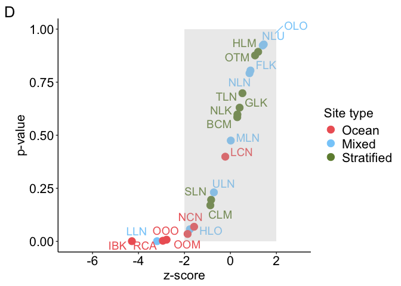
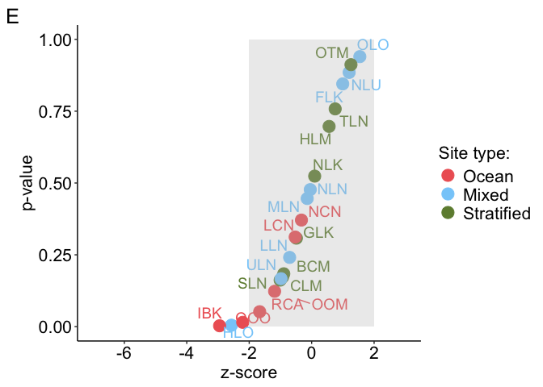
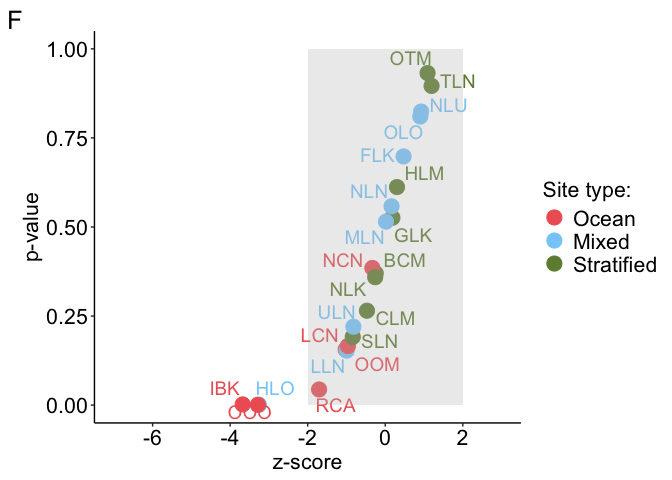
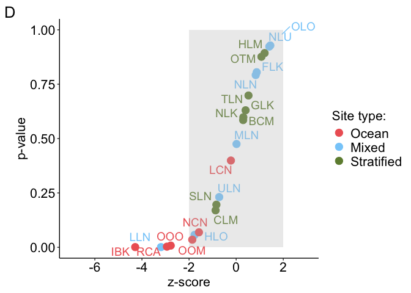
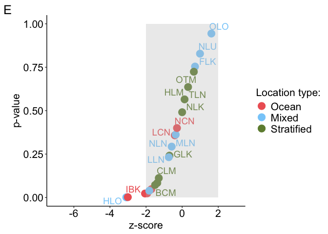

Functional diversity analyses
================

### Load packages and files

``` r
# Load the knitr package if not already loaded
library(knitr)

# Source the R Markdown file
knit("/Users/bailey/Documents/research/fish_biodiversity/src/collection/load_collection_data.Rmd", output = "/Users/bailey/Documents/research/fish_biodiversity/src/collection/load_collection_data.md")
```

    ## 
    ## 
    ## processing file: /Users/bailey/Documents/research/fish_biodiversity/src/collection/load_collection_data.Rmd

    ##   |                  |          |   0%  |                  |          |   3%                                                                          |                  |.         |   7% [Bringing everything together load modifying files packages]             |                  |.         |  10%                                                                          |                  |.         |  13% [Bringing everything together load in modifying files]                   |                  |..        |  17%                                                                          |                  |..        |  20% [Check species names across files]                                       |                  |..        |  23%                                                                          |                  |...       |  27% [Modify environment data]                                                |                  |...       |  30%                                                                          |                  |...       |  33% [Modify incidence matrices]                                              |                  |....      |  37%                                                                          |                  |....      |  40% [Modify phylogeny]                                                       |                  |....      |  43%                                                                          |                  |.....     |  47% [Modify trait data]                                                      |                  |.....     |  50%                                                                          |                  |.....     |  53% [Modify stratification data frames]                                      |                  |......    |  57%                                                                          |                  |......    |  60% [Modify stratification trait data]                                       |                  |......    |  63%                                                                          |                  |.......   |  67% [Stratification trait data tests]                                        |                  |.......   |  70%                                                                          |                  |.......   |  73% [Modify site trait data frames]                                          |                  |........  |  77%                                                                          |                  |........  |  80% [Site trait data tests]                                                  |                  |........  |  83%                                                                          |                  |......... |  87% [unnamed-chunk-7]                                                        |                  |......... |  90%                                                                          |                  |......... |  93% [unnamed-chunk-8]                                                        |                  |..........|  97%                                                                          |                  |..........| 100% [Bringing everything together load out modified files and session info]

    ## output file: /Users/bailey/Documents/research/fish_biodiversity/src/collection/load_collection_data.md

    ## [1] "/Users/bailey/Documents/research/fish_biodiversity/src/collection/load_collection_data.md"

``` r
# Packages
library(picante)
```

    ## Loading required package: vegan

    ## Loading required package: permute

    ## Loading required package: lattice

    ## 
    ## Attaching package: 'vegan'

    ## The following object is masked from 'package:phytools':
    ## 
    ##     scores

    ## Loading required package: nlme

    ## 
    ## Attaching package: 'nlme'

    ## The following object is masked from 'package:dplyr':
    ## 
    ##     collapse

``` r
library(vegan)
library(phytools)
library(ggplot2)
library(viridis)
```

    ## Loading required package: viridisLite

    ## 
    ## Attaching package: 'viridis'

    ## The following object is masked from 'package:maps':
    ## 
    ##     unemp

``` r
library(ggrepel)
library(caret)
```

    ## 
    ## Attaching package: 'caret'

    ## The following object is masked from 'package:vegan':
    ## 
    ##     tolerance

``` r
library(BAT)
```

    ## 
    ## Attaching package: 'BAT'

    ## The following object is masked from 'package:ggplot2':
    ## 
    ##     alpha

    ## The following object is masked from 'package:tidyr':
    ## 
    ##     fill

    ## The following objects are masked from 'package:base':
    ## 
    ##     beta, gamma

``` r
library(pairwiseAdonis)
```

    ## Loading required package: cluster

    ## 
    ## Attaching package: 'cluster'

    ## The following object is masked from 'package:maps':
    ## 
    ##     votes.repub

``` r
# Site vectors
surveyed_sites <- c("BCM", "CLM", "FLK", "GLK", "HLM", "HLO", "IBK", "LCN", "LLN", "MLN", "NCN", "NLK", "NLN", "NLU", "OLO", "OOM", "OOO", "OTM", "RCA", "SLN", "TLN", "ULN")

surveyed_sites_wo_LCN <- c("BCM", "CLM", "FLK", "GLK", "HLM", "HLO", "IBK", "LLN", "MLN", "NCN", "NLK", "NLN", "NLU", "OLO", "OOM", "OOO", "OTM", "RCA", "SLN", "TLN", "ULN")

surveyed_sites_wo_TLN_HLM <- c("BCM", "CLM", "FLK", "GLK", "HLO", "IBK", "LCN", "LLN", "MLN", "NCN", "NLK", "NLN", "NLU", "OLO", "OOM", "OOO", "OTM", "RCA", "SLN", "ULN")

surveyed_sites_env <- c("BCM", "CLM", "FLK", "GLK", "HLM", "HLO", "IBK", "LLN", "MLN", "NCN", "NLK", "NLN", "NLU", "OLO", "OTM", "RCA", "SLN", "TLN", "ULN")

ocean_mixed_sites <- c("IBK", "LCN", "NCN", "OOO", "OOM", "RCA", "FLK", "HLO", "LLN", "MLN", "NLN", "NLU", "OLO", "ULN")

ocean_mixed_sites_env <- c("IBK", "NCN", "RCA", "FLK", "HLO", "LLN", "MLN", "NLN", "NLU", "OLO", "ULN")

ocean_stratified_sites <- c("IBK", "LCN", "NCN", "OOO", "OOM", "RCA", "BCM", "CLM", "GLK", "HLM", "NLK", "OTM", "SLN", "TLN")

ocean_stratified_sites_env <- c("IBK", "NCN", "RCA", "BCM", "CLM", "GLK", "HLM", "NLK", "OTM", "SLN", "TLN")

mixed_stratified_lakes <- c("BCM", "CLM", "FLK", "GLK", "HLM", "HLO", "LLN", "MLN", "NLK", "NLN", "NLU", "OLO", "OTM", "SLN", "TLN", "ULN")

ocean_sites <- c("IBK", "LCN", "NCN", "OOO", "OOM", "RCA")

ocean_sites_env <- c("IBK", "NCN", "RCA")

mixed_lakes <- c("FLK", "HLO", "LLN", "MLN", "NLN", "NLU", "OLO", "ULN")

stratified_lakes <- c("BCM", "CLM", "GLK", "HLM", "NLK", "OTM", "SLN", "TLN")

# Define your custom colors
custom_colors <- c("Reference" = "black", "Ocean" = "#EE6363", "Mixed" = "#87CEFA", "Stratified" = "#6E8B3D")

env_cont <- "#FFB90F"

trait_cont <- "#68228B"

trait_cat <- "#DEB887"
```

### Edit input files

``` r
env <- env[order(env$X),]
presabs_lake <- presabs_lake[order(row.names(presabs_lake)),]
surveyed_sites_lake <- surveyed_sites_lake[order(row.names(surveyed_sites_lake)),]

stratification_group_ref <- env[,19]
stratification_group <- env[surveyed_sites,19]

straits_na <- which(rowSums(is.na(straits)) > 0)
straits_clean <- straits[-straits_na, ]
```

# Functional Diversity

### Identify traits with variation

``` r
## Reference
# Determine which traits have variance
nzv <- nearZeroVar(traits)
nzv
```

    ## integer(0)

``` r
# All traits have variation

traits$presence_sum <- rowSums(presabs_species)  # Sum occurrences across all sites
# Ensure traits_numeric is a data frame
mod <-  lm(presence_sum ~ BodyShapeI + DemersPelag + OperculumPresent + MaxLengthTL + Troph + DepthMin + DepthMax + TempPrefMin + TempPrefMax + FeedingPath + RepGuild2 + ParentalCare + WaterPref + DorsalSpinesMean, traits)
summary(mod)
```

    ## 
    ## Call:
    ## lm(formula = presence_sum ~ BodyShapeI + DemersPelag + OperculumPresent + 
    ##     MaxLengthTL + Troph + DepthMin + DepthMax + TempPrefMin + 
    ##     TempPrefMax + FeedingPath + RepGuild2 + ParentalCare + WaterPref + 
    ##     DorsalSpinesMean, data = traits)
    ## 
    ## Residuals:
    ##     Min      1Q  Median      3Q     Max 
    ## -1.6137 -0.6768 -0.3531  0.0526 12.2027 
    ## 
    ## Coefficients:
    ##                       Estimate Std. Error t value Pr(>|t|)    
    ## (Intercept)          2.6908970  1.6929838   1.589 0.112151    
    ## BodyShapeI2s         0.7134603  0.4509856   1.582 0.113839    
    ## BodyShapeI3f         0.7184052  0.4508056   1.594 0.111214    
    ## BodyShapeI4e         0.6939366  0.4520646   1.535 0.124964    
    ## BodyShapeI5l         0.5260132  0.4721222   1.114 0.265377    
    ## DemersPelag2pn      -0.2705386  0.2737268  -0.988 0.323123    
    ## DemersPelag3p       -0.7505488  1.2534547  -0.599 0.549398    
    ## DemersPelag4po      -0.1211062  0.3705341  -0.327 0.743828    
    ## DemersPelag5d       -0.4626085  0.1364634  -3.390 0.000715 ***
    ## DemersPelag6bp      -0.3574284  0.2538203  -1.408 0.159260    
    ## DemersPelag7bd       0.2451175  1.2234277   0.200 0.841229    
    ## OperculumPresentyes  0.3711498  0.0876401   4.235 2.41e-05 ***
    ## MaxLengthTL         -0.0000217  0.0007159  -0.030 0.975821    
    ## Troph               -0.1086047  0.0817110  -1.329 0.183986    
    ## DepthMin            -0.0036201  0.0034454  -1.051 0.293553    
    ## DepthMax            -0.0000868  0.0003638  -0.239 0.811471    
    ## TempPrefMin          0.0519679  0.0222752   2.333 0.019767 *  
    ## TempPrefMax         -0.0614448  0.0599027  -1.026 0.305161    
    ## FeedingPathp        -0.1307345  0.0925640  -1.412 0.158028    
    ## RepGuild22eb        -0.4328537  0.4713257  -0.918 0.358556    
    ## RepGuild23n         -0.6764647  0.4471733  -1.513 0.130531    
    ## RepGuild24t         -0.6146815  0.4810022  -1.278 0.201456    
    ## RepGuild25h         -0.9890426  1.1956561  -0.827 0.408244    
    ## RepGuild26s         -0.6392609  0.4987003  -1.282 0.200072    
    ## ParentalCare2m      -0.5531592  0.5453568  -1.014 0.310584    
    ## ParentalCare3p      -0.7564641  0.4608894  -1.641 0.100921    
    ## ParentalCare4n      -0.6356969  0.5166541  -1.230 0.218717    
    ## WaterPref2bs         0.2840775  0.1229165   2.311 0.020946 *  
    ## WaterPref3a          0.7526872  0.1862863   4.040 5.58e-05 ***
    ## WaterPref4b          0.0318851  1.2526535   0.025 0.979696    
    ## WaterPref5fb         0.1306558  0.5272456   0.248 0.804313    
    ## WaterPref6f          0.2861852  0.6483562   0.441 0.658980    
    ## DorsalSpinesMean     0.0221649  0.0125085   1.772 0.076579 .  
    ## ---
    ## Signif. codes:  0 '***' 0.001 '**' 0.01 '*' 0.05 '.' 0.1 ' ' 1
    ## 
    ## Residual standard error: 1.528 on 1667 degrees of freedom
    ##   (24 observations deleted due to missingness)
    ## Multiple R-squared:  0.068,  Adjusted R-squared:  0.0501 
    ## F-statistic: 3.801 on 32 and 1667 DF,  p-value: 7.522e-12

``` r
rms::vif(mod)
```

    ##        BodyShapeI2s        BodyShapeI3f        BodyShapeI4e        BodyShapeI5l 
    ##           26.649284           35.090143           30.268831           12.663803 
    ##      DemersPelag2pn       DemersPelag3p      DemersPelag4po       DemersPelag5d 
    ##            1.069413            1.344441            1.162392            1.352421 
    ##      DemersPelag6bp      DemersPelag7bd OperculumPresentyes         MaxLengthTL 
    ##            1.156647            1.280800            1.363029            1.895574 
    ##               Troph            DepthMin            DepthMax         TempPrefMin 
    ##            1.522357            2.620143            1.943623            2.688081 
    ##         TempPrefMax        FeedingPathp        RepGuild22eb         RepGuild23n 
    ##            3.121962            1.369398           12.225085           31.308560 
    ##         RepGuild24t         RepGuild25h         RepGuild26s      ParentalCare2m 
    ##            7.105026            1.223312           44.986852            6.541658 
    ##      ParentalCare3p      ParentalCare4n        WaterPref2bs         WaterPref3a 
    ##           37.780554           48.319826            1.097236            1.267030 
    ##         WaterPref4b        WaterPref5fb         WaterPref6f    DorsalSpinesMean 
    ##            1.342723            1.066029            1.076586            2.088104

``` r
car::vif(mod)
```

    ##                       GVIF Df GVIF^(1/(2*Df))
    ## BodyShapeI        3.411923  4        1.165802
    ## DemersPelag       3.119262  6        1.099439
    ## OperculumPresent  1.363029  1        1.167489
    ## MaxLengthTL       1.895574  1        1.376798
    ## Troph             1.522357  1        1.233838
    ## DepthMin          2.620143  1        1.618686
    ## DepthMax          1.943623  1        1.394139
    ## TempPrefMin       2.688081  1        1.639537
    ## TempPrefMax       3.121962  1        1.766908
    ## FeedingPath       1.369398  1        1.170213
    ## RepGuild2        52.640048  5        1.486386
    ## ParentalCare     37.128063  3        1.826489
    ## WaterPref         2.034620  5        1.073614
    ## DorsalSpinesMean  2.088104  1        1.445027

``` r
# RepGuild1 and RepGuild2 are aliases

# Trait distance calculation
traits_keep <- c("BodyShapeI", "DemersPelag", "OperculumPresent", "MaxLengthTL", "Troph", "DepthMin", "DepthMax", "TempPrefMin", "TempPrefMax", "FeedingPath", "RepGuild2", "ParentalCare", "WaterPref", "DorsalSpinesMean")
# traits_vif <- traits[,traits_keep]
# traits_dist <- gower(traits_vif)
# traits_clust <- hclust(traits_dist,"average")
# traits_tree <- as.phylo(traits_clust)


## Surveyed sites
# Determine which traits have variance
nzv <- nearZeroVar(straits)
nzv
```

    ## [1] 2

``` r
# DemersPelag has no variation

straits$presence_sum <- rowSums(surveyed_sites_species)  # Sum occurrences across all sites
# Ensure straits_numeric is a data frame
mod <-  lm(presence_sum ~ BodyShapeI + OperculumPresent + MaxLengthTL + Troph + DepthMin + DepthMax + TempPrefMin + TempPrefMax + FeedingPath + RepGuild2 + ParentalCare + WaterPref + DorsalSpinesMean, straits)
summary(mod)
```

    ## 
    ## Call:
    ## lm(formula = presence_sum ~ BodyShapeI + OperculumPresent + MaxLengthTL + 
    ##     Troph + DepthMin + DepthMax + TempPrefMin + TempPrefMax + 
    ##     FeedingPath + RepGuild2 + ParentalCare + WaterPref + DorsalSpinesMean, 
    ##     data = straits)
    ## 
    ## Residuals:
    ##     Min      1Q  Median      3Q     Max 
    ## -4.1223 -1.7162 -0.5149  0.9708  9.2324 
    ## 
    ## Coefficients:
    ##                      Estimate Std. Error t value Pr(>|t|)   
    ## (Intercept)          2.747921  26.383107   0.104  0.91714   
    ## BodyShapeI2s         8.865859   4.501084   1.970  0.05011 . 
    ## BodyShapeI3f         9.678157   4.469116   2.166  0.03141 * 
    ## BodyShapeI4e         9.371918   4.451885   2.105  0.03640 * 
    ## BodyShapeI5l         8.718795   4.694057   1.857  0.06457 . 
    ## OperculumPresentyes  0.886427   0.459851   1.928  0.05517 . 
    ## MaxLengthTL         -0.005259   0.006449  -0.815  0.41569   
    ## Troph               -0.488821   0.334417  -1.462  0.14523   
    ## DepthMin            -0.121188   0.046855  -2.586  0.01033 * 
    ## DepthMax             0.013385   0.006337   2.112  0.03578 * 
    ## TempPrefMin          0.458240   0.175164   2.616  0.00950 **
    ## TempPrefMax         -0.401754   0.913469  -0.440  0.66050   
    ## FeedingPathp        -0.388418   0.479110  -0.811  0.41840   
    ## RepGuild22eb        -2.713529   2.782956  -0.975  0.33059   
    ## RepGuild23n         -4.866405   2.613964  -1.862  0.06396 . 
    ## RepGuild24t         -4.396258   2.708204  -1.623  0.10594   
    ## RepGuild26s         -4.769057   2.860485  -1.667  0.09687 . 
    ## ParentalCare2m      -3.516499   2.439742  -1.441  0.15089   
    ## ParentalCare3p      -4.130168   2.006203  -2.059  0.04069 * 
    ## ParentalCare4n      -3.924847   2.239042  -1.753  0.08099 . 
    ## WaterPref2bs         0.390157   0.479530   0.814  0.41673   
    ## WaterPref3a          2.156145   0.782921   2.754  0.00637 **
    ## DorsalSpinesMean     0.079604   0.073033   1.090  0.27690   
    ## ---
    ## Signif. codes:  0 '***' 0.001 '**' 0.01 '*' 0.05 '.' 0.1 ' ' 1
    ## 
    ## Residual standard error: 2.623 on 223 degrees of freedom
    ##   (3 observations deleted due to missingness)
    ## Multiple R-squared:  0.2132, Adjusted R-squared:  0.1355 
    ## F-statistic: 2.746 on 22 and 223 DF,  p-value: 9.16e-05

``` r
rms::vif(mod)
```

    ##        BodyShapeI2s        BodyShapeI3f        BodyShapeI4e        BodyShapeI5l 
    ##          159.945958          172.783698          130.653845            9.488429 
    ## OperculumPresentyes         MaxLengthTL               Troph            DepthMin 
    ##            1.777374            2.525748            1.714540            1.583170 
    ##            DepthMax         TempPrefMin         TempPrefMax        FeedingPathp 
    ##            3.586064            2.123964            2.447730            1.460756 
    ##        RepGuild22eb         RepGuild23n         RepGuild24t         RepGuild26s 
    ##           15.852072           52.522651           10.224568           71.557916 
    ##      ParentalCare2m      ParentalCare3p      ParentalCare4n        WaterPref2bs 
    ##            5.063143           34.361958           43.843286            1.141666 
    ##         WaterPref3a    DorsalSpinesMean 
    ##            1.332457            2.175458

``` r
car::vif(mod)
```

    ##                       GVIF Df GVIF^(1/(2*Df))
    ## BodyShapeI        8.454690  4        1.305832
    ## OperculumPresent  1.777374  1        1.333182
    ## MaxLengthTL       2.525748  1        1.589260
    ## Troph             1.714540  1        1.309405
    ## DepthMin          1.583170  1        1.258241
    ## DepthMax          3.586064  1        1.893690
    ## TempPrefMin       2.123964  1        1.457383
    ## TempPrefMax       2.447730  1        1.564522
    ## FeedingPath       1.460756  1        1.208617
    ## RepGuild2        46.456285  4        1.615774
    ## ParentalCare     29.516419  3        1.757967
    ## WaterPref         1.465432  2        1.100250
    ## DorsalSpinesMean  2.175458  1        1.474943

``` r
# RepGuild1 and RepGuild2 are aliases

# Trait distance calculation
straits_keep <- c("BodyShapeI", "OperculumPresent", "MaxLengthTL", "Troph", "DepthMin", "DepthMax", "TempPrefMin", "TempPrefMax", "FeedingPath", "RepGuild2", "ParentalCare", "WaterPref", "DorsalSpinesMean")
straits_vif <- straits[,straits_keep]
straits_dist <- gower(straits_vif)
straits_clust <- hclust(straits_dist,"average")
straits_tree <- as.phylo(straits_clust)
```

## FD alpha Diversity

### FD alpha mntd, mpd, and pd calculations of traits and files to be saved

``` r
## Reference
# Dispersion
traits_disp <- dispersion(comm = presabs_lake, distance = traits_dist, abund = F)
write.csv(traits_disp, "/Users/bailey/Documents/research/fish_biodiversity/data/analyses/FD/traits_disp.csv")

#Mean pairwise distances
traits_sesmpd <- ses.mpd(presabs_lake, traits_dist, null.model = "taxa.labels", abundance.weighted = FALSE, runs = 999, iterations = 1000)
write.csv(traits_sesmpd, "/Users/bailey/Documents/research/fish_biodiversity/data/analyses/FD/traits_sesmpd.csv")

#Mean nearest taxon distances
traits_sesmntd <- ses.mntd(presabs_lake, traits_dist, null.model = "taxa.labels", abundance.weighted = FALSE, runs = 999, iterations = 1000)
write.csv(traits_sesmntd, "/Users/bailey/Documents/research/fish_biodiversity/data/analyses/FD/traits_sesmntd.csv")

#Faith's PD
traits_sespd <- ses.pd(presabs_lake, traits_tree, null.model = "taxa.labels", runs = 999, iterations = 1000, include.root = TRUE)
write.csv(traits_sespd, "/Users/bailey/Documents/research/fish_biodiversity/data/analyses/FD/traits_sespd.csv")


## Surveyed sites
# Dispersion
straits_disp <- dispersion(comm = surveyed_sites_lake, distance = straits_dist, abund = F)
write.csv(straits_disp, "/Users/bailey/Documents/research/fish_biodiversity/data/analyses/FD/straits_disp.csv")

#Mean pairwise distances
straits_sesmpd <- ses.mpd(surveyed_sites_lake, straits_dist, null.model = "taxa.labels", abundance.weighted = FALSE, runs = 999, iterations = 1000)
write.csv(straits_sesmpd, "/Users/bailey/Documents/research/fish_biodiversity/data/analyses/FD/straits_sesmpd.csv")

#Mean nearest taxon distances
straits_sesmntd <- ses.mntd(surveyed_sites_lake, straits_dist, null.model = "taxa.labels", abundance.weighted = FALSE, runs = 999, iterations = 1000)
write.csv(straits_sesmntd, "/Users/bailey/Documents/research/fish_biodiversity/data/analyses/FD/straits_sesmntd.csv")

#Faith's PD
straits_sespd <- ses.pd(surveyed_sites_lake, straits_tree, null.model = "taxa.labels", runs = 999, iterations = 1000, include.root = TRUE)
write.csv(straits_sespd, "/Users/bailey/Documents/research/fish_biodiversity/data/analyses/FD/straits_sespd.csv")
```

### FD alpha files mntd, mpd, and pd to read into R

- Read in Functional Diversity files and combine with env data

``` r
## Reference
# Dispersion 
traits_disp <-read.csv("/Users/bailey/Documents/research/fish_biodiversity/data/analyses/FD/traits_disp.csv")
traits_disp_env <- merge(traits_disp, env, by = "X", sort = F)
traits_disp_env$measure <- "traits_disp"
traits_disp_env$Stratification <- factor(traits_disp_env$Stratification, levels = c("Reference", "Ocean", "Mixed", "Stratified"))
row.names(traits_disp_env) <- traits_disp_env$X

# Mean pairwise distances
traits_sesmpd <- read.csv("/Users/bailey/Documents/research/fish_biodiversity/data/analyses/FD/traits_sesmpd.csv")
traits_sesmpd_env <- merge(traits_sesmpd, env, by = "X", sort = F)
traits_sesmpd_env$measure <- "traits_sesmpd"
traits_sesmpd_env$Stratification <- factor(traits_sesmpd_env$Stratification, levels = c("Reference", "Ocean", "Mixed", "Stratified"))
row.names(traits_sesmpd_env) <- traits_sesmpd_env$X

# Mean nearest taxon distances
traits_sesmntd <- read.csv("/Users/bailey/Documents/research/fish_biodiversity/data/analyses/FD/traits_sesmntd.csv")
traits_sesmntd_env <- merge(traits_sesmntd, env, by = "X", sort = F)
traits_sesmntd_env$measure <- "traits_sesmntd"
traits_sesmntd_env$Stratification <- factor(traits_sesmntd_env$Stratification, levels = c("Reference", "Ocean", "Mixed", "Stratified"))
row.names(traits_sesmntd_env) <- traits_sesmntd_env$X

#Faith's PD
traits_sespd <- read.csv("/Users/bailey/Documents/research/fish_biodiversity/data/analyses/FD/traits_sespd.csv")
traits_sespd_env <- merge(traits_sespd, env, by = "X", sort = F)
traits_sespd_env$measure <- "traits_sespd"
traits_sespd_env$Stratification <- factor(traits_sespd_env$Stratification, levels = c("Reference", "Ocean", "Mixed", "Stratified"))
straits_sespd_env <- merge(traits_sespd_env, traits_disp, by = "X", sort = F)
row.names(traits_sespd_env) <- traits_sespd_env$X


## Surveyed sites
# Dispersion 
straits_disp <-read.csv("/Users/bailey/Documents/research/fish_biodiversity/data/analyses/FD/straits_disp.csv")
straits_disp_env <- merge(straits_disp, env, by = "X", sort = F)
straits_disp_env$measure <- "straits_disp"
straits_disp_env$Stratification <- factor(straits_disp_env$Stratification, levels = c("Ocean", "Mixed", "Stratified"))
row.names(straits_disp_env) <- straits_disp_env$X

# Mean pairwise distances
straits_sesmpd <- read.csv("/Users/bailey/Documents/research/fish_biodiversity/data/analyses/FD/straits_sesmpd.csv")
straits_sesmpd_env <- merge(straits_sesmpd, env, by = "X", sort = F)
straits_sesmpd_env$measure <- "straits_sesmpd"
straits_sesmpd_env$Stratification <- factor(straits_sesmpd_env$Stratification, levels = c("Ocean", "Mixed", "Stratified"))
row.names(straits_sesmpd_env) <- straits_sesmpd_env$X

# Mean nearest taxon distances
straits_sesmntd <- read.csv("/Users/bailey/Documents/research/fish_biodiversity/data/analyses/FD/straits_sesmntd.csv")
straits_sesmntd_env <- merge(straits_sesmntd, env, by = "X", sort = F)
straits_sesmntd_env$measure <- "straits_sesmntd"
straits_sesmntd_env$Stratification <- factor(straits_sesmntd_env$Stratification, levels = c("Ocean", "Mixed", "Stratified"))
row.names(straits_sesmntd_env) <- straits_sesmntd_env$X

#Faith's PD
straits_sespd <-read.csv("/Users/bailey/Documents/research/fish_biodiversity/data/analyses/FD/straits_sespd.csv")
straits_sespd_env <- merge(straits_sespd, env, by = "X", sort = F)
straits_sespd_env$measure <- "straits_sespd"
straits_sespd_env$Stratification <- factor(straits_sespd_env$Stratification, levels = c("Ocean", "Mixed", "Stratified"))
straits_sespd_env <- merge(straits_sespd_env, straits_disp, by = "X", sort = F)
row.names(straits_sespd_env) <- straits_sespd_env$X
```

### FD alpha outliers for each stratification type based on z-scores

``` r
outlier_FD_alpha <- straits_sespd_env %>%
  group_by(Stratification) %>%
  mutate(
    Q1 = quantile(pd.obs.z, 0.25),
    Q3 = quantile(pd.obs.z, 0.75),
    IQR = Q3 - Q1,
    lower_bound = Q1 - 1.5 * IQR,
    upper_bound = Q3 + 1.5 * IQR,
    is_outlier = pd.obs.z < lower_bound | pd.obs.z > upper_bound
  )

outlier_FD_alpha <- as.data.frame(outlier_FD_alpha)
row.names(outlier_FD_alpha) <- outlier_FD_alpha$X

# Create the plot
(outlier_FD_alpha_plot <- ggplot(outlier_FD_alpha, aes(x = Stratification, y = pd.obs.z, fill = Stratification)) +
  geom_violin(trim = FALSE) +
  geom_jitter(aes(color = is_outlier), width = 0.2, size = 4, alpha = 0.7) +
  scale_color_manual(values = c("FALSE" = "black", "TRUE" = "purple")) +
  scale_fill_manual(values = custom_colors) +
  theme(text = element_text(size = 16),
        legend.position = "right",
        legend.title = element_text(size = 16),
        legend.text = element_text(size = 16),
        axis.line = element_line(color = "black"),
        panel.background = element_rect(fill='transparent'),
        plot.background = element_rect(fill='transparent', color=NA),
        panel.grid.major = element_blank(),
        panel.grid.minor = element_blank(),
        panel.border = element_blank(),
        axis.text = element_text(color = "black", size = 16)) +
  scale_y_continuous(expand = c(0,0)) +
  labs(y = "FD Alpha z-scores", x = "Site type", color = "Outlier", fill = "Site type", tag = "c")) +
  guides(fill = "none")
```

<!-- -->

``` r
ggsave("/Users/bailey/Documents/research/fish_biodiversity/figures/FD/outlier_FD_alpha.jpg", outlier_FD_alpha_plot, width = 6.26, height = 6, units = "in")
```

### Identify VIF of env and geo variables

``` r
# Determine which env variables have variance
environment <- c("temperature_median", "salinity_median", "oxygen_median", "pH_median")
nzv <- nearZeroVar(env[,environment])
nzv
```

    ## integer(0)

``` r
# All env variables have variance

mod <-  lm(pd.obs ~ temperature_median + salinity_median + oxygen_median + pH_median, straits_sespd_env)
summary(mod)
```

    ## 
    ## Call:
    ## lm(formula = pd.obs ~ temperature_median + salinity_median + 
    ##     oxygen_median + pH_median, data = straits_sespd_env)
    ## 
    ## Residuals:
    ##      Min       1Q   Median       3Q      Max 
    ## -1.83746 -0.61357 -0.05812  0.58753  1.75741 
    ## 
    ## Coefficients:
    ##                     Estimate Std. Error t value Pr(>|t|)   
    ## (Intercept)        -43.09612   13.56172  -3.178  0.00671 **
    ## temperature_median  -0.41881    0.26022  -1.609  0.12983   
    ## salinity_median      0.08583    0.13253   0.648  0.52774   
    ## oxygen_median        0.23667    0.35888   0.659  0.52030   
    ## pH_median            7.27367    2.34591   3.101  0.00782 **
    ## ---
    ## Signif. codes:  0 '***' 0.001 '**' 0.01 '*' 0.05 '.' 0.1 ' ' 1
    ## 
    ## Residual standard error: 1.094 on 14 degrees of freedom
    ##   (3 observations deleted due to missingness)
    ## Multiple R-squared:  0.8514, Adjusted R-squared:  0.8089 
    ## F-statistic: 20.05 on 4 and 14 DF,  p-value: 1.115e-05

``` r
anova(mod)
```

    ## Analysis of Variance Table
    ## 
    ## Response: pd.obs
    ##                    Df Sum Sq Mean Sq F value    Pr(>F)    
    ## temperature_median  1 12.200  12.200 10.1988  0.006503 ** 
    ## salinity_median     1 56.724  56.724 47.4193 7.488e-06 ***
    ## oxygen_median       1 15.504  15.504 12.9606  0.002898 ** 
    ## pH_median           1 11.500  11.500  9.6136  0.007823 ** 
    ## Residuals          14 16.747   1.196                      
    ## ---
    ## Signif. codes:  0 '***' 0.001 '**' 0.01 '*' 0.05 '.' 0.1 ' ' 1

``` r
rms::vif(mod)
```

    ## temperature_median    salinity_median      oxygen_median          pH_median 
    ##           1.385456           3.435415           2.209454           4.821892

``` r
car::vif(mod)
```

    ## temperature_median    salinity_median      oxygen_median          pH_median 
    ##           1.385456           3.435415           2.209454           4.821892

``` r
mod <-  lm(pd.obs ~ temperature_median + salinity_median + oxygen_median, straits_sespd_env)
summary(mod)
```

    ## 
    ## Call:
    ## lm(formula = pd.obs ~ temperature_median + salinity_median + 
    ##     oxygen_median, data = straits_sespd_env)
    ## 
    ## Residuals:
    ##     Min      1Q  Median      3Q     Max 
    ## -1.9810 -0.7654 -0.4725  0.5645  3.1780 
    ## 
    ## Coefficients:
    ##                     Estimate Std. Error t value Pr(>|t|)   
    ## (Intercept)        -10.17836   10.58758  -0.961   0.3516   
    ## temperature_median  -0.08517    0.29727  -0.287   0.7784   
    ## salinity_median      0.40409    0.10519   3.841   0.0016 **
    ## oxygen_median        0.97086    0.33836   2.869   0.0117 * 
    ## ---
    ## Signif. codes:  0 '***' 0.001 '**' 0.01 '*' 0.05 '.' 0.1 ' ' 1
    ## 
    ## Residual standard error: 1.372 on 15 degrees of freedom
    ##   (3 observations deleted due to missingness)
    ## Multiple R-squared:  0.7493, Adjusted R-squared:  0.6992 
    ## F-statistic: 14.94 on 3 and 15 DF,  p-value: 8.913e-05

``` r
rms::vif(mod)
```

    ## temperature_median    salinity_median      oxygen_median 
    ##           1.148556           1.374749           1.247588

``` r
car::vif(mod)
```

    ## temperature_median    salinity_median      oxygen_median 
    ##           1.148556           1.374749           1.247588

``` r
environment <- c("temperature_median", "salinity_median", "oxygen_median")

# Determine which geo variables have variance
geography <- c("volume_m3_w_chemocline", "volume_m3", "surface_area_m2", "distance_to_ocean_min_m", "distance_to_ocean_mean_m", "distance_to_ocean_median_m", "tidal_lag_time_minutes", "tidal_efficiency", "perimeter_fromSat", "max_depth", "logArea")
nzv <- nearZeroVar(env[,geography])
nzv
```

    ## integer(0)

``` r
# All geo variables have variance

mod <-  lm(pd.obs ~ volume_m3_w_chemocline + volume_m3 + surface_area_m2 + distance_to_ocean_min_m + distance_to_ocean_mean_m + distance_to_ocean_median_m + tidal_lag_time_minutes + tidal_efficiency + perimeter_fromSat + max_depth + logArea, straits_sespd_env)
summary(mod)
```

    ## 
    ## Call:
    ## lm(formula = pd.obs ~ volume_m3_w_chemocline + volume_m3 + surface_area_m2 + 
    ##     distance_to_ocean_min_m + distance_to_ocean_mean_m + distance_to_ocean_median_m + 
    ##     tidal_lag_time_minutes + tidal_efficiency + perimeter_fromSat + 
    ##     max_depth + logArea, data = straits_sespd_env)
    ## 
    ## Residuals:
    ##      Min       1Q   Median       3Q      Max 
    ## -2.31770 -0.79585  0.08146  0.80992  2.25461 
    ## 
    ## Coefficients:
    ##                              Estimate Std. Error t value Pr(>|t|)
    ## (Intercept)                -7.002e+00  1.093e+01  -0.641    0.538
    ## volume_m3_w_chemocline      3.602e-06  3.994e-06   0.902    0.391
    ## volume_m3                  -3.063e-06  4.137e-06  -0.740    0.478
    ## surface_area_m2            -7.011e-06  3.981e-06  -1.761    0.112
    ## distance_to_ocean_min_m    -7.433e-03  2.183e-02  -0.340    0.741
    ## distance_to_ocean_mean_m    3.557e-02  9.273e-02   0.384    0.710
    ## distance_to_ocean_median_m -3.767e-02  8.523e-02  -0.442    0.669
    ## tidal_lag_time_minutes     -1.020e-02  2.559e-02  -0.399    0.699
    ## tidal_efficiency           -1.327e-01  6.817e+00  -0.019    0.985
    ## perimeter_fromSat          -1.336e-03  1.685e-03  -0.793    0.448
    ## max_depth                  -5.807e-02  1.123e-01  -0.517    0.618
    ## logArea                     1.527e+00  1.091e+00   1.400    0.195
    ## 
    ## Residual standard error: 1.815 on 9 degrees of freedom
    ##   (1 observation deleted due to missingness)
    ## Multiple R-squared:  0.6945, Adjusted R-squared:  0.3212 
    ## F-statistic:  1.86 on 11 and 9 DF,  p-value: 0.1802

``` r
rms::vif(mod)
```

    ##     volume_m3_w_chemocline                  volume_m3 
    ##                 6433.74411                 6855.30224 
    ##            surface_area_m2    distance_to_ocean_min_m 
    ##                   22.87840                   18.42491 
    ##   distance_to_ocean_mean_m distance_to_ocean_median_m 
    ##                  825.68615                  687.45478 
    ##     tidal_lag_time_minutes           tidal_efficiency 
    ##                   21.17746                   27.90908 
    ##          perimeter_fromSat                  max_depth 
    ##                   94.39757                   10.74366 
    ##                    logArea 
    ##                   25.70304

``` r
car::vif(mod)
```

    ##     volume_m3_w_chemocline                  volume_m3 
    ##                 6433.74411                 6855.30224 
    ##            surface_area_m2    distance_to_ocean_min_m 
    ##                   22.87840                   18.42491 
    ##   distance_to_ocean_mean_m distance_to_ocean_median_m 
    ##                  825.68615                  687.45478 
    ##     tidal_lag_time_minutes           tidal_efficiency 
    ##                   21.17746                   27.90908 
    ##          perimeter_fromSat                  max_depth 
    ##                   94.39757                   10.74366 
    ##                    logArea 
    ##                   25.70304

``` r
mod <-  lm(pd.obs ~ distance_to_ocean_min_m + max_depth + logArea, straits_sespd_env)
summary(mod)
```

    ## 
    ## Call:
    ## lm(formula = pd.obs ~ distance_to_ocean_min_m + max_depth + logArea, 
    ##     data = straits_sespd_env)
    ## 
    ## Residuals:
    ##     Min      1Q  Median      3Q     Max 
    ## -3.3790 -0.8852 -0.0909  0.8312  5.0222 
    ## 
    ## Coefficients:
    ##                          Estimate Std. Error t value Pr(>|t|)   
    ## (Intercept)              3.613318   2.826549   1.278   0.2174   
    ## distance_to_ocean_min_m -0.018558   0.006373  -2.912   0.0093 **
    ## max_depth                0.000272   0.046853   0.006   0.9954   
    ## logArea                  0.154562   0.280858   0.550   0.5889   
    ## ---
    ## Signif. codes:  0 '***' 0.001 '**' 0.01 '*' 0.05 '.' 0.1 ' ' 1
    ## 
    ## Residual standard error: 2.029 on 18 degrees of freedom
    ## Multiple R-squared:  0.3957, Adjusted R-squared:  0.295 
    ## F-statistic: 3.929 on 3 and 18 DF,  p-value: 0.02553

``` r
rms::vif(mod)
```

    ## distance_to_ocean_min_m               max_depth                 logArea 
    ##                1.258244                1.497112                1.392300

``` r
car::vif(mod)
```

    ## distance_to_ocean_min_m               max_depth                 logArea 
    ##                1.258244                1.497112                1.392300

``` r
geography <- c("distance_to_ocean_min_m", "max_depth", "logArea")
```

### FD alpha FRic and z-score & stratification

``` r
### Stratification
# Run ANOVA on the original data
anova_FRic_result <- aov(pd.obs ~ Stratification, data = straits_sespd_env[surveyed_sites,])
summary(anova_FRic_result)
```

    ##                Df Sum Sq Mean Sq F value   Pr(>F)    
    ## Stratification  2  74.23   37.12   14.56 0.000147 ***
    ## Residuals      19  48.44    2.55                     
    ## ---
    ## Signif. codes:  0 '***' 0.001 '**' 0.01 '*' 0.05 '.' 0.1 ' ' 1

``` r
# Perform Tukey's HSD test
tukey_FRic_result <- TukeyHSD(anova_FRic_result)
print(tukey_FRic_result)
```

    ##   Tukey multiple comparisons of means
    ##     95% family-wise confidence level
    ## 
    ## Fit: aov(formula = pd.obs ~ Stratification, data = straits_sespd_env[surveyed_sites, ])
    ## 
    ## $Stratification
    ##                        diff       lwr       upr     p adj
    ## Mixed-Ocean       0.4304859 -1.760127  2.621099 0.8725386
    ## Stratified-Ocean -3.5561361 -5.746749 -1.365523 0.0015963
    ## Stratified-Mixed -3.9866221 -6.014735 -1.958509 0.0002278

``` r
# Sites
N <- length(anova_FRic_result$residuals)
# Categories
k <- length(anova_FRic_result$coefficients)
# Sum of squares
SS <- sum(resid(anova_FRic_result)^2) # from anova, the residual SS
# Mean squares
MS <- SS/(N-k)
# Balanced
BSE <- sqrt(MS / 8)
# Unbalanced
USE <- sqrt((MS/2)*((1/6)+(1/8)))

# Get differences
Stratification <- tukey_FRic_result$Stratification

# q-values
(OM_q <- (abs(Stratification[1,1]))/USE)
```

    ## [1] 0.7060233

``` r
(MS_q <- (abs(Stratification[3,1]))/BSE)
```

    ## [1] 7.062175

``` r
(SO_q <- (abs(Stratification[2,1]))/USE)
```

    ## [1] 5.832281

``` r
# Check values here https://www.socscistatistics.com/pvalues/qdistribution.aspx

# Run ANOVA on the original data
anova_zscore_result <- aov(pd.obs.z ~ Stratification, data = straits_sespd_env[surveyed_sites,])
summary(anova_zscore_result)
```

    ##                Df Sum Sq Mean Sq F value Pr(>F)  
    ## Stratification  2  13.83   6.915   5.008 0.0179 *
    ## Residuals      19  26.24   1.381                 
    ## ---
    ## Signif. codes:  0 '***' 0.001 '**' 0.01 '*' 0.05 '.' 0.1 ' ' 1

``` r
# Perform Tukey's HSD test
tukey_zscore_result <- TukeyHSD(anova_zscore_result)
print(tukey_zscore_result)
```

    ##   Tukey multiple comparisons of means
    ##     95% family-wise confidence level
    ## 
    ## Fit: aov(formula = pd.obs.z ~ Stratification, data = straits_sespd_env[surveyed_sites, ])
    ## 
    ## $Stratification
    ##                       diff        lwr      upr     p adj
    ## Mixed-Ocean      1.5069087 -0.1053032 3.119121 0.0694252
    ## Stratified-Ocean 1.9506386  0.3384267 3.562851 0.0164204
    ## Stratified-Mixed 0.4437299 -1.0488884 1.936348 0.7341934

``` r
# Sites
N <- length(anova_zscore_result$residuals)
# Categories
k <- length(anova_zscore_result$coefficients)
# Sum of squares
SS <- sum(resid(anova_zscore_result)^2) # from anova, the residual SS
# Mean squares
MS <- SS/(N-k)
# Balanced
BSE <- sqrt(MS / 8)
# Unbalanced
USE <- sqrt((MS/2)*((1/6)+(1/8)))

# Get differences
Stratification <- tukey_zscore_result$Stratification

# q-values
(OM_q <- (abs(Stratification[1,1]))/USE)
```

    ## [1] 3.358076

``` r
(MS_q <- (abs(Stratification[3,1]))/BSE)
```

    ## [1] 1.06806

``` r
(SO_q <- (abs(Stratification[2,1]))/USE)
```

    ## [1] 4.346907

``` r
# Check values here https://www.socscistatistics.com/pvalues/qdistribution.aspx

# Run ANOVA on the original data
anova_FDisp_result <- aov(Dispersion ~ Stratification, data = straits_sespd_env[surveyed_sites,])
summary(anova_FDisp_result)
```

    ##                Df  Sum Sq  Mean Sq F value Pr(>F)
    ## Stratification  2 0.00826 0.004132   2.121  0.147
    ## Residuals      19 0.03701 0.001948

``` r
# Perform Tukey's HSD test
tukey_FDisp_result <- TukeyHSD(anova_FDisp_result)
print(tukey_FDisp_result)
```

    ##   Tukey multiple comparisons of means
    ##     95% family-wise confidence level
    ## 
    ## Fit: aov(formula = Dispersion ~ Stratification, data = straits_sespd_env[surveyed_sites, ])
    ## 
    ## $Stratification
    ##                         diff         lwr        upr     p adj
    ## Mixed-Ocean      0.041543913 -0.01901261 0.10210044 0.2156444
    ## Stratified-Ocean 0.045209326 -0.01534720 0.10576585 0.1669220
    ## Stratified-Mixed 0.003665412 -0.05239903 0.05972986 0.9849189

``` r
# Sites
N <- length(anova_FDisp_result$residuals)
# Categories
k <- length(anova_FDisp_result$coefficients)
# Sum of squares
SS <- sum(resid(anova_FDisp_result)^2) # from anova, the residual SS
# Mean squares
MS <- SS/(N-k)
# Balanced
BSE <- sqrt(MS / 8)
# Unbalanced
USE <- sqrt((MS/2)*((1/6)+(1/8)))

# Get differences
Stratification <- tukey_FDisp_result$Stratification

# q-values
(OM_q <- (abs(Stratification[1,1]))/USE)
```

    ## [1] 2.464746

``` r
(MS_q <- (abs(Stratification[3,1]))/BSE)
```

    ## [1] 0.2348881

``` r
(SO_q <- (abs(Stratification[2,1]))/USE)
```

    ## [1] 2.68221

``` r
# Check values here https://www.socscistatistics.com/pvalues/qdistribution.aspx
```

### FD alpha FRic and z-score & env and geo linear models

``` r
### Environmental
# Surveyed sites
FD_FRic_env_am <- aov(log(pd.obs) ~ (distance_to_ocean_min_m + max_depth + logArea) * Stratification, data = straits_sespd_env[surveyed_sites_env,])
summary(FD_FRic_env_am)
```

    ##                                        Df Sum Sq Mean Sq F value   Pr(>F)    
    ## distance_to_ocean_min_m                 1  9.035   9.035  45.962 0.000141 ***
    ## max_depth                               1  0.044   0.044   0.223 0.649166    
    ## logArea                                 1  1.067   1.067   5.430 0.048145 *  
    ## Stratification                          2  2.393   1.197   6.087 0.024727 *  
    ## distance_to_ocean_min_m:Stratification  2  0.085   0.043   0.216 0.809965    
    ## max_depth:Stratification                2  0.269   0.134   0.684 0.532023    
    ## logArea:Stratification                  1  0.009   0.009   0.043 0.840053    
    ## Residuals                               8  1.573   0.197                     
    ## ---
    ## Signif. codes:  0 '***' 0.001 '**' 0.01 '*' 0.05 '.' 0.1 ' ' 1

``` r
p_values <- summary(FD_FRic_env_am)$coefficients[, "Pr(>|t|)"]
(adjusted_p_values <- p.adjust(p_values, method = "bonferroni"))
```

    ## numeric(0)

``` r
FD_FRic_env_lm <- lm(log(pd.obs) ~ temperature_median + salinity_median + oxygen_median, straits_sespd_env[surveyed_sites_env,])
summary(FD_FRic_env_lm)
```

    ## 
    ## Call:
    ## lm(formula = log(pd.obs) ~ temperature_median + salinity_median + 
    ##     oxygen_median, data = straits_sespd_env[surveyed_sites_env, 
    ##     ])
    ## 
    ## Residuals:
    ##      Min       1Q   Median       3Q      Max 
    ## -0.48992 -0.20898 -0.08067  0.19720  0.62075 
    ## 
    ## Coefficients:
    ##                    Estimate Std. Error t value Pr(>|t|)    
    ## (Intercept)        -6.80907    2.72265  -2.501   0.0245 *  
    ## temperature_median  0.02561    0.07645   0.335   0.7422    
    ## salinity_median     0.19697    0.02705   7.282 2.69e-06 ***
    ## oxygen_median       0.22849    0.08701   2.626   0.0191 *  
    ## ---
    ## Signif. codes:  0 '***' 0.001 '**' 0.01 '*' 0.05 '.' 0.1 ' ' 1
    ## 
    ## Residual standard error: 0.3529 on 15 degrees of freedom
    ## Multiple R-squared:  0.871,  Adjusted R-squared:  0.8451 
    ## F-statistic: 33.75 on 3 and 15 DF,  p-value: 6.534e-07

``` r
p_values <- summary(FD_FRic_env_lm)$coefficients[, "Pr(>|t|)"]
(adjusted_p_values <- p.adjust(p_values, method = "bonferroni"))
```

    ##        (Intercept) temperature_median    salinity_median      oxygen_median 
    ##       9.784935e-02       1.000000e+00       1.075788e-05       7.634042e-02

``` r
FD_z_env_am <- aov(pd.obs.z ~ (distance_to_ocean_min_m + max_depth + logArea) * Stratification, data = straits_sespd_env[surveyed_sites_env,])
summary(FD_z_env_am)
```

    ##                                        Df Sum Sq Mean Sq F value Pr(>F)  
    ## distance_to_ocean_min_m                 1  2.185   2.185   2.347  0.164  
    ## max_depth                               1  4.844   4.844   5.203  0.052 .
    ## logArea                                 1  2.970   2.970   3.190  0.112  
    ## Stratification                          2  5.482   2.741   2.944  0.110  
    ## distance_to_ocean_min_m:Stratification  2  5.020   2.510   2.696  0.127  
    ## max_depth:Stratification                2  3.211   1.605   1.724  0.238  
    ## logArea:Stratification                  1  0.539   0.539   0.579  0.469  
    ## Residuals                               8  7.448   0.931                 
    ## ---
    ## Signif. codes:  0 '***' 0.001 '**' 0.01 '*' 0.05 '.' 0.1 ' ' 1

``` r
p_values <- summary(FD_z_env_am)$coefficients[, "Pr(>|t|)"]
(adjusted_p_values <- p.adjust(p_values, method = "bonferroni"))
```

    ## numeric(0)

``` r
FD_z_env_lm <- lm(pd.obs.z ~ temperature_median + salinity_median + oxygen_median, straits_sespd_env[surveyed_sites_env,])
summary(FD_z_env_lm)
```

    ## 
    ## Call:
    ## lm(formula = pd.obs.z ~ temperature_median + salinity_median + 
    ##     oxygen_median, data = straits_sespd_env[surveyed_sites_env, 
    ##     ])
    ## 
    ## Residuals:
    ##      Min       1Q   Median       3Q      Max 
    ## -2.02966 -0.53671  0.08826  0.75370  1.72496 
    ## 
    ## Coefficients:
    ##                    Estimate Std. Error t value Pr(>|t|)   
    ## (Intercept)         3.94937    8.30340   0.476  0.64119   
    ## temperature_median -0.06142    0.23314  -0.263  0.79580   
    ## salinity_median     0.04187    0.08250   0.508  0.61913   
    ## oxygen_median      -0.89602    0.26536  -3.377  0.00415 **
    ## ---
    ## Signif. codes:  0 '***' 0.001 '**' 0.01 '*' 0.05 '.' 0.1 ' ' 1
    ## 
    ## Residual standard error: 1.076 on 15 degrees of freedom
    ## Multiple R-squared:  0.4519, Adjusted R-squared:  0.3423 
    ## F-statistic: 4.123 on 3 and 15 DF,  p-value: 0.02559

``` r
p_values <- summary(FD_z_env_lm)$coefficients[, "Pr(>|t|)"]
(adjusted_p_values <- p.adjust(p_values, method = "bonferroni"))
```

    ##        (Intercept) temperature_median    salinity_median      oxygen_median 
    ##         1.00000000         1.00000000         1.00000000         0.01661029

``` r
FD_FDisp_env_am <- aov(Dispersion ~ (distance_to_ocean_min_m + max_depth + logArea) * Stratification, data = straits_sespd_env[surveyed_sites_env,])
summary(FD_FDisp_env_am)
```

    ##                                        Df   Sum Sq  Mean Sq F value Pr(>F)  
    ## distance_to_ocean_min_m                 1 0.000176 0.000176   0.149 0.7097  
    ## max_depth                               1 0.000156 0.000156   0.131 0.7265  
    ## logArea                                 1 0.001139 0.001139   0.960 0.3558  
    ## Stratification                          2 0.011209 0.005605   4.727 0.0441 *
    ## distance_to_ocean_min_m:Stratification  2 0.005885 0.002943   2.482 0.1450  
    ## max_depth:Stratification                2 0.007649 0.003824   3.226 0.0939 .
    ## logArea:Stratification                  1 0.004651 0.004651   3.923 0.0830 .
    ## Residuals                               8 0.009485 0.001186                 
    ## ---
    ## Signif. codes:  0 '***' 0.001 '**' 0.01 '*' 0.05 '.' 0.1 ' ' 1

``` r
p_values <- summary(FD_FDisp_env_am)$coefficients[, "Pr(>|t|)"]
(adjusted_p_values <- p.adjust(p_values, method = "bonferroni"))
```

    ## numeric(0)

``` r
FD_FDisp_env_lm <- lm(Dispersion ~ temperature_median + salinity_median + oxygen_median, straits_sespd_env[surveyed_sites_env,])
summary(FD_FDisp_env_lm)
```

    ## 
    ## Call:
    ## lm(formula = Dispersion ~ temperature_median + salinity_median + 
    ##     oxygen_median, data = straits_sespd_env[surveyed_sites_env, 
    ##     ])
    ## 
    ## Residuals:
    ##       Min        1Q    Median        3Q       Max 
    ## -0.061471 -0.021648 -0.006695  0.023161  0.077291 
    ## 
    ## Coefficients:
    ##                     Estimate Std. Error t value Pr(>|t|)  
    ## (Intercept)         0.100859   0.304384   0.331   0.7450  
    ## temperature_median  0.012269   0.008546   1.436   0.1716  
    ## salinity_median     0.006483   0.003024   2.144   0.0489 *
    ## oxygen_median      -0.027801   0.009728  -2.858   0.0120 *
    ## ---
    ## Signif. codes:  0 '***' 0.001 '**' 0.01 '*' 0.05 '.' 0.1 ' ' 1
    ## 
    ## Residual standard error: 0.03945 on 15 degrees of freedom
    ## Multiple R-squared:  0.4214, Adjusted R-squared:  0.3057 
    ## F-statistic: 3.641 on 3 and 15 DF,  p-value: 0.03739

``` r
p_values <- summary(FD_FDisp_env_lm)$coefficients[, "Pr(>|t|)"]
(adjusted_p_values <- p.adjust(p_values, method = "bonferroni"))
```

    ##        (Intercept) temperature_median    salinity_median      oxygen_median 
    ##         1.00000000         0.68653066         0.19541790         0.04789311

``` r
# Mixed and stratified lakes
FD_FRic_env_MS_am <- aov(log(pd.obs) ~ (distance_to_ocean_min_m + max_depth + logArea) * Stratification, data = straits_sespd_env[surveyed_sites_env,])
summary(FD_FRic_env_MS_am)
```

    ##                                        Df Sum Sq Mean Sq F value   Pr(>F)    
    ## distance_to_ocean_min_m                 1  9.035   9.035  45.962 0.000141 ***
    ## max_depth                               1  0.044   0.044   0.223 0.649166    
    ## logArea                                 1  1.067   1.067   5.430 0.048145 *  
    ## Stratification                          2  2.393   1.197   6.087 0.024727 *  
    ## distance_to_ocean_min_m:Stratification  2  0.085   0.043   0.216 0.809965    
    ## max_depth:Stratification                2  0.269   0.134   0.684 0.532023    
    ## logArea:Stratification                  1  0.009   0.009   0.043 0.840053    
    ## Residuals                               8  1.573   0.197                     
    ## ---
    ## Signif. codes:  0 '***' 0.001 '**' 0.01 '*' 0.05 '.' 0.1 ' ' 1

``` r
p_values <- summary(FD_FRic_env_MS_am)$coefficients[, "Pr(>|t|)"]
(adjusted_p_values <- p.adjust(p_values, method = "bonferroni"))
```

    ## numeric(0)

``` r
FD_FRic_env_MS_lm <- lm(log(pd.obs) ~ temperature_median + salinity_median + oxygen_median, straits_sespd_env[mixed_stratified_lakes,])
summary(FD_FRic_env_MS_lm)
```

    ## 
    ## Call:
    ## lm(formula = log(pd.obs) ~ temperature_median + salinity_median + 
    ##     oxygen_median, data = straits_sespd_env[mixed_stratified_lakes, 
    ##     ])
    ## 
    ## Residuals:
    ##      Min       1Q   Median       3Q      Max 
    ## -0.47236 -0.25188 -0.03464  0.26908  0.65822 
    ## 
    ## Coefficients:
    ##                    Estimate Std. Error t value Pr(>|t|)    
    ## (Intercept)        -7.14884    3.21463  -2.224   0.0461 *  
    ## temperature_median  0.03091    0.08889   0.348   0.7340    
    ## salinity_median     0.19989    0.03039   6.578 2.62e-05 ***
    ## oxygen_median       0.25559    0.10983   2.327   0.0383 *  
    ## ---
    ## Signif. codes:  0 '***' 0.001 '**' 0.01 '*' 0.05 '.' 0.1 ' ' 1
    ## 
    ## Residual standard error: 0.3893 on 12 degrees of freedom
    ## Multiple R-squared:  0.8542, Adjusted R-squared:  0.8177 
    ## F-statistic: 23.43 on 3 and 12 DF,  p-value: 2.639e-05

``` r
p_values <- summary(FD_FRic_env_MS_lm)$coefficients[, "Pr(>|t|)"]
(adjusted_p_values <- p.adjust(p_values, method = "bonferroni"))
```

    ##        (Intercept) temperature_median    salinity_median      oxygen_median 
    ##       0.1844746559       1.0000000000       0.0001048591       0.1530703768

``` r
FD_z_env_MS_am <- aov(pd.obs.z ~ (distance_to_ocean_min_m + max_depth + logArea) * Stratification, data = straits_sespd_env[surveyed_sites_env,])
summary(FD_z_env_MS_am)
```

    ##                                        Df Sum Sq Mean Sq F value Pr(>F)  
    ## distance_to_ocean_min_m                 1  2.185   2.185   2.347  0.164  
    ## max_depth                               1  4.844   4.844   5.203  0.052 .
    ## logArea                                 1  2.970   2.970   3.190  0.112  
    ## Stratification                          2  5.482   2.741   2.944  0.110  
    ## distance_to_ocean_min_m:Stratification  2  5.020   2.510   2.696  0.127  
    ## max_depth:Stratification                2  3.211   1.605   1.724  0.238  
    ## logArea:Stratification                  1  0.539   0.539   0.579  0.469  
    ## Residuals                               8  7.448   0.931                 
    ## ---
    ## Signif. codes:  0 '***' 0.001 '**' 0.01 '*' 0.05 '.' 0.1 ' ' 1

``` r
p_values <- summary(FD_z_env_MS_am)$coefficients[, "Pr(>|t|)"]
(adjusted_p_values <- p.adjust(p_values, method = "bonferroni"))
```

    ## numeric(0)

``` r
FD_z_env_MS_lm <- lm(pd.obs.z ~ temperature_median + salinity_median + oxygen_median, straits_sespd_env[mixed_stratified_lakes,])
summary(FD_z_env_MS_lm)
```

    ## 
    ## Call:
    ## lm(formula = pd.obs.z ~ temperature_median + salinity_median + 
    ##     oxygen_median, data = straits_sespd_env[mixed_stratified_lakes, 
    ##     ])
    ## 
    ## Residuals:
    ##      Min       1Q   Median       3Q      Max 
    ## -2.47211 -0.32195 -0.04636  0.50614  1.40195 
    ## 
    ## Coefficients:
    ##                    Estimate Std. Error t value Pr(>|t|)  
    ## (Intercept)        -1.77975    8.19530  -0.217   0.8317  
    ## temperature_median  0.07783    0.22661   0.343   0.7372  
    ## salinity_median     0.06219    0.07747   0.803   0.4378  
    ## oxygen_median      -0.66286    0.27999  -2.367   0.0356 *
    ## ---
    ## Signif. codes:  0 '***' 0.001 '**' 0.01 '*' 0.05 '.' 0.1 ' ' 1
    ## 
    ## Residual standard error: 0.9926 on 12 degrees of freedom
    ## Multiple R-squared:  0.3369, Adjusted R-squared:  0.1712 
    ## F-statistic: 2.033 on 3 and 12 DF,  p-value: 0.1631

``` r
p_values <- summary(FD_z_env_MS_lm)$coefficients[, "Pr(>|t|)"]
(adjusted_p_values <- p.adjust(p_values, method = "bonferroni"))
```

    ##        (Intercept) temperature_median    salinity_median      oxygen_median 
    ##          1.0000000          1.0000000          1.0000000          0.1422738

``` r
FD_FDisp_env_MS_am <- aov(Dispersion ~ (distance_to_ocean_min_m + max_depth + logArea) * Stratification, data = straits_sespd_env[surveyed_sites_env,])
summary(FD_FDisp_env_MS_am)
```

    ##                                        Df   Sum Sq  Mean Sq F value Pr(>F)  
    ## distance_to_ocean_min_m                 1 0.000176 0.000176   0.149 0.7097  
    ## max_depth                               1 0.000156 0.000156   0.131 0.7265  
    ## logArea                                 1 0.001139 0.001139   0.960 0.3558  
    ## Stratification                          2 0.011209 0.005605   4.727 0.0441 *
    ## distance_to_ocean_min_m:Stratification  2 0.005885 0.002943   2.482 0.1450  
    ## max_depth:Stratification                2 0.007649 0.003824   3.226 0.0939 .
    ## logArea:Stratification                  1 0.004651 0.004651   3.923 0.0830 .
    ## Residuals                               8 0.009485 0.001186                 
    ## ---
    ## Signif. codes:  0 '***' 0.001 '**' 0.01 '*' 0.05 '.' 0.1 ' ' 1

``` r
p_values <- summary(FD_FDisp_env_MS_am)$coefficients[, "Pr(>|t|)"]
(adjusted_p_values <- p.adjust(p_values, method = "bonferroni"))
```

    ## numeric(0)

``` r
FD_FDisp_env_MS_lm <- lm(Dispersion ~ temperature_median + salinity_median + oxygen_median, straits_sespd_env[mixed_stratified_lakes,])
summary(FD_FDisp_env_MS_lm)
```

    ## 
    ## Call:
    ## lm(formula = Dispersion ~ temperature_median + salinity_median + 
    ##     oxygen_median, data = straits_sespd_env[mixed_stratified_lakes, 
    ##     ])
    ## 
    ## Residuals:
    ##       Min        1Q    Median        3Q       Max 
    ## -0.064544 -0.025158 -0.007142  0.031297  0.081700 
    ## 
    ## Coefficients:
    ##                     Estimate Std. Error t value Pr(>|t|)  
    ## (Intercept)        -0.017308   0.344040  -0.050   0.9607  
    ## temperature_median  0.014683   0.009513   1.543   0.1487  
    ## salinity_median     0.007175   0.003252   2.206   0.0476 *
    ## oxygen_median      -0.020991   0.011754  -1.786   0.0994 .
    ## ---
    ## Signif. codes:  0 '***' 0.001 '**' 0.01 '*' 0.05 '.' 0.1 ' ' 1
    ## 
    ## Residual standard error: 0.04167 on 12 degrees of freedom
    ## Multiple R-squared:  0.3984, Adjusted R-squared:  0.2479 
    ## F-statistic: 2.648 on 3 and 12 DF,  p-value: 0.09653

``` r
p_values <- summary(FD_FDisp_env_MS_lm)$coefficients[, "Pr(>|t|)"]
(adjusted_p_values <- p.adjust(p_values, method = "bonferroni"))
```

    ##        (Intercept) temperature_median    salinity_median      oxygen_median 
    ##          1.0000000          0.5946458          0.1904703          0.3975926

``` r
# Ocean sites and mixed lakes
FD_FRic_env_OM_am <- aov(log(pd.obs) ~ (distance_to_ocean_min_m + max_depth + logArea) * Stratification, data = straits_sespd_env[surveyed_sites_env,])
summary(FD_FRic_env_OM_am)
```

    ##                                        Df Sum Sq Mean Sq F value   Pr(>F)    
    ## distance_to_ocean_min_m                 1  9.035   9.035  45.962 0.000141 ***
    ## max_depth                               1  0.044   0.044   0.223 0.649166    
    ## logArea                                 1  1.067   1.067   5.430 0.048145 *  
    ## Stratification                          2  2.393   1.197   6.087 0.024727 *  
    ## distance_to_ocean_min_m:Stratification  2  0.085   0.043   0.216 0.809965    
    ## max_depth:Stratification                2  0.269   0.134   0.684 0.532023    
    ## logArea:Stratification                  1  0.009   0.009   0.043 0.840053    
    ## Residuals                               8  1.573   0.197                     
    ## ---
    ## Signif. codes:  0 '***' 0.001 '**' 0.01 '*' 0.05 '.' 0.1 ' ' 1

``` r
p_values <- summary(FD_FRic_env_OM_am)$coefficients[, "Pr(>|t|)"]
(adjusted_p_values <- p.adjust(p_values, method = "bonferroni"))
```

    ## numeric(0)

``` r
FD_FRic_env_OM_lm <- lm(log(pd.obs) ~ temperature_median + salinity_median + oxygen_median, straits_sespd_env[ocean_mixed_sites_env,])
summary(FD_FRic_env_OM_lm)
```

    ## 
    ## Call:
    ## lm(formula = log(pd.obs) ~ temperature_median + salinity_median + 
    ##     oxygen_median, data = straits_sespd_env[ocean_mixed_sites_env, 
    ##     ])
    ## 
    ## Residuals:
    ##     Min      1Q  Median      3Q     Max 
    ## -0.3562 -0.1848  0.0071  0.1172  0.4715 
    ## 
    ## Coefficients:
    ##                    Estimate Std. Error t value Pr(>|t|)
    ## (Intercept)        -5.81852   12.53987  -0.464    0.657
    ## temperature_median -0.08084    0.17313  -0.467    0.655
    ## salinity_median     0.27091    0.32412   0.836    0.431
    ## oxygen_median       0.19500    0.26145   0.746    0.480
    ## 
    ## Residual standard error: 0.3319 on 7 degrees of freedom
    ## Multiple R-squared:  0.3647, Adjusted R-squared:  0.09245 
    ## F-statistic:  1.34 on 3 and 7 DF,  p-value: 0.3364

``` r
p_values <- summary(FD_FRic_env_OM_lm)$coefficients[, "Pr(>|t|)"]
(adjusted_p_values <- p.adjust(p_values, method = "bonferroni"))
```

    ##        (Intercept) temperature_median    salinity_median      oxygen_median 
    ##                  1                  1                  1                  1

``` r
FD_z_env_OM_am <- aov(pd.obs.z ~ (distance_to_ocean_min_m + max_depth + logArea) * Stratification, data = straits_sespd_env[surveyed_sites_env,])
summary(FD_z_env_OM_am)
```

    ##                                        Df Sum Sq Mean Sq F value Pr(>F)  
    ## distance_to_ocean_min_m                 1  2.185   2.185   2.347  0.164  
    ## max_depth                               1  4.844   4.844   5.203  0.052 .
    ## logArea                                 1  2.970   2.970   3.190  0.112  
    ## Stratification                          2  5.482   2.741   2.944  0.110  
    ## distance_to_ocean_min_m:Stratification  2  5.020   2.510   2.696  0.127  
    ## max_depth:Stratification                2  3.211   1.605   1.724  0.238  
    ## logArea:Stratification                  1  0.539   0.539   0.579  0.469  
    ## Residuals                               8  7.448   0.931                 
    ## ---
    ## Signif. codes:  0 '***' 0.001 '**' 0.01 '*' 0.05 '.' 0.1 ' ' 1

``` r
p_values <- summary(FD_z_env_OM_am)$coefficients[, "Pr(>|t|)"]
(adjusted_p_values <- p.adjust(p_values, method = "bonferroni"))
```

    ## numeric(0)

``` r
FD_z_env_OM_lm <- lm(pd.obs.z ~ temperature_median + salinity_median + oxygen_median, straits_sespd_env[ocean_mixed_sites_env,])
summary(FD_z_env_OM_lm)
```

    ## 
    ## Call:
    ## lm(formula = pd.obs.z ~ temperature_median + salinity_median + 
    ##     oxygen_median, data = straits_sespd_env[ocean_mixed_sites_env, 
    ##     ])
    ## 
    ## Residuals:
    ##     Min      1Q  Median      3Q     Max 
    ## -1.7224 -0.4623 -0.2047  0.7732  1.3089 
    ## 
    ## Coefficients:
    ##                    Estimate Std. Error t value Pr(>|t|)  
    ## (Intercept)         23.0054    42.5951   0.540    0.606  
    ## temperature_median  -0.2837     0.5881  -0.482    0.644  
    ## salinity_median     -0.1577     1.1010  -0.143    0.890  
    ## oxygen_median       -2.0316     0.8881  -2.288    0.056 .
    ## ---
    ## Signif. codes:  0 '***' 0.001 '**' 0.01 '*' 0.05 '.' 0.1 ' ' 1
    ## 
    ## Residual standard error: 1.127 on 7 degrees of freedom
    ## Multiple R-squared:  0.6364, Adjusted R-squared:  0.4805 
    ## F-statistic: 4.083 on 3 and 7 DF,  p-value: 0.05712

``` r
p_values <- summary(FD_z_env_OM_lm)$coefficients[, "Pr(>|t|)"]
(adjusted_p_values <- p.adjust(p_values, method = "bonferroni"))
```

    ##        (Intercept) temperature_median    salinity_median      oxygen_median 
    ##          1.0000000          1.0000000          1.0000000          0.2240351

``` r
FD_FDisp_env_OM_am <- aov(Dispersion ~ (distance_to_ocean_min_m + max_depth + logArea) * Stratification, data = straits_sespd_env[surveyed_sites_env,])
summary(FD_FDisp_env_OM_am)
```

    ##                                        Df   Sum Sq  Mean Sq F value Pr(>F)  
    ## distance_to_ocean_min_m                 1 0.000176 0.000176   0.149 0.7097  
    ## max_depth                               1 0.000156 0.000156   0.131 0.7265  
    ## logArea                                 1 0.001139 0.001139   0.960 0.3558  
    ## Stratification                          2 0.011209 0.005605   4.727 0.0441 *
    ## distance_to_ocean_min_m:Stratification  2 0.005885 0.002943   2.482 0.1450  
    ## max_depth:Stratification                2 0.007649 0.003824   3.226 0.0939 .
    ## logArea:Stratification                  1 0.004651 0.004651   3.923 0.0830 .
    ## Residuals                               8 0.009485 0.001186                 
    ## ---
    ## Signif. codes:  0 '***' 0.001 '**' 0.01 '*' 0.05 '.' 0.1 ' ' 1

``` r
p_values <- summary(FD_FDisp_env_OM_am)$coefficients[, "Pr(>|t|)"]
(adjusted_p_values <- p.adjust(p_values, method = "bonferroni"))
```

    ## numeric(0)

``` r
FD_FDisp_env_OM_lm <- lm(Dispersion ~ temperature_median + salinity_median + oxygen_median, straits_sespd_env[ocean_mixed_sites_env,])
summary(FD_FDisp_env_OM_lm)
```

    ## 
    ## Call:
    ## lm(formula = Dispersion ~ temperature_median + salinity_median + 
    ##     oxygen_median, data = straits_sespd_env[ocean_mixed_sites_env, 
    ##     ])
    ## 
    ## Residuals:
    ##       Min        1Q    Median        3Q       Max 
    ## -0.018874 -0.011915 -0.002506  0.009749  0.026674 
    ## 
    ## Coefficients:
    ##                     Estimate Std. Error t value Pr(>|t|)  
    ## (Intercept)         1.220404   0.697142   1.751   0.1235  
    ## temperature_median  0.005806   0.009625   0.603   0.5654  
    ## salinity_median    -0.019931   0.018019  -1.106   0.3053  
    ## oxygen_median      -0.037445   0.014535  -2.576   0.0367 *
    ## ---
    ## Signif. codes:  0 '***' 0.001 '**' 0.01 '*' 0.05 '.' 0.1 ' ' 1
    ## 
    ## Residual standard error: 0.01845 on 7 degrees of freedom
    ## Multiple R-squared:  0.7566, Adjusted R-squared:  0.6523 
    ## F-statistic: 7.253 on 3 and 7 DF,  p-value: 0.01491

``` r
p_values <- summary(FD_FDisp_env_OM_lm)$coefficients[, "Pr(>|t|)"]
(adjusted_p_values <- p.adjust(p_values, method = "bonferroni"))
```

    ##        (Intercept) temperature_median    salinity_median      oxygen_median 
    ##          0.4939532          1.0000000          1.0000000          0.1466996

``` r
# Stratified lakes and ocean sites
FD_FRic_env_SO_am <- aov(log(pd.obs) ~ (distance_to_ocean_min_m + max_depth + logArea) * Stratification, data = straits_sespd_env[surveyed_sites_env,])
summary(FD_FRic_env_SO_am)
```

    ##                                        Df Sum Sq Mean Sq F value   Pr(>F)    
    ## distance_to_ocean_min_m                 1  9.035   9.035  45.962 0.000141 ***
    ## max_depth                               1  0.044   0.044   0.223 0.649166    
    ## logArea                                 1  1.067   1.067   5.430 0.048145 *  
    ## Stratification                          2  2.393   1.197   6.087 0.024727 *  
    ## distance_to_ocean_min_m:Stratification  2  0.085   0.043   0.216 0.809965    
    ## max_depth:Stratification                2  0.269   0.134   0.684 0.532023    
    ## logArea:Stratification                  1  0.009   0.009   0.043 0.840053    
    ## Residuals                               8  1.573   0.197                     
    ## ---
    ## Signif. codes:  0 '***' 0.001 '**' 0.01 '*' 0.05 '.' 0.1 ' ' 1

``` r
p_values <- summary(FD_FRic_env_SO_am)$coefficients[, "Pr(>|t|)"]
(adjusted_p_values <- p.adjust(p_values, method = "bonferroni"))
```

    ## numeric(0)

``` r
FD_FRic_env_SO_lm <- lm(log(pd.obs) ~ temperature_median + salinity_median + oxygen_median, straits_sespd_env[ocean_stratified_sites_env,])
summary(FD_FRic_env_SO_lm)
```

    ## 
    ## Call:
    ## lm(formula = log(pd.obs) ~ temperature_median + salinity_median + 
    ##     oxygen_median, data = straits_sespd_env[ocean_stratified_sites_env, 
    ##     ])
    ## 
    ## Residuals:
    ##      Min       1Q   Median       3Q      Max 
    ## -0.48869 -0.10160  0.05098  0.07093  0.61229 
    ## 
    ## Coefficients:
    ##                    Estimate Std. Error t value Pr(>|t|)    
    ## (Intercept)        -7.55339    2.99459  -2.522 0.039675 *  
    ## temperature_median  0.06089    0.08567   0.711 0.500250    
    ## salinity_median     0.18708    0.03075   6.085 0.000499 ***
    ## oxygen_median       0.19719    0.09730   2.027 0.082311 .  
    ## ---
    ## Signif. codes:  0 '***' 0.001 '**' 0.01 '*' 0.05 '.' 0.1 ' ' 1
    ## 
    ## Residual standard error: 0.367 on 7 degrees of freedom
    ## Multiple R-squared:  0.8845, Adjusted R-squared:  0.835 
    ## F-statistic: 17.87 on 3 and 7 DF,  p-value: 0.001163

``` r
p_values <- summary(FD_FRic_env_SO_lm)$coefficients[, "Pr(>|t|)"]
(adjusted_p_values <- p.adjust(p_values, method = "bonferroni"))
```

    ##        (Intercept) temperature_median    salinity_median      oxygen_median 
    ##        0.158698068        1.000000000        0.001994552        0.329244043

``` r
FD_z_env_SO_am <- aov(pd.obs.z ~ (distance_to_ocean_min_m + max_depth + logArea) * Stratification, data = straits_sespd_env[surveyed_sites_env,])
summary(FD_z_env_SO_am)
```

    ##                                        Df Sum Sq Mean Sq F value Pr(>F)  
    ## distance_to_ocean_min_m                 1  2.185   2.185   2.347  0.164  
    ## max_depth                               1  4.844   4.844   5.203  0.052 .
    ## logArea                                 1  2.970   2.970   3.190  0.112  
    ## Stratification                          2  5.482   2.741   2.944  0.110  
    ## distance_to_ocean_min_m:Stratification  2  5.020   2.510   2.696  0.127  
    ## max_depth:Stratification                2  3.211   1.605   1.724  0.238  
    ## logArea:Stratification                  1  0.539   0.539   0.579  0.469  
    ## Residuals                               8  7.448   0.931                 
    ## ---
    ## Signif. codes:  0 '***' 0.001 '**' 0.01 '*' 0.05 '.' 0.1 ' ' 1

``` r
p_values <- summary(FD_z_env_SO_am)$coefficients[, "Pr(>|t|)"]
(adjusted_p_values <- p.adjust(p_values, method = "bonferroni"))
```

    ## numeric(0)

``` r
FD_z_env_SO_lm <- lm(pd.obs.z ~ temperature_median + salinity_median + oxygen_median, straits_sespd_env[ocean_stratified_sites_env,])
summary(FD_z_env_SO_lm)
```

    ## 
    ## Call:
    ## lm(formula = pd.obs.z ~ temperature_median + salinity_median + 
    ##     oxygen_median, data = straits_sespd_env[ocean_stratified_sites_env, 
    ##     ])
    ## 
    ## Residuals:
    ##      Min       1Q   Median       3Q      Max 
    ## -1.34991 -0.29514 -0.05072  0.31538  1.43097 
    ## 
    ## Coefficients:
    ##                    Estimate Std. Error t value Pr(>|t|)   
    ## (Intercept)         3.84788    7.21790   0.533   0.6105   
    ## temperature_median -0.01124    0.20649  -0.054   0.9581   
    ## salinity_median    -0.01917    0.07411  -0.259   0.8033   
    ## oxygen_median      -0.88631    0.23451  -3.779   0.0069 **
    ## ---
    ## Signif. codes:  0 '***' 0.001 '**' 0.01 '*' 0.05 '.' 0.1 ' ' 1
    ## 
    ## Residual standard error: 0.8846 on 7 degrees of freedom
    ## Multiple R-squared:  0.7004, Adjusted R-squared:  0.572 
    ## F-statistic: 5.455 on 3 and 7 DF,  p-value: 0.02999

``` r
p_values <- summary(FD_z_env_SO_lm)$coefficients[, "Pr(>|t|)"]
(adjusted_p_values <- p.adjust(p_values, method = "bonferroni"))
```

    ##        (Intercept) temperature_median    salinity_median      oxygen_median 
    ##         1.00000000         1.00000000         1.00000000         0.02759182

``` r
FD_FDisp_env_SO_am <- aov(Dispersion ~ (distance_to_ocean_min_m + max_depth + logArea) * Stratification, data = straits_sespd_env[surveyed_sites_env,])
summary(FD_FDisp_env_SO_am)
```

    ##                                        Df   Sum Sq  Mean Sq F value Pr(>F)  
    ## distance_to_ocean_min_m                 1 0.000176 0.000176   0.149 0.7097  
    ## max_depth                               1 0.000156 0.000156   0.131 0.7265  
    ## logArea                                 1 0.001139 0.001139   0.960 0.3558  
    ## Stratification                          2 0.011209 0.005605   4.727 0.0441 *
    ## distance_to_ocean_min_m:Stratification  2 0.005885 0.002943   2.482 0.1450  
    ## max_depth:Stratification                2 0.007649 0.003824   3.226 0.0939 .
    ## logArea:Stratification                  1 0.004651 0.004651   3.923 0.0830 .
    ## Residuals                               8 0.009485 0.001186                 
    ## ---
    ## Signif. codes:  0 '***' 0.001 '**' 0.01 '*' 0.05 '.' 0.1 ' ' 1

``` r
p_values <- summary(FD_FDisp_env_SO_am)$coefficients[, "Pr(>|t|)"]
(adjusted_p_values <- p.adjust(p_values, method = "bonferroni"))
```

    ## numeric(0)

``` r
FD_FDisp_env_SO_lm <- lm(Dispersion ~ temperature_median + salinity_median + oxygen_median, straits_sespd_env[ocean_stratified_sites_env,])
summary(FD_FDisp_env_SO_lm)
```

    ## 
    ## Call:
    ## lm(formula = Dispersion ~ temperature_median + salinity_median + 
    ##     oxygen_median, data = straits_sespd_env[ocean_stratified_sites_env, 
    ##     ])
    ## 
    ## Residuals:
    ##       Min        1Q    Median        3Q       Max 
    ## -0.065172 -0.022876 -0.004335  0.020470  0.081257 
    ## 
    ## Coefficients:
    ##                     Estimate Std. Error t value Pr(>|t|)  
    ## (Intercept)         0.087998   0.420590   0.209   0.8402  
    ## temperature_median  0.013927   0.012032   1.157   0.2851  
    ## salinity_median     0.005105   0.004318   1.182   0.2758  
    ## oxygen_median      -0.029315   0.013665  -2.145   0.0691 .
    ## ---
    ## Signif. codes:  0 '***' 0.001 '**' 0.01 '*' 0.05 '.' 0.1 ' ' 1
    ## 
    ## Residual standard error: 0.05155 on 7 degrees of freedom
    ## Multiple R-squared:  0.4648, Adjusted R-squared:  0.2354 
    ## F-statistic: 2.026 on 3 and 7 DF,  p-value: 0.1989

``` r
p_values <- summary(FD_FDisp_env_SO_lm)$coefficients[, "Pr(>|t|)"]
(adjusted_p_values <- p.adjust(p_values, method = "bonferroni"))
```

    ##        (Intercept) temperature_median    salinity_median      oxygen_median 
    ##          1.0000000          1.0000000          1.0000000          0.2763989

``` r
# Ocean sites
FD_FRic_env_O_lm <- lm(log(pd.obs) ~ temperature_median + salinity_median + oxygen_median, straits_sespd_env[ocean_sites,])
summary(FD_FRic_env_O_lm)
```

    ## 
    ## Call:
    ## lm(formula = log(pd.obs) ~ temperature_median + salinity_median + 
    ##     oxygen_median, data = straits_sespd_env[ocean_sites, ])
    ## 
    ## Residuals:
    ## ALL 3 residuals are 0: no residual degrees of freedom!
    ## 
    ## Coefficients: (1 not defined because of singularities)
    ##                    Estimate Std. Error t value Pr(>|t|)
    ## (Intercept)        -1.95862        NaN     NaN      NaN
    ## temperature_median  0.16351        NaN     NaN      NaN
    ## salinity_median    -0.04014        NaN     NaN      NaN
    ## oxygen_median            NA         NA      NA       NA
    ## 
    ## Residual standard error: NaN on 0 degrees of freedom
    ##   (3 observations deleted due to missingness)
    ## Multiple R-squared:      1,  Adjusted R-squared:    NaN 
    ## F-statistic:   NaN on 2 and 0 DF,  p-value: NA

``` r
p_values <- summary(FD_FRic_env_O_lm)$coefficients[, "Pr(>|t|)"]
(adjusted_p_values <- p.adjust(p_values, method = "bonferroni"))
```

    ##        (Intercept) temperature_median    salinity_median 
    ##                NaN                NaN                NaN

``` r
FD_z_env_O_lm <- lm(pd.obs.z ~ temperature_median + salinity_median + oxygen_median, straits_sespd_env[ocean_sites,])
summary(FD_z_env_O_lm)
```

    ## 
    ## Call:
    ## lm(formula = pd.obs.z ~ temperature_median + salinity_median + 
    ##     oxygen_median, data = straits_sespd_env[ocean_sites, ])
    ## 
    ## Residuals:
    ## ALL 3 residuals are 0: no residual degrees of freedom!
    ## 
    ## Coefficients: (1 not defined because of singularities)
    ##                    Estimate Std. Error t value Pr(>|t|)
    ## (Intercept)        -218.468        NaN     NaN      NaN
    ## temperature_median   -2.054        NaN     NaN      NaN
    ## salinity_median       8.351        NaN     NaN      NaN
    ## oxygen_median            NA         NA      NA       NA
    ## 
    ## Residual standard error: NaN on 0 degrees of freedom
    ##   (3 observations deleted due to missingness)
    ## Multiple R-squared:      1,  Adjusted R-squared:    NaN 
    ## F-statistic:   NaN on 2 and 0 DF,  p-value: NA

``` r
p_values <- summary(FD_z_env_O_lm)$coefficients[, "Pr(>|t|)"]
(adjusted_p_values <- p.adjust(p_values, method = "bonferroni"))
```

    ##        (Intercept) temperature_median    salinity_median 
    ##                NaN                NaN                NaN

``` r
FD_FDisp_env_O_lm <- lm(Dispersion ~ temperature_median + salinity_median + oxygen_median, straits_sespd_env[ocean_sites,])
summary(FD_FDisp_env_O_lm)
```

    ## 
    ## Call:
    ## lm(formula = Dispersion ~ temperature_median + salinity_median + 
    ##     oxygen_median, data = straits_sespd_env[ocean_sites, ])
    ## 
    ## Residuals:
    ## ALL 3 residuals are 0: no residual degrees of freedom!
    ## 
    ## Coefficients: (1 not defined because of singularities)
    ##                    Estimate Std. Error t value Pr(>|t|)
    ## (Intercept)        -2.12432        NaN     NaN      NaN
    ## temperature_median -0.01067        NaN     NaN      NaN
    ## salinity_median     0.08884        NaN     NaN      NaN
    ## oxygen_median            NA         NA      NA       NA
    ## 
    ## Residual standard error: NaN on 0 degrees of freedom
    ##   (3 observations deleted due to missingness)
    ## Multiple R-squared:      1,  Adjusted R-squared:    NaN 
    ## F-statistic:   NaN on 2 and 0 DF,  p-value: NA

``` r
p_values <- summary(FD_FDisp_env_O_lm)$coefficients[, "Pr(>|t|)"]
(adjusted_p_values <- p.adjust(p_values, method = "bonferroni"))
```

    ##        (Intercept) temperature_median    salinity_median 
    ##                NaN                NaN                NaN

``` r
# Mixed lakes
FD_FRic_env_M_lm <- lm(log(pd.obs) ~ temperature_median + salinity_median + oxygen_median, straits_sespd_env[mixed_lakes,])
summary(FD_FRic_env_M_lm)
```

    ## 
    ## Call:
    ## lm(formula = log(pd.obs) ~ temperature_median + salinity_median + 
    ##     oxygen_median, data = straits_sespd_env[mixed_lakes, ])
    ## 
    ## Residuals:
    ##      FLK      HLO      LLN      MLN      NLN      NLU      OLO      ULN 
    ##  0.07176 -0.26425  0.36152 -0.13645  0.47414 -0.35402 -0.26597  0.11327 
    ## 
    ## Coefficients:
    ##                    Estimate Std. Error t value Pr(>|t|)
    ## (Intercept)         -9.2458    19.1326  -0.483    0.654
    ## temperature_median  -0.0888     0.2761  -0.322    0.764
    ## salinity_median      0.3742     0.4448   0.841    0.448
    ## oxygen_median        0.2614     0.3598   0.727    0.508
    ## 
    ## Residual standard error: 0.4056 on 4 degrees of freedom
    ## Multiple R-squared:  0.422,  Adjusted R-squared:  -0.01144 
    ## F-statistic: 0.9736 on 3 and 4 DF,  p-value: 0.4881

``` r
p_values <- summary(FD_FRic_env_M_lm)$coefficients[, "Pr(>|t|)"]
(adjusted_p_values <- p.adjust(p_values, method = "bonferroni"))
```

    ##        (Intercept) temperature_median    salinity_median      oxygen_median 
    ##                  1                  1                  1                  1

``` r
FD_z_env_M_lm <- lm(pd.obs.z ~ temperature_median + salinity_median + oxygen_median, straits_sespd_env[mixed_lakes,])
summary(FD_z_env_M_lm)
```

    ## 
    ## Call:
    ## lm(formula = pd.obs.z ~ temperature_median + salinity_median + 
    ##     oxygen_median, data = straits_sespd_env[mixed_lakes, ])
    ## 
    ## Residuals:
    ##      FLK      HLO      LLN      MLN      NLN      NLU      OLO      ULN 
    ## -0.61048 -1.77239 -0.22376  1.46783  0.22579  0.03092  1.03129 -0.14921 
    ## 
    ## Coefficients:
    ##                    Estimate Std. Error t value Pr(>|t|)
    ## (Intercept)         29.7425    61.7605   0.482    0.655
    ## temperature_median  -0.1500     0.8912  -0.168    0.874
    ## salinity_median     -0.5172     1.4358  -0.360    0.737
    ## oxygen_median       -1.8203     1.1614  -1.567    0.192
    ## 
    ## Residual standard error: 1.309 on 4 degrees of freedom
    ## Multiple R-squared:  0.4868, Adjusted R-squared:  0.1019 
    ## F-statistic: 1.265 on 3 and 4 DF,  p-value: 0.3989

``` r
p_values <- summary(FD_z_env_M_lm)$coefficients[, "Pr(>|t|)"]
(adjusted_p_values <- p.adjust(p_values, method = "bonferroni"))
```

    ##        (Intercept) temperature_median    salinity_median      oxygen_median 
    ##          1.0000000          1.0000000          1.0000000          0.7684344

``` r
FD_FDisp_env_M_lm <- lm(Dispersion ~ temperature_median + salinity_median + oxygen_median, straits_sespd_env[mixed_lakes,])
summary(FD_FDisp_env_M_lm)
```

    ## 
    ## Call:
    ## lm(formula = Dispersion ~ temperature_median + salinity_median + 
    ##     oxygen_median, data = straits_sespd_env[mixed_lakes, ])
    ## 
    ## Residuals:
    ##       FLK       HLO       LLN       MLN       NLN       NLU       OLO       ULN 
    ## -0.015916 -0.013987 -0.018774  0.022246 -0.008384  0.016583  0.020369 -0.002138 
    ## 
    ## Coefficients:
    ##                     Estimate Std. Error t value Pr(>|t|)
    ## (Intercept)         1.173514   1.070801   1.096    0.335
    ## temperature_median  0.005769   0.015451   0.373    0.728
    ## salinity_median    -0.019235   0.024894  -0.773    0.483
    ## oxygen_median      -0.031717   0.020136  -1.575    0.190
    ## 
    ## Residual standard error: 0.0227 on 4 degrees of freedom
    ## Multiple R-squared:  0.6021, Adjusted R-squared:  0.3037 
    ## F-statistic: 2.018 on 3 and 4 DF,  p-value: 0.2539

``` r
p_values <- summary(FD_FDisp_env_M_lm)$coefficients[, "Pr(>|t|)"]
(adjusted_p_values <- p.adjust(p_values, method = "bonferroni"))
```

    ##        (Intercept) temperature_median    salinity_median      oxygen_median 
    ##          1.0000000          1.0000000          1.0000000          0.7614088

``` r
# Stratified lakes
FD_FRic_env_S_lm <- lm(log(pd.obs) ~ temperature_median + salinity_median + oxygen_median, straits_sespd_env[stratified_lakes,])
summary(FD_FRic_env_S_lm)
```

    ## 
    ## Call:
    ## lm(formula = log(pd.obs) ~ temperature_median + salinity_median + 
    ##     oxygen_median, data = straits_sespd_env[stratified_lakes, 
    ##     ])
    ## 
    ## Residuals:
    ##       BCM       CLM       GLK       HLM       NLK       OTM       SLN       TLN 
    ##  0.275030  0.004476  0.196679  0.165714 -0.260298 -0.577807 -0.125961  0.322166 
    ## 
    ## Coefficients:
    ##                    Estimate Std. Error t value Pr(>|t|)
    ## (Intercept)        -3.77573    4.50189  -0.839    0.449
    ## temperature_median  0.04713    0.09971   0.473    0.661
    ## salinity_median     0.10784    0.06992   1.542    0.198
    ## oxygen_median      -0.17790    0.30825  -0.577    0.595
    ## 
    ## Residual standard error: 0.4071 on 4 degrees of freedom
    ## Multiple R-squared:  0.713,  Adjusted R-squared:  0.4977 
    ## F-statistic: 3.312 on 3 and 4 DF,  p-value: 0.1388

``` r
p_values <- summary(FD_FRic_env_S_lm)$coefficients[, "Pr(>|t|)"]
(adjusted_p_values <- p.adjust(p_values, method = "bonferroni"))
```

    ##        (Intercept) temperature_median    salinity_median      oxygen_median 
    ##          1.0000000          1.0000000          0.7913675          1.0000000

``` r
FD_z_env_S_lm <- lm(pd.obs.z ~ temperature_median + salinity_median + oxygen_median, straits_sespd_env[stratified_lakes,])
summary(FD_z_env_S_lm)
```

    ## 
    ## Call:
    ## lm(formula = pd.obs.z ~ temperature_median + salinity_median + 
    ##     oxygen_median, data = straits_sespd_env[stratified_lakes, 
    ##     ])
    ## 
    ## Residuals:
    ##      BCM      CLM      GLK      HLM      NLK      OTM      SLN      TLN 
    ## -0.09011 -0.19557  0.68363 -0.12195 -0.57115  0.60031 -0.33905  0.03389 
    ## 
    ## Coefficients:
    ##                     Estimate Std. Error t value Pr(>|t|)
    ## (Intercept)        -0.930946   6.378917  -0.146    0.891
    ## temperature_median  0.100618   0.141284   0.712    0.516
    ## salinity_median     0.006006   0.099066   0.061    0.955
    ## oxygen_median      -0.708241   0.436772  -1.622    0.180
    ## 
    ## Residual standard error: 0.5769 on 4 degrees of freedom
    ## Multiple R-squared:  0.6384, Adjusted R-squared:  0.3673 
    ## F-statistic: 2.354 on 3 and 4 DF,  p-value: 0.2132

``` r
p_values <- summary(FD_z_env_S_lm)$coefficients[, "Pr(>|t|)"]
(adjusted_p_values <- p.adjust(p_values, method = "bonferroni"))
```

    ##        (Intercept) temperature_median    salinity_median      oxygen_median 
    ##          1.0000000          1.0000000          1.0000000          0.7208861

``` r
FD_FDisp_env_S_lm <- lm(Dispersion ~ temperature_median + salinity_median + oxygen_median, straits_sespd_env[stratified_lakes,])
summary(FD_FDisp_env_S_lm)
```

    ## 
    ## Call:
    ## lm(formula = Dispersion ~ temperature_median + salinity_median + 
    ##     oxygen_median, data = straits_sespd_env[stratified_lakes, 
    ##     ])
    ## 
    ## Residuals:
    ##      BCM      CLM      GLK      HLM      NLK      OTM      SLN      TLN 
    ##  0.03742 -0.06283  0.03624 -0.01857 -0.03218  0.08796 -0.02234 -0.02569 
    ## 
    ## Coefficients:
    ##                     Estimate Std. Error t value Pr(>|t|)
    ## (Intercept)        -0.206216   0.719516  -0.287    0.789
    ## temperature_median  0.015583   0.015936   0.978    0.384
    ## salinity_median     0.010809   0.011174   0.967    0.388
    ## oxygen_median      -0.001923   0.049266  -0.039    0.971
    ## 
    ## Residual standard error: 0.06507 on 4 degrees of freedom
    ## Multiple R-squared:  0.4238, Adjusted R-squared:  -0.008303 
    ## F-statistic: 0.9808 on 3 and 4 DF,  p-value: 0.4856

``` r
p_values <- summary(FD_FDisp_env_S_lm)$coefficients[, "Pr(>|t|)"]
(adjusted_p_values <- p.adjust(p_values, method = "bonferroni"))
```

    ##        (Intercept) temperature_median    salinity_median      oxygen_median 
    ##                  1                  1                  1                  1

``` r
### Geographical
# Surveyed sites
FD_FRic_geo_am <- aov(log(pd.obs) ~ (distance_to_ocean_min_m + max_depth + logArea) * Stratification, data = straits_sespd_env[surveyed_sites,])
summary(FD_FRic_geo_am)
```

    ##                                        Df Sum Sq Mean Sq F value   Pr(>F)    
    ## distance_to_ocean_min_m                 1  8.628   8.628  40.307 8.36e-05 ***
    ## max_depth                               1  0.000   0.000   0.001  0.97864    
    ## logArea                                 1  0.004   0.004   0.017  0.89831    
    ## Stratification                          2  3.741   1.871   8.739  0.00638 ** 
    ## distance_to_ocean_min_m:Stratification  2  0.204   0.102   0.476  0.63445    
    ## max_depth:Stratification                2  0.167   0.084   0.391  0.68613    
    ## logArea:Stratification                  2  0.385   0.192   0.899  0.43750    
    ## Residuals                              10  2.141   0.214                     
    ## ---
    ## Signif. codes:  0 '***' 0.001 '**' 0.01 '*' 0.05 '.' 0.1 ' ' 1

``` r
p_values <- summary(FD_FRic_geo_am)$coefficients[, "Pr(>|t|)"]
(adjusted_p_values <- p.adjust(p_values, method = "bonferroni"))
```

    ## numeric(0)

``` r
FD_FRic_geo_lm <- lm(log(pd.obs) ~ distance_to_ocean_min_m + max_depth + logArea, straits_sespd_env[surveyed_sites,])
summary(FD_FRic_geo_lm)
```

    ## 
    ## Call:
    ## lm(formula = log(pd.obs) ~ distance_to_ocean_min_m + max_depth + 
    ##     logArea, data = straits_sespd_env[surveyed_sites, ])
    ## 
    ## Residuals:
    ##      Min       1Q   Median       3Q      Max 
    ## -1.14200 -0.23549  0.04633  0.25949  1.23716 
    ## 
    ## Coefficients:
    ##                           Estimate Std. Error t value Pr(>|t|)    
    ## (Intercept)              1.6180493  0.8458424   1.913 0.071800 .  
    ## distance_to_ocean_min_m -0.0081692  0.0019072  -4.283 0.000447 ***
    ## max_depth               -0.0004637  0.0140206  -0.033 0.973981    
    ## logArea                  0.0083932  0.0840466   0.100 0.921557    
    ## ---
    ## Signif. codes:  0 '***' 0.001 '**' 0.01 '*' 0.05 '.' 0.1 ' ' 1
    ## 
    ## Residual standard error: 0.6073 on 18 degrees of freedom
    ## Multiple R-squared:  0.5653, Adjusted R-squared:  0.4928 
    ## F-statistic: 7.802 on 3 and 18 DF,  p-value: 0.001524

``` r
p_values <- summary(FD_FRic_geo_lm)$coefficients[, "Pr(>|t|)"]
(adjusted_p_values <- p.adjust(p_values, method = "bonferroni"))
```

    ##             (Intercept) distance_to_ocean_min_m               max_depth 
    ##             0.287198128             0.001789023             1.000000000 
    ##                 logArea 
    ##             1.000000000

``` r
FD_z_geo_am <- aov(log(pd.obs) ~ (distance_to_ocean_min_m + max_depth + logArea) * Stratification, data = straits_sespd_env[surveyed_sites,])
summary(FD_z_geo_am)
```

    ##                                        Df Sum Sq Mean Sq F value   Pr(>F)    
    ## distance_to_ocean_min_m                 1  8.628   8.628  40.307 8.36e-05 ***
    ## max_depth                               1  0.000   0.000   0.001  0.97864    
    ## logArea                                 1  0.004   0.004   0.017  0.89831    
    ## Stratification                          2  3.741   1.871   8.739  0.00638 ** 
    ## distance_to_ocean_min_m:Stratification  2  0.204   0.102   0.476  0.63445    
    ## max_depth:Stratification                2  0.167   0.084   0.391  0.68613    
    ## logArea:Stratification                  2  0.385   0.192   0.899  0.43750    
    ## Residuals                              10  2.141   0.214                     
    ## ---
    ## Signif. codes:  0 '***' 0.001 '**' 0.01 '*' 0.05 '.' 0.1 ' ' 1

``` r
p_values <- summary(FD_z_geo_am)$coefficients[, "Pr(>|t|)"]
(adjusted_p_values <- p.adjust(p_values, method = "bonferroni"))
```

    ## numeric(0)

``` r
FD_z_geo_lm <- lm(pd.obs.z ~ distance_to_ocean_min_m + max_depth + logArea, straits_sespd_env[surveyed_sites,])
summary(FD_z_geo_lm)
```

    ## 
    ## Call:
    ## lm(formula = pd.obs.z ~ distance_to_ocean_min_m + max_depth + 
    ##     logArea, data = straits_sespd_env[surveyed_sites, ])
    ## 
    ## Residuals:
    ##      Min       1Q   Median       3Q      Max 
    ## -2.55693 -0.42533 -0.00971  0.87278  1.85638 
    ## 
    ## Coefficients:
    ##                          Estimate Std. Error t value Pr(>|t|)  
    ## (Intercept)              3.090399   1.595650   1.937   0.0686 .
    ## distance_to_ocean_min_m  0.005075   0.003598   1.411   0.1754  
    ## max_depth               -0.004654   0.026449  -0.176   0.8623  
    ## logArea                 -0.383755   0.158551  -2.420   0.0263 *
    ## ---
    ## Signif. codes:  0 '***' 0.001 '**' 0.01 '*' 0.05 '.' 0.1 ' ' 1
    ## 
    ## Residual standard error: 1.146 on 18 degrees of freedom
    ## Multiple R-squared:  0.4104, Adjusted R-squared:  0.3121 
    ## F-statistic: 4.176 on 3 and 18 DF,  p-value: 0.02076

``` r
p_values <- summary(FD_z_geo_lm)$coefficients[, "Pr(>|t|)"]
(adjusted_p_values <- p.adjust(p_values, method = "bonferroni"))
```

    ##             (Intercept) distance_to_ocean_min_m               max_depth 
    ##               0.2745306               0.7015629               1.0000000 
    ##                 logArea 
    ##               0.1052048

``` r
FD_FDisp_geo_am <- aov(log(pd.obs) ~ (distance_to_ocean_min_m + max_depth + logArea) * Stratification, data = straits_sespd_env[surveyed_sites,])
summary(FD_FDisp_geo_am)
```

    ##                                        Df Sum Sq Mean Sq F value   Pr(>F)    
    ## distance_to_ocean_min_m                 1  8.628   8.628  40.307 8.36e-05 ***
    ## max_depth                               1  0.000   0.000   0.001  0.97864    
    ## logArea                                 1  0.004   0.004   0.017  0.89831    
    ## Stratification                          2  3.741   1.871   8.739  0.00638 ** 
    ## distance_to_ocean_min_m:Stratification  2  0.204   0.102   0.476  0.63445    
    ## max_depth:Stratification                2  0.167   0.084   0.391  0.68613    
    ## logArea:Stratification                  2  0.385   0.192   0.899  0.43750    
    ## Residuals                              10  2.141   0.214                     
    ## ---
    ## Signif. codes:  0 '***' 0.001 '**' 0.01 '*' 0.05 '.' 0.1 ' ' 1

``` r
p_values <- summary(FD_FDisp_geo_am)$coefficients[, "Pr(>|t|)"]
(adjusted_p_values <- p.adjust(p_values, method = "bonferroni"))
```

    ## numeric(0)

``` r
FD_FDisp_geo_lm <- lm(Dispersion ~ distance_to_ocean_min_m + max_depth + logArea, straits_sespd_env[surveyed_sites,])
summary(FD_FDisp_geo_lm)
```

    ## 
    ## Call:
    ## lm(formula = Dispersion ~ distance_to_ocean_min_m + max_depth + 
    ##     logArea, data = straits_sespd_env[surveyed_sites, ])
    ## 
    ## Residuals:
    ##      Min       1Q   Median       3Q      Max 
    ## -0.08109 -0.03065  0.01032  0.02417  0.10297 
    ## 
    ## Coefficients:
    ##                           Estimate Std. Error t value Pr(>|t|)    
    ## (Intercept)              6.413e-01  6.557e-02   9.780 1.26e-08 ***
    ## distance_to_ocean_min_m -6.548e-05  1.478e-04  -0.443    0.663    
    ## max_depth                1.258e-03  1.087e-03   1.157    0.262    
    ## logArea                 -9.554e-03  6.516e-03  -1.466    0.160    
    ## ---
    ## Signif. codes:  0 '***' 0.001 '**' 0.01 '*' 0.05 '.' 0.1 ' ' 1
    ## 
    ## Residual standard error: 0.04708 on 18 degrees of freedom
    ## Multiple R-squared:  0.1189, Adjusted R-squared:  -0.02799 
    ## F-statistic: 0.8094 on 3 and 18 DF,  p-value: 0.5051

``` r
p_values <- summary(FD_FDisp_geo_lm)$coefficients[, "Pr(>|t|)"]
(adjusted_p_values <- p.adjust(p_values, method = "bonferroni"))
```

    ##             (Intercept) distance_to_ocean_min_m               max_depth 
    ##            5.022826e-08            1.000000e+00            1.000000e+00 
    ##                 logArea 
    ##            6.392736e-01

``` r
# Mixed and stratified lakes
FD_FRic_geo_MS_am <- aov(log(pd.obs) ~ (distance_to_ocean_min_m + max_depth + logArea) * Stratification, data = straits_sespd_env[mixed_stratified_lakes,])
summary(FD_FRic_geo_MS_am)
```

    ##                                        Df Sum Sq Mean Sq F value   Pr(>F)    
    ## distance_to_ocean_min_m                 1  7.085   7.085  36.042 0.000322 ***
    ## max_depth                               1  0.061   0.061   0.310 0.593179    
    ## logArea                                 1  1.508   1.508   7.670 0.024317 *  
    ## Stratification                          1  2.146   2.146  10.919 0.010788 *  
    ## distance_to_ocean_min_m:Stratification  1  0.030   0.030   0.150 0.708427    
    ## max_depth:Stratification                1  0.063   0.063   0.318 0.588059    
    ## logArea:Stratification                  1  0.009   0.009   0.043 0.840053    
    ## Residuals                               8  1.573   0.197                     
    ## ---
    ## Signif. codes:  0 '***' 0.001 '**' 0.01 '*' 0.05 '.' 0.1 ' ' 1

``` r
p_values <- summary(FD_FRic_geo_MS_am)$coefficients[, "Pr(>|t|)"]
(adjusted_p_values <- p.adjust(p_values, method = "bonferroni"))
```

    ## numeric(0)

``` r
FD_FRic_geo_MS_lm <- lm(log(pd.obs) ~ distance_to_ocean_min_m + max_depth + logArea, straits_sespd_env[mixed_stratified_lakes,])
summary(FD_FRic_geo_MS_lm)
```

    ## 
    ## Call:
    ## lm(formula = log(pd.obs) ~ distance_to_ocean_min_m + max_depth + 
    ##     logArea, data = straits_sespd_env[mixed_stratified_lakes, 
    ##     ])
    ## 
    ## Residuals:
    ##      Min       1Q   Median       3Q      Max 
    ## -1.10235 -0.25150  0.09851  0.30916  0.65752 
    ## 
    ## Coefficients:
    ##                          Estimate Std. Error t value Pr(>|t|)    
    ## (Intercept)             -0.996096   1.408183  -0.707 0.492850    
    ## distance_to_ocean_min_m -0.009522   0.002145  -4.440 0.000806 ***
    ## max_depth               -0.035857   0.019035  -1.884 0.084058 .  
    ## logArea                  0.357131   0.164093   2.176 0.050218 .  
    ## ---
    ## Signif. codes:  0 '***' 0.001 '**' 0.01 '*' 0.05 '.' 0.1 ' ' 1
    ## 
    ## Residual standard error: 0.5642 on 12 degrees of freedom
    ## Multiple R-squared:  0.6938, Adjusted R-squared:  0.6172 
    ## F-statistic: 9.062 on 3 and 12 DF,  p-value: 0.002076

``` r
p_values <- summary(FD_FRic_geo_MS_lm)$coefficients[, "Pr(>|t|)"]
(adjusted_p_values <- p.adjust(p_values, method = "bonferroni"))
```

    ##             (Intercept) distance_to_ocean_min_m               max_depth 
    ##             1.000000000             0.003225363             0.336231636 
    ##                 logArea 
    ##             0.200870260

``` r
FD_z_geo_MS_am <- aov(pd.obs.z ~ (distance_to_ocean_min_m + max_depth + logArea) * Stratification, data = straits_sespd_env[mixed_stratified_lakes,])
summary(FD_z_geo_MS_am)
```

    ##                                        Df Sum Sq Mean Sq F value Pr(>F)  
    ## distance_to_ocean_min_m                 1  0.000   0.000   0.000  0.995  
    ## max_depth                               1  0.656   0.656   0.705  0.426  
    ## logArea                                 1  0.406   0.406   0.436  0.528  
    ## Stratification                          1  2.118   2.118   2.275  0.170  
    ## distance_to_ocean_min_m:Stratification  1  4.739   4.739   5.090  0.054 .
    ## max_depth:Stratification                1  1.924   1.924   2.067  0.188  
    ## logArea:Stratification                  1  0.539   0.539   0.579  0.469  
    ## Residuals                               8  7.448   0.931                 
    ## ---
    ## Signif. codes:  0 '***' 0.001 '**' 0.01 '*' 0.05 '.' 0.1 ' ' 1

``` r
p_values <- summary(FD_z_geo_MS_am)$coefficients[, "Pr(>|t|)"]
(adjusted_p_values <- p.adjust(p_values, method = "bonferroni"))
```

    ## numeric(0)

``` r
FD_z_geo_MS_lm <- lm(pd.obs.z ~ distance_to_ocean_min_m + max_depth + logArea, straits_sespd_env[mixed_stratified_lakes,])
summary(FD_z_geo_MS_lm)
```

    ## 
    ## Call:
    ## lm(formula = pd.obs.z ~ distance_to_ocean_min_m + max_depth + 
    ##     logArea, data = straits_sespd_env[mixed_stratified_lakes, 
    ##     ])
    ## 
    ## Residuals:
    ##     Min      1Q  Median      3Q     Max 
    ## -3.0556 -0.3679  0.2405  0.5136  1.4430 
    ## 
    ## Coefficients:
    ##                          Estimate Std. Error t value Pr(>|t|)
    ## (Intercept)              1.688516   2.950399   0.572    0.578
    ## distance_to_ocean_min_m  0.001000   0.004493   0.223    0.828
    ## max_depth               -0.003102   0.039882  -0.078    0.939
    ## logArea                 -0.185318   0.343806  -0.539    0.600
    ## 
    ## Residual standard error: 1.182 on 12 degrees of freedom
    ## Multiple R-squared:  0.05958,    Adjusted R-squared:  -0.1755 
    ## F-statistic: 0.2534 on 3 and 12 DF,  p-value: 0.8574

``` r
p_values <- summary(FD_z_geo_MS_lm)$coefficients[, "Pr(>|t|)"]
(adjusted_p_values <- p.adjust(p_values, method = "bonferroni"))
```

    ##             (Intercept) distance_to_ocean_min_m               max_depth 
    ##                       1                       1                       1 
    ##                 logArea 
    ##                       1

``` r
FD_FDisp_geo_MS_am <- aov(Dispersion ~ (distance_to_ocean_min_m + max_depth + logArea) * Stratification, data = straits_sespd_env[mixed_stratified_lakes,])
summary(FD_FDisp_geo_MS_am)
```

    ##                                        Df   Sum Sq  Mean Sq F value Pr(>F)  
    ## distance_to_ocean_min_m                 1 0.003506 0.003506   2.957 0.1238  
    ## max_depth                               1 0.002045 0.002045   1.725 0.2254  
    ## logArea                                 1 0.000100 0.000100   0.085 0.7785  
    ## Stratification                          1 0.001775 0.001775   1.497 0.2559  
    ## distance_to_ocean_min_m:Stratification  1 0.005742 0.005742   4.843 0.0589 .
    ## max_depth:Stratification                1 0.007327 0.007327   6.180 0.0378 *
    ## logArea:Stratification                  1 0.004651 0.004651   3.923 0.0830 .
    ## Residuals                               8 0.009485 0.001186                 
    ## ---
    ## Signif. codes:  0 '***' 0.001 '**' 0.01 '*' 0.05 '.' 0.1 ' ' 1

``` r
p_values <- summary(FD_FDisp_geo_MS_am)$coefficients[, "Pr(>|t|)"]
(adjusted_p_values <- p.adjust(p_values, method = "bonferroni"))
```

    ## numeric(0)

``` r
FD_FDisp_geo_MS_lm <- lm(Dispersion ~ distance_to_ocean_min_m + max_depth + logArea, straits_sespd_env[mixed_stratified_lakes,])
summary(FD_FDisp_geo_MS_lm)
```

    ## 
    ## Call:
    ## lm(formula = Dispersion ~ distance_to_ocean_min_m + max_depth + 
    ##     logArea, data = straits_sespd_env[mixed_stratified_lakes, 
    ##     ])
    ## 
    ## Residuals:
    ##       Min        1Q    Median        3Q       Max 
    ## -0.065623 -0.031957  0.006838  0.026010  0.085947 
    ## 
    ## Coefficients:
    ##                           Estimate Std. Error t value Pr(>|t|)    
    ## (Intercept)              0.6047432  0.1226559   4.930 0.000348 ***
    ## distance_to_ocean_min_m -0.0002650  0.0001868  -1.419 0.181418    
    ## max_depth                0.0012925  0.0016580   0.780 0.450765    
    ## logArea                 -0.0029135  0.0142929  -0.204 0.841893    
    ## ---
    ## Signif. codes:  0 '***' 0.001 '**' 0.01 '*' 0.05 '.' 0.1 ' ' 1
    ## 
    ## Residual standard error: 0.04914 on 12 degrees of freedom
    ## Multiple R-squared:  0.1632, Adjusted R-squared:  -0.04602 
    ## F-statistic:  0.78 on 3 and 12 DF,  p-value: 0.5275

``` r
p_values <- summary(FD_FDisp_geo_MS_lm)$coefficients[, "Pr(>|t|)"]
(adjusted_p_values <- p.adjust(p_values, method = "bonferroni"))
```

    ##             (Intercept) distance_to_ocean_min_m               max_depth 
    ##             0.001390622             0.725670065             1.000000000 
    ##                 logArea 
    ##             1.000000000

``` r
# Ocean sites and mixed lakes
FD_FRic_geo_OM_am <- aov(log(pd.obs) ~ (distance_to_ocean_min_m + max_depth + logArea) * Stratification, data = straits_sespd_env[ocean_mixed_sites,])
summary(FD_FRic_geo_OM_am)
```

    ##                                        Df Sum Sq Mean Sq F value Pr(>F)  
    ## distance_to_ocean_min_m                 1 0.0011  0.0011   0.007 0.9344  
    ## max_depth                               1 0.6320  0.6320   4.135 0.0882 .
    ## logArea                                 1 0.0128  0.0128   0.084 0.7821  
    ## Stratification                          1 0.0050  0.0050   0.033 0.8625  
    ## distance_to_ocean_min_m:Stratification  1 0.0002  0.0002   0.001 0.9735  
    ## max_depth:Stratification                1 0.0565  0.0565   0.369 0.5656  
    ## logArea:Stratification                  1 0.3646  0.3646   2.385 0.1734  
    ## Residuals                               6 0.9171  0.1529                 
    ## ---
    ## Signif. codes:  0 '***' 0.001 '**' 0.01 '*' 0.05 '.' 0.1 ' ' 1

``` r
p_values <- summary(FD_FRic_geo_OM_am)$coefficients[, "Pr(>|t|)"]
(adjusted_p_values <- p.adjust(p_values, method = "bonferroni"))
```

    ## numeric(0)

``` r
FD_FRic_geo_OM_lm <- lm(log(pd.obs) ~ distance_to_ocean_min_m + max_depth + logArea, straits_sespd_env[ocean_mixed_sites,])
summary(FD_FRic_geo_OM_lm)
```

    ## 
    ## Call:
    ## lm(formula = log(pd.obs) ~ distance_to_ocean_min_m + max_depth + 
    ##     logArea, data = straits_sespd_env[ocean_mixed_sites, ])
    ## 
    ## Residuals:
    ##     Min      1Q  Median      3Q     Max 
    ## -0.5818 -0.1723 -0.0536  0.2780  0.4883 
    ## 
    ## Coefficients:
    ##                         Estimate Std. Error t value Pr(>|t|)  
    ## (Intercept)             1.010217   0.612220   1.650   0.1299  
    ## distance_to_ocean_min_m 0.001889   0.002790   0.677   0.5137  
    ## max_depth               0.021791   0.011346   1.921   0.0837 .
    ## logArea                 0.017053   0.055257   0.309   0.7640  
    ## ---
    ## Signif. codes:  0 '***' 0.001 '**' 0.01 '*' 0.05 '.' 0.1 ' ' 1
    ## 
    ## Residual standard error: 0.3665 on 10 degrees of freedom
    ## Multiple R-squared:  0.3247, Adjusted R-squared:  0.1221 
    ## F-statistic: 1.603 on 3 and 10 DF,  p-value: 0.25

``` r
p_values <- summary(FD_FRic_geo_OM_lm)$coefficients[, "Pr(>|t|)"]
(adjusted_p_values <- p.adjust(p_values, method = "bonferroni"))
```

    ##             (Intercept) distance_to_ocean_min_m               max_depth 
    ##               0.5197533               1.0000000               0.3348769 
    ##                 logArea 
    ##               1.0000000

``` r
FD_z_geo_OM_am <- aov(pd.obs.z ~ (distance_to_ocean_min_m + max_depth + logArea) * Stratification, data = straits_sespd_env[ocean_mixed_sites,])
summary(FD_z_geo_OM_am)
```

    ##                                        Df Sum Sq Mean Sq F value Pr(>F)  
    ## distance_to_ocean_min_m                 1 11.285  11.285   8.038 0.0298 *
    ## max_depth                               1  6.653   6.653   4.739 0.0724 .
    ## logArea                                 1  3.410   3.410   2.429 0.1701  
    ## Stratification                          1  0.008   0.008   0.006 0.9432  
    ## distance_to_ocean_min_m:Stratification  1  0.409   0.409   0.291 0.6088  
    ## max_depth:Stratification                1  0.078   0.078   0.056 0.8214  
    ## logArea:Stratification                  1  0.073   0.073   0.052 0.8277  
    ## Residuals                               6  8.424   1.404                 
    ## ---
    ## Signif. codes:  0 '***' 0.001 '**' 0.01 '*' 0.05 '.' 0.1 ' ' 1

``` r
p_values <- summary(FD_z_geo_OM_am)$coefficients[, "Pr(>|t|)"]
(adjusted_p_values <- p.adjust(p_values, method = "bonferroni"))
```

    ## numeric(0)

``` r
FD_z_geo_OM_lm <- lm(pd.obs.z ~ distance_to_ocean_min_m + max_depth + logArea, straits_sespd_env[ocean_mixed_sites,])
summary(FD_z_geo_OM_lm)
```

    ## 
    ## Call:
    ## lm(formula = pd.obs.z ~ distance_to_ocean_min_m + max_depth + 
    ##     logArea, data = straits_sespd_env[ocean_mixed_sites, ])
    ## 
    ## Residuals:
    ##      Min       1Q   Median       3Q      Max 
    ## -1.69258 -0.45170 -0.02891  0.40990  1.39023 
    ## 
    ## Coefficients:
    ##                          Estimate Std. Error t value Pr(>|t|)  
    ## (Intercept)              2.157542   1.583833   1.362   0.2030  
    ## distance_to_ocean_min_m  0.013153   0.007219   1.822   0.0984 .
    ## max_depth               -0.054538   0.029351  -1.858   0.0928 .
    ## logArea                 -0.278410   0.142953  -1.948   0.0801 .
    ## ---
    ## Signif. codes:  0 '***' 0.001 '**' 0.01 '*' 0.05 '.' 0.1 ' ' 1
    ## 
    ## Residual standard error: 0.9482 on 10 degrees of freedom
    ## Multiple R-squared:  0.7037, Adjusted R-squared:  0.6147 
    ## F-statistic: 7.915 on 3 and 10 DF,  p-value: 0.005367

``` r
p_values <- summary(FD_z_geo_OM_lm)$coefficients[, "Pr(>|t|)"]
(adjusted_p_values <- p.adjust(p_values, method = "bonferroni"))
```

    ##             (Intercept) distance_to_ocean_min_m               max_depth 
    ##               0.8120746               0.3937940               0.3712048 
    ##                 logArea 
    ##               0.3202837

``` r
FD_FDisp_geo_OM_am <- aov(Dispersion ~ (distance_to_ocean_min_m + max_depth + logArea) * Stratification, data = straits_sespd_env[ocean_mixed_sites,])
summary(FD_FDisp_geo_OM_am)
```

    ##                                        Df   Sum Sq  Mean Sq F value Pr(>F)  
    ## distance_to_ocean_min_m                 1 0.005482 0.005482  11.216 0.0154 *
    ## max_depth                               1 0.001685 0.001685   3.448 0.1127  
    ## logArea                                 1 0.001801 0.001801   3.685 0.1033  
    ## Stratification                          1 0.000694 0.000694   1.420 0.2784  
    ## distance_to_ocean_min_m:Stratification  1 0.000502 0.000502   1.028 0.3498  
    ## max_depth:Stratification                1 0.000362 0.000362   0.740 0.4227  
    ## logArea:Stratification                  1 0.000075 0.000075   0.153 0.7090  
    ## Residuals                               6 0.002933 0.000489                 
    ## ---
    ## Signif. codes:  0 '***' 0.001 '**' 0.01 '*' 0.05 '.' 0.1 ' ' 1

``` r
p_values <- summary(FD_FDisp_geo_OM_am)$coefficients[, "Pr(>|t|)"]
(adjusted_p_values <- p.adjust(p_values, method = "bonferroni"))
```

    ## numeric(0)

``` r
FD_FDisp_geo_OM_lm <- lm(Dispersion ~ distance_to_ocean_min_m + max_depth + logArea, straits_sespd_env[ocean_mixed_sites,])
summary(FD_FDisp_geo_OM_lm)
```

    ## 
    ## Call:
    ## lm(formula = Dispersion ~ distance_to_ocean_min_m + max_depth + 
    ##     logArea, data = straits_sespd_env[ocean_mixed_sites, ])
    ## 
    ## Residuals:
    ##       Min        1Q    Median        3Q       Max 
    ## -0.030061 -0.014237  0.003701  0.016194  0.022377 
    ## 
    ## Coefficients:
    ##                           Estimate Std. Error t value Pr(>|t|)    
    ## (Intercept)              0.6144906  0.0356918  17.217 9.24e-09 ***
    ## distance_to_ocean_min_m  0.0003112  0.0001627   1.913   0.0848 .  
    ## max_depth               -0.0007255  0.0006614  -1.097   0.2984    
    ## logArea                 -0.0063984  0.0032214  -1.986   0.0751 .  
    ## ---
    ## Signif. codes:  0 '***' 0.001 '**' 0.01 '*' 0.05 '.' 0.1 ' ' 1
    ## 
    ## Residual standard error: 0.02137 on 10 degrees of freedom
    ## Multiple R-squared:  0.6627, Adjusted R-squared:  0.5614 
    ## F-statistic: 6.548 on 3 and 10 DF,  p-value: 0.01002

``` r
p_values <- summary(FD_FDisp_geo_OM_lm)$coefficients[, "Pr(>|t|)"]
(adjusted_p_values <- p.adjust(p_values, method = "bonferroni"))
```

    ##             (Intercept) distance_to_ocean_min_m               max_depth 
    ##            3.695143e-08            3.393388e-01            1.000000e+00 
    ##                 logArea 
    ##            3.003877e-01

``` r
# Stratified lakes and ocean sites
FD_FRic_geo_SO_am <- aov(log(pd.obs) ~ (distance_to_ocean_min_m + max_depth + logArea) * Stratification, data = straits_sespd_env[ocean_stratified_sites,])
summary(FD_FRic_geo_SO_am)
```

    ##                                        Df Sum Sq Mean Sq F value  Pr(>F)   
    ## distance_to_ocean_min_m                 1  7.378   7.378  24.711 0.00252 **
    ## max_depth                               1  0.153   0.153   0.513 0.50074   
    ## logArea                                 1  0.007   0.007   0.025 0.87991   
    ## Stratification                          1  0.652   0.652   2.183 0.19000   
    ## distance_to_ocean_min_m:Stratification  1  0.001   0.001   0.002 0.96324   
    ## max_depth:Stratification                1  0.041   0.041   0.137 0.72379   
    ## logArea:Stratification                  1  0.054   0.054   0.179 0.68666   
    ## Residuals                               6  1.791   0.299                   
    ## ---
    ## Signif. codes:  0 '***' 0.001 '**' 0.01 '*' 0.05 '.' 0.1 ' ' 1

``` r
p_values <- summary(FD_FRic_geo_SO_am)$coefficients[, "Pr(>|t|)"]
(adjusted_p_values <- p.adjust(p_values, method = "bonferroni"))
```

    ## numeric(0)

``` r
FD_FRic_geo_SO_lm <- lm(log(pd.obs) ~ distance_to_ocean_min_m + max_depth + logArea, straits_sespd_env[ocean_stratified_sites,])
summary(FD_FRic_geo_SO_lm)
```

    ## 
    ## Call:
    ## lm(formula = log(pd.obs) ~ distance_to_ocean_min_m + max_depth + 
    ##     logArea, data = straits_sespd_env[ocean_stratified_sites, 
    ##     ])
    ## 
    ## Residuals:
    ##      Min       1Q   Median       3Q      Max 
    ## -0.99103 -0.15514  0.08264  0.31618  0.52267 
    ## 
    ## Coefficients:
    ##                          Estimate Std. Error t value Pr(>|t|)    
    ## (Intercept)              1.126779   0.888937   1.268 0.233676    
    ## distance_to_ocean_min_m -0.008266   0.001778  -4.649 0.000909 ***
    ## max_depth                0.008485   0.013813   0.614 0.552730    
    ## logArea                  0.014192   0.083010   0.171 0.867658    
    ## ---
    ## Signif. codes:  0 '***' 0.001 '**' 0.01 '*' 0.05 '.' 0.1 ' ' 1
    ## 
    ## Residual standard error: 0.5038 on 10 degrees of freedom
    ## Multiple R-squared:  0.7481, Adjusted R-squared:  0.6725 
    ## F-statistic: 9.899 on 3 and 10 DF,  p-value: 0.00244

``` r
p_values <- summary(FD_FRic_geo_SO_lm)$coefficients[, "Pr(>|t|)"]
(adjusted_p_values <- p.adjust(p_values, method = "bonferroni"))
```

    ##             (Intercept) distance_to_ocean_min_m               max_depth 
    ##             0.934703440             0.003637948             1.000000000 
    ##                 logArea 
    ##             1.000000000

``` r
FD_z_geo_SO_am <- aov(pd.obs.z ~ (distance_to_ocean_min_m + max_depth + logArea) * Stratification, data = straits_sespd_env[ocean_stratified_sites,])
summary(FD_z_geo_SO_am)
```

    ##                                        Df Sum Sq Mean Sq F value  Pr(>F)   
    ## distance_to_ocean_min_m                 1  4.167   4.167   9.569 0.02130 * 
    ## max_depth                               1  0.324   0.324   0.745 0.42134   
    ## logArea                                 1  7.578   7.578  17.404 0.00587 **
    ## Stratification                          1  6.745   6.745  15.490 0.00766 **
    ## distance_to_ocean_min_m:Stratification  1  0.299   0.299   0.688 0.43873   
    ## max_depth:Stratification                1  3.331   3.331   7.650 0.03260 * 
    ## logArea:Stratification                  1  0.863   0.863   1.982 0.20883   
    ## Residuals                               6  2.613   0.435                   
    ## ---
    ## Signif. codes:  0 '***' 0.001 '**' 0.01 '*' 0.05 '.' 0.1 ' ' 1

``` r
p_values <- summary(FD_z_geo_SO_am)$coefficients[, "Pr(>|t|)"]
(adjusted_p_values <- p.adjust(p_values, method = "bonferroni"))
```

    ## numeric(0)

``` r
FD_z_geo_SO_lm <- lm(pd.obs.z ~ distance_to_ocean_min_m + max_depth + logArea, straits_sespd_env[ocean_stratified_sites,])
summary(FD_z_geo_SO_lm)
```

    ## 
    ## Call:
    ## lm(formula = pd.obs.z ~ distance_to_ocean_min_m + max_depth + 
    ##     logArea, data = straits_sespd_env[ocean_stratified_sites, 
    ##     ])
    ## 
    ## Residuals:
    ##      Min       1Q   Median       3Q      Max 
    ## -1.56520 -0.57004 -0.08538  0.77730  1.59577 
    ## 
    ## Coefficients:
    ##                          Estimate Std. Error t value Pr(>|t|)  
    ## (Intercept)              3.594910   2.076545   1.731   0.1141  
    ## distance_to_ocean_min_m  0.002432   0.004153   0.586   0.5711  
    ## max_depth                0.020386   0.032266   0.632   0.5417  
    ## logArea                 -0.453567   0.193910  -2.339   0.0414 *
    ## ---
    ## Signif. codes:  0 '***' 0.001 '**' 0.01 '*' 0.05 '.' 0.1 ' ' 1
    ## 
    ## Residual standard error: 1.177 on 10 degrees of freedom
    ## Multiple R-squared:  0.4656, Adjusted R-squared:  0.3053 
    ## F-statistic: 2.904 on 3 and 10 DF,  p-value: 0.08766

``` r
p_values <- summary(FD_z_geo_SO_lm)$coefficients[, "Pr(>|t|)"]
(adjusted_p_values <- p.adjust(p_values, method = "bonferroni"))
```

    ##             (Intercept) distance_to_ocean_min_m               max_depth 
    ##               0.4563772               1.0000000               1.0000000 
    ##                 logArea 
    ##               0.1656232

``` r
FD_FDisp_geo_SO_am <- aov(Dispersion ~ (distance_to_ocean_min_m + max_depth + logArea) * Stratification, data = straits_sespd_env[ocean_stratified_sites,])
summary(FD_FDisp_geo_SO_am)
```

    ##                                        Df   Sum Sq  Mean Sq F value Pr(>F)  
    ## distance_to_ocean_min_m                 1 0.000119 0.000119   0.080 0.7869  
    ## max_depth                               1 0.004991 0.004991   3.351 0.1169  
    ## logArea                                 1 0.002648 0.002648   1.778 0.2308  
    ## Stratification                          1 0.012122 0.012122   8.139 0.0291 *
    ## distance_to_ocean_min_m:Stratification  1 0.000149 0.000149   0.100 0.7627  
    ## max_depth:Stratification                1 0.005266 0.005266   3.536 0.1091  
    ## logArea:Stratification                  1 0.004611 0.004611   3.096 0.1290  
    ## Residuals                               6 0.008936 0.001489                 
    ## ---
    ## Signif. codes:  0 '***' 0.001 '**' 0.01 '*' 0.05 '.' 0.1 ' ' 1

``` r
p_values <- summary(FD_FDisp_geo_SO_am)$coefficients[, "Pr(>|t|)"]
(adjusted_p_values <- p.adjust(p_values, method = "bonferroni"))
```

    ## numeric(0)

``` r
FD_FDisp_geo_SO_lm <- lm(Dispersion ~ distance_to_ocean_min_m + max_depth + logArea, straits_sespd_env[ocean_stratified_sites,])
summary(FD_FDisp_geo_SO_lm)
```

    ## 
    ## Call:
    ## lm(formula = Dispersion ~ distance_to_ocean_min_m + max_depth + 
    ##     logArea, data = straits_sespd_env[ocean_stratified_sites, 
    ##     ])
    ## 
    ## Residuals:
    ##       Min        1Q    Median        3Q       Max 
    ## -0.074734 -0.043765  0.009744  0.028412  0.094056 
    ## 
    ## Coefficients:
    ##                           Estimate Std. Error t value Pr(>|t|)    
    ## (Intercept)              0.6104358  0.0983692   6.206 0.000101 ***
    ## distance_to_ocean_min_m -0.0001378  0.0001967  -0.700 0.499698    
    ## max_depth                0.0023664  0.0015285   1.548 0.152620    
    ## logArea                 -0.0084780  0.0091858  -0.923 0.377765    
    ## ---
    ## Signif. codes:  0 '***' 0.001 '**' 0.01 '*' 0.05 '.' 0.1 ' ' 1
    ## 
    ## Residual standard error: 0.05575 on 10 degrees of freedom
    ## Multiple R-squared:  0.1997, Adjusted R-squared:  -0.04035 
    ## F-statistic: 0.8319 on 3 and 10 DF,  p-value: 0.5062

``` r
p_values <- summary(FD_FDisp_geo_SO_lm)$coefficients[, "Pr(>|t|)"]
(adjusted_p_values <- p.adjust(p_values, method = "bonferroni"))
```

    ##             (Intercept) distance_to_ocean_min_m               max_depth 
    ##            0.0004028784            1.0000000000            0.6104809860 
    ##                 logArea 
    ##            1.0000000000

``` r
# Ocean sites
FD_FRic_geo_O_lm <- lm(log(pd.obs) ~ distance_to_ocean_min_m + max_depth + logArea, straits_sespd_env[ocean_sites,])
summary(FD_FRic_geo_O_lm)
```

    ## 
    ## Call:
    ## lm(formula = log(pd.obs) ~ distance_to_ocean_min_m + max_depth + 
    ##     logArea, data = straits_sespd_env[ocean_sites, ])
    ## 
    ## Residuals:
    ##        IBK        LCN        NCN        OOO        OOM        RCA 
    ##  8.252e-03 -2.196e-01  5.327e-02 -4.231e-01  5.812e-01  4.533e-17 
    ## 
    ## Coefficients:
    ##                          Estimate Std. Error t value Pr(>|t|)
    ## (Intercept)              1.868900   1.364697   1.369    0.304
    ## distance_to_ocean_min_m -0.008482   0.032416  -0.262    0.818
    ## max_depth                0.022879   0.024488   0.934    0.449
    ## logArea                 -0.055386   0.121443  -0.456    0.693
    ## 
    ## Residual standard error: 0.5329 on 2 degrees of freedom
    ## Multiple R-squared:  0.315,  Adjusted R-squared:  -0.7124 
    ## F-statistic: 0.3066 on 3 and 2 DF,  p-value: 0.8232

``` r
p_values <- summary(FD_FRic_geo_O_lm)$coefficients[, "Pr(>|t|)"]
(adjusted_p_values <- p.adjust(p_values, method = "bonferroni"))
```

    ##             (Intercept) distance_to_ocean_min_m               max_depth 
    ##                       1                       1                       1 
    ##                 logArea 
    ##                       1

``` r
FD_z_geo_O_lm <- lm(pd.obs.z ~ distance_to_ocean_min_m + max_depth + logArea, straits_sespd_env[ocean_sites,])
summary(FD_z_geo_O_lm)
```

    ## 
    ## Call:
    ## lm(formula = pd.obs.z ~ distance_to_ocean_min_m + max_depth + 
    ##     logArea, data = straits_sespd_env[ocean_sites, ])
    ## 
    ## Residuals:
    ##        IBK        LCN        NCN        OOO        OOM        RCA 
    ##  3.381e-02 -3.209e-01  4.741e-02 -7.909e-01  1.031e+00  3.073e-17 
    ## 
    ## Coefficients:
    ##                         Estimate Std. Error t value Pr(>|t|)
    ## (Intercept)              3.37657    2.42561   1.392    0.298
    ## distance_to_ocean_min_m -0.02775    0.05762  -0.482    0.678
    ## max_depth               -0.04569    0.04352  -1.050    0.404
    ## logArea                 -0.38135    0.21585  -1.767    0.219
    ## 
    ## Residual standard error: 0.9471 on 2 degrees of freedom
    ## Multiple R-squared:  0.8048, Adjusted R-squared:  0.5121 
    ## F-statistic: 2.749 on 3 and 2 DF,  p-value: 0.278

``` r
p_values <- summary(FD_z_geo_O_lm)$coefficients[, "Pr(>|t|)"]
(adjusted_p_values <- p.adjust(p_values, method = "bonferroni"))
```

    ##             (Intercept) distance_to_ocean_min_m               max_depth 
    ##               1.0000000               1.0000000               1.0000000 
    ##                 logArea 
    ##               0.8772667

``` r
FD_FDisp_geo_O_lm <- lm(Dispersion ~ distance_to_ocean_min_m + max_depth + logArea, straits_sespd_env[ocean_sites,])
summary(FD_FDisp_geo_O_lm)
```

    ## 
    ## Call:
    ## lm(formula = Dispersion ~ distance_to_ocean_min_m + max_depth + 
    ##     logArea, data = straits_sespd_env[ocean_sites, ])
    ## 
    ## Residuals:
    ##        IBK        LCN        NCN        OOO        OOM        RCA 
    ##  6.035e-03  1.518e-02 -1.292e-02 -2.317e-02  1.488e-02 -2.775e-18 
    ## 
    ## Coefficients:
    ##                           Estimate Std. Error t value Pr(>|t|)  
    ## (Intercept)              0.6038352  0.0625241   9.658   0.0106 *
    ## distance_to_ocean_min_m -0.0011203  0.0014851  -0.754   0.5294  
    ## max_depth               -0.0002503  0.0011219  -0.223   0.8442  
    ## logArea                 -0.0059648  0.0055640  -1.072   0.3959  
    ## ---
    ## Signif. codes:  0 '***' 0.001 '**' 0.01 '*' 0.05 '.' 0.1 ' ' 1
    ## 
    ## Residual standard error: 0.02441 on 2 degrees of freedom
    ## Multiple R-squared:  0.5108, Adjusted R-squared:  -0.223 
    ## F-statistic: 0.6961 on 3 and 2 DF,  p-value: 0.6349

``` r
p_values <- summary(FD_FDisp_geo_O_lm)$coefficients[, "Pr(>|t|)"]
(adjusted_p_values <- p.adjust(p_values, method = "bonferroni"))
```

    ##             (Intercept) distance_to_ocean_min_m               max_depth 
    ##              0.04220869              1.00000000              1.00000000 
    ##                 logArea 
    ##              1.00000000

``` r
# Mixed lakes
FD_FRic_geo_M_lm <- lm(log(pd.obs) ~ distance_to_ocean_min_m + max_depth + logArea, straits_sespd_env[mixed_lakes,])
summary(FD_FRic_geo_M_lm)
```

    ## 
    ## Call:
    ## lm(formula = log(pd.obs) ~ distance_to_ocean_min_m + max_depth + 
    ##     logArea, data = straits_sespd_env[mixed_lakes, ])
    ## 
    ## Residuals:
    ##      FLK      HLO      LLN      MLN      NLN      NLU      OLO      ULN 
    ##  0.13931 -0.24664  0.18347  0.07058  0.04451  0.12409 -0.44336  0.12803 
    ## 
    ## Coefficients:
    ##                          Estimate Std. Error t value Pr(>|t|)
    ## (Intercept)             -0.362136   0.823856  -0.440    0.683
    ## distance_to_ocean_min_m -0.001355   0.004872  -0.278    0.795
    ## max_depth                0.003865   0.021288   0.182    0.865
    ## logArea                  0.206918   0.109271   1.894    0.131
    ## 
    ## Residual standard error: 0.2955 on 4 degrees of freedom
    ## Multiple R-squared:  0.6933, Adjusted R-squared:  0.4632 
    ## F-statistic: 3.013 on 3 and 4 DF,  p-value: 0.1572

``` r
p_values <- summary(FD_FRic_geo_M_lm)$coefficients[, "Pr(>|t|)"]
(adjusted_p_values <- p.adjust(p_values, method = "bonferroni"))
```

    ##             (Intercept) distance_to_ocean_min_m               max_depth 
    ##               1.0000000               1.0000000               1.0000000 
    ##                 logArea 
    ##               0.5248039

``` r
FD_z_geo_M_lm <- lm(pd.obs.z ~ distance_to_ocean_min_m + max_depth + logArea, straits_sespd_env[mixed_lakes,])
summary(FD_z_geo_M_lm)
```

    ## 
    ## Call:
    ## lm(formula = pd.obs.z ~ distance_to_ocean_min_m + max_depth + 
    ##     logArea, data = straits_sespd_env[mixed_lakes, ])
    ## 
    ## Residuals:
    ##     FLK     HLO     LLN     MLN     NLN     NLU     OLO     ULN 
    ## -0.6273 -1.7255 -0.4627  1.2569  1.1317  0.3203  0.2481 -0.1415 
    ## 
    ## Coefficients:
    ##                         Estimate Std. Error t value Pr(>|t|)
    ## (Intercept)              1.70380    3.58957   0.475    0.660
    ## distance_to_ocean_min_m  0.01580    0.02123   0.744    0.498
    ## max_depth               -0.04308    0.09275  -0.464    0.666
    ## logArea                 -0.26433    0.47610  -0.555    0.608
    ## 
    ## Residual standard error: 1.287 on 4 degrees of freedom
    ## Multiple R-squared:  0.5038, Adjusted R-squared:  0.1317 
    ## F-statistic: 1.354 on 3 and 4 DF,  p-value: 0.3762

``` r
p_values <- summary(FD_z_geo_M_lm)$coefficients[, "Pr(>|t|)"]
(adjusted_p_values <- p.adjust(p_values, method = "bonferroni"))
```

    ##             (Intercept) distance_to_ocean_min_m               max_depth 
    ##                       1                       1                       1 
    ##                 logArea 
    ##                       1

``` r
FD_FDisp_geo_M_lm <- lm(Dispersion ~ distance_to_ocean_min_m + max_depth + logArea, straits_sespd_env[mixed_lakes,])
summary(FD_FDisp_geo_M_lm)
```

    ## 
    ## Call:
    ## lm(formula = Dispersion ~ distance_to_ocean_min_m + max_depth + 
    ##     logArea, data = straits_sespd_env[mixed_lakes, ])
    ## 
    ## Residuals:
    ##       FLK       HLO       LLN       MLN       NLN       NLU       OLO       ULN 
    ## -0.012313 -0.014805 -0.016547  0.014215  0.019358 -0.002100  0.020937 -0.008746 
    ## 
    ## Coefficients:
    ##                           Estimate Std. Error t value Pr(>|t|)    
    ## (Intercept)              0.6670211  0.0581647  11.468  0.00033 ***
    ## distance_to_ocean_min_m  0.0001073  0.0003440   0.312  0.77074    
    ## max_depth               -0.0009766  0.0015029  -0.650  0.55123    
    ## logArea                 -0.0097234  0.0077146  -1.260  0.27604    
    ## ---
    ## Signif. codes:  0 '***' 0.001 '**' 0.01 '*' 0.05 '.' 0.1 ' ' 1
    ## 
    ## Residual standard error: 0.02086 on 4 degrees of freedom
    ## Multiple R-squared:  0.664,  Adjusted R-squared:  0.412 
    ## F-statistic: 2.635 on 3 and 4 DF,  p-value: 0.1862

``` r
p_values <- summary(FD_FDisp_geo_M_lm)$coefficients[, "Pr(>|t|)"]
(adjusted_p_values <- p.adjust(p_values, method = "bonferroni"))
```

    ##             (Intercept) distance_to_ocean_min_m               max_depth 
    ##             0.001320052             1.000000000             1.000000000 
    ##                 logArea 
    ##             1.000000000

``` r
# Stratified lakes
FD_FRic_geo_S_lm <- lm(log(pd.obs) ~ distance_to_ocean_min_m + max_depth + logArea, straits_sespd_env[stratified_lakes,])
summary(FD_FRic_geo_S_lm)
```

    ## 
    ## Call:
    ## lm(formula = log(pd.obs) ~ distance_to_ocean_min_m + max_depth + 
    ##     logArea, data = straits_sespd_env[stratified_lakes, ])
    ## 
    ## Residuals:
    ##      BCM      CLM      GLK      HLM      NLK      OTM      SLN      TLN 
    ##  0.24758 -0.08586 -0.36960  0.46248  0.16820 -0.73244 -0.15466  0.46431 
    ## 
    ## Coefficients:
    ##                          Estimate Std. Error t value Pr(>|t|)
    ## (Intercept)             -0.292762   3.405694  -0.086    0.936
    ## distance_to_ocean_min_m -0.005445   0.002894  -1.882    0.133
    ## max_depth               -0.003863   0.041104  -0.094    0.930
    ## logArea                  0.128636   0.421313   0.305    0.775
    ## 
    ## Residual standard error: 0.553 on 4 degrees of freedom
    ## Multiple R-squared:  0.4704, Adjusted R-squared:  0.0732 
    ## F-statistic: 1.184 on 3 and 4 DF,  p-value: 0.4211

``` r
p_values <- summary(FD_FRic_geo_S_lm)$coefficients[, "Pr(>|t|)"]
(adjusted_p_values <- p.adjust(p_values, method = "bonferroni"))
```

    ##             (Intercept) distance_to_ocean_min_m               max_depth 
    ##                1.000000                0.532167                1.000000 
    ##                 logArea 
    ##                1.000000

``` r
FD_z_geo_S_lm <- lm(pd.obs.z ~ distance_to_ocean_min_m + max_depth + logArea, straits_sespd_env[stratified_lakes,])
summary(FD_z_geo_S_lm)
```

    ## 
    ## Call:
    ## lm(formula = pd.obs.z ~ distance_to_ocean_min_m + max_depth + 
    ##     logArea, data = straits_sespd_env[stratified_lakes, ])
    ## 
    ## Residuals:
    ##      BCM      CLM      GLK      HLM      NLK      OTM      SLN      TLN 
    ##  0.11092  0.13801 -0.41897 -0.46751 -0.01302  0.40110 -0.19225  0.44172 
    ## 
    ## Coefficients:
    ##                          Estimate Std. Error t value Pr(>|t|)  
    ## (Intercept)             -1.739347   2.785779  -0.624   0.5662  
    ## distance_to_ocean_min_m -0.008809   0.002367  -3.722   0.0204 *
    ## max_depth               -0.018654   0.033622  -0.555   0.6086  
    ## logArea                  0.357353   0.344625   1.037   0.3583  
    ## ---
    ## Signif. codes:  0 '***' 0.001 '**' 0.01 '*' 0.05 '.' 0.1 ' ' 1
    ## 
    ## Residual standard error: 0.4524 on 4 degrees of freedom
    ## Multiple R-squared:  0.7777, Adjusted R-squared:  0.611 
    ## F-statistic: 4.664 on 3 and 4 DF,  p-value: 0.08549

``` r
p_values <- summary(FD_z_geo_S_lm)$coefficients[, "Pr(>|t|)"]
(adjusted_p_values <- p.adjust(p_values, method = "bonferroni"))
```

    ##             (Intercept) distance_to_ocean_min_m               max_depth 
    ##              1.00000000              0.08178872              1.00000000 
    ##                 logArea 
    ##              1.00000000

``` r
FD_FDisp_geo_S_lm <- lm(Dispersion ~ distance_to_ocean_min_m + max_depth + logArea, straits_sespd_env[stratified_lakes,])
summary(FD_FDisp_geo_S_lm)
```

    ## 
    ## Call:
    ## lm(formula = Dispersion ~ distance_to_ocean_min_m + max_depth + 
    ##     logArea, data = straits_sespd_env[stratified_lakes, ])
    ## 
    ## Residuals:
    ##       BCM       CLM       GLK       HLM       NLK       OTM       SLN       TLN 
    ##  0.028173 -0.051918 -0.005307 -0.040354  0.026877  0.042165  0.007181 -0.006817 
    ## 
    ## Coefficients:
    ##                           Estimate Std. Error t value Pr(>|t|)  
    ## (Intercept)              0.2113637  0.2709585   0.780   0.4789  
    ## distance_to_ocean_min_m -0.0006456  0.0002302  -2.804   0.0486 *
    ## max_depth               -0.0013738  0.0032702  -0.420   0.6960  
    ## logArea                  0.0480282  0.0335199   1.433   0.2252  
    ## ---
    ## Signif. codes:  0 '***' 0.001 '**' 0.01 '*' 0.05 '.' 0.1 ' ' 1
    ## 
    ## Residual standard error: 0.044 on 4 degrees of freedom
    ## Multiple R-squared:  0.7366, Adjusted R-squared:  0.539 
    ## F-statistic: 3.728 on 3 and 4 DF,  p-value: 0.1181

``` r
p_values <- summary(FD_FDisp_geo_S_lm)$coefficients[, "Pr(>|t|)"]
(adjusted_p_values <- p.adjust(p_values, method = "bonferroni"))
```

    ##             (Intercept) distance_to_ocean_min_m               max_depth 
    ##               1.0000000               0.1944256               1.0000000 
    ##                 logArea 
    ##               0.9007568

### FD alpha z-scores with env and geo correlated variables

``` r
# Log Area
FD_alpha_LA_plot <- ggplot(data = straits_sespd_env, mapping = aes(y = pd.obs.z, x = logArea, color = Stratification, fill = Stratification)) + 
  geom_point(stat = 'identity',
    size = 4,
    alpha = 1) + 
  geom_text_repel(label = straits_sespd_env[,1], size = 5, point.padding = 3) +
  scale_color_manual(values = custom_colors) +
  scale_fill_manual(values = custom_colors) +
  theme_bw() +
  theme(text = element_text(size = 16),legend.title =  element_text(size = 16), legend.text = element_text(size = 16),
    axis.text = element_text(size = 16, color = "black"),
    axis.line = element_line(color = "black"),
    panel.background = element_rect(fill='transparent'),
    plot.background = element_rect(fill='transparent', color=NA),
    panel.grid.major = element_blank(),
    panel.grid.minor = element_blank(),
    panel.border = element_blank()) + 
  labs(x="Log Area (m"^"2"~")", y="FD alpha z-score", colour = "Site type", fill = "Site type", tag = "c")
(FD_alpha_LA_plot <- FD_alpha_LA_plot + guides(color = guide_legend(override.aes = list(label = ""))))
```

<!-- -->

``` r
ggsave("/Users/bailey/Documents/research/fish_biodiversity/figures/FD/FD_alpha_LA_plot.jpg", plot = FD_alpha_LA_plot, width = 6.26, height = 6, units = "in")

# Distance from the ocean mean
FD_alpha_D_plot <- ggplot(data = straits_sespd_env, mapping = aes(y = pd.obs.z, x = distance_to_ocean_min_m, color = Stratification, fill = Stratification)) + 
  geom_point(stat = 'identity',
    size = 4,
    alpha = 1) + 
  geom_text_repel(label = straits_sespd_env[,1], size = 5, point.padding = 3) +
  scale_color_manual(values = custom_colors) +
  scale_fill_manual(values = custom_colors) +
  theme_bw() +
  theme(text = element_text(size = 16),legend.title =  element_text(size = 16), legend.text = element_text(size = 16),
    axis.text = element_text(size = 16, color = "black"),
    axis.line = element_line(color = "black"),
    panel.background = element_rect(fill='transparent'),
    plot.background = element_rect(fill='transparent', color=NA),
    panel.grid.major = element_blank(),
    panel.grid.minor = element_blank(),
    panel.border = element_blank()) + 
  labs(x="Isolation (m)", y="FD alpha z-score", colour = "Site type", fill = "Site type", tag = "b")
(FD_alpha_D_plot <- FD_alpha_D_plot + guides(color = guide_legend(override.aes = list(label = ""))))
```

<!-- -->

``` r
ggsave("/Users/bailey/Documents/research/fish_biodiversity/figures/FD/FD_alpha_D_plot.jpg", plot = FD_alpha_D_plot, width = 6.26, height = 6, units = "in")

# Max depth
FD_alpha_MD_plot <- ggplot(data = straits_sespd_env, mapping = aes(y = pd.obs.z, x = max_depth, color = Stratification, fill = Stratification)) + 
  geom_point(stat = 'identity',
    size = 4,
    alpha = 1) + 
  geom_text_repel(label = straits_sespd_env[,1], size = 5, point.padding = 3) +
  scale_color_manual(values = custom_colors) +
  scale_fill_manual(values = custom_colors) +
  theme_bw() +
  theme(text = element_text(size = 16),legend.title =  element_text(size = 16), legend.text = element_text(size = 16),
    axis.text = element_text(size = 16, color = "black"),
    axis.line = element_line(color = "black"),
    panel.background = element_rect(fill='transparent'),
    plot.background = element_rect(fill='transparent', color=NA),
    panel.grid.major = element_blank(),
    panel.grid.minor = element_blank(),
    panel.border = element_blank()) + 
  labs(x="Age (m)", y="FD alpha z-score", colour = "Site type", fill = "Site type", tag = "a")
(FD_alpha_MD_plot <- FD_alpha_MD_plot + guides(color = guide_legend(override.aes = list(label = ""))))
```

<!-- -->

``` r
ggsave("/Users/bailey/Documents/research/fish_biodiversity/figures/FD/FD_alpha_MD_plot.jpg", plot = FD_alpha_MD_plot, width = 6.26, height = 6, units = "in")

# Functional richness and dispersion
FD_alpha_plot <- ggplot(data = straits_sespd_env, mapping = aes(y = pd.obs.z, x = Dispersion, color = Stratification, fill = Stratification)) + 
  geom_point(stat = 'identity',
    size = 4,
    alpha = 1) + 
  geom_text_repel(label = straits_sespd_env[,1], size = 5, point.padding = 3) +
  scale_color_manual(values = custom_colors) +
  scale_fill_manual(values = custom_colors) +
  theme_bw() +
  theme(text = element_text(size = 16),legend.title =  element_text(size = 16), legend.text = element_text(size = 16),
    axis.text = element_text(size = 16, color = "black"),
    axis.line = element_line(color = "black"),
    panel.background = element_rect(fill='transparent'),
    plot.background = element_rect(fill='transparent', color=NA),
    panel.grid.major = element_blank(),
    panel.grid.minor = element_blank(),
    panel.border = element_blank()) + 
  labs(x="FD Dispersion", y="FD alpha z-score", colour = "Site type", fill = "Site type", tag = "b")
(FD_alpha_plot <- FD_alpha_plot + guides(color = guide_legend(override.aes = list(label = ""))))
```

<!-- -->

``` r
ggsave("/Users/bailey/Documents/research/fish_biodiversity/figures/FD/FD_alpha_plot.jpg", plot = FD_alpha_plot, width = 4.88, height = 6, units = "in")
```

## FD beta diversity

### FD beta diversity of individual traits, dispersion, and PERMANOVA

``` r
# Run individual trait Functional Diversity analysis
FD_beta_BS <- BAT::beta(surveyed_sites_lake, straits[, "BodyShapeI", drop = FALSE], abund = FALSE)
(FD_beta_BS_BD <- betadisper(FD_beta_BS$Btotal, stratification_group))
```

    ## Warning in betadisper(FD_beta_BS$Btotal, stratification_group): some squared
    ## distances are negative and changed to zero

    ## 
    ##  Homogeneity of multivariate dispersions
    ## 
    ## Call: betadisper(d = FD_beta_BS$Btotal, group = stratification_group)
    ## 
    ## No. of Positive Eigenvalues: 3
    ## No. of Negative Eigenvalues: 1
    ## 
    ## Average distance to median:
    ##      Ocean      Mixed Stratified 
    ##    0.08333    0.13057    0.17625 
    ## 
    ## Eigenvalues for PCoA axes:
    ##    PCoA1    PCoA2    PCoA3    PCoA4 
    ##  0.44444  0.35835  0.10304 -0.06896

``` r
(FD_beta_BS_AOV <- anova(FD_beta_BS_BD))
```

    ## Analysis of Variance Table
    ## 
    ## Response: Distances
    ##           Df  Sum Sq  Mean Sq F value Pr(>F)
    ## Groups     2 0.02977 0.014887   0.604 0.5568
    ## Residuals 19 0.46828 0.024646

``` r
(FD_beta_BS_THSD <- TukeyHSD(FD_beta_BS_BD))
```

    ##   Tukey multiple comparisons of means
    ##     95% family-wise confidence level
    ## 
    ## Fit: aov(formula = distances ~ group, data = df)
    ## 
    ## $group
    ##                        diff        lwr       upr     p adj
    ## Mixed-Ocean      0.04723377 -0.1681593 0.2626269 0.8441142
    ## Stratified-Ocean 0.09291369 -0.1224794 0.3083068 0.5281069
    ## Stratified-Mixed 0.04567992 -0.1537353 0.2450952 0.8313064

``` r
(FD_beta_BS_PM <- adonis2(FD_beta_BS$Btotal ~ env[surveyed_sites,19], permutations = 999))
```

    ## Permutation test for adonis under reduced model
    ## Permutation: free
    ## Number of permutations: 999
    ## 
    ## adonis2(formula = FD_beta_BS$Btotal ~ env[surveyed_sites, 19], permutations = 999)
    ##          Df SumOfSqs      R2      F Pr(>F)
    ## Model     2  0.12409 0.14828 1.6539  0.193
    ## Residual 19  0.71278 0.85172              
    ## Total    21  0.83687 1.00000

``` r
FD_beta_OP <- BAT::beta(surveyed_sites_lake, straits[, "OperculumPresent", drop = FALSE], abund = FALSE)
(FD_beta_OP_BD <- betadisper(FD_beta_OP$Btotal, stratification_group))
```

    ## 
    ##  Homogeneity of multivariate dispersions
    ## 
    ## Call: betadisper(d = FD_beta_OP$Btotal, group = stratification_group)
    ## 
    ## No. of Positive Eigenvalues: 1
    ## No. of Negative Eigenvalues: 0
    ## 
    ## Average distance to median:
    ##      Ocean      Mixed Stratified 
    ##  8.095e-18  1.041e-17  6.250e-02 
    ## 
    ## Eigenvalues for PCoA axes:
    ##  PCoA1 
    ## 0.2386

``` r
(FD_beta_OP_AOV <- anova(FD_beta_OP_BD))
```

    ## Analysis of Variance Table
    ## 
    ## Response: Distances
    ##           Df   Sum Sq   Mean Sq F value Pr(>F)
    ## Groups     2 0.019886 0.0099432  0.8636 0.4375
    ## Residuals 19 0.218750 0.0115132

``` r
(FD_beta_OP_THSD <- TukeyHSD(FD_beta_OP_BD))
```

    ##   Tukey multiple comparisons of means
    ##     95% family-wise confidence level
    ## 
    ## Fit: aov(formula = distances ~ group, data = df)
    ## 
    ## $group
    ##                          diff         lwr       upr     p adj
    ## Mixed-Ocean      6.158268e-17 -0.14721474 0.1472147 1.0000000
    ## Stratified-Ocean 6.250000e-02 -0.08471474 0.2097147 0.5384199
    ## Stratified-Mixed 6.250000e-02 -0.07379436 0.1987944 0.4876159

``` r
(FD_beta_OP_PM <- adonis2(FD_beta_OP$Btotal ~ env[surveyed_sites,19], permutations = 999))
```

    ## Permutation test for adonis under reduced model
    ## Permutation: free
    ## Number of permutations: 999
    ## 
    ## adonis2(formula = FD_beta_OP$Btotal ~ env[surveyed_sites, 19], permutations = 999)
    ##          Df SumOfSqs      R2      F Pr(>F)
    ## Model     2 0.019886 0.08333 0.8636      1
    ## Residual 19 0.218750 0.91667              
    ## Total    21 0.238636 1.00000

``` r
FD_beta_ML <- BAT::beta(surveyed_sites_lake, straits[, "MaxLengthTL", drop = FALSE], abund = FALSE)
(FD_beta_ML_BD <- betadisper(FD_beta_ML$Btotal, stratification_group))
```

    ## Warning in betadisper(FD_beta_ML$Btotal, stratification_group): some squared
    ## distances are negative and changed to zero

    ## 
    ##  Homogeneity of multivariate dispersions
    ## 
    ## Call: betadisper(d = FD_beta_ML$Btotal, group = stratification_group)
    ## 
    ## No. of Positive Eigenvalues: 11
    ## No. of Negative Eigenvalues: 4
    ## 
    ## Average distance to median:
    ##      Ocean      Mixed Stratified 
    ##    0.10794    0.16442    0.01531 
    ## 
    ## Eigenvalues for PCoA axes:
    ## (Showing 8 of 15 eigenvalues)
    ##     PCoA1     PCoA2     PCoA3     PCoA4     PCoA5     PCoA6     PCoA7     PCoA8 
    ## 5.234e-01 4.977e-02 1.766e-02 6.025e-03 1.101e-03 7.605e-04 4.890e-05 1.092e-05

``` r
(FD_beta_ML_AOV <- anova(FD_beta_ML_BD))
```

    ## Analysis of Variance Table
    ## 
    ## Response: Distances
    ##           Df  Sum Sq  Mean Sq F value Pr(>F)
    ## Groups     2 0.09036 0.045180  2.5959 0.1008
    ## Residuals 19 0.33068 0.017404

``` r
(FD_beta_ML_THSD <- TukeyHSD(FD_beta_ML_BD))
```

    ##   Tukey multiple comparisons of means
    ##     95% family-wise confidence level
    ## 
    ## Fit: aov(formula = distances ~ group, data = df)
    ## 
    ## $group
    ##                         diff        lwr        upr     p adj
    ## Mixed-Ocean       0.05648372 -0.1245180 0.23748540 0.7118635
    ## Stratified-Ocean -0.09262672 -0.2736284 0.08837496 0.4123271
    ## Stratified-Mixed -0.14911044 -0.3166854 0.01846455 0.0864317

``` r
(FD_beta_ML_PM <- adonis2(FD_beta_ML$Btotal ~ env[surveyed_sites,19], permutations = 999))
```

    ## Permutation test for adonis under reduced model
    ## Permutation: free
    ## Number of permutations: 999
    ## 
    ## adonis2(formula = FD_beta_ML$Btotal ~ env[surveyed_sites, 19], permutations = 999)
    ##          Df SumOfSqs      R2      F Pr(>F)  
    ## Model     2  0.11024 0.18889 2.2124  0.082 .
    ## Residual 19  0.47339 0.81111                
    ## Total    21  0.58364 1.00000                
    ## ---
    ## Signif. codes:  0 '***' 0.001 '**' 0.01 '*' 0.05 '.' 0.1 ' ' 1

``` r
FD_beta_T <- BAT::beta(surveyed_sites_lake, straits[, "Troph", drop = FALSE], abund = FALSE)
(FD_beta_T_BD <- betadisper(FD_beta_T$Btotal, stratification_group))
```

    ## Warning in betadisper(FD_beta_T$Btotal, stratification_group): some squared
    ## distances are negative and changed to zero

    ## 
    ##  Homogeneity of multivariate dispersions
    ## 
    ## Call: betadisper(d = FD_beta_T$Btotal, group = stratification_group)
    ## 
    ## No. of Positive Eigenvalues: 11
    ## No. of Negative Eigenvalues: 1
    ## 
    ## Average distance to median:
    ##      Ocean      Mixed Stratified 
    ##   0.056047   0.008992   0.419319 
    ## 
    ## Eigenvalues for PCoA axes:
    ## (Showing 8 of 12 eigenvalues)
    ##     PCoA1     PCoA2     PCoA3     PCoA4     PCoA5     PCoA6     PCoA7     PCoA8 
    ## 1.885e+00 3.486e-01 1.322e-01 7.932e-02 2.705e-02 1.592e-02 5.227e-04 5.605e-05

``` r
(FD_beta_T_AOV <- anova(FD_beta_T_BD))
```

    ## Analysis of Variance Table
    ## 
    ## Response: Distances
    ##           Df  Sum Sq Mean Sq F value    Pr(>F)    
    ## Groups     2 0.78256 0.39128  92.951 1.543e-10 ***
    ## Residuals 19 0.07998 0.00421                      
    ## ---
    ## Signif. codes:  0 '***' 0.001 '**' 0.01 '*' 0.05 '.' 0.1 ' ' 1

``` r
(FD_beta_T_THSD <- TukeyHSD(FD_beta_T_BD))
```

    ##   Tukey multiple comparisons of means
    ##     95% family-wise confidence level
    ## 
    ## Fit: aov(formula = distances ~ group, data = df)
    ## 
    ## $group
    ##                         diff        lwr        upr     p adj
    ## Mixed-Ocean      -0.04705512 -0.1360714 0.04196116 0.3897448
    ## Stratified-Ocean  0.36327195  0.2742557 0.45228823 0.0000000
    ## Stratified-Mixed  0.41032707  0.3279140 0.49274014 0.0000000

``` r
(FD_beta_T_PM <- adonis2(FD_beta_T$Btotal ~ env[surveyed_sites,19], permutations = 999))
```

    ## Permutation test for adonis under reduced model
    ## Permutation: free
    ## Number of permutations: 999
    ## 
    ## adonis2(formula = FD_beta_T$Btotal ~ env[surveyed_sites, 19], permutations = 999)
    ##          Df SumOfSqs     R2      F Pr(>F)   
    ## Model     2  0.98446 0.4003 6.3411  0.003 **
    ## Residual 19  1.47488 0.5997                 
    ## Total    21  2.45934 1.0000                 
    ## ---
    ## Signif. codes:  0 '***' 0.001 '**' 0.01 '*' 0.05 '.' 0.1 ' ' 1

``` r
FD_beta_DMin <- BAT::beta(surveyed_sites_lake, straits[, "DepthMin", drop = FALSE], abund = FALSE)
(FD_beta_DMin_BD <- betadisper(FD_beta_DMin$Btotal, stratification_group))
```

    ## 
    ##  Homogeneity of multivariate dispersions
    ## 
    ## Call: betadisper(d = FD_beta_DMin$Btotal, group = stratification_group)
    ## 
    ## No. of Positive Eigenvalues: 2
    ## No. of Negative Eigenvalues: 0
    ## 
    ## Average distance to median:
    ##      Ocean      Mixed Stratified 
    ##  1.017e-15  8.333e-03  6.250e-02 
    ## 
    ## Eigenvalues for PCoA axes:
    ##    PCoA1    PCoA2 
    ## 0.238315 0.002797

``` r
(FD_beta_DMin_AOV <- anova(FD_beta_DMin_BD))
```

    ## Analysis of Variance Table
    ## 
    ## Response: Distances
    ##           Df  Sum Sq   Mean Sq F value Pr(>F)
    ## Groups     2 0.01721 0.0086048  0.7343  0.493
    ## Residuals 19 0.22264 0.0117178

``` r
(FD_beta_DMin_THSD <- TukeyHSD(FD_beta_DMin_BD))
```

    ##   Tukey multiple comparisons of means
    ##     95% family-wise confidence level
    ## 
    ## Fit: aov(formula = distances ~ group, data = df)
    ## 
    ## $group
    ##                         diff         lwr       upr     p adj
    ## Mixed-Ocean      0.008333333 -0.14018421 0.1568509 0.9888671
    ## Stratified-Ocean 0.062500000 -0.08601755 0.2110175 0.5440766
    ## Stratified-Mixed 0.054166667 -0.08333386 0.1916672 0.5853185

``` r
(FD_beta_DMin_PM <- adonis2(FD_beta_DMin$Btotal ~ env[surveyed_sites,19], permutations = 999))
```

    ## Permutation test for adonis under reduced model
    ## Permutation: free
    ## Number of permutations: 999
    ## 
    ## adonis2(formula = FD_beta_DMin$Btotal ~ env[surveyed_sites, 19], permutations = 999)
    ##          Df SumOfSqs      R2      F Pr(>F)
    ## Model     2 0.018472 0.07661 0.7882      1
    ## Residual 19 0.222639 0.92339              
    ## Total    21 0.241111 1.00000

``` r
FD_beta_DMax <- BAT::beta(surveyed_sites_lake, straits_clean[, "DepthMax", drop = FALSE], abund = FALSE)
(FD_beta_DMax_BD <- betadisper(FD_beta_DMax$Btotal, stratification_group))
```

    ## 
    ##  Homogeneity of multivariate dispersions
    ## 
    ## Call: betadisper(d = FD_beta_DMax$Btotal, group = stratification_group)
    ## 
    ## No. of Positive Eigenvalues: 5
    ## No. of Negative Eigenvalues: 0
    ## 
    ## Average distance to median:
    ##      Ocean      Mixed Stratified 
    ##   0.010820   0.062500   0.004024 
    ## 
    ## Eigenvalues for PCoA axes:
    ##     PCoA1     PCoA2     PCoA3     PCoA4     PCoA5 
    ## 2.411e-01 1.029e-03 6.243e-06 2.087e-07 7.113e-08

``` r
(FD_beta_DMax_AOV <- anova(FD_beta_DMax_BD))
```

    ## Analysis of Variance Table
    ## 
    ## Response: Distances
    ##           Df   Sum Sq   Mean Sq F value Pr(>F)
    ## Groups     2 0.015875 0.0079377  0.6868 0.5153
    ## Residuals 19 0.219595 0.0115576

``` r
(FD_beta_DMax_THSD <- TukeyHSD(FD_beta_DMax_BD))
```

    ##   Tukey multiple comparisons of means
    ##     95% family-wise confidence level
    ## 
    ## Fit: aov(formula = distances ~ group, data = df)
    ## 
    ## $group
    ##                          diff         lwr        upr     p adj
    ## Mixed-Ocean       0.051679517 -0.09581938 0.19917841 0.6528984
    ## Stratified-Ocean -0.006796339 -0.15429524 0.14070256 0.9924772
    ## Stratified-Mixed -0.058475855 -0.19503330 0.07808159 0.5328699

``` r
(FD_beta_DMax_PM <- adonis2(FD_beta_DMax$Btotal ~ env[surveyed_sites,19], permutations = 999))
```

    ## Permutation test for adonis under reduced model
    ## Permutation: free
    ## Number of permutations: 999
    ## 
    ## adonis2(formula = FD_beta_DMax$Btotal ~ env[surveyed_sites, 19], permutations = 999)
    ##          Df SumOfSqs      R2    F Pr(>F)
    ## Model     2 0.022436 0.09265 0.97  0.274
    ## Residual 19 0.219727 0.90735            
    ## Total    21 0.242163 1.00000

``` r
FD_beta_TMin <- BAT::beta(surveyed_sites_lake, straits[, "TempPrefMin", drop = FALSE], abund = FALSE)
(FD_beta_TMin_BD <- betadisper(FD_beta_TMin$Btotal, stratification_group))
```

    ## 
    ##  Homogeneity of multivariate dispersions
    ## 
    ## Call: betadisper(d = FD_beta_TMin$Btotal, group = stratification_group)
    ## 
    ## No. of Positive Eigenvalues: 10
    ## No. of Negative Eigenvalues: 6
    ## 
    ## Average distance to median:
    ##      Ocean      Mixed Stratified 
    ##     0.1444     0.1580     0.3001 
    ## 
    ## Eigenvalues for PCoA axes:
    ## (Showing 8 of 16 eigenvalues)
    ##    PCoA1    PCoA2    PCoA3    PCoA4    PCoA5    PCoA6    PCoA7    PCoA8 
    ## 1.497465 0.742113 0.221929 0.080618 0.029435 0.015949 0.003644 0.001314

``` r
(FD_beta_TMin_AOV <- anova(FD_beta_TMin_BD))
```

    ## Analysis of Variance Table
    ## 
    ## Response: Distances
    ##           Df  Sum Sq  Mean Sq F value  Pr(>F)  
    ## Groups     2 0.11194 0.055969  4.0674 0.03386 *
    ## Residuals 19 0.26145 0.013760                  
    ## ---
    ## Signif. codes:  0 '***' 0.001 '**' 0.01 '*' 0.05 '.' 0.1 ' ' 1

``` r
(FD_beta_TMin_THSD <- TukeyHSD(FD_beta_TMin_BD))
```

    ##   Tukey multiple comparisons of means
    ##     95% family-wise confidence level
    ## 
    ## Fit: aov(formula = distances ~ group, data = df)
    ## 
    ## $group
    ##                        diff          lwr       upr     p adj
    ## Mixed-Ocean      0.01360189 -0.147339848 0.1745436 0.9749408
    ## Stratified-Ocean 0.15563432 -0.005307425 0.3165761 0.0590889
    ## Stratified-Mixed 0.14203242 -0.006970676 0.2910355 0.0633188

``` r
(FD_beta_TMin_PM <- adonis2(FD_beta_TMin$Btotal ~ env[surveyed_sites,19], permutations = 999))
```

    ## Permutation test for adonis under reduced model
    ## Permutation: free
    ## Number of permutations: 999
    ## 
    ## adonis2(formula = FD_beta_TMin$Btotal ~ env[surveyed_sites, 19], permutations = 999)
    ##          Df SumOfSqs      R2      F Pr(>F)    
    ## Model     2   1.1730 0.48719 9.0255  0.001 ***
    ## Residual 19   1.2346 0.51281                  
    ## Total    21   2.4076 1.00000                  
    ## ---
    ## Signif. codes:  0 '***' 0.001 '**' 0.01 '*' 0.05 '.' 0.1 ' ' 1

``` r
FD_beta_TMax <- BAT::beta(surveyed_sites_lake, straits[, "TempPrefMax", drop = FALSE], abund = FALSE)
(FD_beta_TMax_BD <- betadisper(FD_beta_TMax$Btotal, stratification_group))
```

    ## 
    ##  Homogeneity of multivariate dispersions
    ## 
    ## Call: betadisper(d = FD_beta_TMax$Btotal, group = stratification_group)
    ## 
    ## No. of Positive Eigenvalues: 7
    ## No. of Negative Eigenvalues: 4
    ## 
    ## Average distance to median:
    ##      Ocean      Mixed Stratified 
    ##     0.1617     0.2430     0.1507 
    ## 
    ## Eigenvalues for PCoA axes:
    ## (Showing 8 of 11 eigenvalues)
    ##      PCoA1      PCoA2      PCoA3      PCoA4      PCoA5      PCoA6      PCoA7 
    ##  1.175e+00  7.863e-01  1.565e-01  8.697e-02  2.044e-02  4.424e-03  4.134e-05 
    ##      PCoA8 
    ## -1.723e-02

``` r
(FD_beta_TMax_AOV <- anova(FD_beta_TMax_BD))
```

    ## Analysis of Variance Table
    ## 
    ## Response: Distances
    ##           Df  Sum Sq  Mean Sq F value Pr(>F)
    ## Groups     2 0.03950 0.019752  0.3815  0.688
    ## Residuals 19 0.98377 0.051777

``` r
(FD_beta_TMax_THSD <- TukeyHSD(FD_beta_TMax_BD))
```

    ##   Tukey multiple comparisons of means
    ##     95% family-wise confidence level
    ## 
    ## Fit: aov(formula = distances ~ group, data = df)
    ## 
    ## $group
    ##                         diff        lwr       upr     p adj
    ## Mixed-Ocean       0.08136072 -0.2308322 0.3935537 0.7878800
    ## Stratified-Ocean -0.01096956 -0.3231625 0.3012234 0.9956177
    ## Stratified-Mixed -0.09233029 -0.3813648 0.1967042 0.7006019

``` r
(FD_beta_TMax_PM <- adonis2(FD_beta_TMax$Btotal ~ env[surveyed_sites,19], permutations = 999))
```

    ## Permutation test for adonis under reduced model
    ## Permutation: free
    ## Number of permutations: 999
    ## 
    ## adonis2(formula = FD_beta_TMax$Btotal ~ env[surveyed_sites, 19], permutations = 999)
    ##          Df SumOfSqs      R2      F Pr(>F)   
    ## Model     2  0.63483 0.30603 4.1894   0.01 **
    ## Residual 19  1.43955 0.69397                 
    ## Total    21  2.07438 1.00000                 
    ## ---
    ## Signif. codes:  0 '***' 0.001 '**' 0.01 '*' 0.05 '.' 0.1 ' ' 1

``` r
FD_beta_FP <- BAT::beta(surveyed_sites_lake, straits[, "FeedingPath", drop = FALSE], abund = FALSE)
(FD_beta_FP_BD <- betadisper(FD_beta_FP$Btotal, stratification_group))
```

    ## 
    ##  Homogeneity of multivariate dispersions
    ## 
    ## Call: betadisper(d = FD_beta_FP$Btotal, group = stratification_group)
    ## 
    ## No. of Positive Eigenvalues: 1
    ## No. of Negative Eigenvalues: 0
    ## 
    ## Average distance to median:
    ##      Ocean      Mixed Stratified 
    ##  6.939e-18  1.214e-17  1.250e-01 
    ## 
    ## Eigenvalues for PCoA axes:
    ##  PCoA1 
    ## 0.4545

``` r
(FD_beta_FP_AOV <- anova(FD_beta_FP_BD))
```

    ## Analysis of Variance Table
    ## 
    ## Response: Distances
    ##           Df  Sum Sq  Mean Sq F value Pr(>F)
    ## Groups     2 0.07955 0.039773  2.0152 0.1608
    ## Residuals 19 0.37500 0.019737

``` r
(FD_beta_FP_THSD <- TukeyHSD(FD_beta_FP_BD))
```

    ##   Tukey multiple comparisons of means
    ##     95% family-wise confidence level
    ## 
    ## Fit: aov(formula = distances ~ group, data = df)
    ## 
    ## $group
    ##                           diff         lwr       upr     p adj
    ## Mixed-Ocean      -1.561251e-17 -0.19274933 0.1927493 1.0000000
    ## Stratified-Ocean  1.250000e-01 -0.06774933 0.3177493 0.2508645
    ## Stratified-Mixed  1.250000e-01 -0.05345121 0.3034512 0.2031343

``` r
(FD_beta_FP_PM <- adonis2(FD_beta_FP$Btotal ~ env[surveyed_sites,19], permutations = 999))
```

    ## Permutation test for adonis under reduced model
    ## Permutation: free
    ## Number of permutations: 999
    ## 
    ## adonis2(formula = FD_beta_FP$Btotal ~ env[surveyed_sites, 19], permutations = 999)
    ##          Df SumOfSqs    R2      F Pr(>F)
    ## Model     2  0.07955 0.175 2.0152  0.313
    ## Residual 19  0.37500 0.825              
    ## Total    21  0.45455 1.000

``` r
FD_beta_RG <- BAT::beta(surveyed_sites_lake, straits[, "RepGuild2", drop = FALSE], abund = FALSE)
(FD_beta_RG_BD <- betadisper(FD_beta_RG$Btotal, stratification_group))
```

    ## Warning in betadisper(FD_beta_RG$Btotal, stratification_group): some squared
    ## distances are negative and changed to zero

    ## 
    ##  Homogeneity of multivariate dispersions
    ## 
    ## Call: betadisper(d = FD_beta_RG$Btotal, group = stratification_group)
    ## 
    ## No. of Positive Eigenvalues: 4
    ## No. of Negative Eigenvalues: 2
    ## 
    ## Average distance to median:
    ##      Ocean      Mixed Stratified 
    ##     0.1000     0.0750     0.2412 
    ## 
    ## Eigenvalues for PCoA axes:
    ##    PCoA1    PCoA2    PCoA3    PCoA4    PCoA5    PCoA6 
    ##  0.72496  0.51693  0.19241  0.03141 -0.07329 -0.12917

``` r
(FD_beta_RG_AOV <- anova(FD_beta_RG_BD))
```

    ## Analysis of Variance Table
    ## 
    ## Response: Distances
    ##           Df  Sum Sq  Mean Sq F value  Pr(>F)  
    ## Groups     2 0.12514 0.062570  3.2564 0.06081 .
    ## Residuals 19 0.36508 0.019215                  
    ## ---
    ## Signif. codes:  0 '***' 0.001 '**' 0.01 '*' 0.05 '.' 0.1 ' ' 1

``` r
(FD_beta_RG_THSD <- TukeyHSD(FD_beta_RG_BD))
```

    ##   Tukey multiple comparisons of means
    ##     95% family-wise confidence level
    ## 
    ## Fit: aov(formula = distances ~ group, data = df)
    ## 
    ## $group
    ##                         diff          lwr       upr     p adj
    ## Mixed-Ocean      -0.02500186 -0.215184397 0.1651807 0.9405594
    ## Stratified-Ocean  0.14114897 -0.049033563 0.3313315 0.1701310
    ## Stratified-Mixed  0.16615083 -0.009923979 0.3422256 0.0664123

``` r
(FD_beta_RG_PM <- adonis2(FD_beta_RG$Btotal ~ env[surveyed_sites,19], permutations = 999))
```

    ## Permutation test for adonis under reduced model
    ## Permutation: free
    ## Number of permutations: 999
    ## 
    ## adonis2(formula = FD_beta_RG$Btotal ~ env[surveyed_sites, 19], permutations = 999)
    ##          Df SumOfSqs      R2      F Pr(>F)   
    ## Model     2  0.36130 0.28601 3.8055  0.006 **
    ## Residual 19  0.90194 0.71399                 
    ## Total    21  1.26324 1.00000                 
    ## ---
    ## Signif. codes:  0 '***' 0.001 '**' 0.01 '*' 0.05 '.' 0.1 ' ' 1

``` r
FD_beta_PC <- BAT::beta(surveyed_sites_lake, straits[, "ParentalCare", drop = FALSE], abund = FALSE)
(FD_beta_PC_BD <- betadisper(FD_beta_PC$Btotal, stratification_group))
```

    ## Warning in betadisper(FD_beta_PC$Btotal, stratification_group): some squared
    ## distances are negative and changed to zero

    ## 
    ##  Homogeneity of multivariate dispersions
    ## 
    ## Call: betadisper(d = FD_beta_PC$Btotal, group = stratification_group)
    ## 
    ## No. of Positive Eigenvalues: 4
    ## No. of Negative Eigenvalues: 2
    ## 
    ## Average distance to median:
    ##      Ocean      Mixed Stratified 
    ##     0.1662     0.1562     0.1464 
    ## 
    ## Eigenvalues for PCoA axes:
    ##    PCoA1    PCoA2    PCoA3    PCoA4    PCoA5    PCoA6 
    ##  1.15653  0.38132  0.29734  0.07416 -0.04217 -0.12291

``` r
(FD_beta_PC_AOV <- anova(FD_beta_PC_BD))
```

    ## Analysis of Variance Table
    ## 
    ## Response: Distances
    ##           Df  Sum Sq  Mean Sq F value Pr(>F)
    ## Groups     2 0.00134 0.000671  0.0191 0.9811
    ## Residuals 19 0.66900 0.035211

``` r
(FD_beta_PC_THSD <- TukeyHSD(FD_beta_PC_BD))
```

    ##   Tukey multiple comparisons of means
    ##     95% family-wise confidence level
    ## 
    ## Fit: aov(formula = distances ~ group, data = df)
    ## 
    ## $group
    ##                          diff        lwr       upr     p adj
    ## Mixed-Ocean      -0.009914027 -0.2673625 0.2475345 0.9947389
    ## Stratified-Ocean -0.019717416 -0.2771659 0.2377311 0.9793691
    ## Stratified-Mixed -0.009803389 -0.2481544 0.2285476 0.9940008

``` r
(FD_beta_PC_PM <- adonis2(FD_beta_PC$Btotal ~ env[surveyed_sites,19], permutations = 999))
```

    ## Permutation test for adonis under reduced model
    ## Permutation: free
    ## Number of permutations: 999
    ## 
    ## adonis2(formula = FD_beta_PC$Btotal ~ env[surveyed_sites, 19], permutations = 999)
    ##          Df SumOfSqs     R2      F Pr(>F)    
    ## Model     2  0.83237 0.4772 8.6714  0.001 ***
    ## Residual 19  0.91191 0.5228                  
    ## Total    21  1.74428 1.0000                  
    ## ---
    ## Signif. codes:  0 '***' 0.001 '**' 0.01 '*' 0.05 '.' 0.1 ' ' 1

``` r
straits_augmented <- rbind(straits, straits[rownames(straits) == "Toxotes_jaculatrix", ])
rownames(straits_augmented)[nrow(straits_augmented)] <- "Dummy_Species"
FD_beta_WP <- BAT::beta(surveyed_sites_lake, straits_augmented[, "WaterPref", drop = FALSE], abund = FALSE)
(FD_beta_WP_BD <- betadisper(FD_beta_WP$Btotal, stratification_group))
```

    ## Warning in betadisper(FD_beta_WP$Btotal, stratification_group): some squared
    ## distances are negative and changed to zero

    ## 
    ##  Homogeneity of multivariate dispersions
    ## 
    ## Call: betadisper(d = FD_beta_WP$Btotal, group = stratification_group)
    ## 
    ## No. of Positive Eigenvalues: 3
    ## No. of Negative Eigenvalues: 1
    ## 
    ## Average distance to median:
    ##      Ocean      Mixed Stratified 
    ##    0.09722    0.09375    0.18454 
    ## 
    ## Eigenvalues for PCoA axes:
    ##   PCoA1   PCoA2   PCoA3   PCoA4 
    ##  0.4444  0.4017  0.2640 -0.1423

``` r
(FD_beta_WP_AOV <- anova(FD_beta_WP_BD))
```

    ## Analysis of Variance Table
    ## 
    ## Response: Distances
    ##           Df  Sum Sq  Mean Sq F value Pr(>F)
    ## Groups     2 0.04064 0.020319  0.7622 0.4804
    ## Residuals 19 0.50652 0.026659

``` r
(FD_beta_WP_THSD <- TukeyHSD(FD_beta_WP_BD))
```

    ##   Tukey multiple comparisons of means
    ##     95% family-wise confidence level
    ## 
    ## Fit: aov(formula = distances ~ group, data = df)
    ## 
    ## $group
    ##                          diff        lwr       upr     p adj
    ## Mixed-Ocean      -0.003472222 -0.2274862 0.2205418 0.9991455
    ## Stratified-Ocean  0.087315534 -0.1366985 0.3113295 0.5917495
    ## Stratified-Mixed  0.090787756 -0.1166089 0.2981844 0.5185089

``` r
(FD_beta_WP_PM <- adonis2(FD_beta_WP$Btotal ~ env[surveyed_sites,19], permutations = 999))
```

    ## Permutation test for adonis under reduced model
    ## Permutation: free
    ## Number of permutations: 999
    ## 
    ## adonis2(formula = FD_beta_WP$Btotal ~ env[surveyed_sites, 19], permutations = 999)
    ##          Df SumOfSqs      R2      F Pr(>F)   
    ## Model     2  0.24876 0.25704 3.2867  0.007 **
    ## Residual 19  0.71904 0.74296                 
    ## Total    21  0.96780 1.00000                 
    ## ---
    ## Signif. codes:  0 '***' 0.001 '**' 0.01 '*' 0.05 '.' 0.1 ' ' 1

``` r
FD_beta_DS <- BAT::beta(surveyed_sites_lake, straits[, "DorsalSpinesMean", drop = FALSE], abund = FALSE)
(FD_beta_DS_BD <- betadisper(FD_beta_DS$Btotal, stratification_group))
```

    ## Warning in betadisper(FD_beta_DS$Btotal, stratification_group): some squared
    ## distances are negative and changed to zero

    ## 
    ##  Homogeneity of multivariate dispersions
    ## 
    ## Call: betadisper(d = FD_beta_DS$Btotal, group = stratification_group)
    ## 
    ## No. of Positive Eigenvalues: 10
    ## No. of Negative Eigenvalues: 3
    ## 
    ## Average distance to median:
    ##      Ocean      Mixed Stratified 
    ##    0.06886    0.05665    0.47184 
    ## 
    ## Eigenvalues for PCoA axes:
    ## (Showing 8 of 13 eigenvalues)
    ##    PCoA1    PCoA2    PCoA3    PCoA4    PCoA5    PCoA6    PCoA7    PCoA8 
    ## 2.174590 0.714139 0.225799 0.095939 0.049400 0.029249 0.012557 0.004629

``` r
(FD_beta_DS_AOV <- anova(FD_beta_DS_BD))
```

    ## Analysis of Variance Table
    ## 
    ## Response: Distances
    ##           Df  Sum Sq Mean Sq F value    Pr(>F)    
    ## Groups     2 0.85614 0.42807  38.097 2.246e-07 ***
    ## Residuals 19 0.21349 0.01124                      
    ## ---
    ## Signif. codes:  0 '***' 0.001 '**' 0.01 '*' 0.05 '.' 0.1 ' ' 1

``` r
(FD_beta_DS_THSD <- TukeyHSD(FD_beta_DS_BD))
```

    ##   Tukey multiple comparisons of means
    ##     95% family-wise confidence level
    ## 
    ## Fit: aov(formula = distances ~ group, data = df)
    ## 
    ## $group
    ##                         diff        lwr       upr     p adj
    ## Mixed-Ocean      -0.01220565 -0.1576405 0.1332292 0.9752841
    ## Stratified-Ocean  0.40298954  0.2575547 0.5484243 0.0000031
    ## Stratified-Mixed  0.41519519  0.2805487 0.5498417 0.0000007

``` r
(FD_beta_DS_PM <- adonis2(FD_beta_DS$Btotal ~ env[surveyed_sites,19], permutations = 999))
```

    ## Permutation test for adonis under reduced model
    ## Permutation: free
    ## Number of permutations: 999
    ## 
    ## adonis2(formula = FD_beta_DS$Btotal ~ env[surveyed_sites, 19], permutations = 999)
    ##          Df SumOfSqs      R2      F Pr(>F)    
    ## Model     2   1.1927 0.37257 5.6411  0.001 ***
    ## Residual 19   2.0086 0.62743                  
    ## Total    21   3.2014 1.00000                  
    ## ---
    ## Signif. codes:  0 '***' 0.001 '**' 0.01 '*' 0.05 '.' 0.1 ' ' 1

``` r
# Troph             Disp = < 0.001; df = 2,19; R2 = 0.40; F = 6.34; p = 0.003
# TempPrefMin       Disp = 0.034;   df = 2,19; R2 = 0.49; F = 9.03; p = < 0.001
# TempPrefMax       Disp = 0.688;   df = 2,19; R2 = 0.31; F = 4.19; p = 0.003
# RepGuild2         Disp = 0.061;   df = 2,19; R2 = 0.29; F = 3.81; p = 0.002
# ParentalCare      Disp = 0.922;   df = 2,19; R2 = 0.48; F = 8.67; p = < 0.001
# DorsalSpinesMean  Disp = < 0.001; df = 2,19; R2 = 0.37; F = 5.64; p = 0.003
p_values <- c(0.003, 0.001, 0.003, 0.002, 0.001, 0.004, 0.003)
adjusted_p_values <- p.adjust(p_values, method = "bonferroni")
adjusted_p_values
```

    ## [1] 0.021 0.007 0.021 0.014 0.007 0.028 0.021

``` r
straits_sub_keep <- c("Troph", "TempPrefMin", "TempPrefMax", "RepGuild2", "ParentalCare", "DorsalSpinesMean")
```

### FD beta diversity distance calculations plus dispersion and PERMANOVA

``` r
### Regular
# Reference
FD_beta_ref_dist <- BAT::beta(presabs_lake, traits[,traits_keep], abund = F)
(FD_beta_ref_BD <- betadisper(FD_beta_ref_dist$Btotal, stratification_group_ref))
```

    ## 
    ##  Homogeneity of multivariate dispersions
    ## 
    ## Call: betadisper(d = FD_beta_ref_dist$Btotal, group =
    ## stratification_group_ref)
    ## 
    ## No. of Positive Eigenvalues: 22
    ## No. of Negative Eigenvalues: 0
    ## 
    ## Average distance to median:
    ##  Reference      Ocean      Mixed Stratified 
    ##     0.0000     0.4115     0.3806     0.4737 
    ## 
    ## Eigenvalues for PCoA axes:
    ## (Showing 8 of 22 eigenvalues)
    ##  PCoA1  PCoA2  PCoA3  PCoA4  PCoA5  PCoA6  PCoA7  PCoA8 
    ## 1.9723 0.8426 0.6132 0.5455 0.3872 0.3347 0.2472 0.2355

``` r
(FD_beta_ref_AOV <- anova(FD_beta_ref_BD))
```

    ## Analysis of Variance Table
    ## 
    ## Response: Distances
    ##           Df  Sum Sq  Mean Sq F value    Pr(>F)    
    ## Groups     3 0.20686 0.068952  9.5639 0.0004609 ***
    ## Residuals 19 0.13698 0.007210                      
    ## ---
    ## Signif. codes:  0 '***' 0.001 '**' 0.01 '*' 0.05 '.' 0.1 ' ' 1

``` r
(FD_beta_ref_THSD <- TukeyHSD(FD_beta_ref_BD))
```

    ##   Tukey multiple comparisons of means
    ##     95% family-wise confidence level
    ## 
    ## Fit: aov(formula = distances ~ group, data = df)
    ## 
    ## $group
    ##                             diff         lwr        upr     p adj
    ## Ocean-Reference       0.41148304  0.15360159 0.66936450 0.0013252
    ## Mixed-Reference       0.38055273  0.12731817 0.63378729 0.0023684
    ## Stratified-Reference  0.47374107  0.22050651 0.72697563 0.0002408
    ## Mixed-Ocean          -0.03093031 -0.15987104 0.09801042 0.9054389
    ## Stratified-Ocean      0.06225803 -0.06668270 0.19119876 0.5395373
    ## Stratified-Mixed      0.09318834 -0.02618758 0.21256426 0.1604943

``` r
(FD_beta_ref_PM <- adonis2(FD_beta_ref_dist$Btotal ~ env[,19], permutations = 999))
```

    ## Permutation test for adonis under reduced model
    ## Permutation: free
    ## Number of permutations: 999
    ## 
    ## adonis2(formula = FD_beta_ref_dist$Btotal ~ env[, 19], permutations = 999)
    ##          Df SumOfSqs      R2      F Pr(>F)    
    ## Model     3   2.5608 0.38604 3.9823  0.001 ***
    ## Residual 19   4.0726 0.61396                  
    ## Total    22   6.6333 1.00000                  
    ## ---
    ## Signif. codes:  0 '***' 0.001 '**' 0.01 '*' 0.05 '.' 0.1 ' ' 1

``` r
(FD_beta_ref_PM_pair <- pairwise.adonis(FD_beta_ref_dist$Btotal, env[,19], p.adjust.m = "bonferroni", perm = 999))
```

    ## Set of permutations < 'minperm'. Generating entire set.

    ##                     pairs Df SumsOfSqs  F.Model        R2 p.value p.adjusted
    ## 1     Stratified vs Mixed  1 1.3638470 6.386376 0.3132669   0.002      0.012
    ## 2     Stratified vs Ocean  1 1.2705416 5.257780 0.3046614   0.002      0.012
    ## 3 Stratified vs Reference  1 0.6491367 2.500782 0.2632186   0.074      0.444
    ## 4          Mixed vs Ocean  1 0.2773129 1.475364 0.1094860   0.103      0.618
    ## 5      Mixed vs Reference  1 0.6155581 3.674142 0.3442096   0.105      0.630
    ## 6      Ocean vs Reference  1 0.5747831 2.654192 0.3467632   0.145      0.870
    ##   sig
    ## 1   .
    ## 2   .
    ## 3    
    ## 4    
    ## 5    
    ## 6

``` r
# Surveyed sites
FD_beta_dist <- BAT::beta(surveyed_sites_lake, straits[,straits_keep], abund = F)
(FD_beta_BD <- betadisper(FD_beta_dist$Btotal, stratification_group))
```

    ## 
    ##  Homogeneity of multivariate dispersions
    ## 
    ## Call: betadisper(d = FD_beta_dist$Btotal, group = stratification_group)
    ## 
    ## No. of Positive Eigenvalues: 21
    ## No. of Negative Eigenvalues: 0
    ## 
    ## Average distance to median:
    ##      Ocean      Mixed Stratified 
    ##     0.4299     0.4045     0.4490 
    ## 
    ## Eigenvalues for PCoA axes:
    ## (Showing 8 of 21 eigenvalues)
    ##  PCoA1  PCoA2  PCoA3  PCoA4  PCoA5  PCoA6  PCoA7  PCoA8 
    ## 1.9071 0.8322 0.5418 0.3840 0.3575 0.2883 0.2370 0.1843

``` r
(FD_beta_AOV <- anova(FD_beta_BD))
```

    ## Analysis of Variance Table
    ## 
    ## Response: Distances
    ##           Df   Sum Sq   Mean Sq F value Pr(>F)
    ## Groups     2 0.007963 0.0039814   0.465 0.6351
    ## Residuals 19 0.162669 0.0085615

``` r
(FD_beta_THSD <- TukeyHSD(FD_beta_BD))
```

    ##   Tukey multiple comparisons of means
    ##     95% family-wise confidence level
    ## 
    ## Fit: aov(formula = distances ~ group, data = df)
    ## 
    ## $group
    ##                         diff        lwr       upr     p adj
    ## Mixed-Ocean      -0.02541832 -0.1523674 0.1015308 0.8680513
    ## Stratified-Ocean  0.01907573 -0.1078734 0.1460248 0.9231386
    ## Stratified-Mixed  0.04449404 -0.0730380 0.1620261 0.6091140

``` r
(FD_beta_PM <- adonis2(FD_beta_dist$Btotal ~ env[surveyed_sites,19], permutations = 999))
```

    ## Permutation test for adonis under reduced model
    ## Permutation: free
    ## Number of permutations: 999
    ## 
    ## adonis2(formula = FD_beta_dist$Btotal ~ env[surveyed_sites, 19], permutations = 999)
    ##          Df SumOfSqs      R2     F Pr(>F)    
    ## Model     2   1.9240 0.31665 4.402  0.001 ***
    ## Residual 19   4.1522 0.68335                 
    ## Total    21   6.0761 1.00000                 
    ## ---
    ## Signif. codes:  0 '***' 0.001 '**' 0.01 '*' 0.05 '.' 0.1 ' ' 1

``` r
(FD_beta_PM_pair <- pairwise.adonis(FD_beta_dist$Btotal, env[surveyed_sites,19], p.adjust.m = "bonferroni", perm = 999))
```

    ##                 pairs Df SumsOfSqs  F.Model        R2 p.value p.adjusted sig
    ## 1 Stratified vs Mixed  1 1.2933447 6.065453 0.3022834   0.002      0.006   *
    ## 2 Stratified vs Ocean  1 1.2283632 5.202464 0.3024255   0.001      0.003   *
    ## 3      Mixed vs Ocean  1 0.3169502 1.530099 0.1130885   0.092      0.276

``` r
# A subset of traits that are significant
FD_beta_sub_dist <- BAT::beta(surveyed_sites_lake, straits[,straits_sub_keep], abund = F)
(FD_beta_sub_BD <- betadisper(FD_beta_sub_dist$Btotal, stratification_group))
```

    ## 
    ##  Homogeneity of multivariate dispersions
    ## 
    ## Call: betadisper(d = FD_beta_sub_dist$Btotal, group =
    ## stratification_group)
    ## 
    ## No. of Positive Eigenvalues: 21
    ## No. of Negative Eigenvalues: 0
    ## 
    ## Average distance to median:
    ##      Ocean      Mixed Stratified 
    ##     0.3739     0.3545     0.3789 
    ## 
    ## Eigenvalues for PCoA axes:
    ## (Showing 8 of 21 eigenvalues)
    ##  PCoA1  PCoA2  PCoA3  PCoA4  PCoA5  PCoA6  PCoA7  PCoA8 
    ## 1.9823 0.6218 0.4120 0.3150 0.2637 0.1937 0.1837 0.1691

``` r
(FD_beta_sub_AOV <- anova(FD_beta_sub_BD))
```

    ## Analysis of Variance Table
    ## 
    ## Response: Distances
    ##           Df   Sum Sq   Mean Sq F value Pr(>F)
    ## Groups     2 0.002593 0.0012966  0.1733 0.8422
    ## Residuals 19 0.142176 0.0074830

``` r
(FD_beta_sub_THSD <- TukeyHSD(FD_beta_sub_BD))
```

    ##   Tukey multiple comparisons of means
    ##     95% family-wise confidence level
    ## 
    ## Fit: aov(formula = distances ~ group, data = df)
    ## 
    ## $group
    ##                          diff        lwr        upr     p adj
    ## Mixed-Ocean      -0.019352417 -0.1380360 0.09933115 0.9101903
    ## Stratified-Ocean  0.004977314 -0.1137063 0.12366088 0.9937637
    ## Stratified-Mixed  0.024329731 -0.0855499 0.13420936 0.8413526

``` r
(FD_beta_sub_PM <- adonis2(FD_beta_sub_dist$Btotal ~ env[surveyed_sites,19], permutations = 999))
```

    ## Permutation test for adonis under reduced model
    ## Permutation: free
    ## Number of permutations: 999
    ## 
    ## adonis2(formula = FD_beta_sub_dist$Btotal ~ env[surveyed_sites, 19], permutations = 999)
    ##          Df SumOfSqs      R2      F Pr(>F)    
    ## Model     2   1.9991 0.39235 6.1339  0.001 ***
    ## Residual 19   3.0962 0.60765                  
    ## Total    21   5.0953 1.00000                  
    ## ---
    ## Signif. codes:  0 '***' 0.001 '**' 0.01 '*' 0.05 '.' 0.1 ' ' 1

``` r
(FD_beta_sub_PM_pair <- pairwise.adonis(FD_beta_sub_dist$Btotal, env[surveyed_sites,19], p.adjust.m = "bonferroni", perm = 999))
```

    ##                 pairs Df SumsOfSqs  F.Model        R2 p.value p.adjusted sig
    ## 1 Stratified vs Mixed  1 1.4093609 8.881540 0.3881531   0.001      0.003   *
    ## 2 Stratified vs Ocean  1 1.3041706 7.541261 0.3859148   0.001      0.003   *
    ## 3      Mixed vs Ocean  1 0.2266159 1.434620 0.1067853   0.114      0.342

``` r
# Without LCN
FD_beta_wo_LCN_dist <- BAT::beta(surveyed_sites_lake[surveyed_sites_wo_LCN,], straits[,straits_keep], abund = F)
(FD_beta_wo_LCN_BD <- betadisper(FD_beta_wo_LCN_dist$Btotal, stratification_group[-c(8)]))
```

    ## 
    ##  Homogeneity of multivariate dispersions
    ## 
    ## Call: betadisper(d = FD_beta_wo_LCN_dist$Btotal, group =
    ## stratification_group[-c(8)])
    ## 
    ## No. of Positive Eigenvalues: 20
    ## No. of Negative Eigenvalues: 0
    ## 
    ## Average distance to median:
    ##      Ocean      Mixed Stratified 
    ##     0.3890     0.4045     0.4490 
    ## 
    ## Eigenvalues for PCoA axes:
    ## (Showing 8 of 20 eigenvalues)
    ##  PCoA1  PCoA2  PCoA3  PCoA4  PCoA5  PCoA6  PCoA7  PCoA8 
    ## 1.9062 0.7709 0.5320 0.3840 0.3128 0.2719 0.2065 0.1842

``` r
(FD_beta_wo_LCN_AOV <- anova(FD_beta_wo_LCN_BD))
```

    ## Analysis of Variance Table
    ## 
    ## Response: Distances
    ##           Df   Sum Sq  Mean Sq F value Pr(>F)
    ## Groups     2 0.013338 0.006669  0.8285 0.4527
    ## Residuals 18 0.144899 0.008050

``` r
(FD_beta_wo_LCN_THSD <- TukeyHSD(FD_beta_wo_LCN_BD))
```

    ##   Tukey multiple comparisons of means
    ##     95% family-wise confidence level
    ## 
    ## Fit: aov(formula = distances ~ group, data = df)
    ## 
    ## $group
    ##                        diff         lwr       upr     p adj
    ## Mixed-Ocean      0.01546925 -0.11507171 0.1460102 0.9509663
    ## Stratified-Ocean 0.05996329 -0.07057767 0.1905043 0.4841014
    ## Stratified-Mixed 0.04449404 -0.06999796 0.1589860 0.5912362

``` r
(FD_beta_wo_LCN_PM <- adonis2(FD_beta_wo_LCN_dist$Btotal ~ env[surveyed_sites_wo_LCN,19], permutations = 999))
```

    ## Permutation test for adonis under reduced model
    ## Permutation: free
    ## Number of permutations: 999
    ## 
    ## adonis2(formula = FD_beta_wo_LCN_dist$Btotal ~ env[surveyed_sites_wo_LCN, 19], permutations = 999)
    ##          Df SumOfSqs    R2      F Pr(>F)    
    ## Model     2   2.0313 0.349 4.8249  0.001 ***
    ## Residual 18   3.7892 0.651                  
    ## Total    20   5.8205 1.000                  
    ## ---
    ## Signif. codes:  0 '***' 0.001 '**' 0.01 '*' 0.05 '.' 0.1 ' ' 1

``` r
(FD_beta_wo_LCN_PM_pair <- pairwise.adonis(FD_beta_wo_LCN_dist$Btotal, env[surveyed_sites_wo_LCN,19], p.adjust.m = "bonferroni", perm = 999))
```

    ##                 pairs Df SumsOfSqs  F.Model        R2 p.value p.adjusted sig
    ## 1 Stratified vs Mixed  1 1.2933447 6.065453 0.3022834   0.001      0.003   *
    ## 2 Stratified vs Ocean  1 1.2747220 5.676102 0.3403734   0.002      0.006   *
    ## 3      Mixed vs Ocean  1 0.4148743 2.149883 0.1634907   0.011      0.033   .

``` r
# Without TLN and HLM
FD_beta_wo_TLN_HLM_dist <- BAT::beta(surveyed_sites_lake[surveyed_sites_wo_TLN_HLM,], straits[,straits_keep], abund = F)
(FD_beta_wo_TLN_HLM_BD <- betadisper(FD_beta_wo_TLN_HLM_dist$Btotal, stratification_group[-c(5,21)]))
```

    ## 
    ##  Homogeneity of multivariate dispersions
    ## 
    ## Call: betadisper(d = FD_beta_wo_TLN_HLM_dist$Btotal, group =
    ## stratification_group[-c(5, 21)])
    ## 
    ## No. of Positive Eigenvalues: 19
    ## No. of Negative Eigenvalues: 0
    ## 
    ## Average distance to median:
    ##      Ocean      Mixed Stratified 
    ##     0.4299     0.4045     0.4050 
    ## 
    ## Eigenvalues for PCoA axes:
    ## (Showing 8 of 19 eigenvalues)
    ##  PCoA1  PCoA2  PCoA3  PCoA4  PCoA5  PCoA6  PCoA7  PCoA8 
    ## 1.8781 0.7491 0.5344 0.3839 0.2847 0.2321 0.1873 0.1757

``` r
(FD_beta_wo_TLN_HLM_AOV <- anova(FD_beta_wo_TLN_HLM_BD))
```

    ## Analysis of Variance Table
    ## 
    ## Response: Distances
    ##           Df   Sum Sq   Mean Sq F value Pr(>F)
    ## Groups     2 0.002671 0.0013353  0.1431 0.8677
    ## Residuals 17 0.158633 0.0093313

``` r
(FD_beta_wo_TLN_HLM_THSD <- TukeyHSD(FD_beta_wo_TLN_HLM_BD))
```

    ##   Tukey multiple comparisons of means
    ##     95% family-wise confidence level
    ## 
    ## Fit: aov(formula = distances ~ group, data = df)
    ## 
    ## $group
    ##                           diff        lwr       upr     p adj
    ## Mixed-Ocean      -0.0254183161 -0.1592513 0.1084147 0.8782607
    ## Stratified-Ocean -0.0249373574 -0.1680108 0.1181361 0.8963108
    ## Stratified-Mixed  0.0004809588 -0.1333520 0.1343140 0.9999531

``` r
(FD_beta_wo_TLN_HLM_PM <- adonis2(FD_beta_wo_TLN_HLM_dist$Btotal ~ env[surveyed_sites_wo_TLN_HLM,19], permutations = 999))
```

    ## Permutation test for adonis under reduced model
    ## Permutation: free
    ## Number of permutations: 999
    ## 
    ## adonis2(formula = FD_beta_wo_TLN_HLM_dist$Btotal ~ env[surveyed_sites_wo_TLN_HLM, 19], permutations = 999)
    ##          Df SumOfSqs      R2      F Pr(>F)    
    ## Model     2   2.0491 0.36875 4.9653  0.001 ***
    ## Residual 17   3.5078 0.63125                  
    ## Total    19   5.5569 1.00000                  
    ## ---
    ## Signif. codes:  0 '***' 0.001 '**' 0.01 '*' 0.05 '.' 0.1 ' ' 1

``` r
(FD_beta_wo_TLN_HLM_PM_pair <- pairwise.adonis(FD_beta_wo_TLN_HLM_dist$Btotal, env[surveyed_sites_wo_TLN_HLM,19], p.adjust.m = "bonferroni", perm = 999))
```

    ##                 pairs Df SumsOfSqs  F.Model        R2 p.value p.adjusted sig
    ## 1 Stratified vs Mixed  1 1.4720254 7.546050 0.3860652   0.002      0.006   *
    ## 2 Stratified vs Ocean  1 1.3280216 6.066877 0.3776015   0.004      0.012   .
    ## 3      Mixed vs Ocean  1 0.3169502 1.530099 0.1130885   0.080      0.240

``` r
# Mixed and stratified lakes
FD_beta_MS_dist<- BAT::beta(surveyed_sites_lake[mixed_stratified_lakes,], straits[,straits_keep], abund = F)
# Ocean sites and mixed lakes
FD_beta_OM_dist<- BAT::beta(surveyed_sites_lake[ocean_mixed_sites,], straits[,straits_keep], abund = F)
# Stratified lakes and ocean sites
FD_beta_SO_dist<- BAT::beta(surveyed_sites_lake[ocean_stratified_sites,], straits[,straits_keep], abund = F)
# Stratified lakes
FD_beta_S_dist<- BAT::beta(surveyed_sites_lake[stratified_lakes,], straits[,straits_keep], abund = F)


### Environmental
# Surveyed sites
FD_beta_env_dist <- BAT::beta(surveyed_sites_lake[surveyed_sites_env,], straits[,straits_keep], abund = F)
# A subset of traits that are significant
FD_beta_sub_env_dist <- BAT::beta(surveyed_sites_lake[surveyed_sites_env,], straits[,straits_sub_keep], abund = F)
# Mixed and stratified lakes
FD_beta_env_MS_dist<- BAT::beta(surveyed_sites_lake[mixed_stratified_lakes,], straits[,straits_keep], abund = F)
# Ocean sites and mixed lakes
FD_beta_env_OM_dist<- BAT::beta(surveyed_sites_lake[ocean_mixed_sites_env,], straits[,straits_keep], abund = F)
# Stratified lakes and ocean sites
FD_beta_env_SO_dist<- BAT::beta(surveyed_sites_lake[ocean_stratified_sites_env,], straits[,straits_keep], abund = F)
# Mixed lakes
FD_beta_env_M_dist<- BAT::beta(surveyed_sites_lake[mixed_lakes,], straits[,straits_keep], abund = F)


### Geographic
# Surveyed sites
FD_beta_geo_dist <- BAT::beta(surveyed_sites_lake[surveyed_sites,], straits[,straits_keep], abund = F)
# A subset of traits that are significant
FD_beta_sub_geo_dist <- BAT::beta(surveyed_sites_lake[surveyed_sites,], straits[,straits_sub_keep], abund = F)
# Mixed and stratified lakes
FD_beta_geo_MS_dist<- BAT::beta(surveyed_sites_lake[mixed_stratified_lakes,], straits[,straits_keep], abund = F)
# Ocean sites and mixed lakes
FD_beta_geo_OM_dist<- BAT::beta(surveyed_sites_lake[ocean_mixed_sites,], straits[,straits_keep], abund = F)
# Stratified lakes and ocean sites
FD_beta_geo_SO_dist<- BAT::beta(surveyed_sites_lake[ocean_stratified_sites,], straits[,straits_keep], abund = F)
# Mixed lakes
FD_beta_geo_M_dist<- BAT::beta(surveyed_sites_lake[mixed_lakes,], straits[,straits_keep], abund = F)
```

### FD beta q values of dispersion statistics

``` r
# Sites
N <- 22
# Categories
k <- 3
# Sum of squares
SS <- FD_beta_AOV$`Sum Sq`[2]
# Mean of squares
MS <- FD_beta_AOV$`Mean Sq`[2]
# q value
q.value <- qtukey(p = 0.95, nmeans = k, df = N - k)
# Balanced
BSE <- sqrt(MS / 8)
# Unbalanced
USE <- sqrt((MS/2)*((1/6)+(1/8)))

group <- FD_beta_THSD$group

(OM_q <- (abs(group[1,1]))/USE)
```

    ## [1] 0.7193541

``` r
(MS_q <- (abs(group[2,1]))/BSE)
```

    ## [1] 0.58311

``` r
(SO_q <- (abs(group[3,1]))/USE)
```

    ## [1] 1.259209

``` r
# Check values here https://www.socscistatistics.com/pvalues/qdistribution.aspx
```

### FD beta trait dispersions

- The dissimilarity between sites of the same site type

``` r
# Dispersion within-groups
FD_beta_BD_dist <- FD_beta_BD$distances
FD_beta_BD_dist <- as.data.frame(FD_beta_BD_dist)
FD_beta_BD_dist$X <- row.names(FD_beta_BD_dist)
FD_beta_BD_dist_env <- merge(FD_beta_BD_dist, env[surveyed_sites,], by = "X", sort = F)

FD_beta_BD_dist_env$Stratification <- factor(FD_beta_BD_dist_env$Stratification, levels = c("Ocean", "Mixed", "Stratified"))

(FD_beta_BD_dist_env_plot <- ggplot(FD_beta_BD_dist_env, aes(x = Stratification, y = FD_beta_BD_dist, color = Stratification, fill = Stratification)) +
  geom_violin(alpha = 0.6, draw_quantiles = c(0.25, 0.5, 0.75), aes(color = Stratification, fill = Stratification)) +
  scale_color_manual(values = custom_colors) +
  scale_fill_manual(values = custom_colors) +
  guides(fill = "none", color = "none") +
  geom_jitter(shape = 21,
            size = 4,
            alpha = 0.8,
            width = 0.1) +
    geom_text_repel(data = FD_beta_BD_dist_env, label = FD_beta_BD_dist_env$X, size = 5, point.padding = 7, max.overlaps = 30, nudge_x = -0.01) +
  theme_bw() +
  theme(text = element_text(size = 16), legend.text = element_text(size = 16),
    panel.background = element_rect(fill='transparent'),
    plot.background = element_rect(fill='transparent', color=NA),
    panel.grid.major = element_blank(),
    panel.grid.minor = element_blank(),
    panel.border = element_blank(), axis.text = element_text(size = 16, color = "black"),
    axis.line = element_line(color = "black")) +
  xlab("Site type") +
  ylab("Distance to Centroid") +
  labs(color = "Stratification", tag = "c"))
```

<!-- -->

``` r
ggsave("/Users/bailey/Documents/research/fish_biodiversity/figures/FD/FD_beta_BD_dist_plot.jpg", FD_beta_BD_dist_env_plot, width = 4.88, height = 6, units = "in")
```

### FD beta NMDS

``` r
### Regular
# Reference
FD_beta_ref_NMDS <- metaMDS(FD_beta_ref_dist$Btotal, try = 1000, parallel = 4, trymax = 500, maxit = 500)
```

    ## Run 0 stress 0.07615775 
    ## Run 1 stress 0.08389515 
    ## Run 2 stress 0.09025907 
    ## Run 3 stress 0.08413058 
    ## Run 4 stress 0.08298396 
    ## Run 5 stress 0.08446831 
    ## Run 6 stress 0.09557631 
    ## Run 7 stress 0.09557597 
    ## Run 8 stress 0.08298436 
    ## Run 9 stress 0.08315088 
    ## Run 10 stress 0.07615767 
    ## ... New best solution
    ## ... Procrustes: rmse 9.110433e-05  max resid 0.0003652161 
    ## ... Similar to previous best
    ## Run 11 stress 0.07615765 
    ## ... New best solution
    ## ... Procrustes: rmse 1.289175e-05  max resid 2.895218e-05 
    ## ... Similar to previous best
    ## Run 12 stress 0.08298396 
    ## Run 13 stress 0.08389545 
    ## Run 14 stress 0.0829842 
    ## Run 15 stress 0.08312048 
    ## Run 16 stress 0.08446834 
    ## Run 17 stress 0.07615767 
    ## ... Procrustes: rmse 2.43573e-05  max resid 9.722962e-05 
    ## ... Similar to previous best
    ## Run 18 stress 0.08446853 
    ## Run 19 stress 0.09025865 
    ## Run 20 stress 0.09025913 
    ## Run 21 stress 0.1793202 
    ## Run 22 stress 0.08298411 
    ## Run 23 stress 0.08446862 
    ## Run 24 stress 0.08446811 
    ## Run 25 stress 0.07615783 
    ## ... Procrustes: rmse 0.0004211673  max resid 0.001702735 
    ## ... Similar to previous best
    ## Run 26 stress 0.082984 
    ## Run 27 stress 0.08298422 
    ## Run 28 stress 0.07615769 
    ## ... Procrustes: rmse 3.739547e-05  max resid 0.0001504091 
    ## ... Similar to previous best
    ## Run 29 stress 0.1080024 
    ## Run 30 stress 0.08389537 
    ## Run 31 stress 0.07615773 
    ## ... Procrustes: rmse 7.403339e-05  max resid 0.000298747 
    ## ... Similar to previous best
    ## Run 32 stress 0.09642081 
    ## Run 33 stress 0.08312026 
    ## Run 34 stress 0.08633108 
    ## Run 35 stress 0.07615768 
    ## ... Procrustes: rmse 2.716566e-05  max resid 0.00010726 
    ## ... Similar to previous best
    ## Run 36 stress 0.1052433 
    ## Run 37 stress 0.09557596 
    ## Run 38 stress 0.07615792 
    ## ... Procrustes: rmse 0.0004472015  max resid 0.001806756 
    ## ... Similar to previous best
    ## Run 39 stress 0.105418 
    ## Run 40 stress 0.3824867 
    ## Run 41 stress 0.0844681 
    ## Run 42 stress 0.07615794 
    ## ... Procrustes: rmse 0.00017295  max resid 0.0006959736 
    ## ... Similar to previous best
    ## Run 43 stress 0.09557593 
    ## Run 44 stress 0.08389565 
    ## Run 45 stress 0.08298411 
    ## Run 46 stress 0.1052052 
    ## Run 47 stress 0.1052436 
    ## Run 48 stress 0.08312034 
    ## Run 49 stress 0.08298453 
    ## Run 50 stress 0.0844684 
    ## Run 51 stress 0.09557572 
    ## Run 52 stress 0.1077329 
    ## Run 53 stress 0.07615763 
    ## ... New best solution
    ## ... Procrustes: rmse 0.0002688672  max resid 0.001087821 
    ## ... Similar to previous best
    ## Run 54 stress 0.08312029 
    ## Run 55 stress 0.1079052 
    ## Run 56 stress 0.08298457 
    ## Run 57 stress 0.08298357 
    ## Run 58 stress 0.1052053 
    ## Run 59 stress 0.08446813 
    ## Run 60 stress 0.08298392 
    ## Run 61 stress 0.08413069 
    ## Run 62 stress 0.07615767 
    ## ... Procrustes: rmse 0.0002905095  max resid 0.001175364 
    ## ... Similar to previous best
    ## Run 63 stress 0.08446832 
    ## Run 64 stress 0.09025831 
    ## Run 65 stress 0.08389546 
    ## Run 66 stress 0.07615777 
    ## ... Procrustes: rmse 0.0003612815  max resid 0.001461489 
    ## ... Similar to previous best
    ## Run 67 stress 0.0844684 
    ## Run 68 stress 0.3712502 
    ## Run 69 stress 0.09025857 
    ## Run 70 stress 0.08389527 
    ## Run 71 stress 0.08312009 
    ## Run 72 stress 0.08298423 
    ## Run 73 stress 0.09642052 
    ## Run 74 stress 0.07615774 
    ## ... Procrustes: rmse 9.559852e-05  max resid 0.0003846686 
    ## ... Similar to previous best
    ## Run 75 stress 0.3824882 
    ## Run 76 stress 0.0761578 
    ## ... Procrustes: rmse 0.0003658305  max resid 0.001478552 
    ## ... Similar to previous best
    ## Run 77 stress 0.09642075 
    ## Run 78 stress 0.1079048 
    ## Run 79 stress 0.09025817 
    ## Run 80 stress 0.08298417 
    ## Run 81 stress 0.1085422 
    ## Run 82 stress 0.08389568 
    ## Run 83 stress 0.08446814 
    ## Run 84 stress 0.08389536 
    ## Run 85 stress 0.08298387 
    ## Run 86 stress 0.3742061 
    ## Run 87 stress 0.08312047 
    ## Run 88 stress 0.08389533 
    ## Run 89 stress 0.07615768 
    ## ... Procrustes: rmse 0.0002972551  max resid 0.001202683 
    ## ... Similar to previous best
    ## Run 90 stress 0.08580234 
    ## Run 91 stress 0.07615773 
    ## ... Procrustes: rmse 0.0003412922  max resid 0.001380803 
    ## ... Similar to previous best
    ## Run 92 stress 0.0841306 
    ## Run 93 stress 0.0761577 
    ## ... Procrustes: rmse 6.791379e-05  max resid 0.0002725732 
    ## ... Similar to previous best
    ## Run 94 stress 0.07615784 
    ## ... Procrustes: rmse 0.0004115458  max resid 0.001664944 
    ## ... Similar to previous best
    ## Run 95 stress 0.09557571 
    ## Run 96 stress 0.0862941 
    ## Run 97 stress 0.1052057 
    ## Run 98 stress 0.07615788 
    ## ... Procrustes: rmse 0.0001641611  max resid 0.0006589896 
    ## ... Similar to previous best
    ## Run 99 stress 0.07615774 
    ## ... Procrustes: rmse 6.76036e-05  max resid 0.0002602146 
    ## ... Similar to previous best
    ## Run 100 stress 0.07615792 
    ## ... Procrustes: rmse 0.0004167904  max resid 0.001684794 
    ## ... Similar to previous best
    ## Run 101 stress 0.08446854 
    ## Run 102 stress 0.0829847 
    ## Run 103 stress 0.08312023 
    ## Run 104 stress 0.09040854 
    ## Run 105 stress 0.08883289 
    ## Run 106 stress 0.0844683 
    ## Run 107 stress 0.08311991 
    ## Run 108 stress 0.1084336 
    ## Run 109 stress 0.08389565 
    ## Run 110 stress 0.07615782 
    ## ... Procrustes: rmse 0.0004004348  max resid 0.001620013 
    ## ... Similar to previous best
    ## Run 111 stress 0.07615759 
    ## ... New best solution
    ## ... Procrustes: rmse 8.895361e-05  max resid 0.000359577 
    ## ... Similar to previous best
    ## Run 112 stress 0.082984 
    ## Run 113 stress 0.08389544 
    ## Run 114 stress 0.07615791 
    ## ... Procrustes: rmse 0.0003558305  max resid 0.001438831 
    ## ... Similar to previous best
    ## Run 115 stress 0.09557576 
    ## Run 116 stress 0.07615775 
    ## ... Procrustes: rmse 0.0001939141  max resid 0.0007839612 
    ## ... Similar to previous best
    ## Run 117 stress 0.07615771 
    ## ... Procrustes: rmse 0.0001564288  max resid 0.000630811 
    ## ... Similar to previous best
    ## Run 118 stress 0.08413081 
    ## Run 119 stress 0.1096147 
    ## Run 120 stress 0.0761577 
    ## ... Procrustes: rmse 0.0002286589  max resid 0.0009245734 
    ## ... Similar to previous best
    ## Run 121 stress 0.08312046 
    ## Run 122 stress 0.08446837 
    ## Run 123 stress 0.08298389 
    ## Run 124 stress 0.07615778 
    ## ... Procrustes: rmse 0.0002880598  max resid 0.001165023 
    ## ... Similar to previous best
    ## Run 125 stress 0.08298374 
    ## Run 126 stress 0.08653642 
    ## Run 127 stress 0.08389523 
    ## Run 128 stress 0.07615776 
    ## ... Procrustes: rmse 0.0002599069  max resid 0.001050309 
    ## ... Similar to previous best
    ## Run 129 stress 0.08445034 
    ## Run 130 stress 0.0831506 
    ## Run 131 stress 0.08413119 
    ## Run 132 stress 0.1079045 
    ## Run 133 stress 0.0955759 
    ## Run 134 stress 0.08298411 
    ## Run 135 stress 0.08315081 
    ## Run 136 stress 0.08298433 
    ## Run 137 stress 0.07615774 
    ## ... Procrustes: rmse 0.0001846035  max resid 0.0007462063 
    ## ... Similar to previous best
    ## Run 138 stress 0.07615793 
    ## ... Procrustes: rmse 0.0003354616  max resid 0.001354548 
    ## ... Similar to previous best
    ## Run 139 stress 0.08446816 
    ## Run 140 stress 0.07615784 
    ## ... Procrustes: rmse 0.0003241024  max resid 0.001310848 
    ## ... Similar to previous best
    ## Run 141 stress 0.08580226 
    ## Run 142 stress 0.08298445 
    ## Run 143 stress 0.09557611 
    ## Run 144 stress 0.08445053 
    ## Run 145 stress 0.07615785 
    ## ... Procrustes: rmse 0.0003269741  max resid 0.001322472 
    ## ... Similar to previous best
    ## Run 146 stress 0.1075647 
    ## Run 147 stress 0.1075648 
    ## Run 148 stress 0.08298417 
    ## Run 149 stress 0.08298369 
    ## Run 150 stress 0.08312033 
    ## Run 151 stress 0.08389563 
    ## Run 152 stress 0.0888329 
    ## Run 153 stress 0.08580242 
    ## Run 154 stress 0.1084324 
    ## Run 155 stress 0.08446822 
    ## Run 156 stress 0.0904083 
    ## Run 157 stress 0.08311995 
    ## Run 158 stress 0.08653628 
    ## Run 159 stress 0.08298394 
    ## Run 160 stress 0.3765842 
    ## Run 161 stress 0.09642088 
    ## Run 162 stress 0.07615784 
    ## ... Procrustes: rmse 0.000320369  max resid 0.001295838 
    ## ... Similar to previous best
    ## Run 163 stress 0.07615775 
    ## ... Procrustes: rmse 0.0002705932  max resid 0.00109443 
    ## ... Similar to previous best
    ## Run 164 stress 0.08298487 
    ## Run 165 stress 0.08298416 
    ## Run 166 stress 0.1080016 
    ## Run 167 stress 0.0844681 
    ## Run 168 stress 0.09025841 
    ## Run 169 stress 0.08446835 
    ## Run 170 stress 0.08413066 
    ## Run 171 stress 0.08446824 
    ## Run 172 stress 0.08413035 
    ## Run 173 stress 0.09557585 
    ## Run 174 stress 0.08629399 
    ## Run 175 stress 0.09642075 
    ## Run 176 stress 0.0761578 
    ## ... Procrustes: rmse 0.0002999265  max resid 0.001213027 
    ## ... Similar to previous best
    ## Run 177 stress 0.08312026 
    ## Run 178 stress 0.1054181 
    ## Run 179 stress 0.1052052 
    ## Run 180 stress 0.08446813 
    ## Run 181 stress 0.08413059 
    ## Run 182 stress 0.0761577 
    ## ... Procrustes: rmse 0.0002143741  max resid 0.0008659545 
    ## ... Similar to previous best
    ## Run 183 stress 0.08446864 
    ## Run 184 stress 0.08312052 
    ## Run 185 stress 0.09040923 
    ## Run 186 stress 0.1052055 
    ## Run 187 stress 0.08446832 
    ## Run 188 stress 0.08883254 
    ## Run 189 stress 0.08444963 
    ## Run 190 stress 0.08446856 
    ## Run 191 stress 0.07615781 
    ## ... Procrustes: rmse 0.0001716881  max resid 0.0006883478 
    ## ... Similar to previous best
    ## Run 192 stress 0.08298369 
    ## Run 193 stress 0.076158 
    ## ... Procrustes: rmse 0.0003268067  max resid 0.001321389 
    ## ... Similar to previous best
    ## Run 194 stress 0.1052056 
    ## Run 195 stress 0.08389559 
    ## Run 196 stress 0.105205 
    ## Run 197 stress 0.09557565 
    ## Run 198 stress 0.08653602 
    ## Run 199 stress 0.1077321 
    ## Run 200 stress 0.1052057 
    ## Run 201 stress 0.08446815 
    ## Run 202 stress 0.07615799 
    ## ... Procrustes: rmse 0.0003661458  max resid 0.001479197 
    ## ... Similar to previous best
    ## Run 203 stress 0.07615781 
    ## ... Procrustes: rmse 0.0002917245  max resid 0.001178968 
    ## ... Similar to previous best
    ## Run 204 stress 0.08580236 
    ## Run 205 stress 0.08389561 
    ## Run 206 stress 0.08580248 
    ## Run 207 stress 0.0761579 
    ## ... Procrustes: rmse 0.0003542451  max resid 0.001432781 
    ## ... Similar to previous best
    ## Run 208 stress 0.08312027 
    ## Run 209 stress 0.08446839 
    ## Run 210 stress 0.105206 
    ## Run 211 stress 0.08444996 
    ## Run 212 stress 0.08446823 
    ## Run 213 stress 0.07615771 
    ## ... Procrustes: rmse 0.0002362487  max resid 0.0009546639 
    ## ... Similar to previous best
    ## Run 214 stress 0.0844685 
    ## Run 215 stress 0.1052435 
    ## Run 216 stress 0.08298473 
    ## Run 217 stress 0.07615764 
    ## ... Procrustes: rmse 0.0001474149  max resid 0.0005927236 
    ## ... Similar to previous best
    ## Run 218 stress 0.07615763 
    ## ... Procrustes: rmse 1.936705e-05  max resid 4.622226e-05 
    ## ... Similar to previous best
    ## Run 219 stress 0.08389541 
    ## Run 220 stress 0.07615767 
    ## ... Procrustes: rmse 0.00018839  max resid 0.0007601087 
    ## ... Similar to previous best
    ## Run 221 stress 0.08298421 
    ## Run 222 stress 0.08298401 
    ## Run 223 stress 0.08446836 
    ## Run 224 stress 0.07615769 
    ## ... Procrustes: rmse 0.0002063893  max resid 0.0008337315 
    ## ... Similar to previous best
    ## Run 225 stress 0.07615783 
    ## ... Procrustes: rmse 0.0003101659  max resid 0.001254272 
    ## ... Similar to previous best
    ## Run 226 stress 0.07615782 
    ## ... Procrustes: rmse 0.0002117097  max resid 0.0008429859 
    ## ... Similar to previous best
    ## Run 227 stress 0.08298407 
    ## Run 228 stress 0.08653644 
    ## Run 229 stress 0.08446811 
    ## Run 230 stress 0.08446826 
    ## Run 231 stress 0.08298444 
    ## Run 232 stress 0.1052057 
    ## Run 233 stress 0.1100651 
    ## Run 234 stress 0.07615785 
    ## ... Procrustes: rmse 0.0003300097  max resid 0.001334751 
    ## ... Similar to previous best
    ## Run 235 stress 0.0904088 
    ## Run 236 stress 0.08298427 
    ## Run 237 stress 0.1050767 
    ## Run 238 stress 0.09040902 
    ## Run 239 stress 0.08298423 
    ## Run 240 stress 0.07615779 
    ## ... Procrustes: rmse 0.0002921421  max resid 0.001181607 
    ## ... Similar to previous best
    ## Run 241 stress 0.08446814 
    ## Run 242 stress 0.1052054 
    ## Run 243 stress 0.08298446 
    ## Run 244 stress 0.08446831 
    ## Run 245 stress 0.09040888 
    ## Run 246 stress 0.08312025 
    ## Run 247 stress 0.08389546 
    ## Run 248 stress 0.08312023 
    ## Run 249 stress 0.07615781 
    ## ... Procrustes: rmse 0.0002927159  max resid 0.001182922 
    ## ... Similar to previous best
    ## Run 250 stress 0.09557623 
    ## Run 251 stress 0.08298377 
    ## Run 252 stress 0.08298426 
    ## Run 253 stress 0.08445036 
    ## Run 254 stress 0.0829842 
    ## Run 255 stress 0.07615772 
    ## ... Procrustes: rmse 0.0001469402  max resid 0.0005918654 
    ## ... Similar to previous best
    ## Run 256 stress 0.08298445 
    ## Run 257 stress 0.08298373 
    ## Run 258 stress 0.1080713 
    ## Run 259 stress 0.0961593 
    ## Run 260 stress 0.08446814 
    ## Run 261 stress 0.08446818 
    ## Run 262 stress 0.0844682 
    ## Run 263 stress 0.09040913 
    ## Run 264 stress 0.08389522 
    ## Run 265 stress 0.07615772 
    ## ... Procrustes: rmse 0.0002445517  max resid 0.0009889588 
    ## ... Similar to previous best
    ## Run 266 stress 0.08298419 
    ## Run 267 stress 0.07615791 
    ## ... Procrustes: rmse 0.0003574615  max resid 0.001445793 
    ## ... Similar to previous best
    ## Run 268 stress 0.08298436 
    ## Run 269 stress 0.07615772 
    ## ... Procrustes: rmse 0.0002458273  max resid 0.0009942803 
    ## ... Similar to previous best
    ## Run 270 stress 0.09040845 
    ## Run 271 stress 0.08446808 
    ## Run 272 stress 0.08298407 
    ## Run 273 stress 0.08883309 
    ## Run 274 stress 0.07615762 
    ## ... Procrustes: rmse 0.0001382208  max resid 0.0005589208 
    ## ... Similar to previous best
    ## Run 275 stress 0.08298457 
    ## Run 276 stress 0.08298457 
    ## Run 277 stress 0.08298376 
    ## Run 278 stress 0.08298416 
    ## Run 279 stress 0.07615772 
    ## ... Procrustes: rmse 0.0001731296  max resid 0.0007000781 
    ## ... Similar to previous best
    ## Run 280 stress 0.08389567 
    ## Run 281 stress 0.08298415 
    ## Run 282 stress 0.07615768 
    ## ... Procrustes: rmse 0.0002098509  max resid 0.0008483622 
    ## ... Similar to previous best
    ## Run 283 stress 0.08298408 
    ## Run 284 stress 0.07615764 
    ## ... Procrustes: rmse 9.564727e-05  max resid 0.0003861833 
    ## ... Similar to previous best
    ## Run 285 stress 0.08445042 
    ## Run 286 stress 0.07615762 
    ## ... Procrustes: rmse 6.717238e-05  max resid 0.0002715442 
    ## ... Similar to previous best
    ## Run 287 stress 0.08446815 
    ## Run 288 stress 0.07615796 
    ## ... Procrustes: rmse 0.000379584  max resid 0.001534998 
    ## ... Similar to previous best
    ## Run 289 stress 0.09642094 
    ## Run 290 stress 0.08446819 
    ## Run 291 stress 0.08298426 
    ## Run 292 stress 0.09557634 
    ## Run 293 stress 0.08446844 
    ## Run 294 stress 0.09642091 
    ## Run 295 stress 0.08315089 
    ## Run 296 stress 0.07615758 
    ## ... New best solution
    ## ... Procrustes: rmse 4.306578e-05  max resid 0.000174189 
    ## ... Similar to previous best
    ## Run 297 stress 0.09557573 
    ## Run 298 stress 0.09025858 
    ## Run 299 stress 0.07615787 
    ## ... Procrustes: rmse 0.0002681989  max resid 0.001081305 
    ## ... Similar to previous best
    ## Run 300 stress 0.105205 
    ## Run 301 stress 0.07615765 
    ## ... Procrustes: rmse 0.0001360822  max resid 0.000548673 
    ## ... Similar to previous best
    ## Run 302 stress 0.08298425 
    ## Run 303 stress 0.09557597 
    ## Run 304 stress 0.1075642 
    ## Run 305 stress 0.08446826 
    ## Run 306 stress 0.09025908 
    ## Run 307 stress 0.0831201 
    ## Run 308 stress 0.09642058 
    ## Run 309 stress 0.09615919 
    ## Run 310 stress 0.08389546 
    ## Run 311 stress 0.08883304 
    ## Run 312 stress 0.07615781 
    ## ... Procrustes: rmse 0.0002725553  max resid 0.001102961 
    ## ... Similar to previous best
    ## Run 313 stress 0.08883373 
    ## Run 314 stress 0.08298415 
    ## Run 315 stress 0.08446847 
    ## Run 316 stress 0.07615758 
    ## ... Procrustes: rmse 3.007849e-05  max resid 0.0001212838 
    ## ... Similar to previous best
    ## Run 317 stress 0.08298354 
    ## Run 318 stress 0.07615766 
    ## ... Procrustes: rmse 0.0001567704  max resid 0.0006345934 
    ## ... Similar to previous best
    ## Run 319 stress 0.08580216 
    ## Run 320 stress 0.08298427 
    ## Run 321 stress 0.08298423 
    ## Run 322 stress 0.09040872 
    ## Run 323 stress 0.07615786 
    ## ... Procrustes: rmse 0.0002908999  max resid 0.001175707 
    ## ... Similar to previous best
    ## Run 324 stress 0.0844682 
    ## Run 325 stress 0.08883427 
    ## Run 326 stress 0.07615761 
    ## ... Procrustes: rmse 8.919863e-05  max resid 0.0003589002 
    ## ... Similar to previous best
    ## Run 327 stress 0.1085845 
    ## Run 328 stress 0.09642072 
    ## Run 329 stress 0.08446831 
    ## Run 330 stress 0.09025843 
    ## Run 331 stress 0.0829853 
    ## Run 332 stress 0.08446827 
    ## Run 333 stress 0.08315083 
    ## Run 334 stress 0.07615798 
    ## ... Procrustes: rmse 0.0003375769  max resid 0.00136347 
    ## ... Similar to previous best
    ## Run 335 stress 0.07615773 
    ## ... Procrustes: rmse 0.0002049549  max resid 0.0008271673 
    ## ... Similar to previous best
    ## Run 336 stress 0.08446836 
    ## Run 337 stress 0.07615766 
    ## ... Procrustes: rmse 0.0001345836  max resid 0.0005412218 
    ## ... Similar to previous best
    ## Run 338 stress 0.08298424 
    ## Run 339 stress 0.07615776 
    ## ... Procrustes: rmse 0.0002410697  max resid 0.0009730728 
    ## ... Similar to previous best
    ## Run 340 stress 0.1052431 
    ## Run 341 stress 0.08446849 
    ## Run 342 stress 0.07615778 
    ## ... Procrustes: rmse 0.0002447707  max resid 0.000989059 
    ## ... Similar to previous best
    ## Run 343 stress 0.08633116 
    ## Run 344 stress 0.08653612 
    ## Run 345 stress 0.08389517 
    ## Run 346 stress 0.0865364 
    ## Run 347 stress 0.08298423 
    ## Run 348 stress 0.07615783 
    ## ... Procrustes: rmse 0.0002021258  max resid 0.0008076888 
    ## ... Similar to previous best
    ## Run 349 stress 0.07615762 
    ## ... Procrustes: rmse 9.676002e-05  max resid 0.000389718 
    ## ... Similar to previous best
    ## Run 350 stress 0.07615782 
    ## ... Procrustes: rmse 0.0002699475  max resid 0.001090906 
    ## ... Similar to previous best
    ## Run 351 stress 0.08298386 
    ## Run 352 stress 0.08446853 
    ## Run 353 stress 0.08298376 
    ## Run 354 stress 0.08311977 
    ## Run 355 stress 0.07615771 
    ## ... Procrustes: rmse 0.0001890207  max resid 0.0007629336 
    ## ... Similar to previous best
    ## Run 356 stress 0.08312007 
    ## Run 357 stress 0.08298467 
    ## Run 358 stress 0.07615778 
    ## ... Procrustes: rmse 0.000244501  max resid 0.0009879642 
    ## ... Similar to previous best
    ## Run 359 stress 0.1052063 
    ## Run 360 stress 0.08389544 
    ## Run 361 stress 0.08298378 
    ## Run 362 stress 0.1085422 
    ## Run 363 stress 0.08580235 
    ## Run 364 stress 0.1084331 
    ## Run 365 stress 0.08580259 
    ## Run 366 stress 0.08883339 
    ## Run 367 stress 0.08389519 
    ## Run 368 stress 0.08298375 
    ## Run 369 stress 0.08413054 
    ## Run 370 stress 0.0858026 
    ## Run 371 stress 0.07615782 
    ## ... Procrustes: rmse 0.0002749891  max resid 0.001111834 
    ## ... Similar to previous best
    ## Run 372 stress 0.07615764 
    ## ... Procrustes: rmse 0.0001330063  max resid 0.0005366956 
    ## ... Similar to previous best
    ## Run 373 stress 0.08446809 
    ## Run 374 stress 0.07615783 
    ## ... Procrustes: rmse 0.0002704164  max resid 0.001092596 
    ## ... Similar to previous best
    ## Run 375 stress 0.07615775 
    ## ... Procrustes: rmse 0.0002221952  max resid 0.0008973491 
    ## ... Similar to previous best
    ## Run 376 stress 0.08298389 
    ## Run 377 stress 0.08629391 
    ## Run 378 stress 0.0844685 
    ## Run 379 stress 0.0858023 
    ## Run 380 stress 0.08389555 
    ## Run 381 stress 0.09557588 
    ## Run 382 stress 0.07615795 
    ## ... Procrustes: rmse 0.0003475415  max resid 0.001406302 
    ## ... Similar to previous best
    ## Run 383 stress 0.07615779 
    ## ... Procrustes: rmse 0.0002481292  max resid 0.001002633 
    ## ... Similar to previous best
    ## Run 384 stress 0.1096259 
    ## Run 385 stress 0.08389527 
    ## Run 386 stress 0.08633062 
    ## Run 387 stress 0.07615771 
    ## ... Procrustes: rmse 0.000189437  max resid 0.0007649629 
    ## ... Similar to previous best
    ## Run 388 stress 0.08413094 
    ## Run 389 stress 0.08312001 
    ## Run 390 stress 0.08629363 
    ## Run 391 stress 0.1054183 
    ## Run 392 stress 0.0844686 
    ## Run 393 stress 0.08413065 
    ## Run 394 stress 0.07615776 
    ## ... Procrustes: rmse 0.0002266399  max resid 0.0009156212 
    ## ... Similar to previous best
    ## Run 395 stress 0.09025869 
    ## Run 396 stress 0.09642087 
    ## Run 397 stress 0.07615783 
    ## ... Procrustes: rmse 0.0002705776  max resid 0.001093347 
    ## ... Similar to previous best
    ## Run 398 stress 0.1052052 
    ## Run 399 stress 0.09025846 
    ## Run 400 stress 0.08446856 
    ## Run 401 stress 0.08389539 
    ## Run 402 stress 0.07615766 
    ## ... Procrustes: rmse 0.0001412108  max resid 0.0005692882 
    ## ... Similar to previous best
    ## Run 403 stress 0.09557566 
    ## Run 404 stress 0.09025879 
    ## Run 405 stress 0.08298461 
    ## Run 406 stress 0.07615795 
    ## ... Procrustes: rmse 0.000344985  max resid 0.001395665 
    ## ... Similar to previous best
    ## Run 407 stress 0.08298477 
    ## Run 408 stress 0.08444961 
    ## Run 409 stress 0.1107885 
    ## Run 410 stress 0.09642109 
    ## Run 411 stress 0.09557569 
    ## Run 412 stress 0.08298477 
    ## Run 413 stress 0.1050772 
    ## Run 414 stress 0.0955759 
    ## Run 415 stress 0.08446816 
    ## Run 416 stress 0.08298414 
    ## Run 417 stress 0.08312011 
    ## Run 418 stress 0.109625 
    ## Run 419 stress 0.08883451 
    ## Run 420 stress 0.07615765 
    ## ... Procrustes: rmse 0.000139552  max resid 0.0005634314 
    ## ... Similar to previous best
    ## Run 421 stress 0.08883332 
    ## Run 422 stress 0.08413065 
    ## Run 423 stress 0.0761576 
    ## ... Procrustes: rmse 8.458447e-05  max resid 0.0003425148 
    ## ... Similar to previous best
    ## Run 424 stress 0.08413053 
    ## Run 425 stress 0.07615778 
    ## ... Procrustes: rmse 0.0002408393  max resid 0.0009731607 
    ## ... Similar to previous best
    ## Run 426 stress 0.1075643 
    ## Run 427 stress 0.07615772 
    ## ... Procrustes: rmse 0.0002027846  max resid 0.0008197981 
    ## ... Similar to previous best
    ## Run 428 stress 0.07615777 
    ## ... Procrustes: rmse 0.0002358488  max resid 0.0009530222 
    ## ... Similar to previous best
    ## Run 429 stress 0.08298368 
    ## Run 430 stress 0.07615767 
    ## ... Procrustes: rmse 0.0001695136  max resid 0.0006860464 
    ## ... Similar to previous best
    ## Run 431 stress 0.08444969 
    ## Run 432 stress 0.09557586 
    ## Run 433 stress 0.08298462 
    ## Run 434 stress 0.09642067 
    ## Run 435 stress 0.08312025 
    ## Run 436 stress 0.07615778 
    ## ... Procrustes: rmse 0.0002462439  max resid 0.0009950385 
    ## ... Similar to previous best
    ## Run 437 stress 0.08446844 
    ## Run 438 stress 0.08298366 
    ## Run 439 stress 0.08311985 
    ## Run 440 stress 0.07615787 
    ## ... Procrustes: rmse 0.0002929063  max resid 0.001183344 
    ## ... Similar to previous best
    ## Run 441 stress 0.08580181 
    ## Run 442 stress 0.08883376 
    ## Run 443 stress 0.08413093 
    ## Run 444 stress 0.08298444 
    ## Run 445 stress 0.08312003 
    ## Run 446 stress 0.08298479 
    ## Run 447 stress 0.08446846 
    ## Run 448 stress 0.08298472 
    ## Run 449 stress 0.08446815 
    ## Run 450 stress 0.08446839 
    ## Run 451 stress 0.08311985 
    ## Run 452 stress 0.07615779 
    ## ... Procrustes: rmse 0.000243585  max resid 0.0009836903 
    ## ... Similar to previous best
    ## Run 453 stress 0.08445007 
    ## Run 454 stress 0.08446815 
    ## Run 455 stress 0.07615785 
    ## ... Procrustes: rmse 0.0002826206  max resid 0.001141466 
    ## ... Similar to previous best
    ## Run 456 stress 0.08446829 
    ## Run 457 stress 0.1052431 
    ## Run 458 stress 0.08446841 
    ## Run 459 stress 0.07615763 
    ## ... Procrustes: rmse 0.0001227381  max resid 0.0004966149 
    ## ... Similar to previous best
    ## Run 460 stress 0.08298377 
    ## Run 461 stress 0.08315087 
    ## Run 462 stress 0.08298407 
    ## Run 463 stress 0.1080707 
    ## Run 464 stress 0.0829841 
    ## Run 465 stress 0.0761576 
    ## ... Procrustes: rmse 7.499201e-05  max resid 0.0003020681 
    ## ... Similar to previous best
    ## Run 466 stress 0.1052436 
    ## Run 467 stress 0.08883347 
    ## Run 468 stress 0.08298407 
    ## Run 469 stress 0.0844682 
    ## Run 470 stress 0.09025909 
    ## Run 471 stress 0.09025909 
    ## Run 472 stress 0.1080708 
    ## Run 473 stress 0.07615765 
    ## ... Procrustes: rmse 0.0001526599  max resid 0.0006177908 
    ## ... Similar to previous best
    ## Run 474 stress 0.08653667 
    ## Run 475 stress 0.08444999 
    ## Run 476 stress 0.08883364 
    ## Run 477 stress 0.1085425 
    ## Run 478 stress 0.0838953 
    ## Run 479 stress 0.09557567 
    ## Run 480 stress 0.08389547 
    ## Run 481 stress 0.07615774 
    ## ... Procrustes: rmse 0.000211953  max resid 0.0008560156 
    ## ... Similar to previous best
    ## Run 482 stress 0.1084334 
    ## Run 483 stress 0.1052056 
    ## Run 484 stress 0.0829844 
    ## Run 485 stress 0.08389547 
    ## Run 486 stress 0.08298467 
    ## Run 487 stress 0.08446834 
    ## Run 488 stress 0.1101242 
    ## Run 489 stress 0.0844685 
    ## Run 490 stress 0.08446852 
    ## Run 491 stress 0.08883334 
    ## Run 492 stress 0.08312043 
    ## Run 493 stress 0.09025927 
    ## Run 494 stress 0.09642087 
    ## Run 495 stress 0.0844681 
    ## Run 496 stress 0.08298383 
    ## Run 497 stress 0.0829842 
    ## Run 498 stress 0.08580175 
    ## Run 499 stress 0.08389515 
    ## Run 500 stress 0.0761576 
    ## ... Procrustes: rmse 5.106556e-05  max resid 0.0002031612 
    ## ... Similar to previous best
    ## *** Best solution repeated 44 times

``` r
# Surveyed sites 
FD_beta_NMDS <- metaMDS(FD_beta_dist$Btotal, try = 1000, parallel = 4, trymax = 500, maxit = 500)
```

    ## Run 0 stress 0.07174808 
    ## Run 1 stress 0.08117424 
    ## Run 2 stress 0.08117424 
    ## Run 3 stress 0.07174809 
    ## ... Procrustes: rmse 8.544423e-05  max resid 0.0002479002 
    ## ... Similar to previous best
    ## Run 4 stress 0.2250571 
    ## Run 5 stress 0.07174807 
    ## ... New best solution
    ## ... Procrustes: rmse 4.776203e-05  max resid 0.0001367584 
    ## ... Similar to previous best
    ## Run 6 stress 0.07174807 
    ## ... New best solution
    ## ... Procrustes: rmse 1.291233e-06  max resid 2.800129e-06 
    ## ... Similar to previous best
    ## Run 7 stress 0.07174807 
    ## ... New best solution
    ## ... Procrustes: rmse 1.738154e-06  max resid 4.891179e-06 
    ## ... Similar to previous best
    ## Run 8 stress 0.08117426 
    ## Run 9 stress 0.08117424 
    ## Run 10 stress 0.07174807 
    ## ... New best solution
    ## ... Procrustes: rmse 1.544342e-05  max resid 4.230041e-05 
    ## ... Similar to previous best
    ## Run 11 stress 0.08117424 
    ## Run 12 stress 0.07174807 
    ## ... New best solution
    ## ... Procrustes: rmse 8.009948e-06  max resid 2.774066e-05 
    ## ... Similar to previous best
    ## Run 13 stress 0.07174807 
    ## ... Procrustes: rmse 1.70623e-05  max resid 3.940667e-05 
    ## ... Similar to previous best
    ## Run 14 stress 0.0717481 
    ## ... Procrustes: rmse 5.39236e-05  max resid 0.0001435842 
    ## ... Similar to previous best
    ## Run 15 stress 0.07174807 
    ## ... Procrustes: rmse 2.685577e-05  max resid 6.845094e-05 
    ## ... Similar to previous best
    ## Run 16 stress 0.07174807 
    ## ... Procrustes: rmse 2.192756e-05  max resid 6.122451e-05 
    ## ... Similar to previous best
    ## Run 17 stress 0.07174809 
    ## ... Procrustes: rmse 6.090828e-05  max resid 0.0001639708 
    ## ... Similar to previous best
    ## Run 18 stress 0.07174809 
    ## ... Procrustes: rmse 1.838816e-05  max resid 4.213475e-05 
    ## ... Similar to previous best
    ## Run 19 stress 0.07174808 
    ## ... Procrustes: rmse 3.255713e-05  max resid 9.465814e-05 
    ## ... Similar to previous best
    ## Run 20 stress 0.07174808 
    ## ... Procrustes: rmse 2.556611e-05  max resid 6.295988e-05 
    ## ... Similar to previous best
    ## Run 21 stress 0.07174809 
    ## ... Procrustes: rmse 1.811831e-05  max resid 4.503802e-05 
    ## ... Similar to previous best
    ## Run 22 stress 0.07174808 
    ## ... Procrustes: rmse 3.361234e-05  max resid 8.117271e-05 
    ## ... Similar to previous best
    ## Run 23 stress 0.07174808 
    ## ... Procrustes: rmse 1.207904e-05  max resid 3.520299e-05 
    ## ... Similar to previous best
    ## Run 24 stress 0.07174807 
    ## ... Procrustes: rmse 1.00303e-05  max resid 1.850316e-05 
    ## ... Similar to previous best
    ## Run 25 stress 0.07174808 
    ## ... Procrustes: rmse 3.866942e-05  max resid 9.476234e-05 
    ## ... Similar to previous best
    ## Run 26 stress 0.08117427 
    ## Run 27 stress 0.09084093 
    ## Run 28 stress 0.07174808 
    ## ... Procrustes: rmse 3.338342e-05  max resid 8.684471e-05 
    ## ... Similar to previous best
    ## Run 29 stress 0.08117427 
    ## Run 30 stress 0.07174807 
    ## ... Procrustes: rmse 8.339407e-06  max resid 1.565505e-05 
    ## ... Similar to previous best
    ## Run 31 stress 0.08117425 
    ## Run 32 stress 0.07174807 
    ## ... Procrustes: rmse 2.339034e-05  max resid 5.744646e-05 
    ## ... Similar to previous best
    ## Run 33 stress 0.07174807 
    ## ... Procrustes: rmse 1.773447e-05  max resid 3.661403e-05 
    ## ... Similar to previous best
    ## Run 34 stress 0.07174808 
    ## ... Procrustes: rmse 4.042791e-05  max resid 0.0001071734 
    ## ... Similar to previous best
    ## Run 35 stress 0.0717481 
    ## ... Procrustes: rmse 6.562653e-05  max resid 0.0001868667 
    ## ... Similar to previous best
    ## Run 36 stress 0.08117425 
    ## Run 37 stress 0.0717481 
    ## ... Procrustes: rmse 6.824979e-05  max resid 0.0001885735 
    ## ... Similar to previous best
    ## Run 38 stress 0.08117425 
    ## Run 39 stress 0.07174811 
    ## ... Procrustes: rmse 7.012022e-05  max resid 0.0002059497 
    ## ... Similar to previous best
    ## Run 40 stress 0.07174807 
    ## ... Procrustes: rmse 1.626656e-05  max resid 3.715337e-05 
    ## ... Similar to previous best
    ## Run 41 stress 0.09133767 
    ## Run 42 stress 0.07174809 
    ## ... Procrustes: rmse 4.318626e-05  max resid 0.0001071525 
    ## ... Similar to previous best
    ## Run 43 stress 0.0717481 
    ## ... Procrustes: rmse 6.552944e-05  max resid 0.000186673 
    ## ... Similar to previous best
    ## Run 44 stress 0.07174807 
    ## ... New best solution
    ## ... Procrustes: rmse 3.610555e-06  max resid 1.068689e-05 
    ## ... Similar to previous best
    ## Run 45 stress 0.07174807 
    ## ... Procrustes: rmse 5.112079e-06  max resid 1.414171e-05 
    ## ... Similar to previous best
    ## Run 46 stress 0.07174808 
    ## ... Procrustes: rmse 3.485052e-05  max resid 9.588894e-05 
    ## ... Similar to previous best
    ## Run 47 stress 0.08117424 
    ## Run 48 stress 0.08117424 
    ## Run 49 stress 0.07174809 
    ## ... Procrustes: rmse 5.482589e-05  max resid 0.0001566443 
    ## ... Similar to previous best
    ## Run 50 stress 0.07174811 
    ## ... Procrustes: rmse 1.794356e-05  max resid 5.507801e-05 
    ## ... Similar to previous best
    ## Run 51 stress 0.08117424 
    ## Run 52 stress 0.07174807 
    ## ... Procrustes: rmse 3.222325e-06  max resid 9.055504e-06 
    ## ... Similar to previous best
    ## Run 53 stress 0.09101715 
    ## Run 54 stress 0.09084063 
    ## Run 55 stress 0.08117424 
    ## Run 56 stress 0.07174807 
    ## ... Procrustes: rmse 6.709843e-06  max resid 1.751153e-05 
    ## ... Similar to previous best
    ## Run 57 stress 0.07174807 
    ## ... Procrustes: rmse 4.592371e-06  max resid 1.418229e-05 
    ## ... Similar to previous best
    ## Run 58 stress 0.07174807 
    ## ... Procrustes: rmse 7.485782e-06  max resid 2.164667e-05 
    ## ... Similar to previous best
    ## Run 59 stress 0.09101683 
    ## Run 60 stress 0.07174808 
    ## ... Procrustes: rmse 2.021471e-05  max resid 5.163434e-05 
    ## ... Similar to previous best
    ## Run 61 stress 0.08117425 
    ## Run 62 stress 0.2334396 
    ## Run 63 stress 0.08117424 
    ## Run 64 stress 0.07174808 
    ## ... Procrustes: rmse 3.271533e-05  max resid 9.387027e-05 
    ## ... Similar to previous best
    ## Run 65 stress 0.07174807 
    ## ... Procrustes: rmse 3.271696e-06  max resid 7.279136e-06 
    ## ... Similar to previous best
    ## Run 66 stress 0.08117424 
    ## Run 67 stress 0.09176976 
    ## Run 68 stress 0.08117424 
    ## Run 69 stress 0.08117424 
    ## Run 70 stress 0.0717481 
    ## ... Procrustes: rmse 6.630686e-05  max resid 0.000183383 
    ## ... Similar to previous best
    ## Run 71 stress 0.07174808 
    ## ... Procrustes: rmse 8.392586e-06  max resid 2.356031e-05 
    ## ... Similar to previous best
    ## Run 72 stress 0.09084069 
    ## Run 73 stress 0.07174809 
    ## ... Procrustes: rmse 5.065052e-05  max resid 0.0001331228 
    ## ... Similar to previous best
    ## Run 74 stress 0.07174808 
    ## ... Procrustes: rmse 3.544533e-05  max resid 9.426511e-05 
    ## ... Similar to previous best
    ## Run 75 stress 0.07174807 
    ## ... Procrustes: rmse 1.173616e-05  max resid 3.244412e-05 
    ## ... Similar to previous best
    ## Run 76 stress 0.3807955 
    ## Run 77 stress 0.09101677 
    ## Run 78 stress 0.07174807 
    ## ... Procrustes: rmse 3.416913e-06  max resid 1.203884e-05 
    ## ... Similar to previous best
    ## Run 79 stress 0.09185019 
    ## Run 80 stress 0.07174807 
    ## ... Procrustes: rmse 2.313104e-05  max resid 7.751361e-05 
    ## ... Similar to previous best
    ## Run 81 stress 0.07174808 
    ## ... Procrustes: rmse 3.816054e-05  max resid 0.0001008877 
    ## ... Similar to previous best
    ## Run 82 stress 0.07174807 
    ## ... Procrustes: rmse 7.956302e-06  max resid 2.18255e-05 
    ## ... Similar to previous best
    ## Run 83 stress 0.08117426 
    ## Run 84 stress 0.07174811 
    ## ... Procrustes: rmse 7.804003e-05  max resid 0.0002144544 
    ## ... Similar to previous best
    ## Run 85 stress 0.07174807 
    ## ... Procrustes: rmse 2.010337e-06  max resid 4.703603e-06 
    ## ... Similar to previous best
    ## Run 86 stress 0.07174807 
    ## ... Procrustes: rmse 1.870935e-05  max resid 5.195636e-05 
    ## ... Similar to previous best
    ## Run 87 stress 0.08117424 
    ## Run 88 stress 0.08117425 
    ## Run 89 stress 0.08117424 
    ## Run 90 stress 0.07174807 
    ## ... Procrustes: rmse 1.766735e-05  max resid 4.903024e-05 
    ## ... Similar to previous best
    ## Run 91 stress 0.07174807 
    ## ... Procrustes: rmse 2.321133e-05  max resid 6.648194e-05 
    ## ... Similar to previous best
    ## Run 92 stress 0.08117424 
    ## Run 93 stress 0.07174808 
    ## ... Procrustes: rmse 4.204281e-05  max resid 0.0001138099 
    ## ... Similar to previous best
    ## Run 94 stress 0.08117424 
    ## Run 95 stress 0.09084067 
    ## Run 96 stress 0.09184991 
    ## Run 97 stress 0.08117428 
    ## Run 98 stress 0.08117424 
    ## Run 99 stress 0.09084074 
    ## Run 100 stress 0.07174807 
    ## ... Procrustes: rmse 2.528673e-06  max resid 8.489761e-06 
    ## ... Similar to previous best
    ## Run 101 stress 0.07174807 
    ## ... Procrustes: rmse 4.816349e-06  max resid 1.200677e-05 
    ## ... Similar to previous best
    ## Run 102 stress 0.08117424 
    ## Run 103 stress 0.07174807 
    ## ... Procrustes: rmse 2.62653e-05  max resid 7.425951e-05 
    ## ... Similar to previous best
    ## Run 104 stress 0.07174807 
    ## ... Procrustes: rmse 2.397141e-05  max resid 6.843914e-05 
    ## ... Similar to previous best
    ## Run 105 stress 0.07174807 
    ## ... Procrustes: rmse 3.694184e-06  max resid 9.282654e-06 
    ## ... Similar to previous best
    ## Run 106 stress 0.07174807 
    ## ... Procrustes: rmse 7.018169e-06  max resid 2.123224e-05 
    ## ... Similar to previous best
    ## Run 107 stress 0.07174809 
    ## ... Procrustes: rmse 5.052967e-05  max resid 0.0001294559 
    ## ... Similar to previous best
    ## Run 108 stress 0.07174808 
    ## ... Procrustes: rmse 3.547679e-05  max resid 0.0001068212 
    ## ... Similar to previous best
    ## Run 109 stress 0.2135666 
    ## Run 110 stress 0.08117427 
    ## Run 111 stress 0.07174807 
    ## ... Procrustes: rmse 2.635053e-05  max resid 7.179747e-05 
    ## ... Similar to previous best
    ## Run 112 stress 0.0717481 
    ## ... Procrustes: rmse 6.912125e-05  max resid 0.0001833797 
    ## ... Similar to previous best
    ## Run 113 stress 0.07174807 
    ## ... Procrustes: rmse 8.99337e-06  max resid 2.521962e-05 
    ## ... Similar to previous best
    ## Run 114 stress 0.0913379 
    ## Run 115 stress 0.09133763 
    ## Run 116 stress 0.07174808 
    ## ... Procrustes: rmse 3.214906e-05  max resid 9.108165e-05 
    ## ... Similar to previous best
    ## Run 117 stress 0.08117424 
    ## Run 118 stress 0.08117425 
    ## Run 119 stress 0.07174807 
    ## ... Procrustes: rmse 5.092377e-06  max resid 1.1677e-05 
    ## ... Similar to previous best
    ## Run 120 stress 0.07174808 
    ## ... Procrustes: rmse 3.780002e-05  max resid 0.0001055806 
    ## ... Similar to previous best
    ## Run 121 stress 0.0717481 
    ## ... Procrustes: rmse 7.039843e-05  max resid 0.0001938782 
    ## ... Similar to previous best
    ## Run 122 stress 0.07174807 
    ## ... Procrustes: rmse 1.788895e-05  max resid 4.560911e-05 
    ## ... Similar to previous best
    ## Run 123 stress 0.09084076 
    ## Run 124 stress 0.07174808 
    ## ... Procrustes: rmse 4.359322e-05  max resid 0.0001264329 
    ## ... Similar to previous best
    ## Run 125 stress 0.09133808 
    ## Run 126 stress 0.08117424 
    ## Run 127 stress 0.08117427 
    ## Run 128 stress 0.08117424 
    ## Run 129 stress 0.2315065 
    ## Run 130 stress 0.07174808 
    ## ... Procrustes: rmse 4.358403e-05  max resid 0.0001245168 
    ## ... Similar to previous best
    ## Run 131 stress 0.08117424 
    ## Run 132 stress 0.08117424 
    ## Run 133 stress 0.08117424 
    ## Run 134 stress 0.2274855 
    ## Run 135 stress 0.3808304 
    ## Run 136 stress 0.07174808 
    ## ... Procrustes: rmse 2.973508e-05  max resid 7.801214e-05 
    ## ... Similar to previous best
    ## Run 137 stress 0.09185002 
    ## Run 138 stress 0.07174807 
    ## ... Procrustes: rmse 1.008381e-05  max resid 3.075387e-05 
    ## ... Similar to previous best
    ## Run 139 stress 0.07174807 
    ## ... Procrustes: rmse 2.239971e-05  max resid 6.215722e-05 
    ## ... Similar to previous best
    ## Run 140 stress 0.07174807 
    ## ... Procrustes: rmse 5.402762e-06  max resid 1.701329e-05 
    ## ... Similar to previous best
    ## Run 141 stress 0.07174807 
    ## ... Procrustes: rmse 1.73269e-05  max resid 4.474351e-05 
    ## ... Similar to previous best
    ## Run 142 stress 0.09185018 
    ## Run 143 stress 0.08117425 
    ## Run 144 stress 0.08117424 
    ## Run 145 stress 0.07174807 
    ## ... Procrustes: rmse 4.87348e-06  max resid 1.616393e-05 
    ## ... Similar to previous best
    ## Run 146 stress 0.09133825 
    ## Run 147 stress 0.07174807 
    ## ... Procrustes: rmse 2.351666e-05  max resid 7.057188e-05 
    ## ... Similar to previous best
    ## Run 148 stress 0.07174807 
    ## ... Procrustes: rmse 1.041922e-05  max resid 3.091207e-05 
    ## ... Similar to previous best
    ## Run 149 stress 0.07174808 
    ## ... Procrustes: rmse 4.166712e-05  max resid 0.0001086154 
    ## ... Similar to previous best
    ## Run 150 stress 0.08117425 
    ## Run 151 stress 0.08117424 
    ## Run 152 stress 0.0908406 
    ## Run 153 stress 0.0908407 
    ## Run 154 stress 0.07174807 
    ## ... Procrustes: rmse 6.256585e-06  max resid 1.485838e-05 
    ## ... Similar to previous best
    ## Run 155 stress 0.07174808 
    ## ... Procrustes: rmse 2.497192e-05  max resid 6.788503e-05 
    ## ... Similar to previous best
    ## Run 156 stress 0.08117425 
    ## Run 157 stress 0.07174808 
    ## ... Procrustes: rmse 3.344149e-05  max resid 9.646309e-05 
    ## ... Similar to previous best
    ## Run 158 stress 0.07174807 
    ## ... Procrustes: rmse 7.397594e-06  max resid 2.227307e-05 
    ## ... Similar to previous best
    ## Run 159 stress 0.07174807 
    ## ... Procrustes: rmse 1.477718e-05  max resid 4.424309e-05 
    ## ... Similar to previous best
    ## Run 160 stress 0.08117425 
    ## Run 161 stress 0.07174807 
    ## ... Procrustes: rmse 5.165893e-06  max resid 1.55351e-05 
    ## ... Similar to previous best
    ## Run 162 stress 0.09133835 
    ## Run 163 stress 0.08117424 
    ## Run 164 stress 0.08117424 
    ## Run 165 stress 0.07174807 
    ## ... Procrustes: rmse 2.447843e-05  max resid 6.588095e-05 
    ## ... Similar to previous best
    ## Run 166 stress 0.08117427 
    ## Run 167 stress 0.08117425 
    ## Run 168 stress 0.08117424 
    ## Run 169 stress 0.07174808 
    ## ... Procrustes: rmse 3.624095e-05  max resid 9.965456e-05 
    ## ... Similar to previous best
    ## Run 170 stress 0.07174807 
    ## ... Procrustes: rmse 4.797918e-06  max resid 1.796266e-05 
    ## ... Similar to previous best
    ## Run 171 stress 0.07174807 
    ## ... Procrustes: rmse 1.731275e-05  max resid 5.160884e-05 
    ## ... Similar to previous best
    ## Run 172 stress 0.07174807 
    ## ... Procrustes: rmse 1.357832e-05  max resid 3.540009e-05 
    ## ... Similar to previous best
    ## Run 173 stress 0.09133796 
    ## Run 174 stress 0.08117425 
    ## Run 175 stress 0.07174808 
    ## ... Procrustes: rmse 3.639692e-05  max resid 9.555811e-05 
    ## ... Similar to previous best
    ## Run 176 stress 0.2250571 
    ## Run 177 stress 0.08117424 
    ## Run 178 stress 0.07174808 
    ## ... Procrustes: rmse 1.114425e-05  max resid 3.929843e-05 
    ## ... Similar to previous best
    ## Run 179 stress 0.07174807 
    ## ... Procrustes: rmse 2.926349e-05  max resid 9.753578e-05 
    ## ... Similar to previous best
    ## Run 180 stress 0.08117424 
    ## Run 181 stress 0.08117428 
    ## Run 182 stress 0.07174807 
    ## ... Procrustes: rmse 2.502218e-05  max resid 6.745969e-05 
    ## ... Similar to previous best
    ## Run 183 stress 0.09084083 
    ## Run 184 stress 0.07174809 
    ## ... Procrustes: rmse 2.267508e-05  max resid 5.482175e-05 
    ## ... Similar to previous best
    ## Run 185 stress 0.08117424 
    ## Run 186 stress 0.07174809 
    ## ... Procrustes: rmse 5.118894e-05  max resid 0.0001413204 
    ## ... Similar to previous best
    ## Run 187 stress 0.08117424 
    ## Run 188 stress 0.07174809 
    ## ... Procrustes: rmse 5.701605e-05  max resid 0.0001509854 
    ## ... Similar to previous best
    ## Run 189 stress 0.07174807 
    ## ... Procrustes: rmse 7.559926e-06  max resid 1.852342e-05 
    ## ... Similar to previous best
    ## Run 190 stress 0.07174807 
    ## ... Procrustes: rmse 1.646569e-05  max resid 4.479057e-05 
    ## ... Similar to previous best
    ## Run 191 stress 0.08117424 
    ## Run 192 stress 0.08117425 
    ## Run 193 stress 0.07174807 
    ## ... Procrustes: rmse 5.040614e-06  max resid 1.378875e-05 
    ## ... Similar to previous best
    ## Run 194 stress 0.08117425 
    ## Run 195 stress 0.07174807 
    ## ... Procrustes: rmse 9.815398e-06  max resid 3.466374e-05 
    ## ... Similar to previous best
    ## Run 196 stress 0.07174807 
    ## ... Procrustes: rmse 5.644039e-06  max resid 1.232601e-05 
    ## ... Similar to previous best
    ## Run 197 stress 0.07174808 
    ## ... Procrustes: rmse 2.800174e-05  max resid 0.0001072724 
    ## ... Similar to previous best
    ## Run 198 stress 0.0908407 
    ## Run 199 stress 0.07174807 
    ## ... Procrustes: rmse 9.206988e-06  max resid 2.458402e-05 
    ## ... Similar to previous best
    ## Run 200 stress 0.07174808 
    ## ... Procrustes: rmse 3.289919e-05  max resid 8.622074e-05 
    ## ... Similar to previous best
    ## Run 201 stress 0.08117424 
    ## Run 202 stress 0.07174807 
    ## ... Procrustes: rmse 4.066718e-06  max resid 1.057569e-05 
    ## ... Similar to previous best
    ## Run 203 stress 0.07174809 
    ## ... Procrustes: rmse 4.055797e-05  max resid 0.0001120822 
    ## ... Similar to previous best
    ## Run 204 stress 0.08117424 
    ## Run 205 stress 0.07174807 
    ## ... Procrustes: rmse 1.232751e-05  max resid 4.041897e-05 
    ## ... Similar to previous best
    ## Run 206 stress 0.07174812 
    ## ... Procrustes: rmse 7.940276e-05  max resid 0.0002159369 
    ## ... Similar to previous best
    ## Run 207 stress 0.07174807 
    ## ... Procrustes: rmse 2.286365e-05  max resid 6.445249e-05 
    ## ... Similar to previous best
    ## Run 208 stress 0.08117426 
    ## Run 209 stress 0.07174807 
    ## ... Procrustes: rmse 4.738631e-06  max resid 1.571196e-05 
    ## ... Similar to previous best
    ## Run 210 stress 0.07174807 
    ## ... Procrustes: rmse 1.239957e-05  max resid 3.574993e-05 
    ## ... Similar to previous best
    ## Run 211 stress 0.07174808 
    ## ... Procrustes: rmse 3.892545e-05  max resid 0.0001180225 
    ## ... Similar to previous best
    ## Run 212 stress 0.08117424 
    ## Run 213 stress 0.07174807 
    ## ... Procrustes: rmse 8.313955e-06  max resid 1.741088e-05 
    ## ... Similar to previous best
    ## Run 214 stress 0.07174807 
    ## ... Procrustes: rmse 5.699564e-06  max resid 1.461667e-05 
    ## ... Similar to previous best
    ## Run 215 stress 0.07174807 
    ## ... Procrustes: rmse 9.527813e-06  max resid 2.262893e-05 
    ## ... Similar to previous best
    ## Run 216 stress 0.09133803 
    ## Run 217 stress 0.07174807 
    ## ... Procrustes: rmse 4.515444e-06  max resid 1.289126e-05 
    ## ... Similar to previous best
    ## Run 218 stress 0.08117424 
    ## Run 219 stress 0.07174808 
    ## ... Procrustes: rmse 3.286404e-05  max resid 9.226867e-05 
    ## ... Similar to previous best
    ## Run 220 stress 0.2250571 
    ## Run 221 stress 0.07174808 
    ## ... Procrustes: rmse 4.485723e-05  max resid 0.0001255228 
    ## ... Similar to previous best
    ## Run 222 stress 0.08117425 
    ## Run 223 stress 0.08117425 
    ## Run 224 stress 0.07174807 
    ## ... Procrustes: rmse 5.97453e-06  max resid 1.529579e-05 
    ## ... Similar to previous best
    ## Run 225 stress 0.07174811 
    ## ... Procrustes: rmse 7.478594e-05  max resid 0.0002058318 
    ## ... Similar to previous best
    ## Run 226 stress 0.09133781 
    ## Run 227 stress 0.08117424 
    ## Run 228 stress 0.08117425 
    ## Run 229 stress 0.07174807 
    ## ... Procrustes: rmse 6.691974e-06  max resid 1.750656e-05 
    ## ... Similar to previous best
    ## Run 230 stress 0.07174809 
    ## ... Procrustes: rmse 5.904084e-05  max resid 0.0001620654 
    ## ... Similar to previous best
    ## Run 231 stress 0.07174808 
    ## ... Procrustes: rmse 3.045609e-05  max resid 9.572116e-05 
    ## ... Similar to previous best
    ## Run 232 stress 0.07174812 
    ## ... Procrustes: rmse 8.158642e-05  max resid 0.0002287238 
    ## ... Similar to previous best
    ## Run 233 stress 0.09133817 
    ## Run 234 stress 0.07174807 
    ## ... Procrustes: rmse 2.819098e-05  max resid 7.865308e-05 
    ## ... Similar to previous best
    ## Run 235 stress 0.08117424 
    ## Run 236 stress 0.08117424 
    ## Run 237 stress 0.09133784 
    ## Run 238 stress 0.07174809 
    ## ... Procrustes: rmse 3.103137e-05  max resid 7.9266e-05 
    ## ... Similar to previous best
    ## Run 239 stress 0.08117424 
    ## Run 240 stress 0.09187589 
    ## Run 241 stress 0.07174807 
    ## ... Procrustes: rmse 4.03648e-06  max resid 1.265206e-05 
    ## ... Similar to previous best
    ## Run 242 stress 0.09133784 
    ## Run 243 stress 0.09101657 
    ## Run 244 stress 0.08117424 
    ## Run 245 stress 0.07174808 
    ## ... Procrustes: rmse 4.375571e-05  max resid 0.0001166476 
    ## ... Similar to previous best
    ## Run 246 stress 0.07174807 
    ## ... Procrustes: rmse 6.610776e-06  max resid 2.090357e-05 
    ## ... Similar to previous best
    ## Run 247 stress 0.08117427 
    ## Run 248 stress 0.09176992 
    ## Run 249 stress 0.09084085 
    ## Run 250 stress 0.07174807 
    ## ... Procrustes: rmse 5.774233e-06  max resid 1.259591e-05 
    ## ... Similar to previous best
    ## Run 251 stress 0.08117425 
    ## Run 252 stress 0.08117427 
    ## Run 253 stress 0.07174807 
    ## ... Procrustes: rmse 1.190818e-05  max resid 3.393079e-05 
    ## ... Similar to previous best
    ## Run 254 stress 0.08117425 
    ## Run 255 stress 0.08117424 
    ## Run 256 stress 0.08117426 
    ## Run 257 stress 0.09133782 
    ## Run 258 stress 0.07174807 
    ## ... Procrustes: rmse 1.25717e-05  max resid 4.018577e-05 
    ## ... Similar to previous best
    ## Run 259 stress 0.07174807 
    ## ... Procrustes: rmse 4.770955e-06  max resid 1.022054e-05 
    ## ... Similar to previous best
    ## Run 260 stress 0.07174807 
    ## ... Procrustes: rmse 2.476215e-06  max resid 6.167651e-06 
    ## ... Similar to previous best
    ## Run 261 stress 0.08117424 
    ## Run 262 stress 0.09084064 
    ## Run 263 stress 0.09133776 
    ## Run 264 stress 0.07174807 
    ## ... Procrustes: rmse 6.095692e-06  max resid 1.823495e-05 
    ## ... Similar to previous best
    ## Run 265 stress 0.08117425 
    ## Run 266 stress 0.09185012 
    ## Run 267 stress 0.08117424 
    ## Run 268 stress 0.07174808 
    ## ... Procrustes: rmse 4.724326e-05  max resid 0.000132044 
    ## ... Similar to previous best
    ## Run 269 stress 0.07174807 
    ## ... Procrustes: rmse 2.390083e-05  max resid 6.678759e-05 
    ## ... Similar to previous best
    ## Run 270 stress 0.08117425 
    ## Run 271 stress 0.07174809 
    ## ... Procrustes: rmse 5.908401e-05  max resid 0.0001770004 
    ## ... Similar to previous best
    ## Run 272 stress 0.07174808 
    ## ... Procrustes: rmse 1.193395e-05  max resid 2.633735e-05 
    ## ... Similar to previous best
    ## Run 273 stress 0.09133809 
    ## Run 274 stress 0.07174809 
    ## ... Procrustes: rmse 5.355101e-05  max resid 0.0001597102 
    ## ... Similar to previous best
    ## Run 275 stress 0.08117424 
    ## Run 276 stress 0.0717481 
    ## ... Procrustes: rmse 4.828394e-05  max resid 0.0001379317 
    ## ... Similar to previous best
    ## Run 277 stress 0.07174808 
    ## ... Procrustes: rmse 3.285328e-05  max resid 9.205901e-05 
    ## ... Similar to previous best
    ## Run 278 stress 0.07174807 
    ## ... New best solution
    ## ... Procrustes: rmse 1.227573e-06  max resid 3.60146e-06 
    ## ... Similar to previous best
    ## Run 279 stress 0.07174807 
    ## ... Procrustes: rmse 5.680678e-06  max resid 1.434313e-05 
    ## ... Similar to previous best
    ## Run 280 stress 0.07174809 
    ## ... Procrustes: rmse 5.53595e-05  max resid 0.0001570812 
    ## ... Similar to previous best
    ## Run 281 stress 0.09185028 
    ## Run 282 stress 0.07174807 
    ## ... Procrustes: rmse 1.057791e-05  max resid 2.557123e-05 
    ## ... Similar to previous best
    ## Run 283 stress 0.08117424 
    ## Run 284 stress 0.07174808 
    ## ... Procrustes: rmse 2.83473e-05  max resid 7.146802e-05 
    ## ... Similar to previous best
    ## Run 285 stress 0.07174807 
    ## ... Procrustes: rmse 9.106247e-06  max resid 2.230337e-05 
    ## ... Similar to previous best
    ## Run 286 stress 0.07174812 
    ## ... Procrustes: rmse 7.368801e-05  max resid 0.0002041253 
    ## ... Similar to previous best
    ## Run 287 stress 0.09133829 
    ## Run 288 stress 0.07174807 
    ## ... Procrustes: rmse 6.024213e-06  max resid 1.635079e-05 
    ## ... Similar to previous best
    ## Run 289 stress 0.0717481 
    ## ... Procrustes: rmse 6.487398e-05  max resid 0.00019165 
    ## ... Similar to previous best
    ## Run 290 stress 0.08117425 
    ## Run 291 stress 0.09101665 
    ## Run 292 stress 0.08117424 
    ## Run 293 stress 0.07174808 
    ## ... Procrustes: rmse 3.838256e-05  max resid 0.0001189742 
    ## ... Similar to previous best
    ## Run 294 stress 0.08117424 
    ## Run 295 stress 0.09133824 
    ## Run 296 stress 0.09084064 
    ## Run 297 stress 0.09185006 
    ## Run 298 stress 0.08117424 
    ## Run 299 stress 0.07174809 
    ## ... Procrustes: rmse 4.008163e-05  max resid 0.0001078263 
    ## ... Similar to previous best
    ## Run 300 stress 0.08117424 
    ## Run 301 stress 0.2135877 
    ## Run 302 stress 0.08117427 
    ## Run 303 stress 0.08117426 
    ## Run 304 stress 0.0717481 
    ## ... Procrustes: rmse 6.492681e-05  max resid 0.0001677686 
    ## ... Similar to previous best
    ## Run 305 stress 0.07174809 
    ## ... Procrustes: rmse 3.623675e-05  max resid 9.93181e-05 
    ## ... Similar to previous best
    ## Run 306 stress 0.07174807 
    ## ... Procrustes: rmse 1.677502e-05  max resid 4.831474e-05 
    ## ... Similar to previous best
    ## Run 307 stress 0.07174807 
    ## ... Procrustes: rmse 1.542669e-05  max resid 4.284722e-05 
    ## ... Similar to previous best
    ## Run 308 stress 0.07174807 
    ## ... Procrustes: rmse 6.945238e-06  max resid 1.872052e-05 
    ## ... Similar to previous best
    ## Run 309 stress 0.08117424 
    ## Run 310 stress 0.07174807 
    ## ... Procrustes: rmse 5.124784e-06  max resid 1.387235e-05 
    ## ... Similar to previous best
    ## Run 311 stress 0.07174808 
    ## ... Procrustes: rmse 1.224594e-05  max resid 3.014415e-05 
    ## ... Similar to previous best
    ## Run 312 stress 0.07174807 
    ## ... Procrustes: rmse 6.505726e-06  max resid 1.787223e-05 
    ## ... Similar to previous best
    ## Run 313 stress 0.0717481 
    ## ... Procrustes: rmse 6.934374e-05  max resid 0.0001974066 
    ## ... Similar to previous best
    ## Run 314 stress 0.07174807 
    ## ... Procrustes: rmse 7.854203e-06  max resid 1.406535e-05 
    ## ... Similar to previous best
    ## Run 315 stress 0.07174812 
    ## ... Procrustes: rmse 8.23814e-05  max resid 0.0002351326 
    ## ... Similar to previous best
    ## Run 316 stress 0.07174807 
    ## ... Procrustes: rmse 9.821012e-06  max resid 2.985893e-05 
    ## ... Similar to previous best
    ## Run 317 stress 0.08117425 
    ## Run 318 stress 0.07174807 
    ## ... Procrustes: rmse 7.675969e-06  max resid 1.72217e-05 
    ## ... Similar to previous best
    ## Run 319 stress 0.07174807 
    ## ... Procrustes: rmse 2.526577e-05  max resid 7.714585e-05 
    ## ... Similar to previous best
    ## Run 320 stress 0.08117424 
    ## Run 321 stress 0.09133797 
    ## Run 322 stress 0.09084063 
    ## Run 323 stress 0.07174808 
    ## ... Procrustes: rmse 3.829381e-05  max resid 0.0001082027 
    ## ... Similar to previous best
    ## Run 324 stress 0.08117424 
    ## Run 325 stress 0.0910166 
    ## Run 326 stress 0.07174808 
    ## ... Procrustes: rmse 2.806773e-05  max resid 7.377806e-05 
    ## ... Similar to previous best
    ## Run 327 stress 0.08117424 
    ## Run 328 stress 0.07174807 
    ## ... Procrustes: rmse 1.21866e-05  max resid 3.50098e-05 
    ## ... Similar to previous best
    ## Run 329 stress 0.07174807 
    ## ... Procrustes: rmse 2.949715e-06  max resid 9.671948e-06 
    ## ... Similar to previous best
    ## Run 330 stress 0.2250571 
    ## Run 331 stress 0.07174807 
    ## ... Procrustes: rmse 6.121966e-06  max resid 1.648483e-05 
    ## ... Similar to previous best
    ## Run 332 stress 0.08117424 
    ## Run 333 stress 0.07174807 
    ## ... Procrustes: rmse 1.680462e-05  max resid 4.530029e-05 
    ## ... Similar to previous best
    ## Run 334 stress 0.08117424 
    ## Run 335 stress 0.08117424 
    ## Run 336 stress 0.09133762 
    ## Run 337 stress 0.09084062 
    ## Run 338 stress 0.08117424 
    ## Run 339 stress 0.09133826 
    ## Run 340 stress 0.08117424 
    ## Run 341 stress 0.07174807 
    ## ... Procrustes: rmse 4.156211e-06  max resid 1.208411e-05 
    ## ... Similar to previous best
    ## Run 342 stress 0.07174807 
    ## ... Procrustes: rmse 2.744383e-05  max resid 7.242157e-05 
    ## ... Similar to previous best
    ## Run 343 stress 0.07174814 
    ## ... Procrustes: rmse 9.45575e-05  max resid 0.000260899 
    ## ... Similar to previous best
    ## Run 344 stress 0.07174809 
    ## ... Procrustes: rmse 5.591573e-05  max resid 0.000159709 
    ## ... Similar to previous best
    ## Run 345 stress 0.07174807 
    ## ... Procrustes: rmse 4.746666e-06  max resid 1.314469e-05 
    ## ... Similar to previous best
    ## Run 346 stress 0.07174807 
    ## ... Procrustes: rmse 1.635315e-05  max resid 4.622865e-05 
    ## ... Similar to previous best
    ## Run 347 stress 0.08117425 
    ## Run 348 stress 0.09084073 
    ## Run 349 stress 0.0717481 
    ## ... Procrustes: rmse 5.211195e-05  max resid 0.0001632578 
    ## ... Similar to previous best
    ## Run 350 stress 0.09084079 
    ## Run 351 stress 0.09133765 
    ## Run 352 stress 0.07174807 
    ## ... Procrustes: rmse 6.654542e-06  max resid 1.756175e-05 
    ## ... Similar to previous best
    ## Run 353 stress 0.07174808 
    ## ... Procrustes: rmse 3.68467e-05  max resid 0.0001086095 
    ## ... Similar to previous best
    ## Run 354 stress 0.09187565 
    ## Run 355 stress 0.07174811 
    ## ... Procrustes: rmse 2.436874e-05  max resid 5.688595e-05 
    ## ... Similar to previous best
    ## Run 356 stress 0.07174808 
    ## ... Procrustes: rmse 4.291487e-05  max resid 0.0001231823 
    ## ... Similar to previous best
    ## Run 357 stress 0.08117424 
    ## Run 358 stress 0.08117424 
    ## Run 359 stress 0.07174807 
    ## ... Procrustes: rmse 1.994527e-05  max resid 5.446668e-05 
    ## ... Similar to previous best
    ## Run 360 stress 0.08117427 
    ## Run 361 stress 0.07174807 
    ## ... Procrustes: rmse 1.288787e-05  max resid 3.63557e-05 
    ## ... Similar to previous best
    ## Run 362 stress 0.08117426 
    ## Run 363 stress 0.08117424 
    ## Run 364 stress 0.07174807 
    ## ... Procrustes: rmse 6.49498e-06  max resid 1.984271e-05 
    ## ... Similar to previous best
    ## Run 365 stress 0.07174807 
    ## ... New best solution
    ## ... Procrustes: rmse 1.702486e-06  max resid 4.119269e-06 
    ## ... Similar to previous best
    ## Run 366 stress 0.07174809 
    ## ... Procrustes: rmse 1.98157e-05  max resid 4.431696e-05 
    ## ... Similar to previous best
    ## Run 367 stress 0.07174807 
    ## ... Procrustes: rmse 3.62252e-06  max resid 9.74718e-06 
    ## ... Similar to previous best
    ## Run 368 stress 0.07174807 
    ## ... Procrustes: rmse 3.789109e-06  max resid 7.97027e-06 
    ## ... Similar to previous best
    ## Run 369 stress 0.07174808 
    ## ... Procrustes: rmse 4.072137e-05  max resid 0.0001059284 
    ## ... Similar to previous best
    ## Run 370 stress 0.07174807 
    ## ... Procrustes: rmse 1.498805e-05  max resid 4.185738e-05 
    ## ... Similar to previous best
    ## Run 371 stress 0.07174807 
    ## ... Procrustes: rmse 1.095982e-05  max resid 3.04121e-05 
    ## ... Similar to previous best
    ## Run 372 stress 0.08117426 
    ## Run 373 stress 0.09084062 
    ## Run 374 stress 0.07174809 
    ## ... Procrustes: rmse 5.854151e-05  max resid 0.0001658448 
    ## ... Similar to previous best
    ## Run 375 stress 0.08117425 
    ## Run 376 stress 0.07174807 
    ## ... Procrustes: rmse 2.212157e-05  max resid 7.011418e-05 
    ## ... Similar to previous best
    ## Run 377 stress 0.07174807 
    ## ... Procrustes: rmse 6.284805e-06  max resid 1.877144e-05 
    ## ... Similar to previous best
    ## Run 378 stress 0.08117424 
    ## Run 379 stress 0.0717481 
    ## ... Procrustes: rmse 6.495996e-05  max resid 0.0001931545 
    ## ... Similar to previous best
    ## Run 380 stress 0.0913377 
    ## Run 381 stress 0.07174809 
    ## ... Procrustes: rmse 5.093218e-05  max resid 0.0001455695 
    ## ... Similar to previous best
    ## Run 382 stress 0.08117426 
    ## Run 383 stress 0.07174807 
    ## ... Procrustes: rmse 1.114695e-05  max resid 2.706694e-05 
    ## ... Similar to previous best
    ## Run 384 stress 0.07174808 
    ## ... Procrustes: rmse 3.857686e-05  max resid 0.0001097189 
    ## ... Similar to previous best
    ## Run 385 stress 0.07174807 
    ## ... Procrustes: rmse 9.879653e-06  max resid 2.429304e-05 
    ## ... Similar to previous best
    ## Run 386 stress 0.08117425 
    ## Run 387 stress 0.0717481 
    ## ... Procrustes: rmse 6.348236e-05  max resid 0.0001966492 
    ## ... Similar to previous best
    ## Run 388 stress 0.08117424 
    ## Run 389 stress 0.08117425 
    ## Run 390 stress 0.08117425 
    ## Run 391 stress 0.08117424 
    ## Run 392 stress 0.07174807 
    ## ... Procrustes: rmse 3.291906e-06  max resid 7.142485e-06 
    ## ... Similar to previous best
    ## Run 393 stress 0.07174807 
    ## ... Procrustes: rmse 2.812181e-05  max resid 8.091724e-05 
    ## ... Similar to previous best
    ## Run 394 stress 0.08117427 
    ## Run 395 stress 0.07174807 
    ## ... Procrustes: rmse 4.292771e-06  max resid 1.154514e-05 
    ## ... Similar to previous best
    ## Run 396 stress 0.08117427 
    ## Run 397 stress 0.08117424 
    ## Run 398 stress 0.07174807 
    ## ... Procrustes: rmse 5.497183e-06  max resid 1.391647e-05 
    ## ... Similar to previous best
    ## Run 399 stress 0.07174812 
    ## ... Procrustes: rmse 8.262304e-05  max resid 0.0002463976 
    ## ... Similar to previous best
    ## Run 400 stress 0.07174809 
    ## ... Procrustes: rmse 5.384467e-05  max resid 0.0001529786 
    ## ... Similar to previous best
    ## Run 401 stress 0.07174808 
    ## ... Procrustes: rmse 3.396863e-05  max resid 7.980476e-05 
    ## ... Similar to previous best
    ## Run 402 stress 0.07174807 
    ## ... Procrustes: rmse 2.618414e-05  max resid 5.882092e-05 
    ## ... Similar to previous best
    ## Run 403 stress 0.07174807 
    ## ... Procrustes: rmse 6.013294e-06  max resid 1.401488e-05 
    ## ... Similar to previous best
    ## Run 404 stress 0.07174808 
    ## ... Procrustes: rmse 9.043765e-06  max resid 2.300111e-05 
    ## ... Similar to previous best
    ## Run 405 stress 0.07174807 
    ## ... Procrustes: rmse 7.226671e-06  max resid 1.646508e-05 
    ## ... Similar to previous best
    ## Run 406 stress 0.07174807 
    ## ... Procrustes: rmse 1.35947e-05  max resid 3.848508e-05 
    ## ... Similar to previous best
    ## Run 407 stress 0.08117426 
    ## Run 408 stress 0.08117424 
    ## Run 409 stress 0.07174807 
    ## ... Procrustes: rmse 7.766598e-06  max resid 2.11776e-05 
    ## ... Similar to previous best
    ## Run 410 stress 0.08117426 
    ## Run 411 stress 0.08117427 
    ## Run 412 stress 0.07174812 
    ## ... Procrustes: rmse 8.574379e-05  max resid 0.0002349675 
    ## ... Similar to previous best
    ## Run 413 stress 0.07174811 
    ## ... Procrustes: rmse 7.272108e-05  max resid 0.000213695 
    ## ... Similar to previous best
    ## Run 414 stress 0.08117424 
    ## Run 415 stress 0.0717481 
    ## ... Procrustes: rmse 6.330982e-05  max resid 0.0001817173 
    ## ... Similar to previous best
    ## Run 416 stress 0.07174812 
    ## ... Procrustes: rmse 8.919529e-05  max resid 0.0002489483 
    ## ... Similar to previous best
    ## Run 417 stress 0.07174807 
    ## ... Procrustes: rmse 1.162437e-05  max resid 2.849222e-05 
    ## ... Similar to previous best
    ## Run 418 stress 0.08117424 
    ## Run 419 stress 0.07174807 
    ## ... Procrustes: rmse 2.455793e-05  max resid 6.936257e-05 
    ## ... Similar to previous best
    ## Run 420 stress 0.07174807 
    ## ... Procrustes: rmse 1.064834e-05  max resid 2.932813e-05 
    ## ... Similar to previous best
    ## Run 421 stress 0.07174808 
    ## ... Procrustes: rmse 1.536373e-05  max resid 3.464217e-05 
    ## ... Similar to previous best
    ## Run 422 stress 0.2274854 
    ## Run 423 stress 0.08117424 
    ## Run 424 stress 0.0717481 
    ## ... Procrustes: rmse 6.508878e-05  max resid 0.0001667604 
    ## ... Similar to previous best
    ## Run 425 stress 0.07174808 
    ## ... Procrustes: rmse 3.435068e-05  max resid 9.104898e-05 
    ## ... Similar to previous best
    ## Run 426 stress 0.07174807 
    ## ... Procrustes: rmse 1.33851e-05  max resid 3.554819e-05 
    ## ... Similar to previous best
    ## Run 427 stress 0.07174808 
    ## ... Procrustes: rmse 3.299516e-05  max resid 9.124825e-05 
    ## ... Similar to previous best
    ## Run 428 stress 0.08117424 
    ## Run 429 stress 0.08117424 
    ## Run 430 stress 0.07174807 
    ## ... Procrustes: rmse 1.322233e-05  max resid 3.255532e-05 
    ## ... Similar to previous best
    ## Run 431 stress 0.0908408 
    ## Run 432 stress 0.07174809 
    ## ... Procrustes: rmse 5.603143e-05  max resid 0.0001553777 
    ## ... Similar to previous best
    ## Run 433 stress 0.08117424 
    ## Run 434 stress 0.07174808 
    ## ... Procrustes: rmse 2.886583e-05  max resid 8.078187e-05 
    ## ... Similar to previous best
    ## Run 435 stress 0.09133807 
    ## Run 436 stress 0.07174807 
    ## ... Procrustes: rmse 2.111116e-05  max resid 6.382559e-05 
    ## ... Similar to previous best
    ## Run 437 stress 0.08117424 
    ## Run 438 stress 0.07174807 
    ## ... Procrustes: rmse 1.839461e-05  max resid 4.568037e-05 
    ## ... Similar to previous best
    ## Run 439 stress 0.08117424 
    ## Run 440 stress 0.08117424 
    ## Run 441 stress 0.08117424 
    ## Run 442 stress 0.08117424 
    ## Run 443 stress 0.2216169 
    ## Run 444 stress 0.2274856 
    ## Run 445 stress 0.2392421 
    ## Run 446 stress 0.09133842 
    ## Run 447 stress 0.07174807 
    ## ... Procrustes: rmse 5.832004e-06  max resid 1.85159e-05 
    ## ... Similar to previous best
    ## Run 448 stress 0.09133799 
    ## Run 449 stress 0.07174808 
    ## ... Procrustes: rmse 3.085663e-05  max resid 8.62223e-05 
    ## ... Similar to previous best
    ## Run 450 stress 0.07174807 
    ## ... Procrustes: rmse 2.617748e-05  max resid 6.171055e-05 
    ## ... Similar to previous best
    ## Run 451 stress 0.07174807 
    ## ... Procrustes: rmse 8.731167e-06  max resid 2.355234e-05 
    ## ... Similar to previous best
    ## Run 452 stress 0.09133787 
    ## Run 453 stress 0.08117425 
    ## Run 454 stress 0.07174807 
    ## ... Procrustes: rmse 2.393305e-05  max resid 6.551222e-05 
    ## ... Similar to previous best
    ## Run 455 stress 0.08117424 
    ## Run 456 stress 0.07174811 
    ## ... Procrustes: rmse 7.589445e-05  max resid 0.0002255118 
    ## ... Similar to previous best
    ## Run 457 stress 0.07174811 
    ## ... Procrustes: rmse 6.517948e-05  max resid 0.0001926822 
    ## ... Similar to previous best
    ## Run 458 stress 0.09133802 
    ## Run 459 stress 0.08117427 
    ## Run 460 stress 0.07174807 
    ## ... Procrustes: rmse 1.070398e-05  max resid 2.988288e-05 
    ## ... Similar to previous best
    ## Run 461 stress 0.09084088 
    ## Run 462 stress 0.07174811 
    ## ... Procrustes: rmse 7.439865e-05  max resid 0.0001949068 
    ## ... Similar to previous best
    ## Run 463 stress 0.07174807 
    ## ... Procrustes: rmse 3.938677e-06  max resid 1.304923e-05 
    ## ... Similar to previous best
    ## Run 464 stress 0.07174807 
    ## ... Procrustes: rmse 1.92481e-05  max resid 5.094438e-05 
    ## ... Similar to previous best
    ## Run 465 stress 0.08117424 
    ## Run 466 stress 0.07174807 
    ## ... Procrustes: rmse 2.24657e-05  max resid 6.078408e-05 
    ## ... Similar to previous best
    ## Run 467 stress 0.07174809 
    ## ... Procrustes: rmse 5.924051e-05  max resid 0.0001649385 
    ## ... Similar to previous best
    ## Run 468 stress 0.07174808 
    ## ... Procrustes: rmse 2.20253e-05  max resid 5.388659e-05 
    ## ... Similar to previous best
    ## Run 469 stress 0.09101647 
    ## Run 470 stress 0.07174807 
    ## ... Procrustes: rmse 8.277494e-06  max resid 2.211515e-05 
    ## ... Similar to previous best
    ## Run 471 stress 0.07174809 
    ## ... Procrustes: rmse 3.847475e-05  max resid 0.0001169463 
    ## ... Similar to previous best
    ## Run 472 stress 0.07174814 
    ## ... Procrustes: rmse 9.766362e-05  max resid 0.0002938637 
    ## ... Similar to previous best
    ## Run 473 stress 0.07174809 
    ## ... Procrustes: rmse 4.72736e-05  max resid 0.0001235232 
    ## ... Similar to previous best
    ## Run 474 stress 0.07174808 
    ## ... Procrustes: rmse 1.10263e-05  max resid 2.226137e-05 
    ## ... Similar to previous best
    ## Run 475 stress 0.07174811 
    ## ... Procrustes: rmse 7.787354e-05  max resid 0.0002317448 
    ## ... Similar to previous best
    ## Run 476 stress 0.07174808 
    ## ... Procrustes: rmse 3.693237e-05  max resid 0.0001049087 
    ## ... Similar to previous best
    ## Run 477 stress 0.07174807 
    ## ... Procrustes: rmse 1.826876e-05  max resid 4.952621e-05 
    ## ... Similar to previous best
    ## Run 478 stress 0.07174807 
    ## ... Procrustes: rmse 5.313383e-06  max resid 1.643492e-05 
    ## ... Similar to previous best
    ## Run 479 stress 0.08117424 
    ## Run 480 stress 0.08117424 
    ## Run 481 stress 0.07174807 
    ## ... Procrustes: rmse 7.048798e-06  max resid 2.562988e-05 
    ## ... Similar to previous best
    ## Run 482 stress 0.08117424 
    ## Run 483 stress 0.08117424 
    ## Run 484 stress 0.08117424 
    ## Run 485 stress 0.07174808 
    ## ... Procrustes: rmse 3.747631e-05  max resid 0.0001056841 
    ## ... Similar to previous best
    ## Run 486 stress 0.07174807 
    ## ... Procrustes: rmse 2.317227e-06  max resid 3.6982e-06 
    ## ... Similar to previous best
    ## Run 487 stress 0.08117424 
    ## Run 488 stress 0.07174809 
    ## ... Procrustes: rmse 5.496924e-05  max resid 0.0001569671 
    ## ... Similar to previous best
    ## Run 489 stress 0.0717481 
    ## ... Procrustes: rmse 5.306887e-05  max resid 0.0001506543 
    ## ... Similar to previous best
    ## Run 490 stress 0.07174808 
    ## ... Procrustes: rmse 2.308033e-05  max resid 4.878228e-05 
    ## ... Similar to previous best
    ## Run 491 stress 0.07174808 
    ## ... Procrustes: rmse 4.515696e-05  max resid 0.0001211682 
    ## ... Similar to previous best
    ## Run 492 stress 0.08117424 
    ## Run 493 stress 0.07174807 
    ## ... Procrustes: rmse 2.055654e-05  max resid 6.084483e-05 
    ## ... Similar to previous best
    ## Run 494 stress 0.07174808 
    ## ... Procrustes: rmse 2.991378e-05  max resid 8.438207e-05 
    ## ... Similar to previous best
    ## Run 495 stress 0.08117424 
    ## Run 496 stress 0.07174808 
    ## ... Procrustes: rmse 3.98985e-05  max resid 0.0001129824 
    ## ... Similar to previous best
    ## Run 497 stress 0.07174807 
    ## ... Procrustes: rmse 5.554415e-06  max resid 1.109463e-05 
    ## ... Similar to previous best
    ## Run 498 stress 0.07174807 
    ## ... Procrustes: rmse 3.463953e-06  max resid 1.106582e-05 
    ## ... Similar to previous best
    ## Run 499 stress 0.09133782 
    ## Run 500 stress 0.08117424 
    ## *** Best solution repeated 81 times

``` r
round(FD_beta_NMDS$stress, digits = 2)
```

    ## [1] 0.07

``` r
FD_beta_rep_NMDS <- metaMDS(FD_beta_dist$Brepl, try = 1000, parallel = 4, trymax = 500, maxit = 500)
```

    ## Run 0 stress 0.3174217 
    ## Run 1 stress 0.3338686 
    ## Run 2 stress 0.338742 
    ## Run 3 stress 0.3400517 
    ## Run 4 stress 0.3416218 
    ## Run 5 stress 0.3349579 
    ## Run 6 stress 0.3237945 
    ## Run 7 stress 0.3388955 
    ## Run 8 stress 0.3425848 
    ## Run 9 stress 0.3308526 
    ## Run 10 stress 0.3260189 
    ## Run 11 stress 0.3369094 
    ## Run 12 stress 0.3454527 
    ## Run 13 stress 0.3326522 
    ## Run 14 stress 0.3454266 
    ## Run 15 stress 0.3448803 
    ## Run 16 stress 0.3418057 
    ## Run 17 stress 0.3283124 
    ## Run 18 stress 0.3304356 
    ## Run 19 stress 0.3382688 
    ## Run 20 stress 0.336889 
    ## Run 21 stress 0.3216834 
    ## Run 22 stress 0.3382828 
    ## Run 23 stress 0.3270653 
    ## Run 24 stress 0.3321461 
    ## Run 25 stress 0.3337243 
    ## Run 26 stress 0.3452046 
    ## Run 27 stress 0.3392217 
    ## Run 28 stress 0.332142 
    ## Run 29 stress 0.3336055 
    ## Run 30 stress 0.3241827 
    ## Run 31 stress 0.3314121 
    ## Run 32 stress 0.338215 
    ## Run 33 stress 0.3310896 
    ## Run 34 stress 0.3201162 
    ## Run 35 stress 0.3218813 
    ## Run 36 stress 0.3391848 
    ## Run 37 stress 0.3316443 
    ## Run 38 stress 0.3458309 
    ## Run 39 stress 0.3347474 
    ## Run 40 stress 0.3274558 
    ## Run 41 stress 0.3344136 
    ## Run 42 stress 0.3460642 
    ## Run 43 stress 0.3195229 
    ## Run 44 stress 0.3375547 
    ## Run 45 stress 0.3336031 
    ## Run 46 stress 0.3251718 
    ## Run 47 stress 0.3387696 
    ## Run 48 stress 0.3204188 
    ## Run 49 stress 0.3263423 
    ## Run 50 stress 0.3260069 
    ## Run 51 stress 0.3409484 
    ## Run 52 stress 0.3370826 
    ## Run 53 stress 0.3344437 
    ## Run 54 stress 0.3267574 
    ## Run 55 stress 0.3269764 
    ## Run 56 stress 0.3336325 
    ## Run 57 stress 0.3393461 
    ## Run 58 stress 0.3271391 
    ## Run 59 stress 0.3320589 
    ## Run 60 stress 0.3312749 
    ## Run 61 stress 0.3380296 
    ## Run 62 stress 0.3304851 
    ## Run 63 stress 0.3291367 
    ## Run 64 stress 0.3344142 
    ## Run 65 stress 0.3350009 
    ## Run 66 stress 0.3349415 
    ## Run 67 stress 0.3372181 
    ## Run 68 stress 0.3391739 
    ## Run 69 stress 0.3378741 
    ## Run 70 stress 0.3319047 
    ## Run 71 stress 0.3226647 
    ## Run 72 stress 0.3303234 
    ## Run 73 stress 0.3319871 
    ## Run 74 stress 0.3411536 
    ## Run 75 stress 0.3284839 
    ## Run 76 stress 0.3318967 
    ## Run 77 stress 0.329359 
    ## Run 78 stress 0.3325311 
    ## Run 79 stress 0.3209504 
    ## Run 80 stress 0.3501029 
    ## Run 81 stress 0.3379227 
    ## Run 82 stress 0.3366898 
    ## Run 83 stress 0.3326793 
    ## Run 84 stress 0.3378529 
    ## Run 85 stress 0.3385968 
    ## Run 86 stress 0.3273469 
    ## Run 87 stress 0.3264368 
    ## Run 88 stress 0.3418642 
    ## Run 89 stress 0.3361571 
    ## Run 90 stress 0.3433048 
    ## Run 91 stress 0.3421452 
    ## Run 92 stress 0.3381738 
    ## Run 93 stress 0.3328284 
    ## Run 94 stress 0.3469496 
    ## Run 95 stress 0.3364354 
    ## Run 96 stress 0.3393487 
    ## Run 97 stress 0.3387566 
    ## Run 98 stress 0.3301859 
    ## Run 99 stress 0.3227332 
    ## Run 100 stress 0.3670169 
    ## Run 101 stress 0.3773325 
    ## Run 102 stress 0.3436869 
    ## Run 103 stress 0.327979 
    ## Run 104 stress 0.3292904 
    ## Run 105 stress 0.3396638 
    ## Run 106 stress 0.3346379 
    ## Run 107 stress 0.321519 
    ## Run 108 stress 0.3356918 
    ## Run 109 stress 0.3343868 
    ## Run 110 stress 0.3382572 
    ## Run 111 stress 0.3353839 
    ## Run 112 stress 0.3148718 
    ## ... New best solution
    ## ... Procrustes: rmse 0.1348741  max resid 0.322632 
    ## Run 113 stress 0.3245918 
    ## Run 114 stress 0.3375333 
    ## Run 115 stress 0.3346651 
    ## Run 116 stress 0.3399038 
    ## Run 117 stress 0.3298019 
    ## Run 118 stress 0.3231924 
    ## Run 119 stress 0.3358809 
    ## Run 120 stress 0.380829 
    ## Run 121 stress 0.3257618 
    ## Run 122 stress 0.330843 
    ## Run 123 stress 0.3398386 
    ## Run 124 stress 0.3403361 
    ## Run 125 stress 0.3258234 
    ## Run 126 stress 0.3314233 
    ## Run 127 stress 0.3265819 
    ## Run 128 stress 0.3309343 
    ## Run 129 stress 0.3357202 
    ## Run 130 stress 0.3482715 
    ## Run 131 stress 0.3252816 
    ## Run 132 stress 0.3317408 
    ## Run 133 stress 0.3331403 
    ## Run 134 stress 0.3338345 
    ## Run 135 stress 0.347543 
    ## Run 136 stress 0.3297706 
    ## Run 137 stress 0.3279917 
    ## Run 138 stress 0.3139571 
    ## ... New best solution
    ## ... Procrustes: rmse 0.1484783  max resid 0.3496166 
    ## Run 139 stress 0.3279147 
    ## Run 140 stress 0.3242414 
    ## Run 141 stress 0.3265818 
    ## Run 142 stress 0.324842 
    ## Run 143 stress 0.3371193 
    ## Run 144 stress 0.3276327 
    ## Run 145 stress 0.3354046 
    ## Run 146 stress 0.3455055 
    ## Run 147 stress 0.3366557 
    ## Run 148 stress 0.3369536 
    ## Run 149 stress 0.3397108 
    ## Run 150 stress 0.3248243 
    ## Run 151 stress 0.3315434 
    ## Run 152 stress 0.3381128 
    ## Run 153 stress 0.3234763 
    ## Run 154 stress 0.3308553 
    ## Run 155 stress 0.3283934 
    ## Run 156 stress 0.3381537 
    ## Run 157 stress 0.3277301 
    ## Run 158 stress 0.3444442 
    ## Run 159 stress 0.3420826 
    ## Run 160 stress 0.3357265 
    ## Run 161 stress 0.3325313 
    ## Run 162 stress 0.332099 
    ## Run 163 stress 0.32209 
    ## Run 164 stress 0.3410847 
    ## Run 165 stress 0.3462499 
    ## Run 166 stress 0.3351797 
    ## Run 167 stress 0.3307866 
    ## Run 168 stress 0.341886 
    ## Run 169 stress 0.3244094 
    ## Run 170 stress 0.3198458 
    ## Run 171 stress 0.3496 
    ## Run 172 stress 0.3381319 
    ## Run 173 stress 0.3339636 
    ## Run 174 stress 0.3189108 
    ## Run 175 stress 0.3307159 
    ## Run 176 stress 0.3337316 
    ## Run 177 stress 0.330938 
    ## Run 178 stress 0.3309984 
    ## Run 179 stress 0.3192376 
    ## Run 180 stress 0.3251825 
    ## Run 181 stress 0.3348108 
    ## Run 182 stress 0.3437285 
    ## Run 183 stress 0.3362559 
    ## Run 184 stress 0.3267587 
    ## Run 185 stress 0.3362764 
    ## Run 186 stress 0.3346867 
    ## Run 187 stress 0.3202666 
    ## Run 188 stress 0.3402446 
    ## Run 189 stress 0.3257956 
    ## Run 190 stress 0.3248683 
    ## Run 191 stress 0.3351591 
    ## Run 192 stress 0.3155554 
    ## Run 193 stress 0.337973 
    ## Run 194 stress 0.3397215 
    ## Run 195 stress 0.3243774 
    ## Run 196 stress 0.3181069 
    ## Run 197 stress 0.3348982 
    ## Run 198 stress 0.3302215 
    ## Run 199 stress 0.3346381 
    ## Run 200 stress 0.3404654 
    ## Run 201 stress 0.3374859 
    ## Run 202 stress 0.3416285 
    ## Run 203 stress 0.3174187 
    ## Run 204 stress 0.3326338 
    ## Run 205 stress 0.3346113 
    ## Run 206 stress 0.3269311 
    ## Run 207 stress 0.3324577 
    ## Run 208 stress 0.3278473 
    ## Run 209 stress 0.3337906 
    ## Run 210 stress 0.3239844 
    ## Run 211 stress 0.32545 
    ## Run 212 stress 0.3338894 
    ## Run 213 stress 0.3419227 
    ## Run 214 stress 0.3290809 
    ## Run 215 stress 0.3331134 
    ## Run 216 stress 0.3400653 
    ## Run 217 stress 0.3195471 
    ## Run 218 stress 0.3371801 
    ## Run 219 stress 0.3442956 
    ## Run 220 stress 0.3287016 
    ## Run 221 stress 0.3414294 
    ## Run 222 stress 0.3346236 
    ## Run 223 stress 0.3405474 
    ## Run 224 stress 0.3371785 
    ## Run 225 stress 0.3354021 
    ## Run 226 stress 0.3231311 
    ## Run 227 stress 0.3306026 
    ## Run 228 stress 0.3296956 
    ## Run 229 stress 0.3246756 
    ## Run 230 stress 0.3266222 
    ## Run 231 stress 0.3185639 
    ## Run 232 stress 0.3354614 
    ## Run 233 stress 0.334463 
    ## Run 234 stress 0.3346782 
    ## Run 235 stress 0.3343313 
    ## Run 236 stress 0.3239147 
    ## Run 237 stress 0.33581 
    ## Run 238 stress 0.3186604 
    ## Run 239 stress 0.3267263 
    ## Run 240 stress 0.3328992 
    ## Run 241 stress 0.3267213 
    ## Run 242 stress 0.3294435 
    ## Run 243 stress 0.3403493 
    ## Run 244 stress 0.3351645 
    ## Run 245 stress 0.3372593 
    ## Run 246 stress 0.3323016 
    ## Run 247 stress 0.3342324 
    ## Run 248 stress 0.3286904 
    ## Run 249 stress 0.3273169 
    ## Run 250 stress 0.3233334 
    ## Run 251 stress 0.3327243 
    ## Run 252 stress 0.3284373 
    ## Run 253 stress 0.3323732 
    ## Run 254 stress 0.3363153 
    ## Run 255 stress 0.3262529 
    ## Run 256 stress 0.3375751 
    ## Run 257 stress 0.3294511 
    ## Run 258 stress 0.3300825 
    ## Run 259 stress 0.3386775 
    ## Run 260 stress 0.337054 
    ## Run 261 stress 0.3407123 
    ## Run 262 stress 0.3330913 
    ## Run 263 stress 0.3269643 
    ## Run 264 stress 0.3407608 
    ## Run 265 stress 0.3306014 
    ## Run 266 stress 0.3432745 
    ## Run 267 stress 0.3417109 
    ## Run 268 stress 0.337355 
    ## Run 269 stress 0.3390988 
    ## Run 270 stress 0.3305148 
    ## Run 271 stress 0.3324242 
    ## Run 272 stress 0.3383963 
    ## Run 273 stress 0.3404765 
    ## Run 274 stress 0.3365091 
    ## Run 275 stress 0.3313731 
    ## Run 276 stress 0.3356004 
    ## Run 277 stress 0.337999 
    ## Run 278 stress 0.320731 
    ## Run 279 stress 0.3224545 
    ## Run 280 stress 0.332684 
    ## Run 281 stress 0.3405847 
    ## Run 282 stress 0.3275236 
    ## Run 283 stress 0.3219703 
    ## Run 284 stress 0.3331722 
    ## Run 285 stress 0.333954 
    ## Run 286 stress 0.3447846 
    ## Run 287 stress 0.3316036 
    ## Run 288 stress 0.3306787 
    ## Run 289 stress 0.3243744 
    ## Run 290 stress 0.329369 
    ## Run 291 stress 0.3291133 
    ## Run 292 stress 0.3264614 
    ## Run 293 stress 0.3773482 
    ## Run 294 stress 0.341118 
    ## Run 295 stress 0.3353598 
    ## Run 296 stress 0.3323826 
    ## Run 297 stress 0.3352423 
    ## Run 298 stress 0.3417943 
    ## Run 299 stress 0.3131858 
    ## ... New best solution
    ## ... Procrustes: rmse 0.1085105  max resid 0.3146872 
    ## Run 300 stress 0.3309018 
    ## Run 301 stress 0.3290557 
    ## Run 302 stress 0.3370394 
    ## Run 303 stress 0.334302 
    ## Run 304 stress 0.3317569 
    ## Run 305 stress 0.3313957 
    ## Run 306 stress 0.3322924 
    ## Run 307 stress 0.3272674 
    ## Run 308 stress 0.3312102 
    ## Run 309 stress 0.3337899 
    ## Run 310 stress 0.3377375 
    ## Run 311 stress 0.3310022 
    ## Run 312 stress 0.3379249 
    ## Run 313 stress 0.3375415 
    ## Run 314 stress 0.3306765 
    ## Run 315 stress 0.3241125 
    ## Run 316 stress 0.3218008 
    ## Run 317 stress 0.3435051 
    ## Run 318 stress 0.3296685 
    ## Run 319 stress 0.3216065 
    ## Run 320 stress 0.3300568 
    ## Run 321 stress 0.3186759 
    ## Run 322 stress 0.3198657 
    ## Run 323 stress 0.3318534 
    ## Run 324 stress 0.380835 
    ## Run 325 stress 0.3364291 
    ## Run 326 stress 0.3351529 
    ## Run 327 stress 0.3473822 
    ## Run 328 stress 0.3231299 
    ## Run 329 stress 0.3318703 
    ## Run 330 stress 0.3393811 
    ## Run 331 stress 0.3433826 
    ## Run 332 stress 0.3314017 
    ## Run 333 stress 0.3355277 
    ## Run 334 stress 0.3306004 
    ## Run 335 stress 0.3239371 
    ## Run 336 stress 0.33288 
    ## Run 337 stress 0.328361 
    ## Run 338 stress 0.3344847 
    ## Run 339 stress 0.3322276 
    ## Run 340 stress 0.3408427 
    ## Run 341 stress 0.3328006 
    ## Run 342 stress 0.3366596 
    ## Run 343 stress 0.3174345 
    ## Run 344 stress 0.3447016 
    ## Run 345 stress 0.3379369 
    ## Run 346 stress 0.329443 
    ## Run 347 stress 0.3356683 
    ## Run 348 stress 0.3396073 
    ## Run 349 stress 0.3310859 
    ## Run 350 stress 0.3355533 
    ## Run 351 stress 0.3418856 
    ## Run 352 stress 0.3386639 
    ## Run 353 stress 0.3291092 
    ## Run 354 stress 0.3342978 
    ## Run 355 stress 0.3272758 
    ## Run 356 stress 0.3336171 
    ## Run 357 stress 0.3332679 
    ## Run 358 stress 0.3415334 
    ## Run 359 stress 0.3448385 
    ## Run 360 stress 0.3407875 
    ## Run 361 stress 0.3233644 
    ## Run 362 stress 0.3288287 
    ## Run 363 stress 0.3348307 
    ## Run 364 stress 0.3267341 
    ## Run 365 stress 0.3247599 
    ## Run 366 stress 0.336643 
    ## Run 367 stress 0.3263854 
    ## Run 368 stress 0.3368452 
    ## Run 369 stress 0.3330632 
    ## Run 370 stress 0.3277561 
    ## Run 371 stress 0.3250048 
    ## Run 372 stress 0.3302971 
    ## Run 373 stress 0.3330559 
    ## Run 374 stress 0.3406917 
    ## Run 375 stress 0.3258759 
    ## Run 376 stress 0.3288172 
    ## Run 377 stress 0.3399572 
    ## Run 378 stress 0.3264066 
    ## Run 379 stress 0.3380425 
    ## Run 380 stress 0.3378128 
    ## Run 381 stress 0.3250973 
    ## Run 382 stress 0.3179535 
    ## Run 383 stress 0.323501 
    ## Run 384 stress 0.3330348 
    ## Run 385 stress 0.3284654 
    ## Run 386 stress 0.3163373 
    ## Run 387 stress 0.3290014 
    ## Run 388 stress 0.3376156 
    ## Run 389 stress 0.3231063 
    ## Run 390 stress 0.3372877 
    ## Run 391 stress 0.3346415 
    ## Run 392 stress 0.3353302 
    ## Run 393 stress 0.3283698 
    ## Run 394 stress 0.3312393 
    ## Run 395 stress 0.3277104 
    ## Run 396 stress 0.3202792 
    ## Run 397 stress 0.329656 
    ## Run 398 stress 0.3333897 
    ## Run 399 stress 0.3296953 
    ## Run 400 stress 0.3337023 
    ## Run 401 stress 0.3162378 
    ## Run 402 stress 0.3400528 
    ## Run 403 stress 0.3367028 
    ## Run 404 stress 0.3394182 
    ## Run 405 stress 0.3436766 
    ## Run 406 stress 0.33636 
    ## Run 407 stress 0.3313144 
    ## Run 408 stress 0.3396284 
    ## Run 409 stress 0.3340254 
    ## Run 410 stress 0.3212235 
    ## Run 411 stress 0.32893 
    ## Run 412 stress 0.3385318 
    ## Run 413 stress 0.3318208 
    ## Run 414 stress 0.3249081 
    ## Run 415 stress 0.333213 
    ## Run 416 stress 0.3307489 
    ## Run 417 stress 0.3394518 
    ## Run 418 stress 0.3321447 
    ## Run 419 stress 0.3263061 
    ## Run 420 stress 0.3337519 
    ## Run 421 stress 0.3322919 
    ## Run 422 stress 0.3285299 
    ## Run 423 stress 0.3196412 
    ## Run 424 stress 0.3384274 
    ## Run 425 stress 0.339565 
    ## Run 426 stress 0.3233348 
    ## Run 427 stress 0.3422451 
    ## Run 428 stress 0.3345983 
    ## Run 429 stress 0.3334662 
    ## Run 430 stress 0.3458066 
    ## Run 431 stress 0.3274222 
    ## Run 432 stress 0.3352765 
    ## Run 433 stress 0.3285137 
    ## Run 434 stress 0.3308775 
    ## Run 435 stress 0.3332578 
    ## Run 436 stress 0.3309699 
    ## Run 437 stress 0.3362281 
    ## Run 438 stress 0.3256641 
    ## Run 439 stress 0.3314431 
    ## Run 440 stress 0.3294541 
    ## Run 441 stress 0.323953 
    ## Run 442 stress 0.3225197 
    ## Run 443 stress 0.3291515 
    ## Run 444 stress 0.3386469 
    ## Run 445 stress 0.3320119 
    ## Run 446 stress 0.3457995 
    ## Run 447 stress 0.3291981 
    ## Run 448 stress 0.3294481 
    ## Run 449 stress 0.3436204 
    ## Run 450 stress 0.3382489 
    ## Run 451 stress 0.3262955 
    ## Run 452 stress 0.3386748 
    ## Run 453 stress 0.3353374 
    ## Run 454 stress 0.3228684 
    ## Run 455 stress 0.3277795 
    ## Run 456 stress 0.3412513 
    ## Run 457 stress 0.3382042 
    ## Run 458 stress 0.3374366 
    ## Run 459 stress 0.3263702 
    ## Run 460 stress 0.3387589 
    ## Run 461 stress 0.3393002 
    ## Run 462 stress 0.3349275 
    ## Run 463 stress 0.3351858 
    ## Run 464 stress 0.3382826 
    ## Run 465 stress 0.3302285 
    ## Run 466 stress 0.3252662 
    ## Run 467 stress 0.3306609 
    ## Run 468 stress 0.3316716 
    ## Run 469 stress 0.3285487 
    ## Run 470 stress 0.3451906 
    ## Run 471 stress 0.3254499 
    ## Run 472 stress 0.3403493 
    ## Run 473 stress 0.3370944 
    ## Run 474 stress 0.3705059 
    ## Run 475 stress 0.3295506 
    ## Run 476 stress 0.329325 
    ## Run 477 stress 0.3372665 
    ## Run 478 stress 0.3178952 
    ## Run 479 stress 0.3364167 
    ## Run 480 stress 0.3352794 
    ## Run 481 stress 0.3328692 
    ## Run 482 stress 0.3278407 
    ## Run 483 stress 0.3469323 
    ## Run 484 stress 0.3345825 
    ## Run 485 stress 0.3318776 
    ## Run 486 stress 0.3349442 
    ## Run 487 stress 0.3395296 
    ## Run 488 stress 0.3425471 
    ## Run 489 stress 0.3411659 
    ## Run 490 stress 0.3464236 
    ## Run 491 stress 0.3357028 
    ## Run 492 stress 0.3322608 
    ## Run 493 stress 0.3378249 
    ## Run 494 stress 0.3221143 
    ## Run 495 stress 0.3392684 
    ## Run 496 stress 0.336412 
    ## Run 497 stress 0.3389325 
    ## Run 498 stress 0.3299374 
    ## Run 499 stress 0.338914 
    ## Run 500 stress 0.3461892 
    ## *** Best solution was not repeated -- monoMDS stopping criteria:
    ##    500: stress ratio > sratmax

``` r
FD_beta_ric_NMDS <- metaMDS(FD_beta_dist$Brich, try = 1000, parallel = 4, trymax = 500, maxit = 500)
```

    ## Run 0 stress 0.01833672 
    ## Run 1 stress 0.01833654 
    ## ... New best solution
    ## ... Procrustes: rmse 0.0007529936  max resid 0.001838688 
    ## ... Similar to previous best
    ## Run 2 stress 0.01833655 
    ## ... Procrustes: rmse 7.085384e-06  max resid 1.545288e-05 
    ## ... Similar to previous best
    ## Run 3 stress 0.01833632 
    ## ... New best solution
    ## ... Procrustes: rmse 0.0001512755  max resid 0.000369436 
    ## ... Similar to previous best
    ## Run 4 stress 0.0286762 
    ## Run 5 stress 0.02803045 
    ## Run 6 stress 0.01833658 
    ## ... Procrustes: rmse 0.0001704124  max resid 0.000416557 
    ## ... Similar to previous best
    ## Run 7 stress 0.01833679 
    ## ... Procrustes: rmse 0.0002534518  max resid 0.0006195401 
    ## ... Similar to previous best
    ## Run 8 stress 0.02812261 
    ## Run 9 stress 0.01833675 
    ## ... Procrustes: rmse 0.0002509319  max resid 0.0006129558 
    ## ... Similar to previous best
    ## Run 10 stress 0.01833673 
    ## ... Procrustes: rmse 0.0002413964  max resid 0.0005900254 
    ## ... Similar to previous best
    ## Run 11 stress 0.01833675 
    ## ... Procrustes: rmse 0.0002505732  max resid 0.0006124539 
    ## ... Similar to previous best
    ## Run 12 stress 0.01833677 
    ## ... Procrustes: rmse 0.000248375  max resid 0.0006069241 
    ## ... Similar to previous best
    ## Run 13 stress 0.01833654 
    ## ... Procrustes: rmse 0.0001518855  max resid 0.0003711995 
    ## ... Similar to previous best
    ## Run 14 stress 0.02802937 
    ## Run 15 stress 0.02818459 
    ## Run 16 stress 0.0275394 
    ## Run 17 stress 0.02778092 
    ## Run 18 stress 0.01833685 
    ## ... Procrustes: rmse 0.0002785257  max resid 0.0006799308 
    ## ... Similar to previous best
    ## Run 19 stress 0.01833661 
    ## ... Procrustes: rmse 0.0001805325  max resid 0.0004414864 
    ## ... Similar to previous best
    ## Run 20 stress 0.02809143 
    ## Run 21 stress 0.02805582 
    ## Run 22 stress 0.01833661 
    ## ... Procrustes: rmse 0.0001877558  max resid 0.0004589145 
    ## ... Similar to previous best
    ## Run 23 stress 0.02753907 
    ## Run 24 stress 0.02818454 
    ## Run 25 stress 0.02014719 
    ## Run 26 stress 0.01833668 
    ## ... Procrustes: rmse 0.0005894828  max resid 0.001439426 
    ## ... Similar to previous best
    ## Run 27 stress 0.0276737 
    ## Run 28 stress 0.02749311 
    ## Run 29 stress 0.0274929 
    ## Run 30 stress 0.01833654 
    ## ... Procrustes: rmse 0.0001494024  max resid 0.0003650358 
    ## ... Similar to previous best
    ## Run 31 stress 0.02772902 
    ## Run 32 stress 0.02062552 
    ## Run 33 stress 0.2707773 
    ## Run 34 stress 0.01833655 
    ## ... Procrustes: rmse 0.000159262  max resid 0.0003892111 
    ## ... Similar to previous best
    ## Run 35 stress 0.01833659 
    ## ... Procrustes: rmse 0.0001766762  max resid 0.0004317459 
    ## ... Similar to previous best
    ## Run 36 stress 0.3807929 
    ## Run 37 stress 0.02769058 
    ## Run 38 stress 0.01833669 
    ## ... Procrustes: rmse 0.000593354  max resid 0.001449471 
    ## ... Similar to previous best
    ## Run 39 stress 0.02803015 
    ## Run 40 stress 0.01833657 
    ## ... Procrustes: rmse 0.0001499868  max resid 0.0003661447 
    ## ... Similar to previous best
    ## Run 41 stress 0.0280327 
    ## Run 42 stress 0.02804858 
    ## Run 43 stress 0.01833684 
    ## ... Procrustes: rmse 0.000276684  max resid 0.0006754713 
    ## ... Similar to previous best
    ## Run 44 stress 0.01833718 
    ## ... Procrustes: rmse 0.0003954945  max resid 0.0009671025 
    ## ... Similar to previous best
    ## Run 45 stress 0.02867601 
    ## Run 46 stress 0.02867629 
    ## Run 47 stress 0.01833668 
    ## ... Procrustes: rmse 0.0002117726  max resid 0.0005172361 
    ## ... Similar to previous best
    ## Run 48 stress 0.02800626 
    ## Run 49 stress 0.01833671 
    ## ... Procrustes: rmse 0.0002146057  max resid 0.0005242163 
    ## ... Similar to previous best
    ## Run 50 stress 0.01833659 
    ## ... Procrustes: rmse 0.0001785069  max resid 0.0004362374 
    ## ... Similar to previous best
    ## Run 51 stress 0.01833703 
    ## ... Procrustes: rmse 0.0003561669  max resid 0.000870545 
    ## ... Similar to previous best
    ## Run 52 stress 0.01833663 
    ## ... Procrustes: rmse 0.0005557251  max resid 0.001357853 
    ## ... Similar to previous best
    ## Run 53 stress 0.02770799 
    ## Run 54 stress 0.02818439 
    ## Run 55 stress 0.01857372 
    ## ... Procrustes: rmse 0.009216917  max resid 0.02109641 
    ## Run 56 stress 0.01852389 
    ## ... Procrustes: rmse 0.008294613  max resid 0.01956222 
    ## Run 57 stress 0.01842771 
    ## ... Procrustes: rmse 0.005429574  max resid 0.01295581 
    ## Run 58 stress 0.01833908 
    ## ... Procrustes: rmse 0.0007186431  max resid 0.001756925 
    ## ... Similar to previous best
    ## Run 59 stress 0.02753979 
    ## Run 60 stress 0.02818468 
    ## Run 61 stress 0.02775327 
    ## Run 62 stress 0.01833643 
    ## ... Procrustes: rmse 8.443487e-05  max resid 0.0002063708 
    ## ... Similar to previous best
    ## Run 63 stress 0.01833679 
    ## ... Procrustes: rmse 0.0002675071  max resid 0.0006537437 
    ## ... Similar to previous best
    ## Run 64 stress 0.02753894 
    ## Run 65 stress 0.01833685 
    ## ... Procrustes: rmse 0.0002784856  max resid 0.000680066 
    ## ... Similar to previous best
    ## Run 66 stress 0.02818443 
    ## Run 67 stress 0.02114895 
    ## Run 68 stress 0.01833677 
    ## ... Procrustes: rmse 0.0002573761  max resid 0.000629021 
    ## ... Similar to previous best
    ## Run 69 stress 0.0183366 
    ## ... Procrustes: rmse 0.00018309  max resid 0.0004472965 
    ## ... Similar to previous best
    ## Run 70 stress 0.01833683 
    ## ... Procrustes: rmse 0.0002739815  max resid 0.000669383 
    ## ... Similar to previous best
    ## Run 71 stress 0.02073839 
    ## Run 72 stress 0.01833684 
    ## ... Procrustes: rmse 0.0002714179  max resid 0.0006623558 
    ## ... Similar to previous best
    ## Run 73 stress 0.380793 
    ## Run 74 stress 0.01833657 
    ## ... Procrustes: rmse 0.0001683124  max resid 0.0004115035 
    ## ... Similar to previous best
    ## Run 75 stress 0.02802986 
    ## Run 76 stress 0.01833648 
    ## ... Procrustes: rmse 0.0001184784  max resid 0.0002891781 
    ## ... Similar to previous best
    ## Run 77 stress 0.01833667 
    ## ... Procrustes: rmse 0.0002183036  max resid 0.0005335588 
    ## ... Similar to previous best
    ## Run 78 stress 0.02753862 
    ## Run 79 stress 0.2668855 
    ## Run 80 stress 0.01833666 
    ## ... Procrustes: rmse 0.0002123812  max resid 0.0005191999 
    ## ... Similar to previous best
    ## Run 81 stress 0.01835405 
    ## ... Procrustes: rmse 0.002352646  max resid 0.005766381 
    ## ... Similar to previous best
    ## Run 82 stress 0.02812277 
    ## Run 83 stress 0.01833672 
    ## ... Procrustes: rmse 0.0002378404  max resid 0.0005814474 
    ## ... Similar to previous best
    ## Run 84 stress 0.01833671 
    ## ... Procrustes: rmse 0.0002267233  max resid 0.0005543428 
    ## ... Similar to previous best
    ## Run 85 stress 0.02804899 
    ## Run 86 stress 0.01833656 
    ## ... Procrustes: rmse 0.0001651251  max resid 0.0004035176 
    ## ... Similar to previous best
    ## Run 87 stress 0.01833665 
    ## ... Procrustes: rmse 0.0002024867  max resid 0.0004950084 
    ## ... Similar to previous best
    ## Run 88 stress 0.02818549 
    ## Run 89 stress 0.01843766 
    ## ... Procrustes: rmse 0.005909204  max resid 0.01411748 
    ## Run 90 stress 0.01833682 
    ## ... Procrustes: rmse 0.0002758932  max resid 0.0006740198 
    ## ... Similar to previous best
    ## Run 91 stress 0.01833657 
    ## ... Procrustes: rmse 0.00016527  max resid 0.0004037587 
    ## ... Similar to previous best
    ## Run 92 stress 0.02818452 
    ## Run 93 stress 0.01833657 
    ## ... Procrustes: rmse 0.0001658569  max resid 0.0004052053 
    ## ... Similar to previous best
    ## Run 94 stress 0.01833673 
    ## ... Procrustes: rmse 0.0002406363  max resid 0.0005880661 
    ## ... Similar to previous best
    ## Run 95 stress 0.02827027 
    ## Run 96 stress 0.01833669 
    ## ... Procrustes: rmse 0.0002195271  max resid 0.0005366803 
    ## ... Similar to previous best
    ## Run 97 stress 0.02867616 
    ## Run 98 stress 0.01834357 
    ## ... Procrustes: rmse 0.001450558  max resid 0.003550647 
    ## ... Similar to previous best
    ## Run 99 stress 0.01833677 
    ## ... Procrustes: rmse 0.0002297041  max resid 0.0005603453 
    ## ... Similar to previous best
    ## Run 100 stress 0.01903522 
    ## Run 101 stress 0.01833685 
    ## ... Procrustes: rmse 0.0002757708  max resid 0.000674307 
    ## ... Similar to previous best
    ## Run 102 stress 0.02827001 
    ## Run 103 stress 0.0183367 
    ## ... Procrustes: rmse 0.0002064361  max resid 0.0005036186 
    ## ... Similar to previous best
    ## Run 104 stress 0.0275384 
    ## Run 105 stress 0.01833713 
    ## ... Procrustes: rmse 0.0003871931  max resid 0.0009465522 
    ## ... Similar to previous best
    ## Run 106 stress 0.02800586 
    ## Run 107 stress 0.01833664 
    ## ... Procrustes: rmse 0.000196122  max resid 0.000478476 
    ## ... Similar to previous best
    ## Run 108 stress 0.01851842 
    ## ... Procrustes: rmse 0.008093895  max resid 0.01862946 
    ## Run 109 stress 0.02773058 
    ## Run 110 stress 0.02802917 
    ## Run 111 stress 0.01833646 
    ## ... Procrustes: rmse 0.0001030608  max resid 0.0002516458 
    ## ... Similar to previous best
    ## Run 112 stress 0.01833669 
    ## ... Procrustes: rmse 0.0002145136  max resid 0.0005243155 
    ## ... Similar to previous best
    ## Run 113 stress 0.02486012 
    ## Run 114 stress 0.0277093 
    ## Run 115 stress 0.01833669 
    ## ... Procrustes: rmse 0.0002213754  max resid 0.0005407326 
    ## ... Similar to previous best
    ## Run 116 stress 0.01833655 
    ## ... Procrustes: rmse 0.0001579638  max resid 0.0003860657 
    ## ... Similar to previous best
    ## Run 117 stress 0.01833642 
    ## ... Procrustes: rmse 8.299686e-05  max resid 0.0002029115 
    ## ... Similar to previous best
    ## Run 118 stress 0.2401052 
    ## Run 119 stress 0.02838488 
    ## Run 120 stress 0.01833674 
    ## ... Procrustes: rmse 0.0002374462  max resid 0.0005806293 
    ## ... Similar to previous best
    ## Run 121 stress 0.01833677 
    ## ... Procrustes: rmse 0.0002499856  max resid 0.0006103251 
    ## ... Similar to previous best
    ## Run 122 stress 0.02803021 
    ## Run 123 stress 0.0183365 
    ## ... Procrustes: rmse 0.0001308351  max resid 0.0003197647 
    ## ... Similar to previous best
    ## Run 124 stress 0.2381985 
    ## Run 125 stress 0.01833659 
    ## ... Procrustes: rmse 0.0001805787  max resid 0.0004413048 
    ## ... Similar to previous best
    ## Run 126 stress 0.3676673 
    ## Run 127 stress 0.01833667 
    ## ... Procrustes: rmse 0.0002171087  max resid 0.0005306708 
    ## ... Similar to previous best
    ## Run 128 stress 0.01833676 
    ## ... Procrustes: rmse 0.0002473321  max resid 0.0006046012 
    ## ... Similar to previous best
    ## Run 129 stress 0.3309005 
    ## Run 130 stress 0.01833665 
    ## ... Procrustes: rmse 0.0002031218  max resid 0.0004964198 
    ## ... Similar to previous best
    ## Run 131 stress 0.01833684 
    ## ... Procrustes: rmse 0.0002692065  max resid 0.0006583002 
    ## ... Similar to previous best
    ## Run 132 stress 0.02771174 
    ## Run 133 stress 0.01833683 
    ## ... Procrustes: rmse 0.000271286  max resid 0.0006621919 
    ## ... Similar to previous best
    ## Run 134 stress 0.0183367 
    ## ... Procrustes: rmse 0.0002072262  max resid 0.0005065542 
    ## ... Similar to previous best
    ## Run 135 stress 0.0183368 
    ## ... Procrustes: rmse 0.000259787  max resid 0.0006352869 
    ## ... Similar to previous best
    ## Run 136 stress 0.02772504 
    ## Run 137 stress 0.02803052 
    ## Run 138 stress 0.02838379 
    ## Run 139 stress 0.377383 
    ## Run 140 stress 0.01833674 
    ## ... Procrustes: rmse 0.0002468677  max resid 0.0006033336 
    ## ... Similar to previous best
    ## Run 141 stress 0.0183367 
    ## ... Procrustes: rmse 0.0002315803  max resid 0.0005660667 
    ## ... Similar to previous best
    ## Run 142 stress 0.2512122 
    ## Run 143 stress 0.01833654 
    ## ... Procrustes: rmse 0.0005202107  max resid 0.001270711 
    ## ... Similar to previous best
    ## Run 144 stress 0.02818465 
    ## Run 145 stress 0.0183366 
    ## ... Procrustes: rmse 0.0005553421  max resid 0.001356499 
    ## ... Similar to previous best
    ## Run 146 stress 0.02774451 
    ## Run 147 stress 0.02838509 
    ## Run 148 stress 0.01833651 
    ## ... Procrustes: rmse 0.0005035085  max resid 0.00122981 
    ## ... Similar to previous best
    ## Run 149 stress 0.01833663 
    ## ... Procrustes: rmse 0.0001989497  max resid 0.0004861428 
    ## ... Similar to previous best
    ## Run 150 stress 0.02803049 
    ## Run 151 stress 0.0183364 
    ## ... Procrustes: rmse 6.805101e-05  max resid 0.0001663705 
    ## ... Similar to previous best
    ## Run 152 stress 0.01834044 
    ## ... Procrustes: rmse 0.001051727  max resid 0.002573365 
    ## ... Similar to previous best
    ## Run 153 stress 0.02803243 
    ## Run 154 stress 0.0183366 
    ## ... Procrustes: rmse 0.0005475991  max resid 0.001337914 
    ## ... Similar to previous best
    ## Run 155 stress 0.02753932 
    ## Run 156 stress 0.0183366 
    ## ... Procrustes: rmse 0.0001848012  max resid 0.0004517564 
    ## ... Similar to previous best
    ## Run 157 stress 0.02802957 
    ## Run 158 stress 0.0183367 
    ## ... Procrustes: rmse 0.0002238732  max resid 0.0005464318 
    ## ... Similar to previous best
    ## Run 159 stress 0.02769476 
    ## Run 160 stress 0.01833675 
    ## ... Procrustes: rmse 0.0002425467  max resid 0.0005931606 
    ## ... Similar to previous best
    ## Run 161 stress 0.01833647 
    ## ... Procrustes: rmse 0.0001114562  max resid 0.0002723618 
    ## ... Similar to previous best
    ## Run 162 stress 0.02749273 
    ## Run 163 stress 0.02032922 
    ## Run 164 stress 0.02804928 
    ## Run 165 stress 0.02771023 
    ## Run 166 stress 0.01833672 
    ## ... Procrustes: rmse 0.0002363139  max resid 0.0005775771 
    ## ... Similar to previous best
    ## Run 167 stress 0.01833677 
    ## ... Procrustes: rmse 0.0002598903  max resid 0.0006349979 
    ## ... Similar to previous best
    ## Run 168 stress 0.0183367 
    ## ... Procrustes: rmse 0.000225992  max resid 0.0005522258 
    ## ... Similar to previous best
    ## Run 169 stress 0.02749326 
    ## Run 170 stress 0.01833667 
    ## ... Procrustes: rmse 0.0002154661  max resid 0.0005267281 
    ## ... Similar to previous best
    ## Run 171 stress 0.02803212 
    ## Run 172 stress 0.01833662 
    ## ... Procrustes: rmse 0.0001883172  max resid 0.0004597693 
    ## ... Similar to previous best
    ## Run 173 stress 0.01833687 
    ## ... Procrustes: rmse 0.000287782  max resid 0.0007030049 
    ## ... Similar to previous best
    ## Run 174 stress 0.01833646 
    ## ... Procrustes: rmse 0.0001075812  max resid 0.0002629717 
    ## ... Similar to previous best
    ## Run 175 stress 0.01833665 
    ## ... Procrustes: rmse 0.0002023356  max resid 0.0004946831 
    ## ... Similar to previous best
    ## Run 176 stress 0.02753819 
    ## Run 177 stress 0.01833667 
    ## ... Procrustes: rmse 0.000216831  max resid 0.0005298671 
    ## ... Similar to previous best
    ## Run 178 stress 0.0277603 
    ## Run 179 stress 0.02311492 
    ## Run 180 stress 0.02818922 
    ## Run 181 stress 0.02804912 
    ## Run 182 stress 0.0183368 
    ## ... Procrustes: rmse 0.0002735195  max resid 0.0006685448 
    ## ... Similar to previous best
    ## Run 183 stress 0.02813364 
    ## Run 184 stress 0.01833678 
    ## ... Procrustes: rmse 0.0002595012  max resid 0.0006344616 
    ## ... Similar to previous best
    ## Run 185 stress 0.01833678 
    ## ... Procrustes: rmse 0.0002536641  max resid 0.0006190103 
    ## ... Similar to previous best
    ## Run 186 stress 0.2571008 
    ## Run 187 stress 0.01833682 
    ## ... Procrustes: rmse 0.0002400437  max resid 0.0005841784 
    ## ... Similar to previous best
    ## Run 188 stress 0.01833676 
    ## ... Procrustes: rmse 0.0002546332  max resid 0.0006225167 
    ## ... Similar to previous best
    ## Run 189 stress 0.0183366 
    ## ... Procrustes: rmse 0.0001753929  max resid 0.0004281962 
    ## ... Similar to previous best
    ## Run 190 stress 0.02771142 
    ## Run 191 stress 0.01833657 
    ## ... Procrustes: rmse 0.0001674278  max resid 0.0004091717 
    ## ... Similar to previous best
    ## Run 192 stress 0.02813324 
    ## Run 193 stress 0.01833668 
    ## ... Procrustes: rmse 0.0002135115  max resid 0.0005215036 
    ## ... Similar to previous best
    ## Run 194 stress 0.01833671 
    ## ... Procrustes: rmse 0.0002311839  max resid 0.0005650239 
    ## ... Similar to previous best
    ## Run 195 stress 0.02753929 
    ## Run 196 stress 0.02749332 
    ## Run 197 stress 0.02818459 
    ## Run 198 stress 0.01833676 
    ## ... Procrustes: rmse 0.000246483  max resid 0.0006017446 
    ## ... Similar to previous best
    ## Run 199 stress 0.02809052 
    ## Run 200 stress 0.01833662 
    ## ... Procrustes: rmse 0.0001928863  max resid 0.0004713275 
    ## ... Similar to previous best
    ## Run 201 stress 0.3690503 
    ## Run 202 stress 0.01833678 
    ## ... Procrustes: rmse 0.0002650544  max resid 0.0006478735 
    ## ... Similar to previous best
    ## Run 203 stress 0.02749276 
    ## Run 204 stress 0.02804897 
    ## Run 205 stress 0.01834173 
    ## ... Procrustes: rmse 0.001228936  max resid 0.003007189 
    ## ... Similar to previous best
    ## Run 206 stress 0.02805594 
    ## Run 207 stress 0.0183366 
    ## ... Procrustes: rmse 0.0001802512  max resid 0.0004402636 
    ## ... Similar to previous best
    ## Run 208 stress 0.01833668 
    ## ... Procrustes: rmse 0.0002189827  max resid 0.0005349496 
    ## ... Similar to previous best
    ## Run 209 stress 0.01833671 
    ## ... Procrustes: rmse 0.0002351466  max resid 0.0005748654 
    ## ... Similar to previous best
    ## Run 210 stress 0.02805859 
    ## Run 211 stress 0.01833657 
    ## ... Procrustes: rmse 0.0001659749  max resid 0.0004055503 
    ## ... Similar to previous best
    ## Run 212 stress 0.02802993 
    ## Run 213 stress 0.02762355 
    ## Run 214 stress 0.02831864 
    ## Run 215 stress 0.02753936 
    ## Run 216 stress 0.01833669 
    ## ... Procrustes: rmse 0.0002269457  max resid 0.0005546879 
    ## ... Similar to previous best
    ## Run 217 stress 0.01833664 
    ## ... Procrustes: rmse 0.0002047532  max resid 0.0005004262 
    ## ... Similar to previous best
    ## Run 218 stress 0.01833649 
    ## ... Procrustes: rmse 0.0001263367  max resid 0.0003087561 
    ## ... Similar to previous best
    ## Run 219 stress 0.02769645 
    ## Run 220 stress 0.01833671 
    ## ... Procrustes: rmse 0.0002294508  max resid 0.0005608545 
    ## ... Similar to previous best
    ## Run 221 stress 0.01833674 
    ## ... Procrustes: rmse 0.0002476715  max resid 0.0006053403 
    ## ... Similar to previous best
    ## Run 222 stress 0.01833641 
    ## ... Procrustes: rmse 0.0004442815  max resid 0.001085251 
    ## ... Similar to previous best
    ## Run 223 stress 0.01833793 
    ## ... Procrustes: rmse 0.0006011077  max resid 0.001469795 
    ## ... Similar to previous best
    ## Run 224 stress 0.01833668 
    ## ... Procrustes: rmse 0.0002171255  max resid 0.000530694 
    ## ... Similar to previous best
    ## Run 225 stress 0.02776712 
    ## Run 226 stress 0.0183369 
    ## ... Procrustes: rmse 0.0003104394  max resid 0.0007589484 
    ## ... Similar to previous best
    ## Run 227 stress 0.01833661 
    ## ... Procrustes: rmse 0.0001843799  max resid 0.0004507659 
    ## ... Similar to previous best
    ## Run 228 stress 0.01833656 
    ## ... Procrustes: rmse 0.0001614825  max resid 0.0003946572 
    ## ... Similar to previous best
    ## Run 229 stress 0.01833653 
    ## ... Procrustes: rmse 0.0001468398  max resid 0.0003588317 
    ## ... Similar to previous best
    ## Run 230 stress 0.01833664 
    ## ... Procrustes: rmse 0.0002023085  max resid 0.0004944566 
    ## ... Similar to previous best
    ## Run 231 stress 0.01833685 
    ## ... Procrustes: rmse 0.0002791486  max resid 0.0006813799 
    ## ... Similar to previous best
    ## Run 232 stress 0.02769854 
    ## Run 233 stress 0.01833685 
    ## ... Procrustes: rmse 0.0002814334  max resid 0.0006879498 
    ## ... Similar to previous best
    ## Run 234 stress 0.02838341 
    ## Run 235 stress 0.02771258 
    ## Run 236 stress 0.01833657 
    ## ... Procrustes: rmse 0.0001689173  max resid 0.0004127054 
    ## ... Similar to previous best
    ## Run 237 stress 0.01833671 
    ## ... Procrustes: rmse 0.0002211232  max resid 0.0005396557 
    ## ... Similar to previous best
    ## Run 238 stress 0.0183371 
    ## ... Procrustes: rmse 0.0003756004  max resid 0.0009183302 
    ## ... Similar to previous best
    ## Run 239 stress 0.01833653 
    ## ... Procrustes: rmse 0.0005173709  max resid 0.001263492 
    ## ... Similar to previous best
    ## Run 240 stress 0.01833667 
    ## ... Procrustes: rmse 0.0002017517  max resid 0.0004931375 
    ## ... Similar to previous best
    ## Run 241 stress 0.01833664 
    ## ... Procrustes: rmse 0.0002025987  max resid 0.0004948003 
    ## ... Similar to previous best
    ## Run 242 stress 0.01833664 
    ## ... Procrustes: rmse 0.0002022476  max resid 0.0004943839 
    ## ... Similar to previous best
    ## Run 243 stress 0.01833667 
    ## ... Procrustes: rmse 0.0002159208  max resid 0.0005277035 
    ## ... Similar to previous best
    ## Run 244 stress 0.01833677 
    ## ... Procrustes: rmse 0.0002606721  max resid 0.0006370479 
    ## ... Similar to previous best
    ## Run 245 stress 0.01833665 
    ## ... Procrustes: rmse 0.0002079467  max resid 0.0005082221 
    ## ... Similar to previous best
    ## Run 246 stress 0.01833677 
    ## ... Procrustes: rmse 0.0002518761  max resid 0.0006155342 
    ## ... Similar to previous best
    ## Run 247 stress 0.01833643 
    ## ... Procrustes: rmse 8.701316e-05  max resid 0.0002125119 
    ## ... Similar to previous best
    ## Run 248 stress 0.02809027 
    ## Run 249 stress 0.02809164 
    ## Run 250 stress 0.02818431 
    ## Run 251 stress 0.01833647 
    ## ... Procrustes: rmse 0.0001130369  max resid 0.0002759714 
    ## ... Similar to previous best
    ## Run 252 stress 0.01833668 
    ## ... Procrustes: rmse 0.000213062  max resid 0.0005210026 
    ## ... Similar to previous best
    ## Run 253 stress 0.01833658 
    ## ... Procrustes: rmse 0.0001717616  max resid 0.0004198323 
    ## ... Similar to previous best
    ## Run 254 stress 0.02805616 
    ## Run 255 stress 0.02800607 
    ## Run 256 stress 0.02772552 
    ## Run 257 stress 0.01833684 
    ## ... Procrustes: rmse 0.0002855921  max resid 0.0006979466 
    ## ... Similar to previous best
    ## Run 258 stress 0.02770554 
    ## Run 259 stress 0.01833653 
    ## ... Procrustes: rmse 0.0001472384  max resid 0.0003599067 
    ## ... Similar to previous best
    ## Run 260 stress 0.0183365 
    ## ... Procrustes: rmse 0.0001298475  max resid 0.0003171429 
    ## ... Similar to previous best
    ## Run 261 stress 0.01833663 
    ## ... Procrustes: rmse 0.0001988137  max resid 0.0004859371 
    ## ... Similar to previous best
    ## Run 262 stress 0.01833662 
    ## ... Procrustes: rmse 0.0001942406  max resid 0.0004747006 
    ## ... Similar to previous best
    ## Run 263 stress 0.0274927 
    ## Run 264 stress 0.02838451 
    ## Run 265 stress 0.02804931 
    ## Run 266 stress 0.02713898 
    ## Run 267 stress 0.01833833 
    ## ... Procrustes: rmse 0.0002612561  max resid 0.0006155498 
    ## ... Similar to previous best
    ## Run 268 stress 0.02803025 
    ## Run 269 stress 0.01833641 
    ## ... Procrustes: rmse 7.42414e-05  max resid 0.0001815037 
    ## ... Similar to previous best
    ## Run 270 stress 0.02803025 
    ## Run 271 stress 0.02818453 
    ## Run 272 stress 0.02838445 
    ## Run 273 stress 0.02803248 
    ## Run 274 stress 0.01833671 
    ## ... Procrustes: rmse 0.0002287265  max resid 0.0005588258 
    ## ... Similar to previous best
    ## Run 275 stress 0.2641584 
    ## Run 276 stress 0.01833649 
    ## ... Procrustes: rmse 0.0001239141  max resid 0.0003028076 
    ## ... Similar to previous best
    ## Run 277 stress 0.02753942 
    ## Run 278 stress 0.0275392 
    ## Run 279 stress 0.01833733 
    ## ... Procrustes: rmse 0.0003785292  max resid 0.0009214628 
    ## ... Similar to previous best
    ## Run 280 stress 0.02802952 
    ## Run 281 stress 0.01859658 
    ## ... Procrustes: rmse 0.009812736  max resid 0.02235753 
    ## Run 282 stress 0.02732749 
    ## Run 283 stress 0.0283844 
    ## Run 284 stress 0.01833671 
    ## ... Procrustes: rmse 0.0002355003  max resid 0.0005755138 
    ## ... Similar to previous best
    ## Run 285 stress 0.02772492 
    ## Run 286 stress 0.01833676 
    ## ... Procrustes: rmse 0.0002535399  max resid 0.0006195088 
    ## ... Similar to previous best
    ## Run 287 stress 0.02776114 
    ## Run 288 stress 0.0183367 
    ## ... Procrustes: rmse 0.0002317883  max resid 0.0005664489 
    ## ... Similar to previous best
    ## Run 289 stress 0.01833665 
    ## ... Procrustes: rmse 0.0002052034  max resid 0.0005015566 
    ## ... Similar to previous best
    ## Run 290 stress 0.01842767 
    ## ... Procrustes: rmse 0.005394915  max resid 0.01294208 
    ## Run 291 stress 0.02750211 
    ## Run 292 stress 0.02769622 
    ## Run 293 stress 0.01833675 
    ## ... Procrustes: rmse 0.0002507161  max resid 0.0006126077 
    ## ... Similar to previous best
    ## Run 294 stress 0.02819354 
    ## Run 295 stress 0.02774441 
    ## Run 296 stress 0.01833672 
    ## ... Procrustes: rmse 0.0002350211  max resid 0.0005746381 
    ## ... Similar to previous best
    ## Run 297 stress 0.2508203 
    ## Run 298 stress 0.02749296 
    ## Run 299 stress 0.01833661 
    ## ... Procrustes: rmse 0.0001877715  max resid 0.0004589454 
    ## ... Similar to previous best
    ## Run 300 stress 0.01833662 
    ## ... Procrustes: rmse 0.000189663  max resid 0.0004630451 
    ## ... Similar to previous best
    ## Run 301 stress 0.02803035 
    ## Run 302 stress 0.02749255 
    ## Run 303 stress 0.01833873 
    ## ... Procrustes: rmse 0.0007690047  max resid 0.00188093 
    ## ... Similar to previous best
    ## Run 304 stress 0.01833655 
    ## ... Procrustes: rmse 0.0001572885  max resid 0.000384379 
    ## ... Similar to previous best
    ## Run 305 stress 0.02772545 
    ## Run 306 stress 0.01833668 
    ## ... Procrustes: rmse 0.0002075361  max resid 0.0005074646 
    ## ... Similar to previous best
    ## Run 307 stress 0.02749369 
    ## Run 308 stress 0.01833669 
    ## ... Procrustes: rmse 0.0002233997  max resid 0.0005459942 
    ## ... Similar to previous best
    ## Run 309 stress 0.01833662 
    ## ... Procrustes: rmse 0.0001920917  max resid 0.0004694461 
    ## ... Similar to previous best
    ## Run 310 stress 0.02769652 
    ## Run 311 stress 0.01833684 
    ## ... Procrustes: rmse 0.0002854087  max resid 0.0006976657 
    ## ... Similar to previous best
    ## Run 312 stress 0.01833648 
    ## ... Procrustes: rmse 0.000487612  max resid 0.00119104 
    ## ... Similar to previous best
    ## Run 313 stress 0.0183367 
    ## ... Procrustes: rmse 0.0002301439  max resid 0.0005625055 
    ## ... Similar to previous best
    ## Run 314 stress 0.02805956 
    ## Run 315 stress 0.02758615 
    ## Run 316 stress 0.01833662 
    ## ... Procrustes: rmse 0.0001948788  max resid 0.0004762391 
    ## ... Similar to previous best
    ## Run 317 stress 0.01833685 
    ## ... Procrustes: rmse 0.0002884415  max resid 0.0007047846 
    ## ... Similar to previous best
    ## Run 318 stress 0.02802939 
    ## Run 319 stress 0.02770564 
    ## Run 320 stress 0.01833656 
    ## ... Procrustes: rmse 0.0001549558  max resid 0.0003776975 
    ## ... Similar to previous best
    ## Run 321 stress 0.01833655 
    ## ... Procrustes: rmse 0.0001576471  max resid 0.0003852152 
    ## ... Similar to previous best
    ## Run 322 stress 0.02818438 
    ## Run 323 stress 0.01833649 
    ## ... Procrustes: rmse 0.0001231112  max resid 0.0003009529 
    ## ... Similar to previous best
    ## Run 324 stress 0.0183369 
    ## ... Procrustes: rmse 0.0002901976  max resid 0.0007095534 
    ## ... Similar to previous best
    ## Run 325 stress 0.01833675 
    ## ... Procrustes: rmse 0.0002374134  max resid 0.0005803469 
    ## ... Similar to previous best
    ## Run 326 stress 0.02827006 
    ## Run 327 stress 0.02804921 
    ## Run 328 stress 0.01833667 
    ## ... Procrustes: rmse 0.000204464  max resid 0.0004988605 
    ## ... Similar to previous best
    ## Run 329 stress 0.02802957 
    ## Run 330 stress 0.01833647 
    ## ... Procrustes: rmse 0.0001146925  max resid 0.0002802047 
    ## ... Similar to previous best
    ## Run 331 stress 0.02834125 
    ## Run 332 stress 0.01833666 
    ## ... Procrustes: rmse 0.0002107114  max resid 0.0005151314 
    ## ... Similar to previous best
    ## Run 333 stress 0.02803057 
    ## Run 334 stress 0.0183367 
    ## ... Procrustes: rmse 0.0002287184  max resid 0.0005589201 
    ## ... Similar to previous best
    ## Run 335 stress 0.02838307 
    ## Run 336 stress 0.01833663 
    ## ... Procrustes: rmse 0.0001989622  max resid 0.000486219 
    ## ... Similar to previous best
    ## Run 337 stress 0.02803247 
    ## Run 338 stress 0.01833675 
    ## ... Procrustes: rmse 0.0002383196  max resid 0.0005819466 
    ## ... Similar to previous best
    ## Run 339 stress 0.01833673 
    ## ... Procrustes: rmse 0.0002439205  max resid 0.000596142 
    ## ... Similar to previous best
    ## Run 340 stress 0.02803194 
    ## Run 341 stress 0.02831843 
    ## Run 342 stress 0.02771039 
    ## Run 343 stress 0.0183365 
    ## ... Procrustes: rmse 0.0001196231  max resid 0.000292225 
    ## ... Similar to previous best
    ## Run 344 stress 0.02812262 
    ## Run 345 stress 0.01833664 
    ## ... Procrustes: rmse 0.0001969237  max resid 0.0004812901 
    ## ... Similar to previous best
    ## Run 346 stress 0.01833677 
    ## ... Procrustes: rmse 0.0006190627  max resid 0.001511116 
    ## ... Similar to previous best
    ## Run 347 stress 0.0183365 
    ## ... Procrustes: rmse 0.0001293363  max resid 0.0003161109 
    ## ... Similar to previous best
    ## Run 348 stress 0.02753893 
    ## Run 349 stress 0.01833671 
    ## ... Procrustes: rmse 0.0002339277  max resid 0.0005718015 
    ## ... Similar to previous best
    ## Run 350 stress 0.01833653 
    ## ... Procrustes: rmse 0.0001474521  max resid 0.000360224 
    ## ... Similar to previous best
    ## Run 351 stress 0.2445886 
    ## Run 352 stress 0.02803233 
    ## Run 353 stress 0.0183368 
    ## ... Procrustes: rmse 0.0006360358  max resid 0.001553803 
    ## ... Similar to previous best
    ## Run 354 stress 0.01833679 
    ## ... Procrustes: rmse 0.000267173  max resid 0.0006531058 
    ## ... Similar to previous best
    ## Run 355 stress 0.01833666 
    ## ... Procrustes: rmse 0.0002117984  max resid 0.0005176703 
    ## ... Similar to previous best
    ## Run 356 stress 0.01833672 
    ## ... Procrustes: rmse 0.0002357327  max resid 0.0005761865 
    ## ... Similar to previous best
    ## Run 357 stress 0.01833654 
    ## ... Procrustes: rmse 0.0001537619  max resid 0.0003758129 
    ## ... Similar to previous best
    ## Run 358 stress 0.01833649 
    ## ... Procrustes: rmse 0.0001221863  max resid 0.0002986031 
    ## ... Similar to previous best
    ## Run 359 stress 0.01833657 
    ## ... Procrustes: rmse 0.0001643239  max resid 0.0004011205 
    ## ... Similar to previous best
    ## Run 360 stress 0.01833679 
    ## ... Procrustes: rmse 0.0002692382  max resid 0.0006581259 
    ## ... Similar to previous best
    ## Run 361 stress 0.02803036 
    ## Run 362 stress 0.01833651 
    ## ... Procrustes: rmse 0.0001328493  max resid 0.000324397 
    ## ... Similar to previous best
    ## Run 363 stress 0.01833637 
    ## ... Procrustes: rmse 4.300406e-05  max resid 0.0001050863 
    ## ... Similar to previous best
    ## Run 364 stress 0.01833654 
    ## ... Procrustes: rmse 0.0001516743  max resid 0.0003706598 
    ## ... Similar to previous best
    ## Run 365 stress 0.01903813 
    ## Run 366 stress 0.01880427 
    ## ... Procrustes: rmse 0.01388275  max resid 0.03193821 
    ## Run 367 stress 0.02804904 
    ## Run 368 stress 0.01833693 
    ## ... Procrustes: rmse 0.000303321  max resid 0.0007402167 
    ## ... Similar to previous best
    ## Run 369 stress 0.01833685 
    ## ... Procrustes: rmse 0.0002691643  max resid 0.0006577163 
    ## ... Similar to previous best
    ## Run 370 stress 0.02812251 
    ## Run 371 stress 0.01833685 
    ## ... Procrustes: rmse 0.0002775957  max resid 0.0006789103 
    ## ... Similar to previous best
    ## Run 372 stress 0.02770008 
    ## Run 373 stress 0.02828091 
    ## Run 374 stress 0.02718739 
    ## Run 375 stress 0.02812226 
    ## Run 376 stress 0.02841738 
    ## Run 377 stress 0.02771602 
    ## Run 378 stress 0.01833667 
    ## ... Procrustes: rmse 0.0002117261  max resid 0.0005170435 
    ## ... Similar to previous best
    ## Run 379 stress 0.01833674 
    ## ... Procrustes: rmse 0.0002458779  max resid 0.0006010386 
    ## ... Similar to previous best
    ## Run 380 stress 0.01833669 
    ## ... Procrustes: rmse 0.0005902768  max resid 0.001442024 
    ## ... Similar to previous best
    ## Run 381 stress 0.01833668 
    ## ... Procrustes: rmse 0.000220943  max resid 0.0005402251 
    ## ... Similar to previous best
    ## Run 382 stress 0.01833671 
    ## ... Procrustes: rmse 0.0002260156  max resid 0.0005525679 
    ## ... Similar to previous best
    ## Run 383 stress 0.01833665 
    ## ... Procrustes: rmse 0.0002025612  max resid 0.000495362 
    ## ... Similar to previous best
    ## Run 384 stress 0.02508475 
    ## Run 385 stress 0.01833682 
    ## ... Procrustes: rmse 0.0002781528  max resid 0.0006799663 
    ## ... Similar to previous best
    ## Run 386 stress 0.02867595 
    ## Run 387 stress 0.01833664 
    ## ... Procrustes: rmse 0.0002015627  max resid 0.0004925005 
    ## ... Similar to previous best
    ## Run 388 stress 0.01833651 
    ## ... Procrustes: rmse 0.0001284808  max resid 0.0003133547 
    ## ... Similar to previous best
    ## Run 389 stress 0.01833671 
    ## ... Procrustes: rmse 0.0002348694  max resid 0.0005739162 
    ## ... Similar to previous best
    ## Run 390 stress 0.01833644 
    ## ... Procrustes: rmse 9.127132e-05  max resid 0.0002229843 
    ## ... Similar to previous best
    ## Run 391 stress 0.01833659 
    ## ... Procrustes: rmse 0.0001735717  max resid 0.000423886 
    ## ... Similar to previous best
    ## Run 392 stress 0.01833657 
    ## ... Procrustes: rmse 0.0001675416  max resid 0.0004093716 
    ## ... Similar to previous best
    ## Run 393 stress 0.01833681 
    ## ... Procrustes: rmse 0.000263268  max resid 0.0006438128 
    ## ... Similar to previous best
    ## Run 394 stress 0.01833655 
    ## ... Procrustes: rmse 0.0001464064  max resid 0.0003579968 
    ## ... Similar to previous best
    ## Run 395 stress 0.01833657 
    ## ... Procrustes: rmse 0.0001645557  max resid 0.0004017477 
    ## ... Similar to previous best
    ## Run 396 stress 0.0286758 
    ## Run 397 stress 0.01833659 
    ## ... Procrustes: rmse 0.0001764646  max resid 0.0004312023 
    ## ... Similar to previous best
    ## Run 398 stress 0.0274937 
    ## Run 399 stress 0.02749317 
    ## Run 400 stress 0.0183367 
    ## ... Procrustes: rmse 0.0002298969  max resid 0.0005618689 
    ## ... Similar to previous best
    ## Run 401 stress 0.0284172 
    ## Run 402 stress 0.3808368 
    ## Run 403 stress 0.01834567 
    ## ... Procrustes: rmse 0.001669618  max resid 0.004088049 
    ## ... Similar to previous best
    ## Run 404 stress 0.02803003 
    ## Run 405 stress 0.0281934 
    ## Run 406 stress 0.02804921 
    ## Run 407 stress 0.01833662 
    ## ... Procrustes: rmse 0.0001859005  max resid 0.000453746 
    ## ... Similar to previous best
    ## Run 408 stress 0.01833668 
    ## ... Procrustes: rmse 0.0002204024  max resid 0.000538527 
    ## ... Similar to previous best
    ## Run 409 stress 0.01833676 
    ## ... Procrustes: rmse 0.0002553608  max resid 0.0006238477 
    ## ... Similar to previous best
    ## Run 410 stress 0.01833689 
    ## ... Procrustes: rmse 0.0002942467  max resid 0.0007191528 
    ## ... Similar to previous best
    ## Run 411 stress 0.01833666 
    ## ... Procrustes: rmse 0.0002085632  max resid 0.0005098921 
    ## ... Similar to previous best
    ## Run 412 stress 0.02762474 
    ## Run 413 stress 0.0183368 
    ## ... Procrustes: rmse 0.0006382148  max resid 0.001558192 
    ## ... Similar to previous best
    ## Run 414 stress 0.01833688 
    ## ... Procrustes: rmse 0.0002869383  max resid 0.0007014822 
    ## ... Similar to previous best
    ## Run 415 stress 0.02818458 
    ## Run 416 stress 0.2643662 
    ## Run 417 stress 0.01857436 
    ## ... Procrustes: rmse 0.009325654  max resid 0.02129173 
    ## Run 418 stress 0.01833774 
    ## ... Procrustes: rmse 0.0004878878  max resid 0.001189157 
    ## ... Similar to previous best
    ## Run 419 stress 0.02800527 
    ## Run 420 stress 0.01898125 
    ## Run 421 stress 0.01833667 
    ## ... Procrustes: rmse 0.0002163617  max resid 0.0005286229 
    ## ... Similar to previous best
    ## Run 422 stress 0.02770751 
    ## Run 423 stress 0.02802989 
    ## Run 424 stress 0.02771484 
    ## Run 425 stress 0.01833661 
    ## ... Procrustes: rmse 0.0001844791  max resid 0.0004509751 
    ## ... Similar to previous best
    ## Run 426 stress 0.01833666 
    ## ... Procrustes: rmse 0.0002128756  max resid 0.0005201902 
    ## ... Similar to previous best
    ## Run 427 stress 0.01833772 
    ## ... Procrustes: rmse 0.0005500054  max resid 0.00134444 
    ## ... Similar to previous best
    ## Run 428 stress 0.02753923 
    ## Run 429 stress 0.02805509 
    ## Run 430 stress 0.01833656 
    ## ... Procrustes: rmse 0.0001630841  max resid 0.0003987435 
    ## ... Similar to previous best
    ## Run 431 stress 0.02753953 
    ## Run 432 stress 0.02770524 
    ## Run 433 stress 0.0183367 
    ## ... Procrustes: rmse 0.000227661  max resid 0.0005563382 
    ## ... Similar to previous best
    ## Run 434 stress 0.02818446 
    ## Run 435 stress 0.01833666 
    ## ... Procrustes: rmse 0.0002120745  max resid 0.0005181824 
    ## ... Similar to previous best
    ## Run 436 stress 0.02749318 
    ## Run 437 stress 0.01833651 
    ## ... Procrustes: rmse 0.000136469  max resid 0.0003334813 
    ## ... Similar to previous best
    ## Run 438 stress 0.01834005 
    ## ... Procrustes: rmse 0.0009285195  max resid 0.00226721 
    ## ... Similar to previous best
    ## Run 439 stress 0.1920483 
    ## Run 440 stress 0.02800563 
    ## Run 441 stress 0.01833649 
    ## ... Procrustes: rmse 0.0001272137  max resid 0.0003109425 
    ## ... Similar to previous best
    ## Run 442 stress 0.02818463 
    ## Run 443 stress 0.01833649 
    ## ... Procrustes: rmse 0.0001233279  max resid 0.0003013191 
    ## ... Similar to previous best
    ## Run 444 stress 0.01833643 
    ## ... Procrustes: rmse 8.644552e-05  max resid 0.0002110894 
    ## ... Similar to previous best
    ## Run 445 stress 0.01833663 
    ## ... Procrustes: rmse 0.00019934  max resid 0.0004872875 
    ## ... Similar to previous best
    ## Run 446 stress 0.0275391 
    ## Run 447 stress 0.01834288 
    ## ... Procrustes: rmse 0.001303899  max resid 0.003192975 
    ## ... Similar to previous best
    ## Run 448 stress 0.02818472 
    ## Run 449 stress 0.02749317 
    ## Run 450 stress 0.02870468 
    ## Run 451 stress 0.02753895 
    ## Run 452 stress 0.02828256 
    ## Run 453 stress 0.01833642 
    ## ... Procrustes: rmse 8.300355e-05  max resid 0.000202776 
    ## ... Similar to previous best
    ## Run 454 stress 0.02818456 
    ## Run 455 stress 0.0183366 
    ## ... Procrustes: rmse 0.0001790573  max resid 0.0004378762 
    ## ... Similar to previous best
    ## Run 456 stress 0.0277124 
    ## Run 457 stress 0.01838352 
    ## ... Procrustes: rmse 0.003971021  max resid 0.009657779 
    ## ... Similar to previous best
    ## Run 458 stress 0.01833661 
    ## ... Procrustes: rmse 0.000184593  max resid 0.0004513383 
    ## ... Similar to previous best
    ## Run 459 stress 0.01835747 
    ## ... Procrustes: rmse 0.002598099  max resid 0.006369347 
    ## ... Similar to previous best
    ## Run 460 stress 0.01833676 
    ## ... Procrustes: rmse 0.0002532412  max resid 0.0006188661 
    ## ... Similar to previous best
    ## Run 461 stress 0.02261981 
    ## Run 462 stress 0.02494809 
    ## Run 463 stress 0.01833649 
    ## ... Procrustes: rmse 0.0001262351  max resid 0.0003085098 
    ## ... Similar to previous best
    ## Run 464 stress 0.01833667 
    ## ... Procrustes: rmse 0.0002144114  max resid 0.0005237106 
    ## ... Similar to previous best
    ## Run 465 stress 0.02769767 
    ## Run 466 stress 0.01833672 
    ## ... Procrustes: rmse 0.0002197157  max resid 0.0005359646 
    ## ... Similar to previous best
    ## Run 467 stress 0.02818453 
    ## Run 468 stress 0.01833679 
    ## ... Procrustes: rmse 0.000251425  max resid 0.0006134368 
    ## ... Similar to previous best
    ## Run 469 stress 0.02818453 
    ## Run 470 stress 0.02804868 
    ## Run 471 stress 0.02767366 
    ## Run 472 stress 0.0277034 
    ## Run 473 stress 0.02828747 
    ## Run 474 stress 0.0183366 
    ## ... Procrustes: rmse 0.0001817161  max resid 0.0004441005 
    ## ... Similar to previous best
    ## Run 475 stress 0.01833656 
    ## ... Procrustes: rmse 0.0001615187  max resid 0.0003946618 
    ## ... Similar to previous best
    ## Run 476 stress 0.02439433 
    ## Run 477 stress 0.01833664 
    ## ... Procrustes: rmse 0.0002035696  max resid 0.0004973278 
    ## ... Similar to previous best
    ## Run 478 stress 0.02802989 
    ## Run 479 stress 0.01833666 
    ## ... Procrustes: rmse 0.0002098546  max resid 0.0005129076 
    ## ... Similar to previous best
    ## Run 480 stress 0.02749331 
    ## Run 481 stress 0.02804866 
    ## Run 482 stress 0.02749279 
    ## Run 483 stress 0.01940368 
    ## Run 484 stress 0.01833681 
    ## ... Procrustes: rmse 0.0002628685  max resid 0.0006420556 
    ## ... Similar to previous best
    ## Run 485 stress 0.02812232 
    ## Run 486 stress 0.02503441 
    ## Run 487 stress 0.01833652 
    ## ... Procrustes: rmse 0.0001425519  max resid 0.0003483845 
    ## ... Similar to previous best
    ## Run 488 stress 0.01833646 
    ## ... Procrustes: rmse 0.0001006644  max resid 0.0002461085 
    ## ... Similar to previous best
    ## Run 489 stress 0.02809175 
    ## Run 490 stress 0.01833677 
    ## ... Procrustes: rmse 0.0002598889  max resid 0.0006353315 
    ## ... Similar to previous best
    ## Run 491 stress 0.02770644 
    ## Run 492 stress 0.02802937 
    ## Run 493 stress 0.02363555 
    ## Run 494 stress 0.02819359 
    ## Run 495 stress 0.02800623 
    ## Run 496 stress 0.01833659 
    ## ... Procrustes: rmse 0.0001749934  max resid 0.0004277856 
    ## ... Similar to previous best
    ## Run 497 stress 0.02804935 
    ## Run 498 stress 0.02818449 
    ## Run 499 stress 0.02800364 
    ## Run 500 stress 0.02813359 
    ## *** Best solution repeated 257 times

``` r
# A subset of traits that are significant
FD_beta_sub_NMDS <- metaMDS(FD_beta_sub_dist$Btotal, try = 1000, parallel = 4, trymax = 500, maxit = 500)
```

    ## Run 0 stress 0.07634188 
    ## Run 1 stress 0.07634187 
    ## ... New best solution
    ## ... Procrustes: rmse 2.831005e-05  max resid 7.652895e-05 
    ## ... Similar to previous best
    ## Run 2 stress 0.08253323 
    ## Run 3 stress 0.07634187 
    ## ... Procrustes: rmse 1.515284e-05  max resid 3.525832e-05 
    ## ... Similar to previous best
    ## Run 4 stress 0.07634187 
    ## ... Procrustes: rmse 9.298179e-06  max resid 2.664403e-05 
    ## ... Similar to previous best
    ## Run 5 stress 0.08573982 
    ## Run 6 stress 0.09057976 
    ## Run 7 stress 0.08567754 
    ## Run 8 stress 0.08658643 
    ## Run 9 stress 0.08613803 
    ## Run 10 stress 0.08658642 
    ## Run 11 stress 0.07634187 
    ## ... Procrustes: rmse 8.459111e-06  max resid 2.413366e-05 
    ## ... Similar to previous best
    ## Run 12 stress 0.07634187 
    ## ... Procrustes: rmse 6.373033e-06  max resid 1.933268e-05 
    ## ... Similar to previous best
    ## Run 13 stress 0.07634187 
    ## ... Procrustes: rmse 3.847925e-06  max resid 1.064777e-05 
    ## ... Similar to previous best
    ## Run 14 stress 0.08567769 
    ## Run 15 stress 0.08661683 
    ## Run 16 stress 0.08109764 
    ## Run 17 stress 0.08630001 
    ## Run 18 stress 0.08573983 
    ## Run 19 stress 0.08109763 
    ## Run 20 stress 0.08621913 
    ## Run 21 stress 0.07634189 
    ## ... Procrustes: rmse 2.355717e-05  max resid 5.530995e-05 
    ## ... Similar to previous best
    ## Run 22 stress 0.08810738 
    ## Run 23 stress 0.09057995 
    ## Run 24 stress 0.08629994 
    ## Run 25 stress 0.08253324 
    ## Run 26 stress 0.08658656 
    ## Run 27 stress 0.08130703 
    ## Run 28 stress 0.08841771 
    ## Run 29 stress 0.09058002 
    ## Run 30 stress 0.08252432 
    ## Run 31 stress 0.086617 
    ## Run 32 stress 0.08130704 
    ## Run 33 stress 0.08630014 
    ## Run 34 stress 0.08567753 
    ## Run 35 stress 0.08613797 
    ## Run 36 stress 0.08630011 
    ## Run 37 stress 0.08810738 
    ## Run 38 stress 0.08810738 
    ## Run 39 stress 0.08109763 
    ## Run 40 stress 0.08252432 
    ## Run 41 stress 0.08573984 
    ## Run 42 stress 0.07634187 
    ## ... Procrustes: rmse 2.180259e-06  max resid 7.28208e-06 
    ## ... Similar to previous best
    ## Run 43 stress 0.08567772 
    ## Run 44 stress 0.07634187 
    ## ... Procrustes: rmse 4.193332e-06  max resid 1.235881e-05 
    ## ... Similar to previous best
    ## Run 45 stress 0.08567766 
    ## Run 46 stress 0.08621869 
    ## Run 47 stress 0.07634187 
    ## ... New best solution
    ## ... Procrustes: rmse 2.463256e-06  max resid 8.839273e-06 
    ## ... Similar to previous best
    ## Run 48 stress 0.07634187 
    ## ... Procrustes: rmse 1.163881e-05  max resid 2.797407e-05 
    ## ... Similar to previous best
    ## Run 49 stress 0.07634187 
    ## ... Procrustes: rmse 5.773057e-06  max resid 1.365758e-05 
    ## ... Similar to previous best
    ## Run 50 stress 0.07634187 
    ## ... Procrustes: rmse 5.435758e-06  max resid 1.353735e-05 
    ## ... Similar to previous best
    ## Run 51 stress 0.08130704 
    ## Run 52 stress 0.08573984 
    ## Run 53 stress 0.08810739 
    ## Run 54 stress 0.08658666 
    ## Run 55 stress 0.08573983 
    ## Run 56 stress 0.08109763 
    ## Run 57 stress 0.08109765 
    ## Run 58 stress 0.09057986 
    ## Run 59 stress 0.07634187 
    ## ... Procrustes: rmse 2.651689e-06  max resid 7.599936e-06 
    ## ... Similar to previous best
    ## Run 60 stress 0.08661688 
    ## Run 61 stress 0.08567754 
    ## Run 62 stress 0.08109763 
    ## Run 63 stress 0.08252432 
    ## Run 64 stress 0.08239544 
    ## Run 65 stress 0.08252432 
    ## Run 66 stress 0.08810738 
    ## Run 67 stress 0.09057976 
    ## Run 68 stress 0.08252433 
    ## Run 69 stress 0.3643539 
    ## Run 70 stress 0.08130703 
    ## Run 71 stress 0.07634187 
    ## ... Procrustes: rmse 1.379413e-06  max resid 3.532029e-06 
    ## ... Similar to previous best
    ## Run 72 stress 0.08658662 
    ## Run 73 stress 0.07634187 
    ## ... New best solution
    ## ... Procrustes: rmse 3.168967e-06  max resid 9.020864e-06 
    ## ... Similar to previous best
    ## Run 74 stress 0.07634187 
    ## ... Procrustes: rmse 1.889707e-06  max resid 4.406375e-06 
    ## ... Similar to previous best
    ## Run 75 stress 0.08573982 
    ## Run 76 stress 0.08621903 
    ## Run 77 stress 0.07634187 
    ## ... Procrustes: rmse 9.333829e-06  max resid 2.43785e-05 
    ## ... Similar to previous best
    ## Run 78 stress 0.08567756 
    ## Run 79 stress 0.08567754 
    ## Run 80 stress 0.07634188 
    ## ... Procrustes: rmse 1.067806e-05  max resid 2.301443e-05 
    ## ... Similar to previous best
    ## Run 81 stress 0.08109764 
    ## Run 82 stress 0.07634187 
    ## ... Procrustes: rmse 3.598508e-06  max resid 8.778079e-06 
    ## ... Similar to previous best
    ## Run 83 stress 0.07634188 
    ## ... Procrustes: rmse 8.306673e-06  max resid 1.952619e-05 
    ## ... Similar to previous best
    ## Run 84 stress 0.08658652 
    ## Run 85 stress 0.09057985 
    ## Run 86 stress 0.08658659 
    ## Run 87 stress 0.08109763 
    ## Run 88 stress 0.08810739 
    ## Run 89 stress 0.08661691 
    ## Run 90 stress 0.08658662 
    ## Run 91 stress 0.07634187 
    ## ... Procrustes: rmse 1.065824e-06  max resid 2.695917e-06 
    ## ... Similar to previous best
    ## Run 92 stress 0.08109763 
    ## Run 93 stress 0.08658641 
    ## Run 94 stress 0.07634187 
    ## ... Procrustes: rmse 1.508962e-06  max resid 4.320606e-06 
    ## ... Similar to previous best
    ## Run 95 stress 0.08573984 
    ## Run 96 stress 0.3702226 
    ## Run 97 stress 0.07634187 
    ## ... Procrustes: rmse 3.411098e-06  max resid 8.479619e-06 
    ## ... Similar to previous best
    ## Run 98 stress 0.08613797 
    ## Run 99 stress 0.07634187 
    ## ... Procrustes: rmse 1.928373e-05  max resid 4.761353e-05 
    ## ... Similar to previous best
    ## Run 100 stress 0.07634187 
    ## ... Procrustes: rmse 3.396813e-06  max resid 9.882566e-06 
    ## ... Similar to previous best
    ## Run 101 stress 0.08630024 
    ## Run 102 stress 0.0881074 
    ## Run 103 stress 0.07634187 
    ## ... Procrustes: rmse 5.98196e-06  max resid 1.329228e-05 
    ## ... Similar to previous best
    ## Run 104 stress 0.08252432 
    ## Run 105 stress 0.08567757 
    ## Run 106 stress 0.08109763 
    ## Run 107 stress 0.07634187 
    ## ... Procrustes: rmse 1.986862e-06  max resid 4.898851e-06 
    ## ... Similar to previous best
    ## Run 108 stress 0.07634187 
    ## ... Procrustes: rmse 4.469436e-06  max resid 1.036648e-05 
    ## ... Similar to previous best
    ## Run 109 stress 0.07634188 
    ## ... Procrustes: rmse 2.387435e-05  max resid 5.924457e-05 
    ## ... Similar to previous best
    ## Run 110 stress 0.07634187 
    ## ... Procrustes: rmse 2.891688e-06  max resid 7.34888e-06 
    ## ... Similar to previous best
    ## Run 111 stress 0.08573982 
    ## Run 112 stress 0.08620899 
    ## Run 113 stress 0.07634187 
    ## ... Procrustes: rmse 3.006461e-06  max resid 9.871947e-06 
    ## ... Similar to previous best
    ## Run 114 stress 0.08253323 
    ## Run 115 stress 0.08661707 
    ## Run 116 stress 0.08810739 
    ## Run 117 stress 0.07634187 
    ## ... Procrustes: rmse 9.073593e-06  max resid 2.234489e-05 
    ## ... Similar to previous best
    ## Run 118 stress 0.07634187 
    ## ... Procrustes: rmse 6.643827e-06  max resid 1.837346e-05 
    ## ... Similar to previous best
    ## Run 119 stress 0.08573982 
    ## Run 120 stress 0.09057973 
    ## Run 121 stress 0.08130703 
    ## Run 122 stress 0.07634187 
    ## ... Procrustes: rmse 1.526991e-05  max resid 3.732044e-05 
    ## ... Similar to previous best
    ## Run 123 stress 0.0856776 
    ## Run 124 stress 0.08841761 
    ## Run 125 stress 0.08130703 
    ## Run 126 stress 0.08567769 
    ## Run 127 stress 0.08567759 
    ## Run 128 stress 0.07634187 
    ## ... Procrustes: rmse 9.361756e-06  max resid 3.411211e-05 
    ## ... Similar to previous best
    ## Run 129 stress 0.07634187 
    ## ... Procrustes: rmse 4.468658e-06  max resid 1.66866e-05 
    ## ... Similar to previous best
    ## Run 130 stress 0.08865933 
    ## Run 131 stress 0.09238656 
    ## Run 132 stress 0.08130704 
    ## Run 133 stress 0.08573982 
    ## Run 134 stress 0.08109763 
    ## Run 135 stress 0.09238621 
    ## Run 136 stress 0.08573987 
    ## Run 137 stress 0.08810739 
    ## Run 138 stress 0.08836203 
    ## Run 139 stress 0.08252432 
    ## Run 140 stress 0.08629996 
    ## Run 141 stress 0.08613797 
    ## Run 142 stress 0.08630002 
    ## Run 143 stress 0.07634187 
    ## ... Procrustes: rmse 3.388218e-06  max resid 7.40878e-06 
    ## ... Similar to previous best
    ## Run 144 stress 0.07634187 
    ## ... Procrustes: rmse 8.565354e-06  max resid 2.313142e-05 
    ## ... Similar to previous best
    ## Run 145 stress 0.08109763 
    ## Run 146 stress 0.07634187 
    ## ... Procrustes: rmse 1.360297e-06  max resid 3.871419e-06 
    ## ... Similar to previous best
    ## Run 147 stress 0.07634187 
    ## ... Procrustes: rmse 2.837397e-06  max resid 8.024572e-06 
    ## ... Similar to previous best
    ## Run 148 stress 0.08130703 
    ## Run 149 stress 0.07634187 
    ## ... Procrustes: rmse 3.335041e-06  max resid 9.529813e-06 
    ## ... Similar to previous best
    ## Run 150 stress 0.08810738 
    ## Run 151 stress 0.08567758 
    ## Run 152 stress 0.09758638 
    ## Run 153 stress 0.07634187 
    ## ... Procrustes: rmse 5.314554e-06  max resid 1.275837e-05 
    ## ... Similar to previous best
    ## Run 154 stress 0.08810738 
    ## Run 155 stress 0.09238623 
    ## Run 156 stress 0.08567756 
    ## Run 157 stress 0.08621904 
    ## Run 158 stress 0.08613806 
    ## Run 159 stress 0.09742195 
    ## Run 160 stress 0.08130703 
    ## Run 161 stress 0.08810738 
    ## Run 162 stress 0.07634187 
    ## ... Procrustes: rmse 9.276279e-07  max resid 2.737083e-06 
    ## ... Similar to previous best
    ## Run 163 stress 0.2943944 
    ## Run 164 stress 0.08252432 
    ## Run 165 stress 0.08658651 
    ## Run 166 stress 0.08658642 
    ## Run 167 stress 0.07634187 
    ## ... Procrustes: rmse 3.180486e-06  max resid 7.10962e-06 
    ## ... Similar to previous best
    ## Run 168 stress 0.08573983 
    ## Run 169 stress 0.08109763 
    ## Run 170 stress 0.08130703 
    ## Run 171 stress 0.08130703 
    ## Run 172 stress 0.09057972 
    ## Run 173 stress 0.09238614 
    ## Run 174 stress 0.08567764 
    ## Run 175 stress 0.09760401 
    ## Run 176 stress 0.0862089 
    ## Run 177 stress 0.08567766 
    ## Run 178 stress 0.08109763 
    ## Run 179 stress 0.07634187 
    ## ... New best solution
    ## ... Procrustes: rmse 1.133303e-06  max resid 4.413076e-06 
    ## ... Similar to previous best
    ## Run 180 stress 0.07634187 
    ## ... Procrustes: rmse 3.260847e-06  max resid 8.239672e-06 
    ## ... Similar to previous best
    ## Run 181 stress 0.07634187 
    ## ... Procrustes: rmse 8.022392e-06  max resid 2.36713e-05 
    ## ... Similar to previous best
    ## Run 182 stress 0.08661683 
    ## Run 183 stress 0.07634187 
    ## ... Procrustes: rmse 5.077037e-06  max resid 1.254657e-05 
    ## ... Similar to previous best
    ## Run 184 stress 0.08109763 
    ## Run 185 stress 0.0866169 
    ## Run 186 stress 0.07634187 
    ## ... Procrustes: rmse 8.889157e-06  max resid 2.797075e-05 
    ## ... Similar to previous best
    ## Run 187 stress 0.08658639 
    ## Run 188 stress 0.07634187 
    ## ... Procrustes: rmse 5.600405e-06  max resid 1.331369e-05 
    ## ... Similar to previous best
    ## Run 189 stress 0.08658646 
    ## Run 190 stress 0.07634187 
    ## ... Procrustes: rmse 4.725187e-06  max resid 1.101814e-05 
    ## ... Similar to previous best
    ## Run 191 stress 0.07634187 
    ## ... Procrustes: rmse 5.522747e-06  max resid 1.441423e-05 
    ## ... Similar to previous best
    ## Run 192 stress 0.08253323 
    ## Run 193 stress 0.07634187 
    ## ... Procrustes: rmse 1.579859e-06  max resid 3.582285e-06 
    ## ... Similar to previous best
    ## Run 194 stress 0.08658659 
    ## Run 195 stress 0.08109765 
    ## Run 196 stress 0.09057991 
    ## Run 197 stress 0.07634187 
    ## ... Procrustes: rmse 1.678305e-06  max resid 4.194246e-06 
    ## ... Similar to previous best
    ## Run 198 stress 0.08613823 
    ## Run 199 stress 0.08810745 
    ## Run 200 stress 0.08109763 
    ## Run 201 stress 0.08109763 
    ## Run 202 stress 0.07634187 
    ## ... Procrustes: rmse 2.425902e-06  max resid 6.551466e-06 
    ## ... Similar to previous best
    ## Run 203 stress 0.08130703 
    ## Run 204 stress 0.07634187 
    ## ... Procrustes: rmse 1.30137e-06  max resid 3.161745e-06 
    ## ... Similar to previous best
    ## Run 205 stress 0.07634187 
    ## ... Procrustes: rmse 2.533986e-06  max resid 5.279895e-06 
    ## ... Similar to previous best
    ## Run 206 stress 0.07634187 
    ## ... Procrustes: rmse 7.772386e-06  max resid 1.972551e-05 
    ## ... Similar to previous best
    ## Run 207 stress 0.07634187 
    ## ... Procrustes: rmse 3.676225e-06  max resid 8.332657e-06 
    ## ... Similar to previous best
    ## Run 208 stress 0.08658685 
    ## Run 209 stress 0.07634187 
    ## ... Procrustes: rmse 2.538696e-06  max resid 5.924553e-06 
    ## ... Similar to previous best
    ## Run 210 stress 0.08567755 
    ## Run 211 stress 0.08630005 
    ## Run 212 stress 0.09238661 
    ## Run 213 stress 0.0905798 
    ## Run 214 stress 0.09058003 
    ## Run 215 stress 0.08658659 
    ## Run 216 stress 0.08109764 
    ## Run 217 stress 0.07634187 
    ## ... Procrustes: rmse 1.177642e-06  max resid 2.541463e-06 
    ## ... Similar to previous best
    ## Run 218 stress 0.09238662 
    ## Run 219 stress 0.08658668 
    ## Run 220 stress 0.07634187 
    ## ... Procrustes: rmse 8.5216e-07  max resid 2.07712e-06 
    ## ... Similar to previous best
    ## Run 221 stress 0.08567754 
    ## Run 222 stress 0.08810738 
    ## Run 223 stress 0.08661692 
    ## Run 224 stress 0.07634187 
    ## ... Procrustes: rmse 2.594069e-06  max resid 5.365597e-06 
    ## ... Similar to previous best
    ## Run 225 stress 0.08252432 
    ## Run 226 stress 0.07634187 
    ## ... Procrustes: rmse 5.361257e-06  max resid 1.258975e-05 
    ## ... Similar to previous best
    ## Run 227 stress 0.07634187 
    ## ... Procrustes: rmse 1.896222e-06  max resid 4.500706e-06 
    ## ... Similar to previous best
    ## Run 228 stress 0.08810743 
    ## Run 229 stress 0.07634187 
    ## ... Procrustes: rmse 1.203656e-05  max resid 3.355823e-05 
    ## ... Similar to previous best
    ## Run 230 stress 0.08109763 
    ## Run 231 stress 0.08658633 
    ## Run 232 stress 0.07634187 
    ## ... Procrustes: rmse 1.817461e-06  max resid 5.286867e-06 
    ## ... Similar to previous best
    ## Run 233 stress 0.08865933 
    ## Run 234 stress 0.07634187 
    ## ... Procrustes: rmse 7.017356e-06  max resid 1.700021e-05 
    ## ... Similar to previous best
    ## Run 235 stress 0.08620891 
    ## Run 236 stress 0.07634187 
    ## ... Procrustes: rmse 8.503516e-06  max resid 1.974006e-05 
    ## ... Similar to previous best
    ## Run 237 stress 0.07634187 
    ## ... Procrustes: rmse 3.949472e-06  max resid 1.232423e-05 
    ## ... Similar to previous best
    ## Run 238 stress 0.07634187 
    ## ... Procrustes: rmse 1.963463e-06  max resid 4.108605e-06 
    ## ... Similar to previous best
    ## Run 239 stress 0.07634187 
    ## ... Procrustes: rmse 3.679115e-06  max resid 1.157573e-05 
    ## ... Similar to previous best
    ## Run 240 stress 0.08567757 
    ## Run 241 stress 0.08252432 
    ## Run 242 stress 0.07634187 
    ## ... Procrustes: rmse 8.352027e-06  max resid 1.614383e-05 
    ## ... Similar to previous best
    ## Run 243 stress 0.08630014 
    ## Run 244 stress 0.08621875 
    ## Run 245 stress 0.07634187 
    ## ... Procrustes: rmse 1.931605e-06  max resid 6.406438e-06 
    ## ... Similar to previous best
    ## Run 246 stress 0.08658665 
    ## Run 247 stress 0.08130704 
    ## Run 248 stress 0.08130704 
    ## Run 249 stress 0.0865864 
    ## Run 250 stress 0.09057982 
    ## Run 251 stress 0.08109763 
    ## Run 252 stress 0.07634187 
    ## ... New best solution
    ## ... Procrustes: rmse 8.792431e-07  max resid 2.590013e-06 
    ## ... Similar to previous best
    ## Run 253 stress 0.08810739 
    ## Run 254 stress 0.08130705 
    ## Run 255 stress 0.08130704 
    ## Run 256 stress 0.08252432 
    ## Run 257 stress 0.07634187 
    ## ... Procrustes: rmse 1.651531e-06  max resid 3.733446e-06 
    ## ... Similar to previous best
    ## Run 258 stress 0.08621871 
    ## Run 259 stress 0.09057974 
    ## Run 260 stress 0.07634187 
    ## ... Procrustes: rmse 4.837671e-06  max resid 1.364578e-05 
    ## ... Similar to previous best
    ## Run 261 stress 0.08661705 
    ## Run 262 stress 0.07634187 
    ## ... Procrustes: rmse 3.261627e-06  max resid 8.040812e-06 
    ## ... Similar to previous best
    ## Run 263 stress 0.08658652 
    ## Run 264 stress 0.08252432 
    ## Run 265 stress 0.08253324 
    ## Run 266 stress 0.08109766 
    ## Run 267 stress 0.08573983 
    ## Run 268 stress 0.08253323 
    ## Run 269 stress 0.08573983 
    ## Run 270 stress 0.07634187 
    ## ... Procrustes: rmse 1.186793e-05  max resid 2.869684e-05 
    ## ... Similar to previous best
    ## Run 271 stress 0.08661689 
    ## Run 272 stress 0.0856776 
    ## Run 273 stress 0.09057985 
    ## Run 274 stress 0.08109763 
    ## Run 275 stress 0.07634187 
    ## ... Procrustes: rmse 1.548333e-06  max resid 3.172201e-06 
    ## ... Similar to previous best
    ## Run 276 stress 0.0883621 
    ## Run 277 stress 0.08567758 
    ## Run 278 stress 0.08810738 
    ## Run 279 stress 0.08109763 
    ## Run 280 stress 0.07634187 
    ## ... Procrustes: rmse 1.795566e-06  max resid 4.011783e-06 
    ## ... Similar to previous best
    ## Run 281 stress 0.08253323 
    ## Run 282 stress 0.08661706 
    ## Run 283 stress 0.08109763 
    ## Run 284 stress 0.0865863 
    ## Run 285 stress 0.08109763 
    ## Run 286 stress 0.07634187 
    ## ... Procrustes: rmse 3.388791e-06  max resid 8.934528e-06 
    ## ... Similar to previous best
    ## Run 287 stress 0.07634188 
    ## ... Procrustes: rmse 3.179109e-05  max resid 7.805162e-05 
    ## ... Similar to previous best
    ## Run 288 stress 0.08621888 
    ## Run 289 stress 0.07634187 
    ## ... Procrustes: rmse 6.180411e-06  max resid 1.517031e-05 
    ## ... Similar to previous best
    ## Run 290 stress 0.08621872 
    ## Run 291 stress 0.07634187 
    ## ... Procrustes: rmse 1.787552e-06  max resid 4.293028e-06 
    ## ... Similar to previous best
    ## Run 292 stress 0.08810738 
    ## Run 293 stress 0.07634187 
    ## ... Procrustes: rmse 2.430814e-05  max resid 6.105714e-05 
    ## ... Similar to previous best
    ## Run 294 stress 0.08836203 
    ## Run 295 stress 0.09742174 
    ## Run 296 stress 0.08109763 
    ## Run 297 stress 0.08252432 
    ## Run 298 stress 0.08253325 
    ## Run 299 stress 0.08252432 
    ## Run 300 stress 0.08630014 
    ## Run 301 stress 0.08661684 
    ## Run 302 stress 0.08109763 
    ## Run 303 stress 0.0863 
    ## Run 304 stress 0.07634187 
    ## ... Procrustes: rmse 7.299426e-07  max resid 1.951062e-06 
    ## ... Similar to previous best
    ## Run 305 stress 0.07634187 
    ## ... Procrustes: rmse 9.545327e-06  max resid 2.138655e-05 
    ## ... Similar to previous best
    ## Run 306 stress 0.07634187 
    ## ... Procrustes: rmse 5.442798e-06  max resid 1.303499e-05 
    ## ... Similar to previous best
    ## Run 307 stress 0.08810738 
    ## Run 308 stress 0.09057996 
    ## Run 309 stress 0.07634187 
    ## ... Procrustes: rmse 2.968886e-06  max resid 6.702147e-06 
    ## ... Similar to previous best
    ## Run 310 stress 0.3773959 
    ## Run 311 stress 0.08252433 
    ## Run 312 stress 0.08109763 
    ## Run 313 stress 0.08573988 
    ## Run 314 stress 0.07634187 
    ## ... Procrustes: rmse 1.615345e-05  max resid 4.156428e-05 
    ## ... Similar to previous best
    ## Run 315 stress 0.07634187 
    ## ... Procrustes: rmse 3.569556e-06  max resid 7.639873e-06 
    ## ... Similar to previous best
    ## Run 316 stress 0.08613799 
    ## Run 317 stress 0.08810744 
    ## Run 318 stress 0.08630004 
    ## Run 319 stress 0.08253323 
    ## Run 320 stress 0.08109764 
    ## Run 321 stress 0.08573983 
    ## Run 322 stress 0.08613821 
    ## Run 323 stress 0.07634187 
    ## ... Procrustes: rmse 3.818253e-06  max resid 9.047386e-06 
    ## ... Similar to previous best
    ## Run 324 stress 0.07634187 
    ## ... Procrustes: rmse 2.056478e-05  max resid 5.327841e-05 
    ## ... Similar to previous best
    ## Run 325 stress 0.08130703 
    ## Run 326 stress 0.08661712 
    ## Run 327 stress 0.0905798 
    ## Run 328 stress 0.07634187 
    ## ... Procrustes: rmse 1.746831e-06  max resid 3.778917e-06 
    ## ... Similar to previous best
    ## Run 329 stress 0.09013321 
    ## Run 330 stress 0.07634187 
    ## ... Procrustes: rmse 5.363631e-06  max resid 1.347501e-05 
    ## ... Similar to previous best
    ## Run 331 stress 0.07634187 
    ## ... Procrustes: rmse 2.321483e-05  max resid 5.739316e-05 
    ## ... Similar to previous best
    ## Run 332 stress 0.07634187 
    ## ... Procrustes: rmse 1.02997e-05  max resid 2.430079e-05 
    ## ... Similar to previous best
    ## Run 333 stress 0.08109763 
    ## Run 334 stress 0.08658664 
    ## Run 335 stress 0.08109763 
    ## Run 336 stress 0.08661682 
    ## Run 337 stress 0.08573984 
    ## Run 338 stress 0.08130704 
    ## Run 339 stress 0.08621908 
    ## Run 340 stress 0.07634187 
    ## ... Procrustes: rmse 3.589905e-06  max resid 8.81016e-06 
    ## ... Similar to previous best
    ## Run 341 stress 0.08567771 
    ## Run 342 stress 0.08252432 
    ## Run 343 stress 0.09238618 
    ## Run 344 stress 0.08661696 
    ## Run 345 stress 0.07634187 
    ## ... Procrustes: rmse 4.438557e-06  max resid 1.089943e-05 
    ## ... Similar to previous best
    ## Run 346 stress 0.08252432 
    ## Run 347 stress 0.07634187 
    ## ... Procrustes: rmse 1.699704e-06  max resid 3.494564e-06 
    ## ... Similar to previous best
    ## Run 348 stress 0.07634187 
    ## ... Procrustes: rmse 3.069365e-06  max resid 7.579678e-06 
    ## ... Similar to previous best
    ## Run 349 stress 0.08573982 
    ## Run 350 stress 0.08810741 
    ## Run 351 stress 0.08613804 
    ## Run 352 stress 0.0865864 
    ## Run 353 stress 0.08573982 
    ## Run 354 stress 0.08810738 
    ## Run 355 stress 0.09238618 
    ## Run 356 stress 0.08865941 
    ## Run 357 stress 0.08130704 
    ## Run 358 stress 0.08109764 
    ## Run 359 stress 0.09238698 
    ## Run 360 stress 0.07634187 
    ## ... Procrustes: rmse 4.32458e-06  max resid 1.041695e-05 
    ## ... Similar to previous best
    ## Run 361 stress 0.07634187 
    ## ... Procrustes: rmse 1.440532e-05  max resid 3.625454e-05 
    ## ... Similar to previous best
    ## Run 362 stress 0.08630022 
    ## Run 363 stress 0.07634187 
    ## ... Procrustes: rmse 6.130904e-06  max resid 1.46436e-05 
    ## ... Similar to previous best
    ## Run 364 stress 0.08130703 
    ## Run 365 stress 0.08109763 
    ## Run 366 stress 0.08613802 
    ## Run 367 stress 0.08109763 
    ## Run 368 stress 0.08573984 
    ## Run 369 stress 0.08810739 
    ## Run 370 stress 0.07634187 
    ## ... Procrustes: rmse 2.076148e-05  max resid 5.160291e-05 
    ## ... Similar to previous best
    ## Run 371 stress 0.07634187 
    ## ... Procrustes: rmse 1.738879e-05  max resid 4.000337e-05 
    ## ... Similar to previous best
    ## Run 372 stress 0.08567768 
    ## Run 373 stress 0.08109763 
    ## Run 374 stress 0.0883622 
    ## Run 375 stress 0.08567772 
    ## Run 376 stress 0.08621882 
    ## Run 377 stress 0.08109763 
    ## Run 378 stress 0.08573982 
    ## Run 379 stress 0.09057982 
    ## Run 380 stress 0.08621875 
    ## Run 381 stress 0.08253323 
    ## Run 382 stress 0.08130703 
    ## Run 383 stress 0.08658657 
    ## Run 384 stress 0.08109763 
    ## Run 385 stress 0.08613805 
    ## Run 386 stress 0.07634187 
    ## ... Procrustes: rmse 3.00184e-06  max resid 7.538761e-06 
    ## ... Similar to previous best
    ## Run 387 stress 0.08613801 
    ## Run 388 stress 0.08865937 
    ## Run 389 stress 0.08130703 
    ## Run 390 stress 0.08109764 
    ## Run 391 stress 0.09057999 
    ## Run 392 stress 0.08130703 
    ## Run 393 stress 0.08836204 
    ## Run 394 stress 0.08109764 
    ## Run 395 stress 0.08130703 
    ## Run 396 stress 0.08253323 
    ## Run 397 stress 0.08630003 
    ## Run 398 stress 0.08130705 
    ## Run 399 stress 0.07634187 
    ## ... Procrustes: rmse 1.629585e-05  max resid 3.976813e-05 
    ## ... Similar to previous best
    ## Run 400 stress 0.09057992 
    ## Run 401 stress 0.08661692 
    ## Run 402 stress 0.08252432 
    ## Run 403 stress 0.08573982 
    ## Run 404 stress 0.08613794 
    ## Run 405 stress 0.08573985 
    ## Run 406 stress 0.08810738 
    ## Run 407 stress 0.08567753 
    ## Run 408 stress 0.08109763 
    ## Run 409 stress 0.08613797 
    ## Run 410 stress 0.08658644 
    ## Run 411 stress 0.09238664 
    ## Run 412 stress 0.08109764 
    ## Run 413 stress 0.08130703 
    ## Run 414 stress 0.08810739 
    ## Run 415 stress 0.08109763 
    ## Run 416 stress 0.08658631 
    ## Run 417 stress 0.08658653 
    ## Run 418 stress 0.07634187 
    ## ... Procrustes: rmse 2.78352e-06  max resid 6.61044e-06 
    ## ... Similar to previous best
    ## Run 419 stress 0.08130703 
    ## Run 420 stress 0.08109763 
    ## Run 421 stress 0.08573984 
    ## Run 422 stress 0.08573983 
    ## Run 423 stress 0.07634187 
    ## ... Procrustes: rmse 1.648392e-05  max resid 4.207844e-05 
    ## ... Similar to previous best
    ## Run 424 stress 0.08567753 
    ## Run 425 stress 0.08109763 
    ## Run 426 stress 0.08630033 
    ## Run 427 stress 0.08253326 
    ## Run 428 stress 0.08658656 
    ## Run 429 stress 0.07634187 
    ## ... Procrustes: rmse 1.217358e-05  max resid 2.997269e-05 
    ## ... Similar to previous best
    ## Run 430 stress 0.08810739 
    ## Run 431 stress 0.08661701 
    ## Run 432 stress 0.07634187 
    ## ... Procrustes: rmse 8.404195e-06  max resid 2.153922e-05 
    ## ... Similar to previous best
    ## Run 433 stress 0.08836203 
    ## Run 434 stress 0.08573982 
    ## Run 435 stress 0.07634187 
    ## ... Procrustes: rmse 3.948e-06  max resid 9.512254e-06 
    ## ... Similar to previous best
    ## Run 436 stress 0.07634187 
    ## ... Procrustes: rmse 4.385945e-06  max resid 1.395191e-05 
    ## ... Similar to previous best
    ## Run 437 stress 0.08573982 
    ## Run 438 stress 0.08661706 
    ## Run 439 stress 0.08253323 
    ## Run 440 stress 0.08573982 
    ## Run 441 stress 0.08109763 
    ## Run 442 stress 0.09057978 
    ## Run 443 stress 0.08573983 
    ## Run 444 stress 0.08109763 
    ## Run 445 stress 0.08109763 
    ## Run 446 stress 0.07634188 
    ## ... Procrustes: rmse 3.366465e-05  max resid 8.349171e-05 
    ## ... Similar to previous best
    ## Run 447 stress 0.07634187 
    ## ... Procrustes: rmse 6.031332e-07  max resid 1.211926e-06 
    ## ... Similar to previous best
    ## Run 448 stress 0.08810744 
    ## Run 449 stress 0.08252432 
    ## Run 450 stress 0.08109763 
    ## Run 451 stress 0.07634187 
    ## ... Procrustes: rmse 4.999344e-06  max resid 1.180902e-05 
    ## ... Similar to previous best
    ## Run 452 stress 0.07634187 
    ## ... Procrustes: rmse 5.342656e-06  max resid 1.117303e-05 
    ## ... Similar to previous best
    ## Run 453 stress 0.08109766 
    ## Run 454 stress 0.08567754 
    ## Run 455 stress 0.07634187 
    ## ... Procrustes: rmse 2.92092e-06  max resid 6.611287e-06 
    ## ... Similar to previous best
    ## Run 456 stress 0.08109763 
    ## Run 457 stress 0.08621905 
    ## Run 458 stress 0.07634187 
    ## ... Procrustes: rmse 8.642526e-06  max resid 2.167839e-05 
    ## ... Similar to previous best
    ## Run 459 stress 0.08109763 
    ## Run 460 stress 0.08658663 
    ## Run 461 stress 0.09057977 
    ## Run 462 stress 0.07634187 
    ## ... Procrustes: rmse 1.443182e-05  max resid 3.50473e-05 
    ## ... Similar to previous best
    ## Run 463 stress 0.08630001 
    ## Run 464 stress 0.09057977 
    ## Run 465 stress 0.07634187 
    ## ... Procrustes: rmse 3.007322e-06  max resid 6.88132e-06 
    ## ... Similar to previous best
    ## Run 466 stress 0.08658634 
    ## Run 467 stress 0.07634187 
    ## ... Procrustes: rmse 5.023694e-06  max resid 1.672435e-05 
    ## ... Similar to previous best
    ## Run 468 stress 0.08620883 
    ## Run 469 stress 0.0862191 
    ## Run 470 stress 0.08573989 
    ## Run 471 stress 0.07634187 
    ## ... Procrustes: rmse 1.148612e-05  max resid 2.963859e-05 
    ## ... Similar to previous best
    ## Run 472 stress 0.08109763 
    ## Run 473 stress 0.08836215 
    ## Run 474 stress 0.08567772 
    ## Run 475 stress 0.08661697 
    ## Run 476 stress 0.09057973 
    ## Run 477 stress 0.07634187 
    ## ... Procrustes: rmse 6.178439e-06  max resid 1.489131e-05 
    ## ... Similar to previous best
    ## Run 478 stress 0.08661686 
    ## Run 479 stress 0.08109763 
    ## Run 480 stress 0.09760376 
    ## Run 481 stress 0.08109764 
    ## Run 482 stress 0.0862189 
    ## Run 483 stress 0.08109763 
    ## Run 484 stress 0.08573984 
    ## Run 485 stress 0.07634187 
    ## ... Procrustes: rmse 2.301303e-06  max resid 6.031615e-06 
    ## ... Similar to previous best
    ## Run 486 stress 0.08130703 
    ## Run 487 stress 0.09057993 
    ## Run 488 stress 0.07634187 
    ## ... Procrustes: rmse 3.839368e-06  max resid 9.35739e-06 
    ## ... Similar to previous best
    ## Run 489 stress 0.08865934 
    ## Run 490 stress 0.07634187 
    ## ... Procrustes: rmse 4.124284e-06  max resid 1.030009e-05 
    ## ... Similar to previous best
    ## Run 491 stress 0.08836217 
    ## Run 492 stress 0.07634187 
    ## ... Procrustes: rmse 4.193442e-06  max resid 1.069183e-05 
    ## ... Similar to previous best
    ## Run 493 stress 0.07634187 
    ## ... Procrustes: rmse 1.630605e-06  max resid 4.321577e-06 
    ## ... Similar to previous best
    ## Run 494 stress 0.08865935 
    ## Run 495 stress 0.09057974 
    ## Run 496 stress 0.0856777 
    ## Run 497 stress 0.08658653 
    ## Run 498 stress 0.09238614 
    ## Run 499 stress 0.08252432 
    ## Run 500 stress 0.08109763 
    ## *** Best solution repeated 57 times

``` r
# Mixed and stratified lakes
FD_beta_MS_NMDS <- metaMDS(FD_beta_MS_dist$Btotal, try = 1000, parallel = 4, trymax = 500, maxit = 500)
```

    ## Run 0 stress 0.06325702 
    ## Run 1 stress 0.06585998 
    ## Run 2 stress 0.07478608 
    ## Run 3 stress 0.06346563 
    ## ... Procrustes: rmse 0.0371187  max resid 0.1170414 
    ## Run 4 stress 0.06346427 
    ## ... Procrustes: rmse 0.0376518  max resid 0.1181991 
    ## Run 5 stress 0.06589816 
    ## Run 6 stress 0.07003908 
    ## Run 7 stress 0.07048166 
    ## Run 8 stress 0.06346452 
    ## ... Procrustes: rmse 0.03804429  max resid 0.1189809 
    ## Run 9 stress 0.07820211 
    ## Run 10 stress 0.065898 
    ## Run 11 stress 0.3418072 
    ## Run 12 stress 0.06346437 
    ## ... Procrustes: rmse 0.03796181  max resid 0.1188197 
    ## Run 13 stress 0.06381155 
    ## Run 14 stress 0.1907774 
    ## Run 15 stress 0.06325711 
    ## ... Procrustes: rmse 0.0001272603  max resid 0.000299488 
    ## ... Similar to previous best
    ## Run 16 stress 0.07880388 
    ## Run 17 stress 0.07048177 
    ## Run 18 stress 0.06346458 
    ## ... Procrustes: rmse 0.03806151  max resid 0.1190126 
    ## Run 19 stress 0.06381176 
    ## Run 20 stress 0.07478618 
    ## Run 21 stress 0.06325703 
    ## ... Procrustes: rmse 0.0001965136  max resid 0.0004631466 
    ## ... Similar to previous best
    ## Run 22 stress 0.06585992 
    ## Run 23 stress 0.06346498 
    ## ... Procrustes: rmse 0.03734276  max resid 0.1175375 
    ## Run 24 stress 0.07478619 
    ## Run 25 stress 0.0704816 
    ## Run 26 stress 0.07048166 
    ## Run 27 stress 0.06325732 
    ## ... Procrustes: rmse 0.0002857722  max resid 0.0006751698 
    ## ... Similar to previous best
    ## Run 28 stress 0.06586004 
    ## Run 29 stress 0.07478608 
    ## Run 30 stress 0.3657381 
    ## Run 31 stress 0.06325729 
    ## ... Procrustes: rmse 0.0004375446  max resid 0.001032233 
    ## ... Similar to previous best
    ## Run 32 stress 0.06586005 
    ## Run 33 stress 0.0747863 
    ## Run 34 stress 0.06589808 
    ## Run 35 stress 0.06585994 
    ## Run 36 stress 0.06589806 
    ## Run 37 stress 0.06381062 
    ## Run 38 stress 0.1890601 
    ## Run 39 stress 0.06589811 
    ## Run 40 stress 0.06346675 
    ## ... Procrustes: rmse 0.03681259  max resid 0.1163604 
    ## Run 41 stress 0.06325707 
    ## ... Procrustes: rmse 0.0002506412  max resid 0.0005904101 
    ## ... Similar to previous best
    ## Run 42 stress 0.06381149 
    ## Run 43 stress 0.07003897 
    ## Run 44 stress 0.07820185 
    ## Run 45 stress 0.06325726 
    ## ... Procrustes: rmse 0.0002480005  max resid 0.0005838186 
    ## ... Similar to previous best
    ## Run 46 stress 0.063257 
    ## ... New best solution
    ## ... Procrustes: rmse 6.978067e-05  max resid 0.0001659026 
    ## ... Similar to previous best
    ## Run 47 stress 0.2321002 
    ## Run 48 stress 0.08046893 
    ## Run 49 stress 0.07880391 
    ## Run 50 stress 0.06589809 
    ## Run 51 stress 0.07478608 
    ## Run 52 stress 0.06585996 
    ## Run 53 stress 0.06814486 
    ## Run 54 stress 0.06814504 
    ## Run 55 stress 0.06325724 
    ## ... Procrustes: rmse 0.000330695  max resid 0.0007767594 
    ## ... Similar to previous best
    ## Run 56 stress 0.06325726 
    ## ... Procrustes: rmse 0.0003125883  max resid 0.0007358674 
    ## ... Similar to previous best
    ## Run 57 stress 0.06585993 
    ## Run 58 stress 0.07880406 
    ## Run 59 stress 0.07875396 
    ## Run 60 stress 0.06586011 
    ## Run 61 stress 0.06325719 
    ## ... Procrustes: rmse 0.000261255  max resid 0.0006089791 
    ## ... Similar to previous best
    ## Run 62 stress 0.07478615 
    ## Run 63 stress 0.07478619 
    ## Run 64 stress 0.065898 
    ## Run 65 stress 0.07820183 
    ## Run 66 stress 0.06346593 
    ## ... Procrustes: rmse 0.03699544  max resid 0.1167916 
    ## Run 67 stress 0.06325725 
    ## ... Procrustes: rmse 0.0003389774  max resid 0.0007988444 
    ## ... Similar to previous best
    ## Run 68 stress 0.0658982 
    ## Run 69 stress 0.06325702 
    ## ... Procrustes: rmse 6.059572e-05  max resid 0.000142354 
    ## ... Similar to previous best
    ## Run 70 stress 0.06325711 
    ## ... Procrustes: rmse 0.0002268996  max resid 0.0005337608 
    ## ... Similar to previous best
    ## Run 71 stress 0.07048163 
    ## Run 72 stress 0.06585991 
    ## Run 73 stress 0.06346455 
    ## ... Procrustes: rmse 0.03801943  max resid 0.1189498 
    ## Run 74 stress 0.06325738 
    ## ... Procrustes: rmse 0.0003894171  max resid 0.0009205902 
    ## ... Similar to previous best
    ## Run 75 stress 0.07003889 
    ## Run 76 stress 0.06325744 
    ## ... Procrustes: rmse 0.0004471343  max resid 0.00105073 
    ## ... Similar to previous best
    ## Run 77 stress 0.07048173 
    ## Run 78 stress 0.0638116 
    ## Run 79 stress 0.1907726 
    ## Run 80 stress 0.06585996 
    ## Run 81 stress 0.0658982 
    ## Run 82 stress 0.0782021 
    ## Run 83 stress 0.06586003 
    ## Run 84 stress 0.07478625 
    ## Run 85 stress 0.07478619 
    ## Run 86 stress 0.06589801 
    ## Run 87 stress 0.08025229 
    ## Run 88 stress 0.07478607 
    ## Run 89 stress 0.07478609 
    ## Run 90 stress 0.07875365 
    ## Run 91 stress 0.07478609 
    ## Run 92 stress 0.06589801 
    ## Run 93 stress 0.0681449 
    ## Run 94 stress 0.06325703 
    ## ... Procrustes: rmse 0.0001179002  max resid 0.0002670031 
    ## ... Similar to previous best
    ## Run 95 stress 0.07478617 
    ## Run 96 stress 0.07478618 
    ## Run 97 stress 0.07875378 
    ## Run 98 stress 0.0658599 
    ## Run 99 stress 0.06325732 
    ## ... Procrustes: rmse 0.0003276574  max resid 0.0007759867 
    ## ... Similar to previous best
    ## Run 100 stress 0.07478631 
    ## Run 101 stress 0.07820197 
    ## Run 102 stress 0.07880398 
    ## Run 103 stress 0.06325713 
    ## ... Procrustes: rmse 0.0002512198  max resid 0.0005912027 
    ## ... Similar to previous best
    ## Run 104 stress 0.06381109 
    ## Run 105 stress 0.06585997 
    ## Run 106 stress 0.07820177 
    ## Run 107 stress 0.06589824 
    ## Run 108 stress 0.06325703 
    ## ... Procrustes: rmse 0.0001243785  max resid 0.0002916048 
    ## ... Similar to previous best
    ## Run 109 stress 0.078202 
    ## Run 110 stress 0.06589805 
    ## Run 111 stress 0.06325725 
    ## ... Procrustes: rmse 0.0003166004  max resid 0.0007489146 
    ## ... Similar to previous best
    ## Run 112 stress 0.355026 
    ## Run 113 stress 0.1890983 
    ## Run 114 stress 0.06589802 
    ## Run 115 stress 0.06586009 
    ## Run 116 stress 0.07820183 
    ## Run 117 stress 0.06586012 
    ## Run 118 stress 0.06325713 
    ## ... Procrustes: rmse 0.0002519254  max resid 0.0005926395 
    ## ... Similar to previous best
    ## Run 119 stress 0.06325727 
    ## ... Procrustes: rmse 0.0003489226  max resid 0.0008223704 
    ## ... Similar to previous best
    ## Run 120 stress 0.06325701 
    ## ... Procrustes: rmse 7.925816e-05  max resid 0.000185236 
    ## ... Similar to previous best
    ## Run 121 stress 0.06381105 
    ## Run 122 stress 0.06325722 
    ## ... Procrustes: rmse 0.0002956211  max resid 0.0006994357 
    ## ... Similar to previous best
    ## Run 123 stress 0.0658982 
    ## Run 124 stress 0.07820202 
    ## Run 125 stress 0.07478608 
    ## Run 126 stress 0.07478608 
    ## Run 127 stress 0.07820186 
    ## Run 128 stress 0.08025206 
    ## Run 129 stress 0.07880433 
    ## Run 130 stress 0.06346526 
    ## ... Procrustes: rmse 0.03721303  max resid 0.1172725 
    ## Run 131 stress 0.06325734 
    ## ... Procrustes: rmse 0.0003967468  max resid 0.0009339395 
    ## ... Similar to previous best
    ## Run 132 stress 0.0632573 
    ## ... Procrustes: rmse 0.0003701704  max resid 0.0008725977 
    ## ... Similar to previous best
    ## Run 133 stress 0.06325704 
    ## ... Procrustes: rmse 0.000139338  max resid 0.000325792 
    ## ... Similar to previous best
    ## Run 134 stress 0.06346449 
    ## ... Procrustes: rmse 0.03799481  max resid 0.1188997 
    ## Run 135 stress 0.06346464 
    ## ... Procrustes: rmse 0.03804621  max resid 0.1189998 
    ## Run 136 stress 0.06325723 
    ## ... Procrustes: rmse 0.0003264951  max resid 0.0007684227 
    ## ... Similar to previous best
    ## Run 137 stress 0.06325722 
    ## ... Procrustes: rmse 0.0002969684  max resid 0.0007029426 
    ## ... Similar to previous best
    ## Run 138 stress 0.06325712 
    ## ... Procrustes: rmse 0.0002395423  max resid 0.0005630061 
    ## ... Similar to previous best
    ## Run 139 stress 0.07820186 
    ## Run 140 stress 0.06325722 
    ## ... Procrustes: rmse 0.0002994134  max resid 0.0007072231 
    ## ... Similar to previous best
    ## Run 141 stress 0.06585995 
    ## Run 142 stress 0.07880391 
    ## Run 143 stress 0.06381119 
    ## Run 144 stress 0.06585994 
    ## Run 145 stress 0.07003889 
    ## Run 146 stress 0.365821 
    ## Run 147 stress 0.06585993 
    ## Run 148 stress 0.06381138 
    ## Run 149 stress 0.0700389 
    ## Run 150 stress 0.06585989 
    ## Run 151 stress 0.07880404 
    ## Run 152 stress 0.07478606 
    ## Run 153 stress 0.06586 
    ## Run 154 stress 0.07003918 
    ## Run 155 stress 0.06585989 
    ## Run 156 stress 0.07820191 
    ## Run 157 stress 0.06585999 
    ## Run 158 stress 0.07478624 
    ## Run 159 stress 0.08025199 
    ## Run 160 stress 0.07820209 
    ## Run 161 stress 0.06325702 
    ## ... Procrustes: rmse 0.0001038149  max resid 0.0002420392 
    ## ... Similar to previous best
    ## Run 162 stress 0.06346453 
    ## ... Procrustes: rmse 0.03801201  max resid 0.1189344 
    ## Run 163 stress 0.07789951 
    ## Run 164 stress 0.07820187 
    ## Run 165 stress 0.06589808 
    ## Run 166 stress 0.06346528 
    ## ... Procrustes: rmse 0.03720175  max resid 0.1172481 
    ## Run 167 stress 0.0634644 
    ## ... Procrustes: rmse 0.03753296  max resid 0.1179772 
    ## Run 168 stress 0.07820198 
    ## Run 169 stress 0.06346586 
    ## ... Procrustes: rmse 0.03701314  max resid 0.1168306 
    ## Run 170 stress 0.06589812 
    ## Run 171 stress 0.06346513 
    ## ... Procrustes: rmse 0.03729282  max resid 0.1174584 
    ## Run 172 stress 0.06346435 
    ## ... Procrustes: rmse 0.03756098  max resid 0.1180353 
    ## Run 173 stress 0.07820184 
    ## Run 174 stress 0.06325702 
    ## ... Procrustes: rmse 8.341289e-05  max resid 0.000181594 
    ## ... Similar to previous best
    ## Run 175 stress 0.0700392 
    ## Run 176 stress 0.078804 
    ## Run 177 stress 0.06346439 
    ## ... Procrustes: rmse 0.03794667  max resid 0.1188048 
    ## Run 178 stress 0.06589823 
    ## Run 179 stress 0.06589807 
    ## Run 180 stress 0.06381051 
    ## Run 181 stress 0.07478614 
    ## Run 182 stress 0.06325701 
    ## ... Procrustes: rmse 8.241709e-05  max resid 0.0001895923 
    ## ... Similar to previous best
    ## Run 183 stress 0.06346453 
    ## ... Procrustes: rmse 0.03800805  max resid 0.1189261 
    ## Run 184 stress 0.07880412 
    ## Run 185 stress 0.07003911 
    ## Run 186 stress 0.06346451 
    ## ... Procrustes: rmse 0.03799962  max resid 0.1189088 
    ## Run 187 stress 0.06586004 
    ## Run 188 stress 0.06589815 
    ## Run 189 stress 0.06346447 
    ## ... Procrustes: rmse 0.03798107  max resid 0.1188721 
    ## Run 190 stress 0.07478616 
    ## Run 191 stress 0.06346562 
    ## ... Procrustes: rmse 0.03711617  max resid 0.1170603 
    ## Run 192 stress 0.0782018 
    ## Run 193 stress 0.0632571 
    ## ... Procrustes: rmse 0.0002233383  max resid 0.0005250746 
    ## ... Similar to previous best
    ## Run 194 stress 0.06325721 
    ## ... Procrustes: rmse 0.0003164518  max resid 0.0007447854 
    ## ... Similar to previous best
    ## Run 195 stress 0.06586008 
    ## Run 196 stress 0.07880419 
    ## Run 197 stress 0.0632571 
    ## ... Procrustes: rmse 0.0001893745  max resid 0.0004517501 
    ## ... Similar to previous best
    ## Run 198 stress 0.06325705 
    ## ... Procrustes: rmse 0.0001531989  max resid 0.000359797 
    ## ... Similar to previous best
    ## Run 199 stress 0.07478616 
    ## Run 200 stress 0.063465 
    ## ... Procrustes: rmse 0.0372976  max resid 0.1174624 
    ## Run 201 stress 0.07820176 
    ## Run 202 stress 0.07478607 
    ## Run 203 stress 0.06346471 
    ## ... Procrustes: rmse 0.037403  max resid 0.1176967 
    ## Run 204 stress 0.06585994 
    ## Run 205 stress 0.06346432 
    ## ... Procrustes: rmse 0.0375759  max resid 0.1180627 
    ## Run 206 stress 0.06325737 
    ## ... Procrustes: rmse 0.0003892905  max resid 0.0009192137 
    ## ... Similar to previous best
    ## Run 207 stress 0.06585991 
    ## Run 208 stress 0.0634643 
    ## ... Procrustes: rmse 0.0378905  max resid 0.1186956 
    ## Run 209 stress 0.06346436 
    ## ... Procrustes: rmse 0.03793022  max resid 0.1187726 
    ## Run 210 stress 0.07820194 
    ## Run 211 stress 0.06589802 
    ## Run 212 stress 0.07003892 
    ## Run 213 stress 0.07820183 
    ## Run 214 stress 0.06346433 
    ## ... Procrustes: rmse 0.03756865  max resid 0.1180498 
    ## Run 215 stress 0.06346442 
    ## ... Procrustes: rmse 0.03752618  max resid 0.1179638 
    ## Run 216 stress 0.07048168 
    ## Run 217 stress 0.189054 
    ## Run 218 stress 0.06325727 
    ## ... Procrustes: rmse 0.0003525156  max resid 0.0008290362 
    ## ... Similar to previous best
    ## Run 219 stress 0.06586003 
    ## Run 220 stress 0.06585999 
    ## Run 221 stress 0.06346419 
    ## ... Procrustes: rmse 0.03772631  max resid 0.1183666 
    ## Run 222 stress 0.07820186 
    ## Run 223 stress 0.06325733 
    ## ... Procrustes: rmse 0.0003544547  max resid 0.0008345007 
    ## ... Similar to previous best
    ## Run 224 stress 0.06325704 
    ## ... Procrustes: rmse 0.0001350226  max resid 0.000266357 
    ## ... Similar to previous best
    ## Run 225 stress 0.234375 
    ## Run 226 stress 0.06585994 
    ## Run 227 stress 0.06346559 
    ## ... Procrustes: rmse 0.03710122  max resid 0.1170278 
    ## Run 228 stress 0.08073207 
    ## Run 229 stress 0.07820189 
    ## Run 230 stress 0.0782019 
    ## Run 231 stress 0.0747861 
    ## Run 232 stress 0.07909343 
    ## Run 233 stress 0.06325703 
    ## ... Procrustes: rmse 0.0001123306  max resid 0.0002637816 
    ## ... Similar to previous best
    ## Run 234 stress 0.06589817 
    ## Run 235 stress 0.08073188 
    ## Run 236 stress 0.06325725 
    ## ... Procrustes: rmse 0.000313589  max resid 0.000740557 
    ## ... Similar to previous best
    ## Run 237 stress 0.07909322 
    ## Run 238 stress 0.06325713 
    ## ... Procrustes: rmse 0.0002438321  max resid 0.0005723511 
    ## ... Similar to previous best
    ## Run 239 stress 0.06325705 
    ## ... Procrustes: rmse 0.0001545629  max resid 0.0003629374 
    ## ... Similar to previous best
    ## Run 240 stress 0.06346451 
    ## ... Procrustes: rmse 0.03797213  max resid 0.1188492 
    ## Run 241 stress 0.06346442 
    ## ... Procrustes: rmse 0.03793168  max resid 0.1187816 
    ## Run 242 stress 0.06325717 
    ## ... Procrustes: rmse 0.0002575024  max resid 0.0006090952 
    ## ... Similar to previous best
    ## Run 243 stress 0.06346448 
    ## ... Procrustes: rmse 0.03798938  max resid 0.1188894 
    ## Run 244 stress 0.06585995 
    ## Run 245 stress 0.06589816 
    ## Run 246 stress 0.0704816 
    ## Run 247 stress 0.06585995 
    ## Run 248 stress 0.07820209 
    ## Run 249 stress 0.06381078 
    ## Run 250 stress 0.06381095 
    ## Run 251 stress 0.1890983 
    ## Run 252 stress 0.06346498 
    ## ... Procrustes: rmse 0.03730523  max resid 0.117479 
    ## Run 253 stress 0.06325734 
    ## ... Procrustes: rmse 0.0003404937  max resid 0.0007991172 
    ## ... Similar to previous best
    ## Run 254 stress 0.06589808 
    ## Run 255 stress 0.06586007 
    ## Run 256 stress 0.3658208 
    ## Run 257 stress 0.06325715 
    ## ... Procrustes: rmse 0.0002666407  max resid 0.0006271201 
    ## ... Similar to previous best
    ## Run 258 stress 0.06586002 
    ## Run 259 stress 0.06381153 
    ## Run 260 stress 0.06346454 
    ## ... Procrustes: rmse 0.03800948  max resid 0.1189318 
    ## Run 261 stress 0.06325745 
    ## ... Procrustes: rmse 0.000429115  max resid 0.001014335 
    ## ... Similar to previous best
    ## Run 262 stress 0.07478613 
    ## Run 263 stress 0.06589822 
    ## Run 264 stress 0.06346504 
    ## ... Procrustes: rmse 0.03728205  max resid 0.1174289 
    ## Run 265 stress 0.07880418 
    ## Run 266 stress 0.0638113 
    ## Run 267 stress 0.07003912 
    ## Run 268 stress 0.07478618 
    ## Run 269 stress 0.06381119 
    ## Run 270 stress 0.07820203 
    ## Run 271 stress 0.06325732 
    ## ... Procrustes: rmse 0.0003852725  max resid 0.0009067349 
    ## ... Similar to previous best
    ## Run 272 stress 0.06325716 
    ## ... Procrustes: rmse 0.0002778378  max resid 0.0006532563 
    ## ... Similar to previous best
    ## Run 273 stress 0.06346451 
    ## ... Procrustes: rmse 0.03800316  max resid 0.1189179 
    ## Run 274 stress 0.3657365 
    ## Run 275 stress 0.07880406 
    ## Run 276 stress 0.06325729 
    ## ... Procrustes: rmse 0.0003594047  max resid 0.0008472719 
    ## ... Similar to previous best
    ## Run 277 stress 0.06325739 
    ## ... Procrustes: rmse 0.0004216946  max resid 0.0009912505 
    ## ... Similar to previous best
    ## Run 278 stress 0.06346455 
    ## ... Procrustes: rmse 0.0374622  max resid 0.117828 
    ## Run 279 stress 0.06346453 
    ## ... Procrustes: rmse 0.03801087  max resid 0.1189312 
    ## Run 280 stress 0.1907763 
    ## Run 281 stress 0.06325701 
    ## ... Procrustes: rmse 4.617307e-05  max resid 0.0001067816 
    ## ... Similar to previous best
    ## Run 282 stress 0.06346443 
    ## ... Procrustes: rmse 0.03751784  max resid 0.1179451 
    ## Run 283 stress 0.07003916 
    ## Run 284 stress 0.06325715 
    ## ... Procrustes: rmse 0.0002664959  max resid 0.0006278471 
    ## ... Similar to previous best
    ## Run 285 stress 0.08093812 
    ## Run 286 stress 0.06325722 
    ## ... Procrustes: rmse 0.0002643869  max resid 0.0006259775 
    ## ... Similar to previous best
    ## Run 287 stress 0.07820183 
    ## Run 288 stress 0.07820188 
    ## Run 289 stress 0.06589821 
    ## Run 290 stress 0.06325714 
    ## ... Procrustes: rmse 0.0002562781  max resid 0.000602498 
    ## ... Similar to previous best
    ## Run 291 stress 0.06346604 
    ## ... Procrustes: rmse 0.03695369  max resid 0.1166964 
    ## Run 292 stress 0.06381166 
    ## Run 293 stress 0.06589803 
    ## Run 294 stress 0.0638116 
    ## Run 295 stress 0.06346462 
    ## ... Procrustes: rmse 0.03747406  max resid 0.1178597 
    ## Run 296 stress 0.07048174 
    ## Run 297 stress 0.06381139 
    ## Run 298 stress 0.06325706 
    ## ... Procrustes: rmse 0.0001519227  max resid 0.0003598146 
    ## ... Similar to previous best
    ## Run 299 stress 0.0704816 
    ## Run 300 stress 0.06585989 
    ## Run 301 stress 0.0658599 
    ## Run 302 stress 0.06346426 
    ## ... Procrustes: rmse 0.03785901  max resid 0.1186306 
    ## Run 303 stress 0.06346429 
    ## ... Procrustes: rmse 0.03788553  max resid 0.1186837 
    ## Run 304 stress 0.1907727 
    ## Run 305 stress 0.0634646 
    ## ... Procrustes: rmse 0.03803831  max resid 0.1189867 
    ## Run 306 stress 0.06381116 
    ## Run 307 stress 0.06586003 
    ## Run 308 stress 0.06586007 
    ## Run 309 stress 0.06585995 
    ## Run 310 stress 0.07478629 
    ## Run 311 stress 0.06325717 
    ## ... Procrustes: rmse 0.0002857523  max resid 0.0006716277 
    ## ... Similar to previous best
    ## Run 312 stress 0.07478631 
    ## Run 313 stress 0.07820178 
    ## Run 314 stress 0.06325704 
    ## ... Procrustes: rmse 0.0001341074  max resid 0.0003140516 
    ## ... Similar to previous best
    ## Run 315 stress 0.06325704 
    ## ... Procrustes: rmse 0.0001326598  max resid 0.0003113754 
    ## ... Similar to previous best
    ## Run 316 stress 0.06346434 
    ## ... Procrustes: rmse 0.03789411  max resid 0.1186975 
    ## Run 317 stress 0.06346475 
    ## ... Procrustes: rmse 0.03805733  max resid 0.11903 
    ## Run 318 stress 0.07003925 
    ## Run 319 stress 0.07909354 
    ## Run 320 stress 0.07880419 
    ## Run 321 stress 0.06325707 
    ## ... Procrustes: rmse 0.000163309  max resid 0.0003870468 
    ## ... Similar to previous best
    ## Run 322 stress 0.06346462 
    ## ... Procrustes: rmse 0.03804275  max resid 0.1189949 
    ## Run 323 stress 0.06381093 
    ## Run 324 stress 0.07478617 
    ## Run 325 stress 0.06346597 
    ## ... Procrustes: rmse 0.03703389  max resid 0.1168822 
    ## Run 326 stress 0.0638115 
    ## Run 327 stress 0.06585989 
    ## Run 328 stress 0.06325718 
    ## ... Procrustes: rmse 0.0002908693  max resid 0.000684143 
    ## ... Similar to previous best
    ## Run 329 stress 0.06381137 
    ## Run 330 stress 0.07003897 
    ## Run 331 stress 0.06325706 
    ## ... Procrustes: rmse 0.0001689128  max resid 0.0003963456 
    ## ... Similar to previous best
    ## Run 332 stress 0.06325702 
    ## ... Procrustes: rmse 9.195259e-05  max resid 0.0002212962 
    ## ... Similar to previous best
    ## Run 333 stress 0.06325722 
    ## ... Procrustes: rmse 0.0003150561  max resid 0.0007425465 
    ## ... Similar to previous best
    ## Run 334 stress 0.06586005 
    ## Run 335 stress 0.06381143 
    ## Run 336 stress 0.07820198 
    ## Run 337 stress 0.07478636 
    ## Run 338 stress 0.06346449 
    ## ... Procrustes: rmse 0.03798708  max resid 0.1188876 
    ## Run 339 stress 0.06325737 
    ## ... Procrustes: rmse 0.0003871016  max resid 0.0009128954 
    ## ... Similar to previous best
    ## Run 340 stress 0.06586 
    ## Run 341 stress 0.07478615 
    ## Run 342 stress 0.07880401 
    ## Run 343 stress 0.08093825 
    ## Run 344 stress 0.06381109 
    ## Run 345 stress 0.06346464 
    ## ... Procrustes: rmse 0.03805186  max resid 0.1190129 
    ## Run 346 stress 0.06325704 
    ## ... Procrustes: rmse 0.0001397856  max resid 0.000327608 
    ## ... Similar to previous best
    ## Run 347 stress 0.06346471 
    ## ... Procrustes: rmse 0.03807472  max resid 0.1190589 
    ## Run 348 stress 0.06346431 
    ## ... Procrustes: rmse 0.03789712  max resid 0.1187068 
    ## Run 349 stress 0.06589826 
    ## Run 350 stress 0.06346486 
    ## ... Procrustes: rmse 0.03734851  max resid 0.1175774 
    ## Run 351 stress 0.06586013 
    ## Run 352 stress 0.06585992 
    ## Run 353 stress 0.06346463 
    ## ... Procrustes: rmse 0.03804845  max resid 0.1190054 
    ## Run 354 stress 0.06346421 
    ## ... Procrustes: rmse 0.03769348  max resid 0.1183001 
    ## Run 355 stress 0.0632574 
    ## ... Procrustes: rmse 0.0004223439  max resid 0.0009918286 
    ## ... Similar to previous best
    ## Run 356 stress 0.06381102 
    ## Run 357 stress 0.07478612 
    ## Run 358 stress 0.07875376 
    ## Run 359 stress 0.06346455 
    ## ... Procrustes: rmse 0.03801579  max resid 0.11894 
    ## Run 360 stress 0.06325703 
    ## ... Procrustes: rmse 0.000126014  max resid 0.0002953834 
    ## ... Similar to previous best
    ## Run 361 stress 0.06586001 
    ## Run 362 stress 0.06585997 
    ## Run 363 stress 0.06346427 
    ## ... Procrustes: rmse 0.03786531  max resid 0.118643 
    ## Run 364 stress 0.0658981 
    ## Run 365 stress 0.06325706 
    ## ... Procrustes: rmse 0.000156772  max resid 0.0003695877 
    ## ... Similar to previous best
    ## Run 366 stress 0.06586011 
    ## Run 367 stress 0.1890601 
    ## Run 368 stress 0.06381109 
    ## Run 369 stress 0.06586004 
    ## Run 370 stress 0.07478623 
    ## Run 371 stress 0.07820185 
    ## Run 372 stress 0.07880413 
    ## Run 373 stress 0.07478609 
    ## Run 374 stress 0.07820178 
    ## Run 375 stress 0.06381116 
    ## Run 376 stress 0.07875363 
    ## Run 377 stress 0.06346439 
    ## ... Procrustes: rmse 0.03794228  max resid 0.1187982 
    ## Run 378 stress 0.06586001 
    ## Run 379 stress 0.0658599 
    ## Run 380 stress 0.06585998 
    ## Run 381 stress 0.07820186 
    ## Run 382 stress 0.06585994 
    ## Run 383 stress 0.07820177 
    ## Run 384 stress 0.06325726 
    ## ... Procrustes: rmse 0.0003238457  max resid 0.0007646406 
    ## ... Similar to previous best
    ## Run 385 stress 0.08025195 
    ## Run 386 stress 0.06589808 
    ## Run 387 stress 0.06589805 
    ## Run 388 stress 0.06381114 
    ## Run 389 stress 0.06325734 
    ## ... Procrustes: rmse 0.0003963224  max resid 0.0009319966 
    ## ... Similar to previous best
    ## Run 390 stress 0.0747861 
    ## Run 391 stress 0.08025198 
    ## Run 392 stress 0.06325709 
    ## ... Procrustes: rmse 0.0002045165  max resid 0.0004808673 
    ## ... Similar to previous best
    ## Run 393 stress 0.06589806 
    ## Run 394 stress 0.06585989 
    ## Run 395 stress 0.07478622 
    ## Run 396 stress 0.06325705 
    ## ... Procrustes: rmse 0.0001488994  max resid 0.0003495086 
    ## ... Similar to previous best
    ## Run 397 stress 0.06381149 
    ## Run 398 stress 0.06325725 
    ## ... Procrustes: rmse 0.000316845  max resid 0.000747187 
    ## ... Similar to previous best
    ## Run 399 stress 0.06585995 
    ## Run 400 stress 0.06346435 
    ## ... Procrustes: rmse 0.03792652  max resid 0.1187657 
    ## Run 401 stress 0.06381088 
    ## Run 402 stress 0.1890601 
    ## Run 403 stress 0.08093834 
    ## Run 404 stress 0.07820176 
    ## Run 405 stress 0.06589821 
    ## Run 406 stress 0.06346443 
    ## ... Procrustes: rmse 0.03752293  max resid 0.117954 
    ## Run 407 stress 0.06346461 
    ## ... Procrustes: rmse 0.03804003  max resid 0.1189897 
    ## Run 408 stress 0.06325732 
    ## ... Procrustes: rmse 0.0003862325  max resid 0.0009081851 
    ## ... Similar to previous best
    ## Run 409 stress 0.06325728 
    ## ... Procrustes: rmse 0.0003424411  max resid 0.0008081174 
    ## ... Similar to previous best
    ## Run 410 stress 0.06325711 
    ## ... Procrustes: rmse 0.0002150183  max resid 0.000502529 
    ## ... Similar to previous best
    ## Run 411 stress 0.06346454 
    ## ... Procrustes: rmse 0.03747177  max resid 0.1178504 
    ## Run 412 stress 0.06381138 
    ## Run 413 stress 0.07478614 
    ## Run 414 stress 0.063811 
    ## Run 415 stress 0.0632571 
    ## ... Procrustes: rmse 0.0001903847  max resid 0.0004613456 
    ## ... Similar to previous best
    ## Run 416 stress 0.06325711 
    ## ... Procrustes: rmse 0.0002216999  max resid 0.0005204125 
    ## ... Similar to previous best
    ## Run 417 stress 0.06585997 
    ## Run 418 stress 0.06325728 
    ## ... Procrustes: rmse 0.0003613777  max resid 0.0008508195 
    ## ... Similar to previous best
    ## Run 419 stress 0.06325746 
    ## ... Procrustes: rmse 0.0004242651  max resid 0.001000874 
    ## ... Similar to previous best
    ## Run 420 stress 0.07048168 
    ## Run 421 stress 0.06325714 
    ## ... Procrustes: rmse 0.0002531126  max resid 0.000594507 
    ## ... Similar to previous best
    ## Run 422 stress 0.06589809 
    ## Run 423 stress 0.06346449 
    ## ... Procrustes: rmse 0.0379915  max resid 0.1188935 
    ## Run 424 stress 0.06325714 
    ## ... Procrustes: rmse 0.0002349372  max resid 0.0005551769 
    ## ... Similar to previous best
    ## Run 425 stress 0.06589808 
    ## Run 426 stress 0.063811 
    ## Run 427 stress 0.07820208 
    ## Run 428 stress 0.07478618 
    ## Run 429 stress 0.0658982 
    ## Run 430 stress 0.06325712 
    ## ... Procrustes: rmse 0.0001962948  max resid 0.00046152 
    ## ... Similar to previous best
    ## Run 431 stress 0.07048163 
    ## Run 432 stress 0.07003888 
    ## Run 433 stress 0.0747861 
    ## Run 434 stress 0.06325718 
    ## ... Procrustes: rmse 0.0002799541  max resid 0.0006592005 
    ## ... Similar to previous best
    ## Run 435 stress 0.07478632 
    ## Run 436 stress 0.07820204 
    ## Run 437 stress 0.07820186 
    ## Run 438 stress 0.063811 
    ## Run 439 stress 0.07048171 
    ## Run 440 stress 0.07820191 
    ## Run 441 stress 0.07478627 
    ## Run 442 stress 0.07048173 
    ## Run 443 stress 0.06325717 
    ## ... Procrustes: rmse 0.0002810075  max resid 0.0006615603 
    ## ... Similar to previous best
    ## Run 444 stress 0.06325707 
    ## ... Procrustes: rmse 0.000179954  max resid 0.0004192863 
    ## ... Similar to previous best
    ## Run 445 stress 0.06325714 
    ## ... Procrustes: rmse 0.0002540087  max resid 0.0005969476 
    ## ... Similar to previous best
    ## Run 446 stress 0.07880416 
    ## Run 447 stress 0.07478609 
    ## Run 448 stress 0.06381177 
    ## Run 449 stress 0.06589821 
    ## Run 450 stress 0.0787537 
    ## Run 451 stress 0.06589824 
    ## Run 452 stress 0.06346461 
    ## ... Procrustes: rmse 0.03803722  max resid 0.1189856 
    ## Run 453 stress 0.07820183 
    ## Run 454 stress 0.0802522 
    ## Run 455 stress 0.07478617 
    ## Run 456 stress 0.07875363 
    ## Run 457 stress 0.07478626 
    ## Run 458 stress 0.2321006 
    ## Run 459 stress 0.07880399 
    ## Run 460 stress 0.07880397 
    ## Run 461 stress 0.07880419 
    ## Run 462 stress 0.07478615 
    ## Run 463 stress 0.06585991 
    ## Run 464 stress 0.07478627 
    ## Run 465 stress 0.07048166 
    ## Run 466 stress 0.06346456 
    ## ... Procrustes: rmse 0.03802157  max resid 0.1189534 
    ## Run 467 stress 0.06585995 
    ## Run 468 stress 0.06325714 
    ## ... Procrustes: rmse 0.0002548096  max resid 0.0005996477 
    ## ... Similar to previous best
    ## Run 469 stress 0.07820181 
    ## Run 470 stress 0.07478618 
    ## Run 471 stress 0.06381166 
    ## Run 472 stress 0.07478628 
    ## Run 473 stress 0.06346426 
    ## ... Procrustes: rmse 0.03786001  max resid 0.1186332 
    ## Run 474 stress 0.07048159 
    ## Run 475 stress 0.06325726 
    ## ... Procrustes: rmse 0.0003489083  max resid 0.0008201084 
    ## ... Similar to previous best
    ## Run 476 stress 0.06589814 
    ## Run 477 stress 0.07478629 
    ## Run 478 stress 0.06585993 
    ## Run 479 stress 0.06381135 
    ## Run 480 stress 0.06814493 
    ## Run 481 stress 0.06325721 
    ## ... Procrustes: rmse 0.0003177885  max resid 0.0007473161 
    ## ... Similar to previous best
    ## Run 482 stress 0.07820181 
    ## Run 483 stress 0.06586007 
    ## Run 484 stress 0.06814483 
    ## Run 485 stress 0.06325731 
    ## ... Procrustes: rmse 0.0003510267  max resid 0.000827809 
    ## ... Similar to previous best
    ## Run 486 stress 0.07880398 
    ## Run 487 stress 0.06325704 
    ## ... Procrustes: rmse 0.0001390052  max resid 0.000325373 
    ## ... Similar to previous best
    ## Run 488 stress 0.06381096 
    ## Run 489 stress 0.06346439 
    ## ... Procrustes: rmse 0.03794934  max resid 0.1188106 
    ## Run 490 stress 0.06325716 
    ## ... Procrustes: rmse 0.0002331002  max resid 0.0005491527 
    ## ... Similar to previous best
    ## Run 491 stress 0.06589808 
    ## Run 492 stress 0.0788042 
    ## Run 493 stress 0.07820188 
    ## Run 494 stress 0.06589815 
    ## Run 495 stress 0.07820183 
    ## Run 496 stress 0.06325701 
    ## ... Procrustes: rmse 5.267204e-05  max resid 0.0001395878 
    ## ... Similar to previous best
    ## Run 497 stress 0.06346456 
    ## ... Procrustes: rmse 0.03802112  max resid 0.1189519 
    ## Run 498 stress 0.07820209 
    ## Run 499 stress 0.07003898 
    ## Run 500 stress 0.07820178 
    ## *** Best solution repeated 92 times

``` r
# Ocean sites and mixed lakes
FD_beta_OM_NMDS <- metaMDS(FD_beta_OM_dist$Btotal, try = 1000, parallel = 4, trymax = 500, maxit = 500)
```

    ## Run 0 stress 0.0732711 
    ## Run 1 stress 0.0732711 
    ## ... New best solution
    ## ... Procrustes: rmse 1.289255e-05  max resid 3.175791e-05 
    ## ... Similar to previous best
    ## Run 2 stress 0.0732711 
    ## ... Procrustes: rmse 1.345658e-05  max resid 3.286468e-05 
    ## ... Similar to previous best
    ## Run 3 stress 0.0732711 
    ## ... Procrustes: rmse 2.106243e-05  max resid 4.988357e-05 
    ## ... Similar to previous best
    ## Run 4 stress 0.0732711 
    ## ... Procrustes: rmse 4.769534e-06  max resid 1.003576e-05 
    ## ... Similar to previous best
    ## Run 5 stress 0.0732711 
    ## ... Procrustes: rmse 2.31241e-05  max resid 5.625493e-05 
    ## ... Similar to previous best
    ## Run 6 stress 0.308919 
    ## Run 7 stress 0.07327112 
    ## ... Procrustes: rmse 6.050918e-05  max resid 0.0001492535 
    ## ... Similar to previous best
    ## Run 8 stress 0.0732711 
    ## ... Procrustes: rmse 1.972697e-05  max resid 4.848758e-05 
    ## ... Similar to previous best
    ## Run 9 stress 0.07670218 
    ## Run 10 stress 0.07670218 
    ## Run 11 stress 0.07327111 
    ## ... Procrustes: rmse 3.656784e-05  max resid 9.10384e-05 
    ## ... Similar to previous best
    ## Run 12 stress 0.07670221 
    ## Run 13 stress 0.0732711 
    ## ... Procrustes: rmse 4.536585e-06  max resid 9.931476e-06 
    ## ... Similar to previous best
    ## Run 14 stress 0.0732711 
    ## ... Procrustes: rmse 7.056757e-06  max resid 1.747588e-05 
    ## ... Similar to previous best
    ## Run 15 stress 0.07327112 
    ## ... Procrustes: rmse 4.970302e-05  max resid 0.0001222975 
    ## ... Similar to previous best
    ## Run 16 stress 0.0767022 
    ## Run 17 stress 0.07327111 
    ## ... Procrustes: rmse 3.67969e-05  max resid 8.971788e-05 
    ## ... Similar to previous best
    ## Run 18 stress 0.07670219 
    ## Run 19 stress 0.07670218 
    ## Run 20 stress 0.07670218 
    ## Run 21 stress 0.07670221 
    ## Run 22 stress 0.07670218 
    ## Run 23 stress 0.0732711 
    ## ... Procrustes: rmse 2.147858e-05  max resid 5.255124e-05 
    ## ... Similar to previous best
    ## Run 24 stress 0.07327112 
    ## ... Procrustes: rmse 5.359739e-05  max resid 0.0001315889 
    ## ... Similar to previous best
    ## Run 25 stress 0.1990241 
    ## Run 26 stress 0.07670218 
    ## Run 27 stress 0.07670218 
    ## Run 28 stress 0.0732711 
    ## ... Procrustes: rmse 2.694679e-05  max resid 6.603333e-05 
    ## ... Similar to previous best
    ## Run 29 stress 0.07670218 
    ## Run 30 stress 0.0732711 
    ## ... Procrustes: rmse 5.871542e-06  max resid 1.327159e-05 
    ## ... Similar to previous best
    ## Run 31 stress 0.07327111 
    ## ... Procrustes: rmse 2.718369e-05  max resid 6.282298e-05 
    ## ... Similar to previous best
    ## Run 32 stress 0.0732711 
    ## ... Procrustes: rmse 9.628313e-06  max resid 1.725238e-05 
    ## ... Similar to previous best
    ## Run 33 stress 0.07327113 
    ## ... Procrustes: rmse 7.234973e-05  max resid 0.0001791569 
    ## ... Similar to previous best
    ## Run 34 stress 0.07327112 
    ## ... Procrustes: rmse 2.151485e-05  max resid 4.179311e-05 
    ## ... Similar to previous best
    ## Run 35 stress 0.0732711 
    ## ... Procrustes: rmse 2.550644e-05  max resid 6.304353e-05 
    ## ... Similar to previous best
    ## Run 36 stress 0.0732711 
    ## ... Procrustes: rmse 1.314344e-05  max resid 2.906347e-05 
    ## ... Similar to previous best
    ## Run 37 stress 0.0767022 
    ## Run 38 stress 0.0732711 
    ## ... Procrustes: rmse 1.939525e-05  max resid 4.783193e-05 
    ## ... Similar to previous best
    ## Run 39 stress 0.0732711 
    ## ... Procrustes: rmse 2.421992e-05  max resid 5.899101e-05 
    ## ... Similar to previous best
    ## Run 40 stress 0.07670218 
    ## Run 41 stress 0.0732711 
    ## ... Procrustes: rmse 1.247971e-05  max resid 3.041002e-05 
    ## ... Similar to previous best
    ## Run 42 stress 0.0732711 
    ## ... Procrustes: rmse 6.605364e-06  max resid 1.629424e-05 
    ## ... Similar to previous best
    ## Run 43 stress 0.0732711 
    ## ... Procrustes: rmse 1.96856e-05  max resid 4.864892e-05 
    ## ... Similar to previous best
    ## Run 44 stress 0.07670219 
    ## Run 45 stress 0.0732711 
    ## ... Procrustes: rmse 1.262949e-05  max resid 2.953221e-05 
    ## ... Similar to previous best
    ## Run 46 stress 0.0732711 
    ## ... Procrustes: rmse 6.686045e-06  max resid 9.858987e-06 
    ## ... Similar to previous best
    ## Run 47 stress 0.07327111 
    ## ... Procrustes: rmse 1.274172e-05  max resid 2.189684e-05 
    ## ... Similar to previous best
    ## Run 48 stress 0.0732711 
    ## ... Procrustes: rmse 3.552962e-06  max resid 6.046188e-06 
    ## ... Similar to previous best
    ## Run 49 stress 0.07670219 
    ## Run 50 stress 0.0767022 
    ## Run 51 stress 0.07327111 
    ## ... Procrustes: rmse 1.07982e-05  max resid 2.18311e-05 
    ## ... Similar to previous best
    ## Run 52 stress 0.07670218 
    ## Run 53 stress 0.0732711 
    ## ... Procrustes: rmse 1.1289e-05  max resid 2.772876e-05 
    ## ... Similar to previous best
    ## Run 54 stress 0.07670222 
    ## Run 55 stress 0.0732711 
    ## ... Procrustes: rmse 6.25338e-06  max resid 1.467138e-05 
    ## ... Similar to previous best
    ## Run 56 stress 0.0732711 
    ## ... Procrustes: rmse 5.22831e-06  max resid 1.226736e-05 
    ## ... Similar to previous best
    ## Run 57 stress 0.0732711 
    ## ... Procrustes: rmse 1.523805e-05  max resid 3.597998e-05 
    ## ... Similar to previous best
    ## Run 58 stress 0.0732711 
    ## ... Procrustes: rmse 2.116081e-05  max resid 5.036064e-05 
    ## ... Similar to previous best
    ## Run 59 stress 0.07670218 
    ## Run 60 stress 0.07327112 
    ## ... Procrustes: rmse 6.662424e-05  max resid 0.0001651549 
    ## ... Similar to previous best
    ## Run 61 stress 0.07670219 
    ## Run 62 stress 0.07670218 
    ## Run 63 stress 0.0732711 
    ## ... Procrustes: rmse 4.101624e-06  max resid 9.505526e-06 
    ## ... Similar to previous best
    ## Run 64 stress 0.07670219 
    ## Run 65 stress 0.07670219 
    ## Run 66 stress 0.0732711 
    ## ... Procrustes: rmse 2.215562e-05  max resid 5.494568e-05 
    ## ... Similar to previous best
    ## Run 67 stress 0.07670222 
    ## Run 68 stress 0.07670219 
    ## Run 69 stress 0.0732711 
    ## ... New best solution
    ## ... Procrustes: rmse 2.494551e-06  max resid 5.13e-06 
    ## ... Similar to previous best
    ## Run 70 stress 0.07670218 
    ## Run 71 stress 0.07327111 
    ## ... Procrustes: rmse 3.58332e-05  max resid 8.910833e-05 
    ## ... Similar to previous best
    ## Run 72 stress 0.0732711 
    ## ... Procrustes: rmse 6.638231e-06  max resid 1.296805e-05 
    ## ... Similar to previous best
    ## Run 73 stress 0.0732711 
    ## ... Procrustes: rmse 7.404324e-06  max resid 2.053166e-05 
    ## ... Similar to previous best
    ## Run 74 stress 0.0732711 
    ## ... Procrustes: rmse 9.765259e-06  max resid 2.538232e-05 
    ## ... Similar to previous best
    ## Run 75 stress 0.07670218 
    ## Run 76 stress 0.07670218 
    ## Run 77 stress 0.07327111 
    ## ... Procrustes: rmse 2.095816e-05  max resid 4.878931e-05 
    ## ... Similar to previous best
    ## Run 78 stress 0.0732711 
    ## ... Procrustes: rmse 2.715709e-05  max resid 6.815404e-05 
    ## ... Similar to previous best
    ## Run 79 stress 0.0732711 
    ## ... Procrustes: rmse 7.843175e-06  max resid 2.060805e-05 
    ## ... Similar to previous best
    ## Run 80 stress 0.07670218 
    ## Run 81 stress 0.07670218 
    ## Run 82 stress 0.0732711 
    ## ... Procrustes: rmse 1.48367e-05  max resid 3.800719e-05 
    ## ... Similar to previous best
    ## Run 83 stress 0.0732711 
    ## ... Procrustes: rmse 5.699501e-06  max resid 1.200871e-05 
    ## ... Similar to previous best
    ## Run 84 stress 0.07670218 
    ## Run 85 stress 0.07327112 
    ## ... Procrustes: rmse 1.777816e-05  max resid 2.965676e-05 
    ## ... Similar to previous best
    ## Run 86 stress 0.0732711 
    ## ... Procrustes: rmse 3.726337e-06  max resid 7.473116e-06 
    ## ... Similar to previous best
    ## Run 87 stress 0.3409161 
    ## Run 88 stress 0.0732711 
    ## ... Procrustes: rmse 1.162711e-05  max resid 2.667825e-05 
    ## ... Similar to previous best
    ## Run 89 stress 0.0732711 
    ## ... Procrustes: rmse 1.039455e-05  max resid 1.931703e-05 
    ## ... Similar to previous best
    ## Run 90 stress 0.07670218 
    ## Run 91 stress 0.07670218 
    ## Run 92 stress 0.07670218 
    ## Run 93 stress 0.07670219 
    ## Run 94 stress 0.0732711 
    ## ... Procrustes: rmse 5.982406e-06  max resid 1.531055e-05 
    ## ... Similar to previous best
    ## Run 95 stress 0.07670218 
    ## Run 96 stress 0.07670218 
    ## Run 97 stress 0.07670219 
    ## Run 98 stress 0.07327112 
    ## ... Procrustes: rmse 5.7369e-05  max resid 0.0001357566 
    ## ... Similar to previous best
    ## Run 99 stress 0.07670218 
    ## Run 100 stress 0.07670218 
    ## Run 101 stress 0.07670219 
    ## Run 102 stress 0.0732711 
    ## ... Procrustes: rmse 6.698274e-06  max resid 1.515773e-05 
    ## ... Similar to previous best
    ## Run 103 stress 0.07670218 
    ## Run 104 stress 0.0767022 
    ## Run 105 stress 0.0732711 
    ## ... Procrustes: rmse 2.459851e-05  max resid 6.232023e-05 
    ## ... Similar to previous best
    ## Run 106 stress 0.07327111 
    ## ... Procrustes: rmse 2.67758e-05  max resid 6.262149e-05 
    ## ... Similar to previous best
    ## Run 107 stress 0.07670221 
    ## Run 108 stress 0.07670223 
    ## Run 109 stress 0.0732711 
    ## ... Procrustes: rmse 2.349383e-05  max resid 5.908014e-05 
    ## ... Similar to previous best
    ## Run 110 stress 0.0732711 
    ## ... Procrustes: rmse 7.233576e-06  max resid 1.068961e-05 
    ## ... Similar to previous best
    ## Run 111 stress 0.07670218 
    ## Run 112 stress 0.0732711 
    ## ... Procrustes: rmse 2.089065e-05  max resid 5.2916e-05 
    ## ... Similar to previous best
    ## Run 113 stress 0.07670219 
    ## Run 114 stress 0.0732711 
    ## ... Procrustes: rmse 1.812346e-05  max resid 4.170805e-05 
    ## ... Similar to previous best
    ## Run 115 stress 0.07327111 
    ## ... Procrustes: rmse 1.45962e-05  max resid 2.529119e-05 
    ## ... Similar to previous best
    ## Run 116 stress 0.0767022 
    ## Run 117 stress 0.07327112 
    ## ... Procrustes: rmse 5.510518e-05  max resid 0.0001344468 
    ## ... Similar to previous best
    ## Run 118 stress 0.0732711 
    ## ... Procrustes: rmse 1.602047e-05  max resid 3.343856e-05 
    ## ... Similar to previous best
    ## Run 119 stress 0.07327112 
    ## ... Procrustes: rmse 5.87879e-05  max resid 0.0001454188 
    ## ... Similar to previous best
    ## Run 120 stress 0.0767022 
    ## Run 121 stress 0.07670218 
    ## Run 122 stress 0.07670218 
    ## Run 123 stress 0.0732711 
    ## ... Procrustes: rmse 2.606231e-06  max resid 6.121325e-06 
    ## ... Similar to previous best
    ## Run 124 stress 0.07670223 
    ## Run 125 stress 0.0732711 
    ## ... Procrustes: rmse 1.817021e-05  max resid 4.227875e-05 
    ## ... Similar to previous best
    ## Run 126 stress 0.07670218 
    ## Run 127 stress 0.07327111 
    ## ... Procrustes: rmse 3.164221e-05  max resid 7.920407e-05 
    ## ... Similar to previous best
    ## Run 128 stress 0.07670219 
    ## Run 129 stress 0.0732711 
    ## ... Procrustes: rmse 2.637021e-05  max resid 6.304545e-05 
    ## ... Similar to previous best
    ## Run 130 stress 0.0732711 
    ## ... Procrustes: rmse 2.631931e-06  max resid 6.63804e-06 
    ## ... Similar to previous best
    ## Run 131 stress 0.07670223 
    ## Run 132 stress 0.0732711 
    ## ... Procrustes: rmse 4.526153e-06  max resid 9.605639e-06 
    ## ... Similar to previous best
    ## Run 133 stress 0.0732711 
    ## ... Procrustes: rmse 4.716087e-06  max resid 9.485327e-06 
    ## ... Similar to previous best
    ## Run 134 stress 0.07327111 
    ## ... Procrustes: rmse 1.235614e-05  max resid 2.524449e-05 
    ## ... Similar to previous best
    ## Run 135 stress 0.0767022 
    ## Run 136 stress 0.07670218 
    ## Run 137 stress 0.0732711 
    ## ... Procrustes: rmse 4.511341e-06  max resid 9.533976e-06 
    ## ... Similar to previous best
    ## Run 138 stress 0.0732711 
    ## ... Procrustes: rmse 5.196625e-06  max resid 1.036773e-05 
    ## ... Similar to previous best
    ## Run 139 stress 0.07670224 
    ## Run 140 stress 0.0732711 
    ## ... Procrustes: rmse 8.005978e-06  max resid 1.832677e-05 
    ## ... Similar to previous best
    ## Run 141 stress 0.0732711 
    ## ... Procrustes: rmse 1.353944e-05  max resid 3.479024e-05 
    ## ... Similar to previous best
    ## Run 142 stress 0.07327111 
    ## ... Procrustes: rmse 3.975832e-05  max resid 9.974889e-05 
    ## ... Similar to previous best
    ## Run 143 stress 0.0732711 
    ## ... Procrustes: rmse 4.46961e-06  max resid 8.812902e-06 
    ## ... Similar to previous best
    ## Run 144 stress 0.0732711 
    ## ... Procrustes: rmse 2.232513e-05  max resid 5.546666e-05 
    ## ... Similar to previous best
    ## Run 145 stress 0.07327112 
    ## ... Procrustes: rmse 2.032995e-05  max resid 4.860852e-05 
    ## ... Similar to previous best
    ## Run 146 stress 0.07327113 
    ## ... Procrustes: rmse 7.90995e-05  max resid 0.0001972326 
    ## ... Similar to previous best
    ## Run 147 stress 0.0732711 
    ## ... Procrustes: rmse 6.547961e-06  max resid 1.713776e-05 
    ## ... Similar to previous best
    ## Run 148 stress 0.07327111 
    ## ... Procrustes: rmse 5.552496e-05  max resid 0.0001384338 
    ## ... Similar to previous best
    ## Run 149 stress 0.07670219 
    ## Run 150 stress 0.0732711 
    ## ... Procrustes: rmse 2.318356e-05  max resid 5.838861e-05 
    ## ... Similar to previous best
    ## Run 151 stress 0.07670218 
    ## Run 152 stress 0.07670218 
    ## Run 153 stress 0.0767022 
    ## Run 154 stress 0.0732711 
    ## ... Procrustes: rmse 3.599702e-06  max resid 7.184273e-06 
    ## ... Similar to previous best
    ## Run 155 stress 0.07327112 
    ## ... Procrustes: rmse 6.172631e-05  max resid 0.0001536933 
    ## ... Similar to previous best
    ## Run 156 stress 0.07670218 
    ## Run 157 stress 0.07670218 
    ## Run 158 stress 0.07670219 
    ## Run 159 stress 0.0732711 
    ## ... Procrustes: rmse 1.28184e-05  max resid 3.326263e-05 
    ## ... Similar to previous best
    ## Run 160 stress 0.0732711 
    ## ... Procrustes: rmse 5.861162e-06  max resid 1.54807e-05 
    ## ... Similar to previous best
    ## Run 161 stress 0.07670218 
    ## Run 162 stress 0.07327111 
    ## ... Procrustes: rmse 1.638464e-05  max resid 3.58646e-05 
    ## ... Similar to previous best
    ## Run 163 stress 0.0732711 
    ## ... Procrustes: rmse 1.647071e-05  max resid 3.938618e-05 
    ## ... Similar to previous best
    ## Run 164 stress 0.07670218 
    ## Run 165 stress 0.07670218 
    ## Run 166 stress 0.07670219 
    ## Run 167 stress 0.0732711 
    ## ... Procrustes: rmse 1.302272e-06  max resid 2.707068e-06 
    ## ... Similar to previous best
    ## Run 168 stress 0.07670222 
    ## Run 169 stress 0.07670218 
    ## Run 170 stress 0.07670218 
    ## Run 171 stress 0.0732711 
    ## ... Procrustes: rmse 1.489286e-05  max resid 3.506123e-05 
    ## ... Similar to previous best
    ## Run 172 stress 0.0732711 
    ## ... Procrustes: rmse 1.745883e-05  max resid 4.078492e-05 
    ## ... Similar to previous best
    ## Run 173 stress 0.07327114 
    ## ... Procrustes: rmse 9.080862e-05  max resid 0.000225945 
    ## ... Similar to previous best
    ## Run 174 stress 0.07670218 
    ## Run 175 stress 0.0732711 
    ## ... Procrustes: rmse 7.839555e-06  max resid 2.010562e-05 
    ## ... Similar to previous best
    ## Run 176 stress 0.0732711 
    ## ... Procrustes: rmse 8.546451e-06  max resid 1.593342e-05 
    ## ... Similar to previous best
    ## Run 177 stress 0.07327111 
    ## ... Procrustes: rmse 3.264278e-05  max resid 7.701235e-05 
    ## ... Similar to previous best
    ## Run 178 stress 0.07670218 
    ## Run 179 stress 0.07670223 
    ## Run 180 stress 0.07327111 
    ## ... Procrustes: rmse 2.663144e-05  max resid 6.594459e-05 
    ## ... Similar to previous best
    ## Run 181 stress 0.0732711 
    ## ... Procrustes: rmse 1.189141e-05  max resid 2.968874e-05 
    ## ... Similar to previous best
    ## Run 182 stress 0.07670218 
    ## Run 183 stress 0.07670228 
    ## Run 184 stress 0.07327111 
    ## ... Procrustes: rmse 8.716754e-06  max resid 1.50595e-05 
    ## ... Similar to previous best
    ## Run 185 stress 0.07670224 
    ## Run 186 stress 0.07670218 
    ## Run 187 stress 0.0732711 
    ## ... Procrustes: rmse 3.151833e-06  max resid 8.06698e-06 
    ## ... Similar to previous best
    ## Run 188 stress 0.07670218 
    ## Run 189 stress 0.0732711 
    ## ... Procrustes: rmse 1.722357e-05  max resid 3.887017e-05 
    ## ... Similar to previous best
    ## Run 190 stress 0.07327111 
    ## ... Procrustes: rmse 3.362723e-05  max resid 8.092561e-05 
    ## ... Similar to previous best
    ## Run 191 stress 0.07670218 
    ## Run 192 stress 0.0732711 
    ## ... Procrustes: rmse 7.136298e-06  max resid 1.4922e-05 
    ## ... Similar to previous best
    ## Run 193 stress 0.07670218 
    ## Run 194 stress 0.07670219 
    ## Run 195 stress 0.07670218 
    ## Run 196 stress 0.0732711 
    ## ... Procrustes: rmse 1.135822e-05  max resid 2.675048e-05 
    ## ... Similar to previous best
    ## Run 197 stress 0.07670219 
    ## Run 198 stress 0.1990241 
    ## Run 199 stress 0.07327113 
    ## ... Procrustes: rmse 2.089901e-05  max resid 4.38282e-05 
    ## ... Similar to previous best
    ## Run 200 stress 0.0732711 
    ## ... Procrustes: rmse 6.700842e-06  max resid 1.411813e-05 
    ## ... Similar to previous best
    ## Run 201 stress 0.07670218 
    ## Run 202 stress 0.07327111 
    ## ... Procrustes: rmse 3.89033e-05  max resid 9.811558e-05 
    ## ... Similar to previous best
    ## Run 203 stress 0.07327111 
    ## ... Procrustes: rmse 3.823235e-05  max resid 9.477485e-05 
    ## ... Similar to previous best
    ## Run 204 stress 0.0732711 
    ## ... Procrustes: rmse 1.408929e-05  max resid 3.577737e-05 
    ## ... Similar to previous best
    ## Run 205 stress 0.0732711 
    ## ... Procrustes: rmse 5.364743e-06  max resid 1.239848e-05 
    ## ... Similar to previous best
    ## Run 206 stress 0.07327111 
    ## ... Procrustes: rmse 4.100312e-05  max resid 0.0001001163 
    ## ... Similar to previous best
    ## Run 207 stress 0.07327111 
    ## ... Procrustes: rmse 4.79757e-05  max resid 0.0001173508 
    ## ... Similar to previous best
    ## Run 208 stress 0.07327113 
    ## ... Procrustes: rmse 7.35295e-05  max resid 0.0001809961 
    ## ... Similar to previous best
    ## Run 209 stress 0.0732711 
    ## ... Procrustes: rmse 6.068673e-06  max resid 1.278077e-05 
    ## ... Similar to previous best
    ## Run 210 stress 0.0732711 
    ## ... Procrustes: rmse 2.510556e-05  max resid 6.310259e-05 
    ## ... Similar to previous best
    ## Run 211 stress 0.07327111 
    ## ... Procrustes: rmse 4.594547e-05  max resid 0.0001143277 
    ## ... Similar to previous best
    ## Run 212 stress 0.0732711 
    ## ... Procrustes: rmse 1.571628e-05  max resid 3.367369e-05 
    ## ... Similar to previous best
    ## Run 213 stress 0.07327112 
    ## ... Procrustes: rmse 4.225867e-05  max resid 0.000102179 
    ## ... Similar to previous best
    ## Run 214 stress 0.07327111 
    ## ... Procrustes: rmse 3.616412e-05  max resid 9.080136e-05 
    ## ... Similar to previous best
    ## Run 215 stress 0.07670222 
    ## Run 216 stress 0.07670219 
    ## Run 217 stress 0.0732711 
    ## ... Procrustes: rmse 4.708545e-06  max resid 1.015808e-05 
    ## ... Similar to previous best
    ## Run 218 stress 0.07670221 
    ## Run 219 stress 0.07327112 
    ## ... Procrustes: rmse 5.862961e-05  max resid 0.0001461516 
    ## ... Similar to previous best
    ## Run 220 stress 0.3495709 
    ## Run 221 stress 0.0732711 
    ## ... Procrustes: rmse 1.993276e-05  max resid 5.057037e-05 
    ## ... Similar to previous best
    ## Run 222 stress 0.07670221 
    ## Run 223 stress 0.07670221 
    ## Run 224 stress 0.0732711 
    ## ... Procrustes: rmse 8.253395e-06  max resid 1.802312e-05 
    ## ... Similar to previous best
    ## Run 225 stress 0.0732711 
    ## ... Procrustes: rmse 1.336378e-05  max resid 2.480172e-05 
    ## ... Similar to previous best
    ## Run 226 stress 0.07327111 
    ## ... Procrustes: rmse 4.128372e-05  max resid 0.0001034524 
    ## ... Similar to previous best
    ## Run 227 stress 0.07327111 
    ## ... Procrustes: rmse 2.911739e-05  max resid 7.134616e-05 
    ## ... Similar to previous best
    ## Run 228 stress 0.0732711 
    ## ... Procrustes: rmse 7.33216e-06  max resid 1.537495e-05 
    ## ... Similar to previous best
    ## Run 229 stress 0.0732711 
    ## ... Procrustes: rmse 4.149913e-06  max resid 8.601037e-06 
    ## ... Similar to previous best
    ## Run 230 stress 0.0732711 
    ## ... Procrustes: rmse 1.35444e-05  max resid 3.102938e-05 
    ## ... Similar to previous best
    ## Run 231 stress 0.0732711 
    ## ... Procrustes: rmse 1.414136e-05  max resid 3.266229e-05 
    ## ... Similar to previous best
    ## Run 232 stress 0.1990241 
    ## Run 233 stress 0.07670218 
    ## Run 234 stress 0.07670218 
    ## Run 235 stress 0.0732711 
    ## ... Procrustes: rmse 7.93054e-06  max resid 2.048306e-05 
    ## ... Similar to previous best
    ## Run 236 stress 0.0732711 
    ## ... Procrustes: rmse 1.038298e-05  max resid 2.703886e-05 
    ## ... Similar to previous best
    ## Run 237 stress 0.0732711 
    ## ... Procrustes: rmse 1.496187e-05  max resid 3.230136e-05 
    ## ... Similar to previous best
    ## Run 238 stress 0.07327112 
    ## ... Procrustes: rmse 5.786117e-05  max resid 0.0001444328 
    ## ... Similar to previous best
    ## Run 239 stress 0.0732711 
    ## ... Procrustes: rmse 1.48597e-05  max resid 3.719516e-05 
    ## ... Similar to previous best
    ## Run 240 stress 0.07670218 
    ## Run 241 stress 0.07327112 
    ## ... Procrustes: rmse 4.819629e-05  max resid 0.0001182567 
    ## ... Similar to previous best
    ## Run 242 stress 0.07670218 
    ## Run 243 stress 0.07327112 
    ## ... Procrustes: rmse 5.082984e-05  max resid 0.0001220466 
    ## ... Similar to previous best
    ## Run 244 stress 0.07670218 
    ## Run 245 stress 0.07670218 
    ## Run 246 stress 0.0732711 
    ## ... Procrustes: rmse 1.488086e-05  max resid 3.562664e-05 
    ## ... Similar to previous best
    ## Run 247 stress 0.3109196 
    ## Run 248 stress 0.0732711 
    ## ... Procrustes: rmse 7.953418e-06  max resid 1.636029e-05 
    ## ... Similar to previous best
    ## Run 249 stress 0.0732711 
    ## ... Procrustes: rmse 1.945965e-06  max resid 3.963478e-06 
    ## ... Similar to previous best
    ## Run 250 stress 0.07327111 
    ## ... Procrustes: rmse 4.085735e-05  max resid 0.0001025662 
    ## ... Similar to previous best
    ## Run 251 stress 0.0732711 
    ## ... New best solution
    ## ... Procrustes: rmse 2.179655e-06  max resid 5.134997e-06 
    ## ... Similar to previous best
    ## Run 252 stress 0.07670218 
    ## Run 253 stress 0.07670221 
    ## Run 254 stress 0.07670218 
    ## Run 255 stress 0.07327111 
    ## ... Procrustes: rmse 4.488516e-05  max resid 0.0001091559 
    ## ... Similar to previous best
    ## Run 256 stress 0.07670223 
    ## Run 257 stress 0.07670218 
    ## Run 258 stress 0.0732711 
    ## ... Procrustes: rmse 1.404107e-05  max resid 3.284495e-05 
    ## ... Similar to previous best
    ## Run 259 stress 0.07670224 
    ## Run 260 stress 0.07670218 
    ## Run 261 stress 0.07670222 
    ## Run 262 stress 0.07670218 
    ## Run 263 stress 0.0732711 
    ## ... Procrustes: rmse 2.002264e-05  max resid 4.578098e-05 
    ## ... Similar to previous best
    ## Run 264 stress 0.07327111 
    ## ... Procrustes: rmse 1.699438e-05  max resid 3.677175e-05 
    ## ... Similar to previous best
    ## Run 265 stress 0.0767022 
    ## Run 266 stress 0.0732711 
    ## ... Procrustes: rmse 3.623261e-06  max resid 5.928494e-06 
    ## ... Similar to previous best
    ## Run 267 stress 0.0767022 
    ## Run 268 stress 0.0732711 
    ## ... Procrustes: rmse 1.177333e-06  max resid 3.0621e-06 
    ## ... Similar to previous best
    ## Run 269 stress 0.07327111 
    ## ... Procrustes: rmse 2.341993e-05  max resid 5.437821e-05 
    ## ... Similar to previous best
    ## Run 270 stress 0.0732711 
    ## ... Procrustes: rmse 1.371482e-05  max resid 3.357779e-05 
    ## ... Similar to previous best
    ## Run 271 stress 0.07670218 
    ## Run 272 stress 0.0732711 
    ## ... Procrustes: rmse 4.4177e-06  max resid 1.030081e-05 
    ## ... Similar to previous best
    ## Run 273 stress 0.0732711 
    ## ... Procrustes: rmse 1.558238e-06  max resid 2.914699e-06 
    ## ... Similar to previous best
    ## Run 274 stress 0.0732711 
    ## ... Procrustes: rmse 2.001512e-06  max resid 4.210706e-06 
    ## ... Similar to previous best
    ## Run 275 stress 0.07670222 
    ## Run 276 stress 0.07670219 
    ## Run 277 stress 0.07670218 
    ## Run 278 stress 0.0732711 
    ## ... Procrustes: rmse 1.378934e-05  max resid 3.398157e-05 
    ## ... Similar to previous best
    ## Run 279 stress 0.07670219 
    ## Run 280 stress 0.07670219 
    ## Run 281 stress 0.07670219 
    ## Run 282 stress 0.07670221 
    ## Run 283 stress 0.07670219 
    ## Run 284 stress 0.07327119 
    ## ... Procrustes: rmse 5.359777e-05  max resid 0.0001078196 
    ## ... Similar to previous best
    ## Run 285 stress 0.07670221 
    ## Run 286 stress 0.0767022 
    ## Run 287 stress 0.0732711 
    ## ... Procrustes: rmse 2.079366e-05  max resid 4.856961e-05 
    ## ... Similar to previous best
    ## Run 288 stress 0.07670218 
    ## Run 289 stress 0.0732711 
    ## ... Procrustes: rmse 4.562092e-06  max resid 8.832898e-06 
    ## ... Similar to previous best
    ## Run 290 stress 0.07670219 
    ## Run 291 stress 0.0732711 
    ## ... Procrustes: rmse 9.151188e-06  max resid 2.267728e-05 
    ## ... Similar to previous best
    ## Run 292 stress 0.07670219 
    ## Run 293 stress 0.0732711 
    ## ... Procrustes: rmse 4.389381e-06  max resid 9.39368e-06 
    ## ... Similar to previous best
    ## Run 294 stress 0.0732711 
    ## ... Procrustes: rmse 4.774151e-06  max resid 1.109258e-05 
    ## ... Similar to previous best
    ## Run 295 stress 0.07670223 
    ## Run 296 stress 0.0732711 
    ## ... Procrustes: rmse 2.620705e-05  max resid 6.044389e-05 
    ## ... Similar to previous best
    ## Run 297 stress 0.07327111 
    ## ... Procrustes: rmse 3.045753e-05  max resid 7.514659e-05 
    ## ... Similar to previous best
    ## Run 298 stress 0.07670218 
    ## Run 299 stress 0.07327111 
    ## ... Procrustes: rmse 2.844467e-05  max resid 6.968372e-05 
    ## ... Similar to previous best
    ## Run 300 stress 0.07327116 
    ## ... Procrustes: rmse 2.88507e-05  max resid 6.817659e-05 
    ## ... Similar to previous best
    ## Run 301 stress 0.0732711 
    ## ... Procrustes: rmse 7.140341e-06  max resid 1.745224e-05 
    ## ... Similar to previous best
    ## Run 302 stress 0.07670221 
    ## Run 303 stress 0.0732711 
    ## ... Procrustes: rmse 1.081277e-06  max resid 2.189636e-06 
    ## ... Similar to previous best
    ## Run 304 stress 0.0732711 
    ## ... Procrustes: rmse 1.903783e-05  max resid 4.731651e-05 
    ## ... Similar to previous best
    ## Run 305 stress 0.07670218 
    ## Run 306 stress 0.0732711 
    ## ... Procrustes: rmse 2.981812e-06  max resid 5.903524e-06 
    ## ... Similar to previous best
    ## Run 307 stress 0.07670218 
    ## Run 308 stress 0.07327113 
    ## ... Procrustes: rmse 7.754732e-05  max resid 0.0001915039 
    ## ... Similar to previous best
    ## Run 309 stress 0.07670224 
    ## Run 310 stress 0.0732711 
    ## ... Procrustes: rmse 2.185814e-05  max resid 5.30299e-05 
    ## ... Similar to previous best
    ## Run 311 stress 0.07670221 
    ## Run 312 stress 0.07670218 
    ## Run 313 stress 0.07327111 
    ## ... Procrustes: rmse 5.019303e-05  max resid 0.000123598 
    ## ... Similar to previous best
    ## Run 314 stress 0.0767022 
    ## Run 315 stress 0.07327111 
    ## ... Procrustes: rmse 3.526716e-05  max resid 8.759596e-05 
    ## ... Similar to previous best
    ## Run 316 stress 0.07670223 
    ## Run 317 stress 0.07670219 
    ## Run 318 stress 0.07670223 
    ## Run 319 stress 0.07670218 
    ## Run 320 stress 0.0732711 
    ## ... Procrustes: rmse 9.718631e-06  max resid 2.038056e-05 
    ## ... Similar to previous best
    ## Run 321 stress 0.0732711 
    ## ... Procrustes: rmse 5.220448e-06  max resid 1.019151e-05 
    ## ... Similar to previous best
    ## Run 322 stress 0.07327111 
    ## ... Procrustes: rmse 3.172322e-05  max resid 7.83092e-05 
    ## ... Similar to previous best
    ## Run 323 stress 0.0732711 
    ## ... Procrustes: rmse 1.187886e-05  max resid 2.492385e-05 
    ## ... Similar to previous best
    ## Run 324 stress 0.0732711 
    ## ... Procrustes: rmse 1.118249e-05  max resid 2.603061e-05 
    ## ... Similar to previous best
    ## Run 325 stress 0.07670219 
    ## Run 326 stress 0.0732711 
    ## ... Procrustes: rmse 7.079598e-06  max resid 1.691253e-05 
    ## ... Similar to previous best
    ## Run 327 stress 0.0732711 
    ## ... Procrustes: rmse 3.823956e-06  max resid 8.103361e-06 
    ## ... Similar to previous best
    ## Run 328 stress 0.07670218 
    ## Run 329 stress 0.07327112 
    ## ... Procrustes: rmse 5.700931e-05  max resid 0.0001416447 
    ## ... Similar to previous best
    ## Run 330 stress 0.07670222 
    ## Run 331 stress 0.07327111 
    ## ... Procrustes: rmse 2.9562e-05  max resid 7.335477e-05 
    ## ... Similar to previous best
    ## Run 332 stress 0.07327111 
    ## ... Procrustes: rmse 2.22591e-05  max resid 5.605504e-05 
    ## ... Similar to previous best
    ## Run 333 stress 0.0732711 
    ## ... Procrustes: rmse 8.355148e-06  max resid 1.924675e-05 
    ## ... Similar to previous best
    ## Run 334 stress 0.07670218 
    ## Run 335 stress 0.07670218 
    ## Run 336 stress 0.0732711 
    ## ... Procrustes: rmse 1.534387e-05  max resid 3.726628e-05 
    ## ... Similar to previous best
    ## Run 337 stress 0.3495551 
    ## Run 338 stress 0.07327111 
    ## ... Procrustes: rmse 3.622785e-05  max resid 6.651011e-05 
    ## ... Similar to previous best
    ## Run 339 stress 0.0732711 
    ## ... Procrustes: rmse 1.984785e-06  max resid 4.265675e-06 
    ## ... Similar to previous best
    ## Run 340 stress 0.0732711 
    ## ... Procrustes: rmse 1.157078e-05  max resid 2.701251e-05 
    ## ... Similar to previous best
    ## Run 341 stress 0.0732711 
    ## ... Procrustes: rmse 6.126673e-06  max resid 1.024223e-05 
    ## ... Similar to previous best
    ## Run 342 stress 0.07670219 
    ## Run 343 stress 0.0732711 
    ## ... Procrustes: rmse 2.853085e-06  max resid 5.280019e-06 
    ## ... Similar to previous best
    ## Run 344 stress 0.0732711 
    ## ... Procrustes: rmse 1.709332e-05  max resid 4.151787e-05 
    ## ... Similar to previous best
    ## Run 345 stress 0.07327112 
    ## ... Procrustes: rmse 5.603886e-05  max resid 0.0001363208 
    ## ... Similar to previous best
    ## Run 346 stress 0.0732711 
    ## ... Procrustes: rmse 5.06736e-06  max resid 1.166933e-05 
    ## ... Similar to previous best
    ## Run 347 stress 0.0732711 
    ## ... Procrustes: rmse 4.70445e-06  max resid 9.12241e-06 
    ## ... Similar to previous best
    ## Run 348 stress 0.07327111 
    ## ... Procrustes: rmse 3.935817e-05  max resid 9.638321e-05 
    ## ... Similar to previous best
    ## Run 349 stress 0.0732711 
    ## ... Procrustes: rmse 2.472362e-05  max resid 5.99001e-05 
    ## ... Similar to previous best
    ## Run 350 stress 0.07670219 
    ## Run 351 stress 0.07670219 
    ## Run 352 stress 0.07670219 
    ## Run 353 stress 0.0732711 
    ## ... Procrustes: rmse 1.952438e-06  max resid 3.904742e-06 
    ## ... Similar to previous best
    ## Run 354 stress 0.0732711 
    ## ... Procrustes: rmse 7.690146e-06  max resid 1.737959e-05 
    ## ... Similar to previous best
    ## Run 355 stress 0.0732711 
    ## ... Procrustes: rmse 3.988969e-06  max resid 9.971175e-06 
    ## ... Similar to previous best
    ## Run 356 stress 0.0732711 
    ## ... Procrustes: rmse 1.943306e-06  max resid 5.02181e-06 
    ## ... Similar to previous best
    ## Run 357 stress 0.0732711 
    ## ... Procrustes: rmse 1.362103e-06  max resid 3.678934e-06 
    ## ... Similar to previous best
    ## Run 358 stress 0.0732711 
    ## ... Procrustes: rmse 2.631838e-06  max resid 4.106809e-06 
    ## ... Similar to previous best
    ## Run 359 stress 0.0732711 
    ## ... Procrustes: rmse 1.401745e-05  max resid 3.048181e-05 
    ## ... Similar to previous best
    ## Run 360 stress 0.0732711 
    ## ... Procrustes: rmse 5.101673e-06  max resid 1.202943e-05 
    ## ... Similar to previous best
    ## Run 361 stress 0.07670218 
    ## Run 362 stress 0.0732711 
    ## ... Procrustes: rmse 2.433741e-05  max resid 6.022237e-05 
    ## ... Similar to previous best
    ## Run 363 stress 0.07670218 
    ## Run 364 stress 0.07670218 
    ## Run 365 stress 0.0732711 
    ## ... Procrustes: rmse 3.611471e-06  max resid 9.032667e-06 
    ## ... Similar to previous best
    ## Run 366 stress 0.0767022 
    ## Run 367 stress 0.0732711 
    ## ... Procrustes: rmse 5.475821e-06  max resid 1.383144e-05 
    ## ... Similar to previous best
    ## Run 368 stress 0.07670219 
    ## Run 369 stress 0.07670219 
    ## Run 370 stress 0.07670218 
    ## Run 371 stress 0.0732711 
    ## ... Procrustes: rmse 1.485602e-05  max resid 3.630715e-05 
    ## ... Similar to previous best
    ## Run 372 stress 0.07670218 
    ## Run 373 stress 0.07327111 
    ## ... Procrustes: rmse 3.99572e-05  max resid 9.703604e-05 
    ## ... Similar to previous best
    ## Run 374 stress 0.07327111 
    ## ... Procrustes: rmse 4.269274e-05  max resid 0.0001051193 
    ## ... Similar to previous best
    ## Run 375 stress 0.07670218 
    ## Run 376 stress 0.0732711 
    ## ... Procrustes: rmse 3.382552e-06  max resid 7.551661e-06 
    ## ... Similar to previous best
    ## Run 377 stress 0.0732711 
    ## ... Procrustes: rmse 1.130408e-05  max resid 2.650983e-05 
    ## ... Similar to previous best
    ## Run 378 stress 0.0767022 
    ## Run 379 stress 0.0732711 
    ## ... Procrustes: rmse 2.068479e-05  max resid 5.017144e-05 
    ## ... Similar to previous best
    ## Run 380 stress 0.07670226 
    ## Run 381 stress 0.07327111 
    ## ... Procrustes: rmse 5.260877e-05  max resid 0.0001295981 
    ## ... Similar to previous best
    ## Run 382 stress 0.07670218 
    ## Run 383 stress 0.07670218 
    ## Run 384 stress 0.07670218 
    ## Run 385 stress 0.07670218 
    ## Run 386 stress 0.07327111 
    ## ... Procrustes: rmse 2.846587e-05  max resid 7.09699e-05 
    ## ... Similar to previous best
    ## Run 387 stress 0.07670218 
    ## Run 388 stress 0.07670218 
    ## Run 389 stress 0.0732711 
    ## ... Procrustes: rmse 8.977413e-06  max resid 2.04262e-05 
    ## ... Similar to previous best
    ## Run 390 stress 0.07670218 
    ## Run 391 stress 0.07670218 
    ## Run 392 stress 0.0732711 
    ## ... Procrustes: rmse 1.423186e-05  max resid 3.451475e-05 
    ## ... Similar to previous best
    ## Run 393 stress 0.0732711 
    ## ... Procrustes: rmse 5.765474e-06  max resid 1.233785e-05 
    ## ... Similar to previous best
    ## Run 394 stress 0.07670221 
    ## Run 395 stress 0.07670219 
    ## Run 396 stress 0.0767022 
    ## Run 397 stress 0.0732711 
    ## ... Procrustes: rmse 1.399276e-05  max resid 2.950598e-05 
    ## ... Similar to previous best
    ## Run 398 stress 0.0732711 
    ## ... Procrustes: rmse 9.458806e-06  max resid 2.057841e-05 
    ## ... Similar to previous best
    ## Run 399 stress 0.07327111 
    ## ... Procrustes: rmse 3.355293e-05  max resid 8.250612e-05 
    ## ... Similar to previous best
    ## Run 400 stress 0.07327111 
    ## ... Procrustes: rmse 4.964286e-05  max resid 0.0001232727 
    ## ... Similar to previous best
    ## Run 401 stress 0.0732711 
    ## ... Procrustes: rmse 5.69955e-06  max resid 1.418403e-05 
    ## ... Similar to previous best
    ## Run 402 stress 0.07670219 
    ## Run 403 stress 0.07327111 
    ## ... Procrustes: rmse 2.605486e-05  max resid 6.316229e-05 
    ## ... Similar to previous best
    ## Run 404 stress 0.0732711 
    ## ... Procrustes: rmse 8.68156e-06  max resid 2.127157e-05 
    ## ... Similar to previous best
    ## Run 405 stress 0.3014651 
    ## Run 406 stress 0.0732711 
    ## ... Procrustes: rmse 1.160834e-05  max resid 2.581596e-05 
    ## ... Similar to previous best
    ## Run 407 stress 0.0732711 
    ## ... Procrustes: rmse 3.922725e-06  max resid 6.31329e-06 
    ## ... Similar to previous best
    ## Run 408 stress 0.07670219 
    ## Run 409 stress 0.0732711 
    ## ... Procrustes: rmse 4.84942e-06  max resid 1.191283e-05 
    ## ... Similar to previous best
    ## Run 410 stress 0.07670218 
    ## Run 411 stress 0.07327111 
    ## ... Procrustes: rmse 4.705934e-05  max resid 0.0001148291 
    ## ... Similar to previous best
    ## Run 412 stress 0.0732711 
    ## ... Procrustes: rmse 5.962105e-06  max resid 1.490348e-05 
    ## ... Similar to previous best
    ## Run 413 stress 0.07670218 
    ## Run 414 stress 0.07670219 
    ## Run 415 stress 0.07327111 
    ## ... Procrustes: rmse 1.427964e-05  max resid 2.931628e-05 
    ## ... Similar to previous best
    ## Run 416 stress 0.07327111 
    ## ... Procrustes: rmse 2.120944e-05  max resid 5.025705e-05 
    ## ... Similar to previous best
    ## Run 417 stress 0.0732711 
    ## ... Procrustes: rmse 4.192902e-06  max resid 1.101257e-05 
    ## ... Similar to previous best
    ## Run 418 stress 0.07327111 
    ## ... Procrustes: rmse 4.777115e-05  max resid 0.0001175597 
    ## ... Similar to previous best
    ## Run 419 stress 0.07670218 
    ## Run 420 stress 0.0767022 
    ## Run 421 stress 0.07670218 
    ## Run 422 stress 0.0732711 
    ## ... Procrustes: rmse 1.247624e-05  max resid 2.981346e-05 
    ## ... Similar to previous best
    ## Run 423 stress 0.07327112 
    ## ... Procrustes: rmse 6.370936e-05  max resid 0.0001560803 
    ## ... Similar to previous best
    ## Run 424 stress 0.07670219 
    ## Run 425 stress 0.0767022 
    ## Run 426 stress 0.0732711 
    ## ... Procrustes: rmse 9.817913e-06  max resid 1.674588e-05 
    ## ... Similar to previous best
    ## Run 427 stress 0.07670218 
    ## Run 428 stress 0.0732711 
    ## ... Procrustes: rmse 1.970933e-05  max resid 4.745046e-05 
    ## ... Similar to previous best
    ## Run 429 stress 0.0767022 
    ## Run 430 stress 0.07670218 
    ## Run 431 stress 0.0732711 
    ## ... Procrustes: rmse 1.750981e-05  max resid 4.162265e-05 
    ## ... Similar to previous best
    ## Run 432 stress 0.0732711 
    ## ... Procrustes: rmse 8.019413e-06  max resid 1.741259e-05 
    ## ... Similar to previous best
    ## Run 433 stress 0.07327111 
    ## ... Procrustes: rmse 2.955933e-05  max resid 7.030049e-05 
    ## ... Similar to previous best
    ## Run 434 stress 0.07670218 
    ## Run 435 stress 0.07670218 
    ## Run 436 stress 0.07670224 
    ## Run 437 stress 0.07670218 
    ## Run 438 stress 0.07327111 
    ## ... Procrustes: rmse 3.26457e-05  max resid 7.85113e-05 
    ## ... Similar to previous best
    ## Run 439 stress 0.07670223 
    ## Run 440 stress 0.07670218 
    ## Run 441 stress 0.0732711 
    ## ... Procrustes: rmse 1.383506e-05  max resid 3.441362e-05 
    ## ... Similar to previous best
    ## Run 442 stress 0.0732711 
    ## ... Procrustes: rmse 5.097389e-06  max resid 9.119981e-06 
    ## ... Similar to previous best
    ## Run 443 stress 0.0732711 
    ## ... Procrustes: rmse 2.205941e-05  max resid 5.454559e-05 
    ## ... Similar to previous best
    ## Run 444 stress 0.07670221 
    ## Run 445 stress 0.07670221 
    ## Run 446 stress 0.0732711 
    ## ... Procrustes: rmse 2.100083e-05  max resid 5.188567e-05 
    ## ... Similar to previous best
    ## Run 447 stress 0.07670218 
    ## Run 448 stress 0.07670221 
    ## Run 449 stress 0.0732711 
    ## ... Procrustes: rmse 2.635247e-05  max resid 6.403157e-05 
    ## ... Similar to previous best
    ## Run 450 stress 0.0732711 
    ## ... Procrustes: rmse 1.550907e-06  max resid 2.930005e-06 
    ## ... Similar to previous best
    ## Run 451 stress 0.07670218 
    ## Run 452 stress 0.0732711 
    ## ... Procrustes: rmse 5.375771e-06  max resid 9.47527e-06 
    ## ... Similar to previous best
    ## Run 453 stress 0.07670219 
    ## Run 454 stress 0.07670218 
    ## Run 455 stress 0.0767023 
    ## Run 456 stress 0.07670218 
    ## Run 457 stress 0.0732711 
    ## ... Procrustes: rmse 2.02783e-05  max resid 4.706787e-05 
    ## ... Similar to previous best
    ## Run 458 stress 0.07670223 
    ## Run 459 stress 0.07670219 
    ## Run 460 stress 0.0732711 
    ## ... Procrustes: rmse 1.674035e-05  max resid 4.025343e-05 
    ## ... Similar to previous best
    ## Run 461 stress 0.07670221 
    ## Run 462 stress 0.0732711 
    ## ... Procrustes: rmse 1.246206e-05  max resid 2.788642e-05 
    ## ... Similar to previous best
    ## Run 463 stress 0.07327111 
    ## ... Procrustes: rmse 2.273609e-05  max resid 5.373398e-05 
    ## ... Similar to previous best
    ## Run 464 stress 0.07670218 
    ## Run 465 stress 0.07670218 
    ## Run 466 stress 0.07670221 
    ## Run 467 stress 0.0732711 
    ## ... Procrustes: rmse 1.188207e-05  max resid 2.627285e-05 
    ## ... Similar to previous best
    ## Run 468 stress 0.07327112 
    ## ... Procrustes: rmse 5.410486e-05  max resid 0.0001316398 
    ## ... Similar to previous best
    ## Run 469 stress 0.0732711 
    ## ... Procrustes: rmse 2.522439e-05  max resid 6.310843e-05 
    ## ... Similar to previous best
    ## Run 470 stress 0.0732711 
    ## ... Procrustes: rmse 1.394931e-05  max resid 3.452077e-05 
    ## ... Similar to previous best
    ## Run 471 stress 0.07670218 
    ## Run 472 stress 0.07670218 
    ## Run 473 stress 0.07670221 
    ## Run 474 stress 0.07327111 
    ## ... Procrustes: rmse 3.192107e-05  max resid 7.767727e-05 
    ## ... Similar to previous best
    ## Run 475 stress 0.07327111 
    ## ... Procrustes: rmse 9.991785e-06  max resid 1.914581e-05 
    ## ... Similar to previous best
    ## Run 476 stress 0.0732711 
    ## ... Procrustes: rmse 1.467068e-05  max resid 3.669262e-05 
    ## ... Similar to previous best
    ## Run 477 stress 0.0732711 
    ## ... Procrustes: rmse 2.277724e-06  max resid 4.005194e-06 
    ## ... Similar to previous best
    ## Run 478 stress 0.0732711 
    ## ... Procrustes: rmse 5.452662e-06  max resid 1.281476e-05 
    ## ... Similar to previous best
    ## Run 479 stress 0.07327112 
    ## ... Procrustes: rmse 4.541952e-05  max resid 0.000110139 
    ## ... Similar to previous best
    ## Run 480 stress 0.0732711 
    ## ... Procrustes: rmse 3.202581e-06  max resid 7.848878e-06 
    ## ... Similar to previous best
    ## Run 481 stress 0.07327112 
    ## ... Procrustes: rmse 5.731637e-05  max resid 0.0001425976 
    ## ... Similar to previous best
    ## Run 482 stress 0.0732711 
    ## ... Procrustes: rmse 4.35213e-06  max resid 1.008976e-05 
    ## ... Similar to previous best
    ## Run 483 stress 0.07670219 
    ## Run 484 stress 0.07327113 
    ## ... Procrustes: rmse 7.400313e-05  max resid 0.0001830603 
    ## ... Similar to previous best
    ## Run 485 stress 0.07670221 
    ## Run 486 stress 0.07670218 
    ## Run 487 stress 0.0732711 
    ## ... Procrustes: rmse 5.719871e-06  max resid 1.328595e-05 
    ## ... Similar to previous best
    ## Run 488 stress 0.07327111 
    ## ... Procrustes: rmse 4.166767e-05  max resid 0.0001031656 
    ## ... Similar to previous best
    ## Run 489 stress 0.07670218 
    ## Run 490 stress 0.07327112 
    ## ... Procrustes: rmse 7.039699e-05  max resid 0.000173371 
    ## ... Similar to previous best
    ## Run 491 stress 0.07327112 
    ## ... Procrustes: rmse 6.739166e-05  max resid 0.0001652017 
    ## ... Similar to previous best
    ## Run 492 stress 0.0732711 
    ## ... Procrustes: rmse 4.970553e-06  max resid 1.120789e-05 
    ## ... Similar to previous best
    ## Run 493 stress 0.07327113 
    ## ... Procrustes: rmse 7.925551e-05  max resid 0.0001948869 
    ## ... Similar to previous best
    ## Run 494 stress 0.0767022 
    ## Run 495 stress 0.0732711 
    ## ... Procrustes: rmse 2.105899e-05  max resid 5.146122e-05 
    ## ... Similar to previous best
    ## Run 496 stress 0.0732711 
    ## ... Procrustes: rmse 6.329425e-06  max resid 1.387675e-05 
    ## ... Similar to previous best
    ## Run 497 stress 0.0732711 
    ## ... Procrustes: rmse 9.092619e-06  max resid 2.255092e-05 
    ## ... Similar to previous best
    ## Run 498 stress 0.0732711 
    ## ... Procrustes: rmse 3.9786e-06  max resid 7.205996e-06 
    ## ... Similar to previous best
    ## Run 499 stress 0.07670224 
    ## Run 500 stress 0.07327111 
    ## ... Procrustes: rmse 4.519021e-05  max resid 0.0001111152 
    ## ... Similar to previous best
    ## *** Best solution repeated 136 times

``` r
# Stratified lakes and ocean sites
FD_beta_SO_NMDS <- metaMDS(FD_beta_SO_dist$Btotal, try = 1000, parallel = 4, trymax = 500, maxit = 500)
```

    ## Run 0 stress 0.05924879 
    ## Run 1 stress 0.06682785 
    ## Run 2 stress 0.05882895 
    ## ... New best solution
    ## ... Procrustes: rmse 0.01161608  max resid 0.03237638 
    ## Run 3 stress 0.05924872 
    ## ... Procrustes: rmse 0.01154045  max resid 0.03207001 
    ## Run 4 stress 0.06790799 
    ## Run 5 stress 0.06746239 
    ## Run 6 stress 0.06647689 
    ## Run 7 stress 0.05882908 
    ## ... Procrustes: rmse 0.0001372831  max resid 0.0002886505 
    ## ... Similar to previous best
    ## Run 8 stress 0.05882899 
    ## ... Procrustes: rmse 8.432692e-05  max resid 0.0001782509 
    ## ... Similar to previous best
    ## Run 9 stress 0.06712043 
    ## Run 10 stress 0.06772486 
    ## Run 11 stress 0.06725949 
    ## Run 12 stress 0.05882902 
    ## ... Procrustes: rmse 0.0001278324  max resid 0.0002705568 
    ## ... Similar to previous best
    ## Run 13 stress 0.05882896 
    ## ... Procrustes: rmse 2.977514e-05  max resid 6.819856e-05 
    ## ... Similar to previous best
    ## Run 14 stress 0.06712011 
    ## Run 15 stress 0.05882897 
    ## ... Procrustes: rmse 5.830765e-05  max resid 0.0001259385 
    ## ... Similar to previous best
    ## Run 16 stress 0.06712017 
    ## Run 17 stress 0.05924873 
    ## ... Procrustes: rmse 0.01155982  max resid 0.03214178 
    ## Run 18 stress 0.05924872 
    ## ... Procrustes: rmse 0.01153117  max resid 0.03204798 
    ## Run 19 stress 0.05882897 
    ## ... Procrustes: rmse 4.863886e-05  max resid 0.0001056953 
    ## ... Similar to previous best
    ## Run 20 stress 0.05924884 
    ## ... Procrustes: rmse 0.01145206  max resid 0.03177913 
    ## Run 21 stress 0.05882896 
    ## ... Procrustes: rmse 3.700878e-05  max resid 8.26575e-05 
    ## ... Similar to previous best
    ## Run 22 stress 0.05924882 
    ## ... Procrustes: rmse 0.01145055  max resid 0.0317771 
    ## Run 23 stress 0.06740468 
    ## Run 24 stress 0.0671202 
    ## Run 25 stress 0.05924875 
    ## ... Procrustes: rmse 0.01149689  max resid 0.03193431 
    ## Run 26 stress 0.06682777 
    ## Run 27 stress 0.05924872 
    ## ... Procrustes: rmse 0.01155867  max resid 0.03213188 
    ## Run 28 stress 0.06712039 
    ## Run 29 stress 0.05882898 
    ## ... Procrustes: rmse 7.282479e-05  max resid 0.0001538341 
    ## ... Similar to previous best
    ## Run 30 stress 0.05882895 
    ## ... New best solution
    ## ... Procrustes: rmse 1.661546e-05  max resid 4.556192e-05 
    ## ... Similar to previous best
    ## Run 31 stress 0.05924874 
    ## ... Procrustes: rmse 0.01150051  max resid 0.03193447 
    ## Run 32 stress 0.05924875 
    ## ... Procrustes: rmse 0.01158931  max resid 0.0322224 
    ## Run 33 stress 0.05882901 
    ## ... Procrustes: rmse 9.848113e-05  max resid 0.0002042945 
    ## ... Similar to previous best
    ## Run 34 stress 0.06772472 
    ## Run 35 stress 0.2174602 
    ## Run 36 stress 0.06740473 
    ## Run 37 stress 0.05882896 
    ## ... Procrustes: rmse 3.208874e-05  max resid 6.75767e-05 
    ## ... Similar to previous best
    ## Run 38 stress 0.058829 
    ## ... Procrustes: rmse 9.461155e-05  max resid 0.000201406 
    ## ... Similar to previous best
    ## Run 39 stress 0.0592488 
    ## ... Procrustes: rmse 0.01145756  max resid 0.03179108 
    ## Run 40 stress 0.06712016 
    ## Run 41 stress 0.06746259 
    ## Run 42 stress 0.06740459 
    ## Run 43 stress 0.05882896 
    ## ... Procrustes: rmse 5.150085e-05  max resid 0.0001112318 
    ## ... Similar to previous best
    ## Run 44 stress 0.06772463 
    ## Run 45 stress 0.06712011 
    ## Run 46 stress 0.06740469 
    ## Run 47 stress 0.05924882 
    ## ... Procrustes: rmse 0.0116254  max resid 0.03234315 
    ## Run 48 stress 0.0592489 
    ## ... Procrustes: rmse 0.01143876  max resid 0.03171817 
    ## Run 49 stress 0.06725953 
    ## Run 50 stress 0.05924874 
    ## ... Procrustes: rmse 0.01150034  max resid 0.03193577 
    ## Run 51 stress 0.05882896 
    ## ... Procrustes: rmse 6.010633e-05  max resid 0.0001333815 
    ## ... Similar to previous best
    ## Run 52 stress 0.05924879 
    ## ... Procrustes: rmse 0.01146473  max resid 0.03181902 
    ## Run 53 stress 0.0592489 
    ## ... Procrustes: rmse 0.01141999  max resid 0.0316749 
    ## Run 54 stress 0.06740465 
    ## Run 55 stress 0.05882895 
    ## ... Procrustes: rmse 3.335829e-05  max resid 7.292826e-05 
    ## ... Similar to previous best
    ## Run 56 stress 0.06790799 
    ## Run 57 stress 0.0592489 
    ## ... Procrustes: rmse 0.0114902  max resid 0.03190543 
    ## Run 58 stress 0.05924882 
    ## ... Procrustes: rmse 0.01145175  max resid 0.03177347 
    ## Run 59 stress 0.06772464 
    ## Run 60 stress 0.05882897 
    ## ... Procrustes: rmse 5.840282e-05  max resid 0.0001456704 
    ## ... Similar to previous best
    ## Run 61 stress 0.06682772 
    ## Run 62 stress 0.05882898 
    ## ... Procrustes: rmse 6.996391e-05  max resid 0.0001516432 
    ## ... Similar to previous best
    ## Run 63 stress 0.06647689 
    ## Run 64 stress 0.05924884 
    ## ... Procrustes: rmse 0.01164521  max resid 0.03240924 
    ## Run 65 stress 0.05882902 
    ## ... Procrustes: rmse 0.0001354528  max resid 0.0002845999 
    ## ... Similar to previous best
    ## Run 66 stress 0.05924876 
    ## ... Procrustes: rmse 0.01148507  max resid 0.03188111 
    ## Run 67 stress 0.05882897 
    ## ... Procrustes: rmse 7.534342e-05  max resid 0.000177926 
    ## ... Similar to previous best
    ## Run 68 stress 0.0674046 
    ## Run 69 stress 0.05924881 
    ## ... Procrustes: rmse 0.01161964  max resid 0.03231943 
    ## Run 70 stress 0.06712014 
    ## Run 71 stress 0.05924882 
    ## ... Procrustes: rmse 0.01163397  max resid 0.03237138 
    ## Run 72 stress 0.05882897 
    ## ... Procrustes: rmse 5.038732e-05  max resid 0.0001068571 
    ## ... Similar to previous best
    ## Run 73 stress 0.05924874 
    ## ... Procrustes: rmse 0.01150152  max resid 0.03193908 
    ## Run 74 stress 0.05924879 
    ## ... Procrustes: rmse 0.01146574  max resid 0.03181548 
    ## Run 75 stress 0.06682779 
    ## Run 76 stress 0.06740481 
    ## Run 77 stress 0.05924878 
    ## ... Procrustes: rmse 0.01147357  max resid 0.03184418 
    ## Run 78 stress 0.05882899 
    ## ... Procrustes: rmse 8.147245e-05  max resid 0.0001761915 
    ## ... Similar to previous best
    ## Run 79 stress 0.05924873 
    ## ... Procrustes: rmse 0.01151341  max resid 0.03197677 
    ## Run 80 stress 0.05882896 
    ## ... Procrustes: rmse 4.401468e-05  max resid 9.407076e-05 
    ## ... Similar to previous best
    ## Run 81 stress 0.05924878 
    ## ... Procrustes: rmse 0.01147135  max resid 0.03183434 
    ## Run 82 stress 0.06647711 
    ## Run 83 stress 0.06725939 
    ## Run 84 stress 0.05924872 
    ## ... Procrustes: rmse 0.01152322  max resid 0.03200827 
    ## Run 85 stress 0.3495557 
    ## Run 86 stress 0.06647689 
    ## Run 87 stress 0.309878 
    ## Run 88 stress 0.06790818 
    ## Run 89 stress 0.05882899 
    ## ... Procrustes: rmse 9.896715e-05  max resid 0.0002177394 
    ## ... Similar to previous best
    ## Run 90 stress 0.05882908 
    ## ... Procrustes: rmse 0.0001750977  max resid 0.0003708946 
    ## ... Similar to previous best
    ## Run 91 stress 0.06712007 
    ## Run 92 stress 0.06725964 
    ## Run 93 stress 0.05882897 
    ## ... Procrustes: rmse 7.111354e-05  max resid 0.0001715242 
    ## ... Similar to previous best
    ## Run 94 stress 0.06682774 
    ## Run 95 stress 0.05882896 
    ## ... Procrustes: rmse 3.144604e-05  max resid 6.923744e-05 
    ## ... Similar to previous best
    ## Run 96 stress 0.06682785 
    ## Run 97 stress 0.05924875 
    ## ... Procrustes: rmse 0.0115915  max resid 0.03222942 
    ## Run 98 stress 0.05882897 
    ## ... Procrustes: rmse 6.831132e-05  max resid 0.0001684827 
    ## ... Similar to previous best
    ## Run 99 stress 0.05924882 
    ## ... Procrustes: rmse 0.01163553  max resid 0.03237548 
    ## Run 100 stress 0.06718608 
    ## Run 101 stress 0.05882895 
    ## ... Procrustes: rmse 6.813956e-06  max resid 1.379491e-05 
    ## ... Similar to previous best
    ## Run 102 stress 0.06682782 
    ## Run 103 stress 0.05882897 
    ## ... Procrustes: rmse 5.244287e-05  max resid 0.000147661 
    ## ... Similar to previous best
    ## Run 104 stress 0.06712032 
    ## Run 105 stress 0.05882896 
    ## ... Procrustes: rmse 2.768123e-05  max resid 7.732106e-05 
    ## ... Similar to previous best
    ## Run 106 stress 0.05924879 
    ## ... Procrustes: rmse 0.01146668  max resid 0.03183517 
    ## Run 107 stress 0.05924873 
    ## ... Procrustes: rmse 0.01152279  max resid 0.0320077 
    ## Run 108 stress 0.05882896 
    ## ... Procrustes: rmse 3.615066e-05  max resid 7.83079e-05 
    ## ... Similar to previous best
    ## Run 109 stress 0.05882899 
    ## ... Procrustes: rmse 8.078031e-05  max resid 0.0001824343 
    ## ... Similar to previous best
    ## Run 110 stress 0.05882896 
    ## ... Procrustes: rmse 4.229055e-05  max resid 9.102502e-05 
    ## ... Similar to previous best
    ## Run 111 stress 0.05882896 
    ## ... Procrustes: rmse 6.661138e-06  max resid 1.406877e-05 
    ## ... Similar to previous best
    ## Run 112 stress 0.05924878 
    ## ... Procrustes: rmse 0.01147288  max resid 0.03184638 
    ## Run 113 stress 0.06712028 
    ## Run 114 stress 0.06682778 
    ## Run 115 stress 0.06740482 
    ## Run 116 stress 0.05882895 
    ## ... Procrustes: rmse 2.26157e-05  max resid 4.944539e-05 
    ## ... Similar to previous best
    ## Run 117 stress 0.05882895 
    ## ... Procrustes: rmse 2.993479e-05  max resid 6.641523e-05 
    ## ... Similar to previous best
    ## Run 118 stress 0.06647691 
    ## Run 119 stress 0.06740456 
    ## Run 120 stress 0.06647693 
    ## Run 121 stress 0.06790801 
    ## Run 122 stress 0.05882903 
    ## ... Procrustes: rmse 0.0001118201  max resid 0.0002310481 
    ## ... Similar to previous best
    ## Run 123 stress 0.06725953 
    ## Run 124 stress 0.05924874 
    ## ... Procrustes: rmse 0.01156475  max resid 0.03215213 
    ## Run 125 stress 0.05924874 
    ## ... Procrustes: rmse 0.01149753  max resid 0.03193063 
    ## Run 126 stress 0.05882896 
    ## ... Procrustes: rmse 6.128345e-05  max resid 0.0001310532 
    ## ... Similar to previous best
    ## Run 127 stress 0.06712018 
    ## Run 128 stress 0.06772476 
    ## Run 129 stress 0.05882899 
    ## ... Procrustes: rmse 9.247893e-05  max resid 0.0001965721 
    ## ... Similar to previous best
    ## Run 130 stress 0.0671202 
    ## Run 131 stress 0.05882896 
    ## ... Procrustes: rmse 5.424017e-05  max resid 0.0001172715 
    ## ... Similar to previous best
    ## Run 132 stress 0.06725937 
    ## Run 133 stress 0.06682772 
    ## Run 134 stress 0.05924877 
    ## ... Procrustes: rmse 0.01147691  max resid 0.03185616 
    ## Run 135 stress 0.05924872 
    ## ... Procrustes: rmse 0.01153299  max resid 0.03203995 
    ## Run 136 stress 0.06647702 
    ## Run 137 stress 0.06647692 
    ## Run 138 stress 0.06790804 
    ## Run 139 stress 0.06772466 
    ## Run 140 stress 0.05924879 
    ## ... Procrustes: rmse 0.01146875  max resid 0.03184201 
    ## Run 141 stress 0.05882898 
    ## ... Procrustes: rmse 8.841118e-05  max resid 0.0001874054 
    ## ... Similar to previous best
    ## Run 142 stress 0.05924879 
    ## ... Procrustes: rmse 0.01146412  max resid 0.03182363 
    ## Run 143 stress 0.05924876 
    ## ... Procrustes: rmse 0.01159185  max resid 0.03223074 
    ## Run 144 stress 0.05924881 
    ## ... Procrustes: rmse 0.01145323  max resid 0.03177536 
    ## Run 145 stress 0.0592488 
    ## ... Procrustes: rmse 0.0114869  max resid 0.03188931 
    ## Run 146 stress 0.05924876 
    ## ... Procrustes: rmse 0.01160295  max resid 0.03226766 
    ## Run 147 stress 0.06746234 
    ## Run 148 stress 0.05882897 
    ## ... Procrustes: rmse 7.197088e-05  max resid 0.0001633413 
    ## ... Similar to previous best
    ## Run 149 stress 0.06772461 
    ## Run 150 stress 0.06772479 
    ## Run 151 stress 0.06682781 
    ## Run 152 stress 0.05882897 
    ## ... Procrustes: rmse 5.349609e-05  max resid 0.0001152619 
    ## ... Similar to previous best
    ## Run 153 stress 0.0592488 
    ## ... Procrustes: rmse 0.01147102  max resid 0.03183652 
    ## Run 154 stress 0.05882895 
    ## ... New best solution
    ## ... Procrustes: rmse 1.696268e-05  max resid 3.830255e-05 
    ## ... Similar to previous best
    ## Run 155 stress 0.05882904 
    ## ... Procrustes: rmse 0.0001332552  max resid 0.000273593 
    ## ... Similar to previous best
    ## Run 156 stress 0.05882902 
    ## ... Procrustes: rmse 0.0001118516  max resid 0.0002332857 
    ## ... Similar to previous best
    ## Run 157 stress 0.06712027 
    ## Run 158 stress 0.05882901 
    ## ... Procrustes: rmse 0.0001083967  max resid 0.0002358135 
    ## ... Similar to previous best
    ## Run 159 stress 0.06779108 
    ## Run 160 stress 0.06718616 
    ## Run 161 stress 0.05882895 
    ## ... Procrustes: rmse 1.095213e-05  max resid 3.093738e-05 
    ## ... Similar to previous best
    ## Run 162 stress 0.05882896 
    ## ... Procrustes: rmse 4.283709e-05  max resid 9.161055e-05 
    ## ... Similar to previous best
    ## Run 163 stress 0.06725941 
    ## Run 164 stress 0.06725939 
    ## Run 165 stress 0.05882902 
    ## ... Procrustes: rmse 0.0001165715  max resid 0.0002646299 
    ## ... Similar to previous best
    ## Run 166 stress 0.05882895 
    ## ... New best solution
    ## ... Procrustes: rmse 7.166536e-06  max resid 1.811543e-05 
    ## ... Similar to previous best
    ## Run 167 stress 0.05882895 
    ## ... Procrustes: rmse 1.659418e-05  max resid 3.935964e-05 
    ## ... Similar to previous best
    ## Run 168 stress 0.05882897 
    ## ... Procrustes: rmse 6.742097e-05  max resid 0.0001458774 
    ## ... Similar to previous best
    ## Run 169 stress 0.05924887 
    ## ... Procrustes: rmse 0.01165613  max resid 0.03244503 
    ## Run 170 stress 0.058829 
    ## ... Procrustes: rmse 9.780734e-05  max resid 0.0002139997 
    ## ... Similar to previous best
    ## Run 171 stress 0.06746249 
    ## Run 172 stress 0.05924879 
    ## ... Procrustes: rmse 0.01161787  max resid 0.03231508 
    ## Run 173 stress 0.06647693 
    ## Run 174 stress 0.05924872 
    ## ... Procrustes: rmse 0.0115529  max resid 0.03210361 
    ## Run 175 stress 0.06746246 
    ## Run 176 stress 0.06647689 
    ## Run 177 stress 0.06712011 
    ## Run 178 stress 0.06712025 
    ## Run 179 stress 0.06647695 
    ## Run 180 stress 0.06772469 
    ## Run 181 stress 0.05924881 
    ## ... Procrustes: rmse 0.01162909  max resid 0.03235305 
    ## Run 182 stress 0.0664769 
    ## Run 183 stress 0.2184685 
    ## Run 184 stress 0.06725951 
    ## Run 185 stress 0.05882897 
    ## ... Procrustes: rmse 6.809396e-05  max resid 0.0001421857 
    ## ... Similar to previous best
    ## Run 186 stress 0.05924883 
    ## ... Procrustes: rmse 0.01164113  max resid 0.03239489 
    ## Run 187 stress 0.05924877 
    ## ... Procrustes: rmse 0.01147616  max resid 0.03185474 
    ## Run 188 stress 0.06725953 
    ## Run 189 stress 0.06712031 
    ## Run 190 stress 0.05882902 
    ## ... Procrustes: rmse 0.0001112173  max resid 0.0002363163 
    ## ... Similar to previous best
    ## Run 191 stress 0.06772471 
    ## Run 192 stress 0.05882896 
    ## ... Procrustes: rmse 2.762264e-05  max resid 6.249262e-05 
    ## ... Similar to previous best
    ## Run 193 stress 0.2267932 
    ## Run 194 stress 0.05924878 
    ## ... Procrustes: rmse 0.01146954  max resid 0.03182806 
    ## Run 195 stress 0.058829 
    ## ... Procrustes: rmse 0.0001022476  max resid 0.0002198341 
    ## ... Similar to previous best
    ## Run 196 stress 0.05882897 
    ## ... Procrustes: rmse 6.400259e-05  max resid 0.0001336455 
    ## ... Similar to previous best
    ## Run 197 stress 0.0679081 
    ## Run 198 stress 0.05882895 
    ## ... Procrustes: rmse 8.105758e-06  max resid 1.818903e-05 
    ## ... Similar to previous best
    ## Run 199 stress 0.067908 
    ## Run 200 stress 0.06740456 
    ## Run 201 stress 0.06725941 
    ## Run 202 stress 0.06712033 
    ## Run 203 stress 0.058829 
    ## ... Procrustes: rmse 0.0001022332  max resid 0.0002238816 
    ## ... Similar to previous best
    ## Run 204 stress 0.05924875 
    ## ... Procrustes: rmse 0.01149639  max resid 0.03192317 
    ## Run 205 stress 0.05882897 
    ## ... Procrustes: rmse 5.600962e-05  max resid 0.0001266231 
    ## ... Similar to previous best
    ## Run 206 stress 0.05882898 
    ## ... Procrustes: rmse 2.825683e-05  max resid 4.544092e-05 
    ## ... Similar to previous best
    ## Run 207 stress 0.06682788 
    ## Run 208 stress 0.06718614 
    ## Run 209 stress 0.06790803 
    ## Run 210 stress 0.05882902 
    ## ... Procrustes: rmse 0.0001232497  max resid 0.000262938 
    ## ... Similar to previous best
    ## Run 211 stress 0.06725958 
    ## Run 212 stress 0.05924876 
    ## ... Procrustes: rmse 0.01159322  max resid 0.03223659 
    ## Run 213 stress 0.06682777 
    ## Run 214 stress 0.05924879 
    ## ... Procrustes: rmse 0.01161767  max resid 0.03231222 
    ## Run 215 stress 0.06712048 
    ## Run 216 stress 0.05882896 
    ## ... Procrustes: rmse 1.552791e-05  max resid 3.194752e-05 
    ## ... Similar to previous best
    ## Run 217 stress 0.05882895 
    ## ... Procrustes: rmse 7.535674e-06  max resid 1.899684e-05 
    ## ... Similar to previous best
    ## Run 218 stress 0.05882897 
    ## ... Procrustes: rmse 5.935995e-05  max resid 0.0001218662 
    ## ... Similar to previous best
    ## Run 219 stress 0.06740481 
    ## Run 220 stress 0.06725944 
    ## Run 221 stress 0.05924874 
    ## ... Procrustes: rmse 0.01150744  max resid 0.03195745 
    ## Run 222 stress 0.06647691 
    ## Run 223 stress 0.05882896 
    ## ... Procrustes: rmse 3.057684e-05  max resid 6.895934e-05 
    ## ... Similar to previous best
    ## Run 224 stress 0.05882898 
    ## ... Procrustes: rmse 8.474734e-05  max resid 0.0001816312 
    ## ... Similar to previous best
    ## Run 225 stress 0.06746253 
    ## Run 226 stress 0.06725965 
    ## Run 227 stress 0.05882897 
    ## ... Procrustes: rmse 5.652905e-05  max resid 0.0001329698 
    ## ... Similar to previous best
    ## Run 228 stress 0.05924887 
    ## ... Procrustes: rmse 0.01143225  max resid 0.03170617 
    ## Run 229 stress 0.05882895 
    ## ... Procrustes: rmse 2.456816e-05  max resid 5.632084e-05 
    ## ... Similar to previous best
    ## Run 230 stress 0.05882908 
    ## ... Procrustes: rmse 0.000161902  max resid 0.000338771 
    ## ... Similar to previous best
    ## Run 231 stress 0.05882895 
    ## ... Procrustes: rmse 1.294958e-05  max resid 3.122657e-05 
    ## ... Similar to previous best
    ## Run 232 stress 0.05882896 
    ## ... Procrustes: rmse 1.176981e-05  max resid 1.917444e-05 
    ## ... Similar to previous best
    ## Run 233 stress 0.05924878 
    ## ... Procrustes: rmse 0.01161213  max resid 0.03229576 
    ## Run 234 stress 0.05882896 
    ## ... Procrustes: rmse 2.409109e-05  max resid 5.309617e-05 
    ## ... Similar to previous best
    ## Run 235 stress 0.05924887 
    ## ... Procrustes: rmse 0.0116529  max resid 0.03242933 
    ## Run 236 stress 0.05924875 
    ## ... Procrustes: rmse 0.01149705  max resid 0.03192453 
    ## Run 237 stress 0.05882897 
    ## ... Procrustes: rmse 6.781346e-05  max resid 0.0001433277 
    ## ... Similar to previous best
    ## Run 238 stress 0.05882895 
    ## ... Procrustes: rmse 1.012201e-05  max resid 2.052595e-05 
    ## ... Similar to previous best
    ## Run 239 stress 0.3578484 
    ## Run 240 stress 0.2184685 
    ## Run 241 stress 0.05882901 
    ## ... Procrustes: rmse 0.0001087694  max resid 0.0002319016 
    ## ... Similar to previous best
    ## Run 242 stress 0.05924885 
    ## ... Procrustes: rmse 0.01164893  max resid 0.03242122 
    ## Run 243 stress 0.05924881 
    ## ... Procrustes: rmse 0.01145684  max resid 0.03179148 
    ## Run 244 stress 0.05882895 
    ## ... New best solution
    ## ... Procrustes: rmse 1.881483e-06  max resid 4.270154e-06 
    ## ... Similar to previous best
    ## Run 245 stress 0.05924882 
    ## ... Procrustes: rmse 0.0114653  max resid 0.03181337 
    ## Run 246 stress 0.06647691 
    ## Run 247 stress 0.06682774 
    ## Run 248 stress 0.06772455 
    ## Run 249 stress 0.05924876 
    ## ... Procrustes: rmse 0.01160565  max resid 0.03226894 
    ## Run 250 stress 0.06712024 
    ## Run 251 stress 0.05924874 
    ## ... Procrustes: rmse 0.01158576  max resid 0.03221093 
    ## Run 252 stress 0.05924874 
    ## ... Procrustes: rmse 0.01150405  max resid 0.03193559 
    ## Run 253 stress 0.05924875 
    ## ... Procrustes: rmse 0.01159421  max resid 0.03223855 
    ## Run 254 stress 0.05924872 
    ## ... Procrustes: rmse 0.01154536  max resid 0.03208234 
    ## Run 255 stress 0.06725941 
    ## Run 256 stress 0.05924881 
    ## ... Procrustes: rmse 0.01146334  max resid 0.03180115 
    ## Run 257 stress 0.06712025 
    ## Run 258 stress 0.05882895 
    ## ... Procrustes: rmse 1.89642e-05  max resid 4.418193e-05 
    ## ... Similar to previous best
    ## Run 259 stress 0.3311366 
    ## Run 260 stress 0.05924877 
    ## ... Procrustes: rmse 0.01160704  max resid 0.03228031 
    ## Run 261 stress 0.06718608 
    ## Run 262 stress 0.05882899 
    ## ... Procrustes: rmse 9.241826e-05  max resid 0.000195034 
    ## ... Similar to previous best
    ## Run 263 stress 0.05924872 
    ## ... Procrustes: rmse 0.01155459  max resid 0.03211152 
    ## Run 264 stress 0.058829 
    ## ... Procrustes: rmse 9.609336e-05  max resid 0.0002101803 
    ## ... Similar to previous best
    ## Run 265 stress 0.06712013 
    ## Run 266 stress 0.05882898 
    ## ... Procrustes: rmse 8.090983e-05  max resid 0.000172819 
    ## ... Similar to previous best
    ## Run 267 stress 0.2174602 
    ## Run 268 stress 0.05924877 
    ## ... Procrustes: rmse 0.01147583  max resid 0.03185328 
    ## Run 269 stress 0.06718619 
    ## Run 270 stress 0.06725941 
    ## Run 271 stress 0.05882904 
    ## ... Procrustes: rmse 0.0001439546  max resid 0.0003106791 
    ## ... Similar to previous best
    ## Run 272 stress 0.06772474 
    ## Run 273 stress 0.05882896 
    ## ... Procrustes: rmse 2.873113e-05  max resid 6.573476e-05 
    ## ... Similar to previous best
    ## Run 274 stress 0.06647695 
    ## Run 275 stress 0.06740452 
    ## Run 276 stress 0.05882896 
    ## ... Procrustes: rmse 1.820504e-05  max resid 3.443576e-05 
    ## ... Similar to previous best
    ## Run 277 stress 0.06682781 
    ## Run 278 stress 0.05882895 
    ## ... Procrustes: rmse 8.024468e-06  max resid 1.798098e-05 
    ## ... Similar to previous best
    ## Run 279 stress 0.05882901 
    ## ... Procrustes: rmse 0.0001169418  max resid 0.0002458107 
    ## ... Similar to previous best
    ## Run 280 stress 0.2267932 
    ## Run 281 stress 0.05924875 
    ## ... Procrustes: rmse 0.01149132  max resid 0.03190606 
    ## Run 282 stress 0.06682777 
    ## Run 283 stress 0.05924876 
    ## ... Procrustes: rmse 0.01159985  max resid 0.03225639 
    ## Run 284 stress 0.05882908 
    ## ... Procrustes: rmse 5.665456e-05  max resid 0.0001266274 
    ## ... Similar to previous best
    ## Run 285 stress 0.3347085 
    ## Run 286 stress 0.06647696 
    ## Run 287 stress 0.05882897 
    ## ... Procrustes: rmse 6.957633e-05  max resid 0.0001518855 
    ## ... Similar to previous best
    ## Run 288 stress 0.06718615 
    ## Run 289 stress 0.05924877 
    ## ... Procrustes: rmse 0.01147976  max resid 0.03184508 
    ## Run 290 stress 0.06712011 
    ## Run 291 stress 0.06682773 
    ## Run 292 stress 0.06746262 
    ## Run 293 stress 0.06712035 
    ## Run 294 stress 0.05882895 
    ## ... Procrustes: rmse 2.72057e-05  max resid 6.011418e-05 
    ## ... Similar to previous best
    ## Run 295 stress 0.05882898 
    ## ... Procrustes: rmse 8.125465e-05  max resid 0.0001661228 
    ## ... Similar to previous best
    ## Run 296 stress 0.05882895 
    ## ... Procrustes: rmse 2.22985e-05  max resid 5.505732e-05 
    ## ... Similar to previous best
    ## Run 297 stress 0.05882896 
    ## ... Procrustes: rmse 3.574008e-05  max resid 7.674815e-05 
    ## ... Similar to previous best
    ## Run 298 stress 0.06682774 
    ## Run 299 stress 0.06772469 
    ## Run 300 stress 0.06718625 
    ## Run 301 stress 0.2174602 
    ## Run 302 stress 0.06772465 
    ## Run 303 stress 0.06682779 
    ## Run 304 stress 0.2304039 
    ## Run 305 stress 0.05924875 
    ## ... Procrustes: rmse 0.01149293  max resid 0.03191025 
    ## Run 306 stress 0.05882897 
    ## ... Procrustes: rmse 4.373729e-05  max resid 9.851073e-05 
    ## ... Similar to previous best
    ## Run 307 stress 0.05924879 
    ## ... Procrustes: rmse 0.01146568  max resid 0.03181413 
    ## Run 308 stress 0.06718609 
    ## Run 309 stress 0.05882895 
    ## ... Procrustes: rmse 1.506662e-05  max resid 3.396752e-05 
    ## ... Similar to previous best
    ## Run 310 stress 0.05924881 
    ## ... Procrustes: rmse 0.01145766  max resid 0.03178921 
    ## Run 311 stress 0.05924879 
    ## ... Procrustes: rmse 0.01146782  max resid 0.03182131 
    ## Run 312 stress 0.06725964 
    ## Run 313 stress 0.05882895 
    ## ... Procrustes: rmse 7.595263e-06  max resid 1.630851e-05 
    ## ... Similar to previous best
    ## Run 314 stress 0.06718613 
    ## Run 315 stress 0.06647689 
    ## Run 316 stress 0.06772461 
    ## Run 317 stress 0.2267932 
    ## Run 318 stress 0.06790802 
    ## Run 319 stress 0.058829 
    ## ... Procrustes: rmse 0.000104209  max resid 0.000230052 
    ## ... Similar to previous best
    ## Run 320 stress 0.05924883 
    ## ... Procrustes: rmse 0.01144774  max resid 0.03178339 
    ## Run 321 stress 0.05924875 
    ## ... Procrustes: rmse 0.01159624  max resid 0.03224516 
    ## Run 322 stress 0.05882898 
    ## ... Procrustes: rmse 8.387231e-05  max resid 0.0001782647 
    ## ... Similar to previous best
    ## Run 323 stress 0.06746238 
    ## Run 324 stress 0.05882901 
    ## ... Procrustes: rmse 0.0001120373  max resid 0.0002454483 
    ## ... Similar to previous best
    ## Run 325 stress 0.05924879 
    ## ... Procrustes: rmse 0.01147627  max resid 0.03185248 
    ## Run 326 stress 0.05924876 
    ## ... Procrustes: rmse 0.0114825  max resid 0.0318743 
    ## Run 327 stress 0.05882906 
    ## ... Procrustes: rmse 0.0001256115  max resid 0.0002723766 
    ## ... Similar to previous best
    ## Run 328 stress 0.05924873 
    ## ... Procrustes: rmse 0.01157564  max resid 0.03217734 
    ## Run 329 stress 0.05882899 
    ## ... Procrustes: rmse 8.977218e-05  max resid 0.000196546 
    ## ... Similar to previous best
    ## Run 330 stress 0.05882897 
    ## ... Procrustes: rmse 6.847287e-05  max resid 0.0001570143 
    ## ... Similar to previous best
    ## Run 331 stress 0.0677247 
    ## Run 332 stress 0.05882902 
    ## ... Procrustes: rmse 0.0001155734  max resid 0.0002457105 
    ## ... Similar to previous best
    ## Run 333 stress 0.06682783 
    ## Run 334 stress 0.05882897 
    ## ... Procrustes: rmse 6.782309e-05  max resid 0.0001477934 
    ## ... Similar to previous best
    ## Run 335 stress 0.05882897 
    ## ... Procrustes: rmse 6.089218e-05  max resid 0.0001483599 
    ## ... Similar to previous best
    ## Run 336 stress 0.06746234 
    ## Run 337 stress 0.05924878 
    ## ... Procrustes: rmse 0.0114744  max resid 0.03184672 
    ## Run 338 stress 0.06725976 
    ## Run 339 stress 0.05882896 
    ## ... Procrustes: rmse 2.953521e-05  max resid 6.436978e-05 
    ## ... Similar to previous best
    ## Run 340 stress 0.06772479 
    ## Run 341 stress 0.05924878 
    ## ... Procrustes: rmse 0.01161041  max resid 0.03229316 
    ## Run 342 stress 0.05924873 
    ## ... Procrustes: rmse 0.01152194  max resid 0.03200382 
    ## Run 343 stress 0.05924885 
    ## ... Procrustes: rmse 0.01164507  max resid 0.03240757 
    ## Run 344 stress 0.05924883 
    ## ... Procrustes: rmse 0.01163675  max resid 0.03237779 
    ## Run 345 stress 0.06647689 
    ## Run 346 stress 0.3495552 
    ## Run 347 stress 0.05882902 
    ## ... Procrustes: rmse 0.0001219372  max resid 0.0002626279 
    ## ... Similar to previous best
    ## Run 348 stress 0.2120645 
    ## Run 349 stress 0.06647689 
    ## Run 350 stress 0.05882904 
    ## ... Procrustes: rmse 0.0001369081  max resid 0.0002838749 
    ## ... Similar to previous best
    ## Run 351 stress 0.05882899 
    ## ... Procrustes: rmse 8.379547e-05  max resid 0.0002123692 
    ## ... Similar to previous best
    ## Run 352 stress 0.05882897 
    ## ... Procrustes: rmse 6.507418e-05  max resid 0.0001422342 
    ## ... Similar to previous best
    ## Run 353 stress 0.05882895 
    ## ... Procrustes: rmse 1.603881e-05  max resid 3.283761e-05 
    ## ... Similar to previous best
    ## Run 354 stress 0.06682772 
    ## Run 355 stress 0.05882905 
    ## ... Procrustes: rmse 0.0001426772  max resid 0.0002964302 
    ## ... Similar to previous best
    ## Run 356 stress 0.05882901 
    ## ... Procrustes: rmse 0.0001175781  max resid 0.0002583494 
    ## ... Similar to previous best
    ## Run 357 stress 0.05882908 
    ## ... Procrustes: rmse 0.0001519232  max resid 0.0003163823 
    ## ... Similar to previous best
    ## Run 358 stress 0.06647699 
    ## Run 359 stress 0.05924872 
    ## ... Procrustes: rmse 0.01153962  max resid 0.03205789 
    ## Run 360 stress 0.06772462 
    ## Run 361 stress 0.06772471 
    ## Run 362 stress 0.05882896 
    ## ... Procrustes: rmse 3.424954e-05  max resid 7.842157e-05 
    ## ... Similar to previous best
    ## Run 363 stress 0.06772468 
    ## Run 364 stress 0.0679081 
    ## Run 365 stress 0.06746228 
    ## Run 366 stress 0.06772474 
    ## Run 367 stress 0.05882896 
    ## ... Procrustes: rmse 3.766942e-05  max resid 8.066139e-05 
    ## ... Similar to previous best
    ## Run 368 stress 0.05882903 
    ## ... Procrustes: rmse 0.0001356796  max resid 0.0002866578 
    ## ... Similar to previous best
    ## Run 369 stress 0.05882902 
    ## ... Procrustes: rmse 0.0001253697  max resid 0.0002651892 
    ## ... Similar to previous best
    ## Run 370 stress 0.05924873 
    ## ... Procrustes: rmse 0.01151183  max resid 0.03197187 
    ## Run 371 stress 0.06772479 
    ## Run 372 stress 0.0671862 
    ## Run 373 stress 0.06682787 
    ## Run 374 stress 0.06712046 
    ## Run 375 stress 0.05924875 
    ## ... Procrustes: rmse 0.01148909  max resid 0.03189586 
    ## Run 376 stress 0.05924883 
    ## ... Procrustes: rmse 0.01145152  max resid 0.03178569 
    ## Run 377 stress 0.05882896 
    ## ... Procrustes: rmse 5.244856e-05  max resid 0.0001113393 
    ## ... Similar to previous best
    ## Run 378 stress 0.05882905 
    ## ... Procrustes: rmse 0.0001432133  max resid 0.0003090711 
    ## ... Similar to previous best
    ## Run 379 stress 0.06779113 
    ## Run 380 stress 0.06682782 
    ## Run 381 stress 0.05924886 
    ## ... Procrustes: rmse 0.01165268  max resid 0.03242802 
    ## Run 382 stress 0.06712015 
    ## Run 383 stress 0.05882901 
    ## ... Procrustes: rmse 0.000113477  max resid 0.0002396382 
    ## ... Similar to previous best
    ## Run 384 stress 0.05924876 
    ## ... Procrustes: rmse 0.01148676  max resid 0.03189361 
    ## Run 385 stress 0.05882898 
    ## ... Procrustes: rmse 5.34466e-05  max resid 0.0001288033 
    ## ... Similar to previous best
    ## Run 386 stress 0.05924872 
    ## ... Procrustes: rmse 0.0115234  max resid 0.03200911 
    ## Run 387 stress 0.0677246 
    ## Run 388 stress 0.05882896 
    ## ... Procrustes: rmse 4.449373e-05  max resid 9.260914e-05 
    ## ... Similar to previous best
    ## Run 389 stress 0.05882899 
    ## ... Procrustes: rmse 9.18437e-05  max resid 0.0001940468 
    ## ... Similar to previous best
    ## Run 390 stress 0.06647705 
    ## Run 391 stress 0.05924884 
    ## ... Procrustes: rmse 0.01164686  max resid 0.03240891 
    ## Run 392 stress 0.06682772 
    ## Run 393 stress 0.05882899 
    ## ... Procrustes: rmse 7.823866e-05  max resid 0.0001641044 
    ## ... Similar to previous best
    ## Run 394 stress 0.06740479 
    ## Run 395 stress 0.06725955 
    ## Run 396 stress 0.06725959 
    ## Run 397 stress 0.05924877 
    ## ... Procrustes: rmse 0.01147587  max resid 0.03185675 
    ## Run 398 stress 0.05882898 
    ## ... Procrustes: rmse 7.37875e-05  max resid 0.0001584559 
    ## ... Similar to previous best
    ## Run 399 stress 0.05882896 
    ## ... Procrustes: rmse 3.192471e-05  max resid 6.676342e-05 
    ## ... Similar to previous best
    ## Run 400 stress 0.05882895 
    ## ... Procrustes: rmse 7.271575e-06  max resid 1.883166e-05 
    ## ... Similar to previous best
    ## Run 401 stress 0.058829 
    ## ... Procrustes: rmse 0.0001085845  max resid 0.0002339756 
    ## ... Similar to previous best
    ## Run 402 stress 0.05924882 
    ## ... Procrustes: rmse 0.01145704  max resid 0.03178797 
    ## Run 403 stress 0.05882897 
    ## ... Procrustes: rmse 5.857896e-05  max resid 0.0001261886 
    ## ... Similar to previous best
    ## Run 404 stress 0.06725954 
    ## Run 405 stress 0.05882897 
    ## ... Procrustes: rmse 6.401383e-05  max resid 0.0001382583 
    ## ... Similar to previous best
    ## Run 406 stress 0.05924882 
    ## ... Procrustes: rmse 0.01145102  max resid 0.03177284 
    ## Run 407 stress 0.05924881 
    ## ... Procrustes: rmse 0.01145755  max resid 0.03178576 
    ## Run 408 stress 0.05924889 
    ## ... Procrustes: rmse 0.01166381  max resid 0.03245713 
    ## Run 409 stress 0.06725957 
    ## Run 410 stress 0.06725942 
    ## Run 411 stress 0.05882898 
    ## ... Procrustes: rmse 8.146996e-05  max resid 0.0001726694 
    ## ... Similar to previous best
    ## Run 412 stress 0.05882898 
    ## ... Procrustes: rmse 7.570507e-05  max resid 0.0001620537 
    ## ... Similar to previous best
    ## Run 413 stress 0.05924883 
    ## ... Procrustes: rmse 0.01163807  max resid 0.0323805 
    ## Run 414 stress 0.05924875 
    ## ... Procrustes: rmse 0.01149072  max resid 0.03190724 
    ## Run 415 stress 0.05882902 
    ## ... Procrustes: rmse 0.0001011662  max resid 0.0002117998 
    ## ... Similar to previous best
    ## Run 416 stress 0.05924882 
    ## ... Procrustes: rmse 0.01146957  max resid 0.03182886 
    ## Run 417 stress 0.05882896 
    ## ... Procrustes: rmse 3.108148e-05  max resid 6.780073e-05 
    ## ... Similar to previous best
    ## Run 418 stress 0.05882896 
    ## ... Procrustes: rmse 4.16079e-05  max resid 9.360958e-05 
    ## ... Similar to previous best
    ## Run 419 stress 0.06718619 
    ## Run 420 stress 0.05924874 
    ## ... Procrustes: rmse 0.01158917  max resid 0.03222173 
    ## Run 421 stress 0.06740457 
    ## Run 422 stress 0.06772468 
    ## Run 423 stress 0.05882895 
    ## ... Procrustes: rmse 1.434718e-05  max resid 3.255117e-05 
    ## ... Similar to previous best
    ## Run 424 stress 0.05882896 
    ## ... Procrustes: rmse 2.464569e-05  max resid 6.757853e-05 
    ## ... Similar to previous best
    ## Run 425 stress 0.06772468 
    ## Run 426 stress 0.05924876 
    ## ... Procrustes: rmse 0.01149073  max resid 0.03190246 
    ## Run 427 stress 0.06712035 
    ## Run 428 stress 0.05882896 
    ## ... Procrustes: rmse 3.937408e-05  max resid 8.553171e-05 
    ## ... Similar to previous best
    ## Run 429 stress 0.06718616 
    ## Run 430 stress 0.05882895 
    ## ... Procrustes: rmse 8.095479e-06  max resid 2.321364e-05 
    ## ... Similar to previous best
    ## Run 431 stress 0.0677912 
    ## Run 432 stress 0.05882898 
    ## ... Procrustes: rmse 2.907295e-05  max resid 5.109597e-05 
    ## ... Similar to previous best
    ## Run 433 stress 0.05882896 
    ## ... Procrustes: rmse 5.251359e-05  max resid 0.0001180018 
    ## ... Similar to previous best
    ## Run 434 stress 0.05882898 
    ## ... Procrustes: rmse 7.889444e-05  max resid 0.0001689765 
    ## ... Similar to previous best
    ## Run 435 stress 0.058829 
    ## ... Procrustes: rmse 0.0001032128  max resid 0.0002199191 
    ## ... Similar to previous best
    ## Run 436 stress 0.06725943 
    ## Run 437 stress 0.0679082 
    ## Run 438 stress 0.05924875 
    ## ... Procrustes: rmse 0.0115324  max resid 0.03203601 
    ## Run 439 stress 0.05924882 
    ## ... Procrustes: rmse 0.01163279  max resid 0.03236201 
    ## Run 440 stress 0.06725982 
    ## Run 441 stress 0.05924875 
    ## ... Procrustes: rmse 0.0115037  max resid 0.03194381 
    ## Run 442 stress 0.06647695 
    ## Run 443 stress 0.06725941 
    ## Run 444 stress 0.05882896 
    ## ... Procrustes: rmse 2.701543e-05  max resid 5.832764e-05 
    ## ... Similar to previous best
    ## Run 445 stress 0.06725955 
    ## Run 446 stress 0.0592488 
    ## ... Procrustes: rmse 0.01162416  max resid 0.03233785 
    ## Run 447 stress 0.05882896 
    ## ... Procrustes: rmse 4.756087e-05  max resid 0.0001027033 
    ## ... Similar to previous best
    ## Run 448 stress 0.06718615 
    ## Run 449 stress 0.05882899 
    ## ... Procrustes: rmse 8.773469e-05  max resid 0.0002300875 
    ## ... Similar to previous best
    ## Run 450 stress 0.06647694 
    ## Run 451 stress 0.3225062 
    ## Run 452 stress 0.06682774 
    ## Run 453 stress 0.05882897 
    ## ... Procrustes: rmse 1.867547e-05  max resid 4.935321e-05 
    ## ... Similar to previous best
    ## Run 454 stress 0.05924883 
    ## ... Procrustes: rmse 0.01144504  max resid 0.0317489 
    ## Run 455 stress 0.06682776 
    ## Run 456 stress 0.06682781 
    ## Run 457 stress 0.06740475 
    ## Run 458 stress 0.0672598 
    ## Run 459 stress 0.058829 
    ## ... Procrustes: rmse 0.0001067446  max resid 0.0002287534 
    ## ... Similar to previous best
    ## Run 460 stress 0.05882896 
    ## ... Procrustes: rmse 3.774107e-05  max resid 8.153797e-05 
    ## ... Similar to previous best
    ## Run 461 stress 0.05924884 
    ## ... Procrustes: rmse 0.01164534  max resid 0.03240624 
    ## Run 462 stress 0.05882896 
    ## ... Procrustes: rmse 2.225962e-05  max resid 4.643737e-05 
    ## ... Similar to previous best
    ## Run 463 stress 0.226296 
    ## Run 464 stress 0.05924872 
    ## ... Procrustes: rmse 0.01154856  max resid 0.03209062 
    ## Run 465 stress 0.05924875 
    ## ... Procrustes: rmse 0.01159029  max resid 0.03222456 
    ## Run 466 stress 0.0668279 
    ## Run 467 stress 0.06772461 
    ## Run 468 stress 0.05882895 
    ## ... Procrustes: rmse 1.936595e-05  max resid 4.379197e-05 
    ## ... Similar to previous best
    ## Run 469 stress 0.06712025 
    ## Run 470 stress 0.05924872 
    ## ... Procrustes: rmse 0.01153343  max resid 0.03204081 
    ## Run 471 stress 0.05882896 
    ## ... Procrustes: rmse 3.635206e-05  max resid 8.005318e-05 
    ## ... Similar to previous best
    ## Run 472 stress 0.06712029 
    ## Run 473 stress 0.05924878 
    ## ... Procrustes: rmse 0.0114737  max resid 0.03184977 
    ## Run 474 stress 0.0664769 
    ## Run 475 stress 0.05924882 
    ## ... Procrustes: rmse 0.01145029  max resid 0.03176477 
    ## Run 476 stress 0.06725956 
    ## Run 477 stress 0.05882896 
    ## ... Procrustes: rmse 3.004814e-05  max resid 6.81481e-05 
    ## ... Similar to previous best
    ## Run 478 stress 0.05924886 
    ## ... Procrustes: rmse 0.01143208  max resid 0.03172474 
    ## Run 479 stress 0.06740481 
    ## Run 480 stress 0.06740476 
    ## Run 481 stress 0.05882903 
    ## ... Procrustes: rmse 0.0001294427  max resid 0.0002735191 
    ## ... Similar to previous best
    ## Run 482 stress 0.05924873 
    ## ... Procrustes: rmse 0.01151823  max resid 0.03199031 
    ## Run 483 stress 0.05882898 
    ## ... Procrustes: rmse 7.510525e-05  max resid 0.0001621333 
    ## ... Similar to previous best
    ## Run 484 stress 0.275918 
    ## Run 485 stress 0.05924876 
    ## ... Procrustes: rmse 0.01148252  max resid 0.03187032 
    ## Run 486 stress 0.05924873 
    ## ... Procrustes: rmse 0.01151013  max resid 0.03196699 
    ## Run 487 stress 0.06682784 
    ## Run 488 stress 0.05924882 
    ## ... Procrustes: rmse 0.01145391  max resid 0.03178205 
    ## Run 489 stress 0.05924876 
    ## ... Procrustes: rmse 0.01148282  max resid 0.03187379 
    ## Run 490 stress 0.06718615 
    ## Run 491 stress 0.06746234 
    ## Run 492 stress 0.05924884 
    ## ... Procrustes: rmse 0.01162754  max resid 0.03234449 
    ## Run 493 stress 0.05882898 
    ## ... Procrustes: rmse 6.547549e-05  max resid 0.0001455778 
    ## ... Similar to previous best
    ## Run 494 stress 0.06718624 
    ## Run 495 stress 0.05882897 
    ## ... Procrustes: rmse 5.538467e-05  max resid 0.0001207477 
    ## ... Similar to previous best
    ## Run 496 stress 0.220706 
    ## Run 497 stress 0.06712013 
    ## Run 498 stress 0.06725963 
    ## Run 499 stress 0.05882897 
    ## ... Procrustes: rmse 5.961712e-05  max resid 0.0001278194 
    ## ... Similar to previous best
    ## Run 500 stress 0.05882897 
    ## ... Procrustes: rmse 4.932123e-05  max resid 0.0001074701 
    ## ... Similar to previous best
    ## *** Best solution repeated 83 times

``` r
# Stratified lakes
FD_beta_S_NMDS <- metaMDS(FD_beta_S_dist$Btotal, try = 1000, parallel = 4, trymax = 500, maxit = 500)
```

    ## Run 0 stress 9.943126e-05 
    ## Run 1 stress 0.2147613 
    ## Run 2 stress 9.853381e-05 
    ## ... New best solution
    ## ... Procrustes: rmse 5.113666e-06  max resid 9.470021e-06 
    ## ... Similar to previous best
    ## Run 3 stress 9.851996e-05 
    ## ... New best solution
    ## ... Procrustes: rmse 5.807631e-07  max resid 1.099978e-06 
    ## ... Similar to previous best
    ## Run 4 stress 9.956471e-05 
    ## ... Procrustes: rmse 0.0003149276  max resid 0.0006611286 
    ## ... Similar to previous best
    ## Run 5 stress 9.667487e-05 
    ## ... New best solution
    ## ... Procrustes: rmse 0.0003172944  max resid 0.0006636509 
    ## ... Similar to previous best
    ## Run 6 stress 9.910713e-05 
    ## ... Procrustes: rmse 0.0003194489  max resid 0.0006674767 
    ## ... Similar to previous best
    ## Run 7 stress 9.855398e-05 
    ## ... Procrustes: rmse 0.0003175878  max resid 0.0006648438 
    ## ... Similar to previous best
    ## Run 8 stress 9.859075e-05 
    ## ... Procrustes: rmse 1.680629e-05  max resid 2.386408e-05 
    ## ... Similar to previous best
    ## Run 9 stress 9.499612e-05 
    ## ... New best solution
    ## ... Procrustes: rmse 0.0003146067  max resid 0.0005876109 
    ## ... Similar to previous best
    ## Run 10 stress 9.953094e-05 
    ## ... Procrustes: rmse 0.0002476145  max resid 0.0005146584 
    ## ... Similar to previous best
    ## Run 11 stress 9.729933e-05 
    ## ... Procrustes: rmse 0.0003065945  max resid 0.0005675322 
    ## ... Similar to previous best
    ## Run 12 stress 0.2485318 
    ## Run 13 stress 9.362258e-05 
    ## ... New best solution
    ## ... Procrustes: rmse 0.0003460781  max resid 0.0005228945 
    ## ... Similar to previous best
    ## Run 14 stress 9.960205e-05 
    ## ... Procrustes: rmse 0.0002580327  max resid 0.0005566853 
    ## ... Similar to previous best
    ## Run 15 stress 0.1940691 
    ## Run 16 stress 9.901389e-05 
    ## ... Procrustes: rmse 0.0002571062  max resid 0.0005555259 
    ## ... Similar to previous best
    ## Run 17 stress 9.8306e-05 
    ## ... Procrustes: rmse 0.0002536104  max resid 0.000548491 
    ## ... Similar to previous best
    ## Run 18 stress 9.594129e-05 
    ## ... Procrustes: rmse 0.0002464296  max resid 0.0005351206 
    ## ... Similar to previous best
    ## Run 19 stress 8.808717e-05 
    ## ... New best solution
    ## ... Procrustes: rmse 0.0001414033  max resid 0.0003257328 
    ## ... Similar to previous best
    ## Run 20 stress 9.377955e-05 
    ## ... Procrustes: rmse 0.0003593062  max resid 0.0007397839 
    ## ... Similar to previous best
    ## Run 21 stress 0.3083098 
    ## Run 22 stress 9.617446e-05 
    ## ... Procrustes: rmse 0.0003113406  max resid 0.0005857115 
    ## ... Similar to previous best
    ## Run 23 stress 9.404485e-05 
    ## ... Procrustes: rmse 2.065005e-05  max resid 3.307917e-05 
    ## ... Similar to previous best
    ## Run 24 stress 0.2504129 
    ## Run 25 stress 9.884905e-05 
    ## ... Procrustes: rmse 2.729561e-05  max resid 5.641601e-05 
    ## ... Similar to previous best
    ## Run 26 stress 9.825102e-05 
    ## ... Procrustes: rmse 0.0003786097  max resid 0.0007740019 
    ## ... Similar to previous best
    ## Run 27 stress 9.759588e-05 
    ## ... Procrustes: rmse 2.040442e-05  max resid 2.946549e-05 
    ## ... Similar to previous best
    ## Run 28 stress 9.579348e-05 
    ## ... Procrustes: rmse 2.268221e-05  max resid 3.81992e-05 
    ## ... Similar to previous best
    ## Run 29 stress 9.741794e-05 
    ## ... Procrustes: rmse 0.0003157751  max resid 0.0005937099 
    ## ... Similar to previous best
    ## Run 30 stress 8.94925e-05 
    ## ... Procrustes: rmse 9.432932e-06  max resid 1.796871e-05 
    ## ... Similar to previous best
    ## Run 31 stress 9.880213e-05 
    ## ... Procrustes: rmse 2.812739e-05  max resid 5.11918e-05 
    ## ... Similar to previous best
    ## Run 32 stress 9.817628e-05 
    ## ... Procrustes: rmse 0.0001452153  max resid 0.0003307788 
    ## ... Similar to previous best
    ## Run 33 stress 9.865646e-05 
    ## ... Procrustes: rmse 1.379157e-05  max resid 2.750355e-05 
    ## ... Similar to previous best
    ## Run 34 stress 0.1940305 
    ## Run 35 stress 9.838686e-05 
    ## ... Procrustes: rmse 0.0003815466  max resid 0.0007788885 
    ## ... Similar to previous best
    ## Run 36 stress 9.976112e-05 
    ## ... Procrustes: rmse 0.0003497922  max resid 0.0007188491 
    ## ... Similar to previous best
    ## Run 37 stress 9.929069e-05 
    ## ... Procrustes: rmse 0.0003867667  max resid 0.0007874135 
    ## ... Similar to previous best
    ## Run 38 stress 9.976455e-05 
    ## ... Procrustes: rmse 2.851247e-05  max resid 4.263453e-05 
    ## ... Similar to previous best
    ## Run 39 stress 9.723402e-05 
    ## ... Procrustes: rmse 2.115394e-05  max resid 3.510027e-05 
    ## ... Similar to previous best
    ## Run 40 stress 0.1940336 
    ## Run 41 stress 9.809051e-05 
    ## ... Procrustes: rmse 0.000380732  max resid 0.0007777038 
    ## ... Similar to previous best
    ## Run 42 stress 9.515158e-05 
    ## ... Procrustes: rmse 0.0003060469  max resid 0.0005766282 
    ## ... Similar to previous best
    ## Run 43 stress 9.968377e-05 
    ## ... Procrustes: rmse 0.0003885321  max resid 0.0007904615 
    ## ... Similar to previous best
    ## Run 44 stress 9.935688e-05 
    ## ... Procrustes: rmse 0.0003255797  max resid 0.0006109839 
    ## ... Similar to previous best
    ## Run 45 stress 0.3083098 
    ## Run 46 stress 0.2290978 
    ## Run 47 stress 9.993123e-05 
    ## ... Procrustes: rmse 0.0003865649  max resid 0.00078623 
    ## ... Similar to previous best
    ## Run 48 stress 9.885545e-05 
    ## ... Procrustes: rmse 0.000375899  max resid 0.0007699309 
    ## ... Similar to previous best
    ## Run 49 stress 0.2147613 
    ## Run 50 stress 9.754661e-05 
    ## ... Procrustes: rmse 0.0003762869  max resid 0.0007684867 
    ## ... Similar to previous best
    ## Run 51 stress 9.401984e-05 
    ## ... Procrustes: rmse 0.0001419314  max resid 0.0003266381 
    ## ... Similar to previous best
    ## Run 52 stress 9.918127e-05 
    ## ... Procrustes: rmse 0.0003859662  max resid 0.0007857387 
    ## ... Similar to previous best
    ## Run 53 stress 9.895779e-05 
    ## ... Procrustes: rmse 0.0003191915  max resid 0.000601616 
    ## ... Similar to previous best
    ## Run 54 stress 8.98485e-05 
    ## ... Procrustes: rmse 0.0003415245  max resid 0.0007099599 
    ## ... Similar to previous best
    ## Run 55 stress 9.968555e-05 
    ## ... Procrustes: rmse 0.0003886937  max resid 0.0007904913 
    ## ... Similar to previous best
    ## Run 56 stress 9.961833e-05 
    ## ... Procrustes: rmse 0.000384323  max resid 0.0007839982 
    ## ... Similar to previous best
    ## Run 57 stress 9.869355e-05 
    ## ... Procrustes: rmse 0.0003074501  max resid 0.0005771799 
    ## ... Similar to previous best
    ## Run 58 stress 9.137509e-05 
    ## ... Procrustes: rmse 1.422317e-05  max resid 2.398028e-05 
    ## ... Similar to previous best
    ## Run 59 stress 8.665745e-05 
    ## ... New best solution
    ## ... Procrustes: rmse 0.0002809132  max resid 0.0005208819 
    ## ... Similar to previous best
    ## Run 60 stress 0.1940305 
    ## Run 61 stress 0.2630496 
    ## Run 62 stress 9.927431e-05 
    ## ... Procrustes: rmse 5.285473e-05  max resid 8.49497e-05 
    ## ... Similar to previous best
    ## Run 63 stress 9.993664e-05 
    ## ... Procrustes: rmse 0.0002850504  max resid 0.0005181813 
    ## ... Similar to previous best
    ## Run 64 stress 9.998727e-05 
    ## ... Procrustes: rmse 0.0003274493  max resid 0.0006552145 
    ## ... Similar to previous best
    ## Run 65 stress 9.964964e-05 
    ## ... Procrustes: rmse 0.0003175564  max resid 0.0006478837 
    ## ... Similar to previous best
    ## Run 66 stress 9.81099e-05 
    ## ... Procrustes: rmse 5.135158e-05  max resid 8.243129e-05 
    ## ... Similar to previous best
    ## Run 67 stress 0.1940305 
    ## Run 68 stress 9.849865e-05 
    ## ... Procrustes: rmse 0.0003226224  max resid 0.0006504276 
    ## ... Similar to previous best
    ## Run 69 stress 9.80738e-05 
    ## ... Procrustes: rmse 0.0003185303  max resid 0.0006472447 
    ## ... Similar to previous best
    ## Run 70 stress 9.750442e-05 
    ## ... Procrustes: rmse 0.0003143279  max resid 0.0006419344 
    ## ... Similar to previous best
    ## Run 71 stress 9.620985e-05 
    ## ... Procrustes: rmse 4.255839e-05  max resid 6.790469e-05 
    ## ... Similar to previous best
    ## Run 72 stress 9.731559e-05 
    ## ... Procrustes: rmse 0.0003176177  max resid 0.000643391 
    ## ... Similar to previous best
    ## Run 73 stress 9.969385e-05 
    ## ... Procrustes: rmse 0.0003244913  max resid 0.0006551537 
    ## ... Similar to previous best
    ## Run 74 stress 9.824049e-05 
    ## ... Procrustes: rmse 4.779689e-05  max resid 7.322173e-05 
    ## ... Similar to previous best
    ## Run 75 stress 9.865382e-05 
    ## ... Procrustes: rmse 4.641132e-05  max resid 7.930974e-05 
    ## ... Similar to previous best
    ## Run 76 stress 8.50688e-05 
    ## ... New best solution
    ## ... Procrustes: rmse 0.000250235  max resid 0.0005465811 
    ## ... Similar to previous best
    ## Run 77 stress 9.840288e-05 
    ## ... Procrustes: rmse 0.0001112788  max resid 0.0001715435 
    ## ... Similar to previous best
    ## Run 78 stress 9.564614e-05 
    ## ... Procrustes: rmse 0.000254985  max resid 0.0005514575 
    ## ... Similar to previous best
    ## Run 79 stress 9.84648e-05 
    ## ... Procrustes: rmse 0.0002581156  max resid 0.0005624206 
    ## ... Similar to previous best
    ## Run 80 stress 9.676019e-05 
    ## ... Procrustes: rmse 0.0001019288  max resid 0.0001561642 
    ## ... Similar to previous best
    ## Run 81 stress 9.932109e-05 
    ## ... Procrustes: rmse 0.0002593812  max resid 0.0005668565 
    ## ... Similar to previous best
    ## Run 82 stress 9.983907e-05 
    ## ... Procrustes: rmse 0.0001805573  max resid 0.0003710245 
    ## ... Similar to previous best
    ## Run 83 stress 9.932478e-05 
    ## ... Procrustes: rmse 0.000116039  max resid 0.0001792729 
    ## ... Similar to previous best
    ## Run 84 stress 9.791073e-05 
    ## ... Procrustes: rmse 0.0002772941  max resid 0.0006024675 
    ## ... Similar to previous best
    ## Run 85 stress 9.647223e-05 
    ## ... Procrustes: rmse 9.955263e-05  max resid 0.0001521334 
    ## ... Similar to previous best
    ## Run 86 stress 9.79356e-05 
    ## ... Procrustes: rmse 0.0002578036  max resid 0.0005594633 
    ## ... Similar to previous best
    ## Run 87 stress 9.844349e-05 
    ## ... Procrustes: rmse 0.000278086  max resid 0.0006022066 
    ## ... Similar to previous best
    ## Run 88 stress 9.8722e-05 
    ## ... Procrustes: rmse 0.0002595492  max resid 0.0005631925 
    ## ... Similar to previous best
    ## Run 89 stress 0.2730302 
    ## Run 90 stress 9.668345e-05 
    ## ... Procrustes: rmse 9.481042e-05  max resid 0.0001440018 
    ## ... Similar to previous best
    ## Run 91 stress 9.964523e-05 
    ## ... Procrustes: rmse 0.0001092875  max resid 0.0001687288 
    ## ... Similar to previous best
    ## Run 92 stress 9.918897e-05 
    ## ... Procrustes: rmse 0.0001819944  max resid 0.000378432 
    ## ... Similar to previous best
    ## Run 93 stress 9.953269e-05 
    ## ... Procrustes: rmse 0.0001162994  max resid 0.000181799 
    ## ... Similar to previous best
    ## Run 94 stress 9.296969e-05 
    ## ... Procrustes: rmse 0.0002533153  max resid 0.000556496 
    ## ... Similar to previous best
    ## Run 95 stress 9.676973e-05 
    ## ... Procrustes: rmse 0.0001030592  max resid 0.0001581908 
    ## ... Similar to previous best
    ## Run 96 stress 9.914327e-05 
    ## ... Procrustes: rmse 0.0001144535  max resid 0.0001765922 
    ## ... Similar to previous best
    ## Run 97 stress 9.576884e-05 
    ## ... Procrustes: rmse 9.512395e-05  max resid 0.0001459539 
    ## ... Similar to previous best
    ## Run 98 stress 9.854487e-05 
    ## ... Procrustes: rmse 0.0001110755  max resid 0.000170656 
    ## ... Similar to previous best
    ## Run 99 stress 9.231312e-05 
    ## ... Procrustes: rmse 0.000254093  max resid 0.0005567849 
    ## ... Similar to previous best
    ## Run 100 stress 9.911988e-05 
    ## ... Procrustes: rmse 0.0001142325  max resid 0.0001762621 
    ## ... Similar to previous best
    ## Run 101 stress 0.2834158 
    ## Run 102 stress 9.938614e-05 
    ## ... Procrustes: rmse 0.0001153064  max resid 0.0001774748 
    ## ... Similar to previous best
    ## Run 103 stress 9.998347e-05 
    ## ... Procrustes: rmse 0.0001191857  max resid 0.0001843468 
    ## ... Similar to previous best
    ## Run 104 stress 9.737198e-05 
    ## ... Procrustes: rmse 0.0002776489  max resid 0.0006008589 
    ## ... Similar to previous best
    ## Run 105 stress 9.672295e-05 
    ## ... Procrustes: rmse 0.0002571769  max resid 0.0005616134 
    ## ... Similar to previous best
    ## Run 106 stress 9.905226e-05 
    ## ... Procrustes: rmse 0.0002580901  max resid 0.0005585656 
    ## ... Similar to previous best
    ## Run 107 stress 9.889458e-05 
    ## ... Procrustes: rmse 0.000113498  max resid 0.0001745167 
    ## ... Similar to previous best
    ## Run 108 stress 0.2447015 
    ## Run 109 stress 9.928007e-05 
    ## ... Procrustes: rmse 0.0001114612  max resid 0.0001717587 
    ## ... Similar to previous best
    ## Run 110 stress 9.572906e-05 
    ## ... Procrustes: rmse 0.0002547808  max resid 0.0005576416 
    ## ... Similar to previous best
    ## Run 111 stress 9.949612e-05 
    ## ... Procrustes: rmse 0.0001717388  max resid 0.000363539 
    ## ... Similar to previous best
    ## Run 112 stress 9.876137e-05 
    ## ... Procrustes: rmse 0.0001079073  max resid 0.0001665222 
    ## ... Similar to previous best
    ## Run 113 stress 9.571516e-05 
    ## ... Procrustes: rmse 0.0003332417  max resid 0.0005556875 
    ## ... Similar to previous best
    ## Run 114 stress 9.948356e-05 
    ## ... Procrustes: rmse 0.000258686  max resid 0.00056983 
    ## ... Similar to previous best
    ## Run 115 stress 9.722172e-05 
    ## ... Procrustes: rmse 0.0002571558  max resid 0.0005628491 
    ## ... Similar to previous best
    ## Run 116 stress 9.850522e-05 
    ## ... Procrustes: rmse 0.0001118882  max resid 0.000172497 
    ## ... Similar to previous best
    ## Run 117 stress 9.882408e-05 
    ## ... Procrustes: rmse 0.0002775919  max resid 0.0006024143 
    ## ... Similar to previous best
    ## Run 118 stress 9.942285e-05 
    ## ... Procrustes: rmse 0.0001115846  max resid 0.0001721102 
    ## ... Similar to previous best
    ## Run 119 stress 9.646389e-05 
    ## ... Procrustes: rmse 0.0002540727  max resid 0.0005550556 
    ## ... Similar to previous best
    ## Run 120 stress 9.880291e-05 
    ## ... Procrustes: rmse 0.0001126553  max resid 0.0001735361 
    ## ... Similar to previous best
    ## Run 121 stress 0.1940323 
    ## Run 122 stress 0.2022764 
    ## Run 123 stress 9.410277e-05 
    ## ... Procrustes: rmse 0.0002538557  max resid 0.0005520478 
    ## ... Similar to previous best
    ## Run 124 stress 8.756143e-05 
    ## ... Procrustes: rmse 0.0002834832  max resid 0.0006064297 
    ## ... Similar to previous best
    ## Run 125 stress 9.890649e-05 
    ## ... Procrustes: rmse 0.0002787386  max resid 0.0006034614 
    ## ... Similar to previous best
    ## Run 126 stress 9.965874e-05 
    ## ... Procrustes: rmse 0.000259698  max resid 0.0005660021 
    ## ... Similar to previous best
    ## Run 127 stress 9.886496e-05 
    ## ... Procrustes: rmse 0.0002779194  max resid 0.0005995833 
    ## ... Similar to previous best
    ## Run 128 stress 9.753521e-05 
    ## ... Procrustes: rmse 0.0001060871  max resid 0.000163236 
    ## ... Similar to previous best
    ## Run 129 stress 9.982374e-05 
    ## ... Procrustes: rmse 0.000259735  max resid 0.0005664033 
    ## ... Similar to previous best
    ## Run 130 stress 9.819e-05 
    ## ... Procrustes: rmse 0.0001102272  max resid 0.0001698058 
    ## ... Similar to previous best
    ## Run 131 stress 0.2504129 
    ## Run 132 stress 0.2848515 
    ## Run 133 stress 0.2022764 
    ## Run 134 stress 9.953769e-05 
    ## ... Procrustes: rmse 0.0002576515  max resid 0.0005676966 
    ## ... Similar to previous best
    ## Run 135 stress 0.2022764 
    ## Run 136 stress 9.847455e-05 
    ## ... Procrustes: rmse 0.0002793264  max resid 0.0006048627 
    ## ... Similar to previous best
    ## Run 137 stress 9.516734e-05 
    ## ... Procrustes: rmse 0.0002806797  max resid 0.0006022134 
    ## ... Similar to previous best
    ## Run 138 stress 9.639947e-05 
    ## ... Procrustes: rmse 0.0002562053  max resid 0.0005618375 
    ## ... Similar to previous best
    ## Run 139 stress 8.36165e-05 
    ## ... New best solution
    ## ... Procrustes: rmse 0.0002885736  max resid 0.0006134009 
    ## ... Similar to previous best
    ## Run 140 stress 9.942899e-05 
    ## ... Procrustes: rmse 0.0003912908  max resid 0.0007925342 
    ## ... Similar to previous best
    ## Run 141 stress 9.393125e-05 
    ## ... Procrustes: rmse 2.361675e-05  max resid 3.810344e-05 
    ## ... Similar to previous best
    ## Run 142 stress 9.835507e-05 
    ## ... Procrustes: rmse 0.0003189875  max resid 0.000606814 
    ## ... Similar to previous best
    ## Run 143 stress 9.805956e-05 
    ## ... Procrustes: rmse 0.000385322  max resid 0.0007821179 
    ## ... Similar to previous best
    ## Run 144 stress 9.776877e-05 
    ## ... Procrustes: rmse 0.0003165873  max resid 0.0006003745 
    ## ... Similar to previous best
    ## Run 145 stress 0.2125065 
    ## Run 146 stress 9.739799e-05 
    ## ... Procrustes: rmse 0.0003179703  max resid 0.000603904 
    ## ... Similar to previous best
    ## Run 147 stress 9.895101e-05 
    ## ... Procrustes: rmse 0.0003233361  max resid 0.0006142192 
    ## ... Similar to previous best
    ## Run 148 stress 9.013581e-05 
    ## ... Procrustes: rmse 1.779929e-05  max resid 2.725325e-05 
    ## ... Similar to previous best
    ## Run 149 stress 9.811708e-05 
    ## ... Procrustes: rmse 0.000384557  max resid 0.0007803714 
    ## ... Similar to previous best
    ## Run 150 stress 0.2232309 
    ## Run 151 stress 9.926938e-05 
    ## ... Procrustes: rmse 0.0003208035  max resid 0.0006069425 
    ## ... Similar to previous best
    ## Run 152 stress 9.446304e-05 
    ## ... Procrustes: rmse 0.0003063824  max resid 0.0005788992 
    ## ... Similar to previous best
    ## Run 153 stress 9.77428e-05 
    ## ... Procrustes: rmse 0.0003708129  max resid 0.0007552179 
    ## ... Similar to previous best
    ## Run 154 stress 9.828672e-05 
    ## ... Procrustes: rmse 0.0003130724  max resid 0.0005965201 
    ## ... Similar to previous best
    ## Run 155 stress 0.2504129 
    ## Run 156 stress 9.801873e-05 
    ## ... Procrustes: rmse 0.0003725157  max resid 0.00075827 
    ## ... Similar to previous best
    ## Run 157 stress 9.473466e-05 
    ## ... Procrustes: rmse 0.0003525038  max resid 0.0007247567 
    ## ... Similar to previous best
    ## Run 158 stress 9.979682e-05 
    ## ... Procrustes: rmse 0.0003919871  max resid 0.0007937398 
    ## ... Similar to previous best
    ## Run 159 stress 9.933801e-05 
    ## ... Procrustes: rmse 0.0003235649  max resid 0.0006159176 
    ## ... Similar to previous best
    ## Run 160 stress 9.853396e-05 
    ## ... Procrustes: rmse 0.0003176162  max resid 0.0006002244 
    ## ... Similar to previous best
    ## Run 161 stress 0.2147613 
    ## Run 162 stress 0.2022764 
    ## Run 163 stress 9.855361e-05 
    ## ... Procrustes: rmse 0.0003875842  max resid 0.0007858959 
    ## ... Similar to previous best
    ## Run 164 stress 9.920914e-05 
    ## ... Procrustes: rmse 0.0003056399  max resid 0.0005774304 
    ## ... Similar to previous best
    ## Run 165 stress 9.852147e-05 
    ## ... Procrustes: rmse 0.0003244043  max resid 0.0006113551 
    ## ... Similar to previous best
    ## Run 166 stress 9.938669e-05 
    ## ... Procrustes: rmse 0.0003906677  max resid 0.0007916447 
    ## ... Similar to previous best
    ## Run 167 stress 9.901537e-05 
    ## ... Procrustes: rmse 3.287618e-05  max resid 5.185364e-05 
    ## ... Similar to previous best
    ## Run 168 stress 0.2307924 
    ## Run 169 stress 9.719189e-05 
    ## ... Procrustes: rmse 0.000317272  max resid 0.0006018199 
    ## ... Similar to previous best
    ## Run 170 stress 9.829141e-05 
    ## ... Procrustes: rmse 0.0003132056  max resid 0.0005936299 
    ## ... Similar to previous best
    ## Run 171 stress 9.643633e-05 
    ## ... Procrustes: rmse 3.195413e-05  max resid 4.784711e-05 
    ## ... Similar to previous best
    ## Run 172 stress 9.310656e-05 
    ## ... Procrustes: rmse 2.435717e-05  max resid 3.513728e-05 
    ## ... Similar to previous best
    ## Run 173 stress 9.588645e-05 
    ## ... Procrustes: rmse 0.0003745558  max resid 0.000763464 
    ## ... Similar to previous best
    ## Run 174 stress 9.980626e-05 
    ## ... Procrustes: rmse 0.0003217661  max resid 0.0006125203 
    ## ... Similar to previous best
    ## Run 175 stress 9.941078e-05 
    ## ... Procrustes: rmse 0.0003884409  max resid 0.0007864152 
    ## ... Similar to previous best
    ## Run 176 stress 9.681449e-05 
    ## ... Procrustes: rmse 0.000311628  max resid 0.0005938436 
    ## ... Similar to previous best
    ## Run 177 stress 9.554054e-05 
    ## ... Procrustes: rmse 0.0003705761  max resid 0.0007560243 
    ## ... Similar to previous best
    ## Run 178 stress 9.741971e-05 
    ## ... Procrustes: rmse 0.0003186702  max resid 0.0006048724 
    ## ... Similar to previous best
    ## Run 179 stress 9.893809e-05 
    ## ... Procrustes: rmse 0.0003895142  max resid 0.0007890331 
    ## ... Similar to previous best
    ## Run 180 stress 9.89904e-05 
    ## ... Procrustes: rmse 0.0003207704  max resid 0.0006097379 
    ## ... Similar to previous best
    ## Run 181 stress 9.868952e-05 
    ## ... Procrustes: rmse 0.0003876995  max resid 0.0007858634 
    ## ... Similar to previous best
    ## Run 182 stress 9.718942e-05 
    ## ... Procrustes: rmse 0.0003140298  max resid 0.0005987403 
    ## ... Similar to previous best
    ## Run 183 stress 9.741364e-05 
    ## ... Procrustes: rmse 0.0003183592  max resid 0.0006008213 
    ## ... Similar to previous best
    ## Run 184 stress 9.706947e-05 
    ## ... Procrustes: rmse 0.0003158778  max resid 0.0005986884 
    ## ... Similar to previous best
    ## Run 185 stress 9.801992e-05 
    ## ... Procrustes: rmse 0.0003848017  max resid 0.0007808618 
    ## ... Similar to previous best
    ## Run 186 stress 9.987311e-05 
    ## ... Procrustes: rmse 0.0003257865  max resid 0.0006183386 
    ## ... Similar to previous best
    ## Run 187 stress 8.919424e-05 
    ## ... Procrustes: rmse 0.0001363821  max resid 0.0003086174 
    ## ... Similar to previous best
    ## Run 188 stress 0.1940305 
    ## Run 189 stress 9.35236e-05 
    ## ... Procrustes: rmse 0.0002891756  max resid 0.0005463772 
    ## ... Similar to previous best
    ## Run 190 stress 9.997177e-05 
    ## ... Procrustes: rmse 0.0003918956  max resid 0.0007921422 
    ## ... Similar to previous best
    ## Run 191 stress 9.984829e-05 
    ## ... Procrustes: rmse 0.0003233194  max resid 0.000616093 
    ## ... Similar to previous best
    ## Run 192 stress 8.014435e-05 
    ## ... New best solution
    ## ... Procrustes: rmse 1.441634e-05  max resid 2.925056e-05 
    ## ... Similar to previous best
    ## Run 193 stress 0.2630496 
    ## Run 194 stress 9.807776e-05 
    ## ... Procrustes: rmse 0.0003893402  max resid 0.000780704 
    ## ... Similar to previous best
    ## Run 195 stress 0.2432163 
    ## Run 196 stress 0.2485318 
    ## Run 197 stress 9.791705e-05 
    ## ... Procrustes: rmse 0.0003219478  max resid 0.0006078147 
    ## ... Similar to previous best
    ## Run 198 stress 0.2612217 
    ## Run 199 stress 9.953696e-05 
    ## ... Procrustes: rmse 4.781598e-05  max resid 8.207158e-05 
    ## ... Similar to previous best
    ## Run 200 stress 9.802846e-05 
    ## ... Procrustes: rmse 0.0003232424  max resid 0.0006091573 
    ## ... Similar to previous best
    ## Run 201 stress 9.34539e-05 
    ## ... Procrustes: rmse 3.572452e-05  max resid 4.972378e-05 
    ## ... Similar to previous best
    ## Run 202 stress 9.98216e-05 
    ## ... Procrustes: rmse 0.0003240836  max resid 0.0006068526 
    ## ... Similar to previous best
    ## Run 203 stress 9.890966e-05 
    ## ... Procrustes: rmse 0.0003931711  max resid 0.0007873629 
    ## ... Similar to previous best
    ## Run 204 stress 9.723089e-05 
    ## ... Procrustes: rmse 0.0003203929  max resid 0.0006028622 
    ## ... Similar to previous best
    ## Run 205 stress 9.881676e-05 
    ## ... Procrustes: rmse 0.0003931159  max resid 0.0007870904 
    ## ... Similar to previous best
    ## Run 206 stress 0.2031856 
    ## Run 207 stress 0.2447015 
    ## Run 208 stress 9.973775e-05 
    ## ... Procrustes: rmse 0.0003954888  max resid 0.000791757 
    ## ... Similar to previous best
    ## Run 209 stress 9.878818e-05 
    ## ... Procrustes: rmse 0.0003906932  max resid 0.0007834395 
    ## ... Similar to previous best
    ## Run 210 stress 9.775157e-05 
    ## ... Procrustes: rmse 0.0001182629  max resid 0.0002532142 
    ## ... Similar to previous best
    ## Run 211 stress 9.918019e-05 
    ## ... Procrustes: rmse 0.0003952552  max resid 0.0007895198 
    ## ... Similar to previous best
    ## Run 212 stress 9.896102e-05 
    ## ... Procrustes: rmse 0.0003942348  max resid 0.0007877206 
    ## ... Similar to previous best
    ## Run 213 stress 9.84217e-05 
    ## ... Procrustes: rmse 0.0003248611  max resid 0.0006126295 
    ## ... Similar to previous best
    ## Run 214 stress 9.881528e-05 
    ## ... Procrustes: rmse 0.0003255006  max resid 0.0006135373 
    ## ... Similar to previous best
    ## Run 215 stress 9.924031e-05 
    ## ... Procrustes: rmse 0.0003964711  max resid 0.0007917548 
    ## ... Similar to previous best
    ## Run 216 stress 9.912688e-05 
    ## ... Procrustes: rmse 0.0003939715  max resid 0.0007870871 
    ## ... Similar to previous best
    ## Run 217 stress 9.965662e-05 
    ## ... Procrustes: rmse 0.0003988664  max resid 0.0007964699 
    ## ... Similar to previous best
    ## Run 218 stress 9.902806e-05 
    ## ... Procrustes: rmse 0.0003951216  max resid 0.0007894112 
    ## ... Similar to previous best
    ## Run 219 stress 9.460593e-05 
    ## ... Procrustes: rmse 0.0001090096  max resid 0.0002299169 
    ## ... Similar to previous best
    ## Run 220 stress 9.374637e-05 
    ## ... Procrustes: rmse 0.0003686554  max resid 0.0007454533 
    ## ... Similar to previous best
    ## Run 221 stress 9.693681e-05 
    ## ... Procrustes: rmse 0.0003848199  max resid 0.0007726002 
    ## ... Similar to previous best
    ## Run 222 stress 9.923912e-05 
    ## ... Procrustes: rmse 0.0003952412  max resid 0.0007891587 
    ## ... Similar to previous best
    ## Run 223 stress 9.845504e-05 
    ## ... Procrustes: rmse 0.0003249981  max resid 0.000612499 
    ## ... Similar to previous best
    ## Run 224 stress 0.2232309 
    ## Run 225 stress 0.2292606 
    ## Run 226 stress 0.2503569 
    ## Run 227 stress 9.826454e-05 
    ## ... Procrustes: rmse 0.0003770036  max resid 0.0007566222 
    ## ... Similar to previous best
    ## Run 228 stress 9.88213e-05 
    ## ... Procrustes: rmse 0.0003239163  max resid 0.0006092879 
    ## ... Similar to previous best
    ## Run 229 stress 9.349028e-05 
    ## ... Procrustes: rmse 0.0003580618  max resid 0.0007257668 
    ## ... Similar to previous best
    ## Run 230 stress 9.727427e-05 
    ## ... Procrustes: rmse 0.0003874595  max resid 0.0007771298 
    ## ... Similar to previous best
    ## Run 231 stress 9.988767e-05 
    ## ... Procrustes: rmse 0.0003300347  max resid 0.0006212347 
    ## ... Similar to previous best
    ## Run 232 stress 0.2307924 
    ## Run 233 stress 0.2147613 
    ## Run 234 stress 9.046944e-05 
    ## ... Procrustes: rmse 0.0001340216  max resid 0.000301812 
    ## ... Similar to previous best
    ## Run 235 stress 9.104848e-05 
    ## ... Procrustes: rmse 0.0002957234  max resid 0.0005571079 
    ## ... Similar to previous best
    ## Run 236 stress 0.1940305 
    ## Run 237 stress 9.800098e-05 
    ## ... Procrustes: rmse 4.838711e-05  max resid 7.79639e-05 
    ## ... Similar to previous best
    ## Run 238 stress 9.875707e-05 
    ## ... Procrustes: rmse 0.0003195753  max resid 0.0005988269 
    ## ... Similar to previous best
    ## Run 239 stress 9.978612e-05 
    ## ... Procrustes: rmse 0.0003968582  max resid 0.0007915148 
    ## ... Similar to previous best
    ## Run 240 stress 9.458296e-05 
    ## ... Procrustes: rmse 0.0003098735  max resid 0.0005826407 
    ## ... Similar to previous best
    ## Run 241 stress 9.681465e-05 
    ## ... Procrustes: rmse 0.0003186859  max resid 0.0006009016 
    ## ... Similar to previous best
    ## Run 242 stress 9.730134e-05 
    ## ... Procrustes: rmse 0.000311683  max resid 0.0005873974 
    ## ... Similar to previous best
    ## Run 243 stress 9.727085e-05 
    ## ... Procrustes: rmse 0.0003122554  max resid 0.0005851176 
    ## ... Similar to previous best
    ## Run 244 stress 9.401207e-05 
    ## ... Procrustes: rmse 0.0003098353  max resid 0.0005841664 
    ## ... Similar to previous best
    ## Run 245 stress 9.843001e-05 
    ## ... Procrustes: rmse 0.0003929201  max resid 0.0007859222 
    ## ... Similar to previous best
    ## Run 246 stress 9.884856e-05 
    ## ... Procrustes: rmse 0.0003946707  max resid 0.0007887516 
    ## ... Similar to previous best
    ## Run 247 stress 9.751805e-05 
    ## ... Procrustes: rmse 0.000387948  max resid 0.0007774294 
    ## ... Similar to previous best
    ## Run 248 stress 0.2503569 
    ## Run 249 stress 9.976262e-05 
    ## ... Procrustes: rmse 0.0003904414  max resid 0.0007832855 
    ## ... Similar to previous best
    ## Run 250 stress 9.69562e-05 
    ## ... Procrustes: rmse 0.0003182683  max resid 0.0005980729 
    ## ... Similar to previous best
    ## Run 251 stress 9.946832e-05 
    ## ... Procrustes: rmse 0.0003834227  max resid 0.0007762635 
    ## ... Similar to previous best
    ## Run 252 stress 8.984796e-05 
    ## ... Procrustes: rmse 0.0002948256  max resid 0.0005523713 
    ## ... Similar to previous best
    ## Run 253 stress 9.881512e-05 
    ## ... Procrustes: rmse 0.0003946941  max resid 0.0007889896 
    ## ... Similar to previous best
    ## Run 254 stress 9.836326e-05 
    ## ... Procrustes: rmse 0.0003227631  max resid 0.0006082742 
    ## ... Similar to previous best
    ## Run 255 stress 9.182139e-05 
    ## ... Procrustes: rmse 3.133839e-05  max resid 5.971462e-05 
    ## ... Similar to previous best
    ## Run 256 stress 0.2612469 
    ## Run 257 stress 9.962244e-05 
    ## ... Procrustes: rmse 0.0003225758  max resid 0.0006062664 
    ## ... Similar to previous best
    ## Run 258 stress 9.985445e-05 
    ## ... Procrustes: rmse 0.0004000647  max resid 0.0007982787 
    ## ... Similar to previous best
    ## Run 259 stress 9.914164e-05 
    ## ... Procrustes: rmse 0.0003963852  max resid 0.0007918181 
    ## ... Similar to previous best
    ## Run 260 stress 0.3083098 
    ## Run 261 stress 9.886059e-05 
    ## ... Procrustes: rmse 0.0003922599  max resid 0.0007859426 
    ## ... Similar to previous best
    ## Run 262 stress 0.2232309 
    ## Run 263 stress 9.86081e-05 
    ## ... Procrustes: rmse 0.0003908808  max resid 0.0007832815 
    ## ... Similar to previous best
    ## Run 264 stress 9.986749e-05 
    ## ... Procrustes: rmse 0.0004000334  max resid 0.0007980319 
    ## ... Similar to previous best
    ## Run 265 stress 9.634386e-05 
    ## ... Procrustes: rmse 0.000317287  max resid 0.0005965315 
    ## ... Similar to previous best
    ## Run 266 stress 9.710762e-05 
    ## ... Procrustes: rmse 0.000310857  max resid 0.000586923 
    ## ... Similar to previous best
    ## Run 267 stress 9.917238e-05 
    ## ... Procrustes: rmse 0.0003936139  max resid 0.0007882663 
    ## ... Similar to previous best
    ## Run 268 stress 9.67698e-05 
    ## ... Procrustes: rmse 0.0003818357  max resid 0.0007706134 
    ## ... Similar to previous best
    ## Run 269 stress 9.729408e-05 
    ## ... Procrustes: rmse 0.0003876011  max resid 0.0007772526 
    ## ... Similar to previous best
    ## Run 270 stress 9.888582e-05 
    ## ... Procrustes: rmse 0.0003266299  max resid 0.0006168553 
    ## ... Similar to previous best
    ## Run 271 stress 9.019805e-05 
    ## ... Procrustes: rmse 3.010826e-05  max resid 4.595132e-05 
    ## ... Similar to previous best
    ## Run 272 stress 9.788808e-05 
    ## ... Procrustes: rmse 0.0003212183  max resid 0.0006041789 
    ## ... Similar to previous best
    ## Run 273 stress 9.735995e-05 
    ## ... Procrustes: rmse 4.247274e-05  max resid 6.916166e-05 
    ## ... Similar to previous best
    ## Run 274 stress 9.885592e-05 
    ## ... Procrustes: rmse 0.0003952191  max resid 0.0007901303 
    ## ... Similar to previous best
    ## Run 275 stress 9.707657e-05 
    ## ... Procrustes: rmse 0.000385907  max resid 0.0007740877 
    ## ... Similar to previous best
    ## Run 276 stress 9.864321e-05 
    ## ... Procrustes: rmse 0.0003873576  max resid 0.0007755048 
    ## ... Similar to previous best
    ## Run 277 stress 0.1940305 
    ## Run 278 stress 8.82063e-05 
    ## ... Procrustes: rmse 2.298851e-05  max resid 4.209903e-05 
    ## ... Similar to previous best
    ## Run 279 stress 0.1940305 
    ## Run 280 stress 9.66424e-05 
    ## ... Procrustes: rmse 0.0003186647  max resid 0.0006004922 
    ## ... Similar to previous best
    ## Run 281 stress 9.529243e-05 
    ## ... Procrustes: rmse 0.0003126853  max resid 0.0005894844 
    ## ... Similar to previous best
    ## Run 282 stress 9.495334e-05 
    ## ... Procrustes: rmse 0.0003138404  max resid 0.0005904921 
    ## ... Similar to previous best
    ## Run 283 stress 9.853218e-05 
    ## ... Procrustes: rmse 0.0003245155  max resid 0.0006095192 
    ## ... Similar to previous best
    ## Run 284 stress 9.963737e-05 
    ## ... Procrustes: rmse 0.0003978144  max resid 0.0007941467 
    ## ... Similar to previous best
    ## Run 285 stress 9.712105e-05 
    ## ... Procrustes: rmse 0.000315419  max resid 0.0005944436 
    ## ... Similar to previous best
    ## Run 286 stress 9.34528e-05 
    ## ... Procrustes: rmse 0.0003016912  max resid 0.0005679287 
    ## ... Similar to previous best
    ## Run 287 stress 9.764734e-05 
    ## ... Procrustes: rmse 0.0003208605  max resid 0.0006011165 
    ## ... Similar to previous best
    ## Run 288 stress 0.2417686 
    ## Run 289 stress 9.643101e-05 
    ## ... Procrustes: rmse 0.0003181261  max resid 0.0005987317 
    ## ... Similar to previous best
    ## Run 290 stress 9.360081e-05 
    ## ... Procrustes: rmse 0.000304863  max resid 0.0005721981 
    ## ... Similar to previous best
    ## Run 291 stress 9.673494e-05 
    ## ... Procrustes: rmse 0.0003186516  max resid 0.0006006867 
    ## ... Similar to previous best
    ## Run 292 stress 0.2432163 
    ## Run 293 stress 9.717626e-05 
    ## ... Procrustes: rmse 0.0001212214  max resid 0.000260122 
    ## ... Similar to previous best
    ## Run 294 stress 9.964736e-05 
    ## ... Procrustes: rmse 0.0003272025  max resid 0.0006147598 
    ## ... Similar to previous best
    ## Run 295 stress 9.894711e-05 
    ## ... Procrustes: rmse 0.0003781763  max resid 0.0007592077 
    ## ... Similar to previous best
    ## Run 296 stress 9.964328e-05 
    ## ... Procrustes: rmse 0.0003969527  max resid 0.0007922904 
    ## ... Similar to previous best
    ## Run 297 stress 9.920347e-05 
    ## ... Procrustes: rmse 0.0003275244  max resid 0.000617049 
    ## ... Similar to previous best
    ## Run 298 stress 9.76155e-05 
    ## ... Procrustes: rmse 4.327282e-05  max resid 6.67386e-05 
    ## ... Similar to previous best
    ## Run 299 stress 9.517005e-05 
    ## ... Procrustes: rmse 0.0002944838  max resid 0.0005599051 
    ## ... Similar to previous best
    ## Run 300 stress 9.893266e-05 
    ## ... Procrustes: rmse 0.000139138  max resid 0.0003058752 
    ## ... Similar to previous best
    ## Run 301 stress 9.78464e-05 
    ## ... Procrustes: rmse 0.0003902192  max resid 0.0007815031 
    ## ... Similar to previous best
    ## Run 302 stress 9.730746e-05 
    ## ... Procrustes: rmse 0.0003201492  max resid 0.0006019852 
    ## ... Similar to previous best
    ## Run 303 stress 9.883906e-05 
    ## ... Procrustes: rmse 0.0003218585  max resid 0.0006056302 
    ## ... Similar to previous best
    ## Run 304 stress 9.908457e-05 
    ## ... Procrustes: rmse 0.0003269259  max resid 0.0006169195 
    ## ... Similar to previous best
    ## Run 305 stress 9.813727e-05 
    ## ... Procrustes: rmse 3.545003e-05  max resid 8.320745e-05 
    ## ... Similar to previous best
    ## Run 306 stress 9.853705e-05 
    ## ... Procrustes: rmse 0.0003925209  max resid 0.0007860004 
    ## ... Similar to previous best
    ## Run 307 stress 9.772476e-05 
    ## ... Procrustes: rmse 0.000388188  max resid 0.0007776317 
    ## ... Similar to previous best
    ## Run 308 stress 9.352664e-05 
    ## ... Procrustes: rmse 0.0001331086  max resid 0.0002961853 
    ## ... Similar to previous best
    ## Run 309 stress 9.93869e-05 
    ## ... Procrustes: rmse 0.000397781  max resid 0.0007942905 
    ## ... Similar to previous best
    ## Run 310 stress 9.075398e-05 
    ## ... Procrustes: rmse 0.0002986739  max resid 0.0005600382 
    ## ... Similar to previous best
    ## Run 311 stress 9.537027e-05 
    ## ... Procrustes: rmse 4.140661e-05  max resid 6.338005e-05 
    ## ... Similar to previous best
    ## Run 312 stress 9.465979e-05 
    ## ... Procrustes: rmse 0.0002754679  max resid 0.0005217595 
    ## ... Similar to previous best
    ## Run 313 stress 0.1940305 
    ## Run 314 stress 9.970661e-05 
    ## ... Procrustes: rmse 0.0003288553  max resid 0.0006191211 
    ## ... Similar to previous best
    ## Run 315 stress 9.76755e-05 
    ## ... Procrustes: rmse 0.0003877066  max resid 0.0007766798 
    ## ... Similar to previous best
    ## Run 316 stress 9.064722e-05 
    ## ... Procrustes: rmse 0.0002947479  max resid 0.0005586478 
    ## ... Similar to previous best
    ## Run 317 stress 9.629497e-05 
    ## ... Procrustes: rmse 0.0003175695  max resid 0.0005982706 
    ## ... Similar to previous best
    ## Run 318 stress 9.211034e-05 
    ## ... Procrustes: rmse 3.22864e-05  max resid 4.333528e-05 
    ## ... Similar to previous best
    ## Run 319 stress 9.068861e-05 
    ## ... Procrustes: rmse 0.0002989372  max resid 0.0005600518 
    ## ... Similar to previous best
    ## Run 320 stress 9.113456e-05 
    ## ... Procrustes: rmse 0.0001331102  max resid 0.0002981327 
    ## ... Similar to previous best
    ## Run 321 stress 9.675977e-05 
    ## ... Procrustes: rmse 4.37301e-05  max resid 6.692103e-05 
    ## ... Similar to previous best
    ## Run 322 stress 9.882148e-05 
    ## ... Procrustes: rmse 0.0003946351  max resid 0.0007888083 
    ## ... Similar to previous best
    ## Run 323 stress 9.766789e-05 
    ## ... Procrustes: rmse 0.0003225817  max resid 0.0006073205 
    ## ... Similar to previous best
    ## Run 324 stress 9.595999e-05 
    ## ... Procrustes: rmse 0.000380173  max resid 0.0007658575 
    ## ... Similar to previous best
    ## Run 325 stress 0.2307924 
    ## Run 326 stress 9.64761e-05 
    ## ... Procrustes: rmse 0.0003172049  max resid 0.0005990901 
    ## ... Similar to previous best
    ## Run 327 stress 9.924873e-05 
    ## ... Procrustes: rmse 0.0003969587  max resid 0.0007932205 
    ## ... Similar to previous best
    ## Run 328 stress 9.752615e-05 
    ## ... Procrustes: rmse 0.0003886524  max resid 0.0007788642 
    ## ... Similar to previous best
    ## Run 329 stress 9.789854e-05 
    ## ... Procrustes: rmse 0.0003216883  max resid 0.0006067537 
    ## ... Similar to previous best
    ## Run 330 stress 9.932091e-05 
    ## ... Procrustes: rmse 0.0003872223  max resid 0.0007748217 
    ## ... Similar to previous best
    ## Run 331 stress 9.792524e-05 
    ## ... Procrustes: rmse 0.0003751496  max resid 0.0007575788 
    ## ... Similar to previous best
    ## Run 332 stress 9.770546e-05 
    ## ... Procrustes: rmse 0.0003885704  max resid 0.0007784016 
    ## ... Similar to previous best
    ## Run 333 stress 0.3083098 
    ## Run 334 stress 9.529997e-05 
    ## ... Procrustes: rmse 0.0003520774  max resid 0.0007134587 
    ## ... Similar to previous best
    ## Run 335 stress 9.939453e-05 
    ## ... Procrustes: rmse 0.0003963744  max resid 0.0007922241 
    ## ... Similar to previous best
    ## Run 336 stress 9.798136e-05 
    ## ... Procrustes: rmse 0.0003800829  max resid 0.0007629099 
    ## ... Similar to previous best
    ## Run 337 stress 9.839709e-05 
    ## ... Procrustes: rmse 0.0003217581  max resid 0.0006053001 
    ## ... Similar to previous best
    ## Run 338 stress 9.889222e-05 
    ## ... Procrustes: rmse 0.0003921971  max resid 0.000785703 
    ## ... Similar to previous best
    ## Run 339 stress 0.2848522 
    ## Run 340 stress 0.2417686 
    ## Run 341 stress 9.866665e-05 
    ## ... Procrustes: rmse 0.0003819749  max resid 0.0007644693 
    ## ... Similar to previous best
    ## Run 342 stress 9.578298e-05 
    ## ... Procrustes: rmse 0.0001389813  max resid 0.0003096931 
    ## ... Similar to previous best
    ## Run 343 stress 9.993549e-05 
    ## ... Procrustes: rmse 0.0003976668  max resid 0.0007938493 
    ## ... Similar to previous best
    ## Run 344 stress 9.804603e-05 
    ## ... Procrustes: rmse 0.0003226743  max resid 0.000608711 
    ## ... Similar to previous best
    ## Run 345 stress 0.2125065 
    ## Run 346 stress 9.740197e-05 
    ## ... Procrustes: rmse 0.0003863365  max resid 0.0007745778 
    ## ... Similar to previous best
    ## Run 347 stress 8.011735e-05 
    ## ... New best solution
    ## ... Procrustes: rmse 2.234423e-05  max resid 2.925575e-05 
    ## ... Similar to previous best
    ## Run 348 stress 9.508143e-05 
    ## ... Procrustes: rmse 0.0003669651  max resid 0.000729199 
    ## ... Similar to previous best
    ## Run 349 stress 9.353732e-05 
    ## ... Procrustes: rmse 0.0003552392  max resid 0.0007088147 
    ## ... Similar to previous best
    ## Run 350 stress 9.831373e-05 
    ## ... Procrustes: rmse 0.000301326  max resid 0.0005688694 
    ## ... Similar to previous best
    ## Run 351 stress 0.2307924 
    ## Run 352 stress 9.370771e-05 
    ## ... Procrustes: rmse 3.696961e-05  max resid 6.808884e-05 
    ## ... Similar to previous best
    ## Run 353 stress 9.733938e-05 
    ## ... Procrustes: rmse 0.000308555  max resid 0.000580541 
    ## ... Similar to previous best
    ## Run 354 stress 9.892138e-05 
    ## ... Procrustes: rmse 0.000311381  max resid 0.0005816967 
    ## ... Similar to previous best
    ## Run 355 stress 9.783264e-05 
    ## ... Procrustes: rmse 0.0003097956  max resid 0.0005854421 
    ## ... Similar to previous best
    ## Run 356 stress 9.958168e-05 
    ## ... Procrustes: rmse 0.0003924816  max resid 0.0007728408 
    ## ... Similar to previous best
    ## Run 357 stress 9.949747e-05 
    ## ... Procrustes: rmse 0.0003916101  max resid 0.0007721232 
    ## ... Similar to previous best
    ## Run 358 stress 9.319645e-05 
    ## ... Procrustes: rmse 0.0002938587  max resid 0.0005524206 
    ## ... Similar to previous best
    ## Run 359 stress 9.90112e-05 
    ## ... Procrustes: rmse 0.0003898926  max resid 0.0007692128 
    ## ... Similar to previous best
    ## Run 360 stress 9.833447e-05 
    ## ... Procrustes: rmse 0.0003099105  max resid 0.0005833582 
    ## ... Similar to previous best
    ## Run 361 stress 8.370707e-05 
    ## ... Procrustes: rmse 0.0001206447  max resid 0.000269558 
    ## ... Similar to previous best
    ## Run 362 stress 9.715886e-05 
    ## ... Procrustes: rmse 0.0003807202  max resid 0.0007536082 
    ## ... Similar to previous best
    ## Run 363 stress 9.773244e-05 
    ## ... Procrustes: rmse 0.0003084656  max resid 0.0005771798 
    ## ... Similar to previous best
    ## Run 364 stress 9.955458e-05 
    ## ... Procrustes: rmse 0.0003903357  max resid 0.0007681458 
    ## ... Similar to previous best
    ## Run 365 stress 9.97581e-05 
    ## ... Procrustes: rmse 0.0003162889  max resid 0.0005955865 
    ## ... Similar to previous best
    ## Run 366 stress 0.1940305 
    ## Run 367 stress 0.2432163 
    ## Run 368 stress 9.369823e-05 
    ## ... Procrustes: rmse 0.000363726  max resid 0.0007250594 
    ## ... Similar to previous best
    ## Run 369 stress 9.501106e-05 
    ## ... Procrustes: rmse 4.159956e-05  max resid 6.789744e-05 
    ## ... Similar to previous best
    ## Run 370 stress 0.2307924 
    ## Run 371 stress 9.542744e-05 
    ## ... Procrustes: rmse 0.0003016725  max resid 0.0005691369 
    ## ... Similar to previous best
    ## Run 372 stress 9.942124e-05 
    ## ... Procrustes: rmse 0.0003851008  max resid 0.0007619674 
    ## ... Similar to previous best
    ## Run 373 stress 9.781611e-05 
    ## ... Procrustes: rmse 0.0003808603  max resid 0.0007544023 
    ## ... Similar to previous best
    ## Run 374 stress 9.914669e-05 
    ## ... Procrustes: rmse 0.0003900037  max resid 0.0007686448 
    ## ... Similar to previous best
    ## Run 375 stress 0.1940305 
    ## Run 376 stress 9.640768e-05 
    ## ... Procrustes: rmse 0.000305578  max resid 0.0005744928 
    ## ... Similar to previous best
    ## Run 377 stress 9.688933e-05 
    ## ... Procrustes: rmse 0.0003033561  max resid 0.0005734043 
    ## ... Similar to previous best
    ## Run 378 stress 9.88471e-05 
    ## ... Procrustes: rmse 0.0003890926  max resid 0.000767402 
    ## ... Similar to previous best
    ## Run 379 stress 0.1940305 
    ## Run 380 stress 9.835291e-05 
    ## ... Procrustes: rmse 5.539596e-05  max resid 7.5109e-05 
    ## ... Similar to previous best
    ## Run 381 stress 9.709513e-05 
    ## ... Procrustes: rmse 0.0003060959  max resid 0.0005753341 
    ## ... Similar to previous best
    ## Run 382 stress 0.2094965 
    ## Run 383 stress 9.709182e-05 
    ## ... Procrustes: rmse 0.0003058233  max resid 0.0005746122 
    ## ... Similar to previous best
    ## Run 384 stress 9.777524e-05 
    ## ... Procrustes: rmse 0.0003818027  max resid 0.0007541631 
    ## ... Similar to previous best
    ## Run 385 stress 9.628888e-05 
    ## ... Procrustes: rmse 5.056443e-05  max resid 7.147124e-05 
    ## ... Similar to previous best
    ## Run 386 stress 9.305591e-05 
    ## ... Procrustes: rmse 0.0003517478  max resid 0.0007065443 
    ## ... Similar to previous best
    ## Run 387 stress 9.817055e-05 
    ## ... Procrustes: rmse 0.0003855093  max resid 0.0007615617 
    ## ... Similar to previous best
    ## Run 388 stress 9.666857e-05 
    ## ... Procrustes: rmse 0.0002995072  max resid 0.000566022 
    ## ... Similar to previous best
    ## Run 389 stress 9.805893e-05 
    ## ... Procrustes: rmse 0.0001303066  max resid 0.0002879417 
    ## ... Similar to previous best
    ## Run 390 stress 9.976438e-05 
    ## ... Procrustes: rmse 0.0003168979  max resid 0.0005971352 
    ## ... Similar to previous best
    ## Run 391 stress 9.67933e-05 
    ## ... Procrustes: rmse 0.0003783699  max resid 0.0007498953 
    ## ... Similar to previous best
    ## Run 392 stress 0.2031856 
    ## Run 393 stress 9.88942e-05 
    ## ... Procrustes: rmse 0.0003888969  max resid 0.0007667583 
    ## ... Similar to previous best
    ## Run 394 stress 9.779687e-05 
    ## ... Procrustes: rmse 0.0003837834  max resid 0.0007590217 
    ## ... Similar to previous best
    ## Run 395 stress 9.455214e-05 
    ## ... Procrustes: rmse 0.0001270004  max resid 0.0002842616 
    ## ... Similar to previous best
    ## Run 396 stress 9.466947e-05 
    ## ... Procrustes: rmse 0.0002948245  max resid 0.0005543238 
    ## ... Similar to previous best
    ## Run 397 stress 9.766015e-05 
    ## ... Procrustes: rmse 0.0003811369  max resid 0.0007550545 
    ## ... Similar to previous best
    ## Run 398 stress 9.739577e-05 
    ## ... Procrustes: rmse 0.0003817883  max resid 0.0007549494 
    ## ... Similar to previous best
    ## Run 399 stress 9.492969e-05 
    ## ... Procrustes: rmse 0.0003698561  max resid 0.000735271 
    ## ... Similar to previous best
    ## Run 400 stress 0.1940305 
    ## Run 401 stress 9.924138e-05 
    ## ... Procrustes: rmse 0.0003149514  max resid 0.000590739 
    ## ... Similar to previous best
    ## Run 402 stress 9.537075e-05 
    ## ... Procrustes: rmse 4.58852e-05  max resid 7.16349e-05 
    ## ... Similar to previous best
    ## Run 403 stress 9.90425e-05 
    ## ... Procrustes: rmse 0.0003847512  max resid 0.0007585941 
    ## ... Similar to previous best
    ## Run 404 stress 9.390554e-05 
    ## ... Procrustes: rmse 4.462881e-05  max resid 7.10042e-05 
    ## ... Similar to previous best
    ## Run 405 stress 9.720962e-05 
    ## ... Procrustes: rmse 0.0003810768  max resid 0.0007540637 
    ## ... Similar to previous best
    ## Run 406 stress 9.970122e-05 
    ## ... Procrustes: rmse 0.0003900614  max resid 0.0007691406 
    ## ... Similar to previous best
    ## Run 407 stress 9.993048e-05 
    ## ... Procrustes: rmse 0.0003206979  max resid 0.0005934799 
    ## ... Similar to previous best
    ## Run 408 stress 9.956826e-05 
    ## ... Procrustes: rmse 0.0003920689  max resid 0.0007718611 
    ## ... Similar to previous best
    ## Run 409 stress 9.871276e-05 
    ## ... Procrustes: rmse 0.000386747  max resid 0.0007627782 
    ## ... Similar to previous best
    ## Run 410 stress 9.969453e-05 
    ## ... Procrustes: rmse 0.0003170334  max resid 0.0005957737 
    ## ... Similar to previous best
    ## Run 411 stress 9.903873e-05 
    ## ... Procrustes: rmse 0.0003118146  max resid 0.0005914154 
    ## ... Similar to previous best
    ## Run 412 stress 9.728592e-05 
    ## ... Procrustes: rmse 0.0003083064  max resid 0.0005815507 
    ## ... Similar to previous best
    ## Run 413 stress 9.71631e-05 
    ## ... Procrustes: rmse 5.285362e-05  max resid 7.750287e-05 
    ## ... Similar to previous best
    ## Run 414 stress 0.2422742 
    ## Run 415 stress 9.655651e-05 
    ## ... Procrustes: rmse 4.910354e-05  max resid 7.513791e-05 
    ## ... Similar to previous best
    ## Run 416 stress 0.2307924 
    ## Run 417 stress 9.883572e-05 
    ## ... Procrustes: rmse 5.536859e-05  max resid 8.045312e-05 
    ## ... Similar to previous best
    ## Run 418 stress 9.917679e-05 
    ## ... Procrustes: rmse 0.0003897115  max resid 0.0007679298 
    ## ... Similar to previous best
    ## Run 419 stress 0.2485318 
    ## Run 420 stress 9.587097e-05 
    ## ... Procrustes: rmse 0.0003043322  max resid 0.0005724841 
    ## ... Similar to previous best
    ## Run 421 stress 9.699176e-05 
    ## ... Procrustes: rmse 0.0003077671  max resid 0.0005782808 
    ## ... Similar to previous best
    ## Run 422 stress 9.361001e-05 
    ## ... Procrustes: rmse 4.579433e-05  max resid 6.677544e-05 
    ## ... Similar to previous best
    ## Run 423 stress 9.840229e-05 
    ## ... Procrustes: rmse 0.0003078564  max resid 0.0005694939 
    ## ... Similar to previous best
    ## Run 424 stress 9.866514e-05 
    ## ... Procrustes: rmse 0.0003878634  max resid 0.0007650985 
    ## ... Similar to previous best
    ## Run 425 stress 9.971931e-05 
    ## ... Procrustes: rmse 0.0003918296  max resid 0.0007724562 
    ## ... Similar to previous best
    ## Run 426 stress 0.2842805 
    ## Run 427 stress 0.2094965 
    ## Run 428 stress 9.646944e-05 
    ## ... Procrustes: rmse 0.0003008974  max resid 0.0005685106 
    ## ... Similar to previous best
    ## Run 429 stress 9.989151e-05 
    ## ... Procrustes: rmse 0.0003936416  max resid 0.0007747511 
    ## ... Similar to previous best
    ## Run 430 stress 9.98947e-05 
    ## ... Procrustes: rmse 0.0003765432  max resid 0.0007462287 
    ## ... Similar to previous best
    ## Run 431 stress 9.826799e-05 
    ## ... Procrustes: rmse 0.0003170476  max resid 0.0005874044 
    ## ... Similar to previous best
    ## Run 432 stress 9.748282e-05 
    ## ... Procrustes: rmse 0.0003143835  max resid 0.0005830907 
    ## ... Similar to previous best
    ## Run 433 stress 9.88762e-05 
    ## ... Procrustes: rmse 0.0003136453  max resid 0.0005806894 
    ## ... Similar to previous best
    ## Run 434 stress 0.2022764 
    ## Run 435 stress 9.924173e-05 
    ## ... Procrustes: rmse 0.0003907876  max resid 0.0007704984 
    ## ... Similar to previous best
    ## Run 436 stress 9.336233e-05 
    ## ... Procrustes: rmse 0.0001262556  max resid 0.0002817729 
    ## ... Similar to previous best
    ## Run 437 stress 9.948522e-05 
    ## ... Procrustes: rmse 0.000391144  max resid 0.0007714162 
    ## ... Similar to previous best
    ## Run 438 stress 9.23241e-05 
    ## ... Procrustes: rmse 4.036427e-05  max resid 5.496471e-05 
    ## ... Similar to previous best
    ## Run 439 stress 9.895666e-05 
    ## ... Procrustes: rmse 0.0002944325  max resid 0.0005549679 
    ## ... Similar to previous best
    ## Run 440 stress 9.957122e-05 
    ## ... Procrustes: rmse 0.0003898472  max resid 0.0007698245 
    ## ... Similar to previous best
    ## Run 441 stress 9.477282e-05 
    ## ... Procrustes: rmse 0.000299262  max resid 0.0005612304 
    ## ... Similar to previous best
    ## Run 442 stress 9.924313e-05 
    ## ... Procrustes: rmse 0.0003909294  max resid 0.0007707143 
    ## ... Similar to previous best
    ## Run 443 stress 9.723483e-05 
    ## ... Procrustes: rmse 0.0003088226  max resid 0.0005809334 
    ## ... Similar to previous best
    ## Run 444 stress 9.433473e-05 
    ## ... Procrustes: rmse 0.0002978735  max resid 0.0005594262 
    ## ... Similar to previous best
    ## Run 445 stress 9.760377e-05 
    ## ... Procrustes: rmse 0.0003818917  max resid 0.0007550768 
    ## ... Similar to previous best
    ## Run 446 stress 9.661609e-05 
    ## ... Procrustes: rmse 0.0003059155  max resid 0.0005775839 
    ## ... Similar to previous best
    ## Run 447 stress 9.768533e-05 
    ## ... Procrustes: rmse 0.0003077272  max resid 0.0005796189 
    ## ... Similar to previous best
    ## Run 448 stress 9.859566e-05 
    ## ... Procrustes: rmse 0.0003130217  max resid 0.000588669 
    ## ... Similar to previous best
    ## Run 449 stress 0.2485318 
    ## Run 450 stress 9.53151e-05 
    ## ... Procrustes: rmse 0.00012804  max resid 0.0002852294 
    ## ... Similar to previous best
    ## Run 451 stress 9.826098e-05 
    ## ... Procrustes: rmse 0.0003855839  max resid 0.0007611939 
    ## ... Similar to previous best
    ## Run 452 stress 9.9949e-05 
    ## ... Procrustes: rmse 0.0003940233  max resid 0.0007760692 
    ## ... Similar to previous best
    ## Run 453 stress 9.581883e-05 
    ## ... Procrustes: rmse 4.965498e-05  max resid 7.590569e-05 
    ## ... Similar to previous best
    ## Run 454 stress 9.783022e-05 
    ## ... Procrustes: rmse 0.0002977285  max resid 0.0005588393 
    ## ... Similar to previous best
    ## Run 455 stress 9.96768e-05 
    ## ... Procrustes: rmse 0.0003918951  max resid 0.0007716014 
    ## ... Similar to previous best
    ## Run 456 stress 9.359845e-05 
    ## ... Procrustes: rmse 3.866874e-05  max resid 6.240635e-05 
    ## ... Similar to previous best
    ## Run 457 stress 9.965689e-05 
    ## ... Procrustes: rmse 5.519036e-05  max resid 8.411672e-05 
    ## ... Similar to previous best
    ## Run 458 stress 9.615938e-05 
    ## ... Procrustes: rmse 0.000303319  max resid 0.0005721228 
    ## ... Similar to previous best
    ## Run 459 stress 9.740401e-05 
    ## ... Procrustes: rmse 0.0003058199  max resid 0.000575061 
    ## ... Similar to previous best
    ## Run 460 stress 9.698936e-05 
    ## ... Procrustes: rmse 0.0003799481  max resid 0.0007520642 
    ## ... Similar to previous best
    ## Run 461 stress 0.3083098 
    ## Run 462 stress 9.739815e-05 
    ## ... Procrustes: rmse 0.0003024007  max resid 0.0005703878 
    ## ... Similar to previous best
    ## Run 463 stress 9.859654e-05 
    ## ... Procrustes: rmse 0.0003864458  max resid 0.0007619602 
    ## ... Similar to previous best
    ## Run 464 stress 9.821685e-05 
    ## ... Procrustes: rmse 0.0001313319  max resid 0.0002869844 
    ## ... Similar to previous best
    ## Run 465 stress 9.580833e-05 
    ## ... Procrustes: rmse 0.0003015133  max resid 0.0005669084 
    ## ... Similar to previous best
    ## Run 466 stress 9.749792e-05 
    ## ... Procrustes: rmse 0.0003072427  max resid 0.0005796699 
    ## ... Similar to previous best
    ## Run 467 stress 9.671411e-05 
    ## ... Procrustes: rmse 0.0003116778  max resid 0.000577371 
    ## ... Similar to previous best
    ## Run 468 stress 9.96885e-05 
    ## ... Procrustes: rmse 0.0002968983  max resid 0.0005576834 
    ## ... Similar to previous best
    ## Run 469 stress 0.2125065 
    ## Run 470 stress 9.968818e-05 
    ## ... Procrustes: rmse 0.0003115503  max resid 0.0005855399 
    ## ... Similar to previous best
    ## Run 471 stress 0.2910959 
    ## Run 472 stress 9.906209e-05 
    ## ... Procrustes: rmse 0.0003141287  max resid 0.0005907026 
    ## ... Similar to previous best
    ## Run 473 stress 9.887834e-05 
    ## ... Procrustes: rmse 0.0003888047  max resid 0.000766849 
    ## ... Similar to previous best
    ## Run 474 stress 9.927943e-05 
    ## ... Procrustes: rmse 0.0003156898  max resid 0.0005934994 
    ## ... Similar to previous best
    ## Run 475 stress 9.725083e-05 
    ## ... Procrustes: rmse 0.0003055811  max resid 0.0005734218 
    ## ... Similar to previous best
    ## Run 476 stress 9.916014e-05 
    ## ... Procrustes: rmse 0.0003547021  max resid 0.0007064433 
    ## ... Similar to previous best
    ## Run 477 stress 9.039508e-05 
    ## ... Procrustes: rmse 3.968028e-05  max resid 5.286766e-05 
    ## ... Similar to previous best
    ## Run 478 stress 9.745358e-05 
    ## ... Procrustes: rmse 0.0003080842  max resid 0.0005824534 
    ## ... Similar to previous best
    ## Run 479 stress 9.92579e-05 
    ## ... Procrustes: rmse 0.0003155086  max resid 0.0005935825 
    ## ... Similar to previous best
    ## Run 480 stress 0.2422742 
    ## Run 481 stress 9.837703e-05 
    ## ... Procrustes: rmse 0.0003867546  max resid 0.0007634128 
    ## ... Similar to previous best
    ## Run 482 stress 9.789395e-05 
    ## ... Procrustes: rmse 0.0003843706  max resid 0.0007597778 
    ## ... Similar to previous best
    ## Run 483 stress 9.840707e-05 
    ## ... Procrustes: rmse 0.0003855877  max resid 0.0007622579 
    ## ... Similar to previous best
    ## Run 484 stress 0.2447015 
    ## Run 485 stress 0.2307924 
    ## Run 486 stress 9.510538e-05 
    ## ... Procrustes: rmse 0.0003705445  max resid 0.0007363587 
    ## ... Similar to previous best
    ## Run 487 stress 9.921198e-05 
    ## ... Procrustes: rmse 0.0003875082  max resid 0.0007649795 
    ## ... Similar to previous best
    ## Run 488 stress 9.249686e-05 
    ## ... Procrustes: rmse 0.0002925426  max resid 0.0005497143 
    ## ... Similar to previous best
    ## Run 489 stress 9.783691e-05 
    ## ... Procrustes: rmse 0.0003644776  max resid 0.0007230331 
    ## ... Similar to previous best
    ## Run 490 stress 8.437567e-05 
    ## ... Procrustes: rmse 2.634149e-05  max resid 4.476947e-05 
    ## ... Similar to previous best
    ## Run 491 stress 9.883785e-05 
    ## ... Procrustes: rmse 0.0003853895  max resid 0.000760832 
    ## ... Similar to previous best
    ## Run 492 stress 0.2764935 
    ## Run 493 stress 9.617791e-05 
    ## ... Procrustes: rmse 0.0003741568  max resid 0.0007429941 
    ## ... Similar to previous best
    ## Run 494 stress 0.3083098 
    ## Run 495 stress 0.3083098 
    ## Run 496 stress 8.88659e-05 
    ## ... Procrustes: rmse 0.0001245967  max resid 0.0002812 
    ## ... Similar to previous best
    ## Run 497 stress 9.705281e-05 
    ## ... Procrustes: rmse 0.0002963733  max resid 0.0005496307 
    ## ... Similar to previous best
    ## Run 498 stress 9.726087e-05 
    ## ... Procrustes: rmse 0.0003755749  max resid 0.0007455813 
    ## ... Similar to previous best
    ## Run 499 stress 9.724977e-05 
    ## ... Procrustes: rmse 0.0003806686  max resid 0.0007529883 
    ## ... Similar to previous best
    ## Run 500 stress 9.826784e-05 
    ## ... Procrustes: rmse 0.0003057739  max resid 0.00057741 
    ## ... Similar to previous best
    ## *** Best solution repeated 129 times

    ## Warning in metaMDS(FD_beta_S_dist$Btotal, try = 1000, parallel = 4, trymax =
    ## 500, : stress is (nearly) zero: you may have insufficient data

``` r
### Environmental
# Surveyed sites 
FD_beta_env_NMDS <- metaMDS(FD_beta_env_dist$Btotal, try = 1000, parallel = 4, trymax = 500, maxit = 500)
```

    ## Run 0 stress 0.06075062 
    ## Run 1 stress 0.07002958 
    ## Run 2 stress 0.06960334 
    ## Run 3 stress 0.06075044 
    ## ... New best solution
    ## ... Procrustes: rmse 0.0002774104  max resid 0.0008208171 
    ## ... Similar to previous best
    ## Run 4 stress 0.06075053 
    ## ... Procrustes: rmse 9.309612e-05  max resid 0.0002969849 
    ## ... Similar to previous best
    ## Run 5 stress 0.06075055 
    ## ... Procrustes: rmse 0.000121176  max resid 0.0003864769 
    ## ... Similar to previous best
    ## Run 6 stress 0.0607505 
    ## ... Procrustes: rmse 4.932002e-05  max resid 0.0001482566 
    ## ... Similar to previous best
    ## Run 7 stress 0.07689284 
    ## Run 8 stress 0.0703476 
    ## Run 9 stress 0.06075073 
    ## ... Procrustes: rmse 0.000222983  max resid 0.0005925381 
    ## ... Similar to previous best
    ## Run 10 stress 0.06075044 
    ## ... New best solution
    ## ... Procrustes: rmse 1.850934e-05  max resid 4.128878e-05 
    ## ... Similar to previous best
    ## Run 11 stress 0.06075063 
    ## ... Procrustes: rmse 0.0001859471  max resid 0.0005898306 
    ## ... Similar to previous best
    ## Run 12 stress 0.06075059 
    ## ... Procrustes: rmse 0.0001641103  max resid 0.0004616735 
    ## ... Similar to previous best
    ## Run 13 stress 0.06075051 
    ## ... Procrustes: rmse 0.0001100645  max resid 0.0003248003 
    ## ... Similar to previous best
    ## Run 14 stress 0.06075057 
    ## ... Procrustes: rmse 0.0002320913  max resid 0.0007133998 
    ## ... Similar to previous best
    ## Run 15 stress 0.06882338 
    ## Run 16 stress 0.06075044 
    ## ... Procrustes: rmse 9.623802e-05  max resid 0.0002684766 
    ## ... Similar to previous best
    ## Run 17 stress 0.07689243 
    ## Run 18 stress 0.06075046 
    ## ... Procrustes: rmse 3.960084e-05  max resid 0.0001372933 
    ## ... Similar to previous best
    ## Run 19 stress 0.06075048 
    ## ... Procrustes: rmse 7.21935e-05  max resid 0.0001976019 
    ## ... Similar to previous best
    ## Run 20 stress 0.06075049 
    ## ... Procrustes: rmse 8.575992e-05  max resid 0.0002644134 
    ## ... Similar to previous best
    ## Run 21 stress 0.06075046 
    ## ... Procrustes: rmse 4.577915e-05  max resid 0.0001126607 
    ## ... Similar to previous best
    ## Run 22 stress 0.0745121 
    ## Run 23 stress 0.07451227 
    ## Run 24 stress 0.06075057 
    ## ... Procrustes: rmse 0.0001530474  max resid 0.0004435907 
    ## ... Similar to previous best
    ## Run 25 stress 0.06075055 
    ## ... Procrustes: rmse 0.0001365627  max resid 0.000444712 
    ## ... Similar to previous best
    ## Run 26 stress 0.06075062 
    ## ... Procrustes: rmse 0.0001795742  max resid 0.0005890287 
    ## ... Similar to previous best
    ## Run 27 stress 0.0607507 
    ## ... Procrustes: rmse 0.0001957953  max resid 0.0005848121 
    ## ... Similar to previous best
    ## Run 28 stress 0.1971906 
    ## Run 29 stress 0.07451212 
    ## Run 30 stress 0.06882342 
    ## Run 31 stress 0.06075049 
    ## ... Procrustes: rmse 0.0001583229  max resid 0.0005539606 
    ## ... Similar to previous best
    ## Run 32 stress 0.06075057 
    ## ... Procrustes: rmse 0.0001509286  max resid 0.0003898163 
    ## ... Similar to previous best
    ## Run 33 stress 0.07451226 
    ## Run 34 stress 0.06075055 
    ## ... Procrustes: rmse 0.0001134708  max resid 0.0003514083 
    ## ... Similar to previous best
    ## Run 35 stress 0.06075046 
    ## ... Procrustes: rmse 5.57304e-05  max resid 0.0001819457 
    ## ... Similar to previous best
    ## Run 36 stress 0.0607505 
    ## ... Procrustes: rmse 8.64354e-05  max resid 0.0002435027 
    ## ... Similar to previous best
    ## Run 37 stress 0.07033598 
    ## Run 38 stress 0.06075045 
    ## ... Procrustes: rmse 2.376796e-05  max resid 8.245831e-05 
    ## ... Similar to previous best
    ## Run 39 stress 0.06075061 
    ## ... Procrustes: rmse 0.0001776848  max resid 0.0005586141 
    ## ... Similar to previous best
    ## Run 40 stress 0.06075046 
    ## ... Procrustes: rmse 4.503388e-05  max resid 0.0001555274 
    ## ... Similar to previous best
    ## Run 41 stress 0.06075063 
    ## ... Procrustes: rmse 0.0002625885  max resid 0.0007910134 
    ## ... Similar to previous best
    ## Run 42 stress 0.06075053 
    ## ... Procrustes: rmse 0.000119279  max resid 0.0003776141 
    ## ... Similar to previous best
    ## Run 43 stress 0.07451209 
    ## Run 44 stress 0.06075063 
    ## ... Procrustes: rmse 0.0001868331  max resid 0.0005588818 
    ## ... Similar to previous best
    ## Run 45 stress 0.06075056 
    ## ... Procrustes: rmse 0.0001555319  max resid 0.0004615315 
    ## ... Similar to previous best
    ## Run 46 stress 0.07002952 
    ## Run 47 stress 0.06882335 
    ## Run 48 stress 0.06882343 
    ## Run 49 stress 0.0607507 
    ## ... Procrustes: rmse 0.0002271833  max resid 0.0006743534 
    ## ... Similar to previous best
    ## Run 50 stress 0.06075052 
    ## ... Procrustes: rmse 0.0001112382  max resid 0.0003171325 
    ## ... Similar to previous best
    ## Run 51 stress 0.06075046 
    ## ... Procrustes: rmse 6.806818e-05  max resid 0.0002248006 
    ## ... Similar to previous best
    ## Run 52 stress 0.06075051 
    ## ... Procrustes: rmse 9.720515e-05  max resid 0.0002966649 
    ## ... Similar to previous best
    ## Run 53 stress 0.06075049 
    ## ... Procrustes: rmse 8.471034e-05  max resid 0.0002528178 
    ## ... Similar to previous best
    ## Run 54 stress 0.06075045 
    ## ... Procrustes: rmse 6.297816e-05  max resid 0.0001699507 
    ## ... Similar to previous best
    ## Run 55 stress 0.06075046 
    ## ... Procrustes: rmse 3.589047e-05  max resid 0.000121788 
    ## ... Similar to previous best
    ## Run 56 stress 0.06075066 
    ## ... Procrustes: rmse 0.000208951  max resid 0.0005971016 
    ## ... Similar to previous best
    ## Run 57 stress 0.06075059 
    ## ... Procrustes: rmse 0.0002447955  max resid 0.0007414787 
    ## ... Similar to previous best
    ## Run 58 stress 0.07451205 
    ## Run 59 stress 0.06075051 
    ## ... Procrustes: rmse 9.390367e-05  max resid 0.0003004988 
    ## ... Similar to previous best
    ## Run 60 stress 0.07451236 
    ## Run 61 stress 0.06075044 
    ## ... Procrustes: rmse 1.745662e-05  max resid 4.687009e-05 
    ## ... Similar to previous best
    ## Run 62 stress 0.06882336 
    ## Run 63 stress 0.07451218 
    ## Run 64 stress 0.06075055 
    ## ... Procrustes: rmse 0.0001342245  max resid 0.0003286469 
    ## ... Similar to previous best
    ## Run 65 stress 0.06075064 
    ## ... Procrustes: rmse 0.00019328  max resid 0.0005778831 
    ## ... Similar to previous best
    ## Run 66 stress 0.06882341 
    ## Run 67 stress 0.07689302 
    ## Run 68 stress 0.07002924 
    ## Run 69 stress 0.07451231 
    ## Run 70 stress 0.06075045 
    ## ... Procrustes: rmse 5.450834e-05  max resid 0.0001664579 
    ## ... Similar to previous best
    ## Run 71 stress 0.07451218 
    ## Run 72 stress 0.07002954 
    ## Run 73 stress 0.06075044 
    ## ... Procrustes: rmse 2.121944e-05  max resid 5.335314e-05 
    ## ... Similar to previous best
    ## Run 74 stress 0.0607505 
    ## ... Procrustes: rmse 8.016001e-05  max resid 0.0002192581 
    ## ... Similar to previous best
    ## Run 75 stress 0.07451209 
    ## Run 76 stress 0.06882337 
    ## Run 77 stress 0.06075044 
    ## ... New best solution
    ## ... Procrustes: rmse 3.846918e-05  max resid 9.350966e-05 
    ## ... Similar to previous best
    ## Run 78 stress 0.06075052 
    ## ... Procrustes: rmse 0.0001427968  max resid 0.0004045739 
    ## ... Similar to previous best
    ## Run 79 stress 0.06075052 
    ## ... Procrustes: rmse 0.0001403209  max resid 0.000355064 
    ## ... Similar to previous best
    ## Run 80 stress 0.06882343 
    ## Run 81 stress 0.07451232 
    ## Run 82 stress 0.06075045 
    ## ... Procrustes: rmse 6.624407e-05  max resid 0.0001502003 
    ## ... Similar to previous best
    ## Run 83 stress 0.06075045 
    ## ... Procrustes: rmse 6.230235e-05  max resid 0.0001452168 
    ## ... Similar to previous best
    ## Run 84 stress 0.06075049 
    ## ... Procrustes: rmse 0.0001187394  max resid 0.0003436581 
    ## ... Similar to previous best
    ## Run 85 stress 0.07451226 
    ## Run 86 stress 0.06075063 
    ## ... Procrustes: rmse 0.0002167184  max resid 0.0006578726 
    ## ... Similar to previous best
    ## Run 87 stress 0.07710029 
    ## Run 88 stress 0.06075043 
    ## ... New best solution
    ## ... Procrustes: rmse 2.484145e-05  max resid 8.320065e-05 
    ## ... Similar to previous best
    ## Run 89 stress 0.06075043 
    ## ... Procrustes: rmse 3.895172e-05  max resid 9.276839e-05 
    ## ... Similar to previous best
    ## Run 90 stress 0.06075045 
    ## ... Procrustes: rmse 6.28846e-05  max resid 0.0001712861 
    ## ... Similar to previous best
    ## Run 91 stress 0.06075051 
    ## ... Procrustes: rmse 0.000149422  max resid 0.000362088 
    ## ... Similar to previous best
    ## Run 92 stress 0.07041315 
    ## Run 93 stress 0.07689286 
    ## Run 94 stress 0.06075053 
    ## ... Procrustes: rmse 0.0001390249  max resid 0.000476198 
    ## ... Similar to previous best
    ## Run 95 stress 0.06882358 
    ## Run 96 stress 0.0709613 
    ## Run 97 stress 0.06075053 
    ## ... Procrustes: rmse 0.0001706524  max resid 0.0005124966 
    ## ... Similar to previous best
    ## Run 98 stress 0.06075043 
    ## ... New best solution
    ## ... Procrustes: rmse 1.228295e-05  max resid 3.641322e-05 
    ## ... Similar to previous best
    ## Run 99 stress 0.06075046 
    ## ... Procrustes: rmse 8.913848e-05  max resid 0.000282832 
    ## ... Similar to previous best
    ## Run 100 stress 0.06882327 
    ## Run 101 stress 0.06075066 
    ## ... Procrustes: rmse 0.0002295203  max resid 0.0006558554 
    ## ... Similar to previous best
    ## Run 102 stress 0.0607506 
    ## ... Procrustes: rmse 0.0002101451  max resid 0.0006247425 
    ## ... Similar to previous best
    ## Run 103 stress 0.07451212 
    ## Run 104 stress 0.06075048 
    ## ... Procrustes: rmse 0.0001228904  max resid 0.0004240456 
    ## ... Similar to previous best
    ## Run 105 stress 0.07451243 
    ## Run 106 stress 0.06882324 
    ## Run 107 stress 0.06075053 
    ## ... Procrustes: rmse 0.0001610041  max resid 0.0004662221 
    ## ... Similar to previous best
    ## Run 108 stress 0.06960351 
    ## Run 109 stress 0.06882321 
    ## Run 110 stress 0.06882357 
    ## Run 111 stress 0.06075045 
    ## ... Procrustes: rmse 6.764263e-05  max resid 0.0002198394 
    ## ... Similar to previous best
    ## Run 112 stress 0.06075049 
    ## ... Procrustes: rmse 0.0001167469  max resid 0.0003672097 
    ## ... Similar to previous best
    ## Run 113 stress 0.06075045 
    ## ... Procrustes: rmse 5.917333e-05  max resid 0.0001394467 
    ## ... Similar to previous best
    ## Run 114 stress 0.06075045 
    ## ... Procrustes: rmse 6.141055e-05  max resid 0.0001725571 
    ## ... Similar to previous best
    ## Run 115 stress 0.0607505 
    ## ... Procrustes: rmse 0.0001282441  max resid 0.0003949976 
    ## ... Similar to previous best
    ## Run 116 stress 0.06075057 
    ## ... Procrustes: rmse 0.0001866891  max resid 0.0004658063 
    ## ... Similar to previous best
    ## Run 117 stress 0.06882341 
    ## Run 118 stress 0.06075047 
    ## ... Procrustes: rmse 9.461555e-05  max resid 0.000281169 
    ## ... Similar to previous best
    ## Run 119 stress 0.06075045 
    ## ... Procrustes: rmse 6.883781e-05  max resid 0.0002276462 
    ## ... Similar to previous best
    ## Run 120 stress 0.06075061 
    ## ... Procrustes: rmse 0.000207965  max resid 0.0006023559 
    ## ... Similar to previous best
    ## Run 121 stress 0.07451209 
    ## Run 122 stress 0.06075053 
    ## ... Procrustes: rmse 0.0001605385  max resid 0.0004673424 
    ## ... Similar to previous best
    ## Run 123 stress 0.06075058 
    ## ... Procrustes: rmse 0.0001946591  max resid 0.00047148 
    ## ... Similar to previous best
    ## Run 124 stress 0.0703472 
    ## Run 125 stress 0.0607505 
    ## ... Procrustes: rmse 0.00013759  max resid 0.0003327601 
    ## ... Similar to previous best
    ## Run 126 stress 0.07451216 
    ## Run 127 stress 0.06075061 
    ## ... Procrustes: rmse 0.0001465482  max resid 0.0003887558 
    ## ... Similar to previous best
    ## Run 128 stress 0.06075059 
    ## ... Procrustes: rmse 0.000195003  max resid 0.0006189322 
    ## ... Similar to previous best
    ## Run 129 stress 0.07041355 
    ## Run 130 stress 0.06075046 
    ## ... Procrustes: rmse 8.53212e-05  max resid 0.0002091489 
    ## ... Similar to previous best
    ## Run 131 stress 0.07684479 
    ## Run 132 stress 0.06075053 
    ## ... Procrustes: rmse 0.0001580025  max resid 0.0003671559 
    ## ... Similar to previous best
    ## Run 133 stress 0.06075044 
    ## ... Procrustes: rmse 3.092977e-05  max resid 7.931599e-05 
    ## ... Similar to previous best
    ## Run 134 stress 0.06075049 
    ## ... Procrustes: rmse 0.0001246611  max resid 0.000391004 
    ## ... Similar to previous best
    ## Run 135 stress 0.1971906 
    ## Run 136 stress 0.06075066 
    ## ... Procrustes: rmse 0.0002438517  max resid 0.0006916277 
    ## ... Similar to previous best
    ## Run 137 stress 0.06960306 
    ## Run 138 stress 0.06075053 
    ## ... Procrustes: rmse 0.0001186225  max resid 0.0004145947 
    ## ... Similar to previous best
    ## Run 139 stress 0.06075063 
    ## ... Procrustes: rmse 0.0002281778  max resid 0.0006789714 
    ## ... Similar to previous best
    ## Run 140 stress 0.06882332 
    ## Run 141 stress 0.07041337 
    ## Run 142 stress 0.07684445 
    ## Run 143 stress 0.06882323 
    ## Run 144 stress 0.06075049 
    ## ... Procrustes: rmse 0.0001206189  max resid 0.0003293371 
    ## ... Similar to previous best
    ## Run 145 stress 0.06075054 
    ## ... Procrustes: rmse 0.0001667386  max resid 0.0004254061 
    ## ... Similar to previous best
    ## Run 146 stress 0.06075049 
    ## ... Procrustes: rmse 0.0001126265  max resid 0.0003537102 
    ## ... Similar to previous best
    ## Run 147 stress 0.07451215 
    ## Run 148 stress 0.06960334 
    ## Run 149 stress 0.07033626 
    ## Run 150 stress 0.06882325 
    ## Run 151 stress 0.06075046 
    ## ... Procrustes: rmse 8.942589e-05  max resid 0.0002354463 
    ## ... Similar to previous best
    ## Run 152 stress 0.06075048 
    ## ... Procrustes: rmse 0.0001145936  max resid 0.0002818842 
    ## ... Similar to previous best
    ## Run 153 stress 0.06075043 
    ## ... New best solution
    ## ... Procrustes: rmse 1.715774e-05  max resid 5.639318e-05 
    ## ... Similar to previous best
    ## Run 154 stress 0.06075054 
    ## ... Procrustes: rmse 0.0001280104  max resid 0.0003664812 
    ## ... Similar to previous best
    ## Run 155 stress 0.06075067 
    ## ... Procrustes: rmse 0.0002432226  max resid 0.0007457015 
    ## ... Similar to previous best
    ## Run 156 stress 0.07896164 
    ## Run 157 stress 0.07033634 
    ## Run 158 stress 0.07451207 
    ## Run 159 stress 0.06882331 
    ## Run 160 stress 0.06075044 
    ## ... Procrustes: rmse 2.982896e-05  max resid 8.819441e-05 
    ## ... Similar to previous best
    ## Run 161 stress 0.06075048 
    ## ... Procrustes: rmse 0.0001081886  max resid 0.0003079729 
    ## ... Similar to previous best
    ## Run 162 stress 0.06075052 
    ## ... Procrustes: rmse 0.0001476849  max resid 0.0004908995 
    ## ... Similar to previous best
    ## Run 163 stress 0.07689289 
    ## Run 164 stress 0.06075063 
    ## ... Procrustes: rmse 0.0002023376  max resid 0.0006088445 
    ## ... Similar to previous best
    ## Run 165 stress 0.06075045 
    ## ... Procrustes: rmse 5.596191e-05  max resid 0.0001956158 
    ## ... Similar to previous best
    ## Run 166 stress 0.06075057 
    ## ... Procrustes: rmse 0.0001063735  max resid 0.0003380208 
    ## ... Similar to previous best
    ## Run 167 stress 0.06075047 
    ## ... Procrustes: rmse 9.575538e-05  max resid 0.0002203799 
    ## ... Similar to previous best
    ## Run 168 stress 0.06882325 
    ## Run 169 stress 0.0607505 
    ## ... Procrustes: rmse 0.0001210013  max resid 0.0003698973 
    ## ... Similar to previous best
    ## Run 170 stress 0.06075053 
    ## ... Procrustes: rmse 0.0001495149  max resid 0.000430056 
    ## ... Similar to previous best
    ## Run 171 stress 0.07451218 
    ## Run 172 stress 0.06075053 
    ## ... Procrustes: rmse 0.0001519815  max resid 0.0004408416 
    ## ... Similar to previous best
    ## Run 173 stress 0.07451205 
    ## Run 174 stress 0.06075053 
    ## ... Procrustes: rmse 0.0001564082  max resid 0.0005117315 
    ## ... Similar to previous best
    ## Run 175 stress 0.06075045 
    ## ... Procrustes: rmse 4.656903e-05  max resid 0.0001286841 
    ## ... Similar to previous best
    ## Run 176 stress 0.06075064 
    ## ... Procrustes: rmse 0.0002486128  max resid 0.0007253206 
    ## ... Similar to previous best
    ## Run 177 stress 0.06075056 
    ## ... Procrustes: rmse 0.0001660372  max resid 0.0004445199 
    ## ... Similar to previous best
    ## Run 178 stress 0.06075051 
    ## ... Procrustes: rmse 0.0001231628  max resid 0.0004091246 
    ## ... Similar to previous best
    ## Run 179 stress 0.06075044 
    ## ... Procrustes: rmse 2.883493e-05  max resid 0.0001008665 
    ## ... Similar to previous best
    ## Run 180 stress 0.07689299 
    ## Run 181 stress 0.06075044 
    ## ... Procrustes: rmse 4.914438e-05  max resid 0.0001612353 
    ## ... Similar to previous best
    ## Run 182 stress 0.06075057 
    ## ... Procrustes: rmse 0.0001862541  max resid 0.0006026945 
    ## ... Similar to previous best
    ## Run 183 stress 0.07041366 
    ## Run 184 stress 0.06075044 
    ## ... Procrustes: rmse 4.12826e-05  max resid 0.0001281892 
    ## ... Similar to previous best
    ## Run 185 stress 0.06075048 
    ## ... Procrustes: rmse 0.0001052219  max resid 0.0003257972 
    ## ... Similar to previous best
    ## Run 186 stress 0.07451223 
    ## Run 187 stress 0.07002951 
    ## Run 188 stress 0.06882329 
    ## Run 189 stress 0.06075054 
    ## ... Procrustes: rmse 0.000157252  max resid 0.0005034255 
    ## ... Similar to previous best
    ## Run 190 stress 0.06882339 
    ## Run 191 stress 0.06075045 
    ## ... Procrustes: rmse 8.327139e-05  max resid 0.0002388274 
    ## ... Similar to previous best
    ## Run 192 stress 0.07689254 
    ## Run 193 stress 0.06075059 
    ## ... Procrustes: rmse 0.0001783211  max resid 0.0005729828 
    ## ... Similar to previous best
    ## Run 194 stress 0.06075046 
    ## ... Procrustes: rmse 6.938744e-05  max resid 0.0002048879 
    ## ... Similar to previous best
    ## Run 195 stress 0.07451215 
    ## Run 196 stress 0.06075052 
    ## ... Procrustes: rmse 0.000134995  max resid 0.0004148924 
    ## ... Similar to previous best
    ## Run 197 stress 0.06075044 
    ## ... Procrustes: rmse 4.227109e-05  max resid 0.0001291529 
    ## ... Similar to previous best
    ## Run 198 stress 0.06075051 
    ## ... Procrustes: rmse 0.0001520259  max resid 0.0004891709 
    ## ... Similar to previous best
    ## Run 199 stress 0.06075046 
    ## ... Procrustes: rmse 7.539794e-05  max resid 0.0001919671 
    ## ... Similar to previous best
    ## Run 200 stress 0.0607506 
    ## ... Procrustes: rmse 0.000213711  max resid 0.0006215561 
    ## ... Similar to previous best
    ## Run 201 stress 0.06075046 
    ## ... Procrustes: rmse 7.017392e-05  max resid 0.0002275104 
    ## ... Similar to previous best
    ## Run 202 stress 0.07451209 
    ## Run 203 stress 0.07002968 
    ## Run 204 stress 0.06882332 
    ## Run 205 stress 0.06075043 
    ## ... Procrustes: rmse 9.965703e-06  max resid 2.897854e-05 
    ## ... Similar to previous best
    ## Run 206 stress 0.06075055 
    ## ... Procrustes: rmse 0.0001669055  max resid 0.0004920384 
    ## ... Similar to previous best
    ## Run 207 stress 0.07451223 
    ## Run 208 stress 0.0607505 
    ## ... Procrustes: rmse 0.0001247178  max resid 0.0003975554 
    ## ... Similar to previous best
    ## Run 209 stress 0.06882343 
    ## Run 210 stress 0.07451212 
    ## Run 211 stress 0.0789612 
    ## Run 212 stress 0.06075053 
    ## ... Procrustes: rmse 0.0001562514  max resid 0.0004810941 
    ## ... Similar to previous best
    ## Run 213 stress 0.06075044 
    ## ... Procrustes: rmse 2.32386e-05  max resid 6.564365e-05 
    ## ... Similar to previous best
    ## Run 214 stress 0.0607506 
    ## ... Procrustes: rmse 0.0002026504  max resid 0.0006378001 
    ## ... Similar to previous best
    ## Run 215 stress 0.06075063 
    ## ... Procrustes: rmse 0.0002180198  max resid 0.0006719983 
    ## ... Similar to previous best
    ## Run 216 stress 0.06075054 
    ## ... Procrustes: rmse 0.0001538966  max resid 0.0004794625 
    ## ... Similar to previous best
    ## Run 217 stress 0.06075054 
    ## ... Procrustes: rmse 0.0001510237  max resid 0.0003921268 
    ## ... Similar to previous best
    ## Run 218 stress 0.06960343 
    ## Run 219 stress 0.06075051 
    ## ... Procrustes: rmse 0.0001590987  max resid 0.0004802159 
    ## ... Similar to previous best
    ## Run 220 stress 0.06075065 
    ## ... Procrustes: rmse 0.0002450662  max resid 0.0007113328 
    ## ... Similar to previous best
    ## Run 221 stress 0.07002946 
    ## Run 222 stress 0.06075049 
    ## ... Procrustes: rmse 0.0001132186  max resid 0.0003713685 
    ## ... Similar to previous best
    ## Run 223 stress 0.06075061 
    ## ... Procrustes: rmse 0.0002066557  max resid 0.0006686486 
    ## ... Similar to previous best
    ## Run 224 stress 0.06075044 
    ## ... Procrustes: rmse 4.337747e-05  max resid 0.0001458718 
    ## ... Similar to previous best
    ## Run 225 stress 0.06075044 
    ## ... Procrustes: rmse 3.307795e-05  max resid 9.999913e-05 
    ## ... Similar to previous best
    ## Run 226 stress 0.06075055 
    ## ... Procrustes: rmse 0.0001581169  max resid 0.0004778187 
    ## ... Similar to previous best
    ## Run 227 stress 0.06075056 
    ## ... Procrustes: rmse 0.0001766444  max resid 0.0005669262 
    ## ... Similar to previous best
    ## Run 228 stress 0.06075048 
    ## ... Procrustes: rmse 7.907856e-05  max resid 0.0002417591 
    ## ... Similar to previous best
    ## Run 229 stress 0.06075049 
    ## ... Procrustes: rmse 0.0001111709  max resid 0.0003550022 
    ## ... Similar to previous best
    ## Run 230 stress 0.07451221 
    ## Run 231 stress 0.06075046 
    ## ... Procrustes: rmse 7.674119e-05  max resid 0.0001970663 
    ## ... Similar to previous best
    ## Run 232 stress 0.3323136 
    ## Run 233 stress 0.06882345 
    ## Run 234 stress 0.1971906 
    ## Run 235 stress 0.06075053 
    ## ... Procrustes: rmse 0.0001509236  max resid 0.0004698765 
    ## ... Similar to previous best
    ## Run 236 stress 0.06075056 
    ## ... Procrustes: rmse 0.0001647848  max resid 0.0004235233 
    ## ... Similar to previous best
    ## Run 237 stress 0.07451214 
    ## Run 238 stress 0.07451217 
    ## Run 239 stress 0.06075052 
    ## ... Procrustes: rmse 0.0001474861  max resid 0.000448028 
    ## ... Similar to previous best
    ## Run 240 stress 0.07451224 
    ## Run 241 stress 0.06075052 
    ## ... Procrustes: rmse 0.0001433903  max resid 0.0004454027 
    ## ... Similar to previous best
    ## Run 242 stress 0.07687569 
    ## Run 243 stress 0.06075061 
    ## ... Procrustes: rmse 0.0002288436  max resid 0.0006686726 
    ## ... Similar to previous best
    ## Run 244 stress 0.06075056 
    ## ... Procrustes: rmse 0.0001944962  max resid 0.0005678213 
    ## ... Similar to previous best
    ## Run 245 stress 0.06882347 
    ## Run 246 stress 0.06075062 
    ## ... Procrustes: rmse 0.0001875316  max resid 0.0005293078 
    ## ... Similar to previous best
    ## Run 247 stress 0.06075052 
    ## ... Procrustes: rmse 0.0001458588  max resid 0.0004544404 
    ## ... Similar to previous best
    ## Run 248 stress 0.07451232 
    ## Run 249 stress 0.06075062 
    ## ... Procrustes: rmse 0.0002153309  max resid 0.0006559837 
    ## ... Similar to previous best
    ## Run 250 stress 0.06075053 
    ## ... Procrustes: rmse 0.0001413154  max resid 0.0004506464 
    ## ... Similar to previous best
    ## Run 251 stress 0.06882354 
    ## Run 252 stress 0.06075046 
    ## ... Procrustes: rmse 6.680143e-05  max resid 0.0001645111 
    ## ... Similar to previous best
    ## Run 253 stress 0.0607506 
    ## ... Procrustes: rmse 0.0001518933  max resid 0.0004450106 
    ## ... Similar to previous best
    ## Run 254 stress 0.07687581 
    ## Run 255 stress 0.07451245 
    ## Run 256 stress 0.07451219 
    ## Run 257 stress 0.06075047 
    ## ... Procrustes: rmse 8.155008e-05  max resid 0.0002606514 
    ## ... Similar to previous best
    ## Run 258 stress 0.06075053 
    ## ... Procrustes: rmse 0.0001503612  max resid 0.0004600892 
    ## ... Similar to previous best
    ## Run 259 stress 0.06075048 
    ## ... Procrustes: rmse 0.0001007725  max resid 0.0003597951 
    ## ... Similar to previous best
    ## Run 260 stress 0.07689233 
    ## Run 261 stress 0.0607507 
    ## ... Procrustes: rmse 0.0002368076  max resid 0.000720215 
    ## ... Similar to previous best
    ## Run 262 stress 0.06882332 
    ## Run 263 stress 0.0704134 
    ## Run 264 stress 0.06075044 
    ## ... Procrustes: rmse 2.964881e-05  max resid 9.563666e-05 
    ## ... Similar to previous best
    ## Run 265 stress 0.06960314 
    ## Run 266 stress 0.06075048 
    ## ... Procrustes: rmse 0.0001089523  max resid 0.0003349302 
    ## ... Similar to previous best
    ## Run 267 stress 0.1971906 
    ## Run 268 stress 0.07710025 
    ## Run 269 stress 0.07451228 
    ## Run 270 stress 0.06075065 
    ## ... Procrustes: rmse 0.0002310822  max resid 0.0007530427 
    ## ... Similar to previous best
    ## Run 271 stress 0.0700294 
    ## Run 272 stress 0.06075065 
    ## ... Procrustes: rmse 0.0001742036  max resid 0.0005490111 
    ## ... Similar to previous best
    ## Run 273 stress 0.06882327 
    ## Run 274 stress 0.06075047 
    ## ... Procrustes: rmse 8.656114e-05  max resid 0.0002724325 
    ## ... Similar to previous best
    ## Run 275 stress 0.06882335 
    ## Run 276 stress 0.06075056 
    ## ... Procrustes: rmse 0.0001269188  max resid 0.0003385807 
    ## ... Similar to previous best
    ## Run 277 stress 0.06882335 
    ## Run 278 stress 0.06882337 
    ## Run 279 stress 0.06075052 
    ## ... Procrustes: rmse 0.0001416269  max resid 0.0004301501 
    ## ... Similar to previous best
    ## Run 280 stress 0.06075062 
    ## ... Procrustes: rmse 0.0002179244  max resid 0.0006437291 
    ## ... Similar to previous best
    ## Run 281 stress 0.3324636 
    ## Run 282 stress 0.0607505 
    ## ... Procrustes: rmse 0.0001225287  max resid 0.0003773313 
    ## ... Similar to previous best
    ## Run 283 stress 0.07451234 
    ## Run 284 stress 0.06075064 
    ## ... Procrustes: rmse 0.0001726618  max resid 0.0005743621 
    ## ... Similar to previous best
    ## Run 285 stress 0.06075068 
    ## ... Procrustes: rmse 0.0002437105  max resid 0.0007437754 
    ## ... Similar to previous best
    ## Run 286 stress 0.06882342 
    ## Run 287 stress 0.06075044 
    ## ... Procrustes: rmse 4.292153e-05  max resid 0.0001293417 
    ## ... Similar to previous best
    ## Run 288 stress 0.06075044 
    ## ... Procrustes: rmse 4.679629e-05  max resid 0.0001515327 
    ## ... Similar to previous best
    ## Run 289 stress 0.07451211 
    ## Run 290 stress 0.06075058 
    ## ... Procrustes: rmse 0.0001919806  max resid 0.0005862202 
    ## ... Similar to previous best
    ## Run 291 stress 0.06075059 
    ## ... Procrustes: rmse 0.0001918101  max resid 0.0006424598 
    ## ... Similar to previous best
    ## Run 292 stress 0.06960303 
    ## Run 293 stress 0.0607505 
    ## ... Procrustes: rmse 0.0001261906  max resid 0.0003668262 
    ## ... Similar to previous best
    ## Run 294 stress 0.06075044 
    ## ... Procrustes: rmse 3.295494e-05  max resid 7.959308e-05 
    ## ... Similar to previous best
    ## Run 295 stress 0.07451219 
    ## Run 296 stress 0.0745122 
    ## Run 297 stress 0.06075065 
    ## ... Procrustes: rmse 0.0002305261  max resid 0.000727665 
    ## ... Similar to previous best
    ## Run 298 stress 0.06075044 
    ## ... Procrustes: rmse 4.998839e-05  max resid 0.0001666324 
    ## ... Similar to previous best
    ## Run 299 stress 0.06882343 
    ## Run 300 stress 0.07451218 
    ## Run 301 stress 0.06075056 
    ## ... Procrustes: rmse 0.0001785555  max resid 0.0005937359 
    ## ... Similar to previous best
    ## Run 302 stress 0.07002922 
    ## Run 303 stress 0.06075046 
    ## ... Procrustes: rmse 6.215701e-05  max resid 0.0001726513 
    ## ... Similar to previous best
    ## Run 304 stress 0.06075043 
    ## ... Procrustes: rmse 2.841837e-05  max resid 7.829714e-05 
    ## ... Similar to previous best
    ## Run 305 stress 0.07687584 
    ## Run 306 stress 0.06075048 
    ## ... Procrustes: rmse 0.000100648  max resid 0.000277526 
    ## ... Similar to previous best
    ## Run 307 stress 0.07687554 
    ## Run 308 stress 0.06075046 
    ## ... Procrustes: rmse 7.674213e-05  max resid 0.0002228522 
    ## ... Similar to previous best
    ## Run 309 stress 0.0607505 
    ## ... Procrustes: rmse 0.0001083605  max resid 0.0003443008 
    ## ... Similar to previous best
    ## Run 310 stress 0.06075057 
    ## ... Procrustes: rmse 0.0001785225  max resid 0.0005504655 
    ## ... Similar to previous best
    ## Run 311 stress 0.06075062 
    ## ... Procrustes: rmse 0.0001890824  max resid 0.0005444246 
    ## ... Similar to previous best
    ## Run 312 stress 0.07002944 
    ## Run 313 stress 0.06075044 
    ## ... Procrustes: rmse 3.727289e-05  max resid 9.03856e-05 
    ## ... Similar to previous best
    ## Run 314 stress 0.06075054 
    ## ... Procrustes: rmse 0.0001556961  max resid 0.0004752771 
    ## ... Similar to previous best
    ## Run 315 stress 0.07002938 
    ## Run 316 stress 0.06075049 
    ## ... Procrustes: rmse 0.0001078901  max resid 0.0002762487 
    ## ... Similar to previous best
    ## Run 317 stress 0.06075048 
    ## ... Procrustes: rmse 0.0001144576  max resid 0.0003365278 
    ## ... Similar to previous best
    ## Run 318 stress 0.06075055 
    ## ... Procrustes: rmse 0.0001675684  max resid 0.0005124707 
    ## ... Similar to previous best
    ## Run 319 stress 0.06075061 
    ## ... Procrustes: rmse 0.0001971237  max resid 0.0005828203 
    ## ... Similar to previous best
    ## Run 320 stress 0.07689305 
    ## Run 321 stress 0.07689303 
    ## Run 322 stress 0.06075063 
    ## ... Procrustes: rmse 0.0002226056  max resid 0.0007276629 
    ## ... Similar to previous best
    ## Run 323 stress 0.06075054 
    ## ... Procrustes: rmse 0.0001843453  max resid 0.0005369966 
    ## ... Similar to previous best
    ## Run 324 stress 0.06075047 
    ## ... Procrustes: rmse 9.050125e-05  max resid 0.0002665614 
    ## ... Similar to previous best
    ## Run 325 stress 0.06075056 
    ## ... Procrustes: rmse 0.0001676228  max resid 0.0005323622 
    ## ... Similar to previous best
    ## Run 326 stress 0.06075046 
    ## ... Procrustes: rmse 7.445083e-05  max resid 0.000182768 
    ## ... Similar to previous best
    ## Run 327 stress 0.06075057 
    ## ... Procrustes: rmse 0.0001832946  max resid 0.0004852266 
    ## ... Similar to previous best
    ## Run 328 stress 0.06075056 
    ## ... Procrustes: rmse 0.0001729563  max resid 0.0005312039 
    ## ... Similar to previous best
    ## Run 329 stress 0.07041387 
    ## Run 330 stress 0.0607507 
    ## ... Procrustes: rmse 0.0002514284  max resid 0.0007516854 
    ## ... Similar to previous best
    ## Run 331 stress 0.06075054 
    ## ... Procrustes: rmse 0.0001827437  max resid 0.0005549349 
    ## ... Similar to previous best
    ## Run 332 stress 0.06075054 
    ## ... Procrustes: rmse 0.0001551507  max resid 0.0003921988 
    ## ... Similar to previous best
    ## Run 333 stress 0.06882348 
    ## Run 334 stress 0.0607506 
    ## ... Procrustes: rmse 0.0001815323  max resid 0.0005372019 
    ## ... Similar to previous best
    ## Run 335 stress 0.06075056 
    ## ... Procrustes: rmse 0.0001734722  max resid 0.000560817 
    ## ... Similar to previous best
    ## Run 336 stress 0.06075058 
    ## ... Procrustes: rmse 0.0002053497  max resid 0.0005994413 
    ## ... Similar to previous best
    ## Run 337 stress 0.06075048 
    ## ... Procrustes: rmse 8.90764e-05  max resid 0.0002673708 
    ## ... Similar to previous best
    ## Run 338 stress 0.06882335 
    ## Run 339 stress 0.06075055 
    ## ... Procrustes: rmse 0.00018282  max resid 0.0005510522 
    ## ... Similar to previous best
    ## Run 340 stress 0.06075055 
    ## ... Procrustes: rmse 0.0001469935  max resid 0.0004780617 
    ## ... Similar to previous best
    ## Run 341 stress 0.07451218 
    ## Run 342 stress 0.06075049 
    ## ... Procrustes: rmse 0.0001127327  max resid 0.0002906466 
    ## ... Similar to previous best
    ## Run 343 stress 0.0607505 
    ## ... Procrustes: rmse 0.0001164828  max resid 0.0003013035 
    ## ... Similar to previous best
    ## Run 344 stress 0.06075053 
    ## ... Procrustes: rmse 0.0001519354  max resid 0.0003995431 
    ## ... Similar to previous best
    ## Run 345 stress 0.06075048 
    ## ... Procrustes: rmse 0.0001033471  max resid 0.0003583254 
    ## ... Similar to previous best
    ## Run 346 stress 0.0745123 
    ## Run 347 stress 0.07451209 
    ## Run 348 stress 0.06075051 
    ## ... Procrustes: rmse 0.0001509628  max resid 0.0004830593 
    ## ... Similar to previous best
    ## Run 349 stress 0.06075045 
    ## ... Procrustes: rmse 5.750814e-05  max resid 0.000146913 
    ## ... Similar to previous best
    ## Run 350 stress 0.07451215 
    ## Run 351 stress 0.06075062 
    ## ... Procrustes: rmse 0.0002186797  max resid 0.0006532998 
    ## ... Similar to previous best
    ## Run 352 stress 0.0607506 
    ## ... Procrustes: rmse 0.00019826  max resid 0.0006184527 
    ## ... Similar to previous best
    ## Run 353 stress 0.07002945 
    ## Run 354 stress 0.06075058 
    ## ... Procrustes: rmse 0.0001927478  max resid 0.0006230323 
    ## ... Similar to previous best
    ## Run 355 stress 0.06882324 
    ## Run 356 stress 0.0607505 
    ## ... Procrustes: rmse 0.0001027444  max resid 0.0002928903 
    ## ... Similar to previous best
    ## Run 357 stress 0.06075068 
    ## ... Procrustes: rmse 0.0002463796  max resid 0.0007478329 
    ## ... Similar to previous best
    ## Run 358 stress 0.06075068 
    ## ... Procrustes: rmse 0.0002505961  max resid 0.0007674402 
    ## ... Similar to previous best
    ## Run 359 stress 0.06075052 
    ## ... Procrustes: rmse 0.0001467576  max resid 0.0004741891 
    ## ... Similar to previous best
    ## Run 360 stress 0.07687552 
    ## Run 361 stress 0.06882337 
    ## Run 362 stress 0.07451244 
    ## Run 363 stress 0.07033646 
    ## Run 364 stress 0.06075053 
    ## ... Procrustes: rmse 0.000141423  max resid 0.0003611372 
    ## ... Similar to previous best
    ## Run 365 stress 0.07687589 
    ## Run 366 stress 0.07002941 
    ## Run 367 stress 0.06075047 
    ## ... Procrustes: rmse 0.0001145664  max resid 0.0003330761 
    ## ... Similar to previous best
    ## Run 368 stress 0.06075052 
    ## ... Procrustes: rmse 0.0001481711  max resid 0.00048388 
    ## ... Similar to previous best
    ## Run 369 stress 0.07451216 
    ## Run 370 stress 0.06075058 
    ## ... Procrustes: rmse 0.000180989  max resid 0.0005828494 
    ## ... Similar to previous best
    ## Run 371 stress 0.06075046 
    ## ... Procrustes: rmse 7.602932e-05  max resid 0.0002656369 
    ## ... Similar to previous best
    ## Run 372 stress 0.06075051 
    ## ... Procrustes: rmse 0.000139104  max resid 0.000451887 
    ## ... Similar to previous best
    ## Run 373 stress 0.06882332 
    ## Run 374 stress 0.06075044 
    ## ... Procrustes: rmse 2.999437e-05  max resid 0.0001044457 
    ## ... Similar to previous best
    ## Run 375 stress 0.06075054 
    ## ... Procrustes: rmse 0.0001488727  max resid 0.0003492132 
    ## ... Similar to previous best
    ## Run 376 stress 0.07451213 
    ## Run 377 stress 0.06960322 
    ## Run 378 stress 0.06075058 
    ## ... Procrustes: rmse 0.0001844237  max resid 0.0004309986 
    ## ... Similar to previous best
    ## Run 379 stress 0.06075049 
    ## ... Procrustes: rmse 0.0001303028  max resid 0.0003790901 
    ## ... Similar to previous best
    ## Run 380 stress 0.06075061 
    ## ... Procrustes: rmse 0.0002304702  max resid 0.0006597632 
    ## ... Similar to previous best
    ## Run 381 stress 0.06075063 
    ## ... Procrustes: rmse 0.000218204  max resid 0.0007323658 
    ## ... Similar to previous best
    ## Run 382 stress 0.06882327 
    ## Run 383 stress 0.06882331 
    ## Run 384 stress 0.06075053 
    ## ... Procrustes: rmse 0.0001510361  max resid 0.0004928465 
    ## ... Similar to previous best
    ## Run 385 stress 0.07041429 
    ## Run 386 stress 0.07451232 
    ## Run 387 stress 0.06075056 
    ## ... Procrustes: rmse 0.0001755501  max resid 0.0005484391 
    ## ... Similar to previous best
    ## Run 388 stress 0.0745121 
    ## Run 389 stress 0.06075061 
    ## ... Procrustes: rmse 0.0002061017  max resid 0.0007228171 
    ## ... Similar to previous best
    ## Run 390 stress 0.06075044 
    ## ... Procrustes: rmse 4.051394e-05  max resid 0.0001228265 
    ## ... Similar to previous best
    ## Run 391 stress 0.06075059 
    ## ... Procrustes: rmse 0.0001811373  max resid 0.0005470371 
    ## ... Similar to previous best
    ## Run 392 stress 0.07451238 
    ## Run 393 stress 0.06075045 
    ## ... Procrustes: rmse 6.4438e-05  max resid 0.0001667433 
    ## ... Similar to previous best
    ## Run 394 stress 0.06075044 
    ## ... Procrustes: rmse 3.751909e-05  max resid 0.0001226597 
    ## ... Similar to previous best
    ## Run 395 stress 0.06075049 
    ## ... Procrustes: rmse 0.0001329232  max resid 0.000386879 
    ## ... Similar to previous best
    ## Run 396 stress 0.07041357 
    ## Run 397 stress 0.0607505 
    ## ... Procrustes: rmse 0.0001145163  max resid 0.0002991445 
    ## ... Similar to previous best
    ## Run 398 stress 0.07451231 
    ## Run 399 stress 0.07451212 
    ## Run 400 stress 0.06960321 
    ## Run 401 stress 0.06882323 
    ## Run 402 stress 0.06075044 
    ## ... Procrustes: rmse 3.802601e-05  max resid 0.0001110567 
    ## ... Similar to previous best
    ## Run 403 stress 0.06075048 
    ## ... Procrustes: rmse 8.216227e-05  max resid 0.0002343269 
    ## ... Similar to previous best
    ## Run 404 stress 0.06075052 
    ## ... Procrustes: rmse 0.0001442391  max resid 0.0004710832 
    ## ... Similar to previous best
    ## Run 405 stress 0.06075058 
    ## ... Procrustes: rmse 0.0001549011  max resid 0.0004849195 
    ## ... Similar to previous best
    ## Run 406 stress 0.07041407 
    ## Run 407 stress 0.07041381 
    ## Run 408 stress 0.06075063 
    ## ... Procrustes: rmse 0.0002177721  max resid 0.0007085372 
    ## ... Similar to previous best
    ## Run 409 stress 0.06075066 
    ## ... Procrustes: rmse 0.000239965  max resid 0.0007270864 
    ## ... Similar to previous best
    ## Run 410 stress 0.06075052 
    ## ... Procrustes: rmse 0.0001576629  max resid 0.0004747078 
    ## ... Similar to previous best
    ## Run 411 stress 0.06075044 
    ## ... Procrustes: rmse 4.930129e-05  max resid 0.0001414764 
    ## ... Similar to previous best
    ## Run 412 stress 0.07451229 
    ## Run 413 stress 0.07451205 
    ## Run 414 stress 0.06882344 
    ## Run 415 stress 0.07451248 
    ## Run 416 stress 0.0607505 
    ## ... Procrustes: rmse 0.0001251555  max resid 0.0003564536 
    ## ... Similar to previous best
    ## Run 417 stress 0.06075044 
    ## ... Procrustes: rmse 1.705665e-05  max resid 4.306435e-05 
    ## ... Similar to previous best
    ## Run 418 stress 0.0607506 
    ## ... Procrustes: rmse 0.0001989272  max resid 0.00052703 
    ## ... Similar to previous best
    ## Run 419 stress 0.06075046 
    ## ... Procrustes: rmse 6.547667e-05  max resid 0.0002086854 
    ## ... Similar to previous best
    ## Run 420 stress 0.06075069 
    ## ... Procrustes: rmse 0.0002340964  max resid 0.0007553934 
    ## ... Similar to previous best
    ## Run 421 stress 0.06075054 
    ## ... Procrustes: rmse 0.0001644353  max resid 0.000511896 
    ## ... Similar to previous best
    ## Run 422 stress 0.06075066 
    ## ... Procrustes: rmse 0.0002379945  max resid 0.0007425983 
    ## ... Similar to previous best
    ## Run 423 stress 0.06075061 
    ## ... Procrustes: rmse 0.0001498451  max resid 0.0004359628 
    ## ... Similar to previous best
    ## Run 424 stress 0.06075044 
    ## ... Procrustes: rmse 4.149506e-05  max resid 0.0001338469 
    ## ... Similar to previous best
    ## Run 425 stress 0.06075047 
    ## ... Procrustes: rmse 8.539899e-05  max resid 0.0002661858 
    ## ... Similar to previous best
    ## Run 426 stress 0.07451236 
    ## Run 427 stress 0.07033598 
    ## Run 428 stress 0.07451205 
    ## Run 429 stress 0.06075044 
    ## ... Procrustes: rmse 3.038979e-05  max resid 0.00010122 
    ## ... Similar to previous best
    ## Run 430 stress 0.06075043 
    ## ... Procrustes: rmse 1.187265e-05  max resid 3.027875e-05 
    ## ... Similar to previous best
    ## Run 431 stress 0.06075046 
    ## ... Procrustes: rmse 7.033838e-05  max resid 0.0002285712 
    ## ... Similar to previous best
    ## Run 432 stress 0.06882341 
    ## Run 433 stress 0.06075044 
    ## ... Procrustes: rmse 4.748166e-05  max resid 0.0001537588 
    ## ... Similar to previous best
    ## Run 434 stress 0.06075046 
    ## ... Procrustes: rmse 8.508068e-05  max resid 0.0002787993 
    ## ... Similar to previous best
    ## Run 435 stress 0.07689288 
    ## Run 436 stress 0.06075063 
    ## ... Procrustes: rmse 0.0002209071  max resid 0.0007444865 
    ## ... Similar to previous best
    ## Run 437 stress 0.06075055 
    ## ... Procrustes: rmse 0.0001906449  max resid 0.0005505713 
    ## ... Similar to previous best
    ## Run 438 stress 0.06075047 
    ## ... Procrustes: rmse 8.978968e-05  max resid 0.0002769114 
    ## ... Similar to previous best
    ## Run 439 stress 0.06075045 
    ## ... Procrustes: rmse 5.475149e-05  max resid 0.0001752896 
    ## ... Similar to previous best
    ## Run 440 stress 0.0607505 
    ## ... Procrustes: rmse 0.0001289823  max resid 0.0004138647 
    ## ... Similar to previous best
    ## Run 441 stress 0.0789612 
    ## Run 442 stress 0.06882343 
    ## Run 443 stress 0.07689278 
    ## Run 444 stress 0.06075055 
    ## ... Procrustes: rmse 0.0001644351  max resid 0.0004828198 
    ## ... Similar to previous best
    ## Run 445 stress 0.07451224 
    ## Run 446 stress 0.06882346 
    ## Run 447 stress 0.07451213 
    ## Run 448 stress 0.06075072 
    ## ... Procrustes: rmse 0.0002299254  max resid 0.0007419945 
    ## ... Similar to previous best
    ## Run 449 stress 0.06075046 
    ## ... Procrustes: rmse 9.250908e-05  max resid 0.0002684467 
    ## ... Similar to previous best
    ## Run 450 stress 0.06882327 
    ## Run 451 stress 0.06075058 
    ## ... Procrustes: rmse 0.0001861825  max resid 0.0006045959 
    ## ... Similar to previous best
    ## Run 452 stress 0.06075043 
    ## ... Procrustes: rmse 2.300535e-05  max resid 7.39485e-05 
    ## ... Similar to previous best
    ## Run 453 stress 0.06960339 
    ## Run 454 stress 0.06075052 
    ## ... Procrustes: rmse 0.0001391171  max resid 0.0004713524 
    ## ... Similar to previous best
    ## Run 455 stress 0.0607505 
    ## ... Procrustes: rmse 0.0001484157  max resid 0.0004331848 
    ## ... Similar to previous best
    ## Run 456 stress 0.06075049 
    ## ... Procrustes: rmse 0.0001071988  max resid 0.0002624174 
    ## ... Similar to previous best
    ## Run 457 stress 0.06882337 
    ## Run 458 stress 0.07451207 
    ## Run 459 stress 0.07687618 
    ## Run 460 stress 0.06075053 
    ## ... Procrustes: rmse 0.0001545235  max resid 0.0004514403 
    ## ... Similar to previous best
    ## Run 461 stress 0.06075062 
    ## ... Procrustes: rmse 0.0001987115  max resid 0.0006441715 
    ## ... Similar to previous best
    ## Run 462 stress 0.06075065 
    ## ... Procrustes: rmse 0.0002092171  max resid 0.0006361684 
    ## ... Similar to previous best
    ## Run 463 stress 0.06882324 
    ## Run 464 stress 0.0607505 
    ## ... Procrustes: rmse 0.0001255376  max resid 0.0004112933 
    ## ... Similar to previous best
    ## Run 465 stress 0.06882342 
    ## Run 466 stress 0.07710021 
    ## Run 467 stress 0.3744256 
    ## Run 468 stress 0.07034705 
    ## Run 469 stress 0.07451206 
    ## Run 470 stress 0.07451215 
    ## Run 471 stress 0.06075047 
    ## ... Procrustes: rmse 5.663827e-05  max resid 0.0001516693 
    ## ... Similar to previous best
    ## Run 472 stress 0.06075068 
    ## ... Procrustes: rmse 0.0002658404  max resid 0.0007797863 
    ## ... Similar to previous best
    ## Run 473 stress 0.06075046 
    ## ... Procrustes: rmse 7.520229e-05  max resid 0.0001932351 
    ## ... Similar to previous best
    ## Run 474 stress 0.06075043 
    ## ... Procrustes: rmse 2.080678e-05  max resid 6.207986e-05 
    ## ... Similar to previous best
    ## Run 475 stress 0.07451226 
    ## Run 476 stress 0.0696033 
    ## Run 477 stress 0.07451206 
    ## Run 478 stress 0.06075046 
    ## ... Procrustes: rmse 6.546247e-05  max resid 0.0001624483 
    ## ... Similar to previous best
    ## Run 479 stress 0.06075048 
    ## ... Procrustes: rmse 0.0001084545  max resid 0.0003486573 
    ## ... Similar to previous best
    ## Run 480 stress 0.06075057 
    ## ... Procrustes: rmse 0.0001984608  max resid 0.000587575 
    ## ... Similar to previous best
    ## Run 481 stress 0.07451208 
    ## Run 482 stress 0.07041389 
    ## Run 483 stress 0.06075051 
    ## ... Procrustes: rmse 0.0001296865  max resid 0.0004563873 
    ## ... Similar to previous best
    ## Run 484 stress 0.06075044 
    ## ... Procrustes: rmse 3.215486e-05  max resid 0.0001125872 
    ## ... Similar to previous best
    ## Run 485 stress 0.06075045 
    ## ... Procrustes: rmse 5.343241e-05  max resid 0.0001701305 
    ## ... Similar to previous best
    ## Run 486 stress 0.06075052 
    ## ... Procrustes: rmse 0.0001444607  max resid 0.0004667329 
    ## ... Similar to previous best
    ## Run 487 stress 0.06075044 
    ## ... Procrustes: rmse 3.018856e-05  max resid 9.750927e-05 
    ## ... Similar to previous best
    ## Run 488 stress 0.0607505 
    ## ... Procrustes: rmse 0.0001208626  max resid 0.0003697079 
    ## ... Similar to previous best
    ## Run 489 stress 0.06075051 
    ## ... Procrustes: rmse 0.0001281103  max resid 0.0003304338 
    ## ... Similar to previous best
    ## Run 490 stress 0.07451232 
    ## Run 491 stress 0.06075051 
    ## ... Procrustes: rmse 0.0001295925  max resid 0.0003958363 
    ## ... Similar to previous best
    ## Run 492 stress 0.06075045 
    ## ... Procrustes: rmse 5.573677e-05  max resid 0.0001731552 
    ## ... Similar to previous best
    ## Run 493 stress 0.06075051 
    ## ... Procrustes: rmse 0.0001496622  max resid 0.0003549757 
    ## ... Similar to previous best
    ## Run 494 stress 0.06075048 
    ## ... Procrustes: rmse 0.000120065  max resid 0.0003513431 
    ## ... Similar to previous best
    ## Run 495 stress 0.06075056 
    ## ... Procrustes: rmse 0.0001759158  max resid 0.0005813143 
    ## ... Similar to previous best
    ## Run 496 stress 0.06075043 
    ## ... Procrustes: rmse 2.171981e-05  max resid 6.754192e-05 
    ## ... Similar to previous best
    ## Run 497 stress 0.06882342 
    ## Run 498 stress 0.06882342 
    ## Run 499 stress 0.06882342 
    ## Run 500 stress 0.06075043 
    ## ... Procrustes: rmse 1.818158e-05  max resid 5.685272e-05 
    ## ... Similar to previous best
    ## *** Best solution repeated 213 times

``` r
# A subset of traits that are significant
FD_beta_sub_env_NMDS <- metaMDS(FD_beta_sub_env_dist$Btotal, try = 1000, parallel = 4, trymax = 500, maxit = 500)
```

    ## Run 0 stress 0.0613127 
    ## Run 1 stress 0.08300971 
    ## Run 2 stress 0.0613127 
    ## ... Procrustes: rmse 1.103467e-05  max resid 2.507991e-05 
    ## ... Similar to previous best
    ## Run 3 stress 0.07275045 
    ## Run 4 stress 0.07353587 
    ## Run 5 stress 0.0613127 
    ## ... Procrustes: rmse 4.601817e-06  max resid 1.070201e-05 
    ## ... Similar to previous best
    ## Run 6 stress 0.0613127 
    ## ... Procrustes: rmse 2.165112e-05  max resid 5.222192e-05 
    ## ... Similar to previous best
    ## Run 7 stress 0.07275045 
    ## Run 8 stress 0.0613127 
    ## ... New best solution
    ## ... Procrustes: rmse 3.762877e-06  max resid 1.288027e-05 
    ## ... Similar to previous best
    ## Run 9 stress 0.07275044 
    ## Run 10 stress 0.0613127 
    ## ... Procrustes: rmse 4.86646e-06  max resid 1.060964e-05 
    ## ... Similar to previous best
    ## Run 11 stress 0.07207726 
    ## Run 12 stress 0.07275044 
    ## Run 13 stress 0.07275046 
    ## Run 14 stress 0.0613127 
    ## ... Procrustes: rmse 1.843391e-05  max resid 4.245874e-05 
    ## ... Similar to previous best
    ## Run 15 stress 0.06731386 
    ## Run 16 stress 0.06731394 
    ## Run 17 stress 0.07207727 
    ## Run 18 stress 0.07207723 
    ## Run 19 stress 0.07275045 
    ## Run 20 stress 0.07207726 
    ## Run 21 stress 0.06131271 
    ## ... Procrustes: rmse 2.197456e-05  max resid 5.07906e-05 
    ## ... Similar to previous best
    ## Run 22 stress 0.0613127 
    ## ... Procrustes: rmse 9.91082e-07  max resid 1.765933e-06 
    ## ... Similar to previous best
    ## Run 23 stress 0.0613127 
    ## ... Procrustes: rmse 5.225882e-06  max resid 9.403795e-06 
    ## ... Similar to previous best
    ## Run 24 stress 0.07207731 
    ## Run 25 stress 0.07275044 
    ## Run 26 stress 0.0613127 
    ## ... Procrustes: rmse 1.903772e-05  max resid 4.397805e-05 
    ## ... Similar to previous best
    ## Run 27 stress 0.0613127 
    ## ... Procrustes: rmse 1.443495e-05  max resid 3.15484e-05 
    ## ... Similar to previous best
    ## Run 28 stress 0.07275048 
    ## Run 29 stress 0.0613127 
    ## ... Procrustes: rmse 2.629693e-06  max resid 4.735538e-06 
    ## ... Similar to previous best
    ## Run 30 stress 0.0613127 
    ## ... Procrustes: rmse 1.627332e-06  max resid 3.481359e-06 
    ## ... Similar to previous best
    ## Run 31 stress 0.0613127 
    ## ... Procrustes: rmse 9.725532e-06  max resid 2.179618e-05 
    ## ... Similar to previous best
    ## Run 32 stress 0.06731388 
    ## Run 33 stress 0.07275044 
    ## Run 34 stress 0.07992043 
    ## Run 35 stress 0.07207737 
    ## Run 36 stress 0.07275046 
    ## Run 37 stress 0.0613127 
    ## ... Procrustes: rmse 5.518453e-06  max resid 1.415362e-05 
    ## ... Similar to previous best
    ## Run 38 stress 0.0613127 
    ## ... Procrustes: rmse 5.083021e-06  max resid 1.219501e-05 
    ## ... Similar to previous best
    ## Run 39 stress 0.0613127 
    ## ... Procrustes: rmse 5.863475e-06  max resid 1.264565e-05 
    ## ... Similar to previous best
    ## Run 40 stress 0.0613127 
    ## ... Procrustes: rmse 9.885773e-06  max resid 2.314552e-05 
    ## ... Similar to previous best
    ## Run 41 stress 0.0613127 
    ## ... Procrustes: rmse 1.848816e-05  max resid 4.341037e-05 
    ## ... Similar to previous best
    ## Run 42 stress 0.0613127 
    ## ... Procrustes: rmse 3.118648e-06  max resid 7.295394e-06 
    ## ... Similar to previous best
    ## Run 43 stress 0.0613127 
    ## ... Procrustes: rmse 2.458549e-05  max resid 5.735705e-05 
    ## ... Similar to previous best
    ## Run 44 stress 0.07275046 
    ## Run 45 stress 0.08094557 
    ## Run 46 stress 0.0613127 
    ## ... Procrustes: rmse 6.165976e-06  max resid 1.444811e-05 
    ## ... Similar to previous best
    ## Run 47 stress 0.0613127 
    ## ... Procrustes: rmse 6.851897e-06  max resid 1.42069e-05 
    ## ... Similar to previous best
    ## Run 48 stress 0.0613127 
    ## ... Procrustes: rmse 1.95018e-05  max resid 4.52158e-05 
    ## ... Similar to previous best
    ## Run 49 stress 0.07275044 
    ## Run 50 stress 0.07275045 
    ## Run 51 stress 0.0613127 
    ## ... New best solution
    ## ... Procrustes: rmse 4.199009e-06  max resid 8.885154e-06 
    ## ... Similar to previous best
    ## Run 52 stress 0.07275047 
    ## Run 53 stress 0.07207732 
    ## Run 54 stress 0.07353595 
    ## Run 55 stress 0.07207724 
    ## Run 56 stress 0.0613127 
    ## ... Procrustes: rmse 2.130472e-05  max resid 4.632014e-05 
    ## ... Similar to previous best
    ## Run 57 stress 0.0613127 
    ## ... Procrustes: rmse 1.116594e-05  max resid 2.574893e-05 
    ## ... Similar to previous best
    ## Run 58 stress 0.07207723 
    ## Run 59 stress 0.0613127 
    ## ... Procrustes: rmse 4.932751e-06  max resid 1.049903e-05 
    ## ... Similar to previous best
    ## Run 60 stress 0.07207741 
    ## Run 61 stress 0.07275044 
    ## Run 62 stress 0.0613127 
    ## ... Procrustes: rmse 2.357422e-06  max resid 4.814862e-06 
    ## ... Similar to previous best
    ## Run 63 stress 0.0613127 
    ## ... Procrustes: rmse 8.929003e-06  max resid 2.376473e-05 
    ## ... Similar to previous best
    ## Run 64 stress 0.0613127 
    ## ... Procrustes: rmse 8.381723e-06  max resid 1.965362e-05 
    ## ... Similar to previous best
    ## Run 65 stress 0.07275044 
    ## Run 66 stress 0.06731383 
    ## Run 67 stress 0.07275045 
    ## Run 68 stress 0.0613127 
    ## ... Procrustes: rmse 6.435846e-06  max resid 1.275238e-05 
    ## ... Similar to previous best
    ## Run 69 stress 0.07275045 
    ## Run 70 stress 0.0613127 
    ## ... Procrustes: rmse 1.424405e-05  max resid 3.389847e-05 
    ## ... Similar to previous best
    ## Run 71 stress 0.07275045 
    ## Run 72 stress 0.08038669 
    ## Run 73 stress 0.0613127 
    ## ... Procrustes: rmse 1.434051e-05  max resid 3.528761e-05 
    ## ... Similar to previous best
    ## Run 74 stress 0.07207727 
    ## Run 75 stress 0.0613127 
    ## ... Procrustes: rmse 5.365226e-06  max resid 1.855699e-05 
    ## ... Similar to previous best
    ## Run 76 stress 0.07275045 
    ## Run 77 stress 0.0613127 
    ## ... New best solution
    ## ... Procrustes: rmse 1.115756e-06  max resid 1.928073e-06 
    ## ... Similar to previous best
    ## Run 78 stress 0.0720773 
    ## Run 79 stress 0.07207724 
    ## Run 80 stress 0.07207723 
    ## Run 81 stress 0.07992049 
    ## Run 82 stress 0.07275044 
    ## Run 83 stress 0.0613127 
    ## ... Procrustes: rmse 3.193748e-06  max resid 5.811125e-06 
    ## ... Similar to previous best
    ## Run 84 stress 0.0613127 
    ## ... Procrustes: rmse 5.091237e-06  max resid 1.80424e-05 
    ## ... Similar to previous best
    ## Run 85 stress 0.07275044 
    ## Run 86 stress 0.07275045 
    ## Run 87 stress 0.07207725 
    ## Run 88 stress 0.07207743 
    ## Run 89 stress 0.0613127 
    ## ... Procrustes: rmse 1.535535e-06  max resid 3.452245e-06 
    ## ... Similar to previous best
    ## Run 90 stress 0.07207733 
    ## Run 91 stress 0.0613127 
    ## ... Procrustes: rmse 2.785462e-06  max resid 6.240483e-06 
    ## ... Similar to previous best
    ## Run 92 stress 0.07207724 
    ## Run 93 stress 0.0613127 
    ## ... Procrustes: rmse 1.84732e-06  max resid 5.022309e-06 
    ## ... Similar to previous best
    ## Run 94 stress 0.0613127 
    ## ... Procrustes: rmse 8.538012e-06  max resid 1.943113e-05 
    ## ... Similar to previous best
    ## Run 95 stress 0.07275044 
    ## Run 96 stress 0.07275045 
    ## Run 97 stress 0.0613127 
    ## ... Procrustes: rmse 7.072457e-06  max resid 1.778208e-05 
    ## ... Similar to previous best
    ## Run 98 stress 0.07275044 
    ## Run 99 stress 0.0613127 
    ## ... Procrustes: rmse 3.83072e-06  max resid 9.346882e-06 
    ## ... Similar to previous best
    ## Run 100 stress 0.0613127 
    ## ... Procrustes: rmse 1.487246e-05  max resid 3.458704e-05 
    ## ... Similar to previous best
    ## Run 101 stress 0.07992049 
    ## Run 102 stress 0.0613127 
    ## ... Procrustes: rmse 6.199201e-06  max resid 1.264722e-05 
    ## ... Similar to previous best
    ## Run 103 stress 0.06731383 
    ## Run 104 stress 0.0613127 
    ## ... Procrustes: rmse 2.699726e-06  max resid 6.836513e-06 
    ## ... Similar to previous best
    ## Run 105 stress 0.0613127 
    ## ... Procrustes: rmse 1.285802e-05  max resid 2.961191e-05 
    ## ... Similar to previous best
    ## Run 106 stress 0.07207743 
    ## Run 107 stress 0.07207723 
    ## Run 108 stress 0.07207728 
    ## Run 109 stress 0.07275045 
    ## Run 110 stress 0.0613127 
    ## ... New best solution
    ## ... Procrustes: rmse 3.008718e-06  max resid 8.717388e-06 
    ## ... Similar to previous best
    ## Run 111 stress 0.07275045 
    ## Run 112 stress 0.06131272 
    ## ... Procrustes: rmse 4.75726e-05  max resid 0.0001079892 
    ## ... Similar to previous best
    ## Run 113 stress 0.07207732 
    ## Run 114 stress 0.0613127 
    ## ... Procrustes: rmse 1.866474e-05  max resid 4.112662e-05 
    ## ... Similar to previous best
    ## Run 115 stress 0.08300975 
    ## Run 116 stress 0.07275044 
    ## Run 117 stress 0.07207728 
    ## Run 118 stress 0.06131271 
    ## ... Procrustes: rmse 3.350939e-05  max resid 7.683307e-05 
    ## ... Similar to previous best
    ## Run 119 stress 0.07275044 
    ## Run 120 stress 0.06131271 
    ## ... Procrustes: rmse 4.499296e-05  max resid 0.0001066764 
    ## ... Similar to previous best
    ## Run 121 stress 0.07275044 
    ## Run 122 stress 0.3072827 
    ## Run 123 stress 0.07275044 
    ## Run 124 stress 0.06731385 
    ## Run 125 stress 0.0613127 
    ## ... Procrustes: rmse 1.334931e-05  max resid 3.214526e-05 
    ## ... Similar to previous best
    ## Run 126 stress 0.0613127 
    ## ... Procrustes: rmse 4.974738e-06  max resid 1.350285e-05 
    ## ... Similar to previous best
    ## Run 127 stress 0.0613127 
    ## ... Procrustes: rmse 4.51907e-06  max resid 1.540604e-05 
    ## ... Similar to previous best
    ## Run 128 stress 0.07207722 
    ## Run 129 stress 0.0613127 
    ## ... Procrustes: rmse 2.005804e-06  max resid 5.042399e-06 
    ## ... Similar to previous best
    ## Run 130 stress 0.06731383 
    ## Run 131 stress 0.07275044 
    ## Run 132 stress 0.07275044 
    ## Run 133 stress 0.07275044 
    ## Run 134 stress 0.07275044 
    ## Run 135 stress 0.080387 
    ## Run 136 stress 0.0613127 
    ## ... New best solution
    ## ... Procrustes: rmse 1.620697e-06  max resid 3.576419e-06 
    ## ... Similar to previous best
    ## Run 137 stress 0.3491932 
    ## Run 138 stress 0.07207733 
    ## Run 139 stress 0.07275045 
    ## Run 140 stress 0.0613127 
    ## ... Procrustes: rmse 1.647065e-05  max resid 3.657193e-05 
    ## ... Similar to previous best
    ## Run 141 stress 0.0613127 
    ## ... Procrustes: rmse 3.016046e-06  max resid 7.828997e-06 
    ## ... Similar to previous best
    ## Run 142 stress 0.06731387 
    ## Run 143 stress 0.07207725 
    ## Run 144 stress 0.07275048 
    ## Run 145 stress 0.0613127 
    ## ... Procrustes: rmse 5.98633e-06  max resid 1.440127e-05 
    ## ... Similar to previous best
    ## Run 146 stress 0.0613127 
    ## ... Procrustes: rmse 3.87688e-06  max resid 1.180783e-05 
    ## ... Similar to previous best
    ## Run 147 stress 0.0613127 
    ## ... Procrustes: rmse 7.030868e-06  max resid 1.635483e-05 
    ## ... Similar to previous best
    ## Run 148 stress 0.07275044 
    ## Run 149 stress 0.0613127 
    ## ... Procrustes: rmse 1.752298e-05  max resid 3.989163e-05 
    ## ... Similar to previous best
    ## Run 150 stress 0.0613127 
    ## ... Procrustes: rmse 1.507452e-05  max resid 3.352614e-05 
    ## ... Similar to previous best
    ## Run 151 stress 0.06131272 
    ## ... Procrustes: rmse 2.450066e-05  max resid 4.88525e-05 
    ## ... Similar to previous best
    ## Run 152 stress 0.0613127 
    ## ... Procrustes: rmse 4.388444e-06  max resid 1.496438e-05 
    ## ... Similar to previous best
    ## Run 153 stress 0.07207722 
    ## Run 154 stress 0.0613127 
    ## ... Procrustes: rmse 6.724098e-06  max resid 1.701691e-05 
    ## ... Similar to previous best
    ## Run 155 stress 0.0803867 
    ## Run 156 stress 0.07207732 
    ## Run 157 stress 0.07207724 
    ## Run 158 stress 0.0613127 
    ## ... Procrustes: rmse 2.539128e-05  max resid 5.881377e-05 
    ## ... Similar to previous best
    ## Run 159 stress 0.07207722 
    ## Run 160 stress 0.07275044 
    ## Run 161 stress 0.07992053 
    ## Run 162 stress 0.0613127 
    ## ... Procrustes: rmse 2.030272e-05  max resid 4.752812e-05 
    ## ... Similar to previous best
    ## Run 163 stress 0.06731382 
    ## Run 164 stress 0.07275044 
    ## Run 165 stress 0.07207725 
    ## Run 166 stress 0.07207724 
    ## Run 167 stress 0.07275044 
    ## Run 168 stress 0.07353603 
    ## Run 169 stress 0.07207723 
    ## Run 170 stress 0.0613127 
    ## ... Procrustes: rmse 6.105383e-06  max resid 1.314473e-05 
    ## ... Similar to previous best
    ## Run 171 stress 0.0613127 
    ## ... Procrustes: rmse 5.320006e-06  max resid 1.027106e-05 
    ## ... Similar to previous best
    ## Run 172 stress 0.0613127 
    ## ... Procrustes: rmse 8.513114e-06  max resid 1.857014e-05 
    ## ... Similar to previous best
    ## Run 173 stress 0.07275044 
    ## Run 174 stress 0.07207724 
    ## Run 175 stress 0.06131271 
    ## ... Procrustes: rmse 4.472244e-05  max resid 0.0001021828 
    ## ... Similar to previous best
    ## Run 176 stress 0.07275044 
    ## Run 177 stress 0.0613127 
    ## ... Procrustes: rmse 9.131288e-06  max resid 2.031473e-05 
    ## ... Similar to previous best
    ## Run 178 stress 0.0613127 
    ## ... Procrustes: rmse 3.50416e-06  max resid 8.98545e-06 
    ## ... Similar to previous best
    ## Run 179 stress 0.07207734 
    ## Run 180 stress 0.07207736 
    ## Run 181 stress 0.0613127 
    ## ... New best solution
    ## ... Procrustes: rmse 1.584266e-06  max resid 4.413761e-06 
    ## ... Similar to previous best
    ## Run 182 stress 0.07353595 
    ## Run 183 stress 0.06731389 
    ## Run 184 stress 0.0613127 
    ## ... Procrustes: rmse 1.023172e-06  max resid 2.09482e-06 
    ## ... Similar to previous best
    ## Run 185 stress 0.07275044 
    ## Run 186 stress 0.0613127 
    ## ... Procrustes: rmse 3.933033e-06  max resid 8.994871e-06 
    ## ... Similar to previous best
    ## Run 187 stress 0.06731387 
    ## Run 188 stress 0.07207732 
    ## Run 189 stress 0.07275044 
    ## Run 190 stress 0.07275044 
    ## Run 191 stress 0.0613127 
    ## ... Procrustes: rmse 1.329695e-05  max resid 3.081142e-05 
    ## ... Similar to previous best
    ## Run 192 stress 0.0613127 
    ## ... Procrustes: rmse 3.772298e-06  max resid 8.584513e-06 
    ## ... Similar to previous best
    ## Run 193 stress 0.07275045 
    ## Run 194 stress 0.0613127 
    ## ... Procrustes: rmse 1.90776e-05  max resid 4.451101e-05 
    ## ... Similar to previous best
    ## Run 195 stress 0.07275044 
    ## Run 196 stress 0.07275045 
    ## Run 197 stress 0.07207726 
    ## Run 198 stress 0.0613127 
    ## ... Procrustes: rmse 1.575756e-05  max resid 3.461561e-05 
    ## ... Similar to previous best
    ## Run 199 stress 0.07207724 
    ## Run 200 stress 0.07275047 
    ## Run 201 stress 0.07207742 
    ## Run 202 stress 0.07992046 
    ## Run 203 stress 0.06131277 
    ## ... Procrustes: rmse 2.608301e-05  max resid 5.069197e-05 
    ## ... Similar to previous best
    ## Run 204 stress 0.0613127 
    ## ... Procrustes: rmse 2.561563e-06  max resid 7.034116e-06 
    ## ... Similar to previous best
    ## Run 205 stress 0.07275044 
    ## Run 206 stress 0.07275044 
    ## Run 207 stress 0.07275044 
    ## Run 208 stress 0.07275044 
    ## Run 209 stress 0.0613127 
    ## ... Procrustes: rmse 1.438495e-05  max resid 3.326474e-05 
    ## ... Similar to previous best
    ## Run 210 stress 0.0613127 
    ## ... Procrustes: rmse 2.382423e-05  max resid 5.509827e-05 
    ## ... Similar to previous best
    ## Run 211 stress 0.06731387 
    ## Run 212 stress 0.07992046 
    ## Run 213 stress 0.07275045 
    ## Run 214 stress 0.0613127 
    ## ... Procrustes: rmse 3.926812e-06  max resid 8.665391e-06 
    ## ... Similar to previous best
    ## Run 215 stress 0.0613127 
    ## ... Procrustes: rmse 5.229918e-06  max resid 1.517469e-05 
    ## ... Similar to previous best
    ## Run 216 stress 0.0613127 
    ## ... Procrustes: rmse 3.92566e-06  max resid 8.792194e-06 
    ## ... Similar to previous best
    ## Run 217 stress 0.07275044 
    ## Run 218 stress 0.3439661 
    ## Run 219 stress 0.0613127 
    ## ... Procrustes: rmse 2.656013e-06  max resid 6.383812e-06 
    ## ... Similar to previous best
    ## Run 220 stress 0.07275044 
    ## Run 221 stress 0.07275044 
    ## Run 222 stress 0.0613127 
    ## ... Procrustes: rmse 1.202361e-05  max resid 2.873667e-05 
    ## ... Similar to previous best
    ## Run 223 stress 0.07275044 
    ## Run 224 stress 0.0613127 
    ## ... Procrustes: rmse 1.392858e-05  max resid 3.180969e-05 
    ## ... Similar to previous best
    ## Run 225 stress 0.073536 
    ## Run 226 stress 0.0613127 
    ## ... Procrustes: rmse 2.812863e-06  max resid 6.463933e-06 
    ## ... Similar to previous best
    ## Run 227 stress 0.0613127 
    ## ... Procrustes: rmse 2.751141e-06  max resid 6.1327e-06 
    ## ... Similar to previous best
    ## Run 228 stress 0.07207738 
    ## Run 229 stress 0.0830097 
    ## Run 230 stress 0.0613127 
    ## ... Procrustes: rmse 1.339065e-05  max resid 2.903056e-05 
    ## ... Similar to previous best
    ## Run 231 stress 0.06731382 
    ## Run 232 stress 0.0613127 
    ## ... Procrustes: rmse 1.647514e-05  max resid 3.85152e-05 
    ## ... Similar to previous best
    ## Run 233 stress 0.0613127 
    ## ... Procrustes: rmse 1.352721e-05  max resid 3.026626e-05 
    ## ... Similar to previous best
    ## Run 234 stress 0.0613127 
    ## ... Procrustes: rmse 6.194032e-06  max resid 1.43664e-05 
    ## ... Similar to previous best
    ## Run 235 stress 0.0613127 
    ## ... Procrustes: rmse 2.19331e-06  max resid 4.895064e-06 
    ## ... Similar to previous best
    ## Run 236 stress 0.07275047 
    ## Run 237 stress 0.0613127 
    ## ... Procrustes: rmse 3.723575e-06  max resid 9.828336e-06 
    ## ... Similar to previous best
    ## Run 238 stress 0.07275047 
    ## Run 239 stress 0.0613127 
    ## ... Procrustes: rmse 8.165854e-07  max resid 2.170413e-06 
    ## ... Similar to previous best
    ## Run 240 stress 0.06731384 
    ## Run 241 stress 0.0613127 
    ## ... Procrustes: rmse 1.95856e-05  max resid 4.380583e-05 
    ## ... Similar to previous best
    ## Run 242 stress 0.06131271 
    ## ... Procrustes: rmse 4.560452e-05  max resid 0.000106997 
    ## ... Similar to previous best
    ## Run 243 stress 0.0613127 
    ## ... Procrustes: rmse 2.939002e-06  max resid 6.731146e-06 
    ## ... Similar to previous best
    ## Run 244 stress 0.0613127 
    ## ... Procrustes: rmse 1.145186e-05  max resid 2.558092e-05 
    ## ... Similar to previous best
    ## Run 245 stress 0.0613127 
    ## ... Procrustes: rmse 3.747463e-06  max resid 1.038728e-05 
    ## ... Similar to previous best
    ## Run 246 stress 0.0613127 
    ## ... Procrustes: rmse 2.0571e-05  max resid 4.798929e-05 
    ## ... Similar to previous best
    ## Run 247 stress 0.07207724 
    ## Run 248 stress 0.0613127 
    ## ... Procrustes: rmse 7.348201e-06  max resid 1.683311e-05 
    ## ... Similar to previous best
    ## Run 249 stress 0.0613127 
    ## ... Procrustes: rmse 1.37253e-05  max resid 2.968638e-05 
    ## ... Similar to previous best
    ## Run 250 stress 0.07207727 
    ## Run 251 stress 0.0613127 
    ## ... Procrustes: rmse 1.897511e-05  max resid 4.40961e-05 
    ## ... Similar to previous best
    ## Run 252 stress 0.06731384 
    ## Run 253 stress 0.0613127 
    ## ... Procrustes: rmse 7.462108e-06  max resid 1.674484e-05 
    ## ... Similar to previous best
    ## Run 254 stress 0.07275045 
    ## Run 255 stress 0.06131271 
    ## ... Procrustes: rmse 3.103153e-05  max resid 7.244795e-05 
    ## ... Similar to previous best
    ## Run 256 stress 0.0613127 
    ## ... Procrustes: rmse 1.781854e-06  max resid 4.033619e-06 
    ## ... Similar to previous best
    ## Run 257 stress 0.0613127 
    ## ... Procrustes: rmse 5.437679e-06  max resid 1.247204e-05 
    ## ... Similar to previous best
    ## Run 258 stress 0.0613127 
    ## ... Procrustes: rmse 3.830897e-06  max resid 1.084848e-05 
    ## ... Similar to previous best
    ## Run 259 stress 0.0613127 
    ## ... Procrustes: rmse 2.069081e-05  max resid 4.656702e-05 
    ## ... Similar to previous best
    ## Run 260 stress 0.06731386 
    ## Run 261 stress 0.07275044 
    ## Run 262 stress 0.07207727 
    ## Run 263 stress 0.07207728 
    ## Run 264 stress 0.06131271 
    ## ... Procrustes: rmse 3.238267e-05  max resid 7.537787e-05 
    ## ... Similar to previous best
    ## Run 265 stress 0.07207734 
    ## Run 266 stress 0.07207729 
    ## Run 267 stress 0.0613127 
    ## ... Procrustes: rmse 6.640188e-06  max resid 1.540725e-05 
    ## ... Similar to previous best
    ## Run 268 stress 0.07275044 
    ## Run 269 stress 0.06731385 
    ## Run 270 stress 0.0613127 
    ## ... Procrustes: rmse 1.19249e-05  max resid 2.757498e-05 
    ## ... Similar to previous best
    ## Run 271 stress 0.0613127 
    ## ... Procrustes: rmse 7.888847e-06  max resid 2.606239e-05 
    ## ... Similar to previous best
    ## Run 272 stress 0.0613127 
    ## ... Procrustes: rmse 4.355281e-06  max resid 9.490403e-06 
    ## ... Similar to previous best
    ## Run 273 stress 0.07207738 
    ## Run 274 stress 0.0613127 
    ## ... Procrustes: rmse 6.446693e-06  max resid 1.488584e-05 
    ## ... Similar to previous best
    ## Run 275 stress 0.07275044 
    ## Run 276 stress 0.06131271 
    ## ... Procrustes: rmse 4.292533e-05  max resid 9.923162e-05 
    ## ... Similar to previous best
    ## Run 277 stress 0.07207736 
    ## Run 278 stress 0.07275044 
    ## Run 279 stress 0.0613127 
    ## ... Procrustes: rmse 8.824788e-07  max resid 2.079577e-06 
    ## ... Similar to previous best
    ## Run 280 stress 0.07275044 
    ## Run 281 stress 0.0613127 
    ## ... Procrustes: rmse 4.364625e-06  max resid 1.046779e-05 
    ## ... Similar to previous best
    ## Run 282 stress 0.06731384 
    ## Run 283 stress 0.0613127 
    ## ... Procrustes: rmse 8.234726e-06  max resid 1.892913e-05 
    ## ... Similar to previous best
    ## Run 284 stress 0.07275046 
    ## Run 285 stress 0.0720773 
    ## Run 286 stress 0.08038672 
    ## Run 287 stress 0.0613127 
    ## ... Procrustes: rmse 5.363923e-06  max resid 1.053714e-05 
    ## ... Similar to previous best
    ## Run 288 stress 0.0613127 
    ## ... Procrustes: rmse 4.38296e-06  max resid 1.109896e-05 
    ## ... Similar to previous best
    ## Run 289 stress 0.06731396 
    ## Run 290 stress 0.0613127 
    ## ... Procrustes: rmse 1.871387e-05  max resid 4.312636e-05 
    ## ... Similar to previous best
    ## Run 291 stress 0.06731385 
    ## Run 292 stress 0.07275044 
    ## Run 293 stress 0.0613127 
    ## ... Procrustes: rmse 3.908559e-06  max resid 9.256841e-06 
    ## ... Similar to previous best
    ## Run 294 stress 0.0613127 
    ## ... Procrustes: rmse 7.260352e-06  max resid 1.683022e-05 
    ## ... Similar to previous best
    ## Run 295 stress 0.0613127 
    ## ... Procrustes: rmse 6.396517e-06  max resid 1.53433e-05 
    ## ... Similar to previous best
    ## Run 296 stress 0.0613127 
    ## ... Procrustes: rmse 2.76236e-06  max resid 6.493456e-06 
    ## ... Similar to previous best
    ## Run 297 stress 0.06131271 
    ## ... Procrustes: rmse 1.925543e-05  max resid 4.252704e-05 
    ## ... Similar to previous best
    ## Run 298 stress 0.07992055 
    ## Run 299 stress 0.07275044 
    ## Run 300 stress 0.07275046 
    ## Run 301 stress 0.07275044 
    ## Run 302 stress 0.0613127 
    ## ... Procrustes: rmse 4.888779e-06  max resid 8.078509e-06 
    ## ... Similar to previous best
    ## Run 303 stress 0.07275045 
    ## Run 304 stress 0.07207728 
    ## Run 305 stress 0.08300974 
    ## Run 306 stress 0.0613127 
    ## ... Procrustes: rmse 4.556422e-06  max resid 1.038342e-05 
    ## ... Similar to previous best
    ## Run 307 stress 0.07275044 
    ## Run 308 stress 0.07207735 
    ## Run 309 stress 0.0720773 
    ## Run 310 stress 0.07397517 
    ## Run 311 stress 0.06131272 
    ## ... Procrustes: rmse 5.035227e-05  max resid 0.0001181205 
    ## ... Similar to previous best
    ## Run 312 stress 0.07275044 
    ## Run 313 stress 0.0613127 
    ## ... Procrustes: rmse 8.248811e-06  max resid 1.85663e-05 
    ## ... Similar to previous best
    ## Run 314 stress 0.0613127 
    ## ... Procrustes: rmse 4.26219e-06  max resid 1.137348e-05 
    ## ... Similar to previous best
    ## Run 315 stress 0.07275044 
    ## Run 316 stress 0.07207726 
    ## Run 317 stress 0.07275044 
    ## Run 318 stress 0.0613127 
    ## ... Procrustes: rmse 4.834482e-06  max resid 1.061752e-05 
    ## ... Similar to previous best
    ## Run 319 stress 0.07207723 
    ## Run 320 stress 0.07275044 
    ## Run 321 stress 0.06131272 
    ## ... Procrustes: rmse 1.348743e-05  max resid 2.58884e-05 
    ## ... Similar to previous best
    ## Run 322 stress 0.0613127 
    ## ... Procrustes: rmse 2.478418e-05  max resid 5.762515e-05 
    ## ... Similar to previous best
    ## Run 323 stress 0.0613127 
    ## ... Procrustes: rmse 9.91724e-06  max resid 2.25868e-05 
    ## ... Similar to previous best
    ## Run 324 stress 0.07207724 
    ## Run 325 stress 0.07207735 
    ## Run 326 stress 0.0613127 
    ## ... Procrustes: rmse 1.735094e-06  max resid 3.952758e-06 
    ## ... Similar to previous best
    ## Run 327 stress 0.0613127 
    ## ... Procrustes: rmse 6.10523e-06  max resid 1.159405e-05 
    ## ... Similar to previous best
    ## Run 328 stress 0.0613127 
    ## ... Procrustes: rmse 6.205395e-06  max resid 1.424886e-05 
    ## ... Similar to previous best
    ## Run 329 stress 0.07275045 
    ## Run 330 stress 0.0720773 
    ## Run 331 stress 0.07275046 
    ## Run 332 stress 0.07275045 
    ## Run 333 stress 0.07275044 
    ## Run 334 stress 0.07207734 
    ## Run 335 stress 0.07275044 
    ## Run 336 stress 0.07275044 
    ## Run 337 stress 0.0613127 
    ## ... Procrustes: rmse 2.301451e-06  max resid 5.260744e-06 
    ## ... Similar to previous best
    ## Run 338 stress 0.0613127 
    ## ... Procrustes: rmse 1.094041e-05  max resid 2.538484e-05 
    ## ... Similar to previous best
    ## Run 339 stress 0.06131272 
    ## ... Procrustes: rmse 5.539532e-05  max resid 0.0001278089 
    ## ... Similar to previous best
    ## Run 340 stress 0.07275044 
    ## Run 341 stress 0.0613127 
    ## ... Procrustes: rmse 4.987581e-06  max resid 1.146582e-05 
    ## ... Similar to previous best
    ## Run 342 stress 0.07275045 
    ## Run 343 stress 0.0799206 
    ## Run 344 stress 0.07275044 
    ## Run 345 stress 0.0613127 
    ## ... Procrustes: rmse 2.833016e-06  max resid 6.848269e-06 
    ## ... Similar to previous best
    ## Run 346 stress 0.07275046 
    ## Run 347 stress 0.07992043 
    ## Run 348 stress 0.07275048 
    ## Run 349 stress 0.07275044 
    ## Run 350 stress 0.07207735 
    ## Run 351 stress 0.0613127 
    ## ... Procrustes: rmse 7.619645e-06  max resid 1.449014e-05 
    ## ... Similar to previous best
    ## Run 352 stress 0.07275044 
    ## Run 353 stress 0.0613127 
    ## ... Procrustes: rmse 5.270017e-06  max resid 1.217198e-05 
    ## ... Similar to previous best
    ## Run 354 stress 0.06731389 
    ## Run 355 stress 0.0613127 
    ## ... Procrustes: rmse 1.248409e-05  max resid 2.905718e-05 
    ## ... Similar to previous best
    ## Run 356 stress 0.0613127 
    ## ... Procrustes: rmse 3.963305e-06  max resid 9.741072e-06 
    ## ... Similar to previous best
    ## Run 357 stress 0.0613127 
    ## ... Procrustes: rmse 6.602479e-06  max resid 1.491055e-05 
    ## ... Similar to previous best
    ## Run 358 stress 0.07207731 
    ## Run 359 stress 0.0613127 
    ## ... Procrustes: rmse 9.508064e-06  max resid 1.806776e-05 
    ## ... Similar to previous best
    ## Run 360 stress 0.07275044 
    ## Run 361 stress 0.08300984 
    ## Run 362 stress 0.0613127 
    ## ... Procrustes: rmse 8.261925e-06  max resid 2.05344e-05 
    ## ... Similar to previous best
    ## Run 363 stress 0.07275044 
    ## Run 364 stress 0.0613127 
    ## ... Procrustes: rmse 2.782464e-05  max resid 6.525306e-05 
    ## ... Similar to previous best
    ## Run 365 stress 0.0613127 
    ## ... Procrustes: rmse 7.92903e-06  max resid 1.831247e-05 
    ## ... Similar to previous best
    ## Run 366 stress 0.0613127 
    ## ... Procrustes: rmse 5.816173e-06  max resid 1.510157e-05 
    ## ... Similar to previous best
    ## Run 367 stress 0.07275045 
    ## Run 368 stress 0.0613127 
    ## ... Procrustes: rmse 1.204785e-05  max resid 2.587595e-05 
    ## ... Similar to previous best
    ## Run 369 stress 0.07275044 
    ## Run 370 stress 0.0613127 
    ## ... Procrustes: rmse 3.584189e-06  max resid 8.12017e-06 
    ## ... Similar to previous best
    ## Run 371 stress 0.07207729 
    ## Run 372 stress 0.0613127 
    ## ... Procrustes: rmse 5.663419e-06  max resid 1.461172e-05 
    ## ... Similar to previous best
    ## Run 373 stress 0.0673139 
    ## Run 374 stress 0.07275044 
    ## Run 375 stress 0.0613127 
    ## ... Procrustes: rmse 5.701135e-06  max resid 1.311065e-05 
    ## ... Similar to previous best
    ## Run 376 stress 0.07207731 
    ## Run 377 stress 0.06731397 
    ## Run 378 stress 0.07275044 
    ## Run 379 stress 0.07397583 
    ## Run 380 stress 0.07207727 
    ## Run 381 stress 0.0613127 
    ## ... Procrustes: rmse 1.164605e-05  max resid 2.663483e-05 
    ## ... Similar to previous best
    ## Run 382 stress 0.07207725 
    ## Run 383 stress 0.0613127 
    ## ... Procrustes: rmse 9.45506e-06  max resid 2.200186e-05 
    ## ... Similar to previous best
    ## Run 384 stress 0.0613127 
    ## ... Procrustes: rmse 1.583079e-05  max resid 3.624314e-05 
    ## ... Similar to previous best
    ## Run 385 stress 0.07275045 
    ## Run 386 stress 0.07275044 
    ## Run 387 stress 0.0613127 
    ## ... Procrustes: rmse 3.388616e-06  max resid 5.973002e-06 
    ## ... Similar to previous best
    ## Run 388 stress 0.07275044 
    ## Run 389 stress 0.0613127 
    ## ... Procrustes: rmse 8.192017e-06  max resid 1.884731e-05 
    ## ... Similar to previous best
    ## Run 390 stress 0.0613127 
    ## ... Procrustes: rmse 7.747136e-06  max resid 1.728957e-05 
    ## ... Similar to previous best
    ## Run 391 stress 0.0613127 
    ## ... Procrustes: rmse 8.323204e-06  max resid 1.911209e-05 
    ## ... Similar to previous best
    ## Run 392 stress 0.07275052 
    ## Run 393 stress 0.06731384 
    ## Run 394 stress 0.06731387 
    ## Run 395 stress 0.07207735 
    ## Run 396 stress 0.0613127 
    ## ... Procrustes: rmse 1.286117e-05  max resid 2.997183e-05 
    ## ... Similar to previous best
    ## Run 397 stress 0.0613127 
    ## ... Procrustes: rmse 5.586435e-06  max resid 1.294276e-05 
    ## ... Similar to previous best
    ## Run 398 stress 0.07207726 
    ## Run 399 stress 0.07207724 
    ## Run 400 stress 0.06131272 
    ## ... Procrustes: rmse 4.7661e-05  max resid 0.0001109325 
    ## ... Similar to previous best
    ## Run 401 stress 0.0613127 
    ## ... Procrustes: rmse 9.82486e-06  max resid 2.142742e-05 
    ## ... Similar to previous best
    ## Run 402 stress 0.0613127 
    ## ... Procrustes: rmse 6.193627e-06  max resid 1.095038e-05 
    ## ... Similar to previous best
    ## Run 403 stress 0.07207728 
    ## Run 404 stress 0.07275044 
    ## Run 405 stress 0.0613127 
    ## ... Procrustes: rmse 2.118601e-05  max resid 4.844679e-05 
    ## ... Similar to previous best
    ## Run 406 stress 0.06731394 
    ## Run 407 stress 0.07207729 
    ## Run 408 stress 0.0613127 
    ## ... Procrustes: rmse 1.710927e-06  max resid 4.341663e-06 
    ## ... Similar to previous best
    ## Run 409 stress 0.0613127 
    ## ... Procrustes: rmse 5.668569e-06  max resid 1.153686e-05 
    ## ... Similar to previous best
    ## Run 410 stress 0.07207739 
    ## Run 411 stress 0.0613127 
    ## ... Procrustes: rmse 3.350437e-06  max resid 7.301758e-06 
    ## ... Similar to previous best
    ## Run 412 stress 0.0613127 
    ## ... Procrustes: rmse 1.910157e-05  max resid 4.469414e-05 
    ## ... Similar to previous best
    ## Run 413 stress 0.07207729 
    ## Run 414 stress 0.0613127 
    ## ... Procrustes: rmse 2.457544e-05  max resid 5.711427e-05 
    ## ... Similar to previous best
    ## Run 415 stress 0.07275044 
    ## Run 416 stress 0.07353583 
    ## Run 417 stress 0.07397435 
    ## Run 418 stress 0.0613127 
    ## ... Procrustes: rmse 5.209431e-06  max resid 1.137755e-05 
    ## ... Similar to previous best
    ## Run 419 stress 0.0799204 
    ## Run 420 stress 0.0613127 
    ## ... Procrustes: rmse 5.501294e-06  max resid 1.164314e-05 
    ## ... Similar to previous best
    ## Run 421 stress 0.0613127 
    ## ... Procrustes: rmse 1.413632e-06  max resid 2.847093e-06 
    ## ... Similar to previous best
    ## Run 422 stress 0.0613127 
    ## ... Procrustes: rmse 8.376647e-06  max resid 1.955777e-05 
    ## ... Similar to previous best
    ## Run 423 stress 0.0613127 
    ## ... Procrustes: rmse 2.165305e-05  max resid 5.032188e-05 
    ## ... Similar to previous best
    ## Run 424 stress 0.07207734 
    ## Run 425 stress 0.0613127 
    ## ... Procrustes: rmse 3.747407e-06  max resid 8.490386e-06 
    ## ... Similar to previous best
    ## Run 426 stress 0.07207732 
    ## Run 427 stress 0.07275044 
    ## Run 428 stress 0.0613127 
    ## ... Procrustes: rmse 2.274589e-06  max resid 6.164175e-06 
    ## ... Similar to previous best
    ## Run 429 stress 0.0613127 
    ## ... Procrustes: rmse 6.638287e-06  max resid 1.583792e-05 
    ## ... Similar to previous best
    ## Run 430 stress 0.07207725 
    ## Run 431 stress 0.0613127 
    ## ... Procrustes: rmse 7.893618e-06  max resid 1.773091e-05 
    ## ... Similar to previous best
    ## Run 432 stress 0.07275046 
    ## Run 433 stress 0.07275045 
    ## Run 434 stress 0.0613127 
    ## ... Procrustes: rmse 6.540632e-06  max resid 1.727794e-05 
    ## ... Similar to previous best
    ## Run 435 stress 0.0673139 
    ## Run 436 stress 0.0613127 
    ## ... Procrustes: rmse 2.385161e-06  max resid 5.712791e-06 
    ## ... Similar to previous best
    ## Run 437 stress 0.06131271 
    ## ... Procrustes: rmse 3.5891e-05  max resid 8.172629e-05 
    ## ... Similar to previous best
    ## Run 438 stress 0.0613127 
    ## ... Procrustes: rmse 2.178023e-06  max resid 4.73889e-06 
    ## ... Similar to previous best
    ## Run 439 stress 0.07275044 
    ## Run 440 stress 0.07207727 
    ## Run 441 stress 0.07275045 
    ## Run 442 stress 0.0613127 
    ## ... Procrustes: rmse 2.260774e-05  max resid 5.281217e-05 
    ## ... Similar to previous best
    ## Run 443 stress 0.0613127 
    ## ... Procrustes: rmse 4.930892e-06  max resid 1.138009e-05 
    ## ... Similar to previous best
    ## Run 444 stress 0.06131271 
    ## ... Procrustes: rmse 1.032824e-05  max resid 2.137875e-05 
    ## ... Similar to previous best
    ## Run 445 stress 0.0613127 
    ## ... Procrustes: rmse 1.163821e-05  max resid 2.705324e-05 
    ## ... Similar to previous best
    ## Run 446 stress 0.07275044 
    ## Run 447 stress 0.0613127 
    ## ... Procrustes: rmse 5.183887e-06  max resid 1.252061e-05 
    ## ... Similar to previous best
    ## Run 448 stress 0.0613127 
    ## ... Procrustes: rmse 2.530248e-06  max resid 5.613685e-06 
    ## ... Similar to previous best
    ## Run 449 stress 0.07275044 
    ## Run 450 stress 0.07275046 
    ## Run 451 stress 0.0613127 
    ## ... Procrustes: rmse 9.217634e-07  max resid 1.81258e-06 
    ## ... Similar to previous best
    ## Run 452 stress 0.0613127 
    ## ... Procrustes: rmse 1.741681e-05  max resid 4.006209e-05 
    ## ... Similar to previous best
    ## Run 453 stress 0.07275044 
    ## Run 454 stress 0.0613127 
    ## ... Procrustes: rmse 9.272055e-07  max resid 1.9765e-06 
    ## ... Similar to previous best
    ## Run 455 stress 0.07275044 
    ## Run 456 stress 0.07207727 
    ## Run 457 stress 0.0613127 
    ## ... Procrustes: rmse 2.465067e-05  max resid 5.701193e-05 
    ## ... Similar to previous best
    ## Run 458 stress 0.0613127 
    ## ... Procrustes: rmse 8.80456e-06  max resid 1.938397e-05 
    ## ... Similar to previous best
    ## Run 459 stress 0.0613127 
    ## ... Procrustes: rmse 2.564376e-06  max resid 5.182465e-06 
    ## ... Similar to previous best
    ## Run 460 stress 0.07275044 
    ## Run 461 stress 0.0613127 
    ## ... Procrustes: rmse 9.207239e-06  max resid 2.115688e-05 
    ## ... Similar to previous best
    ## Run 462 stress 0.0613127 
    ## ... Procrustes: rmse 3.86669e-06  max resid 1.057339e-05 
    ## ... Similar to previous best
    ## Run 463 stress 0.07992045 
    ## Run 464 stress 0.07207723 
    ## Run 465 stress 0.06731389 
    ## Run 466 stress 0.07275045 
    ## Run 467 stress 0.0613127 
    ## ... Procrustes: rmse 2.886144e-06  max resid 5.484094e-06 
    ## ... Similar to previous best
    ## Run 468 stress 0.07275047 
    ## Run 469 stress 0.06731382 
    ## Run 470 stress 0.07275044 
    ## Run 471 stress 0.07275045 
    ## Run 472 stress 0.0613127 
    ## ... Procrustes: rmse 4.955517e-06  max resid 9.987304e-06 
    ## ... Similar to previous best
    ## Run 473 stress 0.07275044 
    ## Run 474 stress 0.08094553 
    ## Run 475 stress 0.07275045 
    ## Run 476 stress 0.0613127 
    ## ... Procrustes: rmse 9.959484e-06  max resid 2.225718e-05 
    ## ... Similar to previous best
    ## Run 477 stress 0.07207723 
    ## Run 478 stress 0.07207729 
    ## Run 479 stress 0.0613127 
    ## ... Procrustes: rmse 2.00053e-06  max resid 4.380871e-06 
    ## ... Similar to previous best
    ## Run 480 stress 0.07275044 
    ## Run 481 stress 0.0613127 
    ## ... Procrustes: rmse 4.274317e-06  max resid 9.873058e-06 
    ## ... Similar to previous best
    ## Run 482 stress 0.0613127 
    ## ... Procrustes: rmse 1.070231e-05  max resid 2.500689e-05 
    ## ... Similar to previous best
    ## Run 483 stress 0.07275044 
    ## Run 484 stress 0.06731384 
    ## Run 485 stress 0.06731385 
    ## Run 486 stress 0.3432451 
    ## Run 487 stress 0.0613127 
    ## ... Procrustes: rmse 1.186116e-05  max resid 2.740851e-05 
    ## ... Similar to previous best
    ## Run 488 stress 0.07275044 
    ## Run 489 stress 0.07275045 
    ## Run 490 stress 0.07207728 
    ## Run 491 stress 0.07275044 
    ## Run 492 stress 0.06731387 
    ## Run 493 stress 0.0613127 
    ## ... Procrustes: rmse 2.247152e-06  max resid 4.426577e-06 
    ## ... Similar to previous best
    ## Run 494 stress 0.07275044 
    ## Run 495 stress 0.07275044 
    ## Run 496 stress 0.0613127 
    ## ... Procrustes: rmse 2.193278e-06  max resid 5.919603e-06 
    ## ... Similar to previous best
    ## Run 497 stress 0.07275045 
    ## Run 498 stress 0.3530987 
    ## Run 499 stress 0.07992053 
    ## Run 500 stress 0.07275045 
    ## *** Best solution repeated 144 times

``` r
# Mixed and stratified lakes
FD_beta_env_MS_NMDS <- metaMDS(FD_beta_env_MS_dist$Btotal, try = 1000, parallel = 4, trymax = 500, maxit = 500)
```

    ## Run 0 stress 0.06325702 
    ## Run 1 stress 0.07048161 
    ## Run 2 stress 0.06325716 
    ## ... Procrustes: rmse 0.0003433253  max resid 0.0008100192 
    ## ... Similar to previous best
    ## Run 3 stress 0.06589802 
    ## Run 4 stress 0.06325731 
    ## ... Procrustes: rmse 0.0004182883  max resid 0.0009880421 
    ## ... Similar to previous best
    ## Run 5 stress 0.06381116 
    ## Run 6 stress 0.3592585 
    ## Run 7 stress 0.3557397 
    ## Run 8 stress 0.06346455 
    ## ... Procrustes: rmse 0.03805148  max resid 0.1189958 
    ## Run 9 stress 0.06325718 
    ## ... Procrustes: rmse 0.0003618137  max resid 0.0008537172 
    ## ... Similar to previous best
    ## Run 10 stress 0.06381066 
    ## Run 11 stress 0.06346426 
    ## ... Procrustes: rmse 0.03765917  max resid 0.118213 
    ## Run 12 stress 0.07048158 
    ## Run 13 stress 0.3453023 
    ## Run 14 stress 0.06585991 
    ## Run 15 stress 0.07003899 
    ## Run 16 stress 0.3200089 
    ## Run 17 stress 0.06325711 
    ## ... Procrustes: rmse 0.0001369149  max resid 0.0003237495 
    ## ... Similar to previous best
    ## Run 18 stress 0.07880408 
    ## Run 19 stress 0.06346435 
    ## ... Procrustes: rmse 0.03796242  max resid 0.1188186 
    ## Run 20 stress 0.07048172 
    ## Run 21 stress 0.06346444 
    ## ... Procrustes: rmse 0.03797924  max resid 0.1188529 
    ## Run 22 stress 0.06381125 
    ## Run 23 stress 0.06814494 
    ## Run 24 stress 0.07820204 
    ## Run 25 stress 0.06381137 
    ## Run 26 stress 0.065898 
    ## Run 27 stress 0.07875363 
    ## Run 28 stress 0.06586008 
    ## Run 29 stress 0.07478613 
    ## Run 30 stress 0.06381135 
    ## Run 31 stress 0.07820185 
    ## Run 32 stress 0.06325727 
    ## ... Procrustes: rmse 0.0004232919  max resid 0.0009988062 
    ## ... Similar to previous best
    ## Run 33 stress 0.06585989 
    ## Run 34 stress 0.06325738 
    ## ... Procrustes: rmse 0.0003257508  max resid 0.0007757013 
    ## ... Similar to previous best
    ## Run 35 stress 0.06585991 
    ## Run 36 stress 0.06325701 
    ## ... New best solution
    ## ... Procrustes: rmse 3.135283e-05  max resid 7.355109e-05 
    ## ... Similar to previous best
    ## Run 37 stress 0.06585992 
    ## Run 38 stress 0.06346445 
    ## ... Procrustes: rmse 0.0375302  max resid 0.1179604 
    ## Run 39 stress 0.06346458 
    ## ... Procrustes: rmse 0.03804874  max resid 0.1189956 
    ## Run 40 stress 0.06325711 
    ## ... Procrustes: rmse 0.0002727169  max resid 0.0006436251 
    ## ... Similar to previous best
    ## Run 41 stress 0.06325712 
    ## ... Procrustes: rmse 0.0002745128  max resid 0.0006474503 
    ## ... Similar to previous best
    ## Run 42 stress 0.06325738 
    ## ... Procrustes: rmse 0.0004403826  max resid 0.001034347 
    ## ... Similar to previous best
    ## Run 43 stress 0.06325728 
    ## ... Procrustes: rmse 0.000295957  max resid 0.0006981452 
    ## ... Similar to previous best
    ## Run 44 stress 0.06325716 
    ## ... Procrustes: rmse 0.0003095338  max resid 0.0007308859 
    ## ... Similar to previous best
    ## Run 45 stress 0.06585999 
    ## Run 46 stress 0.07880405 
    ## Run 47 stress 0.078202 
    ## Run 48 stress 0.06325733 
    ## ... Procrustes: rmse 0.0003253738  max resid 0.0007690349 
    ## ... Similar to previous best
    ## Run 49 stress 0.07820193 
    ## Run 50 stress 0.07880401 
    ## Run 51 stress 0.06381067 
    ## Run 52 stress 0.06325714 
    ## ... Procrustes: rmse 0.0002906079  max resid 0.0006864744 
    ## ... Similar to previous best
    ## Run 53 stress 0.07820197 
    ## Run 54 stress 0.06585994 
    ## Run 55 stress 0.06589821 
    ## Run 56 stress 0.0634655 
    ## ... Procrustes: rmse 0.0371558  max resid 0.1171293 
    ## Run 57 stress 0.07820186 
    ## Run 58 stress 0.07048161 
    ## Run 59 stress 0.06346422 
    ## ... Procrustes: rmse 0.03783687  max resid 0.1185764 
    ## Run 60 stress 0.06589818 
    ## Run 61 stress 0.06589818 
    ## Run 62 stress 0.06325725 
    ## ... Procrustes: rmse 0.0003799377  max resid 0.0008944345 
    ## ... Similar to previous best
    ## Run 63 stress 0.06346568 
    ## ... Procrustes: rmse 0.03708708  max resid 0.1169805 
    ## Run 64 stress 0.0778994 
    ## Run 65 stress 0.06325716 
    ## ... Procrustes: rmse 0.0003076116  max resid 0.000727447 
    ## ... Similar to previous best
    ## Run 66 stress 0.0638109 
    ## Run 67 stress 0.189054 
    ## Run 68 stress 0.07820191 
    ## Run 69 stress 0.06325714 
    ## ... Procrustes: rmse 0.000183752  max resid 0.0004309217 
    ## ... Similar to previous best
    ## Run 70 stress 0.06381128 
    ## Run 71 stress 0.07875372 
    ## Run 72 stress 0.07909294 
    ## Run 73 stress 0.06585993 
    ## Run 74 stress 0.0681448 
    ## Run 75 stress 0.06325714 
    ## ... Procrustes: rmse 0.0002980899  max resid 0.0007024158 
    ## ... Similar to previous best
    ## Run 76 stress 0.08025193 
    ## Run 77 stress 0.06325701 
    ## ... Procrustes: rmse 0.000106068  max resid 0.0002501837 
    ## ... Similar to previous best
    ## Run 78 stress 0.06325715 
    ## ... Procrustes: rmse 0.0003029374  max resid 0.0007141917 
    ## ... Similar to previous best
    ## Run 79 stress 0.06325704 
    ## ... Procrustes: rmse 0.0001772273  max resid 0.000418036 
    ## ... Similar to previous best
    ## Run 80 stress 0.08093849 
    ## Run 81 stress 0.06325732 
    ## ... Procrustes: rmse 0.0002895143  max resid 0.0006844413 
    ## ... Similar to previous best
    ## Run 82 stress 0.0634645 
    ## ... Procrustes: rmse 0.03750504  max resid 0.1179059 
    ## Run 83 stress 0.06346529 
    ## ... Procrustes: rmse 0.03721378  max resid 0.1172618 
    ## Run 84 stress 0.06586016 
    ## Run 85 stress 0.06346425 
    ## ... Procrustes: rmse 0.03786623  max resid 0.1186348 
    ## Run 86 stress 0.07820207 
    ## Run 87 stress 0.07820206 
    ## Run 88 stress 0.0788039 
    ## Run 89 stress 0.0632572 
    ## ... Procrustes: rmse 0.0003470659  max resid 0.0008184729 
    ## ... Similar to previous best
    ## Run 90 stress 0.06589808 
    ## Run 91 stress 0.06325715 
    ## ... Procrustes: rmse 0.000302646  max resid 0.0007148865 
    ## ... Similar to previous best
    ## Run 92 stress 0.1907774 
    ## Run 93 stress 0.06381135 
    ## Run 94 stress 0.07478639 
    ## Run 95 stress 0.06589809 
    ## Run 96 stress 0.06381114 
    ## Run 97 stress 0.07478624 
    ## Run 98 stress 0.07820183 
    ## Run 99 stress 0.06325735 
    ## ... Procrustes: rmse 0.0004441836  max resid 0.001046808 
    ## ... Similar to previous best
    ## Run 100 stress 0.0788042 
    ## Run 101 stress 0.07478608 
    ## Run 102 stress 0.06325734 
    ## ... Procrustes: rmse 0.0004381705  max resid 0.001033865 
    ## ... Similar to previous best
    ## Run 103 stress 0.0704816 
    ## Run 104 stress 0.06346435 
    ## ... Procrustes: rmse 0.03794284  max resid 0.1187875 
    ## Run 105 stress 0.06325724 
    ## ... Procrustes: rmse 0.0003708123  max resid 0.0008751905 
    ## ... Similar to previous best
    ## Run 106 stress 0.07820182 
    ## Run 107 stress 0.0658982 
    ## Run 108 stress 0.07909335 
    ## Run 109 stress 0.06585989 
    ## Run 110 stress 0.06346634 
    ## ... Procrustes: rmse 0.03687969  max resid 0.1165149 
    ## Run 111 stress 0.06325718 
    ## ... Procrustes: rmse 0.0003254926  max resid 0.0007664818 
    ## ... Similar to previous best
    ## Run 112 stress 0.06585991 
    ## Run 113 stress 0.06325735 
    ## ... Procrustes: rmse 0.0003361722  max resid 0.0007915545 
    ## ... Similar to previous best
    ## Run 114 stress 0.06325716 
    ## ... Procrustes: rmse 0.0002099117  max resid 0.0004956241 
    ## ... Similar to previous best
    ## Run 115 stress 0.07478623 
    ## Run 116 stress 0.0632571 
    ## ... Procrustes: rmse 0.000146397  max resid 0.0003434853 
    ## ... Similar to previous best
    ## Run 117 stress 0.06381103 
    ## Run 118 stress 0.07820199 
    ## Run 119 stress 0.3657438 
    ## Run 120 stress 0.0747861 
    ## Run 121 stress 0.07820199 
    ## Run 122 stress 0.06381137 
    ## Run 123 stress 0.07880398 
    ## Run 124 stress 0.06325743 
    ## ... Procrustes: rmse 0.0004675045  max resid 0.001103679 
    ## ... Similar to previous best
    ## Run 125 stress 0.06346463 
    ## ... Procrustes: rmse 0.03806765  max resid 0.119033 
    ## Run 126 stress 0.0632572 
    ## ... Procrustes: rmse 0.0002213114  max resid 0.0005248213 
    ## ... Similar to previous best
    ## Run 127 stress 0.06381101 
    ## Run 128 stress 0.06589815 
    ## Run 129 stress 0.07048162 
    ## Run 130 stress 0.07048161 
    ## Run 131 stress 0.06589813 
    ## Run 132 stress 0.06346453 
    ## ... Procrustes: rmse 0.03751164  max resid 0.1179242 
    ## Run 133 stress 0.06325717 
    ## ... Procrustes: rmse 0.0002148649  max resid 0.0005052022 
    ## ... Similar to previous best
    ## Run 134 stress 0.06381164 
    ## Run 135 stress 0.06325741 
    ## ... Procrustes: rmse 0.0004632833  max resid 0.001094054 
    ## ... Similar to previous best
    ## Run 136 stress 0.06381143 
    ## Run 137 stress 0.07478617 
    ## Run 138 stress 0.07875363 
    ## Run 139 stress 0.07820201 
    ## Run 140 stress 0.06346437 
    ## ... Procrustes: rmse 0.03795158  max resid 0.1188027 
    ## Run 141 stress 0.0632571 
    ## ... Procrustes: rmse 0.0002554702  max resid 0.0006025957 
    ## ... Similar to previous best
    ## Run 142 stress 0.06381083 
    ## Run 143 stress 0.06381084 
    ## Run 144 stress 0.0747861 
    ## Run 145 stress 0.06325739 
    ## ... Procrustes: rmse 0.0004500054  max resid 0.001058369 
    ## ... Similar to previous best
    ## Run 146 stress 0.0632574 
    ## ... Procrustes: rmse 0.0004547426  max resid 0.001072784 
    ## ... Similar to previous best
    ## Run 147 stress 0.06346457 
    ## ... Procrustes: rmse 0.03804549  max resid 0.1189896 
    ## Run 148 stress 0.07478613 
    ## Run 149 stress 0.06346576 
    ## ... Procrustes: rmse 0.03705924  max resid 0.1169165 
    ## Run 150 stress 0.06325703 
    ## ... Procrustes: rmse 0.0001554647  max resid 0.0003667927 
    ## ... Similar to previous best
    ## Run 151 stress 0.06346441 
    ## ... Procrustes: rmse 0.03797438  max resid 0.1188481 
    ## Run 152 stress 0.07820178 
    ## Run 153 stress 0.06381124 
    ## Run 154 stress 0.06346555 
    ## ... Procrustes: rmse 0.03714219  max resid 0.117106 
    ## Run 155 stress 0.06586011 
    ## Run 156 stress 0.06586007 
    ## Run 157 stress 0.07820206 
    ## Run 158 stress 0.07478616 
    ## Run 159 stress 0.06585991 
    ## Run 160 stress 0.06325706 
    ## ... Procrustes: rmse 0.0002150473  max resid 0.0005073129 
    ## ... Similar to previous best
    ## Run 161 stress 0.07820191 
    ## Run 162 stress 0.06346585 
    ## ... Procrustes: rmse 0.03703213  max resid 0.1168558 
    ## Run 163 stress 0.07909353 
    ## Run 164 stress 0.07820178 
    ## Run 165 stress 0.06381114 
    ## Run 166 stress 0.0788039 
    ## Run 167 stress 0.06814467 
    ## Run 168 stress 0.06586003 
    ## Run 169 stress 0.06325705 
    ## ... Procrustes: rmse 8.603295e-05  max resid 0.0002038255 
    ## ... Similar to previous best
    ## Run 170 stress 0.06325712 
    ## ... Procrustes: rmse 0.0002741357  max resid 0.0006455616 
    ## ... Similar to previous best
    ## Run 171 stress 0.07478608 
    ## Run 172 stress 0.07820181 
    ## Run 173 stress 0.06585992 
    ## Run 174 stress 0.07880413 
    ## Run 175 stress 0.06585997 
    ## Run 176 stress 0.06325728 
    ## ... Procrustes: rmse 0.0003950112  max resid 0.0009324983 
    ## ... Similar to previous best
    ## Run 177 stress 0.06325717 
    ## ... Procrustes: rmse 0.0003212367  max resid 0.0007564051 
    ## ... Similar to previous best
    ## Run 178 stress 0.06381116 
    ## Run 179 stress 0.06325707 
    ## ... Procrustes: rmse 0.0001058581  max resid 0.0002502167 
    ## ... Similar to previous best
    ## Run 180 stress 0.07048165 
    ## Run 181 stress 0.06589808 
    ## Run 182 stress 0.06589809 
    ## Run 183 stress 0.06589805 
    ## Run 184 stress 0.06325722 
    ## ... Procrustes: rmse 0.0002567383  max resid 0.0006059264 
    ## ... Similar to previous best
    ## Run 185 stress 0.06346481 
    ## ... Procrustes: rmse 0.03738291  max resid 0.1176378 
    ## Run 186 stress 0.3657336 
    ## Run 187 stress 0.07909324 
    ## Run 188 stress 0.07003899 
    ## Run 189 stress 0.06346439 
    ## ... Procrustes: rmse 0.03796397  max resid 0.1188284 
    ## Run 190 stress 0.07820191 
    ## Run 191 stress 0.0782021 
    ## Run 192 stress 0.06346577 
    ## ... Procrustes: rmse 0.03708288  max resid 0.1169649 
    ## Run 193 stress 0.06325703 
    ## ... Procrustes: rmse 0.0001666114  max resid 0.0003938206 
    ## ... Similar to previous best
    ## Run 194 stress 0.06325721 
    ## ... Procrustes: rmse 0.0003502618  max resid 0.0008263692 
    ## ... Similar to previous best
    ## Run 195 stress 0.06589804 
    ## Run 196 stress 0.0658981 
    ## Run 197 stress 0.06325703 
    ## ... Procrustes: rmse 0.0001461572  max resid 0.0003437359 
    ## ... Similar to previous best
    ## Run 198 stress 0.0747861 
    ## Run 199 stress 0.07003897 
    ## Run 200 stress 0.078202 
    ## Run 201 stress 0.1890601 
    ## Run 202 stress 0.06589807 
    ## Run 203 stress 0.07820207 
    ## Run 204 stress 0.07909315 
    ## Run 205 stress 0.07478619 
    ## Run 206 stress 0.07880394 
    ## Run 207 stress 0.06346468 
    ## ... Procrustes: rmse 0.03808072  max resid 0.1190565 
    ## Run 208 stress 0.06346419 
    ## ... Procrustes: rmse 0.0377693  max resid 0.118441 
    ## Run 209 stress 0.06325725 
    ## ... Procrustes: rmse 0.0003733293  max resid 0.0008784936 
    ## ... Similar to previous best
    ## Run 210 stress 0.06585995 
    ## Run 211 stress 0.07820187 
    ## Run 212 stress 0.08093793 
    ## Run 213 stress 0.06381129 
    ## Run 214 stress 0.06346672 
    ## ... Procrustes: rmse 0.03680169  max resid 0.1163332 
    ## Run 215 stress 0.1890601 
    ## Run 216 stress 0.06346443 
    ## ... Procrustes: rmse 0.03798514  max resid 0.118869 
    ## Run 217 stress 0.07820181 
    ## Run 218 stress 0.07820205 
    ## Run 219 stress 0.07003905 
    ## Run 220 stress 0.06346445 
    ## ... Procrustes: rmse 0.03799443  max resid 0.1188886 
    ## Run 221 stress 0.06589802 
    ## Run 222 stress 0.06346431 
    ## ... Procrustes: rmse 0.03760441  max resid 0.1181097 
    ## Run 223 stress 0.07820203 
    ## Run 224 stress 0.06346521 
    ## ... Procrustes: rmse 0.03724479  max resid 0.1173326 
    ## Run 225 stress 0.07478619 
    ## Run 226 stress 0.06589805 
    ## Run 227 stress 0.06325713 
    ## ... Procrustes: rmse 0.0002915063  max resid 0.000687679 
    ## ... Similar to previous best
    ## Run 228 stress 0.0634645 
    ## ... Procrustes: rmse 0.03801749  max resid 0.1189338 
    ## Run 229 stress 0.06586014 
    ## Run 230 stress 0.0634646 
    ## ... Procrustes: rmse 0.03804525  max resid 0.1189926 
    ## Run 231 stress 0.06585989 
    ## Run 232 stress 0.06381128 
    ## Run 233 stress 0.0788039 
    ## Run 234 stress 0.06325727 
    ## ... Procrustes: rmse 0.0003934027  max resid 0.0009277472 
    ## ... Similar to previous best
    ## Run 235 stress 0.06325735 
    ## ... Procrustes: rmse 0.00044018  max resid 0.001038689 
    ## ... Similar to previous best
    ## Run 236 stress 0.06381104 
    ## Run 237 stress 0.0658981 
    ## Run 238 stress 0.06325728 
    ## ... Procrustes: rmse 0.0003978558  max resid 0.0009384809 
    ## ... Similar to previous best
    ## Run 239 stress 0.0811062 
    ## Run 240 stress 0.06585997 
    ## Run 241 stress 0.08025198 
    ## Run 242 stress 0.06381096 
    ## Run 243 stress 0.06585998 
    ## Run 244 stress 0.06585997 
    ## Run 245 stress 0.06325714 
    ## ... Procrustes: rmse 0.0002945822  max resid 0.0006953489 
    ## ... Similar to previous best
    ## Run 246 stress 0.06325715 
    ## ... Procrustes: rmse 0.0002024102  max resid 0.0004774715 
    ## ... Similar to previous best
    ## Run 247 stress 0.06381128 
    ## Run 248 stress 0.07820188 
    ## Run 249 stress 0.06346447 
    ## ... Procrustes: rmse 0.0379927  max resid 0.118882 
    ## Run 250 stress 0.230086 
    ## Run 251 stress 0.06346442 
    ## ... Procrustes: rmse 0.03798125  max resid 0.1188612 
    ## Run 252 stress 0.06325737 
    ## ... Procrustes: rmse 0.0004527724  max resid 0.001066162 
    ## ... Similar to previous best
    ## Run 253 stress 0.07478611 
    ## Run 254 stress 0.06381156 
    ## Run 255 stress 0.07820199 
    ## Run 256 stress 0.06325719 
    ## ... Procrustes: rmse 0.0003239202  max resid 0.0007600429 
    ## ... Similar to previous best
    ## Run 257 stress 0.06381112 
    ## Run 258 stress 0.06381081 
    ## Run 259 stress 0.06381104 
    ## Run 260 stress 0.06585992 
    ## Run 261 stress 0.07880402 
    ## Run 262 stress 0.07880404 
    ## Run 263 stress 0.06585991 
    ## Run 264 stress 0.06589816 
    ## Run 265 stress 0.07820201 
    ## Run 266 stress 0.06325717 
    ## ... Procrustes: rmse 0.0003174526  max resid 0.0007493007 
    ## ... Similar to previous best
    ## Run 267 stress 0.06585991 
    ## Run 268 stress 0.06589813 
    ## Run 269 stress 0.06346422 
    ## ... Procrustes: rmse 0.03783807  max resid 0.118578 
    ## Run 270 stress 0.06585992 
    ## Run 271 stress 0.07003914 
    ## Run 272 stress 0.06346467 
    ## ... Procrustes: rmse 0.03807129  max resid 0.1190433 
    ## Run 273 stress 0.06325723 
    ## ... Procrustes: rmse 0.0003467744  max resid 0.0008189548 
    ## ... Similar to previous best
    ## Run 274 stress 0.3657336 
    ## Run 275 stress 0.1907716 
    ## Run 276 stress 0.06325724 
    ## ... Procrustes: rmse 0.0003743498  max resid 0.0008835235 
    ## ... Similar to previous best
    ## Run 277 stress 0.06346438 
    ## ... Procrustes: rmse 0.03796077  max resid 0.118821 
    ## Run 278 stress 0.06589808 
    ## Run 279 stress 0.06325702 
    ## ... Procrustes: rmse 2.376704e-05  max resid 5.524863e-05 
    ## ... Similar to previous best
    ## Run 280 stress 0.06585994 
    ## Run 281 stress 0.06325728 
    ## ... Procrustes: rmse 0.0003431635  max resid 0.0008122185 
    ## ... Similar to previous best
    ## Run 282 stress 0.06346433 
    ## ... Procrustes: rmse 0.03793122  max resid 0.1187618 
    ## Run 283 stress 0.06381128 
    ## Run 284 stress 0.06586 
    ## Run 285 stress 0.06814536 
    ## Run 286 stress 0.3555086 
    ## Run 287 stress 0.06381128 
    ## Run 288 stress 0.3657376 
    ## Run 289 stress 0.06585989 
    ## Run 290 stress 0.07048162 
    ## Run 291 stress 0.06585991 
    ## Run 292 stress 0.06585999 
    ## Run 293 stress 0.07478612 
    ## Run 294 stress 0.07048172 
    ## Run 295 stress 0.06325705 
    ## ... Procrustes: rmse 0.0001911802  max resid 0.0004503824 
    ## ... Similar to previous best
    ## Run 296 stress 0.07820189 
    ## Run 297 stress 0.07478615 
    ## Run 298 stress 0.06325707 
    ## ... Procrustes: rmse 0.0001202151  max resid 0.0002842006 
    ## ... Similar to previous best
    ## Run 299 stress 0.06325719 
    ## ... Procrustes: rmse 0.000295845  max resid 0.0006920277 
    ## ... Similar to previous best
    ## Run 300 stress 0.06325722 
    ## ... Procrustes: rmse 0.0003632331  max resid 0.0008570384 
    ## ... Similar to previous best
    ## Run 301 stress 0.0788041 
    ## Run 302 stress 0.06325701 
    ## ... Procrustes: rmse 0.0001152711  max resid 0.000271908 
    ## ... Similar to previous best
    ## Run 303 stress 0.07820196 
    ## Run 304 stress 0.06325717 
    ## ... Procrustes: rmse 0.0003207229  max resid 0.0007555113 
    ## ... Similar to previous best
    ## Run 305 stress 0.06325708 
    ## ... Procrustes: rmse 0.0001326456  max resid 0.000312135 
    ## ... Similar to previous best
    ## Run 306 stress 0.06325702 
    ## ... Procrustes: rmse 0.0001478428  max resid 0.0003490244 
    ## ... Similar to previous best
    ## Run 307 stress 0.06381078 
    ## Run 308 stress 0.07820193 
    ## Run 309 stress 0.07820209 
    ## Run 310 stress 0.07478626 
    ## Run 311 stress 0.06586002 
    ## Run 312 stress 0.07820194 
    ## Run 313 stress 0.06325721 
    ## ... Procrustes: rmse 0.0003418675  max resid 0.0008065074 
    ## ... Similar to previous best
    ## Run 314 stress 0.06381116 
    ## Run 315 stress 0.06325706 
    ## ... Procrustes: rmse 0.0002082353  max resid 0.0004896226 
    ## ... Similar to previous best
    ## Run 316 stress 0.07478612 
    ## Run 317 stress 0.070039 
    ## Run 318 stress 0.230086 
    ## Run 319 stress 0.06346512 
    ## ... Procrustes: rmse 0.03727902  max resid 0.1174051 
    ## Run 320 stress 0.06381106 
    ## Run 321 stress 0.06325705 
    ## ... Procrustes: rmse 0.0001834021  max resid 0.0004295509 
    ## ... Similar to previous best
    ## Run 322 stress 0.06589808 
    ## Run 323 stress 0.07820198 
    ## Run 324 stress 0.06589816 
    ## Run 325 stress 0.07909349 
    ## Run 326 stress 0.06325706 
    ## ... Procrustes: rmse 0.0002103596  max resid 0.0004957132 
    ## ... Similar to previous best
    ## Run 327 stress 0.06325723 
    ## ... Procrustes: rmse 0.000261096  max resid 0.0006144871 
    ## ... Similar to previous best
    ## Run 328 stress 0.06586004 
    ## Run 329 stress 0.06325716 
    ## ... Procrustes: rmse 0.0003155594  max resid 0.0007430099 
    ## ... Similar to previous best
    ## Run 330 stress 0.06585995 
    ## Run 331 stress 0.06325728 
    ## ... Procrustes: rmse 0.0003935042  max resid 0.0009291387 
    ## ... Similar to previous best
    ## Run 332 stress 0.07048161 
    ## Run 333 stress 0.08046903 
    ## Run 334 stress 0.06381128 
    ## Run 335 stress 0.06325732 
    ## ... Procrustes: rmse 0.0002662169  max resid 0.0006186874 
    ## ... Similar to previous best
    ## Run 336 stress 0.06586003 
    ## Run 337 stress 0.06589821 
    ## Run 338 stress 0.0638109 
    ## Run 339 stress 0.06346517 
    ## ... Procrustes: rmse 0.03725794  max resid 0.1173612 
    ## Run 340 stress 0.07478633 
    ## Run 341 stress 0.06381139 
    ## Run 342 stress 0.07478619 
    ## Run 343 stress 0.06346441 
    ## ... Procrustes: rmse 0.03797732  max resid 0.1188539 
    ## Run 344 stress 0.06381141 
    ## Run 345 stress 0.06585989 
    ## Run 346 stress 0.06325727 
    ## ... Procrustes: rmse 0.0003833475  max resid 0.0009017004 
    ## ... Similar to previous best
    ## Run 347 stress 0.0704816 
    ## Run 348 stress 0.08025195 
    ## Run 349 stress 0.06325717 
    ## ... Procrustes: rmse 0.0002081185  max resid 0.000488711 
    ## ... Similar to previous best
    ## Run 350 stress 0.06325712 
    ## ... Procrustes: rmse 0.0002806958  max resid 0.0006618375 
    ## ... Similar to previous best
    ## Run 351 stress 0.08025199 
    ## Run 352 stress 0.189058 
    ## Run 353 stress 0.07478611 
    ## Run 354 stress 0.07820182 
    ## Run 355 stress 0.06586002 
    ## Run 356 stress 0.06346456 
    ## ... Procrustes: rmse 0.03803901  max resid 0.1189751 
    ## Run 357 stress 0.07820176 
    ## Run 358 stress 0.06381078 
    ## Run 359 stress 0.06325715 
    ## ... Procrustes: rmse 0.0003052616  max resid 0.0007196222 
    ## ... Similar to previous best
    ## Run 360 stress 0.07478608 
    ## Run 361 stress 0.07820179 
    ## Run 362 stress 0.06381098 
    ## Run 363 stress 0.07478616 
    ## Run 364 stress 0.06589804 
    ## Run 365 stress 0.06346452 
    ## ... Procrustes: rmse 0.03802371  max resid 0.1189455 
    ## Run 366 stress 0.06589805 
    ## Run 367 stress 0.07478609 
    ## Run 368 stress 0.06325703 
    ## ... Procrustes: rmse 0.0001372463  max resid 0.0003208838 
    ## ... Similar to previous best
    ## Run 369 stress 0.07820194 
    ## Run 370 stress 0.06325726 
    ## ... Procrustes: rmse 0.0003826406  max resid 0.0009009552 
    ## ... Similar to previous best
    ## Run 371 stress 0.06325716 
    ## ... Procrustes: rmse 0.0002832852  max resid 0.0006642415 
    ## ... Similar to previous best
    ## Run 372 stress 0.0811062 
    ## Run 373 stress 0.07048173 
    ## Run 374 stress 0.3592597 
    ## Run 375 stress 0.06325718 
    ## ... Procrustes: rmse 0.000307326  max resid 0.0007211537 
    ## ... Similar to previous best
    ## Run 376 stress 0.06346464 
    ## ... Procrustes: rmse 0.03806825  max resid 0.1190323 
    ## Run 377 stress 0.06325702 
    ## ... Procrustes: rmse 3.124125e-05  max resid 7.298939e-05 
    ## ... Similar to previous best
    ## Run 378 stress 0.06325712 
    ## ... Procrustes: rmse 0.0001746737  max resid 0.0004113091 
    ## ... Similar to previous best
    ## Run 379 stress 0.07820183 
    ## Run 380 stress 0.06586001 
    ## Run 381 stress 0.06585991 
    ## Run 382 stress 0.07820186 
    ## Run 383 stress 0.06346533 
    ## ... Procrustes: rmse 0.03724441  max resid 0.1173241 
    ## Run 384 stress 0.0632573 
    ## ... Procrustes: rmse 0.0004133552  max resid 0.000973979 
    ## ... Similar to previous best
    ## Run 385 stress 0.06325724 
    ## ... Procrustes: rmse 0.0003674194  max resid 0.0008648575 
    ## ... Similar to previous best
    ## Run 386 stress 0.06589816 
    ## Run 387 stress 0.06325732 
    ## ... Procrustes: rmse 0.0002986257  max resid 0.0006998695 
    ## ... Similar to previous best
    ## Run 388 stress 0.07880407 
    ## Run 389 stress 0.078202 
    ## Run 390 stress 0.06589808 
    ## Run 391 stress 0.07820203 
    ## Run 392 stress 0.06589817 
    ## Run 393 stress 0.06325707 
    ## ... Procrustes: rmse 0.0001212025  max resid 0.0002856089 
    ## ... Similar to previous best
    ## Run 394 stress 0.07478614 
    ## Run 395 stress 0.07820199 
    ## Run 396 stress 0.06346443 
    ## ... Procrustes: rmse 0.03753756  max resid 0.1179755 
    ## Run 397 stress 0.07820208 
    ## Run 398 stress 0.06325718 
    ## ... Procrustes: rmse 0.0002303733  max resid 0.0005439741 
    ## ... Similar to previous best
    ## Run 399 stress 0.0658983 
    ## Run 400 stress 0.189054 
    ## Run 401 stress 0.07820194 
    ## Run 402 stress 0.06381146 
    ## Run 403 stress 0.3592579 
    ## Run 404 stress 0.07880407 
    ## Run 405 stress 0.07820192 
    ## Run 406 stress 0.0782019 
    ## Run 407 stress 0.06325732 
    ## ... Procrustes: rmse 0.00042454  max resid 0.001001576 
    ## ... Similar to previous best
    ## Run 408 stress 0.06346451 
    ## ... Procrustes: rmse 0.0374996  max resid 0.1178952 
    ## Run 409 stress 0.06586 
    ## Run 410 stress 0.06381164 
    ## Run 411 stress 0.07820189 
    ## Run 412 stress 0.07880393 
    ## Run 413 stress 0.06585996 
    ## Run 414 stress 0.0681452 
    ## Run 415 stress 0.063257 
    ## ... New best solution
    ## ... Procrustes: rmse 2.826325e-05  max resid 6.638857e-05 
    ## ... Similar to previous best
    ## Run 416 stress 0.07880398 
    ## Run 417 stress 0.06346456 
    ## ... Procrustes: rmse 0.03802067  max resid 0.1189517 
    ## Run 418 stress 0.06325736 
    ## ... Procrustes: rmse 0.000352124  max resid 0.0008330335 
    ## ... Similar to previous best
    ## Run 419 stress 0.07820196 
    ## Run 420 stress 0.07880407 
    ## Run 421 stress 0.06586006 
    ## Run 422 stress 0.06325732 
    ## ... Procrustes: rmse 0.0003515265  max resid 0.0008290881 
    ## ... Similar to previous best
    ## Run 423 stress 0.06381089 
    ## Run 424 stress 0.07478608 
    ## Run 425 stress 0.07820203 
    ## Run 426 stress 0.06589805 
    ## Run 427 stress 0.06381055 
    ## Run 428 stress 0.07478612 
    ## Run 429 stress 0.0638107 
    ## Run 430 stress 0.06586001 
    ## Run 431 stress 0.07478615 
    ## Run 432 stress 0.06585995 
    ## Run 433 stress 0.06325701 
    ## ... Procrustes: rmse 8.786056e-05  max resid 0.0002079279 
    ## ... Similar to previous best
    ## Run 434 stress 0.0632572 
    ## ... Procrustes: rmse 0.0003098113  max resid 0.0007288367 
    ## ... Similar to previous best
    ## Run 435 stress 0.1907774 
    ## Run 436 stress 0.06325724 
    ## ... Procrustes: rmse 0.0003429089  max resid 0.0008079531 
    ## ... Similar to previous best
    ## Run 437 stress 0.07478636 
    ## Run 438 stress 0.06346436 
    ## ... Procrustes: rmse 0.03791248  max resid 0.1187391 
    ## Run 439 stress 0.06589819 
    ## Run 440 stress 0.07478613 
    ## Run 441 stress 0.07880396 
    ## Run 442 stress 0.07820177 
    ## Run 443 stress 0.06346447 
    ## ... Procrustes: rmse 0.03750611  max resid 0.1179203 
    ## Run 444 stress 0.06346444 
    ## ... Procrustes: rmse 0.03797785  max resid 0.1188644 
    ## Run 445 stress 0.07820196 
    ## Run 446 stress 0.06381119 
    ## Run 447 stress 0.07048169 
    ## Run 448 stress 0.07478624 
    ## Run 449 stress 0.189058 
    ## Run 450 stress 0.2821881 
    ## Run 451 stress 0.06589826 
    ## Run 452 stress 0.06381113 
    ## Run 453 stress 0.07820187 
    ## Run 454 stress 0.06585991 
    ## Run 455 stress 0.0782018 
    ## Run 456 stress 0.06325713 
    ## ... Procrustes: rmse 0.0002442586  max resid 0.0005759866 
    ## ... Similar to previous best
    ## Run 457 stress 0.07478639 
    ## Run 458 stress 0.06381103 
    ## Run 459 stress 0.06325731 
    ## ... Procrustes: rmse 0.0003935098  max resid 0.0009272434 
    ## ... Similar to previous best
    ## Run 460 stress 0.07003897 
    ## Run 461 stress 0.06381105 
    ## Run 462 stress 0.1890601 
    ## Run 463 stress 0.06586001 
    ## Run 464 stress 0.06589811 
    ## Run 465 stress 0.0658601 
    ## Run 466 stress 0.06589814 
    ## Run 467 stress 0.07820185 
    ## Run 468 stress 0.06346648 
    ## ... Procrustes: rmse 0.0368552  max resid 0.1164759 
    ## Run 469 stress 0.06585992 
    ## Run 470 stress 0.07478621 
    ## Run 471 stress 0.0658599 
    ## Run 472 stress 0.07478617 
    ## Run 473 stress 0.0634645 
    ## ... Procrustes: rmse 0.0380031  max resid 0.1189164 
    ## Run 474 stress 0.06325703 
    ## ... Procrustes: rmse 8.238297e-05  max resid 0.0001958319 
    ## ... Similar to previous best
    ## Run 475 stress 0.06325727 
    ## ... Procrustes: rmse 0.000367511  max resid 0.0008656548 
    ## ... Similar to previous best
    ## Run 476 stress 0.07478608 
    ## Run 477 stress 0.07478616 
    ## Run 478 stress 0.06589805 
    ## Run 479 stress 0.06325728 
    ## ... Procrustes: rmse 0.0003416864  max resid 0.0008058556 
    ## ... Similar to previous best
    ## Run 480 stress 0.233168 
    ## Run 481 stress 0.07048164 
    ## Run 482 stress 0.06381129 
    ## Run 483 stress 0.06325744 
    ## ... Procrustes: rmse 0.0004478611  max resid 0.001058345 
    ## ... Similar to previous best
    ## Run 484 stress 0.06325709 
    ## ... Procrustes: rmse 0.0002109009  max resid 0.0004709384 
    ## ... Similar to previous best
    ## Run 485 stress 0.06589822 
    ## Run 486 stress 0.0704816 
    ## Run 487 stress 0.06814492 
    ## Run 488 stress 0.06346599 
    ## ... Procrustes: rmse 0.03697382  max resid 0.1167383 
    ## Run 489 stress 0.06586004 
    ## Run 490 stress 0.07880426 
    ## Run 491 stress 0.07880427 
    ## Run 492 stress 0.0632571 
    ## ... Procrustes: rmse 0.0001832399  max resid 0.0004323254 
    ## ... Similar to previous best
    ## Run 493 stress 0.06346426 
    ## ... Procrustes: rmse 0.03786463  max resid 0.1186408 
    ## Run 494 stress 0.07003908 
    ## Run 495 stress 0.07478608 
    ## Run 496 stress 0.07478612 
    ## Run 497 stress 0.07880414 
    ## Run 498 stress 0.06589807 
    ## Run 499 stress 0.3379015 
    ## Run 500 stress 0.06585998 
    ## *** Best solution repeated 14 times

``` r
# Ocean sites and mixed lakes
FD_beta_env_OM_NMDS <- metaMDS(FD_beta_env_OM_dist$Btotal, try = 1000, parallel = 4, trymax = 500, maxit = 500)
```

    ## Run 0 stress 0.07559822 
    ## Run 1 stress 0.0864281 
    ## Run 2 stress 0.07559819 
    ## ... New best solution
    ## ... Procrustes: rmse 0.0001835809  max resid 0.0003611731 
    ## ... Similar to previous best
    ## Run 3 stress 0.0755984 
    ## ... Procrustes: rmse 0.0003846569  max resid 0.0007512586 
    ## ... Similar to previous best
    ## Run 4 stress 0.08642846 
    ## Run 5 stress 0.08642817 
    ## Run 6 stress 0.08642832 
    ## Run 7 stress 0.0755982 
    ## ... Procrustes: rmse 0.0001248244  max resid 0.0002453583 
    ## ... Similar to previous best
    ## Run 8 stress 0.100364 
    ## Run 9 stress 0.07559819 
    ## ... New best solution
    ## ... Procrustes: rmse 1.162086e-05  max resid 1.827554e-05 
    ## ... Similar to previous best
    ## Run 10 stress 0.08591763 
    ## Run 11 stress 0.08642867 
    ## Run 12 stress 0.100364 
    ## Run 13 stress 0.08591768 
    ## Run 14 stress 0.08591763 
    ## Run 15 stress 0.08591763 
    ## Run 16 stress 0.08642833 
    ## Run 17 stress 0.08642854 
    ## Run 18 stress 0.08591765 
    ## Run 19 stress 0.07559823 
    ## ... Procrustes: rmse 7.022532e-05  max resid 0.0001345 
    ## ... Similar to previous best
    ## Run 20 stress 0.08642859 
    ## Run 21 stress 0.3407333 
    ## Run 22 stress 0.08642865 
    ## Run 23 stress 0.07559823 
    ## ... Procrustes: rmse 0.0002076683  max resid 0.0004066967 
    ## ... Similar to previous best
    ## Run 24 stress 0.08642855 
    ## Run 25 stress 0.08591763 
    ## Run 26 stress 0.08591763 
    ## Run 27 stress 0.08642857 
    ## Run 28 stress 0.1003642 
    ## Run 29 stress 0.08591763 
    ## Run 30 stress 0.07559831 
    ## ... Procrustes: rmse 0.0003168599  max resid 0.0006169254 
    ## ... Similar to previous best
    ## Run 31 stress 0.07559822 
    ## ... Procrustes: rmse 7.401826e-05  max resid 0.0001439539 
    ## ... Similar to previous best
    ## Run 32 stress 0.07559826 
    ## ... Procrustes: rmse 0.0002503431  max resid 0.0004826295 
    ## ... Similar to previous best
    ## Run 33 stress 0.08642864 
    ## Run 34 stress 0.08642874 
    ## Run 35 stress 0.08642857 
    ## Run 36 stress 0.2475338 
    ## Run 37 stress 0.08591765 
    ## Run 38 stress 0.07559824 
    ## ... Procrustes: rmse 9.721678e-05  max resid 0.0001896375 
    ## ... Similar to previous best
    ## Run 39 stress 0.07559819 
    ## ... New best solution
    ## ... Procrustes: rmse 9.360663e-05  max resid 0.0001827106 
    ## ... Similar to previous best
    ## Run 40 stress 0.08642875 
    ## Run 41 stress 0.2647845 
    ## Run 42 stress 0.08591764 
    ## Run 43 stress 0.07559831 
    ## ... Procrustes: rmse 0.0002158514  max resid 0.0004198212 
    ## ... Similar to previous best
    ## Run 44 stress 0.100364 
    ## Run 45 stress 0.07559824 
    ## ... Procrustes: rmse 0.0001915979  max resid 0.0003733706 
    ## ... Similar to previous best
    ## Run 46 stress 0.08642872 
    ## Run 47 stress 0.07559834 
    ## ... Procrustes: rmse 0.0002762499  max resid 0.000513633 
    ## ... Similar to previous best
    ## Run 48 stress 0.07559844 
    ## ... Procrustes: rmse 0.0003020194  max resid 0.0005852381 
    ## ... Similar to previous best
    ## Run 49 stress 0.07559822 
    ## ... Procrustes: rmse 0.0001522492  max resid 0.0002970489 
    ## ... Similar to previous best
    ## Run 50 stress 0.08642826 
    ## Run 51 stress 0.08642855 
    ## Run 52 stress 0.08591763 
    ## Run 53 stress 0.0864285 
    ## Run 54 stress 0.08591765 
    ## Run 55 stress 0.07559839 
    ## ... Procrustes: rmse 0.0002527986  max resid 0.0004875665 
    ## ... Similar to previous best
    ## Run 56 stress 0.0864285 
    ## Run 57 stress 0.2544541 
    ## Run 58 stress 0.0755983 
    ## ... Procrustes: rmse 0.0002129679  max resid 0.0004142271 
    ## ... Similar to previous best
    ## Run 59 stress 0.07559825 
    ## ... Procrustes: rmse 0.0001534525  max resid 0.0002992251 
    ## ... Similar to previous best
    ## Run 60 stress 0.1003641 
    ## Run 61 stress 0.08642839 
    ## Run 62 stress 0.07559823 
    ## ... Procrustes: rmse 0.0001808219  max resid 0.0003521772 
    ## ... Similar to previous best
    ## Run 63 stress 0.07559827 
    ## ... Procrustes: rmse 0.0002299286  max resid 0.0004475833 
    ## ... Similar to previous best
    ## Run 64 stress 0.08642836 
    ## Run 65 stress 0.08642877 
    ## Run 66 stress 0.08642839 
    ## Run 67 stress 0.07559823 
    ## ... Procrustes: rmse 0.0001223239  max resid 0.0002374575 
    ## ... Similar to previous best
    ## Run 68 stress 0.100364 
    ## Run 69 stress 0.07559831 
    ## ... Procrustes: rmse 0.0002171408  max resid 0.0004223389 
    ## ... Similar to previous best
    ## Run 70 stress 0.1003642 
    ## Run 71 stress 0.08642868 
    ## Run 72 stress 0.08591764 
    ## Run 73 stress 0.08591768 
    ## Run 74 stress 0.08642839 
    ## Run 75 stress 0.07559838 
    ## ... Procrustes: rmse 0.0002731136  max resid 0.0005322212 
    ## ... Similar to previous best
    ## Run 76 stress 0.08591764 
    ## Run 77 stress 0.08642823 
    ## Run 78 stress 0.07559835 
    ## ... Procrustes: rmse 0.0002455238  max resid 0.0004797466 
    ## ... Similar to previous best
    ## Run 79 stress 0.07559835 
    ## ... Procrustes: rmse 0.0002094384  max resid 0.000404805 
    ## ... Similar to previous best
    ## Run 80 stress 0.08642835 
    ## Run 81 stress 0.07559824 
    ## ... Procrustes: rmse 0.0001127773  max resid 0.0002204644 
    ## ... Similar to previous best
    ## Run 82 stress 0.08591763 
    ## Run 83 stress 0.07559819 
    ## ... New best solution
    ## ... Procrustes: rmse 2.046585e-05  max resid 3.896659e-05 
    ## ... Similar to previous best
    ## Run 84 stress 0.2489741 
    ## Run 85 stress 0.3407338 
    ## Run 86 stress 0.3266727 
    ## Run 87 stress 0.07559825 
    ## ... Procrustes: rmse 0.000173828  max resid 0.000336405 
    ## ... Similar to previous best
    ## Run 88 stress 0.100364 
    ## Run 89 stress 0.08642871 
    ## Run 90 stress 0.08642873 
    ## Run 91 stress 0.1003641 
    ## Run 92 stress 0.08642832 
    ## Run 93 stress 0.1003641 
    ## Run 94 stress 0.07559819 
    ## ... New best solution
    ## ... Procrustes: rmse 6.371343e-06  max resid 1.10696e-05 
    ## ... Similar to previous best
    ## Run 95 stress 0.07559821 
    ## ... Procrustes: rmse 0.0001095718  max resid 0.0002130417 
    ## ... Similar to previous best
    ## Run 96 stress 0.08642838 
    ## Run 97 stress 0.08642824 
    ## Run 98 stress 0.08642844 
    ## Run 99 stress 0.08642862 
    ## Run 100 stress 0.08642832 
    ## Run 101 stress 0.07559836 
    ## ... Procrustes: rmse 0.000270458  max resid 0.0005247742 
    ## ... Similar to previous best
    ## Run 102 stress 0.08591767 
    ## Run 103 stress 0.08642831 
    ## Run 104 stress 0.08591769 
    ## Run 105 stress 0.1003641 
    ## Run 106 stress 0.07559822 
    ## ... Procrustes: rmse 0.0001198262  max resid 0.0002313616 
    ## ... Similar to previous best
    ## Run 107 stress 0.07559838 
    ## ... Procrustes: rmse 0.0003100077  max resid 0.0006068073 
    ## ... Similar to previous best
    ## Run 108 stress 0.08591764 
    ## Run 109 stress 0.08642823 
    ## Run 110 stress 0.08642848 
    ## Run 111 stress 0.07559845 
    ## ... Procrustes: rmse 0.0003261649  max resid 0.0006324725 
    ## ... Similar to previous best
    ## Run 112 stress 0.0864284 
    ## Run 113 stress 0.08642812 
    ## Run 114 stress 0.08642831 
    ## Run 115 stress 0.0755982 
    ## ... Procrustes: rmse 6.37058e-05  max resid 0.0001242219 
    ## ... Similar to previous best
    ## Run 116 stress 0.08642824 
    ## Run 117 stress 0.3407335 
    ## Run 118 stress 0.07559838 
    ## ... Procrustes: rmse 0.0003046287  max resid 0.0005935662 
    ## ... Similar to previous best
    ## Run 119 stress 0.08642854 
    ## Run 120 stress 0.07559826 
    ## ... Procrustes: rmse 0.0001842021  max resid 0.000358834 
    ## ... Similar to previous best
    ## Run 121 stress 0.07559821 
    ## ... Procrustes: rmse 0.0001146908  max resid 0.0002200396 
    ## ... Similar to previous best
    ## Run 122 stress 0.08591764 
    ## Run 123 stress 0.07559824 
    ## ... Procrustes: rmse 0.0001610281  max resid 0.0003146618 
    ## ... Similar to previous best
    ## Run 124 stress 0.07559839 
    ## ... Procrustes: rmse 0.0003022819  max resid 0.0005881591 
    ## ... Similar to previous best
    ## Run 125 stress 0.07559825 
    ## ... Procrustes: rmse 0.0001626765  max resid 0.0003186447 
    ## ... Similar to previous best
    ## Run 126 stress 0.08642848 
    ## Run 127 stress 0.07559819 
    ## ... Procrustes: rmse 1.63056e-05  max resid 2.808472e-05 
    ## ... Similar to previous best
    ## Run 128 stress 0.07559823 
    ## ... Procrustes: rmse 0.000156366  max resid 0.0002985955 
    ## ... Similar to previous best
    ## Run 129 stress 0.08642825 
    ## Run 130 stress 0.08642827 
    ## Run 131 stress 0.08642833 
    ## Run 132 stress 0.08591763 
    ## Run 133 stress 0.08642861 
    ## Run 134 stress 0.07559834 
    ## ... Procrustes: rmse 0.0002720629  max resid 0.0005314142 
    ## ... Similar to previous best
    ## Run 135 stress 0.08591764 
    ## Run 136 stress 0.100364 
    ## Run 137 stress 0.07559825 
    ## ... Procrustes: rmse 0.0001724467  max resid 0.0003360225 
    ## ... Similar to previous best
    ## Run 138 stress 0.08642842 
    ## Run 139 stress 0.07559825 
    ## ... Procrustes: rmse 0.0001846127  max resid 0.0003587377 
    ## ... Similar to previous best
    ## Run 140 stress 0.2434788 
    ## Run 141 stress 0.0864283 
    ## Run 142 stress 0.0755983 
    ## ... Procrustes: rmse 0.0002258458  max resid 0.0004417717 
    ## ... Similar to previous best
    ## Run 143 stress 0.08591763 
    ## Run 144 stress 0.100364 
    ## Run 145 stress 0.08591768 
    ## Run 146 stress 0.2647848 
    ## Run 147 stress 0.07559833 
    ## ... Procrustes: rmse 0.0002581587  max resid 0.0005040168 
    ## ... Similar to previous best
    ## Run 148 stress 0.07559819 
    ## ... New best solution
    ## ... Procrustes: rmse 5.22285e-06  max resid 9.107849e-06 
    ## ... Similar to previous best
    ## Run 149 stress 0.08642828 
    ## Run 150 stress 0.07559838 
    ## ... Procrustes: rmse 0.0002787595  max resid 0.0005443628 
    ## ... Similar to previous best
    ## Run 151 stress 0.07559819 
    ## ... Procrustes: rmse 1.240738e-05  max resid 1.938623e-05 
    ## ... Similar to previous best
    ## Run 152 stress 0.2468661 
    ## Run 153 stress 0.08642843 
    ## Run 154 stress 0.2901236 
    ## Run 155 stress 0.2481167 
    ## Run 156 stress 0.08642831 
    ## Run 157 stress 0.07559819 
    ## ... Procrustes: rmse 2.190156e-05  max resid 4.091737e-05 
    ## ... Similar to previous best
    ## Run 158 stress 0.08591764 
    ## Run 159 stress 0.08591763 
    ## Run 160 stress 0.08642824 
    ## Run 161 stress 0.07559823 
    ## ... Procrustes: rmse 0.0001453136  max resid 0.0002846582 
    ## ... Similar to previous best
    ## Run 162 stress 0.08642863 
    ## Run 163 stress 0.07559819 
    ## ... Procrustes: rmse 3.806922e-05  max resid 7.147594e-05 
    ## ... Similar to previous best
    ## Run 164 stress 0.0864285 
    ## Run 165 stress 0.07559819 
    ## ... Procrustes: rmse 5.047679e-05  max resid 9.784658e-05 
    ## ... Similar to previous best
    ## Run 166 stress 0.07559828 
    ## ... Procrustes: rmse 0.0001753421  max resid 0.0003390164 
    ## ... Similar to previous best
    ## Run 167 stress 0.08642823 
    ## Run 168 stress 0.08642838 
    ## Run 169 stress 0.07559825 
    ## ... Procrustes: rmse 0.0001660111  max resid 0.0003238495 
    ## ... Similar to previous best
    ## Run 170 stress 0.08642874 
    ## Run 171 stress 0.08642821 
    ## Run 172 stress 0.08642848 
    ## Run 173 stress 0.08642851 
    ## Run 174 stress 0.1003641 
    ## Run 175 stress 0.0864285 
    ## Run 176 stress 0.1988183 
    ## Run 177 stress 0.08642851 
    ## Run 178 stress 0.08642839 
    ## Run 179 stress 0.0755982 
    ## ... Procrustes: rmse 8.908202e-05  max resid 0.0001755985 
    ## ... Similar to previous best
    ## Run 180 stress 0.1003641 
    ## Run 181 stress 0.07559826 
    ## ... Procrustes: rmse 0.0001915524  max resid 0.0003751673 
    ## ... Similar to previous best
    ## Run 182 stress 0.08591769 
    ## Run 183 stress 0.07559821 
    ## ... Procrustes: rmse 0.0001020319  max resid 0.0001977211 
    ## ... Similar to previous best
    ## Run 184 stress 0.2495825 
    ## Run 185 stress 0.07559825 
    ## ... Procrustes: rmse 0.0001797625  max resid 0.0003487947 
    ## ... Similar to previous best
    ## Run 186 stress 0.2533904 
    ## Run 187 stress 0.07559824 
    ## ... Procrustes: rmse 0.0001545984  max resid 0.0003021067 
    ## ... Similar to previous best
    ## Run 188 stress 0.08642835 
    ## Run 189 stress 0.07559822 
    ## ... Procrustes: rmse 0.0001252459  max resid 0.0002434051 
    ## ... Similar to previous best
    ## Run 190 stress 0.2544541 
    ## Run 191 stress 0.100364 
    ## Run 192 stress 0.08642815 
    ## Run 193 stress 0.08642814 
    ## Run 194 stress 0.07559824 
    ## ... Procrustes: rmse 0.0001538041  max resid 0.0002984078 
    ## ... Similar to previous best
    ## Run 195 stress 0.07559838 
    ## ... Procrustes: rmse 0.0002998328  max resid 0.0005806279 
    ## ... Similar to previous best
    ## Run 196 stress 0.07559821 
    ## ... Procrustes: rmse 9.907419e-05  max resid 0.0001913733 
    ## ... Similar to previous best
    ## Run 197 stress 0.1003641 
    ## Run 198 stress 0.08642812 
    ## Run 199 stress 0.0864283 
    ## Run 200 stress 0.07559826 
    ## ... Procrustes: rmse 0.0001952279  max resid 0.0003790103 
    ## ... Similar to previous best
    ## Run 201 stress 0.0864284 
    ## Run 202 stress 0.07559824 
    ## ... Procrustes: rmse 5.133998e-05  max resid 0.0001027754 
    ## ... Similar to previous best
    ## Run 203 stress 0.08591764 
    ## Run 204 stress 0.07559828 
    ## ... Procrustes: rmse 0.0002106884  max resid 0.000408806 
    ## ... Similar to previous best
    ## Run 205 stress 0.07559826 
    ## ... Procrustes: rmse 0.0001847077  max resid 0.0003600704 
    ## ... Similar to previous best
    ## Run 206 stress 0.07559838 
    ## ... Procrustes: rmse 0.0003069148  max resid 0.0005949112 
    ## ... Similar to previous best
    ## Run 207 stress 0.1003641 
    ## Run 208 stress 0.07559825 
    ## ... Procrustes: rmse 0.0001640086  max resid 0.000317447 
    ## ... Similar to previous best
    ## Run 209 stress 0.08642849 
    ## Run 210 stress 0.08642875 
    ## Run 211 stress 0.08591763 
    ## Run 212 stress 0.2533904 
    ## Run 213 stress 0.08591767 
    ## Run 214 stress 0.08642813 
    ## Run 215 stress 0.08642821 
    ## Run 216 stress 0.3403702 
    ## Run 217 stress 0.3407336 
    ## Run 218 stress 0.0755982 
    ## ... Procrustes: rmse 8.157125e-05  max resid 0.0001607912 
    ## ... Similar to previous best
    ## Run 219 stress 0.08642832 
    ## Run 220 stress 0.08642832 
    ## Run 221 stress 0.07559819 
    ## ... Procrustes: rmse 2.526978e-05  max resid 4.811336e-05 
    ## ... Similar to previous best
    ## Run 222 stress 0.2529045 
    ## Run 223 stress 0.07559823 
    ## ... Procrustes: rmse 0.0001455594  max resid 0.0002839463 
    ## ... Similar to previous best
    ## Run 224 stress 0.08642851 
    ## Run 225 stress 0.08642844 
    ## Run 226 stress 0.07559832 
    ## ... Procrustes: rmse 0.0002529209  max resid 0.0004909993 
    ## ... Similar to previous best
    ## Run 227 stress 0.08591764 
    ## Run 228 stress 0.1003641 
    ## Run 229 stress 0.08642861 
    ## Run 230 stress 0.08642825 
    ## Run 231 stress 0.08591763 
    ## Run 232 stress 0.07559819 
    ## ... Procrustes: rmse 5.745735e-05  max resid 0.000112994 
    ## ... Similar to previous best
    ## Run 233 stress 0.07559822 
    ## ... Procrustes: rmse 0.0001378198  max resid 0.0002695362 
    ## ... Similar to previous best
    ## Run 234 stress 0.07559826 
    ## ... Procrustes: rmse 0.0001747633  max resid 0.0003391136 
    ## ... Similar to previous best
    ## Run 235 stress 0.08591768 
    ## Run 236 stress 0.08591764 
    ## Run 237 stress 0.08642836 
    ## Run 238 stress 0.2642215 
    ## Run 239 stress 0.08642843 
    ## Run 240 stress 0.08642848 
    ## Run 241 stress 0.08591766 
    ## Run 242 stress 0.07559839 
    ## ... Procrustes: rmse 0.0003135597  max resid 0.000613303 
    ## ... Similar to previous best
    ## Run 243 stress 0.07559835 
    ## ... Procrustes: rmse 0.0002866445  max resid 0.0005555708 
    ## ... Similar to previous best
    ## Run 244 stress 0.2550809 
    ## Run 245 stress 0.07559821 
    ## ... Procrustes: rmse 8.825986e-05  max resid 0.0001339522 
    ## ... Similar to previous best
    ## Run 246 stress 0.08591765 
    ## Run 247 stress 0.08591763 
    ## Run 248 stress 0.08642838 
    ## Run 249 stress 0.08642889 
    ## Run 250 stress 0.07559823 
    ## ... Procrustes: rmse 0.0001504442  max resid 0.0002912033 
    ## ... Similar to previous best
    ## Run 251 stress 0.07559823 
    ## ... Procrustes: rmse 0.0001343734  max resid 0.0002562761 
    ## ... Similar to previous best
    ## Run 252 stress 0.1003642 
    ## Run 253 stress 0.07559823 
    ## ... Procrustes: rmse 0.0001412563  max resid 0.0002733349 
    ## ... Similar to previous best
    ## Run 254 stress 0.100364 
    ## Run 255 stress 0.08591763 
    ## Run 256 stress 0.08642869 
    ## Run 257 stress 0.07559819 
    ## ... Procrustes: rmse 3.520282e-05  max resid 6.97181e-05 
    ## ... Similar to previous best
    ## Run 258 stress 0.08642826 
    ## Run 259 stress 0.08642827 
    ## Run 260 stress 0.2539134 
    ## Run 261 stress 0.08642878 
    ## Run 262 stress 0.100364 
    ## Run 263 stress 0.08642812 
    ## Run 264 stress 0.1003642 
    ## Run 265 stress 0.1988183 
    ## Run 266 stress 0.07559835 
    ## ... Procrustes: rmse 0.0002756125  max resid 0.0005336581 
    ## ... Similar to previous best
    ## Run 267 stress 0.0755983 
    ## ... Procrustes: rmse 0.000230543  max resid 0.0004492346 
    ## ... Similar to previous best
    ## Run 268 stress 0.1003641 
    ## Run 269 stress 0.08642874 
    ## Run 270 stress 0.3266727 
    ## Run 271 stress 0.08642833 
    ## Run 272 stress 0.07559833 
    ## ... Procrustes: rmse 0.0002611081  max resid 0.0005062808 
    ## ... Similar to previous best
    ## Run 273 stress 0.08591769 
    ## Run 274 stress 0.07559824 
    ## ... Procrustes: rmse 0.0001564957  max resid 0.0003037664 
    ## ... Similar to previous best
    ## Run 275 stress 0.08642853 
    ## Run 276 stress 0.100364 
    ## Run 277 stress 0.08591763 
    ## Run 278 stress 0.08642868 
    ## Run 279 stress 0.07559826 
    ## ... Procrustes: rmse 0.0001794338  max resid 0.0003243502 
    ## ... Similar to previous best
    ## Run 280 stress 0.08642851 
    ## Run 281 stress 0.1003641 
    ## Run 282 stress 0.0864288 
    ## Run 283 stress 0.08642854 
    ## Run 284 stress 0.07559835 
    ## ... Procrustes: rmse 0.0002848244  max resid 0.0005525327 
    ## ... Similar to previous best
    ## Run 285 stress 0.07559822 
    ## ... Procrustes: rmse 0.0001314466  max resid 0.0002581456 
    ## ... Similar to previous best
    ## Run 286 stress 0.08591764 
    ## Run 287 stress 0.2108533 
    ## Run 288 stress 0.08642833 
    ## Run 289 stress 0.2705876 
    ## Run 290 stress 0.08642864 
    ## Run 291 stress 0.08642842 
    ## Run 292 stress 0.100364 
    ## Run 293 stress 0.08642859 
    ## Run 294 stress 0.07559825 
    ## ... Procrustes: rmse 0.0001720085  max resid 0.000333325 
    ## ... Similar to previous best
    ## Run 295 stress 0.07559831 
    ## ... Procrustes: rmse 0.0002472486  max resid 0.0004840364 
    ## ... Similar to previous best
    ## Run 296 stress 0.3266727 
    ## Run 297 stress 0.08591763 
    ## Run 298 stress 0.08591763 
    ## Run 299 stress 0.08591764 
    ## Run 300 stress 0.08591764 
    ## Run 301 stress 0.08591764 
    ## Run 302 stress 0.08642826 
    ## Run 303 stress 0.2987767 
    ## Run 304 stress 0.08642824 
    ## Run 305 stress 0.07559824 
    ## ... Procrustes: rmse 0.0001368016  max resid 0.0002635008 
    ## ... Similar to previous best
    ## Run 306 stress 0.07559827 
    ## ... Procrustes: rmse 0.0001821199  max resid 0.0003528069 
    ## ... Similar to previous best
    ## Run 307 stress 0.08591765 
    ## Run 308 stress 0.2998045 
    ## Run 309 stress 0.2789657 
    ## Run 310 stress 0.08642857 
    ## Run 311 stress 0.08642851 
    ## Run 312 stress 0.07559825 
    ## ... Procrustes: rmse 0.0001674827  max resid 0.0002979841 
    ## ... Similar to previous best
    ## Run 313 stress 0.08642854 
    ## Run 314 stress 0.08642845 
    ## Run 315 stress 0.08591766 
    ## Run 316 stress 0.08642846 
    ## Run 317 stress 0.07559835 
    ## ... Procrustes: rmse 0.0002782973  max resid 0.0005407809 
    ## ... Similar to previous best
    ## Run 318 stress 0.08591764 
    ## Run 319 stress 0.07559845 
    ## ... Procrustes: rmse 0.0003590372  max resid 0.0006963428 
    ## ... Similar to previous best
    ## Run 320 stress 0.07559842 
    ## ... Procrustes: rmse 0.0003367952  max resid 0.0006520032 
    ## ... Similar to previous best
    ## Run 321 stress 0.1003641 
    ## Run 322 stress 0.08642859 
    ## Run 323 stress 0.2648503 
    ## Run 324 stress 0.07559829 
    ## ... Procrustes: rmse 0.0002082432  max resid 0.0004049681 
    ## ... Similar to previous best
    ## Run 325 stress 0.07559824 
    ## ... Procrustes: rmse 0.0001553432  max resid 0.0003006805 
    ## ... Similar to previous best
    ## Run 326 stress 0.0755982 
    ## ... Procrustes: rmse 3.917989e-05  max resid 7.462515e-05 
    ## ... Similar to previous best
    ## Run 327 stress 0.08642847 
    ## Run 328 stress 0.1003641 
    ## Run 329 stress 0.1988183 
    ## Run 330 stress 0.100364 
    ## Run 331 stress 0.2000889 
    ## Run 332 stress 0.2705876 
    ## Run 333 stress 0.07559833 
    ## ... Procrustes: rmse 0.0002650924  max resid 0.0005172416 
    ## ... Similar to previous best
    ## Run 334 stress 0.1003641 
    ## Run 335 stress 0.08642824 
    ## Run 336 stress 0.07559824 
    ## ... Procrustes: rmse 0.0001616309  max resid 0.0003124601 
    ## ... Similar to previous best
    ## Run 337 stress 0.08642837 
    ## Run 338 stress 0.3013349 
    ## Run 339 stress 0.08642818 
    ## Run 340 stress 0.08591765 
    ## Run 341 stress 0.08642819 
    ## Run 342 stress 0.07559824 
    ## ... Procrustes: rmse 0.0001406802  max resid 0.000273395 
    ## ... Similar to previous best
    ## Run 343 stress 0.1003642 
    ## Run 344 stress 0.08642843 
    ## Run 345 stress 0.08591763 
    ## Run 346 stress 0.08642845 
    ## Run 347 stress 0.08591763 
    ## Run 348 stress 0.08642867 
    ## Run 349 stress 0.07559819 
    ## ... Procrustes: rmse 1.313942e-05  max resid 2.649381e-05 
    ## ... Similar to previous best
    ## Run 350 stress 0.1003641 
    ## Run 351 stress 0.08591764 
    ## Run 352 stress 0.08591764 
    ## Run 353 stress 0.08591765 
    ## Run 354 stress 0.08642835 
    ## Run 355 stress 0.08642817 
    ## Run 356 stress 0.2640541 
    ## Run 357 stress 0.08642836 
    ## Run 358 stress 0.08642856 
    ## Run 359 stress 0.08591766 
    ## Run 360 stress 0.08591763 
    ## Run 361 stress 0.07559835 
    ## ... Procrustes: rmse 0.0002713053  max resid 0.0005276162 
    ## ... Similar to previous best
    ## Run 362 stress 0.07559823 
    ## ... Procrustes: rmse 0.0001481934  max resid 0.000289481 
    ## ... Similar to previous best
    ## Run 363 stress 0.07559829 
    ## ... Procrustes: rmse 0.0002094909  max resid 0.0004072739 
    ## ... Similar to previous best
    ## Run 364 stress 0.08642841 
    ## Run 365 stress 0.1003642 
    ## Run 366 stress 0.07559825 
    ## ... Procrustes: rmse 0.0001847143  max resid 0.000362363 
    ## ... Similar to previous best
    ## Run 367 stress 0.08642839 
    ## Run 368 stress 0.0755983 
    ## ... Procrustes: rmse 0.0002286809  max resid 0.0004433062 
    ## ... Similar to previous best
    ## Run 369 stress 0.2000889 
    ## Run 370 stress 0.08591766 
    ## Run 371 stress 0.08642811 
    ## Run 372 stress 0.07559829 
    ## ... Procrustes: rmse 0.0002213386  max resid 0.0004301967 
    ## ... Similar to previous best
    ## Run 373 stress 0.07559838 
    ## ... Procrustes: rmse 0.0002707053  max resid 0.0005229054 
    ## ... Similar to previous best
    ## Run 374 stress 0.08642826 
    ## Run 375 stress 0.07559821 
    ## ... Procrustes: rmse 9.779125e-05  max resid 0.0001885356 
    ## ... Similar to previous best
    ## Run 376 stress 0.0755983 
    ## ... Procrustes: rmse 0.0002342692  max resid 0.0004541258 
    ## ... Similar to previous best
    ## Run 377 stress 0.0755983 
    ## ... Procrustes: rmse 0.0002398577  max resid 0.0004646777 
    ## ... Similar to previous best
    ## Run 378 stress 0.08642816 
    ## Run 379 stress 0.07559819 
    ## ... Procrustes: rmse 4.355631e-05  max resid 8.425909e-05 
    ## ... Similar to previous best
    ## Run 380 stress 0.08591764 
    ## Run 381 stress 0.08591766 
    ## Run 382 stress 0.08591763 
    ## Run 383 stress 0.08642861 
    ## Run 384 stress 0.07559844 
    ## ... Procrustes: rmse 0.0003519139  max resid 0.0006832762 
    ## ... Similar to previous best
    ## Run 385 stress 0.07559819 
    ## ... Procrustes: rmse 3.153271e-06  max resid 5.473615e-06 
    ## ... Similar to previous best
    ## Run 386 stress 0.08591764 
    ## Run 387 stress 0.1003641 
    ## Run 388 stress 0.08642824 
    ## Run 389 stress 0.08642855 
    ## Run 390 stress 0.08642868 
    ## Run 391 stress 0.1003641 
    ## Run 392 stress 0.3407338 
    ## Run 393 stress 0.0864284 
    ## Run 394 stress 0.07559821 
    ## ... Procrustes: rmse 0.0001029517  max resid 0.0002006245 
    ## ... Similar to previous best
    ## Run 395 stress 0.07559824 
    ## ... Procrustes: rmse 0.000167909  max resid 0.0003245026 
    ## ... Similar to previous best
    ## Run 396 stress 0.2000889 
    ## Run 397 stress 0.0864285 
    ## Run 398 stress 0.07559837 
    ## ... Procrustes: rmse 0.0002942802  max resid 0.0005713229 
    ## ... Similar to previous best
    ## Run 399 stress 0.07559819 
    ## ... Procrustes: rmse 3.134544e-05  max resid 6.140262e-05 
    ## ... Similar to previous best
    ## Run 400 stress 0.08642862 
    ## Run 401 stress 0.0864282 
    ## Run 402 stress 0.08642831 
    ## Run 403 stress 0.0864283 
    ## Run 404 stress 0.08642861 
    ## Run 405 stress 0.0864281 
    ## Run 406 stress 0.08591765 
    ## Run 407 stress 0.08591769 
    ## Run 408 stress 0.08642834 
    ## Run 409 stress 0.08591775 
    ## Run 410 stress 0.08642886 
    ## Run 411 stress 0.07559822 
    ## ... Procrustes: rmse 0.0001298487  max resid 0.0002540827 
    ## ... Similar to previous best
    ## Run 412 stress 0.08591763 
    ## Run 413 stress 0.07559833 
    ## ... Procrustes: rmse 0.0002644391  max resid 0.000520733 
    ## ... Similar to previous best
    ## Run 414 stress 0.08642833 
    ## Run 415 stress 0.0864284 
    ## Run 416 stress 0.3266727 
    ## Run 417 stress 0.08642833 
    ## Run 418 stress 0.07559824 
    ## ... Procrustes: rmse 9.910038e-05  max resid 0.0001905673 
    ## ... Similar to previous best
    ## Run 419 stress 0.08591765 
    ## Run 420 stress 0.0755982 
    ## ... Procrustes: rmse 6.742092e-05  max resid 0.0001300152 
    ## ... Similar to previous best
    ## Run 421 stress 0.2430032 
    ## Run 422 stress 0.08642811 
    ## Run 423 stress 0.1003641 
    ## Run 424 stress 0.07559826 
    ## ... Procrustes: rmse 0.0001521789  max resid 0.0002934735 
    ## ... Similar to previous best
    ## Run 425 stress 0.08642847 
    ## Run 426 stress 0.08642815 
    ## Run 427 stress 0.08591763 
    ## Run 428 stress 0.08642822 
    ## Run 429 stress 0.08642831 
    ## Run 430 stress 0.0755982 
    ## ... Procrustes: rmse 9.145083e-05  max resid 0.0001779679 
    ## ... Similar to previous best
    ## Run 431 stress 0.2544319 
    ## Run 432 stress 0.07559829 
    ## ... Procrustes: rmse 0.0002301182  max resid 0.0004514509 
    ## ... Similar to previous best
    ## Run 433 stress 0.08642832 
    ## Run 434 stress 0.0864283 
    ## Run 435 stress 0.07559822 
    ## ... Procrustes: rmse 0.00012643  max resid 0.0002496037 
    ## ... Similar to previous best
    ## Run 436 stress 0.08642859 
    ## Run 437 stress 0.0859177 
    ## Run 438 stress 0.08642831 
    ## Run 439 stress 0.07559829 
    ## ... Procrustes: rmse 0.0002145813  max resid 0.0004171982 
    ## ... Similar to previous best
    ## Run 440 stress 0.08642842 
    ## Run 441 stress 0.07559823 
    ## ... Procrustes: rmse 0.0001411901  max resid 0.0002735631 
    ## ... Similar to previous best
    ## Run 442 stress 0.1003642 
    ## Run 443 stress 0.1003641 
    ## Run 444 stress 0.08591768 
    ## Run 445 stress 0.100364 
    ## Run 446 stress 0.0755982 
    ## ... Procrustes: rmse 7.046147e-05  max resid 0.0001384359 
    ## ... Similar to previous best
    ## Run 447 stress 0.1988183 
    ## Run 448 stress 0.07559822 
    ## ... Procrustes: rmse 0.0001324676  max resid 0.0002526015 
    ## ... Similar to previous best
    ## Run 449 stress 0.0864284 
    ## Run 450 stress 0.2430032 
    ## Run 451 stress 0.08642824 
    ## Run 452 stress 0.08642851 
    ## Run 453 stress 0.0755982 
    ## ... Procrustes: rmse 8.520335e-05  max resid 0.0001646906 
    ## ... Similar to previous best
    ## Run 454 stress 0.08591764 
    ## Run 455 stress 0.08642848 
    ## Run 456 stress 0.07559839 
    ## ... Procrustes: rmse 0.0002412318  max resid 0.0004654077 
    ## ... Similar to previous best
    ## Run 457 stress 0.08591765 
    ## Run 458 stress 0.08642885 
    ## Run 459 stress 0.08591769 
    ## Run 460 stress 0.08591764 
    ## Run 461 stress 0.08591764 
    ## Run 462 stress 0.08642859 
    ## Run 463 stress 0.0864282 
    ## Run 464 stress 0.07559832 
    ## ... Procrustes: rmse 0.0002329471  max resid 0.0004519221 
    ## ... Similar to previous best
    ## Run 465 stress 0.3061824 
    ## Run 466 stress 0.100364 
    ## Run 467 stress 0.07559838 
    ## ... Procrustes: rmse 0.000309609  max resid 0.000601763 
    ## ... Similar to previous best
    ## Run 468 stress 0.08642855 
    ## Run 469 stress 0.3407334 
    ## Run 470 stress 0.07559825 
    ## ... Procrustes: rmse 0.0001838238  max resid 0.0003613511 
    ## ... Similar to previous best
    ## Run 471 stress 0.07559822 
    ## ... Procrustes: rmse 0.0001314925  max resid 0.0002544946 
    ## ... Similar to previous best
    ## Run 472 stress 0.2468662 
    ## Run 473 stress 0.07559829 
    ## ... Procrustes: rmse 0.0002295695  max resid 0.0004530588 
    ## ... Similar to previous best
    ## Run 474 stress 0.08642823 
    ## Run 475 stress 0.0755982 
    ## ... Procrustes: rmse 5.896806e-05  max resid 9.924986e-05 
    ## ... Similar to previous best
    ## Run 476 stress 0.08642852 
    ## Run 477 stress 0.08591764 
    ## Run 478 stress 0.07559822 
    ## ... Procrustes: rmse 0.0001388696  max resid 0.0002714455 
    ## ... Similar to previous best
    ## Run 479 stress 0.0755982 
    ## ... Procrustes: rmse 9.273666e-05  max resid 0.0001815507 
    ## ... Similar to previous best
    ## Run 480 stress 0.08642817 
    ## Run 481 stress 0.08591766 
    ## Run 482 stress 0.0755983 
    ## ... Procrustes: rmse 0.0002301486  max resid 0.0004375484 
    ## ... Similar to previous best
    ## Run 483 stress 0.2197734 
    ## Run 484 stress 0.0755984 
    ## ... Procrustes: rmse 0.0003165867  max resid 0.0006136138 
    ## ... Similar to previous best
    ## Run 485 stress 0.07559829 
    ## ... Procrustes: rmse 0.0002214827  max resid 0.0004307524 
    ## ... Similar to previous best
    ## Run 486 stress 0.0864284 
    ## Run 487 stress 0.2598664 
    ## Run 488 stress 0.07559823 
    ## ... Procrustes: rmse 0.0001526106  max resid 0.0003004526 
    ## ... Similar to previous best
    ## Run 489 stress 0.08642877 
    ## Run 490 stress 0.100364 
    ## Run 491 stress 0.08591763 
    ## Run 492 stress 0.07559825 
    ## ... Procrustes: rmse 0.0001707366  max resid 0.0003306743 
    ## ... Similar to previous best
    ## Run 493 stress 0.100364 
    ## Run 494 stress 0.07559832 
    ## ... Procrustes: rmse 0.0002520326  max resid 0.0004896924 
    ## ... Similar to previous best
    ## Run 495 stress 0.3266727 
    ## Run 496 stress 0.07559825 
    ## ... Procrustes: rmse 0.0001687873  max resid 0.0003264265 
    ## ... Similar to previous best
    ## Run 497 stress 0.2529045 
    ## Run 498 stress 0.2600319 
    ## Run 499 stress 0.07559834 
    ## ... Procrustes: rmse 0.000263326  max resid 0.0005113047 
    ## ... Similar to previous best
    ## Run 500 stress 0.1003642 
    ## *** Best solution repeated 107 times

``` r
# Stratified lakes and ocean sites
FD_beta_env_SO_NMDS <- metaMDS(FD_beta_env_SO_dist$Btotal, try = 1000, parallel = 4, trymax = 500, maxit = 500)
```

    ## Run 0 stress 0.02948381 
    ## Run 1 stress 0.02989875 
    ## ... Procrustes: rmse 0.0781946  max resid 0.1818804 
    ## Run 2 stress 0.0294838 
    ## ... New best solution
    ## ... Procrustes: rmse 0.0002524336  max resid 0.0004552182 
    ## ... Similar to previous best
    ## Run 3 stress 0.02989876 
    ## ... Procrustes: rmse 0.07815558  max resid 0.1819273 
    ## Run 4 stress 0.02948377 
    ## ... New best solution
    ## ... Procrustes: rmse 2.580427e-05  max resid 4.564042e-05 
    ## ... Similar to previous best
    ## Run 5 stress 0.02948378 
    ## ... Procrustes: rmse 9.14996e-06  max resid 1.505507e-05 
    ## ... Similar to previous best
    ## Run 6 stress 0.3039222 
    ## Run 7 stress 0.02948374 
    ## ... New best solution
    ## ... Procrustes: rmse 3.837607e-05  max resid 6.939957e-05 
    ## ... Similar to previous best
    ## Run 8 stress 0.02948376 
    ## ... Procrustes: rmse 0.0001436309  max resid 0.0002594778 
    ## ... Similar to previous best
    ## Run 9 stress 0.04886512 
    ## Run 10 stress 0.02948374 
    ## ... New best solution
    ## ... Procrustes: rmse 6.368829e-06  max resid 9.952556e-06 
    ## ... Similar to previous best
    ## Run 11 stress 0.02989875 
    ## ... Procrustes: rmse 0.07816871  max resid 0.1819523 
    ## Run 12 stress 0.02948374 
    ## ... Procrustes: rmse 0.0001132522  max resid 0.000208936 
    ## ... Similar to previous best
    ## Run 13 stress 0.02948379 
    ## ... Procrustes: rmse 0.0001700648  max resid 0.0003068031 
    ## ... Similar to previous best
    ## Run 14 stress 0.02948376 
    ## ... Procrustes: rmse 2.298422e-05  max resid 4.184998e-05 
    ## ... Similar to previous best
    ## Run 15 stress 0.04886504 
    ## Run 16 stress 0.02948375 
    ## ... Procrustes: rmse 1.539137e-05  max resid 2.334691e-05 
    ## ... Similar to previous best
    ## Run 17 stress 0.02948378 
    ## ... Procrustes: rmse 0.0001115284  max resid 0.0001994507 
    ## ... Similar to previous best
    ## Run 18 stress 0.02948378 
    ## ... Procrustes: rmse 4.711883e-05  max resid 8.33531e-05 
    ## ... Similar to previous best
    ## Run 19 stress 0.2060179 
    ## Run 20 stress 0.02948374 
    ## ... New best solution
    ## ... Procrustes: rmse 7.543331e-06  max resid 1.338343e-05 
    ## ... Similar to previous best
    ## Run 21 stress 0.0294838 
    ## ... Procrustes: rmse 7.075267e-05  max resid 0.0001290367 
    ## ... Similar to previous best
    ## Run 22 stress 0.02989877 
    ## ... Procrustes: rmse 0.07816434  max resid 0.1818747 
    ## Run 23 stress 0.1650998 
    ## Run 24 stress 0.02948374 
    ## ... Procrustes: rmse 0.0001160266  max resid 0.0002090521 
    ## ... Similar to previous best
    ## Run 25 stress 0.02989877 
    ## ... Procrustes: rmse 0.07816521  max resid 0.1818739 
    ## Run 26 stress 0.02948375 
    ## ... Procrustes: rmse 1.36805e-05  max resid 2.420619e-05 
    ## ... Similar to previous best
    ## Run 27 stress 0.02989875 
    ## ... Procrustes: rmse 0.07816886  max resid 0.1819428 
    ## Run 28 stress 0.02989876 
    ## ... Procrustes: rmse 0.07816631  max resid 0.1818996 
    ## Run 29 stress 0.02948376 
    ## ... Procrustes: rmse 0.0001338232  max resid 0.0002401531 
    ## ... Similar to previous best
    ## Run 30 stress 0.02989875 
    ## ... Procrustes: rmse 0.07817017  max resid 0.1819603 
    ## Run 31 stress 0.02948375 
    ## ... Procrustes: rmse 0.0001287189  max resid 0.0002328653 
    ## ... Similar to previous best
    ## Run 32 stress 0.02948376 
    ## ... Procrustes: rmse 2.496187e-05  max resid 4.200066e-05 
    ## ... Similar to previous best
    ## Run 33 stress 0.02948378 
    ## ... Procrustes: rmse 4.301349e-05  max resid 7.77371e-05 
    ## ... Similar to previous best
    ## Run 34 stress 0.02989875 
    ## ... Procrustes: rmse 0.07816804  max resid 0.1819263 
    ## Run 35 stress 0.02989876 
    ## ... Procrustes: rmse 0.0781687  max resid 0.1819712 
    ## Run 36 stress 0.02989876 
    ## ... Procrustes: rmse 0.07816708  max resid 0.1819289 
    ## Run 37 stress 0.02989876 
    ## ... Procrustes: rmse 0.07817327  max resid 0.1820125 
    ## Run 38 stress 0.1631796 
    ## Run 39 stress 0.2360334 
    ## Run 40 stress 0.02948375 
    ## ... Procrustes: rmse 1.909314e-05  max resid 3.478538e-05 
    ## ... Similar to previous best
    ## Run 41 stress 0.02989875 
    ## ... Procrustes: rmse 0.07816808  max resid 0.1819206 
    ## Run 42 stress 0.02948376 
    ## ... Procrustes: rmse 3.360913e-05  max resid 6.093411e-05 
    ## ... Similar to previous best
    ## Run 43 stress 0.02989877 
    ## ... Procrustes: rmse 0.078166  max resid 0.1818799 
    ## Run 44 stress 0.02989876 
    ## ... Procrustes: rmse 0.07816562  max resid 0.1818963 
    ## Run 45 stress 0.02948379 
    ## ... Procrustes: rmse 5.882829e-05  max resid 0.0001073513 
    ## ... Similar to previous best
    ## Run 46 stress 0.02989876 
    ## ... Procrustes: rmse 0.07816649  max resid 0.181894 
    ## Run 47 stress 0.02989875 
    ## ... Procrustes: rmse 0.07817099  max resid 0.1819516 
    ## Run 48 stress 0.02948378 
    ## ... Procrustes: rmse 5.374621e-05  max resid 9.793268e-05 
    ## ... Similar to previous best
    ## Run 49 stress 0.02948381 
    ## ... Procrustes: rmse 8.088619e-05  max resid 0.0001479991 
    ## ... Similar to previous best
    ## Run 50 stress 0.02948374 
    ## ... New best solution
    ## ... Procrustes: rmse 7.873532e-06  max resid 1.152806e-05 
    ## ... Similar to previous best
    ## Run 51 stress 0.02989875 
    ## ... Procrustes: rmse 0.0781699  max resid 0.1819342 
    ## Run 52 stress 0.2054504 
    ## Run 53 stress 0.02948384 
    ## ... Procrustes: rmse 8.568248e-05  max resid 0.0001512148 
    ## ... Similar to previous best
    ## Run 54 stress 0.02989875 
    ## ... Procrustes: rmse 0.07816936  max resid 0.1819504 
    ## Run 55 stress 0.02989875 
    ## ... Procrustes: rmse 0.07816774  max resid 0.1819107 
    ## Run 56 stress 0.02989875 
    ## ... Procrustes: rmse 0.07816599  max resid 0.1819006 
    ## Run 57 stress 0.2401931 
    ## Run 58 stress 0.02989875 
    ## ... Procrustes: rmse 0.07816863  max resid 0.1819242 
    ## Run 59 stress 0.02989875 
    ## ... Procrustes: rmse 0.07816852  max resid 0.1819271 
    ## Run 60 stress 0.02989875 
    ## ... Procrustes: rmse 0.07817467  max resid 0.1819662 
    ## Run 61 stress 0.163314 
    ## Run 62 stress 0.0294838 
    ## ... Procrustes: rmse 7.462749e-05  max resid 0.0001361465 
    ## ... Similar to previous best
    ## Run 63 stress 0.02948374 
    ## ... New best solution
    ## ... Procrustes: rmse 7.782517e-06  max resid 1.544545e-05 
    ## ... Similar to previous best
    ## Run 64 stress 0.3184273 
    ## Run 65 stress 0.02989875 
    ## ... Procrustes: rmse 0.078171  max resid 0.1819459 
    ## Run 66 stress 0.02989875 
    ## ... Procrustes: rmse 0.07817008  max resid 0.1819227 
    ## Run 67 stress 0.02989875 
    ## ... Procrustes: rmse 0.07817114  max resid 0.1819445 
    ## Run 68 stress 0.02948375 
    ## ... Procrustes: rmse 0.0001144063  max resid 0.0002068175 
    ## ... Similar to previous best
    ## Run 69 stress 0.02948378 
    ## ... Procrustes: rmse 6.624292e-05  max resid 0.0001205708 
    ## ... Similar to previous best
    ## Run 70 stress 0.02948379 
    ## ... Procrustes: rmse 6.556057e-05  max resid 0.0001197685 
    ## ... Similar to previous best
    ## Run 71 stress 0.2357956 
    ## Run 72 stress 0.02948375 
    ## ... Procrustes: rmse 2.028309e-05  max resid 3.565399e-05 
    ## ... Similar to previous best
    ## Run 73 stress 0.02948376 
    ## ... Procrustes: rmse 3.872891e-05  max resid 7.053178e-05 
    ## ... Similar to previous best
    ## Run 74 stress 0.1631796 
    ## Run 75 stress 0.02948374 
    ## ... Procrustes: rmse 1.924021e-05  max resid 3.471475e-05 
    ## ... Similar to previous best
    ## Run 76 stress 0.02989875 
    ## ... Procrustes: rmse 0.07817083  max resid 0.1819634 
    ## Run 77 stress 0.02948374 
    ## ... Procrustes: rmse 1.652115e-05  max resid 3.010654e-05 
    ## ... Similar to previous best
    ## Run 78 stress 0.02989875 
    ## ... Procrustes: rmse 0.07816938  max resid 0.1819161 
    ## Run 79 stress 0.02989875 
    ## ... Procrustes: rmse 0.07816874  max resid 0.1819016 
    ## Run 80 stress 0.02948374 
    ## ... Procrustes: rmse 6.49807e-05  max resid 0.0001140927 
    ## ... Similar to previous best
    ## Run 81 stress 0.02948374 
    ## ... Procrustes: rmse 6.663619e-06  max resid 1.143703e-05 
    ## ... Similar to previous best
    ## Run 82 stress 0.02989875 
    ## ... Procrustes: rmse 0.07817128  max resid 0.1819499 
    ## Run 83 stress 0.02989875 
    ## ... Procrustes: rmse 0.07816909  max resid 0.181914 
    ## Run 84 stress 0.02948378 
    ## ... Procrustes: rmse 5.91802e-05  max resid 0.0001080911 
    ## ... Similar to previous best
    ## Run 85 stress 0.02948375 
    ## ... Procrustes: rmse 1.985188e-05  max resid 3.375893e-05 
    ## ... Similar to previous best
    ## Run 86 stress 0.02948377 
    ## ... Procrustes: rmse 1.74637e-05  max resid 2.800255e-05 
    ## ... Similar to previous best
    ## Run 87 stress 0.02989876 
    ## ... Procrustes: rmse 0.0781682  max resid 0.1818861 
    ## Run 88 stress 0.2340684 
    ## Run 89 stress 0.02989876 
    ## ... Procrustes: rmse 0.07816735  max resid 0.1818835 
    ## Run 90 stress 0.02989876 
    ## ... Procrustes: rmse 0.07816762  max resid 0.1818904 
    ## Run 91 stress 0.1631796 
    ## Run 92 stress 0.3407335 
    ## Run 93 stress 0.02989876 
    ## ... Procrustes: rmse 0.07816941  max resid 0.1819744 
    ## Run 94 stress 0.02948373 
    ## ... New best solution
    ## ... Procrustes: rmse 7.42078e-05  max resid 0.0001339879 
    ## ... Similar to previous best
    ## Run 95 stress 0.02948378 
    ## ... Procrustes: rmse 0.0001414641  max resid 0.0002569958 
    ## ... Similar to previous best
    ## Run 96 stress 0.02989875 
    ## ... Procrustes: rmse 0.07817995  max resid 0.1819367 
    ## Run 97 stress 0.02989877 
    ## ... Procrustes: rmse 0.07817567  max resid 0.1818344 
    ## Run 98 stress 0.02989875 
    ## ... Procrustes: rmse 0.07818105  max resid 0.1819232 
    ## Run 99 stress 0.02989875 
    ## ... Procrustes: rmse 0.07818386  max resid 0.1819317 
    ## Run 100 stress 0.02948376 
    ## ... Procrustes: rmse 0.0001164302  max resid 0.0002121894 
    ## ... Similar to previous best
    ## Run 101 stress 0.02948375 
    ## ... Procrustes: rmse 0.0001056632  max resid 0.0001919867 
    ## ... Similar to previous best
    ## Run 102 stress 0.02948374 
    ## ... Procrustes: rmse 7.701729e-05  max resid 0.0001413056 
    ## ... Similar to previous best
    ## Run 103 stress 0.02989875 
    ## ... Procrustes: rmse 0.07818054  max resid 0.1819077 
    ## Run 104 stress 0.02989875 
    ## ... Procrustes: rmse 0.07817952  max resid 0.1818908 
    ## Run 105 stress 0.02989875 
    ## ... Procrustes: rmse 0.07817887  max resid 0.1818784 
    ## Run 106 stress 0.02989876 
    ## ... Procrustes: rmse 0.07817938  max resid 0.1818715 
    ## Run 107 stress 0.3403702 
    ## Run 108 stress 0.02989875 
    ## ... Procrustes: rmse 0.07817938  max resid 0.1819128 
    ## Run 109 stress 0.02948374 
    ## ... Procrustes: rmse 9.272245e-05  max resid 0.0001684971 
    ## ... Similar to previous best
    ## Run 110 stress 0.235527 
    ## Run 111 stress 0.02989877 
    ## ... Procrustes: rmse 0.07817664  max resid 0.181847 
    ## Run 112 stress 0.02948379 
    ## ... Procrustes: rmse 0.0001462036  max resid 0.0002666308 
    ## ... Similar to previous best
    ## Run 113 stress 0.02948379 
    ## ... Procrustes: rmse 0.000143166  max resid 0.0002598614 
    ## ... Similar to previous best
    ## Run 114 stress 0.02948373 
    ## ... New best solution
    ## ... Procrustes: rmse 4.301108e-05  max resid 7.794609e-05 
    ## ... Similar to previous best
    ## Run 115 stress 0.02948377 
    ## ... Procrustes: rmse 8.736342e-05  max resid 0.0001581612 
    ## ... Similar to previous best
    ## Run 116 stress 0.02948374 
    ## ... Procrustes: rmse 5.55538e-05  max resid 0.0001016483 
    ## ... Similar to previous best
    ## Run 117 stress 0.02989875 
    ## ... Procrustes: rmse 0.07817483  max resid 0.1819286 
    ## Run 118 stress 0.02948374 
    ## ... Procrustes: rmse 6.5146e-05  max resid 0.0001185213 
    ## ... Similar to previous best
    ## Run 119 stress 0.02989875 
    ## ... Procrustes: rmse 0.07817431  max resid 0.1819375 
    ## Run 120 stress 0.3192024 
    ## Run 121 stress 0.02948381 
    ## ... Procrustes: rmse 0.0001077052  max resid 0.0001933625 
    ## ... Similar to previous best
    ## Run 122 stress 0.02948373 
    ## ... Procrustes: rmse 1.046909e-05  max resid 1.878377e-05 
    ## ... Similar to previous best
    ## Run 123 stress 0.02948376 
    ## ... Procrustes: rmse 6.493418e-05  max resid 0.0001179071 
    ## ... Similar to previous best
    ## Run 124 stress 0.02989876 
    ## ... Procrustes: rmse 0.07817048  max resid 0.1818663 
    ## Run 125 stress 0.02989875 
    ## ... Procrustes: rmse 0.07817576  max resid 0.18194 
    ## Run 126 stress 0.02989882 
    ## ... Procrustes: rmse 0.07817025  max resid 0.1819056 
    ## Run 127 stress 0.02948376 
    ## ... Procrustes: rmse 7.313797e-05  max resid 0.000133092 
    ## ... Similar to previous best
    ## Run 128 stress 0.02989877 
    ## ... Procrustes: rmse 0.07817065  max resid 0.1818609 
    ## Run 129 stress 0.02948373 
    ## ... Procrustes: rmse 5.365738e-05  max resid 9.721526e-05 
    ## ... Similar to previous best
    ## Run 130 stress 0.02989875 
    ## ... Procrustes: rmse 0.07817307  max resid 0.1818969 
    ## Run 131 stress 0.02948377 
    ## ... Procrustes: rmse 8.54423e-05  max resid 0.0001552583 
    ## ... Similar to previous best
    ## Run 132 stress 0.0294838 
    ## ... Procrustes: rmse 7.547384e-05  max resid 0.000131387 
    ## ... Similar to previous best
    ## Run 133 stress 0.02989875 
    ## ... Procrustes: rmse 0.07817463  max resid 0.1819267 
    ## Run 134 stress 0.02989876 
    ## ... Procrustes: rmse 0.07817121  max resid 0.1818779 
    ## Run 135 stress 0.0294838 
    ## ... Procrustes: rmse 0.0001108688  max resid 0.0002014171 
    ## ... Similar to previous best
    ## Run 136 stress 0.02948376 
    ## ... Procrustes: rmse 7.739983e-05  max resid 0.0001407227 
    ## ... Similar to previous best
    ## Run 137 stress 0.0294838 
    ## ... Procrustes: rmse 0.0001125747  max resid 0.0002051694 
    ## ... Similar to previous best
    ## Run 138 stress 0.02948378 
    ## ... Procrustes: rmse 0.0001141776  max resid 0.0002056328 
    ## ... Similar to previous best
    ## Run 139 stress 0.02948376 
    ## ... Procrustes: rmse 7.140253e-05  max resid 0.0001303073 
    ## ... Similar to previous best
    ## Run 140 stress 0.163314 
    ## Run 141 stress 0.02948375 
    ## ... Procrustes: rmse 5.837115e-05  max resid 0.0001061567 
    ## ... Similar to previous best
    ## Run 142 stress 0.02948376 
    ## ... Procrustes: rmse 9.156452e-05  max resid 0.000165275 
    ## ... Similar to previous best
    ## Run 143 stress 0.02948375 
    ## ... Procrustes: rmse 5.572978e-05  max resid 0.0001018466 
    ## ... Similar to previous best
    ## Run 144 stress 0.02948381 
    ## ... Procrustes: rmse 0.0001003735  max resid 0.0001829884 
    ## ... Similar to previous best
    ## Run 145 stress 0.02948376 
    ## ... Procrustes: rmse 6.912883e-05  max resid 0.0001244358 
    ## ... Similar to previous best
    ## Run 146 stress 0.02989877 
    ## ... Procrustes: rmse 0.07817031  max resid 0.1818578 
    ## Run 147 stress 0.02948379 
    ## ... Procrustes: rmse 0.0001041925  max resid 0.0001899433 
    ## ... Similar to previous best
    ## Run 148 stress 0.02989877 
    ## ... Procrustes: rmse 0.07816989  max resid 0.1818606 
    ## Run 149 stress 0.02989875 
    ## ... Procrustes: rmse 0.07817512  max resid 0.1819331 
    ## Run 150 stress 0.02989875 
    ## ... Procrustes: rmse 0.07817316  max resid 0.1819043 
    ## Run 151 stress 0.02948376 
    ## ... Procrustes: rmse 7.053424e-05  max resid 0.0001279931 
    ## ... Similar to previous best
    ## Run 152 stress 0.02948381 
    ## ... Procrustes: rmse 0.0001185542  max resid 0.000215635 
    ## ... Similar to previous best
    ## Run 153 stress 0.02989875 
    ## ... Procrustes: rmse 0.07817434  max resid 0.181927 
    ## Run 154 stress 0.02948379 
    ## ... Procrustes: rmse 0.0001244179  max resid 0.0002242705 
    ## ... Similar to previous best
    ## Run 155 stress 0.02948379 
    ## ... Procrustes: rmse 0.000105642  max resid 0.0001911983 
    ## ... Similar to previous best
    ## Run 156 stress 0.02989875 
    ## ... Procrustes: rmse 0.07817549  max resid 0.1819254 
    ## Run 157 stress 0.02989875 
    ## ... Procrustes: rmse 0.07817427  max resid 0.1819224 
    ## Run 158 stress 0.02948378 
    ## ... Procrustes: rmse 9.835122e-05  max resid 0.0001784818 
    ## ... Similar to previous best
    ## Run 159 stress 0.02948374 
    ## ... Procrustes: rmse 3.866472e-05  max resid 7.064738e-05 
    ## ... Similar to previous best
    ## Run 160 stress 0.02948373 
    ## ... Procrustes: rmse 9.717567e-06  max resid 1.745334e-05 
    ## ... Similar to previous best
    ## Run 161 stress 0.02948379 
    ## ... Procrustes: rmse 0.0001069334  max resid 0.0001946361 
    ## ... Similar to previous best
    ## Run 162 stress 0.02989875 
    ## ... Procrustes: rmse 0.07817415  max resid 0.1819193 
    ## Run 163 stress 0.02989875 
    ## ... Procrustes: rmse 0.07817245  max resid 0.1818945 
    ## Run 164 stress 0.02989875 
    ## ... Procrustes: rmse 0.07817624  max resid 0.1819477 
    ## Run 165 stress 0.02948373 
    ## ... Procrustes: rmse 7.617598e-06  max resid 1.24278e-05 
    ## ... Similar to previous best
    ## Run 166 stress 0.02948375 
    ## ... Procrustes: rmse 4.827197e-05  max resid 8.597488e-05 
    ## ... Similar to previous best
    ## Run 167 stress 0.02989875 
    ## ... Procrustes: rmse 0.07817603  max resid 0.1819442 
    ## Run 168 stress 0.02989875 
    ## ... Procrustes: rmse 0.07817538  max resid 0.1819377 
    ## Run 169 stress 0.02948379 
    ## ... Procrustes: rmse 0.000119082  max resid 0.0002124078 
    ## ... Similar to previous best
    ## Run 170 stress 0.02989875 
    ## ... Procrustes: rmse 0.07817487  max resid 0.1819283 
    ## Run 171 stress 0.3226356 
    ## Run 172 stress 0.02948373 
    ## ... Procrustes: rmse 2.867747e-05  max resid 5.181178e-05 
    ## ... Similar to previous best
    ## Run 173 stress 0.02989876 
    ## ... Procrustes: rmse 0.07817137  max resid 0.1818709 
    ## Run 174 stress 0.02948377 
    ## ... Procrustes: rmse 8.475515e-05  max resid 0.0001534392 
    ## ... Similar to previous best
    ## Run 175 stress 0.02989876 
    ## ... Procrustes: rmse 0.07817352  max resid 0.1818928 
    ## Run 176 stress 0.02989875 
    ## ... Procrustes: rmse 0.0781743  max resid 0.1819266 
    ## Run 177 stress 0.02948373 
    ## ... Procrustes: rmse 1.020367e-05  max resid 1.85743e-05 
    ## ... Similar to previous best
    ## Run 178 stress 0.02948379 
    ## ... Procrustes: rmse 0.0001229053  max resid 0.0002203412 
    ## ... Similar to previous best
    ## Run 179 stress 0.02948377 
    ## ... Procrustes: rmse 8.084873e-05  max resid 0.0001455204 
    ## ... Similar to previous best
    ## Run 180 stress 0.02989875 
    ## ... Procrustes: rmse 0.07817598  max resid 0.1819496 
    ## Run 181 stress 0.02989875 
    ## ... Procrustes: rmse 0.0781747  max resid 0.1819253 
    ## Run 182 stress 0.02989875 
    ## ... Procrustes: rmse 0.07817572  max resid 0.1819457 
    ## Run 183 stress 0.02989875 
    ## ... Procrustes: rmse 0.0781716  max resid 0.1819204 
    ## Run 184 stress 0.256206 
    ## Run 185 stress 0.02989875 
    ## ... Procrustes: rmse 0.07817521  max resid 0.181933 
    ## Run 186 stress 0.02989875 
    ## ... Procrustes: rmse 0.07817459  max resid 0.1819274 
    ## Run 187 stress 0.02948373 
    ## ... Procrustes: rmse 3.108997e-05  max resid 6.208248e-05 
    ## ... Similar to previous best
    ## Run 188 stress 0.02948377 
    ## ... Procrustes: rmse 8.255041e-05  max resid 0.0001501825 
    ## ... Similar to previous best
    ## Run 189 stress 0.02989875 
    ## ... Procrustes: rmse 0.07817538  max resid 0.1819358 
    ## Run 190 stress 0.02948378 
    ## ... Procrustes: rmse 9.351734e-05  max resid 0.0001695979 
    ## ... Similar to previous best
    ## Run 191 stress 0.02948376 
    ## ... Procrustes: rmse 7.028273e-05  max resid 0.0001274705 
    ## ... Similar to previous best
    ## Run 192 stress 0.02989876 
    ## ... Procrustes: rmse 0.07817419  max resid 0.1818996 
    ## Run 193 stress 0.3058372 
    ## Run 194 stress 0.0294838 
    ## ... Procrustes: rmse 0.0001101315  max resid 0.0002005978 
    ## ... Similar to previous best
    ## Run 195 stress 0.02948375 
    ## ... Procrustes: rmse 6.333474e-05  max resid 0.0001147473 
    ## ... Similar to previous best
    ## Run 196 stress 0.02989876 
    ## ... Procrustes: rmse 0.07817235  max resid 0.1818789 
    ## Run 197 stress 0.02989875 
    ## ... Procrustes: rmse 0.07817491  max resid 0.1819299 
    ## Run 198 stress 0.02989875 
    ## ... Procrustes: rmse 0.07817474  max resid 0.1819308 
    ## Run 199 stress 0.02989876 
    ## ... Procrustes: rmse 0.07817105  max resid 0.1818707 
    ## Run 200 stress 0.02948374 
    ## ... Procrustes: rmse 4.680021e-05  max resid 8.500471e-05 
    ## ... Similar to previous best
    ## Run 201 stress 0.02948377 
    ## ... Procrustes: rmse 0.0001085738  max resid 0.0001956467 
    ## ... Similar to previous best
    ## Run 202 stress 0.02989875 
    ## ... Procrustes: rmse 0.07817477  max resid 0.1819278 
    ## Run 203 stress 0.02989875 
    ## ... Procrustes: rmse 0.0781756  max resid 0.1819338 
    ## Run 204 stress 0.02989876 
    ## ... Procrustes: rmse 0.07817137  max resid 0.1818746 
    ## Run 205 stress 0.02948375 
    ## ... Procrustes: rmse 4.772226e-05  max resid 8.721897e-05 
    ## ... Similar to previous best
    ## Run 206 stress 0.02948373 
    ## ... Procrustes: rmse 3.483744e-05  max resid 6.34319e-05 
    ## ... Similar to previous best
    ## Run 207 stress 0.02989875 
    ## ... Procrustes: rmse 0.07817447  max resid 0.1819248 
    ## Run 208 stress 0.1633141 
    ## Run 209 stress 0.02948379 
    ## ... Procrustes: rmse 0.0001136808  max resid 0.0002024123 
    ## ... Similar to previous best
    ## Run 210 stress 0.02948373 
    ## ... Procrustes: rmse 1.993681e-05  max resid 3.622483e-05 
    ## ... Similar to previous best
    ## Run 211 stress 0.02989877 
    ## ... Procrustes: rmse 0.07817142  max resid 0.1818655 
    ## Run 212 stress 0.1631796 
    ## Run 213 stress 0.02989875 
    ## ... Procrustes: rmse 0.07817381  max resid 0.1819134 
    ## Run 214 stress 0.02989875 
    ## ... Procrustes: rmse 0.07817454  max resid 0.1819275 
    ## Run 215 stress 0.02989875 
    ## ... Procrustes: rmse 0.07817553  max resid 0.1819308 
    ## Run 216 stress 0.2554188 
    ## Run 217 stress 0.02989875 
    ## ... Procrustes: rmse 0.07817476  max resid 0.1819271 
    ## Run 218 stress 0.02948379 
    ## ... Procrustes: rmse 0.0001040418  max resid 0.000189409 
    ## ... Similar to previous best
    ## Run 219 stress 0.02948376 
    ## ... Procrustes: rmse 6.123414e-05  max resid 0.0001120293 
    ## ... Similar to previous best
    ## Run 220 stress 0.02948375 
    ## ... Procrustes: rmse 6.133613e-05  max resid 0.0001115422 
    ## ... Similar to previous best
    ## Run 221 stress 0.02948375 
    ## ... Procrustes: rmse 5.744668e-05  max resid 0.0001058578 
    ## ... Similar to previous best
    ## Run 222 stress 0.02948377 
    ## ... Procrustes: rmse 7.907607e-05  max resid 0.0001429994 
    ## ... Similar to previous best
    ## Run 223 stress 0.02948379 
    ## ... Procrustes: rmse 0.000104894  max resid 0.0001905021 
    ## ... Similar to previous best
    ## Run 224 stress 0.3403702 
    ## Run 225 stress 0.2401931 
    ## Run 226 stress 0.04886506 
    ## Run 227 stress 0.0294838 
    ## ... Procrustes: rmse 0.000108045  max resid 0.0001966315 
    ## ... Similar to previous best
    ## Run 228 stress 0.02989876 
    ## ... Procrustes: rmse 0.07817228  max resid 0.1818798 
    ## Run 229 stress 0.02948375 
    ## ... Procrustes: rmse 5.460682e-05  max resid 9.880119e-05 
    ## ... Similar to previous best
    ## Run 230 stress 0.02948375 
    ## ... Procrustes: rmse 5.750924e-05  max resid 0.0001042122 
    ## ... Similar to previous best
    ## Run 231 stress 0.02948378 
    ## ... Procrustes: rmse 0.0001187862  max resid 0.0002137443 
    ## ... Similar to previous best
    ## Run 232 stress 0.02989875 
    ## ... Procrustes: rmse 0.07817527  max resid 0.1819386 
    ## Run 233 stress 0.02989876 
    ## ... Procrustes: rmse 0.0781719  max resid 0.1818823 
    ## Run 234 stress 0.02989877 
    ## ... Procrustes: rmse 0.07817112  max resid 0.1818642 
    ## Run 235 stress 0.2330281 
    ## Run 236 stress 0.02948375 
    ## ... Procrustes: rmse 8.805765e-05  max resid 0.000159455 
    ## ... Similar to previous best
    ## Run 237 stress 0.02989878 
    ## ... Procrustes: rmse 0.07817189  max resid 0.1818632 
    ## Run 238 stress 0.02948374 
    ## ... Procrustes: rmse 3.51493e-05  max resid 6.402769e-05 
    ## ... Similar to previous best
    ## Run 239 stress 0.02989876 
    ## ... Procrustes: rmse 0.07817189  max resid 0.1818827 
    ## Run 240 stress 0.02948374 
    ## ... Procrustes: rmse 1.28075e-05  max resid 1.94954e-05 
    ## ... Similar to previous best
    ## Run 241 stress 0.02989876 
    ## ... Procrustes: rmse 0.07817177  max resid 0.1818819 
    ## Run 242 stress 0.163314 
    ## Run 243 stress 0.02948378 
    ## ... Procrustes: rmse 5.576481e-05  max resid 9.902631e-05 
    ## ... Similar to previous best
    ## Run 244 stress 0.0294838 
    ## ... Procrustes: rmse 0.0001149286  max resid 0.0002093053 
    ## ... Similar to previous best
    ## Run 245 stress 0.3266727 
    ## Run 246 stress 0.02948374 
    ## ... Procrustes: rmse 4.017188e-05  max resid 7.348093e-05 
    ## ... Similar to previous best
    ## Run 247 stress 0.02948381 
    ## ... Procrustes: rmse 0.0001200829  max resid 0.0002179481 
    ## ... Similar to previous best
    ## Run 248 stress 0.02989875 
    ## ... Procrustes: rmse 0.07817545  max resid 0.181945 
    ## Run 249 stress 0.02989876 
    ## ... Procrustes: rmse 0.07817249  max resid 0.1818821 
    ## Run 250 stress 0.02948376 
    ## ... Procrustes: rmse 8.768665e-05  max resid 0.0001567527 
    ## ... Similar to previous best
    ## Run 251 stress 0.3131359 
    ## Run 252 stress 0.02948381 
    ## ... Procrustes: rmse 0.0001163546  max resid 0.0002110885 
    ## ... Similar to previous best
    ## Run 253 stress 0.02948373 
    ## ... Procrustes: rmse 2.133575e-05  max resid 3.890951e-05 
    ## ... Similar to previous best
    ## Run 254 stress 0.02989875 
    ## ... Procrustes: rmse 0.07817406  max resid 0.1819031 
    ## Run 255 stress 0.02989877 
    ## ... Procrustes: rmse 0.0781707  max resid 0.1818579 
    ## Run 256 stress 0.02948375 
    ## ... Procrustes: rmse 5.91362e-05  max resid 0.0001075995 
    ## ... Similar to previous best
    ## Run 257 stress 0.02948377 
    ## ... Procrustes: rmse 0.0001041129  max resid 0.0001874669 
    ## ... Similar to previous best
    ## Run 258 stress 0.02948374 
    ## ... Procrustes: rmse 3.69197e-05  max resid 6.732567e-05 
    ## ... Similar to previous best
    ## Run 259 stress 0.02948378 
    ## ... Procrustes: rmse 9.709907e-05  max resid 0.0001764769 
    ## ... Similar to previous best
    ## Run 260 stress 0.02948377 
    ## ... Procrustes: rmse 0.0001120355  max resid 0.0002013704 
    ## ... Similar to previous best
    ## Run 261 stress 0.04886504 
    ## Run 262 stress 0.02948377 
    ## ... Procrustes: rmse 8.131881e-05  max resid 0.000147414 
    ## ... Similar to previous best
    ## Run 263 stress 0.02989875 
    ## ... Procrustes: rmse 0.07817505  max resid 0.1819441 
    ## Run 264 stress 0.02989875 
    ## ... Procrustes: rmse 0.07817436  max resid 0.1819219 
    ## Run 265 stress 0.02948378 
    ## ... Procrustes: rmse 9.206748e-05  max resid 0.000167955 
    ## ... Similar to previous best
    ## Run 266 stress 0.02989875 
    ## ... Procrustes: rmse 0.07817292  max resid 0.1818987 
    ## Run 267 stress 0.02989875 
    ## ... Procrustes: rmse 0.07817473  max resid 0.181922 
    ## Run 268 stress 0.02989875 
    ## ... Procrustes: rmse 0.07817456  max resid 0.1819096 
    ## Run 269 stress 0.0488648 
    ## Run 270 stress 0.02948375 
    ## ... Procrustes: rmse 6.324205e-05  max resid 0.0001156904 
    ## ... Similar to previous best
    ## Run 271 stress 0.02989876 
    ## ... Procrustes: rmse 0.07817128  max resid 0.1818659 
    ## Run 272 stress 0.02989876 
    ## ... Procrustes: rmse 0.07817153  max resid 0.181881 
    ## Run 273 stress 0.2360334 
    ## Run 274 stress 0.02989875 
    ## ... Procrustes: rmse 0.07817533  max resid 0.1819447 
    ## Run 275 stress 0.02948377 
    ## ... Procrustes: rmse 8.434868e-05  max resid 0.0001530741 
    ## ... Similar to previous best
    ## Run 276 stress 0.02948378 
    ## ... Procrustes: rmse 9.221564e-05  max resid 0.0001675213 
    ## ... Similar to previous best
    ## Run 277 stress 0.02989875 
    ## ... Procrustes: rmse 0.07817386  max resid 0.181916 
    ## Run 278 stress 0.02989876 
    ## ... Procrustes: rmse 0.07817358  max resid 0.1819577 
    ## Run 279 stress 0.02948375 
    ## ... Procrustes: rmse 6.531796e-05  max resid 0.0001188146 
    ## ... Similar to previous best
    ## Run 280 stress 0.02989875 
    ## ... Procrustes: rmse 0.07817273  max resid 0.181895 
    ## Run 281 stress 0.02989876 
    ## ... Procrustes: rmse 0.07817152  max resid 0.1818748 
    ## Run 282 stress 0.02989876 
    ## ... Procrustes: rmse 0.07817132  max resid 0.1818856 
    ## Run 283 stress 0.02989876 
    ## ... Procrustes: rmse 0.07817168  max resid 0.1818871 
    ## Run 284 stress 0.02948373 
    ## ... New best solution
    ## ... Procrustes: rmse 1.718394e-05  max resid 3.413137e-05 
    ## ... Similar to previous best
    ## Run 285 stress 0.02989875 
    ## ... Procrustes: rmse 0.07817663  max resid 0.1819346 
    ## Run 286 stress 0.1631796 
    ## Run 287 stress 0.02948379 
    ## ... Procrustes: rmse 0.0001217979  max resid 0.0002241658 
    ## ... Similar to previous best
    ## Run 288 stress 0.02989875 
    ## ... Procrustes: rmse 0.0781773  max resid 0.1819273 
    ## Run 289 stress 0.02989875 
    ## ... Procrustes: rmse 0.07817663  max resid 0.1819047 
    ## Run 290 stress 0.02948374 
    ## ... Procrustes: rmse 5.690395e-05  max resid 0.0001057389 
    ## ... Similar to previous best
    ## Run 291 stress 0.02948381 
    ## ... Procrustes: rmse 0.0001355471  max resid 0.0002492518 
    ## ... Similar to previous best
    ## Run 292 stress 0.02989875 
    ## ... Procrustes: rmse 0.07817764  max resid 0.1819349 
    ## Run 293 stress 0.02989875 
    ## ... Procrustes: rmse 0.07817523  max resid 0.1818875 
    ## Run 294 stress 0.02989875 
    ## ... Procrustes: rmse 0.07817718  max resid 0.1819235 
    ## Run 295 stress 0.02948373 
    ## ... Procrustes: rmse 2.053727e-05  max resid 3.331523e-05 
    ## ... Similar to previous best
    ## Run 296 stress 0.02989875 
    ## ... Procrustes: rmse 0.07817709  max resid 0.1819237 
    ## Run 297 stress 0.02989875 
    ## ... Procrustes: rmse 0.0781761  max resid 0.1819102 
    ## Run 298 stress 0.02948376 
    ## ... Procrustes: rmse 7.373869e-05  max resid 0.0001294634 
    ## ... Similar to previous best
    ## Run 299 stress 0.02948375 
    ## ... Procrustes: rmse 6.549836e-05  max resid 0.0001228884 
    ## ... Similar to previous best
    ## Run 300 stress 0.02948374 
    ## ... Procrustes: rmse 5.019628e-05  max resid 9.57113e-05 
    ## ... Similar to previous best
    ## Run 301 stress 0.02948374 
    ## ... Procrustes: rmse 5.987986e-05  max resid 0.0001117246 
    ## ... Similar to previous best
    ## Run 302 stress 0.02989875 
    ## ... Procrustes: rmse 0.07817489  max resid 0.1818917 
    ## Run 303 stress 0.02989875 
    ## ... Procrustes: rmse 0.07817523  max resid 0.1818929 
    ## Run 304 stress 0.02989876 
    ## ... Procrustes: rmse 0.07817339  max resid 0.1818771 
    ## Run 305 stress 0.02989875 
    ## ... Procrustes: rmse 0.07817565  max resid 0.1818965 
    ## Run 306 stress 0.02948375 
    ## ... Procrustes: rmse 5.061725e-05  max resid 9.31087e-05 
    ## ... Similar to previous best
    ## Run 307 stress 0.02989875 
    ## ... Procrustes: rmse 0.07817738  max resid 0.1819277 
    ## Run 308 stress 0.02948376 
    ## ... Procrustes: rmse 8.007632e-05  max resid 0.0001411984 
    ## ... Similar to previous best
    ## Run 309 stress 0.163314 
    ## Run 310 stress 0.02948378 
    ## ... Procrustes: rmse 0.0001077084  max resid 0.0001988109 
    ## ... Similar to previous best
    ## Run 311 stress 0.02989875 
    ## ... Procrustes: rmse 0.07817708  max resid 0.1819231 
    ## Run 312 stress 0.02948374 
    ## ... Procrustes: rmse 4.884672e-05  max resid 9.388104e-05 
    ## ... Similar to previous best
    ## Run 313 stress 0.02948373 
    ## ... Procrustes: rmse 2.56419e-05  max resid 4.973785e-05 
    ## ... Similar to previous best
    ## Run 314 stress 0.02989875 
    ## ... Procrustes: rmse 0.07817646  max resid 0.1819145 
    ## Run 315 stress 0.04886505 
    ## Run 316 stress 0.02948375 
    ## ... Procrustes: rmse 3.306378e-05  max resid 6.153216e-05 
    ## ... Similar to previous best
    ## Run 317 stress 0.02989875 
    ## ... Procrustes: rmse 0.07817504  max resid 0.1818866 
    ## Run 318 stress 0.02989876 
    ## ... Procrustes: rmse 0.07817325  max resid 0.1818764 
    ## Run 319 stress 0.02948375 
    ## ... Procrustes: rmse 7.211126e-05  max resid 0.0001338239 
    ## ... Similar to previous best
    ## Run 320 stress 0.02948374 
    ## ... Procrustes: rmse 4.552952e-05  max resid 8.561836e-05 
    ## ... Similar to previous best
    ## Run 321 stress 0.02989876 
    ## ... Procrustes: rmse 0.07817501  max resid 0.1818697 
    ## Run 322 stress 0.02948377 
    ## ... Procrustes: rmse 0.0001022667  max resid 0.0001886964 
    ## ... Similar to previous best
    ## Run 323 stress 0.02989875 
    ## ... Procrustes: rmse 0.07817714  max resid 0.1819225 
    ## Run 324 stress 0.2327961 
    ## Run 325 stress 0.02989876 
    ## ... Procrustes: rmse 0.07817621  max resid 0.1819011 
    ## Run 326 stress 0.02948377 
    ## ... Procrustes: rmse 9.02743e-05  max resid 0.0001595135 
    ## ... Similar to previous best
    ## Run 327 stress 0.3060182 
    ## Run 328 stress 0.02989875 
    ## ... Procrustes: rmse 0.0781762  max resid 0.1819242 
    ## Run 329 stress 0.1631796 
    ## Run 330 stress 0.1633141 
    ## Run 331 stress 0.02948378 
    ## ... Procrustes: rmse 0.0001079506  max resid 0.0001991085 
    ## ... Similar to previous best
    ## Run 332 stress 0.235527 
    ## Run 333 stress 0.02948376 
    ## ... Procrustes: rmse 8.485661e-05  max resid 0.0001567495 
    ## ... Similar to previous best
    ## Run 334 stress 0.02989875 
    ## ... Procrustes: rmse 0.07817786  max resid 0.1819297 
    ## Run 335 stress 0.02989876 
    ## ... Procrustes: rmse 0.07817337  max resid 0.1818651 
    ## Run 336 stress 0.02989875 
    ## ... Procrustes: rmse 0.07817719  max resid 0.1819398 
    ## Run 337 stress 0.02989875 
    ## ... Procrustes: rmse 0.07817805  max resid 0.181954 
    ## Run 338 stress 0.02989875 
    ## ... Procrustes: rmse 0.07817762  max resid 0.1819274 
    ## Run 339 stress 0.3407334 
    ## Run 340 stress 0.02989875 
    ## ... Procrustes: rmse 0.07817748  max resid 0.1819269 
    ## Run 341 stress 0.02948379 
    ## ... Procrustes: rmse 0.0001194187  max resid 0.0002203918 
    ## ... Similar to previous best
    ## Run 342 stress 0.02948374 
    ## ... Procrustes: rmse 5.272224e-05  max resid 8.715054e-05 
    ## ... Similar to previous best
    ## Run 343 stress 0.02989875 
    ## ... Procrustes: rmse 0.07817588  max resid 0.1818997 
    ## Run 344 stress 0.2060179 
    ## Run 345 stress 0.02989875 
    ## ... Procrustes: rmse 0.07817645  max resid 0.1819018 
    ## Run 346 stress 0.02989875 
    ## ... Procrustes: rmse 0.07817746  max resid 0.1819279 
    ## Run 347 stress 0.02948377 
    ## ... Procrustes: rmse 9.931802e-05  max resid 0.0001837231 
    ## ... Similar to previous best
    ## Run 348 stress 0.02989875 
    ## ... Procrustes: rmse 0.07817596  max resid 0.1819065 
    ## Run 349 stress 0.02989876 
    ## ... Procrustes: rmse 0.07817318  max resid 0.1818703 
    ## Run 350 stress 0.02948374 
    ## ... Procrustes: rmse 5.098704e-05  max resid 9.630028e-05 
    ## ... Similar to previous best
    ## Run 351 stress 0.2060179 
    ## Run 352 stress 0.02989875 
    ## ... Procrustes: rmse 0.07817571  max resid 0.1818923 
    ## Run 353 stress 0.02948373 
    ## ... Procrustes: rmse 4.319198e-05  max resid 8.203109e-05 
    ## ... Similar to previous best
    ## Run 354 stress 0.02948373 
    ## ... Procrustes: rmse 2.479066e-05  max resid 4.208405e-05 
    ## ... Similar to previous best
    ## Run 355 stress 0.02948376 
    ## ... Procrustes: rmse 7.739692e-05  max resid 0.0001375597 
    ## ... Similar to previous best
    ## Run 356 stress 0.02948381 
    ## ... Procrustes: rmse 0.0001181155  max resid 0.0002190676 
    ## ... Similar to previous best
    ## Run 357 stress 0.02989875 
    ## ... Procrustes: rmse 0.07817763  max resid 0.1819321 
    ## Run 358 stress 0.02948376 
    ## ... Procrustes: rmse 9.297847e-05  max resid 0.0001721465 
    ## ... Similar to previous best
    ## Run 359 stress 0.02948373 
    ## ... Procrustes: rmse 1.984062e-05  max resid 3.921044e-05 
    ## ... Similar to previous best
    ## Run 360 stress 0.02989875 
    ## ... Procrustes: rmse 0.07817676  max resid 0.1819177 
    ## Run 361 stress 0.02948377 
    ## ... Procrustes: rmse 0.0001033775  max resid 0.0001909812 
    ## ... Similar to previous best
    ## Run 362 stress 0.02989875 
    ## ... Procrustes: rmse 0.07817575  max resid 0.1818969 
    ## Run 363 stress 0.02989875 
    ## ... Procrustes: rmse 0.078177  max resid 0.1819294 
    ## Run 364 stress 0.02989875 
    ## ... Procrustes: rmse 0.07817759  max resid 0.1819157 
    ## Run 365 stress 0.02989875 
    ## ... Procrustes: rmse 0.07817768  max resid 0.1819298 
    ## Run 366 stress 0.1631796 
    ## Run 367 stress 0.02989876 
    ## ... Procrustes: rmse 0.0781738  max resid 0.1818703 
    ## Run 368 stress 0.02948373 
    ## ... Procrustes: rmse 3.766064e-05  max resid 7.075628e-05 
    ## ... Similar to previous best
    ## Run 369 stress 0.02948377 
    ## ... Procrustes: rmse 8.653317e-05  max resid 0.0001564365 
    ## ... Similar to previous best
    ## Run 370 stress 0.02989875 
    ## ... Procrustes: rmse 0.07817562  max resid 0.1819019 
    ## Run 371 stress 0.02989875 
    ## ... Procrustes: rmse 0.07817663  max resid 0.1819152 
    ## Run 372 stress 0.02948373 
    ## ... New best solution
    ## ... Procrustes: rmse 6.775323e-06  max resid 1.502385e-05 
    ## ... Similar to previous best
    ## Run 373 stress 0.04886497 
    ## Run 374 stress 0.02948375 
    ## ... Procrustes: rmse 7.010294e-05  max resid 0.0001272667 
    ## ... Similar to previous best
    ## Run 375 stress 0.02989875 
    ## ... Procrustes: rmse 0.0781744  max resid 0.1819017 
    ## Run 376 stress 0.02989875 
    ## ... Procrustes: rmse 0.07817523  max resid 0.1819075 
    ## Run 377 stress 0.02989875 
    ## ... Procrustes: rmse 0.07817643  max resid 0.1819233 
    ## Run 378 stress 0.02948382 
    ## ... Procrustes: rmse 0.0001389668  max resid 0.0002446399 
    ## ... Similar to previous best
    ## Run 379 stress 0.02948373 
    ## ... Procrustes: rmse 3.823197e-05  max resid 6.974468e-05 
    ## ... Similar to previous best
    ## Run 380 stress 0.02948381 
    ## ... Procrustes: rmse 0.0001168658  max resid 0.0002129679 
    ## ... Similar to previous best
    ## Run 381 stress 0.02989875 
    ## ... Procrustes: rmse 0.07817505  max resid 0.1819071 
    ## Run 382 stress 0.02948376 
    ## ... Procrustes: rmse 8.222447e-05  max resid 0.0001494138 
    ## ... Similar to previous best
    ## Run 383 stress 0.02989877 
    ## ... Procrustes: rmse 0.07817225  max resid 0.1818521 
    ## Run 384 stress 0.02948377 
    ## ... Procrustes: rmse 8.477452e-05  max resid 0.000151562 
    ## ... Similar to previous best
    ## Run 385 stress 0.3403702 
    ## Run 386 stress 0.02989875 
    ## ... Procrustes: rmse 0.07817575  max resid 0.1819096 
    ## Run 387 stress 0.0294838 
    ## ... Procrustes: rmse 0.0001200789  max resid 0.000216678 
    ## ... Similar to previous best
    ## Run 388 stress 0.02948376 
    ## ... Procrustes: rmse 8.17135e-05  max resid 0.0001483275 
    ## ... Similar to previous best
    ## Run 389 stress 0.02989876 
    ## ... Procrustes: rmse 0.07817354  max resid 0.1819508 
    ## Run 390 stress 0.02989875 
    ## ... Procrustes: rmse 0.07817641  max resid 0.1819287 
    ## Run 391 stress 0.02989875 
    ## ... Procrustes: rmse 0.07817413  max resid 0.1818936 
    ## Run 392 stress 0.02989877 
    ## ... Procrustes: rmse 0.07817131  max resid 0.181862 
    ## Run 393 stress 0.02989875 
    ## ... Procrustes: rmse 0.07817422  max resid 0.1819259 
    ## Run 394 stress 0.02948377 
    ## ... Procrustes: rmse 9.224856e-05  max resid 0.0001676828 
    ## ... Similar to previous best
    ## Run 395 stress 0.02989875 
    ## ... Procrustes: rmse 0.07817841  max resid 0.1819646 
    ## Run 396 stress 0.02948376 
    ## ... Procrustes: rmse 5.940584e-05  max resid 0.000106527 
    ## ... Similar to previous best
    ## Run 397 stress 0.02948379 
    ## ... Procrustes: rmse 0.0001101023  max resid 0.0001979962 
    ## ... Similar to previous best
    ## Run 398 stress 0.02989877 
    ## ... Procrustes: rmse 0.07817151  max resid 0.1818546 
    ## Run 399 stress 0.02948373 
    ## ... Procrustes: rmse 3.109951e-05  max resid 5.675308e-05 
    ## ... Similar to previous best
    ## Run 400 stress 0.02948377 
    ## ... Procrustes: rmse 8.986609e-05  max resid 0.0001631579 
    ## ... Similar to previous best
    ## Run 401 stress 0.02989875 
    ## ... Procrustes: rmse 0.07817651  max resid 0.181937 
    ## Run 402 stress 0.02948375 
    ## ... Procrustes: rmse 6.216618e-05  max resid 0.0001110064 
    ## ... Similar to previous best
    ## Run 403 stress 0.02948382 
    ## ... Procrustes: rmse 0.0001272878  max resid 0.0002326628 
    ## ... Similar to previous best
    ## Run 404 stress 0.02948376 
    ## ... Procrustes: rmse 7.911269e-05  max resid 0.0001427908 
    ## ... Similar to previous best
    ## Run 405 stress 0.02948373 
    ## ... Procrustes: rmse 2.579531e-05  max resid 4.685474e-05 
    ## ... Similar to previous best
    ## Run 406 stress 0.02948373 
    ## ... Procrustes: rmse 3.943814e-05  max resid 7.183567e-05 
    ## ... Similar to previous best
    ## Run 407 stress 0.02989875 
    ## ... Procrustes: rmse 0.07817636  max resid 0.1819275 
    ## Run 408 stress 0.02948376 
    ## ... Procrustes: rmse 7.698566e-05  max resid 0.0001400722 
    ## ... Similar to previous best
    ## Run 409 stress 0.02989875 
    ## ... Procrustes: rmse 0.07817662  max resid 0.1819268 
    ## Run 410 stress 0.02989876 
    ## ... Procrustes: rmse 0.07817245  max resid 0.1818708 
    ## Run 411 stress 0.02989875 
    ## ... Procrustes: rmse 0.0781747  max resid 0.181902 
    ## Run 412 stress 0.02948379 
    ## ... Procrustes: rmse 0.000116848  max resid 0.0002125751 
    ## ... Similar to previous best
    ## Run 413 stress 0.02989875 
    ## ... Procrustes: rmse 0.07817363  max resid 0.1818885 
    ## Run 414 stress 0.02989876 
    ## ... Procrustes: rmse 0.07817538  max resid 0.1818937 
    ## Run 415 stress 0.02989875 
    ## ... Procrustes: rmse 0.07817612  max resid 0.1819217 
    ## Run 416 stress 0.02948377 
    ## ... Procrustes: rmse 8.207205e-05  max resid 0.0001472272 
    ## ... Similar to previous best
    ## Run 417 stress 0.02989875 
    ## ... Procrustes: rmse 0.0781763  max resid 0.1819243 
    ## Run 418 stress 0.02989875 
    ## ... Procrustes: rmse 0.07817495  max resid 0.1819483 
    ## Run 419 stress 0.1631796 
    ## Run 420 stress 0.02989875 
    ## ... Procrustes: rmse 0.07817482  max resid 0.1819007 
    ## Run 421 stress 0.02948374 
    ## ... Procrustes: rmse 4.970668e-05  max resid 8.965697e-05 
    ## ... Similar to previous best
    ## Run 422 stress 0.02989877 
    ## ... Procrustes: rmse 0.07817153  max resid 0.1818522 
    ## Run 423 stress 0.02948373 
    ## ... Procrustes: rmse 6.447195e-06  max resid 1.176038e-05 
    ## ... Similar to previous best
    ## Run 424 stress 0.02948373 
    ## ... Procrustes: rmse 2.111295e-05  max resid 3.780878e-05 
    ## ... Similar to previous best
    ## Run 425 stress 0.02948374 
    ## ... Procrustes: rmse 3.784719e-05  max resid 6.611153e-05 
    ## ... Similar to previous best
    ## Run 426 stress 0.02948374 
    ## ... Procrustes: rmse 5.563657e-05  max resid 0.0001004492 
    ## ... Similar to previous best
    ## Run 427 stress 0.02948373 
    ## ... Procrustes: rmse 2.755974e-05  max resid 4.991356e-05 
    ## ... Similar to previous best
    ## Run 428 stress 0.02989875 
    ## ... Procrustes: rmse 0.07817548  max resid 0.1819205 
    ## Run 429 stress 0.02948378 
    ## ... Procrustes: rmse 0.0001031948  max resid 0.0001875867 
    ## ... Similar to previous best
    ## Run 430 stress 0.0294838 
    ## ... Procrustes: rmse 0.0001160401  max resid 0.0002119239 
    ## ... Similar to previous best
    ## Run 431 stress 0.02948376 
    ## ... Procrustes: rmse 8.507251e-05  max resid 0.0001543819 
    ## ... Similar to previous best
    ## Run 432 stress 0.02948377 
    ## ... Procrustes: rmse 9.948241e-05  max resid 0.0001806917 
    ## ... Similar to previous best
    ## Run 433 stress 0.02989876 
    ## ... Procrustes: rmse 0.0781742  max resid 0.1818797 
    ## Run 434 stress 0.02948374 
    ## ... Procrustes: rmse 5.684083e-05  max resid 0.0001026813 
    ## ... Similar to previous best
    ## Run 435 stress 0.3054569 
    ## Run 436 stress 0.1650998 
    ## Run 437 stress 0.02989875 
    ## ... Procrustes: rmse 0.07817965  max resid 0.1819325 
    ## Run 438 stress 0.02989875 
    ## ... Procrustes: rmse 0.07817569  max resid 0.1819049 
    ## Run 439 stress 0.02989877 
    ## ... Procrustes: rmse 0.07817116  max resid 0.1818544 
    ## Run 440 stress 0.02989875 
    ## ... Procrustes: rmse 0.07817664  max resid 0.1819441 
    ## Run 441 stress 0.02989875 
    ## ... Procrustes: rmse 0.07817549  max resid 0.1819098 
    ## Run 442 stress 0.02989876 
    ## ... Procrustes: rmse 0.07817217  max resid 0.1818647 
    ## Run 443 stress 0.02989876 
    ## ... Procrustes: rmse 0.07817354  max resid 0.1818779 
    ## Run 444 stress 0.02948374 
    ## ... Procrustes: rmse 4.299206e-05  max resid 7.600252e-05 
    ## ... Similar to previous best
    ## Run 445 stress 0.3407334 
    ## Run 446 stress 0.02948377 
    ## ... Procrustes: rmse 9.313068e-05  max resid 0.0001700877 
    ## ... Similar to previous best
    ## Run 447 stress 0.02989876 
    ## ... Procrustes: rmse 0.07817292  max resid 0.1818844 
    ## Run 448 stress 0.02948375 
    ## ... Procrustes: rmse 7.286822e-05  max resid 0.0001323155 
    ## ... Similar to previous best
    ## Run 449 stress 0.02989876 
    ## ... Procrustes: rmse 0.07817319  max resid 0.1818715 
    ## Run 450 stress 0.02948374 
    ## ... Procrustes: rmse 5.166363e-05  max resid 9.292946e-05 
    ## ... Similar to previous best
    ## Run 451 stress 0.02989875 
    ## ... Procrustes: rmse 0.07817467  max resid 0.1818986 
    ## Run 452 stress 0.02948374 
    ## ... Procrustes: rmse 6.40034e-05  max resid 0.0001175093 
    ## ... Similar to previous best
    ## Run 453 stress 0.32752 
    ## Run 454 stress 0.02948374 
    ## ... Procrustes: rmse 5.11738e-05  max resid 9.185883e-05 
    ## ... Similar to previous best
    ## Run 455 stress 0.02948376 
    ## ... Procrustes: rmse 7.752836e-05  max resid 0.0001390582 
    ## ... Similar to previous best
    ## Run 456 stress 0.02989875 
    ## ... Procrustes: rmse 0.07817586  max resid 0.1819189 
    ## Run 457 stress 0.02948374 
    ## ... Procrustes: rmse 4.349612e-05  max resid 7.795823e-05 
    ## ... Similar to previous best
    ## Run 458 stress 0.3407334 
    ## Run 459 stress 0.02989875 
    ## ... Procrustes: rmse 0.0781761  max resid 0.1819206 
    ## Run 460 stress 0.02989875 
    ## ... Procrustes: rmse 0.07817577  max resid 0.1819134 
    ## Run 461 stress 0.02948375 
    ## ... Procrustes: rmse 5.364908e-05  max resid 9.868951e-05 
    ## ... Similar to previous best
    ## Run 462 stress 0.02989875 
    ## ... Procrustes: rmse 0.0781765  max resid 0.1819282 
    ## Run 463 stress 0.02989875 
    ## ... Procrustes: rmse 0.07817602  max resid 0.181928 
    ## Run 464 stress 0.02948374 
    ## ... Procrustes: rmse 5.904443e-05  max resid 0.0001072123 
    ## ... Similar to previous best
    ## Run 465 stress 0.02989875 
    ## ... Procrustes: rmse 0.07817711  max resid 0.1819438 
    ## Run 466 stress 0.02948373 
    ## ... Procrustes: rmse 1.090615e-05  max resid 1.966941e-05 
    ## ... Similar to previous best
    ## Run 467 stress 0.2554189 
    ## Run 468 stress 0.02948373 
    ## ... Procrustes: rmse 4.190235e-05  max resid 7.587388e-05 
    ## ... Similar to previous best
    ## Run 469 stress 0.02948373 
    ## ... Procrustes: rmse 1.222269e-05  max resid 2.591404e-05 
    ## ... Similar to previous best
    ## Run 470 stress 0.02989875 
    ## ... Procrustes: rmse 0.07817443  max resid 0.1818938 
    ## Run 471 stress 0.02989875 
    ## ... Procrustes: rmse 0.07817619  max resid 0.1819169 
    ## Run 472 stress 0.2060179 
    ## Run 473 stress 0.02989877 
    ## ... Procrustes: rmse 0.07817208  max resid 0.1818565 
    ## Run 474 stress 0.02948374 
    ## ... Procrustes: rmse 6.331714e-05  max resid 0.000114695 
    ## ... Similar to previous best
    ## Run 475 stress 0.02989875 
    ## ... Procrustes: rmse 0.07817612  max resid 0.1819219 
    ## Run 476 stress 0.02989875 
    ## ... Procrustes: rmse 0.07817464  max resid 0.1818962 
    ## Run 477 stress 0.02948378 
    ## ... Procrustes: rmse 0.0001078042  max resid 0.0001963447 
    ## ... Similar to previous best
    ## Run 478 stress 0.02989875 
    ## ... Procrustes: rmse 0.07817446  max resid 0.1818946 
    ## Run 479 stress 0.02989876 
    ## ... Procrustes: rmse 0.07817396  max resid 0.1818755 
    ## Run 480 stress 0.1633141 
    ## Run 481 stress 0.3403702 
    ## Run 482 stress 0.02948373 
    ## ... Procrustes: rmse 1.538821e-05  max resid 2.610722e-05 
    ## ... Similar to previous best
    ## Run 483 stress 0.2327961 
    ## Run 484 stress 0.02948376 
    ## ... Procrustes: rmse 7.531244e-05  max resid 0.0001346088 
    ## ... Similar to previous best
    ## Run 485 stress 0.02948373 
    ## ... Procrustes: rmse 3.448869e-05  max resid 6.303798e-05 
    ## ... Similar to previous best
    ## Run 486 stress 0.278502 
    ## Run 487 stress 0.1633141 
    ## Run 488 stress 0.02948374 
    ## ... Procrustes: rmse 4.722932e-05  max resid 8.621932e-05 
    ## ... Similar to previous best
    ## Run 489 stress 0.2054504 
    ## Run 490 stress 0.02948379 
    ## ... Procrustes: rmse 0.0001206584  max resid 0.0002163203 
    ## ... Similar to previous best
    ## Run 491 stress 0.02948376 
    ## ... Procrustes: rmse 8.463772e-05  max resid 0.000153668 
    ## ... Similar to previous best
    ## Run 492 stress 0.02948375 
    ## ... Procrustes: rmse 5.797461e-05  max resid 0.0001053835 
    ## ... Similar to previous best
    ## Run 493 stress 0.02948377 
    ## ... Procrustes: rmse 9.542757e-05  max resid 0.0001728797 
    ## ... Similar to previous best
    ## Run 494 stress 0.02948378 
    ## ... Procrustes: rmse 9.89102e-05  max resid 0.0001772783 
    ## ... Similar to previous best
    ## Run 495 stress 0.02948375 
    ## ... Procrustes: rmse 7.474745e-05  max resid 0.0001359192 
    ## ... Similar to previous best
    ## Run 496 stress 0.02989876 
    ## ... Procrustes: rmse 0.07817316  max resid 0.1818855 
    ## Run 497 stress 0.02948377 
    ## ... Procrustes: rmse 9.619144e-05  max resid 0.0001726528 
    ## ... Similar to previous best
    ## Run 498 stress 0.02948373 
    ## ... Procrustes: rmse 2.496207e-05  max resid 4.509136e-05 
    ## ... Similar to previous best
    ## Run 499 stress 0.1631796 
    ## Run 500 stress 0.02948376 
    ## ... Procrustes: rmse 7.999778e-05  max resid 0.0001451375 
    ## ... Similar to previous best
    ## *** Best solution repeated 61 times

``` r
# Mixed lakes
FD_beta_env_M_NMDS <- metaMDS(FD_beta_env_M_dist$Btotal, try = 1000, parallel = 4, trymax = 500, maxit = 500)
```

    ## Run 0 stress 9.622257e-05 
    ## Run 1 stress 6.993819e-05 
    ## ... New best solution
    ## ... Procrustes: rmse 7.089996e-05  max resid 0.0001022912 
    ## ... Similar to previous best
    ## Run 2 stress 8.515716e-05 
    ## ... Procrustes: rmse 0.000100897  max resid 0.0002209128 
    ## ... Similar to previous best
    ## Run 3 stress 9.995302e-05 
    ## ... Procrustes: rmse 0.0002813466  max resid 0.0005438933 
    ## ... Similar to previous best
    ## Run 4 stress 8.697047e-05 
    ## ... Procrustes: rmse 4.83158e-05  max resid 7.474447e-05 
    ## ... Similar to previous best
    ## Run 5 stress 9.2658e-05 
    ## ... Procrustes: rmse 0.0004167634  max resid 0.0008830319 
    ## ... Similar to previous best
    ## Run 6 stress 9.501151e-05 
    ## ... Procrustes: rmse 6.893356e-05  max resid 0.0001009538 
    ## ... Similar to previous best
    ## Run 7 stress 9.617333e-05 
    ## ... Procrustes: rmse 9.961075e-05  max resid 0.0001789503 
    ## ... Similar to previous best
    ## Run 8 stress 9.250763e-05 
    ## ... Procrustes: rmse 0.0002625754  max resid 0.0005221503 
    ## ... Similar to previous best
    ## Run 9 stress 9.800155e-05 
    ## ... Procrustes: rmse 7.574798e-05  max resid 0.00011776 
    ## ... Similar to previous best
    ## Run 10 stress 9.556887e-05 
    ## ... Procrustes: rmse 0.0001064503  max resid 0.0002011973 
    ## ... Similar to previous best
    ## Run 11 stress 9.724396e-05 
    ## ... Procrustes: rmse 0.0001008312  max resid 0.0001774563 
    ## ... Similar to previous best
    ## Run 12 stress 9.852704e-05 
    ## ... Procrustes: rmse 0.0001647933  max resid 0.0003311766 
    ## ... Similar to previous best
    ## Run 13 stress 9.521974e-05 
    ## ... Procrustes: rmse 0.0004272744  max resid 0.0009028234 
    ## ... Similar to previous best
    ## Run 14 stress 9.802832e-05 
    ## ... Procrustes: rmse 0.0002753  max resid 0.0005410346 
    ## ... Similar to previous best
    ## Run 15 stress 9.551622e-05 
    ## ... Procrustes: rmse 0.0003110064  max resid 0.0006111865 
    ## ... Similar to previous best
    ## Run 16 stress 9.83447e-05 
    ## ... Procrustes: rmse 0.0004374806  max resid 0.0009182356 
    ## ... Similar to previous best
    ## Run 17 stress 9.81054e-05 
    ## ... Procrustes: rmse 0.0003224953  max resid 0.0006251437 
    ## ... Similar to previous best
    ## Run 18 stress 0.1990701 
    ## Run 19 stress 9.467648e-05 
    ## ... Procrustes: rmse 0.000308173  max resid 0.0006046617 
    ## ... Similar to previous best
    ## Run 20 stress 9.882735e-05 
    ## ... Procrustes: rmse 7.943804e-05  max resid 0.0001163599 
    ## ... Similar to previous best
    ## Run 21 stress 9.583463e-05 
    ## ... Procrustes: rmse 7.173848e-05  max resid 0.0001053934 
    ## ... Similar to previous best
    ## Run 22 stress 9.942561e-05 
    ## ... Procrustes: rmse 0.0004423124  max resid 0.0009313294 
    ## ... Similar to previous best
    ## Run 23 stress 8.896002e-05 
    ## ... Procrustes: rmse 0.0001536844  max resid 0.0002856672 
    ## ... Similar to previous best
    ## Run 24 stress 9.996516e-05 
    ## ... Procrustes: rmse 0.0003290049  max resid 0.000632889 
    ## ... Similar to previous best
    ## Run 25 stress 9.769411e-05 
    ## ... Procrustes: rmse 0.0004357009  max resid 0.0009194056 
    ## ... Similar to previous best
    ## Run 26 stress 9.963684e-05 
    ## ... Procrustes: rmse 7.718453e-05  max resid 0.0001198981 
    ## ... Similar to previous best
    ## Run 27 stress 9.861919e-05 
    ## ... Procrustes: rmse 5.1694e-05  max resid 8.764187e-05 
    ## ... Similar to previous best
    ## Run 28 stress 9.942879e-05 
    ## ... Procrustes: rmse 0.0003260514  max resid 0.0006280157 
    ## ... Similar to previous best
    ## Run 29 stress 9.937075e-05 
    ## ... Procrustes: rmse 8.193337e-05  max resid 0.0001228384 
    ## ... Similar to previous best
    ## Run 30 stress 9.119671e-05 
    ## ... Procrustes: rmse 5.817601e-05  max resid 8.990337e-05 
    ## ... Similar to previous best
    ## Run 31 stress 9.901933e-05 
    ## ... Procrustes: rmse 0.0002733174  max resid 0.0005450419 
    ## ... Similar to previous best
    ## Run 32 stress 9.783146e-05 
    ## ... Procrustes: rmse 0.0003212385  max resid 0.0006244015 
    ## ... Similar to previous best
    ## Run 33 stress 0.2259629 
    ## Run 34 stress 9.896468e-05 
    ## ... Procrustes: rmse 0.0003249026  max resid 0.000627225 
    ## ... Similar to previous best
    ## Run 35 stress 9.408879e-05 
    ## ... Procrustes: rmse 0.0002901152  max resid 0.0005892274 
    ## ... Similar to previous best
    ## Run 36 stress 0.203162 
    ## Run 37 stress 9.573454e-05 
    ## ... Procrustes: rmse 9.641102e-05  max resid 0.0001870941 
    ## ... Similar to previous best
    ## Run 38 stress 9.88212e-05 
    ## ... Procrustes: rmse 0.0003254523  max resid 0.0006299556 
    ## ... Similar to previous best
    ## Run 39 stress 9.159736e-05 
    ## ... Procrustes: rmse 0.000263579  max resid 0.0005548193 
    ## ... Similar to previous best
    ## Run 40 stress 9.009264e-05 
    ## ... Procrustes: rmse 0.0001760945  max resid 0.0002776553 
    ## ... Similar to previous best
    ## Run 41 stress 0.1990701 
    ## Run 42 stress 9.465439e-05 
    ## ... Procrustes: rmse 6.959423e-05  max resid 0.0001048678 
    ## ... Similar to previous best
    ## Run 43 stress 9.916216e-05 
    ## ... Procrustes: rmse 0.000319756  max resid 0.0006118736 
    ## ... Similar to previous best
    ## Run 44 stress 9.800398e-05 
    ## ... Procrustes: rmse 0.0003212099  max resid 0.000625117 
    ## ... Similar to previous best
    ## Run 45 stress 9.637047e-05 
    ## ... Procrustes: rmse 7.335052e-05  max resid 0.0001118619 
    ## ... Similar to previous best
    ## Run 46 stress 9.163721e-05 
    ## ... Procrustes: rmse 9.081717e-05  max resid 0.0001893235 
    ## ... Similar to previous best
    ## Run 47 stress 9.911712e-05 
    ## ... Procrustes: rmse 7.724944e-05  max resid 0.0001194133 
    ## ... Similar to previous best
    ## Run 48 stress 9.458504e-05 
    ## ... Procrustes: rmse 0.0002702632  max resid 0.0005257932 
    ## ... Similar to previous best
    ## Run 49 stress 9.609895e-05 
    ## ... Procrustes: rmse 0.0004306498  max resid 0.000907872 
    ## ... Similar to previous best
    ## Run 50 stress 9.872644e-05 
    ## ... Procrustes: rmse 0.0001021586  max resid 0.0001788843 
    ## ... Similar to previous best
    ## Run 51 stress 9.905298e-05 
    ## ... Procrustes: rmse 0.0003256833  max resid 0.0006286136 
    ## ... Similar to previous best
    ## Run 52 stress 9.14154e-05 
    ## ... Procrustes: rmse 9.405739e-05  max resid 0.0001781587 
    ## ... Similar to previous best
    ## Run 53 stress 9.889179e-05 
    ## ... Procrustes: rmse 7.256365e-05  max resid 0.0001037049 
    ## ... Similar to previous best
    ## Run 54 stress 9.608775e-05 
    ## ... Procrustes: rmse 0.0003141462  max resid 0.0006133322 
    ## ... Similar to previous best
    ## Run 55 stress 0.1950537 
    ## Run 56 stress 9.870306e-05 
    ## ... Procrustes: rmse 0.0002962269  max resid 0.0005804849 
    ## ... Similar to previous best
    ## Run 57 stress 9.697692e-05 
    ## ... Procrustes: rmse 0.0003135866  max resid 0.0006099788 
    ## ... Similar to previous best
    ## Run 58 stress 9.597272e-05 
    ## ... Procrustes: rmse 0.0003136485  max resid 0.0006137175 
    ## ... Similar to previous best
    ## Run 59 stress 9.515102e-05 
    ## ... Procrustes: rmse 7.057411e-05  max resid 0.0001052838 
    ## ... Similar to previous best
    ## Run 60 stress 9.155759e-05 
    ## ... Procrustes: rmse 0.0002072147  max resid 0.0003511751 
    ## ... Similar to previous best
    ## Run 61 stress 9.337637e-05 
    ## ... Procrustes: rmse 6.606426e-05  max resid 9.795596e-05 
    ## ... Similar to previous best
    ## Run 62 stress 0.2668378 
    ## Run 63 stress 9.65834e-05 
    ## ... Procrustes: rmse 0.0004316379  max resid 0.0009086662 
    ## ... Similar to previous best
    ## Run 64 stress 9.461018e-05 
    ## ... Procrustes: rmse 0.000223442  max resid 0.0004610237 
    ## ... Similar to previous best
    ## Run 65 stress 9.911569e-05 
    ## ... Procrustes: rmse 0.0003252852  max resid 0.0006275966 
    ## ... Similar to previous best
    ## Run 66 stress 8.725651e-05 
    ## ... Procrustes: rmse 4.924756e-05  max resid 7.535248e-05 
    ## ... Similar to previous best
    ## Run 67 stress 9.984824e-05 
    ## ... Procrustes: rmse 0.0002146194  max resid 0.0003742534 
    ## ... Similar to previous best
    ## Run 68 stress 9.927728e-05 
    ## ... Procrustes: rmse 6.402617e-05  max resid 9.652445e-05 
    ## ... Similar to previous best
    ## Run 69 stress 9.931807e-05 
    ## ... Procrustes: rmse 0.0001653144  max resid 0.0003332645 
    ## ... Similar to previous best
    ## Run 70 stress 0.3076363 
    ## Run 71 stress 9.868169e-05 
    ## ... Procrustes: rmse 0.000440771  max resid 0.0009253718 
    ## ... Similar to previous best
    ## Run 72 stress 9.643394e-05 
    ## ... Procrustes: rmse 6.857825e-05  max resid 0.00010409 
    ## ... Similar to previous best
    ## Run 73 stress 0.2259629 
    ## Run 74 stress 9.902437e-05 
    ## ... Procrustes: rmse 0.0004384323  max resid 0.0009191359 
    ## ... Similar to previous best
    ## Run 75 stress 9.587887e-05 
    ## ... Procrustes: rmse 6.982067e-05  max resid 0.0001027002 
    ## ... Similar to previous best
    ## Run 76 stress 9.235526e-05 
    ## ... Procrustes: rmse 0.0003900907  max resid 0.0008422595 
    ## ... Similar to previous best
    ## Run 77 stress 9.948241e-05 
    ## ... Procrustes: rmse 7.510502e-05  max resid 0.0001177365 
    ## ... Similar to previous best
    ## Run 78 stress 0.1990774 
    ## Run 79 stress 9.960409e-05 
    ## ... Procrustes: rmse 0.0004446555  max resid 0.0009343124 
    ## ... Similar to previous best
    ## Run 80 stress 9.451329e-05 
    ## ... Procrustes: rmse 0.0001632399  max resid 0.0003240126 
    ## ... Similar to previous best
    ## Run 81 stress 9.049012e-05 
    ## ... Procrustes: rmse 0.0004077876  max resid 0.0008656274 
    ## ... Similar to previous best
    ## Run 82 stress 9.330002e-05 
    ## ... Procrustes: rmse 4.866235e-05  max resid 8.64987e-05 
    ## ... Similar to previous best
    ## Run 83 stress 9.858795e-05 
    ## ... Procrustes: rmse 0.0003237946  max resid 0.0006285804 
    ## ... Similar to previous best
    ## Run 84 stress 9.953291e-05 
    ## ... Procrustes: rmse 0.000444723  max resid 0.0009332039 
    ## ... Similar to previous best
    ## Run 85 stress 9.943525e-05 
    ## ... Procrustes: rmse 0.0004354455  max resid 0.0009123379 
    ## ... Similar to previous best
    ## Run 86 stress 8.268512e-05 
    ## ... Procrustes: rmse 0.000259125  max resid 0.0005343581 
    ## ... Similar to previous best
    ## Run 87 stress 9.666454e-05 
    ## ... Procrustes: rmse 0.0004321125  max resid 0.0009126218 
    ## ... Similar to previous best
    ## Run 88 stress 8.703906e-05 
    ## ... Procrustes: rmse 0.0002556824  max resid 0.0004993629 
    ## ... Similar to previous best
    ## Run 89 stress 9.571561e-05 
    ## ... Procrustes: rmse 7.130911e-05  max resid 0.0001092878 
    ## ... Similar to previous best
    ## Run 90 stress 9.652035e-05 
    ## ... Procrustes: rmse 0.0004325438  max resid 0.0009117656 
    ## ... Similar to previous best
    ## Run 91 stress 0.1950537 
    ## Run 92 stress 9.246482e-05 
    ## ... Procrustes: rmse 0.0004157063  max resid 0.0008822771 
    ## ... Similar to previous best
    ## Run 93 stress 9.823047e-05 
    ## ... Procrustes: rmse 0.0003163297  max resid 0.0006209021 
    ## ... Similar to previous best
    ## Run 94 stress 9.164177e-05 
    ## ... Procrustes: rmse 3.882859e-05  max resid 6.329488e-05 
    ## ... Similar to previous best
    ## Run 95 stress 8.444694e-05 
    ## ... Procrustes: rmse 0.0001996076  max resid 0.0003394895 
    ## ... Similar to previous best
    ## Run 96 stress 9.131502e-05 
    ## ... Procrustes: rmse 0.0002907314  max resid 0.0005782253 
    ## ... Similar to previous best
    ## Run 97 stress 9.122134e-05 
    ## ... Procrustes: rmse 0.0001694196  max resid 0.0003283064 
    ## ... Similar to previous best
    ## Run 98 stress 9.044017e-05 
    ## ... Procrustes: rmse 0.0002075482  max resid 0.0003509716 
    ## ... Similar to previous best
    ## Run 99 stress 9.604689e-05 
    ## ... Procrustes: rmse 7.336273e-05  max resid 0.0001105092 
    ## ... Similar to previous best
    ## Run 100 stress 9.897843e-05 
    ## ... Procrustes: rmse 0.0003253744  max resid 0.0006351904 
    ## ... Similar to previous best
    ## Run 101 stress 9.959186e-05 
    ## ... Procrustes: rmse 7.507535e-05  max resid 0.000107549 
    ## ... Similar to previous best
    ## Run 102 stress 8.478256e-05 
    ## ... Procrustes: rmse 8.419962e-05  max resid 0.0001621429 
    ## ... Similar to previous best
    ## Run 103 stress 0.1990701 
    ## Run 104 stress 9.149957e-05 
    ## ... Procrustes: rmse 0.0002231849  max resid 0.0004530875 
    ## ... Similar to previous best
    ## Run 105 stress 9.775468e-05 
    ## ... Procrustes: rmse 0.0004371173  max resid 0.0009210138 
    ## ... Similar to previous best
    ## Run 106 stress 9.828294e-05 
    ## ... Procrustes: rmse 0.0004396791  max resid 0.000924665 
    ## ... Similar to previous best
    ## Run 107 stress 8.851411e-05 
    ## ... Procrustes: rmse 4.524022e-05  max resid 6.952438e-05 
    ## ... Similar to previous best
    ## Run 108 stress 8.513334e-05 
    ## ... Procrustes: rmse 8.47469e-05  max resid 0.0001672589 
    ## ... Similar to previous best
    ## Run 109 stress 9.35536e-05 
    ## ... Procrustes: rmse 4.722921e-05  max resid 7.724532e-05 
    ## ... Similar to previous best
    ## Run 110 stress 9.565506e-05 
    ## ... Procrustes: rmse 0.0004080911  max resid 0.0008744533 
    ## ... Similar to previous best
    ## Run 111 stress 9.938612e-05 
    ## ... Procrustes: rmse 0.0004436939  max resid 0.0009327081 
    ## ... Similar to previous best
    ## Run 112 stress 9.845641e-05 
    ## ... Procrustes: rmse 0.0004393962  max resid 0.0009255647 
    ## ... Similar to previous best
    ## Run 113 stress 0.1950537 
    ## Run 114 stress 9.335046e-05 
    ## ... Procrustes: rmse 0.0004172556  max resid 0.0008821114 
    ## ... Similar to previous best
    ## Run 115 stress 9.527592e-05 
    ## ... Procrustes: rmse 0.0002289392  max resid 0.0004880947 
    ## ... Similar to previous best
    ## Run 116 stress 9.353095e-05 
    ## ... Procrustes: rmse 0.0001402976  max resid 0.0002290867 
    ## ... Similar to previous best
    ## Run 117 stress 9.13906e-05 
    ## ... Procrustes: rmse 0.0002645909  max resid 0.000518228 
    ## ... Similar to previous best
    ## Run 118 stress 9.239683e-05 
    ## ... Procrustes: rmse 9.528393e-05  max resid 0.0001777988 
    ## ... Similar to previous best
    ## Run 119 stress 9.924123e-05 
    ## ... Procrustes: rmse 0.0004435335  max resid 0.0009316717 
    ## ... Similar to previous best
    ## Run 120 stress 9.948492e-05 
    ## ... Procrustes: rmse 0.000442783  max resid 0.000932068 
    ## ... Similar to previous best
    ## Run 121 stress 9.993797e-05 
    ## ... Procrustes: rmse 8.191407e-05  max resid 0.0001197367 
    ## ... Similar to previous best
    ## Run 122 stress 9.76383e-05 
    ## ... Procrustes: rmse 0.0003192586  max resid 0.0006192575 
    ## ... Similar to previous best
    ## Run 123 stress 8.676707e-05 
    ## ... Procrustes: rmse 6.979227e-05  max resid 0.0001616844 
    ## ... Similar to previous best
    ## Run 124 stress 9.682794e-05 
    ## ... Procrustes: rmse 0.0003146859  max resid 0.000613371 
    ## ... Similar to previous best
    ## Run 125 stress 9.973509e-05 
    ## ... Procrustes: rmse 0.0002150041  max resid 0.0004397853 
    ## ... Similar to previous best
    ## Run 126 stress 9.999564e-05 
    ## ... Procrustes: rmse 7.789348e-05  max resid 0.0001208152 
    ## ... Similar to previous best
    ## Run 127 stress 9.782178e-05 
    ## ... Procrustes: rmse 0.0003203121  max resid 0.0006240942 
    ## ... Similar to previous best
    ## Run 128 stress 8.015938e-05 
    ## ... Procrustes: rmse 2.67079e-05  max resid 4.334191e-05 
    ## ... Similar to previous best
    ## Run 129 stress 9.851827e-05 
    ## ... Procrustes: rmse 0.0002766436  max resid 0.0005336447 
    ## ... Similar to previous best
    ## Run 130 stress 9.822152e-05 
    ## ... Procrustes: rmse 0.0001645853  max resid 0.0003303088 
    ## ... Similar to previous best
    ## Run 131 stress 9.587592e-05 
    ## ... Procrustes: rmse 0.0003067226  max resid 0.0006025469 
    ## ... Similar to previous best
    ## Run 132 stress 9.981305e-05 
    ## ... Procrustes: rmse 0.0003291637  max resid 0.0006357485 
    ## ... Similar to previous best
    ## Run 133 stress 9.862132e-05 
    ## ... Procrustes: rmse 0.0004332477  max resid 0.0009087724 
    ## ... Similar to previous best
    ## Run 134 stress 8.969617e-05 
    ## ... Procrustes: rmse 5.429768e-05  max resid 7.773547e-05 
    ## ... Similar to previous best
    ## Run 135 stress 9.564881e-05 
    ## ... Procrustes: rmse 0.0002486164  max resid 0.0005156653 
    ## ... Similar to previous best
    ## Run 136 stress 8.841088e-05 
    ## ... Procrustes: rmse 5.207795e-05  max resid 7.936011e-05 
    ## ... Similar to previous best
    ## Run 137 stress 9.850516e-05 
    ## ... Procrustes: rmse 0.0004399111  max resid 0.0009238638 
    ## ... Similar to previous best
    ## Run 138 stress 9.703244e-05 
    ## ... Procrustes: rmse 0.000231703  max resid 0.0004926033 
    ## ... Similar to previous best
    ## Run 139 stress 9.791687e-05 
    ## ... Procrustes: rmse 0.0004381141  max resid 0.0009222386 
    ## ... Similar to previous best
    ## Run 140 stress 0.1990701 
    ## Run 141 stress 9.599846e-05 
    ## ... Procrustes: rmse 7.037935e-05  max resid 0.0001026634 
    ## ... Similar to previous best
    ## Run 142 stress 9.868251e-05 
    ## ... Procrustes: rmse 0.00043298  max resid 0.0009103529 
    ## ... Similar to previous best
    ## Run 143 stress 9.83664e-05 
    ## ... Procrustes: rmse 0.0004393332  max resid 0.0009252004 
    ## ... Similar to previous best
    ## Run 144 stress 9.243024e-05 
    ## ... Procrustes: rmse 0.0002954771  max resid 0.0005943402 
    ## ... Similar to previous best
    ## Run 145 stress 0.203162 
    ## Run 146 stress 9.772798e-05 
    ## ... Procrustes: rmse 0.0004328328  max resid 0.0009060783 
    ## ... Similar to previous best
    ## Run 147 stress 8.441803e-05 
    ## ... Procrustes: rmse 3.912203e-05  max resid 5.495053e-05 
    ## ... Similar to previous best
    ## Run 148 stress 8.440254e-05 
    ## ... Procrustes: rmse 0.0002028682  max resid 0.0004108614 
    ## ... Similar to previous best
    ## Run 149 stress 9.320361e-05 
    ## ... Procrustes: rmse 0.0002518554  max resid 0.0005004635 
    ## ... Similar to previous best
    ## Run 150 stress 9.599944e-05 
    ## ... Procrustes: rmse 7.151183e-05  max resid 0.0001043822 
    ## ... Similar to previous best
    ## Run 151 stress 9.234967e-05 
    ## ... Procrustes: rmse 0.0002917121  max resid 0.0005858458 
    ## ... Similar to previous best
    ## Run 152 stress 9.903564e-05 
    ## ... Procrustes: rmse 0.0004361191  max resid 0.000922066 
    ## ... Similar to previous best
    ## Run 153 stress 9.548439e-05 
    ## ... Procrustes: rmse 0.0002334813  max resid 0.0004739616 
    ## ... Similar to previous best
    ## Run 154 stress 9.771177e-05 
    ## ... Procrustes: rmse 0.0004300546  max resid 0.0009032394 
    ## ... Similar to previous best
    ## Run 155 stress 8.513946e-05 
    ## ... Procrustes: rmse 8.843158e-05  max resid 0.0001748281 
    ## ... Similar to previous best
    ## Run 156 stress 9.520486e-05 
    ## ... Procrustes: rmse 8.517933e-05  max resid 0.0001867482 
    ## ... Similar to previous best
    ## Run 157 stress 9.847946e-05 
    ## ... Procrustes: rmse 0.0004380776  max resid 0.0009193164 
    ## ... Similar to previous best
    ## Run 158 stress 9.77533e-05 
    ## ... Procrustes: rmse 0.0002191586  max resid 0.0003663378 
    ## ... Similar to previous best
    ## Run 159 stress 9.920578e-05 
    ## ... Procrustes: rmse 0.0003231226  max resid 0.000626382 
    ## ... Similar to previous best
    ## Run 160 stress 9.842118e-05 
    ## ... Procrustes: rmse 0.0001028764  max resid 0.0001813928 
    ## ... Similar to previous best
    ## Run 161 stress 9.656046e-05 
    ## ... Procrustes: rmse 0.0001004634  max resid 0.0001778854 
    ## ... Similar to previous best
    ## Run 162 stress 9.688224e-05 
    ## ... Procrustes: rmse 0.0004303414  max resid 0.0009108154 
    ## ... Similar to previous best
    ## Run 163 stress 0.1768891 
    ## Run 164 stress 8.93155e-05 
    ## ... Procrustes: rmse 9.981512e-05  max resid 0.000222 
    ## ... Similar to previous best
    ## Run 165 stress 9.883886e-05 
    ## ... Procrustes: rmse 0.0003167067  max resid 0.000613171 
    ## ... Similar to previous best
    ## Run 166 stress 0.3076096 
    ## Run 167 stress 9.709696e-05 
    ## ... Procrustes: rmse 0.0004335597  max resid 0.0009154336 
    ## ... Similar to previous best
    ## Run 168 stress 0.285215 
    ## Run 169 stress 7.359775e-05 
    ## ... Procrustes: rmse 2.145432e-05  max resid 3.129219e-05 
    ## ... Similar to previous best
    ## Run 170 stress 9.7603e-05 
    ## ... Procrustes: rmse 0.0004365411  max resid 0.0009180316 
    ## ... Similar to previous best
    ## Run 171 stress 9.980288e-05 
    ## ... Procrustes: rmse 0.0003235363  max resid 0.0006209996 
    ## ... Similar to previous best
    ## Run 172 stress 9.954841e-05 
    ## ... Procrustes: rmse 0.0002704517  max resid 0.0005191049 
    ## ... Similar to previous best
    ## Run 173 stress 9.961026e-05 
    ## ... Procrustes: rmse 8.16703e-05  max resid 0.0001244194 
    ## ... Similar to previous best
    ## Run 174 stress 8.417049e-05 
    ## ... Procrustes: rmse 9.649482e-05  max resid 0.0001947433 
    ## ... Similar to previous best
    ## Run 175 stress 9.092076e-05 
    ## ... Procrustes: rmse 5.929594e-05  max resid 8.732729e-05 
    ## ... Similar to previous best
    ## Run 176 stress 9.315343e-05 
    ## ... Procrustes: rmse 9.495203e-05  max resid 0.0001946418 
    ## ... Similar to previous best
    ## Run 177 stress 0.3082926 
    ## Run 178 stress 9.587997e-05 
    ## ... Procrustes: rmse 0.000313027  max resid 0.0006110356 
    ## ... Similar to previous best
    ## Run 179 stress 0.1990701 
    ## Run 180 stress 9.997384e-05 
    ## ... Procrustes: rmse 0.0001040589  max resid 0.0001835693 
    ## ... Similar to previous best
    ## Run 181 stress 9.271575e-05 
    ## ... Procrustes: rmse 0.0002652498  max resid 0.0005161561 
    ## ... Similar to previous best
    ## Run 182 stress 9.178082e-05 
    ## ... Procrustes: rmse 6.145445e-05  max resid 9.049272e-05 
    ## ... Similar to previous best
    ## Run 183 stress 9.974808e-05 
    ## ... Procrustes: rmse 0.0004435593  max resid 0.0009291683 
    ## ... Similar to previous best
    ## Run 184 stress 9.159653e-05 
    ## ... Procrustes: rmse 0.0001901202  max resid 0.0003381836 
    ## ... Similar to previous best
    ## Run 185 stress 9.905947e-05 
    ## ... Procrustes: rmse 0.0004416634  max resid 0.000926392 
    ## ... Similar to previous best
    ## Run 186 stress 8.106685e-05 
    ## ... Procrustes: rmse 8.618379e-05  max resid 0.0001752163 
    ## ... Similar to previous best
    ## Run 187 stress 8.844381e-05 
    ## ... Procrustes: rmse 9.056498e-05  max resid 0.000185251 
    ## ... Similar to previous best
    ## Run 188 stress 8.985858e-05 
    ## ... Procrustes: rmse 0.0002081643  max resid 0.0003535341 
    ## ... Similar to previous best
    ## Run 189 stress 9.546783e-05 
    ## ... Procrustes: rmse 9.231253e-05  max resid 0.0001729739 
    ## ... Similar to previous best
    ## Run 190 stress 9.782002e-05 
    ## ... Procrustes: rmse 0.0004376777  max resid 0.0009204671 
    ## ... Similar to previous best
    ## Run 191 stress 9.943813e-05 
    ## ... Procrustes: rmse 0.0003249276  max resid 0.0006262195 
    ## ... Similar to previous best
    ## Run 192 stress 9.790659e-05 
    ## ... Procrustes: rmse 0.0003215986  max resid 0.0006237101 
    ## ... Similar to previous best
    ## Run 193 stress 9.479822e-05 
    ## ... Procrustes: rmse 6.978076e-05  max resid 0.0001053294 
    ## ... Similar to previous best
    ## Run 194 stress 9.877987e-05 
    ## ... Procrustes: rmse 0.0004416046  max resid 0.000928436 
    ## ... Similar to previous best
    ## Run 195 stress 9.397582e-05 
    ## ... Procrustes: rmse 0.0002285053  max resid 0.0003547855 
    ## ... Similar to previous best
    ## Run 196 stress 9.81362e-05 
    ## ... Procrustes: rmse 0.0004390012  max resid 0.0009229105 
    ## ... Similar to previous best
    ## Run 197 stress 9.656413e-05 
    ## ... Procrustes: rmse 0.0004323768  max resid 0.0009107144 
    ## ... Similar to previous best
    ## Run 198 stress 9.772213e-05 
    ## ... Procrustes: rmse 8.749597e-05  max resid 0.0001173287 
    ## ... Similar to previous best
    ## Run 199 stress 9.626645e-05 
    ## ... Procrustes: rmse 0.0004309502  max resid 0.0009079311 
    ## ... Similar to previous best
    ## Run 200 stress 9.791174e-05 
    ## ... Procrustes: rmse 7.57885e-05  max resid 0.0001173208 
    ## ... Similar to previous best
    ## Run 201 stress 0.1950537 
    ## Run 202 stress 9.5963e-05 
    ## ... Procrustes: rmse 7.154455e-05  max resid 0.0001055439 
    ## ... Similar to previous best
    ## Run 203 stress 9.646976e-05 
    ## ... Procrustes: rmse 9.406364e-05  max resid 0.0001734843 
    ## ... Similar to previous best
    ## Run 204 stress 9.137407e-05 
    ## ... Procrustes: rmse 0.0002649164  max resid 0.0005268213 
    ## ... Similar to previous best
    ## Run 205 stress 9.03351e-05 
    ## ... Procrustes: rmse 0.000106566  max resid 0.0002311076 
    ## ... Similar to previous best
    ## Run 206 stress 8.85059e-05 
    ## ... Procrustes: rmse 0.0003399667  max resid 0.0007490097 
    ## ... Similar to previous best
    ## Run 207 stress 9.993355e-05 
    ## ... Procrustes: rmse 7.916555e-05  max resid 0.0001156477 
    ## ... Similar to previous best
    ## Run 208 stress 8.521658e-05 
    ## ... Procrustes: rmse 8.614428e-05  max resid 0.0001665994 
    ## ... Similar to previous best
    ## Run 209 stress 9.235619e-05 
    ## ... Procrustes: rmse 6.000858e-05  max resid 9.425908e-05 
    ## ... Similar to previous best
    ## Run 210 stress 9.625907e-05 
    ## ... Procrustes: rmse 9.541576e-05  max resid 0.0001733471 
    ## ... Similar to previous best
    ## Run 211 stress 9.586858e-05 
    ## ... Procrustes: rmse 9.910658e-05  max resid 0.000177895 
    ## ... Similar to previous best
    ## Run 212 stress 9.912227e-05 
    ## ... Procrustes: rmse 0.0003160314  max resid 0.0006115004 
    ## ... Similar to previous best
    ## Run 213 stress 8.914036e-05 
    ## ... Procrustes: rmse 0.0002219262  max resid 0.0004749333 
    ## ... Similar to previous best
    ## Run 214 stress 9.517801e-05 
    ## ... Procrustes: rmse 0.0003066531  max resid 0.0006060868 
    ## ... Similar to previous best
    ## Run 215 stress 0.3082926 
    ## Run 216 stress 7.875733e-05 
    ## ... Procrustes: rmse 0.0001812932  max resid 0.0003619557 
    ## ... Similar to previous best
    ## Run 217 stress 9.028927e-05 
    ## ... Procrustes: rmse 9.042088e-05  max resid 0.000178123 
    ## ... Similar to previous best
    ## Run 218 stress 9.792654e-05 
    ## ... Procrustes: rmse 7.050423e-05  max resid 0.0001105116 
    ## ... Similar to previous best
    ## Run 219 stress 0.3083098 
    ## Run 220 stress 8.994236e-05 
    ## ... Procrustes: rmse 5.730615e-05  max resid 8.654786e-05 
    ## ... Similar to previous best
    ## Run 221 stress 9.667911e-05 
    ## ... Procrustes: rmse 7.37712e-05  max resid 0.0001084771 
    ## ... Similar to previous best
    ## Run 222 stress 9.86287e-05 
    ## ... Procrustes: rmse 0.0003182522  max resid 0.0006159048 
    ## ... Similar to previous best
    ## Run 223 stress 9.656423e-05 
    ## ... Procrustes: rmse 0.0004170519  max resid 0.0008898294 
    ## ... Similar to previous best
    ## Run 224 stress 0.203162 
    ## Run 225 stress 0.2842805 
    ## Run 226 stress 8.668279e-05 
    ## ... Procrustes: rmse 4.566716e-05  max resid 7.096417e-05 
    ## ... Similar to previous best
    ## Run 227 stress 8.652832e-05 
    ## ... Procrustes: rmse 0.000270656  max resid 0.0005609533 
    ## ... Similar to previous best
    ## Run 228 stress 8.253911e-05 
    ## ... Procrustes: rmse 0.0002056735  max resid 0.0003345799 
    ## ... Similar to previous best
    ## Run 229 stress 9.325427e-05 
    ## ... Procrustes: rmse 4.699268e-05  max resid 5.916849e-05 
    ## ... Similar to previous best
    ## Run 230 stress 9.825601e-05 
    ## ... Procrustes: rmse 0.0004256221  max resid 0.0009049233 
    ## ... Similar to previous best
    ## Run 231 stress 9.868075e-05 
    ## ... Procrustes: rmse 0.0003239166  max resid 0.0006259889 
    ## ... Similar to previous best
    ## Run 232 stress 0.2842805 
    ## Run 233 stress 9.170863e-05 
    ## ... Procrustes: rmse 6.065545e-05  max resid 9.290616e-05 
    ## ... Similar to previous best
    ## Run 234 stress 9.404481e-05 
    ## ... Procrustes: rmse 9.814331e-05  max resid 0.0001746107 
    ## ... Similar to previous best
    ## Run 235 stress 9.605576e-05 
    ## ... Procrustes: rmse 0.0004306255  max resid 0.0009088647 
    ## ... Similar to previous best
    ## Run 236 stress 8.936221e-05 
    ## ... Procrustes: rmse 9.13254e-05  max resid 0.0001743552 
    ## ... Similar to previous best
    ## Run 237 stress 9.943616e-05 
    ## ... Procrustes: rmse 0.000440132  max resid 0.0009284334 
    ## ... Similar to previous best
    ## Run 238 stress 9.757579e-05 
    ## ... Procrustes: rmse 9.872372e-05  max resid 0.0002177607 
    ## ... Similar to previous best
    ## Run 239 stress 9.377551e-05 
    ## ... Procrustes: rmse 0.0003045995  max resid 0.000601169 
    ## ... Similar to previous best
    ## Run 240 stress 0.203162 
    ## Run 241 stress 9.92779e-05 
    ## ... Procrustes: rmse 0.000315609  max resid 0.0006117322 
    ## ... Similar to previous best
    ## Run 242 stress 9.819666e-05 
    ## ... Procrustes: rmse 0.00043771  max resid 0.0009229879 
    ## ... Similar to previous best
    ## Run 243 stress 8.271958e-05 
    ## ... Procrustes: rmse 0.0002002144  max resid 0.0004019595 
    ## ... Similar to previous best
    ## Run 244 stress 9.103417e-05 
    ## ... Procrustes: rmse 0.000205024  max resid 0.0003442394 
    ## ... Similar to previous best
    ## Run 245 stress 7.422281e-05 
    ## ... Procrustes: rmse 1.670865e-05  max resid 3.277813e-05 
    ## ... Similar to previous best
    ## Run 246 stress 9.767561e-05 
    ## ... Procrustes: rmse 0.000319223  max resid 0.0006224387 
    ## ... Similar to previous best
    ## Run 247 stress 9.512528e-05 
    ## ... Procrustes: rmse 0.0002357445  max resid 0.0004950326 
    ## ... Similar to previous best
    ## Run 248 stress 9.370491e-05 
    ## ... Procrustes: rmse 6.624004e-05  max resid 9.95323e-05 
    ## ... Similar to previous best
    ## Run 249 stress 4.882387e-05 
    ## ... New best solution
    ## ... Procrustes: rmse 0.0001284789  max resid 0.000300511 
    ## ... Similar to previous best
    ## Run 250 stress 9.559933e-05 
    ## ... Procrustes: rmse 0.0002056715  max resid 0.0004547223 
    ## ... Similar to previous best
    ## Run 251 stress 8.497882e-05 
    ## ... Procrustes: rmse 0.0001598323  max resid 0.0002945724 
    ## ... Similar to previous best
    ## Run 252 stress 0.1990774 
    ## Run 253 stress 9.508163e-05 
    ## ... Procrustes: rmse 0.0002290318  max resid 0.0005578531 
    ## ... Similar to previous best
    ## Run 254 stress 9.221982e-05 
    ## ... Procrustes: rmse 0.0002250085  max resid 0.0005474096 
    ## ... Similar to previous best
    ## Run 255 stress 9.630698e-05 
    ## ... Procrustes: rmse 0.0002446736  max resid 0.0003952794 
    ## ... Similar to previous best
    ## Run 256 stress 9.012441e-05 
    ## ... Procrustes: rmse 0.0001577877  max resid 0.0003293995 
    ## ... Similar to previous best
    ## Run 257 stress 9.730788e-05 
    ## ... Procrustes: rmse 0.0001711806  max resid 0.0003505321 
    ## ... Similar to previous best
    ## Run 258 stress 9.109873e-05 
    ## ... Procrustes: rmse 0.0002683029  max resid 0.0005857549 
    ## ... Similar to previous best
    ## Run 259 stress 0.1950537 
    ## Run 260 stress 9.774199e-05 
    ## ... Procrustes: rmse 0.0002219681  max resid 0.0005365653 
    ## ... Similar to previous best
    ## Run 261 stress 8.5453e-05 
    ## ... Procrustes: rmse 0.0002352757  max resid 0.0005181116 
    ## ... Similar to previous best
    ## Run 262 stress 9.406658e-05 
    ## ... Procrustes: rmse 0.0001998702  max resid 0.0004446349 
    ## ... Similar to previous best
    ## Run 263 stress 0.1990701 
    ## Run 264 stress 9.624554e-05 
    ## ... Procrustes: rmse 0.0002065701  max resid 0.0004551958 
    ## ... Similar to previous best
    ## Run 265 stress 9.545287e-05 
    ## ... Procrustes: rmse 0.0002786139  max resid 0.0006023403 
    ## ... Similar to previous best
    ## Run 266 stress 9.869892e-05 
    ## ... Procrustes: rmse 0.0002567564  max resid 0.0004164709 
    ## ... Similar to previous best
    ## Run 267 stress 9.941272e-05 
    ## ... Procrustes: rmse 0.0001944733  max resid 0.0003922319 
    ## ... Similar to previous best
    ## Run 268 stress 9.986852e-05 
    ## ... Procrustes: rmse 0.0002594451  max resid 0.0004189318 
    ## ... Similar to previous best
    ## Run 269 stress 9.42465e-05 
    ## ... Procrustes: rmse 0.0001992586  max resid 0.0004414734 
    ## ... Similar to previous best
    ## Run 270 stress 9.675795e-05 
    ## ... Procrustes: rmse 0.0002337914  max resid 0.0005770901 
    ## ... Similar to previous best
    ## Run 271 stress 9.345315e-05 
    ## ... Procrustes: rmse 0.0001866465  max resid 0.000383181 
    ## ... Similar to previous best
    ## Run 272 stress 9.303364e-05 
    ## ... Procrustes: rmse 0.0001568153  max resid 0.0003219921 
    ## ... Similar to previous best
    ## Run 273 stress 9.99694e-05 
    ## ... Procrustes: rmse 0.0001760108  max resid 0.0003402785 
    ## ... Similar to previous best
    ## Run 274 stress 9.310724e-05 
    ## ... Procrustes: rmse 0.0001645648  max resid 0.0003362316 
    ## ... Similar to previous best
    ## Run 275 stress 0.1950537 
    ## Run 276 stress 9.880274e-05 
    ## ... Procrustes: rmse 0.0004392746  max resid 0.0008392964 
    ## ... Similar to previous best
    ## Run 277 stress 0.2780602 
    ## Run 278 stress 9.821267e-05 
    ## ... Procrustes: rmse 0.0002539609  max resid 0.000411306 
    ## ... Similar to previous best
    ## Run 279 stress 9.787951e-05 
    ## ... Procrustes: rmse 0.0002313406  max resid 0.0005581407 
    ## ... Similar to previous best
    ## Run 280 stress 0.1990701 
    ## Run 281 stress 9.867867e-05 
    ## ... Procrustes: rmse 0.0004374861  max resid 0.0008366687 
    ## ... Similar to previous best
    ## Run 282 stress 0.1950537 
    ## Run 283 stress 9.566608e-05 
    ## ... Procrustes: rmse 0.0002259291  max resid 0.0003748383 
    ## ... Similar to previous best
    ## Run 284 stress 9.596038e-05 
    ## ... Procrustes: rmse 0.0002774621  max resid 0.000602104 
    ## ... Similar to previous best
    ## Run 285 stress 0.2703877 
    ## Run 286 stress 9.409038e-05 
    ## ... Procrustes: rmse 0.0001621564  max resid 0.0003269907 
    ## ... Similar to previous best
    ## Run 287 stress 9.74049e-05 
    ## ... Procrustes: rmse 0.0001534585  max resid 0.0003107181 
    ## ... Similar to previous best
    ## Run 288 stress 0.3076363 
    ## Run 289 stress 9.728717e-05 
    ## ... Procrustes: rmse 0.000196528  max resid 0.0002885258 
    ## ... Similar to previous best
    ## Run 290 stress 9.75316e-05 
    ## ... Procrustes: rmse 0.0002468496  max resid 0.0003973625 
    ## ... Similar to previous best
    ## Run 291 stress 9.913113e-05 
    ## ... Procrustes: rmse 0.0004396777  max resid 0.0008399214 
    ## ... Similar to previous best
    ## Run 292 stress 0.2852145 
    ## Run 293 stress 0.2854384 
    ## Run 294 stress 9.434037e-05 
    ## ... Procrustes: rmse 0.0001616895  max resid 0.0003292448 
    ## ... Similar to previous best
    ## Run 295 stress 9.682318e-05 
    ## ... Procrustes: rmse 0.0001642712  max resid 0.0003032533 
    ## ... Similar to previous best
    ## Run 296 stress 0.1950537 
    ## Run 297 stress 0.1990701 
    ## Run 298 stress 9.088358e-05 
    ## ... Procrustes: rmse 0.0002690751  max resid 0.0005840685 
    ## ... Similar to previous best
    ## Run 299 stress 9.769947e-05 
    ## ... Procrustes: rmse 0.0004325565  max resid 0.0008290589 
    ## ... Similar to previous best
    ## Run 300 stress 0.1990701 
    ## Run 301 stress 8.922283e-05 
    ## ... Procrustes: rmse 9.528431e-05  max resid 0.000152007 
    ## ... Similar to previous best
    ## Run 302 stress 8.75361e-05 
    ## ... Procrustes: rmse 0.0001536601  max resid 0.0003263392 
    ## ... Similar to previous best
    ## Run 303 stress 9.009617e-05 
    ## ... Procrustes: rmse 0.0001885325  max resid 0.000306168 
    ## ... Similar to previous best
    ## Run 304 stress 9.157038e-05 
    ## ... Procrustes: rmse 0.0001189744  max resid 0.0001832879 
    ## ... Similar to previous best
    ## Run 305 stress 9.903042e-05 
    ## ... Procrustes: rmse 0.0004371589  max resid 0.0008365308 
    ## ... Similar to previous best
    ## Run 306 stress 9.946534e-05 
    ## ... Procrustes: rmse 0.0002585397  max resid 0.0004179934 
    ## ... Similar to previous best
    ## Run 307 stress 8.957788e-05 
    ## ... Procrustes: rmse 0.0002117666  max resid 0.0003461811 
    ## ... Similar to previous best
    ## Run 308 stress 9.93182e-05 
    ## ... Procrustes: rmse 0.0004300657  max resid 0.0008255396 
    ## ... Similar to previous best
    ## Run 309 stress 0.1990701 
    ## Run 310 stress 9.65234e-05 
    ## ... Procrustes: rmse 0.0001647676  max resid 0.000327133 
    ## ... Similar to previous best
    ## Run 311 stress 9.457008e-05 
    ## ... Procrustes: rmse 0.0004220561  max resid 0.0008137428 
    ## ... Similar to previous best
    ## Run 312 stress 9.953321e-05 
    ## ... Procrustes: rmse 0.0004277471  max resid 0.0008220431 
    ## ... Similar to previous best
    ## Run 313 stress 9.801097e-05 
    ## ... Procrustes: rmse 0.0002519235  max resid 0.0004071559 
    ## ... Similar to previous best
    ## Run 314 stress 8.92958e-05 
    ## ... Procrustes: rmse 0.0001529413  max resid 0.0003232373 
    ## ... Similar to previous best
    ## Run 315 stress 9.796837e-05 
    ## ... Procrustes: rmse 0.0002289302  max resid 0.0005520672 
    ## ... Similar to previous best
    ## Run 316 stress 0.2501063 
    ## Run 317 stress 9.853653e-05 
    ## ... Procrustes: rmse 0.0001753634  max resid 0.0003486964 
    ## ... Similar to previous best
    ## Run 318 stress 9.731197e-05 
    ## ... Procrustes: rmse 0.0001723528  max resid 0.0003418432 
    ## ... Similar to previous best
    ## Run 319 stress 8.283815e-05 
    ## ... Procrustes: rmse 0.0001240977  max resid 0.0002851646 
    ## ... Similar to previous best
    ## Run 320 stress 0.1990774 
    ## Run 321 stress 9.605881e-05 
    ## ... Procrustes: rmse 0.0001626606  max resid 0.0003232951 
    ## ... Similar to previous best
    ## Run 322 stress 9.387543e-05 
    ## ... Procrustes: rmse 0.000186138  max resid 0.0003795333 
    ## ... Similar to previous best
    ## Run 323 stress 9.668489e-05 
    ## ... Procrustes: rmse 0.0002810452  max resid 0.000603251 
    ## ... Similar to previous best
    ## Run 324 stress 8.829336e-05 
    ## ... Procrustes: rmse 0.0001904067  max resid 0.0004235617 
    ## ... Similar to previous best
    ## Run 325 stress 9.870747e-05 
    ## ... Procrustes: rmse 0.0002489599  max resid 0.0004068669 
    ## ... Similar to previous best
    ## Run 326 stress 9.582025e-05 
    ## ... Procrustes: rmse 6.168745e-05  max resid 0.000139281 
    ## ... Similar to previous best
    ## Run 327 stress 9.878844e-05 
    ## ... Procrustes: rmse 0.0002376778  max resid 0.0003781509 
    ## ... Similar to previous best
    ## Run 328 stress 0.3083098 
    ## Run 329 stress 0.203162 
    ## Run 330 stress 0.1950537 
    ## Run 331 stress 9.868349e-05 
    ## ... Procrustes: rmse 0.000257226  max resid 0.0004186639 
    ## ... Similar to previous best
    ## Run 332 stress 9.663634e-05 
    ## ... Procrustes: rmse 0.0001663533  max resid 0.0003440107 
    ## ... Similar to previous best
    ## Run 333 stress 9.905433e-05 
    ## ... Procrustes: rmse 0.0002092979  max resid 0.0004600542 
    ## ... Similar to previous best
    ## Run 334 stress 0.1990701 
    ## Run 335 stress 9.958846e-05 
    ## ... Procrustes: rmse 0.0002597774  max resid 0.0004249449 
    ## ... Similar to previous best
    ## Run 336 stress 9.870471e-05 
    ## ... Procrustes: rmse 0.00043844  max resid 0.0008380302 
    ## ... Similar to previous best
    ## Run 337 stress 9.686234e-05 
    ## ... Procrustes: rmse 0.0002060154  max resid 0.0004544092 
    ## ... Similar to previous best
    ## Run 338 stress 9.369429e-05 
    ## ... Procrustes: rmse 0.0002193383  max resid 0.0005349892 
    ## ... Similar to previous best
    ## Run 339 stress 9.883093e-05 
    ## ... Procrustes: rmse 0.0001740206  max resid 0.0003502823 
    ## ... Similar to previous best
    ## Run 340 stress 9.358321e-05 
    ## ... Procrustes: rmse 0.0001604573  max resid 0.0003251235 
    ## ... Similar to previous best
    ## Run 341 stress 0.2703877 
    ## Run 342 stress 0.1950537 
    ## Run 343 stress 9.869626e-05 
    ## ... Procrustes: rmse 0.0002512014  max resid 0.0004036878 
    ## ... Similar to previous best
    ## Run 344 stress 9.09582e-05 
    ## ... Procrustes: rmse 0.0002177098  max resid 0.0005314535 
    ## ... Similar to previous best
    ## Run 345 stress 0.1950537 
    ## Run 346 stress 9.768958e-05 
    ## ... Procrustes: rmse 0.0002456237  max resid 0.0003947219 
    ## ... Similar to previous best
    ## Run 347 stress 8.375983e-05 
    ## ... Procrustes: rmse 0.0001909414  max resid 0.0003809114 
    ## ... Similar to previous best
    ## Run 348 stress 9.62055e-05 
    ## ... Procrustes: rmse 0.0001698074  max resid 0.0003401041 
    ## ... Similar to previous best
    ## Run 349 stress 0.2703877 
    ## Run 350 stress 9.914932e-05 
    ## ... Procrustes: rmse 0.0004390508  max resid 0.000838896 
    ## ... Similar to previous best
    ## Run 351 stress 9.81016e-05 
    ## ... Procrustes: rmse 0.0001731218  max resid 0.0003395944 
    ## ... Similar to previous best
    ## Run 352 stress 9.870529e-05 
    ## ... Procrustes: rmse 0.0004382994  max resid 0.0008378304 
    ## ... Similar to previous best
    ## Run 353 stress 0.1990701 
    ## Run 354 stress 9.878123e-05 
    ## ... Procrustes: rmse 0.000253409  max resid 0.0004160944 
    ## ... Similar to previous best
    ## Run 355 stress 9.577127e-05 
    ## ... Procrustes: rmse 0.0004251008  max resid 0.0008187233 
    ## ... Similar to previous best
    ## Run 356 stress 9.986509e-05 
    ## ... Procrustes: rmse 0.0002619186  max resid 0.0004275689 
    ## ... Similar to previous best
    ## Run 357 stress 8.837745e-05 
    ## ... Procrustes: rmse 0.0001957764  max resid 0.0004377148 
    ## ... Similar to previous best
    ## Run 358 stress 9.266552e-05 
    ## ... Procrustes: rmse 0.0001576754  max resid 0.0003376098 
    ## ... Similar to previous best
    ## Run 359 stress 9.695089e-05 
    ## ... Procrustes: rmse 0.0004274387  max resid 0.00082153 
    ## ... Similar to previous best
    ## Run 360 stress 9.208761e-05 
    ## ... Procrustes: rmse 0.0002003847  max resid 0.0004449629 
    ## ... Similar to previous best
    ## Run 361 stress 0.203162 
    ## Run 362 stress 0.1990701 
    ## Run 363 stress 8.216096e-05 
    ## ... Procrustes: rmse 7.354511e-05  max resid 0.0001101887 
    ## ... Similar to previous best
    ## Run 364 stress 9.853357e-05 
    ## ... Procrustes: rmse 0.0002453211  max resid 0.0004050886 
    ## ... Similar to previous best
    ## Run 365 stress 9.29417e-05 
    ## ... Procrustes: rmse 0.0002069217  max resid 0.0004189469 
    ## ... Similar to previous best
    ## Run 366 stress 9.655227e-05 
    ## ... Procrustes: rmse 0.0004268595  max resid 0.0008208362 
    ## ... Similar to previous best
    ## Run 367 stress 9.278749e-05 
    ## ... Procrustes: rmse 0.0002208995  max resid 0.0003536488 
    ## ... Similar to previous best
    ## Run 368 stress 9.377261e-05 
    ## ... Procrustes: rmse 0.0002013881  max resid 0.0004482383 
    ## ... Similar to previous best
    ## Run 369 stress 9.683448e-05 
    ## ... Procrustes: rmse 0.0002475226  max resid 0.0004050828 
    ## ... Similar to previous best
    ## Run 370 stress 9.806058e-05 
    ## ... Procrustes: rmse 0.000173576  max resid 0.0003414154 
    ## ... Similar to previous best
    ## Run 371 stress 9.889199e-05 
    ## ... Procrustes: rmse 0.0004395236  max resid 0.000839657 
    ## ... Similar to previous best
    ## Run 372 stress 9.909807e-05 
    ## ... Procrustes: rmse 0.0001759374  max resid 0.0003465099 
    ## ... Similar to previous best
    ## Run 373 stress 9.902453e-05 
    ## ... Procrustes: rmse 0.0002519071  max resid 0.0004145847 
    ## ... Similar to previous best
    ## Run 374 stress 9.854702e-05 
    ## ... Procrustes: rmse 0.0004380551  max resid 0.000837472 
    ## ... Similar to previous best
    ## Run 375 stress 5.797784e-05 
    ## ... Procrustes: rmse 0.000162344  max resid 0.0003095361 
    ## ... Similar to previous best
    ## Run 376 stress 9.816901e-05 
    ## ... Procrustes: rmse 0.0004333038  max resid 0.0008304401 
    ## ... Similar to previous best
    ## Run 377 stress 9.034501e-05 
    ## ... Procrustes: rmse 0.000216923  max resid 0.0005288513 
    ## ... Similar to previous best
    ## Run 378 stress 9.817901e-05 
    ## ... Procrustes: rmse 0.0004271132  max resid 0.0008228717 
    ## ... Similar to previous best
    ## Run 379 stress 9.623827e-05 
    ## ... Procrustes: rmse 0.0001705276  max resid 0.0003433152 
    ## ... Similar to previous best
    ## Run 380 stress 0.2842805 
    ## Run 381 stress 8.623962e-05 
    ## ... Procrustes: rmse 0.0001804308  max resid 0.0004080281 
    ## ... Similar to previous best
    ## Run 382 stress 9.553075e-05 
    ## ... Procrustes: rmse 0.0002340119  max resid 0.0003734858 
    ## ... Similar to previous best
    ## Run 383 stress 9.875921e-05 
    ## ... Procrustes: rmse 0.0002569472  max resid 0.0004167113 
    ## ... Similar to previous best
    ## Run 384 stress 0.1990701 
    ## Run 385 stress 9.713611e-05 
    ## ... Procrustes: rmse 0.0001884706  max resid 0.0004388696 
    ## ... Similar to previous best
    ## Run 386 stress 9.070054e-05 
    ## ... Procrustes: rmse 0.0001853289  max resid 0.0003815893 
    ## ... Similar to previous best
    ## Run 387 stress 9.866066e-05 
    ## ... Procrustes: rmse 0.0002056001  max resid 0.0004525649 
    ## ... Similar to previous best
    ## Run 388 stress 0.1768891 
    ## Run 389 stress 0.2259629 
    ## Run 390 stress 9.434717e-05 
    ## ... Procrustes: rmse 0.000163178  max resid 0.0003284183 
    ## ... Similar to previous best
    ## Run 391 stress 9.714734e-05 
    ## ... Procrustes: rmse 0.0002501454  max resid 0.0004081393 
    ## ... Similar to previous best
    ## Run 392 stress 9.020509e-05 
    ## ... Procrustes: rmse 0.0001107271  max resid 0.000245579 
    ## ... Similar to previous best
    ## Run 393 stress 9.940039e-05 
    ## ... Procrustes: rmse 0.0002627672  max resid 0.0005780025 
    ## ... Similar to previous best
    ## Run 394 stress 0.2568281 
    ## Run 395 stress 9.66225e-05 
    ## ... Procrustes: rmse 0.0004300094  max resid 0.0008255378 
    ## ... Similar to previous best
    ## Run 396 stress 9.963936e-05 
    ## ... Procrustes: rmse 0.0004425378  max resid 0.000844128 
    ## ... Similar to previous best
    ## Run 397 stress 9.068774e-05 
    ## ... Procrustes: rmse 0.0001989116  max resid 0.0004438032 
    ## ... Similar to previous best
    ## Run 398 stress 8.868936e-05 
    ## ... Procrustes: rmse 0.0001609368  max resid 0.0002965842 
    ## ... Similar to previous best
    ## Run 399 stress 9.697269e-05 
    ## ... Procrustes: rmse 0.0001597889  max resid 0.0003201163 
    ## ... Similar to previous best
    ## Run 400 stress 0.2854343 
    ## Run 401 stress 8.533048e-05 
    ## ... Procrustes: rmse 0.0001291056  max resid 0.000208683 
    ## ... Similar to previous best
    ## Run 402 stress 9.89868e-05 
    ## ... Procrustes: rmse 0.0002078701  max resid 0.0004586197 
    ## ... Similar to previous best
    ## Run 403 stress 9.772857e-05 
    ## ... Procrustes: rmse 0.0004233381  max resid 0.0008154829 
    ## ... Similar to previous best
    ## Run 404 stress 9.952726e-05 
    ## ... Procrustes: rmse 0.000431788  max resid 0.0008281162 
    ## ... Similar to previous best
    ## Run 405 stress 9.956752e-05 
    ## ... Procrustes: rmse 0.000215803  max resid 0.0003395384 
    ## ... Similar to previous best
    ## Run 406 stress 0.2852148 
    ## Run 407 stress 9.82527e-05 
    ## ... Procrustes: rmse 0.0004366729  max resid 0.0008354051 
    ## ... Similar to previous best
    ## Run 408 stress 9.83767e-05 
    ## ... Procrustes: rmse 0.0004362704  max resid 0.0008347759 
    ## ... Similar to previous best
    ## Run 409 stress 9.393099e-05 
    ## ... Procrustes: rmse 0.0001693398  max resid 0.0003614333 
    ## ... Similar to previous best
    ## Run 410 stress 9.750029e-05 
    ## ... Procrustes: rmse 0.0004334833  max resid 0.0008307345 
    ## ... Similar to previous best
    ## Run 411 stress 9.406593e-05 
    ## ... Procrustes: rmse 0.0002368118  max resid 0.0003852566 
    ## ... Similar to previous best
    ## Run 412 stress 9.637839e-05 
    ## ... Procrustes: rmse 0.000165112  max resid 0.0003366889 
    ## ... Similar to previous best
    ## Run 413 stress 9.931112e-05 
    ## ... Procrustes: rmse 0.000175987  max resid 0.0003433605 
    ## ... Similar to previous best
    ## Run 414 stress 6.1409e-05 
    ## ... Procrustes: rmse 0.0001446751  max resid 0.0002360358 
    ## ... Similar to previous best
    ## Run 415 stress 9.735574e-05 
    ## ... Procrustes: rmse 0.0002069284  max resid 0.0004572161 
    ## ... Similar to previous best
    ## Run 416 stress 9.433487e-05 
    ## ... Procrustes: rmse 0.000157306  max resid 0.0003198771 
    ## ... Similar to previous best
    ## Run 417 stress 9.598295e-05 
    ## ... Procrustes: rmse 0.0004158533  max resid 0.0008039682 
    ## ... Similar to previous best
    ## Run 418 stress 9.679115e-05 
    ## ... Procrustes: rmse 0.0001649212  max resid 0.0003506457 
    ## ... Similar to previous best
    ## Run 419 stress 9.442911e-05 
    ## ... Procrustes: rmse 0.0002029302  max resid 0.0004483225 
    ## ... Similar to previous best
    ## Run 420 stress 9.703032e-05 
    ## ... Procrustes: rmse 0.0004118366  max resid 0.0007977758 
    ## ... Similar to previous best
    ## Run 421 stress 9.9538e-05 
    ## ... Procrustes: rmse 0.0002607381  max resid 0.000425264 
    ## ... Similar to previous best
    ## Run 422 stress 9.733855e-05 
    ## ... Procrustes: rmse 0.0001700378  max resid 0.0003540291 
    ## ... Similar to previous best
    ## Run 423 stress 9.509374e-05 
    ## ... Procrustes: rmse 0.0001608529  max resid 0.0003238394 
    ## ... Similar to previous best
    ## Run 424 stress 0.2688924 
    ## Run 425 stress 0.2848514 
    ## Run 426 stress 9.902641e-05 
    ## ... Procrustes: rmse 0.0001739889  max resid 0.0003413715 
    ## ... Similar to previous best
    ## Run 427 stress 9.678096e-05 
    ## ... Procrustes: rmse 0.0004305472  max resid 0.0008263419 
    ## ... Similar to previous best
    ## Run 428 stress 9.851928e-05 
    ## ... Procrustes: rmse 0.0002543987  max resid 0.0004113124 
    ## ... Similar to previous best
    ## Run 429 stress 9.139987e-05 
    ## ... Procrustes: rmse 0.0001579345  max resid 0.0003265148 
    ## ... Similar to previous best
    ## Run 430 stress 9.706068e-05 
    ## ... Procrustes: rmse 0.000247605  max resid 0.0004034307 
    ## ... Similar to previous best
    ## Run 431 stress 9.693816e-05 
    ## ... Procrustes: rmse 0.0001661647  max resid 0.0003284001 
    ## ... Similar to previous best
    ## Run 432 stress 9.997124e-05 
    ## ... Procrustes: rmse 0.0002620087  max resid 0.0004245957 
    ## ... Similar to previous best
    ## Run 433 stress 9.353137e-05 
    ## ... Procrustes: rmse 0.0001588285  max resid 0.0003226249 
    ## ... Similar to previous best
    ## Run 434 stress 9.948505e-05 
    ## ... Procrustes: rmse 0.000398609  max resid 0.0007779826 
    ## ... Similar to previous best
    ## Run 435 stress 9.821689e-05 
    ## ... Procrustes: rmse 0.0002521403  max resid 0.0004070973 
    ## ... Similar to previous best
    ## Run 436 stress 0.1990701 
    ## Run 437 stress 9.927938e-05 
    ## ... Procrustes: rmse 0.0002437666  max resid 0.0004041293 
    ## ... Similar to previous best
    ## Run 438 stress 9.099458e-05 
    ## ... Procrustes: rmse 0.0002240086  max resid 0.0005474066 
    ## ... Similar to previous best
    ## Run 439 stress 9.930741e-05 
    ## ... Procrustes: rmse 0.0004284668  max resid 0.0008228611 
    ## ... Similar to previous best
    ## Run 440 stress 9.965609e-05 
    ## ... Procrustes: rmse 0.0004385452  max resid 0.0008382281 
    ## ... Similar to previous best
    ## Run 441 stress 9.893724e-05 
    ## ... Procrustes: rmse 0.0004316777  max resid 0.0008279764 
    ## ... Similar to previous best
    ## Run 442 stress 9.173062e-05 
    ## ... Procrustes: rmse 0.0002164234  max resid 0.0003725971 
    ## ... Similar to previous best
    ## Run 443 stress 9.922312e-05 
    ## ... Procrustes: rmse 0.0002373713  max resid 0.0004958842 
    ## ... Similar to previous best
    ## Run 444 stress 9.767124e-05 
    ## ... Procrustes: rmse 0.0002516092  max resid 0.0004114296 
    ## ... Similar to previous best
    ## Run 445 stress 8.629481e-05 
    ## ... Procrustes: rmse 0.0001496597  max resid 0.0003227261 
    ## ... Similar to previous best
    ## Run 446 stress 0.203162 
    ## Run 447 stress 0.1768891 
    ## Run 448 stress 9.850344e-05 
    ## ... Procrustes: rmse 0.0004371838  max resid 0.0008362193 
    ## ... Similar to previous best
    ## Run 449 stress 9.701948e-05 
    ## ... Procrustes: rmse 0.0002497375  max resid 0.0004057891 
    ## ... Similar to previous best
    ## Run 450 stress 9.439502e-05 
    ## ... Procrustes: rmse 0.000416629  max resid 0.0008055089 
    ## ... Similar to previous best
    ## Run 451 stress 9.846037e-05 
    ## ... Procrustes: rmse 0.0004364317  max resid 0.0008350756 
    ## ... Similar to previous best
    ## Run 452 stress 9.99001e-05 
    ## ... Procrustes: rmse 0.0002620154  max resid 0.0004278272 
    ## ... Similar to previous best
    ## Run 453 stress 8.913433e-05 
    ## ... Procrustes: rmse 0.0001585531  max resid 0.0003375419 
    ## ... Similar to previous best
    ## Run 454 stress 8.001797e-05 
    ## ... Procrustes: rmse 0.0001394865  max resid 0.0003164701 
    ## ... Similar to previous best
    ## Run 455 stress 9.992766e-05 
    ## ... Procrustes: rmse 0.000257522  max resid 0.0004147449 
    ## ... Similar to previous best
    ## Run 456 stress 0.2575756 
    ## Run 457 stress 9.969069e-05 
    ## ... Procrustes: rmse 0.0004393565  max resid 0.0008392961 
    ## ... Similar to previous best
    ## Run 458 stress 0.203162 
    ## Run 459 stress 9.751452e-05 
    ## ... Procrustes: rmse 0.0004319485  max resid 0.0008284289 
    ## ... Similar to previous best
    ## Run 460 stress 9.357612e-05 
    ## ... Procrustes: rmse 0.0002339371  max resid 0.0003784236 
    ## ... Similar to previous best
    ## Run 461 stress 9.93393e-05 
    ## ... Procrustes: rmse 0.0001641231  max resid 0.0003268815 
    ## ... Similar to previous best
    ## Run 462 stress 9.862179e-05 
    ## ... Procrustes: rmse 0.0004367102  max resid 0.0008355486 
    ## ... Similar to previous best
    ## Run 463 stress 9.525379e-05 
    ## ... Procrustes: rmse 0.0001713346  max resid 0.000379386 
    ## ... Similar to previous best
    ## Run 464 stress 0.203162 
    ## Run 465 stress 9.573207e-05 
    ## ... Procrustes: rmse 0.0002441685  max resid 0.0003971766 
    ## ... Similar to previous best
    ## Run 466 stress 8.765067e-05 
    ## ... Procrustes: rmse 0.0001604325  max resid 0.0002955587 
    ## ... Similar to previous best
    ## Run 467 stress 9.042537e-05 
    ## ... Procrustes: rmse 0.0001597464  max resid 0.0003401153 
    ## ... Similar to previous best
    ## Run 468 stress 8.403975e-05 
    ## ... Procrustes: rmse 0.0001501195  max resid 0.0003306918 
    ## ... Similar to previous best
    ## Run 469 stress 9.224105e-05 
    ## ... Procrustes: rmse 0.0002005453  max resid 0.0004453332 
    ## ... Similar to previous best
    ## Run 470 stress 9.49225e-05 
    ## ... Procrustes: rmse 0.0004079552  max resid 0.0007922348 
    ## ... Similar to previous best
    ## Run 471 stress 9.404156e-05 
    ## ... Procrustes: rmse 0.0002361986  max resid 0.0003843804 
    ## ... Similar to previous best
    ## Run 472 stress 9.750098e-05 
    ## ... Procrustes: rmse 0.0002075223  max resid 0.0004566373 
    ## ... Similar to previous best
    ## Run 473 stress 9.901251e-05 
    ## ... Procrustes: rmse 0.0002090091  max resid 0.0004587485 
    ## ... Similar to previous best
    ## Run 474 stress 9.943642e-05 
    ## ... Procrustes: rmse 0.0002545669  max resid 0.0004190667 
    ## ... Similar to previous best
    ## Run 475 stress 9.850798e-05 
    ## ... Procrustes: rmse 0.0004317968  max resid 0.0008281708 
    ## ... Similar to previous best
    ## Run 476 stress 8.990128e-05 
    ## ... Procrustes: rmse 0.0002204955  max resid 0.0005391388 
    ## ... Similar to previous best
    ## Run 477 stress 9.510379e-05 
    ## ... Procrustes: rmse 0.0002665463  max resid 0.0005863246 
    ## ... Similar to previous best
    ## Run 478 stress 9.871211e-05 
    ## ... Procrustes: rmse 0.0004388809  max resid 0.0008392338 
    ## ... Similar to previous best
    ## Run 479 stress 0.1950537 
    ## Run 480 stress 9.484758e-05 
    ## ... Procrustes: rmse 0.0001673222  max resid 0.0003427522 
    ## ... Similar to previous best
    ## Run 481 stress 0.1768891 
    ## Run 482 stress 9.979146e-05 
    ## ... Procrustes: rmse 0.0002599971  max resid 0.0004203727 
    ## ... Similar to previous best
    ## Run 483 stress 9.817983e-05 
    ## ... Procrustes: rmse 0.0002548771  max resid 0.0004141628 
    ## ... Similar to previous best
    ## Run 484 stress 8.190279e-05 
    ## ... Procrustes: rmse 0.0001473334  max resid 0.0003293763 
    ## ... Similar to previous best
    ## Run 485 stress 9.91657e-05 
    ## ... Procrustes: rmse 0.0002572617  max resid 0.0004159573 
    ## ... Similar to previous best
    ## Run 486 stress 0.203162 
    ## Run 487 stress 9.698589e-05 
    ## ... Procrustes: rmse 0.0001714242  max resid 0.0003443989 
    ## ... Similar to previous best
    ## Run 488 stress 9.708099e-05 
    ## ... Procrustes: rmse 0.0001563882  max resid 0.0003359404 
    ## ... Similar to previous best
    ## Run 489 stress 0.1950537 
    ## Run 490 stress 0.1768891 
    ## Run 491 stress 9.220428e-05 
    ## ... Procrustes: rmse 0.000163323  max resid 0.0003366997 
    ## ... Similar to previous best
    ## Run 492 stress 0.1768891 
    ## Run 493 stress 9.902891e-05 
    ## ... Procrustes: rmse 0.0002449865  max resid 0.0003915759 
    ## ... Similar to previous best
    ## Run 494 stress 9.71055e-05 
    ## ... Procrustes: rmse 0.0001668165  max resid 0.0003315715 
    ## ... Similar to previous best
    ## Run 495 stress 9.586037e-05 
    ## ... Procrustes: rmse 0.0001660242  max resid 0.0003309732 
    ## ... Similar to previous best
    ## Run 496 stress 0.1990774 
    ## Run 497 stress 9.834171e-05 
    ## ... Procrustes: rmse 0.0004354478  max resid 0.0008336376 
    ## ... Similar to previous best
    ## Run 498 stress 0.1768891 
    ## Run 499 stress 9.738847e-05 
    ## ... Procrustes: rmse 0.0001724952  max resid 0.0003480817 
    ## ... Similar to previous best
    ## Run 500 stress 9.870919e-05 
    ## ... Procrustes: rmse 0.0002551791  max resid 0.0004179394 
    ## ... Similar to previous best
    ## *** Best solution repeated 201 times

    ## Warning in metaMDS(FD_beta_env_M_dist$Btotal, try = 1000, parallel = 4, :
    ## stress is (nearly) zero: you may have insufficient data

``` r
### Geographic
# Surveyed sites 
FD_beta_geo_NMDS <- metaMDS(FD_beta_geo_dist$Btotal, try = 1000, parallel = 4, trymax = 500, maxit = 500)
```

    ## Run 0 stress 0.07174808 
    ## Run 1 stress 0.07174811 
    ## ... Procrustes: rmse 0.0001088907  max resid 0.0003197925 
    ## ... Similar to previous best
    ## Run 2 stress 0.08117425 
    ## Run 3 stress 0.07174807 
    ## ... New best solution
    ## ... Procrustes: rmse 3.732882e-05  max resid 0.0001070899 
    ## ... Similar to previous best
    ## Run 4 stress 0.07174807 
    ## ... Procrustes: rmse 2.653789e-05  max resid 7.50702e-05 
    ## ... Similar to previous best
    ## Run 5 stress 0.07174807 
    ## ... Procrustes: rmse 4.717407e-06  max resid 1.491001e-05 
    ## ... Similar to previous best
    ## Run 6 stress 0.07174807 
    ## ... Procrustes: rmse 8.402034e-06  max resid 2.385153e-05 
    ## ... Similar to previous best
    ## Run 7 stress 0.09133777 
    ## Run 8 stress 0.07174812 
    ## ... Procrustes: rmse 7.970843e-05  max resid 0.0002362503 
    ## ... Similar to previous best
    ## Run 9 stress 0.07174811 
    ## ... Procrustes: rmse 8.062929e-05  max resid 0.0002365034 
    ## ... Similar to previous best
    ## Run 10 stress 0.08117427 
    ## Run 11 stress 0.08117424 
    ## Run 12 stress 0.09084072 
    ## Run 13 stress 0.07174811 
    ## ... Procrustes: rmse 7.295305e-05  max resid 0.0002111667 
    ## ... Similar to previous best
    ## Run 14 stress 0.07174809 
    ## ... Procrustes: rmse 1.646134e-05  max resid 2.821035e-05 
    ## ... Similar to previous best
    ## Run 15 stress 0.07174808 
    ## ... Procrustes: rmse 4.812026e-05  max resid 0.00013395 
    ## ... Similar to previous best
    ## Run 16 stress 0.07174807 
    ## ... Procrustes: rmse 1.012803e-05  max resid 2.975996e-05 
    ## ... Similar to previous best
    ## Run 17 stress 0.08117425 
    ## Run 18 stress 0.08117424 
    ## Run 19 stress 0.07174811 
    ## ... Procrustes: rmse 7.436983e-05  max resid 0.0002016685 
    ## ... Similar to previous best
    ## Run 20 stress 0.07174807 
    ## ... Procrustes: rmse 2.401288e-05  max resid 6.756966e-05 
    ## ... Similar to previous best
    ## Run 21 stress 0.08117424 
    ## Run 22 stress 0.09133784 
    ## Run 23 stress 0.07174808 
    ## ... Procrustes: rmse 4.187398e-05  max resid 0.0001199761 
    ## ... Similar to previous best
    ## Run 24 stress 0.09185011 
    ## Run 25 stress 0.08117424 
    ## Run 26 stress 0.08117424 
    ## Run 27 stress 0.07174807 
    ## ... Procrustes: rmse 2.708683e-05  max resid 7.467243e-05 
    ## ... Similar to previous best
    ## Run 28 stress 0.07174807 
    ## ... Procrustes: rmse 8.923705e-06  max resid 2.45656e-05 
    ## ... Similar to previous best
    ## Run 29 stress 0.07174807 
    ## ... Procrustes: rmse 2.070496e-05  max resid 6.357741e-05 
    ## ... Similar to previous best
    ## Run 30 stress 0.08117429 
    ## Run 31 stress 0.07174807 
    ## ... Procrustes: rmse 1.062932e-05  max resid 3.007598e-05 
    ## ... Similar to previous best
    ## Run 32 stress 0.07174807 
    ## ... Procrustes: rmse 1.855363e-05  max resid 5.270529e-05 
    ## ... Similar to previous best
    ## Run 33 stress 0.07174807 
    ## ... Procrustes: rmse 2.67857e-05  max resid 7.564312e-05 
    ## ... Similar to previous best
    ## Run 34 stress 0.08117425 
    ## Run 35 stress 0.07174807 
    ## ... Procrustes: rmse 3.061983e-06  max resid 9.652439e-06 
    ## ... Similar to previous best
    ## Run 36 stress 0.07174807 
    ## ... Procrustes: rmse 3.849783e-06  max resid 1.068784e-05 
    ## ... Similar to previous best
    ## Run 37 stress 0.07174807 
    ## ... Procrustes: rmse 6.002343e-06  max resid 1.851036e-05 
    ## ... Similar to previous best
    ## Run 38 stress 0.0717481 
    ## ... Procrustes: rmse 6.841148e-05  max resid 0.0001836188 
    ## ... Similar to previous best
    ## Run 39 stress 0.07174807 
    ## ... Procrustes: rmse 6.16961e-06  max resid 1.757346e-05 
    ## ... Similar to previous best
    ## Run 40 stress 0.07174807 
    ## ... Procrustes: rmse 5.594804e-06  max resid 1.419632e-05 
    ## ... Similar to previous best
    ## Run 41 stress 0.07174811 
    ## ... Procrustes: rmse 7.766446e-05  max resid 0.0002355112 
    ## ... Similar to previous best
    ## Run 42 stress 0.08117424 
    ## Run 43 stress 0.08117424 
    ## Run 44 stress 0.07174807 
    ## ... Procrustes: rmse 2.583103e-05  max resid 8.047847e-05 
    ## ... Similar to previous best
    ## Run 45 stress 0.08117424 
    ## Run 46 stress 0.0717481 
    ## ... Procrustes: rmse 6.099635e-05  max resid 0.000189459 
    ## ... Similar to previous best
    ## Run 47 stress 0.09101677 
    ## Run 48 stress 0.08117424 
    ## Run 49 stress 0.09133775 
    ## Run 50 stress 0.07174809 
    ## ... Procrustes: rmse 5.406631e-05  max resid 0.0001684741 
    ## ... Similar to previous best
    ## Run 51 stress 0.08117424 
    ## Run 52 stress 0.07174811 
    ## ... Procrustes: rmse 7.934121e-05  max resid 0.0002254244 
    ## ... Similar to previous best
    ## Run 53 stress 0.09133784 
    ## Run 54 stress 0.07174807 
    ## ... Procrustes: rmse 3.851287e-06  max resid 1.092671e-05 
    ## ... Similar to previous best
    ## Run 55 stress 0.09187564 
    ## Run 56 stress 0.07174807 
    ## ... Procrustes: rmse 7.934795e-06  max resid 2.284648e-05 
    ## ... Similar to previous best
    ## Run 57 stress 0.08117426 
    ## Run 58 stress 0.08117425 
    ## Run 59 stress 0.07174807 
    ## ... Procrustes: rmse 1.404e-05  max resid 3.18831e-05 
    ## ... Similar to previous best
    ## Run 60 stress 0.07174807 
    ## ... Procrustes: rmse 2.778664e-06  max resid 6.547221e-06 
    ## ... Similar to previous best
    ## Run 61 stress 0.08117425 
    ## Run 62 stress 0.08117426 
    ## Run 63 stress 0.09187516 
    ## Run 64 stress 0.07174808 
    ## ... Procrustes: rmse 4.206226e-05  max resid 0.0001290925 
    ## ... Similar to previous best
    ## Run 65 stress 0.0717481 
    ## ... Procrustes: rmse 6.144411e-05  max resid 0.0001758336 
    ## ... Similar to previous best
    ## Run 66 stress 0.07174807 
    ## ... Procrustes: rmse 1.44654e-05  max resid 4.739211e-05 
    ## ... Similar to previous best
    ## Run 67 stress 0.07174809 
    ## ... Procrustes: rmse 4.809787e-05  max resid 0.0001374287 
    ## ... Similar to previous best
    ## Run 68 stress 0.07174807 
    ## ... Procrustes: rmse 2.127034e-05  max resid 6.1332e-05 
    ## ... Similar to previous best
    ## Run 69 stress 0.09133807 
    ## Run 70 stress 0.08117424 
    ## Run 71 stress 0.07174807 
    ## ... Procrustes: rmse 5.720874e-06  max resid 1.593906e-05 
    ## ... Similar to previous best
    ## Run 72 stress 0.09133811 
    ## Run 73 stress 0.08117425 
    ## Run 74 stress 0.07174808 
    ## ... Procrustes: rmse 2.624561e-05  max resid 7.048e-05 
    ## ... Similar to previous best
    ## Run 75 stress 0.07174808 
    ## ... Procrustes: rmse 4.178117e-05  max resid 0.0001117716 
    ## ... Similar to previous best
    ## Run 76 stress 0.08117424 
    ## Run 77 stress 0.08117424 
    ## Run 78 stress 0.08117424 
    ## Run 79 stress 0.07174807 
    ## ... Procrustes: rmse 8.293913e-06  max resid 2.338643e-05 
    ## ... Similar to previous best
    ## Run 80 stress 0.08117424 
    ## Run 81 stress 0.07174808 
    ## ... Procrustes: rmse 3.72523e-05  max resid 9.573938e-05 
    ## ... Similar to previous best
    ## Run 82 stress 0.08117424 
    ## Run 83 stress 0.08117424 
    ## Run 84 stress 0.08117425 
    ## Run 85 stress 0.08117424 
    ## Run 86 stress 0.07174807 
    ## ... Procrustes: rmse 9.793285e-06  max resid 2.644699e-05 
    ## ... Similar to previous best
    ## Run 87 stress 0.09133771 
    ## Run 88 stress 0.08117425 
    ## Run 89 stress 0.07174807 
    ## ... New best solution
    ## ... Procrustes: rmse 2.299952e-06  max resid 4.900922e-06 
    ## ... Similar to previous best
    ## Run 90 stress 0.07174807 
    ## ... Procrustes: rmse 3.521957e-06  max resid 1.237073e-05 
    ## ... Similar to previous best
    ## Run 91 stress 0.08117424 
    ## Run 92 stress 0.09084072 
    ## Run 93 stress 0.07174807 
    ## ... Procrustes: rmse 7.56915e-06  max resid 1.709533e-05 
    ## ... Similar to previous best
    ## Run 94 stress 0.08117427 
    ## Run 95 stress 0.07174809 
    ## ... Procrustes: rmse 5.332007e-05  max resid 0.0001393235 
    ## ... Similar to previous best
    ## Run 96 stress 0.08117424 
    ## Run 97 stress 0.08117424 
    ## Run 98 stress 0.08117425 
    ## Run 99 stress 0.08117424 
    ## Run 100 stress 0.07174807 
    ## ... Procrustes: rmse 1.85938e-05  max resid 4.64672e-05 
    ## ... Similar to previous best
    ## Run 101 stress 0.08117424 
    ## Run 102 stress 0.09101692 
    ## Run 103 stress 0.08117426 
    ## Run 104 stress 0.07174808 
    ## ... Procrustes: rmse 3.441849e-05  max resid 0.0001068112 
    ## ... Similar to previous best
    ## Run 105 stress 0.08117424 
    ## Run 106 stress 0.09084099 
    ## Run 107 stress 0.08117424 
    ## Run 108 stress 0.07174807 
    ## ... Procrustes: rmse 7.544337e-06  max resid 1.929095e-05 
    ## ... Similar to previous best
    ## Run 109 stress 0.08117424 
    ## Run 110 stress 0.09185005 
    ## Run 111 stress 0.07174807 
    ## ... Procrustes: rmse 1.576599e-05  max resid 3.632235e-05 
    ## ... Similar to previous best
    ## Run 112 stress 0.07174807 
    ## ... New best solution
    ## ... Procrustes: rmse 2.859859e-06  max resid 7.557437e-06 
    ## ... Similar to previous best
    ## Run 113 stress 0.09101664 
    ## Run 114 stress 0.07174808 
    ## ... Procrustes: rmse 4.868027e-05  max resid 0.0001392173 
    ## ... Similar to previous best
    ## Run 115 stress 0.07174807 
    ## ... Procrustes: rmse 1.1512e-05  max resid 2.725251e-05 
    ## ... Similar to previous best
    ## Run 116 stress 0.07174807 
    ## ... Procrustes: rmse 1.070587e-05  max resid 2.599024e-05 
    ## ... Similar to previous best
    ## Run 117 stress 0.08117424 
    ## Run 118 stress 0.07174807 
    ## ... Procrustes: rmse 2.101096e-05  max resid 5.700635e-05 
    ## ... Similar to previous best
    ## Run 119 stress 0.09101702 
    ## Run 120 stress 0.08117426 
    ## Run 121 stress 0.07174807 
    ## ... Procrustes: rmse 7.110762e-06  max resid 1.633619e-05 
    ## ... Similar to previous best
    ## Run 122 stress 0.08117426 
    ## Run 123 stress 0.07174807 
    ## ... Procrustes: rmse 7.139828e-06  max resid 2.575039e-05 
    ## ... Similar to previous best
    ## Run 124 stress 0.07174807 
    ## ... Procrustes: rmse 1.151652e-05  max resid 2.946623e-05 
    ## ... Similar to previous best
    ## Run 125 stress 0.07174809 
    ## ... Procrustes: rmse 1.447057e-05  max resid 4.451359e-05 
    ## ... Similar to previous best
    ## Run 126 stress 0.08117424 
    ## Run 127 stress 0.07174811 
    ## ... Procrustes: rmse 5.315375e-05  max resid 0.0001404384 
    ## ... Similar to previous best
    ## Run 128 stress 0.07174807 
    ## ... Procrustes: rmse 6.100136e-06  max resid 1.445053e-05 
    ## ... Similar to previous best
    ## Run 129 stress 0.07174814 
    ## ... Procrustes: rmse 8.954828e-05  max resid 0.0002608956 
    ## ... Similar to previous best
    ## Run 130 stress 0.07174808 
    ## ... Procrustes: rmse 4.047737e-05  max resid 0.0001255159 
    ## ... Similar to previous best
    ## Run 131 stress 0.08117424 
    ## Run 132 stress 0.07174807 
    ## ... Procrustes: rmse 7.141278e-06  max resid 2.11161e-05 
    ## ... Similar to previous best
    ## Run 133 stress 0.07174808 
    ## ... Procrustes: rmse 3.867594e-05  max resid 0.0001075302 
    ## ... Similar to previous best
    ## Run 134 stress 0.08117428 
    ## Run 135 stress 0.08117426 
    ## Run 136 stress 0.07174807 
    ## ... Procrustes: rmse 2.100999e-06  max resid 4.993998e-06 
    ## ... Similar to previous best
    ## Run 137 stress 0.07174807 
    ## ... Procrustes: rmse 8.428312e-06  max resid 2.266408e-05 
    ## ... Similar to previous best
    ## Run 138 stress 0.0717481 
    ## ... Procrustes: rmse 6.5729e-05  max resid 0.0001804088 
    ## ... Similar to previous best
    ## Run 139 stress 0.07174807 
    ## ... Procrustes: rmse 9.028209e-06  max resid 2.486558e-05 
    ## ... Similar to previous best
    ## Run 140 stress 0.07174808 
    ## ... Procrustes: rmse 2.472944e-05  max resid 6.58358e-05 
    ## ... Similar to previous best
    ## Run 141 stress 0.07174807 
    ## ... Procrustes: rmse 9.479499e-06  max resid 2.450835e-05 
    ## ... Similar to previous best
    ## Run 142 stress 0.07174807 
    ## ... Procrustes: rmse 1.219497e-05  max resid 3.222516e-05 
    ## ... Similar to previous best
    ## Run 143 stress 0.07174809 
    ## ... Procrustes: rmse 3.757493e-05  max resid 0.0001062567 
    ## ... Similar to previous best
    ## Run 144 stress 0.09084095 
    ## Run 145 stress 0.08117426 
    ## Run 146 stress 0.07174808 
    ## ... Procrustes: rmse 4.143942e-05  max resid 0.0001242757 
    ## ... Similar to previous best
    ## Run 147 stress 0.07174809 
    ## ... Procrustes: rmse 4.117285e-05  max resid 0.0001053363 
    ## ... Similar to previous best
    ## Run 148 stress 0.09187561 
    ## Run 149 stress 0.09101706 
    ## Run 150 stress 0.07174811 
    ## ... Procrustes: rmse 7.823778e-05  max resid 0.0002122059 
    ## ... Similar to previous best
    ## Run 151 stress 0.07174812 
    ## ... Procrustes: rmse 7.947837e-05  max resid 0.0002135512 
    ## ... Similar to previous best
    ## Run 152 stress 0.07174808 
    ## ... Procrustes: rmse 9.064453e-06  max resid 1.948537e-05 
    ## ... Similar to previous best
    ## Run 153 stress 0.08117426 
    ## Run 154 stress 0.08117424 
    ## Run 155 stress 0.09133795 
    ## Run 156 stress 0.08117427 
    ## Run 157 stress 0.09084059 
    ## Run 158 stress 0.09133804 
    ## Run 159 stress 0.07174808 
    ## ... Procrustes: rmse 3.328812e-05  max resid 9.087956e-05 
    ## ... Similar to previous best
    ## Run 160 stress 0.07174808 
    ## ... Procrustes: rmse 4.393508e-05  max resid 0.0001214377 
    ## ... Similar to previous best
    ## Run 161 stress 0.08117429 
    ## Run 162 stress 0.07174807 
    ## ... Procrustes: rmse 1.712171e-05  max resid 4.634892e-05 
    ## ... Similar to previous best
    ## Run 163 stress 0.0717481 
    ## ... Procrustes: rmse 6.032084e-05  max resid 0.0001659988 
    ## ... Similar to previous best
    ## Run 164 stress 0.07174807 
    ## ... Procrustes: rmse 2.086122e-05  max resid 5.627621e-05 
    ## ... Similar to previous best
    ## Run 165 stress 0.07174808 
    ## ... Procrustes: rmse 2.298019e-05  max resid 5.716867e-05 
    ## ... Similar to previous best
    ## Run 166 stress 0.09133807 
    ## Run 167 stress 0.07174812 
    ## ... Procrustes: rmse 8.360377e-05  max resid 0.0002540629 
    ## ... Similar to previous best
    ## Run 168 stress 0.09133775 
    ## Run 169 stress 0.07174807 
    ## ... Procrustes: rmse 1.174818e-05  max resid 3.338721e-05 
    ## ... Similar to previous best
    ## Run 170 stress 0.07174809 
    ## ... Procrustes: rmse 4.662801e-05  max resid 0.000128381 
    ## ... Similar to previous best
    ## Run 171 stress 0.09176997 
    ## Run 172 stress 0.07174807 
    ## ... Procrustes: rmse 8.332833e-06  max resid 2.030424e-05 
    ## ... Similar to previous best
    ## Run 173 stress 0.09084094 
    ## Run 174 stress 0.07174807 
    ## ... Procrustes: rmse 7.432077e-06  max resid 1.542679e-05 
    ## ... Similar to previous best
    ## Run 175 stress 0.08117427 
    ## Run 176 stress 0.08117425 
    ## Run 177 stress 0.07174808 
    ## ... Procrustes: rmse 3.326206e-05  max resid 9.556053e-05 
    ## ... Similar to previous best
    ## Run 178 stress 0.07174807 
    ## ... Procrustes: rmse 8.316942e-06  max resid 2.07583e-05 
    ## ... Similar to previous best
    ## Run 179 stress 0.07174807 
    ## ... Procrustes: rmse 1.654142e-06  max resid 4.901602e-06 
    ## ... Similar to previous best
    ## Run 180 stress 0.07174808 
    ## ... Procrustes: rmse 9.280874e-06  max resid 2.025566e-05 
    ## ... Similar to previous best
    ## Run 181 stress 0.07174812 
    ## ... Procrustes: rmse 2.929071e-05  max resid 6.333016e-05 
    ## ... Similar to previous best
    ## Run 182 stress 0.07174807 
    ## ... Procrustes: rmse 1.506536e-05  max resid 4.01251e-05 
    ## ... Similar to previous best
    ## Run 183 stress 0.0717481 
    ## ... Procrustes: rmse 6.671184e-05  max resid 0.0001935945 
    ## ... Similar to previous best
    ## Run 184 stress 0.07174808 
    ## ... Procrustes: rmse 3.57439e-05  max resid 0.0001033913 
    ## ... Similar to previous best
    ## Run 185 stress 0.08117424 
    ## Run 186 stress 0.07174811 
    ## ... Procrustes: rmse 6.236914e-05  max resid 0.0001804143 
    ## ... Similar to previous best
    ## Run 187 stress 0.07174809 
    ## ... Procrustes: rmse 5.122893e-05  max resid 0.000138656 
    ## ... Similar to previous best
    ## Run 188 stress 0.07174807 
    ## ... Procrustes: rmse 1.049679e-05  max resid 2.694472e-05 
    ## ... Similar to previous best
    ## Run 189 stress 0.08117426 
    ## Run 190 stress 0.07174807 
    ## ... Procrustes: rmse 1.193771e-05  max resid 3.315125e-05 
    ## ... Similar to previous best
    ## Run 191 stress 0.08117426 
    ## Run 192 stress 0.07174807 
    ## ... Procrustes: rmse 8.074597e-06  max resid 2.26411e-05 
    ## ... Similar to previous best
    ## Run 193 stress 0.08117425 
    ## Run 194 stress 0.09133766 
    ## Run 195 stress 0.07174807 
    ## ... Procrustes: rmse 1.657757e-05  max resid 4.531111e-05 
    ## ... Similar to previous best
    ## Run 196 stress 0.09133763 
    ## Run 197 stress 0.09177002 
    ## Run 198 stress 0.07174808 
    ## ... Procrustes: rmse 3.125319e-05  max resid 9.103795e-05 
    ## ... Similar to previous best
    ## Run 199 stress 0.08117434 
    ## Run 200 stress 0.08117426 
    ## Run 201 stress 0.07174807 
    ## ... Procrustes: rmse 2.405293e-06  max resid 6.140295e-06 
    ## ... Similar to previous best
    ## Run 202 stress 0.0717481 
    ## ... Procrustes: rmse 6.057535e-05  max resid 0.0001783482 
    ## ... Similar to previous best
    ## Run 203 stress 0.08117424 
    ## Run 204 stress 0.07174807 
    ## ... Procrustes: rmse 1.687041e-05  max resid 4.404865e-05 
    ## ... Similar to previous best
    ## Run 205 stress 0.08117424 
    ## Run 206 stress 0.07174808 
    ## ... Procrustes: rmse 1.788212e-05  max resid 4.375638e-05 
    ## ... Similar to previous best
    ## Run 207 stress 0.3626973 
    ## Run 208 stress 0.08117425 
    ## Run 209 stress 0.08117424 
    ## Run 210 stress 0.08117424 
    ## Run 211 stress 0.08117424 
    ## Run 212 stress 0.07174809 
    ## ... Procrustes: rmse 5.121363e-05  max resid 0.0001393783 
    ## ... Similar to previous best
    ## Run 213 stress 0.09084079 
    ## Run 214 stress 0.0717481 
    ## ... Procrustes: rmse 5.123452e-05  max resid 0.0001453921 
    ## ... Similar to previous best
    ## Run 215 stress 0.07174807 
    ## ... Procrustes: rmse 1.936344e-05  max resid 5.266971e-05 
    ## ... Similar to previous best
    ## Run 216 stress 0.07174809 
    ## ... Procrustes: rmse 3.734696e-05  max resid 0.0001013535 
    ## ... Similar to previous best
    ## Run 217 stress 0.09101704 
    ## Run 218 stress 0.07174807 
    ## ... Procrustes: rmse 1.078357e-05  max resid 2.77163e-05 
    ## ... Similar to previous best
    ## Run 219 stress 0.07174807 
    ## ... Procrustes: rmse 7.973493e-06  max resid 2.086779e-05 
    ## ... Similar to previous best
    ## Run 220 stress 0.07174807 
    ## ... Procrustes: rmse 2.351684e-05  max resid 5.825729e-05 
    ## ... Similar to previous best
    ## Run 221 stress 0.07174809 
    ## ... Procrustes: rmse 5.80685e-05  max resid 0.0001608225 
    ## ... Similar to previous best
    ## Run 222 stress 0.08117424 
    ## Run 223 stress 0.0913381 
    ## Run 224 stress 0.07174813 
    ## ... Procrustes: rmse 4.014764e-05  max resid 9.520253e-05 
    ## ... Similar to previous best
    ## Run 225 stress 0.09133793 
    ## Run 226 stress 0.08117424 
    ## Run 227 stress 0.08117424 
    ## Run 228 stress 0.07174811 
    ## ... Procrustes: rmse 7.356614e-05  max resid 0.0001991564 
    ## ... Similar to previous best
    ## Run 229 stress 0.08117425 
    ## Run 230 stress 0.07174809 
    ## ... Procrustes: rmse 3.892824e-05  max resid 9.924401e-05 
    ## ... Similar to previous best
    ## Run 231 stress 0.08117424 
    ## Run 232 stress 0.08117426 
    ## Run 233 stress 0.07174807 
    ## ... Procrustes: rmse 1.807105e-05  max resid 4.870787e-05 
    ## ... Similar to previous best
    ## Run 234 stress 0.0918753 
    ## Run 235 stress 0.07174808 
    ## ... Procrustes: rmse 4.146326e-05  max resid 0.0001081273 
    ## ... Similar to previous best
    ## Run 236 stress 0.2356687 
    ## Run 237 stress 0.08117424 
    ## Run 238 stress 0.07174807 
    ## ... Procrustes: rmse 2.377963e-05  max resid 6.982377e-05 
    ## ... Similar to previous best
    ## Run 239 stress 0.07174807 
    ## ... Procrustes: rmse 1.912755e-05  max resid 5.14356e-05 
    ## ... Similar to previous best
    ## Run 240 stress 0.08117425 
    ## Run 241 stress 0.08117425 
    ## Run 242 stress 0.08117424 
    ## Run 243 stress 0.08117424 
    ## Run 244 stress 0.08117424 
    ## Run 245 stress 0.07174811 
    ## ... Procrustes: rmse 6.918805e-05  max resid 0.0001947538 
    ## ... Similar to previous best
    ## Run 246 stress 0.09133826 
    ## Run 247 stress 0.07174807 
    ## ... Procrustes: rmse 1.309063e-05  max resid 3.630679e-05 
    ## ... Similar to previous best
    ## Run 248 stress 0.07174809 
    ## ... Procrustes: rmse 4.62818e-05  max resid 0.0001411561 
    ## ... Similar to previous best
    ## Run 249 stress 0.07174808 
    ## ... Procrustes: rmse 4.271973e-05  max resid 0.0001104484 
    ## ... Similar to previous best
    ## Run 250 stress 0.07174807 
    ## ... Procrustes: rmse 1.436411e-05  max resid 4.0546e-05 
    ## ... Similar to previous best
    ## Run 251 stress 0.08117427 
    ## Run 252 stress 0.0717481 
    ## ... Procrustes: rmse 5.703486e-05  max resid 0.0001715134 
    ## ... Similar to previous best
    ## Run 253 stress 0.09185015 
    ## Run 254 stress 0.0717481 
    ## ... Procrustes: rmse 6.361677e-05  max resid 0.0001846617 
    ## ... Similar to previous best
    ## Run 255 stress 0.08117424 
    ## Run 256 stress 0.2467711 
    ## Run 257 stress 0.08117427 
    ## Run 258 stress 0.07174807 
    ## ... Procrustes: rmse 2.059764e-05  max resid 5.395636e-05 
    ## ... Similar to previous best
    ## Run 259 stress 0.07174807 
    ## ... Procrustes: rmse 1.863497e-05  max resid 3.866535e-05 
    ## ... Similar to previous best
    ## Run 260 stress 0.07174807 
    ## ... Procrustes: rmse 2.23745e-05  max resid 6.061676e-05 
    ## ... Similar to previous best
    ## Run 261 stress 0.09133806 
    ## Run 262 stress 0.08117429 
    ## Run 263 stress 0.09177003 
    ## Run 264 stress 0.07174807 
    ## ... Procrustes: rmse 9.319531e-06  max resid 2.380691e-05 
    ## ... Similar to previous best
    ## Run 265 stress 0.07174807 
    ## ... Procrustes: rmse 5.672728e-06  max resid 1.568311e-05 
    ## ... Similar to previous best
    ## Run 266 stress 0.08117425 
    ## Run 267 stress 0.08117426 
    ## Run 268 stress 0.0717481 
    ## ... Procrustes: rmse 1.711119e-05  max resid 5.716777e-05 
    ## ... Similar to previous best
    ## Run 269 stress 0.08117426 
    ## Run 270 stress 0.08117425 
    ## Run 271 stress 0.08117425 
    ## Run 272 stress 0.07174808 
    ## ... Procrustes: rmse 3.957355e-05  max resid 0.0001021323 
    ## ... Similar to previous best
    ## Run 273 stress 0.07174808 
    ## ... Procrustes: rmse 2.704854e-05  max resid 7.143426e-05 
    ## ... Similar to previous best
    ## Run 274 stress 0.07174807 
    ## ... Procrustes: rmse 6.680884e-06  max resid 1.509226e-05 
    ## ... Similar to previous best
    ## Run 275 stress 0.07174807 
    ## ... Procrustes: rmse 1.674666e-05  max resid 4.6984e-05 
    ## ... Similar to previous best
    ## Run 276 stress 0.07174808 
    ## ... Procrustes: rmse 3.218219e-05  max resid 8.264343e-05 
    ## ... Similar to previous best
    ## Run 277 stress 0.08117424 
    ## Run 278 stress 0.07174808 
    ## ... Procrustes: rmse 3.581207e-05  max resid 9.66908e-05 
    ## ... Similar to previous best
    ## Run 279 stress 0.07174807 
    ## ... Procrustes: rmse 4.551217e-06  max resid 1.009493e-05 
    ## ... Similar to previous best
    ## Run 280 stress 0.08117424 
    ## Run 281 stress 0.07174808 
    ## ... Procrustes: rmse 2.646033e-05  max resid 6.871159e-05 
    ## ... Similar to previous best
    ## Run 282 stress 0.09185013 
    ## Run 283 stress 0.07174808 
    ## ... Procrustes: rmse 4.417183e-05  max resid 0.0001150481 
    ## ... Similar to previous best
    ## Run 284 stress 0.07174807 
    ## ... Procrustes: rmse 1.783563e-05  max resid 4.69593e-05 
    ## ... Similar to previous best
    ## Run 285 stress 0.08117424 
    ## Run 286 stress 0.08117429 
    ## Run 287 stress 0.08117424 
    ## Run 288 stress 0.08117425 
    ## Run 289 stress 0.07174807 
    ## ... Procrustes: rmse 1.347407e-05  max resid 3.556127e-05 
    ## ... Similar to previous best
    ## Run 290 stress 0.08117424 
    ## Run 291 stress 0.07174807 
    ## ... Procrustes: rmse 1.753927e-05  max resid 4.775364e-05 
    ## ... Similar to previous best
    ## Run 292 stress 0.07174807 
    ## ... Procrustes: rmse 9.235484e-06  max resid 1.69859e-05 
    ## ... Similar to previous best
    ## Run 293 stress 0.0717481 
    ## ... Procrustes: rmse 1.985989e-05  max resid 5.302964e-05 
    ## ... Similar to previous best
    ## Run 294 stress 0.07174807 
    ## ... Procrustes: rmse 1.727296e-05  max resid 4.481867e-05 
    ## ... Similar to previous best
    ## Run 295 stress 0.07174807 
    ## ... Procrustes: rmse 2.420564e-05  max resid 7.012172e-05 
    ## ... Similar to previous best
    ## Run 296 stress 0.08117427 
    ## Run 297 stress 0.07174807 
    ## ... Procrustes: rmse 9.437663e-06  max resid 2.40223e-05 
    ## ... Similar to previous best
    ## Run 298 stress 0.09185009 
    ## Run 299 stress 0.08117426 
    ## Run 300 stress 0.08117424 
    ## Run 301 stress 0.07174807 
    ## ... Procrustes: rmse 1.531498e-05  max resid 3.744161e-05 
    ## ... Similar to previous best
    ## Run 302 stress 0.07174808 
    ## ... Procrustes: rmse 3.379454e-05  max resid 9.647442e-05 
    ## ... Similar to previous best
    ## Run 303 stress 0.07174809 
    ## ... Procrustes: rmse 5.781897e-05  max resid 0.0001608309 
    ## ... Similar to previous best
    ## Run 304 stress 0.08117428 
    ## Run 305 stress 0.07174807 
    ## ... Procrustes: rmse 9.17357e-06  max resid 2.795435e-05 
    ## ... Similar to previous best
    ## Run 306 stress 0.08117424 
    ## Run 307 stress 0.08117424 
    ## Run 308 stress 0.07174807 
    ## ... Procrustes: rmse 2.677984e-06  max resid 7.011753e-06 
    ## ... Similar to previous best
    ## Run 309 stress 0.09133768 
    ## Run 310 stress 0.07174808 
    ## ... Procrustes: rmse 3.980604e-05  max resid 0.0001051283 
    ## ... Similar to previous best
    ## Run 311 stress 0.07174807 
    ## ... Procrustes: rmse 1.032503e-05  max resid 3.326298e-05 
    ## ... Similar to previous best
    ## Run 312 stress 0.0717482 
    ## ... Procrustes: rmse 3.823643e-05  max resid 8.478942e-05 
    ## ... Similar to previous best
    ## Run 313 stress 0.08117428 
    ## Run 314 stress 0.07174808 
    ## ... Procrustes: rmse 3.389608e-05  max resid 9.634141e-05 
    ## ... Similar to previous best
    ## Run 315 stress 0.07174807 
    ## ... Procrustes: rmse 3.468079e-06  max resid 6.913801e-06 
    ## ... Similar to previous best
    ## Run 316 stress 0.08117426 
    ## Run 317 stress 0.07174807 
    ## ... Procrustes: rmse 1.891065e-05  max resid 4.982594e-05 
    ## ... Similar to previous best
    ## Run 318 stress 0.08117424 
    ## Run 319 stress 0.07174807 
    ## ... Procrustes: rmse 7.463393e-06  max resid 2.009888e-05 
    ## ... Similar to previous best
    ## Run 320 stress 0.08117424 
    ## Run 321 stress 0.09133799 
    ## Run 322 stress 0.07174807 
    ## ... Procrustes: rmse 9.526633e-06  max resid 2.609698e-05 
    ## ... Similar to previous best
    ## Run 323 stress 0.09177024 
    ## Run 324 stress 0.08117425 
    ## Run 325 stress 0.08117424 
    ## Run 326 stress 0.07174807 
    ## ... Procrustes: rmse 6.117217e-06  max resid 1.943457e-05 
    ## ... Similar to previous best
    ## Run 327 stress 0.08117424 
    ## Run 328 stress 0.09133763 
    ## Run 329 stress 0.07174808 
    ## ... Procrustes: rmse 1.06537e-05  max resid 2.471649e-05 
    ## ... Similar to previous best
    ## Run 330 stress 0.07174808 
    ## ... Procrustes: rmse 3.782106e-05  max resid 9.669177e-05 
    ## ... Similar to previous best
    ## Run 331 stress 0.09101658 
    ## Run 332 stress 0.07174807 
    ## ... Procrustes: rmse 9.198051e-06  max resid 1.610052e-05 
    ## ... Similar to previous best
    ## Run 333 stress 0.07174811 
    ## ... Procrustes: rmse 6.852253e-05  max resid 0.0001989374 
    ## ... Similar to previous best
    ## Run 334 stress 0.07174807 
    ## ... Procrustes: rmse 3.878375e-06  max resid 1.010126e-05 
    ## ... Similar to previous best
    ## Run 335 stress 0.07174809 
    ## ... Procrustes: rmse 4.942807e-05  max resid 0.0001406309 
    ## ... Similar to previous best
    ## Run 336 stress 0.09176992 
    ## Run 337 stress 0.08117424 
    ## Run 338 stress 0.09133821 
    ## Run 339 stress 0.08117424 
    ## Run 340 stress 0.07174809 
    ## ... Procrustes: rmse 5.136687e-05  max resid 0.0001414613 
    ## ... Similar to previous best
    ## Run 341 stress 0.08117426 
    ## Run 342 stress 0.07174807 
    ## ... Procrustes: rmse 6.192511e-06  max resid 1.541982e-05 
    ## ... Similar to previous best
    ## Run 343 stress 0.0717481 
    ## ... Procrustes: rmse 5.984088e-05  max resid 0.0001589685 
    ## ... Similar to previous best
    ## Run 344 stress 0.07174808 
    ## ... Procrustes: rmse 4.57214e-05  max resid 0.0001301171 
    ## ... Similar to previous best
    ## Run 345 stress 0.07174807 
    ## ... Procrustes: rmse 2.692765e-05  max resid 7.742919e-05 
    ## ... Similar to previous best
    ## Run 346 stress 0.09133823 
    ## Run 347 stress 0.08117426 
    ## Run 348 stress 0.07174807 
    ## ... Procrustes: rmse 5.272756e-06  max resid 1.753808e-05 
    ## ... Similar to previous best
    ## Run 349 stress 0.08117424 
    ## Run 350 stress 0.08117424 
    ## Run 351 stress 0.07174807 
    ## ... Procrustes: rmse 1.150854e-05  max resid 3.407325e-05 
    ## ... Similar to previous best
    ## Run 352 stress 0.07174807 
    ## ... Procrustes: rmse 5.580406e-06  max resid 1.45873e-05 
    ## ... Similar to previous best
    ## Run 353 stress 0.07174807 
    ## ... Procrustes: rmse 1.243948e-05  max resid 2.205973e-05 
    ## ... Similar to previous best
    ## Run 354 stress 0.08117424 
    ## Run 355 stress 0.08117425 
    ## Run 356 stress 0.08117424 
    ## Run 357 stress 0.07174807 
    ## ... Procrustes: rmse 1.935288e-05  max resid 5.216996e-05 
    ## ... Similar to previous best
    ## Run 358 stress 0.07174807 
    ## ... Procrustes: rmse 5.319772e-06  max resid 1.267245e-05 
    ## ... Similar to previous best
    ## Run 359 stress 0.08117427 
    ## Run 360 stress 0.07174807 
    ## ... Procrustes: rmse 2.256857e-05  max resid 6.062444e-05 
    ## ... Similar to previous best
    ## Run 361 stress 0.07174809 
    ## ... Procrustes: rmse 4.188243e-05  max resid 0.0001083733 
    ## ... Similar to previous best
    ## Run 362 stress 0.07174807 
    ## ... Procrustes: rmse 4.754337e-06  max resid 9.865194e-06 
    ## ... Similar to previous best
    ## Run 363 stress 0.08117424 
    ## Run 364 stress 0.07174807 
    ## ... Procrustes: rmse 1.732803e-05  max resid 5.938061e-05 
    ## ... Similar to previous best
    ## Run 365 stress 0.08117424 
    ## Run 366 stress 0.08117424 
    ## Run 367 stress 0.07174808 
    ## ... Procrustes: rmse 4.462678e-05  max resid 0.0001236128 
    ## ... Similar to previous best
    ## Run 368 stress 0.07174808 
    ## ... Procrustes: rmse 3.987627e-05  max resid 0.0001241961 
    ## ... Similar to previous best
    ## Run 369 stress 0.07174807 
    ## ... Procrustes: rmse 7.181676e-06  max resid 1.917671e-05 
    ## ... Similar to previous best
    ## Run 370 stress 0.07174812 
    ## ... Procrustes: rmse 7.262344e-05  max resid 0.0002054202 
    ## ... Similar to previous best
    ## Run 371 stress 0.07174807 
    ## ... Procrustes: rmse 2.606597e-05  max resid 7.164053e-05 
    ## ... Similar to previous best
    ## Run 372 stress 0.07174807 
    ## ... Procrustes: rmse 3.300219e-05  max resid 0.0001076697 
    ## ... Similar to previous best
    ## Run 373 stress 0.07174809 
    ## ... Procrustes: rmse 4.83962e-05  max resid 0.0001295204 
    ## ... Similar to previous best
    ## Run 374 stress 0.07174813 
    ## ... Procrustes: rmse 9.290198e-05  max resid 0.0002747992 
    ## ... Similar to previous best
    ## Run 375 stress 0.07174808 
    ## ... Procrustes: rmse 2.900116e-05  max resid 8.007731e-05 
    ## ... Similar to previous best
    ## Run 376 stress 0.07174807 
    ## ... Procrustes: rmse 1.938642e-05  max resid 5.57796e-05 
    ## ... Similar to previous best
    ## Run 377 stress 0.07174807 
    ## ... Procrustes: rmse 6.875909e-06  max resid 1.219127e-05 
    ## ... Similar to previous best
    ## Run 378 stress 0.08117424 
    ## Run 379 stress 0.0717481 
    ## ... Procrustes: rmse 6.126428e-05  max resid 0.0001772282 
    ## ... Similar to previous best
    ## Run 380 stress 0.07174807 
    ## ... Procrustes: rmse 1.304176e-05  max resid 3.846849e-05 
    ## ... Similar to previous best
    ## Run 381 stress 0.07174808 
    ## ... Procrustes: rmse 8.01602e-06  max resid 1.984754e-05 
    ## ... Similar to previous best
    ## Run 382 stress 0.08117427 
    ## Run 383 stress 0.08117426 
    ## Run 384 stress 0.0717481 
    ## ... Procrustes: rmse 5.719327e-05  max resid 0.000162715 
    ## ... Similar to previous best
    ## Run 385 stress 0.07174807 
    ## ... Procrustes: rmse 1.791034e-05  max resid 4.65765e-05 
    ## ... Similar to previous best
    ## Run 386 stress 0.07174808 
    ## ... Procrustes: rmse 2.945651e-05  max resid 8.062254e-05 
    ## ... Similar to previous best
    ## Run 387 stress 0.07174808 
    ## ... Procrustes: rmse 2.997367e-05  max resid 8.338357e-05 
    ## ... Similar to previous best
    ## Run 388 stress 0.07174807 
    ## ... Procrustes: rmse 5.262288e-06  max resid 1.49494e-05 
    ## ... Similar to previous best
    ## Run 389 stress 0.2334788 
    ## Run 390 stress 0.07174807 
    ## ... Procrustes: rmse 7.515819e-06  max resid 2.064481e-05 
    ## ... Similar to previous best
    ## Run 391 stress 0.07174809 
    ## ... Procrustes: rmse 4.382944e-05  max resid 0.0001190732 
    ## ... Similar to previous best
    ## Run 392 stress 0.08117424 
    ## Run 393 stress 0.08117424 
    ## Run 394 stress 0.09084071 
    ## Run 395 stress 0.07174807 
    ## ... Procrustes: rmse 1.349421e-06  max resid 2.729653e-06 
    ## ... Similar to previous best
    ## Run 396 stress 0.08117424 
    ## Run 397 stress 0.08117424 
    ## Run 398 stress 0.07174808 
    ## ... Procrustes: rmse 4.273544e-05  max resid 0.0001233199 
    ## ... Similar to previous best
    ## Run 399 stress 0.07174807 
    ## ... Procrustes: rmse 2.174925e-05  max resid 6.861078e-05 
    ## ... Similar to previous best
    ## Run 400 stress 0.08117425 
    ## Run 401 stress 0.08117426 
    ## Run 402 stress 0.07174808 
    ## ... Procrustes: rmse 3.042586e-05  max resid 9.687987e-05 
    ## ... Similar to previous best
    ## Run 403 stress 0.07174812 
    ## ... Procrustes: rmse 8.573072e-05  max resid 0.0002504912 
    ## ... Similar to previous best
    ## Run 404 stress 0.07174807 
    ## ... Procrustes: rmse 1.5294e-05  max resid 4.258048e-05 
    ## ... Similar to previous best
    ## Run 405 stress 0.07174807 
    ## ... Procrustes: rmse 7.117852e-06  max resid 1.579003e-05 
    ## ... Similar to previous best
    ## Run 406 stress 0.08117424 
    ## Run 407 stress 0.08117429 
    ## Run 408 stress 0.08117424 
    ## Run 409 stress 0.07174808 
    ## ... Procrustes: rmse 2.508103e-05  max resid 7.728473e-05 
    ## ... Similar to previous best
    ## Run 410 stress 0.07174807 
    ## ... Procrustes: rmse 1.742773e-06  max resid 3.748899e-06 
    ## ... Similar to previous best
    ## Run 411 stress 0.07174807 
    ## ... Procrustes: rmse 1.775466e-05  max resid 4.878032e-05 
    ## ... Similar to previous best
    ## Run 412 stress 0.08117424 
    ## Run 413 stress 0.09187529 
    ## Run 414 stress 0.08117426 
    ## Run 415 stress 0.07174807 
    ## ... Procrustes: rmse 1.452015e-05  max resid 3.870415e-05 
    ## ... Similar to previous best
    ## Run 416 stress 0.07174807 
    ## ... Procrustes: rmse 9.935302e-06  max resid 2.469747e-05 
    ## ... Similar to previous best
    ## Run 417 stress 0.07174808 
    ## ... Procrustes: rmse 2.277592e-05  max resid 6.134892e-05 
    ## ... Similar to previous best
    ## Run 418 stress 0.08117426 
    ## Run 419 stress 0.08117425 
    ## Run 420 stress 0.07174807 
    ## ... Procrustes: rmse 2.271231e-05  max resid 6.250374e-05 
    ## ... Similar to previous best
    ## Run 421 stress 0.07174807 
    ## ... Procrustes: rmse 2.164664e-05  max resid 8.139079e-05 
    ## ... Similar to previous best
    ## Run 422 stress 0.07174807 
    ## ... Procrustes: rmse 2.055426e-05  max resid 5.608403e-05 
    ## ... Similar to previous best
    ## Run 423 stress 0.08117427 
    ## Run 424 stress 0.07174807 
    ## ... Procrustes: rmse 4.000492e-06  max resid 7.175246e-06 
    ## ... Similar to previous best
    ## Run 425 stress 0.07174807 
    ## ... Procrustes: rmse 3.718667e-06  max resid 6.556392e-06 
    ## ... Similar to previous best
    ## Run 426 stress 0.07174807 
    ## ... Procrustes: rmse 1.435165e-05  max resid 3.460413e-05 
    ## ... Similar to previous best
    ## Run 427 stress 0.08117425 
    ## Run 428 stress 0.08117425 
    ## Run 429 stress 0.07174809 
    ## ... Procrustes: rmse 1.679763e-05  max resid 4.321146e-05 
    ## ... Similar to previous best
    ## Run 430 stress 0.07174807 
    ## ... Procrustes: rmse 1.214852e-05  max resid 3.161052e-05 
    ## ... Similar to previous best
    ## Run 431 stress 0.07174808 
    ## ... Procrustes: rmse 3.250881e-05  max resid 0.0001005328 
    ## ... Similar to previous best
    ## Run 432 stress 0.0913377 
    ## Run 433 stress 0.09084078 
    ## Run 434 stress 0.07174807 
    ## ... Procrustes: rmse 1.280062e-05  max resid 4.410759e-05 
    ## ... Similar to previous best
    ## Run 435 stress 0.08117424 
    ## Run 436 stress 0.07174807 
    ## ... Procrustes: rmse 3.534118e-06  max resid 8.052248e-06 
    ## ... Similar to previous best
    ## Run 437 stress 0.08117424 
    ## Run 438 stress 0.08117424 
    ## Run 439 stress 0.08117424 
    ## Run 440 stress 0.07174807 
    ## ... Procrustes: rmse 4.047808e-06  max resid 8.649766e-06 
    ## ... Similar to previous best
    ## Run 441 stress 0.09133777 
    ## Run 442 stress 0.09101648 
    ## Run 443 stress 0.07174807 
    ## ... Procrustes: rmse 8.168279e-06  max resid 1.766738e-05 
    ## ... Similar to previous best
    ## Run 444 stress 0.08117424 
    ## Run 445 stress 0.07174808 
    ## ... Procrustes: rmse 3.175535e-05  max resid 7.226731e-05 
    ## ... Similar to previous best
    ## Run 446 stress 0.08117425 
    ## Run 447 stress 0.08117424 
    ## Run 448 stress 0.08117424 
    ## Run 449 stress 0.07174808 
    ## ... Procrustes: rmse 3.433952e-05  max resid 0.000126829 
    ## ... Similar to previous best
    ## Run 450 stress 0.08117425 
    ## Run 451 stress 0.07174807 
    ## ... Procrustes: rmse 1.987536e-05  max resid 5.838018e-05 
    ## ... Similar to previous best
    ## Run 452 stress 0.08117424 
    ## Run 453 stress 0.07174808 
    ## ... Procrustes: rmse 4.193767e-05  max resid 0.0001214449 
    ## ... Similar to previous best
    ## Run 454 stress 0.07174807 
    ## ... Procrustes: rmse 2.134796e-06  max resid 4.203904e-06 
    ## ... Similar to previous best
    ## Run 455 stress 0.08117424 
    ## Run 456 stress 0.09084086 
    ## Run 457 stress 0.08117427 
    ## Run 458 stress 0.07174813 
    ## ... Procrustes: rmse 9.469445e-05  max resid 0.0002845385 
    ## ... Similar to previous best
    ## Run 459 stress 0.08117424 
    ## Run 460 stress 0.09084063 
    ## Run 461 stress 0.08117425 
    ## Run 462 stress 0.0717481 
    ## ... Procrustes: rmse 4.722912e-05  max resid 0.0001258617 
    ## ... Similar to previous best
    ## Run 463 stress 0.08117428 
    ## Run 464 stress 0.08117424 
    ## Run 465 stress 0.08117424 
    ## Run 466 stress 0.2315065 
    ## Run 467 stress 0.08117427 
    ## Run 468 stress 0.07174807 
    ## ... Procrustes: rmse 2.702158e-05  max resid 7.100736e-05 
    ## ... Similar to previous best
    ## Run 469 stress 0.07174811 
    ## ... Procrustes: rmse 7.166478e-05  max resid 0.0002126423 
    ## ... Similar to previous best
    ## Run 470 stress 0.07174807 
    ## ... Procrustes: rmse 1.013128e-05  max resid 2.789092e-05 
    ## ... Similar to previous best
    ## Run 471 stress 0.09133801 
    ## Run 472 stress 0.07174807 
    ## ... Procrustes: rmse 8.741515e-06  max resid 1.508629e-05 
    ## ... Similar to previous best
    ## Run 473 stress 0.09185022 
    ## Run 474 stress 0.08117425 
    ## Run 475 stress 0.07174808 
    ## ... Procrustes: rmse 2.965294e-05  max resid 9.306258e-05 
    ## ... Similar to previous best
    ## Run 476 stress 0.07174808 
    ## ... Procrustes: rmse 1.561181e-05  max resid 3.05427e-05 
    ## ... Similar to previous best
    ## Run 477 stress 0.08117424 
    ## Run 478 stress 0.0717481 
    ## ... Procrustes: rmse 6.610345e-05  max resid 0.000184659 
    ## ... Similar to previous best
    ## Run 479 stress 0.07174807 
    ## ... New best solution
    ## ... Procrustes: rmse 1.124668e-06  max resid 2.898279e-06 
    ## ... Similar to previous best
    ## Run 480 stress 0.0717481 
    ## ... Procrustes: rmse 6.158797e-05  max resid 0.0001679522 
    ## ... Similar to previous best
    ## Run 481 stress 0.08117424 
    ## Run 482 stress 0.08117424 
    ## Run 483 stress 0.08117424 
    ## Run 484 stress 0.07174808 
    ## ... Procrustes: rmse 2.982795e-05  max resid 7.665488e-05 
    ## ... Similar to previous best
    ## Run 485 stress 0.08117428 
    ## Run 486 stress 0.09184996 
    ## Run 487 stress 0.07174807 
    ## ... Procrustes: rmse 1.406375e-05  max resid 3.64567e-05 
    ## ... Similar to previous best
    ## Run 488 stress 0.08117425 
    ## Run 489 stress 0.08117424 
    ## Run 490 stress 0.08117425 
    ## Run 491 stress 0.08117425 
    ## Run 492 stress 0.09101707 
    ## Run 493 stress 0.08117424 
    ## Run 494 stress 0.08117425 
    ## Run 495 stress 0.08117426 
    ## Run 496 stress 0.08117426 
    ## Run 497 stress 0.08117424 
    ## Run 498 stress 0.2467505 
    ## Run 499 stress 0.08117424 
    ## Run 500 stress 0.2144378 
    ## *** Best solution repeated 4 times

``` r
# A subset of traits that are significant
FD_beta_sub_geo_NMDS <- metaMDS(FD_beta_sub_geo_dist$Btotal, try = 1000, parallel = 4, trymax = 500, maxit = 500)
```

    ## Run 0 stress 0.07634188 
    ## Run 1 stress 0.08130703 
    ## Run 2 stress 0.09057972 
    ## Run 3 stress 0.08630019 
    ## Run 4 stress 0.09057989 
    ## Run 5 stress 0.07634187 
    ## ... New best solution
    ## ... Procrustes: rmse 3.243123e-05  max resid 8.271761e-05 
    ## ... Similar to previous best
    ## Run 6 stress 0.08567753 
    ## Run 7 stress 0.07634187 
    ## ... Procrustes: rmse 2.608245e-06  max resid 6.226976e-06 
    ## ... Similar to previous best
    ## Run 8 stress 0.08567754 
    ## Run 9 stress 0.07634187 
    ## ... Procrustes: rmse 1.434196e-05  max resid 3.462351e-05 
    ## ... Similar to previous best
    ## Run 10 stress 0.08252432 
    ## Run 11 stress 0.08567754 
    ## Run 12 stress 0.08658646 
    ## Run 13 stress 0.08836204 
    ## Run 14 stress 0.07634187 
    ## ... Procrustes: rmse 5.358285e-06  max resid 1.304085e-05 
    ## ... Similar to previous best
    ## Run 15 stress 0.07634187 
    ## ... New best solution
    ## ... Procrustes: rmse 3.448688e-06  max resid 7.915074e-06 
    ## ... Similar to previous best
    ## Run 16 stress 0.08253333 
    ## Run 17 stress 0.09057985 
    ## Run 18 stress 0.07634188 
    ## ... Procrustes: rmse 2.748378e-05  max resid 6.802278e-05 
    ## ... Similar to previous best
    ## Run 19 stress 0.09238627 
    ## Run 20 stress 0.08109764 
    ## Run 21 stress 0.08109764 
    ## Run 22 stress 0.07634187 
    ## ... New best solution
    ## ... Procrustes: rmse 2.812306e-06  max resid 5.722847e-06 
    ## ... Similar to previous best
    ## Run 23 stress 0.08567754 
    ## Run 24 stress 0.08573985 
    ## Run 25 stress 0.08658668 
    ## Run 26 stress 0.08109763 
    ## Run 27 stress 0.08658661 
    ## Run 28 stress 0.08109764 
    ## Run 29 stress 0.07634187 
    ## ... Procrustes: rmse 3.791815e-06  max resid 8.146653e-06 
    ## ... Similar to previous best
    ## Run 30 stress 0.08130704 
    ## Run 31 stress 0.08658644 
    ## Run 32 stress 0.08109763 
    ## Run 33 stress 0.07634187 
    ## ... Procrustes: rmse 6.438539e-06  max resid 1.593716e-05 
    ## ... Similar to previous best
    ## Run 34 stress 0.07634187 
    ## ... Procrustes: rmse 1.85143e-05  max resid 4.599499e-05 
    ## ... Similar to previous best
    ## Run 35 stress 0.08109763 
    ## Run 36 stress 0.08253325 
    ## Run 37 stress 0.08629997 
    ## Run 38 stress 0.08252432 
    ## Run 39 stress 0.08253323 
    ## Run 40 stress 0.07634187 
    ## ... Procrustes: rmse 6.494044e-06  max resid 1.607829e-05 
    ## ... Similar to previous best
    ## Run 41 stress 0.07634187 
    ## ... Procrustes: rmse 9.388129e-06  max resid 2.283157e-05 
    ## ... Similar to previous best
    ## Run 42 stress 0.07634187 
    ## ... Procrustes: rmse 5.689152e-06  max resid 1.693257e-05 
    ## ... Similar to previous best
    ## Run 43 stress 0.08661712 
    ## Run 44 stress 0.08567753 
    ## Run 45 stress 0.08810739 
    ## Run 46 stress 0.08613815 
    ## Run 47 stress 0.08630023 
    ## Run 48 stress 0.07634187 
    ## ... Procrustes: rmse 6.58466e-06  max resid 1.51744e-05 
    ## ... Similar to previous best
    ## Run 49 stress 0.08630013 
    ## Run 50 stress 0.07634187 
    ## ... Procrustes: rmse 2.280112e-05  max resid 5.701365e-05 
    ## ... Similar to previous best
    ## Run 51 stress 0.09238615 
    ## Run 52 stress 0.08253323 
    ## Run 53 stress 0.07634187 
    ## ... Procrustes: rmse 3.498145e-06  max resid 9.277309e-06 
    ## ... Similar to previous best
    ## Run 54 stress 0.08109763 
    ## Run 55 stress 0.08810738 
    ## Run 56 stress 0.07634187 
    ## ... Procrustes: rmse 9.404596e-07  max resid 1.592229e-06 
    ## ... Similar to previous best
    ## Run 57 stress 0.09238618 
    ## Run 58 stress 0.07634187 
    ## ... Procrustes: rmse 3.232873e-06  max resid 9.862461e-06 
    ## ... Similar to previous best
    ## Run 59 stress 0.08613798 
    ## Run 60 stress 0.08130703 
    ## Run 61 stress 0.07634187 
    ## ... Procrustes: rmse 7.772487e-06  max resid 2.979876e-05 
    ## ... Similar to previous best
    ## Run 62 stress 0.07634187 
    ## ... Procrustes: rmse 5.053629e-06  max resid 1.489247e-05 
    ## ... Similar to previous best
    ## Run 63 stress 0.08239544 
    ## Run 64 stress 0.07634187 
    ## ... Procrustes: rmse 5.990029e-06  max resid 1.626711e-05 
    ## ... Similar to previous best
    ## Run 65 stress 0.07634188 
    ## ... Procrustes: rmse 1.513869e-05  max resid 3.357669e-05 
    ## ... Similar to previous best
    ## Run 66 stress 0.0881074 
    ## Run 67 stress 0.08573982 
    ## Run 68 stress 0.08573982 
    ## Run 69 stress 0.08239544 
    ## Run 70 stress 0.08109763 
    ## Run 71 stress 0.3643313 
    ## Run 72 stress 0.08252432 
    ## Run 73 stress 0.09057976 
    ## Run 74 stress 0.08658638 
    ## Run 75 stress 0.08630013 
    ## Run 76 stress 0.08658661 
    ## Run 77 stress 0.08567754 
    ## Run 78 stress 0.07634187 
    ## ... Procrustes: rmse 4.360938e-06  max resid 8.77002e-06 
    ## ... Similar to previous best
    ## Run 79 stress 0.08109765 
    ## Run 80 stress 0.08253323 
    ## Run 81 stress 0.08252432 
    ## Run 82 stress 0.08573982 
    ## Run 83 stress 0.08810738 
    ## Run 84 stress 0.07634187 
    ## ... Procrustes: rmse 5.866107e-06  max resid 1.458934e-05 
    ## ... Similar to previous best
    ## Run 85 stress 0.08567753 
    ## Run 86 stress 0.08630014 
    ## Run 87 stress 0.08567773 
    ## Run 88 stress 0.07634187 
    ## ... Procrustes: rmse 6.099069e-06  max resid 1.580311e-05 
    ## ... Similar to previous best
    ## Run 89 stress 0.08841761 
    ## Run 90 stress 0.0863 
    ## Run 91 stress 0.08629994 
    ## Run 92 stress 0.07634187 
    ## ... Procrustes: rmse 3.462173e-06  max resid 7.906465e-06 
    ## ... Similar to previous best
    ## Run 93 stress 0.08109763 
    ## Run 94 stress 0.09057996 
    ## Run 95 stress 0.08658629 
    ## Run 96 stress 0.09057973 
    ## Run 97 stress 0.08865933 
    ## Run 98 stress 0.08252432 
    ## Run 99 stress 0.08836212 
    ## Run 100 stress 0.07634187 
    ## ... Procrustes: rmse 1.832551e-06  max resid 4.158191e-06 
    ## ... Similar to previous best
    ## Run 101 stress 0.08573982 
    ## Run 102 stress 0.0881074 
    ## Run 103 stress 0.07634188 
    ## ... Procrustes: rmse 2.850202e-05  max resid 7.37747e-05 
    ## ... Similar to previous best
    ## Run 104 stress 0.07634187 
    ## ... Procrustes: rmse 8.551319e-06  max resid 2.111729e-05 
    ## ... Similar to previous best
    ## Run 105 stress 0.09057998 
    ## Run 106 stress 0.07634187 
    ## ... Procrustes: rmse 9.914204e-06  max resid 2.458709e-05 
    ## ... Similar to previous best
    ## Run 107 stress 0.08658652 
    ## Run 108 stress 0.09238639 
    ## Run 109 stress 0.08613832 
    ## Run 110 stress 0.08109763 
    ## Run 111 stress 0.07634187 
    ## ... Procrustes: rmse 1.814563e-06  max resid 4.356312e-06 
    ## ... Similar to previous best
    ## Run 112 stress 0.08253323 
    ## Run 113 stress 0.08109764 
    ## Run 114 stress 0.08130703 
    ## Run 115 stress 0.08109763 
    ## Run 116 stress 0.08252432 
    ## Run 117 stress 0.08109763 
    ## Run 118 stress 0.07634187 
    ## ... Procrustes: rmse 1.75489e-05  max resid 4.34203e-05 
    ## ... Similar to previous best
    ## Run 119 stress 0.07634187 
    ## ... Procrustes: rmse 4.127151e-06  max resid 1.602324e-05 
    ## ... Similar to previous best
    ## Run 120 stress 0.08613812 
    ## Run 121 stress 0.08109764 
    ## Run 122 stress 0.08658668 
    ## Run 123 stress 0.08573982 
    ## Run 124 stress 0.08630012 
    ## Run 125 stress 0.08130703 
    ## Run 126 stress 0.09238653 
    ## Run 127 stress 0.0881074 
    ## Run 128 stress 0.08810738 
    ## Run 129 stress 0.08661693 
    ## Run 130 stress 0.08620909 
    ## Run 131 stress 0.08658653 
    ## Run 132 stress 0.08620891 
    ## Run 133 stress 0.08658643 
    ## Run 134 stress 0.07634187 
    ## ... Procrustes: rmse 3.08774e-06  max resid 7.362423e-06 
    ## ... Similar to previous best
    ## Run 135 stress 0.08130703 
    ## Run 136 stress 0.07634187 
    ## ... Procrustes: rmse 2.892673e-06  max resid 9.248778e-06 
    ## ... Similar to previous best
    ## Run 137 stress 0.08109763 
    ## Run 138 stress 0.08836206 
    ## Run 139 stress 0.08567753 
    ## Run 140 stress 0.08252432 
    ## Run 141 stress 0.08573982 
    ## Run 142 stress 0.07634187 
    ## ... Procrustes: rmse 1.342827e-05  max resid 3.314567e-05 
    ## ... Similar to previous best
    ## Run 143 stress 0.07634187 
    ## ... Procrustes: rmse 6.92576e-06  max resid 1.641359e-05 
    ## ... Similar to previous best
    ## Run 144 stress 0.086219 
    ## Run 145 stress 0.07634187 
    ## ... Procrustes: rmse 8.455181e-06  max resid 2.020529e-05 
    ## ... Similar to previous best
    ## Run 146 stress 0.08658667 
    ## Run 147 stress 0.08109763 
    ## Run 148 stress 0.08630007 
    ## Run 149 stress 0.08573983 
    ## Run 150 stress 0.08658669 
    ## Run 151 stress 0.08109763 
    ## Run 152 stress 0.08109763 
    ## Run 153 stress 0.08613801 
    ## Run 154 stress 0.07634187 
    ## ... Procrustes: rmse 1.159012e-05  max resid 2.827202e-05 
    ## ... Similar to previous best
    ## Run 155 stress 0.07634187 
    ## ... Procrustes: rmse 8.696656e-06  max resid 2.14342e-05 
    ## ... Similar to previous best
    ## Run 156 stress 0.07634187 
    ## ... Procrustes: rmse 2.693266e-06  max resid 9.865433e-06 
    ## ... Similar to previous best
    ## Run 157 stress 0.08573983 
    ## Run 158 stress 0.08658647 
    ## Run 159 stress 0.07634187 
    ## ... Procrustes: rmse 3.58439e-06  max resid 9.350215e-06 
    ## ... Similar to previous best
    ## Run 160 stress 0.08109763 
    ## Run 161 stress 0.07634187 
    ## ... Procrustes: rmse 2.312556e-06  max resid 5.588236e-06 
    ## ... Similar to previous best
    ## Run 162 stress 0.09057989 
    ## Run 163 stress 0.08109763 
    ## Run 164 stress 0.09057976 
    ## Run 165 stress 0.07634187 
    ## ... Procrustes: rmse 3.247418e-06  max resid 7.857695e-06 
    ## ... Similar to previous best
    ## Run 166 stress 0.09238667 
    ## Run 167 stress 0.08661684 
    ## Run 168 stress 0.07634187 
    ## ... Procrustes: rmse 5.925806e-06  max resid 1.480348e-05 
    ## ... Similar to previous best
    ## Run 169 stress 0.07634187 
    ## ... Procrustes: rmse 4.849247e-06  max resid 1.211093e-05 
    ## ... Similar to previous best
    ## Run 170 stress 0.07634187 
    ## ... Procrustes: rmse 3.353058e-06  max resid 9.8483e-06 
    ## ... Similar to previous best
    ## Run 171 stress 0.08252432 
    ## Run 172 stress 0.0865865 
    ## Run 173 stress 0.08573986 
    ## Run 174 stress 0.08630027 
    ## Run 175 stress 0.07634187 
    ## ... Procrustes: rmse 1.714122e-06  max resid 5.074128e-06 
    ## ... Similar to previous best
    ## Run 176 stress 0.07634187 
    ## ... Procrustes: rmse 5.93376e-06  max resid 1.728842e-05 
    ## ... Similar to previous best
    ## Run 177 stress 0.08109763 
    ## Run 178 stress 0.08621876 
    ## Run 179 stress 0.08661681 
    ## Run 180 stress 0.08130703 
    ## Run 181 stress 0.07634189 
    ## ... Procrustes: rmse 4.052399e-05  max resid 0.0001069463 
    ## ... Similar to previous best
    ## Run 182 stress 0.07634187 
    ## ... Procrustes: rmse 1.803264e-06  max resid 3.991644e-06 
    ## ... Similar to previous best
    ## Run 183 stress 0.08109764 
    ## Run 184 stress 0.07634187 
    ## ... Procrustes: rmse 5.9102e-06  max resid 1.410964e-05 
    ## ... Similar to previous best
    ## Run 185 stress 0.07634187 
    ## ... Procrustes: rmse 8.989273e-06  max resid 2.037698e-05 
    ## ... Similar to previous best
    ## Run 186 stress 0.08630029 
    ## Run 187 stress 0.3742888 
    ## Run 188 stress 0.08658663 
    ## Run 189 stress 0.08567755 
    ## Run 190 stress 0.08109763 
    ## Run 191 stress 0.09057972 
    ## Run 192 stress 0.0881074 
    ## Run 193 stress 0.09238617 
    ## Run 194 stress 0.08865933 
    ## Run 195 stress 0.09058 
    ## Run 196 stress 0.07634187 
    ## ... Procrustes: rmse 5.986711e-06  max resid 1.447888e-05 
    ## ... Similar to previous best
    ## Run 197 stress 0.08567753 
    ## Run 198 stress 0.08810738 
    ## Run 199 stress 0.08661688 
    ## Run 200 stress 0.0863003 
    ## Run 201 stress 0.08658649 
    ## Run 202 stress 0.08573982 
    ## Run 203 stress 0.08253323 
    ## Run 204 stress 0.07634187 
    ## ... Procrustes: rmse 4.662749e-06  max resid 1.108489e-05 
    ## ... Similar to previous best
    ## Run 205 stress 0.08252432 
    ## Run 206 stress 0.08658637 
    ## Run 207 stress 0.08130704 
    ## Run 208 stress 0.0862089 
    ## Run 209 stress 0.08613794 
    ## Run 210 stress 0.07634187 
    ## ... Procrustes: rmse 1.142189e-05  max resid 2.530546e-05 
    ## ... Similar to previous best
    ## Run 211 stress 0.08130703 
    ## Run 212 stress 0.08109765 
    ## Run 213 stress 0.08613815 
    ## Run 214 stress 0.08109763 
    ## Run 215 stress 0.09057972 
    ## Run 216 stress 0.08621911 
    ## Run 217 stress 0.07634187 
    ## ... Procrustes: rmse 2.666398e-06  max resid 4.909911e-06 
    ## ... Similar to previous best
    ## Run 218 stress 0.07634187 
    ## ... Procrustes: rmse 2.44935e-05  max resid 5.863486e-05 
    ## ... Similar to previous best
    ## Run 219 stress 0.07634187 
    ## ... Procrustes: rmse 1.384125e-06  max resid 3.244555e-06 
    ## ... Similar to previous best
    ## Run 220 stress 0.07634187 
    ## ... Procrustes: rmse 9.029009e-06  max resid 2.197447e-05 
    ## ... Similar to previous best
    ## Run 221 stress 0.08130704 
    ## Run 222 stress 0.0862187 
    ## Run 223 stress 0.08252432 
    ## Run 224 stress 0.08836225 
    ## Run 225 stress 0.08109763 
    ## Run 226 stress 0.07634187 
    ## ... Procrustes: rmse 4.076856e-06  max resid 1.154996e-05 
    ## ... Similar to previous best
    ## Run 227 stress 0.08658639 
    ## Run 228 stress 0.09057973 
    ## Run 229 stress 0.08573982 
    ## Run 230 stress 0.09238627 
    ## Run 231 stress 0.07634187 
    ## ... Procrustes: rmse 6.893351e-06  max resid 1.640336e-05 
    ## ... Similar to previous best
    ## Run 232 stress 0.08109763 
    ## Run 233 stress 0.08573983 
    ## Run 234 stress 0.08253324 
    ## Run 235 stress 0.08661693 
    ## Run 236 stress 0.08130705 
    ## Run 237 stress 0.08109763 
    ## Run 238 stress 0.09057983 
    ## Run 239 stress 0.07634187 
    ## ... Procrustes: rmse 1.59253e-06  max resid 3.40133e-06 
    ## ... Similar to previous best
    ## Run 240 stress 0.08810739 
    ## Run 241 stress 0.2973375 
    ## Run 242 stress 0.07634187 
    ## ... Procrustes: rmse 4.608473e-06  max resid 1.149972e-05 
    ## ... Similar to previous best
    ## Run 243 stress 0.07634187 
    ## ... Procrustes: rmse 6.277619e-06  max resid 1.314305e-05 
    ## ... Similar to previous best
    ## Run 244 stress 0.07634187 
    ## ... Procrustes: rmse 4.87678e-06  max resid 1.136005e-05 
    ## ... Similar to previous best
    ## Run 245 stress 0.08630021 
    ## Run 246 stress 0.08252433 
    ## Run 247 stress 0.08109763 
    ## Run 248 stress 0.08620892 
    ## Run 249 stress 0.07634187 
    ## ... Procrustes: rmse 6.257067e-06  max resid 1.585968e-05 
    ## ... Similar to previous best
    ## Run 250 stress 0.08109763 
    ## Run 251 stress 0.0863 
    ## Run 252 stress 0.08630022 
    ## Run 253 stress 0.07634187 
    ## ... Procrustes: rmse 1.864075e-06  max resid 4.514334e-06 
    ## ... Similar to previous best
    ## Run 254 stress 0.08567754 
    ## Run 255 stress 0.08630019 
    ## Run 256 stress 0.08109764 
    ## Run 257 stress 0.08810742 
    ## Run 258 stress 0.08620894 
    ## Run 259 stress 0.08661693 
    ## Run 260 stress 0.08109763 
    ## Run 261 stress 0.08109763 
    ## Run 262 stress 0.08109764 
    ## Run 263 stress 0.07634187 
    ## ... Procrustes: rmse 2.123164e-05  max resid 5.211016e-05 
    ## ... Similar to previous best
    ## Run 264 stress 0.0862187 
    ## Run 265 stress 0.08109763 
    ## Run 266 stress 0.08573982 
    ## Run 267 stress 0.09760374 
    ## Run 268 stress 0.08109763 
    ## Run 269 stress 0.07634187 
    ## ... Procrustes: rmse 1.466948e-06  max resid 4.59852e-06 
    ## ... Similar to previous best
    ## Run 270 stress 0.07634187 
    ## ... Procrustes: rmse 9.724084e-06  max resid 2.314994e-05 
    ## ... Similar to previous best
    ## Run 271 stress 0.08658666 
    ## Run 272 stress 0.08658649 
    ## Run 273 stress 0.08573982 
    ## Run 274 stress 0.08109763 
    ## Run 275 stress 0.08658663 
    ## Run 276 stress 0.08865933 
    ## Run 277 stress 0.08621881 
    ## Run 278 stress 0.07634187 
    ## ... Procrustes: rmse 4.426823e-06  max resid 1.082721e-05 
    ## ... Similar to previous best
    ## Run 279 stress 0.09057991 
    ## Run 280 stress 0.08661683 
    ## Run 281 stress 0.08573982 
    ## Run 282 stress 0.08567771 
    ## Run 283 stress 0.07634187 
    ## ... Procrustes: rmse 1.952001e-05  max resid 4.838631e-05 
    ## ... Similar to previous best
    ## Run 284 stress 0.08253323 
    ## Run 285 stress 0.07634187 
    ## ... Procrustes: rmse 5.48369e-06  max resid 1.611263e-05 
    ## ... Similar to previous best
    ## Run 286 stress 0.07634187 
    ## ... Procrustes: rmse 2.846659e-06  max resid 6.90646e-06 
    ## ... Similar to previous best
    ## Run 287 stress 0.08109763 
    ## Run 288 stress 0.07634187 
    ## ... Procrustes: rmse 3.615892e-06  max resid 8.942973e-06 
    ## ... Similar to previous best
    ## Run 289 stress 0.08567754 
    ## Run 290 stress 0.07634187 
    ## ... Procrustes: rmse 4.192948e-06  max resid 1.116786e-05 
    ## ... Similar to previous best
    ## Run 291 stress 0.08253323 
    ## Run 292 stress 0.07634187 
    ## ... Procrustes: rmse 1.339045e-06  max resid 2.844001e-06 
    ## ... Similar to previous best
    ## Run 293 stress 0.07634187 
    ## ... Procrustes: rmse 1.307345e-05  max resid 3.219823e-05 
    ## ... Similar to previous best
    ## Run 294 stress 0.07634187 
    ## ... Procrustes: rmse 4.393296e-06  max resid 1.095265e-05 
    ## ... Similar to previous best
    ## Run 295 stress 0.08109766 
    ## Run 296 stress 0.08658674 
    ## Run 297 stress 0.08567754 
    ## Run 298 stress 0.08661682 
    ## Run 299 stress 0.08630026 
    ## Run 300 stress 0.08620884 
    ## Run 301 stress 0.08630012 
    ## Run 302 stress 0.07634187 
    ## ... Procrustes: rmse 5.927357e-06  max resid 1.65147e-05 
    ## ... Similar to previous best
    ## Run 303 stress 0.07634187 
    ## ... Procrustes: rmse 3.1668e-06  max resid 8.321582e-06 
    ## ... Similar to previous best
    ## Run 304 stress 0.08130704 
    ## Run 305 stress 0.07634187 
    ## ... Procrustes: rmse 2.479706e-06  max resid 5.67629e-06 
    ## ... Similar to previous best
    ## Run 306 stress 0.08109764 
    ## Run 307 stress 0.08109764 
    ## Run 308 stress 0.07634187 
    ## ... Procrustes: rmse 2.807085e-06  max resid 6.577413e-06 
    ## ... Similar to previous best
    ## Run 309 stress 0.08109763 
    ## Run 310 stress 0.08573982 
    ## Run 311 stress 0.07634187 
    ## ... Procrustes: rmse 1.68121e-06  max resid 3.935277e-06 
    ## ... Similar to previous best
    ## Run 312 stress 0.07634187 
    ## ... Procrustes: rmse 4.262338e-06  max resid 1.048144e-05 
    ## ... Similar to previous best
    ## Run 313 stress 0.08109764 
    ## Run 314 stress 0.0856776 
    ## Run 315 stress 0.08567756 
    ## Run 316 stress 0.08573985 
    ## Run 317 stress 0.08573988 
    ## Run 318 stress 0.07634188 
    ## ... Procrustes: rmse 2.092735e-05  max resid 4.966853e-05 
    ## ... Similar to previous best
    ## Run 319 stress 0.08253323 
    ## Run 320 stress 0.08109763 
    ## Run 321 stress 0.08567754 
    ## Run 322 stress 0.07634189 
    ## ... Procrustes: rmse 1.559793e-05  max resid 3.636829e-05 
    ## ... Similar to previous best
    ## Run 323 stress 0.09057994 
    ## Run 324 stress 0.08109763 
    ## Run 325 stress 0.07634187 
    ## ... Procrustes: rmse 8.138967e-06  max resid 2.013685e-05 
    ## ... Similar to previous best
    ## Run 326 stress 0.09057984 
    ## Run 327 stress 0.08810739 
    ## Run 328 stress 0.0863003 
    ## Run 329 stress 0.08130703 
    ## Run 330 stress 0.07634187 
    ## ... Procrustes: rmse 6.425083e-06  max resid 1.56239e-05 
    ## ... Similar to previous best
    ## Run 331 stress 0.07634187 
    ## ... Procrustes: rmse 6.48656e-06  max resid 1.249813e-05 
    ## ... Similar to previous best
    ## Run 332 stress 0.07634187 
    ## ... Procrustes: rmse 6.396109e-06  max resid 1.462108e-05 
    ## ... Similar to previous best
    ## Run 333 stress 0.08621884 
    ## Run 334 stress 0.07634187 
    ## ... Procrustes: rmse 5.209248e-06  max resid 1.204644e-05 
    ## ... Similar to previous best
    ## Run 335 stress 0.07634187 
    ## ... Procrustes: rmse 9.881823e-06  max resid 2.2995e-05 
    ## ... Similar to previous best
    ## Run 336 stress 0.08865933 
    ## Run 337 stress 0.07634188 
    ## ... Procrustes: rmse 2.645373e-05  max resid 6.315079e-05 
    ## ... Similar to previous best
    ## Run 338 stress 0.08573983 
    ## Run 339 stress 0.08573985 
    ## Run 340 stress 0.07634187 
    ## ... Procrustes: rmse 1.253792e-06  max resid 3.163812e-06 
    ## ... Similar to previous best
    ## Run 341 stress 0.08621913 
    ## Run 342 stress 0.07634187 
    ## ... Procrustes: rmse 3.090671e-06  max resid 8.180816e-06 
    ## ... Similar to previous best
    ## Run 343 stress 0.09238639 
    ## Run 344 stress 0.07634187 
    ## ... Procrustes: rmse 2.379408e-06  max resid 5.37617e-06 
    ## ... Similar to previous best
    ## Run 345 stress 0.08567753 
    ## Run 346 stress 0.08658631 
    ## Run 347 stress 0.08620891 
    ## Run 348 stress 0.07634187 
    ## ... Procrustes: rmse 6.871931e-06  max resid 1.622349e-05 
    ## ... Similar to previous best
    ## Run 349 stress 0.07634187 
    ## ... Procrustes: rmse 3.173784e-06  max resid 8.622065e-06 
    ## ... Similar to previous best
    ## Run 350 stress 0.08810738 
    ## Run 351 stress 0.07634187 
    ## ... Procrustes: rmse 9.164774e-06  max resid 2.203202e-05 
    ## ... Similar to previous best
    ## Run 352 stress 0.07634187 
    ## ... Procrustes: rmse 2.554201e-06  max resid 6.047174e-06 
    ## ... Similar to previous best
    ## Run 353 stress 0.08613795 
    ## Run 354 stress 0.08658648 
    ## Run 355 stress 0.07634187 
    ## ... Procrustes: rmse 3.820877e-06  max resid 1.369298e-05 
    ## ... Similar to previous best
    ## Run 356 stress 0.08252433 
    ## Run 357 stress 0.08658659 
    ## Run 358 stress 0.08109763 
    ## Run 359 stress 0.09057988 
    ## Run 360 stress 0.08253323 
    ## Run 361 stress 0.07634187 
    ## ... Procrustes: rmse 9.024021e-06  max resid 2.226916e-05 
    ## ... Similar to previous best
    ## Run 362 stress 0.08109763 
    ## Run 363 stress 0.08573982 
    ## Run 364 stress 0.07634187 
    ## ... Procrustes: rmse 7.938444e-06  max resid 1.882113e-05 
    ## ... Similar to previous best
    ## Run 365 stress 0.08252432 
    ## Run 366 stress 0.07634187 
    ## ... Procrustes: rmse 4.922862e-06  max resid 1.234691e-05 
    ## ... Similar to previous best
    ## Run 367 stress 0.07634187 
    ## ... Procrustes: rmse 5.264176e-06  max resid 1.322495e-05 
    ## ... Similar to previous best
    ## Run 368 stress 0.08810743 
    ## Run 369 stress 0.07634187 
    ## ... Procrustes: rmse 3.545224e-06  max resid 1.017493e-05 
    ## ... Similar to previous best
    ## Run 370 stress 0.08109763 
    ## Run 371 stress 0.08109764 
    ## Run 372 stress 0.09057981 
    ## Run 373 stress 0.07634187 
    ## ... Procrustes: rmse 1.138551e-05  max resid 2.894522e-05 
    ## ... Similar to previous best
    ## Run 374 stress 0.08567757 
    ## Run 375 stress 0.08109766 
    ## Run 376 stress 0.08621874 
    ## Run 377 stress 0.08810739 
    ## Run 378 stress 0.08573982 
    ## Run 379 stress 0.08252433 
    ## Run 380 stress 0.07634187 
    ## ... Procrustes: rmse 4.14306e-06  max resid 1.130194e-05 
    ## ... Similar to previous best
    ## Run 381 stress 0.07634187 
    ## ... Procrustes: rmse 3.644031e-06  max resid 1.309639e-05 
    ## ... Similar to previous best
    ## Run 382 stress 0.08658672 
    ## Run 383 stress 0.08130704 
    ## Run 384 stress 0.08109767 
    ## Run 385 stress 0.07634187 
    ## ... Procrustes: rmse 6.775519e-06  max resid 1.676695e-05 
    ## ... Similar to previous best
    ## Run 386 stress 0.08573982 
    ## Run 387 stress 0.08810739 
    ## Run 388 stress 0.09238638 
    ## Run 389 stress 0.07634187 
    ## ... New best solution
    ## ... Procrustes: rmse 1.329939e-06  max resid 3.023283e-06 
    ## ... Similar to previous best
    ## Run 390 stress 0.08567759 
    ## Run 391 stress 0.08836205 
    ## Run 392 stress 0.08109763 
    ## Run 393 stress 0.08253324 
    ## Run 394 stress 0.08658636 
    ## Run 395 stress 0.07634187 
    ## ... Procrustes: rmse 1.358103e-06  max resid 3.353558e-06 
    ## ... Similar to previous best
    ## Run 396 stress 0.08658637 
    ## Run 397 stress 0.08621891 
    ## Run 398 stress 0.08661687 
    ## Run 399 stress 0.08836204 
    ## Run 400 stress 0.08252432 
    ## Run 401 stress 0.08109763 
    ## Run 402 stress 0.08620879 
    ## Run 403 stress 0.08252433 
    ## Run 404 stress 0.08661683 
    ## Run 405 stress 0.07634189 
    ## ... Procrustes: rmse 4.515876e-05  max resid 0.0001168847 
    ## ... Similar to previous best
    ## Run 406 stress 0.07634187 
    ## ... Procrustes: rmse 8.399019e-06  max resid 2.051212e-05 
    ## ... Similar to previous best
    ## Run 407 stress 0.08252433 
    ## Run 408 stress 0.09760372 
    ## Run 409 stress 0.08620875 
    ## Run 410 stress 0.07634187 
    ## ... Procrustes: rmse 4.352269e-06  max resid 1.710766e-05 
    ## ... Similar to previous best
    ## Run 411 stress 0.08841762 
    ## Run 412 stress 0.07634187 
    ## ... Procrustes: rmse 1.909513e-05  max resid 5.049676e-05 
    ## ... Similar to previous best
    ## Run 413 stress 0.0865863 
    ## Run 414 stress 0.08252432 
    ## Run 415 stress 0.08810738 
    ## Run 416 stress 0.09058007 
    ## Run 417 stress 0.08658647 
    ## Run 418 stress 0.07634187 
    ## ... Procrustes: rmse 3.166303e-06  max resid 9.638152e-06 
    ## ... Similar to previous best
    ## Run 419 stress 0.08567761 
    ## Run 420 stress 0.08109763 
    ## Run 421 stress 0.08567764 
    ## Run 422 stress 0.08252432 
    ## Run 423 stress 0.07634187 
    ## ... Procrustes: rmse 1.089435e-05  max resid 2.550591e-05 
    ## ... Similar to previous best
    ## Run 424 stress 0.08252432 
    ## Run 425 stress 0.08865933 
    ## Run 426 stress 0.08810741 
    ## Run 427 stress 0.08109763 
    ## Run 428 stress 0.08252432 
    ## Run 429 stress 0.07634187 
    ## ... Procrustes: rmse 5.905715e-06  max resid 1.581632e-05 
    ## ... Similar to previous best
    ## Run 430 stress 0.08109763 
    ## Run 431 stress 0.07634187 
    ## ... Procrustes: rmse 3.332623e-06  max resid 6.827777e-06 
    ## ... Similar to previous best
    ## Run 432 stress 0.08109763 
    ## Run 433 stress 0.08239544 
    ## Run 434 stress 0.08658665 
    ## Run 435 stress 0.08109764 
    ## Run 436 stress 0.07634187 
    ## ... New best solution
    ## ... Procrustes: rmse 1.792517e-06  max resid 4.72066e-06 
    ## ... Similar to previous best
    ## Run 437 stress 0.08573982 
    ## Run 438 stress 0.08810738 
    ## Run 439 stress 0.07634187 
    ## ... Procrustes: rmse 2.408061e-06  max resid 6.300986e-06 
    ## ... Similar to previous best
    ## Run 440 stress 0.09057994 
    ## Run 441 stress 0.07634187 
    ## ... Procrustes: rmse 8.383398e-06  max resid 2.323281e-05 
    ## ... Similar to previous best
    ## Run 442 stress 0.08810739 
    ## Run 443 stress 0.08658641 
    ## Run 444 stress 0.08836204 
    ## Run 445 stress 0.09057989 
    ## Run 446 stress 0.08573983 
    ## Run 447 stress 0.09742172 
    ## Run 448 stress 0.08630007 
    ## Run 449 stress 0.07634187 
    ## ... Procrustes: rmse 2.80791e-06  max resid 7.932087e-06 
    ## ... Similar to previous best
    ## Run 450 stress 0.07634187 
    ## ... Procrustes: rmse 6.434454e-06  max resid 1.620738e-05 
    ## ... Similar to previous best
    ## Run 451 stress 0.08573984 
    ## Run 452 stress 0.08573983 
    ## Run 453 stress 0.07634187 
    ## ... Procrustes: rmse 4.831282e-06  max resid 1.219399e-05 
    ## ... Similar to previous best
    ## Run 454 stress 0.08253323 
    ## Run 455 stress 0.07634187 
    ## ... Procrustes: rmse 8.93739e-06  max resid 2.251151e-05 
    ## ... Similar to previous best
    ## Run 456 stress 0.0883622 
    ## Run 457 stress 0.08109763 
    ## Run 458 stress 0.07634188 
    ## ... Procrustes: rmse 2.708627e-05  max resid 6.79804e-05 
    ## ... Similar to previous best
    ## Run 459 stress 0.08573982 
    ## Run 460 stress 0.08810738 
    ## Run 461 stress 0.07634187 
    ## ... Procrustes: rmse 1.53731e-06  max resid 4.294584e-06 
    ## ... Similar to previous best
    ## Run 462 stress 0.08613801 
    ## Run 463 stress 0.08621881 
    ## Run 464 stress 0.07634187 
    ## ... Procrustes: rmse 5.17269e-06  max resid 1.229457e-05 
    ## ... Similar to previous best
    ## Run 465 stress 0.08841763 
    ## Run 466 stress 0.08253323 
    ## Run 467 stress 0.08658644 
    ## Run 468 stress 0.07634187 
    ## ... Procrustes: rmse 3.75249e-06  max resid 9.163208e-06 
    ## ... Similar to previous best
    ## Run 469 stress 0.07634187 
    ## ... Procrustes: rmse 9.996664e-06  max resid 2.523872e-05 
    ## ... Similar to previous best
    ## Run 470 stress 0.08661703 
    ## Run 471 stress 0.08629993 
    ## Run 472 stress 0.07634187 
    ## ... Procrustes: rmse 6.062504e-06  max resid 1.537613e-05 
    ## ... Similar to previous best
    ## Run 473 stress 0.07634187 
    ## ... Procrustes: rmse 5.59552e-06  max resid 1.354923e-05 
    ## ... Similar to previous best
    ## Run 474 stress 0.08130703 
    ## Run 475 stress 0.08253323 
    ## Run 476 stress 0.08252432 
    ## Run 477 stress 0.09057993 
    ## Run 478 stress 0.08810739 
    ## Run 479 stress 0.08567754 
    ## Run 480 stress 0.09057977 
    ## Run 481 stress 0.09058 
    ## Run 482 stress 0.07634187 
    ## ... Procrustes: rmse 2.225036e-06  max resid 5.488932e-06 
    ## ... Similar to previous best
    ## Run 483 stress 0.08252434 
    ## Run 484 stress 0.09238651 
    ## Run 485 stress 0.08658639 
    ## Run 486 stress 0.07634187 
    ## ... Procrustes: rmse 3.530312e-06  max resid 8.769552e-06 
    ## ... Similar to previous best
    ## Run 487 stress 0.08613817 
    ## Run 488 stress 0.09057997 
    ## Run 489 stress 0.08253324 
    ## Run 490 stress 0.07634187 
    ## ... Procrustes: rmse 1.061554e-06  max resid 3.133265e-06 
    ## ... Similar to previous best
    ## Run 491 stress 0.09238613 
    ## Run 492 stress 0.2547687 
    ## Run 493 stress 0.08567765 
    ## Run 494 stress 0.08109763 
    ## Run 495 stress 0.07634187 
    ## ... Procrustes: rmse 3.392592e-06  max resid 9.59581e-06 
    ## ... Similar to previous best
    ## Run 496 stress 0.07634187 
    ## ... Procrustes: rmse 9.593237e-06  max resid 2.438766e-05 
    ## ... Similar to previous best
    ## Run 497 stress 0.08109763 
    ## Run 498 stress 0.08109764 
    ## Run 499 stress 0.08658634 
    ## Run 500 stress 0.09238632 
    ## *** Best solution repeated 19 times

``` r
# Mixed and stratified lakes
FD_beta_geo_MS_NMDS <- metaMDS(FD_beta_geo_MS_dist$Btotal, try = 1000, parallel = 4, trymax = 500, maxit = 500)
```

    ## Run 0 stress 0.06325702 
    ## Run 1 stress 0.06589817 
    ## Run 2 stress 0.07880418 
    ## Run 3 stress 0.06346441 
    ## ... Procrustes: rmse 0.0379906  max resid 0.1188728 
    ## Run 4 stress 0.07880401 
    ## Run 5 stress 0.06325723 
    ## ... Procrustes: rmse 0.0003886943  max resid 0.0009145964 
    ## ... Similar to previous best
    ## Run 6 stress 0.06346421 
    ## ... Procrustes: rmse 0.03783759  max resid 0.1185708 
    ## Run 7 stress 0.06585997 
    ## Run 8 stress 0.07478623 
    ## Run 9 stress 0.06325719 
    ## ... Procrustes: rmse 0.0001811991  max resid 0.0004263012 
    ## ... Similar to previous best
    ## Run 10 stress 0.07880398 
    ## Run 11 stress 0.07880394 
    ## Run 12 stress 0.07880411 
    ## Run 13 stress 0.06325732 
    ## ... Procrustes: rmse 0.0004543658  max resid 0.001069762 
    ## ... Similar to previous best
    ## Run 14 stress 0.06325715 
    ## ... Procrustes: rmse 0.0003288139  max resid 0.0007759141 
    ## ... Similar to previous best
    ## Run 15 stress 0.07478609 
    ## Run 16 stress 0.06346622 
    ## ... Procrustes: rmse 0.03695028  max resid 0.116668 
    ## Run 17 stress 0.06325722 
    ## ... Procrustes: rmse 0.0002237024  max resid 0.0005279379 
    ## ... Similar to previous best
    ## Run 18 stress 0.07820181 
    ## Run 19 stress 0.06589832 
    ## Run 20 stress 0.06589816 
    ## Run 21 stress 0.06346478 
    ## ... Procrustes: rmse 0.03741089  max resid 0.1176907 
    ## Run 22 stress 0.06814468 
    ## Run 23 stress 0.06346542 
    ## ... Procrustes: rmse 0.03718652  max resid 0.1171922 
    ## Run 24 stress 0.1907774 
    ## Run 25 stress 0.06325722 
    ## ... Procrustes: rmse 0.0001946074  max resid 0.000459484 
    ## ... Similar to previous best
    ## Run 26 stress 0.07478623 
    ## Run 27 stress 0.06325713 
    ## ... Procrustes: rmse 0.0001435165  max resid 0.0003369005 
    ## ... Similar to previous best
    ## Run 28 stress 0.06325701 
    ## ... New best solution
    ## ... Procrustes: rmse 5.788052e-05  max resid 9.709974e-05 
    ## ... Similar to previous best
    ## Run 29 stress 0.06325724 
    ## ... Procrustes: rmse 0.0002928572  max resid 0.0006594334 
    ## ... Similar to previous best
    ## Run 30 stress 0.06325711 
    ## ... Procrustes: rmse 0.0002438915  max resid 0.0006025586 
    ## ... Similar to previous best
    ## Run 31 stress 0.06325734 
    ## ... Procrustes: rmse 0.0003345356  max resid 0.0007557187 
    ## ... Similar to previous best
    ## Run 32 stress 0.06381075 
    ## Run 33 stress 0.06381131 
    ## Run 34 stress 0.07478612 
    ## Run 35 stress 0.0704817 
    ## Run 36 stress 0.06381156 
    ## Run 37 stress 0.07820183 
    ## Run 38 stress 0.07820184 
    ## Run 39 stress 0.07820199 
    ## Run 40 stress 0.06381113 
    ## Run 41 stress 0.06346551 
    ## ... Procrustes: rmse 0.037129  max resid 0.1170676 
    ## Run 42 stress 0.07820197 
    ## Run 43 stress 0.07478611 
    ## Run 44 stress 0.06585993 
    ## Run 45 stress 0.0634647 
    ## ... Procrustes: rmse 0.03741511  max resid 0.1177014 
    ## Run 46 stress 0.07478612 
    ## Run 47 stress 0.06346458 
    ## ... Procrustes: rmse 0.03745308  max resid 0.1177863 
    ## Run 48 stress 0.06325714 
    ## ... Procrustes: rmse 0.0002738544  max resid 0.0006742493 
    ## ... Similar to previous best
    ## Run 49 stress 0.08073149 
    ## Run 50 stress 0.07820191 
    ## Run 51 stress 0.065898 
    ## Run 52 stress 0.0747861 
    ## Run 53 stress 0.06346462 
    ## ... Procrustes: rmse 0.03804534  max resid 0.11898 
    ## Run 54 stress 0.06381104 
    ## Run 55 stress 0.06585991 
    ## Run 56 stress 0.06325722 
    ## ... Procrustes: rmse 0.0003360737  max resid 0.0008197501 
    ## ... Similar to previous best
    ## Run 57 stress 0.0658599 
    ## Run 58 stress 0.06589801 
    ## Run 59 stress 0.06585995 
    ## Run 60 stress 0.06589804 
    ## Run 61 stress 0.07880395 
    ## Run 62 stress 0.06814508 
    ## Run 63 stress 0.06325731 
    ## ... Procrustes: rmse 0.0003916429  max resid 0.0009529988 
    ## ... Similar to previous best
    ## Run 64 stress 0.06381155 
    ## Run 65 stress 0.07048172 
    ## Run 66 stress 0.06589801 
    ## Run 67 stress 0.233168 
    ## Run 68 stress 0.06585991 
    ## Run 69 stress 0.0632572 
    ## ... Procrustes: rmse 0.0003184597  max resid 0.000777431 
    ## ... Similar to previous best
    ## Run 70 stress 0.07820201 
    ## Run 71 stress 0.08093816 
    ## Run 72 stress 0.0658981 
    ## Run 73 stress 0.06589812 
    ## Run 74 stress 0.0658981 
    ## Run 75 stress 0.06346442 
    ## ... Procrustes: rmse 0.03796506  max resid 0.1188205 
    ## Run 76 stress 0.06589811 
    ## Run 77 stress 0.06589803 
    ## Run 78 stress 0.07478607 
    ## Run 79 stress 0.06585994 
    ## Run 80 stress 0.06325708 
    ## ... Procrustes: rmse 0.0002083357  max resid 0.000519115 
    ## ... Similar to previous best
    ## Run 81 stress 0.07880422 
    ## Run 82 stress 0.07048161 
    ## Run 83 stress 0.06325705 
    ## ... Procrustes: rmse 0.0001714521  max resid 0.0004299272 
    ## ... Similar to previous best
    ## Run 84 stress 0.07048175 
    ## Run 85 stress 0.07478613 
    ## Run 86 stress 0.06346455 
    ## ... Procrustes: rmse 0.03800503  max resid 0.1188962 
    ## Run 87 stress 0.06325719 
    ## ... Procrustes: rmse 0.0003119073  max resid 0.0007636482 
    ## ... Similar to previous best
    ## Run 88 stress 0.06325713 
    ## ... Procrustes: rmse 0.0002687089  max resid 0.0006614567 
    ## ... Similar to previous best
    ## Run 89 stress 0.06346449 
    ## ... Procrustes: rmse 0.03749539  max resid 0.1178804 
    ## Run 90 stress 0.06325712 
    ## ... Procrustes: rmse 0.0002603572  max resid 0.0006415712 
    ## ... Similar to previous best
    ## Run 91 stress 0.08073146 
    ## Run 92 stress 0.06585992 
    ## Run 93 stress 0.07880398 
    ## Run 94 stress 0.07880415 
    ## Run 95 stress 0.07048159 
    ## Run 96 stress 0.07820184 
    ## Run 97 stress 0.06585999 
    ## Run 98 stress 0.06325702 
    ## ... Procrustes: rmse 5.449488e-05  max resid 0.0001028268 
    ## ... Similar to previous best
    ## Run 99 stress 0.06585993 
    ## Run 100 stress 0.07048175 
    ## Run 101 stress 0.06589803 
    ## Run 102 stress 0.07003889 
    ## Run 103 stress 0.07478608 
    ## Run 104 stress 0.06586005 
    ## Run 105 stress 0.06585993 
    ## Run 106 stress 0.07880402 
    ## Run 107 stress 0.07880396 
    ## Run 108 stress 0.07478614 
    ## Run 109 stress 0.06346725 
    ## ... Procrustes: rmse 0.0366328  max resid 0.1159482 
    ## Run 110 stress 0.06346427 
    ## ... Procrustes: rmse 0.03761265  max resid 0.1181168 
    ## Run 111 stress 0.06585992 
    ## Run 112 stress 0.06381114 
    ## Run 113 stress 0.06589823 
    ## Run 114 stress 0.06346435 
    ## ... Procrustes: rmse 0.0379183  max resid 0.118726 
    ## Run 115 stress 0.06346426 
    ## ... Procrustes: rmse 0.03786466  max resid 0.1186216 
    ## Run 116 stress 0.06585993 
    ## Run 117 stress 0.06346422 
    ## ... Procrustes: rmse 0.03781515  max resid 0.1185228 
    ## Run 118 stress 0.06325711 
    ## ... Procrustes: rmse 0.0002296693  max resid 0.0005698915 
    ## ... Similar to previous best
    ## Run 119 stress 0.07820196 
    ## Run 120 stress 0.08046892 
    ## Run 121 stress 0.06585989 
    ## Run 122 stress 0.06589807 
    ## Run 123 stress 0.06585995 
    ## Run 124 stress 0.07048175 
    ## Run 125 stress 0.06325726 
    ## ... Procrustes: rmse 0.0003460907  max resid 0.0008457553 
    ## ... Similar to previous best
    ## Run 126 stress 0.1890601 
    ## Run 127 stress 0.06325731 
    ## ... Procrustes: rmse 0.0003766232  max resid 0.0009126818 
    ## ... Similar to previous best
    ## Run 128 stress 0.07478615 
    ## Run 129 stress 0.07048164 
    ## Run 130 stress 0.06586006 
    ## Run 131 stress 0.08073205 
    ## Run 132 stress 0.06346664 
    ## ... Procrustes: rmse 0.03682101  max resid 0.1163837 
    ## Run 133 stress 0.06325722 
    ## ... Procrustes: rmse 0.0003381494  max resid 0.0008255193 
    ## ... Similar to previous best
    ## Run 134 stress 0.07478607 
    ## Run 135 stress 0.06346519 
    ## ... Procrustes: rmse 0.03724659  max resid 0.1173258 
    ## Run 136 stress 0.06325734 
    ## ... Procrustes: rmse 0.0003580614  max resid 0.0008136053 
    ## ... Similar to previous best
    ## Run 137 stress 0.06589815 
    ## Run 138 stress 0.06589801 
    ## Run 139 stress 0.06814482 
    ## Run 140 stress 0.07820209 
    ## Run 141 stress 0.06589804 
    ## Run 142 stress 0.06589811 
    ## Run 143 stress 0.06346419 
    ## ... Procrustes: rmse 0.03774495  max resid 0.118382 
    ## Run 144 stress 0.0634645 
    ## ... Procrustes: rmse 0.0374873  max resid 0.1178608 
    ## Run 145 stress 0.06346563 
    ## ... Procrustes: rmse 0.0370856  max resid 0.1169712 
    ## Run 146 stress 0.06325714 
    ## ... Procrustes: rmse 0.0002648124  max resid 0.0006535511 
    ## ... Similar to previous best
    ## Run 147 stress 0.06589804 
    ## Run 148 stress 0.06589812 
    ## Run 149 stress 0.06814506 
    ## Run 150 stress 0.07478635 
    ## Run 151 stress 0.07820183 
    ## Run 152 stress 0.07478632 
    ## Run 153 stress 0.065898 
    ## Run 154 stress 0.07880394 
    ## Run 155 stress 0.07478607 
    ## Run 156 stress 0.06325734 
    ## ... Procrustes: rmse 0.0004126639  max resid 0.001001569 
    ## ... Similar to previous best
    ## Run 157 stress 0.08025211 
    ## Run 158 stress 0.08093816 
    ## Run 159 stress 0.07478608 
    ## Run 160 stress 0.06346445 
    ## ... Procrustes: rmse 0.03751087  max resid 0.1179116 
    ## Run 161 stress 0.06586008 
    ## Run 162 stress 0.07003893 
    ## Run 163 stress 0.07820192 
    ## Run 164 stress 0.06325707 
    ## ... Procrustes: rmse 0.000197701  max resid 0.000493622 
    ## ... Similar to previous best
    ## Run 165 stress 0.06346554 
    ## ... Procrustes: rmse 0.03712583  max resid 0.1170636 
    ## Run 166 stress 0.07820201 
    ## Run 167 stress 0.06346498 
    ## ... Procrustes: rmse 0.0373081  max resid 0.1174671 
    ## Run 168 stress 0.07478625 
    ## Run 169 stress 0.07003909 
    ## Run 170 stress 0.08025204 
    ## Run 171 stress 0.06589804 
    ## Run 172 stress 0.06325739 
    ## ... Procrustes: rmse 0.0004438184  max resid 0.001075379 
    ## ... Similar to previous best
    ## Run 173 stress 0.08025204 
    ## Run 174 stress 0.06585998 
    ## Run 175 stress 0.06325707 
    ## ... Procrustes: rmse 0.0001411283  max resid 0.0002991034 
    ## ... Similar to previous best
    ## Run 176 stress 0.06589807 
    ## Run 177 stress 0.1907757 
    ## Run 178 stress 0.06325736 
    ## ... Procrustes: rmse 0.0004169739  max resid 0.001008965 
    ## ... Similar to previous best
    ## Run 179 stress 0.07048178 
    ## Run 180 stress 0.0638112 
    ## Run 181 stress 0.06585991 
    ## Run 182 stress 0.06325733 
    ## ... Procrustes: rmse 0.0004001276  max resid 0.0009732972 
    ## ... Similar to previous best
    ## Run 183 stress 0.06381114 
    ## Run 184 stress 0.0658982 
    ## Run 185 stress 0.07820209 
    ## Run 186 stress 0.07880395 
    ## Run 187 stress 0.07478608 
    ## Run 188 stress 0.06346449 
    ## ... Procrustes: rmse 0.03799424  max resid 0.1188791 
    ## Run 189 stress 0.06585991 
    ## Run 190 stress 0.06346461 
    ## ... Procrustes: rmse 0.03744202  max resid 0.1177629 
    ## Run 191 stress 0.07820185 
    ## Run 192 stress 0.07478607 
    ## Run 193 stress 0.06325716 
    ## ... Procrustes: rmse 0.0002950761  max resid 0.0007225583 
    ## ... Similar to previous best
    ## Run 194 stress 0.07880419 
    ## Run 195 stress 0.06346443 
    ## ... Procrustes: rmse 0.03796372  max resid 0.1188204 
    ## Run 196 stress 0.07820192 
    ## Run 197 stress 0.06586007 
    ## Run 198 stress 0.078202 
    ## Run 199 stress 0.06325712 
    ## ... Procrustes: rmse 0.0002525999  max resid 0.0006234267 
    ## ... Similar to previous best
    ## Run 200 stress 0.0782018 
    ## Run 201 stress 0.06346446 
    ## ... Procrustes: rmse 0.03797834  max resid 0.1188498 
    ## Run 202 stress 0.06585998 
    ## Run 203 stress 0.06586002 
    ## Run 204 stress 0.06589812 
    ## Run 205 stress 0.07820187 
    ## Run 206 stress 0.06325725 
    ## ... Procrustes: rmse 0.00028381  max resid 0.0006343385 
    ## ... Similar to previous best
    ## Run 207 stress 0.06381137 
    ## Run 208 stress 0.06589824 
    ## Run 209 stress 0.07909285 
    ## Run 210 stress 0.07478612 
    ## Run 211 stress 0.06585993 
    ## Run 212 stress 0.06381067 
    ## Run 213 stress 0.06589825 
    ## Run 214 stress 0.06346449 
    ## ... Procrustes: rmse 0.03799244  max resid 0.1188745 
    ## Run 215 stress 0.06589819 
    ## Run 216 stress 0.07789942 
    ## Run 217 stress 0.06586003 
    ## Run 218 stress 0.06346421 
    ## ... Procrustes: rmse 0.03779519  max resid 0.1184839 
    ## Run 219 stress 0.06325713 
    ## ... Procrustes: rmse 0.0002585684  max resid 0.0006385183 
    ## ... Similar to previous best
    ## Run 220 stress 0.06381131 
    ## Run 221 stress 0.07820184 
    ## Run 222 stress 0.0782018 
    ## Run 223 stress 0.06346447 
    ## ... Procrustes: rmse 0.03798407  max resid 0.1188578 
    ## Run 224 stress 0.06585992 
    ## Run 225 stress 0.06325729 
    ## ... Procrustes: rmse 0.0003845666  max resid 0.0009342766 
    ## ... Similar to previous best
    ## Run 226 stress 0.06589821 
    ## Run 227 stress 0.06585989 
    ## Run 228 stress 0.06325724 
    ## ... Procrustes: rmse 0.0003312084  max resid 0.0008045729 
    ## ... Similar to previous best
    ## Run 229 stress 0.06381126 
    ## Run 230 stress 0.07003915 
    ## Run 231 stress 0.06325736 
    ## ... Procrustes: rmse 0.0003651204  max resid 0.0008302949 
    ## ... Similar to previous best
    ## Run 232 stress 0.06346435 
    ## ... Procrustes: rmse 0.03755879  max resid 0.1180092 
    ## Run 233 stress 0.06381148 
    ## Run 234 stress 0.07880417 
    ## Run 235 stress 0.07880408 
    ## Run 236 stress 0.07820194 
    ## Run 237 stress 0.07478618 
    ## Run 238 stress 0.06586001 
    ## Run 239 stress 0.06325716 
    ## ... Procrustes: rmse 0.0002846572  max resid 0.0007004441 
    ## ... Similar to previous best
    ## Run 240 stress 0.06585997 
    ## Run 241 stress 0.0747861 
    ## Run 242 stress 0.06346429 
    ## ... Procrustes: rmse 0.03788597  max resid 0.1186643 
    ## Run 243 stress 0.0632573 
    ## ... Procrustes: rmse 0.0003923412  max resid 0.0009531044 
    ## ... Similar to previous best
    ## Run 244 stress 0.06325714 
    ## ... Procrustes: rmse 0.0002011685  max resid 0.000442003 
    ## ... Similar to previous best
    ## Run 245 stress 0.06381088 
    ## Run 246 stress 0.07820181 
    ## Run 247 stress 0.06346564 
    ## ... Procrustes: rmse 0.03707924  max resid 0.1169566 
    ## Run 248 stress 0.07478609 
    ## Run 249 stress 0.07478613 
    ## Run 250 stress 0.0747861 
    ## Run 251 stress 0.06325741 
    ## ... Procrustes: rmse 0.0004255638  max resid 0.001033965 
    ## ... Similar to previous best
    ## Run 252 stress 0.07820211 
    ## Run 253 stress 0.06585989 
    ## Run 254 stress 0.06585997 
    ## Run 255 stress 0.06585993 
    ## Run 256 stress 0.07478608 
    ## Run 257 stress 0.06585992 
    ## Run 258 stress 0.06585996 
    ## Run 259 stress 0.06346423 
    ## ... Procrustes: rmse 0.03765976  max resid 0.1182118 
    ## Run 260 stress 0.07880406 
    ## Run 261 stress 0.06585997 
    ## Run 262 stress 0.06346442 
    ## ... Procrustes: rmse 0.03796626  max resid 0.1188234 
    ## Run 263 stress 0.06325721 
    ## ... Procrustes: rmse 0.0002567071  max resid 0.0005700485 
    ## ... Similar to previous best
    ## Run 264 stress 0.06585993 
    ## Run 265 stress 0.0782018 
    ## Run 266 stress 0.06589804 
    ## Run 267 stress 0.07478607 
    ## Run 268 stress 0.06325733 
    ## ... Procrustes: rmse 0.0003458225  max resid 0.0007851952 
    ## ... Similar to previous best
    ## Run 269 stress 0.06325722 
    ## ... Procrustes: rmse 0.0002595102  max resid 0.000581467 
    ## ... Similar to previous best
    ## Run 270 stress 0.0782019 
    ## Run 271 stress 0.06325701 
    ## ... Procrustes: rmse 8.505628e-05  max resid 0.0002233355 
    ## ... Similar to previous best
    ## Run 272 stress 0.06325735 
    ## ... Procrustes: rmse 0.0004055963  max resid 0.0009811511 
    ## ... Similar to previous best
    ## Run 273 stress 0.07820176 
    ## Run 274 stress 0.06325729 
    ## ... Procrustes: rmse 0.0003847405  max resid 0.0009361673 
    ## ... Similar to previous best
    ## Run 275 stress 0.06346427 
    ## ... Procrustes: rmse 0.03787054  max resid 0.1186341 
    ## Run 276 stress 0.065898 
    ## Run 277 stress 0.06346434 
    ## ... Procrustes: rmse 0.03756288  max resid 0.1180171 
    ## Run 278 stress 0.06585997 
    ## Run 279 stress 0.07875368 
    ## Run 280 stress 0.06586004 
    ## Run 281 stress 0.06585993 
    ## Run 282 stress 0.06325726 
    ## ... Procrustes: rmse 0.0003589033  max resid 0.0008720532 
    ## ... Similar to previous best
    ## Run 283 stress 0.06589809 
    ## Run 284 stress 0.06325719 
    ## ... Procrustes: rmse 0.0003166688  max resid 0.0007753364 
    ## ... Similar to previous best
    ## Run 285 stress 0.06381157 
    ## Run 286 stress 0.07820177 
    ## Run 287 stress 0.07820188 
    ## Run 288 stress 0.06589806 
    ## Run 289 stress 0.07478623 
    ## Run 290 stress 0.07820187 
    ## Run 291 stress 0.07820181 
    ## Run 292 stress 0.06346532 
    ## ... Procrustes: rmse 0.03718557  max resid 0.1171933 
    ## Run 293 stress 0.06589821 
    ## Run 294 stress 0.06381148 
    ## Run 295 stress 0.06346435 
    ## ... Procrustes: rmse 0.03792605  max resid 0.118743 
    ## Run 296 stress 0.06585995 
    ## Run 297 stress 0.06381164 
    ## Run 298 stress 0.06325715 
    ## ... Procrustes: rmse 0.0002864381  max resid 0.0007029225 
    ## ... Similar to previous best
    ## Run 299 stress 0.06325709 
    ## ... Procrustes: rmse 0.0002222694  max resid 0.0005509423 
    ## ... Similar to previous best
    ## Run 300 stress 0.07820181 
    ## Run 301 stress 0.06381129 
    ## Run 302 stress 0.06585998 
    ## Run 303 stress 0.08025195 
    ## Run 304 stress 0.06814503 
    ## Run 305 stress 0.07875363 
    ## Run 306 stress 0.06589816 
    ## Run 307 stress 0.06585992 
    ## Run 308 stress 0.06346455 
    ## ... Procrustes: rmse 0.03801969  max resid 0.1189277 
    ## Run 309 stress 0.06346574 
    ## ... Procrustes: rmse 0.0370561  max resid 0.1169071 
    ## Run 310 stress 0.06346445 
    ## ... Procrustes: rmse 0.0375127  max resid 0.1179158 
    ## Run 311 stress 0.06585998 
    ## Run 312 stress 0.0632573 
    ## ... Procrustes: rmse 0.0003302686  max resid 0.000746484 
    ## ... Similar to previous best
    ## Run 313 stress 0.06589815 
    ## Run 314 stress 0.07478611 
    ## Run 315 stress 0.06381054 
    ## Run 316 stress 0.06585995 
    ## Run 317 stress 0.07048174 
    ## Run 318 stress 0.06325734 
    ## ... Procrustes: rmse 0.0003843105  max resid 0.0009366187 
    ## ... Similar to previous best
    ## Run 319 stress 0.06585991 
    ## Run 320 stress 0.06325702 
    ## ... Procrustes: rmse 0.0001053427  max resid 0.0002722866 
    ## ... Similar to previous best
    ## Run 321 stress 0.06589813 
    ## Run 322 stress 0.06325742 
    ## ... Procrustes: rmse 0.0004556264  max resid 0.001103407 
    ## ... Similar to previous best
    ## Run 323 stress 0.06585991 
    ## Run 324 stress 0.1890601 
    ## Run 325 stress 0.06325704 
    ## ... Procrustes: rmse 0.0001069482  max resid 0.0002167149 
    ## ... Similar to previous best
    ## Run 326 stress 0.0704816 
    ## Run 327 stress 0.06381117 
    ## Run 328 stress 0.0658601 
    ## Run 329 stress 0.06589808 
    ## Run 330 stress 0.07820197 
    ## Run 331 stress 0.06346439 
    ## ... Procrustes: rmse 0.03794663  max resid 0.1187838 
    ## Run 332 stress 0.06346448 
    ## ... Procrustes: rmse 0.03749317  max resid 0.1178745 
    ## Run 333 stress 0.06325717 
    ## ... Procrustes: rmse 0.0002825164  max resid 0.0006955862 
    ## ... Similar to previous best
    ## Run 334 stress 0.06325745 
    ## ... Procrustes: rmse 0.0003910614  max resid 0.0008936996 
    ## ... Similar to previous best
    ## Run 335 stress 0.08093798 
    ## Run 336 stress 0.06346551 
    ## ... Procrustes: rmse 0.0371266  max resid 0.1170639 
    ## Run 337 stress 0.07048178 
    ## Run 338 stress 0.06346573 
    ## ... Procrustes: rmse 0.0370517  max resid 0.116895 
    ## Run 339 stress 0.06325715 
    ## ... Procrustes: rmse 0.0002771782  max resid 0.0006785556 
    ## ... Similar to previous best
    ## Run 340 stress 0.07478618 
    ## Run 341 stress 0.0632572 
    ## ... Procrustes: rmse 0.0003229346  max resid 0.0007899657 
    ## ... Similar to previous best
    ## Run 342 stress 0.06325736 
    ## ... Procrustes: rmse 0.0004246648  max resid 0.001028283 
    ## ... Similar to previous best
    ## Run 343 stress 0.07909277 
    ## Run 344 stress 0.06325724 
    ## ... Procrustes: rmse 0.000351764  max resid 0.0008573208 
    ## ... Similar to previous best
    ## Run 345 stress 0.0632574 
    ## ... Procrustes: rmse 0.000445629  max resid 0.001078558 
    ## ... Similar to previous best
    ## Run 346 stress 0.06346487 
    ## ... Procrustes: rmse 0.03734463  max resid 0.1175471 
    ## Run 347 stress 0.06346502 
    ## ... Procrustes: rmse 0.03729369  max resid 0.117433 
    ## Run 348 stress 0.07880404 
    ## Run 349 stress 0.07048162 
    ## Run 350 stress 0.06325729 
    ## ... Procrustes: rmse 0.0003507482  max resid 0.0008554925 
    ## ... Similar to previous best
    ## Run 351 stress 0.06325726 
    ## ... Procrustes: rmse 0.0003591301  max resid 0.0008762342 
    ## ... Similar to previous best
    ## Run 352 stress 0.06381141 
    ## Run 353 stress 0.07820177 
    ## Run 354 stress 0.06346552 
    ## ... Procrustes: rmse 0.03712087  max resid 0.1170479 
    ## Run 355 stress 0.07048158 
    ## Run 356 stress 0.06346464 
    ## ... Procrustes: rmse 0.03742939  max resid 0.1177357 
    ## Run 357 stress 0.0634643 
    ## ... Procrustes: rmse 0.0375926  max resid 0.1180779 
    ## Run 358 stress 0.06589803 
    ## Run 359 stress 0.06589817 
    ## Run 360 stress 0.07820199 
    ## Run 361 stress 0.06346461 
    ## ... Procrustes: rmse 0.03804326  max resid 0.1189755 
    ## Run 362 stress 0.06381109 
    ## Run 363 stress 0.0632573 
    ## ... Procrustes: rmse 0.0003339978  max resid 0.0007567497 
    ## ... Similar to previous best
    ## Run 364 stress 0.0634642 
    ## ... Procrustes: rmse 0.03770754  max resid 0.1183104 
    ## Run 365 stress 0.06381128 
    ## Run 366 stress 0.07478607 
    ## Run 367 stress 0.0634662 
    ## ... Procrustes: rmse 0.03693999  max resid 0.1166386 
    ## Run 368 stress 0.06325709 
    ## ... Procrustes: rmse 0.0002150737  max resid 0.0005348224 
    ## ... Similar to previous best
    ## Run 369 stress 0.07820193 
    ## Run 370 stress 0.06381071 
    ## Run 371 stress 0.06586006 
    ## Run 372 stress 0.1907774 
    ## Run 373 stress 0.1890983 
    ## Run 374 stress 0.07478606 
    ## Run 375 stress 0.07003902 
    ## Run 376 stress 0.0638111 
    ## Run 377 stress 0.07478614 
    ## Run 378 stress 0.07003912 
    ## Run 379 stress 0.06585992 
    ## Run 380 stress 0.06586005 
    ## Run 381 stress 0.06325725 
    ## ... Procrustes: rmse 0.0003582673  max resid 0.0008733242 
    ## ... Similar to previous best
    ## Run 382 stress 0.06325705 
    ## ... Procrustes: rmse 0.0001687837  max resid 0.0004225947 
    ## ... Similar to previous best
    ## Run 383 stress 0.06589821 
    ## Run 384 stress 0.06325707 
    ## ... Procrustes: rmse 0.0002024246  max resid 0.0005050206 
    ## ... Similar to previous best
    ## Run 385 stress 0.0634655 
    ## ... Procrustes: rmse 0.03712804  max resid 0.1170662 
    ## Run 386 stress 0.07048159 
    ## Run 387 stress 0.06325708 
    ## ... Procrustes: rmse 0.0001514864  max resid 0.0003243885 
    ## ... Similar to previous best
    ## Run 388 stress 0.07880405 
    ## Run 389 stress 0.0632572 
    ## ... Procrustes: rmse 0.0003205665  max resid 0.0007846252 
    ## ... Similar to previous best
    ## Run 390 stress 0.07048171 
    ## Run 391 stress 0.07820187 
    ## Run 392 stress 0.07880408 
    ## Run 393 stress 0.06589806 
    ## Run 394 stress 0.07048158 
    ## Run 395 stress 0.06346426 
    ## ... Procrustes: rmse 0.03786678  max resid 0.1186256 
    ## Run 396 stress 0.0747861 
    ## Run 397 stress 0.06381115 
    ## Run 398 stress 0.06589813 
    ## Run 399 stress 0.06346509 
    ## ... Procrustes: rmse 0.03726642  max resid 0.1173745 
    ## Run 400 stress 0.0782018 
    ## Run 401 stress 0.07048166 
    ## Run 402 stress 0.07478617 
    ## Run 403 stress 0.3550252 
    ## Run 404 stress 0.06325702 
    ## ... Procrustes: rmse 5.045252e-05  max resid 8.427451e-05 
    ## ... Similar to previous best
    ## Run 405 stress 0.06346433 
    ## ... Procrustes: rmse 0.03757121  max resid 0.1180347 
    ## Run 406 stress 0.07478613 
    ## Run 407 stress 0.06589814 
    ## Run 408 stress 0.0634647 
    ## ... Procrustes: rmse 0.03744303  max resid 0.1177704 
    ## Run 409 stress 0.0747861 
    ## Run 410 stress 0.07820212 
    ## Run 411 stress 0.07478615 
    ## Run 412 stress 0.3657349 
    ## Run 413 stress 0.07478607 
    ## Run 414 stress 0.08093846 
    ## Run 415 stress 0.06346435 
    ## ... Procrustes: rmse 0.0379239  max resid 0.118739 
    ## Run 416 stress 0.06589826 
    ## Run 417 stress 0.07820182 
    ## Run 418 stress 0.06586004 
    ## Run 419 stress 0.07880407 
    ## Run 420 stress 0.07820181 
    ## Run 421 stress 0.189058 
    ## Run 422 stress 0.0747862 
    ## Run 423 stress 0.06346676 
    ## ... Procrustes: rmse 0.03678318  max resid 0.1162849 
    ## Run 424 stress 0.06325717 
    ## ... Procrustes: rmse 0.0002983981  max resid 0.0007316627 
    ## ... Similar to previous best
    ## Run 425 stress 0.08025199 
    ## Run 426 stress 0.06325701 
    ## ... Procrustes: rmse 4.14838e-05  max resid 7.047583e-05 
    ## ... Similar to previous best
    ## Run 427 stress 0.06346459 
    ## ... Procrustes: rmse 0.03800686  max resid 0.1189092 
    ## Run 428 stress 0.07003918 
    ## Run 429 stress 0.06346439 
    ## ... Procrustes: rmse 0.03794516  max resid 0.1187806 
    ## Run 430 stress 0.06381139 
    ## Run 431 stress 0.06589811 
    ## Run 432 stress 0.07909275 
    ## Run 433 stress 0.07820189 
    ## Run 434 stress 0.07478619 
    ## Run 435 stress 0.08093791 
    ## Run 436 stress 0.06585995 
    ## Run 437 stress 0.0632572 
    ## ... Procrustes: rmse 0.0003271049  max resid 0.0007993204 
    ## ... Similar to previous best
    ## Run 438 stress 0.06325724 
    ## ... Procrustes: rmse 0.000349568  max resid 0.0008520097 
    ## ... Similar to previous best
    ## Run 439 stress 0.06325711 
    ## ... Procrustes: rmse 0.0002484198  max resid 0.0006132711 
    ## ... Similar to previous best
    ## Run 440 stress 0.06381145 
    ## Run 441 stress 0.06589803 
    ## Run 442 stress 0.07003915 
    ## Run 443 stress 0.06325719 
    ## ... Procrustes: rmse 0.0002985412  max resid 0.0007323299 
    ## ... Similar to previous best
    ## Run 444 stress 0.07820179 
    ## Run 445 stress 0.06381117 
    ## Run 446 stress 0.06325704 
    ## ... Procrustes: rmse 0.0001599199  max resid 0.0004059452 
    ## ... Similar to previous best
    ## Run 447 stress 0.06346441 
    ## ... Procrustes: rmse 0.03754807  max resid 0.1179907 
    ## Run 448 stress 0.06589814 
    ## Run 449 stress 0.2301291 
    ## Run 450 stress 0.06325704 
    ## ... Procrustes: rmse 0.0001274283  max resid 0.0003234679 
    ## ... Similar to previous best
    ## Run 451 stress 0.06346559 
    ## ... Procrustes: rmse 0.03709709  max resid 0.1169949 
    ## Run 452 stress 0.3592272 
    ## Run 453 stress 0.06381125 
    ## Run 454 stress 0.07820181 
    ## Run 455 stress 0.07048165 
    ## Run 456 stress 0.06346442 
    ## ... Procrustes: rmse 0.03796635  max resid 0.1188239 
    ## Run 457 stress 0.07880402 
    ## Run 458 stress 0.07478614 
    ## Run 459 stress 0.07820191 
    ## Run 460 stress 0.06325714 
    ## ... Procrustes: rmse 0.0002667988  max resid 0.0006582105 
    ## ... Similar to previous best
    ## Run 461 stress 0.06586007 
    ## Run 462 stress 0.0638111 
    ## Run 463 stress 0.06381091 
    ## Run 464 stress 0.06325707 
    ## ... Procrustes: rmse 0.0001428758  max resid 0.0003008179 
    ## ... Similar to previous best
    ## Run 465 stress 0.07820192 
    ## Run 466 stress 0.06325735 
    ## ... Procrustes: rmse 0.0004186725  max resid 0.001015412 
    ## ... Similar to previous best
    ## Run 467 stress 0.06325705 
    ## ... Procrustes: rmse 0.000172209  max resid 0.0004347341 
    ## ... Similar to previous best
    ## Run 468 stress 0.06325703 
    ## ... Procrustes: rmse 0.00014369  max resid 0.0003649187 
    ## ... Similar to previous best
    ## Run 469 stress 0.06325702 
    ## ... Procrustes: rmse 0.0001164069  max resid 0.0002997042 
    ## ... Similar to previous best
    ## Run 470 stress 0.07478616 
    ## Run 471 stress 0.07478609 
    ## Run 472 stress 0.06585995 
    ## Run 473 stress 0.06325701 
    ## ... New best solution
    ## ... Procrustes: rmse 2.279883e-05  max resid 4.235382e-05 
    ## ... Similar to previous best
    ## Run 474 stress 0.06589813 
    ## Run 475 stress 0.06325721 
    ## ... Procrustes: rmse 0.0003363479  max resid 0.0007929545 
    ## ... Similar to previous best
    ## Run 476 stress 0.06589813 
    ## Run 477 stress 0.06585996 
    ## Run 478 stress 0.07478619 
    ## Run 479 stress 0.06325719 
    ## ... Procrustes: rmse 0.0003192762  max resid 0.0007536103 
    ## ... Similar to previous best
    ## Run 480 stress 0.07478609 
    ## Run 481 stress 0.0632571 
    ## ... Procrustes: rmse 0.0002355414  max resid 0.0005543901 
    ## ... Similar to previous best
    ## Run 482 stress 0.07478611 
    ## Run 483 stress 0.06346617 
    ## ... Procrustes: rmse 0.03692341  max resid 0.1166194 
    ## Run 484 stress 0.06585995 
    ## Run 485 stress 0.07048162 
    ## Run 486 stress 0.06381113 
    ## Run 487 stress 0.06346461 
    ## ... Procrustes: rmse 0.03745242  max resid 0.1177999 
    ## Run 488 stress 0.06589806 
    ## Run 489 stress 0.3658211 
    ## Run 490 stress 0.065898 
    ## Run 491 stress 0.06325702 
    ## ... Procrustes: rmse 0.0001078795  max resid 0.0002542582 
    ## ... Similar to previous best
    ## Run 492 stress 0.07478617 
    ## Run 493 stress 0.06585991 
    ## Run 494 stress 0.06325723 
    ## ... Procrustes: rmse 0.000346893  max resid 0.0008186684 
    ## ... Similar to previous best
    ## Run 495 stress 0.0634643 
    ## ... Procrustes: rmse 0.03760233  max resid 0.1181093 
    ## Run 496 stress 0.06814516 
    ## Run 497 stress 0.07478611 
    ## Run 498 stress 0.07478616 
    ## Run 499 stress 0.06346592 
    ## ... Procrustes: rmse 0.03704014  max resid 0.1168853 
    ## Run 500 stress 0.06325728 
    ## ... Procrustes: rmse 0.000380795  max resid 0.0008989615 
    ## ... Similar to previous best
    ## *** Best solution repeated 7 times

``` r
# Ocean sites and mixed lakes
FD_beta_geo_OM_NMDS <- metaMDS(FD_beta_geo_OM_dist$Btotal, try = 1000, parallel = 4, trymax = 500, maxit = 500)
```

    ## Run 0 stress 0.0732711 
    ## Run 1 stress 0.0732711 
    ## ... New best solution
    ## ... Procrustes: rmse 1.900993e-05  max resid 4.64891e-05 
    ## ... Similar to previous best
    ## Run 2 stress 0.0732711 
    ## ... Procrustes: rmse 2.737222e-05  max resid 6.696768e-05 
    ## ... Similar to previous best
    ## Run 3 stress 0.07670221 
    ## Run 4 stress 0.07327112 
    ## ... Procrustes: rmse 3.871094e-05  max resid 0.0001001377 
    ## ... Similar to previous best
    ## Run 5 stress 0.0732711 
    ## ... New best solution
    ## ... Procrustes: rmse 7.170054e-06  max resid 1.856475e-05 
    ## ... Similar to previous best
    ## Run 6 stress 0.0732711 
    ## ... New best solution
    ## ... Procrustes: rmse 1.076772e-06  max resid 1.82769e-06 
    ## ... Similar to previous best
    ## Run 7 stress 0.07670221 
    ## Run 8 stress 0.0767022 
    ## Run 9 stress 0.07670218 
    ## Run 10 stress 0.0732711 
    ## ... Procrustes: rmse 5.613527e-06  max resid 1.199934e-05 
    ## ... Similar to previous best
    ## Run 11 stress 0.07670219 
    ## Run 12 stress 0.0732711 
    ## ... Procrustes: rmse 1.742136e-05  max resid 3.88047e-05 
    ## ... Similar to previous best
    ## Run 13 stress 0.07327111 
    ## ... Procrustes: rmse 4.030047e-05  max resid 9.880448e-05 
    ## ... Similar to previous best
    ## Run 14 stress 0.0732711 
    ## ... Procrustes: rmse 1.378981e-05  max resid 3.433478e-05 
    ## ... Similar to previous best
    ## Run 15 stress 0.07670219 
    ## Run 16 stress 0.0732711 
    ## ... Procrustes: rmse 1.230303e-05  max resid 3.056809e-05 
    ## ... Similar to previous best
    ## Run 17 stress 0.0732711 
    ## ... Procrustes: rmse 1.571156e-05  max resid 3.371742e-05 
    ## ... Similar to previous best
    ## Run 18 stress 0.07670219 
    ## Run 19 stress 0.07327111 
    ## ... Procrustes: rmse 1.717322e-05  max resid 3.686337e-05 
    ## ... Similar to previous best
    ## Run 20 stress 0.07670221 
    ## Run 21 stress 0.07670219 
    ## Run 22 stress 0.07670221 
    ## Run 23 stress 0.07327111 
    ## ... Procrustes: rmse 3.417955e-05  max resid 8.124073e-05 
    ## ... Similar to previous best
    ## Run 24 stress 0.07327112 
    ## ... Procrustes: rmse 5.652759e-05  max resid 0.0001390705 
    ## ... Similar to previous best
    ## Run 25 stress 0.07670219 
    ## Run 26 stress 0.07327111 
    ## ... Procrustes: rmse 3.430496e-05  max resid 8.437072e-05 
    ## ... Similar to previous best
    ## Run 27 stress 0.07670224 
    ## Run 28 stress 0.07327111 
    ## ... Procrustes: rmse 3.387589e-05  max resid 8.209513e-05 
    ## ... Similar to previous best
    ## Run 29 stress 0.07327111 
    ## ... Procrustes: rmse 3.75006e-05  max resid 9.103499e-05 
    ## ... Similar to previous best
    ## Run 30 stress 0.0732711 
    ## ... Procrustes: rmse 1.808447e-06  max resid 3.485196e-06 
    ## ... Similar to previous best
    ## Run 31 stress 0.0732711 
    ## ... Procrustes: rmse 1.259279e-05  max resid 3.089839e-05 
    ## ... Similar to previous best
    ## Run 32 stress 0.07670221 
    ## Run 33 stress 0.07670218 
    ## Run 34 stress 0.07670219 
    ## Run 35 stress 0.07670219 
    ## Run 36 stress 0.1970452 
    ## Run 37 stress 0.07670221 
    ## Run 38 stress 0.07670221 
    ## Run 39 stress 0.0732711 
    ## ... Procrustes: rmse 6.108384e-06  max resid 1.518712e-05 
    ## ... Similar to previous best
    ## Run 40 stress 0.07670218 
    ## Run 41 stress 0.07327111 
    ## ... Procrustes: rmse 2.804045e-05  max resid 6.817003e-05 
    ## ... Similar to previous best
    ## Run 42 stress 0.07327114 
    ## ... Procrustes: rmse 8.644404e-05  max resid 0.0002142386 
    ## ... Similar to previous best
    ## Run 43 stress 0.07670219 
    ## Run 44 stress 0.0732711 
    ## ... Procrustes: rmse 1.576925e-05  max resid 3.788072e-05 
    ## ... Similar to previous best
    ## Run 45 stress 0.0732711 
    ## ... Procrustes: rmse 2.565551e-05  max resid 6.293063e-05 
    ## ... Similar to previous best
    ## Run 46 stress 0.07670218 
    ## Run 47 stress 0.0732711 
    ## ... Procrustes: rmse 2.24926e-05  max resid 5.29457e-05 
    ## ... Similar to previous best
    ## Run 48 stress 0.07327111 
    ## ... Procrustes: rmse 3.832518e-05  max resid 9.481065e-05 
    ## ... Similar to previous best
    ## Run 49 stress 0.0732711 
    ## ... Procrustes: rmse 5.566845e-06  max resid 1.129661e-05 
    ## ... Similar to previous best
    ## Run 50 stress 0.07670218 
    ## Run 51 stress 0.0767022 
    ## Run 52 stress 0.07670218 
    ## Run 53 stress 0.0732711 
    ## ... Procrustes: rmse 2.46105e-05  max resid 5.353384e-05 
    ## ... Similar to previous best
    ## Run 54 stress 0.07327111 
    ## ... Procrustes: rmse 3.070552e-05  max resid 6.513485e-05 
    ## ... Similar to previous best
    ## Run 55 stress 0.07670219 
    ## Run 56 stress 0.07670218 
    ## Run 57 stress 0.3578482 
    ## Run 58 stress 0.07670218 
    ## Run 59 stress 0.07670218 
    ## Run 60 stress 0.07670218 
    ## Run 61 stress 0.07670218 
    ## Run 62 stress 0.07670219 
    ## Run 63 stress 0.07327113 
    ## ... Procrustes: rmse 7.695799e-05  max resid 0.0001903739 
    ## ... Similar to previous best
    ## Run 64 stress 0.0732711 
    ## ... Procrustes: rmse 4.581305e-06  max resid 9.694349e-06 
    ## ... Similar to previous best
    ## Run 65 stress 0.0732711 
    ## ... Procrustes: rmse 7.927379e-06  max resid 1.671687e-05 
    ## ... Similar to previous best
    ## Run 66 stress 0.07670219 
    ## Run 67 stress 0.07327111 
    ## ... Procrustes: rmse 4.871147e-05  max resid 0.0001192652 
    ## ... Similar to previous best
    ## Run 68 stress 0.07670219 
    ## Run 69 stress 0.07670222 
    ## Run 70 stress 0.0732711 
    ## ... Procrustes: rmse 7.801431e-06  max resid 1.966236e-05 
    ## ... Similar to previous best
    ## Run 71 stress 0.0732711 
    ## ... Procrustes: rmse 3.294112e-06  max resid 7.825324e-06 
    ## ... Similar to previous best
    ## Run 72 stress 0.0732711 
    ## ... Procrustes: rmse 1.097677e-05  max resid 2.528774e-05 
    ## ... Similar to previous best
    ## Run 73 stress 0.0732711 
    ## ... Procrustes: rmse 2.757559e-05  max resid 6.660227e-05 
    ## ... Similar to previous best
    ## Run 74 stress 0.0732711 
    ## ... Procrustes: rmse 1.274628e-05  max resid 3.163238e-05 
    ## ... Similar to previous best
    ## Run 75 stress 0.0732711 
    ## ... Procrustes: rmse 4.162173e-06  max resid 1.086408e-05 
    ## ... Similar to previous best
    ## Run 76 stress 0.0732711 
    ## ... Procrustes: rmse 1.582144e-05  max resid 3.666099e-05 
    ## ... Similar to previous best
    ## Run 77 stress 0.07670224 
    ## Run 78 stress 0.07670221 
    ## Run 79 stress 0.3581859 
    ## Run 80 stress 0.0732711 
    ## ... Procrustes: rmse 4.480132e-06  max resid 9.559027e-06 
    ## ... Similar to previous best
    ## Run 81 stress 0.07670219 
    ## Run 82 stress 0.0732711 
    ## ... Procrustes: rmse 9.971073e-06  max resid 2.30606e-05 
    ## ... Similar to previous best
    ## Run 83 stress 0.07670222 
    ## Run 84 stress 0.0732711 
    ## ... Procrustes: rmse 8.591051e-06  max resid 2.034627e-05 
    ## ... Similar to previous best
    ## Run 85 stress 0.07327111 
    ## ... Procrustes: rmse 3.209754e-05  max resid 7.526614e-05 
    ## ... Similar to previous best
    ## Run 86 stress 0.07327111 
    ## ... Procrustes: rmse 4.620019e-05  max resid 0.0001111068 
    ## ... Similar to previous best
    ## Run 87 stress 0.07670218 
    ## Run 88 stress 0.0732711 
    ## ... Procrustes: rmse 1.382348e-05  max resid 3.022553e-05 
    ## ... Similar to previous best
    ## Run 89 stress 0.07670221 
    ## Run 90 stress 0.0732711 
    ## ... Procrustes: rmse 5.757888e-06  max resid 1.047215e-05 
    ## ... Similar to previous best
    ## Run 91 stress 0.0732711 
    ## ... Procrustes: rmse 1.304288e-05  max resid 2.941754e-05 
    ## ... Similar to previous best
    ## Run 92 stress 0.07327111 
    ## ... Procrustes: rmse 3.534205e-05  max resid 8.723215e-05 
    ## ... Similar to previous best
    ## Run 93 stress 0.0732711 
    ## ... Procrustes: rmse 5.191175e-06  max resid 1.089618e-05 
    ## ... Similar to previous best
    ## Run 94 stress 0.07327111 
    ## ... Procrustes: rmse 4.945992e-05  max resid 0.0001213494 
    ## ... Similar to previous best
    ## Run 95 stress 0.07327112 
    ## ... Procrustes: rmse 5.499468e-05  max resid 0.0001335066 
    ## ... Similar to previous best
    ## Run 96 stress 0.07670218 
    ## Run 97 stress 0.0732711 
    ## ... Procrustes: rmse 2.861001e-06  max resid 6.638638e-06 
    ## ... Similar to previous best
    ## Run 98 stress 0.0732711 
    ## ... Procrustes: rmse 2.303602e-05  max resid 5.724255e-05 
    ## ... Similar to previous best
    ## Run 99 stress 0.07670219 
    ## Run 100 stress 0.0732711 
    ## ... Procrustes: rmse 1.031668e-05  max resid 2.450854e-05 
    ## ... Similar to previous best
    ## Run 101 stress 0.07670218 
    ## Run 102 stress 0.0732711 
    ## ... Procrustes: rmse 2.041684e-05  max resid 4.924774e-05 
    ## ... Similar to previous best
    ## Run 103 stress 0.07670222 
    ## Run 104 stress 0.3578481 
    ## Run 105 stress 0.07670223 
    ## Run 106 stress 0.07670218 
    ## Run 107 stress 0.0767022 
    ## Run 108 stress 0.0732711 
    ## ... Procrustes: rmse 1.979857e-05  max resid 4.760074e-05 
    ## ... Similar to previous best
    ## Run 109 stress 0.0732711 
    ## ... Procrustes: rmse 2.352277e-05  max resid 5.761998e-05 
    ## ... Similar to previous best
    ## Run 110 stress 0.0732711 
    ## ... Procrustes: rmse 1.497027e-05  max resid 3.608876e-05 
    ## ... Similar to previous best
    ## Run 111 stress 0.0732711 
    ## ... Procrustes: rmse 4.862072e-06  max resid 9.641529e-06 
    ## ... Similar to previous best
    ## Run 112 stress 0.0732711 
    ## ... Procrustes: rmse 1.020945e-05  max resid 2.402912e-05 
    ## ... Similar to previous best
    ## Run 113 stress 0.0767022 
    ## Run 114 stress 0.07670225 
    ## Run 115 stress 0.0732711 
    ## ... Procrustes: rmse 1.586226e-05  max resid 3.244002e-05 
    ## ... Similar to previous best
    ## Run 116 stress 0.07670218 
    ## Run 117 stress 0.07670218 
    ## Run 118 stress 0.07670218 
    ## Run 119 stress 0.0732711 
    ## ... Procrustes: rmse 3.533277e-06  max resid 5.731332e-06 
    ## ... Similar to previous best
    ## Run 120 stress 0.0732711 
    ## ... Procrustes: rmse 4.618295e-06  max resid 7.564583e-06 
    ## ... Similar to previous best
    ## Run 121 stress 0.07670218 
    ## Run 122 stress 0.0732711 
    ## ... Procrustes: rmse 2.378858e-06  max resid 5.080226e-06 
    ## ... Similar to previous best
    ## Run 123 stress 0.07670218 
    ## Run 124 stress 0.07670218 
    ## Run 125 stress 0.0732711 
    ## ... Procrustes: rmse 5.885143e-06  max resid 1.465957e-05 
    ## ... Similar to previous best
    ## Run 126 stress 0.0732711 
    ## ... Procrustes: rmse 2.251086e-05  max resid 5.484274e-05 
    ## ... Similar to previous best
    ## Run 127 stress 0.07670221 
    ## Run 128 stress 0.0732711 
    ## ... Procrustes: rmse 6.181585e-06  max resid 1.540808e-05 
    ## ... Similar to previous best
    ## Run 129 stress 0.0732711 
    ## ... Procrustes: rmse 9.207397e-06  max resid 2.112123e-05 
    ## ... Similar to previous best
    ## Run 130 stress 0.07670218 
    ## Run 131 stress 0.07670218 
    ## Run 132 stress 0.07670218 
    ## Run 133 stress 0.0732711 
    ## ... Procrustes: rmse 1.64026e-05  max resid 3.832843e-05 
    ## ... Similar to previous best
    ## Run 134 stress 0.0732711 
    ## ... Procrustes: rmse 5.546114e-06  max resid 1.031944e-05 
    ## ... Similar to previous best
    ## Run 135 stress 0.0732711 
    ## ... Procrustes: rmse 4.765375e-06  max resid 9.789332e-06 
    ## ... Similar to previous best
    ## Run 136 stress 0.0732711 
    ## ... Procrustes: rmse 8.240419e-06  max resid 2.054565e-05 
    ## ... Similar to previous best
    ## Run 137 stress 0.07670218 
    ## Run 138 stress 0.07327114 
    ## ... Procrustes: rmse 2.380887e-05  max resid 5.241368e-05 
    ## ... Similar to previous best
    ## Run 139 stress 0.0732711 
    ## ... Procrustes: rmse 8.070915e-06  max resid 1.768233e-05 
    ## ... Similar to previous best
    ## Run 140 stress 0.07670219 
    ## Run 141 stress 0.07670218 
    ## Run 142 stress 0.07327112 
    ## ... Procrustes: rmse 6.930724e-05  max resid 0.0001708955 
    ## ... Similar to previous best
    ## Run 143 stress 0.0732711 
    ## ... Procrustes: rmse 1.248748e-05  max resid 3.062512e-05 
    ## ... Similar to previous best
    ## Run 144 stress 0.0732711 
    ## ... Procrustes: rmse 1.429005e-05  max resid 3.396394e-05 
    ## ... Similar to previous best
    ## Run 145 stress 0.07327111 
    ## ... Procrustes: rmse 3.086261e-05  max resid 7.461621e-05 
    ## ... Similar to previous best
    ## Run 146 stress 0.07327111 
    ## ... Procrustes: rmse 4.665645e-05  max resid 0.0001065682 
    ## ... Similar to previous best
    ## Run 147 stress 0.0767022 
    ## Run 148 stress 0.0732711 
    ## ... Procrustes: rmse 1.232942e-05  max resid 2.858728e-05 
    ## ... Similar to previous best
    ## Run 149 stress 0.07670218 
    ## Run 150 stress 0.07327111 
    ## ... Procrustes: rmse 3.608793e-05  max resid 8.924124e-05 
    ## ... Similar to previous best
    ## Run 151 stress 0.07670219 
    ## Run 152 stress 0.07327112 
    ## ... Procrustes: rmse 6.677975e-05  max resid 0.0001635643 
    ## ... Similar to previous best
    ## Run 153 stress 0.07327111 
    ## ... Procrustes: rmse 2.895712e-05  max resid 7.146444e-05 
    ## ... Similar to previous best
    ## Run 154 stress 0.07670218 
    ## Run 155 stress 0.0767022 
    ## Run 156 stress 0.07327111 
    ## ... Procrustes: rmse 4.007578e-05  max resid 9.938158e-05 
    ## ... Similar to previous best
    ## Run 157 stress 0.07327111 
    ## ... Procrustes: rmse 3.560486e-05  max resid 8.633722e-05 
    ## ... Similar to previous best
    ## Run 158 stress 0.07670218 
    ## Run 159 stress 0.07670219 
    ## Run 160 stress 0.07327111 
    ## ... Procrustes: rmse 3.663656e-05  max resid 9.101112e-05 
    ## ... Similar to previous best
    ## Run 161 stress 0.0732711 
    ## ... Procrustes: rmse 4.998214e-06  max resid 1.015095e-05 
    ## ... Similar to previous best
    ## Run 162 stress 0.07670218 
    ## Run 163 stress 0.07327111 
    ## ... Procrustes: rmse 2.785605e-05  max resid 6.421356e-05 
    ## ... Similar to previous best
    ## Run 164 stress 0.07670221 
    ## Run 165 stress 0.07670219 
    ## Run 166 stress 0.07670218 
    ## Run 167 stress 0.0732711 
    ## ... Procrustes: rmse 1.116575e-05  max resid 2.761524e-05 
    ## ... Similar to previous best
    ## Run 168 stress 0.07670218 
    ## Run 169 stress 0.07327112 
    ## ... Procrustes: rmse 6.066228e-05  max resid 0.000149557 
    ## ... Similar to previous best
    ## Run 170 stress 0.07670218 
    ## Run 171 stress 0.07327111 
    ## ... Procrustes: rmse 8.461469e-06  max resid 1.83173e-05 
    ## ... Similar to previous best
    ## Run 172 stress 0.0732711 
    ## ... Procrustes: rmse 1.720027e-05  max resid 4.256711e-05 
    ## ... Similar to previous best
    ## Run 173 stress 0.07327111 
    ## ... Procrustes: rmse 2.947881e-05  max resid 7.283824e-05 
    ## ... Similar to previous best
    ## Run 174 stress 0.07327111 
    ## ... Procrustes: rmse 4.873049e-05  max resid 0.0001196129 
    ## ... Similar to previous best
    ## Run 175 stress 0.0732711 
    ## ... Procrustes: rmse 2.939508e-06  max resid 5.507688e-06 
    ## ... Similar to previous best
    ## Run 176 stress 0.07670218 
    ## Run 177 stress 0.07327111 
    ## ... Procrustes: rmse 2.663226e-05  max resid 6.514529e-05 
    ## ... Similar to previous best
    ## Run 178 stress 0.0732711 
    ## ... Procrustes: rmse 6.176029e-06  max resid 1.490225e-05 
    ## ... Similar to previous best
    ## Run 179 stress 0.07670218 
    ## Run 180 stress 0.0732711 
    ## ... Procrustes: rmse 1.257623e-05  max resid 2.91414e-05 
    ## ... Similar to previous best
    ## Run 181 stress 0.0732711 
    ## ... Procrustes: rmse 4.379252e-06  max resid 8.849712e-06 
    ## ... Similar to previous best
    ## Run 182 stress 0.07670218 
    ## Run 183 stress 0.07327111 
    ## ... Procrustes: rmse 3.274347e-05  max resid 8.03579e-05 
    ## ... Similar to previous best
    ## Run 184 stress 0.07670219 
    ## Run 185 stress 0.07327111 
    ## ... Procrustes: rmse 5.258178e-05  max resid 0.0001293003 
    ## ... Similar to previous best
    ## Run 186 stress 0.0732711 
    ## ... Procrustes: rmse 7.004456e-06  max resid 1.686991e-05 
    ## ... Similar to previous best
    ## Run 187 stress 0.0732711 
    ## ... Procrustes: rmse 1.246266e-05  max resid 2.481296e-05 
    ## ... Similar to previous best
    ## Run 188 stress 0.0732711 
    ## ... Procrustes: rmse 5.807526e-06  max resid 1.108001e-05 
    ## ... Similar to previous best
    ## Run 189 stress 0.0732711 
    ## ... Procrustes: rmse 1.112185e-05  max resid 2.7286e-05 
    ## ... Similar to previous best
    ## Run 190 stress 0.0767022 
    ## Run 191 stress 0.07327111 
    ## ... Procrustes: rmse 2.980366e-05  max resid 7.265968e-05 
    ## ... Similar to previous best
    ## Run 192 stress 0.0732711 
    ## ... Procrustes: rmse 7.254001e-06  max resid 1.583521e-05 
    ## ... Similar to previous best
    ## Run 193 stress 0.07670221 
    ## Run 194 stress 0.07670218 
    ## Run 195 stress 0.07670221 
    ## Run 196 stress 0.0767022 
    ## Run 197 stress 0.0732711 
    ## ... Procrustes: rmse 1.182135e-05  max resid 2.760491e-05 
    ## ... Similar to previous best
    ## Run 198 stress 0.0732711 
    ## ... Procrustes: rmse 1.497263e-05  max resid 3.717558e-05 
    ## ... Similar to previous best
    ## Run 199 stress 0.0732711 
    ## ... Procrustes: rmse 2.017382e-05  max resid 5.108429e-05 
    ## ... Similar to previous best
    ## Run 200 stress 0.0732711 
    ## ... Procrustes: rmse 5.851823e-06  max resid 1.319627e-05 
    ## ... Similar to previous best
    ## Run 201 stress 0.0732711 
    ## ... Procrustes: rmse 2.708228e-06  max resid 5.59351e-06 
    ## ... Similar to previous best
    ## Run 202 stress 0.07670221 
    ## Run 203 stress 0.1990241 
    ## Run 204 stress 0.0732711 
    ## ... Procrustes: rmse 6.220031e-06  max resid 1.562455e-05 
    ## ... Similar to previous best
    ## Run 205 stress 0.0732711 
    ## ... Procrustes: rmse 2.618494e-05  max resid 6.370588e-05 
    ## ... Similar to previous best
    ## Run 206 stress 0.0732711 
    ## ... Procrustes: rmse 3.655167e-06  max resid 9.147395e-06 
    ## ... Similar to previous best
    ## Run 207 stress 0.0732711 
    ## ... Procrustes: rmse 4.209417e-06  max resid 7.782772e-06 
    ## ... Similar to previous best
    ## Run 208 stress 0.07670218 
    ## Run 209 stress 0.07327111 
    ## ... Procrustes: rmse 3.115853e-05  max resid 7.468569e-05 
    ## ... Similar to previous best
    ## Run 210 stress 0.0732711 
    ## ... Procrustes: rmse 7.662301e-06  max resid 1.736468e-05 
    ## ... Similar to previous best
    ## Run 211 stress 0.07670218 
    ## Run 212 stress 0.0732711 
    ## ... Procrustes: rmse 1.005521e-05  max resid 2.369624e-05 
    ## ... Similar to previous best
    ## Run 213 stress 0.07670218 
    ## Run 214 stress 0.0767022 
    ## Run 215 stress 0.0732711 
    ## ... Procrustes: rmse 1.606022e-05  max resid 3.988385e-05 
    ## ... Similar to previous best
    ## Run 216 stress 0.07670218 
    ## Run 217 stress 0.07670218 
    ## Run 218 stress 0.0732711 
    ## ... Procrustes: rmse 2.454006e-05  max resid 6.043453e-05 
    ## ... Similar to previous best
    ## Run 219 stress 0.3176351 
    ## Run 220 stress 0.0732711 
    ## ... Procrustes: rmse 1.114285e-05  max resid 2.636905e-05 
    ## ... Similar to previous best
    ## Run 221 stress 0.0767022 
    ## Run 222 stress 0.0732711 
    ## ... Procrustes: rmse 4.762817e-06  max resid 1.167238e-05 
    ## ... Similar to previous best
    ## Run 223 stress 0.0732711 
    ## ... Procrustes: rmse 4.614583e-06  max resid 1.130932e-05 
    ## ... Similar to previous best
    ## Run 224 stress 0.0732711 
    ## ... Procrustes: rmse 3.809116e-06  max resid 7.704142e-06 
    ## ... Similar to previous best
    ## Run 225 stress 0.07670221 
    ## Run 226 stress 0.0732711 
    ## ... Procrustes: rmse 5.118813e-06  max resid 1.213552e-05 
    ## ... Similar to previous best
    ## Run 227 stress 0.0732711 
    ## ... Procrustes: rmse 6.992406e-06  max resid 1.375254e-05 
    ## ... Similar to previous best
    ## Run 228 stress 0.0732711 
    ## ... Procrustes: rmse 8.256677e-06  max resid 1.958171e-05 
    ## ... Similar to previous best
    ## Run 229 stress 0.07670218 
    ## Run 230 stress 0.07670218 
    ## Run 231 stress 0.07327113 
    ## ... Procrustes: rmse 6.912855e-05  max resid 0.0001711591 
    ## ... Similar to previous best
    ## Run 232 stress 0.0732711 
    ## ... Procrustes: rmse 4.252894e-06  max resid 1.078548e-05 
    ## ... Similar to previous best
    ## Run 233 stress 0.0732711 
    ## ... Procrustes: rmse 1.295648e-06  max resid 2.749281e-06 
    ## ... Similar to previous best
    ## Run 234 stress 0.07670219 
    ## Run 235 stress 0.07327111 
    ## ... Procrustes: rmse 2.260512e-05  max resid 5.473832e-05 
    ## ... Similar to previous best
    ## Run 236 stress 0.0732711 
    ## ... Procrustes: rmse 3.163669e-06  max resid 5.588376e-06 
    ## ... Similar to previous best
    ## Run 237 stress 0.07327112 
    ## ... Procrustes: rmse 3.430334e-05  max resid 7.86026e-05 
    ## ... Similar to previous best
    ## Run 238 stress 0.07327111 
    ## ... Procrustes: rmse 4.893969e-05  max resid 0.0001215834 
    ## ... Similar to previous best
    ## Run 239 stress 0.07670219 
    ## Run 240 stress 0.07327111 
    ## ... Procrustes: rmse 2.812149e-05  max resid 6.591805e-05 
    ## ... Similar to previous best
    ## Run 241 stress 0.07670221 
    ## Run 242 stress 0.0732711 
    ## ... Procrustes: rmse 2.300077e-06  max resid 5.107582e-06 
    ## ... Similar to previous best
    ## Run 243 stress 0.0732711 
    ## ... Procrustes: rmse 7.105442e-06  max resid 1.494252e-05 
    ## ... Similar to previous best
    ## Run 244 stress 0.0732711 
    ## ... Procrustes: rmse 1.255069e-05  max resid 2.982025e-05 
    ## ... Similar to previous best
    ## Run 245 stress 0.07670219 
    ## Run 246 stress 0.07670218 
    ## Run 247 stress 0.07327111 
    ## ... Procrustes: rmse 1.201484e-05  max resid 2.557496e-05 
    ## ... Similar to previous best
    ## Run 248 stress 0.07327111 
    ## ... Procrustes: rmse 1.590307e-05  max resid 3.08391e-05 
    ## ... Similar to previous best
    ## Run 249 stress 0.07327112 
    ## ... Procrustes: rmse 4.956808e-05  max resid 0.0001190184 
    ## ... Similar to previous best
    ## Run 250 stress 0.07327111 
    ## ... Procrustes: rmse 4.176501e-05  max resid 0.0001027213 
    ## ... Similar to previous best
    ## Run 251 stress 0.0732711 
    ## ... Procrustes: rmse 1.961397e-05  max resid 4.860783e-05 
    ## ... Similar to previous best
    ## Run 252 stress 0.07670219 
    ## Run 253 stress 0.07670218 
    ## Run 254 stress 0.0732711 
    ## ... Procrustes: rmse 1.027964e-05  max resid 2.400247e-05 
    ## ... Similar to previous best
    ## Run 255 stress 0.07670218 
    ## Run 256 stress 0.07670219 
    ## Run 257 stress 0.07670218 
    ## Run 258 stress 0.0732711 
    ## ... Procrustes: rmse 6.118371e-06  max resid 1.187314e-05 
    ## ... Similar to previous best
    ## Run 259 stress 0.07670218 
    ## Run 260 stress 0.07670218 
    ## Run 261 stress 0.07670218 
    ## Run 262 stress 0.0732711 
    ## ... Procrustes: rmse 2.574019e-06  max resid 4.487609e-06 
    ## ... Similar to previous best
    ## Run 263 stress 0.07327112 
    ## ... Procrustes: rmse 2.539057e-05  max resid 5.795131e-05 
    ## ... Similar to previous best
    ## Run 264 stress 0.0732711 
    ## ... Procrustes: rmse 1.797327e-05  max resid 4.248476e-05 
    ## ... Similar to previous best
    ## Run 265 stress 0.07327113 
    ## ... Procrustes: rmse 7.140118e-05  max resid 0.0001773971 
    ## ... Similar to previous best
    ## Run 266 stress 0.07670218 
    ## Run 267 stress 0.0732711 
    ## ... Procrustes: rmse 7.654294e-06  max resid 1.769235e-05 
    ## ... Similar to previous best
    ## Run 268 stress 0.07327111 
    ## ... Procrustes: rmse 4.331453e-05  max resid 0.0001061654 
    ## ... Similar to previous best
    ## Run 269 stress 0.07670218 
    ## Run 270 stress 0.07670218 
    ## Run 271 stress 0.07670218 
    ## Run 272 stress 0.07327111 
    ## ... Procrustes: rmse 4.993975e-05  max resid 0.0001220779 
    ## ... Similar to previous best
    ## Run 273 stress 0.07670222 
    ## Run 274 stress 0.07327111 
    ## ... Procrustes: rmse 5.319137e-05  max resid 0.0001321601 
    ## ... Similar to previous best
    ## Run 275 stress 0.0767022 
    ## Run 276 stress 0.07670219 
    ## Run 277 stress 0.07670218 
    ## Run 278 stress 0.07670221 
    ## Run 279 stress 0.07327111 
    ## ... Procrustes: rmse 3.136888e-05  max resid 7.591606e-05 
    ## ... Similar to previous best
    ## Run 280 stress 0.07327111 
    ## ... Procrustes: rmse 5.112377e-05  max resid 0.0001262705 
    ## ... Similar to previous best
    ## Run 281 stress 0.07670218 
    ## Run 282 stress 0.07670218 
    ## Run 283 stress 0.07670219 
    ## Run 284 stress 0.0732711 
    ## ... Procrustes: rmse 1.925575e-05  max resid 4.645259e-05 
    ## ... Similar to previous best
    ## Run 285 stress 0.07327111 
    ## ... Procrustes: rmse 3.791543e-05  max resid 9.35974e-05 
    ## ... Similar to previous best
    ## Run 286 stress 0.07670218 
    ## Run 287 stress 0.0732711 
    ## ... Procrustes: rmse 1.901497e-05  max resid 4.47321e-05 
    ## ... Similar to previous best
    ## Run 288 stress 0.0732711 
    ## ... Procrustes: rmse 1.739663e-05  max resid 4.158528e-05 
    ## ... Similar to previous best
    ## Run 289 stress 0.07670218 
    ## Run 290 stress 0.0732711 
    ## ... Procrustes: rmse 6.348795e-06  max resid 1.471146e-05 
    ## ... Similar to previous best
    ## Run 291 stress 0.07327111 
    ## ... Procrustes: rmse 4.281703e-05  max resid 0.0001068001 
    ## ... Similar to previous best
    ## Run 292 stress 0.07670218 
    ## Run 293 stress 0.07670221 
    ## Run 294 stress 0.07670218 
    ## Run 295 stress 0.07670218 
    ## Run 296 stress 0.07670218 
    ## Run 297 stress 0.07670218 
    ## Run 298 stress 0.07327112 
    ## ... Procrustes: rmse 3.192299e-05  max resid 6.77784e-05 
    ## ... Similar to previous best
    ## Run 299 stress 0.07327111 
    ## ... Procrustes: rmse 4.637311e-05  max resid 0.0001125908 
    ## ... Similar to previous best
    ## Run 300 stress 0.07670219 
    ## Run 301 stress 0.07670219 
    ## Run 302 stress 0.07670219 
    ## Run 303 stress 0.07327111 
    ## ... Procrustes: rmse 4.424283e-05  max resid 0.0001078971 
    ## ... Similar to previous best
    ## Run 304 stress 0.0732711 
    ## ... Procrustes: rmse 2.920105e-05  max resid 7.121309e-05 
    ## ... Similar to previous best
    ## Run 305 stress 0.07670218 
    ## Run 306 stress 0.07327111 
    ## ... Procrustes: rmse 3.567947e-05  max resid 8.698642e-05 
    ## ... Similar to previous best
    ## Run 307 stress 0.07670222 
    ## Run 308 stress 0.0732711 
    ## ... Procrustes: rmse 3.352695e-06  max resid 6.902049e-06 
    ## ... Similar to previous best
    ## Run 309 stress 0.07670221 
    ## Run 310 stress 0.07670218 
    ## Run 311 stress 0.2914023 
    ## Run 312 stress 0.07327111 
    ## ... Procrustes: rmse 5.524813e-05  max resid 0.0001339617 
    ## ... Similar to previous best
    ## Run 313 stress 0.07670218 
    ## Run 314 stress 0.07670218 
    ## Run 315 stress 0.07670219 
    ## Run 316 stress 0.07327111 
    ## ... Procrustes: rmse 1.543043e-05  max resid 3.177869e-05 
    ## ... Similar to previous best
    ## Run 317 stress 0.07670219 
    ## Run 318 stress 0.07327111 
    ## ... Procrustes: rmse 2.956963e-05  max resid 6.049776e-05 
    ## ... Similar to previous best
    ## Run 319 stress 0.0732711 
    ## ... Procrustes: rmse 8.132697e-06  max resid 1.792443e-05 
    ## ... Similar to previous best
    ## Run 320 stress 0.07670218 
    ## Run 321 stress 0.07670219 
    ## Run 322 stress 0.07670218 
    ## Run 323 stress 0.0732711 
    ## ... Procrustes: rmse 1.523026e-05  max resid 2.652314e-05 
    ## ... Similar to previous best
    ## Run 324 stress 0.07670221 
    ## Run 325 stress 0.0732711 
    ## ... Procrustes: rmse 2.84302e-05  max resid 6.914861e-05 
    ## ... Similar to previous best
    ## Run 326 stress 0.07670221 
    ## Run 327 stress 0.0732711 
    ## ... Procrustes: rmse 1.592664e-05  max resid 3.931137e-05 
    ## ... Similar to previous best
    ## Run 328 stress 0.07327111 
    ## ... Procrustes: rmse 3.430001e-05  max resid 8.383885e-05 
    ## ... Similar to previous best
    ## Run 329 stress 0.07670218 
    ## Run 330 stress 0.07670218 
    ## Run 331 stress 0.3578479 
    ## Run 332 stress 0.0732711 
    ## ... Procrustes: rmse 1.006016e-05  max resid 2.150541e-05 
    ## ... Similar to previous best
    ## Run 333 stress 0.07670221 
    ## Run 334 stress 0.0732711 
    ## ... Procrustes: rmse 9.064043e-06  max resid 1.613789e-05 
    ## ... Similar to previous best
    ## Run 335 stress 0.07670218 
    ## Run 336 stress 0.07670219 
    ## Run 337 stress 0.0732711 
    ## ... Procrustes: rmse 2.820948e-06  max resid 5.343433e-06 
    ## ... Similar to previous best
    ## Run 338 stress 0.1970452 
    ## Run 339 stress 0.0732711 
    ## ... Procrustes: rmse 6.43059e-06  max resid 1.549593e-05 
    ## ... Similar to previous best
    ## Run 340 stress 0.07327111 
    ## ... Procrustes: rmse 4.246551e-05  max resid 0.0001038276 
    ## ... Similar to previous best
    ## Run 341 stress 0.07327111 
    ## ... Procrustes: rmse 1.300264e-05  max resid 2.441882e-05 
    ## ... Similar to previous best
    ## Run 342 stress 0.07327111 
    ## ... Procrustes: rmse 4.726012e-05  max resid 0.0001151167 
    ## ... Similar to previous best
    ## Run 343 stress 0.0732711 
    ## ... Procrustes: rmse 4.423967e-06  max resid 1.084972e-05 
    ## ... Similar to previous best
    ## Run 344 stress 0.07670219 
    ## Run 345 stress 0.0732711 
    ## ... Procrustes: rmse 2.670137e-06  max resid 6.640738e-06 
    ## ... Similar to previous best
    ## Run 346 stress 0.07670219 
    ## Run 347 stress 0.07327111 
    ## ... Procrustes: rmse 2.971006e-05  max resid 7.214879e-05 
    ## ... Similar to previous best
    ## Run 348 stress 0.07327112 
    ## ... Procrustes: rmse 6.273069e-05  max resid 0.0001534155 
    ## ... Similar to previous best
    ## Run 349 stress 0.07670219 
    ## Run 350 stress 0.0767022 
    ## Run 351 stress 0.07670221 
    ## Run 352 stress 0.0732711 
    ## ... Procrustes: rmse 1.653621e-06  max resid 4.427258e-06 
    ## ... Similar to previous best
    ## Run 353 stress 0.0732711 
    ## ... Procrustes: rmse 1.04647e-05  max resid 2.39257e-05 
    ## ... Similar to previous best
    ## Run 354 stress 0.0767022 
    ## Run 355 stress 0.07670221 
    ## Run 356 stress 0.0732711 
    ## ... Procrustes: rmse 2.625587e-06  max resid 4.364465e-06 
    ## ... Similar to previous best
    ## Run 357 stress 0.07327113 
    ## ... Procrustes: rmse 6.303628e-05  max resid 0.0001532132 
    ## ... Similar to previous best
    ## Run 358 stress 0.07670221 
    ## Run 359 stress 0.07327111 
    ## ... Procrustes: rmse 4.07042e-05  max resid 9.90596e-05 
    ## ... Similar to previous best
    ## Run 360 stress 0.0732711 
    ## ... Procrustes: rmse 1.06142e-05  max resid 2.61305e-05 
    ## ... Similar to previous best
    ## Run 361 stress 0.07327114 
    ## ... Procrustes: rmse 2.529652e-05  max resid 6.772197e-05 
    ## ... Similar to previous best
    ## Run 362 stress 0.07670218 
    ## Run 363 stress 0.0732711 
    ## ... Procrustes: rmse 2.001669e-05  max resid 4.958361e-05 
    ## ... Similar to previous best
    ## Run 364 stress 0.07327112 
    ## ... Procrustes: rmse 7.1952e-05  max resid 0.0001761105 
    ## ... Similar to previous best
    ## Run 365 stress 0.07327114 
    ## ... Procrustes: rmse 2.697392e-05  max resid 5.150315e-05 
    ## ... Similar to previous best
    ## Run 366 stress 0.0732711 
    ## ... Procrustes: rmse 1.246196e-05  max resid 2.725365e-05 
    ## ... Similar to previous best
    ## Run 367 stress 0.0732711 
    ## ... Procrustes: rmse 4.335581e-06  max resid 8.806877e-06 
    ## ... Similar to previous best
    ## Run 368 stress 0.07670219 
    ## Run 369 stress 0.07670218 
    ## Run 370 stress 0.0732711 
    ## ... Procrustes: rmse 1.87883e-05  max resid 4.486799e-05 
    ## ... Similar to previous best
    ## Run 371 stress 0.0732711 
    ## ... Procrustes: rmse 1.373001e-05  max resid 3.25942e-05 
    ## ... Similar to previous best
    ## Run 372 stress 0.07670218 
    ## Run 373 stress 0.07670218 
    ## Run 374 stress 0.0732711 
    ## ... Procrustes: rmse 1.307906e-05  max resid 3.104807e-05 
    ## ... Similar to previous best
    ## Run 375 stress 0.0767022 
    ## Run 376 stress 0.07327111 
    ## ... Procrustes: rmse 2.962652e-05  max resid 7.395565e-05 
    ## ... Similar to previous best
    ## Run 377 stress 0.0732711 
    ## ... Procrustes: rmse 2.761009e-05  max resid 5.40641e-05 
    ## ... Similar to previous best
    ## Run 378 stress 0.07670221 
    ## Run 379 stress 0.07670223 
    ## Run 380 stress 0.0732711 
    ## ... Procrustes: rmse 5.339864e-06  max resid 1.189497e-05 
    ## ... Similar to previous best
    ## Run 381 stress 0.07327111 
    ## ... Procrustes: rmse 3.017476e-05  max resid 7.427109e-05 
    ## ... Similar to previous best
    ## Run 382 stress 0.0732711 
    ## ... Procrustes: rmse 7.235207e-06  max resid 1.26574e-05 
    ## ... Similar to previous best
    ## Run 383 stress 0.1990241 
    ## Run 384 stress 0.07670221 
    ## Run 385 stress 0.07327113 
    ## ... Procrustes: rmse 7.503799e-05  max resid 0.0001848663 
    ## ... Similar to previous best
    ## Run 386 stress 0.07670221 
    ## Run 387 stress 0.07670218 
    ## Run 388 stress 0.0732711 
    ## ... Procrustes: rmse 1.794756e-05  max resid 4.346329e-05 
    ## ... Similar to previous best
    ## Run 389 stress 0.0732711 
    ## ... Procrustes: rmse 5.522454e-06  max resid 9.347298e-06 
    ## ... Similar to previous best
    ## Run 390 stress 0.07670218 
    ## Run 391 stress 0.0767022 
    ## Run 392 stress 0.0732711 
    ## ... Procrustes: rmse 9.116277e-06  max resid 2.042393e-05 
    ## ... Similar to previous best
    ## Run 393 stress 0.0732711 
    ## ... Procrustes: rmse 2.15855e-05  max resid 5.208332e-05 
    ## ... Similar to previous best
    ## Run 394 stress 0.0732711 
    ## ... Procrustes: rmse 6.145575e-06  max resid 1.1564e-05 
    ## ... Similar to previous best
    ## Run 395 stress 0.07670218 
    ## Run 396 stress 0.0732711 
    ## ... Procrustes: rmse 2.240709e-06  max resid 3.193209e-06 
    ## ... Similar to previous best
    ## Run 397 stress 0.0732711 
    ## ... Procrustes: rmse 1.171218e-05  max resid 2.841367e-05 
    ## ... Similar to previous best
    ## Run 398 stress 0.07670226 
    ## Run 399 stress 0.07670218 
    ## Run 400 stress 0.07327111 
    ## ... Procrustes: rmse 3.459129e-05  max resid 8.395349e-05 
    ## ... Similar to previous best
    ## Run 401 stress 0.0732711 
    ## ... Procrustes: rmse 7.501403e-06  max resid 1.864841e-05 
    ## ... Similar to previous best
    ## Run 402 stress 0.3578479 
    ## Run 403 stress 0.07327111 
    ## ... Procrustes: rmse 2.142643e-05  max resid 5.089221e-05 
    ## ... Similar to previous best
    ## Run 404 stress 0.0732711 
    ## ... Procrustes: rmse 1.492725e-05  max resid 3.695814e-05 
    ## ... Similar to previous best
    ## Run 405 stress 0.07670218 
    ## Run 406 stress 0.0732711 
    ## ... Procrustes: rmse 2.963913e-06  max resid 5.33666e-06 
    ## ... Similar to previous best
    ## Run 407 stress 0.07670218 
    ## Run 408 stress 0.07670221 
    ## Run 409 stress 0.0732711 
    ## ... Procrustes: rmse 5.719034e-06  max resid 1.197764e-05 
    ## ... Similar to previous best
    ## Run 410 stress 0.07670218 
    ## Run 411 stress 0.07327111 
    ## ... Procrustes: rmse 3.657293e-05  max resid 8.863241e-05 
    ## ... Similar to previous best
    ## Run 412 stress 0.07327111 
    ## ... Procrustes: rmse 1.565482e-05  max resid 2.969735e-05 
    ## ... Similar to previous best
    ## Run 413 stress 0.07670218 
    ## Run 414 stress 0.0732711 
    ## ... Procrustes: rmse 1.529628e-05  max resid 3.64814e-05 
    ## ... Similar to previous best
    ## Run 415 stress 0.07670221 
    ## Run 416 stress 0.07327111 
    ## ... Procrustes: rmse 1.157227e-05  max resid 2.146182e-05 
    ## ... Similar to previous best
    ## Run 417 stress 0.07670219 
    ## Run 418 stress 0.0767022 
    ## Run 419 stress 0.0732711 
    ## ... Procrustes: rmse 1.092058e-05  max resid 2.658274e-05 
    ## ... Similar to previous best
    ## Run 420 stress 0.07670218 
    ## Run 421 stress 0.0732711 
    ## ... Procrustes: rmse 7.789976e-06  max resid 1.742552e-05 
    ## ... Similar to previous best
    ## Run 422 stress 0.0732711 
    ## ... Procrustes: rmse 8.992159e-06  max resid 2.093752e-05 
    ## ... Similar to previous best
    ## Run 423 stress 0.0732711 
    ## ... Procrustes: rmse 7.507805e-06  max resid 1.720672e-05 
    ## ... Similar to previous best
    ## Run 424 stress 0.0732711 
    ## ... Procrustes: rmse 5.797485e-06  max resid 1.091791e-05 
    ## ... Similar to previous best
    ## Run 425 stress 0.07670219 
    ## Run 426 stress 0.0767022 
    ## Run 427 stress 0.0732711 
    ## ... Procrustes: rmse 1.160555e-05  max resid 2.825661e-05 
    ## ... Similar to previous best
    ## Run 428 stress 0.07670219 
    ## Run 429 stress 0.07670219 
    ## Run 430 stress 0.07670218 
    ## Run 431 stress 0.0732711 
    ## ... Procrustes: rmse 1.573406e-05  max resid 3.740873e-05 
    ## ... Similar to previous best
    ## Run 432 stress 0.0732711 
    ## ... Procrustes: rmse 1.6547e-05  max resid 4.045748e-05 
    ## ... Similar to previous best
    ## Run 433 stress 0.07670223 
    ## Run 434 stress 0.07670219 
    ## Run 435 stress 0.07327111 
    ## ... Procrustes: rmse 2.666073e-05  max resid 6.489333e-05 
    ## ... Similar to previous best
    ## Run 436 stress 0.07670219 
    ## Run 437 stress 0.0732711 
    ## ... Procrustes: rmse 5.496606e-06  max resid 1.015742e-05 
    ## ... Similar to previous best
    ## Run 438 stress 0.0732711 
    ## ... Procrustes: rmse 4.354229e-06  max resid 1.081161e-05 
    ## ... Similar to previous best
    ## Run 439 stress 0.07670219 
    ## Run 440 stress 0.07327112 
    ## ... Procrustes: rmse 4.843933e-05  max resid 0.0001149498 
    ## ... Similar to previous best
    ## Run 441 stress 0.0732711 
    ## ... Procrustes: rmse 7.978596e-06  max resid 1.699287e-05 
    ## ... Similar to previous best
    ## Run 442 stress 0.0732711 
    ## ... New best solution
    ## ... Procrustes: rmse 1.498464e-06  max resid 2.513243e-06 
    ## ... Similar to previous best
    ## Run 443 stress 0.07670221 
    ## Run 444 stress 0.07670222 
    ## Run 445 stress 0.0732711 
    ## ... Procrustes: rmse 1.319399e-05  max resid 3.119901e-05 
    ## ... Similar to previous best
    ## Run 446 stress 0.07670219 
    ## Run 447 stress 0.07670218 
    ## Run 448 stress 0.07670218 
    ## Run 449 stress 0.07670218 
    ## Run 450 stress 0.07327111 
    ## ... Procrustes: rmse 2.455947e-05  max resid 5.949147e-05 
    ## ... Similar to previous best
    ## Run 451 stress 0.07327111 
    ## ... Procrustes: rmse 3.867904e-05  max resid 9.463378e-05 
    ## ... Similar to previous best
    ## Run 452 stress 0.07670218 
    ## Run 453 stress 0.07327112 
    ## ... Procrustes: rmse 2.147904e-05  max resid 3.738239e-05 
    ## ... Similar to previous best
    ## Run 454 stress 0.07670222 
    ## Run 455 stress 0.0732711 
    ## ... Procrustes: rmse 2.714201e-05  max resid 6.6732e-05 
    ## ... Similar to previous best
    ## Run 456 stress 0.07670218 
    ## Run 457 stress 0.07670218 
    ## Run 458 stress 0.07670218 
    ## Run 459 stress 0.0767022 
    ## Run 460 stress 0.07327111 
    ## ... Procrustes: rmse 4.178309e-05  max resid 0.0001017386 
    ## ... Similar to previous best
    ## Run 461 stress 0.07327113 
    ## ... Procrustes: rmse 8.304431e-05  max resid 0.0001988063 
    ## ... Similar to previous best
    ## Run 462 stress 0.3493115 
    ## Run 463 stress 0.07670218 
    ## Run 464 stress 0.0732711 
    ## ... Procrustes: rmse 1.175861e-05  max resid 2.521965e-05 
    ## ... Similar to previous best
    ## Run 465 stress 0.07327111 
    ## ... Procrustes: rmse 1.563654e-05  max resid 2.945023e-05 
    ## ... Similar to previous best
    ## Run 466 stress 0.07670219 
    ## Run 467 stress 0.07670218 
    ## Run 468 stress 0.0732711 
    ## ... Procrustes: rmse 2.203825e-06  max resid 5.817138e-06 
    ## ... Similar to previous best
    ## Run 469 stress 0.0732711 
    ## ... Procrustes: rmse 4.132744e-06  max resid 9.435535e-06 
    ## ... Similar to previous best
    ## Run 470 stress 0.0732711 
    ## ... Procrustes: rmse 7.860726e-06  max resid 1.856209e-05 
    ## ... Similar to previous best
    ## Run 471 stress 0.07670219 
    ## Run 472 stress 0.07670221 
    ## Run 473 stress 0.0732711 
    ## ... Procrustes: rmse 1.428444e-05  max resid 3.376223e-05 
    ## ... Similar to previous best
    ## Run 474 stress 0.07670218 
    ## Run 475 stress 0.07670219 
    ## Run 476 stress 0.0732711 
    ## ... Procrustes: rmse 5.192988e-06  max resid 1.126622e-05 
    ## ... Similar to previous best
    ## Run 477 stress 0.0732711 
    ## ... Procrustes: rmse 4.979326e-06  max resid 9.98958e-06 
    ## ... Similar to previous best
    ## Run 478 stress 0.0732711 
    ## ... Procrustes: rmse 4.489607e-06  max resid 9.332631e-06 
    ## ... Similar to previous best
    ## Run 479 stress 0.0732711 
    ## ... Procrustes: rmse 4.280735e-06  max resid 7.347712e-06 
    ## ... Similar to previous best
    ## Run 480 stress 0.07670221 
    ## Run 481 stress 0.0732711 
    ## ... Procrustes: rmse 2.735906e-05  max resid 6.648178e-05 
    ## ... Similar to previous best
    ## Run 482 stress 0.0732711 
    ## ... Procrustes: rmse 1.775209e-05  max resid 4.458471e-05 
    ## ... Similar to previous best
    ## Run 483 stress 0.07670218 
    ## Run 484 stress 0.07670219 
    ## Run 485 stress 0.0732711 
    ## ... Procrustes: rmse 2.368562e-06  max resid 5.325342e-06 
    ## ... Similar to previous best
    ## Run 486 stress 0.0732711 
    ## ... Procrustes: rmse 2.697825e-06  max resid 7.207717e-06 
    ## ... Similar to previous best
    ## Run 487 stress 0.07670221 
    ## Run 488 stress 0.0732711 
    ## ... Procrustes: rmse 1.465763e-05  max resid 3.459053e-05 
    ## ... Similar to previous best
    ## Run 489 stress 0.0732711 
    ## ... Procrustes: rmse 8.924557e-06  max resid 1.990961e-05 
    ## ... Similar to previous best
    ## Run 490 stress 0.0767022 
    ## Run 491 stress 0.07670218 
    ## Run 492 stress 0.07670218 
    ## Run 493 stress 0.07670218 
    ## Run 494 stress 0.07670219 
    ## Run 495 stress 0.0767022 
    ## Run 496 stress 0.07327111 
    ## ... Procrustes: rmse 4.061395e-05  max resid 9.941611e-05 
    ## ... Similar to previous best
    ## Run 497 stress 0.07670219 
    ## Run 498 stress 0.07670218 
    ## Run 499 stress 0.0732711 
    ## ... Procrustes: rmse 6.335262e-06  max resid 1.576264e-05 
    ## ... Similar to previous best
    ## Run 500 stress 0.0732711 
    ## ... Procrustes: rmse 3.945085e-06  max resid 8.246691e-06 
    ## ... Similar to previous best
    ## *** Best solution repeated 27 times

``` r
# Stratified lakes and ocean sites
FD_beta_geo_SO_NMDS <- metaMDS(FD_beta_geo_SO_dist$Btotal, try = 1000, parallel = 4, trymax = 500, maxit = 500)
```

    ## Run 0 stress 0.05924879 
    ## Run 1 stress 0.06718617 
    ## Run 2 stress 0.05882895 
    ## ... New best solution
    ## ... Procrustes: rmse 0.01161672  max resid 0.03237325 
    ## Run 3 stress 0.05924877 
    ## ... Procrustes: rmse 0.0116099  max resid 0.03229438 
    ## Run 4 stress 0.0671203 
    ## Run 5 stress 0.2306931 
    ## Run 6 stress 0.05882896 
    ## ... Procrustes: rmse 3.687928e-05  max resid 7.614698e-05 
    ## ... Similar to previous best
    ## Run 7 stress 0.05882896 
    ## ... Procrustes: rmse 3.035567e-05  max resid 6.93313e-05 
    ## ... Similar to previous best
    ## Run 8 stress 0.058829 
    ## ... Procrustes: rmse 0.000109514  max resid 0.0002334395 
    ## ... Similar to previous best
    ## Run 9 stress 0.06725953 
    ## Run 10 stress 0.05882898 
    ## ... Procrustes: rmse 8.183418e-05  max resid 0.000180209 
    ## ... Similar to previous best
    ## Run 11 stress 0.226296 
    ## Run 12 stress 0.05882902 
    ## ... Procrustes: rmse 0.0001112473  max resid 0.0002320021 
    ## ... Similar to previous best
    ## Run 13 stress 0.06725967 
    ## Run 14 stress 0.05924874 
    ## ... Procrustes: rmse 0.01150445  max resid 0.03195175 
    ## Run 15 stress 0.05924881 
    ## ... Procrustes: rmse 0.01145683  max resid 0.03179715 
    ## Run 16 stress 0.226296 
    ## Run 17 stress 0.06740466 
    ## Run 18 stress 0.05924881 
    ## ... Procrustes: rmse 0.01162581  max resid 0.03234956 
    ## Run 19 stress 0.05924873 
    ## ... Procrustes: rmse 0.01150961  max resid 0.03197048 
    ## Run 20 stress 0.05882898 
    ## ... Procrustes: rmse 6.021917e-05  max resid 0.0001290053 
    ## ... Similar to previous best
    ## Run 21 stress 0.05882897 
    ## ... Procrustes: rmse 7.033944e-05  max resid 0.0001480967 
    ## ... Similar to previous best
    ## Run 22 stress 0.06779114 
    ## Run 23 stress 0.05882895 
    ## ... New best solution
    ## ... Procrustes: rmse 6.774693e-06  max resid 1.457615e-05 
    ## ... Similar to previous best
    ## Run 24 stress 0.06740465 
    ## Run 25 stress 0.05924875 
    ## ... Procrustes: rmse 0.01149604  max resid 0.0319268 
    ## Run 26 stress 0.06740467 
    ## Run 27 stress 0.05882905 
    ## ... Procrustes: rmse 0.0001374749  max resid 0.0002847619 
    ## ... Similar to previous best
    ## Run 28 stress 0.05924879 
    ## ... Procrustes: rmse 0.01146678  max resid 0.03182918 
    ## Run 29 stress 0.05924887 
    ## ... Procrustes: rmse 0.01165203  max resid 0.03243281 
    ## Run 30 stress 0.06740467 
    ## Run 31 stress 0.2120645 
    ## Run 32 stress 0.05924879 
    ## ... Procrustes: rmse 0.01146584  max resid 0.03183223 
    ## Run 33 stress 0.05882899 
    ## ... Procrustes: rmse 8.16065e-05  max resid 0.0001759065 
    ## ... Similar to previous best
    ## Run 34 stress 0.06712046 
    ## Run 35 stress 0.05882898 
    ## ... Procrustes: rmse 6.983458e-05  max resid 0.000173707 
    ## ... Similar to previous best
    ## Run 36 stress 0.06740453 
    ## Run 37 stress 0.06746234 
    ## Run 38 stress 0.05882896 
    ## ... Procrustes: rmse 5.206757e-05  max resid 0.0001130514 
    ## ... Similar to previous best
    ## Run 39 stress 0.05882909 
    ## ... Procrustes: rmse 0.0001605916  max resid 0.0003361679 
    ## ... Similar to previous best
    ## Run 40 stress 0.05924881 
    ## ... Procrustes: rmse 0.01145754  max resid 0.03179517 
    ## Run 41 stress 0.06682775 
    ## Run 42 stress 0.058829 
    ## ... Procrustes: rmse 0.0001039752  max resid 0.0002125754 
    ## ... Similar to previous best
    ## Run 43 stress 0.05924873 
    ## ... Procrustes: rmse 0.01152159  max resid 0.03201093 
    ## Run 44 stress 0.06647691 
    ## Run 45 stress 0.06740462 
    ## Run 46 stress 0.05882905 
    ## ... Procrustes: rmse 0.0001413079  max resid 0.000307703 
    ## ... Similar to previous best
    ## Run 47 stress 0.05924882 
    ## ... Procrustes: rmse 0.01163701  max resid 0.03238527 
    ## Run 48 stress 0.226296 
    ## Run 49 stress 0.05924878 
    ## ... Procrustes: rmse 0.01147134  max resid 0.03183458 
    ## Run 50 stress 0.06772468 
    ## Run 51 stress 0.05882902 
    ## ... Procrustes: rmse 0.000118648  max resid 0.0002581257 
    ## ... Similar to previous best
    ## Run 52 stress 0.06725957 
    ## Run 53 stress 0.06712008 
    ## Run 54 stress 0.05882896 
    ## ... Procrustes: rmse 3.999471e-05  max resid 9.146009e-05 
    ## ... Similar to previous best
    ## Run 55 stress 0.05924875 
    ## ... Procrustes: rmse 0.01150693  max resid 0.03196206 
    ## Run 56 stress 0.06772482 
    ## Run 57 stress 0.3277173 
    ## Run 58 stress 0.05924878 
    ## ... Procrustes: rmse 0.01161405  max resid 0.03230933 
    ## Run 59 stress 0.05882896 
    ## ... Procrustes: rmse 4.116044e-05  max resid 8.552778e-05 
    ## ... Similar to previous best
    ## Run 60 stress 0.06740462 
    ## Run 61 stress 0.05924879 
    ## ... Procrustes: rmse 0.01162007  max resid 0.03232618 
    ## Run 62 stress 0.06725975 
    ## Run 63 stress 0.06772457 
    ## Run 64 stress 0.0671201 
    ## Run 65 stress 0.3388959 
    ## Run 66 stress 0.06712022 
    ## Run 67 stress 0.05882901 
    ## ... Procrustes: rmse 0.0001142352  max resid 0.000254261 
    ## ... Similar to previous best
    ## Run 68 stress 0.0672596 
    ## Run 69 stress 0.2267932 
    ## Run 70 stress 0.05882895 
    ## ... Procrustes: rmse 1.381227e-05  max resid 3.027455e-05 
    ## ... Similar to previous best
    ## Run 71 stress 0.05924879 
    ## ... Procrustes: rmse 0.01161665  max resid 0.03233682 
    ## Run 72 stress 0.05924886 
    ## ... Procrustes: rmse 0.01143444  max resid 0.0317344 
    ## Run 73 stress 0.06772455 
    ## Run 74 stress 0.06790806 
    ## Run 75 stress 0.05882895 
    ## ... Procrustes: rmse 6.069669e-06  max resid 1.618474e-05 
    ## ... Similar to previous best
    ## Run 76 stress 0.06746232 
    ## Run 77 stress 0.06712021 
    ## Run 78 stress 0.05882898 
    ## ... Procrustes: rmse 7.577829e-05  max resid 0.0001625755 
    ## ... Similar to previous best
    ## Run 79 stress 0.05924881 
    ## ... Procrustes: rmse 0.01145353  max resid 0.03178159 
    ## Run 80 stress 0.06712006 
    ## Run 81 stress 0.05924875 
    ## ... Procrustes: rmse 0.01149176  max resid 0.03192615 
    ## Run 82 stress 0.05924874 
    ## ... Procrustes: rmse 0.01151193  max resid 0.03198118 
    ## Run 83 stress 0.05882895 
    ## ... Procrustes: rmse 6.519144e-06  max resid 1.418295e-05 
    ## ... Similar to previous best
    ## Run 84 stress 0.06682778 
    ## Run 85 stress 0.2306931 
    ## Run 86 stress 0.05882899 
    ## ... Procrustes: rmse 9.183984e-05  max resid 0.0002028774 
    ## ... Similar to previous best
    ## Run 87 stress 0.06740465 
    ## Run 88 stress 0.05882897 
    ## ... Procrustes: rmse 5.930794e-05  max resid 0.0001255753 
    ## ... Similar to previous best
    ## Run 89 stress 0.05924883 
    ## ... Procrustes: rmse 0.01163946  max resid 0.03239491 
    ## Run 90 stress 0.05924883 
    ## ... Procrustes: rmse 0.01164107  max resid 0.03239329 
    ## Run 91 stress 0.05924879 
    ## ... Procrustes: rmse 0.01146551  max resid 0.03182205 
    ## Run 92 stress 0.05924892 
    ## ... Procrustes: rmse 0.0116746  max resid 0.03250915 
    ## Run 93 stress 0.06772462 
    ## Run 94 stress 0.05924887 
    ## ... Procrustes: rmse 0.01143249  max resid 0.03170497 
    ## Run 95 stress 0.05882896 
    ## ... Procrustes: rmse 3.793804e-05  max resid 8.306152e-05 
    ## ... Similar to previous best
    ## Run 96 stress 0.05924878 
    ## ... Procrustes: rmse 0.01147006  max resid 0.03183273 
    ## Run 97 stress 0.05882897 
    ## ... Procrustes: rmse 6.018933e-05  max resid 0.0001247864 
    ## ... Similar to previous best
    ## Run 98 stress 0.05924884 
    ## ... Procrustes: rmse 0.01164358  max resid 0.03240652 
    ## Run 99 stress 0.06740467 
    ## Run 100 stress 0.05882896 
    ## ... Procrustes: rmse 4.266866e-05  max resid 9.484485e-05 
    ## ... Similar to previous best
    ## Run 101 stress 0.06725953 
    ## Run 102 stress 0.06725938 
    ## Run 103 stress 0.05924881 
    ## ... Procrustes: rmse 0.01146244  max resid 0.03181033 
    ## Run 104 stress 0.05882898 
    ## ... Procrustes: rmse 6.965943e-05  max resid 0.0001489628 
    ## ... Similar to previous best
    ## Run 105 stress 0.05924878 
    ## ... Procrustes: rmse 0.01147462  max resid 0.03185887 
    ## Run 106 stress 0.0592489 
    ## ... Procrustes: rmse 0.01166085  max resid 0.03245414 
    ## Run 107 stress 0.06647691 
    ## Run 108 stress 0.06740451 
    ## Run 109 stress 0.05882895 
    ## ... Procrustes: rmse 2.24287e-05  max resid 5.320404e-05 
    ## ... Similar to previous best
    ## Run 110 stress 0.06725937 
    ## Run 111 stress 0.05882895 
    ## ... New best solution
    ## ... Procrustes: rmse 6.9645e-06  max resid 1.747794e-05 
    ## ... Similar to previous best
    ## Run 112 stress 0.0674625 
    ## Run 113 stress 0.05924875 
    ## ... Procrustes: rmse 0.01149674  max resid 0.03192162 
    ## Run 114 stress 0.05924872 
    ## ... Procrustes: rmse 0.01154519  max resid 0.03207684 
    ## Run 115 stress 0.06725955 
    ## Run 116 stress 0.3578481 
    ## Run 117 stress 0.06772456 
    ## Run 118 stress 0.05924877 
    ## ... Procrustes: rmse 0.01147812  max resid 0.03186129 
    ## Run 119 stress 0.05882899 
    ## ... Procrustes: rmse 9.643145e-05  max resid 0.0002296302 
    ## ... Similar to previous best
    ## Run 120 stress 0.3578478 
    ## Run 121 stress 0.06725951 
    ## Run 122 stress 0.05882906 
    ## ... Procrustes: rmse 0.0001536467  max resid 0.0003241054 
    ## ... Similar to previous best
    ## Run 123 stress 0.06779109 
    ## Run 124 stress 0.06772456 
    ## Run 125 stress 0.05924875 
    ## ... Procrustes: rmse 0.01149541  max resid 0.03192614 
    ## Run 126 stress 0.05882898 
    ## ... Procrustes: rmse 3.845487e-05  max resid 8.816213e-05 
    ## ... Similar to previous best
    ## Run 127 stress 0.067908 
    ## Run 128 stress 0.05924877 
    ## ... Procrustes: rmse 0.01161076  max resid 0.03229049 
    ## Run 129 stress 0.06772475 
    ## Run 130 stress 0.06772459 
    ## Run 131 stress 0.05882899 
    ## ... Procrustes: rmse 2.633426e-05  max resid 5.427952e-05 
    ## ... Similar to previous best
    ## Run 132 stress 0.06725961 
    ## Run 133 stress 0.0671861 
    ## Run 134 stress 0.05924877 
    ## ... Procrustes: rmse 0.01148636  max resid 0.03188217 
    ## Run 135 stress 0.05924874 
    ## ... Procrustes: rmse 0.01150561  max resid 0.03195831 
    ## Run 136 stress 0.05924882 
    ## ... Procrustes: rmse 0.01145088  max resid 0.03175807 
    ## Run 137 stress 0.05924881 
    ## ... Procrustes: rmse 0.01162888  max resid 0.03234836 
    ## Run 138 stress 0.06647694 
    ## Run 139 stress 0.05924873 
    ## ... Procrustes: rmse 0.01157927  max resid 0.03218852 
    ## Run 140 stress 0.05882898 
    ## ... Procrustes: rmse 8.033698e-05  max resid 0.0001753066 
    ## ... Similar to previous best
    ## Run 141 stress 0.05924876 
    ## ... Procrustes: rmse 0.01148476  max resid 0.03187998 
    ## Run 142 stress 0.05924883 
    ## ... Procrustes: rmse 0.01164123  max resid 0.03238803 
    ## Run 143 stress 0.05882899 
    ## ... Procrustes: rmse 9.302301e-05  max resid 0.0001937429 
    ## ... Similar to previous best
    ## Run 144 stress 0.06725947 
    ## Run 145 stress 0.05924873 
    ## ... Procrustes: rmse 0.01157775  max resid 0.03218223 
    ## Run 146 stress 0.05882904 
    ## ... Procrustes: rmse 0.0001265086  max resid 0.0002832284 
    ## ... Similar to previous best
    ## Run 147 stress 0.05924881 
    ## ... Procrustes: rmse 0.01145786  max resid 0.03178891 
    ## Run 148 stress 0.0592489 
    ## ... Procrustes: rmse 0.01141933  max resid 0.03165175 
    ## Run 149 stress 0.05882905 
    ## ... Procrustes: rmse 0.0001449239  max resid 0.0003095695 
    ## ... Similar to previous best
    ## Run 150 stress 0.05924874 
    ## ... Procrustes: rmse 0.01150487  max resid 0.03194611 
    ## Run 151 stress 0.06647704 
    ## Run 152 stress 0.05882904 
    ## ... Procrustes: rmse 0.0001104819  max resid 0.0002399016 
    ## ... Similar to previous best
    ## Run 153 stress 0.06712033 
    ## Run 154 stress 0.0588291 
    ## ... Procrustes: rmse 5.961257e-05  max resid 0.0001205748 
    ## ... Similar to previous best
    ## Run 155 stress 0.06790813 
    ## Run 156 stress 0.05882897 
    ## ... Procrustes: rmse 7.355374e-05  max resid 0.0001582094 
    ## ... Similar to previous best
    ## Run 157 stress 0.05882896 
    ## ... Procrustes: rmse 3.688266e-05  max resid 7.863681e-05 
    ## ... Similar to previous best
    ## Run 158 stress 0.06725948 
    ## Run 159 stress 0.06740473 
    ## Run 160 stress 0.06712034 
    ## Run 161 stress 0.05882895 
    ## ... Procrustes: rmse 6.315371e-06  max resid 1.796442e-05 
    ## ... Similar to previous best
    ## Run 162 stress 0.2125776 
    ## Run 163 stress 0.06740491 
    ## Run 164 stress 0.06682779 
    ## Run 165 stress 0.06682777 
    ## Run 166 stress 0.06772458 
    ## Run 167 stress 0.05924874 
    ## ... Procrustes: rmse 0.01150476  max resid 0.03195441 
    ## Run 168 stress 0.05924879 
    ## ... Procrustes: rmse 0.01146353  max resid 0.03180998 
    ## Run 169 stress 0.06746243 
    ## Run 170 stress 0.05924882 
    ## ... Procrustes: rmse 0.0114506  max resid 0.03176679 
    ## Run 171 stress 0.05924872 
    ## ... Procrustes: rmse 0.01154821  max resid 0.03208193 
    ## Run 172 stress 0.05882896 
    ## ... Procrustes: rmse 4.413063e-05  max resid 9.319578e-05 
    ## ... Similar to previous best
    ## Run 173 stress 0.0677247 
    ## Run 174 stress 0.05924877 
    ## ... Procrustes: rmse 0.01148252  max resid 0.03187063 
    ## Run 175 stress 0.05882899 
    ## ... Procrustes: rmse 6.973762e-05  max resid 0.0001573995 
    ## ... Similar to previous best
    ## Run 176 stress 0.05882898 
    ## ... Procrustes: rmse 7.419686e-05  max resid 0.0001649824 
    ## ... Similar to previous best
    ## Run 177 stress 0.05882903 
    ## ... Procrustes: rmse 0.0001275042  max resid 0.0002716403 
    ## ... Similar to previous best
    ## Run 178 stress 0.05924883 
    ## ... Procrustes: rmse 0.01144835  max resid 0.03179257 
    ## Run 179 stress 0.06790816 
    ## Run 180 stress 0.06647689 
    ## Run 181 stress 0.06682788 
    ## Run 182 stress 0.06725978 
    ## Run 183 stress 0.0668277 
    ## Run 184 stress 0.05882895 
    ## ... Procrustes: rmse 5.096536e-06  max resid 1.077424e-05 
    ## ... Similar to previous best
    ## Run 185 stress 0.05882896 
    ## ... Procrustes: rmse 2.597991e-05  max resid 5.719018e-05 
    ## ... Similar to previous best
    ## Run 186 stress 0.06718612 
    ## Run 187 stress 0.05882896 
    ## ... Procrustes: rmse 2.939135e-05  max resid 6.489493e-05 
    ## ... Similar to previous best
    ## Run 188 stress 0.06647702 
    ## Run 189 stress 0.05882895 
    ## ... Procrustes: rmse 6.374379e-06  max resid 1.808449e-05 
    ## ... Similar to previous best
    ## Run 190 stress 0.05882896 
    ## ... Procrustes: rmse 4.836776e-05  max resid 0.0001156945 
    ## ... Similar to previous best
    ## Run 191 stress 0.05924876 
    ## ... Procrustes: rmse 0.01148249  max resid 0.03187401 
    ## Run 192 stress 0.06790806 
    ## Run 193 stress 0.06790797 
    ## Run 194 stress 0.06725952 
    ## Run 195 stress 0.2757792 
    ## Run 196 stress 0.06718607 
    ## Run 197 stress 0.06718626 
    ## Run 198 stress 0.0671861 
    ## Run 199 stress 0.05882897 
    ## ... Procrustes: rmse 5.155385e-05  max resid 0.0001181357 
    ## ... Similar to previous best
    ## Run 200 stress 0.05882902 
    ## ... Procrustes: rmse 0.0001207183  max resid 0.0002581689 
    ## ... Similar to previous best
    ## Run 201 stress 0.06725946 
    ## Run 202 stress 0.05882897 
    ## ... Procrustes: rmse 6.637311e-05  max resid 0.0001473254 
    ## ... Similar to previous best
    ## Run 203 stress 0.06740471 
    ## Run 204 stress 0.0592488 
    ## ... Procrustes: rmse 0.01162654  max resid 0.03234282 
    ## Run 205 stress 0.2120645 
    ## Run 206 stress 0.05882897 
    ## ... Procrustes: rmse 5.050388e-05  max resid 0.0001063627 
    ## ... Similar to previous best
    ## Run 207 stress 0.05924872 
    ## ... Procrustes: rmse 0.01153921  max resid 0.0320575 
    ## Run 208 stress 0.05882899 
    ## ... Procrustes: rmse 8.574607e-05  max resid 0.0001887427 
    ## ... Similar to previous best
    ## Run 209 stress 0.05882896 
    ## ... Procrustes: rmse 4.971139e-05  max resid 0.0001126505 
    ## ... Similar to previous best
    ## Run 210 stress 0.05882897 
    ## ... Procrustes: rmse 6.825497e-05  max resid 0.0001409138 
    ## ... Similar to previous best
    ## Run 211 stress 0.05924882 
    ## ... Procrustes: rmse 0.01163619  max resid 0.03237239 
    ## Run 212 stress 0.05924882 
    ## ... Procrustes: rmse 0.01156805  max resid 0.03215362 
    ## Run 213 stress 0.058829 
    ## ... Procrustes: rmse 9.469263e-05  max resid 0.0002076981 
    ## ... Similar to previous best
    ## Run 214 stress 0.06772469 
    ## Run 215 stress 0.05924875 
    ## ... Procrustes: rmse 0.01159843  max resid 0.03225049 
    ## Run 216 stress 0.06647696 
    ## Run 217 stress 0.05924876 
    ## ... Procrustes: rmse 0.01159925  max resid 0.03225176 
    ## Run 218 stress 0.06740464 
    ## Run 219 stress 0.05924881 
    ## ... Procrustes: rmse 0.01145638  max resid 0.0317855 
    ## Run 220 stress 0.05882895 
    ## ... Procrustes: rmse 1.358674e-05  max resid 3.651142e-05 
    ## ... Similar to previous best
    ## Run 221 stress 0.05882899 
    ## ... Procrustes: rmse 8.631725e-05  max resid 0.0001899613 
    ## ... Similar to previous best
    ## Run 222 stress 0.05882896 
    ## ... Procrustes: rmse 1.774855e-05  max resid 3.944164e-05 
    ## ... Similar to previous best
    ## Run 223 stress 0.06772488 
    ## Run 224 stress 0.05924878 
    ## ... Procrustes: rmse 0.01161785  max resid 0.03231289 
    ## Run 225 stress 0.05882895 
    ## ... Procrustes: rmse 1.943125e-05  max resid 4.80134e-05 
    ## ... Similar to previous best
    ## Run 226 stress 0.06725956 
    ## Run 227 stress 0.05882895 
    ## ... Procrustes: rmse 2.448027e-05  max resid 5.889814e-05 
    ## ... Similar to previous best
    ## Run 228 stress 0.05882898 
    ## ... Procrustes: rmse 7.398604e-05  max resid 0.0001645841 
    ## ... Similar to previous best
    ## Run 229 stress 0.05882903 
    ## ... Procrustes: rmse 0.0001283174  max resid 0.0002770952 
    ## ... Similar to previous best
    ## Run 230 stress 0.06725965 
    ## Run 231 stress 0.05882902 
    ## ... Procrustes: rmse 0.0001160115  max resid 0.0002461707 
    ## ... Similar to previous best
    ## Run 232 stress 0.2125776 
    ## Run 233 stress 0.06712028 
    ## Run 234 stress 0.3379203 
    ## Run 235 stress 0.05924889 
    ## ... Procrustes: rmse 0.01142588  max resid 0.03166718 
    ## Run 236 stress 0.05882897 
    ## ... Procrustes: rmse 7.027478e-05  max resid 0.0001548531 
    ## ... Similar to previous best
    ## Run 237 stress 0.06746229 
    ## Run 238 stress 0.3578486 
    ## Run 239 stress 0.05882901 
    ## ... Procrustes: rmse 0.0001082289  max resid 0.0002348163 
    ## ... Similar to previous best
    ## Run 240 stress 0.0671204 
    ## Run 241 stress 0.06725952 
    ## Run 242 stress 0.05882897 
    ## ... Procrustes: rmse 5.446027e-05  max resid 0.0001195676 
    ## ... Similar to previous best
    ## Run 243 stress 0.05924875 
    ## ... Procrustes: rmse 0.01148915  max resid 0.03189223 
    ## Run 244 stress 0.3578401 
    ## Run 245 stress 0.05882903 
    ## ... Procrustes: rmse 0.00011252  max resid 0.0002350298 
    ## ... Similar to previous best
    ## Run 246 stress 0.06712017 
    ## Run 247 stress 0.06772466 
    ## Run 248 stress 0.06712038 
    ## Run 249 stress 0.05924875 
    ## ... Procrustes: rmse 0.01150088  max resid 0.03193293 
    ## Run 250 stress 0.05882902 
    ## ... Procrustes: rmse 0.0001183325  max resid 0.0002547436 
    ## ... Similar to previous best
    ## Run 251 stress 0.05882901 
    ## ... Procrustes: rmse 0.0001058902  max resid 0.0002295357 
    ## ... Similar to previous best
    ## Run 252 stress 0.05882896 
    ## ... Procrustes: rmse 2.730736e-05  max resid 6.550671e-05 
    ## ... Similar to previous best
    ## Run 253 stress 0.05924875 
    ## ... Procrustes: rmse 0.01158049  max resid 0.0321906 
    ## Run 254 stress 0.0672594 
    ## Run 255 stress 0.06712028 
    ## Run 256 stress 0.05924886 
    ## ... Procrustes: rmse 0.01143805  max resid 0.03171829 
    ## Run 257 stress 0.06682786 
    ## Run 258 stress 0.05882897 
    ## ... Procrustes: rmse 5.451311e-05  max resid 0.0001361486 
    ## ... Similar to previous best
    ## Run 259 stress 0.05882898 
    ## ... Procrustes: rmse 4.858282e-05  max resid 0.0001004179 
    ## ... Similar to previous best
    ## Run 260 stress 0.0672596 
    ## Run 261 stress 0.05924886 
    ## ... Procrustes: rmse 0.01164416  max resid 0.03239801 
    ## Run 262 stress 0.06746232 
    ## Run 263 stress 0.05924882 
    ## ... Procrustes: rmse 0.01145306  max resid 0.03177048 
    ## Run 264 stress 0.06740467 
    ## Run 265 stress 0.05882896 
    ## ... Procrustes: rmse 3.541193e-05  max resid 7.593301e-05 
    ## ... Similar to previous best
    ## Run 266 stress 0.06712012 
    ## Run 267 stress 0.06682782 
    ## Run 268 stress 0.05882896 
    ## ... Procrustes: rmse 4.418993e-05  max resid 0.0001236619 
    ## ... Similar to previous best
    ## Run 269 stress 0.0668278 
    ## Run 270 stress 0.05882896 
    ## ... Procrustes: rmse 3.025801e-05  max resid 7.343235e-05 
    ## ... Similar to previous best
    ## Run 271 stress 0.06725942 
    ## Run 272 stress 0.05924873 
    ## ... Procrustes: rmse 0.01151534  max resid 0.03197854 
    ## Run 273 stress 0.06790804 
    ## Run 274 stress 0.05924879 
    ## ... Procrustes: rmse 0.01146585  max resid 0.03182339 
    ## Run 275 stress 0.2267932 
    ## Run 276 stress 0.05924879 
    ## ... Procrustes: rmse 0.01147893  max resid 0.03186123 
    ## Run 277 stress 0.05882896 
    ## ... Procrustes: rmse 3.605262e-05  max resid 8.390224e-05 
    ## ... Similar to previous best
    ## Run 278 stress 0.05924879 
    ## ... Procrustes: rmse 0.0116191  max resid 0.03231459 
    ## Run 279 stress 0.05882896 
    ## ... Procrustes: rmse 3.143861e-05  max resid 7.276296e-05 
    ## ... Similar to previous best
    ## Run 280 stress 0.05882905 
    ## ... Procrustes: rmse 0.0001483732  max resid 0.0003123669 
    ## ... Similar to previous best
    ## Run 281 stress 0.05924878 
    ## ... Procrustes: rmse 0.01147216  max resid 0.03183644 
    ## Run 282 stress 0.05882895 
    ## ... Procrustes: rmse 1.366042e-05  max resid 3.481468e-05 
    ## ... Similar to previous best
    ## Run 283 stress 0.05924879 
    ## ... Procrustes: rmse 0.01146546  max resid 0.03182122 
    ## Run 284 stress 0.05924872 
    ## ... Procrustes: rmse 0.01154287  max resid 0.03206829 
    ## Run 285 stress 0.05882902 
    ## ... Procrustes: rmse 0.0001289909  max resid 0.0002674477 
    ## ... Similar to previous best
    ## Run 286 stress 0.06682799 
    ## Run 287 stress 0.06682789 
    ## Run 288 stress 0.05882899 
    ## ... Procrustes: rmse 8.781016e-05  max resid 0.0001970901 
    ## ... Similar to previous best
    ## Run 289 stress 0.06740475 
    ## Run 290 stress 0.3118998 
    ## Run 291 stress 0.06712042 
    ## Run 292 stress 0.0668277 
    ## Run 293 stress 0.05882899 
    ## ... Procrustes: rmse 6.417933e-05  max resid 0.0001306145 
    ## ... Similar to previous best
    ## Run 294 stress 0.06772477 
    ## Run 295 stress 0.05882899 
    ## ... Procrustes: rmse 8.801452e-05  max resid 0.0001969157 
    ## ... Similar to previous best
    ## Run 296 stress 0.06718611 
    ## Run 297 stress 0.0668277 
    ## Run 298 stress 0.06740469 
    ## Run 299 stress 0.06712016 
    ## Run 300 stress 0.06712028 
    ## Run 301 stress 0.05882899 
    ## ... Procrustes: rmse 8.597845e-05  max resid 0.000194269 
    ## ... Similar to previous best
    ## Run 302 stress 0.05882896 
    ## ... Procrustes: rmse 3.016964e-05  max resid 7.251672e-05 
    ## ... Similar to previous best
    ## Run 303 stress 0.05882897 
    ## ... Procrustes: rmse 5.772977e-05  max resid 0.0001462499 
    ## ... Similar to previous best
    ## Run 304 stress 0.06740474 
    ## Run 305 stress 0.05882902 
    ## ... Procrustes: rmse 0.0001262503  max resid 0.0002739046 
    ## ... Similar to previous best
    ## Run 306 stress 0.3346225 
    ## Run 307 stress 0.06740456 
    ## Run 308 stress 0.05882897 
    ## ... Procrustes: rmse 6.672772e-05  max resid 0.0001387417 
    ## ... Similar to previous best
    ## Run 309 stress 0.05882897 
    ## ... Procrustes: rmse 6.15632e-05  max resid 0.0001587674 
    ## ... Similar to previous best
    ## Run 310 stress 0.05882906 
    ## ... Procrustes: rmse 0.0001529864  max resid 0.0003287548 
    ## ... Similar to previous best
    ## Run 311 stress 0.06712022 
    ## Run 312 stress 0.226296 
    ## Run 313 stress 0.05882896 
    ## ... Procrustes: rmse 2.760324e-05  max resid 6.578158e-05 
    ## ... Similar to previous best
    ## Run 314 stress 0.06647705 
    ## Run 315 stress 0.06712017 
    ## Run 316 stress 0.05924878 
    ## ... Procrustes: rmse 0.01147554  max resid 0.03184974 
    ## Run 317 stress 0.05924875 
    ## ... Procrustes: rmse 0.01159675  max resid 0.03224408 
    ## Run 318 stress 0.06790811 
    ## Run 319 stress 0.05882895 
    ## ... Procrustes: rmse 1.478651e-05  max resid 3.701604e-05 
    ## ... Similar to previous best
    ## Run 320 stress 0.05882904 
    ## ... Procrustes: rmse 0.0001399669  max resid 0.00031998 
    ## ... Similar to previous best
    ## Run 321 stress 0.05924887 
    ## ... Procrustes: rmse 0.01164795  max resid 0.03243215 
    ## Run 322 stress 0.06712006 
    ## Run 323 stress 0.220706 
    ## Run 324 stress 0.05924886 
    ## ... Procrustes: rmse 0.01143472  max resid 0.03170905 
    ## Run 325 stress 0.06647696 
    ## Run 326 stress 0.06790799 
    ## Run 327 stress 0.05924874 
    ## ... Procrustes: rmse 0.01158711  max resid 0.03221369 
    ## Run 328 stress 0.0679082 
    ## Run 329 stress 0.05882902 
    ## ... Procrustes: rmse 0.0001225513  max resid 0.0002609761 
    ## ... Similar to previous best
    ## Run 330 stress 0.06740471 
    ## Run 331 stress 0.05924878 
    ## ... Procrustes: rmse 0.0114778  max resid 0.03185557 
    ## Run 332 stress 0.05924874 
    ## ... Procrustes: rmse 0.01150202  max resid 0.03195744 
    ## Run 333 stress 0.06682777 
    ## Run 334 stress 0.05882897 
    ## ... Procrustes: rmse 6.141595e-05  max resid 0.0001365998 
    ## ... Similar to previous best
    ## Run 335 stress 0.0592488 
    ## ... Procrustes: rmse 0.01162271  max resid 0.03232774 
    ## Run 336 stress 0.05882896 
    ## ... Procrustes: rmse 4.655644e-05  max resid 9.848843e-05 
    ## ... Similar to previous best
    ## Run 337 stress 0.06712018 
    ## Run 338 stress 0.05924872 
    ## ... Procrustes: rmse 0.01153361  max resid 0.03204121 
    ## Run 339 stress 0.05882896 
    ## ... Procrustes: rmse 3.493279e-05  max resid 7.500729e-05 
    ## ... Similar to previous best
    ## Run 340 stress 0.226296 
    ## Run 341 stress 0.05882906 
    ## ... Procrustes: rmse 0.000154705  max resid 0.0003359372 
    ## ... Similar to previous best
    ## Run 342 stress 0.05882895 
    ## ... Procrustes: rmse 2.669887e-05  max resid 6.423439e-05 
    ## ... Similar to previous best
    ## Run 343 stress 0.06712015 
    ## Run 344 stress 0.06647694 
    ## Run 345 stress 0.05882895 
    ## ... Procrustes: rmse 8.112809e-06  max resid 1.757135e-05 
    ## ... Similar to previous best
    ## Run 346 stress 0.06647707 
    ## Run 347 stress 0.06718611 
    ## Run 348 stress 0.05924872 
    ## ... Procrustes: rmse 0.01153076  max resid 0.03203752 
    ## Run 349 stress 0.06746232 
    ## Run 350 stress 0.06682795 
    ## Run 351 stress 0.06682771 
    ## Run 352 stress 0.05882907 
    ## ... Procrustes: rmse 0.0001513159  max resid 0.0003185467 
    ## ... Similar to previous best
    ## Run 353 stress 0.05924879 
    ## ... Procrustes: rmse 0.01146796  max resid 0.03182253 
    ## Run 354 stress 0.06740471 
    ## Run 355 stress 0.05882896 
    ## ... Procrustes: rmse 5.372815e-05  max resid 0.0001236177 
    ## ... Similar to previous best
    ## Run 356 stress 0.05882896 
    ## ... Procrustes: rmse 3.927259e-05  max resid 9.536482e-05 
    ## ... Similar to previous best
    ## Run 357 stress 0.06725966 
    ## Run 358 stress 0.06647689 
    ## Run 359 stress 0.05924874 
    ## ... Procrustes: rmse 0.01150981  max resid 0.03200344 
    ## Run 360 stress 0.05924877 
    ## ... Procrustes: rmse 0.01147662  max resid 0.03185053 
    ## Run 361 stress 0.05882895 
    ## ... Procrustes: rmse 1.8544e-05  max resid 4.178541e-05 
    ## ... Similar to previous best
    ## Run 362 stress 0.05882904 
    ## ... Procrustes: rmse 0.0001318655  max resid 0.0002771595 
    ## ... Similar to previous best
    ## Run 363 stress 0.06682783 
    ## Run 364 stress 0.05924874 
    ## ... Procrustes: rmse 0.01150274  max resid 0.03193815 
    ## Run 365 stress 0.06725938 
    ## Run 366 stress 0.05882897 
    ## ... Procrustes: rmse 6.474949e-05  max resid 0.0001419143 
    ## ... Similar to previous best
    ## Run 367 stress 0.05924883 
    ## ... Procrustes: rmse 0.01164357  max resid 0.03237824 
    ## Run 368 stress 0.05882896 
    ## ... Procrustes: rmse 2.865608e-05  max resid 6.83976e-05 
    ## ... Similar to previous best
    ## Run 369 stress 0.05882905 
    ## ... Procrustes: rmse 0.0001500684  max resid 0.0003161304 
    ## ... Similar to previous best
    ## Run 370 stress 0.05882898 
    ## ... Procrustes: rmse 5.858216e-05  max resid 0.0001339528 
    ## ... Similar to previous best
    ## Run 371 stress 0.05882896 
    ## ... Procrustes: rmse 5.050013e-05  max resid 0.0001145974 
    ## ... Similar to previous best
    ## Run 372 stress 0.05924876 
    ## ... Procrustes: rmse 0.01148691  max resid 0.0318962 
    ## Run 373 stress 0.05882895 
    ## ... Procrustes: rmse 1.928081e-05  max resid 4.944427e-05 
    ## ... Similar to previous best
    ## Run 374 stress 0.05924879 
    ## ... Procrustes: rmse 0.01146661  max resid 0.03182304 
    ## Run 375 stress 0.0672597 
    ## Run 376 stress 0.05924884 
    ## ... Procrustes: rmse 0.0116376  max resid 0.03238183 
    ## Run 377 stress 0.05882895 
    ## ... Procrustes: rmse 1.136412e-05  max resid 2.579813e-05 
    ## ... Similar to previous best
    ## Run 378 stress 0.05924883 
    ## ... Procrustes: rmse 0.01163631  max resid 0.03237141 
    ## Run 379 stress 0.06740485 
    ## Run 380 stress 0.05882899 
    ## ... Procrustes: rmse 9.454788e-05  max resid 0.0002104089 
    ## ... Similar to previous best
    ## Run 381 stress 0.06779114 
    ## Run 382 stress 0.05924882 
    ## ... Procrustes: rmse 0.01145044  max resid 0.03178091 
    ## Run 383 stress 0.05882901 
    ## ... Procrustes: rmse 0.0001106456  max resid 0.000241138 
    ## ... Similar to previous best
    ## Run 384 stress 0.05924878 
    ## ... Procrustes: rmse 0.01147246  max resid 0.03185064 
    ## Run 385 stress 0.0677911 
    ## Run 386 stress 0.06718608 
    ## Run 387 stress 0.0674049 
    ## Run 388 stress 0.06779108 
    ## Run 389 stress 0.05924873 
    ## ... Procrustes: rmse 0.01157754  max resid 0.0321819 
    ## Run 390 stress 0.05924884 
    ## ... Procrustes: rmse 0.01144215  max resid 0.03173734 
    ## Run 391 stress 0.05882897 
    ## ... Procrustes: rmse 6.560377e-05  max resid 0.000135371 
    ## ... Similar to previous best
    ## Run 392 stress 0.05882898 
    ## ... Procrustes: rmse 7.224594e-05  max resid 0.0001599721 
    ## ... Similar to previous best
    ## Run 393 stress 0.05882902 
    ## ... Procrustes: rmse 0.0001233327  max resid 0.0002626541 
    ## ... Similar to previous best
    ## Run 394 stress 0.0672595 
    ## Run 395 stress 0.05924873 
    ## ... Procrustes: rmse 0.01151076  max resid 0.03196523 
    ## Run 396 stress 0.05882905 
    ## ... Procrustes: rmse 0.0001474705  max resid 0.0003178167 
    ## ... Similar to previous best
    ## Run 397 stress 0.06712027 
    ## Run 398 stress 0.06682791 
    ## Run 399 stress 0.06712015 
    ## Run 400 stress 0.05882895 
    ## ... Procrustes: rmse 6.586475e-06  max resid 1.872033e-05 
    ## ... Similar to previous best
    ## Run 401 stress 0.06682777 
    ## Run 402 stress 0.06740468 
    ## Run 403 stress 0.05882903 
    ## ... Procrustes: rmse 9.41448e-05  max resid 0.0001932305 
    ## ... Similar to previous best
    ## Run 404 stress 0.05924872 
    ## ... Procrustes: rmse 0.01154015  max resid 0.03205902 
    ## Run 405 stress 0.06712015 
    ## Run 406 stress 0.06718611 
    ## Run 407 stress 0.0672598 
    ## Run 408 stress 0.06740459 
    ## Run 409 stress 0.06682784 
    ## Run 410 stress 0.2346315 
    ## Run 411 stress 0.05924882 
    ## ... Procrustes: rmse 0.01162509  max resid 0.03233412 
    ## Run 412 stress 0.05924878 
    ## ... Procrustes: rmse 0.01147055  max resid 0.03184457 
    ## Run 413 stress 0.06772469 
    ## Run 414 stress 0.06682784 
    ## Run 415 stress 0.05924885 
    ## ... Procrustes: rmse 0.01164806  max resid 0.03240849 
    ## Run 416 stress 0.05882898 
    ## ... Procrustes: rmse 7.353646e-05  max resid 0.0001634483 
    ## ... Similar to previous best
    ## Run 417 stress 0.05924875 
    ## ... Procrustes: rmse 0.01152338  max resid 0.03200856 
    ## Run 418 stress 0.06740457 
    ## Run 419 stress 0.05882897 
    ## ... Procrustes: rmse 4.474433e-05  max resid 9.974528e-05 
    ## ... Similar to previous best
    ## Run 420 stress 0.05924876 
    ## ... Procrustes: rmse 0.01148469  max resid 0.03187847 
    ## Run 421 stress 0.2954141 
    ## Run 422 stress 0.05924878 
    ## ... Procrustes: rmse 0.01160872  max resid 0.03228311 
    ## Run 423 stress 0.05924887 
    ## ... Procrustes: rmse 0.01165788  max resid 0.03243894 
    ## Run 424 stress 0.06772462 
    ## Run 425 stress 0.05924875 
    ## ... Procrustes: rmse 0.01149546  max resid 0.03193607 
    ## Run 426 stress 0.05924883 
    ## ... Procrustes: rmse 0.01164303  max resid 0.03239151 
    ## Run 427 stress 0.06682771 
    ## Run 428 stress 0.3495702 
    ## Run 429 stress 0.06779113 
    ## Run 430 stress 0.06740464 
    ## Run 431 stress 0.05924876 
    ## ... Procrustes: rmse 0.01148781  max resid 0.03189011 
    ## Run 432 stress 0.06725958 
    ## Run 433 stress 0.3320373 
    ## Run 434 stress 0.06647701 
    ## Run 435 stress 0.06740466 
    ## Run 436 stress 0.06772455 
    ## Run 437 stress 0.0677247 
    ## Run 438 stress 0.05924874 
    ## ... Procrustes: rmse 0.01150758  max resid 0.03195422 
    ## Run 439 stress 0.06712032 
    ## Run 440 stress 0.05924872 
    ## ... Procrustes: rmse 0.0115528  max resid 0.03207719 
    ## Run 441 stress 0.06790822 
    ## Run 442 stress 0.05882897 
    ## ... Procrustes: rmse 5.517117e-05  max resid 0.0001231244 
    ## ... Similar to previous best
    ## Run 443 stress 0.05882896 
    ## ... Procrustes: rmse 3.150229e-05  max resid 7.6627e-05 
    ## ... Similar to previous best
    ## Run 444 stress 0.05924874 
    ## ... Procrustes: rmse 0.01158965  max resid 0.0322249 
    ## Run 445 stress 0.05882895 
    ## ... Procrustes: rmse 1.830775e-05  max resid 4.540248e-05 
    ## ... Similar to previous best
    ## Run 446 stress 0.06725943 
    ## Run 447 stress 0.06790806 
    ## Run 448 stress 0.05924878 
    ## ... Procrustes: rmse 0.01147426  max resid 0.03185802 
    ## Run 449 stress 0.06712037 
    ## Run 450 stress 0.06725961 
    ## Run 451 stress 0.05882896 
    ## ... Procrustes: rmse 2.599211e-05  max resid 5.419083e-05 
    ## ... Similar to previous best
    ## Run 452 stress 0.05882899 
    ## ... Procrustes: rmse 9.595635e-05  max resid 0.0002075975 
    ## ... Similar to previous best
    ## Run 453 stress 0.05924885 
    ## ... Procrustes: rmse 0.01144201  max resid 0.03173059 
    ## Run 454 stress 0.2120645 
    ## Run 455 stress 0.06718626 
    ## Run 456 stress 0.06790804 
    ## Run 457 stress 0.05924872 
    ## ... Procrustes: rmse 0.01153653  max resid 0.0320489 
    ## Run 458 stress 0.05882895 
    ## ... New best solution
    ## ... Procrustes: rmse 4.984614e-06  max resid 1.176173e-05 
    ## ... Similar to previous best
    ## Run 459 stress 0.06712019 
    ## Run 460 stress 0.05882898 
    ## ... Procrustes: rmse 8.316511e-05  max resid 0.000175885 
    ## ... Similar to previous best
    ## Run 461 stress 0.06790802 
    ## Run 462 stress 0.0677912 
    ## Run 463 stress 0.06725973 
    ## Run 464 stress 0.06790807 
    ## Run 465 stress 0.058829 
    ## ... Procrustes: rmse 7.206392e-05  max resid 0.0001575756 
    ## ... Similar to previous best
    ## Run 466 stress 0.06725953 
    ## Run 467 stress 0.06746243 
    ## Run 468 stress 0.05882896 
    ## ... Procrustes: rmse 2.821847e-05  max resid 7.097384e-05 
    ## ... Similar to previous best
    ## Run 469 stress 0.06790815 
    ## Run 470 stress 0.05882895 
    ## ... Procrustes: rmse 7.365472e-06  max resid 1.738683e-05 
    ## ... Similar to previous best
    ## Run 471 stress 0.0674046 
    ## Run 472 stress 0.06772468 
    ## Run 473 stress 0.05924886 
    ## ... Procrustes: rmse 0.01165259  max resid 0.0324279 
    ## Run 474 stress 0.06647692 
    ## Run 475 stress 0.05924877 
    ## ... Procrustes: rmse 0.01148044  max resid 0.03186741 
    ## Run 476 stress 0.05882895 
    ## ... Procrustes: rmse 1.253259e-05  max resid 3.024536e-05 
    ## ... Similar to previous best
    ## Run 477 stress 0.05924873 
    ## ... Procrustes: rmse 0.01156905  max resid 0.03215442 
    ## Run 478 stress 0.05924872 
    ## ... Procrustes: rmse 0.01156436  max resid 0.03214745 
    ## Run 479 stress 0.06772465 
    ## Run 480 stress 0.06712026 
    ## Run 481 stress 0.05882896 
    ## ... Procrustes: rmse 3.296798e-05  max resid 6.787703e-05 
    ## ... Similar to previous best
    ## Run 482 stress 0.06790808 
    ## Run 483 stress 0.05882895 
    ## ... Procrustes: rmse 1.373207e-05  max resid 2.794908e-05 
    ## ... Similar to previous best
    ## Run 484 stress 0.06647692 
    ## Run 485 stress 0.058829 
    ## ... Procrustes: rmse 0.0001071122  max resid 0.0002255218 
    ## ... Similar to previous best
    ## Run 486 stress 0.0592488 
    ## ... Procrustes: rmse 0.01162444  max resid 0.03234013 
    ## Run 487 stress 0.05924877 
    ## ... Procrustes: rmse 0.01160895  max resid 0.03229024 
    ## Run 488 stress 0.06647705 
    ## Run 489 stress 0.05924881 
    ## ... Procrustes: rmse 0.01145745  max resid 0.03179094 
    ## Run 490 stress 0.06712037 
    ## Run 491 stress 0.06712042 
    ## Run 492 stress 0.05882896 
    ## ... Procrustes: rmse 2.618969e-05  max resid 5.078108e-05 
    ## ... Similar to previous best
    ## Run 493 stress 0.05882896 
    ## ... Procrustes: rmse 3.093765e-05  max resid 6.385778e-05 
    ## ... Similar to previous best
    ## Run 494 stress 0.06740467 
    ## Run 495 stress 0.06682776 
    ## Run 496 stress 0.226296 
    ## Run 497 stress 0.05882902 
    ## ... Procrustes: rmse 0.000111899  max resid 0.0002301373 
    ## ... Similar to previous best
    ## Run 498 stress 0.05882903 
    ## ... Procrustes: rmse 0.0001278314  max resid 0.0002664196 
    ## ... Similar to previous best
    ## Run 499 stress 0.0674047 
    ## Run 500 stress 0.06682772 
    ## *** Best solution repeated 13 times

``` r
# Mixed lakes
FD_beta_geo_M_NMDS <- metaMDS(FD_beta_geo_M_dist$Btotal, try = 1000, parallel = 4, trymax = 500, maxit = 500)
```

    ## Run 0 stress 9.622257e-05 
    ## Run 1 stress 0.1990774 
    ## Run 2 stress 8.855361e-05 
    ## ... New best solution
    ## ... Procrustes: rmse 0.0002079084  max resid 0.0003704413 
    ## ... Similar to previous best
    ## Run 3 stress 9.356463e-05 
    ## ... Procrustes: rmse 0.0003983721  max resid 0.0006253556 
    ## ... Similar to previous best
    ## Run 4 stress 8.664385e-05 
    ## ... New best solution
    ## ... Procrustes: rmse 0.0001850597  max resid 0.0003331778 
    ## ... Similar to previous best
    ## Run 5 stress 8.59447e-05 
    ## ... New best solution
    ## ... Procrustes: rmse 0.0001373012  max resid 0.000286512 
    ## ... Similar to previous best
    ## Run 6 stress 9.892546e-05 
    ## ... Procrustes: rmse 0.0004472377  max resid 0.0006572952 
    ## ... Similar to previous best
    ## Run 7 stress 0.1768891 
    ## Run 8 stress 0.1990701 
    ## Run 9 stress 9.224119e-05 
    ## ... Procrustes: rmse 0.0001416654  max resid 0.0002726448 
    ## ... Similar to previous best
    ## Run 10 stress 9.822432e-05 
    ## ... Procrustes: rmse 4.171792e-05  max resid 7.788591e-05 
    ## ... Similar to previous best
    ## Run 11 stress 0.1990701 
    ## Run 12 stress 9.865604e-05 
    ## ... Procrustes: rmse 0.0003751747  max resid 0.0006157912 
    ## ... Similar to previous best
    ## Run 13 stress 9.855644e-05 
    ## ... Procrustes: rmse 0.0001685126  max resid 0.0003369103 
    ## ... Similar to previous best
    ## Run 14 stress 8.039725e-05 
    ## ... New best solution
    ## ... Procrustes: rmse 0.0001383659  max resid 0.0002283621 
    ## ... Similar to previous best
    ## Run 15 stress 9.691345e-05 
    ## ... Procrustes: rmse 0.0004215362  max resid 0.0007567554 
    ## ... Similar to previous best
    ## Run 16 stress 9.207388e-05 
    ## ... Procrustes: rmse 0.0002008374  max resid 0.0002778543 
    ## ... Similar to previous best
    ## Run 17 stress 0.203162 
    ## Run 18 stress 0.3083098 
    ## Run 19 stress 9.817256e-05 
    ## ... Procrustes: rmse 0.0004269509  max resid 0.0007662175 
    ## ... Similar to previous best
    ## Run 20 stress 0.1950537 
    ## Run 21 stress 9.763002e-05 
    ## ... Procrustes: rmse 0.0002315733  max resid 0.000358452 
    ## ... Similar to previous best
    ## Run 22 stress 9.807588e-05 
    ## ... Procrustes: rmse 0.000247993  max resid 0.0003782261 
    ## ... Similar to previous best
    ## Run 23 stress 9.822043e-05 
    ## ... Procrustes: rmse 0.0004241267  max resid 0.0007586399 
    ## ... Similar to previous best
    ## Run 24 stress 9.315519e-05 
    ## ... Procrustes: rmse 0.000338386  max resid 0.0005149896 
    ## ... Similar to previous best
    ## Run 25 stress 9.955349e-05 
    ## ... Procrustes: rmse 0.000422139  max resid 0.0006526575 
    ## ... Similar to previous best
    ## Run 26 stress 9.898665e-05 
    ## ... Procrustes: rmse 0.0004306169  max resid 0.0007715765 
    ## ... Similar to previous best
    ## Run 27 stress 8.457921e-05 
    ## ... Procrustes: rmse 0.0002245202  max resid 0.0003454521 
    ## ... Similar to previous best
    ## Run 28 stress 9.678033e-05 
    ## ... Procrustes: rmse 0.0004152789  max resid 0.0007432201 
    ## ... Similar to previous best
    ## Run 29 stress 9.299524e-05 
    ## ... Procrustes: rmse 0.0002026984  max resid 0.0002835452 
    ## ... Similar to previous best
    ## Run 30 stress 9.903131e-05 
    ## ... Procrustes: rmse 0.0004152241  max resid 0.0006457666 
    ## ... Similar to previous best
    ## Run 31 stress 0.2842603 
    ## Run 32 stress 9.855739e-05 
    ## ... Procrustes: rmse 0.0002107295  max resid 0.0003074543 
    ## ... Similar to previous best
    ## Run 33 stress 9.961344e-05 
    ## ... Procrustes: rmse 0.0001445404  max resid 0.0002484128 
    ## ... Similar to previous best
    ## Run 34 stress 9.749458e-05 
    ## ... Procrustes: rmse 0.0003956399  max resid 0.0006180664 
    ## ... Similar to previous best
    ## Run 35 stress 9.66871e-05 
    ## ... Procrustes: rmse 0.000256866  max resid 0.0003795397 
    ## ... Similar to previous best
    ## Run 36 stress 8.814814e-05 
    ## ... Procrustes: rmse 0.000229805  max resid 0.0003360076 
    ## ... Similar to previous best
    ## Run 37 stress 9.96681e-05 
    ## ... Procrustes: rmse 0.0002641506  max resid 0.000389644 
    ## ... Similar to previous best
    ## Run 38 stress 0.3083098 
    ## Run 39 stress 0.1990774 
    ## Run 40 stress 9.87875e-05 
    ## ... Procrustes: rmse 0.0004184707  max resid 0.0006464927 
    ## ... Similar to previous best
    ## Run 41 stress 0.1990774 
    ## Run 42 stress 0.1950537 
    ## Run 43 stress 9.865109e-05 
    ## ... Procrustes: rmse 0.0004176701  max resid 0.0006431254 
    ## ... Similar to previous best
    ## Run 44 stress 9.359136e-05 
    ## ... Procrustes: rmse 0.0002477185  max resid 0.0003627142 
    ## ... Similar to previous best
    ## Run 45 stress 0.2568281 
    ## Run 46 stress 9.571148e-05 
    ## ... Procrustes: rmse 0.0004163792  max resid 0.0007484833 
    ## ... Similar to previous best
    ## Run 47 stress 0.1768891 
    ## Run 48 stress 9.684938e-05 
    ## ... Procrustes: rmse 0.0003654156  max resid 0.0006815604 
    ## ... Similar to previous best
    ## Run 49 stress 9.607255e-05 
    ## ... Procrustes: rmse 0.0002054793  max resid 0.000323256 
    ## ... Similar to previous best
    ## Run 50 stress 0.1768891 
    ## Run 51 stress 9.90944e-05 
    ## ... Procrustes: rmse 0.0002631086  max resid 0.0003843838 
    ## ... Similar to previous best
    ## Run 52 stress 0.1990701 
    ## Run 53 stress 0.1990774 
    ## Run 54 stress 9.708512e-05 
    ## ... Procrustes: rmse 0.0004186297  max resid 0.0007552153 
    ## ... Similar to previous best
    ## Run 55 stress 9.718514e-05 
    ## ... Procrustes: rmse 0.0002580763  max resid 0.0003778209 
    ## ... Similar to previous best
    ## Run 56 stress 9.836695e-05 
    ## ... Procrustes: rmse 0.0004257676  max resid 0.0007617998 
    ## ... Similar to previous best
    ## Run 57 stress 9.859588e-05 
    ## ... Procrustes: rmse 0.0004174923  max resid 0.0006462032 
    ## ... Similar to previous best
    ## Run 58 stress 0.203162 
    ## Run 59 stress 0.1990701 
    ## Run 60 stress 9.917886e-05 
    ## ... Procrustes: rmse 0.0002586761  max resid 0.0003886878 
    ## ... Similar to previous best
    ## Run 61 stress 9.177628e-05 
    ## ... Procrustes: rmse 0.0001456183  max resid 0.0002434006 
    ## ... Similar to previous best
    ## Run 62 stress 9.959603e-05 
    ## ... Procrustes: rmse 0.0004222499  max resid 0.0006515813 
    ## ... Similar to previous best
    ## Run 63 stress 0.3068968 
    ## Run 64 stress 9.500795e-05 
    ## ... Procrustes: rmse 0.0004041517  max resid 0.0007238295 
    ## ... Similar to previous best
    ## Run 65 stress 9.673676e-05 
    ## ... Procrustes: rmse 0.0002457607  max resid 0.0003484016 
    ## ... Similar to previous best
    ## Run 66 stress 9.822749e-05 
    ## ... Procrustes: rmse 0.000259993  max resid 0.0003893226 
    ## ... Similar to previous best
    ## Run 67 stress 9.696369e-05 
    ## ... Procrustes: rmse 0.0004086015  max resid 0.0006265176 
    ## ... Similar to previous best
    ## Run 68 stress 9.766375e-05 
    ## ... Procrustes: rmse 0.0004137219  max resid 0.000637382 
    ## ... Similar to previous best
    ## Run 69 stress 9.087221e-05 
    ## ... Procrustes: rmse 0.0002022884  max resid 0.0002771989 
    ## ... Similar to previous best
    ## Run 70 stress 0.1768891 
    ## Run 71 stress 0.3083098 
    ## Run 72 stress 9.897352e-05 
    ## ... Procrustes: rmse 0.0002195508  max resid 0.0003131779 
    ## ... Similar to previous best
    ## Run 73 stress 9.791269e-05 
    ## ... Procrustes: rmse 0.0004241907  max resid 0.0007594435 
    ## ... Similar to previous best
    ## Run 74 stress 0.1950537 
    ## Run 75 stress 8.767972e-05 
    ## ... Procrustes: rmse 0.0001498642  max resid 0.0002157237 
    ## ... Similar to previous best
    ## Run 76 stress 0.1768891 
    ## Run 77 stress 8.270623e-05 
    ## ... Procrustes: rmse 0.0002200267  max resid 0.0003227706 
    ## ... Similar to previous best
    ## Run 78 stress 9.993024e-05 
    ## ... Procrustes: rmse 0.0002590731  max resid 0.0003752196 
    ## ... Similar to previous best
    ## Run 79 stress 8.517128e-05 
    ## ... Procrustes: rmse 0.0001601919  max resid 0.0002729422 
    ## ... Similar to previous best
    ## Run 80 stress 7.663058e-05 
    ## ... New best solution
    ## ... Procrustes: rmse 0.0001620789  max resid 0.0002383608 
    ## ... Similar to previous best
    ## Run 81 stress 9.616913e-05 
    ## ... Procrustes: rmse 0.0002172129  max resid 0.0003577575 
    ## ... Similar to previous best
    ## Run 82 stress 9.650121e-05 
    ## ... Procrustes: rmse 0.000268478  max resid 0.000518877 
    ## ... Similar to previous best
    ## Run 83 stress 9.995321e-05 
    ## ... Procrustes: rmse 0.0004437474  max resid 0.0009425521 
    ## ... Similar to previous best
    ## Run 84 stress 0.1990701 
    ## Run 85 stress 9.338301e-05 
    ## ... Procrustes: rmse 6.162226e-05  max resid 8.691431e-05 
    ## ... Similar to previous best
    ## Run 86 stress 9.612298e-05 
    ## ... Procrustes: rmse 6.453735e-05  max resid 9.417e-05 
    ## ... Similar to previous best
    ## Run 87 stress 9.899847e-05 
    ## ... Procrustes: rmse 0.0002673512  max resid 0.0005458529 
    ## ... Similar to previous best
    ## Run 88 stress 0.203162 
    ## Run 89 stress 9.549081e-05 
    ## ... Procrustes: rmse 0.0004264784  max resid 0.0009109686 
    ## ... Similar to previous best
    ## Run 90 stress 9.538562e-05 
    ## ... Procrustes: rmse 0.0002172967  max resid 0.0003580415 
    ## ... Similar to previous best
    ## Run 91 stress 9.935708e-05 
    ## ... Procrustes: rmse 0.0004421226  max resid 0.0009450995 
    ## ... Similar to previous best
    ## Run 92 stress 9.575846e-05 
    ## ... Procrustes: rmse 0.0003076532  max resid 0.0006090609 
    ## ... Similar to previous best
    ## Run 93 stress 9.876369e-05 
    ## ... Procrustes: rmse 0.0003199044  max resid 0.0006261654 
    ## ... Similar to previous best
    ## Run 94 stress 9.481215e-05 
    ## ... Procrustes: rmse 0.0002944868  max resid 0.000587612 
    ## ... Similar to previous best
    ## Run 95 stress 9.431997e-05 
    ## ... Procrustes: rmse 0.0001112487  max resid 0.0002105142 
    ## ... Similar to previous best
    ## Run 96 stress 9.991785e-05 
    ## ... Procrustes: rmse 0.000324384  max resid 0.0006334578 
    ## ... Similar to previous best
    ## Run 97 stress 9.35356e-05 
    ## ... Procrustes: rmse 9.784069e-05  max resid 0.000186744 
    ## ... Similar to previous best
    ## Run 98 stress 9.605077e-05 
    ## ... Procrustes: rmse 0.0002141069  max resid 0.0003486221 
    ## ... Similar to previous best
    ## Run 99 stress 9.955683e-05 
    ## ... Procrustes: rmse 0.0002605958  max resid 0.0005358006 
    ## ... Similar to previous best
    ## Run 100 stress 0.1990774 
    ## Run 101 stress 9.935646e-05 
    ## ... Procrustes: rmse 0.0002839321  max resid 0.0005601898 
    ## ... Similar to previous best
    ## Run 102 stress 8.695096e-05 
    ## ... Procrustes: rmse 0.0002067911  max resid 0.0003469868 
    ## ... Similar to previous best
    ## Run 103 stress 9.808015e-05 
    ## ... Procrustes: rmse 0.0002190282  max resid 0.0003602655 
    ## ... Similar to previous best
    ## Run 104 stress 0.1990701 
    ## Run 105 stress 9.99673e-05 
    ## ... Procrustes: rmse 0.0004482793  max resid 0.0009539359 
    ## ... Similar to previous best
    ## Run 106 stress 9.786085e-05 
    ## ... Procrustes: rmse 0.0003163703  max resid 0.0006222755 
    ## ... Similar to previous best
    ## Run 107 stress 0.203162 
    ## Run 108 stress 9.747483e-05 
    ## ... Procrustes: rmse 0.0004366026  max resid 0.0009342824 
    ## ... Similar to previous best
    ## Run 109 stress 0.203162 
    ## Run 110 stress 9.824015e-05 
    ## ... Procrustes: rmse 0.0003170451  max resid 0.0006211978 
    ## ... Similar to previous best
    ## Run 111 stress 9.957055e-05 
    ## ... Procrustes: rmse 0.0003117043  max resid 0.0006195179 
    ## ... Similar to previous best
    ## Run 112 stress 0.1990701 
    ## Run 113 stress 9.412887e-05 
    ## ... Procrustes: rmse 0.0002710471  max resid 0.0005354095 
    ## ... Similar to previous best
    ## Run 114 stress 9.321442e-05 
    ## ... Procrustes: rmse 0.0004199606  max resid 0.0009005108 
    ## ... Similar to previous best
    ## Run 115 stress 9.589292e-05 
    ## ... Procrustes: rmse 0.0003057188  max resid 0.0006122986 
    ## ... Similar to previous best
    ## Run 116 stress 0.1990701 
    ## Run 117 stress 9.436203e-05 
    ## ... Procrustes: rmse 0.0002680571  max resid 0.0005274746 
    ## ... Similar to previous best
    ## Run 118 stress 9.674051e-05 
    ## ... Procrustes: rmse 0.0002050858  max resid 0.000339463 
    ## ... Similar to previous best
    ## Run 119 stress 9.947486e-05 
    ## ... Procrustes: rmse 0.0002838573  max resid 0.0005630808 
    ## ... Similar to previous best
    ## Run 120 stress 9.681699e-05 
    ## ... Procrustes: rmse 0.0004359743  max resid 0.0009312905 
    ## ... Similar to previous best
    ## Run 121 stress 9.4466e-05 
    ## ... Procrustes: rmse 0.0002725584  max resid 0.0005405046 
    ## ... Similar to previous best
    ## Run 122 stress 7.881314e-05 
    ## ... Procrustes: rmse 0.0001974151  max resid 0.0003318675 
    ## ... Similar to previous best
    ## Run 123 stress 9.762565e-05 
    ## ... Procrustes: rmse 0.0004383848  max resid 0.0009366394 
    ## ... Similar to previous best
    ## Run 124 stress 0.2578637 
    ## Run 125 stress 9.684184e-05 
    ## ... Procrustes: rmse 0.0003120457  max resid 0.0006156655 
    ## ... Similar to previous best
    ## Run 126 stress 0.1768891 
    ## Run 127 stress 8.238818e-05 
    ## ... Procrustes: rmse 3.327659e-05  max resid 4.402521e-05 
    ## ... Similar to previous best
    ## Run 128 stress 0.1768891 
    ## Run 129 stress 9.0194e-05 
    ## ... Procrustes: rmse 0.0002642975  max resid 0.0005311483 
    ## ... Similar to previous best
    ## Run 130 stress 9.903354e-05 
    ## ... Procrustes: rmse 0.0004443278  max resid 0.0009447751 
    ## ... Similar to previous best
    ## Run 131 stress 0.1990774 
    ## Run 132 stress 9.261549e-05 
    ## ... Procrustes: rmse 0.0002020992  max resid 0.0003371449 
    ## ... Similar to previous best
    ## Run 133 stress 9.610602e-05 
    ## ... Procrustes: rmse 0.0001027508  max resid 0.00019806 
    ## ... Similar to previous best
    ## Run 134 stress 9.721922e-05 
    ## ... Procrustes: rmse 0.0001029427  max resid 0.0001910074 
    ## ... Similar to previous best
    ## Run 135 stress 9.696508e-05 
    ## ... Procrustes: rmse 0.0001036233  max resid 0.0001918844 
    ## ... Similar to previous best
    ## Run 136 stress 9.650298e-05 
    ## ... Procrustes: rmse 0.0003106826  max resid 0.0006133051 
    ## ... Similar to previous best
    ## Run 137 stress 9.588843e-05 
    ## ... Procrustes: rmse 6.635399e-05  max resid 9.551913e-05 
    ## ... Similar to previous best
    ## Run 138 stress 9.937759e-05 
    ## ... Procrustes: rmse 0.0004277201  max resid 0.0009095652 
    ## ... Similar to previous best
    ## Run 139 stress 9.491139e-05 
    ## ... Procrustes: rmse 0.0001004903  max resid 0.0001901918 
    ## ... Similar to previous best
    ## Run 140 stress 9.983075e-05 
    ## ... Procrustes: rmse 0.0004471916  max resid 0.0009495388 
    ## ... Similar to previous best
    ## Run 141 stress 9.618343e-05 
    ## ... Procrustes: rmse 0.0002192774  max resid 0.000361473 
    ## ... Similar to previous best
    ## Run 142 stress 8.117513e-05 
    ## ... Procrustes: rmse 0.0002001071  max resid 0.000335187 
    ## ... Similar to previous best
    ## Run 143 stress 0.1990774 
    ## Run 144 stress 9.795932e-05 
    ## ... Procrustes: rmse 0.0004397563  max resid 0.0009389971 
    ## ... Similar to previous best
    ## Run 145 stress 9.345785e-05 
    ## ... Procrustes: rmse 5.960281e-05  max resid 8.570194e-05 
    ## ... Similar to previous best
    ## Run 146 stress 9.997359e-05 
    ## ... Procrustes: rmse 0.000264566  max resid 0.0005361274 
    ## ... Similar to previous best
    ## Run 147 stress 9.939338e-05 
    ## ... Procrustes: rmse 0.0003225081  max resid 0.0006299098 
    ## ... Similar to previous best
    ## Run 148 stress 0.2852166 
    ## Run 149 stress 9.860106e-05 
    ## ... Procrustes: rmse 0.0002223679  max resid 0.0003641873 
    ## ... Similar to previous best
    ## Run 150 stress 9.754846e-05 
    ## ... Procrustes: rmse 0.000296659  max resid 0.0005856561 
    ## ... Similar to previous best
    ## Run 151 stress 9.907291e-05 
    ## ... Procrustes: rmse 0.0004449004  max resid 0.0009464352 
    ## ... Similar to previous best
    ## Run 152 stress 9.895835e-05 
    ## ... Procrustes: rmse 0.0001054089  max resid 0.0002098794 
    ## ... Similar to previous best
    ## Run 153 stress 5.535588e-05 
    ## ... New best solution
    ## ... Procrustes: rmse 0.0001918297  max resid 0.0003730407 
    ## ... Similar to previous best
    ## Run 154 stress 9.768119e-05 
    ## ... Procrustes: rmse 0.0004265975  max resid 0.0008241737 
    ## ... Similar to previous best
    ## Run 155 stress 8.979347e-05 
    ## ... Procrustes: rmse 0.0002359095  max resid 0.0004280718 
    ## ... Similar to previous best
    ## Run 156 stress 9.508476e-05 
    ## ... Procrustes: rmse 0.0004188004  max resid 0.0008137184 
    ## ... Similar to previous best
    ## Run 157 stress 9.868483e-05 
    ## ... Procrustes: rmse 0.0001533051  max resid 0.0002390298 
    ## ... Similar to previous best
    ## Run 158 stress 7.50737e-05 
    ## ... Procrustes: rmse 0.0001959217  max resid 0.0003477689 
    ## ... Similar to previous best
    ## Run 159 stress 9.879917e-05 
    ## ... Procrustes: rmse 0.0003498778  max resid 0.0005730021 
    ## ... Similar to previous best
    ## Run 160 stress 9.454262e-05 
    ## ... Procrustes: rmse 0.0002146786  max resid 0.0004072851 
    ## ... Similar to previous best
    ## Run 161 stress 9.589972e-05 
    ## ... Procrustes: rmse 0.0003610126  max resid 0.0005718227 
    ## ... Similar to previous best
    ## Run 162 stress 9.321444e-05 
    ## ... Procrustes: rmse 0.0001338197  max resid 0.0002073298 
    ## ... Similar to previous best
    ## Run 163 stress 9.644931e-05 
    ## ... Procrustes: rmse 0.0004234959  max resid 0.0008203067 
    ## ... Similar to previous best
    ## Run 164 stress 9.70076e-05 
    ## ... Procrustes: rmse 0.0001677183  max resid 0.0002629278 
    ## ... Similar to previous best
    ## Run 165 stress 9.129891e-05 
    ## ... Procrustes: rmse 0.0001374172  max resid 0.0002149775 
    ## ... Similar to previous best
    ## Run 166 stress 9.734467e-05 
    ## ... Procrustes: rmse 0.0003698064  max resid 0.0005885478 
    ## ... Similar to previous best
    ## Run 167 stress 0.1990701 
    ## Run 168 stress 9.495721e-05 
    ## ... Procrustes: rmse 0.0001658789  max resid 0.0002580811 
    ## ... Similar to previous best
    ## Run 169 stress 9.886309e-05 
    ## ... Procrustes: rmse 0.0003759223  max resid 0.0005930349 
    ## ... Similar to previous best
    ## Run 170 stress 9.343305e-05 
    ## ... Procrustes: rmse 0.0002266424  max resid 0.0004203169 
    ## ... Similar to previous best
    ## Run 171 stress 9.558508e-05 
    ## ... Procrustes: rmse 0.0003618567  max resid 0.0005756601 
    ## ... Similar to previous best
    ## Run 172 stress 0.3082926 
    ## Run 173 stress 9.828486e-05 
    ## ... Procrustes: rmse 0.0001663696  max resid 0.0002516962 
    ## ... Similar to previous best
    ## Run 174 stress 9.962441e-05 
    ## ... Procrustes: rmse 0.0002353077  max resid 0.0004022881 
    ## ... Similar to previous best
    ## Run 175 stress 9.332719e-05 
    ## ... Procrustes: rmse 0.0001425592  max resid 0.0002211069 
    ## ... Similar to previous best
    ## Run 176 stress 9.563932e-05 
    ## ... Procrustes: rmse 0.0001670652  max resid 0.0002601353 
    ## ... Similar to previous best
    ## Run 177 stress 9.809832e-05 
    ## ... Procrustes: rmse 0.0001456184  max resid 0.0002310152 
    ## ... Similar to previous best
    ## Run 178 stress 9.519178e-05 
    ## ... Procrustes: rmse 0.0003601213  max resid 0.0005762416 
    ## ... Similar to previous best
    ## Run 179 stress 9.720726e-05 
    ## ... Procrustes: rmse 0.0003695989  max resid 0.0005868809 
    ## ... Similar to previous best
    ## Run 180 stress 9.93501e-05 
    ## ... Procrustes: rmse 0.0001745975  max resid 0.0002663657 
    ## ... Similar to previous best
    ## Run 181 stress 9.864138e-05 
    ## ... Procrustes: rmse 0.0002060638  max resid 0.0002656775 
    ## ... Similar to previous best
    ## Run 182 stress 8.949398e-05 
    ## ... Procrustes: rmse 0.0001248597  max resid 0.0001793643 
    ## ... Similar to previous best
    ## Run 183 stress 9.855556e-05 
    ## ... Procrustes: rmse 0.0003750357  max resid 0.0005955349 
    ## ... Similar to previous best
    ## Run 184 stress 0.1990774 
    ## Run 185 stress 8.665863e-05 
    ## ... Procrustes: rmse 0.0001034854  max resid 0.0001354153 
    ## ... Similar to previous best
    ## Run 186 stress 8.231836e-05 
    ## ... Procrustes: rmse 0.0001194923  max resid 0.0001808032 
    ## ... Similar to previous best
    ## Run 187 stress 9.575314e-05 
    ## ... Procrustes: rmse 0.0001343773  max resid 0.0002164263 
    ## ... Similar to previous best
    ## Run 188 stress 0.203162 
    ## Run 189 stress 8.693986e-05 
    ## ... Procrustes: rmse 0.0001449486  max resid 0.0002233228 
    ## ... Similar to previous best
    ## Run 190 stress 9.971137e-05 
    ## ... Procrustes: rmse 0.0003805273  max resid 0.0006013507 
    ## ... Similar to previous best
    ## Run 191 stress 9.814245e-05 
    ## ... Procrustes: rmse 0.0001681086  max resid 0.0002649004 
    ## ... Similar to previous best
    ## Run 192 stress 9.942325e-05 
    ## ... Procrustes: rmse 0.0004318811  max resid 0.0008409721 
    ## ... Similar to previous best
    ## Run 193 stress 0.1990701 
    ## Run 194 stress 9.430211e-05 
    ## ... Procrustes: rmse 0.0001645711  max resid 0.0002552589 
    ## ... Similar to previous best
    ## Run 195 stress 0.1990774 
    ## Run 196 stress 9.613685e-05 
    ## ... Procrustes: rmse 0.0003632107  max resid 0.0005815576 
    ## ... Similar to previous best
    ## Run 197 stress 9.600811e-05 
    ## ... Procrustes: rmse 0.000166725  max resid 0.0002552704 
    ## ... Similar to previous best
    ## Run 198 stress 9.640271e-05 
    ## ... Procrustes: rmse 0.000385952  max resid 0.0007706016 
    ## ... Similar to previous best
    ## Run 199 stress 9.762931e-05 
    ## ... Procrustes: rmse 0.0004302714  max resid 0.0008336885 
    ## ... Similar to previous best
    ## Run 200 stress 0.203162 
    ## Run 201 stress 9.570489e-05 
    ## ... Procrustes: rmse 9.203794e-05  max resid 0.0001564146 
    ## ... Similar to previous best
    ## Run 202 stress 0.203162 
    ## Run 203 stress 9.83197e-05 
    ## ... Procrustes: rmse 0.000369837  max resid 0.0005835331 
    ## ... Similar to previous best
    ## Run 204 stress 9.607132e-05 
    ## ... Procrustes: rmse 0.0004226402  max resid 0.0008197504 
    ## ... Similar to previous best
    ## Run 205 stress 9.86749e-05 
    ## ... Procrustes: rmse 0.0002562336  max resid 0.0004504824 
    ## ... Similar to previous best
    ## Run 206 stress 9.414285e-05 
    ## ... Procrustes: rmse 0.0001448044  max resid 0.0002268623 
    ## ... Similar to previous best
    ## Run 207 stress 9.763176e-05 
    ## ... Procrustes: rmse 0.0004281  max resid 0.0008318915 
    ## ... Similar to previous best
    ## Run 208 stress 8.886696e-05 
    ## ... Procrustes: rmse 0.000390638  max resid 0.000765654 
    ## ... Similar to previous best
    ## Run 209 stress 9.825212e-05 
    ## ... Procrustes: rmse 0.0001528176  max resid 0.0002410894 
    ## ... Similar to previous best
    ## Run 210 stress 9.881066e-05 
    ## ... Procrustes: rmse 0.000375229  max resid 0.0005966483 
    ## ... Similar to previous best
    ## Run 211 stress 9.541815e-05 
    ## ... Procrustes: rmse 0.0001668676  max resid 0.0002590832 
    ## ... Similar to previous best
    ## Run 212 stress 9.503652e-05 
    ## ... Procrustes: rmse 0.0001574393  max resid 0.0002523835 
    ## ... Similar to previous best
    ## Run 213 stress 8.71726e-05 
    ## ... Procrustes: rmse 0.0001264627  max resid 0.0001965027 
    ## ... Similar to previous best
    ## Run 214 stress 9.920714e-05 
    ## ... Procrustes: rmse 0.0001280815  max resid 0.0001870105 
    ## ... Similar to previous best
    ## Run 215 stress 0.1950537 
    ## Run 216 stress 9.699109e-05 
    ## ... Procrustes: rmse 0.0004273592  max resid 0.0008298054 
    ## ... Similar to previous best
    ## Run 217 stress 9.788499e-05 
    ## ... Procrustes: rmse 0.0003627799  max resid 0.0005836227 
    ## ... Similar to previous best
    ## Run 218 stress 0.3083098 
    ## Run 219 stress 9.513846e-05 
    ## ... Procrustes: rmse 0.0001636297  max resid 0.0002497195 
    ## ... Similar to previous best
    ## Run 220 stress 0.1950537 
    ## Run 221 stress 8.952543e-05 
    ## ... Procrustes: rmse 0.0001522025  max resid 0.0002371773 
    ## ... Similar to previous best
    ## Run 222 stress 9.837424e-05 
    ## ... Procrustes: rmse 0.0004319147  max resid 0.0008388824 
    ## ... Similar to previous best
    ## Run 223 stress 9.494e-05 
    ## ... Procrustes: rmse 0.0001429802  max resid 0.0002258969 
    ## ... Similar to previous best
    ## Run 224 stress 0.2501063 
    ## Run 225 stress 9.925703e-05 
    ## ... Procrustes: rmse 0.0003780432  max resid 0.0006001902 
    ## ... Similar to previous best
    ## Run 226 stress 9.587715e-05 
    ## ... Procrustes: rmse 0.0001679723  max resid 0.0002586888 
    ## ... Similar to previous best
    ## Run 227 stress 9.770457e-05 
    ## ... Procrustes: rmse 0.0001720354  max resid 0.0002647324 
    ## ... Similar to previous best
    ## Run 228 stress 9.494462e-05 
    ## ... Procrustes: rmse 0.0003555065  max resid 0.0005647579 
    ## ... Similar to previous best
    ## Run 229 stress 9.825019e-05 
    ## ... Procrustes: rmse 0.0001737742  max resid 0.000270855 
    ## ... Similar to previous best
    ## Run 230 stress 9.928496e-05 
    ## ... Procrustes: rmse 0.0001769693  max resid 0.0002720612 
    ## ... Similar to previous best
    ## Run 231 stress 9.775372e-05 
    ## ... Procrustes: rmse 0.0003717525  max resid 0.000590953 
    ## ... Similar to previous best
    ## Run 232 stress 9.594473e-05 
    ## ... Procrustes: rmse 0.0003639766  max resid 0.000581211 
    ## ... Similar to previous best
    ## Run 233 stress 9.297454e-05 
    ## ... Procrustes: rmse 0.0001586016  max resid 0.0002432901 
    ## ... Similar to previous best
    ## Run 234 stress 9.046542e-05 
    ## ... Procrustes: rmse 0.0001732615  max resid 0.0002448348 
    ## ... Similar to previous best
    ## Run 235 stress 9.995569e-05 
    ## ... Procrustes: rmse 0.0003569586  max resid 0.0005790024 
    ## ... Similar to previous best
    ## Run 236 stress 9.934992e-05 
    ## ... Procrustes: rmse 0.0001433701  max resid 0.0002319322 
    ## ... Similar to previous best
    ## Run 237 stress 7.046386e-05 
    ## ... Procrustes: rmse 0.0001200531  max resid 0.0001844678 
    ## ... Similar to previous best
    ## Run 238 stress 0.1990701 
    ## Run 239 stress 9.964105e-05 
    ## ... Procrustes: rmse 0.0003793322  max resid 0.0005982212 
    ## ... Similar to previous best
    ## Run 240 stress 9.554415e-05 
    ## ... Procrustes: rmse 0.0003623185  max resid 0.0005779342 
    ## ... Similar to previous best
    ## Run 241 stress 9.9687e-05 
    ## ... Procrustes: rmse 0.0003790935  max resid 0.000601777 
    ## ... Similar to previous best
    ## Run 242 stress 9.147708e-05 
    ## ... Procrustes: rmse 0.0001550475  max resid 0.0002398152 
    ## ... Similar to previous best
    ## Run 243 stress 9.715171e-05 
    ## ... Procrustes: rmse 0.0002198343  max resid 0.0004160472 
    ## ... Similar to previous best
    ## Run 244 stress 8.945395e-05 
    ## ... Procrustes: rmse 7.657295e-05  max resid 0.0001251727 
    ## ... Similar to previous best
    ## Run 245 stress 9.619373e-05 
    ## ... Procrustes: rmse 0.0001649438  max resid 0.0002510472 
    ## ... Similar to previous best
    ## Run 246 stress 9.905382e-05 
    ## ... Procrustes: rmse 0.0004337188  max resid 0.000842478 
    ## ... Similar to previous best
    ## Run 247 stress 9.847043e-05 
    ## ... Procrustes: rmse 0.0001005078  max resid 0.0001537352 
    ## ... Similar to previous best
    ## Run 248 stress 9.106982e-05 
    ## ... Procrustes: rmse 0.0003425396  max resid 0.000549363 
    ## ... Similar to previous best
    ## Run 249 stress 9.821175e-05 
    ## ... Procrustes: rmse 0.0004155945  max resid 0.0008141907 
    ## ... Similar to previous best
    ## Run 250 stress 0.2780607 
    ## Run 251 stress 9.354805e-05 
    ## ... Procrustes: rmse 0.000191573  max resid 0.0002760041 
    ## ... Similar to previous best
    ## Run 252 stress 9.918707e-05 
    ## ... Procrustes: rmse 0.0004243075  max resid 0.0008306961 
    ## ... Similar to previous best
    ## Run 253 stress 9.719469e-05 
    ## ... Procrustes: rmse 0.0004277767  max resid 0.0008311847 
    ## ... Similar to previous best
    ## Run 254 stress 9.896473e-05 
    ## ... Procrustes: rmse 0.0003771977  max resid 0.0005963764 
    ## ... Similar to previous best
    ## Run 255 stress 9.694662e-05 
    ## ... Procrustes: rmse 0.0004273316  max resid 0.0008289541 
    ## ... Similar to previous best
    ## Run 256 stress 9.94311e-05 
    ## ... Procrustes: rmse 0.0004285248  max resid 0.0008364156 
    ## ... Similar to previous best
    ## Run 257 stress 0.2568281 
    ## Run 258 stress 0.2848514 
    ## Run 259 stress 9.663165e-05 
    ## ... Procrustes: rmse 0.0002515555  max resid 0.0004464103 
    ## ... Similar to previous best
    ## Run 260 stress 9.630419e-05 
    ## ... Procrustes: rmse 0.0003065032  max resid 0.0005159507 
    ## ... Similar to previous best
    ## Run 261 stress 9.866249e-05 
    ## ... Procrustes: rmse 0.0003757067  max resid 0.0005956751 
    ## ... Similar to previous best
    ## Run 262 stress 8.84737e-05 
    ## ... Procrustes: rmse 0.0001821222  max resid 0.0002373201 
    ## ... Similar to previous best
    ## Run 263 stress 9.763205e-05 
    ## ... Procrustes: rmse 0.000251368  max resid 0.0004438196 
    ## ... Similar to previous best
    ## Run 264 stress 9.561911e-05 
    ## ... Procrustes: rmse 0.0002415171  max resid 0.0004424537 
    ## ... Similar to previous best
    ## Run 265 stress 9.637959e-05 
    ## ... Procrustes: rmse 0.0003413137  max resid 0.0007004937 
    ## ... Similar to previous best
    ## Run 266 stress 9.474178e-05 
    ## ... Procrustes: rmse 0.0001641923  max resid 0.0002567304 
    ## ... Similar to previous best
    ## Run 267 stress 0.2842805 
    ## Run 268 stress 0.1990701 
    ## Run 269 stress 9.628227e-05 
    ## ... Procrustes: rmse 0.0001642699  max resid 0.0002495381 
    ## ... Similar to previous best
    ## Run 270 stress 8.952641e-05 
    ## ... Procrustes: rmse 8.876484e-05  max resid 0.0001221049 
    ## ... Similar to previous best
    ## Run 271 stress 9.818024e-05 
    ## ... Procrustes: rmse 0.0001727554  max resid 0.0002650058 
    ## ... Similar to previous best
    ## Run 272 stress 9.840334e-05 
    ## ... Procrustes: rmse 0.0003485676  max resid 0.0005753476 
    ## ... Similar to previous best
    ## Run 273 stress 9.719259e-05 
    ## ... Procrustes: rmse 0.0004282644  max resid 0.0008300035 
    ## ... Similar to previous best
    ## Run 274 stress 9.012373e-05 
    ## ... Procrustes: rmse 0.0002349031  max resid 0.000430076 
    ## ... Similar to previous best
    ## Run 275 stress 9.142413e-05 
    ## ... Procrustes: rmse 0.0002390653  max resid 0.0004307162 
    ## ... Similar to previous best
    ## Run 276 stress 0.2848525 
    ## Run 277 stress 9.642462e-05 
    ## ... Procrustes: rmse 0.0001672292  max resid 0.0002579517 
    ## ... Similar to previous best
    ## Run 278 stress 0.1950537 
    ## Run 279 stress 9.970131e-05 
    ## ... Procrustes: rmse 0.0003802827  max resid 0.0006001625 
    ## ... Similar to previous best
    ## Run 280 stress 9.82641e-05 
    ## ... Procrustes: rmse 0.0004164314  max resid 0.0007943908 
    ## ... Similar to previous best
    ## Run 281 stress 9.143819e-05 
    ## ... Procrustes: rmse 8.745936e-05  max resid 0.0001507439 
    ## ... Similar to previous best
    ## Run 282 stress 9.553774e-05 
    ## ... Procrustes: rmse 0.0002422373  max resid 0.0004423943 
    ## ... Similar to previous best
    ## Run 283 stress 9.540452e-05 
    ## ... Procrustes: rmse 0.0001600261  max resid 0.0002527344 
    ## ... Similar to previous best
    ## Run 284 stress 9.465233e-05 
    ## ... Procrustes: rmse 0.0001948669  max resid 0.0002494548 
    ## ... Similar to previous best
    ## Run 285 stress 9.479687e-05 
    ## ... Procrustes: rmse 0.0003581697  max resid 0.0005735971 
    ## ... Similar to previous best
    ## Run 286 stress 9.856379e-05 
    ## ... Procrustes: rmse 0.0001745531  max resid 0.0002686696 
    ## ... Similar to previous best
    ## Run 287 stress 9.925562e-05 
    ## ... Procrustes: rmse 0.0004373244  max resid 0.0008456655 
    ## ... Similar to previous best
    ## Run 288 stress 9.690812e-05 
    ## ... Procrustes: rmse 0.0003683022  max resid 0.0005852233 
    ## ... Similar to previous best
    ## Run 289 stress 9.175226e-05 
    ## ... Procrustes: rmse 0.0001464106  max resid 0.0002818288 
    ## ... Similar to previous best
    ## Run 290 stress 9.883872e-05 
    ## ... Procrustes: rmse 0.0004354192  max resid 0.0008429928 
    ## ... Similar to previous best
    ## Run 291 stress 9.501224e-05 
    ## ... Procrustes: rmse 0.0001467602  max resid 0.0002298942 
    ## ... Similar to previous best
    ## Run 292 stress 9.78909e-05 
    ## ... Procrustes: rmse 0.0001734697  max resid 0.0002700617 
    ## ... Similar to previous best
    ## Run 293 stress 9.573204e-05 
    ## ... Procrustes: rmse 0.0004201221  max resid 0.0008195792 
    ## ... Similar to previous best
    ## Run 294 stress 8.650734e-05 
    ## ... Procrustes: rmse 0.0001386088  max resid 0.0002176269 
    ## ... Similar to previous best
    ## Run 295 stress 9.487358e-05 
    ## ... Procrustes: rmse 0.0004176565  max resid 0.000811205 
    ## ... Similar to previous best
    ## Run 296 stress 9.869337e-05 
    ## ... Procrustes: rmse 0.0001721555  max resid 0.0002633391 
    ## ... Similar to previous best
    ## Run 297 stress 9.82673e-05 
    ## ... Procrustes: rmse 0.000428241  max resid 0.0008345252 
    ## ... Similar to previous best
    ## Run 298 stress 9.809125e-05 
    ## ... Procrustes: rmse 0.0001743826  max resid 0.0002696499 
    ## ... Similar to previous best
    ## Run 299 stress 8.521745e-05 
    ## ... Procrustes: rmse 0.0001451856  max resid 0.0002136321 
    ## ... Similar to previous best
    ## Run 300 stress 9.702821e-05 
    ## ... Procrustes: rmse 0.0004271103  max resid 0.0008300429 
    ## ... Similar to previous best
    ## Run 301 stress 0.1990774 
    ## Run 302 stress 9.767765e-05 
    ## ... Procrustes: rmse 8.480582e-05  max resid 0.0001356511 
    ## ... Similar to previous best
    ## Run 303 stress 9.937857e-05 
    ## ... Procrustes: rmse 0.0004371515  max resid 0.0008463203 
    ## ... Similar to previous best
    ## Run 304 stress 0.1950537 
    ## Run 305 stress 0.1990774 
    ## Run 306 stress 9.728864e-05 
    ## ... Procrustes: rmse 0.000139076  max resid 0.0002313868 
    ## ... Similar to previous best
    ## Run 307 stress 9.4227e-05 
    ## ... Procrustes: rmse 0.0002076352  max resid 0.0003887821 
    ## ... Similar to previous best
    ## Run 308 stress 9.879146e-05 
    ## ... Procrustes: rmse 0.000171488  max resid 0.0002584128 
    ## ... Similar to previous best
    ## Run 309 stress 9.994083e-05 
    ## ... Procrustes: rmse 0.0001775074  max resid 0.0002728091 
    ## ... Similar to previous best
    ## Run 310 stress 9.649482e-05 
    ## ... Procrustes: rmse 0.0003661025  max resid 0.0005814467 
    ## ... Similar to previous best
    ## Run 311 stress 8.154591e-05 
    ## ... Procrustes: rmse 0.0001377381  max resid 0.0002061747 
    ## ... Similar to previous best
    ## Run 312 stress 0.3083098 
    ## Run 313 stress 9.993096e-05 
    ## ... Procrustes: rmse 0.0002589619  max resid 0.0004542121 
    ## ... Similar to previous best
    ## Run 314 stress 9.689834e-05 
    ## ... Procrustes: rmse 0.0001949509  max resid 0.0002523421 
    ## ... Similar to previous best
    ## Run 315 stress 9.774216e-05 
    ## ... Procrustes: rmse 0.0003630681  max resid 0.0005843336 
    ## ... Similar to previous best
    ## Run 316 stress 9.307061e-05 
    ## ... Procrustes: rmse 0.0001426303  max resid 0.0002225034 
    ## ... Similar to previous best
    ## Run 317 stress 0.1990701 
    ## Run 318 stress 9.915104e-05 
    ## ... Procrustes: rmse 0.0003771413  max resid 0.0005988454 
    ## ... Similar to previous best
    ## Run 319 stress 8.894164e-05 
    ## ... Procrustes: rmse 0.0001507219  max resid 0.000232942 
    ## ... Similar to previous best
    ## Run 320 stress 8.880928e-05 
    ## ... Procrustes: rmse 0.0001146511  max resid 0.0001733739 
    ## ... Similar to previous best
    ## Run 321 stress 9.841373e-05 
    ## ... Procrustes: rmse 0.0004334276  max resid 0.0008382135 
    ## ... Similar to previous best
    ## Run 322 stress 0.1950537 
    ## Run 323 stress 9.623992e-05 
    ## ... Procrustes: rmse 0.000424104  max resid 0.0008245055 
    ## ... Similar to previous best
    ## Run 324 stress 9.836808e-05 
    ## ... Procrustes: rmse 0.000373067  max resid 0.000589319 
    ## ... Similar to previous best
    ## Run 325 stress 8.904165e-05 
    ## ... Procrustes: rmse 0.0001473742  max resid 0.0002254062 
    ## ... Similar to previous best
    ## Run 326 stress 9.456925e-05 
    ## ... Procrustes: rmse 0.0002471324  max resid 0.0004451808 
    ## ... Similar to previous best
    ## Run 327 stress 9.246355e-05 
    ## ... Procrustes: rmse 0.0002419695  max resid 0.0004339075 
    ## ... Similar to previous best
    ## Run 328 stress 9.431066e-05 
    ## ... Procrustes: rmse 0.0001626119  max resid 0.0002494419 
    ## ... Similar to previous best
    ## Run 329 stress 9.795923e-05 
    ## ... Procrustes: rmse 0.0003720568  max resid 0.0005931451 
    ## ... Similar to previous best
    ## Run 330 stress 9.136765e-05 
    ## ... Procrustes: rmse 0.0001347886  max resid 0.0002122241 
    ## ... Similar to previous best
    ## Run 331 stress 9.676522e-05 
    ## ... Procrustes: rmse 0.0003518725  max resid 0.0005718556 
    ## ... Similar to previous best
    ## Run 332 stress 9.633101e-05 
    ## ... Procrustes: rmse 0.0003657607  max resid 0.0005815998 
    ## ... Similar to previous best
    ## Run 333 stress 9.972698e-05 
    ## ... Procrustes: rmse 0.0001490701  max resid 0.0002308214 
    ## ... Similar to previous best
    ## Run 334 stress 9.697712e-05 
    ## ... Procrustes: rmse 0.0003654778  max resid 0.0005785177 
    ## ... Similar to previous best
    ## Run 335 stress 9.961466e-05 
    ## ... Procrustes: rmse 0.0001767364  max resid 0.000270932 
    ## ... Similar to previous best
    ## Run 336 stress 9.655254e-05 
    ## ... Procrustes: rmse 0.0001697932  max resid 0.0002616526 
    ## ... Similar to previous best
    ## Run 337 stress 8.657557e-05 
    ## ... Procrustes: rmse 0.0001268328  max resid 0.0001966365 
    ## ... Similar to previous best
    ## Run 338 stress 0.1990701 
    ## Run 339 stress 9.328307e-05 
    ## ... Procrustes: rmse 0.0001420613  max resid 0.0002229498 
    ## ... Similar to previous best
    ## Run 340 stress 9.950023e-05 
    ## ... Procrustes: rmse 0.0003780456  max resid 0.0005948097 
    ## ... Similar to previous best
    ## Run 341 stress 0.1768891 
    ## Run 342 stress 9.987524e-05 
    ## ... Procrustes: rmse 0.0004398167  max resid 0.0008489117 
    ## ... Similar to previous best
    ## Run 343 stress 9.319126e-05 
    ## ... Procrustes: rmse 7.596471e-05  max resid 0.0001376073 
    ## ... Similar to previous best
    ## Run 344 stress 9.67882e-05 
    ## ... Procrustes: rmse 0.000249453  max resid 0.0004518521 
    ## ... Similar to previous best
    ## Run 345 stress 8.609613e-05 
    ## ... Procrustes: rmse 0.0003136409  max resid 0.0006481877 
    ## ... Similar to previous best
    ## Run 346 stress 9.303746e-05 
    ## ... Procrustes: rmse 0.0001259282  max resid 0.0001975662 
    ## ... Similar to previous best
    ## Run 347 stress 0.1990701 
    ## Run 348 stress 9.904625e-05 
    ## ... Procrustes: rmse 0.0004121759  max resid 0.0008128149 
    ## ... Similar to previous best
    ## Run 349 stress 9.92095e-05 
    ## ... Procrustes: rmse 0.0001728045  max resid 0.0002634146 
    ## ... Similar to previous best
    ## Run 350 stress 9.522371e-05 
    ## ... Procrustes: rmse 0.0001325446  max resid 0.000196083 
    ## ... Similar to previous best
    ## Run 351 stress 9.490369e-05 
    ## ... Procrustes: rmse 0.0001623562  max resid 0.0002551436 
    ## ... Similar to previous best
    ## Run 352 stress 9.974634e-05 
    ## ... Procrustes: rmse 0.0002591688  max resid 0.0004629085 
    ## ... Similar to previous best
    ## Run 353 stress 0.1990701 
    ## Run 354 stress 9.736891e-05 
    ## ... Procrustes: rmse 0.000414307  max resid 0.0008003019 
    ## ... Similar to previous best
    ## Run 355 stress 9.955396e-05 
    ## ... Procrustes: rmse 0.0003798511  max resid 0.0006007095 
    ## ... Similar to previous best
    ## Run 356 stress 9.360924e-05 
    ## ... Procrustes: rmse 0.0004128709  max resid 0.0008046644 
    ## ... Similar to previous best
    ## Run 357 stress 9.885552e-05 
    ## ... Procrustes: rmse 0.0004355075  max resid 0.000843082 
    ## ... Similar to previous best
    ## Run 358 stress 9.84148e-05 
    ## ... Procrustes: rmse 0.0003566533  max resid 0.0005603095 
    ## ... Similar to previous best
    ## Run 359 stress 8.792909e-05 
    ## ... Procrustes: rmse 0.0001077695  max resid 0.0001674087 
    ## ... Similar to previous best
    ## Run 360 stress 9.473522e-05 
    ## ... Procrustes: rmse 0.0001033051  max resid 0.0001637448 
    ## ... Similar to previous best
    ## Run 361 stress 0.1990774 
    ## Run 362 stress 9.911475e-05 
    ## ... Procrustes: rmse 0.0003764258  max resid 0.0005983448 
    ## ... Similar to previous best
    ## Run 363 stress 9.895438e-05 
    ## ... Procrustes: rmse 0.0004353359  max resid 0.0008407402 
    ## ... Similar to previous best
    ## Run 364 stress 9.698053e-05 
    ## ... Procrustes: rmse 0.0003681207  max resid 0.0005838994 
    ## ... Similar to previous best
    ## Run 365 stress 9.199421e-05 
    ## ... Procrustes: rmse 0.0001363753  max resid 0.0002144728 
    ## ... Similar to previous best
    ## Run 366 stress 9.660837e-05 
    ## ... Procrustes: rmse 0.0002958057  max resid 0.0005034332 
    ## ... Similar to previous best
    ## Run 367 stress 9.82593e-05 
    ## ... Procrustes: rmse 0.0001491011  max resid 0.000226091 
    ## ... Similar to previous best
    ## Run 368 stress 9.909552e-05 
    ## ... Procrustes: rmse 0.0003778528  max resid 0.0005980497 
    ## ... Similar to previous best
    ## Run 369 stress 0.203162 
    ## Run 370 stress 0.1990774 
    ## Run 371 stress 9.942912e-05 
    ## ... Procrustes: rmse 0.0003792421  max resid 0.0006003169 
    ## ... Similar to previous best
    ## Run 372 stress 9.99695e-05 
    ## ... Procrustes: rmse 0.0003815311  max resid 0.0006035322 
    ## ... Similar to previous best
    ## Run 373 stress 9.608661e-05 
    ## ... Procrustes: rmse 0.0003642408  max resid 0.000578813 
    ## ... Similar to previous best
    ## Run 374 stress 8.917444e-05 
    ## ... Procrustes: rmse 0.0001258274  max resid 0.0001974449 
    ## ... Similar to previous best
    ## Run 375 stress 9.908022e-05 
    ## ... Procrustes: rmse 0.0003773115  max resid 0.0005985524 
    ## ... Similar to previous best
    ## Run 376 stress 9.81341e-05 
    ## ... Procrustes: rmse 0.0004287508  max resid 0.0008348017 
    ## ... Similar to previous best
    ## Run 377 stress 9.2547e-05 
    ## ... Procrustes: rmse 0.000239821  max resid 0.0004373474 
    ## ... Similar to previous best
    ## Run 378 stress 9.247994e-05 
    ## ... Procrustes: rmse 0.0004043403  max resid 0.000793809 
    ## ... Similar to previous best
    ## Run 379 stress 9.44339e-05 
    ## ... Procrustes: rmse 0.000152193  max resid 0.0002286702 
    ## ... Similar to previous best
    ## Run 380 stress 9.72577e-05 
    ## ... Procrustes: rmse 0.0002516491  max resid 0.000448342 
    ## ... Similar to previous best
    ## Run 381 stress 9.945504e-05 
    ## ... Procrustes: rmse 0.0003791514  max resid 0.0006006731 
    ## ... Similar to previous best
    ## Run 382 stress 9.601013e-05 
    ## ... Procrustes: rmse 0.0001589499  max resid 0.0002507333 
    ## ... Similar to previous best
    ## Run 383 stress 9.273908e-05 
    ## ... Procrustes: rmse 0.0001793631  max resid 0.0002523461 
    ## ... Similar to previous best
    ## Run 384 stress 9.573335e-05 
    ## ... Procrustes: rmse 0.0003628505  max resid 0.0005781205 
    ## ... Similar to previous best
    ## Run 385 stress 9.430295e-05 
    ## ... Procrustes: rmse 0.000161812  max resid 0.0002518384 
    ## ... Similar to previous best
    ## Run 386 stress 0.1950537 
    ## Run 387 stress 0.1950537 
    ## Run 388 stress 0.1950537 
    ## Run 389 stress 9.533964e-05 
    ## ... Procrustes: rmse 0.0001936063  max resid 0.0002427877 
    ## ... Similar to previous best
    ## Run 390 stress 0.2842805 
    ## Run 391 stress 9.944825e-05 
    ## ... Procrustes: rmse 0.0001663716  max resid 0.0002642878 
    ## ... Similar to previous best
    ## Run 392 stress 9.294147e-05 
    ## ... Procrustes: rmse 0.0001601128  max resid 0.0002468979 
    ## ... Similar to previous best
    ## Run 393 stress 9.928428e-05 
    ## ... Procrustes: rmse 0.000377434  max resid 0.000595419 
    ## ... Similar to previous best
    ## Run 394 stress 0.203162 
    ## Run 395 stress 7.182934e-05 
    ## ... Procrustes: rmse 0.0001473025  max resid 0.0002100342 
    ## ... Similar to previous best
    ## Run 396 stress 9.920814e-05 
    ## ... Procrustes: rmse 0.0003767436  max resid 0.0005985151 
    ## ... Similar to previous best
    ## Run 397 stress 9.437277e-05 
    ## ... Procrustes: rmse 0.0002466755  max resid 0.0004454608 
    ## ... Similar to previous best
    ## Run 398 stress 0.1768891 
    ## Run 399 stress 0.270953 
    ## Run 400 stress 9.864386e-05 
    ## ... Procrustes: rmse 0.000371577  max resid 0.0005934486 
    ## ... Similar to previous best
    ## Run 401 stress 9.896497e-05 
    ## ... Procrustes: rmse 0.0004327968  max resid 0.0008413099 
    ## ... Similar to previous best
    ## Run 402 stress 9.660461e-05 
    ## ... Procrustes: rmse 0.000366992  max resid 0.0005837797 
    ## ... Similar to previous best
    ## Run 403 stress 0.1768891 
    ## Run 404 stress 0.257864 
    ## Run 405 stress 9.98087e-05 
    ## ... Procrustes: rmse 0.0004357792  max resid 0.0008466129 
    ## ... Similar to previous best
    ## Run 406 stress 8.776246e-05 
    ## ... Procrustes: rmse 0.0001456526  max resid 0.0002237746 
    ## ... Similar to previous best
    ## Run 407 stress 0.2852158 
    ## Run 408 stress 9.62432e-05 
    ## ... Procrustes: rmse 0.0001643299  max resid 0.0002586636 
    ## ... Similar to previous best
    ## Run 409 stress 0.1990701 
    ## Run 410 stress 9.13486e-05 
    ## ... Procrustes: rmse 0.0001569684  max resid 0.0002436014 
    ## ... Similar to previous best
    ## Run 411 stress 9.988651e-05 
    ## ... Procrustes: rmse 0.0001264583  max resid 0.0001826694 
    ## ... Similar to previous best
    ## Run 412 stress 9.897078e-05 
    ## ... Procrustes: rmse 0.0004350552  max resid 0.0008399538 
    ## ... Similar to previous best
    ## Run 413 stress 9.57e-05 
    ## ... Procrustes: rmse 0.0001679442  max resid 0.0002609914 
    ## ... Similar to previous best
    ## Run 414 stress 9.378488e-05 
    ## ... Procrustes: rmse 0.0002428982  max resid 0.0004457128 
    ## ... Similar to previous best
    ## Run 415 stress 9.765528e-05 
    ## ... Procrustes: rmse 0.0002428262  max resid 0.0004265183 
    ## ... Similar to previous best
    ## Run 416 stress 9.883492e-05 
    ## ... Procrustes: rmse 0.000160892  max resid 0.000337361 
    ## ... Similar to previous best
    ## Run 417 stress 0.1950537 
    ## Run 418 stress 9.698137e-05 
    ## ... Procrustes: rmse 0.0003684662  max resid 0.0005849084 
    ## ... Similar to previous best
    ## Run 419 stress 9.668584e-05 
    ## ... Procrustes: rmse 0.000424349  max resid 0.0008264997 
    ## ... Similar to previous best
    ## Run 420 stress 0.1950537 
    ## Run 421 stress 9.406627e-05 
    ## ... Procrustes: rmse 0.0004147518  max resid 0.0008075056 
    ## ... Similar to previous best
    ## Run 422 stress 9.930807e-05 
    ## ... Procrustes: rmse 0.0004359944  max resid 0.0008409663 
    ## ... Similar to previous best
    ## Run 423 stress 9.325432e-05 
    ## ... Procrustes: rmse 0.000347703  max resid 0.0005619909 
    ## ... Similar to previous best
    ## Run 424 stress 9.470829e-05 
    ## ... Procrustes: rmse 0.0002475363  max resid 0.0004419926 
    ## ... Similar to previous best
    ## Run 425 stress 8.162204e-05 
    ## ... Procrustes: rmse 0.0002147856  max resid 0.0003942504 
    ## ... Similar to previous best
    ## Run 426 stress 9.47337e-05 
    ## ... Procrustes: rmse 0.0004136529  max resid 0.000808676 
    ## ... Similar to previous best
    ## Run 427 stress 9.498489e-05 
    ## ... Procrustes: rmse 0.0001414348  max resid 0.0002581435 
    ## ... Similar to previous best
    ## Run 428 stress 9.791079e-05 
    ## ... Procrustes: rmse 0.0001522461  max resid 0.0002383744 
    ## ... Similar to previous best
    ## Run 429 stress 9.596322e-05 
    ## ... Procrustes: rmse 0.0004035203  max resid 0.0007813411 
    ## ... Similar to previous best
    ## Run 430 stress 0.1990774 
    ## Run 431 stress 9.825039e-05 
    ## ... Procrustes: rmse 0.0001428456  max resid 0.0002198207 
    ## ... Similar to previous best
    ## Run 432 stress 9.542718e-05 
    ## ... Procrustes: rmse 0.0003604333  max resid 0.0005772055 
    ## ... Similar to previous best
    ## Run 433 stress 9.53665e-05 
    ## ... Procrustes: rmse 0.0001960051  max resid 0.0002514607 
    ## ... Similar to previous best
    ## Run 434 stress 8.657443e-05 
    ## ... Procrustes: rmse 0.0001444291  max resid 0.0002228493 
    ## ... Similar to previous best
    ## Run 435 stress 7.736324e-05 
    ## ... Procrustes: rmse 0.0001063435  max resid 0.0001586427 
    ## ... Similar to previous best
    ## Run 436 stress 9.768641e-05 
    ## ... Procrustes: rmse 0.0001563979  max resid 0.0003034683 
    ## ... Similar to previous best
    ## Run 437 stress 0.2852143 
    ## Run 438 stress 9.704098e-05 
    ## ... Procrustes: rmse 0.000160859  max resid 0.0002326017 
    ## ... Similar to previous best
    ## Run 439 stress 9.871018e-05 
    ## ... Procrustes: rmse 0.0003761642  max resid 0.0005959622 
    ## ... Similar to previous best
    ## Run 440 stress 9.574391e-05 
    ## ... Procrustes: rmse 0.0003603497  max resid 0.0005778561 
    ## ... Similar to previous best
    ## Run 441 stress 9.844587e-05 
    ## ... Procrustes: rmse 0.000432237  max resid 0.0008394081 
    ## ... Similar to previous best
    ## Run 442 stress 9.808574e-05 
    ## ... Procrustes: rmse 0.0002545298  max resid 0.000449408 
    ## ... Similar to previous best
    ## Run 443 stress 9.557111e-05 
    ## ... Procrustes: rmse 0.0001589108  max resid 0.0002515685 
    ## ... Similar to previous best
    ## Run 444 stress 9.510666e-05 
    ## ... Procrustes: rmse 0.0001623426  max resid 0.0002559527 
    ## ... Similar to previous best
    ## Run 445 stress 0.3056938 
    ## Run 446 stress 9.886611e-05 
    ## ... Procrustes: rmse 0.000376617  max resid 0.0005972697 
    ## ... Similar to previous best
    ## Run 447 stress 9.495276e-05 
    ## ... Procrustes: rmse 0.0003595888  max resid 0.0005747617 
    ## ... Similar to previous best
    ## Run 448 stress 9.817373e-05 
    ## ... Procrustes: rmse 0.000344039  max resid 0.0005674016 
    ## ... Similar to previous best
    ## Run 449 stress 9.782465e-05 
    ## ... Procrustes: rmse 0.0004304028  max resid 0.0008325581 
    ## ... Similar to previous best
    ## Run 450 stress 9.96145e-05 
    ## ... Procrustes: rmse 0.0001778257  max resid 0.0002746776 
    ## ... Similar to previous best
    ## Run 451 stress 9.884299e-05 
    ## ... Procrustes: rmse 0.0003766398  max resid 0.0005970344 
    ## ... Similar to previous best
    ## Run 452 stress 9.969787e-05 
    ## ... Procrustes: rmse 0.0004369944  max resid 0.0008430667 
    ## ... Similar to previous best
    ## Run 453 stress 9.755413e-05 
    ## ... Procrustes: rmse 0.0003633457  max resid 0.0005737659 
    ## ... Similar to previous best
    ## Run 454 stress 9.929876e-05 
    ## ... Procrustes: rmse 0.0004371557  max resid 0.0008441891 
    ## ... Similar to previous best
    ## Run 455 stress 9.970154e-05 
    ## ... Procrustes: rmse 0.0003776464  max resid 0.0006007064 
    ## ... Similar to previous best
    ## Run 456 stress 9.595362e-05 
    ## ... Procrustes: rmse 0.0003127973  max resid 0.0004988658 
    ## ... Similar to previous best
    ## Run 457 stress 9.702723e-05 
    ## ... Procrustes: rmse 0.0001473846  max resid 0.0002095763 
    ## ... Similar to previous best
    ## Run 458 stress 9.672665e-05 
    ## ... Procrustes: rmse 0.0004260453  max resid 0.0008279269 
    ## ... Similar to previous best
    ## Run 459 stress 9.192054e-05 
    ## ... Procrustes: rmse 0.0001867954  max resid 0.0002409147 
    ## ... Similar to previous best
    ## Run 460 stress 0.2709526 
    ## Run 461 stress 9.149556e-05 
    ## ... Procrustes: rmse 0.0002371754  max resid 0.0004281886 
    ## ... Similar to previous best
    ## Run 462 stress 9.974234e-05 
    ## ... Procrustes: rmse 0.0003803542  max resid 0.0006023426 
    ## ... Similar to previous best
    ## Run 463 stress 0.284852 
    ## Run 464 stress 9.028661e-05 
    ## ... Procrustes: rmse 0.0001535623  max resid 0.0002373686 
    ## ... Similar to previous best
    ## Run 465 stress 0.1950537 
    ## Run 466 stress 8.980745e-05 
    ## ... Procrustes: rmse 0.0002354632  max resid 0.0004273344 
    ## ... Similar to previous best
    ## Run 467 stress 9.485764e-05 
    ## ... Procrustes: rmse 0.0001653123  max resid 0.0002549058 
    ## ... Similar to previous best
    ## Run 468 stress 9.753436e-05 
    ## ... Procrustes: rmse 0.0003683126  max resid 0.0005824277 
    ## ... Similar to previous best
    ## Run 469 stress 9.246533e-05 
    ## ... Procrustes: rmse 0.0003480743  max resid 0.0005615248 
    ## ... Similar to previous best
    ## Run 470 stress 9.944404e-05 
    ## ... Procrustes: rmse 0.0004356729  max resid 0.0008456665 
    ## ... Similar to previous best
    ## Run 471 stress 9.891989e-05 
    ## ... Procrustes: rmse 0.0004358681  max resid 0.000843168 
    ## ... Similar to previous best
    ## Run 472 stress 8.169349e-05 
    ## ... Procrustes: rmse 0.000182657  max resid 0.0003488896 
    ## ... Similar to previous best
    ## Run 473 stress 9.093643e-05 
    ## ... Procrustes: rmse 0.0004011341  max resid 0.000784612 
    ## ... Similar to previous best
    ## Run 474 stress 8.367472e-05 
    ## ... Procrustes: rmse 0.0001329767  max resid 0.0002060237 
    ## ... Similar to previous best
    ## Run 475 stress 9.579179e-05 
    ## ... Procrustes: rmse 0.000155437  max resid 0.0002340898 
    ## ... Similar to previous best
    ## Run 476 stress 9.928957e-05 
    ## ... Procrustes: rmse 0.0001751991  max resid 0.0002744511 
    ## ... Similar to previous best
    ## Run 477 stress 0.2852146 
    ## Run 478 stress 8.793352e-05 
    ## ... Procrustes: rmse 0.0002296954  max resid 0.0004253804 
    ## ... Similar to previous best
    ## Run 479 stress 0.1990701 
    ## Run 480 stress 0.2842805 
    ## Run 481 stress 0.1950537 
    ## Run 482 stress 9.784074e-05 
    ## ... Procrustes: rmse 0.0003704768  max resid 0.0005857793 
    ## ... Similar to previous best
    ## Run 483 stress 9.383855e-05 
    ## ... Procrustes: rmse 0.0001401746  max resid 0.0002220825 
    ## ... Similar to previous best
    ## Run 484 stress 9.460136e-05 
    ## ... Procrustes: rmse 0.0001647619  max resid 0.0002567959 
    ## ... Similar to previous best
    ## Run 485 stress 9.492479e-05 
    ## ... Procrustes: rmse 0.000209104  max resid 0.0003898195 
    ## ... Similar to previous best
    ## Run 486 stress 0.3083098 
    ## Run 487 stress 0.1768891 
    ## Run 488 stress 9.821753e-05 
    ## ... Procrustes: rmse 0.0004318966  max resid 0.0008383261 
    ## ... Similar to previous best
    ## Run 489 stress 9.633686e-05 
    ## ... Procrustes: rmse 0.0003129666  max resid 0.0005257002 
    ## ... Similar to previous best
    ## Run 490 stress 9.900208e-05 
    ## ... Procrustes: rmse 0.0003773561  max resid 0.0005979076 
    ## ... Similar to previous best
    ## Run 491 stress 9.41075e-05 
    ## ... Procrustes: rmse 0.0001428226  max resid 0.0002251707 
    ## ... Similar to previous best
    ## Run 492 stress 9.040869e-05 
    ## ... Procrustes: rmse 0.0001516223  max resid 0.0002337805 
    ## ... Similar to previous best
    ## Run 493 stress 9.394934e-05 
    ## ... Procrustes: rmse 0.0003317179  max resid 0.000545638 
    ## ... Similar to previous best
    ## Run 494 stress 9.749795e-05 
    ## ... Procrustes: rmse 0.0001726892  max resid 0.0002676573 
    ## ... Similar to previous best
    ## Run 495 stress 0.1990701 
    ## Run 496 stress 0.2842805 
    ## Run 497 stress 9.827577e-05 
    ## ... Procrustes: rmse 0.0003736407  max resid 0.0005934315 
    ## ... Similar to previous best
    ## Run 498 stress 9.423582e-05 
    ## ... Procrustes: rmse 0.0004067171  max resid 0.0007894049 
    ## ... Similar to previous best
    ## Run 499 stress 8.802819e-05 
    ## ... Procrustes: rmse 8.605152e-05  max resid 0.0001691277 
    ## ... Similar to previous best
    ## Run 500 stress 9.913856e-05 
    ## ... Procrustes: rmse 0.0003780286  max resid 0.0005984189 
    ## ... Similar to previous best
    ## *** Best solution repeated 288 times

    ## Warning in metaMDS(FD_beta_geo_M_dist$Btotal, try = 1000, parallel = 4, :
    ## stress is (nearly) zero: you may have insufficient data

### Load an envfit analysis function for adjusting p-values

- Need to run this function for downstream analyses in this Markdown
  file

``` r
# Function p.adjust.envfit
# Calculates adjusted P values for results stored in envfit object,
# created using envfit function from vegan, which fits supplementary variables
# onto axes of unconstrained ordination. 
# Arguments: 
# x - envfit object
# method - method for correction of multiple testing issue (default = 'bonferroni',
#          see ''?p.adjust' for more options)
# n - optional, number of tests for which to correct; if not given, the number is
#          taken as the number of tests conducted by envfit function (for both vectors and factors).
# Author: David Zeleny
p.adjust.envfit <- function (x, method = 'bonferroni', n)
{
  x.new <- x
  if (!is.null (x$vectors)) pval.vectors <- x$vectors$pvals else pval.vectors <- NULL
  if (!is.null (x$factors)) pval.factors <- x$factors$pvals else pval.factors <- NULL
  if (missing (n)) n <- length (pval.vectors) + length (pval.factors)
  if (!is.null (x$vectors)) x.new$vectors$pvals <- p.adjust (x$vectors$pvals, method = method, n = n)
  if (!is.null (x$factors)) x.new$factors$pvals <- p.adjust (x$factors$pvals, method = method, n = n)
  cat ('Adjustment of significance by', method, 'method')
  return (x.new)
}
```

### FD beta env and geo correlated variables using envfit

``` r
### Environmental
# Surveyed sites 
# For figure
(FD_beta_env_ef <- envfit(FD_beta_env_NMDS, env[surveyed_sites_env,c(34)], permutations = 999, na.rm = TRUE, strata = env[surveyed_sites_env,19]))
```

    ## 
    ## ***VECTORS
    ## 
    ##                                   NMDS1    NMDS2     r2 Pr(>r)  
    ## env[surveyed_sites_env, c(34)] 0.999910 0.013067 0.7819  0.025 *
    ## ---
    ## Signif. codes:  0 '***' 0.001 '**' 0.01 '*' 0.05 '.' 0.1 ' ' 1
    ## Blocks:  strata 
    ## Permutation: free
    ## Number of permutations: 999

``` r
(FD_beta_env_efp <- p.adjust.envfit(FD_beta_env_ef))
```

    ## Adjustment of significance by bonferroni method

    ## 
    ## ***VECTORS
    ## 
    ##                                   NMDS1    NMDS2     r2 Pr(>r)  
    ## env[surveyed_sites_env, c(34)] 0.999910 0.013067 0.7819  0.025 *
    ## ---
    ## Signif. codes:  0 '***' 0.001 '**' 0.01 '*' 0.05 '.' 0.1 ' ' 1
    ## Blocks:  strata 
    ## Permutation: free
    ## Number of permutations: 999

``` r
# A subset of traits that are significant
# For figure
(FD_beta_sub_env_ef <- envfit(FD_beta_sub_env_NMDS, env[surveyed_sites_env,c(34)], permutations = 999, na.rm = TRUE, strata = env[surveyed_sites_env,19]))
```

    ## 
    ## ***VECTORS
    ## 
    ##                                   NMDS1    NMDS2     r2 Pr(>r)  
    ## env[surveyed_sites_env, c(34)]  0.98600 -0.16676 0.7757  0.018 *
    ## ---
    ## Signif. codes:  0 '***' 0.001 '**' 0.01 '*' 0.05 '.' 0.1 ' ' 1
    ## Blocks:  strata 
    ## Permutation: free
    ## Number of permutations: 999

``` r
(FD_beta_sub_env_efp <- p.adjust.envfit(FD_beta_sub_env_ef))
```

    ## Adjustment of significance by bonferroni method

    ## 
    ## ***VECTORS
    ## 
    ##                                   NMDS1    NMDS2     r2 Pr(>r)  
    ## env[surveyed_sites_env, c(34)]  0.98600 -0.16676 0.7757  0.018 *
    ## ---
    ## Signif. codes:  0 '***' 0.001 '**' 0.01 '*' 0.05 '.' 0.1 ' ' 1
    ## Blocks:  strata 
    ## Permutation: free
    ## Number of permutations: 999

``` r
# Surveyed sites by stratification
(FD_beta_env_A_ef <- envfit(FD_beta_env_NMDS, env[surveyed_sites_env,environment], permutations = 999, na.rm = TRUE, strata = env[surveyed_sites_env,19]))
```

    ## 
    ## ***VECTORS
    ## 
    ##                       NMDS1    NMDS2     r2 Pr(>r)  
    ## temperature_median -0.27071 -0.96266 0.1290  0.580  
    ## salinity_median     0.99991  0.01307 0.7819  0.028 *
    ## oxygen_median       0.56288  0.82654 0.5918  0.525  
    ## ---
    ## Signif. codes:  0 '***' 0.001 '**' 0.01 '*' 0.05 '.' 0.1 ' ' 1
    ## Blocks:  strata 
    ## Permutation: free
    ## Number of permutations: 999

``` r
(FD_beta_env_A_efp <- p.adjust.envfit(FD_beta_env_A_ef))
```

    ## Adjustment of significance by bonferroni method

    ## 
    ## ***VECTORS
    ## 
    ##                       NMDS1    NMDS2     r2 Pr(>r)  
    ## temperature_median -0.27071 -0.96266 0.1290  1.000  
    ## salinity_median     0.99991  0.01307 0.7819  0.084 .
    ## oxygen_median       0.56288  0.82654 0.5918  1.000  
    ## ---
    ## Signif. codes:  0 '***' 0.001 '**' 0.01 '*' 0.05 '.' 0.1 ' ' 1
    ## Blocks:  strata 
    ## Permutation: free
    ## Number of permutations: 999

``` r
# Mixed and stratified lakes
(FD_beta_env_MS_ef <- envfit(FD_beta_env_MS_NMDS, env[mixed_stratified_lakes,environment], permutations = 999, na.rm = TRUE, strata = env[mixed_stratified_lakes,19]))
```

    ## 
    ## ***VECTORS
    ## 
    ##                       NMDS1    NMDS2     r2 Pr(>r)  
    ## temperature_median -0.24083 -0.97057 0.2282  0.376  
    ## salinity_median     0.98135  0.19222 0.7759  0.012 *
    ## oxygen_median       0.47930  0.87765 0.4513  0.635  
    ## ---
    ## Signif. codes:  0 '***' 0.001 '**' 0.01 '*' 0.05 '.' 0.1 ' ' 1
    ## Blocks:  strata 
    ## Permutation: free
    ## Number of permutations: 999

``` r
(FD_beta_env_MS_efp <- p.adjust.envfit(FD_beta_env_MS_ef))
```

    ## Adjustment of significance by bonferroni method

    ## 
    ## ***VECTORS
    ## 
    ##                       NMDS1    NMDS2     r2 Pr(>r)  
    ## temperature_median -0.24083 -0.97057 0.2282  1.000  
    ## salinity_median     0.98135  0.19222 0.7759  0.036 *
    ## oxygen_median       0.47930  0.87765 0.4513  1.000  
    ## ---
    ## Signif. codes:  0 '***' 0.001 '**' 0.01 '*' 0.05 '.' 0.1 ' ' 1
    ## Blocks:  strata 
    ## Permutation: free
    ## Number of permutations: 999

``` r
# Ocean sites and mixed lakes
(FD_beta_env_OM_ef <- envfit(FD_beta_env_OM_NMDS, env[ocean_mixed_sites_env,environment], permutations = 999, na.rm = TRUE, strata = env[ocean_mixed_sites_env,19]))
```

    ## 
    ## ***VECTORS
    ## 
    ##                       NMDS1    NMDS2     r2 Pr(>r)   
    ## temperature_median -0.13801  0.99043 0.1165  0.565   
    ## salinity_median    -0.78184 -0.62348 0.7761  0.004 **
    ## oxygen_median      -0.98750 -0.15760 0.7007  0.045 * 
    ## ---
    ## Signif. codes:  0 '***' 0.001 '**' 0.01 '*' 0.05 '.' 0.1 ' ' 1
    ## Blocks:  strata 
    ## Permutation: free
    ## Number of permutations: 999

``` r
(FD_beta_env_OM_efp <- p.adjust.envfit(FD_beta_env_OM_ef))
```

    ## Adjustment of significance by bonferroni method

    ## 
    ## ***VECTORS
    ## 
    ##                       NMDS1    NMDS2     r2 Pr(>r)  
    ## temperature_median -0.13801  0.99043 0.1165  1.000  
    ## salinity_median    -0.78184 -0.62348 0.7761  0.012 *
    ## oxygen_median      -0.98750 -0.15760 0.7007  0.135  
    ## ---
    ## Signif. codes:  0 '***' 0.001 '**' 0.01 '*' 0.05 '.' 0.1 ' ' 1
    ## Blocks:  strata 
    ## Permutation: free
    ## Number of permutations: 999

``` r
# Stratified lakes and ocean sites
(FD_beta_env_SO_ef <- envfit(FD_beta_env_SO_NMDS, env[ocean_stratified_sites_env,environment], permutations = 999, na.rm = TRUE, strata = env[ocean_stratified_sites_env,19]))
```

    ## 
    ## ***VECTORS
    ## 
    ##                       NMDS1    NMDS2     r2 Pr(>r)  
    ## temperature_median  0.11112 -0.99381 0.2427  0.226  
    ## salinity_median    -0.99549  0.09485 0.7716  0.042 *
    ## oxygen_median      -0.54283  0.83984 0.5013  0.833  
    ## ---
    ## Signif. codes:  0 '***' 0.001 '**' 0.01 '*' 0.05 '.' 0.1 ' ' 1
    ## Blocks:  strata 
    ## Permutation: free
    ## Number of permutations: 999

``` r
(FD_beta_env_SO_efp <- p.adjust.envfit(FD_beta_env_SO_ef))
```

    ## Adjustment of significance by bonferroni method

    ## 
    ## ***VECTORS
    ## 
    ##                       NMDS1    NMDS2     r2 Pr(>r)
    ## temperature_median  0.11112 -0.99381 0.2427  0.678
    ## salinity_median    -0.99549  0.09485 0.7716  0.126
    ## oxygen_median      -0.54283  0.83984 0.5013  1.000
    ## Blocks:  strata 
    ## Permutation: free
    ## Number of permutations: 999

``` r
# Mixed lakes
(FD_beta_env_M_ef <- envfit(FD_beta_env_M_NMDS, env[mixed_lakes,environment], permutations = 999, na.rm = TRUE))
```

    ## 
    ## ***VECTORS
    ## 
    ##                         NMDS1      NMDS2     r2 Pr(>r)
    ## temperature_median -0.0014858  1.0000000 0.0223  0.930
    ## salinity_median     0.0019536  1.0000000 0.4041  0.282
    ## oxygen_median       0.0050537 -0.9999900 0.5868  0.100
    ## Permutation: free
    ## Number of permutations: 999

``` r
(FD_beta_env_M_efp <- p.adjust.envfit(FD_beta_env_M_ef))
```

    ## Adjustment of significance by bonferroni method

    ## 
    ## ***VECTORS
    ## 
    ##                         NMDS1      NMDS2     r2 Pr(>r)
    ## temperature_median -0.0014858  1.0000000 0.0223  1.000
    ## salinity_median     0.0019536  1.0000000 0.4041  0.846
    ## oxygen_median       0.0050537 -0.9999900 0.5868  0.300
    ## Permutation: free
    ## Number of permutations: 999

``` r
# Stratified lakes
(FD_beta_S_ef <- envfit(FD_beta_S_NMDS, env[stratified_lakes,c(2,6,8,26,31:32)], permutations = 999, na.rm = TRUE))
```

    ## 
    ## ***VECTORS
    ## 
    ##                             NMDS1    NMDS2     r2 Pr(>r)  
    ## temperature_median       -0.91991  0.39212 0.5766  0.066 .
    ## salinity_median           0.45837  0.88876 0.6024  0.110  
    ## oxygen_median            -0.24386 -0.96981 0.6769  0.069 .
    ## distance_to_ocean_mean_m -0.98371  0.17975 0.3436  0.415  
    ## max_depth                -0.82908  0.55913 0.5585  0.150  
    ## logArea                  -0.85173  0.52399 0.5527  0.131  
    ## ---
    ## Signif. codes:  0 '***' 0.001 '**' 0.01 '*' 0.05 '.' 0.1 ' ' 1
    ## Permutation: free
    ## Number of permutations: 999

``` r
(FD_beta_S_efp <- p.adjust.envfit(FD_beta_S_ef))
```

    ## Adjustment of significance by bonferroni method

    ## 
    ## ***VECTORS
    ## 
    ##                             NMDS1    NMDS2     r2 Pr(>r)
    ## temperature_median       -0.91991  0.39212 0.5766  0.396
    ## salinity_median           0.45837  0.88876 0.6024  0.660
    ## oxygen_median            -0.24386 -0.96981 0.6769  0.414
    ## distance_to_ocean_mean_m -0.98371  0.17975 0.3436  1.000
    ## max_depth                -0.82908  0.55913 0.5585  0.900
    ## logArea                  -0.85173  0.52399 0.5527  0.786
    ## Permutation: free
    ## Number of permutations: 999

``` r
### Geographic
# Surveyed sites
# For figure
(FD_beta_geo_ef <- envfit(FD_beta_geo_NMDS, env[surveyed_sites,geography], permutations = 999, na.rm = TRUE, strata = env[surveyed_sites,19]))
```

    ## 
    ## ***VECTORS
    ## 
    ##                            NMDS1    NMDS2     r2 Pr(>r)  
    ## distance_to_ocean_min_m -0.81969 -0.57280 0.6240  0.087 .
    ## max_depth               -0.87048  0.49221 0.0216  1.000  
    ## logArea                  0.28189  0.95945 0.1375  0.223  
    ## ---
    ## Signif. codes:  0 '***' 0.001 '**' 0.01 '*' 0.05 '.' 0.1 ' ' 1
    ## Blocks:  strata 
    ## Permutation: free
    ## Number of permutations: 999

``` r
(FD_beta_geo_efp <- p.adjust.envfit(FD_beta_geo_ef))
```

    ## Adjustment of significance by bonferroni method

    ## 
    ## ***VECTORS
    ## 
    ##                            NMDS1    NMDS2     r2 Pr(>r)
    ## distance_to_ocean_min_m -0.81969 -0.57280 0.6240  0.261
    ## max_depth               -0.87048  0.49221 0.0216  1.000
    ## logArea                  0.28189  0.95945 0.1375  0.669
    ## Blocks:  strata 
    ## Permutation: free
    ## Number of permutations: 999

``` r
# A subset of traits that are significant
# For figure
(FD_beta_sub_geo_ef <- envfit(FD_beta_sub_geo_NMDS, env[surveyed_sites,geography], permutations = 999, na.rm = TRUE, strata = env[surveyed_sites,19]))
```

    ## 
    ## ***VECTORS
    ## 
    ##                            NMDS1    NMDS2     r2 Pr(>r)  
    ## distance_to_ocean_min_m -0.93223 -0.36187 0.6375  0.055 .
    ## max_depth               -0.39711  0.91777 0.0793  0.948  
    ## logArea                  0.20789  0.97815 0.1893  0.102  
    ## ---
    ## Signif. codes:  0 '***' 0.001 '**' 0.01 '*' 0.05 '.' 0.1 ' ' 1
    ## Blocks:  strata 
    ## Permutation: free
    ## Number of permutations: 999

``` r
(FD_beta_sub_geo_efp <- p.adjust.envfit(FD_beta_sub_geo_ef))
```

    ## Adjustment of significance by bonferroni method

    ## 
    ## ***VECTORS
    ## 
    ##                            NMDS1    NMDS2     r2 Pr(>r)
    ## distance_to_ocean_min_m -0.93223 -0.36187 0.6375  0.165
    ## max_depth               -0.39711  0.91777 0.0793  1.000
    ## logArea                  0.20789  0.97815 0.1893  0.306
    ## Blocks:  strata 
    ## Permutation: free
    ## Number of permutations: 999

``` r
# Surveyed sites by stratification
(FD_beta_geo_A_ef <- envfit(FD_beta_geo_NMDS, env[surveyed_sites,geography], permutations = 999, na.rm = TRUE, strata = env[surveyed_sites,19]))
```

    ## 
    ## ***VECTORS
    ## 
    ##                            NMDS1    NMDS2     r2 Pr(>r)  
    ## distance_to_ocean_min_m -0.81969 -0.57280 0.6240  0.080 .
    ## max_depth               -0.87048  0.49221 0.0216  0.996  
    ## logArea                  0.28189  0.95945 0.1375  0.241  
    ## ---
    ## Signif. codes:  0 '***' 0.001 '**' 0.01 '*' 0.05 '.' 0.1 ' ' 1
    ## Blocks:  strata 
    ## Permutation: free
    ## Number of permutations: 999

``` r
(FD_beta_geo_A_efp <- p.adjust.envfit(FD_beta_geo_A_ef))
```

    ## Adjustment of significance by bonferroni method

    ## 
    ## ***VECTORS
    ## 
    ##                            NMDS1    NMDS2     r2 Pr(>r)
    ## distance_to_ocean_min_m -0.81969 -0.57280 0.6240  0.240
    ## max_depth               -0.87048  0.49221 0.0216  1.000
    ## logArea                  0.28189  0.95945 0.1375  0.723
    ## Blocks:  strata 
    ## Permutation: free
    ## Number of permutations: 999

``` r
# Mixed and stratified lakes
(FD_beta_geo_MS_ef <- envfit(FD_beta_geo_MS_NMDS, env[mixed_stratified_lakes,geography], permutations = 999, na.rm = TRUE, strata = env[mixed_stratified_lakes,19]))
```

    ## 
    ## ***VECTORS
    ## 
    ##                            NMDS1    NMDS2     r2 Pr(>r)
    ## distance_to_ocean_min_m -0.83852 -0.54487 0.5386  0.151
    ## max_depth               -0.99995 -0.01047 0.0552  0.972
    ## logArea                 -0.06139  0.99811 0.0122  0.925
    ## Blocks:  strata 
    ## Permutation: free
    ## Number of permutations: 999

``` r
(FD_beta_geo_MS_efp <- p.adjust.envfit(FD_beta_geo_MS_ef))
```

    ## Adjustment of significance by bonferroni method

    ## 
    ## ***VECTORS
    ## 
    ##                            NMDS1    NMDS2     r2 Pr(>r)
    ## distance_to_ocean_min_m -0.83852 -0.54487 0.5386  0.453
    ## max_depth               -0.99995 -0.01047 0.0552  1.000
    ## logArea                 -0.06139  0.99811 0.0122  1.000
    ## Blocks:  strata 
    ## Permutation: free
    ## Number of permutations: 999

``` r
# Ocean sites and mixed lakes
(FD_beta_geo_OM_ef <- envfit(FD_beta_geo_OM_NMDS, env[ocean_mixed_sites,geography], permutations = 999, na.rm = TRUE, strata = env[ocean_mixed_sites,19]))
```

    ## 
    ## ***VECTORS
    ## 
    ##                            NMDS1    NMDS2     r2 Pr(>r)  
    ## distance_to_ocean_min_m  0.49145 -0.87091 0.4051  0.062 .
    ## max_depth               -0.97142 -0.23737 0.5902  0.013 *
    ## logArea                 -0.69406  0.71992 0.3102  0.252  
    ## ---
    ## Signif. codes:  0 '***' 0.001 '**' 0.01 '*' 0.05 '.' 0.1 ' ' 1
    ## Blocks:  strata 
    ## Permutation: free
    ## Number of permutations: 999

``` r
(FD_beta_geo_OM_efp <- p.adjust.envfit(FD_beta_geo_OM_ef))
```

    ## Adjustment of significance by bonferroni method

    ## 
    ## ***VECTORS
    ## 
    ##                            NMDS1    NMDS2     r2 Pr(>r)  
    ## distance_to_ocean_min_m  0.49145 -0.87091 0.4051  0.186  
    ## max_depth               -0.97142 -0.23737 0.5902  0.039 *
    ## logArea                 -0.69406  0.71992 0.3102  0.756  
    ## ---
    ## Signif. codes:  0 '***' 0.001 '**' 0.01 '*' 0.05 '.' 0.1 ' ' 1
    ## Blocks:  strata 
    ## Permutation: free
    ## Number of permutations: 999

``` r
# Stratified lakes and ocean sites
(FD_beta_geo_SO_ef <- envfit(FD_beta_geo_SO_NMDS, env[ocean_stratified_sites,geography], permutations = 999, na.rm = TRUE, strata = env[ocean_stratified_sites,19]))
```

    ## 
    ## ***VECTORS
    ## 
    ##                            NMDS1    NMDS2     r2 Pr(>r)
    ## distance_to_ocean_min_m  0.83952 -0.54333 0.7036  0.140
    ## max_depth                0.22385 -0.97462 0.0872  0.843
    ## logArea                 -0.95842  0.28537 0.1510  0.601
    ## Blocks:  strata 
    ## Permutation: free
    ## Number of permutations: 999

``` r
(FD_beta_geo_SO_efp <- p.adjust.envfit(FD_beta_geo_SO_ef))
```

    ## Adjustment of significance by bonferroni method

    ## 
    ## ***VECTORS
    ## 
    ##                            NMDS1    NMDS2     r2 Pr(>r)
    ## distance_to_ocean_min_m  0.83952 -0.54333 0.7036   0.42
    ## max_depth                0.22385 -0.97462 0.0872   1.00
    ## logArea                 -0.95842  0.28537 0.1510   1.00
    ## Blocks:  strata 
    ## Permutation: free
    ## Number of permutations: 999

``` r
# Mixed lakes
(FD_beta_geo_M_ef <- envfit(FD_beta_geo_M_NMDS, env[mixed_lakes,geography], permutations = 999, na.rm = TRUE))
```

    ## 
    ## ***VECTORS
    ## 
    ##                               NMDS1       NMDS2     r2 Pr(>r)  
    ## distance_to_ocean_min_m -0.00018600  1.00000000 0.8335  0.022 *
    ## max_depth                0.00077827 -1.00000000 0.7706  0.027 *
    ## logArea                  0.00047862  1.00000000 0.8159  0.012 *
    ## ---
    ## Signif. codes:  0 '***' 0.001 '**' 0.01 '*' 0.05 '.' 0.1 ' ' 1
    ## Permutation: free
    ## Number of permutations: 999

``` r
(FD_beta_geo_M_efp <- p.adjust.envfit(FD_beta_geo_M_ef))
```

    ## Adjustment of significance by bonferroni method

    ## 
    ## ***VECTORS
    ## 
    ##                               NMDS1       NMDS2     r2 Pr(>r)  
    ## distance_to_ocean_min_m -0.00018600  1.00000000 0.8335  0.066 .
    ## max_depth                0.00077827 -1.00000000 0.7706  0.081 .
    ## logArea                  0.00047862  1.00000000 0.8159  0.036 *
    ## ---
    ## Signif. codes:  0 '***' 0.001 '**' 0.01 '*' 0.05 '.' 0.1 ' ' 1
    ## Permutation: free
    ## Number of permutations: 999

### FD beta Mantel correlation tests

``` r
### Environmental
# Surveyed sites
env_dist_t <- dist(scaled_env[surveyed_sites_env,c(1)], method = "euclidean")
(FD_beta_env_mant_t <- mantel(FD_beta_env_dist$Btotal, env_dist_t, method = "spearman", permutations = 999, na.rm = TRUE, strata = env[surveyed_sites_env,19]))
```

    ## 
    ## Mantel statistic based on Spearman's rank correlation rho 
    ## 
    ## Call:
    ## mantel(xdis = FD_beta_env_dist$Btotal, ydis = env_dist_t, method = "spearman",      permutations = 999, strata = env[surveyed_sites_env, 19],      na.rm = TRUE) 
    ## 
    ## Mantel statistic r: 0.2958 
    ##       Significance: 0.201 
    ## 
    ## Upper quantiles of permutations (null model):
    ##   90%   95% 97.5%   99% 
    ## 0.348 0.391 0.413 0.441 
    ## Blocks:  strata 
    ## Permutation: free
    ## Number of permutations: 999

``` r
env_dist_s <- dist(scaled_env[surveyed_sites_env,c(2)], method = "euclidean")
(FD_beta_env_mant_s <- mantel(FD_beta_env_dist$Btotal, env_dist_s, method = "spearman", permutations = 999, na.rm = TRUE, strata = env[surveyed_sites_env,19]))
```

    ## 
    ## Mantel statistic based on Spearman's rank correlation rho 
    ## 
    ## Call:
    ## mantel(xdis = FD_beta_env_dist$Btotal, ydis = env_dist_s, method = "spearman",      permutations = 999, strata = env[surveyed_sites_env, 19],      na.rm = TRUE) 
    ## 
    ## Mantel statistic r: 0.7174 
    ##       Significance: 0.013 
    ## 
    ## Upper quantiles of permutations (null model):
    ##   90%   95% 97.5%   99% 
    ## 0.617 0.657 0.693 0.722 
    ## Blocks:  strata 
    ## Permutation: free
    ## Number of permutations: 999

``` r
env_dist_o <- dist(scaled_env[surveyed_sites_env,c(3)], method = "euclidean")
(FD_beta_env_mant_o <- mantel(FD_beta_env_dist$Btotal, env_dist_o, method = "spearman", permutations = 999, na.rm = TRUE, strata = env[surveyed_sites_env,19]))
```

    ## 
    ## Mantel statistic based on Spearman's rank correlation rho 
    ## 
    ## Call:
    ## mantel(xdis = FD_beta_env_dist$Btotal, ydis = env_dist_o, method = "spearman",      permutations = 999, strata = env[surveyed_sites_env, 19],      na.rm = TRUE) 
    ## 
    ## Mantel statistic r: 0.4174 
    ##       Significance: 0.61 
    ## 
    ## Upper quantiles of permutations (null model):
    ##   90%   95% 97.5%   99% 
    ## 0.585 0.619 0.652 0.682 
    ## Blocks:  strata 
    ## Permutation: free
    ## Number of permutations: 999

``` r
# Adjust p-values
FD_beta_env_mant_pv <- rbind(FD_beta_env_mant_t$signif, FD_beta_env_mant_s$signif, FD_beta_env_mant_o$signif)
FD_beta_env_mant_pv <- FD_beta_env_mant_pv[,1]
(FD_beta_env_mant_pv <- p.adjust(FD_beta_env_mant_pv, method = "bonferroni"))
```

    ## [1] 0.603 0.039 1.000

``` r
# Mixed and stratified lakes
env_MS_dist_t <- dist(scaled_env[mixed_stratified_lakes,c(1)], method = "euclidean")
(FD_beta_env_MS_mant_t <- mantel(FD_beta_env_MS_dist$Btotal, env_MS_dist_t, method = "spearman", permutations = 999, na.rm = TRUE, strata = env[mixed_stratified_lakes,19]))
```

    ## 
    ## Mantel statistic based on Spearman's rank correlation rho 
    ## 
    ## Call:
    ## mantel(xdis = FD_beta_env_MS_dist$Btotal, ydis = env_MS_dist_t,      method = "spearman", permutations = 999, strata = env[mixed_stratified_lakes,          19], na.rm = TRUE) 
    ## 
    ## Mantel statistic r: 0.2965 
    ##       Significance: 0.249 
    ## 
    ## Upper quantiles of permutations (null model):
    ##   90%   95% 97.5%   99% 
    ## 0.367 0.414 0.465 0.510 
    ## Blocks:  strata 
    ## Permutation: free
    ## Number of permutations: 999

``` r
env_MS_dist_s <- dist(scaled_env[mixed_stratified_lakes,c(2)], method = "euclidean")
(FD_beta_env_MS_mant_s <- mantel(FD_beta_env_MS_dist$Btotal, env_MS_dist_s, method = "spearman", permutations = 999, na.rm = TRUE, strata = env[mixed_stratified_lakes,19]))
```

    ## 
    ## Mantel statistic based on Spearman's rank correlation rho 
    ## 
    ## Call:
    ## mantel(xdis = FD_beta_env_MS_dist$Btotal, ydis = env_MS_dist_s,      method = "spearman", permutations = 999, strata = env[mixed_stratified_lakes,          19], na.rm = TRUE) 
    ## 
    ## Mantel statistic r: 0.6985 
    ##       Significance: 0.01 
    ## 
    ## Upper quantiles of permutations (null model):
    ##   90%   95% 97.5%   99% 
    ## 0.568 0.621 0.660 0.697 
    ## Blocks:  strata 
    ## Permutation: free
    ## Number of permutations: 999

``` r
env_MS_dist_o <- dist(scaled_env[mixed_stratified_lakes,c(3)], method = "euclidean")
(FD_beta_env_MS_mant_o <- mantel(FD_beta_env_MS_dist$Btotal, env_MS_dist_o, method = "spearman", permutations = 999, na.rm = TRUE, strata = env[mixed_stratified_lakes,19]))
```

    ## 
    ## Mantel statistic based on Spearman's rank correlation rho 
    ## 
    ## Call:
    ## mantel(xdis = FD_beta_env_MS_dist$Btotal, ydis = env_MS_dist_o,      method = "spearman", permutations = 999, strata = env[mixed_stratified_lakes,          19], na.rm = TRUE) 
    ## 
    ## Mantel statistic r: 0.2429 
    ##       Significance: 0.746 
    ## 
    ## Upper quantiles of permutations (null model):
    ##   90%   95% 97.5%   99% 
    ## 0.488 0.538 0.570 0.628 
    ## Blocks:  strata 
    ## Permutation: free
    ## Number of permutations: 999

``` r
# Adjust p-values
FD_beta_env_MS_mant_pv <- rbind(FD_beta_env_MS_mant_t$signif, FD_beta_env_MS_mant_s$signif, FD_beta_env_MS_mant_o$signif)
FD_beta_env_MS_mant_pv <- FD_beta_env_MS_mant_pv[,1]
(FD_beta_env_MS_mant_pv <- p.adjust(FD_beta_env_MS_mant_pv, method = "bonferroni"))
```

    ## [1] 0.747 0.030 1.000

``` r
# Ocean sites and mixed lakes
env_OM_dist_t <- dist(scaled_env[ocean_mixed_sites_env,c(1)], method = "euclidean")
(FD_beta_env_OM_mant_t <- mantel(FD_beta_env_OM_dist$Btotal, env_OM_dist_t, method = "spearman", permutations = 999, na.rm = TRUE, strata = env[ocean_mixed_sites_env,19]))
```

    ## 
    ## Mantel statistic based on Spearman's rank correlation rho 
    ## 
    ## Call:
    ## mantel(xdis = FD_beta_env_OM_dist$Btotal, ydis = env_OM_dist_t,      method = "spearman", permutations = 999, strata = env[ocean_mixed_sites_env,          19], na.rm = TRUE) 
    ## 
    ## Mantel statistic r: -0.07165 
    ##       Significance: 0.615 
    ## 
    ## Upper quantiles of permutations (null model):
    ##   90%   95% 97.5%   99% 
    ## 0.165 0.239 0.327 0.402 
    ## Blocks:  strata 
    ## Permutation: free
    ## Number of permutations: 999

``` r
env_OM_dist_s <- dist(scaled_env[ocean_mixed_sites_env,c(2)], method = "euclidean")
(FD_beta_env_OM_mant_s <- mantel(FD_beta_env_OM_dist$Btotal, env_OM_dist_s, method = "spearman", permutations = 999, na.rm = TRUE, strata = env[ocean_mixed_sites_env,19]))
```

    ## 
    ## Mantel statistic based on Spearman's rank correlation rho 
    ## 
    ## Call:
    ## mantel(xdis = FD_beta_env_OM_dist$Btotal, ydis = env_OM_dist_s,      method = "spearman", permutations = 999, strata = env[ocean_mixed_sites_env,          19], na.rm = TRUE) 
    ## 
    ## Mantel statistic r: 0.4251 
    ##       Significance: 0.046 
    ## 
    ## Upper quantiles of permutations (null model):
    ##   90%   95% 97.5%   99% 
    ## 0.345 0.423 0.484 0.549 
    ## Blocks:  strata 
    ## Permutation: free
    ## Number of permutations: 999

``` r
env_OM_dist_o <- dist(scaled_env[ocean_mixed_sites_env,c(3)], method = "euclidean")
(FD_beta_env_OM_mant_o <- mantel(FD_beta_env_OM_dist$Btotal, env_OM_dist_o, method = "spearman", permutations = 999, na.rm = TRUE, strata = env[ocean_mixed_sites_env,19]))
```

    ## 
    ## Mantel statistic based on Spearman's rank correlation rho 
    ## 
    ## Call:
    ## mantel(xdis = FD_beta_env_OM_dist$Btotal, ydis = env_OM_dist_o,      method = "spearman", permutations = 999, strata = env[ocean_mixed_sites_env,          19], na.rm = TRUE) 
    ## 
    ## Mantel statistic r: 0.5302 
    ##       Significance: 0.034 
    ## 
    ## Upper quantiles of permutations (null model):
    ##   90%   95% 97.5%   99% 
    ## 0.349 0.469 0.557 0.629 
    ## Blocks:  strata 
    ## Permutation: free
    ## Number of permutations: 999

``` r
# Adjust p-values
FD_beta_env_OM_mant_pv <- rbind(FD_beta_env_OM_mant_t$signif, FD_beta_env_OM_mant_s$signif, FD_beta_env_OM_mant_o$signif)
FD_beta_env_OM_mant_pv <- FD_beta_env_OM_mant_pv[,1]
(FD_beta_env_OM_mant_pv <- p.adjust(FD_beta_env_OM_mant_pv, method = "bonferroni"))
```

    ## [1] 1.000 0.138 0.102

``` r
# Stratified lakes and ocean sites
env_SO_dist_t <- dist(scaled_env[ocean_stratified_sites_env,c(1)], method = "euclidean")
(FD_beta_env_SO_mant_t <- mantel(FD_beta_env_SO_dist$Btotal, env_SO_dist_t, method = "spearman", permutations = 999, na.rm = TRUE, strata = env[ocean_stratified_sites_env,19]))
```

    ## 
    ## Mantel statistic based on Spearman's rank correlation rho 
    ## 
    ## Call:
    ## mantel(xdis = FD_beta_env_SO_dist$Btotal, ydis = env_SO_dist_t,      method = "spearman", permutations = 999, strata = env[ocean_stratified_sites_env,          19], na.rm = TRUE) 
    ## 
    ## Mantel statistic r: -0.005267 
    ##       Significance: 0.345 
    ## 
    ## Upper quantiles of permutations (null model):
    ##   90%   95% 97.5%   99% 
    ## 0.094 0.136 0.160 0.192 
    ## Blocks:  strata 
    ## Permutation: free
    ## Number of permutations: 999

``` r
env_SO_dist_s <- dist(scaled_env[ocean_stratified_sites_env,c(2)], method = "euclidean")
(FD_beta_env_SO_mant_s <- mantel(FD_beta_env_SO_dist$Btotal, env_SO_dist_s, method = "spearman", permutations = 999, na.rm = TRUE, strata = env[ocean_stratified_sites_env,19]))
```

    ## 
    ## Mantel statistic based on Spearman's rank correlation rho 
    ## 
    ## Call:
    ## mantel(xdis = FD_beta_env_SO_dist$Btotal, ydis = env_SO_dist_s,      method = "spearman", permutations = 999, strata = env[ocean_stratified_sites_env,          19], na.rm = TRUE) 
    ## 
    ## Mantel statistic r: 0.5652 
    ##       Significance: 0.021 
    ## 
    ## Upper quantiles of permutations (null model):
    ##   90%   95% 97.5%   99% 
    ## 0.461 0.518 0.557 0.607 
    ## Blocks:  strata 
    ## Permutation: free
    ## Number of permutations: 999

``` r
env_SO_dist_o <- dist(scaled_env[ocean_stratified_sites_env,c(3)], method = "euclidean")
(FD_beta_env_SO_mant_o <- mantel(FD_beta_env_SO_dist$Btotal, env_SO_dist_o, method = "spearman", permutations = 999, na.rm = TRUE, strata = env[ocean_stratified_sites_env,19]))
```

    ## 
    ## Mantel statistic based on Spearman's rank correlation rho 
    ## 
    ## Call:
    ## mantel(xdis = FD_beta_env_SO_dist$Btotal, ydis = env_SO_dist_o,      method = "spearman", permutations = 999, strata = env[ocean_stratified_sites_env,          19], na.rm = TRUE) 
    ## 
    ## Mantel statistic r: 0.6221 
    ##       Significance: 0.274 
    ## 
    ## Upper quantiles of permutations (null model):
    ##   90%   95% 97.5%   99% 
    ## 0.685 0.729 0.759 0.800 
    ## Blocks:  strata 
    ## Permutation: free
    ## Number of permutations: 999

``` r
# Adjust p-values
FD_beta_env_SO_mant_pv <- rbind(FD_beta_env_SO_mant_t$signif, FD_beta_env_SO_mant_s$signif, FD_beta_env_SO_mant_o$signif)
FD_beta_env_SO_mant_pv <- FD_beta_env_SO_mant_pv[,1]
(FD_beta_env_SO_mant_pv <- p.adjust(FD_beta_env_SO_mant_pv, method = "bonferroni"))
```

    ## [1] 1.000 0.063 0.822

``` r
# Mixed lakes
env_M_dist_t <- dist(scaled_env[mixed_lakes,c(1)], method = "euclidean")
(FD_beta_env_M_mant_t <- mantel(FD_beta_env_M_dist$Btotal, env_M_dist_t, method = "spearman", permutations = 999, na.rm = TRUE))
```

    ## 
    ## Mantel statistic based on Spearman's rank correlation rho 
    ## 
    ## Call:
    ## mantel(xdis = FD_beta_env_M_dist$Btotal, ydis = env_M_dist_t,      method = "spearman", permutations = 999, na.rm = TRUE) 
    ## 
    ## Mantel statistic r: -0.1609 
    ##       Significance: 0.812 
    ## 
    ## Upper quantiles of permutations (null model):
    ##   90%   95% 97.5%   99% 
    ## 0.232 0.322 0.408 0.684 
    ## Permutation: free
    ## Number of permutations: 999

``` r
env_M_dist_s <- dist(scaled_env[mixed_lakes,c(2)], method = "euclidean")
(FD_beta_env_M_mant_s <- mantel(FD_beta_env_M_dist$Btotal, env_M_dist_s, method = "spearman", permutations = 999, na.rm = TRUE))
```

    ## 
    ## Mantel statistic based on Spearman's rank correlation rho 
    ## 
    ## Call:
    ## mantel(xdis = FD_beta_env_M_dist$Btotal, ydis = env_M_dist_s,      method = "spearman", permutations = 999, na.rm = TRUE) 
    ## 
    ## Mantel statistic r: 0.1713 
    ##       Significance: 0.204 
    ## 
    ## Upper quantiles of permutations (null model):
    ##   90%   95% 97.5%   99% 
    ## 0.270 0.378 0.448 0.496 
    ## Permutation: free
    ## Number of permutations: 999

``` r
env_M_dist_o <- dist(scaled_env[mixed_lakes,c(3)], method = "euclidean")
(FD_beta_env_M_mant_o <- mantel(FD_beta_env_M_dist$Btotal, env_M_dist_o, method = "spearman", permutations = 999, na.rm = TRUE))
```

    ## 
    ## Mantel statistic based on Spearman's rank correlation rho 
    ## 
    ## Call:
    ## mantel(xdis = FD_beta_env_M_dist$Btotal, ydis = env_M_dist_o,      method = "spearman", permutations = 999, na.rm = TRUE) 
    ## 
    ## Mantel statistic r: 0.1719 
    ##       Significance: 0.143 
    ## 
    ## Upper quantiles of permutations (null model):
    ##   90%   95% 97.5%   99% 
    ## 0.227 0.418 0.537 0.706 
    ## Permutation: free
    ## Number of permutations: 999

``` r
# Adjust p-values
FD_beta_env_M_mant_pv <- rbind(FD_beta_env_M_mant_t$signif, FD_beta_env_M_mant_s$signif, FD_beta_env_M_mant_o$signif)
FD_beta_env_M_mant_pv <- FD_beta_env_M_mant_pv[,1]
(FD_beta_env_M_mant_pv <- p.adjust(FD_beta_env_M_mant_pv, method = "bonferroni"))
```

    ## [1] 1.000 0.612 0.429

``` r
# Stratified lakes
env_geo_S_dist <- dist(scaled_env[stratified_lakes,c(1:3,9,14:15)], method = "euclidean")
(FD_beta_S_mant <- mantel(FD_beta_S_dist$Btotal, env_geo_S_dist, method = "spearman", permutations = 999, na.rm = TRUE))
```

    ## 
    ## Mantel statistic based on Spearman's rank correlation rho 
    ## 
    ## Call:
    ## mantel(xdis = FD_beta_S_dist$Btotal, ydis = env_geo_S_dist, method = "spearman",      permutations = 999, na.rm = TRUE) 
    ## 
    ## Mantel statistic r: 0.2501 
    ##       Significance: 0.123 
    ## 
    ## Upper quantiles of permutations (null model):
    ##   90%   95% 97.5%   99% 
    ## 0.274 0.337 0.417 0.493 
    ## Permutation: free
    ## Number of permutations: 999

``` r
### Geographic
# Surveyed sites
geo_dist_dmean <- dist(scaled_env[surveyed_sites,c(9)], method = "euclidean")
(FD_beta_geo_mant_dmean <- mantel(FD_beta_geo_dist$Btotal, geo_dist_dmean, method = "spearman", permutations = 999, na.rm = TRUE, strata = env[surveyed_sites,19]))
```

    ## 
    ## Mantel statistic based on Spearman's rank correlation rho 
    ## 
    ## Call:
    ## mantel(xdis = FD_beta_geo_dist$Btotal, ydis = geo_dist_dmean,      method = "spearman", permutations = 999, strata = env[surveyed_sites,          19], na.rm = TRUE) 
    ## 
    ## Mantel statistic r: 0.4088 
    ##       Significance: 0.461 
    ## 
    ## Upper quantiles of permutations (null model):
    ##   90%   95% 97.5%   99% 
    ## 0.537 0.567 0.599 0.625 
    ## Blocks:  strata 
    ## Permutation: free
    ## Number of permutations: 999

``` r
geo_dist_md <- dist(scaled_env[surveyed_sites,c(14)], method = "euclidean")
(FD_beta_geo_mant_md <- mantel(FD_beta_geo_dist$Btotal, geo_dist_md, method = "spearman", permutations = 999, na.rm = TRUE, strata = env[surveyed_sites,19]))
```

    ## 
    ## Mantel statistic based on Spearman's rank correlation rho 
    ## 
    ## Call:
    ## mantel(xdis = FD_beta_geo_dist$Btotal, ydis = geo_dist_md, method = "spearman",      permutations = 999, strata = env[surveyed_sites, 19], na.rm = TRUE) 
    ## 
    ## Mantel statistic r: 0.08001 
    ##       Significance: 0.609 
    ## 
    ## Upper quantiles of permutations (null model):
    ##   90%   95% 97.5%   99% 
    ## 0.223 0.261 0.291 0.329 
    ## Blocks:  strata 
    ## Permutation: free
    ## Number of permutations: 999

``` r
geo_dist_la <- dist(scaled_env[surveyed_sites,c(15)], method = "euclidean")
(FD_beta_geo_mant_la <- mantel(FD_beta_geo_dist$Btotal, geo_dist_la, method = "spearman", permutations = 999, na.rm = TRUE, strata = env[surveyed_sites,19]))
```

    ## 
    ## Mantel statistic based on Spearman's rank correlation rho 
    ## 
    ## Call:
    ## mantel(xdis = FD_beta_geo_dist$Btotal, ydis = geo_dist_la, method = "spearman",      permutations = 999, strata = env[surveyed_sites, 19], na.rm = TRUE) 
    ## 
    ## Mantel statistic r: 0.04732 
    ##       Significance: 0.148 
    ## 
    ## Upper quantiles of permutations (null model):
    ##    90%    95%  97.5%    99% 
    ## 0.0547 0.0706 0.0864 0.1057 
    ## Blocks:  strata 
    ## Permutation: free
    ## Number of permutations: 999

``` r
# Adjust p-values
FD_beta_geo_mant_pv <- rbind(FD_beta_geo_mant_dmean$signif, FD_beta_geo_mant_md$signif, FD_beta_geo_mant_la$signif)
FD_beta_geo_mant_pv <- FD_beta_geo_mant_pv[,1]
(FD_beta_geo_mant_pv <- p.adjust(FD_beta_geo_mant_pv, method = "bonferroni"))
```

    ## [1] 1.000 1.000 0.444

``` r
# Mixed and stratified lakes 
geo_MS_dist_dmean <- dist(scaled_env[mixed_stratified_lakes,c(9)], method = "euclidean")
(FD_beta_geo_MS_mant_dmean <- mantel(FD_beta_geo_MS_dist$Btotal, geo_MS_dist_dmean, method = "spearman", permutations = 999, na.rm = TRUE, strata = env[mixed_stratified_lakes,19]))
```

    ## 
    ## Mantel statistic based on Spearman's rank correlation rho 
    ## 
    ## Call:
    ## mantel(xdis = FD_beta_geo_MS_dist$Btotal, ydis = geo_MS_dist_dmean,      method = "spearman", permutations = 999, strata = env[mixed_stratified_lakes,          19], na.rm = TRUE) 
    ## 
    ## Mantel statistic r: 0.2878 
    ##       Significance: 0.468 
    ## 
    ## Upper quantiles of permutations (null model):
    ##   90%   95% 97.5%   99% 
    ## 0.468 0.528 0.570 0.626 
    ## Blocks:  strata 
    ## Permutation: free
    ## Number of permutations: 999

``` r
geo_MS_dist_md <- dist(scaled_env[mixed_stratified_lakes,c(14)], method = "euclidean")
(FD_beta_geo_MS_mant_md <- mantel(FD_beta_geo_MS_dist$Btotal, geo_MS_dist_md, method = "spearman", permutations = 999, na.rm = TRUE, strata = env[mixed_stratified_lakes,19]))
```

    ## 
    ## Mantel statistic based on Spearman's rank correlation rho 
    ## 
    ## Call:
    ## mantel(xdis = FD_beta_geo_MS_dist$Btotal, ydis = geo_MS_dist_md,      method = "spearman", permutations = 999, strata = env[mixed_stratified_lakes,          19], na.rm = TRUE) 
    ## 
    ## Mantel statistic r: 0.0198 
    ##       Significance: 0.721 
    ## 
    ## Upper quantiles of permutations (null model):
    ##   90%   95% 97.5%   99% 
    ## 0.242 0.278 0.315 0.348 
    ## Blocks:  strata 
    ## Permutation: free
    ## Number of permutations: 999

``` r
geo_MS_dist_la <- dist(scaled_env[mixed_stratified_lakes,c(15)], method = "euclidean")
(FD_beta_geo_MS_mant_la <- mantel(FD_beta_geo_MS_dist$Btotal, geo_MS_dist_la, method = "spearman", permutations = 999, na.rm = TRUE, strata = env[mixed_stratified_lakes,19]))
```

    ## 
    ## Mantel statistic based on Spearman's rank correlation rho 
    ## 
    ## Call:
    ## mantel(xdis = FD_beta_geo_MS_dist$Btotal, ydis = geo_MS_dist_la,      method = "spearman", permutations = 999, strata = env[mixed_stratified_lakes,          19], na.rm = TRUE) 
    ## 
    ## Mantel statistic r: -0.001 
    ##       Significance: 0.399 
    ## 
    ## Upper quantiles of permutations (null model):
    ##    90%    95%  97.5%    99% 
    ## 0.0691 0.0968 0.1247 0.1554 
    ## Blocks:  strata 
    ## Permutation: free
    ## Number of permutations: 999

``` r
# Adjust p-values
FD_beta_geo_MS_mant_pv <- rbind(FD_beta_geo_MS_mant_dmean$signif, FD_beta_geo_MS_mant_md$signif, FD_beta_geo_MS_mant_la$signif)
FD_beta_geo_MS_mant_pv <- FD_beta_geo_MS_mant_pv[,1]
(FD_beta_geo_MS_mant_pv <- p.adjust(FD_beta_geo_MS_mant_pv, method = "bonferroni"))
```

    ## [1] 1 1 1

``` r
# Ocean sites and mixed lakes
geo_OM_dist_dmean <- dist(scaled_env[ocean_mixed_sites,c(9)], method = "euclidean")
(FD_beta_geo_OM_mant_dmean <- mantel(FD_beta_geo_OM_dist$Btotal, geo_OM_dist_dmean, method = "spearman", permutations = 999, na.rm = TRUE, strata = env[ocean_mixed_sites,19]))
```

    ## 
    ## Mantel statistic based on Spearman's rank correlation rho 
    ## 
    ## Call:
    ## mantel(xdis = FD_beta_geo_OM_dist$Btotal, ydis = geo_OM_dist_dmean,      method = "spearman", permutations = 999, strata = env[ocean_mixed_sites,          19], na.rm = TRUE) 
    ## 
    ## Mantel statistic r: 0.04424 
    ##       Significance: 0.568 
    ## 
    ## Upper quantiles of permutations (null model):
    ##   90%   95% 97.5%   99% 
    ## 0.174 0.200 0.234 0.264 
    ## Blocks:  strata 
    ## Permutation: free
    ## Number of permutations: 999

``` r
geo_OM_dist_md <- dist(scaled_env[ocean_mixed_sites,c(14)], method = "euclidean")
(FD_beta_geo_OM_mant_md <- mantel(FD_beta_geo_OM_dist$Btotal, geo_OM_dist_md, method = "spearman", permutations = 999, na.rm = TRUE, strata = env[ocean_mixed_sites,19]))
```

    ## 
    ## Mantel statistic based on Spearman's rank correlation rho 
    ## 
    ## Call:
    ## mantel(xdis = FD_beta_geo_OM_dist$Btotal, ydis = geo_OM_dist_md,      method = "spearman", permutations = 999, strata = env[ocean_mixed_sites,          19], na.rm = TRUE) 
    ## 
    ## Mantel statistic r: 0.2662 
    ##       Significance: 0.052 
    ## 
    ## Upper quantiles of permutations (null model):
    ##   90%   95% 97.5%   99% 
    ## 0.206 0.269 0.322 0.370 
    ## Blocks:  strata 
    ## Permutation: free
    ## Number of permutations: 999

``` r
geo_OM_dist_la <- dist(scaled_env[ocean_mixed_sites,c(15)], method = "euclidean")
(FD_beta_geo_OM_mant_la <- mantel(FD_beta_geo_OM_dist$Btotal, geo_OM_dist_la, method = "spearman", permutations = 999, na.rm = TRUE, strata = env[ocean_mixed_sites,19]))
```

    ## 
    ## Mantel statistic based on Spearman's rank correlation rho 
    ## 
    ## Call:
    ## mantel(xdis = FD_beta_geo_OM_dist$Btotal, ydis = geo_OM_dist_la,      method = "spearman", permutations = 999, strata = env[ocean_mixed_sites,          19], na.rm = TRUE) 
    ## 
    ## Mantel statistic r: 0.2378 
    ##       Significance: 0.08 
    ## 
    ## Upper quantiles of permutations (null model):
    ##   90%   95% 97.5%   99% 
    ## 0.223 0.266 0.291 0.348 
    ## Blocks:  strata 
    ## Permutation: free
    ## Number of permutations: 999

``` r
# Adjust p-values
FD_beta_geo_OM_mant_pv <- rbind( FD_beta_geo_OM_mant_dmean$signif, FD_beta_geo_OM_mant_md$signif, FD_beta_geo_OM_mant_la$signif)
FD_beta_geo_OM_mant_pv <- FD_beta_geo_OM_mant_pv[,1]
(FD_beta_geo_OM_mant_pv <- p.adjust(FD_beta_geo_OM_mant_pv, method = "bonferroni"))
```

    ## [1] 1.000 0.156 0.240

``` r
# Stratified lakes and ocean sites
geo_SO_dist_dmean <- dist(scaled_env[ocean_stratified_sites,c(9)], method = "euclidean")
(FD_beta_geo_SO_mant_dmean <- mantel(FD_beta_geo_SO_dist$Btotal, geo_SO_dist_dmean, method = "spearman", permutations = 999, na.rm = TRUE, strata = env[ocean_stratified_sites,19]))
```

    ## 
    ## Mantel statistic based on Spearman's rank correlation rho 
    ## 
    ## Call:
    ## mantel(xdis = FD_beta_geo_SO_dist$Btotal, ydis = geo_SO_dist_dmean,      method = "spearman", permutations = 999, strata = env[ocean_stratified_sites,          19], na.rm = TRUE) 
    ## 
    ## Mantel statistic r: 0.5579 
    ##       Significance: 0.376 
    ## 
    ## Upper quantiles of permutations (null model):
    ##   90%   95% 97.5%   99% 
    ## 0.660 0.701 0.728 0.757 
    ## Blocks:  strata 
    ## Permutation: free
    ## Number of permutations: 999

``` r
geo_SO_dist_md <- dist(scaled_env[ocean_stratified_sites,c(14)], method = "euclidean")
(FD_beta_geo_SO_mant_md <- mantel(FD_beta_geo_SO_dist$Btotal, geo_SO_dist_md, method = "spearman", permutations = 999, na.rm = TRUE, strata = env[ocean_stratified_sites,19]))
```

    ## 
    ## Mantel statistic based on Spearman's rank correlation rho 
    ## 
    ## Call:
    ## mantel(xdis = FD_beta_geo_SO_dist$Btotal, ydis = geo_SO_dist_md,      method = "spearman", permutations = 999, strata = env[ocean_stratified_sites,          19], na.rm = TRUE) 
    ## 
    ## Mantel statistic r: -0.02172 
    ##       Significance: 0.679 
    ## 
    ## Upper quantiles of permutations (null model):
    ##   90%   95% 97.5%   99% 
    ## 0.144 0.186 0.217 0.251 
    ## Blocks:  strata 
    ## Permutation: free
    ## Number of permutations: 999

``` r
geo_SO_dist_la <- dist(scaled_env[ocean_stratified_sites,c(15)], method = "euclidean")
(FD_beta_geo_SO_mant_la <- mantel(FD_beta_geo_SO_dist$Btotal, geo_SO_dist_la, method = "spearman", permutations = 999, na.rm = TRUE, strata = env[ocean_stratified_sites,19]))
```

    ## 
    ## Mantel statistic based on Spearman's rank correlation rho 
    ## 
    ## Call:
    ## mantel(xdis = FD_beta_geo_SO_dist$Btotal, ydis = geo_SO_dist_la,      method = "spearman", permutations = 999, strata = env[ocean_stratified_sites,          19], na.rm = TRUE) 
    ## 
    ## Mantel statistic r: 0.2541 
    ##       Significance: 0.127 
    ## 
    ## Upper quantiles of permutations (null model):
    ##   90%   95% 97.5%   99% 
    ## 0.265 0.297 0.320 0.354 
    ## Blocks:  strata 
    ## Permutation: free
    ## Number of permutations: 999

``` r
# Adjust p-values
FD_beta_geo_SO_mant_pv <- rbind( FD_beta_geo_SO_mant_dmean$signif, FD_beta_geo_SO_mant_md$signif, FD_beta_geo_SO_mant_la$signif)
FD_beta_geo_SO_mant_pv <- FD_beta_geo_SO_mant_pv[,1]
(FD_beta_geo_SO_mant_pv <- p.adjust(FD_beta_geo_SO_mant_pv, method = "bonferroni"))
```

    ## [1] 1.000 1.000 0.381

``` r
# Stratified lakes and ocean sites
geo_M_dist_dmean <- dist(scaled_env[mixed_lakes,c(9)], method = "euclidean")
(FD_beta_geo_M_mant_dmean <- mantel(FD_beta_geo_M_dist$Btotal, geo_M_dist_dmean, method = "spearman", permutations = 999, na.rm = TRUE))
```

    ## 
    ## Mantel statistic based on Spearman's rank correlation rho 
    ## 
    ## Call:
    ## mantel(xdis = FD_beta_geo_M_dist$Btotal, ydis = geo_M_dist_dmean,      method = "spearman", permutations = 999, na.rm = TRUE) 
    ## 
    ## Mantel statistic r: 0.1262 
    ##       Significance: 0.178 
    ## 
    ## Upper quantiles of permutations (null model):
    ##   90%   95% 97.5%   99% 
    ## 0.211 0.361 0.506 0.648 
    ## Permutation: free
    ## Number of permutations: 999

``` r
geo_M_dist_md <- dist(scaled_env[mixed_lakes,c(14)], method = "euclidean")
(FD_beta_geo_M_mant_md <- mantel(FD_beta_geo_M_dist$Btotal, geo_M_dist_md, method = "spearman", permutations = 999, na.rm = TRUE))
```

    ## 
    ## Mantel statistic based on Spearman's rank correlation rho 
    ## 
    ## Call:
    ## mantel(xdis = FD_beta_geo_M_dist$Btotal, ydis = geo_M_dist_md,      method = "spearman", permutations = 999, na.rm = TRUE) 
    ## 
    ## Mantel statistic r: 0.6274 
    ##       Significance: 0.008 
    ## 
    ## Upper quantiles of permutations (null model):
    ##   90%   95% 97.5%   99% 
    ## 0.284 0.394 0.517 0.595 
    ## Permutation: free
    ## Number of permutations: 999

``` r
geo_M_dist_la <- dist(scaled_env[mixed_lakes,c(15)], method = "euclidean")
(FD_beta_geo_M_mant_la <- mantel(FD_beta_geo_M_dist$Btotal, geo_M_dist_la, method = "spearman", permutations = 999, na.rm = TRUE))
```

    ## 
    ## Mantel statistic based on Spearman's rank correlation rho 
    ## 
    ## Call:
    ## mantel(xdis = FD_beta_geo_M_dist$Btotal, ydis = geo_M_dist_la,      method = "spearman", permutations = 999, na.rm = TRUE) 
    ## 
    ## Mantel statistic r: 0.4045 
    ##       Significance: 0.052 
    ## 
    ## Upper quantiles of permutations (null model):
    ##   90%   95% 97.5%   99% 
    ## 0.276 0.406 0.481 0.580 
    ## Permutation: free
    ## Number of permutations: 999

``` r
# Adjust p-values
FD_beta_geo_M_mant_pv <- rbind( FD_beta_geo_M_mant_dmean$signif, FD_beta_geo_M_mant_md$signif, FD_beta_geo_M_mant_la$signif)
FD_beta_geo_M_mant_pv <- FD_beta_geo_M_mant_pv[,1]
(FD_beta_geo_M_mant_pv <- p.adjust(FD_beta_geo_M_mant_pv, method = "bonferroni"))
```

    ## [1] 0.534 0.024 0.156

### FD beta NMDS ordination plots

``` r
# FD beta total NMDS scores
FD_beta_NMDS_data.scores <- as.data.frame(scores(FD_beta_NMDS))
FD_beta_NMDS_data.scores$Stratification <- env[surveyed_sites,19]
FD_beta_NMDS_data.scores$Lakes <- env[surveyed_sites,1]
FD_beta_NMDS_data.scores$Stratification <- factor(FD_beta_NMDS_data.scores$Stratification, levels = c("Ocean", "Mixed", "Stratified"))

# Get significantly correlated environmental variables
FD_beta_env_ef_coord_cont <- as.data.frame(scores(FD_beta_env_ef, "vectors")) * ordiArrowMul(FD_beta_env_ef)
FD_beta_env_row_names <- c("S")
# Assign the new row names to the data frame
FD_beta_env_ef_coord_cont <- data.frame(row.names = FD_beta_env_row_names, FD_beta_env_ef_coord_cont)

# FD_beta_geo_ef_coord_cont <- as.data.frame(scores(FD_beta_geo_ef, "vectors")) * ordiArrowMul(FD_beta_geo_ef)
# FD_beta_geo_row_names <- c("minD")
# # Assign the new row names to the data frame
# FD_beta_geo_ef_coord_cont <- data.frame(row.names = FD_beta_geo_row_names, FD_beta_geo_ef_coord_cont)

# Plot NMDS ordination of FD beta total with CI = 0.95
FD_beta_ef_plot <- ggplot(data = FD_beta_NMDS_data.scores, aes(x = NMDS1, y = NMDS2, color = Stratification)) + 
  stat_ellipse(aes(x = NMDS1, y = NMDS2, color = Stratification), type = "t", level = 0.95) +
  geom_point(data = FD_beta_NMDS_data.scores, aes(color = Stratification, fill = Stratification), size = 4, alpha = 1) + 
  scale_color_manual(values = custom_colors) +
  scale_fill_manual(values = custom_colors) +
  geom_segment(aes(x = 0, y = 0, xend = NMDS1, yend = NMDS2),
               data = FD_beta_env_ef_coord_cont, linewidth =1, alpha = 0.2, color = env_cont) +
  geom_text(data = FD_beta_env_ef_coord_cont, aes(x = NMDS1, y = NMDS2),
            color = env_cont, label = row.names(FD_beta_env_ef_coord_cont), size = 5) +
  geom_text_repel(data = FD_beta_NMDS_data.scores, label = FD_beta_NMDS_data.scores$Lakes, 
                  size = 5, force = 10, point.padding = 0, max.overlaps = 30, nudge_x = -0.05) +
  theme(text = element_text(size = 16), 
        legend.position = "bottom", 
        legend.title = element_text(size = 16), 
        legend.text = element_text(size = 16), 
        panel.background = element_rect(fill='transparent'),
        plot.background = element_rect(fill='transparent', color=NA),
        panel.border = element_rect(fill = NA), 
        axis.text = element_text(color = "black", size = 16), 
        legend.key = element_blank()) +
  annotate("text", x = -0.6, y = 0.5, size = 5,
           label = paste("Stress: ", round(FD_beta_NMDS$stress, digits = 2))) +
  labs(colour = "Site type:  ", fill = "Site type:  ") +
  coord_fixed() +
  scale_x_continuous(breaks = c(-0.5,0,0.5), limits = c(-0.81,0.81)) +
  scale_y_continuous(breaks = c(-0.5,0,0.5), limits = c(-0.81,0.81))
(FD_beta_ef_plot <- FD_beta_ef_plot + guides(color = guide_legend(override.aes = list(label = ""))))
```

<!-- -->

``` r
ggsave("/Users/bailey/Documents/research/fish_biodiversity/figures/FD/FD_beta_NMDS.jpg", FD_beta_ef_plot, width = 6, height = 6, units = "in")


# Plot NMDS ordination of FD beta total with CI = 0.90
FD_beta_ef_plot_CI90 <- ggplot(data = FD_beta_NMDS_data.scores, aes(x = NMDS1, y = NMDS2, color = Stratification)) + 
  stat_ellipse(aes(x = NMDS1, y = NMDS2, color = Stratification), type = "t", level = 0.90) +
  geom_point(data = FD_beta_NMDS_data.scores, aes(color = Stratification, fill = Stratification), size = 4, alpha = 1) + 
  scale_color_manual(values = custom_colors) +
  scale_fill_manual(values = custom_colors) +
  geom_segment(aes(x = 0, y = 0, xend = NMDS1, yend = NMDS2),
               data = FD_beta_env_ef_coord_cont, linewidth =1, alpha = 0.2, color = env_cont) +
  geom_text(data = FD_beta_env_ef_coord_cont, aes(x = NMDS1, y = NMDS2),
            color = env_cont, label = row.names(FD_beta_env_ef_coord_cont), size = 5) +
  geom_text_repel(data = FD_beta_NMDS_data.scores, label = FD_beta_NMDS_data.scores$Lakes, 
                  size = 5, force = 10, point.padding = 0, max.overlaps = 30, nudge_x = -0.05) +
  theme(text = element_text(size = 16), 
        legend.position = "bottom", 
        legend.title = element_text(size = 16), 
        legend.text = element_text(size = 16), 
        panel.background = element_rect(fill='transparent'),
        plot.background = element_rect(fill='transparent', color=NA),
        panel.border = element_rect(fill = NA), 
        axis.text = element_text(color = "black", size = 16), 
        legend.key = element_blank()) +
  annotate("text", x = -0.6, y = 0.5, size = 5,
           label = paste("Stress: ", round(FD_beta_NMDS$stress, digits = 2))) +
  labs(colour = "Site type:  ", fill = "Site type:  ") +
  coord_fixed() +
  scale_x_continuous(breaks = c(-0.5,0,0.5), limits = c(-0.81,0.81)) +
  scale_y_continuous(breaks = c(-0.5,0,0.5), limits = c(-0.81,0.81))
(FD_beta_ef_plot_CI90 <- FD_beta_ef_plot_CI90 + guides(color = guide_legend(override.aes = list(label = ""))))
```

<!-- -->

``` r
ggsave("/Users/bailey/Documents/research/fish_biodiversity/figures/FD/FD_beta_NMDS_CI90.jpg", FD_beta_ef_plot_CI90, width = 6, height = 6, units = "in")


# FD beta total NMDS scores for the subset of traits
FD_beta_sub_NMDS_data.scores <- as.data.frame(scores(FD_beta_sub_NMDS))
FD_beta_sub_NMDS_data.scores$Stratification <- env[surveyed_sites,19]
FD_beta_sub_NMDS_data.scores$Lakes <- env[surveyed_sites,1]
FD_beta_sub_NMDS_data.scores$Stratification <- factor(FD_beta_sub_NMDS_data.scores$Stratification, levels = c("Ocean", "Mixed", "Stratified"))

# Get significantly correlated environmental variables
FD_beta_sub_env_ef_coord_cont <- as.data.frame(scores(FD_beta_sub_env_ef, "vectors")) * ordiArrowMul(FD_beta_sub_env_ef)
FD_beta_sub_env_row_names <- c("S")
# Assign the new row names to the data frame
FD_beta_sub_env_ef_coord_cont <- data.frame(row.names = FD_beta_sub_env_row_names, FD_beta_sub_env_ef_coord_cont)

# Plot NMDS ordination of FD beta total with the subset of traits and with CI = 0.95
FD_beta_sub_ef_plot <- ggplot(data = FD_beta_sub_NMDS_data.scores, aes(x = NMDS1, y = NMDS2, color = Stratification)) + 
  stat_ellipse(aes(x = NMDS1, y = NMDS2, color = Stratification), type = "t", level = 0.95) +
  geom_point(data = FD_beta_sub_NMDS_data.scores, aes(color = Stratification, fill = Stratification), size = 4, alpha = 1) + 
  scale_color_manual(values = custom_colors) +
  scale_fill_manual(values = custom_colors) +
  geom_segment(aes(x = 0, y = 0, xend = NMDS1, yend = NMDS2),
               data = FD_beta_sub_env_ef_coord_cont, linewidth =1, alpha = 0.2, color = env_cont) +
  geom_text(data = FD_beta_sub_env_ef_coord_cont, aes(x = NMDS1, y = NMDS2),
            color = env_cont, label = row.names(FD_beta_sub_env_ef_coord_cont), size = 5) +
  geom_text_repel(data = FD_beta_sub_NMDS_data.scores, label = FD_beta_sub_NMDS_data.scores$Lakes, 
                  size = 5, force = 10, point.padding = 0, max.overlaps = 30, nudge_x = -0.05) +
  theme(text = element_text(size = 16), 
        legend.position = "bottom", 
        legend.title = element_text(size = 16), 
        legend.text = element_text(size = 16), 
        panel.background = element_rect(fill='transparent'),
        plot.background = element_rect(fill='transparent', color=NA),
        panel.border = element_rect(fill = NA), 
        axis.text = element_text(color = "black", size = 16), 
        legend.key = element_blank()) +
  annotate("text", x = -0.6, y = 0.5, size = 5,
           label = paste("Stress: ", round(FD_beta_sub_NMDS$stress, digits = 2))) +
  labs(colour = "Site type:  ", fill = "Site type:  ") +
  coord_fixed() +
  scale_x_continuous(breaks = c(-0.5,0,0.5), limits = c(-1,1)) +
  scale_y_continuous(breaks = c(-0.5,0,0.5), limits = c(-1,1))
(FD_beta_sub_ef_plot <- FD_beta_sub_ef_plot + guides(color = guide_legend(override.aes = list(label = ""))))
```

<!-- -->

``` r
ggsave("/Users/bailey/Documents/research/fish_biodiversity/figures/FD/FD_beta_sub_NMDS.jpg", FD_beta_sub_ef_plot, width = 6, height = 6, units = "in")


# FD beta replacement NMDS scores
FD_beta_rep_NMDS_data.scores <- as.data.frame(scores(FD_beta_rep_NMDS))
FD_beta_rep_NMDS_data.scores$Stratification <- env[surveyed_sites,19]
FD_beta_rep_NMDS_data.scores$Lakes <- env[surveyed_sites,1]
FD_beta_rep_NMDS_data.scores$Stratification <- factor(FD_beta_rep_NMDS_data.scores$Stratification, levels = c("Ocean", "Mixed", "Stratified"))

# Plot NMDS ordination of FD beta replacement with CI = 0.95
FD_beta_rep_plot <- ggplot(data = FD_beta_rep_NMDS_data.scores, aes(x = NMDS1, y = NMDS2, color = Stratification)) + 
  stat_ellipse(aes(x = NMDS1, y = NMDS2, color = Stratification), type = "t", level = 0.95) +
  geom_point(data = FD_beta_rep_NMDS_data.scores, aes(color = Stratification, fill = Stratification), size = 4, alpha = 1) + 
  scale_color_manual(values = custom_colors) +
  scale_fill_manual(values = custom_colors) +
  geom_text_repel(data = FD_beta_rep_NMDS_data.scores, label = FD_beta_rep_NMDS_data.scores$Lakes, 
                  size = 5, force = 10, point.padding = 0, max.overlaps = 30, nudge_x = -0.05) +
  theme(text = element_text(size = 14), 
        legend.position = "bottom", 
        legend.title = element_text(size = 14), 
        legend.text = element_text(size = 14), 
        panel.background = element_rect(fill='transparent'),
        plot.background = element_rect(fill='transparent', color=NA),
        panel.border = element_rect(fill = NA), 
        axis.text = element_text(color = "black", size = 14), 
        legend.key = element_blank()) +
  annotate("text", x = -0.8, y = 0.5, size = 5,
           label = paste("Stress: ", round(FD_beta_rep_NMDS$stress, digits = 2))) +
  labs(colour = "Site type:  ", fill = "Site type:  ", tag = "a") +
  coord_fixed() +
  scale_x_continuous(breaks = c(-0.5,0,0.5), limits = c(-1.05,1.05)) +
  scale_y_continuous(breaks = c(-0.5,0,0.5), limits = c(-1.05,1.05))
(FD_beta_rep_plot <- FD_beta_rep_plot + guides(color = guide_legend(override.aes = list(label = ""))))
```

<!-- -->

``` r
ggsave("/Users/bailey/Documents/research/fish_biodiversity/figures/FD/FD_beta_rep_NMDS.jpg", FD_beta_rep_plot, width = 4.88, height = 6, units = "in")


# FD beta richness NMDS scores
FD_beta_ric_NMDS_data.scores <- as.data.frame(scores(FD_beta_ric_NMDS))
FD_beta_ric_NMDS_data.scores$Stratification <- env[surveyed_sites,19]
FD_beta_ric_NMDS_data.scores$Lakes <- env[surveyed_sites,1]
FD_beta_ric_NMDS_data.scores$Stratification <- factor(FD_beta_ric_NMDS_data.scores$Stratification, levels = c("Ocean", "Mixed", "Stratified"))

# Plot NMDS ordination of FD beta richness with CI = 0.95
FD_beta_ric_plot <- ggplot(data = FD_beta_ric_NMDS_data.scores, aes(x = NMDS1, y = NMDS2, color = Stratification)) + 
  stat_ellipse(aes(x = NMDS1, y = NMDS2, color = Stratification), type = "t", level = 0.95) +
  geom_point(data = FD_beta_ric_NMDS_data.scores, aes(color = Stratification, fill = Stratification), size = 4, alpha = 1) + 
  scale_color_manual(values = custom_colors) +
  scale_fill_manual(values = custom_colors) +
  geom_text_repel(data = FD_beta_ric_NMDS_data.scores, label = FD_beta_ric_NMDS_data.scores$Lakes, 
                  size = 5, force = 10, point.padding = 0, max.overlaps = 30, nudge_x = -0.05) +
  theme(text = element_text(size = 14), 
        legend.position = "bottom", 
        legend.title = element_text(size = 14), 
        legend.text = element_text(size = 14), 
        panel.background = element_rect(fill='transparent'),
        plot.background = element_rect(fill='transparent', color=NA),
        panel.border = element_rect(fill = NA), 
        axis.text = element_text(color = "black", size = 14), 
        legend.key = element_blank()) +
  annotate("text", x = -0.8, y = 0.5, size = 5,
           label = paste("Stress: ", round(FD_beta_ric_NMDS$stress, digits = 2))) +
  labs(colour = "Site type:  ", fill = "Site type:  ", tag = "b") +
  coord_fixed() +
  scale_x_continuous(breaks = c(-0.5,0,0.5), limits = c(-1.05,1.05)) +
  scale_y_continuous(breaks = c(-0.5,0,0.5), limits = c(-1.05,1.05))
(FD_beta_ric_plot <- FD_beta_ric_plot + guides(color = guide_legend(override.aes = list(label = ""))))
```

<!-- -->

``` r
ggsave("/Users/bailey/Documents/research/fish_biodiversity/figures/FD/FD_beta_ric_NMDS.jpg", FD_beta_ric_plot, width = 4.88, height = 6, units = "in")


# FD beta ref NMDS scores
FD_beta_ref_NMDS_data.scores <- as.data.frame(scores(FD_beta_ref_NMDS))
FD_beta_ref_NMDS_data.scores$Stratification <- env[,19]
FD_beta_ref_NMDS_data.scores$Lakes <- env[,1]
FD_beta_ref_NMDS_data.scores$Stratification <- factor(FD_beta_ref_NMDS_data.scores$Stratification, levels = c("Reference", "Ocean", "Mixed", "Stratified"))

# Plot NMDS ordination of FD beta ref with CI = 0.95
FD_beta_ref_plot <- ggplot(data = FD_beta_ref_NMDS_data.scores, aes(x = NMDS1, y = NMDS2, color = Stratification)) + 
  stat_ellipse(aes(x = NMDS1, y = NMDS2, color = Stratification), type = "t", level = 0.95) +
  geom_point(data = FD_beta_ref_NMDS_data.scores, aes(color = Stratification, fill = Stratification), size = 4, alpha = 1) + 
  scale_color_manual(values = custom_colors) +
  scale_fill_manual(values = custom_colors) +
  geom_text_repel(data = FD_beta_ref_NMDS_data.scores, label = FD_beta_ref_NMDS_data.scores$Lakes, 
                  size = 5, force = 10, point.padding = 0, max.overlaps = 30, nudge_x = -0.05) +
  theme(text = element_text(size = 14), 
        legend.position = "bottom", 
        legend.title = element_text(size = 14), 
        legend.text = element_text(size = 14), 
        panel.background = element_rect(fill='transparent'),
        plot.background = element_rect(fill='transparent', color=NA),
        panel.border = element_rect(fill = NA), 
        axis.text = element_text(color = "black", size = 14), 
        legend.key = element_blank()) +
  annotate("text", x = -0.8, y = 0.5, size = 5,
           label = paste("Stress: ", round(FD_beta_ref_NMDS$stress, digits = 2))) +
  labs(colour = "Site type:  ", fill = "Site type:  ", tag = "c") +
  coord_fixed() +
  scale_x_continuous(breaks = c(-0.5,0,0.5), limits = c(-1.05,1.05)) +
  scale_y_continuous(breaks = c(-0.5,0,0.5), limits = c(-1.05,1.05))
(FD_beta_ref_plot <- FD_beta_ref_plot + guides(color = guide_legend(override.aes = list(label = ""))))
```

    ## Too few points to calculate an ellipse

    ## Warning: Removed 1 row containing missing values or values outside the scale range
    ## (`geom_path()`).

<!-- -->

``` r
ggsave("/Users/bailey/Documents/research/fish_biodiversity/figures/FD/FD_beta_ref_NMDS.jpg", FD_beta_ref_plot, width = 4.88, height = 6, units = "in")
```

    ## Too few points to calculate an ellipse

    ## Warning: Removed 1 row containing missing values or values outside the scale range
    ## (`geom_path()`).

### FD beta dendrogram

``` r
# Cluster communities using average-linkage algorithm
FD_beta_dist_clust <- hclust(FD_beta_dist$Btotal, method = "average")

# The following will create a dendrogram of FD_beta putting things in one dimensional space
# Open a jpg device
png("/Users/bailey/Documents/research/fish_biodiversity/figures/FD/FD_beta_dendrogram.jpg", width = 6.5, height = 3, units = "in", res = 300, type = "cairo")

# Create your plot using the plot() function
plot(FD_beta_dist_clust, 
     xlab = "Sites",
     ylab = "FD beta",
     main = "",
     sub = "",
     pch = 20,
     col= "black")

# Close the jpg device
dev.off()
```

    ## quartz_off_screen 
    ##                 2

``` r
# The following will graph and identify the best supported number of clusters of the dendrogram
# Open a jpg device
png("/Users/bailey/Documents/research/fish_biodiversity/figures/FD/FD_beta_dg_silhouette.jpg", width = 6.5, height = 3, units = "in", res = 300, type = "cairo")

Si <- numeric(nrow(presabs_lake[surveyed_sites,]))
for (k in 2:(nrow(presabs_lake[surveyed_sites,])-1))
{
  sil<-silhouette(cutree(FD_beta_dist_clust, k=k), FD_beta_dist$Btotal)
  Si[k] <- summary(sil)$avg.width
}
k.best<-which.max(Si)
plot(1:nrow(presabs_lake[surveyed_sites,]), Si, type = "h", main = "Silhouette", xlab = "K", ylab = "Width")
axis(1, k.best, paste("optimum", k.best, sep="\n"), col = "red", font = 2, col.axis = "red")

# Close the jpg device
dev.off()
```

    ## quartz_off_screen 
    ##                 2

``` r
# Partitioning around mediods uses distances matrix to found how points according to silhouette are grouped around a centroid. The greater the number, the greater the distance from the centroid.
# Open a jpg device
png("/Users/bailey/Documents/research/fish_biodiversity/figures/FD/FD_beta_dg_partitioning.jpg", width = 6.5, height = 3, units = "in", res = 300, type = "cairo")

FD_beta_pam <- pam(FD_beta_dist$Btotal,2)
plot(FD_beta_pam)

# Close the jpg device
dev.off()
```

    ## quartz_off_screen 
    ##                 2

### FD beta outliers

``` r
# Determine NMDS1 outliers
ordered_FD_beta_NMDS1_data.scores <- FD_beta_NMDS_data.scores[order(FD_beta_NMDS_data.scores$NMDS1), ]

outlier_FD_beta_NMDS1 <- ordered_FD_beta_NMDS1_data.scores %>%
  group_by(Stratification) %>%
  mutate(
    Q1 = quantile(NMDS1, 0.25),
    Q3 = quantile(NMDS1, 0.75),
    IQR = Q3 - Q1,
    lower_bound = Q1 - 1.5 * IQR,
    upper_bound = Q3 + 1.5 * IQR,
    is_outlier = NMDS1 < lower_bound | NMDS1 > upper_bound
  )

outlier_FD_beta_NMDS1 <- as.data.frame(outlier_FD_beta_NMDS1)

row.names(outlier_FD_beta_NMDS1) <- outlier_FD_beta_NMDS1$X

# Create the plot
(outlier_FD_beta_NMDS1_plot <- ggplot(outlier_FD_beta_NMDS1, aes(x = Stratification, y = NMDS1, fill = Stratification)) +
  geom_violin(trim = FALSE) +
  geom_jitter(aes(color = is_outlier), width = 0.2, size = 4, alpha = 0.7) +
  scale_color_manual(values = c("FALSE" = "black", "TRUE" = "purple")) +
  scale_fill_manual(values = custom_colors) +
  theme(text = element_text(size = 16),
        legend.position = "right",
        legend.title = element_text(size = 16),
        legend.text = element_text(size = 16),
        axis.line = element_line(color = "black"),
        panel.background = element_rect(fill='transparent'),
        plot.background = element_rect(fill='transparent', color=NA),
        panel.grid.major = element_blank(),
        panel.grid.minor = element_blank(),
        panel.border = element_blank(),
        axis.text = element_text(color = "black", size = 16)) +
  labs(y = "NMDS1 Distances", x = "Site type", color = "Outlier", fill = "Site type", tag = "a"))
```

<!-- -->

``` r
ggsave("/Users/bailey/Documents/research/fish_biodiversity/figures/FD/outlier_FD_beta_NMDS1.jpg", outlier_FD_beta_NMDS1_plot, width = 6.26, height = 6, units = "in")


# Determine NMDS2 outliers
ordered_FD_beta_NMDS2_data.scores <- FD_beta_NMDS_data.scores[order(FD_beta_NMDS_data.scores$NMDS2), ]

outlier_FD_beta_NMDS2 <- ordered_FD_beta_NMDS2_data.scores %>%
  group_by(Stratification) %>%
  mutate(
    Q1 = quantile(NMDS2, 0.25),
    Q3 = quantile(NMDS2, 0.75),
    IQR = Q3 - Q1,
    lower_bound = Q1 - 1.5 * IQR,
    upper_bound = Q3 + 1.5 * IQR,
    is_outlier = NMDS2 < lower_bound | NMDS2 > upper_bound
  )

outlier_FD_beta_NMDS2 <- as.data.frame(outlier_FD_beta_NMDS2)

row.names(outlier_FD_beta_NMDS2) <- outlier_FD_beta_NMDS2$X

# Create the plot
(outlier_FD_beta_NMDS2_plot <- ggplot(outlier_FD_beta_NMDS2, aes(x = Stratification, y = NMDS2, fill = Stratification)) +
  geom_violin(trim = FALSE) +
  geom_jitter(aes(color = is_outlier), width = 0.2, size = 4, alpha = 0.7) +
  scale_color_manual(values = c("FALSE" = "black", "TRUE" = "purple")) +
  scale_fill_manual(values = custom_colors) +
  theme(text = element_text(size = 16),
        legend.position = "right",
        legend.title = element_text(size = 16),
        legend.text = element_text(size = 16),
        axis.line = element_line(color = "black"),
        panel.background = element_rect(fill='transparent'),
        plot.background = element_rect(fill='transparent', color=NA),
        panel.grid.major = element_blank(),
        panel.grid.minor = element_blank(),
        panel.border = element_blank(),
        axis.text = element_text(color = "black", size = 16)) +
  labs(y = "NMDS2 Distances", x = "Site type", color = "Outlier", fill = "Site type", tag = "b"))
```

<!-- -->

``` r
ggsave("/Users/bailey/Documents/research/fish_biodiversity/figures/FD/outlier_FD_beta_NMDS2.jpg", outlier_FD_beta_NMDS2_plot, width = 6.26, height = 6, units = "in")


# Make FD_beta distances into a matrix
FD_beta_dist_matrix <- as.matrix(FD_beta_dist$Btotal)

# Set the diagonal elements to NA
diag(FD_beta_dist_matrix) <- NA

# Get the labels of the sites
sites <- attr(FD_beta_dist_matrix, "Labels")

# Calculate the mean dist for each group
FD_beta_mean_dist <- aggregate(FD_beta_dist_matrix, by = list(stratification_group), FUN = mean, na.rm = TRUE)

# Rename rows, delete column, and transpose matrix and make it a data frame
row.names(FD_beta_mean_dist) <- FD_beta_mean_dist$Group.1
FD_beta_mean_dist <- FD_beta_mean_dist[,-1] 
FD_beta_mean_dist <- as.data.frame(t(FD_beta_mean_dist))

# Add Stratification column
FD_beta_mean_dist$Stratification <- env[surveyed_sites,19]
FD_beta_mean_dist$Stratification <- factor(FD_beta_mean_dist$Stratification, levels = c("Ocean", "Mixed", "Stratified"))


# Determine ocean sites outliers based on distance from other ocean sites
outlier_FD_beta_mean_dist_ocean <- FD_beta_mean_dist[ocean_sites,] %>%
  group_by(Stratification) %>%
  mutate(
    Q1 = quantile(Ocean, 0.25),
    Q3 = quantile(Ocean, 0.75),
    IQR = Q3 - Q1,
    lower_bound = Q1 - 1.5 * IQR,
    upper_bound = Q3 + 1.5 * IQR,
    is_outlier = Ocean < lower_bound | Ocean > upper_bound
  )

outlier_FD_beta_mean_dist_ocean <- as.data.frame(outlier_FD_beta_mean_dist_ocean)
row.names(outlier_FD_beta_mean_dist_ocean) <- outlier_FD_beta_mean_dist_ocean$X
outlier_FD_beta_mean_dist_ocean$Distances <- outlier_FD_beta_mean_dist_ocean$Ocean
outlier_FD_beta_mean_dist_ocean <- outlier_FD_beta_mean_dist_ocean[,-c(1:3)]


# Determine mixed lake outliers based on distance from other mixed lakes
outlier_FD_beta_mean_dist_mixed <- FD_beta_mean_dist[mixed_lakes,] %>%
  group_by(Stratification) %>%
  mutate(
    Q1 = quantile(Mixed, 0.25),
    Q3 = quantile(Mixed, 0.75),
    IQR = Q3 - Q1,
    lower_bound = Q1 - 1.5 * IQR,
    upper_bound = Q3 + 1.5 * IQR,
    is_outlier = Mixed < lower_bound | Mixed > upper_bound
  )

outlier_FD_beta_mean_dist_mixed <- as.data.frame(outlier_FD_beta_mean_dist_mixed)
row.names(outlier_FD_beta_mean_dist_mixed) <- outlier_FD_beta_mean_dist_mixed$X
outlier_FD_beta_mean_dist_mixed$Distances <- outlier_FD_beta_mean_dist_mixed$Mixed
outlier_FD_beta_mean_dist_mixed <- outlier_FD_beta_mean_dist_mixed[,-c(1:3)]


# Determine stratified lake outliers based on distance from other stratified lakes
outlier_FD_beta_mean_dist_stratified <- FD_beta_mean_dist[stratified_lakes,] %>%
  group_by(Stratification) %>%
  mutate(
    Q1 = quantile(Stratified, 0.25),
    Q3 = quantile(Stratified, 0.75),
    IQR = Q3 - Q1,
    lower_bound = Q1 - 1.5 * IQR,
    upper_bound = Q3 + 1.5 * IQR,
    is_outlier = Stratified < lower_bound | Stratified > upper_bound
  )

outlier_FD_beta_mean_dist_stratified <- as.data.frame(outlier_FD_beta_mean_dist_stratified)
row.names(outlier_FD_beta_mean_dist_stratified) <- outlier_FD_beta_mean_dist_stratified$X
outlier_FD_beta_mean_dist_stratified$Distances <- outlier_FD_beta_mean_dist_stratified$Stratified
outlier_FD_beta_mean_dist_stratified <- outlier_FD_beta_mean_dist_stratified[,-c(1:3)]

outlier_FD_beta_mean_dist <- rbind(outlier_FD_beta_mean_dist_ocean, outlier_FD_beta_mean_dist_mixed, outlier_FD_beta_mean_dist_stratified)

(outlier_FD_beta_mean_dist_plot <- ggplot(outlier_FD_beta_mean_dist, aes(x = Stratification, y = Distances, fill = Stratification)) +
  geom_violin(trim = FALSE) +
  geom_jitter(aes(color = is_outlier), width = 0.2, size = 4, alpha = 0.7) +
  scale_color_manual(values = c("FALSE" = "black", "TRUE" = "purple")) +
  scale_fill_manual(values = custom_colors) +
  theme(text = element_text(size = 16),
        legend.position = "right",
        legend.title = element_text(size = 16),
        legend.text = element_text(size = 16),
        axis.line = element_line(color = "black"),
        panel.background = element_rect(fill='transparent'),
        plot.background = element_rect(fill='transparent', color=NA),
        panel.grid.major = element_blank(),
        panel.grid.minor = element_blank(),
        panel.border = element_blank(),
        axis.text = element_text(color = "black", size = 16)) +
  labs(y = "Average Distance from other sites by site type", x = "Site type", color = "Outlier", fill = "Site type", tag = "c"))
```

<!-- -->

``` r
ggsave("/Users/bailey/Documents/research/fish_biodiversity/figures/FD/outlier_FD_beta_mean_dist.jpg", outlier_FD_beta_mean_dist_plot, width = 6.26, height = 6, units = "in")
```

### Package and version info

``` r
sessionInfo()
```

    ## R version 4.4.3 (2025-02-28)
    ## Platform: aarch64-apple-darwin20
    ## Running under: macOS Ventura 13.6.6
    ## 
    ## Matrix products: default
    ## BLAS:   /Library/Frameworks/R.framework/Versions/4.4-arm64/Resources/lib/libRblas.0.dylib 
    ## LAPACK: /Library/Frameworks/R.framework/Versions/4.4-arm64/Resources/lib/libRlapack.dylib;  LAPACK version 3.12.0
    ## 
    ## locale:
    ## [1] en_US.UTF-8/en_US.UTF-8/en_US.UTF-8/C/en_US.UTF-8/en_US.UTF-8
    ## 
    ## time zone: America/Los_Angeles
    ## tzcode source: internal
    ## 
    ## attached base packages:
    ## [1] parallel  stats     graphics  grDevices utils     datasets  methods  
    ## [8] base     
    ## 
    ## other attached packages:
    ##  [1] pairwiseAdonis_0.4.1 cluster_2.1.8        BAT_2.9.6           
    ##  [4] caret_7.0-1          ggrepel_0.9.6        viridis_0.6.5       
    ##  [7] viridisLite_0.4.2    ggplot2_3.5.1        picante_1.8.2       
    ## [10] nlme_3.1-167         vegan_2.6-10         lattice_0.22-6      
    ## [13] permute_0.9-7        car_3.1-3            carData_3.0-5       
    ## [16] tidyr_1.3.1          phytools_2.4-4       maps_3.4.2.1        
    ## [19] ape_5.8-1            reshape2_1.4.4       stringr_1.5.1       
    ## [22] dplyr_1.1.4          knitr_1.49          
    ## 
    ## loaded via a namespace (and not attached):
    ##   [1] rstudioapi_0.17.1       magrittr_2.0.3          TH.data_1.1-3          
    ##   [4] farver_2.1.2            rmarkdown_2.29          ragg_1.3.3             
    ##   [7] vctrs_0.6.5             base64enc_0.1-3         terra_1.8-29           
    ##  [10] polspline_1.1.25        htmltools_0.5.8.1       progress_1.2.3         
    ##  [13] DEoptim_2.2-8           Formula_1.2-5           pROC_1.18.5            
    ##  [16] parallelly_1.42.0       pracma_2.4.4            KernSmooth_2.23-26     
    ##  [19] htmlwidgets_1.6.4       sandwich_3.1-1          plyr_1.8.9             
    ##  [22] zoo_1.8-13              palmerpenguins_0.1.1    lubridate_1.9.4        
    ##  [25] igraph_2.1.4            lifecycle_1.0.4         iterators_1.0.14       
    ##  [28] pkgconfig_2.0.3         Matrix_1.7-2            R6_2.6.1               
    ##  [31] fastmap_1.2.0           future_1.34.0           magic_1.6-1            
    ##  [34] digest_0.6.37           numDeriv_2016.8-1.1     colorspace_2.1-1       
    ##  [37] textshaping_1.0.0       Hmisc_5.2-2             pdist_1.2.1            
    ##  [40] labeling_0.4.3          clusterGeneration_1.3.8 timechange_0.3.0       
    ##  [43] abind_1.4-8             mgcv_1.9-1              compiler_4.4.3         
    ##  [46] proxy_0.4-27            withr_3.0.2             doParallel_1.0.17      
    ##  [49] htmlTable_2.4.3         backports_1.5.0         optimParallel_1.0-2    
    ##  [52] quantreg_6.00           MASS_7.3-64             lava_1.8.1             
    ##  [55] scatterplot3d_0.3-44    ModelMetrics_1.2.2.2    tools_4.4.3            
    ##  [58] foreign_0.8-88          future.apply_1.11.3     nnet_7.3-20            
    ##  [61] glue_1.8.0              quadprog_1.5-8          grid_4.4.3             
    ##  [64] checkmate_2.3.2         generics_0.1.3          recipes_1.1.1          
    ##  [67] gtable_0.3.6            class_7.3-23            data.table_1.17.0      
    ##  [70] hms_1.1.3               foreach_1.5.2           pillar_1.10.1          
    ##  [73] splines_4.4.3           survival_3.8-3          SparseM_1.84-2         
    ##  [76] ks_1.14.3               tidyselect_1.2.1        rms_7.0-0              
    ##  [79] gridExtra_2.3           stats4_4.4.3            xfun_0.51              
    ##  [82] expm_1.0-0              hardhat_1.4.1           timeDate_4041.110      
    ##  [85] proto_1.0.0             stringi_1.8.4           yaml_2.3.10            
    ##  [88] evaluate_1.0.3          codetools_0.2-20        tibble_3.2.1           
    ##  [91] cli_3.6.4               rpart_4.1.24            nls2_0.3-4             
    ##  [94] systemfonts_1.2.1       geometry_0.5.2          munsell_0.5.1          
    ##  [97] Rcpp_1.0.14             globals_0.16.3          coda_0.19-4.1          
    ## [100] fastcluster_1.2.6       MatrixModels_0.5-3      gower_1.0.2            
    ## [103] prettyunits_1.2.0       mclust_6.1.1            listenv_0.9.1          
    ## [106] phangorn_2.12.1         mvtnorm_1.3-3           ipred_0.9-15           
    ## [109] scales_1.3.0            prodlim_2024.06.25      e1071_1.7-16           
    ## [112] purrr_1.0.4             crayon_1.5.3            combinat_0.0-8         
    ## [115] rlang_1.1.5             multcomp_1.4-28         fastmatch_1.1-6        
    ## [118] mnormt_2.1.1            hypervolume_3.1.5

#### straits z score vs p value plots

``` r
straits_sesmpd_plot <- ggplot(data = straits_sesmpd_env, mapping = aes(y = mpd.obs.p, x = mpd.obs.z, color = Stratification, fill = Stratification)) + 
  geom_point(stat = 'identity',
    size = 4,
    alpha = 1) + 
  geom_text_repel(label = straits_sesmpd_env[,1], size = 5, point.padding = 3) +
  scale_color_manual(values = custom_colors) +
  scale_fill_manual(values = custom_colors) +
  theme_bw() +
  theme(text = element_text(size = 16),legend.title =  element_text(size = 16), legend.text = element_text(size = 16),
    axis.text = element_text(size = 16, color = "black"),
    axis.line = element_line(color = "black"),
    plot.background = element_blank(),
    panel.grid.major = element_blank(),
    panel.grid.minor = element_blank(),
    panel.border = element_blank()) + 
  labs(y= "p-value", x= "z-score", colour = "Site type", fill = "Site type", tag = "D") +
  ylim(c(0,1)) +
  scale_x_continuous(breaks = c(-6,-4, -2, 0, 2), limits = c(-7,3)) +
  annotate('rect', ymin=0, ymax=1, xmin=-2, xmax=2, alpha = 0.3, fill='grey')
straits_sesmpd_plot <- straits_sesmpd_plot + guides(color = guide_legend(override.aes = list(label = "")))
straits_sesmpd_plot
```

<!-- -->

``` r
ggsave("/Users/bailey/Documents/research/fish_biodiversity/figures/FD/straits_sesmpd_plot_z.jpg", straits_sesmpd_plot, width = 5, height = 4, units = "in")
```

    ## Warning: ggrepel: 3 unlabeled data points (too many overlaps). Consider
    ## increasing max.overlaps

``` r
straits_sesmntd_plot <- ggplot(data = straits_sesmntd_env, mapping = aes(y = mntd.obs.p, x = mntd.obs.z, color = Stratification, fill = Stratification)) + 
  geom_point(stat = 'identity',
    size = 5,
    alpha = 1) + 
  geom_text_repel(label = straits_sesmntd_env[,1], size = 5, point.padding = 3) +
  scale_color_manual(values = custom_colors) +
  scale_fill_manual(values = custom_colors) +
  theme_bw() +
  theme(text = element_text(size = 16),legend.title =  element_text(size = 16), legend.text = element_text(size = 16),
    axis.text = element_text(size = 16, color = "black"),
    axis.line = element_line(color = "black"),
    plot.background = element_blank(),
    panel.grid.major = element_blank(),
    panel.grid.minor = element_blank(),
    panel.border = element_blank()) + 
  labs(y= "p-value", x= "z-score", colour = "Site type", fill = "Site type", tag = "E") +
  ylim(c(0,1)) +
  scale_x_continuous(breaks = c(-6,-4, -2, 0, 2), limits = c(-7,3)) +
  annotate('rect', ymin=0, ymax=1, xmin=-2, xmax=2, alpha = 0.3, fill='grey')
straits_sesmntd_plot <- straits_sesmntd_plot + guides(color = guide_legend(override.aes = list(label = "")))
straits_sesmntd_plot
```

<!-- -->

``` r
ggsave("/Users/bailey/Documents/research/fish_biodiversity/figures/FD/straits_sesmntd_plot_z.jpg", straits_sesmntd_plot, width = 5, height = 4, units = "in")

straits_sespd_plot <- ggplot(data = straits_sespd_env, mapping = aes(y = pd.obs.p, x = pd.obs.z, color = Stratification, fill = Stratification)) + 
  geom_point(stat = 'identity',
    size = 5,
    alpha = 1) + 
  geom_text_repel(label = straits_sespd_env[,1], size = 5, point.padding = 3) +
  scale_color_manual(values = custom_colors) +
  scale_fill_manual(values = custom_colors) +
  theme_bw() +
  theme(text = element_text(size = 16),legend.title =  element_text(size = 16), legend.text = element_text(size = 16),
    axis.text = element_text(size = 16, color = "black"),
    axis.line = element_line(color = "black"),
    plot.background = element_blank(),
    panel.grid.major = element_blank(),
    panel.grid.minor = element_blank(),
    panel.border = element_blank()) + 
  labs(y= "p-value", x= "z-score", colour = "Site type", fill = "Site type", tag = "F") +
  ylim(c(0,1)) +
  scale_x_continuous(breaks = c(-6,-4, -2, 0, 2), limits = c(-7,3)) +
  annotate('rect', ymin=0, ymax=1, xmin=-2, xmax=2, alpha = 0.3, fill='grey')
straits_sespd_plot <- straits_sespd_plot + guides(color = guide_legend(override.aes = list(label = "")))
straits_sespd_plot
```

<!-- -->

``` r
ggsave("/Users/bailey/Documents/research/fish_biodiversity/figures/FD/straits_sespd_plot_z.jpg", straits_sespd_plot, width = 5, height = 4, units = "in")
```

#### straits z score vs obs value plots

``` r
straits_sesmpd_plot <- ggplot(data = straits_sesmpd_env, mapping = aes(y = mpd.obs, x = mpd.obs.z, color = Stratification, fill = Stratification)) + 
  geom_point(stat = 'identity',
    size = 5,
    alpha = 1) + 
  scale_color_manual(values = custom_colors) +
  scale_fill_manual(values = custom_colors) +
  theme_bw() +
  theme(text = element_text(size = 16),legend.title =  element_text(size = 16), legend.text = element_text(size = 16),
    axis.text = element_text(size = 16, color = "black"),
    axis.line = element_line(color = "black"),
    plot.background = element_blank(),
    panel.grid.major = element_blank(),
    panel.grid.minor = element_blank(),
    panel.border = element_blank()) + 
  labs(y= "Observed MPD", x= "z-score", colour = "Site type", fill = "Site type") +
  ylim(c(0,1)) +
  scale_x_continuous(breaks = c(-6,-4, -2, 0, 2), limits = c(-7,3)) +
  annotate('rect', ymin=0, ymax=1, xmin=-2, xmax=2, alpha = 0.3, fill='grey')
straits_sesmpd_plot <- straits_sesmpd_plot + guides(color = guide_legend(override.aes = list(label = "")))
straits_sesmpd_plot
```

<!-- -->

``` r
ggsave("/Users/bailey/Documents/research/fish_biodiversity/figures/FD/straits_sesmpd_plot_obs+z.jpg", straits_sesmpd_plot, width = 5, height = 4, units = "in")

straits_sesmntd_plot <- ggplot(data = straits_sesmntd_env, mapping = aes(y = mntd.obs, x = mntd.obs.z, color = Stratification, fill = Stratification)) + 
  geom_point(stat = 'identity',
    size = 5,
    alpha = 1) + 
  scale_color_manual(values = custom_colors) +
  scale_fill_manual(values = custom_colors) +
  theme_bw() +
  theme(text = element_text(size = 16),legend.title =  element_text(size = 16), legend.text = element_text(size = 16),
    axis.text = element_text(size = 16, color = "black"),
    axis.line = element_line(color = "black"),
    plot.background = element_blank(),
    panel.grid.major = element_blank(),
    panel.grid.minor = element_blank(),
    panel.border = element_blank()) + 
  labs(y= "Observed MNTD", x= "z-score", colour = "Site type", fill = "Site type") +
  ylim(c(0,1)) +
  scale_x_continuous(breaks = c(-6,-4, -2, 0, 2), limits = c(-7,3)) +
  annotate('rect', ymin=0, ymax=1, xmin=-2, xmax=2, alpha = 0.3, fill='grey')
straits_sesmntd_plot <- straits_sesmntd_plot + guides(color = guide_legend(override.aes = list(label = "")))
straits_sesmntd_plot
```

<!-- -->

``` r
ggsave("/Users/bailey/Documents/research/fish_biodiversity/figures/FD/straits_sesmntd_plot_obs+z.jpg", straits_sesmntd_plot, width = 5, height = 4, units = "in")

straits_sespd_plot <- ggplot(data = straits_sespd_env, mapping = aes(y = pd.obs, x = pd.obs.z, color = Stratification, fill = Stratification)) + 
  geom_point(stat = 'identity',
    size = 5,
    alpha = 1) + 
  scale_color_manual(values = custom_colors) +
  scale_fill_manual(values = custom_colors) +
  theme_bw() +
  theme(text = element_text(size = 16),legend.title =  element_text(size = 16), legend.text = element_text(size = 16),
    axis.text = element_text(size = 16, color = "black"),
    axis.line = element_line(color = "black"),
    plot.background = element_blank(),
    panel.grid.major = element_blank(),
    panel.grid.minor = element_blank(),
    panel.border = element_blank()) + 
  labs(y= "Observed FD", x= "z-score", colour = "Site type", fill = "Site type") +
  ylim(c(0,6)) +
  scale_x_continuous(breaks = c(-6,-4, -2, 0, 2), limits = c(-7,3)) +
  annotate('rect', ymin=0, ymax=6, xmin=-2, xmax=2, alpha = 0.3, fill='grey')
straits_sespd_plot <- straits_sespd_plot + guides(color = guide_legend(override.aes = list(label = "")))
straits_sespd_plot
```

    ## Warning: Removed 6 rows containing missing values or values outside the scale range
    ## (`geom_point()`).

<!-- -->

``` r
ggsave("/Users/bailey/Documents/research/fish_biodiversity/figures/FD/straits_sespd_plot_obs+z.jpg", straits_sespd_plot, width = 5, height = 4, units = "in")
```

    ## Warning: Removed 6 rows containing missing values or values outside the scale range
    ## (`geom_point()`).

#### Phylogenetic Signal

``` r
phylo_tree <- tree

check_diff <- setdiff(phylo_tree$tip.label, row.names(traits))
check_diff

check_diff <- setdiff(row.names(traits), phylo_tree$tip.label)
check_diff

# Get the tip labels of the phylogenetic tree
tip_labels <- phylo_tree$tip.label

# Order the rows of the trait matrix to match the tip labels
ordered_trait_matrix <- traits[tip_labels, ]

#Determine phylogenetic signal for each max length
ML <- ordered_trait_matrix$MaxLengthTL
ML_psig <- phylosig(phylo_tree, ML, method = "lambda",test=TRUE)
ML_psig

#Determine phylogenetic signal for each trophic level
TL <- ordered_trait_matrix$Troph
TL_psig <- phylosig(phylo_tree, TL, method = "lambda",test=TRUE)
TL_psig

#Determine phylogenetic signal for each depth min
DMin <- ordered_trait_matrix$DepthMin
DMin_psig <- phylosig(phylo_tree, DMin , method = "lambda",test=TRUE)
DMin_psig

#Determine phylogenetic signal for each depth max
DMax <- ordered_trait_matrix$DepthMax
DMax_psig <- phylosig(phylo_tree, DMax , method = "lambda",test=TRUE)
DMax_psig

#Determine phylogenetic signal for each temperature min
TMin <- ordered_trait_matrix$TempPrefMin
TMin_psig <- phylosig(phylo_tree, TMin , method = "lambda",test=TRUE)
TMin_psig

#Determine phylogenetic signal for each temperature max
TMax <- ordered_trait_matrix$TempPrefMax
TMax_psig <- phylosig(phylo_tree, TMax , method = "lambda",test=TRUE)
TMax_psig

#Determine phylogenetic signal for each dorsal spines
DS <- ordered_trait_matrix$DorsalSpinesMean
DS_psig <- phylosig(phylo_tree, DS , method = "lambda",test=TRUE)
DS_psig
```

#### Subset of traits Functional Diversity MNTD, MPD, and PD

``` r
# Trait distance calculation
traits_subset <- traits[,straits_sub_keep]
traits_sub_dist <- gowdis(traits_subset)
traits_sub_clust <- hclust(traits_sub_dist,"average")
traits_sub_tree <- as.phylo(traits_sub_clust)

#Mean pairwise differences
traits_sub_sesmpd <- ses.mpd(presabs_lake, traits_sub_dist, null.model = "taxa.labels", abundance.weighted = FALSE, runs = 999, iterations = 1000)

#Mean nearest taxon distance
traits_sub_sesmntd <- ses.mntd(presabs_lake, traits_sub_dist, null.model = "taxa.labels", abundance.weighted = FALSE, runs = 999, iterations = 1000)

#Faith's PD
traits_sub_sespd <- ses.pd(presabs_lake, traits_sub_tree, null.model = "taxa.labels", runs = 999, iterations = 1000, include.root = TRUE)


# Trait distance calculation
straits_subset <- straits[,straits_sub_keep]
straits_sub_dist <- gowdis(straits_subset)
straits_sub_clust <- hclust(straits_sub_dist,"average")
straits_sub_tree <- as.phylo(straits_sub_clust)

#Mean pairwise differences
straits_sub_sesmpd <- ses.mpd(surveyed_sites_lake, straits_sub_dist, null.model = "taxa.labels", abundance.weighted = FALSE, runs = 999, iterations = 1000)

#Mean nearest taxon distance
straits_sub_sesmntd <- ses.mntd(surveyed_sites_lake, straits_sub_dist, null.model = "taxa.labels", abundance.weighted = FALSE, runs = 999, iterations = 1000)

#Faith's PD
straits_sub_sespd <- ses.pd(surveyed_sites_lake, straits_sub_tree, null.model = "taxa.labels", runs = 999, iterations = 1000, include.root = TRUE)
```

#### Fourth corner approach

``` r
library(mvabund)
library(lattice)
rows_with_na <- which(rowSums(is.na(straits_vif)) > 0)
rows_with_na

ft1=traitglm(surveyed_sites_lake[surveyed_sites_env,], env[surveyed_sites_env,environment], straits_vif[,c(1:13)])
ft1$fourth

a = max(abs(ft1$fourth.corner))
colort = colorRampPalette(c("blue","purple","red")) 
plot.4th = levelplot(t(as.matrix(ft1$fourth.corner)), xlab="Environmental Variables",
                     ylab="Species traits", col.regions=colort(100), at=seq(-a, a, length=100),
                     scales = list(x = list(rot = 45)))
print(plot.4th)

ft <- fourthcorner(env[surveyed_sites_env,environment], surveyed_sites_lake[surveyed_sites_env,], straits_vif[,c(1:5,7:10,12:13)], tr01 = T,modeltype=6)

straits_comp <- straits_vif[complete.cases(straits_vif),]
ssl_comp <- surveyed_sites_lake[,complete.cases(straits_vif)]

ft <- fourthcorner(env[surveyed_sites_env,environment], ssl_comp[surveyed_sites_env,], straits_comp, tr01 = T,modeltype=6)

ft <- fourthcorner(env[surveyed_sites_env,environment], surveyed_sites_lake[surveyed_sites_env,], straits_vif[,c(1:5,7:10,12:13)], tr01 = T,modeltype=6)

straits_comp <- straits_vif[complete.cases(straits_vif),]
ssl_comp <- surveyed_sites_lake[,complete.cases(straits_vif)]

ft <- fourthcorner(env[surveyed_sites_env,environment], ssl_comp[surveyed_sites_env,], straits_comp, tr01 = T,modeltype=6)
```
