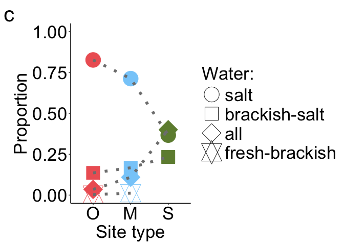
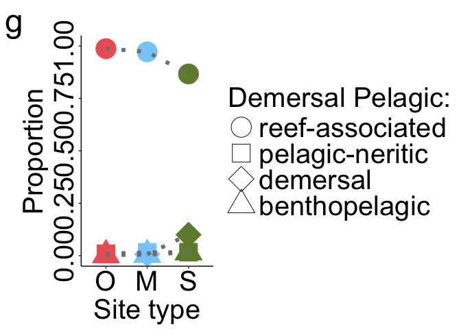

Trait plots
================

### Load packages

``` r
library(dplyr)
```

    ## 
    ## Attaching package: 'dplyr'

    ## The following objects are masked from 'package:stats':
    ## 
    ##     filter, lag

    ## The following objects are masked from 'package:base':
    ## 
    ##     intersect, setdiff, setequal, union

``` r
library(ggplot2)
library(viridis)
```

    ## Loading required package: viridisLite

``` r
# Load the knitr package if not already loaded
library(knitr)

# Source the R Markdown file
knit("/Users/bailey/Documents/research/fish_biodiversity/src/collection/load_collection_data.Rmd", output = "/Users/bailey/Documents/research/fish_biodiversity/src/collection/load_collection_data.md")
```

    ## 
    ## 
    ## processing file: /Users/bailey/Documents/research/fish_biodiversity/src/collection/load_collection_data.Rmd

    ##   |                  |          |   0%  |                  |          |   3%                                                                          |                  |.         |   7% [Bringing everything together load modifying files packages]             |                  |.         |  10%                                                                          |                  |.         |  13% [Bringing everything together load in modifying files]                   |                  |..        |  17%                                                                          |                  |..        |  20% [Check species names across files]                                       |                  |..        |  23%                                                                          |                  |...       |  27% [Modify environment data]                                                |                  |...       |  30%                                                                          |                  |...       |  33% [Modify incidence matrices]                                              |                  |....      |  37%                                                                          |                  |....      |  40% [Modify phylogeny]                                                       |                  |....      |  43%                                                                          |                  |.....     |  47% [Modify trait data]                                                      |                  |.....     |  50%                                                                          |                  |.....     |  53% [Modify Site_type data frames]                                           |                  |......    |  57%                                                                          |                  |......    |  60% [Modify Site_type trait data]                                            |                  |......    |  63%                                                                          |                  |.......   |  67% [Site_type trait data tests]                                             |                  |.......   |  70%                                                                          |                  |.......   |  73% [Modify site trait data frames]                                          |                  |........  |  77%                                                                          |                  |........  |  80% [Site trait data tests]                                                  |                  |........  |  83%                                                                          |                  |......... |  87% [unnamed-chunk-2]                                                        |                  |......... |  90%                                                                          |                  |......... |  93% [unnamed-chunk-3]                                                        |                  |..........|  97%                                                                          |                  |..........| 100% [Bringing everything together load out modified files and session info]

    ## output file: /Users/bailey/Documents/research/fish_biodiversity/src/collection/load_collection_data.md

    ## [1] "/Users/bailey/Documents/research/fish_biodiversity/src/collection/load_collection_data.md"

``` r
# Define your custom colors
custom_colors <- c("R" = "black", "O" = "#EE6363", "M" = "#87CEFA", "S" = "#6E8B3D")

# Reference use Site_type_at_weighted
# Surveyed sites use Site_type_st_weighted
```

## Biotic traits

### Trophic level

``` r
Troph_plot_weighted <- ggplot(Site_type_st_weighted, mapping = aes(x= Strat, y= Troph, color = "black", fill = Strat)) +
  geom_violin(alpha = 0.6, draw_quantiles = c(0.25, 0.5, 0.75), linewidth = 2, aes(group = Strat, color = Strat, fill = Strat)) +
  scale_color_manual(values = custom_colors) +
  scale_fill_manual(values = custom_colors) +
  guides(fill = "none", color = "none") +
  geom_jitter(shape = 21,
            size = 4,
            alpha = 0.8,
            width = 0.1) +
  theme_bw() +
  theme(text = element_text(size = 26), legend.text = element_text(size = 26),
    axis.text = element_text(size = 26, color = "black"),
    axis.line = element_line(color = "black"),
    plot.background = element_blank(),
    panel.grid.major = element_blank(),
    panel.grid.minor = element_blank(),
    panel.border = element_blank()) + 
  ylab("Trophic Level") +
  xlab("Site type") +
  labs(colour = "Site type:", fill = "Site type:", tag = "a")
Troph_plot_weighted
```

<!-- -->

``` r
ggsave("/Users/bailey/Documents/research/fish_biodiversity/figures/FD/trait_plots/Troph_plot_weighted.jpg", Troph_plot_weighted, width = 8, height = 8, units = "in")


# Troph_plot <- ggplot(Site_type_st, mapping = aes(x= Strat, y= Troph, fill = Strat)) +
#   geom_violin(alpha = 0.75, draw_quantiles = c(0.25, 0.5, 0.75)) +
#   scale_fill_viridis(alpha = 0.5, end = 0.75, discrete = T, option = "G") +
#   geom_jitter(shape = 21,
#             size = 3,
#             alpha = 0.75,
#             width = 0.1) +
#   theme_bw() +
#   theme(
#     plot.background = element_blank(),
#     panel.grid.major = element_blank(),
#     panel.grid.minor = element_blank(),
#     panel.border = element_blank(),
#     axis.line = element_line(color = "black")) +
#   ylab("Troph")
# Troph_plot
```

### Reproductive Guild2

``` r
Site_type_st_props_RepGuild2 <- Site_type_st %>%
  group_by(Strat, RepGuild2) %>%
  summarise(count = sum(SiteSums)) %>%
  mutate(proportion = count/sum(count))
```

    ## `summarise()` has grouped output by 'Strat'. You can override using the
    ## `.groups` argument.

``` r
Site_type_st_props_RepGuild2 <- na.omit(Site_type_st_props_RepGuild2)

RepGuild2_plot_weighted <- ggplot(Site_type_st_props_RepGuild2, mapping = aes(x= Strat, y= proportion, color = "black", fill = Strat, shape = RepGuild2)) + 
  geom_point(position = "identity", size = 10, aes(group = Strat, color = Strat, fill = Strat)) +
  geom_line(position = "identity", aes(group = RepGuild2), linewidth = 2, linetype = "dotted") +
  scale_shape_manual(name = "Egg Strategy:", values = c(11, 21:25), labels = c('1ib' = 'live bearers', '6s' = 'egg scatterers', '3n' = 'nesters', '5h' = 'brood hiders', '4t' = 'clutch tenders', '2eb' = 'external brooders')) +
  scale_color_manual(values = custom_colors) +
  scale_fill_manual(values = custom_colors) +
  theme_bw() +
  theme(
    text = element_text(size = 26),
    legend.title = element_text(size = 26),  # Adjust legend title size
    legend.text = element_text(size = 26),  # Adjust legend text size
    axis.text = element_text(size = 26, color = "black"),
    axis.line = element_line(color = "black"),
    plot.background = element_blank(),
    panel.grid.major = element_blank(),
    panel.grid.minor = element_blank(),
    panel.border = element_blank()
  ) +
  guides(colour = "none", fill = "none") + # Remove the legends for Site type
  ylim(c(0,0.6)) +
  ylab("Proportion") +
  xlab("Site type") +
  labs(colour = "Site type:", fill = "Site type:", tag = "b")
RepGuild2_plot_weighted
```

<!-- -->

``` r
ggsave("/Users/bailey/Documents/research/fish_biodiversity/figures/FD/trait_plots/RepGuild2_plot_weighted.jpg", RepGuild2_plot_weighted, width = 8, height = 8, units = "in")


# # Identify how many individuals have one of the trait factors for each Site_type
# RepGuild2_counts <- table(Site_type_st$Site_type, row.names = Site_type_st$RepGuild2)
# 
# # Divide each count by the total number of rows to find the proportion
# RepGuild2_props <- RepGuild2_counts/(rowSums(RepGuild2_counts))
# RepGuild2_props
# 
# RepGuild2_props <- as.dSite_type_sta.frame(RepGuild2_props)
# 
# RepGuild2_props$Var1 <- factor(RepGuild2_props$Var1, levels = c("Reference", "Ocean", "Holomictic", "Meromictic"))
# 
# RepGuild2_plot <- ggplot(RepGuild2_props, mapping = aes(x= Var1, y= Freq, color = Var1, shape = row.names)) + 
#   geom_point(position = "identity", size = 5, aes(group = Var1)) +
#   scale_color_viridis(alpha = 0.5, end = 0.75, discrete = T, option = "G") +
#   theme_bw() +
#   theme(
#     plot.background = element_blank(),
#     panel.grid.major = element_blank(),
#     panel.grid.minor = element_blank(),
#     panel.border = element_blank(),
#     axis.line = element_line(color = "black")) +
#   ylab("Proportion") +
#   xlab("Site type")
# RepGuild2_plot
```

### Dorsal Spines Mean

``` r
DorsalSpinesMean_plot_weighted <- ggplot(Site_type_st_weighted, mapping = aes(x= Strat, y= DorsalSpinesMean, color = "black", fill = Strat)) +
  geom_violin(alpha = 0.5, draw_quantiles = c(0.25, 0.5, 0.75), linewidth = 2, aes(group = Strat, color = Strat, fill = Strat)) +
  scale_color_manual(values = custom_colors) +
  scale_fill_manual(values = custom_colors) +
  guides(fill = "none", color = "none") +
  geom_jitter(shape = 21,
            size = 4,
            alpha = 0.6,
            width = 0.1) +
  theme_bw() +
  theme(text = element_text(size = 26), legend.text = element_text(size = 26),
    axis.text = element_text(size = 26, color = "black"),
    axis.line = element_line(color = "black"),
    plot.background = element_blank(),
    panel.grid.major = element_blank(),
    panel.grid.minor = element_blank(),
    panel.border = element_blank()) + 
  ylab("Dorsal Spines") +
  xlab("Site type") +
  labs(colour = "Site type:", fill = "Site type:", tag = "c")
DorsalSpinesMean_plot_weighted
```

<!-- -->

``` r
# Warning messages:
# 1: Removed 10 rows containing non-finite values (`stat_ydensity()`). 
# 2: Removed 10 rows containing missing values (`geom_point()`). 
# Twelve values with NA
ggsave("/Users/bailey/Documents/research/fish_biodiversity/figures/FD/trait_plots/DorsalSpinesMean_plot_weighted.jpg", DorsalSpinesMean_plot_weighted, width = 8, height = 8, units = "in")


# DorsalSpinesMax_plot <- ggplot(Site_type_st, mapping = aes(x= Strat, y= DorsalSpinesMax, fill = Strat)) +
#   geom_violin(alpha = 0.75, draw_quantiles = c(0.25, 0.5, 0.75)) +
#   scale_fill_viridis(alpha = 0.5, end = 0.75, discrete = T, option = "G") +
#   geom_jitter(shape = 21,
#             size = 3,
#             alpha = 0.75,
#             width = 0.1) +
#   theme_bw() +
#   theme(
#     plot.background = element_blank(),
#     panel.grid.major = element_blank(),
#     panel.grid.minor = element_blank(),
#     panel.border = element_blank(),
#     axis.line = element_line(color = "black")) +
#   ylab("DorsalSpinesMax")
# DorsalSpinesMax_plot
```

### Parental Care

``` r
Site_type_st_props_ParentalCare <- Site_type_st %>%
  group_by(Strat, ParentalCare) %>%
  summarise(count = sum(SiteSums)) %>%
  mutate(proportion = count/sum(count))
```

    ## `summarise()` has grouped output by 'Strat'. You can override using the
    ## `.groups` argument.

``` r
Site_type_st_props_ParentalCare <- na.omit(Site_type_st_props_ParentalCare)

ParentalCare_plot_weighted <- ggplot(Site_type_st_props_ParentalCare, mapping = aes(x= Strat, y= proportion, color = "black", fill = Strat, shape = ParentalCare)) + 
  geom_point(position = "identity", size = 10, aes(group = Strat, color = Strat, fill = Strat)) +
  geom_line(position = "identity", aes(group = ParentalCare), linewidth = 2, linetype = "dotted") +
  scale_shape_manual(name = "Parental Care:", values = c(21:25), labels = c('4n' = 'none', '3p' = 'paternal', '2m' = 'maternal', '1b' = 'biparental')) +
  scale_color_manual(values = custom_colors) +
  scale_fill_manual(values = custom_colors) +
  theme_bw() +
  theme(
    text = element_text(size = 26),
    legend.title = element_text(size = 26),  # Adjust legend title size
    legend.text = element_text(size = 26),  # Adjust legend text size
    axis.text = element_text(size = 26, color = "black"),
    axis.line = element_line(color = "black"),
    plot.background = element_blank(),
    panel.grid.major = element_blank(),
    panel.grid.minor = element_blank(),
    panel.border = element_blank()
  ) +
  guides(colour = "none", fill = "none") + # Remove the legends for Site type
  ylim(c(0,0.6)) +
  ylab("Proportion") +
  xlab("Site type") +
  labs(colour = "Site type:", fill = "Site type:", tag = "d")
ParentalCare_plot_weighted
```

<!-- -->

``` r
ggsave("/Users/bailey/Documents/research/fish_biodiversity/figures/FD/trait_plots/ParentalCare_plot_weighted.jpg", ParentalCare_plot_weighted, width = 8, height = 8, units = "in")


# # Identify how many individuals have one of the trait factors for each Site_type
# ParentalCare_counts <- table(Site_type_st$Site_type, row.names = Site_type_st$ParentalCare)
# 
# # Divide each count by the total number of rows to find the proportion
# ParentalCare_props <- ParentalCare_counts/(rowSums(ParentalCare_counts))
# ParentalCare_props
# 
# ParentalCare_props <- as.dSite_type_sta.frame(ParentalCare_props)
# 
# ParentalCare_props$Var1 <- factor(ParentalCare_props$Var1, levels = c("Reference", "Ocean", "Holomictic", "Meromictic"))
# 
# ParentalCare_plot <- ggplot(ParentalCare_props, mapping = aes(x= Var1, y= Freq, color = Var1, shape = row.names)) + 
#   geom_point(position = "identity", size = 5, aes(group = Var1)) +
#   scale_color_viridis(alpha = 0.5, end = 0.75, discrete = T, option = "G") +
#   theme_bw() +
#   theme(
#     plot.background = element_blank(),
#     panel.grid.major = element_blank(),
#     panel.grid.minor = element_blank(),
#     panel.border = element_blank(),
#     axis.line = element_line(color = "black")) +
#   ylab("Proportion") +
#   xlab("Site type")
# ParentalCare_plot
```

## Abiotic traits

### Temperature Preference Minimum

``` r
TempPrefMin_plot_weighted <- ggplot(Site_type_st_weighted, mapping = aes(x= Strat, y= TempPrefMin, color = "black", fill = Strat)) +
  geom_violin(alpha = 0.5, draw_quantiles = c(0.25, 0.5, 0.75), linewidth = 2, aes(group = Strat, color = Strat, fill = Strat)) +
  scale_color_manual(values = custom_colors) +
  scale_fill_manual(values = custom_colors) +
  guides(fill = "none", color = "none") +
  geom_jitter(shape = 21,
            size = 4,
            alpha = 0.6,
            width = 0.1) +
  theme_bw() +
  theme(text = element_text(size = 26), legend.text = element_text(size = 26),
    axis.text = element_text(size = 26, color = "black"),
    axis.line = element_line(color = "black"),
    plot.background = element_blank(),
    panel.grid.major = element_blank(),
    panel.grid.minor = element_blank(),
    panel.border = element_blank()) + 
  ylab("Temp Min (Cº)") +
  xlab("Site type") +
  labs(colour = "Site type:", fill = "Site type:", tag = "a")
TempPrefMin_plot_weighted
```

<!-- -->

``` r
# Warning messages:
# 1: Removed 9 rows containing non-finite values (`stat_ydensity()`). 
# 2: Removed 9 rows containing missing values (`geom_point()`). 
# Two values with NA
ggsave("/Users/bailey/Documents/research/fish_biodiversity/figures/FD/trait_plots/TempPrefMin_plot_weighted.jpg", TempPrefMin_plot_weighted, width = 8, height = 8, units = "in")


# TempPrefMin_plot <- ggplot(Site_type_st, mapping = aes(x= Strat, y= TempPrefMin, fill = Strat)) +
#   geom_violin(alpha = 0.75, draw_quantiles = c(0.25, 0.5, 0.75)) +
#   scale_fill_viridis(alpha = 0.5, end = 0.75, discrete = T, option = "G") +
#   geom_jitter(shape = 21,
#             size = 3,
#             alpha = 0.75,
#             width = 0.1) +
#   theme_bw() +
#   theme(
#     plot.background = element_blank(),
#     panel.grid.major = element_blank(),
#     panel.grid.minor = element_blank(),
#     panel.border = element_blank(),
#     axis.line = element_line(color = "black")) +
#   ylab("TempPrefMin")
# TempPrefMin_plot
```

### Temperature Preference Maximum

``` r
TempPrefMax_plot_weighted <- ggplot(Site_type_st_weighted, mapping = aes(x= Strat, y= TempPrefMax, color = "black", fill = Strat)) +
  geom_violin(alpha = 0.5, draw_quantiles = c(0.25, 0.5, 0.75), linewidth = 2, aes(group = Strat, color = Strat, fill = Strat)) +
  scale_color_manual(values = custom_colors) +
  scale_fill_manual(values = custom_colors) +
  guides(fill = "none", color = "none") +
  geom_jitter(shape = 21,
            size = 4,
            alpha = 0.6,
            width = 0.1) +
  theme_bw() +
  theme(text = element_text(size = 26), legend.text = element_text(size = 26),
    axis.text = element_text(size = 26, color = "black"),
    axis.line = element_line(color = "black"),
    plot.background = element_blank(),
    panel.grid.major = element_blank(),
    panel.grid.minor = element_blank(),
    panel.border = element_blank()) + 
  ylab("Temp Max (Cº)") +
  xlab("Site type") +
  labs(colour = "Site type:", fill = "Site type:", tag = "b")
TempPrefMax_plot_weighted
```

<!-- -->

``` r
# Warning messages:
# 1: Removed 11 rows containing non-finite values (`stat_ydensity()`). 
# 2: Removed 11 rows containing missing values (`geom_point()`). 
# Two values with NA
ggsave("/Users/bailey/Documents/research/fish_biodiversity/figures/FD/trait_plots/TempPrefMax_plot_weighted.jpg", TempPrefMax_plot_weighted, width = 8, height = 8, units = "in")


# TempPrefMax_plot <- ggplot(Site_type_st, mapping = aes(x= Strat, y= TempPrefMax, fill = Strat)) +
#   geom_violin(alpha = 0.75, draw_quantiles = c(0.25, 0.5, 0.75)) +
#   scale_fill_viridis(alpha = 0.5, end = 0.75, discrete = T, option = "G") +
#   geom_jitter(shape = 21,
#             size = 3,
#             alpha = 0.75,
#             width = 0.1) +
#   theme_bw() +
#   theme(
#     plot.background = element_blank(),
#     panel.grid.major = element_blank(),
#     panel.grid.minor = element_blank(),
#     panel.border = element_blank(),
#     axis.line = element_line(color = "black")) +
#   ylab("TempPrefMax")
# TempPrefMax_plot
```

### Water

- Fresh/Brack/Salt

``` r
Site_type_st_props_Water <- Site_type_st %>%
  group_by(Strat, WaterPref) %>%
  summarise(count = sum(SiteSums)) %>%
  mutate(proportion = count/sum(count))
```

    ## `summarise()` has grouped output by 'Strat'. You can override using the
    ## `.groups` argument.

``` r
#Site_type_st_props_Water$Water <- factor(Site_type_st_props_Water$Water, levels = c("all", "fresh", "fresh-brack", "brack", "brack-salt", "salt"))

Water_plot_weighted <- ggplot(Site_type_st_props_Water, mapping = aes(x= Strat, y= proportion, color = "black", fill = Strat, shape = WaterPref)) + 
  geom_point(position = "identity", size = 10, aes(group = Strat, color = Strat, fill = Strat)) +
  geom_line(position = "identity", aes(group = WaterPref), linewidth = 2, linetype = "dotted") +
  scale_shape_manual(name = "Water:", values = c(21:23,11,24:25), labels = c('3a' = 'all', '1s' = 'salt', '2bs' = 'brackish-salt', '4b' = 'brack', '5fb' = 'fresh-brackish', '6f' = 'fresh')) + 
  scale_color_manual(values = custom_colors) +
  scale_fill_manual(values = custom_colors) +
  theme_bw() +
  theme(
    text = element_text(size = 26),
    legend.title = element_text(size = 26),  # Adjust legend title size
    legend.text = element_text(size = 26),  # Adjust legend text size
    axis.text = element_text(size = 26, color = "black"),
    axis.line = element_line(color = "black"),
    plot.background = element_blank(),
    panel.grid.major = element_blank(),
    panel.grid.minor = element_blank(),
    panel.border = element_blank()
  ) +
  guides(colour = "none", fill = "none") + # Remove the legends for Site type
  ylim(c(0,1)) +
  ylab("Proportion") +
  xlab("Site type") +
  labs(colour = "Site type:", fill = "Site type:", tag = "c")
Water_plot_weighted
```

<!-- -->

``` r
ggsave("/Users/bailey/Documents/research/fish_biodiversity/figures/FD/trait_plots/Water_plot_weighted.jpg", Water_plot_weighted, width = 8, height = 8, units = "in")


# # Identify how many individuals have one of the trait factors for each Site_type
# Habitat_counts <- table(Site_type_st$Site_type, row.names = Site_type_st$Habitat)
# 
# # Divide each count by the total number of rows to find the proportion
# Habitat_props <- Habitat_counts/(rowSums(Habitat_counts))
# Habitat_props
# 
# Habitat_props <- as.dSite_type_sta.frame(Habitat_props)
# 
# Habitat_props$Var1 <- factor(Habitat_props$Var1, levels = c("Reference", "Ocean", "Holomictic", "Meromictic"))
# 
# Habitat_plot <- ggplot(Habitat_props, mapping = aes(x= Var1, y= Freq, color = Var1, shape = row.names)) + 
#   geom_point(position = "identity", size = 5, aes(group = Var1)) +
#   scale_color_viridis(alpha = 0.5, end = 0.75, discrete = T, option = "G") +
#   theme_bw() +
#   theme(
#     plot.background = element_blank(),
#     panel.grid.major = element_blank(),
#     panel.grid.minor = element_blank(),
#     panel.border = element_blank(),
#     axis.line = element_line(color = "black")) +
#   ylab("Proportion") +
#   xlab("Habitat")
# Habitat_plot
```

## Supplementary traits

### Operculum Present

``` r
Site_type_st_props_OperculumPresent <- Site_type_st %>%
  group_by(Strat, OperculumPresent) %>%
  summarise(count = sum(SiteSums)) %>%
  mutate(proportion = count/sum(count))
```

    ## `summarise()` has grouped output by 'Strat'. You can override using the
    ## `.groups` argument.

``` r
OperculumPresent_plot_weighted <- ggplot(Site_type_st_props_OperculumPresent, mapping = aes(x= Strat, y= proportion, color = "black", fill = Strat, shape = OperculumPresent)) + 
  geom_point(position = "identity", size = 10, aes(group = Strat, color = Strat, fill = Strat)) +
  geom_line(position = "identity", aes(group = OperculumPresent), linewidth = 2, linetype = "dotted") +
  scale_shape_manual(name = "Operculum:", values = c(21:22)) +
  scale_color_manual(values = custom_colors) +
  scale_fill_manual(values = custom_colors) +
  theme_bw() +
  theme(
    text = element_text(size = 30),
    legend.title = element_text(size = 30),  # Adjust legend title size
    legend.text = element_text(size = 30),  # Adjust legend text size
    axis.text = element_text(size = 30, color = "black"),
    axis.text.y = element_text(angle = 90, hjust = 0.5),
    axis.line = element_line(color = "black"),
    plot.background = element_blank(),
    panel.grid.major = element_blank(),
    panel.grid.minor = element_blank(),
    panel.border = element_blank()
  ) +
  guides(colour = "none", fill = "none") + # Remove the legends for Site type
  ylim(c(0,0.75)) +
  ylab("Proportion") +
  xlab("Site type") +
  labs(colour = "Site type:", fill = "Site type:", tag = "a")
OperculumPresent_plot_weighted
```

<!-- -->

``` r
ggsave("/Users/bailey/Documents/research/fish_biodiversity/figures/FD/trait_plots/OperculumPresent_plot_weighted.jpg", OperculumPresent_plot_weighted,  width = 13, height = 10, units = "in")


# # Identify how many individuals have one of the trait factors for each Site_type
# OperculumPresent_counts <- table(Site_type_st$Site_type, row.names = Site_type_st$OperculumPresent)
# 
# # Divide each count by the total number of rows to find the proportion
# OperculumPresent_props <- OperculumPresent_counts/(rowSums(OperculumPresent_counts))
# OperculumPresent_props
# 
# OperculumPresent_props <- as.dSite_type_sta.frame(OperculumPresent_props)
# 
# OperculumPresent_props$Var1 <- factor(OperculumPresent_props$Var1, levels = c("Reference", "Ocean", "Holomictic", "Meromictic"))
# 
# OperculumPresent_plot <- ggplot(OperculumPresent_props, mapping = aes(x= Var1, y= Freq, color = Var1, shape = row.names)) + 
#   geom_point(position = "identity", size = 5, aes(group = Var1)) +
#   scale_color_viridis(alpha = 0.5, end = 0.75, discrete = T, option = "G") +
#   theme_bw() +
#   theme(
#     plot.background = element_blank(),
#     panel.grid.major = element_blank(),
#     panel.grid.minor = element_blank(),
#     panel.border = element_blank(),
#     axis.line = element_line(color = "black")) +
#   ylab("Proportion") +
#   xlab("OperculumPresent")
# OperculumPresent_plot
```

### Max Length (TL)

``` r
MaxLengthTL_plot_weighted <- ggplot(Site_type_st_weighted, mapping = aes(x= Strat, y= MaxLengthTL, color = "black", fill = Strat)) +
  geom_violin(alpha = 0.5, draw_quantiles = c(0.25, 0.5, 0.75), linewidth = 2, aes(group = Strat, color = Strat, fill = Strat)) +
  scale_color_manual(values = custom_colors) +
  scale_fill_manual(values = custom_colors) +
  guides(fill = "none", color = "none") +
  geom_jitter(shape = 21,
            size = 4,
            alpha = 0.6,
            width = 0.1) +
  theme_bw() +
  theme(text = element_text(size = 30), legend.text = element_text(size = 30),
    axis.text = element_text(size = 30, color = "black"),
    axis.text.y = element_text(angle = 90, hjust = 0.5),
    axis.line = element_line(color = "black"),
    plot.background = element_blank(),
    panel.grid.major = element_blank(),
    panel.grid.minor = element_blank(),
    panel.border = element_blank()) + 
  ylab("Length (cm)") +
  xlab("Site type") +
  labs(colour = "Site type:", fill = "Site type:", tag = "b")
MaxLengthTL_plot_weighted
```

-1.png)<!-- -->

``` r
# Warning messages:
# 1: Removed 3 rows containing non-finite values (`stat_ydensity()`). 
# 2: Removed 3 rows containing missing values (`geom_point()`). 
ggsave("/Users/bailey/Documents/research/fish_biodiversity/figures/FD/trait_plots/MaxLengthTL_plot_weighted.jpg", MaxLengthTL_plot_weighted,  width = 13, height = 10, units = "in")


# MaxLengthTL_plot <- ggplot(Site_type_st, mapping = aes(x= Strat, y= MaxLengthTL, fill = Strat)) +
#   geom_violin(alpha = 0.75, draw_quantiles = c(0.25, 0.5, 0.75)) +
#   scale_fill_viridis(alpha = 0.5, end = 0.75, discrete = T, option = "G") +
#   geom_jitter(shape = 21,
#             size = 3,
#             alpha = 0.75,
#             width = 0.1) +
#   theme_bw() +
#   theme(
#     plot.background = element_blank(),
#     panel.grid.major = element_blank(),
#     panel.grid.minor = element_blank(),
#     panel.border = element_blank(),
#     axis.line = element_line(color = "black")) +
#   ylab("MaxLengthTL")
# MaxLengthTL_plot
```

### Body Shape

``` r
Site_type_st_props_BodyShape <- Site_type_st %>%
  group_by(Strat, BodyShapeI) %>%
  summarise(count = sum(SiteSums)) %>%
  mutate(proportion = count/sum(count))
```

    ## `summarise()` has grouped output by 'Strat'. You can override using the
    ## `.groups` argument.

``` r
BodyShape_plot_weighted <- ggplot(Site_type_st_props_BodyShape, mapping = aes(x= Strat, y= proportion, color = "black", fill = Strat, shape = BodyShapeI)) + 
  geom_point(position = "identity", size = 10, aes(group = Strat, color = Strat, fill = Strat)) +
  geom_line(position = "identity", aes(group = BodyShapeI), linewidth = 2, linetype = "dotted") +
  scale_shape_manual(name = "Body Shape:", values = c(11, 21:25), labels = c("1o" = "other", "2s" = "short deep", "3f" = "fusiform", "4e" = "elongated", "5l" = "eel-like")) +
  scale_color_manual(values = custom_colors) +
  scale_fill_manual(values = custom_colors) +
  theme_bw() +
  theme(
    text = element_text(size = 30),
    legend.title = element_text(size = 30),  # Adjust legend title size
    legend.text = element_text(size = 30),  # Adjust legend text size
    axis.text = element_text(size = 30, color = "black"),
    axis.text.y = element_text(angle = 90, hjust = 0.5),
    axis.line = element_line(color = "black"),
    plot.background = element_blank(),
    panel.grid.major = element_blank(),
    panel.grid.minor = element_blank(),
    panel.border = element_blank()
  ) +
  guides(colour = "none", fill = "none") + # Remove the legends for Site type
  ylim(c(0,0.6)) +
  ylab("Proportion") +
  xlab("Site type") +
  labs(colour = "Site type:", fill = "Site type:", tag = "c")
BodyShape_plot_weighted
```

<!-- -->

``` r
ggsave("/Users/bailey/Documents/research/fish_biodiversity/figures/FD/trait_plots/BodyShape_plot_weighted.jpg", BodyShape_plot_weighted,  width = 13, height = 10, units = "in")


# BodyShape_plot_weighted <- ggplot(Site_type_st_props_BodyShape, aes(fill=Site_type, y=proportion, x=BodyShapeI)) + 
#   geom_bar(position='dodge', stSite_type_st='identity') +
#   scale_fill_viridis(alpha = 1, begin = 0.3, end = .85, discrete = T, option = "G") +  
#   guides(fill = "none", color = "none") +
#   theme_bw() +
#   theme(text = element_text(size = 30),
#     plot.background = element_blank(),
#     panel.grid.major = element_blank(),
#     panel.grid.minor = element_blank(),
#     panel.border = element_blank(),
#     axis.line = element_line(color = "black")) +
#   ylab("Proportion") +
#   xlab("Body Shape")
# BodyShape_plot_weighted
# ggsave("/Users/bailey/Documents/research/fish_biodiversity/figures/FD/trait_plots/BodyShape_plot_weightedbar.jpg", BodyShape_plot_weighted,  width = 13, height = 10, units = "in")


# # Identify how many individuals have one of the trait factors for each Site_type
# BodyShape_counts <- table(Site_type_st$Site_type, row.names = Site_type_st$BodyShapeI)
# 
# # Divide each count by the total number of rows to find the proportion
# BodyShape_props <- BodyShape_counts/(rowSums(BodyShape_counts))
# BodyShape_props
# 
# BodyShape_props <- as.dSite_type_sta.frame(BodyShape_props)
# 
# BodyShape_props$Var1 <- factor(BodyShape_props$Var1, levels = c("Reference", "Ocean", "Holomictic", "Meromictic"))
# 
# BodyShape_plot <- ggplot(BodyShape_props, mapping = aes(x= Var1, y= Freq, color = Var1, shape = row.names)) + 
#   geom_point(position = "identity", size = 5, aes(group = Var1)) +
#   scale_color_viridis(alpha = 0.5, end = 0.75, discrete = T, option = "G") +
#   theme_bw() +
#   theme(
#     plot.background = element_blank(),
#     panel.grid.major = element_blank(),
#     panel.grid.minor = element_blank(),
#     panel.border = element_blank(),
#     axis.line = element_line(color = "black")) +
#   ylab("Proportion") +
#   xlab("BodyShape")
# BodyShape_plot
```

### Depth Maximum

``` r
DepthMax_plot_weighted <- ggplot(Site_type_st_weighted, mapping = aes(x= Strat, y= DepthMax, color = "black", fill = Strat)) +
  geom_violin(alpha = 0.5, draw_quantiles = c(0.25, 0.5, 0.75), linewidth = 2, aes(group = Strat, color = Strat, fill = Strat)) +
  scale_color_manual(values = custom_colors) +
  scale_fill_manual(values = custom_colors) +
  guides(fill = "none", color = "none") +
  geom_jitter(shape = 21,
            size = 4,
            alpha = 0.6,
            width = 0.1) +
  theme_bw() +
  theme(text = element_text(size = 30), legend.text = element_text(size = 30),
    axis.text = element_text(size = 30, color = "black"),
    axis.text.y = element_text(angle = 90, hjust = 0.5),
    axis.line = element_line(color = "black"),
    plot.background = element_blank(),
    panel.grid.major = element_blank(),
    panel.grid.minor = element_blank(),
    panel.border = element_blank()) + 
  ylab("Depth Max (m)") +
  xlab("Site type") +
  labs(colour = "Site type:", fill = "Site type:", tag = "d")
DepthMax_plot_weighted
```

    ## Warning: Removed 6 rows containing non-finite outside the scale range
    ## (`stat_ydensity()`).

    ## Warning: Removed 6 rows containing missing values or values outside the scale range
    ## (`geom_point()`).

<!-- -->

``` r
# Warning messages:
# 1: Removed 10 rows containing non-finite values (`stat_ydensity()`). 
# 2: Removed 10 rows containing missing values (`geom_point()`). 
# One value with NA
ggsave("/Users/bailey/Documents/research/fish_biodiversity/figures/FD/trait_plots/DepthMax_plot_weighted.jpg", DepthMax_plot_weighted,  width = 13, height = 10, units = "in")
```

    ## Warning: Removed 6 rows containing non-finite outside the scale range
    ## (`stat_ydensity()`).
    ## Removed 6 rows containing missing values or values outside the scale range
    ## (`geom_point()`).

``` r
# DepthMax_plot <- ggplot(Site_type_st, mapping = aes(x= Strat, y= DepthMax, fill = Strat)) +
#   geom_violin(alpha = 0.75, draw_quantiles = c(0.25, 0.5, 0.75)) +
#   scale_fill_viridis(alpha = 0.5, end = 0.75, discrete = T, option = "G") +
#   geom_jitter(shape = 21,
#             size = 3,
#             alpha = 0.75,
#             width = 0.1) +
#   theme_bw() +
#   theme(
#     plot.background = element_blank(),
#     panel.grid.major = element_blank(),
#     panel.grid.minor = element_blank(),
#     panel.border = element_blank(),
#     axis.line = element_line(color = "black")) +
#   ylab("DepthMax")
# DepthMax_plot
```

### Feeding Pathway

``` r
Site_type_st_props_FeedingPath <- Site_type_st %>%
  group_by(Strat, FeedingPath) %>%
  summarise(count = sum(SiteSums)) %>%
  mutate(proportion = count/sum(count))
```

    ## `summarise()` has grouped output by 'Strat'. You can override using the
    ## `.groups` argument.

``` r
Site_type_st_props_FeedingPath <- na.omit(Site_type_st_props_FeedingPath)

FeedingPath_plot_weighted <- ggplot(Site_type_st_props_FeedingPath, mapping = aes(x= Strat, y= proportion, color = "black", fill = Strat, shape = FeedingPath)) + 
  geom_point(position = "identity", size = 10, aes(group = Strat, color = Strat, fill = Strat)) +
  geom_line(position = "identity", aes(group = FeedingPath), linewidth = 2, linetype = "dotted") +
  scale_shape_manual(name = "Diet Source:", values = c(21:22), labels = c("b" = "benthic", "p" = "pelagic")) +
  scale_color_manual(values = custom_colors) +
  scale_fill_manual(values = custom_colors) +
  theme_bw() +
  theme(
    text = element_text(size = 30),
    legend.title = element_text(size = 30),  # Adjust legend title size
    legend.text = element_text(size = 30),  # Adjust legend text size
    axis.text = element_text(size = 30, color = "black"),
    axis.text.y = element_text(angle = 90, hjust = 0.5),
    axis.line = element_line(color = "black"),
    plot.background = element_blank(),
    panel.grid.major = element_blank(),
    panel.grid.minor = element_blank(),
    panel.border = element_blank()
  ) +
  guides(colour = "none", fill = "none") + # Remove the legends for Site type
  ylim(c(0,1)) +
  ylab("Proportion") +
  xlab("Site type") +
  labs(colour = "Site type:", fill = "Site type:", tag = "e")
FeedingPath_plot_weighted
```

<!-- -->

``` r
ggsave("/Users/bailey/Documents/research/fish_biodiversity/figures/FD/trait_plots/FeedingPath_plot_weighted.jpg", FeedingPath_plot_weighted,  width = 13, height = 10, units = "in")


# # Identify how many individuals have one of the trait factors for each Site_type
# FeedingPath_counts <- table(Site_type_st$Site_type, row.names = Site_type_st$FeedingPSite_type_sth)
# 
# # Divide each count by the total number of rows to find the proportion
# FeedingPath_props <- FeedingPath_counts/(rowSums(FeedingPath_counts))
# FeedingPath_props
# 
# FeedingPath_props <- as.dSite_type_sta.frame(FeedingPath_props)
# 
# FeedingPath_props$Var1 <- factor(FeedingPath_props$Var1, levels = c("Reference", "Ocean", "Holomictic", "Meromictic"))
# 
# FeedingPath_plot <- ggplot(FeedingPath_props, mapping = aes(x= Var1, y= Freq, color = Var1, shape = row.names)) + 
#   geom_point(position = "identity", size = 5, aes(group = Var1)) +
#   scale_color_viridis(alpha = 0.5, end = 0.75, discrete = T, option = "G") +
#   theme_bw() +
#   theme(
#     plot.background = element_blank(),
#     panel.grid.major = element_blank(),
#     panel.grid.minor = element_blank(),
#     panel.border = element_blank(),
#     axis.line = element_line(color = "black")) +
#   ylab("Proportion") +
#   xlab("Site type")
# FeedingPath_plot
```

### Depth Minimum

``` r
DepthMin_plot_weighted <- ggplot(Site_type_st_weighted, mapping = aes(x= Strat, y= DepthMin, color = "black", fill = Strat)) +
  geom_violin(alpha = 0.5, draw_quantiles = c(0.25, 0.5, 0.75), linewidth = 2, aes(group = Strat, color = Strat, fill = Strat)) +
  scale_color_manual(values = custom_colors) +
  scale_fill_manual(values = custom_colors) +
  guides(fill = "none", color = "none") +
  geom_jitter(shape = 21,
            size = 4,
            alpha = 0.6,
            width = 0.1) +
  theme_bw() +
  theme(text = element_text(size = 30), legend.text = element_text(size = 30),
    axis.text = element_text(size = 30, color = "black"),
    axis.text.y = element_text(angle = 90, hjust = 0.5),
    axis.line = element_line(color = "black"),
    plot.background = element_blank(),
    panel.grid.major = element_blank(),
    panel.grid.minor = element_blank(),
    panel.border = element_blank()) + 
  ylab("Depth Min (m)") +
  xlab("Site type") +
  labs(colour = "Site type:", fill = "Site type:", tag = "f")
DepthMin_plot_weighted
```

<!-- -->

``` r
# Warning messages:
# 1: Removed 8 rows containing non-finite values (`stat_ydensity()`). 
# 2: Removed 8 rows containing missing values (`geom_point()`). 
# One value with NA
ggsave("/Users/bailey/Documents/research/fish_biodiversity/figures/FD/trait_plots/DepthMin_plot_weighted.jpg", DepthMin_plot_weighted,  width = 13, height = 10, units = "in")


# DepthMin_plot <- ggplot(Site_type_st, mapping = aes(x= Strat, y= DepthMin, fill = Strat)) +
#   geom_violin(alpha = 0.75, draw_quantiles = c(0.25, 0.5, 0.75)) +
#   scale_fill_viridis(alpha = 0.5, end = 0.75, discrete = T, option = "G") +
#   geom_jitter(shape = 21,
#             size = 3,
#             alpha = 0.75,
#             width = 0.1) +
#   theme_bw() +
#   theme(
#     plot.background = element_blank(),
#     panel.grid.major = element_blank(),
#     panel.grid.minor = element_blank(),
#     panel.border = element_blank(),
#     axis.line = element_line(color = "black")) +
#   ylab("DepthMin")
# DepthMin_plot
```

### DemersPelag

``` r
Site_type_st_props_DemersPelag <- Site_type_st %>%
  group_by(Strat, DemersPelag) %>%
  summarise(count = sum(SiteSums)) %>%
  mutate(proportion = count/sum(count))
```

    ## `summarise()` has grouped output by 'Strat'. You can override using the
    ## `.groups` argument.

``` r
DemersPelag_plot_weighted <- ggplot(Site_type_st_props_DemersPelag, mapping = aes(x= Strat, y= proportion, color = "black", fill = Strat, shape = DemersPelag)) + 
  geom_point(position = "identity", size = 10, aes(group = Strat, color = Strat, fill = Strat)) +
  geom_line(position = "identity", aes(group = DemersPelag), linewidth = 2, linetype = "dotted") +
  scale_shape_manual(name = "Demersal Pelagic:", values = c(21:25, 12:13), 
                     labels = c("1r" = "reef-associated", "2pn" = "pelagic-neritic", "3p" = "pelagic", "4po" = "pelagic-oceanic", "5d" = "demersal", '6bp' = 'benthopelagic', '7bd' = 'bathydemersal')) +
  scale_color_manual(values = custom_colors) +
  scale_fill_manual(values = custom_colors) +
  theme_bw() +
  theme(
    text = element_text(size = 30),
    legend.title = element_text(size = 30),  # Adjust legend title size
    legend.text = element_text(size = 30),  # Adjust legend text size
    axis.text = element_text(size = 30, color = "black"),
    axis.text.y = element_text(angle = 90, hjust = 0.5),
    axis.line = element_line(color = "black"),
    plot.background = element_blank(),
    panel.grid.major = element_blank(),
    panel.grid.minor = element_blank(),
    panel.border = element_blank()
  ) +
  guides(colour = "none", fill = "none") + # Remove the legends for Site type
  ylim(c(0,1)) +
  ylab("Proportion") +
  xlab("Site type") +
  labs(colour = "Site type:", fill = "Site type:", tag = "g")
DemersPelag_plot_weighted
```

<!-- -->

``` r
ggsave("/Users/bailey/Documents/research/fish_biodiversity/figures/FD/trait_plots/DemersPelag_plot_weighted.jpg", DemersPelag_plot_weighted,  width = 13, height = 10, units = "in")
```

### Reproductive Guild1

``` r
Site_type_st_props_RepGuild1 <- Site_type_st %>%
  group_by(Strat, RepGuild1) %>%
  summarise(count = sum(SiteSums)) %>%
  group_by(Strat) %>%
  mutate(proportion = count/sum(count))
```

    ## `summarise()` has grouped output by 'Strat'. You can override using the
    ## `.groups` argument.

``` r
Site_type_st_props_RepGuild1 <- na.omit(Site_type_st_props_RepGuild1)

RepGuild1_plot_weighted <- ggplot(Site_type_st_props_RepGuild1, mapping = aes(x = Strat, y = proportion, shape = RepGuild1)) + 
  geom_point(position = "identity", size = 10, aes(group = Strat, color = Strat, fill = Strat)) +
  geom_line(position = "identity", aes(group = RepGuild1), linewidth = 2, linetype = "dotted") +
  scale_shape_manual(name = "Egg Care:", values = c(21, 22, 23), labels = c('2g' = 'guarders', '1b' = 'bearers', '3n' = 'nonguarders')) +
  scale_color_manual(values = custom_colors) +
  scale_fill_manual(values = custom_colors) +
  theme_bw() +
  theme(
    text = element_text(size = 30),
    legend.title = element_text(size = 30),  # Adjust legend title size
    legend.text = element_text(size = 30),  # Adjust legend text size
    axis.text = element_text(size = 30, color = "black"),
    axis.line = element_line(color = "black"),
    plot.background = element_blank(),
    panel.grid.major = element_blank(),
    panel.grid.minor = element_blank(),
    panel.border = element_blank()
  ) +
  guides(colour = "none", fill = "none") + # Remove the legends for Site type
  ylim(c(0, 0.6)) +
  ylab("Proportion") +
  xlab("Site type") +
  labs(tag = "none")

RepGuild1_plot_weighted
```

<!-- -->

``` r
ggsave("/Users/bailey/Documents/research/fish_biodiversity/figures/FD/trait_plots/RepGuild1_plot_weighted.jpg", RepGuild1_plot_weighted,  width = 13, height = 10, units = "in")


# # Identify how many individuals have one of the trait factors for each Site_type
# RepGuild1_counts <- table(Site_type_st$Site_type, row.names = Site_type_st$RepGuild1)
# 
# # Divide each count by the total number of rows to find the proportion
# RepGuild1_props <- RepGuild1_counts/(rowSums(RepGuild1_counts))
# RepGuild1_props
# 
# RepGuild1_props <- as.dSite_type_sta.frame(RepGuild1_props)
# 
# RepGuild1_props$Var1 <- factor(RepGuild1_props$Var1, levels = c("Reference", "Ocean", "Holomictic", "Meromictic"))
# 
# RepGuild1_plot <- ggplot(RepGuild1_props, mapping = aes(x= Var1, y= Freq, color = Var1, shape = row.names)) + 
#   geom_point(position = "identity", size = 5, aes(group = Var1)) +
#   scale_color_viridis(alpha = 0.5, end = 0.75, discrete = T, option = "G") +
#   theme_bw() +
#   theme(
#     plot.background = element_blank(),
#     panel.grid.major = element_blank(),
#     panel.grid.minor = element_blank(),
#     panel.border = element_blank(),
#     axis.line = element_line(color = "black")) +
#   ylab("Proportion") +
#   xlab("Site type")
# RepGuild1_plot
```

``` r
sessionInfo()
```

    ## R version 4.4.3 (2025-02-28)
    ## Platform: aarch64-apple-darwin20
    ## Running under: macOS Ventura 13.6.6
    ## 
    ## Matrix products: default
    ## BLAS:   /Library/Frameworks/R.framework/Versions/4.4-arm64/Resources/lib/libRblas.0.dylib 
    ## LAPACK: /Library/Frameworks/R.framework/Versions/4.4-arm64/Resources/lib/libRlapack.dylib;  LAPACK version 3.12.0
    ## 
    ## locale:
    ## [1] en_US.UTF-8/en_US.UTF-8/en_US.UTF-8/C/en_US.UTF-8/en_US.UTF-8
    ## 
    ## time zone: America/Los_Angeles
    ## tzcode source: internal
    ## 
    ## attached base packages:
    ## [1] parallel  stats     graphics  grDevices utils     datasets  methods  
    ## [8] base     
    ## 
    ## other attached packages:
    ##  [1] car_3.1-3         carData_3.0-5     tidyr_1.3.1       phytools_2.4-4   
    ##  [5] maps_3.4.2.1      ape_5.8-1         reshape2_1.4.4    stringr_1.5.1    
    ##  [9] knitr_1.49        viridis_0.6.5     viridisLite_0.4.2 ggplot2_3.5.1    
    ## [13] dplyr_1.1.4      
    ## 
    ## loaded via a namespace (and not attached):
    ##  [1] fastmatch_1.1-6         gtable_0.3.6            xfun_0.51              
    ##  [4] lattice_0.22-6          numDeriv_2016.8-1.1     quadprog_1.5-8         
    ##  [7] vctrs_0.6.5             tools_4.4.3             generics_0.1.3         
    ## [10] tibble_3.2.1            pkgconfig_2.0.3         Matrix_1.7-2           
    ## [13] scatterplot3d_0.3-44    lifecycle_1.0.4         compiler_4.4.3         
    ## [16] farver_2.1.2            textshaping_1.0.0       munsell_0.5.1          
    ## [19] mnormt_2.1.1            combinat_0.0-8          codetools_0.2-20       
    ## [22] htmltools_0.5.8.1       yaml_2.3.10             Formula_1.2-5          
    ## [25] pillar_1.10.1           MASS_7.3-64             clusterGeneration_1.3.8
    ## [28] iterators_1.0.14        abind_1.4-8             foreach_1.5.2          
    ## [31] nlme_3.1-167            phangorn_2.12.1         tidyselect_1.2.1       
    ## [34] digest_0.6.37           stringi_1.8.4           purrr_1.0.4            
    ## [37] labeling_0.4.3          fastmap_1.2.0           grid_4.4.3             
    ## [40] colorspace_2.1-1        expm_1.0-0              cli_3.6.4              
    ## [43] magrittr_2.0.3          optimParallel_1.0-2     withr_3.0.2            
    ## [46] scales_1.3.0            DEoptim_2.2-8           rmarkdown_2.29         
    ## [49] igraph_2.1.4            gridExtra_2.3           ragg_1.3.3             
    ## [52] coda_0.19-4.1           evaluate_1.0.3          doParallel_1.0.17      
    ## [55] rlang_1.1.5             Rcpp_1.0.14             glue_1.8.0             
    ## [58] rstudioapi_0.17.1       R6_2.6.1                plyr_1.8.9             
    ## [61] systemfonts_1.2.1
