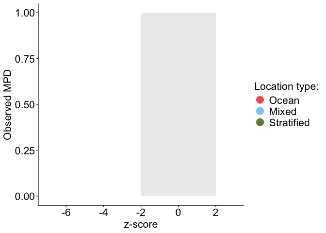
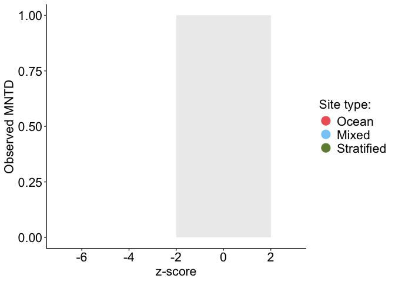

Phylogenetic diversity analyses
================

### Load packages and files

``` r
# Load the knitr package if not already loaded
library(knitr)

# Source the R Markdown file
knit("/Users/bailey/Documents/research/Fish_Biodiversity/src/collection/load_collection_data.Rmd", output = "/Users/bailey/Documents/research/Fish_Biodiversity/src/collection/load_collection_data.md")
```

    ## 
    ## 
    ## processing file: /Users/bailey/Documents/research/Fish_Biodiversity/src/collection/load_collection_data.Rmd

    ##   |                  |          |   0%  |                  |          |   4%                                                                          |                  |.         |   8% [Bringing everything together load modifying files packages]             |                  |.         |  12%                                                                          |                  |..        |  17% [Bringing everything together load in modifying files]                   |                  |..        |  21%                                                                          |                  |..        |  25% [Check species names across files]                                       |                  |...       |  29%                                                                          |                  |...       |  33% [Modify environment data]                                                |                  |....      |  38%                                                                          |                  |....      |  42% [Modify incidence matrices]                                              |                  |.....     |  46%                                                                          |                  |.....     |  50% [Modify phylogeny]                                                       |                  |.....     |  54%                                                                          |                  |......    |  58% [Modify trait data]                                                      |                  |......    |  62%                                                                          |                  |.......   |  67% [Modify Location_type data frames]                                       |                  |.......   |  71%                                                                          |                  |........  |  75% [Modify Location_type trait data]                                        |                  |........  |  79%                                                                          |                  |........  |  83% [Location_type trait data tests]                                         |                  |......... |  88%                                                                          |                  |......... |  92% [Modify site trait data frames]                                          |                  |..........|  96%                                                                          |                  |..........| 100% [Bringing everything together load out modified files and session info]

    ## output file: /Users/bailey/Documents/research/Fish_Biodiversity/src/collection/load_collection_data.md

    ## [1] "/Users/bailey/Documents/research/Fish_Biodiversity/src/collection/load_collection_data.md"

``` r
# Packages
library(picante)
```

    ## Loading required package: vegan

    ## Loading required package: permute

    ## Loading required package: lattice

    ## 
    ## Attaching package: 'vegan'

    ## The following object is masked from 'package:phytools':
    ## 
    ##     scores

    ## Loading required package: nlme

    ## 
    ## Attaching package: 'nlme'

    ## The following object is masked from 'package:dplyr':
    ## 
    ##     collapse

``` r
library(vegan)
library(phytools)
library(ggplot2)
library(ggrepel)
library(caret)
```

    ## 
    ## Attaching package: 'caret'

    ## The following object is masked from 'package:vegan':
    ## 
    ##     tolerance

``` r
library(BAT)
```

    ## Warning: replacing previous import 'e1071::element' by 'ggplot2::element' when
    ## loading 'hypervolume'

    ## 
    ## Attaching package: 'BAT'

    ## The following object is masked from 'package:ggplot2':
    ## 
    ##     alpha

    ## The following object is masked from 'package:tidyr':
    ## 
    ##     fill

    ## The following objects are masked from 'package:base':
    ## 
    ##     beta, gamma

``` r
library(pairwiseAdonis)
```

    ## Loading required package: cluster

    ## 
    ## Attaching package: 'cluster'

    ## The following object is masked from 'package:maps':
    ## 
    ##     votes.repub

``` r
library(emmeans)
```

    ## Welcome to emmeans.
    ## Caution: You lose important information if you filter this package's results.
    ## See '? untidy'

``` r
library(car)
```

    ## Loading required package: carData

    ## 
    ## Attaching package: 'car'

    ## The following object is masked from 'package:dplyr':
    ## 
    ##     recode

``` r
# Site vectors
surveyed_sites <- c("BCM", "CLM", "FLK", "GLK", "HLM", "HLO", "IBK", "LCN", "LLN", "MLN", "NCN", "NLK", "NLN", "NLU", "OCM", "OCO", "OLO", "OTM", "RCA", "SLN", "TLN", "ULN")

surveyed_sites_wo_LCN <- c("BCM", "CLM", "FLK", "GLK", "HLM", "HLO", "IBK", "LLN", "MLN", "NCN", "NLK", "NLN", "NLU", "OCM", "OCO", "OLO", "OTM", "RCA", "SLN", "TLN", "ULN")

surveyed_sites_wo_OCO <- c("BCM", "CLM", "FLK", "GLK", "HLM", "HLO", "IBK", "LCN", "LLN", "MLN", "NCN", "NLK", "NLN", "NLU", "OCM", "OLO", "OTM", "RCA", "SLN", "TLN", "ULN")

surveyed_sites_wo_TLN_HLM <- c("BCM", "CLM", "FLK", "GLK", "HLO", "IBK", "LCN", "LLN", "MLN", "NCN", "NLK", "NLN", "NLU", "OCM", "OCO", "OLO", "OTM", "RCA", "SLN", "ULN")

surveyed_sites_env <- c("BCM", "CLM", "FLK", "GLK", "HLM", "HLO", "IBK", "LLN", "MLN", "NCN", "NLK", "NLN", "NLU", "OLO", "OTM", "RCA", "SLN", "TLN", "ULN")

ocean_mixed_sites <- c("FLK", "HLO", "IBK", "LCN", "LLN", "MLN", "NCN", "NLN", "NLU", "OCM", "OCO", "OLO", "RCA", "ULN")

ocean_mixed_sites_env <- c("FLK", "HLO", "IBK", "LLN", "MLN", "NCN", "NLN", "NLU", "OLO", "RCA", "ULN")

ocean_stratified_sites <- c("BCM", "CLM", "GLK", "HLM", "IBK", "LCN", "NCN", "NLK", "OCM", "OCO", "OTM", "RCA", "SLN", "TLN")

ocean_stratified_sites_env <- c("BCM", "CLM", "GLK", "HLM", "IBK", "NCN", "NLK", "OTM", "RCA", "SLN", "TLN")

mixed_stratified_lakes <- c("BCM", "CLM", "FLK", "GLK", "HLM", "HLO", "LLN", "MLN", "NLK", "NLN", "NLU", "OLO", "OTM", "SLN", "TLN", "ULN")

ocean_sites <- c("IBK", "LCN", "NCN", "OCM", "OCO", "RCA")

ocean_sites_env <- c("IBK", "NCN", "RCA")

mixed_lakes <- c("FLK", "HLO", "LLN", "MLN", "NLN", "NLU", "OLO", "ULN")

stratified_lakes <- c("BCM", "CLM", "GLK", "HLM", "NLK", "OTM", "SLN", "TLN")

# Define your custom colors
custom_colors <- c("Reference" = "black", "Ocean" = "#EE6363", "Mixed" = "#87CEFA", "Stratified" = "#6E8B3D")

env_cont <- "orange"

set.seed(123)
```

### Edit input files

``` r
env <- env[order(env$X),]
presabs_lake <- presabs_lake[order(row.names(presabs_lake)),]
surveyed_sites_lake <- surveyed_sites_lake[order(row.names(surveyed_sites_lake)),]

Location_type_group_ref <- env[,"Location_type"]
Location_type_group <- env[surveyed_sites,"Location_type"]
```

# Phylogenetic Diversity

## PD alpha Diversity

### PD alpha mntd, mpd, and pd calculations of phylogeny and files to be saved

``` r
## Reference
# Dispersion
tree_disp <- dispersion(comm = presabs_lake, tree = tree, abund = F)
write.csv(tree_disp, "/Users/bailey/Documents/research/Fish_Biodiversity/data/analyses/PD/tree_disp.csv")

#Mean pairwise distances
tree_sesmpd <- ses.mpd(presabs_lake, cophenetic(tree), null.model = "taxa.labels", abundance.weighted = FALSE, runs = 999, iterations = 1000)
write.csv(tree_sesmpd, "/Users/bailey/Documents/research/Fish_Biodiversity/data/analyses/PD/tree_sesmpd.csv")

#Mean nearest taxon distances
tree_sesmntd <- ses.mntd(presabs_lake, cophenetic(tree), null.model = "taxa.labels", abundance.weighted = FALSE, runs = 999, iterations = 1000)
write.csv(tree_sesmntd, "/Users/bailey/Documents/research/Fish_Biodiversity/data/analyses/PD/tree_sesmntd.csv")

#Faith's PD
tree_sespd <- ses.pd(presabs_lake, tree, null.model = "taxa.labels", runs = 999, iterations = 1000, include.root = TRUE)
write.csv(tree_sespd, "/Users/bailey/Documents/research/Fish_Biodiversity/data/analyses/PD/tree_sespd.csv")


## Surveyed sites
# Dispersion
stree_disp <- dispersion(comm = surveyed_sites_lake, tree = stree, abund = F)
write.csv(stree_disp, "/Users/bailey/Documents/research/Fish_Biodiversity/data/analyses/PD/stree_disp.csv")

#Mean pairwise distances
stree_sesmpd <- ses.mpd(surveyed_sites_lake, cophenetic(stree), null.model = "taxa.labels", abundance.weighted = FALSE, runs = 999, iterations = 1000)
write.csv(stree_sesmpd, "/Users/bailey/Documents/research/Fish_Biodiversity/data/analyses/PD/stree_sesmpd.csv")

#Mean nearest taxon distances
stree_sesmntd <- ses.mntd(surveyed_sites_lake, cophenetic(stree), null.model = "taxa.labels", abundance.weighted = FALSE, runs = 999, iterations = 1000)
write.csv(stree_sesmntd, "/Users/bailey/Documents/research/Fish_Biodiversity/data/analyses/PD/stree_sesmntd.csv")

#Faith's PD
stree_sespd <- ses.pd(surveyed_sites_lake, stree, null.model = "taxa.labels", runs = 999, iterations = 1000, include.root = TRUE)
write.csv(stree_sespd, "/Users/bailey/Documents/research/Fish_Biodiversity/data/analyses/PD/stree_sespd.csv")
```

### PD alpha files mntd, mpd, and pd to read into R

- Read in Phylogenetic Diversity files and combine with env data frame

``` r
## Reference
# Dispersion 
tree_disp <-read.csv("/Users/bailey/Documents/research/Fish_Biodiversity/data/analyses/PD/tree_disp.csv")
tree_disp_env <- merge(tree_disp, env, by = "X", sort = F)
tree_disp_env$measure <- "tree_disp"
tree_disp_env$Location_type <- factor(tree_disp_env$Location_type, levels = c("Reference", "Ocean", "Mixed", "Stratified"))
row.names(tree_disp_env) <- tree_disp_env$X

# Mean pairwise distances
tree_sesmpd <- read.csv("/Users/bailey/Documents/research/Fish_Biodiversity/data/analyses/PD/tree_sesmpd.csv")
tree_sesmpd_env <- merge(tree_sesmpd, env, by = "X", sort = F)
tree_sesmpd_env$measure <- "tree_sesmpd"
tree_sesmpd_env$Location_type <- factor(tree_sesmpd_env$Location_type, levels = c("Reference", "Ocean", "Mixed", "Stratified"))
row.names(tree_sesmpd_env) <- tree_sesmpd_env$X

# Mean nearest taxon distances
tree_sesmntd <- read.csv("/Users/bailey/Documents/research/Fish_Biodiversity/data/analyses/PD/tree_sesmntd.csv")
tree_sesmntd_env <- merge(tree_sesmntd, env, by = "X", sort = F)
tree_sesmntd_env$measure <- "tree_sesmntd"
tree_sesmntd_env$Location_type <- factor(tree_sesmntd_env$Location_type, levels = c("Reference", "Ocean", "Mixed", "Stratified"))
row.names(tree_sesmntd_env) <- tree_sesmntd_env$X

#Faith's PD
tree_sespd <- read.csv("/Users/bailey/Documents/research/Fish_Biodiversity/data/analyses/PD/tree_sespd.csv")
tree_sespd_env <- merge(tree_sespd, env, by = "X", sort = F)
tree_sespd_env$measure <- "tree_sespd"
tree_sespd_env$Location_type <- factor(tree_sespd_env$Location_type, levels = c("Reference", "Ocean", "Mixed", "Stratified"))
stree_sespd_env <- merge(tree_sespd_env, tree_disp, by = "X", sort = F)
row.names(tree_sespd_env) <- tree_sespd_env$X


## Surveyed sites
# Dispersion 
stree_disp <-read.csv("/Users/bailey/Documents/research/Fish_Biodiversity/data/analyses/PD/stree_disp.csv")
stree_disp_env <- merge(stree_disp, env, by = "X", sort = F)
stree_disp_env$measure <- "stree_disp"
stree_disp_env$Location_type <- factor(stree_disp_env$Location_type, levels = c("Ocean", "Mixed", "Stratified"))
row.names(stree_disp_env) <- stree_disp_env$X

# Mean pairwise distances
stree_sesmpd <- read.csv("/Users/bailey/Documents/research/Fish_Biodiversity/data/analyses/PD/stree_sesmpd.csv")
stree_sesmpd_env <- merge(stree_sesmpd, env, by = "X", sort = F)
stree_sesmpd_env$measure <- "stree_sesmpd"
stree_sesmpd_env$Location_type <- factor(stree_sesmpd_env$Location_type, levels = c("Ocean", "Mixed", "Stratified"))
row.names(stree_sesmpd_env) <- stree_sesmpd_env$X

# Mean nearest taxon distances
stree_sesmntd <- read.csv("/Users/bailey/Documents/research/Fish_Biodiversity/data/analyses/PD/stree_sesmntd.csv")
stree_sesmntd_env <- merge(stree_sesmntd, env, by = "X", sort = F)
stree_sesmntd_env$measure <- "stree_sesmntd"
stree_sesmntd_env$Location_type <- factor(stree_sesmntd_env$Location_type, levels = c("Ocean", "Mixed", "Stratified"))
row.names(stree_sesmntd_env) <- stree_sesmntd_env$X

#Faith's PD
stree_sespd <-read.csv("/Users/bailey/Documents/research/Fish_Biodiversity/data/analyses/PD/stree_sespd.csv")
stree_sespd_env <- merge(stree_sespd, env, by = "X", sort = F)
stree_sespd_env$measure <- "stree_sespd"
stree_sespd_env$Location_type <- factor(stree_sespd_env$Location_type, levels = c("Ocean", "Mixed", "Stratified"))
stree_sespd_env <- merge(stree_sespd_env, stree_disp, by = "X", sort = F)
row.names(stree_sespd_env) <- stree_sespd_env$X
```

### PD alpha outliers for each Location type

``` r
outlier_PD_alpha <- stree_sespd_env %>%
  group_by(Location_type) %>%
  mutate(
    Q1 = quantile(pd.obs.z, 0.25),
    Q3 = quantile(pd.obs.z, 0.75),
    IQR = Q3 - Q1,
    lower_bound = Q1 - 1.5 * IQR,
    upper_bound = Q3 + 1.5 * IQR,
    is_outlier = pd.obs.z < lower_bound | pd.obs.z > upper_bound
  )

outlier_PD_alpha <- as.data.frame(outlier_PD_alpha)
row.names(outlier_PD_alpha) <- outlier_PD_alpha$X

# Create the plot
(outlier_PD_alpha_plot <- ggplot(outlier_PD_alpha, aes(x = Location_type, y = pd.obs.z, fill = Location_type)) +
  geom_violin(alpha = 0.9, draw_quantiles = c(0.25, 0.5, 0.75), aes(fill = Location_type)) +
  geom_jitter(aes(color = is_outlier), width = 0.1, size = 2, alpha = 0.7) +
  scale_color_manual(values = c("FALSE" = "black", "TRUE" = "purple")) +
  scale_fill_manual(values = custom_colors) +
  geom_text_repel(data = outlier_PD_alpha, label = outlier_PD_alpha$X, size = 3, point.padding = 7, max.overlaps = 30, nudge_x = -0.01) +
  theme(text = element_text(size = 12),
        legend.position = "right",
        legend.title = element_text(size = 12),
        legend.text = element_text(size = 12),
        axis.title = element_text(size = 12),
        axis.line = element_line(color = "black"),
        panel.background = element_rect(fill='transparent'),
        plot.background = element_rect(fill='transparent', color=NA),
        panel.grid.major = element_blank(),
        panel.grid.minor = element_blank(),
        panel.border = element_blank(),
        axis.text = element_text(color = "black", size = 12)) +
  scale_y_continuous(expand = c(0,0.5)) +
  labs(y = expression(paste(alpha, "PRic-z")), x = "Location type", color = "Outlier:", tag = "b") +
  guides(color = "none", fill = "none"))
```

    ## Warning: The `draw_quantiles` argument of `geom_violin()` is deprecated as of ggplot2
    ## 4.0.0.
    ## ℹ Please use the `quantiles.linetype` argument instead.
    ## This warning is displayed once every 8 hours.
    ## Call `lifecycle::last_lifecycle_warnings()` to see where this warning was
    ## generated.

<!-- -->

``` r
ggsave("/Users/bailey/Documents/research/Fish_Biodiversity/figures/PD/outlier_PD_alpha.jpg", outlier_PD_alpha_plot, width = 3.25, height = 3.34, units = "in")
```

### Identify VIF of environmental and geographic variables

``` r
library(MASS)
```

    ## 
    ## Attaching package: 'MASS'

    ## The following object is masked from 'package:dplyr':
    ## 
    ##     select

``` r
# Determine which env variables have variance
environment <- c("temperature_median", "salinity_median", "oxygen_median", "pH_median")
nzv <- nearZeroVar(env[,environment])
nzv
```

    ## integer(0)

``` r
# All env variables have variance

mod <-  lm(pd.obs.z ~ temperature_median + salinity_median + oxygen_median + pH_median, stree_sespd_env)
summary(mod)
```

    ## 
    ## Call:
    ## lm(formula = pd.obs.z ~ temperature_median + salinity_median + 
    ##     oxygen_median + pH_median, data = stree_sespd_env)
    ## 
    ## Residuals:
    ##     Min      1Q  Median      3Q     Max 
    ## -2.0795 -0.6830  0.2744  0.6778  1.7079 
    ## 
    ## Coefficients:
    ##                    Estimate Std. Error t value Pr(>|t|)
    ## (Intercept)         1.37662   13.28116   0.104    0.919
    ## temperature_median  0.06518    0.25484   0.256    0.802
    ## salinity_median    -0.04190    0.12979  -0.323    0.752
    ## oxygen_median      -0.17060    0.35146  -0.485    0.635
    ## pH_median          -0.31582    2.29738  -0.137    0.893
    ## 
    ## Residual standard error: 1.071 on 14 degrees of freedom
    ##   (3 observations deleted due to missingness)
    ## Multiple R-squared:  0.1388, Adjusted R-squared:  -0.1073 
    ## F-statistic: 0.5641 on 4 and 14 DF,  p-value: 0.6927

``` r
car::Anova(mod, type = 3)
```

    ## Anova Table (Type III tests)
    ## 
    ## Response: pd.obs.z
    ##                     Sum Sq Df F value Pr(>F)
    ## (Intercept)         0.0123  1  0.0107 0.9189
    ## temperature_median  0.0751  1  0.0654 0.8018
    ## salinity_median     0.1195  1  0.1042 0.7516
    ## oxygen_median       0.2703  1  0.2356 0.6349
    ## pH_median           0.0217  1  0.0189 0.8926
    ## Residuals          16.0614 14

``` r
rms::vif(mod)
```

    ## temperature_median    salinity_median      oxygen_median          pH_median 
    ##           1.385456           3.435415           2.209454           4.821892

``` r
car::vif(mod)
```

    ## temperature_median    salinity_median      oxygen_median          pH_median 
    ##           1.385456           3.435415           2.209454           4.821892

``` r
mod <-  lm(pd.obs.z ~ temperature_median + salinity_median + oxygen_median, stree_sespd_env)
summary(mod)
```

    ## 
    ## Call:
    ## lm(formula = pd.obs.z ~ temperature_median + salinity_median + 
    ##     oxygen_median, data = stree_sespd_env)
    ## 
    ## Residuals:
    ##     Min      1Q  Median      3Q     Max 
    ## -2.0491 -0.6604  0.2329  0.6865  1.6970 
    ## 
    ## Coefficients:
    ##                    Estimate Std. Error t value Pr(>|t|)
    ## (Intercept)        -0.05264    7.98903  -0.007    0.995
    ## temperature_median  0.05069    0.22431   0.226    0.824
    ## salinity_median    -0.05571    0.07937  -0.702    0.493
    ## oxygen_median      -0.20248    0.25532  -0.793    0.440
    ## 
    ## Residual standard error: 1.035 on 15 degrees of freedom
    ##   (3 observations deleted due to missingness)
    ## Multiple R-squared:  0.1376, Adjusted R-squared:  -0.03483 
    ## F-statistic: 0.798 on 3 and 15 DF,  p-value: 0.514

``` r
car::Anova(mod, type = 3)
```

    ## Anova Table (Type III tests)
    ## 
    ## Response: pd.obs.z
    ##                     Sum Sq Df F value Pr(>F)
    ## (Intercept)         0.0000  1  0.0000 0.9948
    ## temperature_median  0.0548  1  0.0511 0.8243
    ## salinity_median     0.5283  1  0.4927 0.4935
    ## oxygen_median       0.6743  1  0.6289 0.4401
    ## Residuals          16.0831 15

``` r
rms::vif(mod)
```

    ## temperature_median    salinity_median      oxygen_median 
    ##           1.148556           1.374749           1.247588

``` r
car::vif(mod)
```

    ## temperature_median    salinity_median      oxygen_median 
    ##           1.148556           1.374749           1.247588

``` r
environment <- c("temperature_median", "salinity_median", "oxygen_median")

mod <- aov(temperature_median ~ Location_type, stree_sespd_env)
summary(mod)
```

    ##               Df Sum Sq Mean Sq F value Pr(>F)
    ## Location_type  2   2.94   1.470   1.092  0.359
    ## Residuals     16  21.54   1.346               
    ## 3 observations deleted due to missingness

``` r
mod <- aov(pd.obs.z ~ temperature_median + Location_type, stree_sespd_env)
car::vif(mod)
```

    ##                        GVIF Df GVIF^(1/(2*Df))
    ## temperature_median 1.136543  1        1.066088
    ## Location_type      1.136543  2        1.032515

``` r
mod <- aov(salinity_median ~ Location_type, stree_sespd_env)
summary(mod)
```

    ##               Df Sum Sq Mean Sq F value   Pr(>F)    
    ## Location_type  2 147.34   73.67   13.61 0.000353 ***
    ## Residuals     16  86.62    5.41                     
    ## ---
    ## Signif. codes:  0 '***' 0.001 '**' 0.01 '*' 0.05 '.' 0.1 ' ' 1
    ## 3 observations deleted due to missingness

``` r
mod <- aov(pd.obs.z ~ salinity_median + Location_type, stree_sespd_env)
car::vif(mod)
```

    ##                     GVIF Df GVIF^(1/(2*Df))
    ## salinity_median 2.701125  1        1.643510
    ## Location_type   2.701125  2        1.281995

``` r
mod <- aov(oxygen_median ~ Location_type, stree_sespd_env)
summary(mod)
```

    ##               Df Sum Sq Mean Sq F value   Pr(>F)    
    ## Location_type  2 14.440    7.22      19 5.95e-05 ***
    ## Residuals     16  6.081    0.38                     
    ## ---
    ## Signif. codes:  0 '***' 0.001 '**' 0.01 '*' 0.05 '.' 0.1 ' ' 1
    ## 3 observations deleted due to missingness

``` r
mod <- aov(pd.obs.z ~ oxygen_median + Location_type, stree_sespd_env)
car::vif(mod)
```

    ##                   GVIF Df GVIF^(1/(2*Df))
    ## oxygen_median 3.374424  1        1.836961
    ## Location_type 3.374424  2        1.355345

``` r
SR_ss_env <- stree_sespd_env[surveyed_sites_env,]
SR_ss_env$Location_type <- factor(SR_ss_env$Location_type, levels = c("Ocean", "Mixed", "Stratified"))

# Run linear discriminant analysis of environmental variables
LDA <- lda(SR_ss_env[,environment], SR_ss_env$Location_type)
spe.class <- predict(LDA)$class
spe.post <- predict(LDA)$posterior
(spe.table <- table(SR_ss_env$Location_type, spe.class))
```

    ##             spe.class
    ##              Ocean Mixed Stratified
    ##   Ocean          1     2          0
    ##   Mixed          0     8          0
    ##   Stratified     0     0          8

``` r
diag(prop.table(spe.table, 1))
```

    ##      Ocean      Mixed Stratified 
    ##  0.3333333  1.0000000  1.0000000

``` r
# Determine which geo variables have variance
geography <- c("volume_m3_w_chemocline", "volume_m3", "surface_area_m2", "distance_to_ocean_min_m", "distance_to_ocean_mean_m", "distance_to_ocean_median_m", "tidal_lag_time_minutes", "tidal_efficiency", "perimeter_fromSat", "max_depth", "logArea")
nzv <- nearZeroVar(env[,geography])
nzv
```

    ## integer(0)

``` r
# All geo variables have variance

mod <-  lm(pd.obs.z ~ volume_m3_w_chemocline + volume_m3 + surface_area_m2 + distance_to_ocean_min_m + distance_to_ocean_mean_m + distance_to_ocean_median_m + tidal_lag_time_minutes + tidal_efficiency + perimeter_fromSat + max_depth + logArea, stree_sespd_env)
summary(mod)
```

    ## 
    ## Call:
    ## lm(formula = pd.obs.z ~ volume_m3_w_chemocline + volume_m3 + 
    ##     surface_area_m2 + distance_to_ocean_min_m + distance_to_ocean_mean_m + 
    ##     distance_to_ocean_median_m + tidal_lag_time_minutes + tidal_efficiency + 
    ##     perimeter_fromSat + max_depth + logArea, data = stree_sespd_env)
    ## 
    ## Residuals:
    ##      Min       1Q   Median       3Q      Max 
    ## -0.99144 -0.27723 -0.03969  0.35938  0.80880 
    ## 
    ## Coefficients:
    ##                              Estimate Std. Error t value Pr(>|t|)  
    ## (Intercept)                 6.793e+00  3.986e+00   1.704   0.1225  
    ## volume_m3_w_chemocline     -4.247e-06  1.457e-06  -2.915   0.0172 *
    ## volume_m3                   4.197e-06  1.509e-06   2.781   0.0214 *
    ## surface_area_m2            -1.308e-06  1.452e-06  -0.900   0.3913  
    ## distance_to_ocean_min_m    -1.956e-02  7.964e-03  -2.456   0.0364 *
    ## distance_to_ocean_mean_m    3.443e-02  3.383e-02   1.018   0.3353  
    ## distance_to_ocean_median_m -2.301e-02  3.109e-02  -0.740   0.4780  
    ## tidal_lag_time_minutes     -2.410e-02  9.333e-03  -2.582   0.0296 *
    ## tidal_efficiency           -6.052e+00  2.486e+00  -2.434   0.0377 *
    ## perimeter_fromSat           5.121e-04  6.147e-04   0.833   0.4263  
    ## max_depth                  -9.476e-02  4.096e-02  -2.314   0.0460 *
    ## logArea                    -1.265e-01  3.978e-01  -0.318   0.7577  
    ## ---
    ## Signif. codes:  0 '***' 0.001 '**' 0.01 '*' 0.05 '.' 0.1 ' ' 1
    ## 
    ## Residual standard error: 0.6621 on 9 degrees of freedom
    ##   (1 observation deleted due to missingness)
    ## Multiple R-squared:  0.8143, Adjusted R-squared:  0.5874 
    ## F-statistic: 3.589 on 11 and 9 DF,  p-value: 0.03259

``` r
car::Anova(mod, type = 3)
```

    ## Anova Table (Type III tests)
    ## 
    ## Response: pd.obs.z
    ##                            Sum Sq Df F value  Pr(>F)  
    ## (Intercept)                1.2731  1  2.9041 0.12255  
    ## volume_m3_w_chemocline     3.7258  1  8.4992 0.01716 *
    ## volume_m3                  3.3898  1  7.7327 0.02137 *
    ## surface_area_m2            0.3554  1  0.8108 0.39134  
    ## distance_to_ocean_min_m    2.6443  1  6.0321 0.03640 *
    ## distance_to_ocean_mean_m   0.4541  1  1.0360 0.33534  
    ## distance_to_ocean_median_m 0.2402  1  0.5479 0.47803  
    ## tidal_lag_time_minutes     2.9232  1  6.6684 0.02958 *
    ## tidal_efficiency           2.5974  1  5.9251 0.03772 *
    ## perimeter_fromSat          0.3043  1  0.6941 0.42631  
    ## max_depth                  2.3464  1  5.3525 0.04597 *
    ## logArea                    0.0444  1  0.1012 0.75768  
    ## Residuals                  3.9453  9                  
    ## ---
    ## Signif. codes:  0 '***' 0.001 '**' 0.01 '*' 0.05 '.' 0.1 ' ' 1

``` r
rms::vif(mod)
```

    ##     volume_m3_w_chemocline                  volume_m3 
    ##                 6433.74411                 6855.30224 
    ##            surface_area_m2    distance_to_ocean_min_m 
    ##                   22.87840                   18.42491 
    ##   distance_to_ocean_mean_m distance_to_ocean_median_m 
    ##                  825.68615                  687.45478 
    ##     tidal_lag_time_minutes           tidal_efficiency 
    ##                   21.17746                   27.90908 
    ##          perimeter_fromSat                  max_depth 
    ##                   94.39757                   10.74366 
    ##                    logArea 
    ##                   25.70304

``` r
car::vif(mod)
```

    ##     volume_m3_w_chemocline                  volume_m3 
    ##                 6433.74411                 6855.30224 
    ##            surface_area_m2    distance_to_ocean_min_m 
    ##                   22.87840                   18.42491 
    ##   distance_to_ocean_mean_m distance_to_ocean_median_m 
    ##                  825.68615                  687.45478 
    ##     tidal_lag_time_minutes           tidal_efficiency 
    ##                   21.17746                   27.90908 
    ##          perimeter_fromSat                  max_depth 
    ##                   94.39757                   10.74366 
    ##                    logArea 
    ##                   25.70304

``` r
mod <-  lm(pd.obs.z ~ distance_to_ocean_min_m + max_depth + logArea, stree_sespd_env)
summary(mod)
```

    ## 
    ## Call:
    ## lm(formula = pd.obs.z ~ distance_to_ocean_min_m + max_depth + 
    ##     logArea, data = stree_sespd_env)
    ## 
    ## Residuals:
    ##      Min       1Q   Median       3Q      Max 
    ## -1.64778 -0.52435  0.00465  0.45465  1.58573 
    ## 
    ## Coefficients:
    ##                          Estimate Std. Error t value Pr(>|t|)
    ## (Intercept)             -0.761374   1.365296  -0.558    0.584
    ## distance_to_ocean_min_m  0.004729   0.003078   1.536    0.142
    ## max_depth               -0.033489   0.022631  -1.480    0.156
    ## logArea                 -0.003605   0.135662  -0.027    0.979
    ## 
    ## Residual standard error: 0.9802 on 18 degrees of freedom
    ## Multiple R-squared:  0.1958, Adjusted R-squared:  0.0618 
    ## F-statistic: 1.461 on 3 and 18 DF,  p-value: 0.2585

``` r
car::Anova(mod, type = 3)
```

    ## Anova Table (Type III tests)
    ## 
    ## Response: pd.obs.z
    ##                          Sum Sq Df F value Pr(>F)
    ## (Intercept)              0.2988  1  0.3110 0.5839
    ## distance_to_ocean_min_m  2.2671  1  2.3596 0.1419
    ## max_depth                2.1040  1  2.1897 0.1562
    ## logArea                  0.0007  1  0.0007 0.9791
    ## Residuals               17.2949 18

``` r
rms::vif(mod)
```

    ## distance_to_ocean_min_m               max_depth                 logArea 
    ##                1.258244                1.497112                1.392300

``` r
car::vif(mod)
```

    ## distance_to_ocean_min_m               max_depth                 logArea 
    ##                1.258244                1.497112                1.392300

``` r
geography <- c("distance_to_ocean_min_m", "max_depth", "logArea")

mod <- aov(distance_to_ocean_min_m ~ Location_type, stree_sespd_env)
summary(mod)
```

    ##               Df Sum Sq Mean Sq F value   Pr(>F)    
    ## Location_type  2  80935   40468   16.49 7.05e-05 ***
    ## Residuals     19  46637    2455                     
    ## ---
    ## Signif. codes:  0 '***' 0.001 '**' 0.01 '*' 0.05 '.' 0.1 ' ' 1

``` r
mod <- aov(pd.obs.z ~ distance_to_ocean_min_m + Location_type, stree_sespd_env)
car::vif(mod)
```

    ##                             GVIF Df GVIF^(1/(2*Df))
    ## distance_to_ocean_min_m 2.735421  1        1.653911
    ## Location_type           2.735421  2        1.286045

``` r
mod <- aov(max_depth ~ Location_type, stree_sespd_env)
summary(mod)
```

    ##               Df Sum Sq Mean Sq F value Pr(>F)
    ## Location_type  2    535   267.5   2.235  0.134
    ## Residuals     19   2274   119.7

``` r
mod <- aov(pd.obs.z ~ max_depth + Location_type, stree_sespd_env)
car::vif(mod)
```

    ##                   GVIF Df GVIF^(1/(2*Df))
    ## max_depth     1.235315  1        1.111447
    ## Location_type 1.235315  2        1.054252

``` r
mod <- aov(logArea ~ Location_type, stree_sespd_env)
summary(mod)
```

    ##               Df Sum Sq Mean Sq F value Pr(>F)
    ## Location_type  2  14.37   7.184   2.341  0.123
    ## Residuals     19  58.32   3.069

``` r
mod <- aov(pd.obs.z ~ logArea + Location_type, stree_sespd_env)
car::vif(mod)
```

    ##                   GVIF Df GVIF^(1/(2*Df))
    ## logArea       1.246371  1        1.116410
    ## Location_type 1.246371  2        1.056603

``` r
SR_ss_geo <- stree_sespd_env[surveyed_sites,]
SR_ss_geo$Location_type <- factor(SR_ss_geo$Location_type, levels = c("Ocean", "Mixed", "Stratified"))

# Run linear discriminant analysis of geographical variables
LDA <- lda(SR_ss_geo[,geography], SR_ss_geo$Location_type)
spe.class <- predict(LDA)$class
spe.post <- predict(LDA)$posterior
(spe.table <- table(SR_ss_geo$Location_type, spe.class))
```

    ##             spe.class
    ##              Ocean Mixed Stratified
    ##   Ocean          4     2          0
    ##   Mixed          0     8          0
    ##   Stratified     0     2          6

``` r
diag(prop.table(spe.table, 1))
```

    ##      Ocean      Mixed Stratified 
    ##  0.6666667  1.0000000  0.7500000

``` r
# Combine environment and geography
mod <-  lm(pd.obs.z ~ salinity_median + oxygen_median + temperature_median + distance_to_ocean_min_m + max_depth + logArea, stree_sespd_env)
summary(mod)
```

    ## 
    ## Call:
    ## lm(formula = pd.obs.z ~ salinity_median + oxygen_median + temperature_median + 
    ##     distance_to_ocean_min_m + max_depth + logArea, data = stree_sespd_env)
    ## 
    ## Residuals:
    ##     Min      1Q  Median      3Q     Max 
    ## -1.5337 -0.5831  0.2194  0.4617  1.5641 
    ## 
    ## Coefficients:
    ##                          Estimate Std. Error t value Pr(>|t|)
    ## (Intercept)             -9.897190   9.949262  -0.995    0.339
    ## salinity_median          0.041754   0.130639   0.320    0.755
    ## oxygen_median           -0.127615   0.279550  -0.457    0.656
    ## temperature_median       0.288413   0.268156   1.076    0.303
    ## distance_to_ocean_min_m  0.005448   0.006163   0.884    0.394
    ## max_depth               -0.033994   0.036291  -0.937    0.367
    ## logArea                 -0.066143   0.248501  -0.266    0.795
    ## 
    ## Residual standard error: 1.031 on 12 degrees of freedom
    ##   (3 observations deleted due to missingness)
    ## Multiple R-squared:  0.3165, Adjusted R-squared:  -0.02526 
    ## F-statistic: 0.9261 on 6 and 12 DF,  p-value: 0.5101

``` r
car::Anova(mod, type = 3)
```

    ## Anova Table (Type III tests)
    ## 
    ## Response: pd.obs.z
    ##                          Sum Sq Df F value Pr(>F)
    ## (Intercept)              1.0512  1  0.9896 0.3395
    ## salinity_median          0.1085  1  0.1022 0.7548
    ## oxygen_median            0.2214  1  0.2084 0.6562
    ## temperature_median       1.2288  1  1.1568 0.3033
    ## distance_to_ocean_min_m  0.8302  1  0.7815 0.3940
    ## max_depth                0.9321  1  0.8774 0.3674
    ## logArea                  0.0753  1  0.0708 0.7946
    ## Residuals               12.7475 12

``` r
rms::vif(mod)
```

    ##         salinity_median           oxygen_median      temperature_median 
    ##                3.758774                1.509635                1.656753 
    ## distance_to_ocean_min_m               max_depth                 logArea 
    ##                3.720344                2.979442                2.810937

``` r
car::vif(mod)
```

    ##         salinity_median           oxygen_median      temperature_median 
    ##                3.758774                1.509635                1.656753 
    ## distance_to_ocean_min_m               max_depth                 logArea 
    ##                3.720344                2.979442                2.810937

``` r
mod <-  lm(pd.obs.z ~ oxygen_median + temperature_median + distance_to_ocean_min_m + logArea, stree_sespd_env)
summary(mod)
```

    ## 
    ## Call:
    ## lm(formula = pd.obs.z ~ oxygen_median + temperature_median + 
    ##     distance_to_ocean_min_m + logArea, data = stree_sespd_env)
    ## 
    ## Residuals:
    ##     Min      1Q  Median      3Q     Max 
    ## -1.2970 -0.8222  0.1822  0.5153  1.7577 
    ## 
    ## Coefficients:
    ##                          Estimate Std. Error t value Pr(>|t|)
    ## (Intercept)             -4.977528   6.959020  -0.715    0.486
    ## oxygen_median           -0.057382   0.259646  -0.221    0.828
    ## temperature_median       0.197762   0.240457   0.822    0.425
    ## distance_to_ocean_min_m  0.003899   0.003588   1.087    0.296
    ## logArea                 -0.227450   0.167451  -1.358    0.196
    ## 
    ## Residual standard error: 0.991 on 14 degrees of freedom
    ##   (3 observations deleted due to missingness)
    ## Multiple R-squared:  0.2628, Adjusted R-squared:  0.05212 
    ## F-statistic: 1.247 on 4 and 14 DF,  p-value: 0.3361

``` r
car::Anova(mod, type = 3)
```

    ## Anova Table (Type III tests)
    ## 
    ## Response: pd.obs.z
    ##                          Sum Sq Df F value Pr(>F)
    ## (Intercept)              0.5025  1  0.5116 0.4862
    ## oxygen_median            0.0480  1  0.0488 0.8283
    ## temperature_median       0.6643  1  0.6764 0.4246
    ## distance_to_ocean_min_m  1.1596  1  1.1807 0.2956
    ## logArea                  1.8120  1  1.8450 0.1959
    ## Residuals               13.7496 14

``` r
rms::vif(mod)
```

    ##           oxygen_median      temperature_median distance_to_ocean_min_m 
    ##                1.408629                1.440908                1.364232 
    ##                 logArea 
    ##                1.380536

``` r
car::vif(mod)
```

    ##           oxygen_median      temperature_median distance_to_ocean_min_m 
    ##                1.408629                1.440908                1.364232 
    ##                 logArea 
    ##                1.380536

``` r
envgeo <- c("oxygen_median", "temperature_median", "distance_to_ocean_min_m", "logArea")


# Run linear discriminant analysis of geographical variables
LDA <- lda(SR_ss_env[,envgeo], SR_ss_env$Location_type)
spe.class <- predict(LDA)$class
spe.post <- predict(LDA)$posterior
(spe.table <- table(SR_ss_env$Location_type, spe.class))
```

    ##             spe.class
    ##              Ocean Mixed Stratified
    ##   Ocean          3     0          0
    ##   Mixed          1     7          0
    ##   Stratified     0     1          7

``` r
diag(prop.table(spe.table, 1))
```

    ##      Ocean      Mixed Stratified 
    ##      1.000      0.875      0.875

### PD alpha & Location type

``` r
### Location_type
# Run ANOVA on the original data
anova_PRic_result <- aov(pd.obs ~ Location_type, data = stree_sespd_env[surveyed_sites,])
# Shapiro-Wilk test on residuals
shapiro.test(residuals(anova_PRic_result))
```

    ## 
    ##  Shapiro-Wilk normality test
    ## 
    ## data:  residuals(anova_PRic_result)
    ## W = 0.97392, p-value = 0.7997

``` r
# Levene’s test for homogeneity of variance
car::leveneTest(residuals(anova_PRic_result) ~ SR_env[surveyed_sites,"Location_type"])
```

    ## Levene's Test for Homogeneity of Variance (center = median)
    ##       Df F value  Pr(>F)   
    ## group  2  6.8998 0.00559 **
    ##       19                   
    ## ---
    ## Signif. codes:  0 '***' 0.001 '**' 0.01 '*' 0.05 '.' 0.1 ' ' 1

``` r
summary(anova_PRic_result)
```

    ##               Df   Sum Sq  Mean Sq F value   Pr(>F)    
    ## Location_type  2 23597133 11798567   17.19 5.48e-05 ***
    ## Residuals     19 13044225   686538                     
    ## ---
    ## Signif. codes:  0 '***' 0.001 '**' 0.01 '*' 0.05 '.' 0.1 ' ' 1

``` r
# Perform Tukey's HSD test
tukey_PRic_result <- TukeyHSD(anova_PRic_result)
print(tukey_PRic_result)
```

    ##   Tukey multiple comparisons of means
    ##     95% family-wise confidence level
    ## 
    ## Fit: aov(formula = pd.obs ~ Location_type, data = stree_sespd_env[surveyed_sites, ])
    ## 
    ## $Location_type
    ##                        diff        lwr        upr     p adj
    ## Mixed-Ocean        218.8183  -917.9877  1355.6244 0.8773441
    ## Stratified-Ocean -2020.3990 -3157.2051  -883.5929 0.0006627
    ## Stratified-Mixed -2239.2173 -3291.6953 -1186.7394 0.0000923

``` r
# Sites
N <- length(anova_PRic_result$residuals)
# Categories
k <- length(anova_PRic_result$coefficients)
# Sum of squares
SS <- sum(resid(anova_PRic_result)^2) # from anova, the residual SS
# Mean squares
MS <- SS/(N-k)
# Balanced
BSE <- sqrt(MS / 8)
# Unbalanced
USE <- sqrt((MS/2)*((1/6)+(1/8)))

# Get differences
Location_type <- tukey_PRic_result$Location_type

# q-values
(OM_q <- (abs(Location_type[1,1]))/USE)
```

    ## [1] 0.6915491

``` r
(MS_q <- (abs(Location_type[3,1]))/BSE)
```

    ## [1] 7.643793

``` r
(SO_q <- (abs(Location_type[2,1]))/USE)
```

    ## [1] 6.385228

``` r
# Check values here https://www.socscistatistics.com/pvalues/qdistribution.aspx


# Run ANOVA on the original data
anova_PRicz_result <- aov(pd.obs.z ~ Location_type, data = stree_sespd_env[surveyed_sites,])
# Shapiro-Wilk test on residuals
shapiro.test(residuals(anova_PRicz_result))
```

    ## 
    ##  Shapiro-Wilk normality test
    ## 
    ## data:  residuals(anova_PRicz_result)
    ## W = 0.99439, p-value = 1

``` r
# Levene’s test for homogeneity of variance
car::leveneTest(residuals(anova_PRicz_result) ~ SR_env[surveyed_sites,"Location_type"])
```

    ## Levene's Test for Homogeneity of Variance (center = median)
    ##       Df F value Pr(>F)
    ## group  2  0.4728 0.6304
    ##       19

``` r
summary(anova_PRicz_result)
```

    ##               Df Sum Sq Mean Sq F value Pr(>F)
    ## Location_type  2  1.838   0.919   0.888  0.428
    ## Residuals     19 19.668   1.035

``` r
# Perform Tukey's HSD test
tukey_PRicz_result <- TukeyHSD(anova_PRicz_result)
print(tukey_PRicz_result)
```

    ##   Tukey multiple comparisons of means
    ##     95% family-wise confidence level
    ## 
    ## Fit: aov(formula = pd.obs.z ~ Location_type, data = stree_sespd_env[surveyed_sites, ])
    ## 
    ## $Location_type
    ##                          diff        lwr      upr     p adj
    ## Mixed-Ocean      0.6488785535 -0.7470411 2.044798 0.4784457
    ## Stratified-Ocean 0.6491655128 -0.7467542 2.045085 0.4781464
    ## Stratified-Mixed 0.0002869594 -1.2920836 1.292657 0.9999998

``` r
# Sites
N <- length(anova_PRicz_result$residuals)
# Categories
k <- length(anova_PRicz_result$coefficients)
# Sum of squares
SS <- sum(resid(anova_PRicz_result)^2) # from anova, the residual SS
# Mean squares
MS <- SS/(N-k)
# Balanced
BSE <- sqrt(MS / 8)
# Unbalanced
USE <- sqrt((MS/2)*((1/6)+(1/8)))

# Get differences
Location_type <- tukey_PRicz_result$Location_type

# q-values
(OM_q <- (abs(Location_type[1,1]))/USE)
```

    ## [1] 1.670047

``` r
(MS_q <- (abs(Location_type[3,1]))/BSE)
```

    ## [1] 0.0007977357

``` r
(SO_q <- (abs(Location_type[2,1]))/USE)
```

    ## [1] 1.670785

``` r
# Check values here https://www.socscistatistics.com/pvalues/qdistribution.aspx


# Run ANOVA on the original data
anova_PRicz_result <- aov(pd.obs.z ~ Location_type, data = stree_sespd_env[surveyed_sites_wo_LCN,])
# Shapiro-Wilk test on residuals
shapiro.test(residuals(anova_PRicz_result))
```

    ## 
    ##  Shapiro-Wilk normality test
    ## 
    ## data:  residuals(anova_PRicz_result)
    ## W = 0.955, p-value = 0.4216

``` r
# Levene’s test for homogeneity of variance
car::leveneTest(residuals(anova_PRicz_result) ~ SR_env[surveyed_sites_wo_LCN,"Location_type"])
```

    ## Levene's Test for Homogeneity of Variance (center = median)
    ##       Df F value Pr(>F)
    ## group  2  0.0469 0.9543
    ##       18

``` r
summary(anova_PRicz_result)
```

    ##               Df Sum Sq Mean Sq F value Pr(>F)  
    ## Location_type  2   4.35  2.1748   2.721 0.0928 .
    ## Residuals     18  14.39  0.7994                 
    ## ---
    ## Signif. codes:  0 '***' 0.001 '**' 0.01 '*' 0.05 '.' 0.1 ' ' 1

``` r
# Perform Tukey's HSD test
tukey_PRicz_result <- TukeyHSD(anova_PRicz_result)
print(tukey_PRicz_result)
```

    ##   Tukey multiple comparisons of means
    ##     95% family-wise confidence level
    ## 
    ## Fit: aov(formula = pd.obs.z ~ Location_type, data = stree_sespd_env[surveyed_sites_wo_LCN, ])
    ## 
    ## $Location_type
    ##                          diff        lwr      upr     p adj
    ## Mixed-Ocean      1.0683910717 -0.2324447 2.369227 0.1187864
    ## Stratified-Ocean 1.0686780311 -0.2321578 2.369514 0.1186661
    ## Stratified-Mixed 0.0002869594 -1.1406215 1.141195 0.9999998

``` r
# Sites
N <- length(anova_PRicz_result$residuals)
# Categories
k <- length(anova_PRicz_result$coefficients)
# Sum of squares
SS <- sum(resid(anova_PRicz_result)^2) # from anova, the residual SS
# Mean squares
MS <- SS/(N-k)
# Balanced
BSE <- sqrt(MS / 8)
# Unbalanced
USE <- sqrt((MS/2)*((1/6)+(1/8)))

# Get differences
Location_type <- tukey_PRicz_result$Location_type

# q-values
(OM_q <- (abs(Location_type[1,1]))/USE)
```

    ## [1] 3.129172

``` r
(MS_q <- (abs(Location_type[3,1]))/BSE)
```

    ## [1] 0.000907806

``` r
(SO_q <- (abs(Location_type[2,1]))/USE)
```

    ## [1] 3.130013

``` r
# Check values here https://www.socscistatistics.com/pvalues/qdistribution.aspx


# Run ANOVA on the original data
anova_PDisp_result <- aov(Dispersion ~ Location_type, data = stree_sespd_env[surveyed_sites,])
# Shapiro-Wilk test on residuals
shapiro.test(residuals(anova_PDisp_result))
```

    ## 
    ##  Shapiro-Wilk normality test
    ## 
    ## data:  residuals(anova_PDisp_result)
    ## W = 0.85989, p-value = 0.005104

``` r
# Levene’s test for homogeneity of variance
car::leveneTest(residuals(anova_PDisp_result) ~ SR_env[surveyed_sites,"Location_type"])
```

    ## Levene's Test for Homogeneity of Variance (center = median)
    ##       Df F value  Pr(>F)  
    ## group  2  3.5154 0.05024 .
    ##       19                  
    ## ---
    ## Signif. codes:  0 '***' 0.001 '**' 0.01 '*' 0.05 '.' 0.1 ' ' 1

``` r
summary(anova_PDisp_result)
```

    ##               Df   Sum Sq   Mean Sq F value Pr(>F)
    ## Location_type  2 0.000707 0.0003537   0.703  0.507
    ## Residuals     19 0.009556 0.0005030

``` r
# Perform Tukey's HSD test
tukey_PDisp_result <- TukeyHSD(anova_PDisp_result)
print(tukey_PDisp_result)
```

    ##   Tukey multiple comparisons of means
    ##     95% family-wise confidence level
    ## 
    ## Fit: aov(formula = Dispersion ~ Location_type, data = stree_sespd_env[surveyed_sites, ])
    ## 
    ## $Location_type
    ##                          diff         lwr        upr     p adj
    ## Mixed-Ocean       0.007071665 -0.02369775 0.03784108 0.8302990
    ## Stratified-Ocean -0.006219734 -0.03698915 0.02454968 0.8657120
    ## Stratified-Mixed -0.013291399 -0.04177834 0.01519555 0.4759157

``` r
# Sites
N <- length(anova_PDisp_result$residuals)
# Categories
k <- length(anova_PDisp_result$coefficients)
# Sum of squares
SS <- sum(resid(anova_PDisp_result)^2) # from anova, the residual SS
# Mean squares
MS <- SS/(N-k)
# Balanced
BSE <- sqrt(MS / 8)
# Unbalanced
USE <- sqrt((MS/2)*((1/6)+(1/8)))

# Get differences
Location_type <- tukey_PDisp_result$Location_type

# q-values
(OM_q <- (abs(Location_type[1,1]))/USE)
```

    ## [1] 0.825711

``` r
(MS_q <- (abs(Location_type[3,1]))/BSE)
```

    ## [1] 1.676295

``` r
(SO_q <- (abs(Location_type[2,1]))/USE)
```

    ## [1] 0.7262367

``` r
# Check values here https://www.socscistatistics.com/pvalues/qdistribution.aspx
```

### PD alpha env and geo plots

``` r
# Temperature
PD_alpha_T_plot <- ggplot(data = stree_sespd_env[surveyed_sites_env,], mapping = aes(y = pd.obs.z, x = temperature_median, color = Location_type, fill = Location_type)) + 
  geom_point(stat = 'identity',
  size = 4,
  alpha = 1) + 
  geom_smooth(method = "lm", se = FALSE) +
  geom_text_repel(label = stree_sespd_env[surveyed_sites_env,1], size = 5, point.padding = 3) +
  scale_color_manual(values = custom_colors) +
  scale_fill_manual(values = custom_colors) +
  theme_bw() +
  theme(text = element_text(size = 16),legend.title =  element_text(size = 16), legend.text = element_text(size = 16),
  axis.text = element_text(size = 16, color = "black"),
  axis.line = element_line(color = "black"),
  panel.background = element_rect(fill='transparent'),
  plot.background = element_rect(fill='transparent', color=NA),
  panel.grid.major = element_blank(),
  panel.grid.minor = element_blank(),
  panel.border = element_blank()) + 
  labs(x="Temperature (ºC)", y=expression(paste(alpha, "PRic-z")), colour = "Location type:", fill = "Location type:", tag = "a")
(PD_alpha_T_plot <- PD_alpha_T_plot + guides(color = guide_legend(override.aes = list(label = ""))))
```

    ## `geom_smooth()` using formula = 'y ~ x'

<!-- -->

``` r
ggsave("/Users/bailey/Documents/research/Fish_Biodiversity/figures/PD/PD_alpha_T_plot.jpg", plot = PD_alpha_T_plot, width = 6.26, height = 6, units = "in")
```

    ## `geom_smooth()` using formula = 'y ~ x'

``` r
# Salinity
PD_alpha_S_plot <- ggplot(data = stree_sespd_env[surveyed_sites_env,], mapping = aes(y = pd.obs.z, x = salinity_median, color = Location_type, fill = Location_type)) + 
  geom_point(stat = 'identity',
  size = 4,
  alpha = 1) + 
  geom_smooth(method = "lm", se = FALSE) +
  geom_text_repel(label = stree_sespd_env[surveyed_sites_env,1], size = 5, point.padding = 3) +
  scale_color_manual(values = custom_colors) +
  scale_fill_manual(values = custom_colors) +
  theme_bw() +
  theme(text = element_text(size = 16),legend.title =  element_text(size = 16), legend.text = element_text(size = 16),
  axis.text = element_text(size = 16, color = "black"),
  axis.line = element_line(color = "black"),
  panel.background = element_rect(fill='transparent'),
  plot.background = element_rect(fill='transparent', color=NA),
  panel.grid.major = element_blank(),
  panel.grid.minor = element_blank(),
  panel.border = element_blank()) + 
  labs(x="Salinity (ppt)", y=expression(paste(alpha, "PRic-z")), colour = "Location type:", fill = "Location type:", tag = "b")
(PD_alpha_S_plot <- PD_alpha_S_plot + guides(color = guide_legend(override.aes = list(label = ""))))
```

    ## `geom_smooth()` using formula = 'y ~ x'

<!-- -->

``` r
ggsave("/Users/bailey/Documents/research/Fish_Biodiversity/figures/PD/PD_alpha_S_plot.jpg", plot = PD_alpha_S_plot, width = 6.26, height = 6, units = "in")
```

    ## `geom_smooth()` using formula = 'y ~ x'

``` r
# Oxygen
PD_alpha_O_plot <- ggplot(data = stree_sespd_env[surveyed_sites_env,], mapping = aes(y = pd.obs.z, x = oxygen_median, color = Location_type, fill = Location_type)) + 
  geom_point(stat = 'identity',
  size = 4,
  alpha = 1) + 
  geom_smooth(method = "lm", se = FALSE) +
  geom_text_repel(label = stree_sespd_env[surveyed_sites_env,1], size = 5, point.padding = 3) +
  scale_color_manual(values = custom_colors) +
  scale_fill_manual(values = custom_colors) +
  theme_bw() +
  theme(text = element_text(size = 16),legend.title =  element_text(size = 16), legend.text = element_text(size = 16),
  axis.text = element_text(size = 16, color = "black"),
  axis.line = element_line(color = "black"),
  panel.background = element_rect(fill='transparent'),
  plot.background = element_rect(fill='transparent', color=NA),
  panel.grid.major = element_blank(),
  panel.grid.minor = element_blank(),
  panel.border = element_blank()) + 
  labs(x="Oxygen (mg/L)", y=expression(paste(alpha, "PRic-z")), colour = "Location type:", fill = "Location type:", tag = "c")
(PD_alpha_O_plot <- PD_alpha_O_plot + guides(color = guide_legend(override.aes = list(label = ""))))
```

    ## `geom_smooth()` using formula = 'y ~ x'

<!-- -->

``` r
ggsave("/Users/bailey/Documents/research/Fish_Biodiversity/figures/PD/PD_alpha_O_plot.jpg", plot = PD_alpha_O_plot, width = 6.26, height = 6, units = "in")
```

    ## `geom_smooth()` using formula = 'y ~ x'

``` r
# Distance from the ocean mean
PD_alpha_D_plot <- ggplot(data = stree_sespd_env[surveyed_sites,], mapping = aes(y = pd.obs.z, x = distance_to_ocean_min_m, color = Location_type, fill = Location_type)) + 
  geom_point(stat = 'identity',
  size = 4,
  alpha = 1) + 
  geom_smooth(method = "lm", se = FALSE) +
  geom_text_repel(label = stree_sespd_env[surveyed_sites,1], size = 5, point.padding = 3) +
  scale_color_manual(values = custom_colors) +
  scale_fill_manual(values = custom_colors) +
  theme_bw() +
  theme(text = element_text(size = 16),legend.title =  element_text(size = 16), legend.text = element_text(size = 16),
  axis.text = element_text(size = 16, color = "black"),
  axis.line = element_line(color = "black"),
  panel.background = element_rect(fill='transparent'),
  plot.background = element_rect(fill='transparent', color=NA),
  panel.grid.major = element_blank(),
  panel.grid.minor = element_blank(),
  panel.border = element_blank()) + 
  labs(x="Isolation (m)", y=expression(paste(alpha, "PRic-z")), colour = "Location type:", fill = "Location type:", tag = "a")
(PD_alpha_D_plot <- PD_alpha_D_plot + guides(color = guide_legend(override.aes = list(label = ""))))
```

    ## `geom_smooth()` using formula = 'y ~ x'

<!-- -->

``` r
ggsave("/Users/bailey/Documents/research/Fish_Biodiversity/figures/PD/PD_alpha_D_plot.jpg", plot = PD_alpha_D_plot, width = 6.26, height = 6, units = "in")
```

    ## `geom_smooth()` using formula = 'y ~ x'

``` r
# Max depth
PD_alpha_MD_plot <- ggplot(data = stree_sespd_env[surveyed_sites,], mapping = aes(y = pd.obs.z, x = max_depth, color = Location_type, fill = Location_type)) + 
  geom_point(stat = 'identity',
  size = 4,
  alpha = 1) + 
  geom_smooth(method = "lm", se = FALSE) +
  geom_text_repel(label = stree_sespd_env[surveyed_sites,1], size = 5, point.padding = 3) +
  scale_color_manual(values = custom_colors) +
  scale_fill_manual(values = custom_colors) +
  theme_bw() +
  theme(text = element_text(size = 16),legend.title =  element_text(size = 16), legend.text = element_text(size = 16),
  axis.text = element_text(size = 16, color = "black"),
  axis.line = element_line(color = "black"),
  panel.background = element_rect(fill='transparent'),
  plot.background = element_rect(fill='transparent', color=NA),
  panel.grid.major = element_blank(),
  panel.grid.minor = element_blank(),
  panel.border = element_blank()) + 
  labs(x="Age (m)", y=expression(paste(alpha, "PRic-z")), colour = "Location type:", fill = "Location type:", tag = "b")
(PD_alpha_MD_plot <- PD_alpha_MD_plot + guides(color = guide_legend(override.aes = list(label = ""))))
```

    ## `geom_smooth()` using formula = 'y ~ x'

<!-- -->

``` r
ggsave("/Users/bailey/Documents/research/Fish_Biodiversity/figures/PD/PD_alpha_MD_plot.jpg", plot = PD_alpha_MD_plot, width = 6.26, height = 6, units = "in")
```

    ## `geom_smooth()` using formula = 'y ~ x'

``` r
# Log Area
PD_alpha_LA_plot <- ggplot(data = stree_sespd_env[surveyed_sites,], mapping = aes(y = pd.obs.z, x = logArea, color = Location_type, fill = Location_type)) + 
  geom_point(stat = 'identity',
  size = 4,
  alpha = 1) + 
  geom_smooth(method = "lm", se = FALSE) +
  geom_text_repel(label = stree_sespd_env[surveyed_sites,1], size = 5, point.padding = 3) +
  scale_color_manual(values = custom_colors) +
  scale_fill_manual(values = custom_colors) +
  theme_bw() +
  theme(text = element_text(size = 16),legend.title =  element_text(size = 16), legend.text = element_text(size = 16),
  axis.text = element_text(size = 16, color = "black"),
  axis.line = element_line(color = "black"),
  panel.background = element_rect(fill='transparent'),
  plot.background = element_rect(fill='transparent', color=NA),
  panel.grid.major = element_blank(),
  panel.grid.minor = element_blank(),
  panel.border = element_blank()) + 
  labs(x="Log Area (m"^"2"~")", y=expression(paste(alpha, "PRic-z")), colour = "Location type:", fill = "Location type:", tag = "c")
(PD_alpha_LA_plot <- PD_alpha_LA_plot + guides(color = guide_legend(override.aes = list(label = ""))))
```

    ## `geom_smooth()` using formula = 'y ~ x'

<!-- -->

``` r
ggsave("/Users/bailey/Documents/research/Fish_Biodiversity/figures/PD/PD_alpha_LA_plot.jpg", plot = PD_alpha_LA_plot, width = 6.26, height = 6, units = "in")
```

    ## `geom_smooth()` using formula = 'y ~ x'

### PD alpha with env and geo linear models & ANCOVAs

``` r
par(mfrow=c(2,2)) 
##### PRicz ANCOVAs
#### Environmental
### Surveyed sites
## Temperature
# Interaction
PD_PRicz_am_temp <- aov(pd.obs.z ~ temperature_median * Location_type, data = stree_sespd_env[surveyed_sites_env,])
# Shapiro-Wilk test on residuals
shapiro.test(residuals(PD_PRicz_am_temp))
```

    ## 
    ##  Shapiro-Wilk normality test
    ## 
    ## data:  residuals(PD_PRicz_am_temp)
    ## W = 0.93566, p-value = 0.22

``` r
# Levene’s test for homogeneity of variance
car::leveneTest(residuals(PD_PRicz_am_temp) ~ stree_sespd_env[surveyed_sites_env,"Location_type"])
```

    ## Levene's Test for Homogeneity of Variance (center = median)
    ##       Df F value Pr(>F)
    ## group  2  0.0804 0.9231
    ##       16

``` r
# Check for outliers
outlierTest(PD_PRicz_am_temp)
```

    ## No Studentized residuals with Bonferroni p < 0.05
    ## Largest |rstudent|:
    ##      rstudent unadjusted p-value Bonferroni p
    ## HLO -2.221764           0.046291      0.87954

``` r
# Plot residuals
plot(PD_PRicz_am_temp)
```

    ## Warning in sqrt(crit * p * (1 - hh)/hh): NaNs produced
    ## Warning in sqrt(crit * p * (1 - hh)/hh): NaNs produced

<!-- -->

``` r
# Summarize the ANCOVA results
summary(PD_PRicz_am_temp)
```

    ##                                  Df Sum Sq Mean Sq F value Pr(>F)  
    ## temperature_median                1  0.541  0.5408   0.718 0.4120  
    ## Location_type                     2  5.698  2.8488   3.784 0.0507 .
    ## temperature_median:Location_type  2  2.624  1.3121   1.743 0.2135  
    ## Residuals                        13  9.788  0.7529                 
    ## ---
    ## Signif. codes:  0 '***' 0.001 '**' 0.01 '*' 0.05 '.' 0.1 ' ' 1

``` r
# p-values
temp_p_values <- summary(PD_PRicz_am_temp)[[1]][, "Pr(>F)"]
p_values <- c(temp_p_values[1:3])
(adjusted_p_values <- p.adjust(p_values, method = "bonferroni"))
```

    ## [1] 1.0000000 0.1520756 0.6405653

``` r
# ANCOVA
PD_PRicz_am_temp <- aov(pd.obs.z ~ temperature_median + Location_type, data = stree_sespd_env[surveyed_sites_env,])
# Shapiro-Wilk test on residuals
shapiro.test(residuals(PD_PRicz_am_temp))
```

    ## 
    ##  Shapiro-Wilk normality test
    ## 
    ## data:  residuals(PD_PRicz_am_temp)
    ## W = 0.95365, p-value = 0.4548

``` r
# Levene’s test for homogeneity of variance
car::leveneTest(residuals(PD_PRicz_am_temp) ~ stree_sespd_env[surveyed_sites_env,"Location_type"])
```

    ## Levene's Test for Homogeneity of Variance (center = median)
    ##       Df F value Pr(>F)
    ## group  2  0.3825 0.6882
    ##       16

``` r
# Check for outliers
outlierTest(PD_PRicz_am_temp)
```

    ## No Studentized residuals with Bonferroni p < 0.05
    ## Largest |rstudent|:
    ##      rstudent unadjusted p-value Bonferroni p
    ## IBK -2.137482           0.050684        0.963

``` r
# Plot residuals
plot(PD_PRicz_am_temp)
```

<!-- -->

``` r
### Ocean & Mixed sites
PD_PRicz_OM_am_temp <- aov(pd.obs.z ~ temperature_median * Location_type, data = stree_sespd_env[ocean_mixed_sites_env,])
summary(PD_PRicz_OM_am_temp)
```

    ##                                  Df Sum Sq Mean Sq F value Pr(>F)  
    ## temperature_median                1  0.272   0.272   0.345  0.576  
    ## Location_type                     1  4.678   4.678   5.934  0.045 *
    ## temperature_median:Location_type  1  2.515   2.515   3.190  0.117  
    ## Residuals                         7  5.518   0.788                 
    ## ---
    ## Signif. codes:  0 '***' 0.001 '**' 0.01 '*' 0.05 '.' 0.1 ' ' 1

``` r
PD_PRicz_OM_am_temp <- aov(pd.obs.z ~ temperature_median + Location_type, data = stree_sespd_env[ocean_mixed_sites_env,])
# Shapiro-Wilk test on residuals
shapiro.test(residuals(PD_PRicz_OM_am_temp))
```

    ## 
    ##  Shapiro-Wilk normality test
    ## 
    ## data:  residuals(PD_PRicz_OM_am_temp)
    ## W = 0.95149, p-value = 0.663

``` r
# Levene’s test for homogeneity of variance
car::leveneTest(residuals(PD_PRicz_OM_am_temp) ~ stree_sespd_env[ocean_mixed_sites_env,"Location_type"])
```

    ## Levene's Test for Homogeneity of Variance (center = median)
    ##       Df F value Pr(>F)
    ## group  1  0.2594 0.6228
    ##        9

``` r
### Ocean & Stratified sites
PD_PRicz_OS_am_temp <- aov(pd.obs.z ~ temperature_median * Location_type, data = stree_sespd_env[ocean_stratified_sites_env,])
summary(PD_PRicz_OS_am_temp)
```

    ##                                  Df Sum Sq Mean Sq F value Pr(>F)  
    ## temperature_median                1  0.606   0.606   0.732 0.4205  
    ## Location_type                     1  4.506   4.506   5.445 0.0523 .
    ## temperature_median:Location_type  1  2.047   2.047   2.473 0.1598  
    ## Residuals                         7  5.793   0.828                 
    ## ---
    ## Signif. codes:  0 '***' 0.001 '**' 0.01 '*' 0.05 '.' 0.1 ' ' 1

``` r
PD_PRicz_OS_am_temp <- aov(pd.obs.z ~ temperature_median + Location_type, data = stree_sespd_env[ocean_stratified_sites_env,])
# Shapiro-Wilk test on residuals
shapiro.test(residuals(PD_PRicz_OS_am_temp))
```

    ## 
    ##  Shapiro-Wilk normality test
    ## 
    ## data:  residuals(PD_PRicz_OS_am_temp)
    ## W = 0.94168, p-value = 0.5404

``` r
# Levene’s test for homogeneity of variance
car::leveneTest(residuals(PD_PRicz_OS_am_temp) ~ stree_sespd_env[ocean_stratified_sites_env,"Location_type"])
```

    ## Levene's Test for Homogeneity of Variance (center = median)
    ##       Df F value Pr(>F)
    ## group  1   0.444 0.5219
    ##        9

``` r
### Mixed & Stratified lakes
PD_PRicz_MS_am_temp <- aov(pd.obs.z ~ temperature_median * Location_type, data = stree_sespd_env[mixed_stratified_lakes,])
summary(PD_PRicz_MS_am_temp)
```

    ##                                  Df Sum Sq Mean Sq F value Pr(>F)
    ## temperature_median                1  1.018  1.0185   1.479  0.247
    ## Location_type                     1  0.148  0.1479   0.215  0.651
    ## temperature_median:Location_type  1  0.373  0.3734   0.542  0.476
    ## Residuals                        12  8.264  0.6887

``` r
PD_PRicz_MS_am_temp <- aov(pd.obs.z ~ temperature_median + Location_type, data = stree_sespd_env[mixed_stratified_lakes,])
# Shapiro-Wilk test on residuals
shapiro.test(residuals(PD_PRicz_MS_am_temp))
```

    ## 
    ##  Shapiro-Wilk normality test
    ## 
    ## data:  residuals(PD_PRicz_MS_am_temp)
    ## W = 0.95281, p-value = 0.5355

``` r
# Levene’s test for homogeneity of variance
car::leveneTest(residuals(PD_PRicz_MS_am_temp) ~ stree_sespd_env[mixed_stratified_lakes,"Location_type"])
```

    ## Levene's Test for Homogeneity of Variance (center = median)
    ##       Df F value Pr(>F)
    ## group  1  0.0446 0.8357
    ##       14

``` r
### Mixed lakes
PD_PRicz_M_am_temp <- aov(pd.obs.z ~ temperature_median, data = stree_sespd_env[mixed_lakes,])
# Shapiro-Wilk test on residuals
shapiro.test(residuals(PD_PRicz_M_am_temp))
```

    ## 
    ##  Shapiro-Wilk normality test
    ## 
    ## data:  residuals(PD_PRicz_M_am_temp)
    ## W = 0.8956, p-value = 0.2636

``` r
### Stratified lakes
PD_PRicz_S_am_temp <- aov(pd.obs.z ~ temperature_median, data = stree_sespd_env[stratified_lakes,])
# Shapiro-Wilk test on residuals
shapiro.test(residuals(PD_PRicz_S_am_temp))
```

    ## 
    ##  Shapiro-Wilk normality test
    ## 
    ## data:  residuals(PD_PRicz_S_am_temp)
    ## W = 0.93131, p-value = 0.5281

``` r
## Salinity
# Interaction
PD_PRicz_am_sal <- aov(pd.obs.z ~ salinity_median * Location_type, data = stree_sespd_env[surveyed_sites_env,])
# Shapiro-Wilk test on residuals
shapiro.test(residuals(PD_PRicz_am_sal))
```

    ## 
    ##  Shapiro-Wilk normality test
    ## 
    ## data:  residuals(PD_PRicz_am_sal)
    ## W = 0.94875, p-value = 0.3762

``` r
# Levene’s test for homogeneity of variance
car::leveneTest(residuals(PD_PRicz_am_sal) ~ stree_sespd_env[surveyed_sites_env,"Location_type"])
```

    ## Levene's Test for Homogeneity of Variance (center = median)
    ##       Df F value Pr(>F)
    ## group  2  0.5235 0.6023
    ##       16

``` r
# Check for outliers
outlierTest(PD_PRicz_am_sal)
```

    ## No Studentized residuals with Bonferroni p < 0.05
    ## Largest |rstudent|:
    ##     rstudent unadjusted p-value Bonferroni p
    ## NCN  2.11491            0.05604           NA

``` r
# Plot residuals
plot(PD_PRicz_am_sal)
```

<!-- -->

``` r
# Summarize the ANCOVA results
summary(PD_PRicz_am_sal)
```

    ##                               Df Sum Sq Mean Sq F value Pr(>F)  
    ## salinity_median                1  1.819  1.8189   2.385 0.1465  
    ## Location_type                  2  4.664  2.3322   3.058 0.0816 .
    ## salinity_median:Location_type  2  2.253  1.1263   1.477 0.2643  
    ## Residuals                     13  9.914  0.7626                 
    ## ---
    ## Signif. codes:  0 '***' 0.001 '**' 0.01 '*' 0.05 '.' 0.1 ' ' 1

``` r
# p-values
sal_p_values <- summary(PD_PRicz_am_sal)[[1]][, "Pr(>F)"]
p_values <- c(sal_p_values[1:3])
(adjusted_p_values <- p.adjust(p_values, method = "bonferroni"))
```

    ## [1] 0.4394845 0.2447229 0.7927997

``` r
# ANCOVA
PD_PRicz_am_sal <- aov(pd.obs.z ~ salinity_median + Location_type, data = stree_sespd_env[surveyed_sites_env,])
# Shapiro-Wilk test on residuals
shapiro.test(residuals(PD_PRicz_am_sal))
```

    ## 
    ##  Shapiro-Wilk normality test
    ## 
    ## data:  residuals(PD_PRicz_am_sal)
    ## W = 0.95766, p-value = 0.5272

``` r
# Levene’s test for homogeneity of variance
car::leveneTest(residuals(PD_PRicz_am_sal) ~ stree_sespd_env[surveyed_sites_env,"Location_type"])
```

    ## Levene's Test for Homogeneity of Variance (center = median)
    ##       Df F value Pr(>F)
    ## group  2  0.2363 0.7923
    ##       16

``` r
# Check for outliers
outlierTest(PD_PRicz_am_sal)
```

    ## No Studentized residuals with Bonferroni p < 0.05
    ## Largest |rstudent|:
    ##     rstudent unadjusted p-value Bonferroni p
    ## NCN  1.87316           0.082076           NA

``` r
# Plot residuals
plot(PD_PRicz_am_sal)
```

<!-- -->

``` r
### Ocean & Mixed sites
PD_PRicz_OM_am_sal <- aov(pd.obs.z ~ salinity_median * Location_type, data = stree_sespd_env[ocean_mixed_sites_env,])
summary(PD_PRicz_OM_am_sal)
```

    ##                               Df Sum Sq Mean Sq F value Pr(>F)  
    ## salinity_median                1  5.647   5.647   7.138 0.0319 *
    ## Location_type                  1  1.024   1.024   1.294 0.2928  
    ## salinity_median:Location_type  1  0.774   0.774   0.978 0.3556  
    ## Residuals                      7  5.538   0.791                 
    ## ---
    ## Signif. codes:  0 '***' 0.001 '**' 0.01 '*' 0.05 '.' 0.1 ' ' 1

``` r
PD_PRicz_OM_am_sal <- aov(pd.obs.z ~ salinity_median + Location_type, data = stree_sespd_env[ocean_mixed_sites_env,])
# Shapiro-Wilk test on residuals
shapiro.test(residuals(PD_PRicz_OM_am_sal))
```

    ## 
    ##  Shapiro-Wilk normality test
    ## 
    ## data:  residuals(PD_PRicz_OM_am_sal)
    ## W = 0.96289, p-value = 0.8072

``` r
# Levene’s test for homogeneity of variance
car::leveneTest(residuals(PD_PRicz_OM_am_sal) ~ stree_sespd_env[ocean_mixed_sites_env,"Location_type"])
```

    ## Levene's Test for Homogeneity of Variance (center = median)
    ##       Df F value Pr(>F)
    ## group  1  1.3639 0.2729
    ##        9

``` r
### Ocean & Stratified sites
PD_PRicz_OS_am_sal <- aov(pd.obs.z ~ salinity_median * Location_type, data = stree_sespd_env[ocean_stratified_sites_env,])
summary(PD_PRicz_OS_am_sal)
```

    ##                               Df Sum Sq Mean Sq F value Pr(>F)  
    ## salinity_median                1  4.198   4.198   4.157 0.0809 .
    ## Location_type                  1  1.244   1.244   1.231 0.3038  
    ## salinity_median:Location_type  1  0.441   0.441   0.437 0.5297  
    ## Residuals                      7  7.069   1.010                 
    ## ---
    ## Signif. codes:  0 '***' 0.001 '**' 0.01 '*' 0.05 '.' 0.1 ' ' 1

``` r
PD_PRicz_OS_am_sal <- aov(pd.obs.z ~ salinity_median + Location_type, data = stree_sespd_env[ocean_stratified_sites_env,])
# Shapiro-Wilk test on residuals
shapiro.test(residuals(PD_PRicz_OS_am_sal))
```

    ## 
    ##  Shapiro-Wilk normality test
    ## 
    ## data:  residuals(PD_PRicz_OS_am_sal)
    ## W = 0.94609, p-value = 0.5945

``` r
# Levene’s test for homogeneity of variance
car::leveneTest(residuals(PD_PRicz_OS_am_sal) ~ stree_sespd_env[ocean_stratified_sites_env,"Location_type"])
```

    ## Levene's Test for Homogeneity of Variance (center = median)
    ##       Df F value Pr(>F)
    ## group  1   0.286 0.6058
    ##        9

``` r
### Mixed & Stratified lakes
PD_PRicz_MS_am_sal <- aov(pd.obs.z ~ salinity_median * Location_type, data = stree_sespd_env[mixed_stratified_lakes,])
summary(PD_PRicz_MS_am_sal)
```

    ##                               Df Sum Sq Mean Sq F value Pr(>F)
    ## salinity_median                1  0.325  0.3254   0.541  0.476
    ## Location_type                  1  0.449  0.4492   0.746  0.405
    ## salinity_median:Location_type  1  1.807  1.8070   3.002  0.109
    ## Residuals                     12  7.222  0.6019

``` r
PD_PRicz_MS_am_sal <- aov(pd.obs.z ~ salinity_median + Location_type, data = stree_sespd_env[mixed_stratified_lakes,])
# Shapiro-Wilk test on residuals
shapiro.test(residuals(PD_PRicz_MS_am_sal))
```

    ## 
    ##  Shapiro-Wilk normality test
    ## 
    ## data:  residuals(PD_PRicz_MS_am_sal)
    ## W = 0.97155, p-value = 0.8631

``` r
# Levene’s test for homogeneity of variance
car::leveneTest(residuals(PD_PRicz_MS_am_sal) ~ stree_sespd_env[mixed_stratified_lakes,"Location_type"])
```

    ## Levene's Test for Homogeneity of Variance (center = median)
    ##       Df F value Pr(>F)
    ## group  1  0.0847 0.7753
    ##       14

``` r
### Mixed lakes
PD_PRicz_M_am_sal <- aov(pd.obs.z ~ salinity_median, data = stree_sespd_env[mixed_lakes,])
# Shapiro-Wilk test on residuals
shapiro.test(residuals(PD_PRicz_M_am_sal))
```

    ## 
    ##  Shapiro-Wilk normality test
    ## 
    ## data:  residuals(PD_PRicz_M_am_sal)
    ## W = 0.98202, p-value = 0.9722

``` r
### Stratified lakes
PD_PRicz_S_am_sal <- aov(pd.obs.z ~ salinity_median, data = stree_sespd_env[stratified_lakes,])
# Shapiro-Wilk test on residuals
shapiro.test(residuals(PD_PRicz_S_am_sal))
```

    ## 
    ##  Shapiro-Wilk normality test
    ## 
    ## data:  residuals(PD_PRicz_S_am_sal)
    ## W = 0.93149, p-value = 0.5297

``` r
## Oxygen
# Interaction
PD_PRicz_am_oxy <- aov(pd.obs.z ~ oxygen_median * Location_type, data = stree_sespd_env[surveyed_sites_env,])
# Shapiro-Wilk test on residuals
shapiro.test(residuals(PD_PRicz_am_oxy))
```

    ## 
    ##  Shapiro-Wilk normality test
    ## 
    ## data:  residuals(PD_PRicz_am_oxy)
    ## W = 0.95178, p-value = 0.4235

``` r
# Levene’s test for homogeneity of variance
car::leveneTest(residuals(PD_PRicz_am_oxy) ~ stree_sespd_env[surveyed_sites_env,"Location_type"])
```

    ## Levene's Test for Homogeneity of Variance (center = median)
    ##       Df F value Pr(>F)
    ## group  2   0.296 0.7477
    ##       16

``` r
# Check for outliers
outlierTest(PD_PRicz_am_oxy)
```

    ## No Studentized residuals with Bonferroni p < 0.05
    ## Largest |rstudent|:
    ##     rstudent unadjusted p-value Bonferroni p
    ## OTM 1.942636           0.075895           NA

``` r
# Plot residuals
plot(PD_PRicz_am_oxy)
```

    ## Warning in sqrt(crit * p * (1 - hh)/hh): NaNs produced
    ## Warning in sqrt(crit * p * (1 - hh)/hh): NaNs produced

<!-- -->

``` r
# Summarize the ANCOVA results
summary(PD_PRicz_am_oxy)
```

    ##                             Df Sum Sq Mean Sq F value Pr(>F)  
    ## oxygen_median                1  1.808  1.8078   2.987 0.1076  
    ## Location_type                2  3.938  1.9688   3.253 0.0715 .
    ## oxygen_median:Location_type  2  5.038  2.5189   4.163 0.0401 *
    ## Residuals                   13  7.867  0.6051                 
    ## ---
    ## Signif. codes:  0 '***' 0.001 '**' 0.01 '*' 0.05 '.' 0.1 ' ' 1

``` r
# p-values
oxy_p_values <- summary(PD_PRicz_am_oxy)[[1]][, "Pr(>F)"]
p_values <- c(oxy_p_values[1:3])
(adjusted_p_values <- p.adjust(p_values, method = "bonferroni"))
```

    ## [1] 0.3227171 0.2145441 0.1202132

``` r
# ANCOVA
PD_PRicz_am_oxy <- aov(pd.obs.z ~ oxygen_median + Location_type, data = stree_sespd_env[surveyed_sites_env,])
# Shapiro-Wilk test on residuals
shapiro.test(residuals(PD_PRicz_am_oxy))
```

    ## 
    ##  Shapiro-Wilk normality test
    ## 
    ## data:  residuals(PD_PRicz_am_oxy)
    ## W = 0.94023, p-value = 0.2663

``` r
# Levene’s test for homogeneity of variance
car::leveneTest(residuals(PD_PRicz_am_oxy) ~ stree_sespd_env[surveyed_sites_env,"Location_type"])
```

    ## Levene's Test for Homogeneity of Variance (center = median)
    ##       Df F value Pr(>F)
    ## group  2  0.1531 0.8593
    ##       16

``` r
# Check for outliers
outlierTest(PD_PRicz_am_oxy)
```

    ## No Studentized residuals with Bonferroni p < 0.05
    ## Largest |rstudent|:
    ##      rstudent unadjusted p-value Bonferroni p
    ## TLN -1.972283           0.068664           NA

``` r
# Plot residuals
plot(PD_PRicz_am_oxy)
```

<!-- -->

``` r
### Ocean & Mixed sites
PD_PRicz_OM_am_oxy <- aov(pd.obs.z ~ oxygen_median * Location_type, data = stree_sespd_env[ocean_mixed_sites_env,])
summary(PD_PRicz_OM_am_oxy)
```

    ##                             Df Sum Sq Mean Sq F value  Pr(>F)   
    ## oxygen_median                1  7.670   7.670  13.553 0.00785 **
    ## Location_type                1  0.291   0.291   0.514 0.49656   
    ## oxygen_median:Location_type  1  1.059   1.059   1.871 0.21365   
    ## Residuals                    7  3.962   0.566                   
    ## ---
    ## Signif. codes:  0 '***' 0.001 '**' 0.01 '*' 0.05 '.' 0.1 ' ' 1

``` r
PD_PRicz_OM_am_oxy <- aov(pd.obs.z ~ oxygen_median + Location_type, data = stree_sespd_env[ocean_mixed_sites_env,])
# Shapiro-Wilk test on residuals
shapiro.test(residuals(PD_PRicz_OM_am_oxy))
```

    ## 
    ##  Shapiro-Wilk normality test
    ## 
    ## data:  residuals(PD_PRicz_OM_am_oxy)
    ## W = 0.90199, p-value = 0.1955

``` r
# Levene’s test for homogeneity of variance
car::leveneTest(residuals(PD_PRicz_OM_am_oxy) ~ stree_sespd_env[ocean_mixed_sites_env,"Location_type"])
```

    ## Levene's Test for Homogeneity of Variance (center = median)
    ##       Df F value Pr(>F)
    ## group  1  0.0037 0.9531
    ##        9

``` r
### Ocean & Stratified sites
PD_PRicz_OS_am_oxy <- aov(pd.obs.z ~ oxygen_median * Location_type, data = stree_sespd_env[ocean_stratified_sites_env,])
summary(PD_PRicz_OS_am_oxy)
```

    ##                             Df Sum Sq Mean Sq F value Pr(>F)  
    ## oxygen_median                1  2.413  2.4127   3.747 0.0941 .
    ## Location_type                1  2.901  2.9009   4.506 0.0714 .
    ## oxygen_median:Location_type  1  3.131  3.1307   4.863 0.0633 .
    ## Residuals                    7  4.507  0.6438                 
    ## ---
    ## Signif. codes:  0 '***' 0.001 '**' 0.01 '*' 0.05 '.' 0.1 ' ' 1

``` r
PD_PRicz_OS_am_oxy <- aov(pd.obs.z ~ oxygen_median + Location_type, data = stree_sespd_env[ocean_stratified_sites_env,])
# Shapiro-Wilk test on residuals
shapiro.test(residuals(PD_PRicz_OS_am_oxy))
```

    ## 
    ##  Shapiro-Wilk normality test
    ## 
    ## data:  residuals(PD_PRicz_OS_am_oxy)
    ## W = 0.96578, p-value = 0.841

``` r
# Levene’s test for homogeneity of variance
car::leveneTest(residuals(PD_PRicz_OS_am_oxy) ~ stree_sespd_env[ocean_stratified_sites_env,"Location_type"])
```

    ## Levene's Test for Homogeneity of Variance (center = median)
    ##       Df F value Pr(>F)
    ## group  1  0.6295 0.4479
    ##        9

``` r
### Mixed & Stratified lakes
PD_PRicz_MS_am_oxy <- aov(pd.obs.z ~ oxygen_median * Location_type, data = stree_sespd_env[mixed_stratified_lakes,])
summary(PD_PRicz_MS_am_oxy)
```

    ##                             Df Sum Sq Mean Sq F value Pr(>F)  
    ## oxygen_median                1  0.016  0.0158   0.026 0.8742  
    ## Location_type                1  0.023  0.0235   0.039 0.8472  
    ## oxygen_median:Location_type  1  2.500  2.4996   4.129 0.0649 .
    ## Residuals                   12  7.265  0.6054                 
    ## ---
    ## Signif. codes:  0 '***' 0.001 '**' 0.01 '*' 0.05 '.' 0.1 ' ' 1

``` r
PD_PRicz_MS_am_oxy <- aov(pd.obs.z ~ oxygen_median + Location_type, data = stree_sespd_env[mixed_stratified_lakes,])
# Shapiro-Wilk test on residuals
shapiro.test(residuals(PD_PRicz_MS_am_oxy))
```

    ## 
    ##  Shapiro-Wilk normality test
    ## 
    ## data:  residuals(PD_PRicz_MS_am_oxy)
    ## W = 0.96627, p-value = 0.7752

``` r
# Levene’s test for homogeneity of variance
car::leveneTest(residuals(PD_PRicz_MS_am_oxy) ~ stree_sespd_env[mixed_stratified_lakes,"Location_type"])
```

    ## Levene's Test for Homogeneity of Variance (center = median)
    ##       Df F value Pr(>F)
    ## group  1  0.0325 0.8596
    ##       14

``` r
### Mixed lakes
PD_PRicz_M_am_oxy <- aov(pd.obs.z ~ oxygen_median, data = stree_sespd_env[mixed_lakes,])
# Shapiro-Wilk test on residuals
shapiro.test(residuals(PD_PRicz_M_am_oxy))
```

    ## 
    ##  Shapiro-Wilk normality test
    ## 
    ## data:  residuals(PD_PRicz_M_am_oxy)
    ## W = 0.90058, p-value = 0.2925

``` r
### Stratified lakes
PD_PRicz_S_am_oxy <- aov(pd.obs.z ~ oxygen_median, data = stree_sespd_env[stratified_lakes,])
# Shapiro-Wilk test on residuals
shapiro.test(residuals(PD_PRicz_S_am_oxy))
```

    ## 
    ##  Shapiro-Wilk normality test
    ## 
    ## data:  residuals(PD_PRicz_S_am_oxy)
    ## W = 0.96366, p-value = 0.8442

``` r
# Summarize ANCOVA results and calculate pairwise comparisons
summary(PD_PRicz_am_temp)
```

    ##                    Df Sum Sq Mean Sq F value Pr(>F)  
    ## temperature_median  1  0.541  0.5408   0.654 0.4315  
    ## Location_type       2  5.698  2.8488   3.443 0.0588 .
    ## Residuals          15 12.412  0.8275                 
    ## ---
    ## Signif. codes:  0 '***' 0.001 '**' 0.01 '*' 0.05 '.' 0.1 ' ' 1

``` r
PD_PRicz_amp_temp <- emmeans(PD_PRicz_am_temp, pairwise ~ Location_type, adjust = "bonferroni")
PD_PRicz_amp_temp$contrasts
```

    ##  contrast           estimate    SE df t.ratio p.value
    ##  Ocean - Mixed        -1.558 0.619 15  -2.516  0.0713
    ##  Ocean - Stratified   -1.427 0.624 15  -2.287  0.1114
    ##  Mixed - Stratified    0.131 0.485 15   0.270  1.0000
    ## 
    ## P value adjustment: bonferroni method for 3 tests

``` r
summary(PD_PRicz_am_sal)
```

    ##                 Df Sum Sq Mean Sq F value Pr(>F)  
    ## salinity_median  1  1.819  1.8189   2.242 0.1550  
    ## Location_type    2  4.664  2.3322   2.875 0.0877 .
    ## Residuals       15 12.167  0.8111                 
    ## ---
    ## Signif. codes:  0 '***' 0.001 '**' 0.01 '*' 0.05 '.' 0.1 ' ' 1

``` r
PD_PRicz_amp_sal <- emmeans(PD_PRicz_am_sal, pairwise ~ Location_type, adjust = "bonferroni")
PD_PRicz_amp_sal$contrasts
```

    ##  contrast           estimate    SE df t.ratio p.value
    ##  Ocean - Mixed        -1.454 0.612 15  -2.375  0.0940
    ##  Ocean - Stratified   -0.944 0.844 15  -1.118  0.8432
    ##  Mixed - Stratified    0.510 0.695 15   0.733  1.0000
    ## 
    ## P value adjustment: bonferroni method for 3 tests

``` r
summary(PD_PRicz_am_oxy)
```

    ##               Df Sum Sq Mean Sq F value Pr(>F)
    ## oxygen_median  1  1.808  1.8078   2.101  0.168
    ## Location_type  2  3.938  1.9688   2.288  0.136
    ## Residuals     15 12.905  0.8603

``` r
PD_PRicz_amp_oxy <- emmeans(PD_PRicz_am_oxy, pairwise ~ Location_type, adjust = "bonferroni")
PD_PRicz_amp_oxy$contrasts
```

    ##  contrast           estimate    SE df t.ratio p.value
    ##  Ocean - Mixed       -1.4685 0.695 15  -2.113  0.1554
    ##  Ocean - Stratified  -1.3992 1.060 15  -1.325  0.6146
    ##  Mixed - Stratified   0.0693 0.720 15   0.096  1.0000
    ## 
    ## P value adjustment: bonferroni method for 3 tests

``` r
# p-values
temp_p_values <- summary(PD_PRicz_am_temp)[[1]][, "Pr(>F)"]
sal_p_values <- summary(PD_PRicz_am_sal)[[1]][, "Pr(>F)"]
oxy_p_values <- summary(PD_PRicz_am_oxy)[[1]][, "Pr(>F)"]
p_values <- c(temp_p_values[1:3], sal_p_values[1:3], oxy_p_values[1:3])
(adjusted_p_values <- p.adjust(p_values, method = "bonferroni"))
```

    ## [1] 1.0000000 0.3528936        NA 0.9301078 0.5261841        NA 1.0000000
    ## [8] 0.8142227        NA

``` r
# Summarize OM lm results
summary(PD_PRicz_OM_am_temp)
```

    ##                    Df Sum Sq Mean Sq F value Pr(>F)  
    ## temperature_median  1  0.272   0.272   0.271 0.6171  
    ## Location_type       1  4.678   4.678   4.659 0.0629 .
    ## Residuals           8  8.033   1.004                 
    ## ---
    ## Signif. codes:  0 '***' 0.001 '**' 0.01 '*' 0.05 '.' 0.1 ' ' 1

``` r
summary(PD_PRicz_OM_am_sal)
```

    ##                 Df Sum Sq Mean Sq F value Pr(>F)  
    ## salinity_median  1  5.647   5.647   7.158 0.0281 *
    ## Location_type    1  1.024   1.024   1.297 0.2876  
    ## Residuals        8  6.311   0.789                 
    ## ---
    ## Signif. codes:  0 '***' 0.001 '**' 0.01 '*' 0.05 '.' 0.1 ' ' 1

``` r
summary(PD_PRicz_OM_am_oxy)
```

    ##               Df Sum Sq Mean Sq F value  Pr(>F)   
    ## oxygen_median  1  7.670   7.670  12.222 0.00813 **
    ## Location_type  1  0.291   0.291   0.464 0.51512   
    ## Residuals      8  5.021   0.628                   
    ## ---
    ## Signif. codes:  0 '***' 0.001 '**' 0.01 '*' 0.05 '.' 0.1 ' ' 1

``` r
# p-values
temp_p_values <- summary(PD_PRicz_OM_am_temp)[[1]][, "Pr(>F)"]
sal_p_values <- summary(PD_PRicz_OM_am_sal)[[1]][, "Pr(>F)"]
oxy_p_values <- summary(PD_PRicz_OM_am_oxy)[[1]][, "Pr(>F)"]
p_values <- c(temp_p_values[1:3], sal_p_values[1:3], oxy_p_values[1:3])
(adjusted_p_values <- p.adjust(p_values, method = "bonferroni"))
```

    ## [1] 1.00000000 0.37767692         NA 0.16873602 1.00000000         NA 0.04875932
    ## [8] 1.00000000         NA

``` r
# Summarize OS lm results
summary(PD_PRicz_OS_am_temp)
```

    ##                    Df Sum Sq Mean Sq F value Pr(>F)  
    ## temperature_median  1  0.606   0.606   0.618 0.4543  
    ## Location_type       1  4.506   4.506   4.598 0.0643 .
    ## Residuals           8  7.839   0.980                 
    ## ---
    ## Signif. codes:  0 '***' 0.001 '**' 0.01 '*' 0.05 '.' 0.1 ' ' 1

``` r
summary(PD_PRicz_OS_am_sal)
```

    ##                 Df Sum Sq Mean Sq F value Pr(>F)  
    ## salinity_median  1  4.198   4.198   4.471 0.0674 .
    ## Location_type    1  1.244   1.244   1.325 0.2830  
    ## Residuals        8  7.510   0.939                 
    ## ---
    ## Signif. codes:  0 '***' 0.001 '**' 0.01 '*' 0.05 '.' 0.1 ' ' 1

``` r
summary(PD_PRicz_OS_am_oxy)
```

    ##               Df Sum Sq Mean Sq F value Pr(>F)
    ## oxygen_median  1  2.413  2.4127   2.527  0.151
    ## Location_type  1  2.901  2.9009   3.039  0.119
    ## Residuals      8  7.638  0.9547

``` r
# p-values
temp_p_values <- summary(PD_PRicz_OS_am_temp)[[1]][, "Pr(>F)"]
sal_p_values <- summary(PD_PRicz_OS_am_sal)[[1]][, "Pr(>F)"]
oxy_p_values <- summary(PD_PRicz_OS_am_oxy)[[1]][, "Pr(>F)"]
p_values <- c(temp_p_values[1:3], sal_p_values[1:3], oxy_p_values[1:3])
(adjusted_p_values <- p.adjust(p_values, method = "bonferroni"))
```

    ## [1] 1.0000000 0.3860551        NA 0.4043595 1.0000000        NA 0.9034016
    ## [8] 0.7168322        NA

``` r
# Summarize MS lm results
summary(PD_PRicz_MS_am_temp)
```

    ##                    Df Sum Sq Mean Sq F value Pr(>F)
    ## temperature_median  1  1.018  1.0185   1.533  0.238
    ## Location_type       1  0.148  0.1479   0.223  0.645
    ## Residuals          13  8.638  0.6644

``` r
summary(PD_PRicz_MS_am_sal)
```

    ##                 Df Sum Sq Mean Sq F value Pr(>F)
    ## salinity_median  1  0.325  0.3254   0.468  0.506
    ## Location_type    1  0.449  0.4492   0.647  0.436
    ## Residuals       13  9.029  0.6946

``` r
summary(PD_PRicz_MS_am_oxy)
```

    ##               Df Sum Sq Mean Sq F value Pr(>F)
    ## oxygen_median  1  0.016  0.0158   0.021  0.887
    ## Location_type  1  0.023  0.0235   0.031  0.862
    ## Residuals     13  9.765  0.7511

``` r
# p-values
temp_p_values <- summary(PD_PRicz_MS_am_temp)[[1]][, "Pr(>F)"]
sal_p_values <- summary(PD_PRicz_MS_am_sal)[[1]][, "Pr(>F)"]
oxy_p_values <- summary(PD_PRicz_MS_am_oxy)[[1]][, "Pr(>F)"]
p_values <- c(temp_p_values[1:3], sal_p_values[1:3], oxy_p_values[1:3])
(adjusted_p_values <- p.adjust(p_values, method = "bonferroni"))
```

    ## [1]  1  1 NA  1  1 NA  1  1 NA

``` r
# Summarize M lm results
summary(PD_PRicz_M_am_temp)
```

    ##                    Df Sum Sq Mean Sq F value Pr(>F)
    ## temperature_median  1  0.924  0.9235   1.387  0.283
    ## Residuals           6  3.995  0.6658

``` r
summary(PD_PRicz_M_am_sal)
```

    ##                 Df Sum Sq Mean Sq F value Pr(>F)  
    ## salinity_median  1  2.073  2.0727    4.37 0.0815 .
    ## Residuals        6  2.846  0.4743                 
    ## ---
    ## Signif. codes:  0 '***' 0.001 '**' 0.01 '*' 0.05 '.' 0.1 ' ' 1

``` r
summary(PD_PRicz_M_am_oxy)
```

    ##               Df Sum Sq Mean Sq F value Pr(>F)
    ## oxygen_median  1  1.558   1.558   2.783  0.146
    ## Residuals      6  3.360   0.560

``` r
# p-values
temp_p_values <- summary(PD_PRicz_M_am_temp)[[1]][, "Pr(>F)"]
sal_p_values <- summary(PD_PRicz_M_am_sal)[[1]][, "Pr(>F)"]
oxy_p_values <- summary(PD_PRicz_M_am_oxy)[[1]][, "Pr(>F)"]
p_values <- c(temp_p_values[1:3], sal_p_values[1:3], oxy_p_values[1:3])
(adjusted_p_values <- p.adjust(p_values, method = "bonferroni"))
```

    ## [1] 0.8504900        NA        NA 0.2446122        NA        NA 0.4389463
    ## [8]        NA        NA

``` r
# Summarize S lm results
summary(PD_PRicz_S_am_temp)
```

    ##                    Df Sum Sq Mean Sq F value Pr(>F)
    ## temperature_median  1  0.616  0.6162   0.866  0.388
    ## Residuals           6  4.269  0.7116

``` r
summary(PD_PRicz_S_am_sal)
```

    ##                 Df Sum Sq Mean Sq F value Pr(>F)
    ## salinity_median  1  0.509  0.5088   0.698  0.436
    ## Residuals        6  4.377  0.7295

``` r
summary(PD_PRicz_S_am_oxy)
```

    ##               Df Sum Sq Mean Sq F value Pr(>F)
    ## oxygen_median  1  0.980  0.9805   1.506  0.266
    ## Residuals      6  3.905  0.6508

``` r
# p-values
temp_p_values <- summary(PD_PRicz_S_am_temp)[[1]][, "Pr(>F)"]
sal_p_values <- summary(PD_PRicz_S_am_sal)[[1]][, "Pr(>F)"]
oxy_p_values <- summary(PD_PRicz_S_am_oxy)[[1]][, "Pr(>F)"]
p_values <- c(temp_p_values[1:3], sal_p_values[1:3], oxy_p_values[1:3])
(adjusted_p_values <- p.adjust(p_values, method = "bonferroni"))
```

    ## [1] 1.0000000        NA        NA 1.0000000        NA        NA 0.7969471
    ## [8]        NA        NA

``` r
#### Geographical
### Surveyed sites
## Distance
# Interaction
PD_PRicz_am_dist <- aov(pd.obs.z ~ distance_to_ocean_min_m * Location_type, data = stree_sespd_env[surveyed_sites,])
# Shapiro-Wilk test on residuals
shapiro.test(residuals(PD_PRicz_am_dist))
```

    ## 
    ##  Shapiro-Wilk normality test
    ## 
    ## data:  residuals(PD_PRicz_am_dist)
    ## W = 0.97822, p-value = 0.886

``` r
# Levene’s test for homogeneity of variance
car::leveneTest(residuals(PD_PRicz_am_dist) ~ stree_sespd_env[surveyed_sites,"Location_type"])
```

    ## Levene's Test for Homogeneity of Variance (center = median)
    ##       Df F value Pr(>F)
    ## group  2  0.1202 0.8874
    ##       19

``` r
# Check for outliers
outlierTest(PD_PRicz_am_dist)
```

    ## No Studentized residuals with Bonferroni p < 0.05
    ## Largest |rstudent|:
    ##     rstudent unadjusted p-value Bonferroni p
    ## IBK -2.85765            0.01198      0.25157

``` r
# Plot residuals
plot(PD_PRicz_am_dist)
```

    ## Warning: not plotting observations with leverage one:
    ##   19

<!-- -->

``` r
# Summarize the ANCOVA results
summary(PD_PRicz_am_dist)
```

    ##                                       Df Sum Sq Mean Sq F value Pr(>F)
    ## distance_to_ocean_min_m                1  1.310  1.3103   1.151  0.299
    ## Location_type                          2  0.756  0.3781   0.332  0.722
    ## distance_to_ocean_min_m:Location_type  2  1.224  0.6118   0.537  0.594
    ## Residuals                             16 18.216  1.1385

``` r
# p-values
dist_p_values <- summary(PD_PRicz_am_dist)[[1]][, "Pr(>F)"]
p_values <- c(dist_p_values[1:3])
(adjusted_p_values <- p.adjust(p_values, method = "bonferroni"))
```

    ## [1] 0.8978343 1.0000000 1.0000000

``` r
# ANCOVA
PD_PRicz_am_dist <- aov(pd.obs.z ~ distance_to_ocean_min_m + Location_type, data = stree_sespd_env[surveyed_sites,])
# Shapiro-Wilk test on residuals
shapiro.test(residuals(PD_PRicz_am_dist))
```

    ## 
    ##  Shapiro-Wilk normality test
    ## 
    ## data:  residuals(PD_PRicz_am_dist)
    ## W = 0.99249, p-value = 0.9996

``` r
# Levene’s test for homogeneity of variance
car::leveneTest(residuals(PD_PRicz_am_dist) ~ stree_sespd_env[surveyed_sites,"Location_type"])
```

    ## Levene's Test for Homogeneity of Variance (center = median)
    ##       Df F value Pr(>F)
    ## group  2   0.546 0.5881
    ##       19

``` r
# Check for outliers
outlierTest(PD_PRicz_am_dist)
```

    ## No Studentized residuals with Bonferroni p < 0.05
    ## Largest |rstudent|:
    ##     rstudent unadjusted p-value Bonferroni p
    ## LCN 2.532324           0.021476      0.47248

``` r
# Plot residuals
plot(PD_PRicz_am_dist)
```

<!-- -->

``` r
### Ocean & Mixed sites
PD_PRicz_OM_am_dist <- aov(pd.obs.z ~ distance_to_ocean_min_m * Location_type, data = stree_sespd_env[ocean_mixed_sites,])
summary(PD_PRicz_OM_am_dist)
```

    ##                                       Df Sum Sq Mean Sq F value Pr(>F)
    ## distance_to_ocean_min_m                1  1.387  1.3871   1.030  0.334
    ## Location_type                          1  0.175  0.1747   0.130  0.726
    ## distance_to_ocean_min_m:Location_type  1  1.195  1.1950   0.887  0.368
    ## Residuals                             10 13.469  1.3469

``` r
PD_PRicz_OM_am_dist <- aov(pd.obs.z ~ distance_to_ocean_min_m + Location_type, data = stree_sespd_env[ocean_mixed_sites,])
# Shapiro-Wilk test on residuals
shapiro.test(residuals(PD_PRicz_OM_am_dist))
```

    ## 
    ##  Shapiro-Wilk normality test
    ## 
    ## data:  residuals(PD_PRicz_OM_am_dist)
    ## W = 0.98458, p-value = 0.9932

``` r
# Levene’s test for homogeneity of variance
car::leveneTest(residuals(PD_PRicz_OM_am_dist) ~ stree_sespd_env[ocean_mixed_sites,"Location_type"])
```

    ## Levene's Test for Homogeneity of Variance (center = median)
    ##       Df F value Pr(>F)
    ## group  1  0.8484 0.3751
    ##       12

``` r
### Ocean & Stratified sites
PD_PRicz_OS_am_dist <- aov(pd.obs.z ~ distance_to_ocean_min_m * Location_type, data = stree_sespd_env[ocean_stratified_sites,])
summary(PD_PRicz_OS_am_dist)
```

    ##                                       Df Sum Sq Mean Sq F value Pr(>F)
    ## distance_to_ocean_min_m                1  1.287  1.2869   0.942  0.355
    ## Location_type                          1  0.230  0.2297   0.168  0.690
    ## distance_to_ocean_min_m:Location_type  1  1.017  1.0171   0.744  0.408
    ## Residuals                             10 13.661  1.3661

``` r
PD_PRicz_OS_am_dist <- aov(pd.obs.z ~ distance_to_ocean_min_m + Location_type, data = stree_sespd_env[ocean_stratified_sites,])
# Shapiro-Wilk test on residuals
shapiro.test(residuals(PD_PRicz_OS_am_dist))
```

    ## 
    ##  Shapiro-Wilk normality test
    ## 
    ## data:  residuals(PD_PRicz_OS_am_dist)
    ## W = 0.98535, p-value = 0.9949

``` r
# Levene’s test for homogeneity of variance
car::leveneTest(residuals(PD_PRicz_OS_am_dist) ~ stree_sespd_env[ocean_stratified_sites,"Location_type"])
```

    ## Levene's Test for Homogeneity of Variance (center = median)
    ##       Df F value Pr(>F)
    ## group  1  0.6293  0.443
    ##       12

``` r
### Mixed & Stratified lakes
PD_PRicz_MS_am_dist <- aov(pd.obs.z ~ distance_to_ocean_min_m * Location_type, data = stree_sespd_env[mixed_stratified_lakes,])
summary(PD_PRicz_MS_am_dist)
```

    ##                                       Df Sum Sq Mean Sq F value Pr(>F)
    ## distance_to_ocean_min_m                1  0.201  0.2007   0.259  0.620
    ## Location_type                          1  0.130  0.1304   0.168  0.689
    ## distance_to_ocean_min_m:Location_type  1  0.171  0.1708   0.220  0.647
    ## Residuals                             12  9.302  0.7752

``` r
PD_PRicz_MS_am_dist <- aov(pd.obs.z ~ distance_to_ocean_min_m + Location_type, data = stree_sespd_env[mixed_stratified_lakes,])
# Shapiro-Wilk test on residuals
shapiro.test(residuals(PD_PRicz_MS_am_dist))
```

    ## 
    ##  Shapiro-Wilk normality test
    ## 
    ## data:  residuals(PD_PRicz_MS_am_dist)
    ## W = 0.9547, p-value = 0.5675

``` r
# Levene’s test for homogeneity of variance
car::leveneTest(residuals(PD_PRicz_MS_am_dist) ~ stree_sespd_env[mixed_stratified_lakes,"Location_type"])
```

    ## Levene's Test for Homogeneity of Variance (center = median)
    ##       Df F value Pr(>F)
    ## group  1   0.053 0.8213
    ##       14

``` r
### Mixed lakes
PD_PRicz_M_am_dist <- aov(pd.obs.z ~ distance_to_ocean_min_m, data = stree_sespd_env[mixed_lakes,])
# Shapiro-Wilk test on residuals
shapiro.test(residuals(PD_PRicz_M_am_dist))
```

    ## 
    ##  Shapiro-Wilk normality test
    ## 
    ## data:  residuals(PD_PRicz_M_am_dist)
    ## W = 0.95228, p-value = 0.7341

``` r
### Stratified lakes
PD_PRicz_S_am_dist <- aov(pd.obs.z ~ distance_to_ocean_min_m, data = stree_sespd_env[stratified_lakes,])
# Shapiro-Wilk test on residuals
shapiro.test(residuals(PD_PRicz_S_am_dist))
```

    ## 
    ##  Shapiro-Wilk normality test
    ## 
    ## data:  residuals(PD_PRicz_S_am_dist)
    ## W = 0.89282, p-value = 0.2486

``` r
## Max Depth
# Interaction
PD_PRicz_am_mxd <- aov(pd.obs.z ~ max_depth * Location_type, data = stree_sespd_env[surveyed_sites,])
# Shapiro-Wilk test on residuals
shapiro.test(residuals(PD_PRicz_am_mxd))
```

    ## 
    ##  Shapiro-Wilk normality test
    ## 
    ## data:  residuals(PD_PRicz_am_mxd)
    ## W = 0.92004, p-value = 0.07615

``` r
# Levene’s test for homogeneity of variance
car::leveneTest(residuals(PD_PRicz_am_mxd) ~ stree_sespd_env[surveyed_sites,"Location_type"])
```

    ## Levene's Test for Homogeneity of Variance (center = median)
    ##       Df F value Pr(>F)
    ## group  2  0.5732 0.5732
    ##       19

``` r
# Check for outliers
outlierTest(PD_PRicz_am_mxd)
```

    ## No Studentized residuals with Bonferroni p < 0.05
    ## Largest |rstudent|:
    ##     rstudent unadjusted p-value Bonferroni p
    ## NLN 2.381793           0.030904       0.6799

``` r
# Plot residuals
plot(PD_PRicz_am_mxd)
```

<!-- -->

``` r
# Summarize the ANCOVA results
summary(PD_PRicz_am_mxd)
```

    ##                         Df Sum Sq Mean Sq F value  Pr(>F)   
    ## max_depth                1  1.600   1.600   2.848 0.11086   
    ## Location_type            2  2.956   1.478   2.631 0.10284   
    ## max_depth:Location_type  2  7.960   3.980   7.083 0.00626 **
    ## Residuals               16  8.990   0.562                   
    ## ---
    ## Signif. codes:  0 '***' 0.001 '**' 0.01 '*' 0.05 '.' 0.1 ' ' 1

``` r
# p-values
mxd_p_values <- summary(PD_PRicz_am_mxd)[[1]][, "Pr(>F)"]
p_values <- c(mxd_p_values[1:3])
(adjusted_p_values <- p.adjust(p_values, method = "bonferroni"))
```

    ## [1] 0.3325733 0.3085310 0.0187907

``` r
### Ocean & Mixed sites
PD_PRicz_OM_am_mxd <- aov(pd.obs.z ~ max_depth * Location_type, data = stree_sespd_env[ocean_mixed_sites,])
summary(PD_PRicz_OM_am_mxd)
```

    ##                         Df Sum Sq Mean Sq F value  Pr(>F)   
    ## max_depth                1  9.229   9.229  19.247 0.00136 **
    ## Location_type            1  0.999   0.999   2.083 0.17957   
    ## max_depth:Location_type  1  1.203   1.203   2.509 0.14431   
    ## Residuals               10  4.795   0.480                   
    ## ---
    ## Signif. codes:  0 '***' 0.001 '**' 0.01 '*' 0.05 '.' 0.1 ' ' 1

``` r
PD_PRicz_OM_am_mxd <- aov(pd.obs.z ~ max_depth + Location_type, data = stree_sespd_env[ocean_mixed_sites,])
# Shapiro-Wilk test on residuals
shapiro.test(residuals(PD_PRicz_OM_am_mxd))
```

    ## 
    ##  Shapiro-Wilk normality test
    ## 
    ## data:  residuals(PD_PRicz_OM_am_mxd)
    ## W = 0.79399, p-value = 0.00421

``` r
# Levene’s test for homogeneity of variance
car::leveneTest(residuals(PD_PRicz_OM_am_mxd) ~ stree_sespd_env[ocean_mixed_sites,"Location_type"])
```

    ## Levene's Test for Homogeneity of Variance (center = median)
    ##       Df F value Pr(>F)
    ## group  1   0.056 0.8169
    ##       12

``` r
### Ocean & Stratified sites
PD_PRicz_OS_am_mxd <- aov(pd.obs.z ~ max_depth * Location_type, data = stree_sespd_env[ocean_stratified_sites,])
summary(PD_PRicz_OS_am_mxd)
```

    ##                         Df Sum Sq Mean Sq F value  Pr(>F)   
    ## max_depth                1  0.408   0.408   0.739 0.41020   
    ## Location_type            1  2.490   2.490   4.508 0.05970 . 
    ## max_depth:Location_type  1  7.773   7.773  14.072 0.00378 **
    ## Residuals               10  5.524   0.552                   
    ## ---
    ## Signif. codes:  0 '***' 0.001 '**' 0.01 '*' 0.05 '.' 0.1 ' ' 1

``` r
# Shapiro-Wilk test on residuals
shapiro.test(residuals(PD_PRicz_OS_am_mxd))
```

    ## 
    ##  Shapiro-Wilk normality test
    ## 
    ## data:  residuals(PD_PRicz_OS_am_mxd)
    ## W = 0.89034, p-value = 0.08174

``` r
# Levene’s test for homogeneity of variance
car::leveneTest(residuals(PD_PRicz_OS_am_mxd) ~ stree_sespd_env[ocean_stratified_sites,"Location_type"])
```

    ## Levene's Test for Homogeneity of Variance (center = median)
    ##       Df F value Pr(>F)
    ## group  1  1.2699 0.2818
    ##       12

``` r
### Mixed & Stratified lakes
PD_PRicz_MS_am_mxd <- aov(pd.obs.z ~ max_depth * Location_type, data = stree_sespd_env[mixed_stratified_lakes,])
summary(PD_PRicz_MS_am_mxd)
```

    ##                         Df Sum Sq Mean Sq F value Pr(>F)  
    ## max_depth                1  0.003  0.0030   0.005 0.9464  
    ## Location_type            1  0.001  0.0009   0.001 0.9705  
    ## max_depth:Location_type  1  2.139  2.1389   3.350 0.0921 .
    ## Residuals               12  7.661  0.6384                 
    ## ---
    ## Signif. codes:  0 '***' 0.001 '**' 0.01 '*' 0.05 '.' 0.1 ' ' 1

``` r
PD_PRicz_MS_am_mxd <- aov(pd.obs.z ~ max_depth + Location_type, data = stree_sespd_env[mixed_stratified_lakes,])
# Shapiro-Wilk test on residuals
shapiro.test(residuals(PD_PRicz_MS_am_mxd))
```

    ## 
    ##  Shapiro-Wilk normality test
    ## 
    ## data:  residuals(PD_PRicz_MS_am_mxd)
    ## W = 0.9589, p-value = 0.6419

``` r
# Levene’s test for homogeneity of variance
car::leveneTest(residuals(PD_PRicz_MS_am_mxd) ~ stree_sespd_env[mixed_stratified_lakes,"Location_type"])
```

    ## Levene's Test for Homogeneity of Variance (center = median)
    ##       Df F value Pr(>F)
    ## group  1  0.0201 0.8893
    ##       14

``` r
### Mixed lakes
PD_PRicz_M_am_mxd <- aov(pd.obs.z ~ max_depth, data = stree_sespd_env[mixed_lakes,])
# Shapiro-Wilk test on residuals
shapiro.test(residuals(PD_PRicz_M_am_mxd))
```

    ## 
    ##  Shapiro-Wilk normality test
    ## 
    ## data:  residuals(PD_PRicz_M_am_mxd)
    ## W = 0.88917, p-value = 0.2299

``` r
### Stratified lakes
PD_PRicz_S_am_mxd <- aov(pd.obs.z ~ max_depth, data = stree_sespd_env[stratified_lakes,])
# Shapiro-Wilk test on residuals
shapiro.test(residuals(PD_PRicz_S_am_mxd))
```

    ## 
    ##  Shapiro-Wilk normality test
    ## 
    ## data:  residuals(PD_PRicz_S_am_mxd)
    ## W = 0.82676, p-value = 0.05493

``` r
## Log Area
# Interaction
PD_PRicz_am_lga <- aov(pd.obs.z ~ logArea * Location_type, data = stree_sespd_env[surveyed_sites,])
# Shapiro-Wilk test on residuals
shapiro.test(residuals(PD_PRicz_am_lga))
```

    ## 
    ##  Shapiro-Wilk normality test
    ## 
    ## data:  residuals(PD_PRicz_am_lga)
    ## W = 0.9783, p-value = 0.8875

``` r
# Levene’s test for homogeneity of variance
car::leveneTest(residuals(PD_PRicz_am_lga) ~ stree_sespd_env[surveyed_sites,"Location_type"])
```

    ## Levene's Test for Homogeneity of Variance (center = median)
    ##       Df F value Pr(>F)
    ## group  2  1.9521 0.1694
    ##       19

``` r
# Check for outliers
outlierTest(PD_PRicz_am_lga)
```

    ## No Studentized residuals with Bonferroni p < 0.05
    ## Largest |rstudent|:
    ##     rstudent unadjusted p-value Bonferroni p
    ## LCN 2.348094              0.033        0.726

``` r
# Plot residuals
plot(PD_PRicz_am_lga)
```

<!-- -->

``` r
# Summarize the ANCOVA results
summary(PD_PRicz_am_lga)
```

    ##                       Df Sum Sq Mean Sq F value Pr(>F)
    ## logArea                1  1.147  1.1473   1.143  0.301
    ## Location_type          2  1.002  0.5011   0.499  0.616
    ## logArea:Location_type  2  3.297  1.6485   1.642  0.225
    ## Residuals             16 16.060  1.0037

``` r
# p-values
lga_p_values <- summary(PD_PRicz_am_lga)[[1]][, "Pr(>F)"]
p_values <- c(lga_p_values[1:3])
(adjusted_p_values <- p.adjust(p_values, method = "bonferroni"))
```

    ## [1] 0.9026170 1.0000000 0.6735405

``` r
# ANCOVA
PD_PRicz_am_lga <- aov(pd.obs.z ~ logArea + Location_type, data = stree_sespd_env[surveyed_sites,])
# Shapiro-Wilk test on residuals
shapiro.test(residuals(PD_PRicz_am_lga))
```

    ## 
    ##  Shapiro-Wilk normality test
    ## 
    ## data:  residuals(PD_PRicz_am_lga)
    ## W = 0.98772, p-value = 0.9911

``` r
# Levene’s test for homogeneity of variance
car::leveneTest(residuals(PD_PRicz_am_lga) ~ stree_sespd_env[surveyed_sites,"Location_type"])
```

    ## Levene's Test for Homogeneity of Variance (center = median)
    ##       Df F value Pr(>F)
    ## group  2  0.4736 0.6299
    ##       19

``` r
# Check for outliers
outlierTest(PD_PRicz_am_lga)
```

    ## No Studentized residuals with Bonferroni p < 0.05
    ## Largest |rstudent|:
    ##     rstudent unadjusted p-value Bonferroni p
    ## IBK -2.45073           0.025375      0.55826

``` r
# Plot residuals
plot(PD_PRicz_am_lga)
```

<!-- -->

``` r
### Ocean & Mixed sites
PD_PRicz_OM_am_lga <- aov(pd.obs.z ~ logArea * Location_type, data = stree_sespd_env[ocean_mixed_sites,])
summary(PD_PRicz_OM_am_lga)
```

    ##                       Df Sum Sq Mean Sq F value Pr(>F)
    ## logArea                1  2.806  2.8064   2.129  0.175
    ## Location_type          1  0.214  0.2140   0.162  0.695
    ## logArea:Location_type  1  0.026  0.0264   0.020  0.890
    ## Residuals             10 13.180  1.3180

``` r
PD_PRicz_OM_am_lga <- aov(pd.obs.z ~ logArea + Location_type, data = stree_sespd_env[ocean_mixed_sites,])
# Shapiro-Wilk test on residuals
shapiro.test(residuals(PD_PRicz_OM_am_lga))
```

    ## 
    ##  Shapiro-Wilk normality test
    ## 
    ## data:  residuals(PD_PRicz_OM_am_lga)
    ## W = 0.94771, p-value = 0.5257

``` r
# Levene’s test for homogeneity of variance
car::leveneTest(residuals(PD_PRicz_OM_am_lga) ~ stree_sespd_env[ocean_mixed_sites,"Location_type"])
```

    ## Levene's Test for Homogeneity of Variance (center = median)
    ##       Df F value Pr(>F)
    ## group  1  2.1471 0.1685
    ##       12

``` r
### Ocean & Stratified sites
PD_PRicz_OS_am_lga <- aov(pd.obs.z ~ logArea * Location_type, data = stree_sespd_env[ocean_stratified_sites,])
summary(PD_PRicz_OS_am_lga)
```

    ##                       Df Sum Sq Mean Sq F value Pr(>F)
    ## logArea                1  0.535   0.535   0.467  0.510
    ## Location_type          1  1.003   1.003   0.875  0.372
    ## logArea:Location_type  1  3.185   3.185   2.776  0.127
    ## Residuals             10 11.471   1.147

``` r
PD_PRicz_OS_am_lga <- aov(pd.obs.z ~ logArea + Location_type, data = stree_sespd_env[ocean_stratified_sites,])
# Shapiro-Wilk test on residuals
shapiro.test(residuals(PD_PRicz_OS_am_lga))
```

    ## 
    ##  Shapiro-Wilk normality test
    ## 
    ## data:  residuals(PD_PRicz_OS_am_lga)
    ## W = 0.98747, p-value = 0.998

``` r
# Levene’s test for homogeneity of variance
car::leveneTest(residuals(PD_PRicz_OS_am_lga) ~ stree_sespd_env[ocean_stratified_sites,"Location_type"])
```

    ## Levene's Test for Homogeneity of Variance (center = median)
    ##       Df F value Pr(>F)
    ## group  1  0.3725  0.553
    ##       12

``` r
### Mixed & Stratified lakes
PD_PRicz_MS_am_lga <- aov(pd.obs.z ~ logArea * Location_type, data = stree_sespd_env[mixed_stratified_lakes,])
summary(PD_PRicz_MS_am_lga)
```

    ##                       Df Sum Sq Mean Sq F value Pr(>F)  
    ## logArea                1  0.184  0.1836   0.295 0.5970  
    ## Location_type          1  0.010  0.0104   0.017 0.8991  
    ## logArea:Location_type  1  2.141  2.1410   3.440 0.0884 .
    ## Residuals             12  7.469  0.6224                 
    ## ---
    ## Signif. codes:  0 '***' 0.001 '**' 0.01 '*' 0.05 '.' 0.1 ' ' 1

``` r
PD_PRicz_MS_am_lga <- aov(pd.obs.z ~ logArea + Location_type, data = stree_sespd_env[mixed_stratified_lakes,])
# Shapiro-Wilk test on residuals
shapiro.test(residuals(PD_PRicz_MS_am_lga))
```

    ## 
    ##  Shapiro-Wilk normality test
    ## 
    ## data:  residuals(PD_PRicz_MS_am_lga)
    ## W = 0.94029, p-value = 0.3526

``` r
# Levene’s test for homogeneity of variance
car::leveneTest(residuals(PD_PRicz_MS_am_lga) ~ stree_sespd_env[mixed_stratified_lakes,"Location_type"])
```

    ## Levene's Test for Homogeneity of Variance (center = median)
    ##       Df F value Pr(>F)
    ## group  1  0.2073 0.6558
    ##       14

``` r
### Mixed lakes
PD_PRicz_M_am_lga <- aov(pd.obs.z ~ logArea, data = stree_sespd_env[mixed_lakes,])
# Shapiro-Wilk test on residuals
shapiro.test(residuals(PD_PRicz_M_am_lga))
```

    ## 
    ##  Shapiro-Wilk normality test
    ## 
    ## data:  residuals(PD_PRicz_M_am_lga)
    ## W = 0.92692, p-value = 0.4885

``` r
### Stratified lakes
PD_PRicz_S_am_lga <- aov(pd.obs.z ~ logArea, data = stree_sespd_env[stratified_lakes,])
# Shapiro-Wilk test on residuals
shapiro.test(residuals(PD_PRicz_S_am_lga))
```

    ## 
    ##  Shapiro-Wilk normality test
    ## 
    ## data:  residuals(PD_PRicz_S_am_lga)
    ## W = 0.88816, p-value = 0.225

``` r
# Summarize ANCOVA results and calculate pairwise comparisons
summary(PD_PRicz_am_dist)
```

    ##                         Df Sum Sq Mean Sq F value Pr(>F)
    ## distance_to_ocean_min_m  1  1.310  1.3103   1.213  0.285
    ## Location_type            2  0.756  0.3781   0.350  0.709
    ## Residuals               18 19.440  1.0800

``` r
PD_PRicz_amp_dist <- emmeans(PD_PRicz_am_dist, pairwise ~ Location_type, adjust = "bonferroni")
PD_PRicz_amp_dist$contrasts
```

    ##  contrast           estimate    SE df t.ratio p.value
    ##  Ocean - Mixed        -0.506 0.641 18  -0.789  1.0000
    ##  Ocean - Stratified   -0.314 0.919 18  -0.342  1.0000
    ##  Mixed - Stratified    0.192 0.667 18   0.288  1.0000
    ## 
    ## P value adjustment: bonferroni method for 3 tests

``` r
summary(PD_PRicz_am_mxd)
```

    ##                         Df Sum Sq Mean Sq F value  Pr(>F)   
    ## max_depth                1  1.600   1.600   2.848 0.11086   
    ## Location_type            2  2.956   1.478   2.631 0.10284   
    ## max_depth:Location_type  2  7.960   3.980   7.083 0.00626 **
    ## Residuals               16  8.990   0.562                   
    ## ---
    ## Signif. codes:  0 '***' 0.001 '**' 0.01 '*' 0.05 '.' 0.1 ' ' 1

``` r
PD_PRicz_amp_mxd <- emmeans(PD_PRicz_am_mxd, pairwise ~ Location_type, adjust = "bonferroni")
```

    ## NOTE: Results may be misleading due to involvement in interactions

``` r
PD_PRicz_amp_mxd$contrasts
```

    ##  contrast           estimate    SE df t.ratio p.value
    ##  Ocean - Mixed       -0.7685 0.435 16  -1.769  0.2881
    ##  Ocean - Stratified  -0.8130 0.441 16  -1.844  0.2516
    ##  Mixed - Stratified  -0.0445 0.426 16  -0.105  1.0000
    ## 
    ## P value adjustment: bonferroni method for 3 tests

``` r
summary(PD_PRicz_am_lga)
```

    ##               Df Sum Sq Mean Sq F value Pr(>F)
    ## logArea        1  1.147  1.1473   1.067  0.315
    ## Location_type  2  1.002  0.5011   0.466  0.635
    ## Residuals     18 19.357  1.0754

``` r
PD_PRicz_amp_lga <- emmeans(PD_PRicz_am_lga, pairwise ~ Location_type, adjust = "bonferroni")
PD_PRicz_amp_lga$contrasts
```

    ##  contrast           estimate    SE df t.ratio p.value
    ##  Ocean - Mixed       -0.5011 0.624 18  -0.803  1.0000
    ##  Ocean - Stratified  -0.5455 0.592 18  -0.921  1.0000
    ##  Mixed - Stratified  -0.0444 0.525 18  -0.085  1.0000
    ## 
    ## P value adjustment: bonferroni method for 3 tests

``` r
# p-values
dist_p_values <- summary(PD_PRicz_am_dist)[[1]][, "Pr(>F)"]
mxd_p_values <- summary(PD_PRicz_am_mxd)[[1]][, "Pr(>F)"]
lga_p_values <- summary(PD_PRicz_am_lga)[[1]][, "Pr(>F)"]
p_values <- c(dist_p_values[1:3], mxd_p_values[1:3], lga_p_values[1:3])
(adjusted_p_values <- p.adjust(p_values, method = "bonferroni"))
```

    ## [1] 1.00000000 1.00000000         NA 0.77600437 0.71990567 0.04384498 1.00000000
    ## [8] 1.00000000         NA

``` r
# Summarize OM lm results
summary(PD_PRicz_OM_am_dist)
```

    ##                         Df Sum Sq Mean Sq F value Pr(>F)
    ## distance_to_ocean_min_m  1  1.387  1.3871   1.040  0.330
    ## Location_type            1  0.175  0.1747   0.131  0.724
    ## Residuals               11 14.665  1.3331

``` r
summary(PD_PRicz_OM_am_mxd)
```

    ##               Df Sum Sq Mean Sq F value  Pr(>F)   
    ## max_depth      1  9.229   9.229  16.926 0.00172 **
    ## Location_type  1  0.999   0.999   1.831 0.20311   
    ## Residuals     11  5.998   0.545                   
    ## ---
    ## Signif. codes:  0 '***' 0.001 '**' 0.01 '*' 0.05 '.' 0.1 ' ' 1

``` r
summary(PD_PRicz_OM_am_lga)
```

    ##               Df Sum Sq Mean Sq F value Pr(>F)
    ## logArea        1  2.806   2.806   2.338  0.155
    ## Location_type  1  0.214   0.214   0.178  0.681
    ## Residuals     11 13.206   1.200

``` r
# p-values
dist_p_values <- summary(PD_PRicz_OM_am_dist)[[1]][, "Pr(>F)"]
mxd_p_values <- summary(PD_PRicz_OM_am_mxd)[[1]][, "Pr(>F)"]
lga_p_values <- summary(PD_PRicz_OM_am_lga)[[1]][, "Pr(>F)"]
p_values <- c(dist_p_values[1:3], mxd_p_values[1:3], lga_p_values[1:3])
(adjusted_p_values <- p.adjust(p_values, method = "bonferroni"))
```

    ## [1] 1.00000000 1.00000000         NA 0.01030662 1.00000000         NA 0.92711180
    ## [8] 1.00000000         NA

``` r
# Summarize OS lm results
summary(PD_PRicz_OS_am_dist)
```

    ##                         Df Sum Sq Mean Sq F value Pr(>F)
    ## distance_to_ocean_min_m  1  1.287  1.2869   0.964  0.347
    ## Location_type            1  0.230  0.2297   0.172  0.686
    ## Residuals               11 14.678  1.3344

``` r
summary(PD_PRicz_OS_am_mxd)
```

    ##                         Df Sum Sq Mean Sq F value  Pr(>F)   
    ## max_depth                1  0.408   0.408   0.739 0.41020   
    ## Location_type            1  2.490   2.490   4.508 0.05970 . 
    ## max_depth:Location_type  1  7.773   7.773  14.072 0.00378 **
    ## Residuals               10  5.524   0.552                   
    ## ---
    ## Signif. codes:  0 '***' 0.001 '**' 0.01 '*' 0.05 '.' 0.1 ' ' 1

``` r
summary(PD_PRicz_OS_am_lga)
```

    ##               Df Sum Sq Mean Sq F value Pr(>F)
    ## logArea        1  0.535  0.5355   0.402  0.539
    ## Location_type  1  1.003  1.0034   0.753  0.404
    ## Residuals     11 14.656  1.3324

``` r
# p-values
dist_p_values <- summary(PD_PRicz_OS_am_dist)[[1]][, "Pr(>F)"]
mxd_p_values <- summary(PD_PRicz_OS_am_mxd)[[1]][, "Pr(>F)"]
lga_p_values <- summary(PD_PRicz_OS_am_lga)[[1]][, "Pr(>F)"]
p_values <- c(dist_p_values[1:3], mxd_p_values[1:3], lga_p_values[1:3])
(adjusted_p_values <- p.adjust(p_values, method = "bonferroni"))
```

    ## [1] 1.00000000 1.00000000         NA 1.00000000 0.41787275 0.02643281 1.00000000
    ## [8] 1.00000000         NA

``` r
# Summarize MS lm results
summary(PD_PRicz_MS_am_dist)
```

    ##                         Df Sum Sq Mean Sq F value Pr(>F)
    ## distance_to_ocean_min_m  1  0.201  0.2007   0.275  0.609
    ## Location_type            1  0.130  0.1304   0.179  0.679
    ## Residuals               13  9.473  0.7287

``` r
summary(PD_PRicz_MS_am_mxd)
```

    ##               Df Sum Sq Mean Sq F value Pr(>F)
    ## max_depth      1  0.003  0.0030   0.004  0.951
    ## Location_type  1  0.001  0.0009   0.001  0.973
    ## Residuals     13  9.800  0.7538

``` r
summary(PD_PRicz_MS_am_lga)
```

    ##               Df Sum Sq Mean Sq F value Pr(>F)
    ## logArea        1  0.184  0.1836   0.248  0.627
    ## Location_type  1  0.010  0.0104   0.014  0.907
    ## Residuals     13  9.610  0.7392

``` r
# p-values
dist_p_values <- summary(PD_PRicz_MS_am_dist)[[1]][, "Pr(>F)"]
mxd_p_values <- summary(PD_PRicz_MS_am_mxd)[[1]][, "Pr(>F)"]
lga_p_values <- summary(PD_PRicz_MS_am_lga)[[1]][, "Pr(>F)"]
p_values <- c(dist_p_values[1:3], mxd_p_values[1:3], lga_p_values[1:3])
(adjusted_p_values <- p.adjust(p_values, method = "bonferroni"))
```

    ## [1]  1  1 NA  1  1 NA  1  1 NA

``` r
# Summarize M lm results
summary(PD_PRicz_M_am_dist)
```

    ##                         Df Sum Sq Mean Sq F value Pr(>F)
    ## distance_to_ocean_min_m  1  0.363  0.3632   0.478  0.515
    ## Residuals                6  4.555  0.7592

``` r
summary(PD_PRicz_M_am_mxd)
```

    ##             Df Sum Sq Mean Sq F value Pr(>F)
    ## max_depth    1  1.452  1.4520   2.513  0.164
    ## Residuals    6  3.466  0.5777

``` r
summary(PD_PRicz_M_am_lga)
```

    ##             Df Sum Sq Mean Sq F value Pr(>F)
    ## logArea      1  0.330  0.3298   0.431  0.536
    ## Residuals    6  4.589  0.7648

``` r
# p-values
dist_p_values <- summary(PD_PRicz_M_am_dist)[[1]][, "Pr(>F)"]
mxd_p_values <- summary(PD_PRicz_M_am_mxd)[[1]][, "Pr(>F)"]
lga_p_values <- summary(PD_PRicz_M_am_lga)[[1]][, "Pr(>F)"]
p_values <- c(dist_p_values[1:3], mxd_p_values[1:3], lga_p_values[1:3])
(adjusted_p_values <- p.adjust(p_values, method = "bonferroni"))
```

    ## [1] 1.0000000        NA        NA 0.4919272        NA        NA 1.0000000
    ## [8]        NA        NA

``` r
# Summarize S lm results
summary(PD_PRicz_S_am_dist)
```

    ##                         Df Sum Sq Mean Sq F value Pr(>F)
    ## distance_to_ocean_min_m  1  0.139  0.1387   0.175   0.69
    ## Residuals                6  4.747  0.7911

``` r
summary(PD_PRicz_S_am_mxd)
```

    ##             Df Sum Sq Mean Sq F value Pr(>F)
    ## max_depth    1  0.691  0.6908   0.988  0.359
    ## Residuals    6  4.195  0.6991

``` r
summary(PD_PRicz_S_am_lga)
```

    ##             Df Sum Sq Mean Sq F value Pr(>F)  
    ## logArea      1  2.005   2.005   4.177  0.087 .
    ## Residuals    6  2.880   0.480                 
    ## ---
    ## Signif. codes:  0 '***' 0.001 '**' 0.01 '*' 0.05 '.' 0.1 ' ' 1

``` r
# p-values
dist_p_values <- summary(PD_PRicz_S_am_dist)[[1]][, "Pr(>F)"]
mxd_p_values <- summary(PD_PRicz_S_am_mxd)[[1]][, "Pr(>F)"]
lga_p_values <- summary(PD_PRicz_S_am_lga)[[1]][, "Pr(>F)"]
p_values <- c(dist_p_values[1:3], mxd_p_values[1:3], lga_p_values[1:3])
(adjusted_p_values <- p.adjust(p_values, method = "bonferroni"))
```

    ## [1] 1.0000000        NA        NA 1.0000000        NA        NA 0.2609472
    ## [8]        NA        NA

``` r
##### PDisp ANCOVAs
#### Environmental
### Surveyed sites
## Temperature
# Interaction
PD_PDisp_am_temp <- aov(Dispersion ~ temperature_median * Location_type, data = stree_sespd_env[surveyed_sites_env,])
# Shapiro-Wilk test on residuals
shapiro.test(residuals(PD_PDisp_am_temp))
```

    ## 
    ##  Shapiro-Wilk normality test
    ## 
    ## data:  residuals(PD_PDisp_am_temp)
    ## W = 0.95881, p-value = 0.5492

``` r
# Levene’s test for homogeneity of variance
car::leveneTest(residuals(PD_PDisp_am_temp) ~ stree_sespd_env[surveyed_sites_env,"Location_type"])
```

    ## Levene's Test for Homogeneity of Variance (center = median)
    ##       Df F value   Pr(>F)   
    ## group  2   8.122 0.003676 **
    ##       16                    
    ## ---
    ## Signif. codes:  0 '***' 0.001 '**' 0.01 '*' 0.05 '.' 0.1 ' ' 1

``` r
# Check for outliers
outlierTest(PD_PDisp_am_temp)
```

    ## No Studentized residuals with Bonferroni p < 0.05
    ## Largest |rstudent|:
    ##      rstudent unadjusted p-value Bonferroni p
    ## SLN -3.674002          0.0031836     0.060488

``` r
# Plot residuals
plot(PD_PDisp_am_temp)
```

    ## Warning in sqrt(crit * p * (1 - hh)/hh): NaNs produced
    ## Warning in sqrt(crit * p * (1 - hh)/hh): NaNs produced

<!-- -->

``` r
# Summarize the ANCOVA results
summary(PD_PDisp_am_temp)
```

    ##                                  Df   Sum Sq   Mean Sq F value Pr(>F)
    ## temperature_median                1 0.001013 0.0010125   1.963  0.185
    ## Location_type                     2 0.001623 0.0008117   1.573  0.244
    ## temperature_median:Location_type  2 0.000613 0.0003063   0.594  0.567
    ## Residuals                        13 0.006706 0.0005158

``` r
# ANCOVA
PD_PDisp_am_temp <- aov(Dispersion ~ temperature_median + Location_type, data = stree_sespd_env[surveyed_sites_env,])
# Shapiro-Wilk test on residuals
shapiro.test(residuals(PD_PDisp_am_temp))
```

    ## 
    ##  Shapiro-Wilk normality test
    ## 
    ## data:  residuals(PD_PDisp_am_temp)
    ## W = 0.96789, p-value = 0.7336

``` r
# Levene’s test for homogeneity of variance
car::leveneTest(residuals(PD_PDisp_am_temp) ~ stree_sespd_env[surveyed_sites_env,"Location_type"])
```

    ## Levene's Test for Homogeneity of Variance (center = median)
    ##       Df F value  Pr(>F)  
    ## group  2   4.485 0.02842 *
    ##       16                  
    ## ---
    ## Signif. codes:  0 '***' 0.001 '**' 0.01 '*' 0.05 '.' 0.1 ' ' 1

``` r
# Check for outliers
outlierTest(PD_PDisp_am_temp)
```

    ##      rstudent unadjusted p-value Bonferroni p
    ## SLN -3.938722          0.0014843     0.028202

``` r
# Plot residuals
plot(PD_PDisp_am_temp)
```

<!-- -->

``` r
## Salinity
# Interaction
PD_PDisp_am_sal <- aov(Dispersion ~ salinity_median * Location_type, data = stree_sespd_env[surveyed_sites_env,])
# Shapiro-Wilk test on residuals
shapiro.test(residuals(PD_PDisp_am_sal))
```

    ## 
    ##  Shapiro-Wilk normality test
    ## 
    ## data:  residuals(PD_PDisp_am_sal)
    ## W = 0.85628, p-value = 0.008504

``` r
# Levene’s test for homogeneity of variance
car::leveneTest(residuals(PD_PDisp_am_sal) ~ stree_sespd_env[surveyed_sites_env,"Location_type"])
```

    ## Levene's Test for Homogeneity of Variance (center = median)
    ##       Df F value Pr(>F)
    ## group  2  2.6676    0.1
    ##       16

``` r
# Check for outliers
outlierTest(PD_PDisp_am_sal)
```

    ##     rstudent unadjusted p-value Bonferroni p
    ## SLN -4.06792          0.0015594     0.029629

``` r
# Plot residuals
plot(PD_PDisp_am_sal)
```

<!-- -->

``` r
# Summarize the ANCOVA results
summary(PD_PDisp_am_sal)
```

    ##                               Df   Sum Sq   Mean Sq F value Pr(>F)
    ## salinity_median                1 0.000811 0.0008107   1.193  0.294
    ## Location_type                  2 0.000283 0.0001413   0.208  0.815
    ## salinity_median:Location_type  2 0.000030 0.0000148   0.022  0.979
    ## Residuals                     13 0.008832 0.0006793

``` r
# ANCOVA
PD_PDisp_am_sal <- aov(Dispersion ~ salinity_median + Location_type, data = stree_sespd_env[surveyed_sites_env,])
# Shapiro-Wilk test on residuals
shapiro.test(residuals(PD_PDisp_am_sal))
```

    ## 
    ##  Shapiro-Wilk normality test
    ## 
    ## data:  residuals(PD_PDisp_am_sal)
    ## W = 0.84924, p-value = 0.006521

``` r
# Levene’s test for homogeneity of variance
car::leveneTest(residuals(PD_PDisp_am_sal) ~ stree_sespd_env[surveyed_sites_env,"Location_type"])
```

    ## Levene's Test for Homogeneity of Variance (center = median)
    ##       Df F value Pr(>F)
    ## group  2  2.6351 0.1025
    ##       16

``` r
# Check for outliers
outlierTest(PD_PDisp_am_sal)
```

    ##      rstudent unadjusted p-value Bonferroni p
    ## SLN -4.394898         0.00061078     0.011605

``` r
# Plot residuals
plot(PD_PDisp_am_sal)
```

<!-- -->

``` r
## Oxygen
# Interaction
PD_PDisp_am_oxy <- aov(Dispersion ~ oxygen_median * Location_type, data = stree_sespd_env[surveyed_sites_env,])
# Shapiro-Wilk test on residuals
shapiro.test(residuals(PD_PDisp_am_oxy))
```

    ## 
    ##  Shapiro-Wilk normality test
    ## 
    ## data:  residuals(PD_PDisp_am_oxy)
    ## W = 0.83368, p-value = 0.003682

``` r
# Levene’s test for homogeneity of variance
car::leveneTest(residuals(PD_PDisp_am_oxy) ~ stree_sespd_env[surveyed_sites_env,"Location_type"])
```

    ## Levene's Test for Homogeneity of Variance (center = median)
    ##       Df F value  Pr(>F)  
    ## group  2   3.702 0.04771 *
    ##       16                  
    ## ---
    ## Signif. codes:  0 '***' 0.001 '**' 0.01 '*' 0.05 '.' 0.1 ' ' 1

``` r
# Check for outliers
outlierTest(PD_PDisp_am_oxy)
```

    ##      rstudent unadjusted p-value Bonferroni p
    ## SLN -4.459101         0.00078036     0.014827

``` r
# Plot residuals
plot(PD_PDisp_am_oxy)
```

    ## Warning in sqrt(crit * p * (1 - hh)/hh): NaNs produced
    ## Warning in sqrt(crit * p * (1 - hh)/hh): NaNs produced

<!-- -->

``` r
# Summarize the ANCOVA results
summary(PD_PDisp_am_oxy)
```

    ##                             Df   Sum Sq   Mean Sq F value Pr(>F)
    ## oxygen_median                1 0.000100 0.0001001   0.144  0.711
    ## Location_type                2 0.000696 0.0003481   0.500  0.618
    ## oxygen_median:Location_type  2 0.000106 0.0000530   0.076  0.927
    ## Residuals                   13 0.009052 0.0006963

``` r
# ANCOVA
PD_PDisp_am_oxy <- aov(Dispersion ~ oxygen_median + Location_type, data = stree_sespd_env[surveyed_sites_env,])
# Shapiro-Wilk test on residuals
shapiro.test(residuals(PD_PDisp_am_oxy))
```

    ## 
    ##  Shapiro-Wilk normality test
    ## 
    ## data:  residuals(PD_PDisp_am_oxy)
    ## W = 0.85238, p-value = 0.007336

``` r
# Levene’s test for homogeneity of variance
car::leveneTest(residuals(PD_PDisp_am_oxy) ~ stree_sespd_env[surveyed_sites_env,"Location_type"])
```

    ## Levene's Test for Homogeneity of Variance (center = median)
    ##       Df F value  Pr(>F)  
    ## group  2  3.2924 0.06345 .
    ##       16                  
    ## ---
    ## Signif. codes:  0 '***' 0.001 '**' 0.01 '*' 0.05 '.' 0.1 ' ' 1

``` r
# Check for outliers
outlierTest(PD_PDisp_am_oxy)
```

    ##      rstudent unadjusted p-value Bonferroni p
    ## SLN -4.551226         0.00045264    0.0086001

``` r
# Plot residuals
plot(PD_PDisp_am_oxy)
```

<!-- -->

``` r
# Summarize ANCOVA results and calculate pairwise comparisons
summary(PD_PDisp_am_temp)
```

    ##                    Df   Sum Sq   Mean Sq F value Pr(>F)
    ## temperature_median  1 0.001013 0.0010125   2.075  0.170
    ## Location_type       2 0.001623 0.0008117   1.664  0.223
    ## Residuals          15 0.007319 0.0004879

``` r
PD_PDisp_amp_temp <- emmeans(PD_PDisp_am_temp, pairwise ~ Location_type, adjust = "bonferroni")
PD_PDisp_amp_temp$contrasts
```

    ##  contrast           estimate     SE df t.ratio p.value
    ##  Ocean - Mixed      -0.01348 0.0150 15  -0.896  1.0000
    ##  Ocean - Stratified  0.00783 0.0152 15   0.517  1.0000
    ##  Mixed - Stratified  0.02131 0.0118 15   1.811  0.2709
    ## 
    ## P value adjustment: bonferroni method for 3 tests

``` r
summary(PD_PDisp_am_sal)
```

    ##                 Df   Sum Sq   Mean Sq F value Pr(>F)
    ## salinity_median  1 0.000811 0.0008107   1.372   0.26
    ## Location_type    2 0.000283 0.0001413   0.239   0.79
    ## Residuals       15 0.008861 0.0005907

``` r
PD_PDisp_amp_sal <- emmeans(PD_PDisp_am_sal, pairwise ~ Location_type, adjust = "bonferroni")
PD_PDisp_amp_sal$contrasts
```

    ##  contrast           estimate     SE df t.ratio p.value
    ##  Ocean - Mixed      -0.01143 0.0165 15  -0.692  1.0000
    ##  Ocean - Stratified -0.00919 0.0228 15  -0.403  1.0000
    ##  Mixed - Stratified  0.00224 0.0188 15   0.119  1.0000
    ## 
    ## P value adjustment: bonferroni method for 3 tests

``` r
summary(PD_PDisp_am_oxy)
```

    ##               Df   Sum Sq   Mean Sq F value Pr(>F)
    ## oxygen_median  1 0.000100 0.0001001   0.164  0.691
    ## Location_type  2 0.000696 0.0003481   0.570  0.577
    ## Residuals     15 0.009158 0.0006105

``` r
PD_PDisp_amp_oxy <- emmeans(PD_PDisp_am_oxy, pairwise ~ Location_type, adjust = "bonferroni")
PD_PDisp_amp_oxy$contrasts
```

    ##  contrast           estimate     SE df t.ratio p.value
    ##  Ocean - Mixed      -0.00788 0.0185 15  -0.426  1.0000
    ##  Ocean - Stratified  0.00985 0.0281 15   0.350  1.0000
    ##  Mixed - Stratified  0.01774 0.0192 15   0.925  1.0000
    ## 
    ## P value adjustment: bonferroni method for 3 tests

``` r
# p-values
temp_p_values <- summary(PD_PDisp_am_temp)[[1]][, "Pr(>F)"]
sal_p_values <- summary(PD_PDisp_am_sal)[[1]][, "Pr(>F)"]
oxy_p_values <- summary(PD_PDisp_am_oxy)[[1]][, "Pr(>F)"]
p_values <- c(temp_p_values[1:3], sal_p_values[1:3], oxy_p_values[1:3])
(adjusted_p_values <- p.adjust(p_values, method = "bonferroni"))
```

    ## [1]  1  1 NA  1  1 NA  1  1 NA

``` r
### Mixed lakes
PD_PDisp_env_M_lm <- lm(Dispersion ~ salinity_median + oxygen_median + temperature_median, stree_sespd_env[mixed_lakes,])
summary(PD_PDisp_env_M_lm)
```

    ## 
    ## Call:
    ## lm(formula = Dispersion ~ salinity_median + oxygen_median + temperature_median, 
    ##     data = stree_sespd_env[mixed_lakes, ])
    ## 
    ## Residuals:
    ##        FLK        HLO        LLN        MLN        NLN        NLU        OLO 
    ## -8.607e-03 -6.537e-03  8.692e-05 -3.098e-03  1.640e-02  7.300e-04 -6.838e-03 
    ##        ULN 
    ##  7.864e-03 
    ## 
    ## Coefficients:
    ##                     Estimate Std. Error t value Pr(>|t|)
    ## (Intercept)        -0.016539   0.529784  -0.031    0.977
    ## salinity_median     0.002243   0.012316   0.182    0.864
    ## oxygen_median      -0.004627   0.009963  -0.464    0.666
    ## temperature_median  0.004574   0.007645   0.598    0.582
    ## 
    ## Residual standard error: 0.01123 on 4 degrees of freedom
    ## Multiple R-squared:  0.1322, Adjusted R-squared:  -0.5187 
    ## F-statistic: 0.2031 on 3 and 4 DF,  p-value: 0.8894

``` r
car::Anova(PD_PDisp_env_M_lm, type = 3)
```

    ## Anova Table (Type III tests)
    ## 
    ## Response: Dispersion
    ##                        Sum Sq Df F value Pr(>F)
    ## (Intercept)        0.00000012  1  0.0010 0.9766
    ## salinity_median    0.00000418  1  0.0332 0.8643
    ## oxygen_median      0.00002720  1  0.2157 0.6665
    ## temperature_median 0.00004515  1  0.3579 0.5819
    ## Residuals          0.00050452  4

``` r
p_values <- summary(PD_PDisp_env_M_lm)$coefficients[, "Pr(>|t|)"]
(adjusted_p_values <- p.adjust(p_values, method = "bonferroni"))
```

    ##        (Intercept)    salinity_median      oxygen_median temperature_median 
    ##                  1                  1                  1                  1

``` r
### Stratified lakes
PD_PDisp_env_S_lm <- lm(Dispersion ~ salinity_median + oxygen_median + temperature_median, stree_sespd_env[stratified_lakes,])
summary(PD_PDisp_env_S_lm)
```

    ## 
    ## Call:
    ## lm(formula = Dispersion ~ salinity_median + oxygen_median + temperature_median, 
    ##     data = stree_sespd_env[stratified_lakes, ])
    ## 
    ## Residuals:
    ##       BCM       CLM       GLK       HLM       NLK       OTM       SLN       TLN 
    ##  0.018547 -0.026500  0.037634 -0.004772 -0.034031  0.026157 -0.020451  0.003415 
    ## 
    ## Coefficients:
    ##                     Estimate Std. Error t value Pr(>|t|)
    ## (Intercept)        -0.491926   0.381330  -1.290    0.267
    ## salinity_median     0.006309   0.005922   1.065    0.347
    ## oxygen_median       0.018246   0.026110   0.699    0.523
    ## temperature_median  0.013502   0.008446   1.599    0.185
    ## 
    ## Residual standard error: 0.03449 on 4 degrees of freedom
    ## Multiple R-squared:  0.4408, Adjusted R-squared:  0.0214 
    ## F-statistic: 1.051 on 3 and 4 DF,  p-value: 0.4619

``` r
car::Anova(PD_PDisp_env_S_lm, type = 3)
```

    ## Anova Table (Type III tests)
    ## 
    ## Response: Dispersion
    ##                       Sum Sq Df F value Pr(>F)
    ## (Intercept)        0.0019793  1  1.6642 0.2666
    ## salinity_median    0.0013499  1  1.1349 0.3468
    ## oxygen_median      0.0005808  1  0.4883 0.5232
    ## temperature_median 0.0030397  1  2.5557 0.1851
    ## Residuals          0.0047575  4

``` r
p_values <- summary(PD_PDisp_env_S_lm)$coefficients[, "Pr(>|t|)"]
(adjusted_p_values <- p.adjust(p_values, method = "bonferroni"))
```

    ##        (Intercept)    salinity_median      oxygen_median temperature_median 
    ##          1.0000000          1.0000000          1.0000000          0.7405587

``` r
#### Geographical
### Surveyed sites
## Distance
# Interaction
PD_PDisp_am_dist <- aov(Dispersion ~ distance_to_ocean_min_m * Location_type, data = stree_sespd_env[surveyed_sites,])
# Shapiro-Wilk test on residuals
shapiro.test(residuals(PD_PDisp_am_dist))
```

    ## 
    ##  Shapiro-Wilk normality test
    ## 
    ## data:  residuals(PD_PDisp_am_dist)
    ## W = 0.87293, p-value = 0.008878

``` r
# Levene’s test for homogeneity of variance
car::leveneTest(residuals(PD_PDisp_am_dist) ~ stree_sespd_env[surveyed_sites,"Location_type"])
```

    ## Levene's Test for Homogeneity of Variance (center = median)
    ##       Df F value  Pr(>F)  
    ## group  2  4.1736 0.03144 *
    ##       19                  
    ## ---
    ## Signif. codes:  0 '***' 0.001 '**' 0.01 '*' 0.05 '.' 0.1 ' ' 1

``` r
# Check for outliers
outlierTest(PD_PDisp_am_dist)
```

    ##      rstudent unadjusted p-value Bonferroni p
    ## SLN -4.389548         0.00052784     0.011085

``` r
# Plot residuals
plot(PD_PDisp_am_dist)
```

    ## Warning: not plotting observations with leverage one:
    ##   19

<!-- -->

``` r
# Summarize the ANCOVA results
summary(PD_PDisp_am_dist)
```

    ##                                       Df   Sum Sq   Mean Sq F value Pr(>F)
    ## distance_to_ocean_min_m                1 0.001143 0.0011432   2.217  0.156
    ## Location_type                          2 0.000823 0.0004115   0.798  0.467
    ## distance_to_ocean_min_m:Location_type  2 0.000046 0.0000228   0.044  0.957
    ## Residuals                             16 0.008252 0.0005157

``` r
# ANCOVA
PD_PDisp_am_dist <- aov(Dispersion ~ distance_to_ocean_min_m + Location_type, data = stree_sespd_env[surveyed_sites,])
# Shapiro-Wilk test on residuals
shapiro.test(residuals(PD_PDisp_am_dist))
```

    ## 
    ##  Shapiro-Wilk normality test
    ## 
    ## data:  residuals(PD_PDisp_am_dist)
    ## W = 0.87644, p-value = 0.01034

``` r
# Levene’s test for homogeneity of variance
car::leveneTest(residuals(PD_PDisp_am_dist) ~ stree_sespd_env[surveyed_sites,"Location_type"])
```

    ## Levene's Test for Homogeneity of Variance (center = median)
    ##       Df F value  Pr(>F)  
    ## group  2  4.0597 0.03404 *
    ##       19                  
    ## ---
    ## Signif. codes:  0 '***' 0.001 '**' 0.01 '*' 0.05 '.' 0.1 ' ' 1

``` r
# Check for outliers
outlierTest(PD_PDisp_am_dist)
```

    ##      rstudent unadjusted p-value Bonferroni p
    ## SLN -4.693587         0.00020903    0.0045987

``` r
# Plot residuals
plot(PD_PDisp_am_dist)
```

<!-- -->

``` r
## Max Depth
# Interaction
PD_PDisp_am_mxd <- aov(Dispersion ~ max_depth * Location_type, data = stree_sespd_env[surveyed_sites,])
# Shapiro-Wilk test on residuals
shapiro.test(residuals(PD_PDisp_am_mxd))
```

    ## 
    ##  Shapiro-Wilk normality test
    ## 
    ## data:  residuals(PD_PDisp_am_mxd)
    ## W = 0.915, p-value = 0.05993

``` r
# Levene’s test for homogeneity of variance
car::leveneTest(residuals(PD_PDisp_am_mxd) ~ stree_sespd_env[surveyed_sites,"Location_type"])
```

    ## Levene's Test for Homogeneity of Variance (center = median)
    ##       Df F value   Pr(>F)   
    ## group  2  6.8539 0.005741 **
    ##       19                    
    ## ---
    ## Signif. codes:  0 '***' 0.001 '**' 0.01 '*' 0.05 '.' 0.1 ' ' 1

``` r
# Check for outliers
outlierTest(PD_PDisp_am_mxd)
```

    ##     rstudent unadjusted p-value Bonferroni p
    ## SLN -4.32724         0.00059814     0.013159

``` r
# Plot residuals
plot(PD_PDisp_am_mxd)
```

<!-- -->

``` r
# Summarize the ANCOVA results
summary(PD_PDisp_am_mxd)
```

    ##                         Df   Sum Sq   Mean Sq F value Pr(>F)
    ## max_depth                1 0.000004 0.0000044   0.009  0.926
    ## Location_type            2 0.000904 0.0004519   0.896  0.428
    ## max_depth:Location_type  2 0.001284 0.0006421   1.273  0.307
    ## Residuals               16 0.008071 0.0005044

``` r
# ANCOVA
PD_PDisp_am_mxd <- aov(Dispersion ~ max_depth + Location_type, data = stree_sespd_env[surveyed_sites,])
# Shapiro-Wilk test on residuals
shapiro.test(residuals(PD_PDisp_am_mxd))
```

    ## 
    ##  Shapiro-Wilk normality test
    ## 
    ## data:  residuals(PD_PDisp_am_mxd)
    ## W = 0.90144, p-value = 0.03177

``` r
# Levene’s test for homogeneity of variance
car::leveneTest(residuals(PD_PDisp_am_mxd) ~ stree_sespd_env[surveyed_sites,"Location_type"])
```

    ## Levene's Test for Homogeneity of Variance (center = median)
    ##       Df F value Pr(>F)  
    ## group  2  2.8069 0.0855 .
    ##       19                 
    ## ---
    ## Signif. codes:  0 '***' 0.001 '**' 0.01 '*' 0.05 '.' 0.1 ' ' 1

``` r
# Check for outliers
outlierTest(PD_PDisp_am_mxd)
```

    ##      rstudent unadjusted p-value Bonferroni p
    ## SLN -5.068094         9.5051e-05    0.0020911

``` r
# Plot residuals
plot(PD_PDisp_am_mxd)
```

<!-- -->

``` r
## Log Area
# Interaction
PD_PDisp_am_lga <- aov(Dispersion ~ logArea * Location_type, data = stree_sespd_env[surveyed_sites,])
# Shapiro-Wilk test on residuals
shapiro.test(residuals(PD_PDisp_am_lga))
```

    ## 
    ##  Shapiro-Wilk normality test
    ## 
    ## data:  residuals(PD_PDisp_am_lga)
    ## W = 0.88983, p-value = 0.01871

``` r
# Levene’s test for homogeneity of variance
car::leveneTest(residuals(PD_PDisp_am_lga) ~ stree_sespd_env[surveyed_sites,"Location_type"])
```

    ## Levene's Test for Homogeneity of Variance (center = median)
    ##       Df F value  Pr(>F)  
    ## group  2  4.7987 0.02056 *
    ##       19                  
    ## ---
    ## Signif. codes:  0 '***' 0.001 '**' 0.01 '*' 0.05 '.' 0.1 ' ' 1

``` r
# Check for outliers
outlierTest(PD_PDisp_am_lga)
```

    ##     rstudent unadjusted p-value Bonferroni p
    ## GLK 3.742369          0.0019613      0.04315

``` r
# Plot residuals
plot(PD_PDisp_am_lga)
```

<!-- -->

``` r
# Summarize the ANCOVA results
summary(PD_PDisp_am_lga)
```

    ##                       Df   Sum Sq   Mean Sq F value Pr(>F)  
    ## logArea                1 0.000054 0.0000535   0.129 0.7244  
    ## Location_type          2 0.000817 0.0004087   0.983 0.3956  
    ## logArea:Location_type  2 0.002741 0.0013705   3.297 0.0633 .
    ## Residuals             16 0.006652 0.0004157                 
    ## ---
    ## Signif. codes:  0 '***' 0.001 '**' 0.01 '*' 0.05 '.' 0.1 ' ' 1

``` r
# ANCOVA
PD_PDisp_am_lga <- aov(Dispersion ~ logArea + Location_type, data = stree_sespd_env[surveyed_sites,])
# Shapiro-Wilk test on residuals
shapiro.test(residuals(PD_PDisp_am_lga))
```

    ## 
    ##  Shapiro-Wilk normality test
    ## 
    ## data:  residuals(PD_PDisp_am_lga)
    ## W = 0.89993, p-value = 0.02964

``` r
# Levene’s test for homogeneity of variance
car::leveneTest(residuals(PD_PDisp_am_lga) ~ stree_sespd_env[surveyed_sites,"Location_type"])
```

    ## Levene's Test for Homogeneity of Variance (center = median)
    ##       Df F value  Pr(>F)  
    ## group  2  2.7222 0.09129 .
    ##       19                  
    ## ---
    ## Signif. codes:  0 '***' 0.001 '**' 0.01 '*' 0.05 '.' 0.1 ' ' 1

``` r
# Check for outliers
outlierTest(PD_PDisp_am_lga)
```

    ##      rstudent unadjusted p-value Bonferroni p
    ## SLN -4.817792         0.00016071    0.0035356

``` r
# Plot residuals
plot(PD_PDisp_am_lga)
```

<!-- -->

``` r
# Summarize ANCOVA results and calculate pairwise comparisons
summary(PD_PDisp_am_dist)
```

    ##                         Df   Sum Sq   Mean Sq F value Pr(>F)
    ## distance_to_ocean_min_m  1 0.001143 0.0011432   2.480  0.133
    ## Location_type            2 0.000823 0.0004115   0.893  0.427
    ## Residuals               18 0.008297 0.0004610

``` r
PD_PDisp_amp_dist <- emmeans(PD_PDisp_am_dist, pairwise ~ Location_type, adjust = "bonferroni")
PD_PDisp_amp_dist$contrasts
```

    ##  contrast           estimate     SE df t.ratio p.value
    ##  Ocean - Mixed      -0.01766 0.0132 18  -1.333  0.5972
    ##  Ocean - Stratified -0.01864 0.0190 18  -0.981  1.0000
    ##  Mixed - Stratified -0.00097 0.0138 18  -0.070  1.0000
    ## 
    ## P value adjustment: bonferroni method for 3 tests

``` r
summary(PD_PDisp_am_mxd)
```

    ##               Df   Sum Sq   Mean Sq F value Pr(>F)
    ## max_depth      1 0.000004 0.0000044   0.009  0.927
    ## Location_type  2 0.000904 0.0004519   0.869  0.436
    ## Residuals     18 0.009355 0.0005197

``` r
PD_PDisp_amp_mxd <- emmeans(PD_PDisp_am_mxd, pairwise ~ Location_type, adjust = "bonferroni")
PD_PDisp_amp_mxd$contrasts
```

    ##  contrast           estimate     SE df t.ratio p.value
    ##  Ocean - Mixed      -0.00746 0.0123 18  -0.605  1.0000
    ##  Ocean - Stratified  0.00903 0.0131 18   0.688  1.0000
    ##  Mixed - Stratified  0.01649 0.0125 18   1.318  0.6117
    ## 
    ## P value adjustment: bonferroni method for 3 tests

``` r
summary(PD_PDisp_am_lga)
```

    ##               Df   Sum Sq   Mean Sq F value Pr(>F)
    ## logArea        1 0.000054 0.0000535   0.103  0.752
    ## Location_type  2 0.000817 0.0004087   0.783  0.472
    ## Residuals     18 0.009393 0.0005218

``` r
PD_PDisp_amp_lga <- emmeans(PD_PDisp_am_lga, pairwise ~ Location_type, adjust = "bonferroni")
PD_PDisp_amp_lga$contrasts
```

    ##  contrast           estimate     SE df t.ratio p.value
    ##  Ocean - Mixed      -0.01046 0.0137 18  -0.761  1.0000
    ##  Ocean - Stratified  0.00384 0.0130 18   0.295  1.0000
    ##  Mixed - Stratified  0.01430 0.0116 18   1.237  0.6961
    ## 
    ## P value adjustment: bonferroni method for 3 tests

``` r
# p-values
dist_p_values <- summary(PD_PDisp_am_dist)[[1]][, "Pr(>F)"]
mxd_p_values <- summary(PD_PDisp_am_mxd)[[1]][, "Pr(>F)"]
lga_p_values <- summary(PD_PDisp_am_lga)[[1]][, "Pr(>F)"]
p_values <- c(dist_p_values[1:3], mxd_p_values[1:3], lga_p_values[1:3])
(adjusted_p_values <- p.adjust(p_values, method = "bonferroni"))
```

    ## [1] 0.796261 1.000000       NA 1.000000 1.000000       NA 1.000000 1.000000
    ## [9]       NA

``` r
### Mixed lakes
PD_PDisp_geo_M_lm <- lm(Dispersion ~ distance_to_ocean_min_m + max_depth + logArea, stree_sespd_env[mixed_lakes,])
summary(PD_PDisp_geo_M_lm)
```

    ## 
    ## Call:
    ## lm(formula = Dispersion ~ distance_to_ocean_min_m + max_depth + 
    ##     logArea, data = stree_sespd_env[mixed_lakes, ])
    ## 
    ## Residuals:
    ##        FLK        HLO        LLN        MLN        NLN        NLU        OLO 
    ##  0.0038012 -0.0083620 -0.0037686  0.0021595  0.0155470 -0.0003265 -0.0053946 
    ##        ULN 
    ## -0.0036561 
    ## 
    ## Coefficients:
    ##                           Estimate Std. Error t value Pr(>|t|)   
    ## (Intercept)              0.1652839  0.0274444   6.023  0.00383 **
    ## distance_to_ocean_min_m -0.0002204  0.0001623  -1.358  0.24611   
    ## max_depth               -0.0008034  0.0007091  -1.133  0.32054   
    ## logArea                  0.0036215  0.0036400   0.995  0.37609   
    ## ---
    ## Signif. codes:  0 '***' 0.001 '**' 0.01 '*' 0.05 '.' 0.1 ' ' 1
    ## 
    ## Residual standard error: 0.009843 on 4 degrees of freedom
    ## Multiple R-squared:  0.3334, Adjusted R-squared:  -0.1665 
    ## F-statistic: 0.6669 on 3 and 4 DF,  p-value: 0.615

``` r
car::Anova(PD_PDisp_geo_M_lm, type = 3)
```

    ## Anova Table (Type III tests)
    ## 
    ## Response: Dispersion
    ##                            Sum Sq Df F value  Pr(>F)   
    ## (Intercept)             0.0035139  1 36.2705 0.00383 **
    ## distance_to_ocean_min_m 0.0001786  1  1.8433 0.24611   
    ## max_depth               0.0001244  1  1.2836 0.32054   
    ## logArea                 0.0000959  1  0.9898 0.37609   
    ## Residuals               0.0003875  4                   
    ## ---
    ## Signif. codes:  0 '***' 0.001 '**' 0.01 '*' 0.05 '.' 0.1 ' ' 1

``` r
p_values <- summary(PD_PDisp_geo_M_lm)$coefficients[, "Pr(>|t|)"]
(adjusted_p_values <- p.adjust(p_values, method = "bonferroni"))
```

    ##             (Intercept) distance_to_ocean_min_m               max_depth 
    ##              0.01531847              0.98443973              1.00000000 
    ##                 logArea 
    ##              1.00000000

``` r
### Stratified lakes
PD_PDisp_geo_S_lm <- lm(Dispersion ~ distance_to_ocean_min_m + max_depth + logArea, stree_sespd_env[stratified_lakes,])
summary(PD_PDisp_geo_S_lm)
```

    ## 
    ## Call:
    ## lm(formula = Dispersion ~ distance_to_ocean_min_m + max_depth + 
    ##     logArea, data = stree_sespd_env[stratified_lakes, ])
    ## 
    ## Residuals:
    ##       BCM       CLM       GLK       HLM       NLK       OTM       SLN       TLN 
    ##  0.002563 -0.008611  0.028940 -0.025547  0.020337 -0.002319 -0.011485 -0.003878 
    ## 
    ## Coefficients:
    ##                           Estimate Std. Error t value Pr(>|t|)  
    ## (Intercept)             -0.1881649  0.1423307  -1.322   0.2567  
    ## distance_to_ocean_min_m -0.0002779  0.0001209  -2.298   0.0831 .
    ## max_depth               -0.0025469  0.0017178  -1.483   0.2123  
    ## logArea                  0.0441519  0.0176075   2.508   0.0662 .
    ## ---
    ## Signif. codes:  0 '***' 0.001 '**' 0.01 '*' 0.05 '.' 0.1 ' ' 1
    ## 
    ## Residual standard error: 0.02311 on 4 degrees of freedom
    ## Multiple R-squared:  0.7488, Adjusted R-squared:  0.5605 
    ## F-statistic: 3.975 on 3 and 4 DF,  p-value: 0.1079

``` r
car::Anova(PD_PDisp_geo_S_lm, type = 3)
```

    ## Anova Table (Type III tests)
    ## 
    ## Response: Dispersion
    ##                            Sum Sq Df F value  Pr(>F)  
    ## (Intercept)             0.0009336  1  1.7478 0.25669  
    ## distance_to_ocean_min_m 0.0028211  1  5.2810 0.08312 .
    ## max_depth               0.0011743  1  2.1983 0.21231  
    ## logArea                 0.0033590  1  6.2879 0.06623 .
    ## Residuals               0.0021368  4                  
    ## ---
    ## Signif. codes:  0 '***' 0.001 '**' 0.01 '*' 0.05 '.' 0.1 ' ' 1

``` r
p_values <- summary(PD_PDisp_geo_S_lm)$coefficients[, "Pr(>|t|)"]
(adjusted_p_values <- p.adjust(p_values, method = "bonferroni"))
```

    ##             (Intercept) distance_to_ocean_min_m               max_depth 
    ##               1.0000000               0.3324746               0.8492304 
    ##                 logArea 
    ##               0.2649182

``` r
par(mfrow=c(1,1))
```

### PD alpha z-scores & dispersion

``` r
PD_alpha_plot <- ggplot(data = stree_sespd_env, mapping = aes(y = pd.obs.z, x = Dispersion, color = Location_type, fill = Location_type)) +
  geom_point(stat = 'identity',
    size = 4,
    alpha = 1) + 
  geom_text_repel(label = stree_sespd_env[,1], size = 5, point.padding = 3) +
  scale_color_manual(values = custom_colors) +
  scale_fill_manual(values = custom_colors) +
  theme_bw() +
  theme(text = element_text(size = 14),
    legend.position = "bottom", 
    legend.title = element_text(size = 14), 
    legend.text = element_text(size = 14), 
    axis.text = element_text(size = 14, color = "black"),
    axis.line = element_line(color = "black"),
    panel.background = element_rect(fill='transparent'),
    plot.background = element_rect(fill='transparent', color=NA),
    panel.grid.major = element_blank(),
    panel.grid.minor = element_blank(),
    panel.border = element_blank()) + 
  labs(x="PDisp", y=expression(paste(alpha, "PRic-z")), colour = "Location type:", fill = "Location type:", tag = "a")
(PD_alpha_plot <- PD_alpha_plot + guides(color = guide_legend(override.aes = list(label = ""))))
```

<!-- -->

``` r
ggsave("/Users/bailey/Documents/research/Fish_Biodiversity/figures/PD/PD_alpha_plot.jpg", plot = PD_alpha_plot, width = 4.88, height = 6, units = "in")
```

## PD beta diversity

### PD beta diversity distance calculations plus dispersion and PERMANOVA

``` r
### Regular
# Reference
PD_beta_ref_dist <- BAT::beta(presabs_lake, tree, abund = F)
(PD_beta_ref_BD <- betadisper(PD_beta_ref_dist$Btotal, Location_type_group_ref))
```

    ## 
    ##  Homogeneity of multivariate dispersions
    ## 
    ## Call: betadisper(d = PD_beta_ref_dist$Btotal, group =
    ## Location_type_group_ref)
    ## 
    ## No. of Positive Eigenvalues: 21
    ## No. of Negative Eigenvalues: 1
    ## 
    ## Average distance to median:
    ##  Reference      Ocean      Mixed Stratified 
    ##     0.0000     0.3888     0.3810     0.2954 
    ## 
    ## Eigenvalues for PCoA axes:
    ## (Showing 8 of 22 eigenvalues)
    ##  PCoA1  PCoA2  PCoA3  PCoA4  PCoA5  PCoA6  PCoA7  PCoA8 
    ## 1.8527 0.7216 0.5556 0.2855 0.2604 0.2334 0.1974 0.1937

``` r
(PD_beta_ref_AOV <- anova(PD_beta_ref_BD))
```

    ## Analysis of Variance Table
    ## 
    ## Response: Distances
    ##           Df  Sum Sq  Mean Sq F value   Pr(>F)   
    ## Groups     3 0.15894 0.052981  7.5847 0.001563 **
    ## Residuals 19 0.13272 0.006985                    
    ## ---
    ## Signif. codes:  0 '***' 0.001 '**' 0.01 '*' 0.05 '.' 0.1 ' ' 1

``` r
(PD_beta_ref_THSD <- TukeyHSD(PD_beta_ref_BD))
```

    ##   Tukey multiple comparisons of means
    ##     95% family-wise confidence level
    ## 
    ## Fit: aov(formula = distances ~ group, data = df)
    ## 
    ## $group
    ##                              diff         lwr        upr     p adj
    ## Ocean-Reference       0.388759022  0.13492092 0.64259712 0.0019786
    ## Mixed-Reference       0.380972871  0.13170881 0.63023693 0.0020177
    ## Stratified-Reference  0.295414817  0.04615075 0.54467888 0.0168613
    ## Mixed-Ocean          -0.007786151 -0.13470520 0.11913290 0.9981093
    ## Stratified-Ocean     -0.093344205 -0.22026325 0.03357484 0.1992503
    ## Stratified-Mixed     -0.085558054 -0.20306226 0.03194615 0.2061814

``` r
(PD_beta_ref_PM <- adonis2(PD_beta_ref_dist$Btotal ~ env[,"Location_type"], permutations = 999))
```

    ## Permutation test for adonis under reduced model
    ## Permutation: free
    ## Number of permutations: 999
    ## 
    ## adonis2(formula = PD_beta_ref_dist$Btotal ~ env[, "Location_type"], permutations = 999)
    ##          Df SumOfSqs      R2      F Pr(>F)    
    ## Model     3   2.5315 0.46901 5.5941  0.001 ***
    ## Residual 19   2.8660 0.53099                  
    ## Total    22   5.3974 1.00000                  
    ## ---
    ## Signif. codes:  0 '***' 0.001 '**' 0.01 '*' 0.05 '.' 0.1 ' ' 1

``` r
(PD_beta_ref_PM_pair <- pairwise.adonis(PD_beta_ref_dist$Btotal, env[,"Location_type"], p.adjust.m = "bonferroni", perm = 999))
```

    ## Set of permutations < 'minperm'. Generating entire set.

    ##                     pairs Df SumsOfSqs  F.Model        R2 p.value p.adjusted
    ## 1     Stratified vs Mixed  1 1.2940870 9.415922 0.4021162   0.001      0.006
    ## 2     Stratified vs Ocean  1 1.1858559 8.357071 0.4105242   0.002      0.012
    ## 3 Stratified vs Reference  1 0.7729479 7.110647 0.5039207   0.118      0.708
    ## 4          Mixed vs Ocean  1 0.2573592 1.467099 0.1089395   0.103      0.618
    ## 5      Mixed vs Reference  1 0.6592270 3.967203 0.3617334   0.115      0.690
    ## 6      Ocean vs Reference  1 0.6319662 3.354877 0.4015472   0.145      0.870
    ##   sig
    ## 1   *
    ## 2   .
    ## 3    
    ## 4    
    ## 5    
    ## 6

``` r
# Surveyed sites total
PD_beta_dist <- BAT::beta(surveyed_sites_lake, stree, abund = F)
(PD_beta_BD <- betadisper(PD_beta_dist$Btotal, Location_type_group))
```

    ## 
    ##  Homogeneity of multivariate dispersions
    ## 
    ## Call: betadisper(d = PD_beta_dist$Btotal, group = Location_type_group)
    ## 
    ## No. of Positive Eigenvalues: 20
    ## No. of Negative Eigenvalues: 1
    ## 
    ## Average distance to median:
    ##      Ocean      Mixed Stratified 
    ##     0.3888     0.3810     0.2954 
    ## 
    ## Eigenvalues for PCoA axes:
    ## (Showing 8 of 21 eigenvalues)
    ##  PCoA1  PCoA2  PCoA3  PCoA4  PCoA5  PCoA6  PCoA7  PCoA8 
    ## 1.8451 0.5956 0.2940 0.2611 0.2343 0.2009 0.1951 0.1567

``` r
(PD_beta_AOV <- anova(PD_beta_BD))
```

    ## Analysis of Variance Table
    ## 
    ## Response: Distances
    ##           Df   Sum Sq   Mean Sq F value  Pr(>F)  
    ## Groups     2 0.040437 0.0202187  2.8944 0.07993 .
    ## Residuals 19 0.132722 0.0069854                  
    ## ---
    ## Signif. codes:  0 '***' 0.001 '**' 0.01 '*' 0.05 '.' 0.1 ' ' 1

``` r
(PD_beta_THSD <- TukeyHSD(PD_beta_BD))
```

    ##   Tukey multiple comparisons of means
    ##     95% family-wise confidence level
    ## 
    ## Fit: aov(formula = distances ~ group, data = df)
    ## 
    ## $group
    ##                          diff        lwr        upr     p adj
    ## Mixed-Ocean      -0.007786117 -0.1224560 0.10688378 0.9837439
    ## Stratified-Ocean -0.093343777 -0.2080137 0.02132612 0.1234745
    ## Stratified-Mixed -0.085557660 -0.1917214 0.02060604 0.1281442

``` r
(PD_beta_PM <- adonis2(PD_beta_dist$Btotal ~ env[surveyed_sites,"Location_type"], permutations = 999))
```

    ## Permutation test for adonis under reduced model
    ## Permutation: free
    ## Number of permutations: 999
    ## 
    ## adonis2(formula = PD_beta_dist$Btotal ~ env[surveyed_sites, "Location_type"], permutations = 999)
    ##          Df SumOfSqs      R2     F Pr(>F)    
    ## Model     2   1.8596 0.39351 6.164  0.001 ***
    ## Residual 19   2.8660 0.60649                 
    ## Total    21   4.7255 1.00000                 
    ## ---
    ## Signif. codes:  0 '***' 0.001 '**' 0.01 '*' 0.05 '.' 0.1 ' ' 1

``` r
(PD_beta_PM_pair <- pairwise.adonis(PD_beta_dist$Btotal, env[surveyed_sites,"Location_type"], p.adjust.m = "bonferroni", perm = 999))
```

    ##                 pairs Df SumsOfSqs  F.Model        R2 p.value p.adjusted sig
    ## 1 Stratified vs Mixed  1 1.2940870 9.415922 0.4021162   0.001      0.003   *
    ## 2 Stratified vs Ocean  1 1.1858559 8.357071 0.4105242   0.002      0.006   *
    ## 3      Mixed vs Ocean  1 0.2573592 1.467099 0.1089395   0.107      0.321

``` r
# Surveyed sites replacement
(PD_beta_rep_BD <- betadisper(PD_beta_dist$Brepl, Location_type_group))
```

    ## Warning in betadisper(PD_beta_dist$Brepl, Location_type_group): some squared
    ## distances are negative and changed to zero

    ## 
    ##  Homogeneity of multivariate dispersions
    ## 
    ## Call: betadisper(d = PD_beta_dist$Brepl, group = Location_type_group)
    ## 
    ## No. of Positive Eigenvalues: 17
    ## No. of Negative Eigenvalues: 4
    ## 
    ## Average distance to median:
    ##      Ocean      Mixed Stratified 
    ##     0.2461     0.1650     0.1157 
    ## 
    ## Eigenvalues for PCoA axes:
    ## (Showing 8 of 21 eigenvalues)
    ##  PCoA1  PCoA2  PCoA3  PCoA4  PCoA5  PCoA6  PCoA7  PCoA8 
    ## 0.3211 0.2167 0.1805 0.1541 0.1496 0.1394 0.1090 0.1006

``` r
(PD_beta_rep_AOV <- anova(PD_beta_rep_BD))
```

    ## Analysis of Variance Table
    ## 
    ## Response: Distances
    ##           Df   Sum Sq  Mean Sq F value Pr(>F)
    ## Groups     2 0.058518 0.029259   2.502 0.1085
    ## Residuals 19 0.222196 0.011695

``` r
(PD_beta_rep_THSD <- TukeyHSD(PD_beta_rep_BD))
```

    ##   Tukey multiple comparisons of means
    ##     95% family-wise confidence level
    ## 
    ## Fit: aov(formula = distances ~ group, data = df)
    ## 
    ## $group
    ##                         diff        lwr        upr     p adj
    ## Mixed-Ocean      -0.08109467 -0.2294643 0.06727494 0.3664712
    ## Stratified-Ocean -0.13039769 -0.2787673 0.01797192 0.0910974
    ## Stratified-Mixed -0.04930302 -0.1866666 0.08806055 0.6396241

``` r
(PD_beta_rep_PM <- adonis2(PD_beta_dist$Brepl ~ env[surveyed_sites,"Location_type"], permutations = 999))
```

    ## Permutation test for adonis under reduced model
    ## Permutation: free
    ## Number of permutations: 999
    ## 
    ## adonis2(formula = PD_beta_dist$Brepl ~ env[surveyed_sites, "Location_type"], permutations = 999)
    ##          Df SumOfSqs     R2       F Pr(>F)
    ## Model     2 -0.09848 -0.123 -1.0405  0.982
    ## Residual 19  0.89910  1.123               
    ## Total    21  0.80063  1.000

``` r
(PD_beta_rep_PM_pair <- pairwise.adonis(PD_beta_dist$Brepl, env[surveyed_sites,"Location_type"], p.adjust.m = "bonferroni", perm = 999))
```

    ##                 pairs Df  SumsOfSqs   F.Model         R2 p.value p.adjusted sig
    ## 1 Stratified vs Mixed  1 -0.1363606 -3.955091 -0.3937408   0.999      1.000    
    ## 2 Stratified vs Ocean  1 -0.1745626 -3.504821 -0.4125659   0.996      1.000    
    ## 3      Mixed vs Ocean  1  0.1756548  2.936368  0.1965918   0.014      0.042   .

``` r
# Surveyed sites richness
(PD_beta_ric_BD <- betadisper(PD_beta_dist$Brich, Location_type_group))
```

    ## Warning in betadisper(PD_beta_dist$Brich, Location_type_group): some squared
    ## distances are negative and changed to zero

    ## 
    ##  Homogeneity of multivariate dispersions
    ## 
    ## Call: betadisper(d = PD_beta_dist$Brich, group = Location_type_group)
    ## 
    ## No. of Positive Eigenvalues: 13
    ## No. of Negative Eigenvalues: 8
    ## 
    ## Average distance to median:
    ##      Ocean      Mixed Stratified 
    ##     0.1374     0.2134     0.1704 
    ## 
    ## Eigenvalues for PCoA axes:
    ## (Showing 8 of 21 eigenvalues)
    ##    PCoA1    PCoA2    PCoA3    PCoA4    PCoA5    PCoA6    PCoA7    PCoA8 
    ## 2.020426 0.459344 0.061893 0.031443 0.020588 0.017300 0.016122 0.009001

``` r
(PD_beta_ric_AOV <- anova(PD_beta_ric_BD))
```

    ## Analysis of Variance Table
    ## 
    ## Response: Distances
    ##           Df  Sum Sq  Mean Sq F value Pr(>F)
    ## Groups     2 0.02037 0.010185  0.7383 0.4911
    ## Residuals 19 0.26209 0.013794

``` r
(PD_beta_ric_THSD <- TukeyHSD(PD_beta_ric_BD))
```

    ##   Tukey multiple comparisons of means
    ##     95% family-wise confidence level
    ## 
    ## Fit: aov(formula = distances ~ group, data = df)
    ## 
    ## $group
    ##                         diff         lwr       upr     p adj
    ## Mixed-Ocean       0.07602972 -0.08511113 0.2371706 0.4683225
    ## Stratified-Ocean  0.03304358 -0.12809727 0.1941844 0.8621170
    ## Stratified-Mixed -0.04298614 -0.19217358 0.1062013 0.7478413

``` r
(PD_beta_ric_PM <- adonis2(PD_beta_dist$Brich ~ env[surveyed_sites,"Location_type"], permutations = 999))
```

    ## Permutation test for adonis under reduced model
    ## Permutation: free
    ## Number of permutations: 999
    ## 
    ## adonis2(formula = PD_beta_dist$Brich ~ env[surveyed_sites, "Location_type"], permutations = 999)
    ##          Df SumOfSqs      R2      F Pr(>F)    
    ## Model     2  1.64257 0.63885 16.805  0.001 ***
    ## Residual 19  0.92857 0.36115                  
    ## Total    21  2.57114 1.00000                  
    ## ---
    ## Signif. codes:  0 '***' 0.001 '**' 0.01 '*' 0.05 '.' 0.1 ' ' 1

``` r
(PD_beta_ric_PM_pair <- pairwise.adonis(PD_beta_dist$Brich, env[surveyed_sites,"Location_type"], p.adjust.m = "bonferroni", perm = 999))
```

    ##                 pairs Df    SumsOfSqs     F.Model           R2 p.value
    ## 1 Stratified vs Mixed  1  1.284828878 23.16859364  0.623337914   0.001
    ## 2 Stratified vs Ocean  1  1.116050132 27.01816083  0.692450906   0.001
    ## 3      Mixed vs Ocean  1 -0.003242723 -0.06650969 -0.005573365   0.995
    ##   p.adjusted sig
    ## 1      0.003   *
    ## 2      0.003   *
    ## 3      1.000

``` r
# Without LCN
PD_beta_wo_LCN_dist <- BAT::beta(surveyed_sites_lake[surveyed_sites_wo_LCN,], stree, abund = F)
(PD_beta_wo_LCN_BD <- betadisper(PD_beta_wo_LCN_dist$Btotal, Location_type_group[-8]))
```

    ## 
    ##  Homogeneity of multivariate dispersions
    ## 
    ## Call: betadisper(d = PD_beta_wo_LCN_dist$Btotal, group =
    ## Location_type_group[-8])
    ## 
    ## No. of Positive Eigenvalues: 19
    ## No. of Negative Eigenvalues: 1
    ## 
    ## Average distance to median:
    ##      Ocean      Mixed Stratified 
    ##     0.3528     0.3810     0.2954 
    ## 
    ## Eigenvalues for PCoA axes:
    ## (Showing 8 of 20 eigenvalues)
    ##  PCoA1  PCoA2  PCoA3  PCoA4  PCoA5  PCoA6  PCoA7  PCoA8 
    ## 1.8416 0.5421 0.2862 0.2610 0.2193 0.2008 0.1669 0.1561

``` r
(PD_beta_wo_LCN_AOV <- anova(PD_beta_wo_LCN_BD))
```

    ## Analysis of Variance Table
    ## 
    ## Response: Distances
    ##           Df   Sum Sq   Mean Sq F value Pr(>F)
    ## Groups     2 0.030094 0.0150469  2.3046 0.1285
    ## Residuals 18 0.117526 0.0065292

``` r
(PD_beta_wo_LCN_THSD <- TukeyHSD(PD_beta_wo_LCN_BD))
```

    ##   Tukey multiple comparisons of means
    ##     95% family-wise confidence level
    ## 
    ## Fit: aov(formula = distances ~ group, data = df)
    ## 
    ## $group
    ##                         diff         lwr        upr     p adj
    ## Mixed-Ocean       0.02816227 -0.08940337 0.14572791 0.8158143
    ## Stratified-Ocean -0.05739477 -0.17496041 0.06017087 0.4426199
    ## Stratified-Mixed -0.08555704 -0.18866893 0.01755485 0.1142581

``` r
(PD_beta_wo_LCN_PM <- adonis2(PD_beta_wo_LCN_dist$Btotal ~ env[surveyed_sites_wo_LCN,"Location_type"], permutations = 999))
```

    ## Permutation test for adonis under reduced model
    ## Permutation: free
    ## Number of permutations: 999
    ## 
    ## adonis2(formula = PD_beta_wo_LCN_dist$Btotal ~ env[surveyed_sites_wo_LCN, "Location_type"], permutations = 999)
    ##          Df SumOfSqs      R2      F Pr(>F)    
    ## Model     2   1.9412 0.43018 6.7946  0.001 ***
    ## Residual 18   2.5713 0.56982                  
    ## Total    20   4.5125 1.00000                  
    ## ---
    ## Signif. codes:  0 '***' 0.001 '**' 0.01 '*' 0.05 '.' 0.1 ' ' 1

``` r
(PD_beta_wo_LCN_PM_pair <- pairwise.adonis(PD_beta_wo_LCN_dist$Btotal, env[surveyed_sites_wo_LCN,"Location_type"], p.adjust.m = "bonferroni", perm = 999))
```

    ##                 pairs Df SumsOfSqs  F.Model        R2 p.value p.adjusted sig
    ## 1 Stratified vs Mixed  1 1.2940870 9.415922 0.4021162   0.001      0.003   *
    ## 2 Stratified vs Ocean  1 1.2083230 9.439158 0.4618174   0.001      0.003   *
    ## 3      Mixed vs Ocean  1 0.3347638 2.034034 0.1560556   0.016      0.048   .

``` r
# Without OCO
PD_beta_wo_OCO_dist <- BAT::beta(surveyed_sites_lake[surveyed_sites_wo_OCO,], stree, abund = F)
(PD_beta_wo_OCO_BD <- betadisper(PD_beta_wo_OCO_dist$Btotal, Location_type_group[-8]))
```

    ## 
    ##  Homogeneity of multivariate dispersions
    ## 
    ## Call: betadisper(d = PD_beta_wo_OCO_dist$Btotal, group =
    ## Location_type_group[-8])
    ## 
    ## No. of Positive Eigenvalues: 19
    ## No. of Negative Eigenvalues: 1
    ## 
    ## Average distance to median:
    ##      Ocean      Mixed Stratified 
    ##     0.3545     0.4107     0.3534 
    ## 
    ## Eigenvalues for PCoA axes:
    ## (Showing 8 of 20 eigenvalues)
    ##  PCoA1  PCoA2  PCoA3  PCoA4  PCoA5  PCoA6  PCoA7  PCoA8 
    ## 1.8368 0.5955 0.2924 0.2378 0.2048 0.2001 0.1590 0.1503

``` r
(PD_beta_wo_OCO_AOV <- anova(PD_beta_wo_OCO_BD))
```

    ## Analysis of Variance Table
    ## 
    ## Response: Distances
    ##           Df   Sum Sq   Mean Sq F value Pr(>F)
    ## Groups     2 0.016037 0.0080183  0.5578  0.582
    ## Residuals 18 0.258734 0.0143741

``` r
(PD_beta_wo_OCO_THSD <- TukeyHSD(PD_beta_wo_OCO_BD))
```

    ##   Tukey multiple comparisons of means
    ##     95% family-wise confidence level
    ## 
    ## Fit: aov(formula = distances ~ group, data = df)
    ## 
    ## $group
    ##                         diff        lwr        upr     p adj
    ## Mixed-Ocean       0.05620968 -0.1182281 0.23064741 0.6943204
    ## Stratified-Ocean -0.00111857 -0.1755563 0.17331916 0.9998523
    ## Stratified-Mixed -0.05732825 -0.2103203 0.09566376 0.6128398

``` r
(PD_beta_wo_OCO_PM <- adonis2(PD_beta_wo_OCO_dist$Btotal ~ env[surveyed_sites_wo_OCO,"Location_type"], permutations = 999))
```

    ## Permutation test for adonis under reduced model
    ## Permutation: free
    ## Number of permutations: 999
    ## 
    ## adonis2(formula = PD_beta_wo_OCO_dist$Btotal ~ env[surveyed_sites_wo_OCO, "Location_type"], permutations = 999)
    ##          Df SumOfSqs      R2      F Pr(>F)    
    ## Model     2   1.8679 0.41592 6.4087  0.001 ***
    ## Residual 18   2.6232 0.58408                  
    ## Total    20   4.4911 1.00000                  
    ## ---
    ## Signif. codes:  0 '***' 0.001 '**' 0.01 '*' 0.05 '.' 0.1 ' ' 1

``` r
(PD_beta_wo_OCO_PM_pair <- pairwise.adonis(PD_beta_wo_OCO_dist$Btotal, env[surveyed_sites_wo_OCO,"Location_type"], p.adjust.m = "bonferroni", perm = 999))
```

    ##                 pairs Df SumsOfSqs  F.Model        R2 p.value p.adjusted sig
    ## 1 Stratified vs Mixed  1  1.294087 9.415922 0.4021162   0.001      0.003   *
    ## 2 Stratified vs Ocean  1  1.163130 8.763229 0.4434108   0.001      0.003   *
    ## 3      Mixed vs Ocean  1  0.261577 1.545069 0.1231615   0.092      0.276

``` r
# Without TLN and HLM
PD_beta_wo_TLN_HLM_dist <- BAT::beta(surveyed_sites_lake[surveyed_sites_wo_TLN_HLM,], stree, abund = F)
(PD_beta_wo_TLN_HLM_BD <- betadisper(PD_beta_wo_TLN_HLM_dist$Btotal, Location_type_group[-c(5,21)]))
```

    ## 
    ##  Homogeneity of multivariate dispersions
    ## 
    ## Call: betadisper(d = PD_beta_wo_TLN_HLM_dist$Btotal, group =
    ## Location_type_group[-c(5, 21)])
    ## 
    ## No. of Positive Eigenvalues: 19
    ## No. of Negative Eigenvalues: 0
    ## 
    ## Average distance to median:
    ##      Ocean      Mixed Stratified 
    ##     0.3888     0.3810     0.2405 
    ## 
    ## Eigenvalues for PCoA axes:
    ## (Showing 8 of 19 eigenvalues)
    ##  PCoA1  PCoA2  PCoA3  PCoA4  PCoA5  PCoA6  PCoA7  PCoA8 
    ## 1.7597 0.5513 0.2751 0.2560 0.2076 0.1856 0.1688 0.1485

``` r
(PD_beta_wo_TLN_HLM_AOV <- anova(PD_beta_wo_TLN_HLM_BD))
```

    ## Analysis of Variance Table
    ## 
    ## Response: Distances
    ##           Df   Sum Sq  Mean Sq F value   Pr(>F)   
    ## Groups     2 0.087067 0.043533  7.6495 0.004273 **
    ## Residuals 17 0.096748 0.005691                    
    ## ---
    ## Signif. codes:  0 '***' 0.001 '**' 0.01 '*' 0.05 '.' 0.1 ' ' 1

``` r
(PD_beta_wo_TLN_HLM_THSD <- TukeyHSD(PD_beta_wo_TLN_HLM_BD))
```

    ##   Tukey multiple comparisons of means
    ##     95% family-wise confidence level
    ## 
    ## Fit: aov(formula = distances ~ group, data = df)
    ## 
    ## $group
    ##                          diff        lwr         upr     p adj
    ## Mixed-Ocean      -0.007785914 -0.1123030  0.09673115 0.9800914
    ## Stratified-Ocean -0.148257109 -0.2599906 -0.03652367 0.0089809
    ## Stratified-Mixed -0.140471196 -0.2449883 -0.03595413 0.0081854

``` r
(PD_beta_wo_TLN_HLM_PM <- adonis2(PD_beta_wo_TLN_HLM_dist$Btotal ~ env[surveyed_sites_wo_TLN_HLM,"Location_type"], permutations = 999))
```

    ## Permutation test for adonis under reduced model
    ## Permutation: free
    ## Number of permutations: 999
    ## 
    ## adonis2(formula = PD_beta_wo_TLN_HLM_dist$Btotal ~ env[surveyed_sites_wo_TLN_HLM, "Location_type"], permutations = 999)
    ##          Df SumOfSqs      R2      F Pr(>F)    
    ## Model     2   1.8539 0.42732 6.3425  0.001 ***
    ## Residual 17   2.4845 0.57268                  
    ## Total    19   4.3383 1.00000                  
    ## ---
    ## Signif. codes:  0 '***' 0.001 '**' 0.01 '*' 0.05 '.' 0.1 ' ' 1

``` r
(PD_beta_wo_TLN_HLM_PM_pair <- pairwise.adonis(PD_beta_wo_TLN_HLM_dist$Btotal, env[surveyed_sites_wo_TLN_HLM,"Location_type"], p.adjust.m = "bonferroni", perm = 999))
```

    ##                 pairs Df SumsOfSqs   F.Model        R2 p.value p.adjusted sig
    ## 1 Stratified vs Mixed  1 1.3499033 10.500850 0.4666868   0.001      0.003   *
    ## 2 Stratified vs Ocean  1 1.2146330  9.192717 0.4789690   0.001      0.003   *
    ## 3      Mixed vs Ocean  1 0.2573592  1.467099 0.1089395   0.108      0.324

``` r
# Mixed and stratified lakes
PD_beta_MS_dist<- BAT::beta(surveyed_sites_lake[mixed_stratified_lakes,], stree, abund = F)
# Ocean sites and mixed lakes
PD_beta_OM_dist<- BAT::beta(surveyed_sites_lake[ocean_mixed_sites,], stree, abund = F)
# Stratified lakes and ocean sites
PD_beta_SO_dist<- BAT::beta(surveyed_sites_lake[ocean_stratified_sites,], stree, abund = F)
# Mixed lakes
PD_beta_M_dist<- BAT::beta(surveyed_sites_lake[mixed_lakes,], stree, abund = F)
# Stratified lakes
PD_beta_S_dist<- BAT::beta(surveyed_sites_lake[stratified_lakes,], stree, abund = F)


### Environmental
# Surveyed sites
PD_beta_env_dist <- BAT::beta(surveyed_sites_lake[surveyed_sites_env,], stree, abund = F)
# Mixed and stratified lakes
PD_beta_env_MS_dist<- BAT::beta(surveyed_sites_lake[mixed_stratified_lakes,], stree, abund = F)
# Ocean sites and mixed lakes
PD_beta_env_OM_dist<- BAT::beta(surveyed_sites_lake[ocean_mixed_sites_env,], stree, abund = F)
# Stratified lakes and ocean sites
PD_beta_env_SO_dist<- BAT::beta(surveyed_sites_lake[ocean_stratified_sites_env,], stree, abund = F)


### Geographic
# Surveyed sites
PD_beta_geo_dist <- BAT::beta(surveyed_sites_lake[surveyed_sites,], stree, abund = F)
# Mixed and stratified lakes
PD_beta_geo_MS_dist<- BAT::beta(surveyed_sites_lake[mixed_stratified_lakes,], stree, abund = F)
# Ocean sites and mixed lakes
PD_beta_geo_OM_dist<- BAT::beta(surveyed_sites_lake[ocean_mixed_sites,], stree, abund = F)
# Stratified lakes and ocean sites
PD_beta_geo_SO_dist<- BAT::beta(surveyed_sites_lake[ocean_stratified_sites,], stree, abund = F)
```

### PD beta q values of dispersion statistics

``` r
# Sites
N <- 22
# Categories
k <- 3
# Sum of squares
SS <- PD_beta_AOV$`Sum Sq`[2]
# Mean of squares
MS <- PD_beta_AOV$`Mean Sq`[2]
# q value
q.value <- qtukey(p = 0.95, nmeans = k, df = N - k)
# Balanced
BSE <- sqrt(MS / 8)
# Unbalanced
USE <- sqrt((MS/2)*((1/6)+(1/8)))

group <- PD_beta_THSD$group

(OM_q <- (abs(group[1,1]))/USE)
```

    ## [1] 0.2439479

``` r
(SO_q <- (abs(group[2,1]))/USE)
```

    ## [1] 2.924567

``` r
(MS_q <- (abs(group[3,1]))/BSE)
```

    ## [1] 2.8954

``` r
# Check values here https://www.socscistatistics.com/pvalues/qdistribution.aspx
```

### PD beta phylogenetic dispersions

- The dissimilarity between sites of the same Location type

``` r
# Dispersion within-groups
PD_beta_BD_dist <- PD_beta_BD$distances
PD_beta_BD_dist <- as.data.frame(PD_beta_BD_dist)
PD_beta_BD_dist$X <- row.names(PD_beta_BD_dist)
PD_beta_BD_dist_env <- merge(PD_beta_BD_dist, env[surveyed_sites,], by = "X", sort = F)

# Add levels to Location_type column
PD_beta_BD_dist_env$Location_type <- factor(PD_beta_BD_dist_env$Location_type, levels = c("Ocean", "Mixed", "Stratified"))

# Determine outliers based on dispersion of sites by Location type
outlier_PD_beta_BD_dist_env <- PD_beta_BD_dist_env %>%
  group_by(Location_type) %>%
  mutate(
    Q1 = quantile(PD_beta_BD_dist, 0.25),
    Q3 = quantile(PD_beta_BD_dist, 0.75),
    IQR = Q3 - Q1,
    lower_bound = Q1 - 1.5 * IQR,
    upper_bound = Q3 + 1.5 * IQR,
    is_outlier = PD_beta_BD_dist < lower_bound | PD_beta_BD_dist > upper_bound
  )

outlier_PD_beta_BD_dist_env$is_outlier
```

    ##   25%   25%   25%   25%   25%   25%   25%   25%   25%   25%   25%   25%   25% 
    ## FALSE FALSE FALSE FALSE FALSE FALSE FALSE FALSE FALSE FALSE FALSE FALSE FALSE 
    ##   25%   25%   25%   25%   25%   25%   25%   25%   25% 
    ## FALSE FALSE FALSE FALSE FALSE FALSE FALSE FALSE FALSE

``` r
# Plot dispersion
(PD_beta_BD_dist_env_plot <- ggplot(PD_beta_BD_dist_env, aes(x = Location_type, y = PD_beta_BD_dist, color = Location_type, fill = Location_type)) +
  geom_violin(alpha = 0.6, draw_quantiles = c(0.25, 0.5, 0.75), aes(color = Location_type, fill = Location_type)) +
  scale_color_manual(values = custom_colors) +
  scale_fill_manual(values = custom_colors) +
  guides(fill = "none", color = "none") +
  geom_jitter(shape = 21,
            size = 4,
            alpha = 0.8,
            width = 0.1) +
    geom_text_repel(data = PD_beta_BD_dist_env, label = PD_beta_BD_dist_env$X, size = 5, point.padding = 7, max.overlaps = 30, nudge_x = -0.01) +
  theme_bw() +
  theme(text = element_text(size = 17), legend.text = element_text(size = 17),
    panel.background = element_rect(fill='transparent'),
    plot.background = element_rect(fill='transparent', color=NA),
    panel.grid.major = element_blank(),
    panel.grid.minor = element_blank(),
    panel.border = element_blank(), axis.text = element_text(size = 17, color = "black"),
    axis.line = element_line(color = "black")) +
  scale_y_continuous(expand = c(0,0.05)) +
  xlab("Location type") +
  ylab("Distance to Centroid") +
  labs(color = "Location_type", tag = "a"))
```

<!-- -->

``` r
ggsave("/Users/bailey/Documents/research/Fish_Biodiversity/figures/PD/PD_beta_BD_dist_plot.jpg", PD_beta_BD_dist_env_plot, width = 5.4, height = 6, units = "in")
```

### PD beta NMDS

``` r
### Regular
# Reference
PD_beta_ref_NMDS <- metaMDS(PD_beta_ref_dist$Btotal, try = 1000, parallel = 4, trymax = 500, maxit = 500)
```

    ## Warning in metaMDS(PD_beta_ref_dist$Btotal, try = 1000, parallel = 4, trymax =
    ## 500, : stress is (nearly) zero: you may have insufficient data

``` r
# Surveyed sites 
PD_beta_NMDS <- metaMDS(PD_beta_dist$Btotal, try = 1000, parallel = 4, trymax = 500, maxit = 500)
round(PD_beta_NMDS$stress, digits = 2)
PD_beta_rep_NMDS <- metaMDS(PD_beta_dist$Brepl, try = 1000, parallel = 4, trymax = 500, maxit = 500)
PD_beta_ric_NMDS <- metaMDS(PD_beta_dist$Brich, try = 1000, parallel = 4, trymax = 500, maxit = 500)
# Without LCN
PD_beta_wo_LCN_NMDS <- metaMDS(PD_beta_wo_LCN_dist$Btotal, try = 1000, parallel = 4, trymax = 500, maxit = 500)
# Without TLN and HLM
PD_beta_wo_TLN_HLM_NMDS <- metaMDS(PD_beta_wo_TLN_HLM_dist$Btotal, try = 1000, parallel = 4, trymax = 500, maxit = 500)
# Mixed and stratified lakes
PD_beta_MS_NMDS <- metaMDS(PD_beta_MS_dist$Btotal, try = 1000, parallel = 4, trymax = 500, maxit = 500)
# Ocean sites and mixed lakes
PD_beta_OM_NMDS <- metaMDS(PD_beta_OM_dist$Btotal, try = 1000, parallel = 4, trymax = 500, maxit = 500)
# Stratified lakes and ocean sites
PD_beta_SO_NMDS <- metaMDS(PD_beta_SO_dist$Btotal, try = 1000, parallel = 4, trymax = 500, maxit = 500)
# Mixed lakes
PD_beta_M_NMDS <- metaMDS(PD_beta_M_dist$Btotal, try = 1000, parallel = 4, trymax = 500, maxit = 500)
```

    ## Warning in metaMDS(PD_beta_M_dist$Btotal, try = 1000, parallel = 4, trymax =
    ## 500, : stress is (nearly) zero: you may have insufficient data

``` r
# Stratified lakes
PD_beta_S_NMDS <- metaMDS(PD_beta_S_dist$Btotal, try = 1000, parallel = 4, trymax = 500, maxit = 500)


### Environmental
# Surveyed sites 
PD_beta_env_NMDS <- metaMDS(PD_beta_env_dist$Btotal, try = 1000, parallel = 4, trymax = 500, maxit = 500)
# Mixed and stratified lakes
PD_beta_env_MS_NMDS <- metaMDS(PD_beta_env_MS_dist$Btotal, try = 1000, parallel = 4, trymax = 500, maxit = 500)
# Ocean sites and mixed lakes
PD_beta_env_OM_NMDS <- metaMDS(PD_beta_env_OM_dist$Btotal, try = 1000, parallel = 4, trymax = 500, maxit = 500)
# Stratified lakes and ocean sites
PD_beta_env_SO_NMDS <- metaMDS(PD_beta_env_SO_dist$Btotal, try = 1000, parallel = 4, trymax = 500, maxit = 500)
```

    ## Warning in metaMDS(PD_beta_env_SO_dist$Btotal, try = 1000, parallel = 4, :
    ## stress is (nearly) zero: you may have insufficient data

``` r
### Geographic
# Surveyed sites 
PD_beta_geo_NMDS <- metaMDS(PD_beta_geo_dist$Btotal, try = 1000, parallel = 4, trymax = 500, maxit = 500)
# Mixed and stratified lakes
PD_beta_geo_MS_NMDS <- metaMDS(PD_beta_geo_MS_dist$Btotal, try = 1000, parallel = 4, trymax = 500, maxit = 500)
# Ocean sites and mixed lakes
PD_beta_geo_OM_NMDS <- metaMDS(PD_beta_geo_OM_dist$Btotal, try = 1000, parallel = 4, trymax = 500, maxit = 500)
# Stratified lakes and ocean sites
PD_beta_geo_SO_NMDS <- metaMDS(PD_beta_geo_SO_dist$Btotal, try = 1000, parallel = 4, trymax = 500, maxit = 500)
```

### Load an envfit analysis function for adjusting p-values

- Need to run this function for downstream analyses in this Markdown
  file

``` r
# Function p.adjust.envfit
# Calculates adjusted P values for results stored in envfit object,
# created using envfit function from vegan, which fits supplementary variables
# onto axes of unconstrained ordination. 
# Arguments: 
# x - envfit object
# method - method for correction of multiple testing issue (default = 'bonferroni',
#          see ''?p.adjust' for more options)
# n - optional, number of tests for which to correct; if not given, the number is
#          taken as the number of tests conducted by envfit function (for both vectors and factors).
# Author: David Zeleny
p.adjust.envfit <- function (x, method = 'bonferroni', n)
{
  x.new <- x
  if (!is.null (x$vectors)) pval.vectors <- x$vectors$pvals else pval.vectors <- NULL
  if (!is.null (x$factors)) pval.factors <- x$factors$pvals else pval.factors <- NULL
  if (missing (n)) n <- length (pval.vectors) + length (pval.factors)
  if (!is.null (x$vectors)) x.new$vectors$pvals <- p.adjust (x$vectors$pvals, method = method, n = n)
  if (!is.null (x$factors)) x.new$factors$pvals <- p.adjust (x$factors$pvals, method = method, n = n)
  cat ('Adjustment of significance by', method, 'method')
  return (x.new)
}
```

### PD beta varitation partitioning of env and geo variables

``` r
env_var <- env[surveyed_sites_env,environment]
geo_var <- env[surveyed_sites_env,geography]
PD_beta_varpart <- varpart(PD_beta_env_dist$Btotal, env_var, geo_var)
PD_beta_varpart$part
```

    ## No. of explanatory tables: 2 
    ## Total variation (SS): 4.0404 
    ## No. of observations: 19 
    ## 
    ## Partition table:
    ##                      Df R.squared Adj.R.squared Testable
    ## [a+c] = X1            3   0.47525       0.37029     TRUE
    ## [b+c] = X2            3   0.37226       0.24671     TRUE
    ## [a+b+c] = X1+X2       6   0.61810       0.42715     TRUE
    ## Individual fractions                                    
    ## [a] = X1|X2           3                 0.18044     TRUE
    ## [b] = X2|X1           3                 0.05686     TRUE
    ## [c]                   0                 0.18986    FALSE
    ## [d] = Residuals                         0.57285    FALSE
    ## ---
    ## Use function 'dbrda' to test significance of fractions of interest

``` r
# Open a jpg device
png("/Users/bailey/Documents/research/Fish_Biodiversity/figures/PD/PD_beta_varpart.jpg", width = 4.5, height = 4.5, units = "in", res = 300, type = "cairo")
# Plot the variation partitioning results
par(mar = c(3, 3, 3, 3) + 1)  # Increase bottom margin if needed
plot(PD_beta_varpart,
     Xnames = c("Env", "Geo"),
     bg = c("mediumpurple", "orange"), alpha = 80,
     digits = 1,
     asp = 1)
# Close the jpg device
dev.off()
```

    ## quartz_off_screen 
    ##                 2

``` r
plot(PD_beta_varpart,
     Xnames = c("Env", "Geo"),
     bg = c("mediumpurple", "orange"), alpha = 80,
     digits = 1,
     asp = 1)
```

<!-- -->

### PD beta env and geo correlated variables using envfit

``` r
### Environmental
# Surveyed sites 
# For figure
(PD_beta_env_ef <- envfit(PD_beta_env_NMDS, env[surveyed_sites_env,"S"], permutations = 999, na.rm = TRUE, strata = env[surveyed_sites_env,"Location_type"]))
```

    ## 
    ## ***VECTORS
    ## 
    ##                                NMDS1   NMDS2    r2 Pr(>r)  
    ## env[surveyed_sites_env, "S"] 0.94798 0.31833 0.699  0.019 *
    ## ---
    ## Signif. codes:  0 '***' 0.001 '**' 0.01 '*' 0.05 '.' 0.1 ' ' 1
    ## Blocks:  strata 
    ## Permutation: free
    ## Number of permutations: 999

``` r
(PD_beta_env_efp <- p.adjust.envfit(PD_beta_env_ef))
```

    ## Adjustment of significance by bonferroni method

    ## 
    ## ***VECTORS
    ## 
    ##                                NMDS1   NMDS2    r2 Pr(>r)  
    ## env[surveyed_sites_env, "S"] 0.94798 0.31833 0.699  0.019 *
    ## ---
    ## Signif. codes:  0 '***' 0.001 '**' 0.01 '*' 0.05 '.' 0.1 ' ' 1
    ## Blocks:  strata 
    ## Permutation: free
    ## Number of permutations: 999

``` r
# Surveyed sites by Location_type
(PD_beta_env_A_ef <- envfit(PD_beta_env_NMDS, env[surveyed_sites_env,environment], permutations = 999, na.rm = TRUE, strata = env[surveyed_sites_env,"Location_type"]))
```

    ## 
    ## ***VECTORS
    ## 
    ##                       NMDS1    NMDS2     r2 Pr(>r)  
    ## temperature_median -0.75822 -0.65200 0.0724  0.676  
    ## salinity_median     0.94798  0.31833 0.6990  0.021 *
    ## oxygen_median       0.57185 -0.82036 0.6836  0.104  
    ## ---
    ## Signif. codes:  0 '***' 0.001 '**' 0.01 '*' 0.05 '.' 0.1 ' ' 1
    ## Blocks:  strata 
    ## Permutation: free
    ## Number of permutations: 999

``` r
(PD_beta_env_A_efp <- p.adjust.envfit(PD_beta_env_A_ef))
```

    ## Adjustment of significance by bonferroni method

    ## 
    ## ***VECTORS
    ## 
    ##                       NMDS1    NMDS2     r2 Pr(>r)  
    ## temperature_median -0.75822 -0.65200 0.0724  1.000  
    ## salinity_median     0.94798  0.31833 0.6990  0.063 .
    ## oxygen_median       0.57185 -0.82036 0.6836  0.312  
    ## ---
    ## Signif. codes:  0 '***' 0.001 '**' 0.01 '*' 0.05 '.' 0.1 ' ' 1
    ## Blocks:  strata 
    ## Permutation: free
    ## Number of permutations: 999

``` r
# Mixed and stratified lakes
(PD_beta_env_MS_ef <- envfit(PD_beta_env_MS_NMDS, env[mixed_stratified_lakes,environment], permutations = 999, na.rm = TRUE, strata = env[mixed_stratified_lakes,"Location_type"]))
```

    ## 
    ## ***VECTORS
    ## 
    ##                       NMDS1    NMDS2     r2 Pr(>r)  
    ## temperature_median -0.92681  0.37553 0.0954  0.734  
    ## salinity_median     0.90469  0.42607 0.6840  0.027 *
    ## oxygen_median       0.44476 -0.89565 0.5837  0.212  
    ## ---
    ## Signif. codes:  0 '***' 0.001 '**' 0.01 '*' 0.05 '.' 0.1 ' ' 1
    ## Blocks:  strata 
    ## Permutation: free
    ## Number of permutations: 999

``` r
(PD_beta_env_MS_efp <- p.adjust.envfit(PD_beta_env_MS_ef))
```

    ## Adjustment of significance by bonferroni method

    ## 
    ## ***VECTORS
    ## 
    ##                       NMDS1    NMDS2     r2 Pr(>r)  
    ## temperature_median -0.92681  0.37553 0.0954  1.000  
    ## salinity_median     0.90469  0.42607 0.6840  0.081 .
    ## oxygen_median       0.44476 -0.89565 0.5837  0.636  
    ## ---
    ## Signif. codes:  0 '***' 0.001 '**' 0.01 '*' 0.05 '.' 0.1 ' ' 1
    ## Blocks:  strata 
    ## Permutation: free
    ## Number of permutations: 999

``` r
# Ocean sites and mixed lakes
(PD_beta_env_OM_ef <- envfit(PD_beta_env_OM_NMDS, env[ocean_mixed_sites_env,environment], permutations = 999, na.rm = TRUE, strata = env[ocean_mixed_sites_env,"Location_type"]))
```

    ## 
    ## ***VECTORS
    ## 
    ##                       NMDS1    NMDS2     r2 Pr(>r)  
    ## temperature_median  0.52519 -0.85098 0.0223  0.911  
    ## salinity_median     0.79785 -0.60286 0.7269  0.021 *
    ## oxygen_median       0.91393 -0.40587 0.8026  0.013 *
    ## ---
    ## Signif. codes:  0 '***' 0.001 '**' 0.01 '*' 0.05 '.' 0.1 ' ' 1
    ## Blocks:  strata 
    ## Permutation: free
    ## Number of permutations: 999

``` r
(PD_beta_env_OM_efp <- p.adjust.envfit(PD_beta_env_OM_ef))
```

    ## Adjustment of significance by bonferroni method

    ## 
    ## ***VECTORS
    ## 
    ##                       NMDS1    NMDS2     r2 Pr(>r)  
    ## temperature_median  0.52519 -0.85098 0.0223  1.000  
    ## salinity_median     0.79785 -0.60286 0.7269  0.063 .
    ## oxygen_median       0.91393 -0.40587 0.8026  0.039 *
    ## ---
    ## Signif. codes:  0 '***' 0.001 '**' 0.01 '*' 0.05 '.' 0.1 ' ' 1
    ## Blocks:  strata 
    ## Permutation: free
    ## Number of permutations: 999

``` r
# Stratified lakes and ocean sites
(PD_beta_env_SO_ef <- envfit(PD_beta_env_SO_NMDS, env[ocean_stratified_sites_env,environment], permutations = 999, na.rm = TRUE, strata = env[ocean_stratified_sites_env,"Location_type"]))
```

    ## 
    ## ***VECTORS
    ## 
    ##                         NMDS1      NMDS2     r2 Pr(>r)  
    ## temperature_median -0.0002930 -1.0000000 0.0710  0.549  
    ## salinity_median     0.0059069  0.9999800 0.4838  0.866  
    ## oxygen_median       0.0010628  1.0000000 0.7865  0.096 .
    ## ---
    ## Signif. codes:  0 '***' 0.001 '**' 0.01 '*' 0.05 '.' 0.1 ' ' 1
    ## Blocks:  strata 
    ## Permutation: free
    ## Number of permutations: 999

``` r
(PD_beta_env_SO_efp <- p.adjust.envfit(PD_beta_env_SO_ef))
```

    ## Adjustment of significance by bonferroni method

    ## 
    ## ***VECTORS
    ## 
    ##                         NMDS1      NMDS2     r2 Pr(>r)
    ## temperature_median -0.0002930 -1.0000000 0.0710  1.000
    ## salinity_median     0.0059069  0.9999800 0.4838  1.000
    ## oxygen_median       0.0010628  1.0000000 0.7865  0.288
    ## Blocks:  strata 
    ## Permutation: free
    ## Number of permutations: 999

``` r
# Mixed lakes
(PD_beta_M_ef <- envfit(PD_beta_M_NMDS, env[mixed_lakes,c("temperature_median","salinity_median","oxygen_median","distance_to_ocean_min_m","max_depth","logArea")], permutations = 999, na.rm = TRUE))
```

    ## 
    ## ***VECTORS
    ## 
    ##                               NMDS1       NMDS2     r2 Pr(>r)  
    ## temperature_median      -0.00012128 -1.00000000 0.0554  0.878  
    ## salinity_median          0.00039226 -1.00000000 0.4426  0.244  
    ## oxygen_median            0.00050857 -1.00000000 0.6395  0.071 .
    ## distance_to_ocean_min_m -0.00014260  1.00000000 0.7097  0.040 *
    ## max_depth                0.00043957 -1.00000000 0.7980  0.023 *
    ## logArea                  0.00034803  1.00000000 0.7909  0.020 *
    ## ---
    ## Signif. codes:  0 '***' 0.001 '**' 0.01 '*' 0.05 '.' 0.1 ' ' 1
    ## Permutation: free
    ## Number of permutations: 999

``` r
(PD_beta_M_efp <- p.adjust.envfit(PD_beta_M_ef))
```

    ## Adjustment of significance by bonferroni method

    ## 
    ## ***VECTORS
    ## 
    ##                               NMDS1       NMDS2     r2 Pr(>r)
    ## temperature_median      -0.00012128 -1.00000000 0.0554  1.000
    ## salinity_median          0.00039226 -1.00000000 0.4426  1.000
    ## oxygen_median            0.00050857 -1.00000000 0.6395  0.426
    ## distance_to_ocean_min_m -0.00014260  1.00000000 0.7097  0.240
    ## max_depth                0.00043957 -1.00000000 0.7980  0.138
    ## logArea                  0.00034803  1.00000000 0.7909  0.120
    ## Permutation: free
    ## Number of permutations: 999

``` r
# Stratified lakes
(PD_beta_S_ef <- envfit(PD_beta_S_NMDS, env[stratified_lakes,c("temperature_median","salinity_median","oxygen_median","distance_to_ocean_min_m","max_depth","logArea")], permutations = 999, na.rm = TRUE))
```

    ## 
    ## ***VECTORS
    ## 
    ##                            NMDS1    NMDS2     r2 Pr(>r)  
    ## temperature_median      -0.39653 -0.91802 0.0381  0.897  
    ## salinity_median         -0.96164  0.27433 0.5830  0.102  
    ## oxygen_median            0.83740  0.54660 0.7450  0.033 *
    ## distance_to_ocean_min_m  0.81783 -0.57545 0.1914  0.553  
    ## max_depth               -0.87446  0.48511 0.1022  0.768  
    ## logArea                 -0.40924  0.91243 0.2148  0.571  
    ## ---
    ## Signif. codes:  0 '***' 0.001 '**' 0.01 '*' 0.05 '.' 0.1 ' ' 1
    ## Permutation: free
    ## Number of permutations: 999

``` r
(PD_beta_S_efp <- p.adjust.envfit(PD_beta_S_ef))
```

    ## Adjustment of significance by bonferroni method

    ## 
    ## ***VECTORS
    ## 
    ##                            NMDS1    NMDS2     r2 Pr(>r)
    ## temperature_median      -0.39653 -0.91802 0.0381  1.000
    ## salinity_median         -0.96164  0.27433 0.5830  0.612
    ## oxygen_median            0.83740  0.54660 0.7450  0.198
    ## distance_to_ocean_min_m  0.81783 -0.57545 0.1914  1.000
    ## max_depth               -0.87446  0.48511 0.1022  1.000
    ## logArea                 -0.40924  0.91243 0.2148  1.000
    ## Permutation: free
    ## Number of permutations: 999

``` r
### Geographic
# Surveyed sites
# For figure
(PD_beta_geo_ef <- envfit(PD_beta_geo_NMDS, env[surveyed_sites,geography], permutations = 999, na.rm = TRUE, strata = env[surveyed_sites,"Location_type"]))
```

    ## 
    ## ***VECTORS
    ## 
    ##                            NMDS1    NMDS2     r2 Pr(>r)  
    ## distance_to_ocean_min_m -0.82789  0.56089 0.5558  0.088 .
    ## max_depth               -0.20869 -0.97798 0.0858  0.898  
    ## logArea                  0.25301 -0.96746 0.2012  0.266  
    ## ---
    ## Signif. codes:  0 '***' 0.001 '**' 0.01 '*' 0.05 '.' 0.1 ' ' 1
    ## Blocks:  strata 
    ## Permutation: free
    ## Number of permutations: 999

``` r
(PD_beta_geo_efp <- p.adjust.envfit(PD_beta_geo_ef))
```

    ## Adjustment of significance by bonferroni method

    ## 
    ## ***VECTORS
    ## 
    ##                            NMDS1    NMDS2     r2 Pr(>r)
    ## distance_to_ocean_min_m -0.82789  0.56089 0.5558  0.264
    ## max_depth               -0.20869 -0.97798 0.0858  1.000
    ## logArea                  0.25301 -0.96746 0.2012  0.798
    ## Blocks:  strata 
    ## Permutation: free
    ## Number of permutations: 999

``` r
# Surveyed sites by Location_type
(PD_beta_geo_A_ef <- envfit(PD_beta_geo_NMDS, env[surveyed_sites,geography], permutations = 999, na.rm = TRUE, strata = env[surveyed_sites,"Location_type"]))
```

    ## 
    ## ***VECTORS
    ## 
    ##                            NMDS1    NMDS2     r2 Pr(>r)  
    ## distance_to_ocean_min_m -0.82789  0.56089 0.5558  0.059 .
    ## max_depth               -0.20869 -0.97798 0.0858  0.887  
    ## logArea                  0.25301 -0.96746 0.2012  0.292  
    ## ---
    ## Signif. codes:  0 '***' 0.001 '**' 0.01 '*' 0.05 '.' 0.1 ' ' 1
    ## Blocks:  strata 
    ## Permutation: free
    ## Number of permutations: 999

``` r
(PD_beta_geo_A_efp <- p.adjust.envfit(PD_beta_geo_A_ef))
```

    ## Adjustment of significance by bonferroni method

    ## 
    ## ***VECTORS
    ## 
    ##                            NMDS1    NMDS2     r2 Pr(>r)
    ## distance_to_ocean_min_m -0.82789  0.56089 0.5558  0.177
    ## max_depth               -0.20869 -0.97798 0.0858  1.000
    ## logArea                  0.25301 -0.96746 0.2012  0.876
    ## Blocks:  strata 
    ## Permutation: free
    ## Number of permutations: 999

``` r
# Mixed and stratified lakes
(PD_beta_geo_MS_ef <- envfit(PD_beta_geo_MS_NMDS, env[mixed_stratified_lakes,geography], permutations = 999, na.rm = TRUE, strata = env[mixed_stratified_lakes,"Location_type"]))
```

    ## 
    ## ***VECTORS
    ## 
    ##                            NMDS1    NMDS2     r2 Pr(>r)
    ## distance_to_ocean_min_m -0.76269  0.64676 0.4672  0.129
    ## max_depth               -0.34718 -0.93780 0.0776  0.958
    ## logArea                  0.55236  0.83361 0.0074  0.972
    ## Blocks:  strata 
    ## Permutation: free
    ## Number of permutations: 999

``` r
(PD_beta_geo_MS_efp <- p.adjust.envfit(PD_beta_geo_MS_ef))
```

    ## Adjustment of significance by bonferroni method

    ## 
    ## ***VECTORS
    ## 
    ##                            NMDS1    NMDS2     r2 Pr(>r)
    ## distance_to_ocean_min_m -0.76269  0.64676 0.4672  0.387
    ## max_depth               -0.34718 -0.93780 0.0776  1.000
    ## logArea                  0.55236  0.83361 0.0074  1.000
    ## Blocks:  strata 
    ## Permutation: free
    ## Number of permutations: 999

``` r
# Ocean sites and mixed lakes
(PD_beta_geo_OM_ef <- envfit(PD_beta_geo_OM_NMDS, env[ocean_mixed_sites,geography], permutations = 999, na.rm = TRUE, strata = env[ocean_mixed_sites,"Location_type"]))
```

    ## 
    ## ***VECTORS
    ## 
    ##                            NMDS1    NMDS2     r2 Pr(>r)   
    ## distance_to_ocean_min_m -0.45616  0.88990 0.4273  0.173   
    ## max_depth                0.94118  0.33789 0.6682  0.006 **
    ## logArea                  0.86398 -0.50353 0.2339  0.438   
    ## ---
    ## Signif. codes:  0 '***' 0.001 '**' 0.01 '*' 0.05 '.' 0.1 ' ' 1
    ## Blocks:  strata 
    ## Permutation: free
    ## Number of permutations: 999

``` r
(PD_beta_geo_OM_efp <- p.adjust.envfit(PD_beta_geo_OM_ef))
```

    ## Adjustment of significance by bonferroni method

    ## 
    ## ***VECTORS
    ## 
    ##                            NMDS1    NMDS2     r2 Pr(>r)  
    ## distance_to_ocean_min_m -0.45616  0.88990 0.4273  0.519  
    ## max_depth                0.94118  0.33789 0.6682  0.018 *
    ## logArea                  0.86398 -0.50353 0.2339  1.000  
    ## ---
    ## Signif. codes:  0 '***' 0.001 '**' 0.01 '*' 0.05 '.' 0.1 ' ' 1
    ## Blocks:  strata 
    ## Permutation: free
    ## Number of permutations: 999

``` r
# Stratified lakes and ocean sites
(PD_beta_geo_SO_ef <- envfit(PD_beta_geo_SO_NMDS, env[ocean_stratified_sites,geography], permutations = 999, na.rm = TRUE, strata = env[ocean_stratified_sites,"Location_type"]))
```

    ## 
    ## ***VECTORS
    ## 
    ##                            NMDS1    NMDS2     r2 Pr(>r)
    ## distance_to_ocean_min_m -0.99474  0.10239 0.6338  0.239
    ## max_depth               -0.73029  0.68313 0.0374  0.974
    ## logArea                  0.39142  0.92021 0.3078  0.287
    ## Blocks:  strata 
    ## Permutation: free
    ## Number of permutations: 999

``` r
(PD_beta_geo_SO_efp <- p.adjust.envfit(PD_beta_geo_SO_ef))
```

    ## Adjustment of significance by bonferroni method

    ## 
    ## ***VECTORS
    ## 
    ##                            NMDS1    NMDS2     r2 Pr(>r)
    ## distance_to_ocean_min_m -0.99474  0.10239 0.6338  0.717
    ## max_depth               -0.73029  0.68313 0.0374  1.000
    ## logArea                  0.39142  0.92021 0.3078  0.861
    ## Blocks:  strata 
    ## Permutation: free
    ## Number of permutations: 999

### PD beta Mantel correlation tests

``` r
### Environmental
# Surveyed sites
env_dist_t <- dist(scaled_env[surveyed_sites_env,"temperature_median"], method = "euclidean")
(PD_beta_env_mant_t <- mantel(PD_beta_env_dist$Btotal, env_dist_t, method = "spearman", permutations = 999, na.rm = TRUE, strata = env[surveyed_sites_env,"Location_type"]))
```

    ## 
    ## Mantel statistic based on Spearman's rank correlation rho 
    ## 
    ## Call:
    ## mantel(xdis = PD_beta_env_dist$Btotal, ydis = env_dist_t, method = "spearman",      permutations = 999, strata = env[surveyed_sites_env, "Location_type"],      na.rm = TRUE) 
    ## 
    ## Mantel statistic r: 0.1792 
    ##       Significance: 0.211 
    ## 
    ## Upper quantiles of permutations (null model):
    ##   90%   95% 97.5%   99% 
    ## 0.220 0.246 0.269 0.296 
    ## Blocks:  strata 
    ## Permutation: free
    ## Number of permutations: 999

``` r
env_dist_s <- dist(scaled_env[surveyed_sites_env,"salinity_median"], method = "euclidean")
(PD_beta_env_mant_s <- mantel(PD_beta_env_dist$Btotal, env_dist_s, method = "spearman", permutations = 999, na.rm = TRUE, strata = env[surveyed_sites_env,"Location_type"]))
```

    ## 
    ## Mantel statistic based on Spearman's rank correlation rho 
    ## 
    ## Call:
    ## mantel(xdis = PD_beta_env_dist$Btotal, ydis = env_dist_s, method = "spearman",      permutations = 999, strata = env[surveyed_sites_env, "Location_type"],      na.rm = TRUE) 
    ## 
    ## Mantel statistic r: 0.5142 
    ##       Significance: 0.007 
    ## 
    ## Upper quantiles of permutations (null model):
    ##   90%   95% 97.5%   99% 
    ## 0.429 0.461 0.481 0.503 
    ## Blocks:  strata 
    ## Permutation: free
    ## Number of permutations: 999

``` r
env_dist_o <- dist(scaled_env[surveyed_sites_env,"oxygen_median"], method = "euclidean")
(PD_beta_env_mant_o <- mantel(PD_beta_env_dist$Btotal, env_dist_o, method = "spearman", permutations = 999, na.rm = TRUE, strata = env[surveyed_sites_env,"Location_type"]))
```

    ## 
    ## Mantel statistic based on Spearman's rank correlation rho 
    ## 
    ## Call:
    ## mantel(xdis = PD_beta_env_dist$Btotal, ydis = env_dist_o, method = "spearman",      permutations = 999, strata = env[surveyed_sites_env, "Location_type"],      na.rm = TRUE) 
    ## 
    ## Mantel statistic r: 0.462 
    ##       Significance: 0.266 
    ## 
    ## Upper quantiles of permutations (null model):
    ##   90%   95% 97.5%   99% 
    ## 0.524 0.562 0.583 0.606 
    ## Blocks:  strata 
    ## Permutation: free
    ## Number of permutations: 999

``` r
# Adjust p-values
PD_beta_env_mant_pv <- rbind(PD_beta_env_mant_t$signif, PD_beta_env_mant_s$signif, PD_beta_env_mant_o$signif)
PD_beta_env_mant_pv <- PD_beta_env_mant_pv[,1]
(PD_beta_env_mant_pv <- p.adjust(PD_beta_env_mant_pv, method = "bonferroni"))
```

    ## [1] 0.633 0.021 0.798

``` r
# Mixed and stratified lakes
env_MS_dist_t <- dist(scaled_env[mixed_stratified_lakes,"temperature_median"], method = "euclidean")
(PD_beta_env_MS_mant_t <- mantel(PD_beta_env_MS_dist$Btotal, env_MS_dist_t, method = "spearman", permutations = 999, na.rm = TRUE, strata = env[mixed_stratified_lakes,"Location_type"]))
```

    ## 
    ## Mantel statistic based on Spearman's rank correlation rho 
    ## 
    ## Call:
    ## mantel(xdis = PD_beta_env_MS_dist$Btotal, ydis = env_MS_dist_t,      method = "spearman", permutations = 999, strata = env[mixed_stratified_lakes,          "Location_type"], na.rm = TRUE) 
    ## 
    ## Mantel statistic r: 0.1644 
    ##       Significance: 0.225 
    ## 
    ## Upper quantiles of permutations (null model):
    ##   90%   95% 97.5%   99% 
    ## 0.210 0.242 0.265 0.287 
    ## Blocks:  strata 
    ## Permutation: free
    ## Number of permutations: 999

``` r
env_MS_dist_s <- dist(scaled_env[mixed_stratified_lakes,"salinity_median"], method = "euclidean")
(PD_beta_env_MS_mant_s <- mantel(PD_beta_env_MS_dist$Btotal, env_MS_dist_s, method = "spearman", permutations = 999, na.rm = TRUE, strata = env[mixed_stratified_lakes,"Location_type"]))
```

    ## 
    ## Mantel statistic based on Spearman's rank correlation rho 
    ## 
    ## Call:
    ## mantel(xdis = PD_beta_env_MS_dist$Btotal, ydis = env_MS_dist_s,      method = "spearman", permutations = 999, strata = env[mixed_stratified_lakes,          "Location_type"], na.rm = TRUE) 
    ## 
    ## Mantel statistic r: 0.4638 
    ##       Significance: 0.007 
    ## 
    ## Upper quantiles of permutations (null model):
    ##   90%   95% 97.5%   99% 
    ## 0.369 0.407 0.425 0.453 
    ## Blocks:  strata 
    ## Permutation: free
    ## Number of permutations: 999

``` r
env_MS_dist_o <- dist(scaled_env[mixed_stratified_lakes,"oxygen_median"], method = "euclidean")
(PD_beta_env_MS_mant_o <- mantel(PD_beta_env_MS_dist$Btotal, env_MS_dist_o, method = "spearman", permutations = 999, na.rm = TRUE, strata = env[mixed_stratified_lakes,"Location_type"]))
```

    ## 
    ## Mantel statistic based on Spearman's rank correlation rho 
    ## 
    ## Call:
    ## mantel(xdis = PD_beta_env_MS_dist$Btotal, ydis = env_MS_dist_o,      method = "spearman", permutations = 999, strata = env[mixed_stratified_lakes,          "Location_type"], na.rm = TRUE) 
    ## 
    ## Mantel statistic r: 0.3305 
    ##       Significance: 0.326 
    ## 
    ## Upper quantiles of permutations (null model):
    ##   90%   95% 97.5%   99% 
    ## 0.414 0.450 0.511 0.549 
    ## Blocks:  strata 
    ## Permutation: free
    ## Number of permutations: 999

``` r
# Adjust p-values
PD_beta_env_MS_mant_pv <- rbind(PD_beta_env_MS_mant_t$signif, PD_beta_env_MS_mant_s$signif, PD_beta_env_MS_mant_o$signif)
PD_beta_env_MS_mant_pv <- PD_beta_env_MS_mant_pv[,1]
(PD_beta_env_MS_mant_pv <- p.adjust(PD_beta_env_MS_mant_pv, method = "bonferroni"))
```

    ## [1] 0.675 0.021 0.978

``` r
# Ocean sites and mixed lakes
env_OM_dist_t <- dist(scaled_env[ocean_mixed_sites_env,"temperature_median"], method = "euclidean")
(PD_beta_env_OM_mant_t <- mantel(PD_beta_env_OM_dist$Btotal, env_OM_dist_t, method = "spearman", permutations = 999, na.rm = TRUE, strata = env[ocean_mixed_sites_env,"Location_type"]))
```

    ## 
    ## Mantel statistic based on Spearman's rank correlation rho 
    ## 
    ## Call:
    ## mantel(xdis = PD_beta_env_OM_dist$Btotal, ydis = env_OM_dist_t,      method = "spearman", permutations = 999, strata = env[ocean_mixed_sites_env,          "Location_type"], na.rm = TRUE) 
    ## 
    ## Mantel statistic r: -0.03824 
    ##       Significance: 0.504 
    ## 
    ## Upper quantiles of permutations (null model):
    ##   90%   95% 97.5%   99% 
    ## 0.134 0.179 0.221 0.342 
    ## Blocks:  strata 
    ## Permutation: free
    ## Number of permutations: 999

``` r
env_OM_dist_s <- dist(scaled_env[ocean_mixed_sites_env,"salinity_median"], method = "euclidean")
(PD_beta_env_OM_mant_s <- mantel(PD_beta_env_OM_dist$Btotal, env_OM_dist_s, method = "spearman", permutations = 999, na.rm = TRUE, strata = env[ocean_mixed_sites_env,"Location_type"]))
```

    ## 
    ## Mantel statistic based on Spearman's rank correlation rho 
    ## 
    ## Call:
    ## mantel(xdis = PD_beta_env_OM_dist$Btotal, ydis = env_OM_dist_s,      method = "spearman", permutations = 999, strata = env[ocean_mixed_sites_env,          "Location_type"], na.rm = TRUE) 
    ## 
    ## Mantel statistic r: 0.4565 
    ##       Significance: 0.018 
    ## 
    ## Upper quantiles of permutations (null model):
    ##   90%   95% 97.5%   99% 
    ## 0.297 0.356 0.426 0.473 
    ## Blocks:  strata 
    ## Permutation: free
    ## Number of permutations: 999

``` r
env_OM_dist_o <- dist(scaled_env[ocean_mixed_sites_env,"oxygen_median"], method = "euclidean")
(PD_beta_env_OM_mant_o <- mantel(PD_beta_env_OM_dist$Btotal, env_OM_dist_o, method = "spearman", permutations = 999, na.rm = TRUE, strata = env[ocean_mixed_sites_env,"Location_type"]))
```

    ## 
    ## Mantel statistic based on Spearman's rank correlation rho 
    ## 
    ## Call:
    ## mantel(xdis = PD_beta_env_OM_dist$Btotal, ydis = env_OM_dist_o,      method = "spearman", permutations = 999, strata = env[ocean_mixed_sites_env,          "Location_type"], na.rm = TRUE) 
    ## 
    ## Mantel statistic r: 0.5527 
    ##       Significance: 0.016 
    ## 
    ## Upper quantiles of permutations (null model):
    ##   90%   95% 97.5%   99% 
    ## 0.291 0.373 0.454 0.611 
    ## Blocks:  strata 
    ## Permutation: free
    ## Number of permutations: 999

``` r
# Adjust p-values
PD_beta_env_OM_mant_pv <- rbind(PD_beta_env_OM_mant_t$signif, PD_beta_env_OM_mant_s$signif, PD_beta_env_OM_mant_o$signif)
PD_beta_env_OM_mant_pv <- PD_beta_env_OM_mant_pv[,1]
(PD_beta_env_OM_mant_pv <- p.adjust(PD_beta_env_OM_mant_pv, method = "bonferroni"))
```

    ## [1] 1.000 0.054 0.048

``` r
# Stratified lakes and ocean sites
env_SO_dist_t <- dist(scaled_env[ocean_stratified_sites_env,"temperature_median"], method = "euclidean")
(PD_beta_env_SO_mant_t <- mantel(PD_beta_env_SO_dist$Btotal, env_SO_dist_t, method = "spearman", permutations = 999, na.rm = TRUE, strata = env[ocean_stratified_sites_env,"Location_type"]))
```

    ## 
    ## Mantel statistic based on Spearman's rank correlation rho 
    ## 
    ## Call:
    ## mantel(xdis = PD_beta_env_SO_dist$Btotal, ydis = env_SO_dist_t,      method = "spearman", permutations = 999, strata = env[ocean_stratified_sites_env,          "Location_type"], na.rm = TRUE) 
    ## 
    ## Mantel statistic r: -0.07569 
    ##       Significance: 0.439 
    ## 
    ## Upper quantiles of permutations (null model):
    ##    90%    95%  97.5%    99% 
    ## 0.0352 0.0770 0.1038 0.1309 
    ## Blocks:  strata 
    ## Permutation: free
    ## Number of permutations: 999

``` r
env_SO_dist_s <- dist(scaled_env[ocean_stratified_sites_env,"salinity_median"], method = "euclidean")
(PD_beta_env_SO_mant_s <- mantel(PD_beta_env_SO_dist$Btotal, env_SO_dist_s, method = "spearman", permutations = 999, na.rm = TRUE, strata = env[ocean_stratified_sites_env,"Location_type"]))
```

    ## 
    ## Mantel statistic based on Spearman's rank correlation rho 
    ## 
    ## Call:
    ## mantel(xdis = PD_beta_env_SO_dist$Btotal, ydis = env_SO_dist_s,      method = "spearman", permutations = 999, strata = env[ocean_stratified_sites_env,          "Location_type"], na.rm = TRUE) 
    ## 
    ## Mantel statistic r: 0.4755 
    ##       Significance: 0.03 
    ## 
    ## Upper quantiles of permutations (null model):
    ##   90%   95% 97.5%   99% 
    ## 0.400 0.442 0.479 0.518 
    ## Blocks:  strata 
    ## Permutation: free
    ## Number of permutations: 999

``` r
env_SO_dist_o <- dist(scaled_env[ocean_stratified_sites_env,"oxygen_median"], method = "euclidean")
(PD_beta_env_SO_mant_o <- mantel(PD_beta_env_SO_dist$Btotal, env_SO_dist_o, method = "spearman", permutations = 999, na.rm = TRUE, strata = env[ocean_stratified_sites_env,"Location_type"]))
```

    ## 
    ## Mantel statistic based on Spearman's rank correlation rho 
    ## 
    ## Call:
    ## mantel(xdis = PD_beta_env_SO_dist$Btotal, ydis = env_SO_dist_o,      method = "spearman", permutations = 999, strata = env[ocean_stratified_sites_env,          "Location_type"], na.rm = TRUE) 
    ## 
    ## Mantel statistic r: 0.6587 
    ##       Significance: 0.21 
    ## 
    ## Upper quantiles of permutations (null model):
    ##   90%   95% 97.5%   99% 
    ## 0.685 0.710 0.728 0.746 
    ## Blocks:  strata 
    ## Permutation: free
    ## Number of permutations: 999

``` r
# Adjust p-values
PD_beta_env_SO_mant_pv <- rbind(PD_beta_env_SO_mant_t$signif, PD_beta_env_SO_mant_s$signif, PD_beta_env_SO_mant_o$signif)
PD_beta_env_SO_mant_pv <- PD_beta_env_SO_mant_pv[,1]
(PD_beta_env_SO_mant_pv <- p.adjust(PD_beta_env_SO_mant_pv, method = "bonferroni"))
```

    ## [1] 1.00 0.09 0.63

``` r
# Mixed lakes
env_M_dist_t <- dist(scaled_env[mixed_lakes,"temperature_median"], method = "euclidean")
(PD_beta_M_mant_t <- mantel(PD_beta_M_dist$Btotal, env_M_dist_t, method = "spearman", permutations = 999, na.rm = TRUE))
```

    ## 
    ## Mantel statistic based on Spearman's rank correlation rho 
    ## 
    ## Call:
    ## mantel(xdis = PD_beta_M_dist$Btotal, ydis = env_M_dist_t, method = "spearman",      permutations = 999, na.rm = TRUE) 
    ## 
    ## Mantel statistic r: -0.1368 
    ##       Significance: 0.756 
    ## 
    ## Upper quantiles of permutations (null model):
    ##   90%   95% 97.5%   99% 
    ## 0.262 0.373 0.471 0.708 
    ## Permutation: free
    ## Number of permutations: 999

``` r
env_M_dist_s <- dist(scaled_env[mixed_lakes,"salinity_median"], method = "euclidean")
(PD_beta_M_mant_s <- mantel(PD_beta_M_dist$Btotal, env_M_dist_s, method = "spearman", permutations = 999, na.rm = TRUE))
```

    ## 
    ## Mantel statistic based on Spearman's rank correlation rho 
    ## 
    ## Call:
    ## mantel(xdis = PD_beta_M_dist$Btotal, ydis = env_M_dist_s, method = "spearman",      permutations = 999, na.rm = TRUE) 
    ## 
    ## Mantel statistic r: 0.1095 
    ##       Significance: 0.228 
    ## 
    ## Upper quantiles of permutations (null model):
    ##   90%   95% 97.5%   99% 
    ## 0.208 0.261 0.312 0.394 
    ## Permutation: free
    ## Number of permutations: 999

``` r
env_M_dist_o <- dist(scaled_env[mixed_lakes,"oxygen_median"], method = "euclidean")
(PD_beta_M_mant_o <- mantel(PD_beta_M_dist$Btotal, env_M_dist_o, method = "spearman", permutations = 999, na.rm = TRUE))
```

    ## 
    ## Mantel statistic based on Spearman's rank correlation rho 
    ## 
    ## Call:
    ## mantel(xdis = PD_beta_M_dist$Btotal, ydis = env_M_dist_o, method = "spearman",      permutations = 999, na.rm = TRUE) 
    ## 
    ## Mantel statistic r: 0.2748 
    ##       Significance: 0.09 
    ## 
    ## Upper quantiles of permutations (null model):
    ##   90%   95% 97.5%   99% 
    ## 0.250 0.350 0.460 0.582 
    ## Permutation: free
    ## Number of permutations: 999

``` r
geo_M_dist_dm <- dist(scaled_env[mixed_lakes,"distance_to_ocean_min_m"], method = "euclidean")
(PD_beta_M_mant_dm <- mantel(PD_beta_M_dist$Btotal, geo_M_dist_dm, method = "spearman", permutations = 999, na.rm = TRUE))
```

    ## 
    ## Mantel statistic based on Spearman's rank correlation rho 
    ## 
    ## Call:
    ## mantel(xdis = PD_beta_M_dist$Btotal, ydis = geo_M_dist_dm, method = "spearman",      permutations = 999, na.rm = TRUE) 
    ## 
    ## Mantel statistic r: 0.2565 
    ##       Significance: 0.062 
    ## 
    ## Upper quantiles of permutations (null model):
    ##   90%   95% 97.5%   99% 
    ## 0.217 0.277 0.350 0.701 
    ## Permutation: free
    ## Number of permutations: 999

``` r
geo_M_dist_md <- dist(scaled_env[mixed_lakes,"max_depth"], method = "euclidean")
(PD_beta_M_mant_md <- mantel(PD_beta_M_dist$Btotal, geo_M_dist_md, method = "spearman", permutations = 999, na.rm = TRUE))
```

    ## 
    ## Mantel statistic based on Spearman's rank correlation rho 
    ## 
    ## Call:
    ## mantel(xdis = PD_beta_M_dist$Btotal, ydis = geo_M_dist_md, method = "spearman",      permutations = 999, na.rm = TRUE) 
    ## 
    ## Mantel statistic r: 0.5985 
    ##       Significance: 0.013 
    ## 
    ## Upper quantiles of permutations (null model):
    ##   90%   95% 97.5%   99% 
    ## 0.253 0.413 0.520 0.604 
    ## Permutation: free
    ## Number of permutations: 999

``` r
geo_M_dist_la <- dist(scaled_env[mixed_lakes,"logArea"], method = "euclidean")
(PD_beta_M_mant_la <- mantel(PD_beta_M_dist$Btotal, geo_M_dist_la, method = "spearman", permutations = 999, na.rm = TRUE))
```

    ## 
    ## Mantel statistic based on Spearman's rank correlation rho 
    ## 
    ## Call:
    ## mantel(xdis = PD_beta_M_dist$Btotal, ydis = geo_M_dist_la, method = "spearman",      permutations = 999, na.rm = TRUE) 
    ## 
    ## Mantel statistic r: 0.4007 
    ##       Significance: 0.024 
    ## 
    ## Upper quantiles of permutations (null model):
    ##   90%   95% 97.5%   99% 
    ## 0.221 0.307 0.393 0.484 
    ## Permutation: free
    ## Number of permutations: 999

``` r
# Adjust p-values
PD_beta_M_mant_pv <- rbind(PD_beta_M_mant_t$signif, PD_beta_M_mant_s$signif, PD_beta_M_mant_o$signif, PD_beta_M_mant_dm$signif, PD_beta_M_mant_md$signif, PD_beta_M_mant_la$signif)
PD_beta_M_mant_pv <- PD_beta_M_mant_pv[,1]
(PD_beta_M_mant_pv <- p.adjust(PD_beta_M_mant_pv, method = "bonferroni"))
```

    ## [1] 1.000 1.000 0.540 0.372 0.078 0.144

``` r
# Stratified lakes
env_S_dist_t <- dist(scaled_env[stratified_lakes,"temperature_median"], method = "euclidean")
(PD_beta_S_mant_t <- mantel(PD_beta_S_dist$Btotal, env_S_dist_t, method = "spearman", permutations = 999, na.rm = TRUE))
```

    ## 
    ## Mantel statistic based on Spearman's rank correlation rho 
    ## 
    ## Call:
    ## mantel(xdis = PD_beta_S_dist$Btotal, ydis = env_S_dist_t, method = "spearman",      permutations = 999, na.rm = TRUE) 
    ## 
    ## Mantel statistic r: -0.02901 
    ##       Significance: 0.511 
    ## 
    ## Upper quantiles of permutations (null model):
    ##   90%   95% 97.5%   99% 
    ## 0.375 0.456 0.522 0.569 
    ## Permutation: free
    ## Number of permutations: 999

``` r
env_S_dist_s <- dist(scaled_env[stratified_lakes,"salinity_median"], method = "euclidean")
(PD_beta_S_mant_s <- mantel(PD_beta_S_dist$Btotal, env_S_dist_s, method = "spearman", permutations = 999, na.rm = TRUE))
```

    ## 
    ## Mantel statistic based on Spearman's rank correlation rho 
    ## 
    ## Call:
    ## mantel(xdis = PD_beta_S_dist$Btotal, ydis = env_S_dist_s, method = "spearman",      permutations = 999, na.rm = TRUE) 
    ## 
    ## Mantel statistic r: 0.3536 
    ##       Significance: 0.057 
    ## 
    ## Upper quantiles of permutations (null model):
    ##   90%   95% 97.5%   99% 
    ## 0.289 0.376 0.455 0.510 
    ## Permutation: free
    ## Number of permutations: 999

``` r
env_S_dist_o <- dist(scaled_env[stratified_lakes,"oxygen_median"], method = "euclidean")
(PD_beta_S_mant_o <- mantel(PD_beta_S_dist$Btotal, env_S_dist_o, method = "spearman", permutations = 999, na.rm = TRUE))
```

    ## 
    ## Mantel statistic based on Spearman's rank correlation rho 
    ## 
    ## Call:
    ## mantel(xdis = PD_beta_S_dist$Btotal, ydis = env_S_dist_o, method = "spearman",      permutations = 999, na.rm = TRUE) 
    ## 
    ## Mantel statistic r: 0.3399 
    ##       Significance: 0.08 
    ## 
    ## Upper quantiles of permutations (null model):
    ##   90%   95% 97.5%   99% 
    ## 0.295 0.405 0.484 0.549 
    ## Permutation: free
    ## Number of permutations: 999

``` r
geo_S_dist_dm <- dist(scaled_env[stratified_lakes,"distance_to_ocean_min_m"], method = "euclidean")
(PD_beta_S_mant_dm <- mantel(PD_beta_S_dist$Btotal, geo_S_dist_dm, method = "spearman", permutations = 999, na.rm = TRUE))
```

    ## 
    ## Mantel statistic based on Spearman's rank correlation rho 
    ## 
    ## Call:
    ## mantel(xdis = PD_beta_S_dist$Btotal, ydis = geo_S_dist_dm, method = "spearman",      permutations = 999, na.rm = TRUE) 
    ## 
    ## Mantel statistic r: -0.01204 
    ##       Significance: 0.48 
    ## 
    ## Upper quantiles of permutations (null model):
    ##   90%   95% 97.5%   99% 
    ## 0.229 0.311 0.385 0.453 
    ## Permutation: free
    ## Number of permutations: 999

``` r
geo_S_dist_md <- dist(scaled_env[stratified_lakes,"max_depth"], method = "euclidean")
(PD_beta_S_mant_md <- mantel(PD_beta_S_dist$Btotal, geo_S_dist_md, method = "spearman", permutations = 999, na.rm = TRUE))
```

    ## 
    ## Mantel statistic based on Spearman's rank correlation rho 
    ## 
    ## Call:
    ## mantel(xdis = PD_beta_S_dist$Btotal, ydis = geo_S_dist_md, method = "spearman",      permutations = 999, na.rm = TRUE) 
    ## 
    ## Mantel statistic r: -0.05559 
    ##       Significance: 0.573 
    ## 
    ## Upper quantiles of permutations (null model):
    ##   90%   95% 97.5%   99% 
    ## 0.284 0.403 0.490 0.573 
    ## Permutation: free
    ## Number of permutations: 999

``` r
geo_S_dist_la <- dist(scaled_env[stratified_lakes,"logArea"], method = "euclidean")
(PD_beta_S_mant_la <- mantel(PD_beta_S_dist$Btotal, geo_S_dist_la, method = "spearman", permutations = 999, na.rm = TRUE))
```

    ## 
    ## Mantel statistic based on Spearman's rank correlation rho 
    ## 
    ## Call:
    ## mantel(xdis = PD_beta_S_dist$Btotal, ydis = geo_S_dist_la, method = "spearman",      permutations = 999, na.rm = TRUE) 
    ## 
    ## Mantel statistic r: 0.1155 
    ##       Significance: 0.268 
    ## 
    ## Upper quantiles of permutations (null model):
    ##   90%   95% 97.5%   99% 
    ## 0.338 0.431 0.512 0.612 
    ## Permutation: free
    ## Number of permutations: 999

``` r
# Adjust p-values
PD_beta_S_mant_pv <- rbind(PD_beta_S_mant_t$signif, PD_beta_S_mant_s$signif, PD_beta_S_mant_o$signif, PD_beta_S_mant_dm$signif, PD_beta_S_mant_md$signif, PD_beta_S_mant_la$signif)
PD_beta_S_mant_pv <- PD_beta_S_mant_pv[,1]
(PD_beta_S_mant_pv <- p.adjust(PD_beta_S_mant_pv, method = "bonferroni"))
```

    ## [1] 1.000 0.342 0.480 1.000 1.000 1.000

``` r
### Geographic
# Surveyed sites
geo_dist_dm <- dist(scaled_env[surveyed_sites,"distance_to_ocean_min_m"], method = "euclidean")
(PD_beta_geo_mant_dm <- mantel(PD_beta_geo_dist$Btotal, geo_dist_dm, method = "spearman", permutations = 999, na.rm = TRUE, strata = env[surveyed_sites,"Location_type"]))
```

    ## 
    ## Mantel statistic based on Spearman's rank correlation rho 
    ## 
    ## Call:
    ## mantel(xdis = PD_beta_geo_dist$Btotal, ydis = geo_dist_dm, method = "spearman",      permutations = 999, strata = env[surveyed_sites, "Location_type"],      na.rm = TRUE) 
    ## 
    ## Mantel statistic r: 0.3758 
    ##       Significance: 0.116 
    ## 
    ## Upper quantiles of permutations (null model):
    ##   90%   95% 97.5%   99% 
    ## 0.383 0.411 0.432 0.458 
    ## Blocks:  strata 
    ## Permutation: free
    ## Number of permutations: 999

``` r
geo_dist_md <- dist(scaled_env[surveyed_sites,"max_depth"], method = "euclidean")
(PD_beta_geo_mant_md <- mantel(PD_beta_geo_dist$Btotal, geo_dist_md, method = "spearman", permutations = 999, na.rm = TRUE, strata = env[surveyed_sites,"Location_type"]))
```

    ## 
    ## Mantel statistic based on Spearman's rank correlation rho 
    ## 
    ## Call:
    ## mantel(xdis = PD_beta_geo_dist$Btotal, ydis = geo_dist_md, method = "spearman",      permutations = 999, strata = env[surveyed_sites, "Location_type"],      na.rm = TRUE) 
    ## 
    ## Mantel statistic r: 0.0242 
    ##       Significance: 0.79 
    ## 
    ## Upper quantiles of permutations (null model):
    ##   90%   95% 97.5%   99% 
    ## 0.158 0.188 0.209 0.242 
    ## Blocks:  strata 
    ## Permutation: free
    ## Number of permutations: 999

``` r
geo_dist_la <- dist(scaled_env[surveyed_sites,"logArea"], method = "euclidean")
(PD_beta_geo_mant_la <- mantel(PD_beta_geo_dist$Btotal, geo_dist_la, method = "spearman", permutations = 999, na.rm = TRUE, strata = env[surveyed_sites,"Location_type"]))
```

    ## 
    ## Mantel statistic based on Spearman's rank correlation rho 
    ## 
    ## Call:
    ## mantel(xdis = PD_beta_geo_dist$Btotal, ydis = geo_dist_la, method = "spearman",      permutations = 999, strata = env[surveyed_sites, "Location_type"],      na.rm = TRUE) 
    ## 
    ## Mantel statistic r: 0.01132 
    ##       Significance: 0.71 
    ## 
    ## Upper quantiles of permutations (null model):
    ##   90%   95% 97.5%   99% 
    ## 0.106 0.126 0.141 0.158 
    ## Blocks:  strata 
    ## Permutation: free
    ## Number of permutations: 999

``` r
# Adjust p-values
PD_beta_geo_mant_pv <- rbind(PD_beta_geo_mant_dm$signif, PD_beta_geo_mant_md$signif, PD_beta_geo_mant_la$signif)
PD_beta_geo_mant_pv <- PD_beta_geo_mant_pv[,1]
(PD_beta_geo_mant_pv <- p.adjust(PD_beta_geo_mant_pv, method = "bonferroni"))
```

    ## [1] 0.348 1.000 1.000

``` r
# Mixed and stratified lakes 
geo_MS_dist_dm <- dist(scaled_env[mixed_stratified_lakes,"distance_to_ocean_min_m"], method = "euclidean")
(PD_beta_geo_MS_mant_dm <- mantel(PD_beta_geo_MS_dist$Btotal, geo_MS_dist_dm, method = "spearman", permutations = 999, na.rm = TRUE, strata = env[mixed_stratified_lakes,"Location_type"]))
```

    ## 
    ## Mantel statistic based on Spearman's rank correlation rho 
    ## 
    ## Call:
    ## mantel(xdis = PD_beta_geo_MS_dist$Btotal, ydis = geo_MS_dist_dm,      method = "spearman", permutations = 999, strata = env[mixed_stratified_lakes,          "Location_type"], na.rm = TRUE) 
    ## 
    ## Mantel statistic r: 0.1819 
    ##       Significance: 0.158 
    ## 
    ## Upper quantiles of permutations (null model):
    ##   90%   95% 97.5%   99% 
    ## 0.212 0.253 0.296 0.338 
    ## Blocks:  strata 
    ## Permutation: free
    ## Number of permutations: 999

``` r
geo_MS_dist_md <- dist(scaled_env[mixed_stratified_lakes,"max_depth"], method = "euclidean")
(PD_beta_geo_MS_mant_md <- mantel(PD_beta_geo_MS_dist$Btotal, geo_MS_dist_md, method = "spearman", permutations = 999, na.rm = TRUE, strata = env[mixed_stratified_lakes,"Location_type"]))
```

    ## 
    ## Mantel statistic based on Spearman's rank correlation rho 
    ## 
    ## Call:
    ## mantel(xdis = PD_beta_geo_MS_dist$Btotal, ydis = geo_MS_dist_md,      method = "spearman", permutations = 999, strata = env[mixed_stratified_lakes,          "Location_type"], na.rm = TRUE) 
    ## 
    ## Mantel statistic r: -0.05502 
    ##       Significance: 0.914 
    ## 
    ## Upper quantiles of permutations (null model):
    ##   90%   95% 97.5%   99% 
    ## 0.152 0.187 0.211 0.238 
    ## Blocks:  strata 
    ## Permutation: free
    ## Number of permutations: 999

``` r
geo_MS_dist_la <- dist(scaled_env[mixed_stratified_lakes,"logArea"], method = "euclidean")
(PD_beta_geo_MS_mant_la <- mantel(PD_beta_geo_MS_dist$Btotal, geo_MS_dist_la, method = "spearman", permutations = 999, na.rm = TRUE, strata = env[mixed_stratified_lakes,"Location_type"]))
```

    ## 
    ## Mantel statistic based on Spearman's rank correlation rho 
    ## 
    ## Call:
    ## mantel(xdis = PD_beta_geo_MS_dist$Btotal, ydis = geo_MS_dist_la,      method = "spearman", permutations = 999, strata = env[mixed_stratified_lakes,          "Location_type"], na.rm = TRUE) 
    ## 
    ## Mantel statistic r: -0.06883 
    ##       Significance: 0.873 
    ## 
    ## Upper quantiles of permutations (null model):
    ##   90%   95% 97.5%   99% 
    ## 0.129 0.153 0.180 0.208 
    ## Blocks:  strata 
    ## Permutation: free
    ## Number of permutations: 999

``` r
# Adjust p-values
PD_beta_geo_MS_mant_pv <- rbind(PD_beta_geo_MS_mant_dm$signif, PD_beta_geo_MS_mant_md$signif, PD_beta_geo_MS_mant_la$signif)
PD_beta_geo_MS_mant_pv <- PD_beta_geo_MS_mant_pv[,1]
(PD_beta_geo_MS_mant_pv <- p.adjust(PD_beta_geo_MS_mant_pv, method = "bonferroni"))
```

    ## [1] 0.474 1.000 1.000

``` r
# Ocean sites and mixed lakes
geo_OM_dist_dm <- dist(scaled_env[ocean_mixed_sites,"distance_to_ocean_min_m"], method = "euclidean")
(PD_beta_geo_OM_mant_dm <- mantel(PD_beta_geo_OM_dist$Btotal, geo_OM_dist_dm, method = "spearman", permutations = 999, na.rm = TRUE, strata = env[ocean_mixed_sites,"Location_type"]))
```

    ## 
    ## Mantel statistic based on Spearman's rank correlation rho 
    ## 
    ## Call:
    ## mantel(xdis = PD_beta_geo_OM_dist$Btotal, ydis = geo_OM_dist_dm,      method = "spearman", permutations = 999, strata = env[ocean_mixed_sites,          "Location_type"], na.rm = TRUE) 
    ## 
    ## Mantel statistic r: 0.1695 
    ##       Significance: 0.055 
    ## 
    ## Upper quantiles of permutations (null model):
    ##   90%   95% 97.5%   99% 
    ## 0.126 0.172 0.211 0.301 
    ## Blocks:  strata 
    ## Permutation: free
    ## Number of permutations: 999

``` r
geo_OM_dist_md <- dist(scaled_env[ocean_mixed_sites,"max_depth"], method = "euclidean")
(PD_beta_geo_OM_mant_md <- mantel(PD_beta_geo_OM_dist$Btotal, geo_OM_dist_md, method = "spearman", permutations = 999, na.rm = TRUE, strata = env[ocean_mixed_sites,"Location_type"]))
```

    ## 
    ## Mantel statistic based on Spearman's rank correlation rho 
    ## 
    ## Call:
    ## mantel(xdis = PD_beta_geo_OM_dist$Btotal, ydis = geo_OM_dist_md,      method = "spearman", permutations = 999, strata = env[ocean_mixed_sites,          "Location_type"], na.rm = TRUE) 
    ## 
    ## Mantel statistic r: 0.3135 
    ##       Significance: 0.015 
    ## 
    ## Upper quantiles of permutations (null model):
    ##   90%   95% 97.5%   99% 
    ## 0.153 0.211 0.273 0.332 
    ## Blocks:  strata 
    ## Permutation: free
    ## Number of permutations: 999

``` r
geo_OM_dist_la <- dist(scaled_env[ocean_mixed_sites,"logArea"], method = "euclidean")
(PD_beta_geo_OM_mant_la <- mantel(PD_beta_geo_OM_dist$Btotal, geo_OM_dist_la, method = "spearman", permutations = 999, na.rm = TRUE, strata = env[ocean_mixed_sites,"Location_type"]))
```

    ## 
    ## Mantel statistic based on Spearman's rank correlation rho 
    ## 
    ## Call:
    ## mantel(xdis = PD_beta_geo_OM_dist$Btotal, ydis = geo_OM_dist_la,      method = "spearman", permutations = 999, strata = env[ocean_mixed_sites,          "Location_type"], na.rm = TRUE) 
    ## 
    ## Mantel statistic r: 0.1943 
    ##       Significance: 0.074 
    ## 
    ## Upper quantiles of permutations (null model):
    ##   90%   95% 97.5%   99% 
    ## 0.178 0.211 0.236 0.286 
    ## Blocks:  strata 
    ## Permutation: free
    ## Number of permutations: 999

``` r
# Adjust p-values
PD_beta_geo_OM_mant_pv <- rbind( PD_beta_geo_OM_mant_dm$signif, PD_beta_geo_OM_mant_md$signif, PD_beta_geo_OM_mant_la$signif)
PD_beta_geo_OM_mant_pv <- PD_beta_geo_OM_mant_pv[,1]
(PD_beta_geo_OM_mant_pv <- p.adjust(PD_beta_geo_OM_mant_pv, method = "bonferroni"))
```

    ## [1] 0.165 0.045 0.222

``` r
# Stratified lakes and ocean sites
geo_SO_dist_dm <- dist(scaled_env[ocean_stratified_sites,"distance_to_ocean_min_m"], method = "euclidean")
(PD_beta_geo_SO_mant_dm <- mantel(PD_beta_geo_SO_dist$Btotal, geo_SO_dist_dm, method = "spearman", permutations = 999, na.rm = TRUE, strata = env[ocean_stratified_sites,"Location_type"]))
```

    ## 
    ## Mantel statistic based on Spearman's rank correlation rho 
    ## 
    ## Call:
    ## mantel(xdis = PD_beta_geo_SO_dist$Btotal, ydis = geo_SO_dist_dm,      method = "spearman", permutations = 999, strata = env[ocean_stratified_sites,          "Location_type"], na.rm = TRUE) 
    ## 
    ## Mantel statistic r: 0.4489 
    ##       Significance: 0.199 
    ## 
    ## Upper quantiles of permutations (null model):
    ##   90%   95% 97.5%   99% 
    ## 0.479 0.507 0.527 0.555 
    ## Blocks:  strata 
    ## Permutation: free
    ## Number of permutations: 999

``` r
geo_SO_dist_md <- dist(scaled_env[ocean_stratified_sites,"max_depth"], method = "euclidean")
(PD_beta_geo_SO_mant_md <- mantel(PD_beta_geo_SO_dist$Btotal, geo_SO_dist_md, method = "spearman", permutations = 999, na.rm = TRUE, strata = env[ocean_stratified_sites,"Location_type"]))
```

    ## 
    ## Mantel statistic based on Spearman's rank correlation rho 
    ## 
    ## Call:
    ## mantel(xdis = PD_beta_geo_SO_dist$Btotal, ydis = geo_SO_dist_md,      method = "spearman", permutations = 999, strata = env[ocean_stratified_sites,          "Location_type"], na.rm = TRUE) 
    ## 
    ## Mantel statistic r: -0.04194 
    ##       Significance: 0.801 
    ## 
    ## Upper quantiles of permutations (null model):
    ##   90%   95% 97.5%   99% 
    ## 0.118 0.147 0.173 0.191 
    ## Blocks:  strata 
    ## Permutation: free
    ## Number of permutations: 999

``` r
geo_SO_dist_la <- dist(scaled_env[ocean_stratified_sites,"logArea"], method = "euclidean")
(PD_beta_geo_SO_mant_la <- mantel(PD_beta_geo_SO_dist$Btotal, geo_SO_dist_la, method = "spearman", permutations = 999, na.rm = TRUE, strata = env[ocean_stratified_sites,"Location_type"]))
```

    ## 
    ## Mantel statistic based on Spearman's rank correlation rho 
    ## 
    ## Call:
    ## mantel(xdis = PD_beta_geo_SO_dist$Btotal, ydis = geo_SO_dist_la,      method = "spearman", permutations = 999, strata = env[ocean_stratified_sites,          "Location_type"], na.rm = TRUE) 
    ## 
    ## Mantel statistic r: 0.3193 
    ##       Significance: 0.216 
    ## 
    ## Upper quantiles of permutations (null model):
    ##   90%   95% 97.5%   99% 
    ## 0.380 0.404 0.419 0.430 
    ## Blocks:  strata 
    ## Permutation: free
    ## Number of permutations: 999

``` r
# Adjust p-values
PD_beta_geo_SO_mant_pv <- rbind( PD_beta_geo_SO_mant_dm$signif, PD_beta_geo_SO_mant_md$signif, PD_beta_geo_SO_mant_la$signif)
PD_beta_geo_SO_mant_pv <- PD_beta_geo_SO_mant_pv[,1]
(PD_beta_geo_SO_mant_pv <- p.adjust(PD_beta_geo_SO_mant_pv, method = "bonferroni"))
```

    ## [1] 0.597 1.000 0.648

### PD beta NMDS ordination plots

``` r
# PD beta total NMDS scores
PD_beta_NMDS_data.scores <- as.data.frame(scores(PD_beta_NMDS))
PD_beta_NMDS_data.scores$Location_type <- env[surveyed_sites,"Location_type"]
PD_beta_NMDS_data.scores$Lakes <- env[surveyed_sites,1]
PD_beta_NMDS_data.scores$Location_type <- factor(PD_beta_NMDS_data.scores$Location_type, levels = c("Ocean", "Mixed", "Stratified"))

# Get significantly correlated environmental variables
PD_beta_env_ef_coord_cont <- as.data.frame(scores(PD_beta_env_ef, "vectors")) * ordiArrowMul(PD_beta_env_ef)
PD_beta_env_row_names <- c("S")
# Assign the new row names to the data frame
PD_beta_env_ef_coord_cont <- data.frame(row.names = PD_beta_env_row_names, PD_beta_env_ef_coord_cont)

# PD_beta_geo_ef_coord_cont <- as.data.frame(scores(PD_beta_geo_ef, "vectors")) * ordiArrowMul(PD_beta_geo_ef)
# PD_beta_geo_row_names <- c("minD")
# # Assign the new row names to the data frame
# PD_beta_geo_ef_coord_cont <- data.frame(row.names = PD_beta_geo_row_names, PD_beta_geo_ef_coord_cont)

# Plot NMDS ordination of PD beta total with CI = 0.95
PD_beta_ef_plot <- ggplot(data = PD_beta_NMDS_data.scores, aes(x = NMDS1, y = NMDS2, color = Location_type)) + 
  stat_ellipse(aes(x = NMDS1, y = NMDS2, color = Location_type), type = "t", level = 0.95) +
  geom_point(data = PD_beta_NMDS_data.scores, aes(color = Location_type, fill = Location_type), size = 2, alpha = 1) + 
  scale_color_manual(values = custom_colors) +
  scale_fill_manual(values = custom_colors) +
  geom_segment(aes(x = 0, y = 0, xend = NMDS1, yend = NMDS2),
               data = PD_beta_env_ef_coord_cont, linewidth =1, alpha = 0.2, color = env_cont) +
  geom_text(data = PD_beta_env_ef_coord_cont, aes(x = NMDS1, y = NMDS2),
            color = env_cont, label = row.names(PD_beta_env_ef_coord_cont), size = 3) +
  geom_text_repel(data = PD_beta_NMDS_data.scores, label = PD_beta_NMDS_data.scores$Lakes, 
                  size = 3, force = 10, point.padding = 0, max.overlaps = 30, nudge_x = -0.05) +
  theme(text = element_text(size = 12), 
        legend.position = "bottom", 
        legend.title = element_text(size = 10), 
        legend.text = element_text(size = 10), 
        axis.title = element_text(size = 10),
        panel.background = element_rect(fill='transparent'),
        plot.background = element_rect(fill='transparent', color=NA),
        panel.border = element_rect(fill = NA), 
        axis.text = element_text(color = "black", size = 10), 
        legend.key = element_blank()) +
  annotate("text", x = -0.5, y = 0.55, size = 3.5,
           label = paste("Stress: ", round(PD_beta_NMDS$stress, digits = 2))) +
  labs(colour = "Location type:  ", fill = "Location type:  ", tag = "b") +
  coord_fixed() +
  guides(color = "none", fill = "none") +
  scale_x_continuous(breaks = c(-0.5,0,0.5), limits = c(-0.81,0.81)) +
  scale_y_continuous(breaks = c(-0.5,0,0.5), limits = c(-0.81,0.81))
ggsave("/Users/bailey/Documents/research/Fish_Biodiversity/figures/PD/PD_beta_NMDS.jpg", PD_beta_ef_plot, width = 3.25, height = 3.3, units = "in")


# Plot NMDS ordination of PD beta total with CI = 0.90
PD_beta_ef_plot_CI90 <- ggplot(data = PD_beta_NMDS_data.scores, aes(x = NMDS1, y = NMDS2, color = Location_type)) + 
  stat_ellipse(aes(x = NMDS1, y = NMDS2, color = Location_type), type = "t", level = 0.90) +
  geom_point(data = PD_beta_NMDS_data.scores, aes(color = Location_type, fill = Location_type), size = 4, alpha = 1) + 
  scale_color_manual(values = custom_colors) +
  scale_fill_manual(values = custom_colors) +
  geom_segment(aes(x = 0, y = 0, xend = NMDS1, yend = NMDS2),
               data = PD_beta_env_ef_coord_cont, linewidth =1, alpha = 0.2, color = env_cont) +
  geom_text(data = PD_beta_env_ef_coord_cont, aes(x = NMDS1, y = NMDS2),
            color = env_cont, label = row.names(PD_beta_env_ef_coord_cont), size = 5) +
  geom_text_repel(data = PD_beta_NMDS_data.scores, label = PD_beta_NMDS_data.scores$Lakes, 
                  size = 5, force = 10, point.padding = 0, max.overlaps = 30, nudge_x = -0.05) +
  theme(text = element_text(size = 17), 
        legend.position = "bottom", 
        legend.title = element_text(size = 17), 
        legend.text = element_text(size = 17), 
        panel.background = element_rect(fill='transparent'),
        plot.background = element_rect(fill='transparent', color=NA),
        panel.border = element_rect(fill = NA), 
        axis.text = element_text(color = "black", size = 17), 
        legend.key = element_blank()) +
  annotate("text", x = -0.6, y = 0.5, size = 5,
           label = paste("Stress: ", round(PD_beta_NMDS$stress, digits = 2))) +
  labs(colour = "Location type:  ", fill = "Location type:  ", tag = "b") +
  coord_fixed() +
  scale_x_continuous(breaks = c(-0.5,0,0.5), limits = c(-0.81,0.81)) +
  scale_y_continuous(breaks = c(-0.5,0,0.5), limits = c(-0.81,0.81))
(PD_beta_ef_plot_CI90 <- PD_beta_ef_plot_CI90 + guides(color = guide_legend(override.aes = list(label = ""))))
```

<!-- -->

``` r
ggsave("/Users/bailey/Documents/research/Fish_Biodiversity/figures/PD/PD_beta_NMDS_CI90.jpg", PD_beta_ef_plot_CI90, width = 5.4, height = 6, units = "in")


# PD beta total NMDS scores without LCN
PD_beta_wo_LCN_NMDS_data.scores <- as.data.frame(scores(PD_beta_wo_LCN_NMDS))
PD_beta_wo_LCN_NMDS_data.scores$Location_type <- env[surveyed_sites_wo_LCN,"Location_type"]
PD_beta_wo_LCN_NMDS_data.scores$Lakes <- env[surveyed_sites_wo_LCN,1]
PD_beta_wo_LCN_NMDS_data.scores$Location_type <- factor(PD_beta_wo_LCN_NMDS_data.scores$Location_type, levels = c("Ocean", "Mixed", "Stratified"))

# Plot NMDS ordination of PD beta total without LCN with CI = 0.95
PD_beta_wo_LCN_plot <- ggplot(data = PD_beta_wo_LCN_NMDS_data.scores, aes(x = NMDS1, y = NMDS2, color = Location_type)) + 
  stat_ellipse(aes(x = NMDS1, y = NMDS2, color = Location_type), type = "t", level = 0.95) +
  geom_point(data = PD_beta_wo_LCN_NMDS_data.scores, aes(color = Location_type, fill = Location_type), size = 4, alpha = 1) + 
  scale_color_manual(values = custom_colors) +
  scale_fill_manual(values = custom_colors) +
  geom_text_repel(data = PD_beta_wo_LCN_NMDS_data.scores, label = PD_beta_wo_LCN_NMDS_data.scores$Lakes, 
                  size = 5, force = 10, point.padding = 0, max.overlaps = 30, nudge_x = -0.05) +
  theme(text = element_text(size = 14), 
        legend.position = "bottom", 
        legend.title = element_text(size = 14), 
        legend.text = element_text(size = 14), 
        panel.background = element_rect(fill='transparent'),
        plot.background = element_rect(fill='transparent', color=NA),
        panel.border = element_rect(fill = NA), 
        axis.text = element_text(color = "black", size = 14), 
        legend.key = element_blank()) +
  annotate("text", x = -0.6, y = 0.5, size = 5,
           label = paste("Stress: ", round(PD_beta_wo_LCN_NMDS$stress, digits = 2))) +
  labs(colour = "Location type:  ", fill = "Location type:  ", tag = "a") +
  coord_fixed() +
  scale_x_continuous(breaks = c(-0.5,0,0.5), limits = c(-0.81,0.81)) +
  scale_y_continuous(breaks = c(-0.5,0,0.5), limits = c(-0.81,0.81))
(PD_beta_wo_LCN_plot <- PD_beta_wo_LCN_plot + guides(color = guide_legend(override.aes = list(label = ""))))
```

<!-- -->

``` r
ggsave("/Users/bailey/Documents/research/Fish_Biodiversity/figures/PD/PD_beta_NMDS_wo_LCN.jpg", PD_beta_wo_LCN_plot, width = 4.88, height = 6, units = "in")


# PD beta total NMDS scores without TLN and HLM
PD_beta_wo_TLN_HLM_NMDS_data.scores <- as.data.frame(scores(PD_beta_wo_TLN_HLM_NMDS))
PD_beta_wo_TLN_HLM_NMDS_data.scores$Location_type <- env[surveyed_sites_wo_TLN_HLM,"Location_type"]
PD_beta_wo_TLN_HLM_NMDS_data.scores$Lakes <- env[surveyed_sites_wo_TLN_HLM,1]
PD_beta_wo_TLN_HLM_NMDS_data.scores$Location_type <- factor(PD_beta_wo_TLN_HLM_NMDS_data.scores$Location_type, levels = c("Ocean", "Mixed", "Stratified"))

# Plot NMDS ordination of PD beta total without TLN and HLM with CI = 0.95
PD_beta_wo_TLN_HLM_plot <- ggplot(data = PD_beta_wo_TLN_HLM_NMDS_data.scores, aes(x = NMDS1, y = NMDS2, color = Location_type)) + 
  stat_ellipse(aes(x = NMDS1, y = NMDS2, color = Location_type), type = "t", level = 0.95) +
  geom_point(data = PD_beta_wo_TLN_HLM_NMDS_data.scores, aes(color = Location_type, fill = Location_type), size = 4, alpha = 1) + 
  scale_color_manual(values = custom_colors) +
  scale_fill_manual(values = custom_colors) +
  geom_text_repel(data = PD_beta_wo_TLN_HLM_NMDS_data.scores, label = PD_beta_wo_TLN_HLM_NMDS_data.scores$Lakes, 
                  size = 5, force = 10, point.padding = 0, max.overlaps = 30, nudge_x = -0.05) +
  theme(text = element_text(size = 14), 
        legend.position = "bottom", 
        legend.title = element_text(size = 14), 
        legend.text = element_text(size = 14), 
        panel.background = element_rect(fill='transparent'),
        plot.background = element_rect(fill='transparent', color=NA),
        panel.border = element_rect(fill = NA), 
        axis.text = element_text(color = "black", size = 14), 
        legend.key = element_blank()) +
  annotate("text", x = -0.6, y = 0.5, size = 5,
           label = paste("Stress: ", round(PD_beta_wo_TLN_HLM_NMDS$stress, digits = 2))) +
  labs(colour = "Location type:  ", fill = "Location type:  ", tag = "b") +
  coord_fixed() +
  scale_x_continuous(breaks = c(-0.5,0,0.5), limits = c(-0.81,0.81)) +
  scale_y_continuous(breaks = c(-0.5,0,0.5), limits = c(-0.81,0.81))
(PD_beta_wo_TLN_HLM_plot <- PD_beta_wo_TLN_HLM_plot + guides(color = guide_legend(override.aes = list(label = ""))))
```

<!-- -->

``` r
ggsave("/Users/bailey/Documents/research/Fish_Biodiversity/figures/PD/PD_beta_NMDS_wo_TLN_HLM.jpg", PD_beta_wo_TLN_HLM_plot, width = 4.88, height = 6, units = "in")


# PD beta replacement NMDS scores
PD_beta_rep_NMDS_data.scores <- as.data.frame(scores(PD_beta_rep_NMDS))
PD_beta_rep_NMDS_data.scores$Location_type <- env[surveyed_sites,"Location_type"]
PD_beta_rep_NMDS_data.scores$Lakes <- env[surveyed_sites,1]
PD_beta_rep_NMDS_data.scores$Location_type <- factor(PD_beta_rep_NMDS_data.scores$Location_type, levels = c("Ocean", "Mixed", "Stratified"))

# Plot NMDS ordination of PD beta replacement with CI = 0.95
PD_beta_rep_plot <- ggplot(data = PD_beta_rep_NMDS_data.scores, aes(x = NMDS1, y = NMDS2, color = Location_type)) + 
  stat_ellipse(aes(x = NMDS1, y = NMDS2, color = Location_type), type = "t", level = 0.95) +
  geom_point(data = PD_beta_rep_NMDS_data.scores, aes(color = Location_type, fill = Location_type), size = 4, alpha = 1) + 
  scale_color_manual(values = custom_colors) +
  scale_fill_manual(values = custom_colors) +
  geom_text_repel(data = PD_beta_rep_NMDS_data.scores, label = PD_beta_rep_NMDS_data.scores$Lakes, 
                  size = 5, force = 10, point.padding = 0, max.overlaps = 30, nudge_x = -0.05) +
  theme(text = element_text(size = 14), 
        legend.position = "bottom", 
        legend.title = element_text(size = 14), 
        legend.text = element_text(size = 14), 
        panel.background = element_rect(fill='transparent'),
        plot.background = element_rect(fill='transparent', color=NA),
        panel.border = element_rect(fill = NA), 
        axis.text = element_text(color = "black", size = 14), 
        legend.key = element_blank()) +
  annotate("text", x = -0.8, y = 0.5, size = 5,
           label = paste("Stress: ", round(PD_beta_rep_NMDS$stress, digits = 2))) +
  labs(colour = "Location type:  ", fill = "Location type:  ", tag = "a") +
  coord_fixed() +
  scale_x_continuous(breaks = c(-0.5,0,0.5), limits = c(-1.05,1.05)) +
  scale_y_continuous(breaks = c(-0.5,0,0.5), limits = c(-1.05,1.05))
(PD_beta_rep_plot <- PD_beta_rep_plot + guides(color = guide_legend(override.aes = list(label = ""))))
```

<!-- -->

``` r
ggsave("/Users/bailey/Documents/research/Fish_Biodiversity/figures/PD/PD_beta_rep_NMDS.jpg", PD_beta_rep_plot, width = 4.88, height = 6, units = "in")


# PD beta richness NMDS scores
PD_beta_ric_NMDS_data.scores <- as.data.frame(scores(PD_beta_ric_NMDS))
PD_beta_ric_NMDS_data.scores$Location_type <- env[surveyed_sites,"Location_type"]
PD_beta_ric_NMDS_data.scores$Lakes <- env[surveyed_sites,1]
PD_beta_ric_NMDS_data.scores$Location_type <- factor(PD_beta_ric_NMDS_data.scores$Location_type, levels = c("Ocean", "Mixed", "Stratified"))

# Plot NMDS ordination of PD beta richness with CI = 0.95
PD_beta_ric_plot <- ggplot(data = PD_beta_ric_NMDS_data.scores, aes(x = NMDS1, y = NMDS2, color = Location_type)) + 
  stat_ellipse(aes(x = NMDS1, y = NMDS2, color = Location_type), type = "t", level = 0.95) +
  geom_point(data = PD_beta_ric_NMDS_data.scores, aes(color = Location_type, fill = Location_type), size = 4, alpha = 1) + 
  scale_color_manual(values = custom_colors) +
  scale_fill_manual(values = custom_colors) +
  geom_text_repel(data = PD_beta_ric_NMDS_data.scores, label = PD_beta_ric_NMDS_data.scores$Lakes, 
                  size = 5, force = 10, point.padding = 0, max.overlaps = 30, nudge_x = -0.05) +
  theme(text = element_text(size = 14), 
        legend.position = "bottom", 
        legend.title = element_text(size = 14), 
        legend.text = element_text(size = 14), 
        panel.background = element_rect(fill='transparent'),
        plot.background = element_rect(fill='transparent', color=NA),
        panel.border = element_rect(fill = NA), 
        axis.text = element_text(color = "black", size = 14), 
        legend.key = element_blank()) +
  annotate("text", x = -0.8, y = 0.5, size = 5,
           label = paste("Stress: ", round(PD_beta_ric_NMDS$stress, digits = 2))) +
  labs(colour = "Location type:  ", fill = "Location type:  ", tag = "b") +
  coord_fixed() +
  scale_x_continuous(breaks = c(-0.5,0,0.5), limits = c(-1.05,1.05)) +
  scale_y_continuous(breaks = c(-0.5,0,0.5), limits = c(-1.05,1.05))
(PD_beta_ric_plot <- PD_beta_ric_plot + guides(color = guide_legend(override.aes = list(label = ""))))
```

<!-- -->

``` r
ggsave("/Users/bailey/Documents/research/Fish_Biodiversity/figures/PD/PD_beta_ric_NMDS.jpg", PD_beta_ric_plot, width = 4.88, height = 6, units = "in")


# PD beta ref NMDS scores
PD_beta_ref_NMDS_data.scores <- as.data.frame(scores(PD_beta_ref_NMDS))
PD_beta_ref_NMDS_data.scores$Location_type <- env[,"Location_type"]
PD_beta_ref_NMDS_data.scores$Lakes <- env[,1]
PD_beta_ref_NMDS_data.scores$Location_type <- factor(PD_beta_ref_NMDS_data.scores$Location_type, levels = c("Reference", "Ocean", "Mixed", "Stratified"))

# Plot NMDS ordination of PD beta ref with CI = 0.95
PD_beta_ref_plot <- ggplot(data = PD_beta_ref_NMDS_data.scores, aes(x = NMDS1, y = NMDS2, color = Location_type)) + 
  stat_ellipse(aes(x = NMDS1, y = NMDS2, color = Location_type), type = "t", level = 0.95) +
  geom_point(data = PD_beta_ref_NMDS_data.scores, aes(color = Location_type, fill = Location_type), size = 4, alpha = 1) + 
  scale_color_manual(values = custom_colors) +
  scale_fill_manual(values = custom_colors) +
  geom_text_repel(data = PD_beta_ref_NMDS_data.scores, label = PD_beta_ref_NMDS_data.scores$Lakes, 
                  size = 5, force = 10, point.padding = 0, max.overlaps = 30, nudge_x = -0.05) +
  theme(text = element_text(size = 14), 
        legend.position = "right", 
        legend.title = element_text(size = 14), 
        legend.text = element_text(size = 14), 
        panel.background = element_rect(fill='transparent'),
        plot.background = element_rect(fill='transparent', color=NA),
        panel.border = element_rect(fill = NA), 
        axis.text = element_text(color = "black", size = 14), 
        legend.key = element_blank()) +
  annotate("text", x = -0.8, y = 0.5, size = 5,
           label = paste("Stress: ", round(PD_beta_ref_NMDS$stress, digits = 2))) +
  labs(colour = "Location type:  ", fill = "Location type:  ", tag = "b") +
  coord_fixed() +
  scale_x_continuous(breaks = c(-0.5,0,0.5), limits = c(-1.05,1.05)) +
  scale_y_continuous(breaks = c(-0.5,0,0.5), limits = c(-1.05,1.05))
(PD_beta_ref_plot <- PD_beta_ref_plot + guides(color = guide_legend(override.aes = list(label = ""))))
```

    ## Too few points to calculate an ellipse

    ## Warning: Removed 1 row containing missing values or values outside the scale range
    ## (`geom_path()`).

    ## Warning: ggrepel: 13 unlabeled data points (too many overlaps). Consider
    ## increasing max.overlaps

<!-- -->

``` r
ggsave("/Users/bailey/Documents/research/Fish_Biodiversity/figures/PD/PD_beta_ref_NMDS.jpg", PD_beta_ref_plot, width = 6.26, height = 6, units = "in")
```

    ## Too few points to calculate an ellipse

    ## Warning: Removed 1 row containing missing values or values outside the scale range
    ## (`geom_path()`).
    ## ggrepel: 13 unlabeled data points (too many overlaps). Consider increasing max.overlaps

### PD beta dendrogram

``` r
# Cluster communities using average-linkage algorithm
PD_beta_dist_clust <- hclust(PD_beta_dist$Btotal, method = "average")

# The following will create a dendrogram of PD_beta putting things in one dimensional space
# Open a jpg device
png("/Users/bailey/Documents/research/Fish_Biodiversity/figures/PD/PD_beta_dendrogram.jpg", width = 6.5, height = 3, units = "in", res = 300, type = "cairo")

# Create your plot using the plot() function
plot(PD_beta_dist_clust, 
     xlab = "Sites",
     ylab = "PD beta",
     main = "",
     sub = "",
     pch = 20,
     col= "black")

# Close the jpg device
dev.off()
```

    ## quartz_off_screen 
    ##                 2

``` r
# The following will graph and identify the best supported number of clusters of the dendrogram
# Open a jpg device
png("/Users/bailey/Documents/research/Fish_Biodiversity/figures/PD/PD_beta_dg_silhouette.jpg", width = 6.5, height = 3, units = "in", res = 300, type = "cairo")

Si <- numeric(nrow(presabs_lake[surveyed_sites,]))
for (k in 2:(nrow(presabs_lake[surveyed_sites,])-1))
{
  sil<-silhouette(cutree(PD_beta_dist_clust, k=k), PD_beta_dist$Btotal)
  Si[k] <- summary(sil)$avg.width
}
k.best<-which.max(Si)
plot(1:nrow(presabs_lake[surveyed_sites,]), Si, type = "h", main = "Silhouette", xlab = "K", ylab = "Width")
axis(1, k.best, paste("optimum", k.best, sep="\n"), col = "red", font = 2, col.axis = "red")

# Close the jpg device
dev.off()
```

    ## quartz_off_screen 
    ##                 2

``` r
# Partitioning around mediods uses distances matrix to found how points according to silhouette are grouped around a centroid. The greater the number, the greater the distance from the centroid.
# Open a jpg device
png("/Users/bailey/Documents/research/Fish_Biodiversity/figures/PD/PD_beta_dg_partitioning.jpg", width = 6.5, height = 3, units = "in", res = 300, type = "cairo")

PD_beta_pam <- pam(PD_beta_dist$Btotal,2)
plot(PD_beta_pam)

# Close the jpg device
dev.off()
```

    ## quartz_off_screen 
    ##                 2

### PD beta outliers

``` r
# Determine NMDS1 outliers
ordered_PD_beta_NMDS1_data.scores <- PD_beta_NMDS_data.scores[order(PD_beta_NMDS_data.scores$NMDS1), ]

outlier_PD_beta_NMDS1 <- ordered_PD_beta_NMDS1_data.scores %>%
  group_by(Location_type) %>%
  mutate(
    Q1 = quantile(NMDS1, 0.25),
    Q3 = quantile(NMDS1, 0.75),
    IQR = Q3 - Q1,
    lower_bound = Q1 - 1.5 * IQR,
    upper_bound = Q3 + 1.5 * IQR,
    is_outlier = NMDS1 < lower_bound | NMDS1 > upper_bound
  )

outlier_PD_beta_NMDS1 <- as.data.frame(outlier_PD_beta_NMDS1)

row.names(outlier_PD_beta_NMDS1) <- outlier_PD_beta_NMDS1$Lakes

# Create the plot
(outlier_PD_beta_NMDS1_plot <- ggplot(outlier_PD_beta_NMDS1, aes(x = Location_type, y = NMDS1, fill = Location_type)) +
  geom_violin(alpha = 0.9, draw_quantiles = c(0.25, 0.5, 0.75), aes(fill = Location_type)) +
  geom_jitter(aes(color = is_outlier), width = 0.1, size = 4, alpha = 0.7) +
  scale_color_manual(values = c("FALSE" = "black", "TRUE" = "purple")) +
  scale_fill_manual(values = custom_colors) +
  geom_text_repel(data = outlier_PD_beta_NMDS1, label = outlier_PD_beta_NMDS1$Lakes, size = 5, point.padding = 7, max.overlaps = 30, nudge_x = -0.01) +
  theme(text = element_text(size = 16),
        legend.position = "bottom",
        legend.title = element_text(size = 16),
        legend.text = element_text(size = 16),
        axis.line = element_line(color = "black"),
        panel.background = element_rect(fill='transparent'),
        plot.background = element_rect(fill='transparent', color=NA),
        panel.grid.major = element_blank(),
        panel.grid.minor = element_blank(),
        panel.border = element_blank(),
        axis.text = element_text(color = "black", size = 16)) +
  scale_y_continuous(expand = c(0,0.05)) +
  guides(fill = "none") + 
  labs(y = "NMDS1 Distances", x = "Location type", color = "Outlier:", tag = "a"))
```

<!-- -->

``` r
ggsave("/Users/bailey/Documents/research/Fish_Biodiversity/figures/PD/outlier_PD_beta_NMDS1.jpg", outlier_PD_beta_NMDS1_plot, width = 4.88, height = 6, units = "in")


# Determine NMDS2 outliers
ordered_PD_beta_NMDS2_data.scores <- PD_beta_NMDS_data.scores[order(PD_beta_NMDS_data.scores$NMDS2), ]

outlier_PD_beta_NMDS2 <- ordered_PD_beta_NMDS2_data.scores %>%
  group_by(Location_type) %>%
  mutate(
    Q1 = quantile(NMDS2, 0.25),
    Q3 = quantile(NMDS2, 0.75),
    IQR = Q3 - Q1,
    lower_bound = Q1 - 1.5 * IQR,
    upper_bound = Q3 + 1.5 * IQR,
    is_outlier = NMDS2 < lower_bound | NMDS2 > upper_bound
  )

outlier_PD_beta_NMDS2 <- as.data.frame(outlier_PD_beta_NMDS2)

row.names(outlier_PD_beta_NMDS2) <- outlier_PD_beta_NMDS2$Lakes

# Create the plot
(outlier_PD_beta_NMDS2_plot <- ggplot(outlier_PD_beta_NMDS2, aes(x = Location_type, y = NMDS2, fill = Location_type)) +
  geom_violin(alpha = 0.9, draw_quantiles = c(0.25, 0.5, 0.75), aes(fill = Location_type)) +
  geom_jitter(aes(color = is_outlier), width = 0.1, size = 4, alpha = 0.7) +
  scale_color_manual(values = c("FALSE" = "black", "TRUE" = "purple")) +
  scale_fill_manual(values = custom_colors) +
  geom_text_repel(data = outlier_PD_beta_NMDS2, label = outlier_PD_beta_NMDS2$Lakes, size = 5, point.padding = 7, max.overlaps = 30, nudge_x = -0.01) +
  theme(text = element_text(size = 16),
        legend.position = "bottom",
        legend.title = element_text(size = 16),
        legend.text = element_text(size = 16),
        axis.line = element_line(color = "black"),
        panel.background = element_rect(fill='transparent'),
        plot.background = element_rect(fill='transparent', color=NA),
        panel.grid.major = element_blank(),
        panel.grid.minor = element_blank(),
        panel.border = element_blank(),
        axis.text = element_text(color = "black", size = 16)) +
  scale_y_continuous(expand = c(0,0.05)) +
  guides(fill = "none") + 
  labs(y = "NMDS2 Distances", x = "Location type", color = "Outlier:", tag = "b"))
```

<!-- -->

``` r
ggsave("/Users/bailey/Documents/research/Fish_Biodiversity/figures/PD/outlier_PD_beta_NMDS2.jpg", outlier_PD_beta_NMDS2_plot, width = 4.88, height = 6, units = "in")
```

### Package and version info

``` r
sessionInfo()
```

    ## R version 4.4.3 (2025-02-28)
    ## Platform: aarch64-apple-darwin20
    ## Running under: macOS 26.0.1
    ## 
    ## Matrix products: default
    ## BLAS:   /Library/Frameworks/R.framework/Versions/4.4-arm64/Resources/lib/libRblas.0.dylib 
    ## LAPACK: /Library/Frameworks/R.framework/Versions/4.4-arm64/Resources/lib/libRlapack.dylib;  LAPACK version 3.12.0
    ## 
    ## locale:
    ## [1] en_US.UTF-8/en_US.UTF-8/en_US.UTF-8/C/en_US.UTF-8/en_US.UTF-8
    ## 
    ## time zone: America/Chicago
    ## tzcode source: internal
    ## 
    ## attached base packages:
    ## [1] parallel  stats     graphics  grDevices utils     datasets  methods  
    ## [8] base     
    ## 
    ## other attached packages:
    ##  [1] MASS_7.3-65          car_3.1-3            carData_3.0-5       
    ##  [4] emmeans_1.11.0       pairwiseAdonis_0.4.1 cluster_2.1.8.1     
    ##  [7] BAT_2.9.6            caret_7.0-1          ggrepel_0.9.6       
    ## [10] ggplot2_4.0.0        picante_1.8.2        nlme_3.1-168        
    ## [13] vegan_2.6-10         lattice_0.22-7       permute_0.9-7       
    ## [16] tidyr_1.3.1          phytools_2.4-4       maps_3.4.2.1        
    ## [19] ape_5.8-1            reshape2_1.4.4       stringr_1.5.1       
    ## [22] dplyr_1.1.4          knitr_1.50          
    ## 
    ## loaded via a namespace (and not attached):
    ##   [1] RColorBrewer_1.1-3      rstudioapi_0.17.1       magrittr_2.0.3         
    ##   [4] TH.data_1.1-3           estimability_1.5.1      farver_2.1.2           
    ##   [7] rmarkdown_2.29          ragg_1.4.0              vctrs_0.6.5            
    ##  [10] base64enc_0.1-3         terra_1.8-42            polspline_1.1.25       
    ##  [13] htmltools_0.5.8.1       progress_1.2.3          DEoptim_2.2-8          
    ##  [16] Formula_1.2-5           pROC_1.18.5             parallelly_1.43.0      
    ##  [19] pracma_2.4.4            KernSmooth_2.23-26      htmlwidgets_1.6.4      
    ##  [22] plyr_1.8.9              sandwich_3.1-1          palmerpenguins_0.1.1   
    ##  [25] zoo_1.8-14              lubridate_1.9.4         igraph_2.1.4           
    ##  [28] lifecycle_1.0.4         iterators_1.0.14        pkgconfig_2.0.3        
    ##  [31] Matrix_1.7-3            R6_2.6.1                fastmap_1.2.0          
    ##  [34] future_1.40.0           magic_1.6-1             digest_0.6.37          
    ##  [37] numDeriv_2016.8-1.1     colorspace_2.1-1        Hmisc_5.2-3            
    ##  [40] textshaping_1.0.0       pdist_1.2.1             labeling_0.4.3         
    ##  [43] clusterGeneration_1.3.8 timechange_0.3.0        abind_1.4-8            
    ##  [46] mgcv_1.9-3              compiler_4.4.3          proxy_0.4-27           
    ##  [49] withr_3.0.2             doParallel_1.0.17       backports_1.5.0        
    ##  [52] htmlTable_2.4.3         S7_0.2.0                optimParallel_1.0-2    
    ##  [55] quantreg_6.1            lava_1.8.1              scatterplot3d_0.3-44   
    ##  [58] ModelMetrics_1.2.2.2    tools_4.4.3             foreign_0.8-90         
    ##  [61] future.apply_1.11.3     nnet_7.3-20             glue_1.8.0             
    ##  [64] quadprog_1.5-8          grid_4.4.3              checkmate_2.3.2        
    ##  [67] generics_0.1.3          recipes_1.3.0           gtable_0.3.6           
    ##  [70] class_7.3-23            data.table_1.17.0       hms_1.1.3              
    ##  [73] foreach_1.5.2           pillar_1.10.2           splines_4.4.3          
    ##  [76] survival_3.8-3          SparseM_1.84-2          ks_1.14.3              
    ##  [79] tidyselect_1.2.1        rms_8.0-0               gridExtra_2.3          
    ##  [82] stats4_4.4.3            xfun_0.52               expm_1.0-0             
    ##  [85] hardhat_1.4.1           timeDate_4041.110       proto_1.0.0            
    ##  [88] stringi_1.8.7           yaml_2.3.10             evaluate_1.0.3         
    ##  [91] codetools_0.2-20        tibble_3.2.1            cli_3.6.4              
    ##  [94] rpart_4.1.24            nls2_0.3-4              xtable_1.8-4           
    ##  [97] geometry_0.5.2          systemfonts_1.2.2       Rcpp_1.0.14            
    ## [100] globals_0.17.0          coda_0.19-4.1           fastcluster_1.2.6      
    ## [103] MatrixModels_0.5-4      gower_1.0.2             prettyunits_1.2.0      
    ## [106] mclust_6.1.1            listenv_0.9.1           phangorn_2.12.1        
    ## [109] mvtnorm_1.3-3           ipred_0.9-15            scales_1.4.0           
    ## [112] prodlim_2024.06.25      e1071_1.7-16            purrr_1.0.4            
    ## [115] crayon_1.5.3            combinat_0.0-8          rlang_1.1.6            
    ## [118] fastmatch_1.1-6         multcomp_1.4-28         mnormt_2.1.1           
    ## [121] hypervolume_3.1.5

#### stree Z score vs p value plots

``` r
stree_sesmpd_plot <- ggplot(data = stree_sesmpd_env, mapping = aes(y = mpd.obs.p, x = mpd.obs.z, color = Location_type, fill = Location_type)) + 
  geom_point(stat = 'identity',
    size = 4,
    alpha = 1) + 
  geom_text_repel(label = stree_sesmpd_env[,1], size = 5, point.padding = 3) +
  scale_color_manual(values = custom_colors) +
  scale_fill_manual(values = custom_colors) +
  theme_bw() +
  theme(text = element_text(size = 16),legend.title =  element_text(size = 16), legend.text = element_text(size = 16),
    axis.text = element_text(size = 16, color = "black"),
    axis.line = element_line(color = "black"),
    plot.background = element_blank(),
    panel.grid.major = element_blank(),
    panel.grid.minor = element_blank(),
    panel.border = element_blank()) + 
  labs(y= "p-value", x= "z-score", colour = "Location type:", fill = "Location type:", tag = "D") +
  ylim(c(0,1)) +
  scale_x_continuous(breaks = c(-6,-4, -2, 0, 2), limits = c(-7,3)) +
  annotate('rect', ymin=0, ymax=1, xmin=-2, xmax=2, alpha = 0.3, fill='grey')
stree_sesmpd_plot <- stree_sesmpd_plot + guides(color = guide_legend(override.aes = list(label = "")))
stree_sesmpd_plot
```

    ## Warning: ggrepel: 3 unlabeled data points (too many overlaps). Consider
    ## increasing max.overlaps

<!-- -->

``` r
ggsave("/Users/bailey/Documents/research/Fish_Biodiversity/figures/PD/stree_sesmpd_plot_z.jpg", stree_sesmpd_plot, width = 5, height = 4, units = "in")
```

    ## Warning: ggrepel: 8 unlabeled data points (too many overlaps). Consider
    ## increasing max.overlaps

``` r
stree_sesmntd_plot <- ggplot(data = stree_sesmntd_env, mapping = aes(y = mntd.obs.p, x = mntd.obs.z, color = Location_type, fill = Location_type)) + 
  geom_point(stat = 'identity',
    size = 5,
    alpha = 1) + 
  geom_text_repel(label = stree_sesmntd_env[,1], size = 5, point.padding = 3) +
  scale_color_manual(values = custom_colors) +
  scale_fill_manual(values = custom_colors) +
  theme_bw() +
  theme(text = element_text(size = 16),legend.title =  element_text(size = 16), legend.text = element_text(size = 16),
    axis.text = element_text(size = 16, color = "black"),
    axis.line = element_line(color = "black"),
    plot.background = element_blank(),
    panel.grid.major = element_blank(),
    panel.grid.minor = element_blank(),
    panel.border = element_blank()) + 
  labs(y= "p-value", x= "z-score", colour = "Location type:", fill = "Location type:", tag = "E") +
  ylim(c(0,1)) +
  scale_x_continuous(breaks = c(-6,-4, -2, 0, 2), limits = c(-7,3)) +
  annotate('rect', ymin=0, ymax=1, xmin=-2, xmax=2, alpha = 0.3, fill='grey')
stree_sesmntd_plot <- stree_sesmntd_plot + guides(color = guide_legend(override.aes = list(label = "")))
stree_sesmntd_plot
```

    ## Warning: ggrepel: 9 unlabeled data points (too many overlaps). Consider
    ## increasing max.overlaps

<!-- -->

``` r
ggsave("/Users/bailey/Documents/research/Fish_Biodiversity/figures/PD/stree_sesmntd_plot_z.jpg", stree_sesmntd_plot, width = 5, height = 4, units = "in")
```

    ## Warning: ggrepel: 11 unlabeled data points (too many overlaps). Consider
    ## increasing max.overlaps

``` r
stree_sespd_plot <- ggplot(data = stree_sespd_env, mapping = aes(y = pd.obs.p, x = pd.obs.z, color = Location_type, fill = Location_type)) + 
  geom_point(stat = 'identity',
    size = 5,
    alpha = 1) + 
  geom_text_repel(label = stree_sespd_env[,1], size = 5, point.padding = 3) +
  scale_color_manual(values = custom_colors) +
  scale_fill_manual(values = custom_colors) +
  theme_bw() +
  theme(text = element_text(size = 16),legend.title =  element_text(size = 16), legend.text = element_text(size = 16),
    axis.text = element_text(size = 16, color = "black"),
    axis.line = element_line(color = "black"),
    plot.background = element_blank(),
    panel.grid.major = element_blank(),
    panel.grid.minor = element_blank(),
    panel.border = element_blank()) + 
  labs(y= "p-value", x= "z-score", colour = "Location type:", fill = "Location type:", tag = "F") +
  ylim(c(0,1)) +
  scale_x_continuous(breaks = c(-6,-4, -2, 0, 2), limits = c(-7,3)) +
  annotate('rect', ymin=0, ymax=1, xmin=-2, xmax=2, alpha = 0.3, fill='grey')
stree_sespd_plot <- stree_sespd_plot + guides(color = guide_legend(override.aes = list(label = "")))
stree_sespd_plot
```

    ## Warning: ggrepel: 10 unlabeled data points (too many overlaps). Consider
    ## increasing max.overlaps

<!-- -->

``` r
ggsave("/Users/bailey/Documents/research/Fish_Biodiversity/figures/PD/stree_sespd_plot_z.jpg", stree_sespd_plot, width = 5, height = 4, units = "in")
```

    ## Warning: ggrepel: 13 unlabeled data points (too many overlaps). Consider
    ## increasing max.overlaps

#### stree Z score vs obs value plots

``` r
stree_sesmpd_plot <- ggplot(data = stree_sesmpd_env, mapping = aes(y = mpd.obs, x = mpd.obs.z, color = Location_type, fill = Location_type)) + 
  geom_point(stat = 'identity',
    size = 5,
    alpha = 1) + 
  scale_color_manual(values = custom_colors) +
  scale_fill_manual(values = custom_colors) +
  theme_bw() +
  theme(text = element_text(size = 16),legend.title =  element_text(size = 16), legend.text = element_text(size = 16),
    axis.text = element_text(size = 16, color = "black"),
    axis.line = element_line(color = "black"),
    plot.background = element_blank(),
    panel.grid.major = element_blank(),
    panel.grid.minor = element_blank(),
    panel.border = element_blank()) + 
  labs(y= "Observed MPD", x= "z-score", colour = "Location type:", fill = "Location type:") +
  ylim(c(0,1)) +
  scale_x_continuous(breaks = c(-6,-4, -2, 0, 2), limits = c(-7,3)) +
  annotate('rect', ymin=0, ymax=1, xmin=-2, xmax=2, alpha = 0.3, fill='grey')
stree_sesmpd_plot <- stree_sesmpd_plot + guides(color = guide_legend(override.aes = list(label = "")))
stree_sesmpd_plot
```

    ## Warning: Removed 22 rows containing missing values or values outside the scale range
    ## (`geom_point()`).

<!-- -->

``` r
ggsave("/Users/bailey/Documents/research/Fish_Biodiversity/figures/PD/stree_sesmpd_plot_obs+z.jpg", stree_sesmpd_plot, width = 5, height = 4, units = "in")
```

    ## Warning: Removed 22 rows containing missing values or values outside the scale range
    ## (`geom_point()`).

``` r
stree_sesmntd_plot <- ggplot(data = stree_sesmntd_env, mapping = aes(y = mntd.obs, x = mntd.obs.z, color = Location_type, fill = Location_type)) + 
  geom_point(stat = 'identity',
    size = 5,
    alpha = 1) + 
  scale_color_manual(values = custom_colors) +
  scale_fill_manual(values = custom_colors) +
  theme_bw() +
  theme(text = element_text(size = 16),legend.title =  element_text(size = 16), legend.text = element_text(size = 16),
    axis.text = element_text(size = 16, color = "black"),
    axis.line = element_line(color = "black"),
    plot.background = element_blank(),
    panel.grid.major = element_blank(),
    panel.grid.minor = element_blank(),
    panel.border = element_blank()) + 
  labs(y= "Observed MNTD", x= "z-score", colour = "Location type:", fill = "Location type:") +
  ylim(c(0,1)) +
  scale_x_continuous(breaks = c(-6,-4, -2, 0, 2), limits = c(-7,3)) +
  annotate('rect', ymin=0, ymax=1, xmin=-2, xmax=2, alpha = 0.3, fill='grey')
stree_sesmntd_plot <- stree_sesmntd_plot + guides(color = guide_legend(override.aes = list(label = "")))
stree_sesmntd_plot
```

    ## Warning: Removed 22 rows containing missing values or values outside the scale range
    ## (`geom_point()`).

<!-- -->

``` r
ggsave("/Users/bailey/Documents/research/Fish_Biodiversity/figures/PD/stree_sesmntd_plot_obs+z.jpg", stree_sesmntd_plot, width = 5, height = 4, units = "in")
```

    ## Warning: Removed 22 rows containing missing values or values outside the scale range
    ## (`geom_point()`).

``` r
stree_sespd_plot <- ggplot(data = stree_sespd_env, mapping = aes(y = pd.obs, x = pd.obs.z, color = Location_type, fill = Location_type)) + 
  geom_point(stat = 'identity',
    size = 5,
    alpha = 1) + 
  scale_color_manual(values = custom_colors) +
  scale_fill_manual(values = custom_colors) +
  theme_bw() +
  theme(text = element_text(size = 16),legend.title =  element_text(size = 16), legend.text = element_text(size = 16),
    axis.text = element_text(size = 16, color = "black"),
    axis.line = element_line(color = "black"),
    plot.background = element_blank(),
    panel.grid.major = element_blank(),
    panel.grid.minor = element_blank(),
    panel.border = element_blank()) + 
  labs(y= "Observed PD", x= "z-score", colour = "Location type:", fill = "Location type:") +
  ylim(c(0,6)) +
  scale_x_continuous(breaks = c(-6,-4, -2, 0, 2), limits = c(-7,3)) +
  annotate('rect', ymin=0, ymax=6, xmin=-2, xmax=2, alpha = 0.3, fill='grey')
stree_sespd_plot <- stree_sespd_plot + guides(color = guide_legend(override.aes = list(label = "")))
stree_sespd_plot
```

    ## Warning: Removed 22 rows containing missing values or values outside the scale range
    ## (`geom_point()`).

<!-- -->

``` r
ggsave("/Users/bailey/Documents/research/Fish_Biodiversity/figures/PD/stree_sespd_plot_obs+z.jpg", stree_sespd_plot, width = 5, height = 4, units = "in")
```

    ## Warning: Removed 22 rows containing missing values or values outside the scale range
    ## (`geom_point()`).

### Fourth corner approach

``` r
library(mvabund)
library(lattice)
rows_with_na <- which(rowSums(is.na(stree_vif)) > 0)
rows_with_na

ft1=traitglm(surveyed_sites_lake[surveyed_sites_env,], env[surveyed_sites_env,environment], stree_vif[,c(1:13)])
ft1$fourth

a = max(abs(ft1$fourth.corner))
colort = colorRampPalette(c("blue","purple","red")) 
plot.4th = levelplot(t(as.matrix(ft1$fourth.corner)), xlab="Environmental Variables",
                     ylab="Species traits", col.regions=colort(100), at=seq(-a, a, length=100),
                     scales = list(x = list(rot = 45)))
print(plot.4th)

ft <- fourthcorner(env[surveyed_sites_env,environment], surveyed_sites_lake[surveyed_sites_env,], stree_vif[,c(1:5,7:10,12:13)], tr01 = T,modeltype=6)

stree_comp <- stree_vif[complete.cases(stree_vif),]
ssl_comp <- surveyed_sites_lake[,complete.cases(stree_vif)]

ft <- fourthcorner(env[surveyed_sites_env,environment], ssl_comp[surveyed_sites_env,], stree_comp, tr01 = T,modeltype=6)

ft <- fourthcorner(env[surveyed_sites_env,environment], surveyed_sites_lake[surveyed_sites_env,], stree_vif[,c(1:5,7:10,12:13)], tr01 = T,modeltype=6)

stree_comp <- stree_vif[complete.cases(stree_vif),]
ssl_comp <- surveyed_sites_lake[,complete.cases(stree_vif)]

ft <- fourthcorner(env[surveyed_sites_env,environment], ssl_comp[surveyed_sites_env,], stree_comp, tr01 = T,modeltype=6)
```
