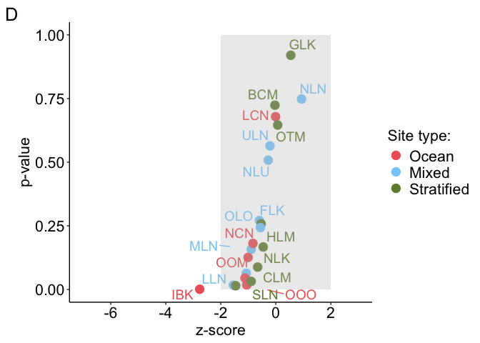
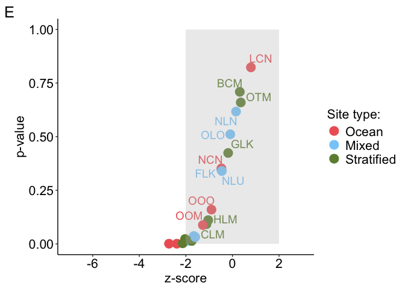
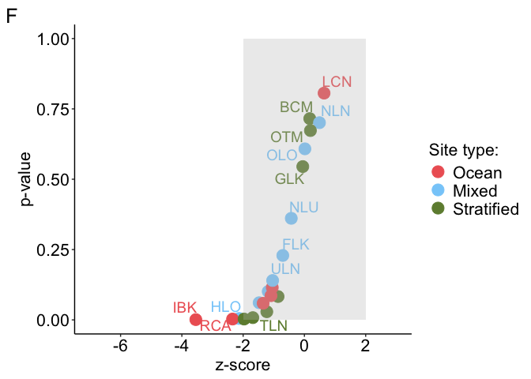
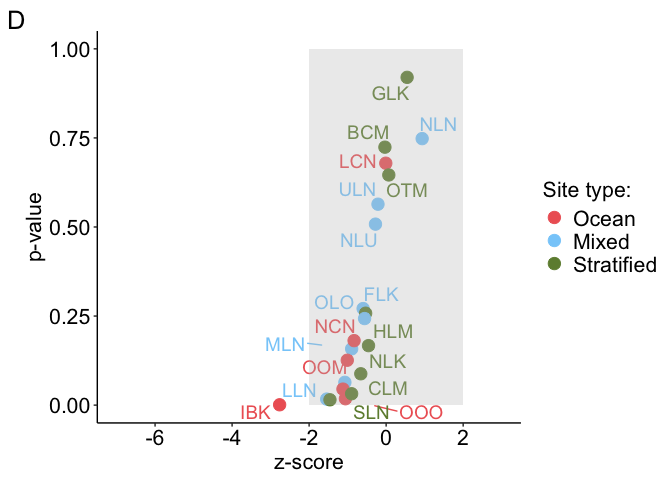
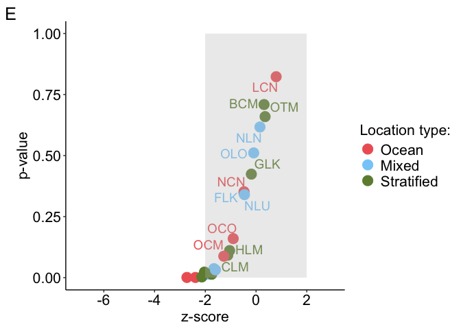
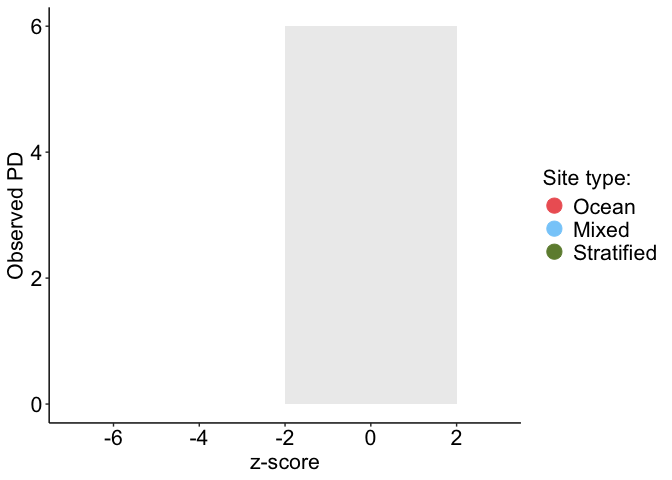

Phylogenetic diversity analyses
================

### Load packages and files

``` r
# Load the knitr package if not already loaded
library(knitr)

# Source the R Markdown file
knit("/Users/bailey/Documents/research/fish_biodiversity/src/collection/load_collection_data.Rmd", output = "/Users/bailey/Documents/research/fish_biodiversity/src/collection/load_collection_data.md")
```

    ## 
    ## 
    ## processing file: /Users/bailey/Documents/research/fish_biodiversity/src/collection/load_collection_data.Rmd

    ##   |                  |          |   0%  |                  |          |   3%                                                                          |                  |.         |   7% [Bringing everything together load modifying files packages]             |                  |.         |  10%                                                                          |                  |.         |  13% [Bringing everything together load in modifying files]                   |                  |..        |  17%                                                                          |                  |..        |  20% [Check species names across files]                                       |                  |..        |  23%                                                                          |                  |...       |  27% [Modify environment data]                                                |                  |...       |  30%                                                                          |                  |...       |  33% [Modify incidence matrices]                                              |                  |....      |  37%                                                                          |                  |....      |  40% [Modify phylogeny]                                                       |                  |....      |  43%                                                                          |                  |.....     |  47% [Modify trait data]                                                      |                  |.....     |  50%                                                                          |                  |.....     |  53% [Modify Site_type data frames]                                           |                  |......    |  57%                                                                          |                  |......    |  60% [Modify Site_type trait data]                                            |                  |......    |  63%                                                                          |                  |.......   |  67% [Site_type trait data tests]                                             |                  |.......   |  70%                                                                          |                  |.......   |  73% [Modify site trait data frames]                                          |                  |........  |  77%                                                                          |                  |........  |  80% [Site trait data tests]                                                  |                  |........  |  83%                                                                          |                  |......... |  87% [unnamed-chunk-5]                                                        |                  |......... |  90%                                                                          |                  |......... |  93% [unnamed-chunk-6]                                                        |                  |..........|  97%                                                                          |                  |..........| 100% [Bringing everything together load out modified files and session info]

    ## output file: /Users/bailey/Documents/research/fish_biodiversity/src/collection/load_collection_data.md

    ## [1] "/Users/bailey/Documents/research/fish_biodiversity/src/collection/load_collection_data.md"

``` r
# Packages
library(picante)
```

    ## Loading required package: vegan

    ## Loading required package: permute

    ## Loading required package: lattice

    ## 
    ## Attaching package: 'vegan'

    ## The following object is masked from 'package:phytools':
    ## 
    ##     scores

    ## Loading required package: nlme

    ## 
    ## Attaching package: 'nlme'

    ## The following object is masked from 'package:dplyr':
    ## 
    ##     collapse

``` r
library(vegan)
library(phytools)
library(ggplot2)
library(ggrepel)
library(caret)
```

    ## 
    ## Attaching package: 'caret'

    ## The following object is masked from 'package:vegan':
    ## 
    ##     tolerance

``` r
library(BAT)
```

    ## 
    ## Attaching package: 'BAT'

    ## The following object is masked from 'package:ggplot2':
    ## 
    ##     alpha

    ## The following object is masked from 'package:tidyr':
    ## 
    ##     fill

    ## The following objects are masked from 'package:base':
    ## 
    ##     beta, gamma

``` r
library(pairwiseAdonis)
```

    ## Loading required package: cluster

    ## 
    ## Attaching package: 'cluster'

    ## The following object is masked from 'package:maps':
    ## 
    ##     votes.repub

``` r
library(emmeans)
```

    ## Welcome to emmeans.
    ## Caution: You lose important information if you filter this package's results.
    ## See '? untidy'

``` r
# Site vectors
surveyed_sites <- c("BCM", "CLM", "FLK", "GLK", "HLM", "HLO", "IBK", "LCN", "LLN", "MLN", "NCN", "NLK", "NLN", "NLU", "OLO", "OOM", "OOO", "OTM", "RCA", "SLN", "TLN", "ULN")

surveyed_sites_wo_LCN <- c("BCM", "CLM", "FLK", "GLK", "HLM", "HLO", "IBK", "LLN", "MLN", "NCN", "NLK", "NLN", "NLU", "OLO", "OOM", "OOO", "OTM", "RCA", "SLN", "TLN", "ULN")

surveyed_sites_wo_TLN_HLM <- c("BCM", "CLM", "FLK", "GLK", "HLO", "IBK", "LCN", "LLN", "MLN", "NCN", "NLK", "NLN", "NLU", "OLO", "OOM", "OOO", "OTM", "RCA", "SLN", "ULN")

surveyed_sites_env <- c("BCM", "CLM", "FLK", "GLK", "HLM", "HLO", "IBK", "LLN", "MLN", "NCN", "NLK", "NLN", "NLU", "OLO", "OTM", "RCA", "SLN", "TLN", "ULN")

ocean_mixed_sites <- c("IBK", "LCN", "NCN", "OOO", "OOM", "RCA", "FLK", "HLO", "LLN", "MLN", "NLN", "NLU", "OLO", "ULN")

ocean_mixed_sites_env <- c("IBK", "NCN", "RCA", "FLK", "HLO", "LLN", "MLN", "NLN", "NLU", "OLO", "ULN")

ocean_stratified_sites <- c("IBK", "LCN", "NCN", "OOO", "OOM", "RCA", "BCM", "CLM", "GLK", "HLM", "NLK", "OTM", "SLN", "TLN")

ocean_stratified_sites_env <- c("IBK", "NCN", "RCA", "BCM", "CLM", "GLK", "HLM", "NLK", "OTM", "SLN", "TLN")

mixed_stratified_lakes <- c("BCM", "CLM", "FLK", "GLK", "HLM", "HLO", "LLN", "MLN", "NLK", "NLN", "NLU", "OLO", "OTM", "SLN", "TLN", "ULN")

ocean_sites <- c("IBK", "LCN", "NCN", "OOO", "OOM", "RCA")

ocean_sites_env <- c("IBK", "NCN", "RCA")

mixed_lakes <- c("FLK", "HLO", "LLN", "MLN", "NLN", "NLU", "OLO", "ULN")

stratified_lakes <- c("BCM", "CLM", "GLK", "HLM", "NLK", "OTM", "SLN", "TLN")

# Define your custom colors
custom_colors <- c("Reference" = "black", "Ocean" = "#EE6363", "Mixed" = "#87CEFA", "Stratified" = "#6E8B3D")

env_cont <- "orange"
```

### Edit input files

``` r
env <- env[order(env$X),]
presabs_lake <- presabs_lake[order(row.names(presabs_lake)),]
surveyed_sites_lake <- surveyed_sites_lake[order(row.names(surveyed_sites_lake)),]

Site_type_group_ref <- env[,19]
Site_type_group <- env[surveyed_sites,19]
```

# Phylogenetic Diversity

## PD alpha Diversity

### PD alpha mntd, mpd, and pd calculations of phylogeny and files to be saved

``` r
## Reference
# Dispersion
tree_disp <- dispersion(comm = presabs_lake, tree = tree, abund = F)
write.csv(tree_disp, "/Users/bailey/Documents/research/fish_biodiversity/data/analyses/PD/tree_disp.csv")

#Mean pairwise distances
tree_sesmpd <- ses.mpd(presabs_lake, cophenetic(tree), null.model = "taxa.labels", abundance.weighted = FALSE, runs = 999, iterations = 1000)
write.csv(tree_sesmpd, "/Users/bailey/Documents/research/fish_biodiversity/data/analyses/PD/tree_sesmpd.csv")

#Mean nearest taxon distances
tree_sesmntd <- ses.mntd(presabs_lake, cophenetic(tree), null.model = "taxa.labels", abundance.weighted = FALSE, runs = 999, iterations = 1000)
write.csv(tree_sesmntd, "/Users/bailey/Documents/research/fish_biodiversity/data/analyses/PD/tree_sesmntd.csv")

#Faith's PD
tree_sespd <- ses.pd(presabs_lake, tree, null.model = "taxa.labels", runs = 999, iterations = 1000, include.root = TRUE)
write.csv(tree_sespd, "/Users/bailey/Documents/research/fish_biodiversity/data/analyses/PD/tree_sespd.csv")


## Surveyed sites
# Dispersion
stree_disp <- dispersion(comm = surveyed_sites_lake, tree = stree, abund = F)
write.csv(stree_disp, "/Users/bailey/Documents/research/fish_biodiversity/data/analyses/PD/stree_disp.csv")

#Mean pairwise distances
stree_sesmpd <- ses.mpd(surveyed_sites_lake, cophenetic(stree), null.model = "taxa.labels", abundance.weighted = FALSE, runs = 999, iterations = 1000)
write.csv(stree_sesmpd, "/Users/bailey/Documents/research/fish_biodiversity/data/analyses/PD/stree_sesmpd.csv")

#Mean nearest taxon distances
stree_sesmntd <- ses.mntd(surveyed_sites_lake, cophenetic(stree), null.model = "taxa.labels", abundance.weighted = FALSE, runs = 999, iterations = 1000)
write.csv(stree_sesmntd, "/Users/bailey/Documents/research/fish_biodiversity/data/analyses/PD/stree_sesmntd.csv")

#Faith's PD
stree_sespd <- ses.pd(surveyed_sites_lake, stree, null.model = "taxa.labels", runs = 999, iterations = 1000, include.root = TRUE)
write.csv(stree_sespd, "/Users/bailey/Documents/research/fish_biodiversity/data/analyses/PD/stree_sespd.csv")
```

### PD alpha files mntd, mpd, and pd to read into R

- Read in Phylogenetic Diversity files and combine with env data frame

``` r
## Reference
# Dispersion 
tree_disp <-read.csv("/Users/bailey/Documents/research/fish_biodiversity/data/analyses/PD/tree_disp.csv")
tree_disp_env <- merge(tree_disp, env, by = "X", sort = F)
tree_disp_env$measure <- "tree_disp"
tree_disp_env$Site_type <- factor(tree_disp_env$Site_type, levels = c("Reference", "Ocean", "Mixed", "Stratified"))
row.names(tree_disp_env) <- tree_disp_env$X

# Mean pairwise distances
tree_sesmpd <- read.csv("/Users/bailey/Documents/research/fish_biodiversity/data/analyses/PD/tree_sesmpd.csv")
tree_sesmpd_env <- merge(tree_sesmpd, env, by = "X", sort = F)
tree_sesmpd_env$measure <- "tree_sesmpd"
tree_sesmpd_env$Site_type <- factor(tree_sesmpd_env$Site_type, levels = c("Reference", "Ocean", "Mixed", "Stratified"))
row.names(tree_sesmpd_env) <- tree_sesmpd_env$X

# Mean nearest taxon distances
tree_sesmntd <- read.csv("/Users/bailey/Documents/research/fish_biodiversity/data/analyses/PD/tree_sesmntd.csv")
tree_sesmntd_env <- merge(tree_sesmntd, env, by = "X", sort = F)
tree_sesmntd_env$measure <- "tree_sesmntd"
tree_sesmntd_env$Site_type <- factor(tree_sesmntd_env$Site_type, levels = c("Reference", "Ocean", "Mixed", "Stratified"))
row.names(tree_sesmntd_env) <- tree_sesmntd_env$X

#Faith's PD
tree_sespd <- read.csv("/Users/bailey/Documents/research/fish_biodiversity/data/analyses/PD/tree_sespd.csv")
tree_sespd_env <- merge(tree_sespd, env, by = "X", sort = F)
tree_sespd_env$measure <- "tree_sespd"
tree_sespd_env$Site_type <- factor(tree_sespd_env$Site_type, levels = c("Reference", "Ocean", "Mixed", "Stratified"))
stree_sespd_env <- merge(tree_sespd_env, tree_disp, by = "X", sort = F)
row.names(tree_sespd_env) <- tree_sespd_env$X


## Surveyed sites
# Dispersion 
stree_disp <-read.csv("/Users/bailey/Documents/research/fish_biodiversity/data/analyses/PD/stree_disp.csv")
stree_disp_env <- merge(stree_disp, env, by = "X", sort = F)
stree_disp_env$measure <- "stree_disp"
stree_disp_env$Site_type <- factor(stree_disp_env$Site_type, levels = c("Ocean", "Mixed", "Stratified"))
row.names(stree_disp_env) <- stree_disp_env$X

# Mean pairwise distances
stree_sesmpd <- read.csv("/Users/bailey/Documents/research/fish_biodiversity/data/analyses/PD/stree_sesmpd.csv")
stree_sesmpd_env <- merge(stree_sesmpd, env, by = "X", sort = F)
stree_sesmpd_env$measure <- "stree_sesmpd"
stree_sesmpd_env$Site_type <- factor(stree_sesmpd_env$Site_type, levels = c("Ocean", "Mixed", "Stratified"))
row.names(stree_sesmpd_env) <- stree_sesmpd_env$X

# Mean nearest taxon distances
stree_sesmntd <- read.csv("/Users/bailey/Documents/research/fish_biodiversity/data/analyses/PD/stree_sesmntd.csv")
stree_sesmntd_env <- merge(stree_sesmntd, env, by = "X", sort = F)
stree_sesmntd_env$measure <- "stree_sesmntd"
stree_sesmntd_env$Site_type <- factor(stree_sesmntd_env$Site_type, levels = c("Ocean", "Mixed", "Stratified"))
row.names(stree_sesmntd_env) <- stree_sesmntd_env$X

#Faith's PD
stree_sespd <-read.csv("/Users/bailey/Documents/research/fish_biodiversity/data/analyses/PD/stree_sespd.csv")
stree_sespd_env <- merge(stree_sespd, env, by = "X", sort = F)
stree_sespd_env$measure <- "stree_sespd"
stree_sespd_env$Site_type <- factor(stree_sespd_env$Site_type, levels = c("Ocean", "Mixed", "Stratified"))
stree_sespd_env <- merge(stree_sespd_env, stree_disp, by = "X", sort = F)
row.names(stree_sespd_env) <- stree_sespd_env$X
```

### PD alpha outliers for each site type

``` r
outlier_PD_alpha <- stree_sespd_env %>%
  group_by(Site_type) %>%
  mutate(
    Q1 = quantile(pd.obs.z, 0.25),
    Q3 = quantile(pd.obs.z, 0.75),
    IQR = Q3 - Q1,
    lower_bound = Q1 - 1.5 * IQR,
    upper_bound = Q3 + 1.5 * IQR,
    is_outlier = pd.obs.z < lower_bound | pd.obs.z > upper_bound
  )

outlier_PD_alpha <- as.data.frame(outlier_PD_alpha)
row.names(outlier_PD_alpha) <- outlier_PD_alpha$X

# Create the plot
(outlier_PD_alpha_plot <- ggplot(outlier_PD_alpha, aes(x = Site_type, y = pd.obs.z, fill = Site_type)) +
  geom_violin(trim = FALSE) +
  geom_jitter(aes(color = is_outlier), width = 0.2, size = 4, alpha = 0.7) +
  scale_color_manual(values = c("FALSE" = "black", "TRUE" = "purple")) +
  scale_fill_manual(values = custom_colors) +
  theme(text = element_text(size = 16),
        legend.position = "right",
        legend.title = element_text(size = 16),
        legend.text = element_text(size = 16),
        axis.line = element_line(color = "black"),
        panel.background = element_rect(fill='transparent'),
        plot.background = element_rect(fill='transparent', color=NA),
        panel.grid.major = element_blank(),
        panel.grid.minor = element_blank(),
        panel.border = element_blank(),
        axis.text = element_text(color = "black", size = 16)) +
  scale_y_continuous(expand = c(0,0)) +
  labs(y = "PD alpha z-scores", x = "Site type", color = "Outlier:", tag = "b")) +
  guides(fill = "none")
```

<!-- -->

``` r
ggsave("/Users/bailey/Documents/research/fish_biodiversity/figures/PD/outlier_PD_alpha.jpg", outlier_PD_alpha_plot, width = 6.26, height = 6, units = "in")
```

### Identify VIF of environmental and geographic variables

``` r
library(MASS)
```

    ## 
    ## Attaching package: 'MASS'

    ## The following object is masked from 'package:dplyr':
    ## 
    ##     select

``` r
# Determine which env variables have variance
environment <- c("temperature_median", "salinity_median", "oxygen_median", "pH_median")
nzv <- nearZeroVar(env[,environment])
nzv
```

    ## integer(0)

``` r
# All env variables have variance

mod <-  lm(pd.obs ~ temperature_median + salinity_median + oxygen_median + pH_median, stree_sespd_env)
summary(mod)
```

    ## 
    ## Call:
    ## lm(formula = pd.obs ~ temperature_median + salinity_median + 
    ##     oxygen_median + pH_median, data = stree_sespd_env)
    ## 
    ## Residuals:
    ##    Min     1Q Median     3Q    Max 
    ## -960.6 -344.4    5.4  266.2 1158.6 
    ## 
    ## Coefficients:
    ##                     Estimate Std. Error t value Pr(>|t|)  
    ## (Intercept)        -23046.44    7912.77  -2.913   0.0114 *
    ## temperature_median   -226.09     151.83  -1.489   0.1586  
    ## salinity_median        29.70      77.33   0.384   0.7067  
    ## oxygen_median         187.18     209.39   0.894   0.3865  
    ## pH_median            3973.56    1368.75   2.903   0.0116 *
    ## ---
    ## Signif. codes:  0 '***' 0.001 '**' 0.01 '*' 0.05 '.' 0.1 ' ' 1
    ## 
    ## Residual standard error: 638.1 on 14 degrees of freedom
    ##   (3 observations deleted due to missingness)
    ## Multiple R-squared:  0.8326, Adjusted R-squared:  0.7847 
    ## F-statistic:  17.4 on 4 and 14 DF,  p-value: 2.52e-05

``` r
Anova(mod, type = 3)
```

    ## Anova Table (Type III tests)
    ## 
    ## Response: pd.obs
    ##                     Sum Sq Df F value  Pr(>F)  
    ## (Intercept)        3454556  1  8.4830 0.01136 *
    ## temperature_median  902998  1  2.2174 0.15864  
    ## salinity_median      60080  1  0.1475 0.70668  
    ## oxygen_median       325406  1  0.7991 0.38648  
    ## pH_median          3432036  1  8.4277 0.01157 *
    ## Residuals          5701242 14                  
    ## ---
    ## Signif. codes:  0 '***' 0.001 '**' 0.01 '*' 0.05 '.' 0.1 ' ' 1

``` r
rms::vif(mod)
```

    ## temperature_median    salinity_median      oxygen_median          pH_median 
    ##           1.385456           3.435415           2.209454           4.821892

``` r
car::vif(mod)
```

    ## temperature_median    salinity_median      oxygen_median          pH_median 
    ##           1.385456           3.435415           2.209454           4.821892

``` r
mod <-  lm(pd.obs ~ temperature_median + salinity_median + oxygen_median, stree_sespd_env)
summary(mod)
```

    ## 
    ## Call:
    ## lm(formula = pd.obs ~ temperature_median + salinity_median + 
    ##     oxygen_median, data = stree_sespd_env)
    ## 
    ## Residuals:
    ##     Min      1Q  Median      3Q     Max 
    ## -1060.5  -388.2  -180.5   295.4  1777.7 
    ## 
    ## Coefficients:
    ##                    Estimate Std. Error t value Pr(>|t|)   
    ## (Intercept)        -5063.68    6020.36  -0.841  0.41350   
    ## temperature_median   -43.83     169.04  -0.259  0.79895   
    ## salinity_median      203.57      59.81   3.403  0.00393 **
    ## oxygen_median        588.26     192.40   3.057  0.00798 **
    ## ---
    ## Signif. codes:  0 '***' 0.001 '**' 0.01 '*' 0.05 '.' 0.1 ' ' 1
    ## 
    ## Residual standard error: 780.3 on 15 degrees of freedom
    ##   (3 observations deleted due to missingness)
    ## Multiple R-squared:  0.7317, Adjusted R-squared:  0.6781 
    ## F-statistic: 13.64 on 3 and 15 DF,  p-value: 0.0001466

``` r
Anova(mod, type = 3)
```

    ## Anova Table (Type III tests)
    ## 
    ## Response: pd.obs
    ##                     Sum Sq Df F value   Pr(>F)   
    ## (Intercept)         430749  1  0.7074 0.413504   
    ## temperature_median   40929  1  0.0672 0.798954   
    ## salinity_median    7052231  1 11.5822 0.003931 **
    ## oxygen_median      5692040  1  9.3483 0.007980 **
    ## Residuals          9133278 15                    
    ## ---
    ## Signif. codes:  0 '***' 0.001 '**' 0.01 '*' 0.05 '.' 0.1 ' ' 1

``` r
rms::vif(mod)
```

    ## temperature_median    salinity_median      oxygen_median 
    ##           1.148556           1.374749           1.247588

``` r
car::vif(mod)
```

    ## temperature_median    salinity_median      oxygen_median 
    ##           1.148556           1.374749           1.247588

``` r
environment <- c("temperature_median", "salinity_median", "oxygen_median")

mod <- aov(temperature_median ~ Site_type, stree_sespd_env)
summary(mod)
```

    ##             Df Sum Sq Mean Sq F value Pr(>F)
    ## Site_type    2   2.94   1.470   1.092  0.359
    ## Residuals   16  21.54   1.346               
    ## 3 observations deleted due to missingness

``` r
mod <- aov(pd.obs ~ temperature_median + Site_type, stree_sespd_env)
car::vif(mod)
```

    ##                        GVIF Df GVIF^(1/(2*Df))
    ## temperature_median 1.136543  1        1.066088
    ## Site_type          1.136543  2        1.032515

``` r
mod <- aov(salinity_median ~ Site_type, stree_sespd_env)
summary(mod)
```

    ##             Df Sum Sq Mean Sq F value   Pr(>F)    
    ## Site_type    2 147.34   73.67   13.61 0.000353 ***
    ## Residuals   16  86.62    5.41                     
    ## ---
    ## Signif. codes:  0 '***' 0.001 '**' 0.01 '*' 0.05 '.' 0.1 ' ' 1
    ## 3 observations deleted due to missingness

``` r
mod <- aov(pd.obs ~ salinity_median + Site_type, stree_sespd_env)
car::vif(mod)
```

    ##                     GVIF Df GVIF^(1/(2*Df))
    ## salinity_median 2.701125  1        1.643510
    ## Site_type       2.701125  2        1.281995

``` r
mod <- aov(oxygen_median ~ Site_type, stree_sespd_env)
summary(mod)
```

    ##             Df Sum Sq Mean Sq F value   Pr(>F)    
    ## Site_type    2 14.440    7.22      19 5.95e-05 ***
    ## Residuals   16  6.081    0.38                     
    ## ---
    ## Signif. codes:  0 '***' 0.001 '**' 0.01 '*' 0.05 '.' 0.1 ' ' 1
    ## 3 observations deleted due to missingness

``` r
mod <- aov(pd.obs ~ oxygen_median + Site_type, stree_sespd_env)
car::vif(mod)
```

    ##                   GVIF Df GVIF^(1/(2*Df))
    ## oxygen_median 3.374424  1        1.836961
    ## Site_type     3.374424  2        1.355345

``` r
SR_ss_env <- stree_sespd_env[surveyed_sites_env,]
SR_ss_env$Site_type <- factor(SR_ss_env$Site_type, levels = c("Ocean", "Mixed", "Stratified"))

# Run linear discriminant analysis of environmental variables
LDA <- lda(SR_ss_env[,environment], SR_ss_env$Site_type)
spe.class <- predict(LDA)$class
spe.post <- predict(LDA)$posterior
(spe.table <- table(SR_ss_env$Site_type, spe.class))
```

    ##             spe.class
    ##              Ocean Mixed Stratified
    ##   Ocean          1     2          0
    ##   Mixed          0     8          0
    ##   Stratified     0     0          8

``` r
diag(prop.table(spe.table, 1))
```

    ##      Ocean      Mixed Stratified 
    ##  0.3333333  1.0000000  1.0000000

``` r
# Determine which geo variables have variance
geography <- c("volume_m3_w_chemocline", "volume_m3", "surface_area_m2", "distance_to_ocean_min_m", "distance_to_ocean_mean_m", "distance_to_ocean_median_m", "tidal_lag_time_minutes", "tidal_efficiency", "perimeter_fromSat", "max_depth", "logArea")
nzv <- nearZeroVar(env[,geography])
nzv
```

    ## integer(0)

``` r
# All geo variables have variance

mod <-  lm(pd.obs ~ volume_m3_w_chemocline + volume_m3 + surface_area_m2 + distance_to_ocean_min_m + distance_to_ocean_mean_m + distance_to_ocean_median_m + tidal_lag_time_minutes + tidal_efficiency + perimeter_fromSat + max_depth + logArea, stree_sespd_env)
summary(mod)
```

    ## 
    ## Call:
    ## lm(formula = pd.obs ~ volume_m3_w_chemocline + volume_m3 + surface_area_m2 + 
    ##     distance_to_ocean_min_m + distance_to_ocean_mean_m + distance_to_ocean_median_m + 
    ##     tidal_lag_time_minutes + tidal_efficiency + perimeter_fromSat + 
    ##     max_depth + logArea, data = stree_sespd_env)
    ## 
    ## Residuals:
    ##      Min       1Q   Median       3Q      Max 
    ## -1236.90  -373.04    26.01   421.08  1540.38 
    ## 
    ## Coefficients:
    ##                              Estimate Std. Error t value Pr(>|t|)  
    ## (Intercept)                -3.481e+03  5.821e+03  -0.598    0.565  
    ## volume_m3_w_chemocline      1.813e-03  2.127e-03   0.852    0.416  
    ## volume_m3                  -1.536e-03  2.204e-03  -0.697    0.503  
    ## surface_area_m2            -3.984e-03  2.120e-03  -1.879    0.093 .
    ## distance_to_ocean_min_m    -3.792e+00  1.163e+01  -0.326    0.752  
    ## distance_to_ocean_mean_m    2.534e+01  4.939e+01   0.513    0.620  
    ## distance_to_ocean_median_m -2.641e+01  4.540e+01  -0.582    0.575  
    ## tidal_lag_time_minutes     -8.253e+00  1.363e+01  -0.606    0.560  
    ## tidal_efficiency           -5.195e+02  3.631e+03  -0.143    0.889  
    ## perimeter_fromSat          -6.617e-01  8.975e-01  -0.737    0.480  
    ## max_depth                  -3.843e+01  5.981e+01  -0.643    0.536  
    ## logArea                     8.836e+02  5.809e+02   1.521    0.163  
    ## ---
    ## Signif. codes:  0 '***' 0.001 '**' 0.01 '*' 0.05 '.' 0.1 ' ' 1
    ## 
    ## Residual standard error: 966.8 on 9 degrees of freedom
    ##   (1 observation deleted due to missingness)
    ## Multiple R-squared:  0.7095, Adjusted R-squared:  0.3544 
    ## F-statistic: 1.998 on 11 and 9 DF,  p-value: 0.1541

``` r
Anova(mod, type = 3)
```

    ## Anova Table (Type III tests)
    ## 
    ## Response: pd.obs
    ##                             Sum Sq Df F value  Pr(>F)  
    ## (Intercept)                 334277  1  0.3577 0.56456  
    ## volume_m3_w_chemocline      679038  1  0.7265 0.41612  
    ## volume_m3                   454018  1  0.4858 0.50342  
    ## surface_area_m2            3299154  1  3.5299 0.09298 .
    ## distance_to_ocean_min_m      99395  1  0.1063 0.75180  
    ## distance_to_ocean_mean_m    245998  1  0.2632 0.62028  
    ## distance_to_ocean_median_m  316251  1  0.3384 0.57505  
    ## tidal_lag_time_minutes      342739  1  0.3667 0.55976  
    ## tidal_efficiency             19133  1  0.0205 0.88938  
    ## perimeter_fromSat           508096  1  0.5436 0.47971  
    ## max_depth                   385984  1  0.4130 0.53649  
    ## logArea                    2162579  1  2.3138 0.16255  
    ## Residuals                  8411739  9                  
    ## ---
    ## Signif. codes:  0 '***' 0.001 '**' 0.01 '*' 0.05 '.' 0.1 ' ' 1

``` r
rms::vif(mod)
```

    ##     volume_m3_w_chemocline                  volume_m3 
    ##                 6433.74411                 6855.30224 
    ##            surface_area_m2    distance_to_ocean_min_m 
    ##                   22.87840                   18.42491 
    ##   distance_to_ocean_mean_m distance_to_ocean_median_m 
    ##                  825.68615                  687.45478 
    ##     tidal_lag_time_minutes           tidal_efficiency 
    ##                   21.17746                   27.90908 
    ##          perimeter_fromSat                  max_depth 
    ##                   94.39757                   10.74366 
    ##                    logArea 
    ##                   25.70304

``` r
car::vif(mod)
```

    ##     volume_m3_w_chemocline                  volume_m3 
    ##                 6433.74411                 6855.30224 
    ##            surface_area_m2    distance_to_ocean_min_m 
    ##                   22.87840                   18.42491 
    ##   distance_to_ocean_mean_m distance_to_ocean_median_m 
    ##                  825.68615                  687.45478 
    ##     tidal_lag_time_minutes           tidal_efficiency 
    ##                   21.17746                   27.90908 
    ##          perimeter_fromSat                  max_depth 
    ##                   94.39757                   10.74366 
    ##                    logArea 
    ##                   25.70304

``` r
mod <-  lm(pd.obs ~ distance_to_ocean_min_m + max_depth + logArea, stree_sespd_env)
summary(mod)
```

    ## 
    ## Call:
    ## lm(formula = pd.obs ~ distance_to_ocean_min_m + max_depth + logArea, 
    ##     data = stree_sespd_env)
    ## 
    ## Residuals:
    ##     Min      1Q  Median      3Q     Max 
    ## -1739.8  -528.6    69.2   274.2  2683.2 
    ## 
    ## Coefficients:
    ##                         Estimate Std. Error t value Pr(>|t|)  
    ## (Intercept)             1894.996   1521.690   1.245    0.229  
    ## distance_to_ocean_min_m   -9.726      3.431  -2.835    0.011 *
    ## max_depth                 -6.612     25.223  -0.262    0.796  
    ## logArea                  131.270    151.202   0.868    0.397  
    ## ---
    ## Signif. codes:  0 '***' 0.001 '**' 0.01 '*' 0.05 '.' 0.1 ' ' 1
    ## 
    ## Residual standard error: 1093 on 18 degrees of freedom
    ## Multiple R-squared:  0.4137, Adjusted R-squared:  0.3159 
    ## F-statistic: 4.233 on 3 and 18 DF,  p-value: 0.01981

``` r
Anova(mod, type = 3)
```

    ## Anova Table (Type III tests)
    ## 
    ## Response: pd.obs
    ##                           Sum Sq Df F value  Pr(>F)  
    ## (Intercept)              1851004  1  1.5508 0.22898  
    ## distance_to_ocean_min_m  9591272  1  8.0359 0.01099 *
    ## max_depth                  82010  1  0.0687 0.79620  
    ## logArea                   899626  1  0.7537 0.39672  
    ## Residuals               21484032 18                  
    ## ---
    ## Signif. codes:  0 '***' 0.001 '**' 0.01 '*' 0.05 '.' 0.1 ' ' 1

``` r
rms::vif(mod)
```

    ## distance_to_ocean_min_m               max_depth                 logArea 
    ##                1.258244                1.497112                1.392300

``` r
car::vif(mod)
```

    ## distance_to_ocean_min_m               max_depth                 logArea 
    ##                1.258244                1.497112                1.392300

``` r
geography <- c("distance_to_ocean_min_m", "max_depth", "logArea")

mod <- aov(distance_to_ocean_min_m ~ Site_type, stree_sespd_env)
summary(mod)
```

    ##             Df Sum Sq Mean Sq F value   Pr(>F)    
    ## Site_type    2  80935   40468   16.49 7.05e-05 ***
    ## Residuals   19  46637    2455                     
    ## ---
    ## Signif. codes:  0 '***' 0.001 '**' 0.01 '*' 0.05 '.' 0.1 ' ' 1

``` r
mod <- aov(pd.obs ~ distance_to_ocean_min_m + Site_type, stree_sespd_env)
car::vif(mod)
```

    ##                             GVIF Df GVIF^(1/(2*Df))
    ## distance_to_ocean_min_m 2.735421  1        1.653911
    ## Site_type               2.735421  2        1.286045

``` r
mod <- aov(max_depth ~ Site_type, stree_sespd_env)
summary(mod)
```

    ##             Df Sum Sq Mean Sq F value Pr(>F)
    ## Site_type    2    535   267.5   2.235  0.134
    ## Residuals   19   2274   119.7

``` r
mod <- aov(pd.obs ~ max_depth + Site_type, stree_sespd_env)
car::vif(mod)
```

    ##               GVIF Df GVIF^(1/(2*Df))
    ## max_depth 1.235315  1        1.111447
    ## Site_type 1.235315  2        1.054252

``` r
mod <- aov(logArea ~ Site_type, stree_sespd_env)
summary(mod)
```

    ##             Df Sum Sq Mean Sq F value Pr(>F)
    ## Site_type    2  14.37   7.184   2.341  0.123
    ## Residuals   19  58.32   3.069

``` r
mod <- aov(pd.obs ~ logArea + Site_type, stree_sespd_env)
car::vif(mod)
```

    ##               GVIF Df GVIF^(1/(2*Df))
    ## logArea   1.246371  1        1.116410
    ## Site_type 1.246371  2        1.056603

``` r
SR_ss_geo <- stree_sespd_env[surveyed_sites,]
SR_ss_geo$Site_type <- factor(SR_ss_geo$Site_type, levels = c("Ocean", "Mixed", "Stratified"))

# Run linear discriminant analysis of geographical variables
LDA <- lda(SR_ss_geo[,geography], SR_ss_geo$Site_type)
spe.class <- predict(LDA)$class
spe.post <- predict(LDA)$posterior
(spe.table <- table(SR_ss_geo$Site_type, spe.class))
```

    ##             spe.class
    ##              Ocean Mixed Stratified
    ##   Ocean          4     2          0
    ##   Mixed          0     8          0
    ##   Stratified     0     2          6

``` r
diag(prop.table(spe.table, 1))
```

    ##      Ocean      Mixed Stratified 
    ##  0.6666667  1.0000000  0.7500000

``` r
# Combine environment and geography
mod <-  lm(pd.obs ~ salinity_median + oxygen_median + temperature_median + distance_to_ocean_min_m + max_depth + logArea, stree_sespd_env)
summary(mod)
```

    ## 
    ## Call:
    ## lm(formula = pd.obs ~ salinity_median + oxygen_median + temperature_median + 
    ##     distance_to_ocean_min_m + max_depth + logArea, data = stree_sespd_env)
    ## 
    ## Residuals:
    ##      Min       1Q   Median       3Q      Max 
    ## -1338.44  -234.51   -29.79   376.69  1083.33 
    ## 
    ## Coefficients:
    ##                           Estimate Std. Error t value Pr(>|t|)  
    ## (Intercept)             -6532.6687  6930.2272  -0.943   0.3645  
    ## salinity_median           221.6224    90.9978   2.435   0.0314 *
    ## oxygen_median             422.0351   194.7223   2.167   0.0510 .
    ## temperature_median       -104.4125   186.7860  -0.559   0.5864  
    ## distance_to_ocean_min_m     0.9776     4.2929   0.228   0.8237  
    ## max_depth                 -39.9509    25.2787  -1.580   0.1400  
    ## logArea                   409.5474   173.0952   2.366   0.0357 *
    ## ---
    ## Signif. codes:  0 '***' 0.001 '**' 0.01 '*' 0.05 '.' 0.1 ' ' 1
    ## 
    ## Residual standard error: 717.9 on 12 degrees of freedom
    ##   (3 observations deleted due to missingness)
    ## Multiple R-squared:  0.8183, Adjusted R-squared:  0.7275 
    ## F-statistic:  9.01 on 6 and 12 DF,  p-value: 0.0007177

``` r
Anova(mod, type = 3)
```

    ## Anova Table (Type III tests)
    ## 
    ## Response: pd.obs
    ##                          Sum Sq Df F value  Pr(>F)  
    ## (Intercept)              457976  1  0.8886 0.36446  
    ## salinity_median         3057189  1  5.9315 0.03142 *
    ## oxygen_median           2421151  1  4.6975 0.05103 .
    ## temperature_median       161054  1  0.3125 0.58645  
    ## distance_to_ocean_min_m   26727  1  0.0519 0.82370  
    ## max_depth               1287359  1  2.4977 0.14000  
    ## logArea                 2885324  1  5.5981 0.03566 *
    ## Residuals               6184967 12                  
    ## ---
    ## Signif. codes:  0 '***' 0.001 '**' 0.01 '*' 0.05 '.' 0.1 ' ' 1

``` r
rms::vif(mod)
```

    ##         salinity_median           oxygen_median      temperature_median 
    ##                3.758774                1.509635                1.656753 
    ## distance_to_ocean_min_m               max_depth                 logArea 
    ##                3.720344                2.979442                2.810937

``` r
car::vif(mod)
```

    ##         salinity_median           oxygen_median      temperature_median 
    ##                3.758774                1.509635                1.656753 
    ## distance_to_ocean_min_m               max_depth                 logArea 
    ##                3.720344                2.979442                2.810937

``` r
mod <-  lm(pd.obs ~ oxygen_median + temperature_median + distance_to_ocean_min_m + logArea, stree_sespd_env)
summary(mod)
```

    ## 
    ## Call:
    ## lm(formula = pd.obs ~ oxygen_median + temperature_median + distance_to_ocean_min_m + 
    ##     logArea, data = stree_sespd_env)
    ## 
    ## Residuals:
    ##     Min      1Q  Median      3Q     Max 
    ## -1089.1  -515.5  -131.7   467.2  1618.6 
    ## 
    ## Coefficients:
    ##                         Estimate Std. Error t value Pr(>|t|)  
    ## (Intercept)             6866.106   6017.217   1.141   0.2730  
    ## oxygen_median            529.669    224.507   2.359   0.0334 *
    ## temperature_median      -276.362    207.914  -1.329   0.2050  
    ## distance_to_ocean_min_m   -7.323      3.103  -2.360   0.0333 *
    ## logArea                  240.988    144.789   1.664   0.1182  
    ## ---
    ## Signif. codes:  0 '***' 0.001 '**' 0.01 '*' 0.05 '.' 0.1 ' ' 1
    ## 
    ## Residual standard error: 856.9 on 14 degrees of freedom
    ##   (3 observations deleted due to missingness)
    ## Multiple R-squared:  0.6981, Adjusted R-squared:  0.6118 
    ## F-statistic: 8.092 on 4 and 14 DF,  p-value: 0.001346

``` r
Anova(mod, type = 3)
```

    ## Anova Table (Type III tests)
    ## 
    ## Response: pd.obs
    ##                           Sum Sq Df F value  Pr(>F)  
    ## (Intercept)               956066  1  1.3021 0.27298  
    ## oxygen_median            4087034  1  5.5661 0.03337 *
    ## temperature_median       1297314  1  1.7668 0.20503  
    ## distance_to_ocean_min_m  4089851  1  5.5699 0.03332 *
    ## logArea                  2034131  1  2.7703 0.11824  
    ## Residuals               10279839 14                  
    ## ---
    ## Signif. codes:  0 '***' 0.001 '**' 0.01 '*' 0.05 '.' 0.1 ' ' 1

``` r
rms::vif(mod)
```

    ##           oxygen_median      temperature_median distance_to_ocean_min_m 
    ##                1.408629                1.440908                1.364232 
    ##                 logArea 
    ##                1.380536

``` r
car::vif(mod)
```

    ##           oxygen_median      temperature_median distance_to_ocean_min_m 
    ##                1.408629                1.440908                1.364232 
    ##                 logArea 
    ##                1.380536

``` r
envgeo <- c("oxygen_median", "temperature_median", "distance_to_ocean_min_m", "logArea")


# Run linear discriminant analysis of geographical variables
LDA <- lda(SR_ss_env[,envgeo], SR_ss_env$Site_type)
spe.class <- predict(LDA)$class
spe.post <- predict(LDA)$posterior
(spe.table <- table(SR_ss_env$Site_type, spe.class))
```

    ##             spe.class
    ##              Ocean Mixed Stratified
    ##   Ocean          3     0          0
    ##   Mixed          1     7          0
    ##   Stratified     0     1          7

``` r
diag(prop.table(spe.table, 1))
```

    ##      Ocean      Mixed Stratified 
    ##      1.000      0.875      0.875

### PD alpha & site type

``` r
### Site_type
# Run ANOVA on the original data
anova_PRic_result <- aov(pd.obs ~ Site_type, data = stree_sespd_env[surveyed_sites,])
summary(anova_PRic_result)
```

    ##             Df   Sum Sq  Mean Sq F value   Pr(>F)    
    ## Site_type    2 23597133 11798567   17.19 5.48e-05 ***
    ## Residuals   19 13044225   686538                     
    ## ---
    ## Signif. codes:  0 '***' 0.001 '**' 0.01 '*' 0.05 '.' 0.1 ' ' 1

``` r
# Perform Tukey's HSD test
tukey_PRic_result <- TukeyHSD(anova_PRic_result)
print(tukey_PRic_result)
```

    ##   Tukey multiple comparisons of means
    ##     95% family-wise confidence level
    ## 
    ## Fit: aov(formula = pd.obs ~ Site_type, data = stree_sespd_env[surveyed_sites, ])
    ## 
    ## $Site_type
    ##                        diff        lwr        upr     p adj
    ## Mixed-Ocean        218.8183  -917.9877  1355.6244 0.8773441
    ## Stratified-Ocean -2020.3990 -3157.2051  -883.5929 0.0006627
    ## Stratified-Mixed -2239.2173 -3291.6953 -1186.7394 0.0000923

``` r
# Sites
N <- length(anova_PRic_result$residuals)
# Categories
k <- length(anova_PRic_result$coefficients)
# Sum of squares
SS <- sum(resid(anova_PRic_result)^2) # from anova, the residual SS
# Mean squares
MS <- SS/(N-k)
# Balanced
BSE <- sqrt(MS / 8)
# Unbalanced
USE <- sqrt((MS/2)*((1/6)+(1/8)))

# Get differences
Site_type <- tukey_PRic_result$Site_type

# q-values
(OM_q <- (abs(Site_type[1,1]))/USE)
```

    ## [1] 0.6915491

``` r
(MS_q <- (abs(Site_type[3,1]))/BSE)
```

    ## [1] 7.643793

``` r
(SO_q <- (abs(Site_type[2,1]))/USE)
```

    ## [1] 6.385228

``` r
# Check values here https://www.socscistatistics.com/pvalues/qdistribution.aspx

# Run ANOVA on the original data
anova_PRicz_result <- aov(pd.obs.z ~ Site_type, data = stree_sespd_env[surveyed_sites,])
summary(anova_PRicz_result)
```

    ##             Df Sum Sq Mean Sq F value Pr(>F)
    ## Site_type    2  1.838   0.919   0.888  0.428
    ## Residuals   19 19.668   1.035

``` r
# Perform Tukey's HSD test
tukey_PRicz_result <- TukeyHSD(anova_PRicz_result)
print(tukey_PRicz_result)
```

    ##   Tukey multiple comparisons of means
    ##     95% family-wise confidence level
    ## 
    ## Fit: aov(formula = pd.obs.z ~ Site_type, data = stree_sespd_env[surveyed_sites, ])
    ## 
    ## $Site_type
    ##                          diff        lwr      upr     p adj
    ## Mixed-Ocean      0.6488785535 -0.7470411 2.044798 0.4784457
    ## Stratified-Ocean 0.6491655128 -0.7467542 2.045085 0.4781464
    ## Stratified-Mixed 0.0002869593 -1.2920836 1.292657 0.9999998

``` r
# Sites
N <- length(anova_PRicz_result$residuals)
# Categories
k <- length(anova_PRicz_result$coefficients)
# Sum of squares
SS <- sum(resid(anova_PRicz_result)^2) # from anova, the residual SS
# Mean squares
MS <- SS/(N-k)
# Balanced
BSE <- sqrt(MS / 8)
# Unbalanced
USE <- sqrt((MS/2)*((1/6)+(1/8)))

# Get differences
Site_type <- tukey_PRicz_result$Site_type

# q-values
(OM_q <- (abs(Site_type[1,1]))/USE)
```

    ## [1] 1.670047

``` r
(MS_q <- (abs(Site_type[3,1]))/BSE)
```

    ## [1] 0.0007977355

``` r
(SO_q <- (abs(Site_type[2,1]))/USE)
```

    ## [1] 1.670785

``` r
# Check values here https://www.socscistatistics.com/pvalues/qdistribution.aspx

# Run ANOVA on the original data
anova_PDisp_result <- aov(Dispersion ~ Site_type, data = stree_sespd_env[surveyed_sites,])
summary(anova_PDisp_result)
```

    ##             Df   Sum Sq   Mean Sq F value Pr(>F)
    ## Site_type    2 0.000707 0.0003537   0.703  0.507
    ## Residuals   19 0.009556 0.0005030

``` r
# Perform Tukey's HSD test
tukey_PDisp_result <- TukeyHSD(anova_PDisp_result)
print(tukey_PDisp_result)
```

    ##   Tukey multiple comparisons of means
    ##     95% family-wise confidence level
    ## 
    ## Fit: aov(formula = Dispersion ~ Site_type, data = stree_sespd_env[surveyed_sites, ])
    ## 
    ## $Site_type
    ##                          diff         lwr        upr     p adj
    ## Mixed-Ocean       0.007071665 -0.02369775 0.03784108 0.8302990
    ## Stratified-Ocean -0.006219734 -0.03698915 0.02454968 0.8657120
    ## Stratified-Mixed -0.013291399 -0.04177834 0.01519555 0.4759158

``` r
# Sites
N <- length(anova_PDisp_result$residuals)
# Categories
k <- length(anova_PDisp_result$coefficients)
# Sum of squares
SS <- sum(resid(anova_PDisp_result)^2) # from anova, the residual SS
# Mean squares
MS <- SS/(N-k)
# Balanced
BSE <- sqrt(MS / 8)
# Unbalanced
USE <- sqrt((MS/2)*((1/6)+(1/8)))

# Get differences
Site_type <- tukey_PDisp_result$Site_type

# q-values
(OM_q <- (abs(Site_type[1,1]))/USE)
```

    ## [1] 0.825711

``` r
(MS_q <- (abs(Site_type[3,1]))/BSE)
```

    ## [1] 1.676295

``` r
(SO_q <- (abs(Site_type[2,1]))/USE)
```

    ## [1] 0.7262367

``` r
# Check values here https://www.socscistatistics.com/pvalues/qdistribution.aspx
```

### PD alpha env and geo plots

``` r
# Temperature
PD_alpha_T_plot <- ggplot(data = stree_sespd_env[surveyed_sites_env,], mapping = aes(y = pd.obs.z, x = temperature_median, color = Site_type, fill = Site_type)) + 
  geom_point(stat = 'identity',
  size = 4,
  alpha = 1) + 
  geom_smooth(method = "lm", se = FALSE) +
  geom_text_repel(label = stree_sespd_env[surveyed_sites_env,1], size = 5, point.padding = 3) +
  scale_color_manual(values = custom_colors) +
  scale_fill_manual(values = custom_colors) +
  theme_bw() +
  theme(text = element_text(size = 16),legend.title =  element_text(size = 16), legend.text = element_text(size = 16),
  axis.text = element_text(size = 16, color = "black"),
  axis.line = element_line(color = "black"),
  panel.background = element_rect(fill='transparent'),
  plot.background = element_rect(fill='transparent', color=NA),
  panel.grid.major = element_blank(),
  panel.grid.minor = element_blank(),
  panel.border = element_blank()) + 
  labs(x="Temperature (ºC)", y="SRic", colour = "Site type:", fill = "Site type:", tag = "a")
(PD_alpha_T_plot <- PD_alpha_T_plot + guides(color = guide_legend(override.aes = list(label = ""))))
```

    ## `geom_smooth()` using formula = 'y ~ x'

<!-- -->

``` r
ggsave("/Users/bailey/Documents/research/fish_biodiversity/figures/PD/PD_alpha_T_plot.jpg", plot = PD_alpha_T_plot, width = 6.26, height = 6, units = "in")
```

    ## `geom_smooth()` using formula = 'y ~ x'

``` r
# Salinity
PD_alpha_S_plot <- ggplot(data = stree_sespd_env[surveyed_sites_env,], mapping = aes(y = pd.obs.z, x = salinity_median, color = Site_type, fill = Site_type)) + 
  geom_point(stat = 'identity',
  size = 4,
  alpha = 1) + 
  geom_smooth(method = "lm", se = FALSE) +
  geom_text_repel(label = stree_sespd_env[surveyed_sites_env,1], size = 5, point.padding = 3) +
  scale_color_manual(values = custom_colors) +
  scale_fill_manual(values = custom_colors) +
  theme_bw() +
  theme(text = element_text(size = 16),legend.title =  element_text(size = 16), legend.text = element_text(size = 16),
  axis.text = element_text(size = 16, color = "black"),
  axis.line = element_line(color = "black"),
  panel.background = element_rect(fill='transparent'),
  plot.background = element_rect(fill='transparent', color=NA),
  panel.grid.major = element_blank(),
  panel.grid.minor = element_blank(),
  panel.border = element_blank()) + 
  labs(x="Salinity (ppt)", y="SRic", colour = "Site type:", fill = "Site type:", tag = "b")
(PD_alpha_S_plot <- PD_alpha_S_plot + guides(color = guide_legend(override.aes = list(label = ""))))
```

    ## `geom_smooth()` using formula = 'y ~ x'

<!-- -->

``` r
ggsave("/Users/bailey/Documents/research/fish_biodiversity/figures/PD/PD_alpha_S_plot.jpg", plot = PD_alpha_S_plot, width = 6.26, height = 6, units = "in")
```

    ## `geom_smooth()` using formula = 'y ~ x'

``` r
# Oxygen
PD_alpha_O_plot <- ggplot(data = stree_sespd_env[surveyed_sites_env,], mapping = aes(y = pd.obs.z, x = oxygen_median, color = Site_type, fill = Site_type)) + 
  geom_point(stat = 'identity',
  size = 4,
  alpha = 1) + 
  geom_smooth(method = "lm", se = FALSE) +
  geom_text_repel(label = stree_sespd_env[surveyed_sites_env,1], size = 5, point.padding = 3) +
  scale_color_manual(values = custom_colors) +
  scale_fill_manual(values = custom_colors) +
  theme_bw() +
  theme(text = element_text(size = 16),legend.title =  element_text(size = 16), legend.text = element_text(size = 16),
  axis.text = element_text(size = 16, color = "black"),
  axis.line = element_line(color = "black"),
  panel.background = element_rect(fill='transparent'),
  plot.background = element_rect(fill='transparent', color=NA),
  panel.grid.major = element_blank(),
  panel.grid.minor = element_blank(),
  panel.border = element_blank()) + 
  labs(x="Oxygen (mg/L)", y="Log SRic", colour = "Site type:", fill = "Site type:", tag = "c")
(PD_alpha_O_plot <- PD_alpha_O_plot + guides(color = guide_legend(override.aes = list(label = ""))))
```

    ## `geom_smooth()` using formula = 'y ~ x'

<!-- -->

``` r
ggsave("/Users/bailey/Documents/research/fish_biodiversity/figures/PD/PD_alpha_O_plot.jpg", plot = PD_alpha_O_plot, width = 6.26, height = 6, units = "in")
```

    ## `geom_smooth()` using formula = 'y ~ x'

``` r
# Distance from the ocean mean
PD_alpha_D_plot <- ggplot(data = stree_sespd_env[surveyed_sites,], mapping = aes(y = pd.obs.z, x = distance_to_ocean_min_m, color = Site_type, fill = Site_type)) + 
  geom_point(stat = 'identity',
  size = 4,
  alpha = 1) + 
  geom_smooth(method = "lm", se = FALSE) +
  geom_text_repel(label = stree_sespd_env[surveyed_sites,1], size = 5, point.padding = 3) +
  scale_color_manual(values = custom_colors) +
  scale_fill_manual(values = custom_colors) +
  theme_bw() +
  theme(text = element_text(size = 16),legend.title =  element_text(size = 16), legend.text = element_text(size = 16),
  axis.text = element_text(size = 16, color = "black"),
  axis.line = element_line(color = "black"),
  panel.background = element_rect(fill='transparent'),
  plot.background = element_rect(fill='transparent', color=NA),
  panel.grid.major = element_blank(),
  panel.grid.minor = element_blank(),
  panel.border = element_blank()) + 
  labs(x="Isolation (m)", y="SRic", colour = "Site type:", fill = "Site type:", tag = "a")
(PD_alpha_D_plot <- PD_alpha_D_plot + guides(color = guide_legend(override.aes = list(label = ""))))
```

    ## `geom_smooth()` using formula = 'y ~ x'

<!-- -->

``` r
ggsave("/Users/bailey/Documents/research/fish_biodiversity/figures/PD/PD_alpha_D_plot.jpg", plot = PD_alpha_D_plot, width = 6.26, height = 6, units = "in")
```

    ## `geom_smooth()` using formula = 'y ~ x'

``` r
# Max depth
PD_alpha_MD_plot <- ggplot(data = stree_sespd_env[surveyed_sites,], mapping = aes(y = pd.obs.z, x = max_depth, color = Site_type, fill = Site_type)) + 
  geom_point(stat = 'identity',
  size = 4,
  alpha = 1) + 
  geom_smooth(method = "lm", se = FALSE) +
  geom_text_repel(label = stree_sespd_env[surveyed_sites,1], size = 5, point.padding = 3) +
  scale_color_manual(values = custom_colors) +
  scale_fill_manual(values = custom_colors) +
  theme_bw() +
  theme(text = element_text(size = 16),legend.title =  element_text(size = 16), legend.text = element_text(size = 16),
  axis.text = element_text(size = 16, color = "black"),
  axis.line = element_line(color = "black"),
  panel.background = element_rect(fill='transparent'),
  plot.background = element_rect(fill='transparent', color=NA),
  panel.grid.major = element_blank(),
  panel.grid.minor = element_blank(),
  panel.border = element_blank()) + 
  labs(x="Age (m)", y="SRic", colour = "Site type:", fill = "Site type:", tag = "b")
(PD_alpha_MD_plot <- PD_alpha_MD_plot + guides(color = guide_legend(override.aes = list(label = ""))))
```

    ## `geom_smooth()` using formula = 'y ~ x'

<!-- -->

``` r
ggsave("/Users/bailey/Documents/research/fish_biodiversity/figures/PD/PD_alpha_MD_plot.jpg", plot = PD_alpha_MD_plot, width = 6.26, height = 6, units = "in")
```

    ## `geom_smooth()` using formula = 'y ~ x'

``` r
# Log Area
PD_alpha_LA_plot <- ggplot(data = stree_sespd_env[surveyed_sites,], mapping = aes(y = pd.obs.z, x = logArea, color = Site_type, fill = Site_type)) + 
  geom_point(stat = 'identity',
  size = 4,
  alpha = 1) + 
  geom_smooth(method = "lm", se = FALSE) +
  geom_text_repel(label = stree_sespd_env[surveyed_sites,1], size = 5, point.padding = 3) +
  scale_color_manual(values = custom_colors) +
  scale_fill_manual(values = custom_colors) +
  theme_bw() +
  theme(text = element_text(size = 16),legend.title =  element_text(size = 16), legend.text = element_text(size = 16),
  axis.text = element_text(size = 16, color = "black"),
  axis.line = element_line(color = "black"),
  panel.background = element_rect(fill='transparent'),
  plot.background = element_rect(fill='transparent', color=NA),
  panel.grid.major = element_blank(),
  panel.grid.minor = element_blank(),
  panel.border = element_blank()) + 
  labs(x="Log Area (m"^"2"~")", y="Log SRic", colour = "Site type:", fill = "Site type:", tag = "c")
(PD_alpha_LA_plot <- PD_alpha_LA_plot + guides(color = guide_legend(override.aes = list(label = ""))))
```

    ## `geom_smooth()` using formula = 'y ~ x'

<!-- -->

``` r
ggsave("/Users/bailey/Documents/research/fish_biodiversity/figures/PD/PD_alpha_LA_plot.jpg", plot = PD_alpha_LA_plot, width = 6.26, height = 6, units = "in")
```

    ## `geom_smooth()` using formula = 'y ~ x'

### PD alpha with env and geo linear models & ANOVAs

``` r
par(mfrow=c(2,2)) 
##### PRicz ANOVAs
#### Environmental
### Surveyed sites
## Temperature
# Interaction
PD_PRicz_am_temp <- aov(pd.obs.z ~ temperature_median * Site_type, data = stree_sespd_env[surveyed_sites_env,])
# Shapiro-Wilk test on residuals
shapiro.test(residuals(PD_PRicz_am_temp))
```

    ## 
    ##  Shapiro-Wilk normality test
    ## 
    ## data:  residuals(PD_PRicz_am_temp)
    ## W = 0.93566, p-value = 0.22

``` r
# Levene’s test for homogeneity of variance
car::leveneTest(residuals(PD_PRicz_am_temp) ~ stree_sespd_env[surveyed_sites_env,"Site_type"])
```

    ## Levene's Test for Homogeneity of Variance (center = median)
    ##       Df F value Pr(>F)
    ## group  2  0.0804 0.9231
    ##       16

``` r
# Check for outliers
outlierTest(PD_PRicz_am_temp)
```

    ## No Studentized residuals with Bonferroni p < 0.05
    ## Largest |rstudent|:
    ##      rstudent unadjusted p-value Bonferroni p
    ## HLO -2.221764           0.046291      0.87954

``` r
# Plot residuals
plot(PD_PRicz_am_temp)
```

    ## Warning in sqrt(crit * p * (1 - hh)/hh): NaNs produced
    ## Warning in sqrt(crit * p * (1 - hh)/hh): NaNs produced

<!-- -->

``` r
# Summarize the ANOVA results
summary(PD_PRicz_am_temp)
```

    ##                              Df Sum Sq Mean Sq F value Pr(>F)  
    ## temperature_median            1  0.541  0.5408   0.718 0.4120  
    ## Site_type                     2  5.698  2.8488   3.784 0.0507 .
    ## temperature_median:Site_type  2  2.624  1.3121   1.743 0.2135  
    ## Residuals                    13  9.788  0.7529                 
    ## ---
    ## Signif. codes:  0 '***' 0.001 '**' 0.01 '*' 0.05 '.' 0.1 ' ' 1

``` r
# p-values
temp_p_values <- summary(PD_PRicz_am_temp)[[1]][, "Pr(>F)"]
p_values <- c(temp_p_values[1:3])
(adjusted_p_values <- p.adjust(p_values, method = "bonferroni"))
```

    ## [1] 1.0000000 0.1520756 0.6405653

``` r
# ANCOVA
PD_PRicz_am_temp <- aov(pd.obs.z ~ temperature_median + Site_type, data = stree_sespd_env[surveyed_sites_env,])
# Shapiro-Wilk test on residuals
shapiro.test(residuals(PD_PRicz_am_temp))
```

    ## 
    ##  Shapiro-Wilk normality test
    ## 
    ## data:  residuals(PD_PRicz_am_temp)
    ## W = 0.95365, p-value = 0.4548

``` r
# Levene’s test for homogeneity of variance
car::leveneTest(residuals(PD_PRicz_am_temp) ~ stree_sespd_env[surveyed_sites_env,"Site_type"])
```

    ## Levene's Test for Homogeneity of Variance (center = median)
    ##       Df F value Pr(>F)
    ## group  2  0.3825 0.6882
    ##       16

``` r
# Check for outliers
outlierTest(PD_PRicz_am_temp)
```

    ## No Studentized residuals with Bonferroni p < 0.05
    ## Largest |rstudent|:
    ##      rstudent unadjusted p-value Bonferroni p
    ## IBK -2.137482           0.050684        0.963

``` r
# Plot residuals
plot(PD_PRicz_am_temp)
```

<!-- -->

``` r
### Ocean & Mixed sites
PD_PRicz_OM_lm_temp <- lm(pd.obs.z ~ temperature_median, data = stree_sespd_env[ocean_mixed_sites_env,])
# Shapiro-Wilk test on residuals
shapiro.test(residuals(PD_PRicz_OM_lm_temp))
```

    ## 
    ##  Shapiro-Wilk normality test
    ## 
    ## data:  residuals(PD_PRicz_OM_lm_temp)
    ## W = 0.98817, p-value = 0.995

``` r
# Levene’s test for homogeneity of variance
car::leveneTest(residuals(PD_PRicz_OM_lm_temp) ~ stree_sespd_env[ocean_mixed_sites_env,"Site_type"])
```

    ## Levene's Test for Homogeneity of Variance (center = median)
    ##       Df F value Pr(>F)
    ## group  1   3e-04 0.9858
    ##        9

``` r
### Ocean & Stratified sites
PD_PRicz_OS_lm_temp <- lm(pd.obs.z ~ temperature_median, data = stree_sespd_env[ocean_stratified_sites_env,])
# Shapiro-Wilk test on residuals
shapiro.test(residuals(PD_PRicz_OS_lm_temp))
```

    ## 
    ##  Shapiro-Wilk normality test
    ## 
    ## data:  residuals(PD_PRicz_OS_lm_temp)
    ## W = 0.92833, p-value = 0.3942

``` r
# Levene’s test for homogeneity of variance
car::leveneTest(residuals(PD_PRicz_OS_lm_temp) ~ stree_sespd_env[ocean_stratified_sites_env,"Site_type"])
```

    ## Levene's Test for Homogeneity of Variance (center = median)
    ##       Df F value Pr(>F)
    ## group  1  0.5857 0.4637
    ##        9

``` r
### Mixed & Stratified lakes
PD_PRicz_MS_lm_temp <- lm(pd.obs.z ~ temperature_median, data = stree_sespd_env[mixed_stratified_lakes,])
# Shapiro-Wilk test on residuals
shapiro.test(residuals(PD_PRicz_MS_lm_temp))
```

    ## 
    ##  Shapiro-Wilk normality test
    ## 
    ## data:  residuals(PD_PRicz_MS_lm_temp)
    ## W = 0.9519, p-value = 0.5204

``` r
# Levene’s test for homogeneity of variance
car::leveneTest(residuals(PD_PRicz_MS_lm_temp) ~ stree_sespd_env[mixed_stratified_lakes,"Site_type"])
```

    ## Levene's Test for Homogeneity of Variance (center = median)
    ##       Df F value Pr(>F)
    ## group  1  0.0295  0.866
    ##       14

``` r
### Mixed lakes
PD_PRicz_M_lm_temp <- lm(pd.obs.z ~ temperature_median, data = stree_sespd_env[mixed_lakes,])
# Shapiro-Wilk test on residuals
shapiro.test(residuals(PD_PRicz_M_lm_temp))
```

    ## 
    ##  Shapiro-Wilk normality test
    ## 
    ## data:  residuals(PD_PRicz_M_lm_temp)
    ## W = 0.8956, p-value = 0.2636

``` r
### Stratified lakes
PD_PRicz_S_lm_temp <- lm(pd.obs.z ~ temperature_median, data = stree_sespd_env[stratified_lakes,])
# Shapiro-Wilk test on residuals
shapiro.test(residuals(PD_PRicz_S_lm_temp))
```

    ## 
    ##  Shapiro-Wilk normality test
    ## 
    ## data:  residuals(PD_PRicz_S_lm_temp)
    ## W = 0.93131, p-value = 0.5281

``` r
## Salinity
# Interaction
PD_PRicz_am_sal <- aov(pd.obs.z ~ salinity_median * Site_type, data = stree_sespd_env[surveyed_sites_env,])
# Shapiro-Wilk test on residuals
shapiro.test(residuals(PD_PRicz_am_sal))
```

    ## 
    ##  Shapiro-Wilk normality test
    ## 
    ## data:  residuals(PD_PRicz_am_sal)
    ## W = 0.94875, p-value = 0.3762

``` r
# Levene’s test for homogeneity of variance
car::leveneTest(residuals(PD_PRicz_am_sal) ~ stree_sespd_env[surveyed_sites_env,"Site_type"])
```

    ## Levene's Test for Homogeneity of Variance (center = median)
    ##       Df F value Pr(>F)
    ## group  2  0.5235 0.6023
    ##       16

``` r
# Check for outliers
outlierTest(PD_PRicz_am_sal)
```

    ## No Studentized residuals with Bonferroni p < 0.05
    ## Largest |rstudent|:
    ##     rstudent unadjusted p-value Bonferroni p
    ## NCN  2.11491            0.05604           NA

``` r
# Plot residuals
plot(PD_PRicz_am_sal)
```

<!-- -->

``` r
# Summarize the ANOVA results
summary(PD_PRicz_am_sal)
```

    ##                           Df Sum Sq Mean Sq F value Pr(>F)  
    ## salinity_median            1  1.819  1.8189   2.385 0.1465  
    ## Site_type                  2  4.664  2.3322   3.058 0.0816 .
    ## salinity_median:Site_type  2  2.253  1.1263   1.477 0.2643  
    ## Residuals                 13  9.914  0.7626                 
    ## ---
    ## Signif. codes:  0 '***' 0.001 '**' 0.01 '*' 0.05 '.' 0.1 ' ' 1

``` r
# p-values
sal_p_values <- summary(PD_PRicz_am_sal)[[1]][, "Pr(>F)"]
p_values <- c(sal_p_values[1:3])
(adjusted_p_values <- p.adjust(p_values, method = "bonferroni"))
```

    ## [1] 0.4394845 0.2447229 0.7927997

``` r
# ANCOVA
PD_PRicz_am_sal <- aov(pd.obs.z ~ salinity_median + Site_type, data = stree_sespd_env[surveyed_sites_env,])
# Shapiro-Wilk test on residuals
shapiro.test(residuals(PD_PRicz_am_sal))
```

    ## 
    ##  Shapiro-Wilk normality test
    ## 
    ## data:  residuals(PD_PRicz_am_sal)
    ## W = 0.95766, p-value = 0.5272

``` r
# Levene’s test for homogeneity of variance
car::leveneTest(residuals(PD_PRicz_am_sal) ~ stree_sespd_env[surveyed_sites_env,"Site_type"])
```

    ## Levene's Test for Homogeneity of Variance (center = median)
    ##       Df F value Pr(>F)
    ## group  2  0.2363 0.7923
    ##       16

``` r
# Check for outliers
outlierTest(PD_PRicz_am_sal)
```

    ## No Studentized residuals with Bonferroni p < 0.05
    ## Largest |rstudent|:
    ##     rstudent unadjusted p-value Bonferroni p
    ## NCN  1.87316           0.082076           NA

``` r
# Plot residuals
plot(PD_PRicz_am_sal)
```

<!-- -->

``` r
### Ocean & Mixed sites
PD_PRicz_OM_lm_sal <- lm(pd.obs.z ~ salinity_median, data = stree_sespd_env[ocean_mixed_sites_env,])
# Shapiro-Wilk test on residuals
shapiro.test(residuals(PD_PRicz_OM_lm_sal))
```

    ## 
    ##  Shapiro-Wilk normality test
    ## 
    ## data:  residuals(PD_PRicz_OM_lm_sal)
    ## W = 0.94825, p-value = 0.6216

``` r
# Levene’s test for homogeneity of variance
car::leveneTest(residuals(PD_PRicz_OM_lm_sal) ~ stree_sespd_env[ocean_mixed_sites_env,"Site_type"])
```

    ## Levene's Test for Homogeneity of Variance (center = median)
    ##       Df F value Pr(>F)
    ## group  1  1.0846 0.3248
    ##        9

``` r
### Ocean & Stratified sites
PD_PRicz_OS_lm_sal <- lm(pd.obs.z ~ salinity_median, data = stree_sespd_env[ocean_stratified_sites_env,])
# Shapiro-Wilk test on residuals
shapiro.test(residuals(PD_PRicz_OS_lm_sal))
```

    ## 
    ##  Shapiro-Wilk normality test
    ## 
    ## data:  residuals(PD_PRicz_OS_lm_sal)
    ## W = 0.9441, p-value = 0.5698

``` r
# Levene’s test for homogeneity of variance
car::leveneTest(residuals(PD_PRicz_OS_lm_sal) ~ stree_sespd_env[ocean_stratified_sites_env,"Site_type"])
```

    ## Levene's Test for Homogeneity of Variance (center = median)
    ##       Df F value Pr(>F)
    ## group  1  0.1375 0.7194
    ##        9

``` r
### Mixed & Stratified lakes
PD_PRicz_MS_lm_sal <- lm(pd.obs.z ~ salinity_median, data = stree_sespd_env[mixed_stratified_lakes,])
# Shapiro-Wilk test on residuals
shapiro.test(residuals(PD_PRicz_MS_lm_sal))
```

    ## 
    ##  Shapiro-Wilk normality test
    ## 
    ## data:  residuals(PD_PRicz_MS_lm_sal)
    ## W = 0.96007, p-value = 0.6631

``` r
# Levene’s test for homogeneity of variance
car::leveneTest(residuals(PD_PRicz_MS_lm_sal) ~ stree_sespd_env[mixed_stratified_lakes,"Site_type"])
```

    ## Levene's Test for Homogeneity of Variance (center = median)
    ##       Df F value Pr(>F)
    ## group  1  0.0028 0.9584
    ##       14

``` r
### Mixed lakes
PD_PRicz_M_lm_sal <- lm(pd.obs.z ~ salinity_median, data = stree_sespd_env[mixed_lakes,])
# Shapiro-Wilk test on residuals
shapiro.test(residuals(PD_PRicz_M_lm_sal))
```

    ## 
    ##  Shapiro-Wilk normality test
    ## 
    ## data:  residuals(PD_PRicz_M_lm_sal)
    ## W = 0.98202, p-value = 0.9722

``` r
### Stratified lakes
PD_PRicz_S_lm_sal <- lm(pd.obs.z ~ salinity_median, data = stree_sespd_env[stratified_lakes,])
# Shapiro-Wilk test on residuals
shapiro.test(residuals(PD_PRicz_S_lm_sal))
```

    ## 
    ##  Shapiro-Wilk normality test
    ## 
    ## data:  residuals(PD_PRicz_S_lm_sal)
    ## W = 0.93149, p-value = 0.5297

``` r
## Oxygen
# Interaction
PD_PRicz_am_oxy <- aov(pd.obs.z ~ oxygen_median * Site_type, data = stree_sespd_env[surveyed_sites_env,])
# Shapiro-Wilk test on residuals
shapiro.test(residuals(PD_PRicz_am_oxy))
```

    ## 
    ##  Shapiro-Wilk normality test
    ## 
    ## data:  residuals(PD_PRicz_am_oxy)
    ## W = 0.95178, p-value = 0.4235

``` r
# Levene’s test for homogeneity of variance
car::leveneTest(residuals(PD_PRicz_am_oxy) ~ stree_sespd_env[surveyed_sites_env,"Site_type"])
```

    ## Levene's Test for Homogeneity of Variance (center = median)
    ##       Df F value Pr(>F)
    ## group  2   0.296 0.7477
    ##       16

``` r
# Check for outliers
outlierTest(PD_PRicz_am_oxy)
```

    ## No Studentized residuals with Bonferroni p < 0.05
    ## Largest |rstudent|:
    ##     rstudent unadjusted p-value Bonferroni p
    ## OTM 1.942636           0.075895           NA

``` r
# Plot residuals
plot(PD_PRicz_am_oxy)
```

    ## Warning in sqrt(crit * p * (1 - hh)/hh): NaNs produced
    ## Warning in sqrt(crit * p * (1 - hh)/hh): NaNs produced

<!-- -->

``` r
# Summarize the ANOVA results
summary(PD_PRicz_am_oxy)
```

    ##                         Df Sum Sq Mean Sq F value Pr(>F)  
    ## oxygen_median            1  1.808  1.8078   2.987 0.1076  
    ## Site_type                2  3.938  1.9688   3.253 0.0715 .
    ## oxygen_median:Site_type  2  5.038  2.5189   4.163 0.0401 *
    ## Residuals               13  7.867  0.6051                 
    ## ---
    ## Signif. codes:  0 '***' 0.001 '**' 0.01 '*' 0.05 '.' 0.1 ' ' 1

``` r
# p-values
oxy_p_values <- summary(PD_PRicz_am_oxy)[[1]][, "Pr(>F)"]
p_values <- c(oxy_p_values[1:3])
(adjusted_p_values <- p.adjust(p_values, method = "bonferroni"))
```

    ## [1] 0.3227171 0.2145441 0.1202132

``` r
# ANCOVA
PD_PRicz_am_oxy <- aov(pd.obs.z ~ oxygen_median + Site_type, data = stree_sespd_env[surveyed_sites_env,])
# Shapiro-Wilk test on residuals
shapiro.test(residuals(PD_PRicz_am_oxy))
```

    ## 
    ##  Shapiro-Wilk normality test
    ## 
    ## data:  residuals(PD_PRicz_am_oxy)
    ## W = 0.94023, p-value = 0.2663

``` r
# Levene’s test for homogeneity of variance
car::leveneTest(residuals(PD_PRicz_am_oxy) ~ stree_sespd_env[surveyed_sites_env,"Site_type"])
```

    ## Levene's Test for Homogeneity of Variance (center = median)
    ##       Df F value Pr(>F)
    ## group  2  0.1531 0.8593
    ##       16

``` r
# Check for outliers
outlierTest(PD_PRicz_am_oxy)
```

    ## No Studentized residuals with Bonferroni p < 0.05
    ## Largest |rstudent|:
    ##      rstudent unadjusted p-value Bonferroni p
    ## TLN -1.972283           0.068664           NA

``` r
# Plot residuals
plot(PD_PRicz_am_oxy)
```

<!-- -->

``` r
### Ocean & Mixed sites
PD_PRicz_OM_lm_oxy <- lm(pd.obs.z ~ oxygen_median, data = stree_sespd_env[ocean_mixed_sites_env,])
# Shapiro-Wilk test on residuals
shapiro.test(residuals(PD_PRicz_OM_lm_oxy))
```

    ## 
    ##  Shapiro-Wilk normality test
    ## 
    ## data:  residuals(PD_PRicz_OM_lm_oxy)
    ## W = 0.94905, p-value = 0.6318

``` r
# Levene’s test for homogeneity of variance
car::leveneTest(residuals(PD_PRicz_OM_lm_oxy) ~ stree_sespd_env[ocean_mixed_sites_env,"Site_type"])
```

    ## Levene's Test for Homogeneity of Variance (center = median)
    ##       Df F value Pr(>F)
    ## group  1  0.0462 0.8345
    ##        9

``` r
### Ocean & Stratified sites
PD_PRicz_OS_lm_oxy <- lm(pd.obs.z ~ oxygen_median, data = stree_sespd_env[ocean_stratified_sites_env,])
# Shapiro-Wilk test on residuals
shapiro.test(residuals(PD_PRicz_OS_lm_oxy))
```

    ## 
    ##  Shapiro-Wilk normality test
    ## 
    ## data:  residuals(PD_PRicz_OS_lm_oxy)
    ## W = 0.92614, p-value = 0.3731

``` r
# Levene’s test for homogeneity of variance
car::leveneTest(residuals(PD_PRicz_OS_lm_oxy) ~ stree_sespd_env[ocean_stratified_sites_env,"Site_type"])
```

    ## Levene's Test for Homogeneity of Variance (center = median)
    ##       Df F value Pr(>F)
    ## group  1  0.0441 0.8384
    ##        9

``` r
### Mixed & Stratified lakes
PD_PRicz_MS_lm_oxy <- lm(pd.obs.z ~ oxygen_median, data = stree_sespd_env[mixed_stratified_lakes,])
# Shapiro-Wilk test on residuals
shapiro.test(residuals(PD_PRicz_MS_lm_oxy))
```

    ## 
    ##  Shapiro-Wilk normality test
    ## 
    ## data:  residuals(PD_PRicz_MS_lm_oxy)
    ## W = 0.96227, p-value = 0.7032

``` r
# Levene’s test for homogeneity of variance
car::leveneTest(residuals(PD_PRicz_MS_lm_oxy) ~ stree_sespd_env[mixed_stratified_lakes,"Site_type"])
```

    ## Levene's Test for Homogeneity of Variance (center = median)
    ##       Df F value Pr(>F)
    ## group  1   4e-04 0.9845
    ##       14

``` r
### Mixed lakes
PD_PRicz_M_lm_oxy <- lm(pd.obs.z ~ oxygen_median, data = stree_sespd_env[mixed_lakes,])
# Shapiro-Wilk test on residuals
shapiro.test(residuals(PD_PRicz_M_lm_oxy))
```

    ## 
    ##  Shapiro-Wilk normality test
    ## 
    ## data:  residuals(PD_PRicz_M_lm_oxy)
    ## W = 0.90058, p-value = 0.2925

``` r
### Stratified lakes
PD_PRicz_S_lm_oxy <- lm(pd.obs.z ~ oxygen_median, data = stree_sespd_env[stratified_lakes,])
# Shapiro-Wilk test on residuals
shapiro.test(residuals(PD_PRicz_S_lm_oxy))
```

    ## 
    ##  Shapiro-Wilk normality test
    ## 
    ## data:  residuals(PD_PRicz_S_lm_oxy)
    ## W = 0.96366, p-value = 0.8442

``` r
# Summarize ANOVA results and calculate pairwise comparisons
summary(PD_PRicz_am_temp)
```

    ##                    Df Sum Sq Mean Sq F value Pr(>F)  
    ## temperature_median  1  0.541  0.5408   0.654 0.4315  
    ## Site_type           2  5.698  2.8488   3.443 0.0588 .
    ## Residuals          15 12.412  0.8275                 
    ## ---
    ## Signif. codes:  0 '***' 0.001 '**' 0.01 '*' 0.05 '.' 0.1 ' ' 1

``` r
PD_PRicz_amp_temp <- emmeans(PD_PRicz_am_temp, pairwise ~ Site_type, adjust = "bonferroni")
PD_PRicz_amp_temp$contrasts
```

    ##  contrast           estimate    SE df t.ratio p.value
    ##  Ocean - Mixed        -1.558 0.619 15  -2.516  0.0713
    ##  Ocean - Stratified   -1.427 0.624 15  -2.287  0.1114
    ##  Mixed - Stratified    0.131 0.485 15   0.270  1.0000
    ## 
    ## P value adjustment: bonferroni method for 3 tests

``` r
summary(PD_PRicz_am_sal)
```

    ##                 Df Sum Sq Mean Sq F value Pr(>F)  
    ## salinity_median  1  1.819  1.8189   2.242 0.1550  
    ## Site_type        2  4.664  2.3322   2.875 0.0877 .
    ## Residuals       15 12.167  0.8111                 
    ## ---
    ## Signif. codes:  0 '***' 0.001 '**' 0.01 '*' 0.05 '.' 0.1 ' ' 1

``` r
PD_PRicz_amp_sal <- emmeans(PD_PRicz_am_sal, pairwise ~ Site_type, adjust = "bonferroni")
PD_PRicz_amp_sal$contrasts
```

    ##  contrast           estimate    SE df t.ratio p.value
    ##  Ocean - Mixed        -1.454 0.612 15  -2.375  0.0940
    ##  Ocean - Stratified   -0.944 0.844 15  -1.118  0.8432
    ##  Mixed - Stratified    0.510 0.695 15   0.733  1.0000
    ## 
    ## P value adjustment: bonferroni method for 3 tests

``` r
summary(PD_PRicz_am_oxy)
```

    ##               Df Sum Sq Mean Sq F value Pr(>F)
    ## oxygen_median  1  1.808  1.8078   2.101  0.168
    ## Site_type      2  3.938  1.9688   2.288  0.136
    ## Residuals     15 12.905  0.8603

``` r
PD_PRicz_amp_oxy <- emmeans(PD_PRicz_am_oxy, pairwise ~ Site_type, adjust = "bonferroni")
PD_PRicz_amp_oxy$contrasts
```

    ##  contrast           estimate    SE df t.ratio p.value
    ##  Ocean - Mixed       -1.4685 0.695 15  -2.113  0.1554
    ##  Ocean - Stratified  -1.3992 1.060 15  -1.325  0.6146
    ##  Mixed - Stratified   0.0693 0.720 15   0.096  1.0000
    ## 
    ## P value adjustment: bonferroni method for 3 tests

``` r
# p-values
temp_p_values <- summary(PD_PRicz_am_temp)[[1]][, "Pr(>F)"]
sal_p_values <- summary(PD_PRicz_am_sal)[[1]][, "Pr(>F)"]
oxy_p_values <- summary(PD_PRicz_am_oxy)[[1]][, "Pr(>F)"]
p_values <- c(temp_p_values[1:2], sal_p_values[1:2], oxy_p_values[1:2])
(adjusted_p_values <- p.adjust(p_values, method = "bonferroni"))
```

    ## [1] 1.0000000 0.3528936 0.9301078 0.5261841 1.0000000 0.8142227

``` r
# Summarize OM lm results
summary(PD_PRicz_OM_lm_temp)
```

    ## 
    ## Call:
    ## lm(formula = pd.obs.z ~ temperature_median, data = stree_sespd_env[ocean_mixed_sites_env, 
    ##     ])
    ## 
    ## Residuals:
    ##     Min      1Q  Median      3Q     Max 
    ## -2.0239 -0.6850  0.0355  0.6083  1.8880 
    ## 
    ## Coefficients:
    ##                    Estimate Std. Error t value Pr(>|t|)
    ## (Intercept)          6.3892    17.3492   0.368    0.721
    ## temperature_median  -0.2494     0.5688  -0.439    0.671
    ## 
    ## Residual standard error: 1.188 on 9 degrees of freedom
    ## Multiple R-squared:  0.02092,    Adjusted R-squared:  -0.08786 
    ## F-statistic: 0.1923 on 1 and 9 DF,  p-value: 0.6713

``` r
summary(PD_PRicz_OM_lm_sal)
```

    ## 
    ## Call:
    ## lm(formula = pd.obs.z ~ salinity_median, data = stree_sespd_env[ocean_mixed_sites_env, 
    ##     ])
    ## 
    ## Residuals:
    ##      Min       1Q   Median       3Q      Max 
    ## -1.58869 -0.50494  0.01269  0.69810  1.06212 
    ## 
    ## Coefficients:
    ##                 Estimate Std. Error t value Pr(>|t|)  
    ## (Intercept)       54.953     21.340   2.575   0.0299 *
    ## salinity_median   -1.698      0.645  -2.632   0.0273 *
    ## ---
    ## Signif. codes:  0 '***' 0.001 '**' 0.01 '*' 0.05 '.' 0.1 ' ' 1
    ## 
    ## Residual standard error: 0.9028 on 9 degrees of freedom
    ## Multiple R-squared:  0.435,  Adjusted R-squared:  0.3722 
    ## F-statistic: 6.929 on 1 and 9 DF,  p-value: 0.02725

``` r
summary(PD_PRicz_OM_lm_oxy)
```

    ## 
    ## Call:
    ## lm(formula = pd.obs.z ~ oxygen_median, data = stree_sespd_env[ocean_mixed_sites_env, 
    ##     ])
    ## 
    ## Residuals:
    ##     Min      1Q  Median      3Q     Max 
    ## -1.0136 -0.4863 -0.1402  0.5264  1.1680 
    ## 
    ## Coefficients:
    ##               Estimate Std. Error t value Pr(>|t|)   
    ## (Intercept)     6.3449     2.1105   3.006   0.0148 * 
    ## oxygen_median  -1.5530     0.4308  -3.605   0.0057 **
    ## ---
    ## Signif. codes:  0 '***' 0.001 '**' 0.01 '*' 0.05 '.' 0.1 ' ' 1
    ## 
    ## Residual standard error: 0.7682 on 9 degrees of freedom
    ## Multiple R-squared:  0.5908, Adjusted R-squared:  0.5454 
    ## F-statistic:    13 on 1 and 9 DF,  p-value: 0.005703

``` r
# p-values
temp_p_values <- summary(PD_PRicz_OM_lm_temp)$coefficients[, "Pr(>|t|)"]
sal_p_values <- summary(PD_PRicz_OM_lm_sal)$coefficients[, "Pr(>|t|)"]
oxy_p_values <- summary(PD_PRicz_OM_lm_oxy)$coefficients[, "Pr(>|t|)"]
p_values <- c(temp_p_values[1:2], sal_p_values[1:2], oxy_p_values[1:2])
(adjusted_p_values <- p.adjust(p_values, method = "bonferroni"))
```

    ##        (Intercept) temperature_median        (Intercept)    salinity_median 
    ##         1.00000000         1.00000000         0.17962741         0.16352425 
    ##        (Intercept)      oxygen_median 
    ##         0.08881661         0.03421828

``` r
# Summarize OS lm results
summary(PD_PRicz_OS_lm_temp)
```

    ## 
    ## Call:
    ## lm(formula = pd.obs.z ~ temperature_median, data = stree_sespd_env[ocean_stratified_sites_env, 
    ##     ])
    ## 
    ## Residuals:
    ##      Min       1Q   Median       3Q      Max 
    ## -2.43136 -0.56672  0.08977  0.75433  1.36298 
    ## 
    ## Coefficients:
    ##                    Estimate Std. Error t value Pr(>|t|)
    ## (Intercept)         -6.7061     8.2654  -0.811    0.438
    ## temperature_median   0.1764     0.2654   0.665    0.523
    ## 
    ## Residual standard error: 1.171 on 9 degrees of freedom
    ## Multiple R-squared:  0.04679,    Adjusted R-squared:  -0.05912 
    ## F-statistic: 0.4418 on 1 and 9 DF,  p-value: 0.5229

``` r
summary(PD_PRicz_OS_lm_sal)
```

    ## 
    ## Call:
    ## lm(formula = pd.obs.z ~ salinity_median, data = stree_sespd_env[ocean_stratified_sites_env, 
    ##     ])
    ## 
    ## Residuals:
    ##      Min       1Q   Median       3Q      Max 
    ## -1.62234 -0.59939 -0.00986  0.79133  1.29265 
    ## 
    ## Coefficients:
    ##                 Estimate Std. Error t value Pr(>|t|)  
    ## (Intercept)      3.42648    2.25509   1.519   0.1630  
    ## salinity_median -0.15956    0.07681  -2.077   0.0675 .
    ## ---
    ## Signif. codes:  0 '***' 0.001 '**' 0.01 '*' 0.05 '.' 0.1 ' ' 1
    ## 
    ## Residual standard error: 0.9862 on 9 degrees of freedom
    ## Multiple R-squared:  0.3241, Adjusted R-squared:  0.249 
    ## F-statistic: 4.316 on 1 and 9 DF,  p-value: 0.06755

``` r
summary(PD_PRicz_OS_lm_oxy)
```

    ## 
    ## Call:
    ## lm(formula = pd.obs.z ~ oxygen_median, data = stree_sespd_env[ocean_stratified_sites_env, 
    ##     ])
    ## 
    ## Residuals:
    ##     Min      1Q  Median      3Q     Max 
    ## -1.5550 -0.5488 -0.2580  0.8502  1.3474 
    ## 
    ## Coefficients:
    ##               Estimate Std. Error t value Pr(>|t|)
    ## (Intercept)     0.2785     1.0920   0.255    0.804
    ## oxygen_median  -0.3931     0.2739  -1.435    0.185
    ## 
    ## Residual standard error: 1.082 on 9 degrees of freedom
    ## Multiple R-squared:  0.1863, Adjusted R-squared:  0.09588 
    ## F-statistic:  2.06 on 1 and 9 DF,  p-value: 0.185

``` r
# p-values
temp_p_values <- summary(PD_PRicz_OS_lm_temp)$coefficients[, "Pr(>|t|)"]
sal_p_values <- summary(PD_PRicz_OS_lm_sal)$coefficients[, "Pr(>|t|)"]
oxy_p_values <- summary(PD_PRicz_OS_lm_oxy)$coefficients[, "Pr(>|t|)"]
p_values <- c(temp_p_values[1:2], sal_p_values[1:2], oxy_p_values[1:2])
(adjusted_p_values <- p.adjust(p_values, method = "bonferroni"))
```

    ##        (Intercept) temperature_median        (Intercept)    salinity_median 
    ##          1.0000000          1.0000000          0.9778181          0.4052833 
    ##        (Intercept)      oxygen_median 
    ##          1.0000000          1.0000000

``` r
# Summarize MS lm results
summary(PD_PRicz_MS_lm_temp)
```

    ## 
    ## Call:
    ## lm(formula = pd.obs.z ~ temperature_median, data = stree_sespd_env[mixed_stratified_lakes, 
    ##     ])
    ## 
    ## Residuals:
    ##      Min       1Q   Median       3Q      Max 
    ## -1.31084 -0.39336 -0.04969  0.66381  1.21788 
    ## 
    ## Coefficients:
    ##                    Estimate Std. Error t value Pr(>|t|)
    ## (Intercept)         -7.2976     5.0989  -1.431    0.174
    ## temperature_median   0.2105     0.1653   1.274    0.223
    ## 
    ## Residual standard error: 0.7922 on 14 degrees of freedom
    ## Multiple R-squared:  0.1039, Adjusted R-squared:  0.03988 
    ## F-statistic: 1.623 on 1 and 14 DF,  p-value: 0.2234

``` r
summary(PD_PRicz_MS_lm_sal)
```

    ## 
    ## Call:
    ## lm(formula = pd.obs.z ~ salinity_median, data = stree_sespd_env[mixed_stratified_lakes, 
    ##     ])
    ## 
    ## Residuals:
    ##     Min      1Q  Median      3Q     Max 
    ## -1.2109 -0.4874 -0.1037  0.6303  1.3962 
    ## 
    ## Coefficients:
    ##                 Estimate Std. Error t value Pr(>|t|)
    ## (Intercept)      0.39211    1.74145   0.225    0.825
    ## salinity_median -0.03970    0.05727  -0.693    0.499
    ## 
    ## Residual standard error: 0.8228 on 14 degrees of freedom
    ## Multiple R-squared:  0.03319,    Adjusted R-squared:  -0.03587 
    ## F-statistic: 0.4806 on 1 and 14 DF,  p-value: 0.4995

``` r
summary(PD_PRicz_MS_lm_oxy)
```

    ## 
    ## Call:
    ## lm(formula = pd.obs.z ~ oxygen_median, data = stree_sespd_env[mixed_stratified_lakes, 
    ##     ])
    ## 
    ## Residuals:
    ##     Min      1Q  Median      3Q     Max 
    ## -1.3689 -0.4860 -0.1166  0.7609  1.2785 
    ## 
    ## Coefficients:
    ##               Estimate Std. Error t value Pr(>|t|)
    ## (Intercept)   -0.93662    0.88856  -1.054    0.310
    ## oxygen_median  0.03313    0.22022   0.150    0.883
    ## 
    ## Residual standard error: 0.8361 on 14 degrees of freedom
    ## Multiple R-squared:  0.001614,   Adjusted R-squared:  -0.0697 
    ## F-statistic: 0.02264 on 1 and 14 DF,  p-value: 0.8825

``` r
# p-values
temp_p_values <- summary(PD_PRicz_MS_lm_temp)$coefficients[, "Pr(>|t|)"]
sal_p_values <- summary(PD_PRicz_MS_lm_sal)$coefficients[, "Pr(>|t|)"]
oxy_p_values <- summary(PD_PRicz_MS_lm_oxy)$coefficients[, "Pr(>|t|)"]
p_values <- c(temp_p_values[1:2], sal_p_values[1:2], oxy_p_values[1:2])
(adjusted_p_values <- p.adjust(p_values, method = "bonferroni"))
```

    ##        (Intercept) temperature_median        (Intercept)    salinity_median 
    ##                  1                  1                  1                  1 
    ##        (Intercept)      oxygen_median 
    ##                  1                  1

``` r
# Summarize M lm results
summary(PD_PRicz_M_lm_temp)
```

    ## 
    ## Call:
    ## lm(formula = pd.obs.z ~ temperature_median, data = stree_sespd_env[mixed_lakes, 
    ##     ])
    ## 
    ## Residuals:
    ##      Min       1Q   Median       3Q      Max 
    ## -1.53609 -0.19358 -0.02412  0.58689  0.81938 
    ## 
    ## Coefficients:
    ##                    Estimate Std. Error t value Pr(>|t|)
    ## (Intercept)        -18.8030    15.2831  -1.230    0.265
    ## temperature_median   0.5919     0.5026   1.178    0.283
    ## 
    ## Residual standard error: 0.816 on 6 degrees of freedom
    ## Multiple R-squared:  0.1878, Adjusted R-squared:  0.0524 
    ## F-statistic: 1.387 on 1 and 6 DF,  p-value: 0.2835

``` r
summary(PD_PRicz_M_lm_sal)
```

    ## 
    ## Call:
    ## lm(formula = pd.obs.z ~ salinity_median, data = stree_sespd_env[mixed_lakes, 
    ##     ])
    ## 
    ## Residuals:
    ##      Min       1Q   Median       3Q      Max 
    ## -1.11617 -0.21878 -0.02018  0.35710  0.94608 
    ## 
    ## Coefficients:
    ##                 Estimate Std. Error t value Pr(>|t|)  
    ## (Intercept)      41.8703    20.4158   2.051   0.0861 .
    ## salinity_median  -1.2959     0.6199  -2.091   0.0815 .
    ## ---
    ## Signif. codes:  0 '***' 0.001 '**' 0.01 '*' 0.05 '.' 0.1 ' ' 1
    ## 
    ## Residual standard error: 0.6887 on 6 degrees of freedom
    ## Multiple R-squared:  0.4214, Adjusted R-squared:  0.325 
    ## F-statistic:  4.37 on 1 and 6 DF,  p-value: 0.08154

``` r
summary(PD_PRicz_M_lm_oxy)
```

    ## 
    ## Call:
    ## lm(formula = pd.obs.z ~ oxygen_median, data = stree_sespd_env[mixed_lakes, 
    ##     ])
    ## 
    ## Residuals:
    ##     Min      1Q  Median      3Q     Max 
    ## -0.7662 -0.4494 -0.1399  0.2484  1.1668 
    ## 
    ## Coefficients:
    ##               Estimate Std. Error t value Pr(>|t|)
    ## (Intercept)     3.8213     2.7869   1.371    0.219
    ## oxygen_median  -0.9946     0.5962  -1.668    0.146
    ## 
    ## Residual standard error: 0.7483 on 6 degrees of freedom
    ## Multiple R-squared:  0.3169, Adjusted R-squared:  0.203 
    ## F-statistic: 2.783 on 1 and 6 DF,  p-value: 0.1463

``` r
# p-values
temp_p_values <- summary(PD_PRicz_M_lm_temp)$coefficients[, "Pr(>|t|)"]
sal_p_values <- summary(PD_PRicz_M_lm_sal)$coefficients[, "Pr(>|t|)"]
oxy_p_values <- summary(PD_PRicz_M_lm_oxy)$coefficients[, "Pr(>|t|)"]
p_values <- c(temp_p_values[1:2], sal_p_values[1:2], oxy_p_values[1:2])
(adjusted_p_values <- p.adjust(p_values, method = "bonferroni"))
```

    ##        (Intercept) temperature_median        (Intercept)    salinity_median 
    ##          1.0000000          1.0000000          0.5168283          0.4892244 
    ##        (Intercept)      oxygen_median 
    ##          1.0000000          0.8778926

``` r
# Summarize S lm results
summary(PD_PRicz_S_lm_temp)
```

    ## 
    ## Call:
    ## lm(formula = pd.obs.z ~ temperature_median, data = stree_sespd_env[stratified_lakes, 
    ##     ])
    ## 
    ## Residuals:
    ##     Min      1Q  Median      3Q     Max 
    ## -1.1852 -0.4197 -0.1385  0.7597  0.9752 
    ## 
    ## Coefficients:
    ##                    Estimate Std. Error t value Pr(>|t|)
    ## (Intercept)         -6.6853     6.3244  -1.057    0.331
    ## temperature_median   0.1881     0.2021   0.931    0.388
    ## 
    ## Residual standard error: 0.8435 on 6 degrees of freedom
    ## Multiple R-squared:  0.1261, Adjusted R-squared:  -0.01952 
    ## F-statistic: 0.866 on 1 and 6 DF,  p-value: 0.388

``` r
summary(PD_PRicz_S_lm_sal)
```

    ## 
    ## Call:
    ## lm(formula = pd.obs.z ~ salinity_median, data = stree_sespd_env[stratified_lakes, 
    ##     ])
    ## 
    ## Residuals:
    ##      Min       1Q   Median       3Q      Max 
    ## -1.03927 -0.53892 -0.02702  0.67130  1.07138 
    ## 
    ## Coefficients:
    ##                 Estimate Std. Error t value Pr(>|t|)
    ## (Intercept)      1.31354    2.55641   0.514    0.626
    ## salinity_median -0.07721    0.09245  -0.835    0.436
    ## 
    ## Residual standard error: 0.8541 on 6 degrees of freedom
    ## Multiple R-squared:  0.1041, Adjusted R-squared:  -0.04517 
    ## F-statistic: 0.6975 on 1 and 6 DF,  p-value: 0.4356

``` r
summary(PD_PRicz_S_lm_oxy)
```

    ## 
    ## Call:
    ## lm(formula = pd.obs.z ~ oxygen_median, data = stree_sespd_env[stratified_lakes, 
    ##     ])
    ## 
    ## Residuals:
    ##     Min      1Q  Median      3Q     Max 
    ## -1.0709 -0.4296 -0.1780  0.4385  1.2404 
    ## 
    ## Coefficients:
    ##               Estimate Std. Error t value Pr(>|t|)
    ## (Intercept)    -2.3349     1.2775  -1.828    0.117
    ## oxygen_median   0.4791     0.3904   1.227    0.266
    ## 
    ## Residual standard error: 0.8067 on 6 degrees of freedom
    ## Multiple R-squared:  0.2007, Adjusted R-squared:  0.06747 
    ## F-statistic: 1.506 on 1 and 6 DF,  p-value: 0.2656

``` r
# p-values
temp_p_values <- summary(PD_PRicz_S_lm_temp)$coefficients[, "Pr(>|t|)"]
sal_p_values <- summary(PD_PRicz_S_lm_sal)$coefficients[, "Pr(>|t|)"]
oxy_p_values <- summary(PD_PRicz_S_lm_oxy)$coefficients[, "Pr(>|t|)"]
p_values <- c(temp_p_values[1:2], sal_p_values[1:2], oxy_p_values[1:2])
(adjusted_p_values <- p.adjust(p_values, method = "bonferroni"))
```

    ##        (Intercept) temperature_median        (Intercept)    salinity_median 
    ##          1.0000000          1.0000000          1.0000000          1.0000000 
    ##        (Intercept)      oxygen_median 
    ##          0.7041175          1.0000000

``` r
#### Geographical
### Surveyed sites
## Distance
# Interaction
PD_PRicz_am_dist <- aov(pd.obs.z ~ distance_to_ocean_min_m * Site_type, data = stree_sespd_env[surveyed_sites,])
# Shapiro-Wilk test on residuals
shapiro.test(residuals(PD_PRicz_am_dist))
```

    ## 
    ##  Shapiro-Wilk normality test
    ## 
    ## data:  residuals(PD_PRicz_am_dist)
    ## W = 0.97822, p-value = 0.886

``` r
# Levene’s test for homogeneity of variance
car::leveneTest(residuals(PD_PRicz_am_dist) ~ stree_sespd_env[surveyed_sites,"Site_type"])
```

    ## Levene's Test for Homogeneity of Variance (center = median)
    ##       Df F value Pr(>F)
    ## group  2  0.1202 0.8874
    ##       19

``` r
# Check for outliers
outlierTest(PD_PRicz_am_dist)
```

    ## No Studentized residuals with Bonferroni p < 0.05
    ## Largest |rstudent|:
    ##     rstudent unadjusted p-value Bonferroni p
    ## IBK -2.85765            0.01198      0.25157

``` r
# Plot residuals
plot(PD_PRicz_am_dist)
```

    ## Warning: not plotting observations with leverage one:
    ##   19

<!-- -->

``` r
# Summarize the ANOVA results
summary(PD_PRicz_am_dist)
```

    ##                                   Df Sum Sq Mean Sq F value Pr(>F)
    ## distance_to_ocean_min_m            1  1.310  1.3103   1.151  0.299
    ## Site_type                          2  0.756  0.3781   0.332  0.722
    ## distance_to_ocean_min_m:Site_type  2  1.224  0.6118   0.537  0.594
    ## Residuals                         16 18.216  1.1385

``` r
# p-values
dist_p_values <- summary(PD_PRicz_am_dist)[[1]][, "Pr(>F)"]
p_values <- c(dist_p_values[1:3])
(adjusted_p_values <- p.adjust(p_values, method = "bonferroni"))
```

    ## [1] 0.8978343 1.0000000 1.0000000

``` r
# ANCOVA
PD_PRicz_am_dist <- aov(pd.obs.z ~ distance_to_ocean_min_m + Site_type, data = stree_sespd_env[surveyed_sites,])
# Shapiro-Wilk test on residuals
shapiro.test(residuals(PD_PRicz_am_dist))
```

    ## 
    ##  Shapiro-Wilk normality test
    ## 
    ## data:  residuals(PD_PRicz_am_dist)
    ## W = 0.99249, p-value = 0.9996

``` r
# Levene’s test for homogeneity of variance
car::leveneTest(residuals(PD_PRicz_am_dist) ~ stree_sespd_env[surveyed_sites,"Site_type"])
```

    ## Levene's Test for Homogeneity of Variance (center = median)
    ##       Df F value Pr(>F)
    ## group  2   0.546 0.5881
    ##       19

``` r
# Check for outliers
outlierTest(PD_PRicz_am_dist)
```

    ## No Studentized residuals with Bonferroni p < 0.05
    ## Largest |rstudent|:
    ##     rstudent unadjusted p-value Bonferroni p
    ## LCN 2.532324           0.021476      0.47248

``` r
# Plot residuals
plot(PD_PRicz_am_dist)
```

<!-- -->

``` r
### Ocean & Mixed sites
PD_PRicz_OM_lm_dist <- lm(pd.obs.z ~ distance_to_ocean_min_m, data = stree_sespd_env[ocean_mixed_sites,])
# Shapiro-Wilk test on residuals
shapiro.test(residuals(PD_PRicz_OM_lm_dist))
```

    ## 
    ##  Shapiro-Wilk normality test
    ## 
    ## data:  residuals(PD_PRicz_OM_lm_dist)
    ## W = 0.97718, p-value = 0.9552

``` r
# Levene’s test for homogeneity of variance
car::leveneTest(residuals(PD_PRicz_OM_lm_dist) ~ stree_sespd_env[ocean_mixed_sites,"Site_type"])
```

    ## Levene's Test for Homogeneity of Variance (center = median)
    ##       Df F value Pr(>F)
    ## group  1  0.9077 0.3595
    ##       12

``` r
### Ocean & Stratified sites
PD_PRicz_OS_lm_dist <- lm(pd.obs.z ~ distance_to_ocean_min_m, data = stree_sespd_env[ocean_stratified_sites,])
# Shapiro-Wilk test on residuals
shapiro.test(residuals(PD_PRicz_OS_lm_dist))
```

    ## 
    ##  Shapiro-Wilk normality test
    ## 
    ## data:  residuals(PD_PRicz_OS_lm_dist)
    ## W = 0.99142, p-value = 0.9999

``` r
# Levene’s test for homogeneity of variance
car::leveneTest(residuals(PD_PRicz_OS_lm_dist) ~ stree_sespd_env[ocean_stratified_sites,"Site_type"])
```

    ## Levene's Test for Homogeneity of Variance (center = median)
    ##       Df F value Pr(>F)
    ## group  1   0.542 0.4757
    ##       12

``` r
### Mixed & Stratified lakes
PD_PRicz_MS_lm_dist <- lm(pd.obs.z ~ distance_to_ocean_min_m, data = stree_sespd_env[mixed_stratified_lakes,])
# Shapiro-Wilk test on residuals
shapiro.test(residuals(PD_PRicz_MS_lm_dist))
```

    ## 
    ##  Shapiro-Wilk normality test
    ## 
    ## data:  residuals(PD_PRicz_MS_lm_dist)
    ## W = 0.95185, p-value = 0.5196

``` r
# Levene’s test for homogeneity of variance
car::leveneTest(residuals(PD_PRicz_MS_lm_dist) ~ stree_sespd_env[mixed_stratified_lakes,"Site_type"])
```

    ## Levene's Test for Homogeneity of Variance (center = median)
    ##       Df F value Pr(>F)
    ## group  1  0.0104 0.9203
    ##       14

``` r
### Mixed lakes
PD_PRicz_M_lm_dist <- lm(pd.obs.z ~ distance_to_ocean_min_m, data = stree_sespd_env[mixed_lakes,])
# Shapiro-Wilk test on residuals
shapiro.test(residuals(PD_PRicz_M_lm_dist))
```

    ## 
    ##  Shapiro-Wilk normality test
    ## 
    ## data:  residuals(PD_PRicz_M_lm_dist)
    ## W = 0.95228, p-value = 0.7341

``` r
### Stratified lakes
PD_PRicz_S_lm_dist <- lm(pd.obs.z ~ distance_to_ocean_min_m, data = stree_sespd_env[stratified_lakes,])
# Shapiro-Wilk test on residuals
shapiro.test(residuals(PD_PRicz_S_lm_dist))
```

    ## 
    ##  Shapiro-Wilk normality test
    ## 
    ## data:  residuals(PD_PRicz_S_lm_dist)
    ## W = 0.89282, p-value = 0.2486

``` r
## Max Depth
# Interaction
PD_PRicz_am_mxd <- aov(pd.obs.z ~ max_depth * Site_type, data = stree_sespd_env[surveyed_sites,])
# Shapiro-Wilk test on residuals
shapiro.test(residuals(PD_PRicz_am_mxd))
```

    ## 
    ##  Shapiro-Wilk normality test
    ## 
    ## data:  residuals(PD_PRicz_am_mxd)
    ## W = 0.92004, p-value = 0.07615

``` r
# Levene’s test for homogeneity of variance
car::leveneTest(residuals(PD_PRicz_am_mxd) ~ stree_sespd_env[surveyed_sites,"Site_type"])
```

    ## Levene's Test for Homogeneity of Variance (center = median)
    ##       Df F value Pr(>F)
    ## group  2  0.5732 0.5732
    ##       19

``` r
# Check for outliers
outlierTest(PD_PRicz_am_mxd)
```

    ## No Studentized residuals with Bonferroni p < 0.05
    ## Largest |rstudent|:
    ##     rstudent unadjusted p-value Bonferroni p
    ## NLN 2.381793           0.030904       0.6799

``` r
# Plot residuals
plot(PD_PRicz_am_mxd)
```

<!-- -->

``` r
# Summarize the ANOVA results
summary(PD_PRicz_am_mxd)
```

    ##                     Df Sum Sq Mean Sq F value  Pr(>F)   
    ## max_depth            1  1.600   1.600   2.848 0.11086   
    ## Site_type            2  2.956   1.478   2.631 0.10284   
    ## max_depth:Site_type  2  7.960   3.980   7.083 0.00626 **
    ## Residuals           16  8.990   0.562                   
    ## ---
    ## Signif. codes:  0 '***' 0.001 '**' 0.01 '*' 0.05 '.' 0.1 ' ' 1

``` r
# p-values
mxd_p_values <- summary(PD_PRicz_am_mxd)[[1]][, "Pr(>F)"]
p_values <- c(mxd_p_values[1:3])
(adjusted_p_values <- p.adjust(p_values, method = "bonferroni"))
```

    ## [1] 0.3325733 0.3085310 0.0187907

``` r
### Ocean & Mixed sites
PD_PRicz_OM_lm_mxd <- lm(pd.obs.z ~ max_depth, data = stree_sespd_env[ocean_mixed_sites,])
# Shapiro-Wilk test on residuals
shapiro.test(residuals(PD_PRicz_OM_lm_mxd))
```

    ## 
    ##  Shapiro-Wilk normality test
    ## 
    ## data:  residuals(PD_PRicz_OM_lm_mxd)
    ## W = 0.84945, p-value = 0.02183

``` r
# Levene’s test for homogeneity of variance
car::leveneTest(residuals(PD_PRicz_OM_lm_mxd) ~ stree_sespd_env[ocean_mixed_sites,"Site_type"])
```

    ## Levene's Test for Homogeneity of Variance (center = median)
    ##       Df F value Pr(>F)
    ## group  1  0.0928 0.7659
    ##       12

``` r
### Ocean & Stratified sites
PD_PRicz_OS_lm_mxd <- lm(pd.obs.z ~ max_depth, data = stree_sespd_env[ocean_stratified_sites,])
# Shapiro-Wilk test on residuals
shapiro.test(residuals(PD_PRicz_OS_lm_mxd))
```

    ## 
    ##  Shapiro-Wilk normality test
    ## 
    ## data:  residuals(PD_PRicz_OS_lm_mxd)
    ## W = 0.95971, p-value = 0.7183

``` r
# Levene’s test for homogeneity of variance
car::leveneTest(residuals(PD_PRicz_OS_lm_mxd) ~ stree_sespd_env[ocean_stratified_sites,"Site_type"])
```

    ## Levene's Test for Homogeneity of Variance (center = median)
    ##       Df F value Pr(>F)
    ## group  1  0.2081 0.6564
    ##       12

``` r
### Mixed & Stratified lakes
PD_PRicz_MS_lm_mxd <- lm(pd.obs.z ~ max_depth, data = stree_sespd_env[mixed_stratified_lakes,])
# Shapiro-Wilk test on residuals
shapiro.test(residuals(PD_PRicz_MS_lm_mxd))
```

    ## 
    ##  Shapiro-Wilk normality test
    ## 
    ## data:  residuals(PD_PRicz_MS_lm_mxd)
    ## W = 0.95887, p-value = 0.6414

``` r
# Levene’s test for homogeneity of variance
car::leveneTest(residuals(PD_PRicz_MS_lm_mxd) ~ stree_sespd_env[mixed_stratified_lakes,"Site_type"])
```

    ## Levene's Test for Homogeneity of Variance (center = median)
    ##       Df F value Pr(>F)
    ## group  1  0.0168 0.8986
    ##       14

``` r
### Mixed lakes
PD_PRicz_M_lm_mxd <- lm(pd.obs.z ~ max_depth, data = stree_sespd_env[mixed_lakes,])
# Shapiro-Wilk test on residuals
shapiro.test(residuals(PD_PRicz_M_lm_mxd))
```

    ## 
    ##  Shapiro-Wilk normality test
    ## 
    ## data:  residuals(PD_PRicz_M_lm_mxd)
    ## W = 0.88917, p-value = 0.2299

``` r
### Stratified lakes
PD_PRicz_S_lm_mxd <- lm(pd.obs.z ~ max_depth, data = stree_sespd_env[stratified_lakes,])
# Shapiro-Wilk test on residuals
shapiro.test(residuals(PD_PRicz_S_lm_mxd))
```

    ## 
    ##  Shapiro-Wilk normality test
    ## 
    ## data:  residuals(PD_PRicz_S_lm_mxd)
    ## W = 0.82676, p-value = 0.05493

``` r
## Log Area
# Interaction
PD_PRicz_am_lga <- aov(pd.obs.z ~ logArea * Site_type, data = stree_sespd_env[surveyed_sites,])
# Shapiro-Wilk test on residuals
shapiro.test(residuals(PD_PRicz_am_lga))
```

    ## 
    ##  Shapiro-Wilk normality test
    ## 
    ## data:  residuals(PD_PRicz_am_lga)
    ## W = 0.9783, p-value = 0.8875

``` r
# Levene’s test for homogeneity of variance
car::leveneTest(residuals(PD_PRicz_am_lga) ~ stree_sespd_env[surveyed_sites,"Site_type"])
```

    ## Levene's Test for Homogeneity of Variance (center = median)
    ##       Df F value Pr(>F)
    ## group  2  1.9521 0.1694
    ##       19

``` r
# Check for outliers
outlierTest(PD_PRicz_am_lga)
```

    ## No Studentized residuals with Bonferroni p < 0.05
    ## Largest |rstudent|:
    ##     rstudent unadjusted p-value Bonferroni p
    ## LCN 2.348094              0.033        0.726

``` r
# Plot residuals
plot(PD_PRicz_am_lga)
```

<!-- -->

``` r
# Summarize the ANOVA results
summary(PD_PRicz_am_lga)
```

    ##                   Df Sum Sq Mean Sq F value Pr(>F)
    ## logArea            1  1.147  1.1473   1.143  0.301
    ## Site_type          2  1.002  0.5011   0.499  0.616
    ## logArea:Site_type  2  3.297  1.6485   1.642  0.225
    ## Residuals         16 16.060  1.0037

``` r
# p-values
lga_p_values <- summary(PD_PRicz_am_lga)[[1]][, "Pr(>F)"]
p_values <- c(lga_p_values[1:3])
(adjusted_p_values <- p.adjust(p_values, method = "bonferroni"))
```

    ## [1] 0.9026170 1.0000000 0.6735405

``` r
# ANCOVA
PD_PRicz_am_lga <- aov(pd.obs.z ~ logArea + Site_type, data = stree_sespd_env[surveyed_sites,])
# Shapiro-Wilk test on residuals
shapiro.test(residuals(PD_PRicz_am_lga))
```

    ## 
    ##  Shapiro-Wilk normality test
    ## 
    ## data:  residuals(PD_PRicz_am_lga)
    ## W = 0.98772, p-value = 0.9911

``` r
# Levene’s test for homogeneity of variance
car::leveneTest(residuals(PD_PRicz_am_lga) ~ stree_sespd_env[surveyed_sites,"Site_type"])
```

    ## Levene's Test for Homogeneity of Variance (center = median)
    ##       Df F value Pr(>F)
    ## group  2  0.4736 0.6299
    ##       19

``` r
# Check for outliers
outlierTest(PD_PRicz_am_lga)
```

    ## No Studentized residuals with Bonferroni p < 0.05
    ## Largest |rstudent|:
    ##     rstudent unadjusted p-value Bonferroni p
    ## IBK -2.45073           0.025375      0.55826

``` r
# Plot residuals
plot(PD_PRicz_am_lga)
```

<!-- -->

``` r
### Ocean & Mixed sites
PD_PRicz_OM_lm_lga <- lm(pd.obs.z ~ logArea, data = stree_sespd_env[ocean_mixed_sites,])
# Shapiro-Wilk test on residuals
shapiro.test(residuals(PD_PRicz_OM_lm_lga))
```

    ## 
    ##  Shapiro-Wilk normality test
    ## 
    ## data:  residuals(PD_PRicz_OM_lm_lga)
    ## W = 0.94445, p-value = 0.4783

``` r
# Levene’s test for homogeneity of variance
car::leveneTest(residuals(PD_PRicz_OM_lm_lga) ~ stree_sespd_env[ocean_mixed_sites,"Site_type"])
```

    ## Levene's Test for Homogeneity of Variance (center = median)
    ##       Df F value Pr(>F)
    ## group  1  2.4667 0.1423
    ##       12

``` r
### Ocean & Stratified sites
PD_PRicz_OS_lm_lga <- lm(pd.obs.z ~ logArea, data = stree_sespd_env[ocean_stratified_sites,])
# Shapiro-Wilk test on residuals
shapiro.test(residuals(PD_PRicz_OS_lm_lga))
```

    ## 
    ##  Shapiro-Wilk normality test
    ## 
    ## data:  residuals(PD_PRicz_OS_lm_lga)
    ## W = 0.96736, p-value = 0.8395

``` r
# Levene’s test for homogeneity of variance
car::leveneTest(residuals(PD_PRicz_OS_lm_lga) ~ stree_sespd_env[ocean_stratified_sites,"Site_type"])
```

    ## Levene's Test for Homogeneity of Variance (center = median)
    ##       Df F value Pr(>F)
    ## group  1  0.3989 0.5395
    ##       12

``` r
### Mixed & Stratified lakes
PD_PRicz_MS_lm_lga <- lm(pd.obs.z ~ logArea, data = stree_sespd_env[mixed_stratified_lakes,])
# Shapiro-Wilk test on residuals
shapiro.test(residuals(PD_PRicz_MS_lm_lga))
```

    ## 
    ##  Shapiro-Wilk normality test
    ## 
    ## data:  residuals(PD_PRicz_MS_lm_lga)
    ## W = 0.94033, p-value = 0.3531

``` r
# Levene’s test for homogeneity of variance
car::leveneTest(residuals(PD_PRicz_MS_lm_lga) ~ stree_sespd_env[mixed_stratified_lakes,"Site_type"])
```

    ## Levene's Test for Homogeneity of Variance (center = median)
    ##       Df F value Pr(>F)
    ## group  1  0.1803 0.6776
    ##       14

``` r
### Mixed lakes
PD_PRicz_M_lm_lga <- lm(pd.obs.z ~ logArea, data = stree_sespd_env[mixed_lakes,])
# Shapiro-Wilk test on residuals
shapiro.test(residuals(PD_PRicz_M_lm_lga))
```

    ## 
    ##  Shapiro-Wilk normality test
    ## 
    ## data:  residuals(PD_PRicz_M_lm_lga)
    ## W = 0.92692, p-value = 0.4885

``` r
### Stratified lakes
PD_PRicz_S_lm_lga <- lm(pd.obs.z ~ logArea, data = stree_sespd_env[stratified_lakes,])
# Shapiro-Wilk test on residuals
shapiro.test(residuals(PD_PRicz_S_lm_lga))
```

    ## 
    ##  Shapiro-Wilk normality test
    ## 
    ## data:  residuals(PD_PRicz_S_lm_lga)
    ## W = 0.88816, p-value = 0.225

``` r
# Summarize ANOVA results and calculate pairwise comparisons
summary(PD_PRicz_am_dist)
```

    ##                         Df Sum Sq Mean Sq F value Pr(>F)
    ## distance_to_ocean_min_m  1  1.310  1.3103   1.213  0.285
    ## Site_type                2  0.756  0.3781   0.350  0.709
    ## Residuals               18 19.440  1.0800

``` r
PD_PRicz_amp_dist <- emmeans(PD_PRicz_am_dist, pairwise ~ Site_type, adjust = "bonferroni")
PD_PRicz_amp_dist$contrasts
```

    ##  contrast           estimate    SE df t.ratio p.value
    ##  Ocean - Mixed        -0.506 0.641 18  -0.789  1.0000
    ##  Ocean - Stratified   -0.314 0.919 18  -0.342  1.0000
    ##  Mixed - Stratified    0.192 0.667 18   0.288  1.0000
    ## 
    ## P value adjustment: bonferroni method for 3 tests

``` r
summary(PD_PRicz_am_mxd)
```

    ##                     Df Sum Sq Mean Sq F value  Pr(>F)   
    ## max_depth            1  1.600   1.600   2.848 0.11086   
    ## Site_type            2  2.956   1.478   2.631 0.10284   
    ## max_depth:Site_type  2  7.960   3.980   7.083 0.00626 **
    ## Residuals           16  8.990   0.562                   
    ## ---
    ## Signif. codes:  0 '***' 0.001 '**' 0.01 '*' 0.05 '.' 0.1 ' ' 1

``` r
PD_PRicz_amp_mxd <- emmeans(PD_PRicz_am_mxd, pairwise ~ Site_type, adjust = "bonferroni")
```

    ## NOTE: Results may be misleading due to involvement in interactions

``` r
PD_PRicz_amp_mxd$contrasts
```

    ##  contrast           estimate    SE df t.ratio p.value
    ##  Ocean - Mixed       -0.7685 0.435 16  -1.769  0.2881
    ##  Ocean - Stratified  -0.8130 0.441 16  -1.844  0.2516
    ##  Mixed - Stratified  -0.0445 0.426 16  -0.105  1.0000
    ## 
    ## P value adjustment: bonferroni method for 3 tests

``` r
summary(PD_PRicz_am_lga)
```

    ##             Df Sum Sq Mean Sq F value Pr(>F)
    ## logArea      1  1.147  1.1473   1.067  0.315
    ## Site_type    2  1.002  0.5011   0.466  0.635
    ## Residuals   18 19.357  1.0754

``` r
PD_PRicz_amp_lga <- emmeans(PD_PRicz_am_lga, pairwise ~ Site_type, adjust = "bonferroni")
PD_PRicz_amp_lga$contrasts
```

    ##  contrast           estimate    SE df t.ratio p.value
    ##  Ocean - Mixed       -0.5011 0.624 18  -0.803  1.0000
    ##  Ocean - Stratified  -0.5455 0.592 18  -0.921  1.0000
    ##  Mixed - Stratified  -0.0444 0.525 18  -0.085  1.0000
    ## 
    ## P value adjustment: bonferroni method for 3 tests

``` r
# p-values
dist_p_values <- summary(PD_PRicz_am_dist)[[1]][, "Pr(>F)"]
mxd_p_values <- summary(PD_PRicz_am_mxd)[[1]][, "Pr(>F)"]
lga_p_values <- summary(PD_PRicz_am_lga)[[1]][, "Pr(>F)"]
p_values <- c(dist_p_values[1:2], mxd_p_values[1:2], lga_p_values[1:2])
(adjusted_p_values <- p.adjust(p_values, method = "bonferroni"))
```

    ## [1] 1.0000000 1.0000000 0.6651466 0.6170620 1.0000000 1.0000000

``` r
# Summarize OM lm results
summary(PD_PRicz_OM_lm_dist)
```

    ## 
    ## Call:
    ## lm(formula = pd.obs.z ~ distance_to_ocean_min_m, data = stree_sespd_env[ocean_mixed_sites, 
    ##     ])
    ## 
    ## Residuals:
    ##      Min       1Q   Median       3Q      Max 
    ## -2.13269 -0.68339  0.02251  0.51488  2.05342 
    ## 
    ## Coefficients:
    ##                          Estimate Std. Error t value Pr(>|t|)   
    ## (Intercept)             -1.411558   0.428307  -3.296  0.00639 **
    ## distance_to_ocean_min_m  0.008030   0.007582   1.059  0.31041   
    ## ---
    ## Signif. codes:  0 '***' 0.001 '**' 0.01 '*' 0.05 '.' 0.1 ' ' 1
    ## 
    ## Residual standard error: 1.112 on 12 degrees of freedom
    ## Multiple R-squared:  0.08548,    Adjusted R-squared:  0.009275 
    ## F-statistic: 1.122 on 1 and 12 DF,  p-value: 0.3104

``` r
summary(PD_PRicz_OM_lm_mxd)
```

    ## 
    ## Call:
    ## lm(formula = pd.obs.z ~ max_depth, data = stree_sespd_env[ocean_mixed_sites, 
    ##     ])
    ## 
    ## Residuals:
    ##     Min      1Q  Median      3Q     Max 
    ## -0.8119 -0.3941 -0.2401  0.1855  1.7963 
    ## 
    ## Coefficients:
    ##             Estimate Std. Error t value Pr(>|t|)   
    ## (Intercept)  0.06282    0.35337   0.178  0.86186   
    ## max_depth   -0.08547    0.02148  -3.979  0.00183 **
    ## ---
    ## Signif. codes:  0 '***' 0.001 '**' 0.01 '*' 0.05 '.' 0.1 ' ' 1
    ## 
    ## Residual standard error: 0.7636 on 12 degrees of freedom
    ## Multiple R-squared:  0.5688, Adjusted R-squared:  0.5329 
    ## F-statistic: 15.83 on 1 and 12 DF,  p-value: 0.001831

``` r
summary(PD_PRicz_OM_lm_lga)
```

    ## 
    ## Call:
    ## lm(formula = pd.obs.z ~ logArea, data = stree_sespd_env[ocean_mixed_sites, 
    ##     ])
    ## 
    ## Residuals:
    ##     Min      1Q  Median      3Q     Max 
    ## -1.6386 -0.3133 -0.1054  0.6590  1.6863 
    ## 
    ## Coefficients:
    ##             Estimate Std. Error t value Pr(>|t|)
    ## (Intercept)   1.1473     1.4372   0.798    0.440
    ## logArea      -0.2121     0.1339  -1.584    0.139
    ## 
    ## Residual standard error: 1.058 on 12 degrees of freedom
    ## Multiple R-squared:  0.173,  Adjusted R-squared:  0.104 
    ## F-statistic: 2.509 on 1 and 12 DF,  p-value: 0.1392

``` r
# p-values
dist_p_values <- summary(PD_PRicz_OM_lm_dist)$coefficients[, "Pr(>|t|)"]
mxd_p_values <- summary(PD_PRicz_OM_lm_mxd)$coefficients[, "Pr(>|t|)"]
lga_p_values <- summary(PD_PRicz_OM_lm_lga)$coefficients[, "Pr(>|t|)"]
p_values <- c(dist_p_values[1:2], mxd_p_values[1:2], lga_p_values[1:2])
(adjusted_p_values <- p.adjust(p_values, method = "bonferroni"))
```

    ##             (Intercept) distance_to_ocean_min_m             (Intercept) 
    ##              0.03835130              1.00000000              1.00000000 
    ##               max_depth             (Intercept)                 logArea 
    ##              0.01098572              1.00000000              0.83492018

``` r
# Summarize OS lm results
summary(PD_PRicz_OS_lm_dist)
```

    ## 
    ## Call:
    ## lm(formula = pd.obs.z ~ distance_to_ocean_min_m, data = stree_sespd_env[ocean_stratified_sites, 
    ##     ])
    ## 
    ## Residuals:
    ##      Min       1Q   Median       3Q      Max 
    ## -2.16171 -0.69283  0.03061  0.63502  2.02440 
    ## 
    ## Coefficients:
    ##                          Estimate Std. Error t value Pr(>|t|)   
    ## (Intercept)             -1.382543   0.417543  -3.311  0.00621 **
    ## distance_to_ocean_min_m  0.003298   0.003241   1.018  0.32886   
    ## ---
    ## Signif. codes:  0 '***' 0.001 '**' 0.01 '*' 0.05 '.' 0.1 ' ' 1
    ## 
    ## Residual standard error: 1.115 on 12 degrees of freedom
    ## Multiple R-squared:  0.07947,    Adjusted R-squared:  0.002755 
    ## F-statistic: 1.036 on 1 and 12 DF,  p-value: 0.3289

``` r
summary(PD_PRicz_OS_lm_mxd)
```

    ## 
    ## Call:
    ## lm(formula = pd.obs.z ~ max_depth, data = stree_sespd_env[ocean_stratified_sites, 
    ##     ])
    ## 
    ## Residuals:
    ##      Min       1Q   Median       3Q      Max 
    ## -2.23920 -0.71586  0.00971  0.82891  1.48999 
    ## 
    ## Coefficients:
    ##             Estimate Std. Error t value Pr(>|t|)
    ## (Intercept) -0.80530    0.58800  -1.370    0.196
    ## max_depth   -0.01428    0.02564  -0.557    0.588
    ## 
    ## Residual standard error: 1.147 on 12 degrees of freedom
    ## Multiple R-squared:  0.0252, Adjusted R-squared:  -0.05604 
    ## F-statistic: 0.3102 on 1 and 12 DF,  p-value: 0.5878

``` r
summary(PD_PRicz_OS_lm_lga)
```

    ## 
    ## Call:
    ## lm(formula = pd.obs.z ~ logArea, data = stree_sespd_env[ocean_stratified_sites, 
    ##     ])
    ## 
    ## Residuals:
    ##      Min       1Q   Median       3Q      Max 
    ## -2.09417 -0.71090  0.03834  0.77993  1.67107 
    ## 
    ## Coefficients:
    ##             Estimate Std. Error t value Pr(>|t|)
    ## (Intercept)  0.04191    1.78508   0.023    0.982
    ## logArea     -0.10367    0.16183  -0.641    0.534
    ## 
    ## Residual standard error: 1.142 on 12 degrees of freedom
    ## Multiple R-squared:  0.03307,    Adjusted R-squared:  -0.04751 
    ## F-statistic: 0.4104 on 1 and 12 DF,  p-value: 0.5338

``` r
# p-values
dist_p_values <- summary(PD_PRicz_OS_lm_dist)$coefficients[, "Pr(>|t|)"]
mxd_p_values <- summary(PD_PRicz_OS_lm_mxd)$coefficients[, "Pr(>|t|)"]
lga_p_values <- summary(PD_PRicz_OS_lm_lga)$coefficients[, "Pr(>|t|)"]
p_values <- c(dist_p_values[1:2], mxd_p_values[1:2], lga_p_values[1:2])
(adjusted_p_values <- p.adjust(p_values, method = "bonferroni"))
```

    ##             (Intercept) distance_to_ocean_min_m             (Intercept) 
    ##               0.0372678               1.0000000               1.0000000 
    ##               max_depth             (Intercept)                 logArea 
    ##               1.0000000               1.0000000               1.0000000

``` r
# Summarize MS lm results
summary(PD_PRicz_MS_lm_dist)
```

    ## 
    ## Call:
    ## lm(formula = pd.obs.z ~ distance_to_ocean_min_m, data = stree_sespd_env[mixed_stratified_lakes, 
    ##     ])
    ## 
    ## Residuals:
    ##     Min      1Q  Median      3Q     Max 
    ## -1.1887 -0.5710 -0.1658  0.7619  1.3968 
    ## 
    ## Coefficients:
    ##                          Estimate Std. Error t value Pr(>|t|)  
    ## (Intercept)             -0.987812   0.393720  -2.509    0.025 *
    ## distance_to_ocean_min_m  0.001621   0.002998   0.541    0.597  
    ## ---
    ## Signif. codes:  0 '***' 0.001 '**' 0.01 '*' 0.05 '.' 0.1 ' ' 1
    ## 
    ## Residual standard error: 0.8282 on 14 degrees of freedom
    ## Multiple R-squared:  0.02047,    Adjusted R-squared:  -0.0495 
    ## F-statistic: 0.2926 on 1 and 14 DF,  p-value: 0.5971

``` r
summary(PD_PRicz_MS_lm_mxd)
```

    ## 
    ## Call:
    ## lm(formula = pd.obs.z ~ max_depth, data = stree_sespd_env[mixed_stratified_lakes, 
    ##     ])
    ## 
    ## Residuals:
    ##     Min      1Q  Median      3Q     Max 
    ## -1.3191 -0.4660 -0.1215  0.7645  1.2956 
    ## 
    ## Coefficients:
    ##             Estimate Std. Error t value Pr(>|t|)  
    ## (Intercept) -0.78459    0.39637  -1.979   0.0678 .
    ## max_depth   -0.00121    0.01845  -0.066   0.9486  
    ## ---
    ## Signif. codes:  0 '***' 0.001 '**' 0.01 '*' 0.05 '.' 0.1 ' ' 1
    ## 
    ## Residual standard error: 0.8367 on 14 degrees of freedom
    ## Multiple R-squared:  0.0003074,  Adjusted R-squared:  -0.0711 
    ## F-statistic: 0.004305 on 1 and 14 DF,  p-value: 0.9486

``` r
summary(PD_PRicz_MS_lm_lga)
```

    ## 
    ## Call:
    ## lm(formula = pd.obs.z ~ logArea, data = stree_sespd_env[mixed_stratified_lakes, 
    ##     ])
    ## 
    ## Residuals:
    ##     Min      1Q  Median      3Q     Max 
    ## -1.3249 -0.5506 -0.1952  0.7873  1.2490 
    ## 
    ## Coefficients:
    ##             Estimate Std. Error t value Pr(>|t|)
    ## (Intercept) -1.63077    1.60775  -1.014    0.328
    ## logArea      0.08275    0.16010   0.517    0.613
    ## 
    ## Residual standard error: 0.829 on 14 degrees of freedom
    ## Multiple R-squared:  0.01873,    Adjusted R-squared:  -0.05136 
    ## F-statistic: 0.2672 on 1 and 14 DF,  p-value: 0.6133

``` r
# p-values
dist_p_values <- summary(PD_PRicz_MS_lm_dist)$coefficients[, "Pr(>|t|)"]
mxd_p_values <- summary(PD_PRicz_MS_lm_mxd)$coefficients[, "Pr(>|t|)"]
lga_p_values <- summary(PD_PRicz_MS_lm_lga)$coefficients[, "Pr(>|t|)"]
p_values <- c(dist_p_values[1:2], mxd_p_values[1:2], lga_p_values[1:2])
(adjusted_p_values <- p.adjust(p_values, method = "bonferroni"))
```

    ##             (Intercept) distance_to_ocean_min_m             (Intercept) 
    ##               0.1501874               1.0000000               0.4066405 
    ##               max_depth             (Intercept)                 logArea 
    ##               1.0000000               1.0000000               1.0000000

``` r
# Summarize M lm results
summary(PD_PRicz_M_lm_dist)
```

    ## 
    ## Call:
    ## lm(formula = pd.obs.z ~ distance_to_ocean_min_m, data = stree_sespd_env[mixed_lakes, 
    ##     ])
    ## 
    ## Residuals:
    ##     Min      1Q  Median      3Q     Max 
    ## -1.0243 -0.4274 -0.1570  0.5157  1.4248 
    ## 
    ## Coefficients:
    ##                          Estimate Std. Error t value Pr(>|t|)
    ## (Intercept)             -1.305436   0.783943  -1.665    0.147
    ## distance_to_ocean_min_m  0.007299   0.010553   0.692    0.515
    ## 
    ## Residual standard error: 0.8713 on 6 degrees of freedom
    ## Multiple R-squared:  0.07385,    Adjusted R-squared:  -0.08051 
    ## F-statistic: 0.4784 on 1 and 6 DF,  p-value: 0.515

``` r
summary(PD_PRicz_M_lm_mxd)
```

    ## 
    ## Call:
    ## lm(formula = pd.obs.z ~ max_depth, data = stree_sespd_env[mixed_lakes, 
    ##     ])
    ## 
    ## Residuals:
    ##     Min      1Q  Median      3Q     Max 
    ## -0.7687 -0.4093 -0.2295  0.3064  1.4550 
    ## 
    ## Coefficients:
    ##             Estimate Std. Error t value Pr(>|t|)
    ## (Intercept) -0.16200    0.48749  -0.332    0.751
    ## max_depth   -0.05008    0.03159  -1.585    0.164
    ## 
    ## Residual standard error: 0.7601 on 6 degrees of freedom
    ## Multiple R-squared:  0.2952, Adjusted R-squared:  0.1778 
    ## F-statistic: 2.513 on 1 and 6 DF,  p-value: 0.164

``` r
summary(PD_PRicz_M_lm_lga)
```

    ## 
    ## Call:
    ## lm(formula = pd.obs.z ~ logArea, data = stree_sespd_env[mixed_lakes, 
    ##     ])
    ## 
    ## Residuals:
    ##     Min      1Q  Median      3Q     Max 
    ## -1.2837 -0.3197 -0.1088  0.1667  1.4300 
    ## 
    ## Coefficients:
    ##             Estimate Std. Error t value Pr(>|t|)
    ## (Intercept)   0.6069     2.1750   0.279    0.790
    ## logArea      -0.1464     0.2229  -0.657    0.536
    ## 
    ## Residual standard error: 0.8745 on 6 degrees of freedom
    ## Multiple R-squared:  0.06705,    Adjusted R-squared:  -0.08845 
    ## F-statistic: 0.4312 on 1 and 6 DF,  p-value: 0.5358

``` r
# p-values
dist_p_values <- summary(PD_PRicz_M_lm_dist)$coefficients[, "Pr(>|t|)"]
mxd_p_values <- summary(PD_PRicz_M_lm_mxd)$coefficients[, "Pr(>|t|)"]
lga_p_values <- summary(PD_PRicz_M_lm_lga)$coefficients[, "Pr(>|t|)"]
p_values <- c(dist_p_values[1:2], mxd_p_values[1:2], lga_p_values[1:2])
(adjusted_p_values <- p.adjust(p_values, method = "bonferroni"))
```

    ##             (Intercept) distance_to_ocean_min_m             (Intercept) 
    ##               0.8815363               1.0000000               1.0000000 
    ##               max_depth             (Intercept)                 logArea 
    ##               0.9838544               1.0000000               1.0000000

``` r
# Summarize S lm results
summary(PD_PRicz_S_lm_dist)
```

    ## 
    ## Call:
    ## lm(formula = pd.obs.z ~ distance_to_ocean_min_m, data = stree_sespd_env[stratified_lakes, 
    ##     ])
    ## 
    ## Residuals:
    ##     Min      1Q  Median      3Q     Max 
    ## -0.9743 -0.6014 -0.1746  0.8176  1.0988 
    ## 
    ## Coefficients:
    ##                          Estimate Std. Error t value Pr(>|t|)
    ## (Intercept)             -1.097706   0.763111  -1.438     0.20
    ## distance_to_ocean_min_m  0.001877   0.004482   0.419     0.69
    ## 
    ## Residual standard error: 0.8895 on 6 degrees of freedom
    ## Multiple R-squared:  0.0284, Adjusted R-squared:  -0.1335 
    ## F-statistic: 0.1754 on 1 and 6 DF,  p-value: 0.69

``` r
summary(PD_PRicz_S_lm_mxd)
```

    ## 
    ## Call:
    ## lm(formula = pd.obs.z ~ max_depth, data = stree_sespd_env[stratified_lakes, 
    ##     ])
    ## 
    ## Residuals:
    ##     Min      1Q  Median      3Q     Max 
    ## -0.8070 -0.5694 -0.3054  0.8264  0.9710 
    ## 
    ## Coefficients:
    ##             Estimate Std. Error t value Pr(>|t|)  
    ## (Intercept) -1.42259    0.68666  -2.072   0.0837 .
    ## max_depth    0.02608    0.02623   0.994   0.3586  
    ## ---
    ## Signif. codes:  0 '***' 0.001 '**' 0.01 '*' 0.05 '.' 0.1 ' ' 1
    ## 
    ## Residual standard error: 0.8361 on 6 degrees of freedom
    ## Multiple R-squared:  0.1414, Adjusted R-squared:  -0.001713 
    ## F-statistic: 0.988 on 1 and 6 DF,  p-value: 0.3586

``` r
summary(PD_PRicz_S_lm_lga)
```

    ## 
    ## Call:
    ## lm(formula = pd.obs.z ~ logArea, data = stree_sespd_env[stratified_lakes, 
    ##     ])
    ## 
    ## Residuals:
    ##     Min      1Q  Median      3Q     Max 
    ## -0.6730 -0.5637 -0.1283  0.5633  0.9345 
    ## 
    ## Coefficients:
    ##             Estimate Std. Error t value Pr(>|t|)  
    ## (Intercept)  -5.4089     2.2651  -2.388   0.0542 .
    ## logArea       0.4486     0.2195   2.044   0.0870 .
    ## ---
    ## Signif. codes:  0 '***' 0.001 '**' 0.01 '*' 0.05 '.' 0.1 ' ' 1
    ## 
    ## Residual standard error: 0.6929 on 6 degrees of freedom
    ## Multiple R-squared:  0.4104, Adjusted R-squared:  0.3122 
    ## F-statistic: 4.177 on 1 and 6 DF,  p-value: 0.08698

``` r
# p-values
dist_p_values <- summary(PD_PRicz_S_lm_dist)$coefficients[, "Pr(>|t|)"]
mxd_p_values <- summary(PD_PRicz_S_lm_mxd)$coefficients[, "Pr(>|t|)"]
lga_p_values <- summary(PD_PRicz_S_lm_lga)$coefficients[, "Pr(>|t|)"]
p_values <- c(dist_p_values[1:2], mxd_p_values[1:2], lga_p_values[1:2])
(adjusted_p_values <- p.adjust(p_values, method = "bonferroni"))
```

    ##             (Intercept) distance_to_ocean_min_m             (Intercept) 
    ##               1.0000000               1.0000000               0.5021123 
    ##               max_depth             (Intercept)                 logArea 
    ##               1.0000000               0.3250849               0.5218944

``` r
##### PDisp ANOVAs
#### Environmental
### Surveyed sites
## Temperature
# Interaction
PD_PDisp_am_temp <- aov(Dispersion ~ temperature_median * Site_type, data = stree_sespd_env[surveyed_sites_env,])
# Shapiro-Wilk test on residuals
shapiro.test(residuals(PD_PDisp_am_temp))
```

    ## 
    ##  Shapiro-Wilk normality test
    ## 
    ## data:  residuals(PD_PDisp_am_temp)
    ## W = 0.95881, p-value = 0.5492

``` r
# Levene’s test for homogeneity of variance
car::leveneTest(residuals(PD_PDisp_am_temp) ~ stree_sespd_env[surveyed_sites_env,"Site_type"])
```

    ## Levene's Test for Homogeneity of Variance (center = median)
    ##       Df F value   Pr(>F)   
    ## group  2   8.122 0.003676 **
    ##       16                    
    ## ---
    ## Signif. codes:  0 '***' 0.001 '**' 0.01 '*' 0.05 '.' 0.1 ' ' 1

``` r
# Check for outliers
outlierTest(PD_PDisp_am_temp)
```

    ## No Studentized residuals with Bonferroni p < 0.05
    ## Largest |rstudent|:
    ##      rstudent unadjusted p-value Bonferroni p
    ## SLN -3.674002          0.0031836     0.060488

``` r
# Plot residuals
plot(PD_PDisp_am_temp)
```

    ## Warning in sqrt(crit * p * (1 - hh)/hh): NaNs produced
    ## Warning in sqrt(crit * p * (1 - hh)/hh): NaNs produced

<!-- -->

``` r
# Summarize the ANOVA results
summary(PD_PDisp_am_temp)
```

    ##                              Df   Sum Sq   Mean Sq F value Pr(>F)
    ## temperature_median            1 0.001013 0.0010125   1.963  0.185
    ## Site_type                     2 0.001623 0.0008117   1.573  0.244
    ## temperature_median:Site_type  2 0.000613 0.0003063   0.594  0.567
    ## Residuals                    13 0.006706 0.0005158

``` r
# ANCOVA
PD_PDisp_am_temp <- aov(Dispersion ~ temperature_median + Site_type, data = stree_sespd_env[surveyed_sites_env,])
# Shapiro-Wilk test on residuals
shapiro.test(residuals(PD_PDisp_am_temp))
```

    ## 
    ##  Shapiro-Wilk normality test
    ## 
    ## data:  residuals(PD_PDisp_am_temp)
    ## W = 0.96789, p-value = 0.7336

``` r
# Levene’s test for homogeneity of variance
car::leveneTest(residuals(PD_PDisp_am_temp) ~ stree_sespd_env[surveyed_sites_env,"Site_type"])
```

    ## Levene's Test for Homogeneity of Variance (center = median)
    ##       Df F value  Pr(>F)  
    ## group  2   4.485 0.02842 *
    ##       16                  
    ## ---
    ## Signif. codes:  0 '***' 0.001 '**' 0.01 '*' 0.05 '.' 0.1 ' ' 1

``` r
# Check for outliers
outlierTest(PD_PDisp_am_temp)
```

    ##      rstudent unadjusted p-value Bonferroni p
    ## SLN -3.938722          0.0014843     0.028202

``` r
# Plot residuals
plot(PD_PDisp_am_temp)
```

<!-- -->

``` r
## Salinity
# Interaction
PD_PDisp_am_sal <- aov(Dispersion ~ salinity_median * Site_type, data = stree_sespd_env[surveyed_sites_env,])
# Shapiro-Wilk test on residuals
shapiro.test(residuals(PD_PDisp_am_sal))
```

    ## 
    ##  Shapiro-Wilk normality test
    ## 
    ## data:  residuals(PD_PDisp_am_sal)
    ## W = 0.85628, p-value = 0.008504

``` r
# Levene’s test for homogeneity of variance
car::leveneTest(residuals(PD_PDisp_am_sal) ~ stree_sespd_env[surveyed_sites_env,"Site_type"])
```

    ## Levene's Test for Homogeneity of Variance (center = median)
    ##       Df F value Pr(>F)
    ## group  2  2.6676    0.1
    ##       16

``` r
# Check for outliers
outlierTest(PD_PDisp_am_sal)
```

    ##     rstudent unadjusted p-value Bonferroni p
    ## SLN -4.06792          0.0015594     0.029629

``` r
# Plot residuals
plot(PD_PDisp_am_sal)
```

<!-- -->

``` r
# Summarize the ANOVA results
summary(PD_PDisp_am_sal)
```

    ##                           Df   Sum Sq   Mean Sq F value Pr(>F)
    ## salinity_median            1 0.000811 0.0008107   1.193  0.294
    ## Site_type                  2 0.000283 0.0001413   0.208  0.815
    ## salinity_median:Site_type  2 0.000030 0.0000148   0.022  0.979
    ## Residuals                 13 0.008832 0.0006793

``` r
# ANCOVA
PD_PDisp_am_sal <- aov(Dispersion ~ salinity_median + Site_type, data = stree_sespd_env[surveyed_sites_env,])
# Shapiro-Wilk test on residuals
shapiro.test(residuals(PD_PDisp_am_sal))
```

    ## 
    ##  Shapiro-Wilk normality test
    ## 
    ## data:  residuals(PD_PDisp_am_sal)
    ## W = 0.84924, p-value = 0.006521

``` r
# Levene’s test for homogeneity of variance
car::leveneTest(residuals(PD_PDisp_am_sal) ~ stree_sespd_env[surveyed_sites_env,"Site_type"])
```

    ## Levene's Test for Homogeneity of Variance (center = median)
    ##       Df F value Pr(>F)
    ## group  2  2.6351 0.1025
    ##       16

``` r
# Check for outliers
outlierTest(PD_PDisp_am_sal)
```

    ##      rstudent unadjusted p-value Bonferroni p
    ## SLN -4.394898         0.00061078     0.011605

``` r
# Plot residuals
plot(PD_PDisp_am_sal)
```

<!-- -->

``` r
## Oxygen
# Interaction
PD_PDisp_am_oxy <- aov(Dispersion ~ oxygen_median * Site_type, data = stree_sespd_env[surveyed_sites_env,])
# Shapiro-Wilk test on residuals
shapiro.test(residuals(PD_PDisp_am_oxy))
```

    ## 
    ##  Shapiro-Wilk normality test
    ## 
    ## data:  residuals(PD_PDisp_am_oxy)
    ## W = 0.83368, p-value = 0.003682

``` r
# Levene’s test for homogeneity of variance
car::leveneTest(residuals(PD_PDisp_am_oxy) ~ stree_sespd_env[surveyed_sites_env,"Site_type"])
```

    ## Levene's Test for Homogeneity of Variance (center = median)
    ##       Df F value  Pr(>F)  
    ## group  2   3.702 0.04771 *
    ##       16                  
    ## ---
    ## Signif. codes:  0 '***' 0.001 '**' 0.01 '*' 0.05 '.' 0.1 ' ' 1

``` r
# Check for outliers
outlierTest(PD_PDisp_am_oxy)
```

    ##      rstudent unadjusted p-value Bonferroni p
    ## SLN -4.459101         0.00078036     0.014827

``` r
# Plot residuals
plot(PD_PDisp_am_oxy)
```

    ## Warning in sqrt(crit * p * (1 - hh)/hh): NaNs produced
    ## Warning in sqrt(crit * p * (1 - hh)/hh): NaNs produced

<!-- -->

``` r
# Summarize the ANOVA results
summary(PD_PDisp_am_oxy)
```

    ##                         Df   Sum Sq   Mean Sq F value Pr(>F)
    ## oxygen_median            1 0.000100 0.0001001   0.144  0.711
    ## Site_type                2 0.000696 0.0003481   0.500  0.618
    ## oxygen_median:Site_type  2 0.000106 0.0000530   0.076  0.927
    ## Residuals               13 0.009052 0.0006963

``` r
# ANCOVA
PD_PDisp_am_oxy <- aov(Dispersion ~ oxygen_median + Site_type, data = stree_sespd_env[surveyed_sites_env,])
# Shapiro-Wilk test on residuals
shapiro.test(residuals(PD_PDisp_am_oxy))
```

    ## 
    ##  Shapiro-Wilk normality test
    ## 
    ## data:  residuals(PD_PDisp_am_oxy)
    ## W = 0.85238, p-value = 0.007336

``` r
# Levene’s test for homogeneity of variance
car::leveneTest(residuals(PD_PDisp_am_oxy) ~ stree_sespd_env[surveyed_sites_env,"Site_type"])
```

    ## Levene's Test for Homogeneity of Variance (center = median)
    ##       Df F value  Pr(>F)  
    ## group  2  3.2924 0.06345 .
    ##       16                  
    ## ---
    ## Signif. codes:  0 '***' 0.001 '**' 0.01 '*' 0.05 '.' 0.1 ' ' 1

``` r
# Check for outliers
outlierTest(PD_PDisp_am_oxy)
```

    ##      rstudent unadjusted p-value Bonferroni p
    ## SLN -4.551226         0.00045264    0.0086001

``` r
# Plot residuals
plot(PD_PDisp_am_oxy)
```

<!-- -->

``` r
# Summarize ANOVA results and calculate pairwise comparisons
summary(PD_PDisp_am_temp)
```

    ##                    Df   Sum Sq   Mean Sq F value Pr(>F)
    ## temperature_median  1 0.001013 0.0010125   2.075  0.170
    ## Site_type           2 0.001623 0.0008117   1.664  0.223
    ## Residuals          15 0.007319 0.0004879

``` r
PD_PDisp_amp_temp <- emmeans(PD_PDisp_am_temp, pairwise ~ Site_type, adjust = "bonferroni")
PD_PDisp_amp_temp$contrasts
```

    ##  contrast           estimate     SE df t.ratio p.value
    ##  Ocean - Mixed      -0.01348 0.0150 15  -0.896  1.0000
    ##  Ocean - Stratified  0.00783 0.0152 15   0.517  1.0000
    ##  Mixed - Stratified  0.02131 0.0118 15   1.811  0.2709
    ## 
    ## P value adjustment: bonferroni method for 3 tests

``` r
summary(PD_PDisp_am_sal)
```

    ##                 Df   Sum Sq   Mean Sq F value Pr(>F)
    ## salinity_median  1 0.000811 0.0008107   1.372   0.26
    ## Site_type        2 0.000283 0.0001413   0.239   0.79
    ## Residuals       15 0.008861 0.0005907

``` r
PD_PDisp_amp_sal <- emmeans(PD_PDisp_am_sal, pairwise ~ Site_type, adjust = "bonferroni")
PD_PDisp_amp_sal$contrasts
```

    ##  contrast           estimate     SE df t.ratio p.value
    ##  Ocean - Mixed      -0.01143 0.0165 15  -0.692  1.0000
    ##  Ocean - Stratified -0.00919 0.0228 15  -0.403  1.0000
    ##  Mixed - Stratified  0.00224 0.0188 15   0.119  1.0000
    ## 
    ## P value adjustment: bonferroni method for 3 tests

``` r
summary(PD_PDisp_am_oxy)
```

    ##               Df   Sum Sq   Mean Sq F value Pr(>F)
    ## oxygen_median  1 0.000100 0.0001001   0.164  0.691
    ## Site_type      2 0.000696 0.0003481   0.570  0.577
    ## Residuals     15 0.009158 0.0006105

``` r
PD_PDisp_amp_oxy <- emmeans(PD_PDisp_am_oxy, pairwise ~ Site_type, adjust = "bonferroni")
PD_PDisp_amp_oxy$contrasts
```

    ##  contrast           estimate     SE df t.ratio p.value
    ##  Ocean - Mixed      -0.00788 0.0185 15  -0.426  1.0000
    ##  Ocean - Stratified  0.00985 0.0281 15   0.350  1.0000
    ##  Mixed - Stratified  0.01774 0.0192 15   0.925  1.0000
    ## 
    ## P value adjustment: bonferroni method for 3 tests

``` r
# p-values
temp_p_values <- summary(PD_PDisp_am_temp)[[1]][, "Pr(>F)"]
sal_p_values <- summary(PD_PDisp_am_sal)[[1]][, "Pr(>F)"]
oxy_p_values <- summary(PD_PDisp_am_oxy)[[1]][, "Pr(>F)"]
p_values <- c(temp_p_values[1:3], sal_p_values[1:3], oxy_p_values[1:3])
(adjusted_p_values <- p.adjust(p_values, method = "bonferroni"))
```

    ## [1]  1  1 NA  1  1 NA  1  1 NA

``` r
### Mixed lakes
PD_PDisp_env_M_lm <- lm(Dispersion ~ salinity_median + oxygen_median + temperature_median, stree_sespd_env[mixed_lakes,])
summary(PD_PDisp_env_M_lm)
```

    ## 
    ## Call:
    ## lm(formula = Dispersion ~ salinity_median + oxygen_median + temperature_median, 
    ##     data = stree_sespd_env[mixed_lakes, ])
    ## 
    ## Residuals:
    ##        FLK        HLO        LLN        MLN        NLN        NLU        OLO 
    ## -8.607e-03 -6.537e-03  8.692e-05 -3.098e-03  1.640e-02  7.300e-04 -6.838e-03 
    ##        ULN 
    ##  7.864e-03 
    ## 
    ## Coefficients:
    ##                     Estimate Std. Error t value Pr(>|t|)
    ## (Intercept)        -0.016539   0.529784  -0.031    0.977
    ## salinity_median     0.002243   0.012316   0.182    0.864
    ## oxygen_median      -0.004627   0.009963  -0.464    0.666
    ## temperature_median  0.004574   0.007645   0.598    0.582
    ## 
    ## Residual standard error: 0.01123 on 4 degrees of freedom
    ## Multiple R-squared:  0.1322, Adjusted R-squared:  -0.5187 
    ## F-statistic: 0.2031 on 3 and 4 DF,  p-value: 0.8894

``` r
Anova(PD_PDisp_env_M_lm, type = 3)
```

    ## Anova Table (Type III tests)
    ## 
    ## Response: Dispersion
    ##                        Sum Sq Df F value Pr(>F)
    ## (Intercept)        0.00000012  1  0.0010 0.9766
    ## salinity_median    0.00000418  1  0.0332 0.8643
    ## oxygen_median      0.00002720  1  0.2157 0.6665
    ## temperature_median 0.00004515  1  0.3579 0.5819
    ## Residuals          0.00050452  4

``` r
p_values <- summary(PD_PDisp_env_M_lm)$coefficients[, "Pr(>|t|)"]
(adjusted_p_values <- p.adjust(p_values, method = "bonferroni"))
```

    ##        (Intercept)    salinity_median      oxygen_median temperature_median 
    ##                  1                  1                  1                  1

``` r
### Stratified lakes
PD_PDisp_env_S_lm <- lm(Dispersion ~ salinity_median + oxygen_median + temperature_median, stree_sespd_env[stratified_lakes,])
summary(PD_PDisp_env_S_lm)
```

    ## 
    ## Call:
    ## lm(formula = Dispersion ~ salinity_median + oxygen_median + temperature_median, 
    ##     data = stree_sespd_env[stratified_lakes, ])
    ## 
    ## Residuals:
    ##       BCM       CLM       GLK       HLM       NLK       OTM       SLN       TLN 
    ##  0.018547 -0.026500  0.037634 -0.004772 -0.034031  0.026157 -0.020451  0.003415 
    ## 
    ## Coefficients:
    ##                     Estimate Std. Error t value Pr(>|t|)
    ## (Intercept)        -0.491926   0.381330  -1.290    0.267
    ## salinity_median     0.006309   0.005922   1.065    0.347
    ## oxygen_median       0.018246   0.026110   0.699    0.523
    ## temperature_median  0.013502   0.008446   1.599    0.185
    ## 
    ## Residual standard error: 0.03449 on 4 degrees of freedom
    ## Multiple R-squared:  0.4408, Adjusted R-squared:  0.0214 
    ## F-statistic: 1.051 on 3 and 4 DF,  p-value: 0.4619

``` r
Anova(PD_PDisp_env_S_lm, type = 3)
```

    ## Anova Table (Type III tests)
    ## 
    ## Response: Dispersion
    ##                       Sum Sq Df F value Pr(>F)
    ## (Intercept)        0.0019793  1  1.6642 0.2666
    ## salinity_median    0.0013499  1  1.1349 0.3468
    ## oxygen_median      0.0005808  1  0.4883 0.5232
    ## temperature_median 0.0030397  1  2.5557 0.1851
    ## Residuals          0.0047575  4

``` r
p_values <- summary(PD_PDisp_env_S_lm)$coefficients[, "Pr(>|t|)"]
(adjusted_p_values <- p.adjust(p_values, method = "bonferroni"))
```

    ##        (Intercept)    salinity_median      oxygen_median temperature_median 
    ##          1.0000000          1.0000000          1.0000000          0.7405587

``` r
#### Geographical
### Surveyed sites
## Distance
# Interaction
PD_PDisp_am_dist <- aov(Dispersion ~ distance_to_ocean_min_m * Site_type, data = stree_sespd_env[surveyed_sites,])
# Shapiro-Wilk test on residuals
shapiro.test(residuals(PD_PDisp_am_dist))
```

    ## 
    ##  Shapiro-Wilk normality test
    ## 
    ## data:  residuals(PD_PDisp_am_dist)
    ## W = 0.87293, p-value = 0.008878

``` r
# Levene’s test for homogeneity of variance
car::leveneTest(residuals(PD_PDisp_am_dist) ~ stree_sespd_env[surveyed_sites,"Site_type"])
```

    ## Levene's Test for Homogeneity of Variance (center = median)
    ##       Df F value  Pr(>F)  
    ## group  2  4.1736 0.03144 *
    ##       19                  
    ## ---
    ## Signif. codes:  0 '***' 0.001 '**' 0.01 '*' 0.05 '.' 0.1 ' ' 1

``` r
# Check for outliers
outlierTest(PD_PDisp_am_dist)
```

    ##      rstudent unadjusted p-value Bonferroni p
    ## SLN -4.389548         0.00052784     0.011085

``` r
# Plot residuals
plot(PD_PDisp_am_dist)
```

    ## Warning: not plotting observations with leverage one:
    ##   19

<!-- -->

``` r
# Summarize the ANOVA results
summary(PD_PDisp_am_dist)
```

    ##                                   Df   Sum Sq   Mean Sq F value Pr(>F)
    ## distance_to_ocean_min_m            1 0.001143 0.0011432   2.217  0.156
    ## Site_type                          2 0.000823 0.0004115   0.798  0.467
    ## distance_to_ocean_min_m:Site_type  2 0.000046 0.0000228   0.044  0.957
    ## Residuals                         16 0.008252 0.0005157

``` r
# ANCOVA
PD_PDisp_am_dist <- aov(Dispersion ~ distance_to_ocean_min_m + Site_type, data = stree_sespd_env[surveyed_sites,])
# Shapiro-Wilk test on residuals
shapiro.test(residuals(PD_PDisp_am_dist))
```

    ## 
    ##  Shapiro-Wilk normality test
    ## 
    ## data:  residuals(PD_PDisp_am_dist)
    ## W = 0.87644, p-value = 0.01034

``` r
# Levene’s test for homogeneity of variance
car::leveneTest(residuals(PD_PDisp_am_dist) ~ stree_sespd_env[surveyed_sites,"Site_type"])
```

    ## Levene's Test for Homogeneity of Variance (center = median)
    ##       Df F value  Pr(>F)  
    ## group  2  4.0597 0.03404 *
    ##       19                  
    ## ---
    ## Signif. codes:  0 '***' 0.001 '**' 0.01 '*' 0.05 '.' 0.1 ' ' 1

``` r
# Check for outliers
outlierTest(PD_PDisp_am_dist)
```

    ##      rstudent unadjusted p-value Bonferroni p
    ## SLN -4.693587         0.00020903    0.0045987

``` r
# Plot residuals
plot(PD_PDisp_am_dist)
```

<!-- -->

``` r
## Max Depth
# Interaction
PD_PDisp_am_mxd <- aov(Dispersion ~ max_depth * Site_type, data = stree_sespd_env[surveyed_sites,])
# Shapiro-Wilk test on residuals
shapiro.test(residuals(PD_PDisp_am_mxd))
```

    ## 
    ##  Shapiro-Wilk normality test
    ## 
    ## data:  residuals(PD_PDisp_am_mxd)
    ## W = 0.915, p-value = 0.05993

``` r
# Levene’s test for homogeneity of variance
car::leveneTest(residuals(PD_PDisp_am_mxd) ~ stree_sespd_env[surveyed_sites,"Site_type"])
```

    ## Levene's Test for Homogeneity of Variance (center = median)
    ##       Df F value   Pr(>F)   
    ## group  2  6.8539 0.005741 **
    ##       19                    
    ## ---
    ## Signif. codes:  0 '***' 0.001 '**' 0.01 '*' 0.05 '.' 0.1 ' ' 1

``` r
# Check for outliers
outlierTest(PD_PDisp_am_mxd)
```

    ##     rstudent unadjusted p-value Bonferroni p
    ## SLN -4.32724         0.00059814     0.013159

``` r
# Plot residuals
plot(PD_PDisp_am_mxd)
```

<!-- -->

``` r
# Summarize the ANOVA results
summary(PD_PDisp_am_mxd)
```

    ##                     Df   Sum Sq   Mean Sq F value Pr(>F)
    ## max_depth            1 0.000004 0.0000044   0.009  0.926
    ## Site_type            2 0.000904 0.0004519   0.896  0.428
    ## max_depth:Site_type  2 0.001284 0.0006421   1.273  0.307
    ## Residuals           16 0.008071 0.0005044

``` r
# ANCOVA
PD_PDisp_am_mxd <- aov(Dispersion ~ max_depth + Site_type, data = stree_sespd_env[surveyed_sites,])
# Shapiro-Wilk test on residuals
shapiro.test(residuals(PD_PDisp_am_mxd))
```

    ## 
    ##  Shapiro-Wilk normality test
    ## 
    ## data:  residuals(PD_PDisp_am_mxd)
    ## W = 0.90144, p-value = 0.03177

``` r
# Levene’s test for homogeneity of variance
car::leveneTest(residuals(PD_PDisp_am_mxd) ~ stree_sespd_env[surveyed_sites,"Site_type"])
```

    ## Levene's Test for Homogeneity of Variance (center = median)
    ##       Df F value Pr(>F)  
    ## group  2  2.8069 0.0855 .
    ##       19                 
    ## ---
    ## Signif. codes:  0 '***' 0.001 '**' 0.01 '*' 0.05 '.' 0.1 ' ' 1

``` r
# Check for outliers
outlierTest(PD_PDisp_am_mxd)
```

    ##      rstudent unadjusted p-value Bonferroni p
    ## SLN -5.068094         9.5051e-05    0.0020911

``` r
# Plot residuals
plot(PD_PDisp_am_mxd)
```

<!-- -->

``` r
## Log Area
# Interaction
PD_PDisp_am_lga <- aov(Dispersion ~ logArea * Site_type, data = stree_sespd_env[surveyed_sites,])
# Shapiro-Wilk test on residuals
shapiro.test(residuals(PD_PDisp_am_lga))
```

    ## 
    ##  Shapiro-Wilk normality test
    ## 
    ## data:  residuals(PD_PDisp_am_lga)
    ## W = 0.88983, p-value = 0.01871

``` r
# Levene’s test for homogeneity of variance
car::leveneTest(residuals(PD_PDisp_am_lga) ~ stree_sespd_env[surveyed_sites,"Site_type"])
```

    ## Levene's Test for Homogeneity of Variance (center = median)
    ##       Df F value  Pr(>F)  
    ## group  2  4.7987 0.02056 *
    ##       19                  
    ## ---
    ## Signif. codes:  0 '***' 0.001 '**' 0.01 '*' 0.05 '.' 0.1 ' ' 1

``` r
# Check for outliers
outlierTest(PD_PDisp_am_lga)
```

    ##     rstudent unadjusted p-value Bonferroni p
    ## GLK 3.742369          0.0019613      0.04315

``` r
# Plot residuals
plot(PD_PDisp_am_lga)
```

<!-- -->

``` r
# Summarize the ANOVA results
summary(PD_PDisp_am_lga)
```

    ##                   Df   Sum Sq   Mean Sq F value Pr(>F)  
    ## logArea            1 0.000054 0.0000535   0.129 0.7244  
    ## Site_type          2 0.000817 0.0004087   0.983 0.3956  
    ## logArea:Site_type  2 0.002741 0.0013705   3.297 0.0633 .
    ## Residuals         16 0.006652 0.0004157                 
    ## ---
    ## Signif. codes:  0 '***' 0.001 '**' 0.01 '*' 0.05 '.' 0.1 ' ' 1

``` r
# ANCOVA
PD_PDisp_am_lga <- aov(Dispersion ~ logArea + Site_type, data = stree_sespd_env[surveyed_sites,])
# Shapiro-Wilk test on residuals
shapiro.test(residuals(PD_PDisp_am_lga))
```

    ## 
    ##  Shapiro-Wilk normality test
    ## 
    ## data:  residuals(PD_PDisp_am_lga)
    ## W = 0.89993, p-value = 0.02964

``` r
# Levene’s test for homogeneity of variance
car::leveneTest(residuals(PD_PDisp_am_lga) ~ stree_sespd_env[surveyed_sites,"Site_type"])
```

    ## Levene's Test for Homogeneity of Variance (center = median)
    ##       Df F value  Pr(>F)  
    ## group  2  2.7222 0.09129 .
    ##       19                  
    ## ---
    ## Signif. codes:  0 '***' 0.001 '**' 0.01 '*' 0.05 '.' 0.1 ' ' 1

``` r
# Check for outliers
outlierTest(PD_PDisp_am_lga)
```

    ##      rstudent unadjusted p-value Bonferroni p
    ## SLN -4.817792         0.00016071    0.0035356

``` r
# Plot residuals
plot(PD_PDisp_am_lga)
```

<!-- -->

``` r
# Summarize ANOVA results and calculate pairwise comparisons
summary(PD_PDisp_am_dist)
```

    ##                         Df   Sum Sq   Mean Sq F value Pr(>F)
    ## distance_to_ocean_min_m  1 0.001143 0.0011432   2.480  0.133
    ## Site_type                2 0.000823 0.0004115   0.893  0.427
    ## Residuals               18 0.008297 0.0004610

``` r
PD_PDisp_amp_dist <- emmeans(PD_PDisp_am_dist, pairwise ~ Site_type, adjust = "bonferroni")
PD_PDisp_amp_dist$contrasts
```

    ##  contrast           estimate     SE df t.ratio p.value
    ##  Ocean - Mixed      -0.01766 0.0132 18  -1.333  0.5972
    ##  Ocean - Stratified -0.01864 0.0190 18  -0.981  1.0000
    ##  Mixed - Stratified -0.00097 0.0138 18  -0.070  1.0000
    ## 
    ## P value adjustment: bonferroni method for 3 tests

``` r
summary(PD_PDisp_am_mxd)
```

    ##             Df   Sum Sq   Mean Sq F value Pr(>F)
    ## max_depth    1 0.000004 0.0000044   0.009  0.927
    ## Site_type    2 0.000904 0.0004519   0.869  0.436
    ## Residuals   18 0.009355 0.0005197

``` r
PD_PDisp_amp_mxd <- emmeans(PD_PDisp_am_mxd, pairwise ~ Site_type, adjust = "bonferroni")
PD_PDisp_amp_mxd$contrasts
```

    ##  contrast           estimate     SE df t.ratio p.value
    ##  Ocean - Mixed      -0.00746 0.0123 18  -0.605  1.0000
    ##  Ocean - Stratified  0.00903 0.0131 18   0.688  1.0000
    ##  Mixed - Stratified  0.01649 0.0125 18   1.318  0.6117
    ## 
    ## P value adjustment: bonferroni method for 3 tests

``` r
summary(PD_PDisp_am_lga)
```

    ##             Df   Sum Sq   Mean Sq F value Pr(>F)
    ## logArea      1 0.000054 0.0000535   0.103  0.752
    ## Site_type    2 0.000817 0.0004087   0.783  0.472
    ## Residuals   18 0.009393 0.0005218

``` r
PD_PDisp_amp_lga <- emmeans(PD_PDisp_am_lga, pairwise ~ Site_type, adjust = "bonferroni")
PD_PDisp_amp_lga$contrasts
```

    ##  contrast           estimate     SE df t.ratio p.value
    ##  Ocean - Mixed      -0.01046 0.0137 18  -0.761  1.0000
    ##  Ocean - Stratified  0.00384 0.0130 18   0.295  1.0000
    ##  Mixed - Stratified  0.01430 0.0116 18   1.237  0.6961
    ## 
    ## P value adjustment: bonferroni method for 3 tests

``` r
# p-values
dist_p_values <- summary(PD_PDisp_am_dist)[[1]][, "Pr(>F)"]
mxd_p_values <- summary(PD_PDisp_am_mxd)[[1]][, "Pr(>F)"]
lga_p_values <- summary(PD_PDisp_am_lga)[[1]][, "Pr(>F)"]
p_values <- c(dist_p_values[1:3], mxd_p_values[1:3], lga_p_values[1:3])
(adjusted_p_values <- p.adjust(p_values, method = "bonferroni"))
```

    ## [1] 0.796261 1.000000       NA 1.000000 1.000000       NA 1.000000 1.000000
    ## [9]       NA

``` r
### Mixed lakes
PD_PDisp_geo_M_lm <- lm(Dispersion ~ distance_to_ocean_min_m + max_depth + logArea, stree_sespd_env[mixed_lakes,])
summary(PD_PDisp_geo_M_lm)
```

    ## 
    ## Call:
    ## lm(formula = Dispersion ~ distance_to_ocean_min_m + max_depth + 
    ##     logArea, data = stree_sespd_env[mixed_lakes, ])
    ## 
    ## Residuals:
    ##        FLK        HLO        LLN        MLN        NLN        NLU        OLO 
    ##  0.0038012 -0.0083620 -0.0037686  0.0021595  0.0155470 -0.0003265 -0.0053946 
    ##        ULN 
    ## -0.0036561 
    ## 
    ## Coefficients:
    ##                           Estimate Std. Error t value Pr(>|t|)   
    ## (Intercept)              0.1652839  0.0274444   6.023  0.00383 **
    ## distance_to_ocean_min_m -0.0002204  0.0001623  -1.358  0.24611   
    ## max_depth               -0.0008034  0.0007091  -1.133  0.32054   
    ## logArea                  0.0036215  0.0036400   0.995  0.37609   
    ## ---
    ## Signif. codes:  0 '***' 0.001 '**' 0.01 '*' 0.05 '.' 0.1 ' ' 1
    ## 
    ## Residual standard error: 0.009843 on 4 degrees of freedom
    ## Multiple R-squared:  0.3334, Adjusted R-squared:  -0.1665 
    ## F-statistic: 0.6669 on 3 and 4 DF,  p-value: 0.615

``` r
Anova(PD_PDisp_geo_M_lm, type = 3)
```

    ## Anova Table (Type III tests)
    ## 
    ## Response: Dispersion
    ##                            Sum Sq Df F value  Pr(>F)   
    ## (Intercept)             0.0035139  1 36.2705 0.00383 **
    ## distance_to_ocean_min_m 0.0001786  1  1.8433 0.24611   
    ## max_depth               0.0001244  1  1.2836 0.32054   
    ## logArea                 0.0000959  1  0.9898 0.37609   
    ## Residuals               0.0003875  4                   
    ## ---
    ## Signif. codes:  0 '***' 0.001 '**' 0.01 '*' 0.05 '.' 0.1 ' ' 1

``` r
p_values <- summary(PD_PDisp_geo_M_lm)$coefficients[, "Pr(>|t|)"]
(adjusted_p_values <- p.adjust(p_values, method = "bonferroni"))
```

    ##             (Intercept) distance_to_ocean_min_m               max_depth 
    ##              0.01531847              0.98443978              1.00000000 
    ##                 logArea 
    ##              1.00000000

``` r
### Stratified lakes
PD_PDisp_geo_S_lm <- lm(Dispersion ~ distance_to_ocean_min_m + max_depth + logArea, stree_sespd_env[stratified_lakes,])
summary(PD_PDisp_geo_S_lm)
```

    ## 
    ## Call:
    ## lm(formula = Dispersion ~ distance_to_ocean_min_m + max_depth + 
    ##     logArea, data = stree_sespd_env[stratified_lakes, ])
    ## 
    ## Residuals:
    ##       BCM       CLM       GLK       HLM       NLK       OTM       SLN       TLN 
    ##  0.002563 -0.008611  0.028940 -0.025547  0.020337 -0.002319 -0.011485 -0.003878 
    ## 
    ## Coefficients:
    ##                           Estimate Std. Error t value Pr(>|t|)  
    ## (Intercept)             -0.1881649  0.1423307  -1.322   0.2567  
    ## distance_to_ocean_min_m -0.0002779  0.0001209  -2.298   0.0831 .
    ## max_depth               -0.0025469  0.0017178  -1.483   0.2123  
    ## logArea                  0.0441519  0.0176075   2.508   0.0662 .
    ## ---
    ## Signif. codes:  0 '***' 0.001 '**' 0.01 '*' 0.05 '.' 0.1 ' ' 1
    ## 
    ## Residual standard error: 0.02311 on 4 degrees of freedom
    ## Multiple R-squared:  0.7488, Adjusted R-squared:  0.5605 
    ## F-statistic: 3.975 on 3 and 4 DF,  p-value: 0.1079

``` r
Anova(PD_PDisp_geo_S_lm, type = 3)
```

    ## Anova Table (Type III tests)
    ## 
    ## Response: Dispersion
    ##                            Sum Sq Df F value  Pr(>F)  
    ## (Intercept)             0.0009336  1  1.7478 0.25669  
    ## distance_to_ocean_min_m 0.0028211  1  5.2810 0.08312 .
    ## max_depth               0.0011743  1  2.1983 0.21231  
    ## logArea                 0.0033590  1  6.2879 0.06623 .
    ## Residuals               0.0021368  4                  
    ## ---
    ## Signif. codes:  0 '***' 0.001 '**' 0.01 '*' 0.05 '.' 0.1 ' ' 1

``` r
p_values <- summary(PD_PDisp_geo_S_lm)$coefficients[, "Pr(>|t|)"]
(adjusted_p_values <- p.adjust(p_values, method = "bonferroni"))
```

    ##             (Intercept) distance_to_ocean_min_m               max_depth 
    ##               1.0000000               0.3324746               0.8492304 
    ##                 logArea 
    ##               0.2649182

``` r
par(mfrow=c(1,1))
```

### PD alpha z-scores & dispersion

``` r
PD_alpha_plot <- ggplot(data = stree_sespd_env, mapping = aes(y = pd.obs.z, x = Dispersion, color = Site_type, fill = Site_type)) +
  geom_point(stat = 'identity',
    size = 4,
    alpha = 1) + 
  geom_text_repel(label = stree_sespd_env[,1], size = 5, point.padding = 3) +
  scale_color_manual(values = custom_colors) +
  scale_fill_manual(values = custom_colors) +
  theme_bw() +
  theme(text = element_text(size = 14),
    legend.position = "bottom", 
    legend.title = element_text(size = 14), 
    legend.text = element_text(size = 14), 
    axis.text = element_text(size = 14, color = "black"),
    axis.line = element_line(color = "black"),
    panel.background = element_rect(fill='transparent'),
    plot.background = element_rect(fill='transparent', color=NA),
    panel.grid.major = element_blank(),
    panel.grid.minor = element_blank(),
    panel.border = element_blank()) + 
  labs(x="PD alpha Dispersion", y="PD alpha z-score", colour = "Site type:", fill = "Site type:", tag = "a")
(PD_alpha_plot <- PD_alpha_plot + guides(color = guide_legend(override.aes = list(label = ""))))
```

<!-- -->

``` r
ggsave("/Users/bailey/Documents/research/fish_biodiversity/figures/PD/PD_alpha_plot.jpg", plot = PD_alpha_plot, width = 4.88, height = 6, units = "in")
```

## PD beta diversity

### PD beta diversity distance calculations plus dispersion and PERMANOVA

``` r
### Regular
# Reference
PD_beta_ref_dist <- BAT::beta(presabs_lake, tree, abund = F)
(PD_beta_ref_BD <- betadisper(PD_beta_ref_dist$Btotal, Site_type_group_ref))
```

    ## 
    ##  Homogeneity of multivariate dispersions
    ## 
    ## Call: betadisper(d = PD_beta_ref_dist$Btotal, group =
    ## Site_type_group_ref)
    ## 
    ## No. of Positive Eigenvalues: 21
    ## No. of Negative Eigenvalues: 1
    ## 
    ## Average distance to median:
    ##  Reference      Ocean      Mixed Stratified 
    ##     0.0000     0.3888     0.3810     0.2954 
    ## 
    ## Eigenvalues for PCoA axes:
    ## (Showing 8 of 22 eigenvalues)
    ##  PCoA1  PCoA2  PCoA3  PCoA4  PCoA5  PCoA6  PCoA7  PCoA8 
    ## 1.8527 0.7216 0.5556 0.2855 0.2604 0.2334 0.1974 0.1937

``` r
(PD_beta_ref_AOV <- anova(PD_beta_ref_BD))
```

    ## Analysis of Variance Table
    ## 
    ## Response: Distances
    ##           Df  Sum Sq  Mean Sq F value   Pr(>F)   
    ## Groups     3 0.15894 0.052981  7.5847 0.001563 **
    ## Residuals 19 0.13272 0.006985                    
    ## ---
    ## Signif. codes:  0 '***' 0.001 '**' 0.01 '*' 0.05 '.' 0.1 ' ' 1

``` r
(PD_beta_ref_THSD <- TukeyHSD(PD_beta_ref_BD))
```

    ##   Tukey multiple comparisons of means
    ##     95% family-wise confidence level
    ## 
    ## Fit: aov(formula = distances ~ group, data = df)
    ## 
    ## $group
    ##                              diff         lwr        upr     p adj
    ## Ocean-Reference       0.388759022  0.13492092 0.64259712 0.0019786
    ## Mixed-Reference       0.380972871  0.13170881 0.63023693 0.0020177
    ## Stratified-Reference  0.295414817  0.04615075 0.54467888 0.0168613
    ## Mixed-Ocean          -0.007786151 -0.13470520 0.11913290 0.9981093
    ## Stratified-Ocean     -0.093344205 -0.22026325 0.03357484 0.1992503
    ## Stratified-Mixed     -0.085558054 -0.20306226 0.03194615 0.2061814

``` r
(PD_beta_ref_PM <- adonis2(PD_beta_ref_dist$Btotal ~ env[,19], permutations = 999))
```

    ## Permutation test for adonis under reduced model
    ## Permutation: free
    ## Number of permutations: 999
    ## 
    ## adonis2(formula = PD_beta_ref_dist$Btotal ~ env[, 19], permutations = 999)
    ##          Df SumOfSqs      R2      F Pr(>F)    
    ## Model     3   2.5315 0.46901 5.5941  0.001 ***
    ## Residual 19   2.8660 0.53099                  
    ## Total    22   5.3974 1.00000                  
    ## ---
    ## Signif. codes:  0 '***' 0.001 '**' 0.01 '*' 0.05 '.' 0.1 ' ' 1

``` r
(PD_beta_ref_PM_pair <- pairwise.adonis(PD_beta_ref_dist$Btotal, env[,19], p.adjust.m = "bonferroni", perm = 999))
```

    ## Set of permutations < 'minperm'. Generating entire set.

    ##                     pairs Df SumsOfSqs  F.Model        R2 p.value p.adjusted
    ## 1     Stratified vs Mixed  1 1.2940870 9.415922 0.4021162   0.001      0.006
    ## 2     Stratified vs Ocean  1 1.1858559 8.357071 0.4105242   0.001      0.006
    ## 3 Stratified vs Reference  1 0.7729479 7.110647 0.5039207   0.101      0.606
    ## 4          Mixed vs Ocean  1 0.2573592 1.467099 0.1089395   0.096      0.576
    ## 5      Mixed vs Reference  1 0.6592270 3.967203 0.3617334   0.099      0.594
    ## 6      Ocean vs Reference  1 0.6319662 3.354877 0.4015472   0.128      0.768
    ##   sig
    ## 1   *
    ## 2   *
    ## 3    
    ## 4    
    ## 5    
    ## 6

``` r
# Surveyed sites
PD_beta_dist <- BAT::beta(surveyed_sites_lake, stree, abund = F)
(PD_beta_BD <- betadisper(PD_beta_dist$Btotal, Site_type_group))
```

    ## 
    ##  Homogeneity of multivariate dispersions
    ## 
    ## Call: betadisper(d = PD_beta_dist$Btotal, group = Site_type_group)
    ## 
    ## No. of Positive Eigenvalues: 20
    ## No. of Negative Eigenvalues: 1
    ## 
    ## Average distance to median:
    ##      Ocean      Mixed Stratified 
    ##     0.3888     0.3810     0.2954 
    ## 
    ## Eigenvalues for PCoA axes:
    ## (Showing 8 of 21 eigenvalues)
    ##  PCoA1  PCoA2  PCoA3  PCoA4  PCoA5  PCoA6  PCoA7  PCoA8 
    ## 1.8451 0.5956 0.2940 0.2611 0.2343 0.2009 0.1951 0.1567

``` r
(PD_beta_AOV <- anova(PD_beta_BD))
```

    ## Analysis of Variance Table
    ## 
    ## Response: Distances
    ##           Df   Sum Sq   Mean Sq F value  Pr(>F)  
    ## Groups     2 0.040437 0.0202187  2.8944 0.07993 .
    ## Residuals 19 0.132722 0.0069854                  
    ## ---
    ## Signif. codes:  0 '***' 0.001 '**' 0.01 '*' 0.05 '.' 0.1 ' ' 1

``` r
(PD_beta_THSD <- TukeyHSD(PD_beta_BD))
```

    ##   Tukey multiple comparisons of means
    ##     95% family-wise confidence level
    ## 
    ## Fit: aov(formula = distances ~ group, data = df)
    ## 
    ## $group
    ##                          diff        lwr        upr     p adj
    ## Mixed-Ocean      -0.007786117 -0.1224560 0.10688378 0.9837439
    ## Stratified-Ocean -0.093343777 -0.2080137 0.02132612 0.1234745
    ## Stratified-Mixed -0.085557660 -0.1917214 0.02060604 0.1281442

``` r
(PD_beta_PM <- adonis2(PD_beta_dist$Btotal ~ env[surveyed_sites,19], permutations = 999))
```

    ## Permutation test for adonis under reduced model
    ## Permutation: free
    ## Number of permutations: 999
    ## 
    ## adonis2(formula = PD_beta_dist$Btotal ~ env[surveyed_sites, 19], permutations = 999)
    ##          Df SumOfSqs      R2     F Pr(>F)    
    ## Model     2   1.8596 0.39351 6.164  0.001 ***
    ## Residual 19   2.8660 0.60649                 
    ## Total    21   4.7255 1.00000                 
    ## ---
    ## Signif. codes:  0 '***' 0.001 '**' 0.01 '*' 0.05 '.' 0.1 ' ' 1

``` r
(PD_beta_PM_pair <- pairwise.adonis(PD_beta_dist$Btotal, env[surveyed_sites,19], p.adjust.m = "bonferroni", perm = 999))
```

    ##                 pairs Df SumsOfSqs  F.Model        R2 p.value p.adjusted sig
    ## 1 Stratified vs Mixed  1 1.2940870 9.415922 0.4021162   0.001      0.003   *
    ## 2 Stratified vs Ocean  1 1.1858559 8.357071 0.4105242   0.001      0.003   *
    ## 3      Mixed vs Ocean  1 0.2573592 1.467099 0.1089395   0.092      0.276

``` r
# Without LCN
PD_beta_wo_LCN_dist <- BAT::beta(surveyed_sites_lake[surveyed_sites_wo_LCN,], stree, abund = F)
(PD_beta_wo_LCN_BD <- betadisper(PD_beta_wo_LCN_dist$Btotal, Site_type_group[-8]))
```

    ## 
    ##  Homogeneity of multivariate dispersions
    ## 
    ## Call: betadisper(d = PD_beta_wo_LCN_dist$Btotal, group =
    ## Site_type_group[-8])
    ## 
    ## No. of Positive Eigenvalues: 19
    ## No. of Negative Eigenvalues: 1
    ## 
    ## Average distance to median:
    ##      Ocean      Mixed Stratified 
    ##     0.3528     0.3810     0.2954 
    ## 
    ## Eigenvalues for PCoA axes:
    ## (Showing 8 of 20 eigenvalues)
    ##  PCoA1  PCoA2  PCoA3  PCoA4  PCoA5  PCoA6  PCoA7  PCoA8 
    ## 1.8416 0.5421 0.2862 0.2610 0.2193 0.2008 0.1669 0.1561

``` r
(PD_beta_wo_LCN_AOV <- anova(PD_beta_wo_LCN_BD))
```

    ## Analysis of Variance Table
    ## 
    ## Response: Distances
    ##           Df   Sum Sq   Mean Sq F value Pr(>F)
    ## Groups     2 0.030094 0.0150469  2.3046 0.1285
    ## Residuals 18 0.117526 0.0065292

``` r
(PD_beta_wo_LCN_THSD <- TukeyHSD(PD_beta_wo_LCN_BD))
```

    ##   Tukey multiple comparisons of means
    ##     95% family-wise confidence level
    ## 
    ## Fit: aov(formula = distances ~ group, data = df)
    ## 
    ## $group
    ##                         diff         lwr        upr     p adj
    ## Mixed-Ocean       0.02816227 -0.08940337 0.14572791 0.8158143
    ## Stratified-Ocean -0.05739477 -0.17496041 0.06017087 0.4426199
    ## Stratified-Mixed -0.08555704 -0.18866893 0.01755485 0.1142581

``` r
(PD_beta_wo_LCN_PM <- adonis2(PD_beta_wo_LCN_dist$Btotal ~ env[surveyed_sites_wo_LCN,19], permutations = 999))
```

    ## Permutation test for adonis under reduced model
    ## Permutation: free
    ## Number of permutations: 999
    ## 
    ## adonis2(formula = PD_beta_wo_LCN_dist$Btotal ~ env[surveyed_sites_wo_LCN, 19], permutations = 999)
    ##          Df SumOfSqs      R2      F Pr(>F)    
    ## Model     2   1.9412 0.43018 6.7946  0.001 ***
    ## Residual 18   2.5713 0.56982                  
    ## Total    20   4.5125 1.00000                  
    ## ---
    ## Signif. codes:  0 '***' 0.001 '**' 0.01 '*' 0.05 '.' 0.1 ' ' 1

``` r
(PD_beta_wo_LCN_PM_pair <- pairwise.adonis(PD_beta_wo_LCN_dist$Btotal, env[surveyed_sites_wo_LCN,19], p.adjust.m = "bonferroni", perm = 999))
```

    ##                 pairs Df SumsOfSqs  F.Model        R2 p.value p.adjusted sig
    ## 1 Stratified vs Mixed  1 1.2940870 9.415922 0.4021162   0.001      0.003   *
    ## 2 Stratified vs Ocean  1 1.2083230 9.439158 0.4618174   0.001      0.003   *
    ## 3      Mixed vs Ocean  1 0.3347638 2.034034 0.1560556   0.023      0.069

``` r
# Without TLN and HLM
PD_beta_wo_TLN_HLM_dist <- BAT::beta(surveyed_sites_lake[surveyed_sites_wo_TLN_HLM,], stree, abund = F)
(PD_beta_wo_TLN_HLM_BD <- betadisper(PD_beta_wo_TLN_HLM_dist$Btotal, Site_type_group[-c(5,21)]))
```

    ## 
    ##  Homogeneity of multivariate dispersions
    ## 
    ## Call: betadisper(d = PD_beta_wo_TLN_HLM_dist$Btotal, group =
    ## Site_type_group[-c(5, 21)])
    ## 
    ## No. of Positive Eigenvalues: 19
    ## No. of Negative Eigenvalues: 0
    ## 
    ## Average distance to median:
    ##      Ocean      Mixed Stratified 
    ##     0.3888     0.3810     0.2405 
    ## 
    ## Eigenvalues for PCoA axes:
    ## (Showing 8 of 19 eigenvalues)
    ##  PCoA1  PCoA2  PCoA3  PCoA4  PCoA5  PCoA6  PCoA7  PCoA8 
    ## 1.7597 0.5513 0.2751 0.2560 0.2076 0.1856 0.1688 0.1485

``` r
(PD_beta_wo_TLN_HLM_AOV <- anova(PD_beta_wo_TLN_HLM_BD))
```

    ## Analysis of Variance Table
    ## 
    ## Response: Distances
    ##           Df   Sum Sq  Mean Sq F value   Pr(>F)   
    ## Groups     2 0.087067 0.043533  7.6495 0.004273 **
    ## Residuals 17 0.096748 0.005691                    
    ## ---
    ## Signif. codes:  0 '***' 0.001 '**' 0.01 '*' 0.05 '.' 0.1 ' ' 1

``` r
(PD_beta_wo_TLN_HLM_THSD <- TukeyHSD(PD_beta_wo_TLN_HLM_BD))
```

    ##   Tukey multiple comparisons of means
    ##     95% family-wise confidence level
    ## 
    ## Fit: aov(formula = distances ~ group, data = df)
    ## 
    ## $group
    ##                          diff        lwr         upr     p adj
    ## Mixed-Ocean      -0.007785914 -0.1123030  0.09673115 0.9800914
    ## Stratified-Ocean -0.148257109 -0.2599906 -0.03652367 0.0089809
    ## Stratified-Mixed -0.140471196 -0.2449883 -0.03595413 0.0081854

``` r
(PD_beta_wo_TLN_HLM_PM <- adonis2(PD_beta_wo_TLN_HLM_dist$Btotal ~ env[surveyed_sites_wo_TLN_HLM,19], permutations = 999))
```

    ## Permutation test for adonis under reduced model
    ## Permutation: free
    ## Number of permutations: 999
    ## 
    ## adonis2(formula = PD_beta_wo_TLN_HLM_dist$Btotal ~ env[surveyed_sites_wo_TLN_HLM, 19], permutations = 999)
    ##          Df SumOfSqs      R2      F Pr(>F)    
    ## Model     2   1.8539 0.42732 6.3425  0.001 ***
    ## Residual 17   2.4845 0.57268                  
    ## Total    19   4.3383 1.00000                  
    ## ---
    ## Signif. codes:  0 '***' 0.001 '**' 0.01 '*' 0.05 '.' 0.1 ' ' 1

``` r
(PD_beta_wo_TLN_HLM_PM_pair <- pairwise.adonis(PD_beta_wo_TLN_HLM_dist$Btotal, env[surveyed_sites_wo_TLN_HLM,19], p.adjust.m = "bonferroni", perm = 999))
```

    ##                 pairs Df SumsOfSqs   F.Model        R2 p.value p.adjusted sig
    ## 1 Stratified vs Mixed  1 1.3499033 10.500850 0.4666868   0.002      0.006   *
    ## 2 Stratified vs Ocean  1 1.2146330  9.192717 0.4789690   0.004      0.012   .
    ## 3      Mixed vs Ocean  1 0.2573592  1.467099 0.1089395   0.105      0.315

``` r
# Mixed and stratified lakes
PD_beta_MS_dist<- BAT::beta(surveyed_sites_lake[mixed_stratified_lakes,], stree, abund = F)
# Ocean sites and mixed lakes
PD_beta_OM_dist<- BAT::beta(surveyed_sites_lake[ocean_mixed_sites,], stree, abund = F)
# Stratified lakes and ocean sites
PD_beta_SO_dist<- BAT::beta(surveyed_sites_lake[ocean_stratified_sites,], stree, abund = F)
# Stratified lakes
PD_beta_S_dist<- BAT::beta(surveyed_sites_lake[stratified_lakes,], stree, abund = F)


### Environmental
# Surveyed sites
PD_beta_env_dist <- BAT::beta(surveyed_sites_lake[surveyed_sites_env,], stree, abund = F)
# Mixed and stratified lakes
PD_beta_env_MS_dist<- BAT::beta(surveyed_sites_lake[mixed_stratified_lakes,], stree, abund = F)
# Ocean sites and mixed lakes
PD_beta_env_OM_dist<- BAT::beta(surveyed_sites_lake[ocean_mixed_sites_env,], stree, abund = F)
# Stratified lakes and ocean sites
PD_beta_env_SO_dist<- BAT::beta(surveyed_sites_lake[ocean_stratified_sites_env,], stree, abund = F)
# Mixed lakes
PD_beta_env_M_dist<- BAT::beta(surveyed_sites_lake[mixed_lakes,], stree, abund = F)


### Geographic
# Surveyed sites
PD_beta_geo_dist <- BAT::beta(surveyed_sites_lake[surveyed_sites,], stree, abund = F)
# Mixed and stratified lakes
PD_beta_geo_MS_dist<- BAT::beta(surveyed_sites_lake[mixed_stratified_lakes,], stree, abund = F)
# Ocean sites and mixed lakes
PD_beta_geo_OM_dist<- BAT::beta(surveyed_sites_lake[ocean_mixed_sites,], stree, abund = F)
# Stratified lakes and ocean sites
PD_beta_geo_SO_dist<- BAT::beta(surveyed_sites_lake[ocean_stratified_sites,], stree, abund = F)
# Mixed lakes
PD_beta_geo_M_dist<- BAT::beta(surveyed_sites_lake[mixed_lakes,], stree, abund = F)
```

### PD beta q values of dispersion statistics

``` r
# Sites
N <- 22
# Categories
k <- 3
# Sum of squares
SS <- PD_beta_AOV$`Sum Sq`[2]
# Mean of squares
MS <- PD_beta_AOV$`Mean Sq`[2]
# q value
q.value <- qtukey(p = 0.95, nmeans = k, df = N - k)
# Balanced
BSE <- sqrt(MS / 8)
# Unbalanced
USE <- sqrt((MS/2)*((1/6)+(1/8)))

group <- PD_beta_THSD$group

(OM_q <- (abs(group[1,1]))/USE)
```

    ## [1] 0.2439479

``` r
(MS_q <- (abs(group[2,1]))/BSE)
```

    ## [1] 3.158893

``` r
(SO_q <- (abs(group[3,1]))/USE)
```

    ## [1] 2.680619

``` r
# Check values here https://www.socscistatistics.com/pvalues/qdistribution.aspx
```

### PD beta phylogenetic dispersions

- The dissimilarity between sites of the same site type

``` r
# Dispersion within-groups
PD_beta_BD_dist <- PD_beta_BD$distances
PD_beta_BD_dist <- as.data.frame(PD_beta_BD_dist)
PD_beta_BD_dist$X <- row.names(PD_beta_BD_dist)
PD_beta_BD_dist_env <- merge(PD_beta_BD_dist, env[surveyed_sites,], by = "X", sort = F)

PD_beta_BD_dist_env$Site_type <- factor(PD_beta_BD_dist_env$Site_type, levels = c("Ocean", "Mixed", "Stratified"))

(PD_beta_BD_dist_env_plot <- ggplot(PD_beta_BD_dist_env, aes(x = Site_type, y = PD_beta_BD_dist, color = Site_type, fill = Site_type)) +
  geom_violin(alpha = 0.6, draw_quantiles = c(0.25, 0.5, 0.75), aes(color = Site_type, fill = Site_type)) +
  scale_color_manual(values = custom_colors) +
  scale_fill_manual(values = custom_colors) +
  guides(fill = "none", color = "none") +
  geom_jitter(shape = 21,
            size = 4,
            alpha = 0.8,
            width = 0.1) +
    geom_text_repel(data = PD_beta_BD_dist_env, label = PD_beta_BD_dist_env$X, size = 5, point.padding = 7, max.overlaps = 30, nudge_x = -0.01) +
  theme_bw() +
  theme(text = element_text(size = 16), legend.text = element_text(size = 16),
    panel.background = element_rect(fill='transparent'),
    plot.background = element_rect(fill='transparent', color=NA),
    panel.grid.major = element_blank(),
    panel.grid.minor = element_blank(),
    panel.border = element_blank(), axis.text = element_text(size = 16, color = "black"),
    axis.line = element_line(color = "black")) +
  xlab("Site type") +
  ylab("Distance to Centroid") +
  labs(color = "Site_type", tag = "b"))
```

<!-- -->

``` r
ggsave("/Users/bailey/Documents/research/fish_biodiversity/figures/PD/PD_beta_BD_dist_plot.jpg", PD_beta_BD_dist_env_plot, width = 4.88, height = 6, units = "in")
```

### PD beta NMDS

``` r
### Regular
# Reference
PD_beta_ref_NMDS <- metaMDS(PD_beta_ref_dist$Btotal, try = 1000, parallel = 4, trymax = 500, maxit = 500)
```

    ## Warning in metaMDS(PD_beta_ref_dist$Btotal, try = 1000, parallel = 4, trymax =
    ## 500, : stress is (nearly) zero: you may have insufficient data

``` r
# Surveyed sites 
PD_beta_NMDS <- metaMDS(PD_beta_dist$Btotal, try = 1000, parallel = 4, trymax = 500, maxit = 500)
round(PD_beta_NMDS$stress, digits = 2)
PD_beta_rep_NMDS <- metaMDS(PD_beta_dist$Brepl, try = 1000, parallel = 4, trymax = 500, maxit = 500)
PD_beta_ric_NMDS <- metaMDS(PD_beta_dist$Brich, try = 1000, parallel = 4, trymax = 500, maxit = 500)
# Mixed and stratified lakes
PD_beta_MS_NMDS <- metaMDS(PD_beta_MS_dist$Btotal, try = 1000, parallel = 4, trymax = 500, maxit = 500)
# Ocean sites and mixed lakes
PD_beta_OM_NMDS <- metaMDS(PD_beta_OM_dist$Btotal, try = 1000, parallel = 4, trymax = 500, maxit = 500)
# Stratified lakes and ocean sites
PD_beta_SO_NMDS <- metaMDS(PD_beta_SO_dist$Btotal, try = 1000, parallel = 4, trymax = 500, maxit = 500)
# Stratified lakes
PD_beta_S_NMDS <- metaMDS(PD_beta_S_dist$Btotal, try = 1000, parallel = 4, trymax = 500, maxit = 500)


### Environmental
# Surveyed sites 
PD_beta_env_NMDS <- metaMDS(PD_beta_env_dist$Btotal, try = 1000, parallel = 4, trymax = 500, maxit = 500)
# Mixed and stratified lakes
PD_beta_env_MS_NMDS <- metaMDS(PD_beta_env_MS_dist$Btotal, try = 1000, parallel = 4, trymax = 500, maxit = 500)
# Ocean sites and mixed lakes
PD_beta_env_OM_NMDS <- metaMDS(PD_beta_env_OM_dist$Btotal, try = 1000, parallel = 4, trymax = 500, maxit = 500)
# Stratified lakes and ocean sites
PD_beta_env_SO_NMDS <- metaMDS(PD_beta_env_SO_dist$Btotal, try = 1000, parallel = 4, trymax = 500, maxit = 500)
```

    ## Warning in metaMDS(PD_beta_env_SO_dist$Btotal, try = 1000, parallel = 4, :
    ## stress is (nearly) zero: you may have insufficient data

``` r
# Mixed lakes
PD_beta_env_M_NMDS <- metaMDS(PD_beta_env_M_dist$Btotal, try = 1000, parallel = 4, trymax = 500, maxit = 500)
```

    ## Warning in metaMDS(PD_beta_env_M_dist$Btotal, try = 1000, parallel = 4, :
    ## stress is (nearly) zero: you may have insufficient data

``` r
### Geographic
# Surveyed sites 
PD_beta_geo_NMDS <- metaMDS(PD_beta_geo_dist$Btotal, try = 1000, parallel = 4, trymax = 500, maxit = 500)
# Mixed and stratified lakes
PD_beta_geo_MS_NMDS <- metaMDS(PD_beta_geo_MS_dist$Btotal, try = 1000, parallel = 4, trymax = 500, maxit = 500)
# Ocean sites and mixed lakes
PD_beta_geo_OM_NMDS <- metaMDS(PD_beta_geo_OM_dist$Btotal, try = 1000, parallel = 4, trymax = 500, maxit = 500)
# Stratified lakes and ocean sites
PD_beta_geo_SO_NMDS <- metaMDS(PD_beta_geo_SO_dist$Btotal, try = 1000, parallel = 4, trymax = 500, maxit = 500)
# Mixed lakes
PD_beta_geo_M_NMDS <- metaMDS(PD_beta_geo_M_dist$Btotal, try = 1000, parallel = 4, trymax = 500, maxit = 500)
```

    ## Warning in metaMDS(PD_beta_geo_M_dist$Btotal, try = 1000, parallel = 4, :
    ## stress is (nearly) zero: you may have insufficient data

### Load an envfit analysis function for adjusting p-values

- Need to run this function for downstream analyses in this Markdown
  file

``` r
# Function p.adjust.envfit
# Calculates adjusted P values for results stored in envfit object,
# created using envfit function from vegan, which fits supplementary variables
# onto axes of unconstrained ordination. 
# Arguments: 
# x - envfit object
# method - method for correction of multiple testing issue (default = 'bonferroni',
#          see ''?p.adjust' for more options)
# n - optional, number of tests for which to correct; if not given, the number is
#          taken as the number of tests conducted by envfit function (for both vectors and factors).
# Author: David Zeleny
p.adjust.envfit <- function (x, method = 'bonferroni', n)
{
  x.new <- x
  if (!is.null (x$vectors)) pval.vectors <- x$vectors$pvals else pval.vectors <- NULL
  if (!is.null (x$factors)) pval.factors <- x$factors$pvals else pval.factors <- NULL
  if (missing (n)) n <- length (pval.vectors) + length (pval.factors)
  if (!is.null (x$vectors)) x.new$vectors$pvals <- p.adjust (x$vectors$pvals, method = method, n = n)
  if (!is.null (x$factors)) x.new$factors$pvals <- p.adjust (x$factors$pvals, method = method, n = n)
  cat ('Adjustment of significance by', method, 'method')
  return (x.new)
}
```

### PD beta env and geo correlated variables using envfit

``` r
### Environmental
# Surveyed sites 
# For figure
(PD_beta_env_ef <- envfit(PD_beta_env_NMDS, env[surveyed_sites_env,c(34)], permutations = 999, na.rm = TRUE, strata = env[surveyed_sites_env,19]))
```

    ## 
    ## ***VECTORS
    ## 
    ##                                  NMDS1   NMDS2    r2 Pr(>r)  
    ## env[surveyed_sites_env, c(34)] 0.94798 0.31833 0.699  0.017 *
    ## ---
    ## Signif. codes:  0 '***' 0.001 '**' 0.01 '*' 0.05 '.' 0.1 ' ' 1
    ## Blocks:  strata 
    ## Permutation: free
    ## Number of permutations: 999

``` r
(PD_beta_env_efp <- p.adjust.envfit(PD_beta_env_ef))
```

    ## Adjustment of significance by bonferroni method

    ## 
    ## ***VECTORS
    ## 
    ##                                  NMDS1   NMDS2    r2 Pr(>r)  
    ## env[surveyed_sites_env, c(34)] 0.94798 0.31833 0.699  0.017 *
    ## ---
    ## Signif. codes:  0 '***' 0.001 '**' 0.01 '*' 0.05 '.' 0.1 ' ' 1
    ## Blocks:  strata 
    ## Permutation: free
    ## Number of permutations: 999

``` r
# Surveyed sites by Site_type
(PD_beta_env_A_ef <- envfit(PD_beta_env_NMDS, env[surveyed_sites_env,environment], permutations = 999, na.rm = TRUE, strata = env[surveyed_sites_env,19]))
```

    ## 
    ## ***VECTORS
    ## 
    ##                       NMDS1    NMDS2     r2 Pr(>r)  
    ## temperature_median -0.75823 -0.65199 0.0724  0.650  
    ## salinity_median     0.94798  0.31833 0.6990  0.017 *
    ## oxygen_median       0.57185 -0.82036 0.6836  0.118  
    ## ---
    ## Signif. codes:  0 '***' 0.001 '**' 0.01 '*' 0.05 '.' 0.1 ' ' 1
    ## Blocks:  strata 
    ## Permutation: free
    ## Number of permutations: 999

``` r
(PD_beta_env_A_efp <- p.adjust.envfit(PD_beta_env_A_ef))
```

    ## Adjustment of significance by bonferroni method

    ## 
    ## ***VECTORS
    ## 
    ##                       NMDS1    NMDS2     r2 Pr(>r)  
    ## temperature_median -0.75823 -0.65199 0.0724  1.000  
    ## salinity_median     0.94798  0.31833 0.6990  0.051 .
    ## oxygen_median       0.57185 -0.82036 0.6836  0.354  
    ## ---
    ## Signif. codes:  0 '***' 0.001 '**' 0.01 '*' 0.05 '.' 0.1 ' ' 1
    ## Blocks:  strata 
    ## Permutation: free
    ## Number of permutations: 999

``` r
# Mixed and stratified lakes
(PD_beta_env_MS_ef <- envfit(PD_beta_env_MS_NMDS, env[mixed_stratified_lakes,environment], permutations = 999, na.rm = TRUE, strata = env[mixed_stratified_lakes,19]))
```

    ## 
    ## ***VECTORS
    ## 
    ##                       NMDS1    NMDS2     r2 Pr(>r)  
    ## temperature_median -0.92658  0.37609 0.0954  0.750  
    ## salinity_median     0.90470  0.42606 0.6840  0.030 *
    ## oxygen_median       0.44477 -0.89564 0.5837  0.203  
    ## ---
    ## Signif. codes:  0 '***' 0.001 '**' 0.01 '*' 0.05 '.' 0.1 ' ' 1
    ## Blocks:  strata 
    ## Permutation: free
    ## Number of permutations: 999

``` r
(PD_beta_env_MS_efp <- p.adjust.envfit(PD_beta_env_MS_ef))
```

    ## Adjustment of significance by bonferroni method

    ## 
    ## ***VECTORS
    ## 
    ##                       NMDS1    NMDS2     r2 Pr(>r)  
    ## temperature_median -0.92658  0.37609 0.0954  1.000  
    ## salinity_median     0.90470  0.42606 0.6840  0.090 .
    ## oxygen_median       0.44477 -0.89564 0.5837  0.609  
    ## ---
    ## Signif. codes:  0 '***' 0.001 '**' 0.01 '*' 0.05 '.' 0.1 ' ' 1
    ## Blocks:  strata 
    ## Permutation: free
    ## Number of permutations: 999

``` r
# Ocean sites and mixed lakes
(PD_beta_env_OM_ef <- envfit(PD_beta_env_OM_NMDS, env[ocean_mixed_sites_env,environment], permutations = 999, na.rm = TRUE, strata = env[ocean_mixed_sites_env,19]))
```

    ## 
    ## ***VECTORS
    ## 
    ##                       NMDS1    NMDS2     r2 Pr(>r)  
    ## temperature_median -0.52519 -0.85098 0.0223  0.922  
    ## salinity_median    -0.79785 -0.60286 0.7269  0.020 *
    ## oxygen_median      -0.91393 -0.40587 0.8026  0.021 *
    ## ---
    ## Signif. codes:  0 '***' 0.001 '**' 0.01 '*' 0.05 '.' 0.1 ' ' 1
    ## Blocks:  strata 
    ## Permutation: free
    ## Number of permutations: 999

``` r
(PD_beta_env_OM_efp <- p.adjust.envfit(PD_beta_env_OM_ef))
```

    ## Adjustment of significance by bonferroni method

    ## 
    ## ***VECTORS
    ## 
    ##                       NMDS1    NMDS2     r2 Pr(>r)  
    ## temperature_median -0.52519 -0.85098 0.0223  1.000  
    ## salinity_median    -0.79785 -0.60286 0.7269  0.060 .
    ## oxygen_median      -0.91393 -0.40587 0.8026  0.063 .
    ## ---
    ## Signif. codes:  0 '***' 0.001 '**' 0.01 '*' 0.05 '.' 0.1 ' ' 1
    ## Blocks:  strata 
    ## Permutation: free
    ## Number of permutations: 999

``` r
# Stratified lakes and ocean sites
(PD_beta_env_SO_ef <- envfit(PD_beta_env_SO_NMDS, env[ocean_stratified_sites_env,environment], permutations = 999, na.rm = TRUE, strata = env[ocean_stratified_sites_env,19]))
```

    ## 
    ## ***VECTORS
    ## 
    ##                        NMDS1     NMDS2     r2 Pr(>r)
    ## temperature_median  0.000242  1.000000 0.1514  0.240
    ## salinity_median    -0.291325 -0.956620 0.4825  0.942
    ## oxygen_median      -0.003473 -0.999990 0.7253  0.495
    ## Blocks:  strata 
    ## Permutation: free
    ## Number of permutations: 999

``` r
(PD_beta_env_SO_efp <- p.adjust.envfit(PD_beta_env_SO_ef))
```

    ## Adjustment of significance by bonferroni method

    ## 
    ## ***VECTORS
    ## 
    ##                        NMDS1     NMDS2     r2 Pr(>r)
    ## temperature_median  0.000242  1.000000 0.1514   0.72
    ## salinity_median    -0.291325 -0.956620 0.4825   1.00
    ## oxygen_median      -0.003473 -0.999990 0.7253   1.00
    ## Blocks:  strata 
    ## Permutation: free
    ## Number of permutations: 999

``` r
# Mixed lakes
(PD_beta_env_M_ef <- envfit(PD_beta_env_M_NMDS, env[mixed_lakes,environment], permutations = 999, na.rm = TRUE))
```

    ## 
    ## ***VECTORS
    ## 
    ##                         NMDS1      NMDS2     r2 Pr(>r)
    ## temperature_median -0.0000918  1.0000000 0.1793  0.623
    ## salinity_median     0.0011897 -1.0000000 0.3964  0.265
    ## oxygen_median       0.0032058 -0.9999900 0.5847  0.123
    ## Permutation: free
    ## Number of permutations: 999

``` r
(PD_beta_env_M_efp <- p.adjust.envfit(PD_beta_env_M_ef))
```

    ## Adjustment of significance by bonferroni method

    ## 
    ## ***VECTORS
    ## 
    ##                         NMDS1      NMDS2     r2 Pr(>r)
    ## temperature_median -0.0000918  1.0000000 0.1793  1.000
    ## salinity_median     0.0011897 -1.0000000 0.3964  0.795
    ## oxygen_median       0.0032058 -0.9999900 0.5847  0.369
    ## Permutation: free
    ## Number of permutations: 999

``` r
# Stratified lakes
(PD_beta_S_ef <- envfit(PD_beta_S_NMDS, env[stratified_lakes,c(2,6,8,26,31:32)], permutations = 999, na.rm = TRUE))
```

    ## 
    ## ***VECTORS
    ## 
    ##                             NMDS1    NMDS2     r2 Pr(>r)  
    ## temperature_median       -0.39653 -0.91802 0.0381  0.878  
    ## salinity_median          -0.96164  0.27433 0.5830  0.113  
    ## oxygen_median             0.83739  0.54660 0.7450  0.041 *
    ## distance_to_ocean_mean_m -0.09987  0.99500 0.0319  0.930  
    ## max_depth                -0.87445  0.48512 0.1022  0.772  
    ## logArea                  -0.40924  0.91243 0.2149  0.548  
    ## ---
    ## Signif. codes:  0 '***' 0.001 '**' 0.01 '*' 0.05 '.' 0.1 ' ' 1
    ## Permutation: free
    ## Number of permutations: 999

``` r
(PD_beta_S_efp <- p.adjust.envfit(PD_beta_S_ef))
```

    ## Adjustment of significance by bonferroni method

    ## 
    ## ***VECTORS
    ## 
    ##                             NMDS1    NMDS2     r2 Pr(>r)
    ## temperature_median       -0.39653 -0.91802 0.0381  1.000
    ## salinity_median          -0.96164  0.27433 0.5830  0.678
    ## oxygen_median             0.83739  0.54660 0.7450  0.246
    ## distance_to_ocean_mean_m -0.09987  0.99500 0.0319  1.000
    ## max_depth                -0.87445  0.48512 0.1022  1.000
    ## logArea                  -0.40924  0.91243 0.2149  1.000
    ## Permutation: free
    ## Number of permutations: 999

``` r
### Geographic
# Surveyed sites
# For figure
(PD_beta_geo_ef <- envfit(PD_beta_geo_NMDS, env[surveyed_sites,geography], permutations = 999, na.rm = TRUE, strata = env[surveyed_sites,19]))
```

    ## 
    ## ***VECTORS
    ## 
    ##                            NMDS1    NMDS2     r2 Pr(>r)  
    ## distance_to_ocean_min_m -0.82789  0.56088 0.5558  0.071 .
    ## max_depth               -0.20870 -0.97798 0.0858  0.893  
    ## logArea                  0.25301 -0.96746 0.2012  0.283  
    ## ---
    ## Signif. codes:  0 '***' 0.001 '**' 0.01 '*' 0.05 '.' 0.1 ' ' 1
    ## Blocks:  strata 
    ## Permutation: free
    ## Number of permutations: 999

``` r
(PD_beta_geo_efp <- p.adjust.envfit(PD_beta_geo_ef))
```

    ## Adjustment of significance by bonferroni method

    ## 
    ## ***VECTORS
    ## 
    ##                            NMDS1    NMDS2     r2 Pr(>r)
    ## distance_to_ocean_min_m -0.82789  0.56088 0.5558  0.213
    ## max_depth               -0.20870 -0.97798 0.0858  1.000
    ## logArea                  0.25301 -0.96746 0.2012  0.849
    ## Blocks:  strata 
    ## Permutation: free
    ## Number of permutations: 999

``` r
# Surveyed sites by Site_type
(PD_beta_geo_A_ef <- envfit(PD_beta_geo_NMDS, env[surveyed_sites,geography], permutations = 999, na.rm = TRUE, strata = env[surveyed_sites,19]))
```

    ## 
    ## ***VECTORS
    ## 
    ##                            NMDS1    NMDS2     r2 Pr(>r)  
    ## distance_to_ocean_min_m -0.82789  0.56088 0.5558  0.068 .
    ## max_depth               -0.20870 -0.97798 0.0858  0.888  
    ## logArea                  0.25301 -0.96746 0.2012  0.291  
    ## ---
    ## Signif. codes:  0 '***' 0.001 '**' 0.01 '*' 0.05 '.' 0.1 ' ' 1
    ## Blocks:  strata 
    ## Permutation: free
    ## Number of permutations: 999

``` r
(PD_beta_geo_A_efp <- p.adjust.envfit(PD_beta_geo_A_ef))
```

    ## Adjustment of significance by bonferroni method

    ## 
    ## ***VECTORS
    ## 
    ##                            NMDS1    NMDS2     r2 Pr(>r)
    ## distance_to_ocean_min_m -0.82789  0.56088 0.5558  0.204
    ## max_depth               -0.20870 -0.97798 0.0858  1.000
    ## logArea                  0.25301 -0.96746 0.2012  0.873
    ## Blocks:  strata 
    ## Permutation: free
    ## Number of permutations: 999

``` r
# Mixed and stratified lakes
(PD_beta_geo_MS_ef <- envfit(PD_beta_geo_MS_NMDS, env[mixed_stratified_lakes,geography], permutations = 999, na.rm = TRUE, strata = env[mixed_stratified_lakes,19]))
```

    ## 
    ## ***VECTORS
    ## 
    ##                            NMDS1    NMDS2     r2 Pr(>r)
    ## distance_to_ocean_min_m -0.76285  0.64657 0.4672  0.122
    ## max_depth               -0.34718 -0.93780 0.0777  0.977
    ## logArea                  0.55314  0.83309 0.0074  0.970
    ## Blocks:  strata 
    ## Permutation: free
    ## Number of permutations: 999

``` r
(PD_beta_geo_MS_efp <- p.adjust.envfit(PD_beta_geo_MS_ef))
```

    ## Adjustment of significance by bonferroni method

    ## 
    ## ***VECTORS
    ## 
    ##                            NMDS1    NMDS2     r2 Pr(>r)
    ## distance_to_ocean_min_m -0.76285  0.64657 0.4672  0.366
    ## max_depth               -0.34718 -0.93780 0.0777  1.000
    ## logArea                  0.55314  0.83309 0.0074  1.000
    ## Blocks:  strata 
    ## Permutation: free
    ## Number of permutations: 999

``` r
# Ocean sites and mixed lakes
(PD_beta_geo_OM_ef <- envfit(PD_beta_geo_OM_NMDS, env[ocean_mixed_sites,geography], permutations = 999, na.rm = TRUE, strata = env[ocean_mixed_sites,19]))
```

    ## 
    ## ***VECTORS
    ## 
    ##                            NMDS1    NMDS2     r2 Pr(>r)   
    ## distance_to_ocean_min_m  0.45615 -0.88990 0.4273  0.172   
    ## max_depth               -0.94119 -0.33789 0.6682  0.009 **
    ## logArea                 -0.86397  0.50354 0.2339  0.441   
    ## ---
    ## Signif. codes:  0 '***' 0.001 '**' 0.01 '*' 0.05 '.' 0.1 ' ' 1
    ## Blocks:  strata 
    ## Permutation: free
    ## Number of permutations: 999

``` r
(PD_beta_geo_OM_efp <- p.adjust.envfit(PD_beta_geo_OM_ef))
```

    ## Adjustment of significance by bonferroni method

    ## 
    ## ***VECTORS
    ## 
    ##                            NMDS1    NMDS2     r2 Pr(>r)  
    ## distance_to_ocean_min_m  0.45615 -0.88990 0.4273  0.516  
    ## max_depth               -0.94119 -0.33789 0.6682  0.027 *
    ## logArea                 -0.86397  0.50354 0.2339  1.000  
    ## ---
    ## Signif. codes:  0 '***' 0.001 '**' 0.01 '*' 0.05 '.' 0.1 ' ' 1
    ## Blocks:  strata 
    ## Permutation: free
    ## Number of permutations: 999

``` r
# Stratified lakes and ocean sites
(PD_beta_geo_SO_ef <- envfit(PD_beta_geo_SO_NMDS, env[ocean_stratified_sites,geography], permutations = 999, na.rm = TRUE, strata = env[ocean_stratified_sites,19]))
```

    ## 
    ## ***VECTORS
    ## 
    ##                            NMDS1    NMDS2     r2 Pr(>r)
    ## distance_to_ocean_min_m  0.99474  0.10242 0.6338  0.237
    ## max_depth                0.73025  0.68318 0.0374  0.977
    ## logArea                 -0.39139  0.92022 0.3078  0.318
    ## Blocks:  strata 
    ## Permutation: free
    ## Number of permutations: 999

``` r
(PD_beta_geo_SO_efp <- p.adjust.envfit(PD_beta_geo_SO_ef))
```

    ## Adjustment of significance by bonferroni method

    ## 
    ## ***VECTORS
    ## 
    ##                            NMDS1    NMDS2     r2 Pr(>r)
    ## distance_to_ocean_min_m  0.99474  0.10242 0.6338  0.711
    ## max_depth                0.73025  0.68318 0.0374  1.000
    ## logArea                 -0.39139  0.92022 0.3078  0.954
    ## Blocks:  strata 
    ## Permutation: free
    ## Number of permutations: 999

``` r
# Mixed lakes
(PD_beta_geo_M_ef <- envfit(PD_beta_geo_M_NMDS, env[mixed_lakes,geography], permutations = 999, na.rm = TRUE))
```

    ## 
    ## ***VECTORS
    ## 
    ##                              NMDS1      NMDS2     r2 Pr(>r)  
    ## distance_to_ocean_min_m -0.0001433  1.0000000 0.5490  0.116  
    ## max_depth                0.0040547 -0.9999900 0.7038  0.079 .
    ## logArea                  0.0003338  1.0000000 0.7426  0.021 *
    ## ---
    ## Signif. codes:  0 '***' 0.001 '**' 0.01 '*' 0.05 '.' 0.1 ' ' 1
    ## Permutation: free
    ## Number of permutations: 999

``` r
(PD_beta_geo_M_efp <- p.adjust.envfit(PD_beta_geo_M_ef))
```

    ## Adjustment of significance by bonferroni method

    ## 
    ## ***VECTORS
    ## 
    ##                              NMDS1      NMDS2     r2 Pr(>r)  
    ## distance_to_ocean_min_m -0.0001433  1.0000000 0.5490  0.348  
    ## max_depth                0.0040547 -0.9999900 0.7038  0.237  
    ## logArea                  0.0003338  1.0000000 0.7426  0.063 .
    ## ---
    ## Signif. codes:  0 '***' 0.001 '**' 0.01 '*' 0.05 '.' 0.1 ' ' 1
    ## Permutation: free
    ## Number of permutations: 999

### PD beta Mantel correlation tests

``` r
### Environmental
# Surveyed sites
env_dist_t <- dist(scaled_env[surveyed_sites_env,c(1)], method = "euclidean")
(PD_beta_env_mant_t <- mantel(PD_beta_env_dist$Btotal, env_dist_t, method = "spearman", permutations = 999, na.rm = TRUE, strata = env[surveyed_sites_env,19]))
```

    ## 
    ## Mantel statistic based on Spearman's rank correlation rho 
    ## 
    ## Call:
    ## mantel(xdis = PD_beta_env_dist$Btotal, ydis = env_dist_t, method = "spearman",      permutations = 999, strata = env[surveyed_sites_env, 19],      na.rm = TRUE) 
    ## 
    ## Mantel statistic r: 0.1792 
    ##       Significance: 0.195 
    ## 
    ## Upper quantiles of permutations (null model):
    ##   90%   95% 97.5%   99% 
    ## 0.216 0.249 0.275 0.295 
    ## Blocks:  strata 
    ## Permutation: free
    ## Number of permutations: 999

``` r
env_dist_s <- dist(scaled_env[surveyed_sites_env,c(2)], method = "euclidean")
(PD_beta_env_mant_s <- mantel(PD_beta_env_dist$Btotal, env_dist_s, method = "spearman", permutations = 999, na.rm = TRUE, strata = env[surveyed_sites_env,19]))
```

    ## 
    ## Mantel statistic based on Spearman's rank correlation rho 
    ## 
    ## Call:
    ## mantel(xdis = PD_beta_env_dist$Btotal, ydis = env_dist_s, method = "spearman",      permutations = 999, strata = env[surveyed_sites_env, 19],      na.rm = TRUE) 
    ## 
    ## Mantel statistic r: 0.5142 
    ##       Significance: 0.004 
    ## 
    ## Upper quantiles of permutations (null model):
    ##   90%   95% 97.5%   99% 
    ## 0.435 0.461 0.477 0.496 
    ## Blocks:  strata 
    ## Permutation: free
    ## Number of permutations: 999

``` r
env_dist_o <- dist(scaled_env[surveyed_sites_env,c(3)], method = "euclidean")
(PD_beta_env_mant_o <- mantel(PD_beta_env_dist$Btotal, env_dist_o, method = "spearman", permutations = 999, na.rm = TRUE, strata = env[surveyed_sites_env,19]))
```

    ## 
    ## Mantel statistic based on Spearman's rank correlation rho 
    ## 
    ## Call:
    ## mantel(xdis = PD_beta_env_dist$Btotal, ydis = env_dist_o, method = "spearman",      permutations = 999, strata = env[surveyed_sites_env, 19],      na.rm = TRUE) 
    ## 
    ## Mantel statistic r: 0.462 
    ##       Significance: 0.252 
    ## 
    ## Upper quantiles of permutations (null model):
    ##   90%   95% 97.5%   99% 
    ## 0.526 0.560 0.590 0.621 
    ## Blocks:  strata 
    ## Permutation: free
    ## Number of permutations: 999

``` r
# Adjust p-values
PD_beta_env_mant_pv <- rbind(PD_beta_env_mant_t$signif, PD_beta_env_mant_s$signif, PD_beta_env_mant_o$signif)
PD_beta_env_mant_pv <- PD_beta_env_mant_pv[,1]
(PD_beta_env_mant_pv <- p.adjust(PD_beta_env_mant_pv, method = "bonferroni"))
```

    ## [1] 0.585 0.012 0.756

``` r
# Mixed and stratified lakes
env_MS_dist_t <- dist(scaled_env[mixed_stratified_lakes,c(1)], method = "euclidean")
(PD_beta_env_MS_mant_t <- mantel(PD_beta_env_MS_dist$Btotal, env_MS_dist_t, method = "spearman", permutations = 999, na.rm = TRUE, strata = env[mixed_stratified_lakes,19]))
```

    ## 
    ## Mantel statistic based on Spearman's rank correlation rho 
    ## 
    ## Call:
    ## mantel(xdis = PD_beta_env_MS_dist$Btotal, ydis = env_MS_dist_t,      method = "spearman", permutations = 999, strata = env[mixed_stratified_lakes,          19], na.rm = TRUE) 
    ## 
    ## Mantel statistic r: 0.1644 
    ##       Significance: 0.214 
    ## 
    ## Upper quantiles of permutations (null model):
    ##   90%   95% 97.5%   99% 
    ## 0.207 0.236 0.266 0.290 
    ## Blocks:  strata 
    ## Permutation: free
    ## Number of permutations: 999

``` r
env_MS_dist_s <- dist(scaled_env[mixed_stratified_lakes,c(2)], method = "euclidean")
(PD_beta_env_MS_mant_s <- mantel(PD_beta_env_MS_dist$Btotal, env_MS_dist_s, method = "spearman", permutations = 999, na.rm = TRUE, strata = env[mixed_stratified_lakes,19]))
```

    ## 
    ## Mantel statistic based on Spearman's rank correlation rho 
    ## 
    ## Call:
    ## mantel(xdis = PD_beta_env_MS_dist$Btotal, ydis = env_MS_dist_s,      method = "spearman", permutations = 999, strata = env[mixed_stratified_lakes,          19], na.rm = TRUE) 
    ## 
    ## Mantel statistic r: 0.4638 
    ##       Significance: 0.011 
    ## 
    ## Upper quantiles of permutations (null model):
    ##   90%   95% 97.5%   99% 
    ## 0.378 0.415 0.436 0.459 
    ## Blocks:  strata 
    ## Permutation: free
    ## Number of permutations: 999

``` r
env_MS_dist_o <- dist(scaled_env[mixed_stratified_lakes,c(3)], method = "euclidean")
(PD_beta_env_MS_mant_o <- mantel(PD_beta_env_MS_dist$Btotal, env_MS_dist_o, method = "spearman", permutations = 999, na.rm = TRUE, strata = env[mixed_stratified_lakes,19]))
```

    ## 
    ## Mantel statistic based on Spearman's rank correlation rho 
    ## 
    ## Call:
    ## mantel(xdis = PD_beta_env_MS_dist$Btotal, ydis = env_MS_dist_o,      method = "spearman", permutations = 999, strata = env[mixed_stratified_lakes,          19], na.rm = TRUE) 
    ## 
    ## Mantel statistic r: 0.3305 
    ##       Significance: 0.316 
    ## 
    ## Upper quantiles of permutations (null model):
    ##   90%   95% 97.5%   99% 
    ## 0.423 0.472 0.513 0.567 
    ## Blocks:  strata 
    ## Permutation: free
    ## Number of permutations: 999

``` r
# Adjust p-values
PD_beta_env_MS_mant_pv <- rbind(PD_beta_env_MS_mant_t$signif, PD_beta_env_MS_mant_s$signif, PD_beta_env_MS_mant_o$signif)
PD_beta_env_MS_mant_pv <- PD_beta_env_MS_mant_pv[,1]
(PD_beta_env_MS_mant_pv <- p.adjust(PD_beta_env_MS_mant_pv, method = "bonferroni"))
```

    ## [1] 0.642 0.033 0.948

``` r
# Ocean sites and mixed lakes
env_OM_dist_t <- dist(scaled_env[ocean_mixed_sites_env,c(1)], method = "euclidean")
(PD_beta_env_OM_mant_t <- mantel(PD_beta_env_OM_dist$Btotal, env_OM_dist_t, method = "spearman", permutations = 999, na.rm = TRUE, strata = env[ocean_mixed_sites_env,19]))
```

    ## 
    ## Mantel statistic based on Spearman's rank correlation rho 
    ## 
    ## Call:
    ## mantel(xdis = PD_beta_env_OM_dist$Btotal, ydis = env_OM_dist_t,      method = "spearman", permutations = 999, strata = env[ocean_mixed_sites_env,          19], na.rm = TRUE) 
    ## 
    ## Mantel statistic r: -0.03824 
    ##       Significance: 0.54 
    ## 
    ## Upper quantiles of permutations (null model):
    ##   90%   95% 97.5%   99% 
    ## 0.144 0.185 0.225 0.354 
    ## Blocks:  strata 
    ## Permutation: free
    ## Number of permutations: 999

``` r
env_OM_dist_s <- dist(scaled_env[ocean_mixed_sites_env,c(2)], method = "euclidean")
(PD_beta_env_OM_mant_s <- mantel(PD_beta_env_OM_dist$Btotal, env_OM_dist_s, method = "spearman", permutations = 999, na.rm = TRUE, strata = env[ocean_mixed_sites_env,19]))
```

    ## 
    ## Mantel statistic based on Spearman's rank correlation rho 
    ## 
    ## Call:
    ## mantel(xdis = PD_beta_env_OM_dist$Btotal, ydis = env_OM_dist_s,      method = "spearman", permutations = 999, strata = env[ocean_mixed_sites_env,          19], na.rm = TRUE) 
    ## 
    ## Mantel statistic r: 0.4565 
    ##       Significance: 0.019 
    ## 
    ## Upper quantiles of permutations (null model):
    ##   90%   95% 97.5%   99% 
    ## 0.306 0.368 0.439 0.487 
    ## Blocks:  strata 
    ## Permutation: free
    ## Number of permutations: 999

``` r
env_OM_dist_o <- dist(scaled_env[ocean_mixed_sites_env,c(3)], method = "euclidean")
(PD_beta_env_OM_mant_o <- mantel(PD_beta_env_OM_dist$Btotal, env_OM_dist_o, method = "spearman", permutations = 999, na.rm = TRUE, strata = env[ocean_mixed_sites_env,19]))
```

    ## 
    ## Mantel statistic based on Spearman's rank correlation rho 
    ## 
    ## Call:
    ## mantel(xdis = PD_beta_env_OM_dist$Btotal, ydis = env_OM_dist_o,      method = "spearman", permutations = 999, strata = env[ocean_mixed_sites_env,          19], na.rm = TRUE) 
    ## 
    ## Mantel statistic r: 0.5527 
    ##       Significance: 0.013 
    ## 
    ## Upper quantiles of permutations (null model):
    ##   90%   95% 97.5%   99% 
    ## 0.320 0.399 0.487 0.562 
    ## Blocks:  strata 
    ## Permutation: free
    ## Number of permutations: 999

``` r
# Adjust p-values
PD_beta_env_OM_mant_pv <- rbind(PD_beta_env_OM_mant_t$signif, PD_beta_env_OM_mant_s$signif, PD_beta_env_OM_mant_o$signif)
PD_beta_env_OM_mant_pv <- PD_beta_env_OM_mant_pv[,1]
(PD_beta_env_OM_mant_pv <- p.adjust(PD_beta_env_OM_mant_pv, method = "bonferroni"))
```

    ## [1] 1.000 0.057 0.039

``` r
# Stratified lakes and ocean sites
env_SO_dist_t <- dist(scaled_env[ocean_stratified_sites_env,c(1)], method = "euclidean")
(PD_beta_env_SO_mant_t <- mantel(PD_beta_env_SO_dist$Btotal, env_SO_dist_t, method = "spearman", permutations = 999, na.rm = TRUE, strata = env[ocean_stratified_sites_env,19]))
```

    ## 
    ## Mantel statistic based on Spearman's rank correlation rho 
    ## 
    ## Call:
    ## mantel(xdis = PD_beta_env_SO_dist$Btotal, ydis = env_SO_dist_t,      method = "spearman", permutations = 999, strata = env[ocean_stratified_sites_env,          19], na.rm = TRUE) 
    ## 
    ## Mantel statistic r: -0.07569 
    ##       Significance: 0.459 
    ## 
    ## Upper quantiles of permutations (null model):
    ##    90%    95%  97.5%    99% 
    ## 0.0419 0.0780 0.0987 0.1320 
    ## Blocks:  strata 
    ## Permutation: free
    ## Number of permutations: 999

``` r
env_SO_dist_s <- dist(scaled_env[ocean_stratified_sites_env,c(2)], method = "euclidean")
(PD_beta_env_SO_mant_s <- mantel(PD_beta_env_SO_dist$Btotal, env_SO_dist_s, method = "spearman", permutations = 999, na.rm = TRUE, strata = env[ocean_stratified_sites_env,19]))
```

    ## 
    ## Mantel statistic based on Spearman's rank correlation rho 
    ## 
    ## Call:
    ## mantel(xdis = PD_beta_env_SO_dist$Btotal, ydis = env_SO_dist_s,      method = "spearman", permutations = 999, strata = env[ocean_stratified_sites_env,          19], na.rm = TRUE) 
    ## 
    ## Mantel statistic r: 0.4755 
    ##       Significance: 0.016 
    ## 
    ## Upper quantiles of permutations (null model):
    ##   90%   95% 97.5%   99% 
    ## 0.389 0.424 0.461 0.488 
    ## Blocks:  strata 
    ## Permutation: free
    ## Number of permutations: 999

``` r
env_SO_dist_o <- dist(scaled_env[ocean_stratified_sites_env,c(3)], method = "euclidean")
(PD_beta_env_SO_mant_o <- mantel(PD_beta_env_SO_dist$Btotal, env_SO_dist_o, method = "spearman", permutations = 999, na.rm = TRUE, strata = env[ocean_stratified_sites_env,19]))
```

    ## 
    ## Mantel statistic based on Spearman's rank correlation rho 
    ## 
    ## Call:
    ## mantel(xdis = PD_beta_env_SO_dist$Btotal, ydis = env_SO_dist_o,      method = "spearman", permutations = 999, strata = env[ocean_stratified_sites_env,          19], na.rm = TRUE) 
    ## 
    ## Mantel statistic r: 0.6587 
    ##       Significance: 0.236 
    ## 
    ## Upper quantiles of permutations (null model):
    ##   90%   95% 97.5%   99% 
    ## 0.692 0.723 0.749 0.782 
    ## Blocks:  strata 
    ## Permutation: free
    ## Number of permutations: 999

``` r
# Adjust p-values
PD_beta_env_SO_mant_pv <- rbind(PD_beta_env_SO_mant_t$signif, PD_beta_env_SO_mant_s$signif, PD_beta_env_SO_mant_o$signif)
PD_beta_env_SO_mant_pv <- PD_beta_env_SO_mant_pv[,1]
(PD_beta_env_SO_mant_pv <- p.adjust(PD_beta_env_SO_mant_pv, method = "bonferroni"))
```

    ## [1] 1.000 0.048 0.708

``` r
# Mixed lakes
env_M_dist_t <- dist(scaled_env[mixed_lakes,c(1)], method = "euclidean")
(PD_beta_env_M_mant_t <- mantel(PD_beta_env_M_dist$Btotal, env_M_dist_t, method = "spearman", permutations = 999, na.rm = TRUE))
```

    ## 
    ## Mantel statistic based on Spearman's rank correlation rho 
    ## 
    ## Call:
    ## mantel(xdis = PD_beta_env_M_dist$Btotal, ydis = env_M_dist_t,      method = "spearman", permutations = 999, na.rm = TRUE) 
    ## 
    ## Mantel statistic r: -0.1368 
    ##       Significance: 0.76 
    ## 
    ## Upper quantiles of permutations (null model):
    ##   90%   95% 97.5%   99% 
    ## 0.273 0.392 0.602 0.734 
    ## Permutation: free
    ## Number of permutations: 999

``` r
env_M_dist_s <- dist(scaled_env[mixed_lakes,c(2)], method = "euclidean")
(PD_beta_env_M_mant_s <- mantel(PD_beta_env_M_dist$Btotal, env_M_dist_s, method = "spearman", permutations = 999, na.rm = TRUE))
```

    ## 
    ## Mantel statistic based on Spearman's rank correlation rho 
    ## 
    ## Call:
    ## mantel(xdis = PD_beta_env_M_dist$Btotal, ydis = env_M_dist_s,      method = "spearman", permutations = 999, na.rm = TRUE) 
    ## 
    ## Mantel statistic r: 0.1095 
    ##       Significance: 0.233 
    ## 
    ## Upper quantiles of permutations (null model):
    ##   90%   95% 97.5%   99% 
    ## 0.206 0.277 0.330 0.381 
    ## Permutation: free
    ## Number of permutations: 999

``` r
env_M_dist_o <- dist(scaled_env[mixed_lakes,c(3)], method = "euclidean")
(PD_beta_env_M_mant_o <- mantel(PD_beta_env_M_dist$Btotal, env_M_dist_o, method = "spearman", permutations = 999, na.rm = TRUE))
```

    ## 
    ## Mantel statistic based on Spearman's rank correlation rho 
    ## 
    ## Call:
    ## mantel(xdis = PD_beta_env_M_dist$Btotal, ydis = env_M_dist_o,      method = "spearman", permutations = 999, na.rm = TRUE) 
    ## 
    ## Mantel statistic r: 0.2748 
    ##       Significance: 0.079 
    ## 
    ## Upper quantiles of permutations (null model):
    ##   90%   95% 97.5%   99% 
    ## 0.243 0.323 0.447 0.585 
    ## Permutation: free
    ## Number of permutations: 999

``` r
# Adjust p-values
PD_beta_env_M_mant_pv <- rbind(PD_beta_env_M_mant_t$signif, PD_beta_env_M_mant_s$signif, PD_beta_env_M_mant_o$signif)
PD_beta_env_M_mant_pv <- PD_beta_env_M_mant_pv[,1]
(PD_beta_env_M_mant_pv <- p.adjust(PD_beta_env_M_mant_pv, method = "bonferroni"))
```

    ## [1] 1.000 0.699 0.237

``` r
# Stratified lakes
env_geo_S_dist <- dist(scaled_env[stratified_lakes,c(1:3,9,14:15)], method = "euclidean")
(PD_beta_S_mant <- mantel(PD_beta_S_dist$Btotal, env_geo_S_dist, method = "spearman", permutations = 999, na.rm = TRUE))
```

    ## 
    ## Mantel statistic based on Spearman's rank correlation rho 
    ## 
    ## Call:
    ## mantel(xdis = PD_beta_S_dist$Btotal, ydis = env_geo_S_dist, method = "spearman",      permutations = 999, na.rm = TRUE) 
    ## 
    ## Mantel statistic r: 0.1511 
    ##       Significance: 0.263 
    ## 
    ## Upper quantiles of permutations (null model):
    ##   90%   95% 97.5%   99% 
    ## 0.351 0.461 0.530 0.582 
    ## Permutation: free
    ## Number of permutations: 999

``` r
### Geographic
# Surveyed sites
geo_dist_dmean <- dist(scaled_env[surveyed_sites,c(9)], method = "euclidean")
(PD_beta_geo_mant_dmean <- mantel(PD_beta_geo_dist$Btotal, geo_dist_dmean, method = "spearman", permutations = 999, na.rm = TRUE, strata = env[surveyed_sites,19]))
```

    ## 
    ## Mantel statistic based on Spearman's rank correlation rho 
    ## 
    ## Call:
    ## mantel(xdis = PD_beta_geo_dist$Btotal, ydis = geo_dist_dmean,      method = "spearman", permutations = 999, strata = env[surveyed_sites,          19], na.rm = TRUE) 
    ## 
    ## Mantel statistic r: 0.3483 
    ##       Significance: 0.584 
    ## 
    ## Upper quantiles of permutations (null model):
    ##   90%   95% 97.5%   99% 
    ## 0.454 0.486 0.513 0.549 
    ## Blocks:  strata 
    ## Permutation: free
    ## Number of permutations: 999

``` r
geo_dist_md <- dist(scaled_env[surveyed_sites,c(14)], method = "euclidean")
(PD_beta_geo_mant_md <- mantel(PD_beta_geo_dist$Btotal, geo_dist_md, method = "spearman", permutations = 999, na.rm = TRUE, strata = env[surveyed_sites,19]))
```

    ## 
    ## Mantel statistic based on Spearman's rank correlation rho 
    ## 
    ## Call:
    ## mantel(xdis = PD_beta_geo_dist$Btotal, ydis = geo_dist_md, method = "spearman",      permutations = 999, strata = env[surveyed_sites, 19], na.rm = TRUE) 
    ## 
    ## Mantel statistic r: 0.0242 
    ##       Significance: 0.776 
    ## 
    ## Upper quantiles of permutations (null model):
    ##   90%   95% 97.5%   99% 
    ## 0.163 0.187 0.211 0.237 
    ## Blocks:  strata 
    ## Permutation: free
    ## Number of permutations: 999

``` r
geo_dist_la <- dist(scaled_env[surveyed_sites,c(15)], method = "euclidean")
(PD_beta_geo_mant_la <- mantel(PD_beta_geo_dist$Btotal, geo_dist_la, method = "spearman", permutations = 999, na.rm = TRUE, strata = env[surveyed_sites,19]))
```

    ## 
    ## Mantel statistic based on Spearman's rank correlation rho 
    ## 
    ## Call:
    ## mantel(xdis = PD_beta_geo_dist$Btotal, ydis = geo_dist_la, method = "spearman",      permutations = 999, strata = env[surveyed_sites, 19], na.rm = TRUE) 
    ## 
    ## Mantel statistic r: 0.01132 
    ##       Significance: 0.71 
    ## 
    ## Upper quantiles of permutations (null model):
    ##   90%   95% 97.5%   99% 
    ## 0.112 0.128 0.141 0.154 
    ## Blocks:  strata 
    ## Permutation: free
    ## Number of permutations: 999

``` r
# Adjust p-values
PD_beta_geo_mant_pv <- rbind(PD_beta_geo_mant_dmean$signif, PD_beta_geo_mant_md$signif, PD_beta_geo_mant_la$signif)
PD_beta_geo_mant_pv <- PD_beta_geo_mant_pv[,1]
(PD_beta_geo_mant_pv <- p.adjust(PD_beta_geo_mant_pv, method = "bonferroni"))
```

    ## [1] 1 1 1

``` r
# Mixed and stratified lakes 
geo_MS_dist_dmean <- dist(scaled_env[mixed_stratified_lakes,c(9)], method = "euclidean")
(PD_beta_geo_MS_mant_dmean <- mantel(PD_beta_geo_MS_dist$Btotal, geo_MS_dist_dmean, method = "spearman", permutations = 999, na.rm = TRUE, strata = env[mixed_stratified_lakes,19]))
```

    ## 
    ## Mantel statistic based on Spearman's rank correlation rho 
    ## 
    ## Call:
    ## mantel(xdis = PD_beta_geo_MS_dist$Btotal, ydis = geo_MS_dist_dmean,      method = "spearman", permutations = 999, strata = env[mixed_stratified_lakes,          19], na.rm = TRUE) 
    ## 
    ## Mantel statistic r: 0.1391 
    ##       Significance: 0.679 
    ## 
    ## Upper quantiles of permutations (null model):
    ##   90%   95% 97.5%   99% 
    ## 0.303 0.342 0.375 0.404 
    ## Blocks:  strata 
    ## Permutation: free
    ## Number of permutations: 999

``` r
geo_MS_dist_md <- dist(scaled_env[mixed_stratified_lakes,c(14)], method = "euclidean")
(PD_beta_geo_MS_mant_md <- mantel(PD_beta_geo_MS_dist$Btotal, geo_MS_dist_md, method = "spearman", permutations = 999, na.rm = TRUE, strata = env[mixed_stratified_lakes,19]))
```

    ## 
    ## Mantel statistic based on Spearman's rank correlation rho 
    ## 
    ## Call:
    ## mantel(xdis = PD_beta_geo_MS_dist$Btotal, ydis = geo_MS_dist_md,      method = "spearman", permutations = 999, strata = env[mixed_stratified_lakes,          19], na.rm = TRUE) 
    ## 
    ## Mantel statistic r: -0.05502 
    ##       Significance: 0.914 
    ## 
    ## Upper quantiles of permutations (null model):
    ##   90%   95% 97.5%   99% 
    ## 0.164 0.194 0.225 0.255 
    ## Blocks:  strata 
    ## Permutation: free
    ## Number of permutations: 999

``` r
geo_MS_dist_la <- dist(scaled_env[mixed_stratified_lakes,c(15)], method = "euclidean")
(PD_beta_geo_MS_mant_la <- mantel(PD_beta_geo_MS_dist$Btotal, geo_MS_dist_la, method = "spearman", permutations = 999, na.rm = TRUE, strata = env[mixed_stratified_lakes,19]))
```

    ## 
    ## Mantel statistic based on Spearman's rank correlation rho 
    ## 
    ## Call:
    ## mantel(xdis = PD_beta_geo_MS_dist$Btotal, ydis = geo_MS_dist_la,      method = "spearman", permutations = 999, strata = env[mixed_stratified_lakes,          19], na.rm = TRUE) 
    ## 
    ## Mantel statistic r: -0.06883 
    ##       Significance: 0.879 
    ## 
    ## Upper quantiles of permutations (null model):
    ##   90%   95% 97.5%   99% 
    ## 0.137 0.160 0.182 0.201 
    ## Blocks:  strata 
    ## Permutation: free
    ## Number of permutations: 999

``` r
# Adjust p-values
PD_beta_geo_MS_mant_pv <- rbind(PD_beta_geo_MS_mant_dmean$signif, PD_beta_geo_MS_mant_md$signif, PD_beta_geo_MS_mant_la$signif)
PD_beta_geo_MS_mant_pv <- PD_beta_geo_MS_mant_pv[,1]
(PD_beta_geo_MS_mant_pv <- p.adjust(PD_beta_geo_MS_mant_pv, method = "bonferroni"))
```

    ## [1] 1 1 1

``` r
# Ocean sites and mixed lakes
geo_OM_dist_dmean <- dist(scaled_env[ocean_mixed_sites,c(9)], method = "euclidean")
(PD_beta_geo_OM_mant_dmean <- mantel(PD_beta_geo_OM_dist$Btotal, geo_OM_dist_dmean, method = "spearman", permutations = 999, na.rm = TRUE, strata = env[ocean_mixed_sites,19]))
```

    ## 
    ## Mantel statistic based on Spearman's rank correlation rho 
    ## 
    ## Call:
    ## mantel(xdis = PD_beta_geo_OM_dist$Btotal, ydis = geo_OM_dist_dmean,      method = "spearman", permutations = 999, strata = env[ocean_mixed_sites,          19], na.rm = TRUE) 
    ## 
    ## Mantel statistic r: 0.06927 
    ##       Significance: 0.391 
    ## 
    ## Upper quantiles of permutations (null model):
    ##   90%   95% 97.5%   99% 
    ## 0.164 0.196 0.226 0.260 
    ## Blocks:  strata 
    ## Permutation: free
    ## Number of permutations: 999

``` r
geo_OM_dist_md <- dist(scaled_env[ocean_mixed_sites,c(14)], method = "euclidean")
(PD_beta_geo_OM_mant_md <- mantel(PD_beta_geo_OM_dist$Btotal, geo_OM_dist_md, method = "spearman", permutations = 999, na.rm = TRUE, strata = env[ocean_mixed_sites,19]))
```

    ## 
    ## Mantel statistic based on Spearman's rank correlation rho 
    ## 
    ## Call:
    ## mantel(xdis = PD_beta_geo_OM_dist$Btotal, ydis = geo_OM_dist_md,      method = "spearman", permutations = 999, strata = env[ocean_mixed_sites,          19], na.rm = TRUE) 
    ## 
    ## Mantel statistic r: 0.3135 
    ##       Significance: 0.02 
    ## 
    ## Upper quantiles of permutations (null model):
    ##   90%   95% 97.5%   99% 
    ## 0.163 0.222 0.283 0.354 
    ## Blocks:  strata 
    ## Permutation: free
    ## Number of permutations: 999

``` r
geo_OM_dist_la <- dist(scaled_env[ocean_mixed_sites,c(15)], method = "euclidean")
(PD_beta_geo_OM_mant_la <- mantel(PD_beta_geo_OM_dist$Btotal, geo_OM_dist_la, method = "spearman", permutations = 999, na.rm = TRUE, strata = env[ocean_mixed_sites,19]))
```

    ## 
    ## Mantel statistic based on Spearman's rank correlation rho 
    ## 
    ## Call:
    ## mantel(xdis = PD_beta_geo_OM_dist$Btotal, ydis = geo_OM_dist_la,      method = "spearman", permutations = 999, strata = env[ocean_mixed_sites,          19], na.rm = TRUE) 
    ## 
    ## Mantel statistic r: 0.1943 
    ##       Significance: 0.069 
    ## 
    ## Upper quantiles of permutations (null model):
    ##   90%   95% 97.5%   99% 
    ## 0.179 0.210 0.249 0.276 
    ## Blocks:  strata 
    ## Permutation: free
    ## Number of permutations: 999

``` r
# Adjust p-values
PD_beta_geo_OM_mant_pv <- rbind( PD_beta_geo_OM_mant_dmean$signif, PD_beta_geo_OM_mant_md$signif, PD_beta_geo_OM_mant_la$signif)
PD_beta_geo_OM_mant_pv <- PD_beta_geo_OM_mant_pv[,1]
(PD_beta_geo_OM_mant_pv <- p.adjust(PD_beta_geo_OM_mant_pv, method = "bonferroni"))
```

    ## [1] 1.000 0.060 0.207

``` r
# Stratified lakes and ocean sites
geo_SO_dist_dmean <- dist(scaled_env[ocean_stratified_sites,c(9)], method = "euclidean")
(PD_beta_geo_SO_mant_dmean <- mantel(PD_beta_geo_SO_dist$Btotal, geo_SO_dist_dmean, method = "spearman", permutations = 999, na.rm = TRUE, strata = env[ocean_stratified_sites,19]))
```

    ## 
    ## Mantel statistic based on Spearman's rank correlation rho 
    ## 
    ## Call:
    ## mantel(xdis = PD_beta_geo_SO_dist$Btotal, ydis = geo_SO_dist_dmean,      method = "spearman", permutations = 999, strata = env[ocean_stratified_sites,          19], na.rm = TRUE) 
    ## 
    ## Mantel statistic r: 0.5262 
    ##       Significance: 0.527 
    ## 
    ## Upper quantiles of permutations (null model):
    ##   90%   95% 97.5%   99% 
    ## 0.622 0.648 0.663 0.706 
    ## Blocks:  strata 
    ## Permutation: free
    ## Number of permutations: 999

``` r
geo_SO_dist_md <- dist(scaled_env[ocean_stratified_sites,c(14)], method = "euclidean")
(PD_beta_geo_SO_mant_md <- mantel(PD_beta_geo_SO_dist$Btotal, geo_SO_dist_md, method = "spearman", permutations = 999, na.rm = TRUE, strata = env[ocean_stratified_sites,19]))
```

    ## 
    ## Mantel statistic based on Spearman's rank correlation rho 
    ## 
    ## Call:
    ## mantel(xdis = PD_beta_geo_SO_dist$Btotal, ydis = geo_SO_dist_md,      method = "spearman", permutations = 999, strata = env[ocean_stratified_sites,          19], na.rm = TRUE) 
    ## 
    ## Mantel statistic r: -0.04194 
    ##       Significance: 0.791 
    ## 
    ## Upper quantiles of permutations (null model):
    ##   90%   95% 97.5%   99% 
    ## 0.114 0.139 0.180 0.216 
    ## Blocks:  strata 
    ## Permutation: free
    ## Number of permutations: 999

``` r
geo_SO_dist_la <- dist(scaled_env[ocean_stratified_sites,c(15)], method = "euclidean")
(PD_beta_geo_SO_mant_la <- mantel(PD_beta_geo_SO_dist$Btotal, geo_SO_dist_la, method = "spearman", permutations = 999, na.rm = TRUE, strata = env[ocean_stratified_sites,19]))
```

    ## 
    ## Mantel statistic based on Spearman's rank correlation rho 
    ## 
    ## Call:
    ## mantel(xdis = PD_beta_geo_SO_dist$Btotal, ydis = geo_SO_dist_la,      method = "spearman", permutations = 999, strata = env[ocean_stratified_sites,          19], na.rm = TRUE) 
    ## 
    ## Mantel statistic r: 0.3193 
    ##       Significance: 0.225 
    ## 
    ## Upper quantiles of permutations (null model):
    ##   90%   95% 97.5%   99% 
    ## 0.371 0.395 0.416 0.428 
    ## Blocks:  strata 
    ## Permutation: free
    ## Number of permutations: 999

``` r
# Adjust p-values
PD_beta_geo_SO_mant_pv <- rbind( PD_beta_geo_SO_mant_dmean$signif, PD_beta_geo_SO_mant_md$signif, PD_beta_geo_SO_mant_la$signif)
PD_beta_geo_SO_mant_pv <- PD_beta_geo_SO_mant_pv[,1]
(PD_beta_geo_SO_mant_pv <- p.adjust(PD_beta_geo_SO_mant_pv, method = "bonferroni"))
```

    ## [1] 1.000 1.000 0.675

``` r
# Mixed lakes
geo_M_dist_dmean <- dist(scaled_env[mixed_lakes,c(9)], method = "euclidean")
(PD_beta_geo_M_mant_dmean <- mantel(PD_beta_geo_M_dist$Btotal, geo_M_dist_dmean, method = "spearman", permutations = 999, na.rm = TRUE))
```

    ## 
    ## Mantel statistic based on Spearman's rank correlation rho 
    ## 
    ## Call:
    ## mantel(xdis = PD_beta_geo_M_dist$Btotal, ydis = geo_M_dist_dmean,      method = "spearman", permutations = 999, na.rm = TRUE) 
    ## 
    ## Mantel statistic r: -0.1161 
    ##       Significance: 0.698 
    ## 
    ## Upper quantiles of permutations (null model):
    ##   90%   95% 97.5%   99% 
    ## 0.258 0.336 0.428 0.671 
    ## Permutation: free
    ## Number of permutations: 999

``` r
geo_M_dist_md <- dist(scaled_env[mixed_lakes,c(14)], method = "euclidean")
(PD_beta_geo_M_mant_md <- mantel(PD_beta_geo_M_dist$Btotal, geo_M_dist_md, method = "spearman", permutations = 999, na.rm = TRUE))
```

    ## 
    ## Mantel statistic based on Spearman's rank correlation rho 
    ## 
    ## Call:
    ## mantel(xdis = PD_beta_geo_M_dist$Btotal, ydis = geo_M_dist_md,      method = "spearman", permutations = 999, na.rm = TRUE) 
    ## 
    ## Mantel statistic r: 0.5985 
    ##       Significance: 0.011 
    ## 
    ## Upper quantiles of permutations (null model):
    ##   90%   95% 97.5%   99% 
    ## 0.275 0.401 0.521 0.588 
    ## Permutation: free
    ## Number of permutations: 999

``` r
geo_M_dist_la <- dist(scaled_env[mixed_lakes,c(15)], method = "euclidean")
(PD_beta_geo_M_mant_la <- mantel(PD_beta_geo_M_dist$Btotal, geo_M_dist_la, method = "spearman", permutations = 999, na.rm = TRUE))
```

    ## 
    ## Mantel statistic based on Spearman's rank correlation rho 
    ## 
    ## Call:
    ## mantel(xdis = PD_beta_geo_M_dist$Btotal, ydis = geo_M_dist_la,      method = "spearman", permutations = 999, na.rm = TRUE) 
    ## 
    ## Mantel statistic r: 0.4007 
    ##       Significance: 0.017 
    ## 
    ## Upper quantiles of permutations (null model):
    ##   90%   95% 97.5%   99% 
    ## 0.197 0.263 0.328 0.428 
    ## Permutation: free
    ## Number of permutations: 999

``` r
# Adjust p-values
PD_beta_geo_M_mant_pv <- rbind( PD_beta_geo_M_mant_dmean$signif, PD_beta_geo_M_mant_md$signif, PD_beta_geo_M_mant_la$signif)
PD_beta_geo_M_mant_pv <- PD_beta_geo_M_mant_pv[,1]
(PD_beta_geo_M_mant_pv <- p.adjust(PD_beta_geo_M_mant_pv, method = "bonferroni"))
```

    ## [1] 1.000 0.033 0.051

### PD beta NMDS ordination plots

``` r
# PD beta total NMDS scores
PD_beta_NMDS_data.scores <- as.data.frame(scores(PD_beta_NMDS))
PD_beta_NMDS_data.scores$Site_type <- env[surveyed_sites,19]
PD_beta_NMDS_data.scores$Lakes <- env[surveyed_sites,1]
PD_beta_NMDS_data.scores$Site_type <- factor(PD_beta_NMDS_data.scores$Site_type, levels = c("Ocean", "Mixed", "Stratified"))

# Get significantly correlated environmental variables
PD_beta_env_ef_coord_cont <- as.data.frame(scores(PD_beta_env_ef, "vectors")) * ordiArrowMul(PD_beta_env_ef)
PD_beta_env_row_names <- c("S")
# Assign the new row names to the data frame
PD_beta_env_ef_coord_cont <- data.frame(row.names = PD_beta_env_row_names, PD_beta_env_ef_coord_cont)

# PD_beta_geo_ef_coord_cont <- as.data.frame(scores(PD_beta_geo_ef, "vectors")) * ordiArrowMul(PD_beta_geo_ef)
# PD_beta_geo_row_names <- c("minD")
# # Assign the new row names to the data frame
# PD_beta_geo_ef_coord_cont <- data.frame(row.names = PD_beta_geo_row_names, PD_beta_geo_ef_coord_cont)

# Plot NMDS ordination of PD beta total with CI = 0.95
PD_beta_ef_plot <- ggplot(data = PD_beta_NMDS_data.scores, aes(x = NMDS1, y = NMDS2, color = Site_type)) + 
  stat_ellipse(aes(x = NMDS1, y = NMDS2, color = Site_type), type = "t", level = 0.95) +
  geom_point(data = PD_beta_NMDS_data.scores, aes(color = Site_type, fill = Site_type), size = 4, alpha = 1) + 
  scale_color_manual(values = custom_colors) +
  scale_fill_manual(values = custom_colors) +
  geom_segment(aes(x = 0, y = 0, xend = NMDS1, yend = NMDS2),
               data = PD_beta_env_ef_coord_cont, linewidth =1, alpha = 0.2, color = env_cont) +
  geom_text(data = PD_beta_env_ef_coord_cont, aes(x = NMDS1, y = NMDS2),
            color = env_cont, label = row.names(PD_beta_env_ef_coord_cont), size = 5) +
  geom_text_repel(data = PD_beta_NMDS_data.scores, label = PD_beta_NMDS_data.scores$Lakes, 
                  size = 5, force = 10, point.padding = 0, max.overlaps = 30, nudge_x = -0.05) +
  theme(text = element_text(size = 16), 
        legend.position = "bottom", 
        legend.title = element_text(size = 16), 
        legend.text = element_text(size = 16), 
        panel.background = element_rect(fill='transparent'),
        plot.background = element_rect(fill='transparent', color=NA),
        panel.border = element_rect(fill = NA), 
        axis.text = element_text(color = "black", size = 16), 
        legend.key = element_blank()) +
  annotate("text", x = -0.6, y = 0.5, size = 5,
           label = paste("Stress: ", round(PD_beta_NMDS$stress, digits = 2))) +
  labs(colour = "Site type:  ", fill = "Site type:  ") +
  coord_fixed() +
  scale_x_continuous(breaks = c(-0.5,0,0.5), limits = c(-0.81,0.81)) +
  scale_y_continuous(breaks = c(-0.5,0,0.5), limits = c(-0.81,0.81))
(PD_beta_ef_plot <- PD_beta_ef_plot + guides(color = guide_legend(override.aes = list(label = ""))))
```

<!-- -->

``` r
ggsave("/Users/bailey/Documents/research/fish_biodiversity/figures/PD/PD_beta_NMDS.jpg", PD_beta_ef_plot, width = 6, height = 6, units = "in")


# Plot NMDS ordination of PD beta total with CI = 0.90
PD_beta_ef_plot_CI90 <- ggplot(data = PD_beta_NMDS_data.scores, aes(x = NMDS1, y = NMDS2, color = Site_type)) + 
  stat_ellipse(aes(x = NMDS1, y = NMDS2, color = Site_type), type = "t", level = 0.90) +
  geom_point(data = PD_beta_NMDS_data.scores, aes(color = Site_type, fill = Site_type), size = 4, alpha = 1) + 
  scale_color_manual(values = custom_colors) +
  scale_fill_manual(values = custom_colors) +
  geom_segment(aes(x = 0, y = 0, xend = NMDS1, yend = NMDS2),
               data = PD_beta_env_ef_coord_cont, linewidth =1, alpha = 0.2, color = env_cont) +
  geom_text(data = PD_beta_env_ef_coord_cont, aes(x = NMDS1, y = NMDS2),
            color = env_cont, label = row.names(PD_beta_env_ef_coord_cont), size = 5) +
  geom_text_repel(data = PD_beta_NMDS_data.scores, label = PD_beta_NMDS_data.scores$Lakes, 
                  size = 5, force = 10, point.padding = 0, max.overlaps = 30, nudge_x = -0.05) +
  theme(text = element_text(size = 16), 
        legend.position = "bottom", 
        legend.title = element_text(size = 16), 
        legend.text = element_text(size = 16), 
        panel.background = element_rect(fill='transparent'),
        plot.background = element_rect(fill='transparent', color=NA),
        panel.border = element_rect(fill = NA), 
        axis.text = element_text(color = "black", size = 16), 
        legend.key = element_blank()) +
  annotate("text", x = -0.6, y = 0.5, size = 5,
           label = paste("Stress: ", round(PD_beta_NMDS$stress, digits = 2))) +
  labs(colour = "Site type:  ", fill = "Site type:  ") +
  coord_fixed() +
  scale_x_continuous(breaks = c(-0.5,0,0.5), limits = c(-0.81,0.81)) +
  scale_y_continuous(breaks = c(-0.5,0,0.5), limits = c(-0.81,0.81))
(PD_beta_ef_plot_CI90 <- PD_beta_ef_plot_CI90 + guides(color = guide_legend(override.aes = list(label = ""))))
```

<!-- -->

``` r
ggsave("/Users/bailey/Documents/research/fish_biodiversity/figures/PD/PD_beta_NMDS_CI90.jpg", PD_beta_ef_plot_CI90, width = 6, height = 6, units = "in")


# PD beta replacement NMDS scores
PD_beta_rep_NMDS_data.scores <- as.data.frame(scores(PD_beta_rep_NMDS))
PD_beta_rep_NMDS_data.scores$Site_type <- env[surveyed_sites,19]
PD_beta_rep_NMDS_data.scores$Lakes <- env[surveyed_sites,1]
PD_beta_rep_NMDS_data.scores$Site_type <- factor(PD_beta_rep_NMDS_data.scores$Site_type, levels = c("Ocean", "Mixed", "Stratified"))

# Plot NMDS ordination of PD beta replacement with CI = 0.95
PD_beta_rep_plot <- ggplot(data = PD_beta_rep_NMDS_data.scores, aes(x = NMDS1, y = NMDS2, color = Site_type)) + 
  stat_ellipse(aes(x = NMDS1, y = NMDS2, color = Site_type), type = "t", level = 0.95) +
  geom_point(data = PD_beta_rep_NMDS_data.scores, aes(color = Site_type, fill = Site_type), size = 4, alpha = 1) + 
  scale_color_manual(values = custom_colors) +
  scale_fill_manual(values = custom_colors) +
  geom_text_repel(data = PD_beta_rep_NMDS_data.scores, label = PD_beta_rep_NMDS_data.scores$Lakes, 
                  size = 5, force = 10, point.padding = 0, max.overlaps = 30, nudge_x = -0.05) +
  theme(text = element_text(size = 14), 
        legend.position = "bottom", 
        legend.title = element_text(size = 14), 
        legend.text = element_text(size = 14), 
        panel.background = element_rect(fill='transparent'),
        plot.background = element_rect(fill='transparent', color=NA),
        panel.border = element_rect(fill = NA), 
        axis.text = element_text(color = "black", size = 14), 
        legend.key = element_blank()) +
  annotate("text", x = -0.8, y = 0.5, size = 5,
           label = paste("Stress: ", round(PD_beta_rep_NMDS$stress, digits = 2))) +
  labs(colour = "Site type:  ", fill = "Site type:  ", tag = "a") +
  coord_fixed() +
  scale_x_continuous(breaks = c(-0.5,0,0.5), limits = c(-1.05,1.05)) +
  scale_y_continuous(breaks = c(-0.5,0,0.5), limits = c(-1.05,1.05))
(PD_beta_rep_plot <- PD_beta_rep_plot + guides(color = guide_legend(override.aes = list(label = ""))))
```

<!-- -->

``` r
ggsave("/Users/bailey/Documents/research/fish_biodiversity/figures/PD/PD_beta_rep_NMDS.jpg", PD_beta_rep_plot, width = 4.88, height = 6, units = "in")


# PD beta richness NMDS scores
PD_beta_ric_NMDS_data.scores <- as.data.frame(scores(PD_beta_ric_NMDS))
PD_beta_ric_NMDS_data.scores$Site_type <- env[surveyed_sites,19]
PD_beta_ric_NMDS_data.scores$Lakes <- env[surveyed_sites,1]
PD_beta_ric_NMDS_data.scores$Site_type <- factor(PD_beta_ric_NMDS_data.scores$Site_type, levels = c("Ocean", "Mixed", "Stratified"))

# Plot NMDS ordination of PD beta richness with CI = 0.95
PD_beta_ric_plot <- ggplot(data = PD_beta_ric_NMDS_data.scores, aes(x = NMDS1, y = NMDS2, color = Site_type)) + 
  stat_ellipse(aes(x = NMDS1, y = NMDS2, color = Site_type), type = "t", level = 0.95) +
  geom_point(data = PD_beta_ric_NMDS_data.scores, aes(color = Site_type, fill = Site_type), size = 4, alpha = 1) + 
  scale_color_manual(values = custom_colors) +
  scale_fill_manual(values = custom_colors) +
  geom_text_repel(data = PD_beta_ric_NMDS_data.scores, label = PD_beta_ric_NMDS_data.scores$Lakes, 
                  size = 5, force = 10, point.padding = 0, max.overlaps = 30, nudge_x = -0.05) +
  theme(text = element_text(size = 14), 
        legend.position = "bottom", 
        legend.title = element_text(size = 14), 
        legend.text = element_text(size = 14), 
        panel.background = element_rect(fill='transparent'),
        plot.background = element_rect(fill='transparent', color=NA),
        panel.border = element_rect(fill = NA), 
        axis.text = element_text(color = "black", size = 14), 
        legend.key = element_blank()) +
  annotate("text", x = -0.8, y = 0.5, size = 5,
           label = paste("Stress: ", round(PD_beta_ric_NMDS$stress, digits = 2))) +
  labs(colour = "Site type:  ", fill = "Site type:  ", tag = "b") +
  coord_fixed() +
  scale_x_continuous(breaks = c(-0.5,0,0.5), limits = c(-1.05,1.05)) +
  scale_y_continuous(breaks = c(-0.5,0,0.5), limits = c(-1.05,1.05))
(PD_beta_ric_plot <- PD_beta_ric_plot + guides(color = guide_legend(override.aes = list(label = ""))))
```

<!-- -->

``` r
ggsave("/Users/bailey/Documents/research/fish_biodiversity/figures/PD/PD_beta_ric_NMDS.jpg", PD_beta_ric_plot, width = 4.88, height = 6, units = "in")


# PD beta ref NMDS scores
PD_beta_ref_NMDS_data.scores <- as.data.frame(scores(PD_beta_ref_NMDS))
PD_beta_ref_NMDS_data.scores$Site_type <- env[,19]
PD_beta_ref_NMDS_data.scores$Lakes <- env[,1]
PD_beta_ref_NMDS_data.scores$Site_type <- factor(PD_beta_ref_NMDS_data.scores$Site_type, levels = c("Reference", "Ocean", "Mixed", "Stratified"))

# Plot NMDS ordination of PD beta ref with CI = 0.95
PD_beta_ref_plot <- ggplot(data = PD_beta_ref_NMDS_data.scores, aes(x = NMDS1, y = NMDS2, color = Site_type)) + 
  stat_ellipse(aes(x = NMDS1, y = NMDS2, color = Site_type), type = "t", level = 0.95) +
  geom_point(data = PD_beta_ref_NMDS_data.scores, aes(color = Site_type, fill = Site_type), size = 4, alpha = 1) + 
  scale_color_manual(values = custom_colors) +
  scale_fill_manual(values = custom_colors) +
  geom_text_repel(data = PD_beta_ref_NMDS_data.scores, label = PD_beta_ref_NMDS_data.scores$Lakes, 
                  size = 5, force = 10, point.padding = 0, max.overlaps = 30, nudge_x = -0.05) +
  theme(text = element_text(size = 14), 
        legend.position = "right", 
        legend.title = element_text(size = 14), 
        legend.text = element_text(size = 14), 
        panel.background = element_rect(fill='transparent'),
        plot.background = element_rect(fill='transparent', color=NA),
        panel.border = element_rect(fill = NA), 
        axis.text = element_text(color = "black", size = 14), 
        legend.key = element_blank()) +
  annotate("text", x = -0.8, y = 0.5, size = 5,
           label = paste("Stress: ", round(PD_beta_ref_NMDS$stress, digits = 2))) +
  labs(colour = "Site type:  ", fill = "Site type:  ", tag = "b") +
  coord_fixed() +
  scale_x_continuous(breaks = c(-0.5,0,0.5), limits = c(-1.05,1.05)) +
  scale_y_continuous(breaks = c(-0.5,0,0.5), limits = c(-1.05,1.05))
(PD_beta_ref_plot <- PD_beta_ref_plot + guides(color = guide_legend(override.aes = list(label = ""))))
```

    ## Too few points to calculate an ellipse

    ## Warning: Removed 1 row containing missing values or values outside the scale range
    ## (`geom_path()`).

    ## Warning: ggrepel: 13 unlabeled data points (too many overlaps). Consider
    ## increasing max.overlaps

<!-- -->

``` r
ggsave("/Users/bailey/Documents/research/fish_biodiversity/figures/PD/PD_beta_ref_NMDS.jpg", PD_beta_ref_plot, width = 6.26, height = 6, units = "in")
```

    ## Too few points to calculate an ellipse

    ## Warning: Removed 1 row containing missing values or values outside the scale range
    ## (`geom_path()`).
    ## ggrepel: 13 unlabeled data points (too many overlaps). Consider increasing max.overlaps

### PD beta dendrogram

``` r
# Cluster communities using average-linkage algorithm
PD_beta_dist_clust <- hclust(PD_beta_dist$Btotal, method = "average")

# The following will create a dendrogram of PD_beta putting things in one dimensional space
# Open a jpg device
png("/Users/bailey/Documents/research/fish_biodiversity/figures/PD/PD_beta_dendrogram.jpg", width = 6.5, height = 3, units = "in", res = 300, type = "cairo")

# Create your plot using the plot() function
plot(PD_beta_dist_clust, 
     xlab = "Sites",
     ylab = "PD beta",
     main = "",
     sub = "",
     pch = 20,
     col= "black")

# Close the jpg device
dev.off()
```

    ## quartz_off_screen 
    ##                 2

``` r
# The following will graph and identify the best supported number of clusters of the dendrogram
# Open a jpg device
png("/Users/bailey/Documents/research/fish_biodiversity/figures/PD/PD_beta_dg_silhouette.jpg", width = 6.5, height = 3, units = "in", res = 300, type = "cairo")

Si <- numeric(nrow(presabs_lake[surveyed_sites,]))
for (k in 2:(nrow(presabs_lake[surveyed_sites,])-1))
{
  sil<-silhouette(cutree(PD_beta_dist_clust, k=k), PD_beta_dist$Btotal)
  Si[k] <- summary(sil)$avg.width
}
k.best<-which.max(Si)
plot(1:nrow(presabs_lake[surveyed_sites,]), Si, type = "h", main = "Silhouette", xlab = "K", ylab = "Width")
axis(1, k.best, paste("optimum", k.best, sep="\n"), col = "red", font = 2, col.axis = "red")

# Close the jpg device
dev.off()
```

    ## quartz_off_screen 
    ##                 2

``` r
# Partitioning around mediods uses distances matrix to found how points according to silhouette are grouped around a centroid. The greater the number, the greater the distance from the centroid.
# Open a jpg device
png("/Users/bailey/Documents/research/fish_biodiversity/figures/PD/PD_beta_dg_partitioning.jpg", width = 6.5, height = 3, units = "in", res = 300, type = "cairo")

PD_beta_pam <- pam(PD_beta_dist$Btotal,2)
plot(PD_beta_pam)

# Close the jpg device
dev.off()
```

    ## quartz_off_screen 
    ##                 2

### PD beta outliers

``` r
# Determine NMDS1 outliers
ordered_PD_beta_NMDS1_data.scores <- PD_beta_NMDS_data.scores[order(PD_beta_NMDS_data.scores$NMDS1), ]

outlier_PD_beta_NMDS1 <- ordered_PD_beta_NMDS1_data.scores %>%
  group_by(Site_type) %>%
  mutate(
    Q1 = quantile(NMDS1, 0.25),
    Q3 = quantile(NMDS1, 0.75),
    IQR = Q3 - Q1,
    lower_bound = Q1 - 1.5 * IQR,
    upper_bound = Q3 + 1.5 * IQR,
    is_outlier = NMDS1 < lower_bound | NMDS1 > upper_bound
  )

outlier_PD_beta_NMDS1 <- as.data.frame(outlier_PD_beta_NMDS1)

row.names(outlier_PD_beta_NMDS1) <- outlier_PD_beta_NMDS1$X

# Create the plot
(outlier_PD_beta_NMDS1_plot <- ggplot(outlier_PD_beta_NMDS1, aes(x = Site_type, y = NMDS1, fill = Site_type)) +
  geom_violin(trim = FALSE) +
  geom_jitter(aes(color = is_outlier), width = 0.2, size = 4, alpha = 0.7) +
  scale_color_manual(values = c("FALSE" = "black", "TRUE" = "purple")) +
  scale_fill_manual(values = custom_colors) +
  theme(text = element_text(size = 16),
        legend.position = "right",
        legend.title = element_text(size = 16),
        legend.text = element_text(size = 16),
        axis.line = element_line(color = "black"),
        panel.background = element_rect(fill='transparent'),
        plot.background = element_rect(fill='transparent', color=NA),
        panel.grid.major = element_blank(),
        panel.grid.minor = element_blank(),
        panel.border = element_blank(),
        axis.text = element_text(color = "black", size = 16)) +
  guides(fill = "none") + 
  labs(y = "NMDS1 Distances", x = "Site type", color = "Outlier:", tag = "a"))
```

<!-- -->

``` r
ggsave("/Users/bailey/Documents/research/fish_biodiversity/figures/PD/outlier_PD_beta_NMDS1.jpg", outlier_PD_beta_NMDS1_plot, width = 6.26, height = 6, units = "in")


# Determine NMDS2 outliers
ordered_PD_beta_NMDS2_data.scores <- PD_beta_NMDS_data.scores[order(PD_beta_NMDS_data.scores$NMDS2), ]

outlier_PD_beta_NMDS2 <- ordered_PD_beta_NMDS2_data.scores %>%
  group_by(Site_type) %>%
  mutate(
    Q1 = quantile(NMDS2, 0.25),
    Q3 = quantile(NMDS2, 0.75),
    IQR = Q3 - Q1,
    lower_bound = Q1 - 1.5 * IQR,
    upper_bound = Q3 + 1.5 * IQR,
    is_outlier = NMDS2 < lower_bound | NMDS2 > upper_bound
  )

outlier_PD_beta_NMDS2 <- as.data.frame(outlier_PD_beta_NMDS2)

row.names(outlier_PD_beta_NMDS2) <- outlier_PD_beta_NMDS2$X

# Create the plot
(outlier_PD_beta_NMDS2_plot <- ggplot(outlier_PD_beta_NMDS2, aes(x = Site_type, y = NMDS2, fill = Site_type)) +
  geom_violin(trim = FALSE) +
  geom_jitter(aes(color = is_outlier), width = 0.2, size = 4, alpha = 0.7) +
  scale_color_manual(values = c("FALSE" = "black", "TRUE" = "purple")) +
  scale_fill_manual(values = custom_colors) +
  theme(text = element_text(size = 16),
        legend.position = "right",
        legend.title = element_text(size = 16),
        legend.text = element_text(size = 16),
        axis.line = element_line(color = "black"),
        panel.background = element_rect(fill='transparent'),
        plot.background = element_rect(fill='transparent', color=NA),
        panel.grid.major = element_blank(),
        panel.grid.minor = element_blank(),
        panel.border = element_blank(),
        axis.text = element_text(color = "black", size = 16)) +
  guides(fill = "none") + 
  labs(y = "NMDS2 Distances", x = "Site type", color = "Outlier:", tag = "b"))
```

<!-- -->

``` r
ggsave("/Users/bailey/Documents/research/fish_biodiversity/figures/PD/outlier_PD_beta_NMDS2.jpg", outlier_PD_beta_NMDS2_plot, width = 6.26, height = 6, units = "in")


# Make PD_beta distances into a matrix
PD_beta_dist_matrix <- as.matrix(PD_beta_dist$Btotal)

# Set the diagonal elements to NA
diag(PD_beta_dist_matrix) <- NA

# Get the labels of the sites
sites <- attr(PD_beta_dist_matrix, "Labels")

# Calculate the mean dist for each group
PD_beta_mean_dist <- aggregate(PD_beta_dist_matrix, by = list(Site_type_group), FUN = mean, na.rm = TRUE)

# Rename rows, delete column, and transpose matrix and make it a data frame
row.names(PD_beta_mean_dist) <- PD_beta_mean_dist$Group.1
PD_beta_mean_dist <- PD_beta_mean_dist[,-1] 
PD_beta_mean_dist <- as.data.frame(t(PD_beta_mean_dist))

# Add Site_type column
PD_beta_mean_dist$Site_type <- env[surveyed_sites,19]
PD_beta_mean_dist$Site_type <- factor(PD_beta_mean_dist$Site_type, levels = c("Ocean", "Mixed", "Stratified"))


# Determine ocean sites outliers based on distance from other ocean sites
outlier_PD_beta_mean_dist_ocean <- PD_beta_mean_dist[ocean_sites,] %>%
  group_by(Site_type) %>%
  mutate(
    Q1 = quantile(Ocean, 0.25),
    Q3 = quantile(Ocean, 0.75),
    IQR = Q3 - Q1,
    lower_bound = Q1 - 1.5 * IQR,
    upper_bound = Q3 + 1.5 * IQR,
    is_outlier = Ocean < lower_bound | Ocean > upper_bound
  )

outlier_PD_beta_mean_dist_ocean <- as.data.frame(outlier_PD_beta_mean_dist_ocean)
row.names(outlier_PD_beta_mean_dist_ocean) <- outlier_PD_beta_mean_dist_ocean$X
outlier_PD_beta_mean_dist_ocean$Distances <- outlier_PD_beta_mean_dist_ocean$Ocean
outlier_PD_beta_mean_dist_ocean <- outlier_PD_beta_mean_dist_ocean[,-c(1:3)]


# Determine mixed lake outliers based on distance from other mixed lakes
outlier_PD_beta_mean_dist_mixed <- PD_beta_mean_dist[mixed_lakes,] %>%
  group_by(Site_type) %>%
  mutate(
    Q1 = quantile(Mixed, 0.25),
    Q3 = quantile(Mixed, 0.75),
    IQR = Q3 - Q1,
    lower_bound = Q1 - 1.5 * IQR,
    upper_bound = Q3 + 1.5 * IQR,
    is_outlier = Mixed < lower_bound | Mixed > upper_bound
  )

outlier_PD_beta_mean_dist_mixed <- as.data.frame(outlier_PD_beta_mean_dist_mixed)
row.names(outlier_PD_beta_mean_dist_mixed) <- outlier_PD_beta_mean_dist_mixed$X
outlier_PD_beta_mean_dist_mixed$Distances <- outlier_PD_beta_mean_dist_mixed$Mixed
outlier_PD_beta_mean_dist_mixed <- outlier_PD_beta_mean_dist_mixed[,-c(1:3)]


# Determine stratified lake outliers based on distance from other stratified lakes
outlier_PD_beta_mean_dist_stratified <- PD_beta_mean_dist[stratified_lakes,] %>%
  group_by(Site_type) %>%
  mutate(
    Q1 = quantile(Stratified, 0.25),
    Q3 = quantile(Stratified, 0.75),
    IQR = Q3 - Q1,
    lower_bound = Q1 - 1.5 * IQR,
    upper_bound = Q3 + 1.5 * IQR,
    is_outlier = Stratified < lower_bound | Stratified > upper_bound
  )

outlier_PD_beta_mean_dist_stratified <- as.data.frame(outlier_PD_beta_mean_dist_stratified)
row.names(outlier_PD_beta_mean_dist_stratified) <- outlier_PD_beta_mean_dist_stratified$X
outlier_PD_beta_mean_dist_stratified$Distances <- outlier_PD_beta_mean_dist_stratified$Stratified
outlier_PD_beta_mean_dist_stratified <- outlier_PD_beta_mean_dist_stratified[,-c(1:3)]

outlier_PD_beta_mean_dist <- rbind(outlier_PD_beta_mean_dist_ocean, outlier_PD_beta_mean_dist_mixed, outlier_PD_beta_mean_dist_stratified)

(outlier_PD_beta_mean_dist_plot <- ggplot(outlier_PD_beta_mean_dist, aes(x = Site_type, y = Distances, fill = Site_type)) +
  geom_violin(trim = FALSE) +
  geom_jitter(aes(color = is_outlier), width = 0.2, size = 4, alpha = 0.7) +
  scale_color_manual(values = c("FALSE" = "black", "TRUE" = "purple")) +
  scale_fill_manual(values = custom_colors) +
  theme(text = element_text(size = 16),
        legend.position = "right",
        legend.title = element_text(size = 16),
        legend.text = element_text(size = 16),
        axis.line = element_line(color = "black"),
        panel.background = element_rect(fill='transparent'),
        plot.background = element_rect(fill='transparent', color=NA),
        panel.grid.major = element_blank(),
        panel.grid.minor = element_blank(),
        panel.border = element_blank(),
        axis.text = element_text(color = "black", size = 16)) +
  guides(fill = "none") + 
  labs(y = "Average Distance from other sites by site type", x = "Site type", color = "Outlier:", tag = "c"))
```

<!-- -->

``` r
ggsave("/Users/bailey/Documents/research/fish_biodiversity/figures/PD/outlier_PD_beta_mean_dist.jpg", outlier_PD_beta_mean_dist_plot, width = 6.26, height = 6, units = "in")
```

### Package and version info

``` r
sessionInfo()
```

    ## R version 4.4.3 (2025-02-28)
    ## Platform: aarch64-apple-darwin20
    ## Running under: macOS Ventura 13.6.6
    ## 
    ## Matrix products: default
    ## BLAS:   /Library/Frameworks/R.framework/Versions/4.4-arm64/Resources/lib/libRblas.0.dylib 
    ## LAPACK: /Library/Frameworks/R.framework/Versions/4.4-arm64/Resources/lib/libRlapack.dylib;  LAPACK version 3.12.0
    ## 
    ## locale:
    ## [1] en_US.UTF-8/en_US.UTF-8/en_US.UTF-8/C/en_US.UTF-8/en_US.UTF-8
    ## 
    ## time zone: America/Los_Angeles
    ## tzcode source: internal
    ## 
    ## attached base packages:
    ## [1] parallel  stats     graphics  grDevices utils     datasets  methods  
    ## [8] base     
    ## 
    ## other attached packages:
    ##  [1] MASS_7.3-65          emmeans_1.10.7       pairwiseAdonis_0.4.1
    ##  [4] cluster_2.1.8        BAT_2.9.6            caret_7.0-1         
    ##  [7] ggrepel_0.9.6        ggplot2_3.5.1        picante_1.8.2       
    ## [10] nlme_3.1-167         vegan_2.6-10         lattice_0.22-6      
    ## [13] permute_0.9-7        car_3.1-3            carData_3.0-5       
    ## [16] tidyr_1.3.1          phytools_2.4-4       maps_3.4.2.1        
    ## [19] ape_5.8-1            reshape2_1.4.4       stringr_1.5.1       
    ## [22] dplyr_1.1.4          knitr_1.49          
    ## 
    ## loaded via a namespace (and not attached):
    ##   [1] rstudioapi_0.17.1       magrittr_2.0.3          TH.data_1.1-3          
    ##   [4] estimability_1.5.1      farver_2.1.2            rmarkdown_2.29         
    ##   [7] ragg_1.3.3              vctrs_0.6.5             base64enc_0.1-3        
    ##  [10] terra_1.8-29            polspline_1.1.25        htmltools_0.5.8.1      
    ##  [13] progress_1.2.3          DEoptim_2.2-8           Formula_1.2-5          
    ##  [16] pROC_1.18.5             parallelly_1.42.0       pracma_2.4.4           
    ##  [19] KernSmooth_2.23-26      htmlwidgets_1.6.4       plyr_1.8.9             
    ##  [22] sandwich_3.1-1          palmerpenguins_0.1.1    zoo_1.8-13             
    ##  [25] lubridate_1.9.4         igraph_2.1.4            lifecycle_1.0.4        
    ##  [28] iterators_1.0.14        pkgconfig_2.0.3         Matrix_1.7-2           
    ##  [31] R6_2.6.1                fastmap_1.2.0           future_1.34.0          
    ##  [34] magic_1.6-1             digest_0.6.37           numDeriv_2016.8-1.1    
    ##  [37] colorspace_2.1-1        Hmisc_5.2-2             textshaping_1.0.0      
    ##  [40] pdist_1.2.1             labeling_0.4.3          clusterGeneration_1.3.8
    ##  [43] timechange_0.3.0        abind_1.4-8             mgcv_1.9-1             
    ##  [46] compiler_4.4.3          proxy_0.4-27            withr_3.0.2            
    ##  [49] doParallel_1.0.17       backports_1.5.0         htmlTable_2.4.3        
    ##  [52] optimParallel_1.0-2     quantreg_6.00           lava_1.8.1             
    ##  [55] scatterplot3d_0.3-44    ModelMetrics_1.2.2.2    tools_4.4.3            
    ##  [58] foreign_0.8-88          future.apply_1.11.3     nnet_7.3-20            
    ##  [61] glue_1.8.0              quadprog_1.5-8          grid_4.4.3             
    ##  [64] checkmate_2.3.2         generics_0.1.3          recipes_1.1.1          
    ##  [67] gtable_0.3.6            class_7.3-23            data.table_1.17.0      
    ##  [70] hms_1.1.3               foreach_1.5.2           pillar_1.10.1          
    ##  [73] splines_4.4.3           survival_3.8-3          SparseM_1.84-2         
    ##  [76] ks_1.14.3               tidyselect_1.2.1        rms_7.0-0              
    ##  [79] gridExtra_2.3           stats4_4.4.3            xfun_0.51              
    ##  [82] expm_1.0-0              hardhat_1.4.1           timeDate_4041.110      
    ##  [85] proto_1.0.0             stringi_1.8.4           yaml_2.3.10            
    ##  [88] evaluate_1.0.3          codetools_0.2-20        tibble_3.2.1           
    ##  [91] cli_3.6.4               rpart_4.1.24            nls2_0.3-4             
    ##  [94] xtable_1.8-4            geometry_0.5.2          systemfonts_1.2.1      
    ##  [97] munsell_0.5.1           Rcpp_1.0.14             globals_0.16.3         
    ## [100] coda_0.19-4.1           fastcluster_1.2.6       MatrixModels_0.5-3     
    ## [103] gower_1.0.2             prettyunits_1.2.0       mclust_6.1.1           
    ## [106] listenv_0.9.1           phangorn_2.12.1         mvtnorm_1.3-3          
    ## [109] ipred_0.9-15            scales_1.3.0            prodlim_2024.06.25     
    ## [112] e1071_1.7-16            purrr_1.0.4             crayon_1.5.3           
    ## [115] combinat_0.0-8          rlang_1.1.5             fastmatch_1.1-6        
    ## [118] multcomp_1.4-28         mnormt_2.1.1            hypervolume_3.1.5

#### stree Z score vs p value plots

``` r
stree_sesmpd_plot <- ggplot(data = stree_sesmpd_env, mapping = aes(y = mpd.obs.p, x = mpd.obs.z, color = Site_type, fill = Site_type)) + 
  geom_point(stat = 'identity',
    size = 4,
    alpha = 1) + 
  geom_text_repel(label = stree_sesmpd_env[,1], size = 5, point.padding = 3) +
  scale_color_manual(values = custom_colors) +
  scale_fill_manual(values = custom_colors) +
  theme_bw() +
  theme(text = element_text(size = 16),legend.title =  element_text(size = 16), legend.text = element_text(size = 16),
    axis.text = element_text(size = 16, color = "black"),
    axis.line = element_line(color = "black"),
    plot.background = element_blank(),
    panel.grid.major = element_blank(),
    panel.grid.minor = element_blank(),
    panel.border = element_blank()) + 
  labs(y= "p-value", x= "z-score", colour = "Site type:", fill = "Site type:", tag = "D") +
  ylim(c(0,1)) +
  scale_x_continuous(breaks = c(-6,-4, -2, 0, 2), limits = c(-7,3)) +
  annotate('rect', ymin=0, ymax=1, xmin=-2, xmax=2, alpha = 0.3, fill='grey')
stree_sesmpd_plot <- stree_sesmpd_plot + guides(color = guide_legend(override.aes = list(label = "")))
stree_sesmpd_plot
```

    ## Warning: ggrepel: 3 unlabeled data points (too many overlaps). Consider
    ## increasing max.overlaps

<!-- -->

``` r
ggsave("/Users/bailey/Documents/research/fish_biodiversity/figures/PD/stree_sesmpd_plot_z.jpg", stree_sesmpd_plot, width = 5, height = 4, units = "in")
```

    ## Warning: ggrepel: 8 unlabeled data points (too many overlaps). Consider
    ## increasing max.overlaps

``` r
stree_sesmntd_plot <- ggplot(data = stree_sesmntd_env, mapping = aes(y = mntd.obs.p, x = mntd.obs.z, color = Site_type, fill = Site_type)) + 
  geom_point(stat = 'identity',
    size = 5,
    alpha = 1) + 
  geom_text_repel(label = stree_sesmntd_env[,1], size = 5, point.padding = 3) +
  scale_color_manual(values = custom_colors) +
  scale_fill_manual(values = custom_colors) +
  theme_bw() +
  theme(text = element_text(size = 16),legend.title =  element_text(size = 16), legend.text = element_text(size = 16),
    axis.text = element_text(size = 16, color = "black"),
    axis.line = element_line(color = "black"),
    plot.background = element_blank(),
    panel.grid.major = element_blank(),
    panel.grid.minor = element_blank(),
    panel.border = element_blank()) + 
  labs(y= "p-value", x= "z-score", colour = "Site type:", fill = "Site type:", tag = "E") +
  ylim(c(0,1)) +
  scale_x_continuous(breaks = c(-6,-4, -2, 0, 2), limits = c(-7,3)) +
  annotate('rect', ymin=0, ymax=1, xmin=-2, xmax=2, alpha = 0.3, fill='grey')
stree_sesmntd_plot <- stree_sesmntd_plot + guides(color = guide_legend(override.aes = list(label = "")))
stree_sesmntd_plot
```

    ## Warning: ggrepel: 9 unlabeled data points (too many overlaps). Consider
    ## increasing max.overlaps

<!-- -->

``` r
ggsave("/Users/bailey/Documents/research/fish_biodiversity/figures/PD/stree_sesmntd_plot_z.jpg", stree_sesmntd_plot, width = 5, height = 4, units = "in")
```

    ## Warning: ggrepel: 11 unlabeled data points (too many overlaps). Consider
    ## increasing max.overlaps

``` r
stree_sespd_plot <- ggplot(data = stree_sespd_env, mapping = aes(y = pd.obs.p, x = pd.obs.z, color = Site_type, fill = Site_type)) + 
  geom_point(stat = 'identity',
    size = 5,
    alpha = 1) + 
  geom_text_repel(label = stree_sespd_env[,1], size = 5, point.padding = 3) +
  scale_color_manual(values = custom_colors) +
  scale_fill_manual(values = custom_colors) +
  theme_bw() +
  theme(text = element_text(size = 16),legend.title =  element_text(size = 16), legend.text = element_text(size = 16),
    axis.text = element_text(size = 16, color = "black"),
    axis.line = element_line(color = "black"),
    plot.background = element_blank(),
    panel.grid.major = element_blank(),
    panel.grid.minor = element_blank(),
    panel.border = element_blank()) + 
  labs(y= "p-value", x= "z-score", colour = "Site type:", fill = "Site type:", tag = "F") +
  ylim(c(0,1)) +
  scale_x_continuous(breaks = c(-6,-4, -2, 0, 2), limits = c(-7,3)) +
  annotate('rect', ymin=0, ymax=1, xmin=-2, xmax=2, alpha = 0.3, fill='grey')
stree_sespd_plot <- stree_sespd_plot + guides(color = guide_legend(override.aes = list(label = "")))
stree_sespd_plot
```

    ## Warning: ggrepel: 9 unlabeled data points (too many overlaps). Consider
    ## increasing max.overlaps

<!-- -->

``` r
ggsave("/Users/bailey/Documents/research/fish_biodiversity/figures/PD/stree_sespd_plot_z.jpg", stree_sespd_plot, width = 5, height = 4, units = "in")
```

    ## Warning: ggrepel: 13 unlabeled data points (too many overlaps). Consider
    ## increasing max.overlaps

#### stree Z score vs obs value plots

``` r
stree_sesmpd_plot <- ggplot(data = stree_sesmpd_env, mapping = aes(y = mpd.obs, x = mpd.obs.z, color = Site_type, fill = Site_type)) + 
  geom_point(stat = 'identity',
    size = 5,
    alpha = 1) + 
  scale_color_manual(values = custom_colors) +
  scale_fill_manual(values = custom_colors) +
  theme_bw() +
  theme(text = element_text(size = 16),legend.title =  element_text(size = 16), legend.text = element_text(size = 16),
    axis.text = element_text(size = 16, color = "black"),
    axis.line = element_line(color = "black"),
    plot.background = element_blank(),
    panel.grid.major = element_blank(),
    panel.grid.minor = element_blank(),
    panel.border = element_blank()) + 
  labs(y= "Observed MPD", x= "z-score", colour = "Site type:", fill = "Site type:") +
  ylim(c(0,1)) +
  scale_x_continuous(breaks = c(-6,-4, -2, 0, 2), limits = c(-7,3)) +
  annotate('rect', ymin=0, ymax=1, xmin=-2, xmax=2, alpha = 0.3, fill='grey')
stree_sesmpd_plot <- stree_sesmpd_plot + guides(color = guide_legend(override.aes = list(label = "")))
stree_sesmpd_plot
```

    ## Warning: Removed 22 rows containing missing values or values outside the scale range
    ## (`geom_point()`).

<!-- -->

``` r
ggsave("/Users/bailey/Documents/research/fish_biodiversity/figures/PD/stree_sesmpd_plot_obs+z.jpg", stree_sesmpd_plot, width = 5, height = 4, units = "in")
```

    ## Warning: Removed 22 rows containing missing values or values outside the scale range
    ## (`geom_point()`).

``` r
stree_sesmntd_plot <- ggplot(data = stree_sesmntd_env, mapping = aes(y = mntd.obs, x = mntd.obs.z, color = Site_type, fill = Site_type)) + 
  geom_point(stat = 'identity',
    size = 5,
    alpha = 1) + 
  scale_color_manual(values = custom_colors) +
  scale_fill_manual(values = custom_colors) +
  theme_bw() +
  theme(text = element_text(size = 16),legend.title =  element_text(size = 16), legend.text = element_text(size = 16),
    axis.text = element_text(size = 16, color = "black"),
    axis.line = element_line(color = "black"),
    plot.background = element_blank(),
    panel.grid.major = element_blank(),
    panel.grid.minor = element_blank(),
    panel.border = element_blank()) + 
  labs(y= "Observed MNTD", x= "z-score", colour = "Site type:", fill = "Site type:") +
  ylim(c(0,1)) +
  scale_x_continuous(breaks = c(-6,-4, -2, 0, 2), limits = c(-7,3)) +
  annotate('rect', ymin=0, ymax=1, xmin=-2, xmax=2, alpha = 0.3, fill='grey')
stree_sesmntd_plot <- stree_sesmntd_plot + guides(color = guide_legend(override.aes = list(label = "")))
stree_sesmntd_plot
```

    ## Warning: Removed 22 rows containing missing values or values outside the scale range
    ## (`geom_point()`).

<!-- -->

``` r
ggsave("/Users/bailey/Documents/research/fish_biodiversity/figures/PD/stree_sesmntd_plot_obs+z.jpg", stree_sesmntd_plot, width = 5, height = 4, units = "in")
```

    ## Warning: Removed 22 rows containing missing values or values outside the scale range
    ## (`geom_point()`).

``` r
stree_sespd_plot <- ggplot(data = stree_sespd_env, mapping = aes(y = pd.obs, x = pd.obs.z, color = Site_type, fill = Site_type)) + 
  geom_point(stat = 'identity',
    size = 5,
    alpha = 1) + 
  scale_color_manual(values = custom_colors) +
  scale_fill_manual(values = custom_colors) +
  theme_bw() +
  theme(text = element_text(size = 16),legend.title =  element_text(size = 16), legend.text = element_text(size = 16),
    axis.text = element_text(size = 16, color = "black"),
    axis.line = element_line(color = "black"),
    plot.background = element_blank(),
    panel.grid.major = element_blank(),
    panel.grid.minor = element_blank(),
    panel.border = element_blank()) + 
  labs(y= "Observed PD", x= "z-score", colour = "Site type:", fill = "Site type:") +
  ylim(c(0,6)) +
  scale_x_continuous(breaks = c(-6,-4, -2, 0, 2), limits = c(-7,3)) +
  annotate('rect', ymin=0, ymax=6, xmin=-2, xmax=2, alpha = 0.3, fill='grey')
stree_sespd_plot <- stree_sespd_plot + guides(color = guide_legend(override.aes = list(label = "")))
stree_sespd_plot
```

    ## Warning: Removed 22 rows containing missing values or values outside the scale range
    ## (`geom_point()`).

<!-- -->

``` r
ggsave("/Users/bailey/Documents/research/fish_biodiversity/figures/PD/stree_sespd_plot_obs+z.jpg", stree_sespd_plot, width = 5, height = 4, units = "in")
```

    ## Warning: Removed 22 rows containing missing values or values outside the scale range
    ## (`geom_point()`).

### Fourth corner approach

``` r
library(mvabund)
library(lattice)
rows_with_na <- which(rowSums(is.na(stree_vif)) > 0)
rows_with_na

ft1=traitglm(surveyed_sites_lake[surveyed_sites_env,], env[surveyed_sites_env,environment], stree_vif[,c(1:13)])
ft1$fourth

a = max(abs(ft1$fourth.corner))
colort = colorRampPalette(c("blue","purple","red")) 
plot.4th = levelplot(t(as.matrix(ft1$fourth.corner)), xlab="Environmental Variables",
                     ylab="Species traits", col.regions=colort(100), at=seq(-a, a, length=100),
                     scales = list(x = list(rot = 45)))
print(plot.4th)

ft <- fourthcorner(env[surveyed_sites_env,environment], surveyed_sites_lake[surveyed_sites_env,], stree_vif[,c(1:5,7:10,12:13)], tr01 = T,modeltype=6)

stree_comp <- stree_vif[complete.cases(stree_vif),]
ssl_comp <- surveyed_sites_lake[,complete.cases(stree_vif)]

ft <- fourthcorner(env[surveyed_sites_env,environment], ssl_comp[surveyed_sites_env,], stree_comp, tr01 = T,modeltype=6)

ft <- fourthcorner(env[surveyed_sites_env,environment], surveyed_sites_lake[surveyed_sites_env,], stree_vif[,c(1:5,7:10,12:13)], tr01 = T,modeltype=6)

stree_comp <- stree_vif[complete.cases(stree_vif),]
ssl_comp <- surveyed_sites_lake[,complete.cases(stree_vif)]

ft <- fourthcorner(env[surveyed_sites_env,environment], ssl_comp[surveyed_sites_env,], stree_comp, tr01 = T,modeltype=6)
```
