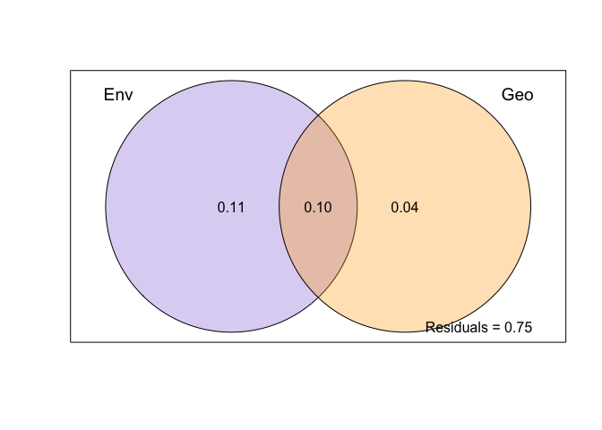

Species diversity analyses
================

### Load packages and files

``` r
# Load the knitr package if not already loaded
library(knitr)

# Source the R Markdown file
knit("/Users/bailey/Documents/research/fish_biodiversity/src/collection/load_collection_data.Rmd", output = "/Users/bailey/Documents/research/fish_biodiversity/src/collection/load_collection_data.md")
```

    ## 
    ## 
    ## processing file: /Users/bailey/Documents/research/fish_biodiversity/src/collection/load_collection_data.Rmd

    ##   |                  |          |   0%  |                  |          |   3%                                                                          |                  |.         |   7% [Bringing everything together load modifying files packages]             |                  |.         |  10%                                                                          |                  |.         |  13% [Bringing everything together load in modifying files]                   |                  |..        |  17%                                                                          |                  |..        |  20% [Check species names across files]                                       |                  |..        |  23%                                                                          |                  |...       |  27% [Modify environment data]                                                |                  |...       |  30%                                                                          |                  |...       |  33% [Modify incidence matrices]                                              |                  |....      |  37%                                                                          |                  |....      |  40% [Modify phylogeny]                                                       |                  |....      |  43%                                                                          |                  |.....     |  47% [Modify trait data]                                                      |                  |.....     |  50%                                                                          |                  |.....     |  53% [Modify Site_type data frames]                                           |                  |......    |  57%                                                                          |                  |......    |  60% [Modify Site_type trait data]                                            |                  |......    |  63%                                                                          |                  |.......   |  67% [Site_type trait data tests]                                             |                  |.......   |  70%                                                                          |                  |.......   |  73% [Modify site trait data frames]                                          |                  |........  |  77%                                                                          |                  |........  |  80% [Site trait data tests]                                                  |                  |........  |  83%                                                                          |                  |......... |  87% [unnamed-chunk-5]                                                        |                  |......... |  90%                                                                          |                  |......... |  93% [unnamed-chunk-6]                                                        |                  |..........|  97%                                                                          |                  |..........| 100% [Bringing everything together load out modified files and session info]

    ## output file: /Users/bailey/Documents/research/fish_biodiversity/src/collection/load_collection_data.md

    ## [1] "/Users/bailey/Documents/research/fish_biodiversity/src/collection/load_collection_data.md"

``` r
# Packages
library(picante)
```

    ## Loading required package: vegan

    ## Loading required package: permute

    ## Loading required package: lattice

    ## 
    ## Attaching package: 'vegan'

    ## The following object is masked from 'package:phytools':
    ## 
    ##     scores

    ## Loading required package: nlme

    ## 
    ## Attaching package: 'nlme'

    ## The following object is masked from 'package:dplyr':
    ## 
    ##     collapse

``` r
library(vegan)
library(phytools)
library(ggplot2)
library(ggrepel)
library(caret)
```

    ## 
    ## Attaching package: 'caret'

    ## The following object is masked from 'package:vegan':
    ## 
    ##     tolerance

``` r
library(BAT)
```

    ## 
    ## Attaching package: 'BAT'

    ## The following object is masked from 'package:ggplot2':
    ## 
    ##     alpha

    ## The following object is masked from 'package:tidyr':
    ## 
    ##     fill

    ## The following objects are masked from 'package:base':
    ## 
    ##     beta, gamma

``` r
library(pairwiseAdonis)
```

    ## Loading required package: cluster

    ## 
    ## Attaching package: 'cluster'

    ## The following object is masked from 'package:maps':
    ## 
    ##     votes.repub

``` r
library(ggvenn)
```

    ## Loading required package: grid

``` r
library(dplyr)
library(emmeans)
```

    ## Welcome to emmeans.
    ## Caution: You lose important information if you filter this package's results.
    ## See '? untidy'

``` r
# Site vectors
surveyed_sites <- c("BCM", "CLM", "FLK", "GLK", "HLM", "HLO", "IBK", "LCN", "LLN", "MLN", "NCN", "NLK", "NLN", "NLU", "OLO", "OOM", "OOO", "OTM", "RCA", "SLN", "TLN", "ULN")

surveyed_sites_wo_LCN <- c("BCM", "CLM", "FLK", "GLK", "HLM", "HLO", "IBK", "LLN", "MLN", "NCN", "NLK", "NLN", "NLU", "OLO", "OOM", "OOO", "OTM", "RCA", "SLN", "TLN", "ULN")

surveyed_sites_wo_TLN_HLM <- c("BCM", "CLM", "FLK", "GLK", "HLO", "IBK", "LCN", "LLN", "MLN", "NCN", "NLK", "NLN", "NLU", "OLO", "OOM", "OOO", "OTM", "RCA", "SLN", "ULN")

surveyed_sites_env <- c("BCM", "CLM", "FLK", "GLK", "HLM", "HLO", "IBK", "LLN", "MLN", "NCN", "NLK", "NLN", "NLU", "OLO", "OTM", "RCA", "SLN", "TLN", "ULN")

ocean_mixed_sites <- c("IBK", "LCN", "NCN", "OOO", "OOM", "RCA", "FLK", "HLO", "LLN", "MLN", "NLN", "NLU", "OLO", "ULN")

ocean_mixed_sites_env <- c("IBK", "NCN", "RCA", "FLK", "HLO", "LLN", "MLN", "NLN", "NLU", "OLO", "ULN")

ocean_stratified_sites <- c("IBK", "LCN", "NCN", "OOO", "OOM", "RCA", "BCM", "CLM", "GLK", "HLM", "NLK", "OTM", "SLN", "TLN")

ocean_stratified_sites_env <- c("IBK", "NCN", "RCA", "BCM", "CLM", "GLK", "HLM", "NLK", "OTM", "SLN", "TLN")

mixed_stratified_lakes <- c("BCM", "CLM", "FLK", "GLK", "HLM", "HLO", "LLN", "MLN", "NLK", "NLN", "NLU", "OLO", "OTM", "SLN", "TLN", "ULN")

ocean_sites <- c("IBK", "LCN", "NCN", "OOO", "OOM", "RCA")

ocean_sites_env <- c("IBK", "NCN", "RCA")

mixed_lakes <- c("FLK", "HLO", "LLN", "MLN", "NLN", "NLU", "OLO", "ULN")

stratified_lakes <- c("BCM", "CLM", "GLK", "HLM", "NLK", "OTM", "SLN", "TLN")

# Define your custom colors
custom_colors <- c("Reference" = "black", "Ocean" = "#EE6363", "Mixed" = "#87CEFA", "Stratified" = "#6E8B3D")

env_cont <- "#FFB90F"

set.seed(123)
```

### Edit input files

``` r
strat_fish <- stratified_fish[,-c(1,10)]
mix_fish <- mixed_fish[,-c(1,10)]
oc_fish <- ocean_fish[,-c(1,8)]

env <- env[order(env$X),]
presabs_lake <- presabs_lake[order(row.names(presabs_lake)),]
surveyed_sites_lake <- surveyed_sites_lake[order(row.names(surveyed_sites_lake)),]

Site_type_group_ref <- env[,"Site_type"]
Site_type_group <- env[surveyed_sites,"Site_type"]
```

# Species Diversity

## SD alpha diversity

### SD alpha bar plot

``` r
#Plot species richness with a bar plot
SR_env$Site_type <- factor(SR_env$Site_type, levels = c("Ocean", "Mixed", "Stratified"))

(SR_plot <- ggplot(data = SR_env[-20,], mapping = aes(x = reorder(X, row_sum, decreasing = T), y = row_sum, color = Site_type, fill = Site_type, )) + 
  geom_bar(stat = 'identity',
  alpha = 1) +
  scale_color_manual(values = custom_colors) +
  scale_fill_manual(values = custom_colors) +
  theme_bw() +
  theme(text = element_text(size = 14), 
  legend.title = element_text(size = 14), 
  legend.text = element_text(size = 14),
  axis.text = element_text(size = 14, color = "black"),
  axis.text.x = element_text(angle = 90, hjust = 1, vjust = 0.5),
  axis.line = element_line(color = "black"),
  plot.background = element_blank(),
  panel.grid.major = element_blank(),
  panel.grid.minor = element_blank(),
  panel.border = element_blank()) + 
  labs(x="Site", y="Species Richness", colour = "Site type:", fill = "Site type:"))
```

<!-- -->

``` r
ggsave("/Users/bailey/Documents/research/fish_biodiversity/figures/SD/SR_plot.jpg", plot = SR_plot, width = 6, height = 6, units = "in")
```

### SD alpha venn diagram plot

``` r
site_type_pres <- strat_presabs_lake[c(24:26),]
site_type_pres <- t(site_type_pres)
site_type_pres <- site_type_pres[which(rowSums(site_type_pres) > 0),]

# Convert numerical values to logical
site_type_pres_logical <- as.data.frame(site_type_pres > 0)

# Check the structure of the transformed data
str(site_type_pres_logical)
```

    ## 'data.frame':    249 obs. of  3 variables:
    ##  $ Ocean sites     : logi  TRUE TRUE TRUE TRUE TRUE TRUE ...
    ##  $ Mixed lakes     : logi  TRUE FALSE TRUE FALSE TRUE FALSE ...
    ##  $ Stratified lakes: logi  FALSE FALSE FALSE FALSE FALSE FALSE ...

``` r
# Create the Venn diagram
(venn_plot <- ggvenn(site_type_pres_logical,
        show_percentage = F,
        fill_color = c("#EE6363", "#87CEFA", "#6E8B3D"),
        fill_alpha = 0.7,
        stroke_alpha = 0,
        stroke_size = 0.5, 
        set_name_size = 5,
        text_size = 5))
```

<!-- -->

``` r
ggsave("/Users/bailey/Documents/research/fish_biodiversity/figures/SD/venn_plot.jpg", plot = venn_plot, width = 4.25, height = 4, units = "in")
```

### SD alpha subsample venn diagram plots

``` r
# Randomly sample six columns from stratified_fish and mixed_fish
sampled_stratified <- sample(names(strat_fish)[-1], 6)
sampled_mixed <- sample(names(mix_fish)[-1], 6)

# Select sampled columns from stratified_fish and mixed_fish
stratified_subset <- select(stratified_fish, all_of(sampled_stratified))
mixed_subset <- select(mixed_fish, all_of(sampled_mixed))

# Get rid of species not present in the 6 remaining sites
stratified_subset <- stratified_subset[which(rowSums(stratified_subset[, -1]) > 0),]
mixed_subset <- mixed_subset[which(rowSums(mixed_subset[, -1]) > 0),]

# Make site type columns in each dataframe
stratified_subset[,7] <- rowSums(stratified_subset[,c(1:6)])
colnames(stratified_subset)[colnames(stratified_subset) == "V7"] <- "Stratified lakes"

mixed_subset[,7] <- rowSums(mixed_subset[,c(1:6)])
colnames(mixed_subset)[colnames(mixed_subset) == "V7"] <- "Mixed lakes"

oc_fish[,7] <- rowSums(oc_fish[,c(1:6)])
colnames(oc_fish)[colnames(oc_fish) == "V7"] <- "Ocean sites"

# Merge the two data frames, replacing missing values with 0
oc_mix_merge <- merge(oc_fish, mixed_subset, by = 0, all = TRUE)
row.names(oc_mix_merge) <- oc_mix_merge$Row.names
oc_mix_merge <- oc_mix_merge[,-1]
oc_mix_strat_merge <- merge(oc_mix_merge, stratified_subset, by = 0, all = TRUE)
row.names(oc_mix_strat_merge) <- oc_mix_strat_merge$Row.names
oc_mix_strat_merge <- oc_mix_strat_merge[,-1]

# Keep only site type
keep <- c("Ocean sites", "Mixed lakes", "Stratified lakes")
site_type_pres_sample <- oc_mix_strat_merge[,keep]

# Replace NA with 0
site_type_pres_sample[is.na(site_type_pres_sample)] <- 0

## Remove all species not found in any locations
# Identifies which rows are greater than 0
site_type_pres_sample <- site_type_pres_sample[which(rowSums(site_type_pres_sample) > 0),]

site_type_pres_sample_logical <- as.data.frame(site_type_pres_sample > 0)

venn_plot <- ggvenn(site_type_pres_sample_logical,
        show_percentage = F,
        fill_color = c("#EE6363", "#87CEFA", "#6E8B3D"),
        fill_alpha = 0.7,
        stroke_alpha = 0,
        stroke_size = 0.5, 
        set_name_size = 5,
        text_size = 5)
venn_plot
```

<!-- -->

``` r
ggsave("/Users/bailey/Documents/research/fish_biodiversity/figures/SD/venn_plot_s10.jpg", plot = venn_plot, width = 4.25, height = 4, units = "in")
```

### SD alpha outliers for each site type

``` r
outlier_SD_alpha <- SR_env[surveyed_sites,] %>%
  group_by(Site_type) %>%
  mutate(
  Q1 = quantile(row_sum, 0.25),
  Q3 = quantile(row_sum, 0.75),
  IQR = Q3 - Q1,
  lower_bound = Q1 - 1.5 * IQR,
  upper_bound = Q3 + 1.5 * IQR,
  is_outlier = row_sum < lower_bound | row_sum > upper_bound
  )

outlier_SD_alpha <- as.data.frame(outlier_SD_alpha)
row.names(outlier_SD_alpha) <- outlier_SD_alpha$X

# Create the plot
(outlier_SD_alpha_plot <- ggplot(outlier_SD_alpha, aes(x = Site_type, y = row_sum, fill = Site_type)) +
  geom_violin(alpha = 0.9, draw_quantiles = c(0.25, 0.5, 0.75), aes(fill = Site_type)) +
  geom_jitter(aes(color = is_outlier), width = 0.1, size = 4, alpha = 0.7) +
  scale_color_manual(values = c("FALSE" = "black", "TRUE" = "purple")) +
  scale_fill_manual(values = custom_colors) +
  geom_text_repel(data = outlier_SD_alpha, label = outlier_SD_alpha$X, size = 5, point.padding = 7, max.overlaps = 30, nudge_x = -0.01) +
  theme(text = element_text(size = 16),
    legend.position = "right",
    legend.title = element_text(size = 16),
    legend.text = element_text(size = 16),
    axis.line = element_line(color = "black"),
    panel.background = element_rect(fill='transparent'),
    plot.background = element_rect(fill='transparent', color=NA),
    panel.grid.major = element_blank(),
    panel.grid.minor = element_blank(),
    panel.border = element_blank(),
    axis.text = element_text(color = "black", size = 16)) +
  scale_y_continuous(expand = c(0,2)) +
  guides(fill = "none") + 
  labs(y = "SRic", x = "Site type", color = "Outlier:", tag = "a"))
```

<!-- -->

``` r
ggsave("/Users/bailey/Documents/research/fish_biodiversity/figures/SD/outlier_SD_alpha.jpg", outlier_SD_alpha_plot, width = 6.26, height = 6, units = "in")
```

### Identify VIF of environmental and geographical variables

``` r
library(MASS)
```

    ## 
    ## Attaching package: 'MASS'

    ## The following object is masked from 'package:dplyr':
    ## 
    ##     select

``` r
# Determine which env variables have variance
environment <- c("temperature_median", "salinity_median", "oxygen_median", "pH_median")
nzv <- nearZeroVar(env[,environment])
nzv
```

    ## integer(0)

``` r
# All env variables have variance

mod <-  lm(row_sum ~ temperature_median + salinity_median + oxygen_median + pH_median, SR_env)
summary(mod)
```

    ## 
    ## Call:
    ## lm(formula = row_sum ~ temperature_median + salinity_median + 
    ##     oxygen_median + pH_median, data = SR_env)
    ## 
    ## Residuals:
    ##      Min       1Q   Median       3Q      Max 
    ## -25.9542 -10.3708  -0.4769   8.9325  29.5684 
    ## 
    ## Coefficients:
    ##                    Estimate Std. Error t value Pr(>|t|)  
    ## (Intercept)        -541.813    201.886  -2.684   0.0178 *
    ## temperature_median   -4.950      3.874  -1.278   0.2221  
    ## salinity_median       0.201      1.973   0.102   0.9203  
    ## oxygen_median         6.058      5.343   1.134   0.2758  
    ## pH_median            90.737     34.922   2.598   0.0210 *
    ## ---
    ## Signif. codes:  0 '***' 0.001 '**' 0.01 '*' 0.05 '.' 0.1 ' ' 1
    ## 
    ## Residual standard error: 16.28 on 14 degrees of freedom
    ##   (4 observations deleted due to missingness)
    ## Multiple R-squared:  0.7996, Adjusted R-squared:  0.7424 
    ## F-statistic: 13.97 on 4 and 14 DF,  p-value: 8.549e-05

``` r
Anova(mod, type = 3)
```

    ## Anova Table (Type III tests)
    ## 
    ## Response: row_sum
    ##                    Sum Sq Df F value  Pr(>F)  
    ## (Intercept)        1909.3  1  7.2025 0.01781 *
    ## temperature_median  432.9  1  1.6329 0.22208  
    ## salinity_median       2.8  1  0.0104 0.92030  
    ## oxygen_median       340.9  1  1.2859 0.27584  
    ## pH_median          1789.6  1  6.7509 0.02105 *
    ## Residuals          3711.3 14                  
    ## ---
    ## Signif. codes:  0 '***' 0.001 '**' 0.01 '*' 0.05 '.' 0.1 ' ' 1

``` r
rms::vif(mod)
```

    ## temperature_median    salinity_median      oxygen_median          pH_median 
    ##           1.385456           3.435415           2.209454           4.821892

``` r
car::vif(mod)
```

    ## temperature_median    salinity_median      oxygen_median          pH_median 
    ##           1.385456           3.435415           2.209454           4.821892

``` r
mod <-  lm(row_sum ~ temperature_median + salinity_median + oxygen_median, SR_env)
summary(mod)
```

    ## 
    ## Call:
    ## lm(formula = row_sum ~ temperature_median + salinity_median + 
    ##     oxygen_median, data = SR_env)
    ## 
    ## Residuals:
    ##     Min      1Q  Median      3Q     Max 
    ## -31.549  -9.598  -4.173   9.619  47.290 
    ## 
    ## Coefficients:
    ##                     Estimate Std. Error t value Pr(>|t|)   
    ## (Intercept)        -131.1738   147.7497  -0.888  0.38866   
    ## temperature_median   -0.7881     4.1484  -0.190  0.85187   
    ## salinity_median       4.1712     1.4680   2.841  0.01238 * 
    ## oxygen_median        15.2171     4.7218   3.223  0.00569 **
    ## ---
    ## Signif. codes:  0 '***' 0.001 '**' 0.01 '*' 0.05 '.' 0.1 ' ' 1
    ## 
    ## Residual standard error: 19.15 on 15 degrees of freedom
    ##   (4 observations deleted due to missingness)
    ## Multiple R-squared:  0.703,  Adjusted R-squared:  0.6436 
    ## F-statistic: 11.84 on 3 and 15 DF,  p-value: 0.000309

``` r
Anova(mod, type = 3)
```

    ## Anova Table (Type III tests)
    ## 
    ## Response: row_sum
    ##                    Sum Sq Df F value   Pr(>F)   
    ## (Intercept)         289.1  1  0.7882 0.388657   
    ## temperature_median   13.2  1  0.0361 0.851873   
    ## salinity_median    2961.0  1  8.0741 0.012377 * 
    ## oxygen_median      3808.8  1 10.3860 0.005693 **
    ## Residuals          5500.9 15                    
    ## ---
    ## Signif. codes:  0 '***' 0.001 '**' 0.01 '*' 0.05 '.' 0.1 ' ' 1

``` r
rms::vif(mod)
```

    ## temperature_median    salinity_median      oxygen_median 
    ##           1.148556           1.374749           1.247588

``` r
car::vif(mod)
```

    ## temperature_median    salinity_median      oxygen_median 
    ##           1.148556           1.374749           1.247588

``` r
environment <- c("temperature_median", "salinity_median", "oxygen_median")


mod <- aov(temperature_median ~ Site_type, SR_env)
summary(mod)
```

    ##             Df Sum Sq Mean Sq F value Pr(>F)
    ## Site_type    2   2.94   1.470   1.092  0.359
    ## Residuals   16  21.54   1.346               
    ## 4 observations deleted due to missingness

``` r
mod <- aov(row_sum ~ oxygen_median + Site_type, SR_env)
car::vif(mod)
```

    ##                   GVIF Df GVIF^(1/(2*Df))
    ## oxygen_median 3.374424  1        1.836961
    ## Site_type     3.374424  2        1.355345

``` r
mod <- aov(salinity_median ~ Site_type, SR_env)
summary(mod)
```

    ##             Df Sum Sq Mean Sq F value   Pr(>F)    
    ## Site_type    2 147.34   73.67   13.61 0.000353 ***
    ## Residuals   16  86.62    5.41                     
    ## ---
    ## Signif. codes:  0 '***' 0.001 '**' 0.01 '*' 0.05 '.' 0.1 ' ' 1
    ## 4 observations deleted due to missingness

``` r
mod <- aov(row_sum ~ salinity_median + Site_type, SR_env)
car::vif(mod)
```

    ##                     GVIF Df GVIF^(1/(2*Df))
    ## salinity_median 2.701125  1        1.643510
    ## Site_type       2.701125  2        1.281995

``` r
mod <- aov(oxygen_median ~ Site_type, SR_env)
summary(mod)
```

    ##             Df Sum Sq Mean Sq F value   Pr(>F)    
    ## Site_type    2 14.440    7.22      19 5.95e-05 ***
    ## Residuals   16  6.081    0.38                     
    ## ---
    ## Signif. codes:  0 '***' 0.001 '**' 0.01 '*' 0.05 '.' 0.1 ' ' 1
    ## 4 observations deleted due to missingness

``` r
mod <- aov(row_sum ~ oxygen_median + Site_type, SR_env)
car::vif(mod)
```

    ##                   GVIF Df GVIF^(1/(2*Df))
    ## oxygen_median 3.374424  1        1.836961
    ## Site_type     3.374424  2        1.355345

``` r
SR_ss_env <- SR_env[surveyed_sites_env,]
SR_ss_env$Site_type <- factor(SR_ss_env$Site_type, levels = c("Ocean", "Mixed", "Stratified"))

# Run linear discriminant analysis of environmental variables
LDA <- lda(SR_ss_env[,environment], SR_ss_env$Site_type)
spe.class <- predict(LDA)$class
spe.post <- predict(LDA)$posterior
(spe.table <- table(SR_ss_env$Site_type, spe.class))
```

    ##             spe.class
    ##              Ocean Mixed Stratified
    ##   Ocean          1     2          0
    ##   Mixed          0     8          0
    ##   Stratified     0     0          8

``` r
diag(prop.table(spe.table, 1))
```

    ##      Ocean      Mixed Stratified 
    ##  0.3333333  1.0000000  1.0000000

``` r
# Determine which geo variables have variance
geography <- c("volume_m3_w_chemocline", "volume_m3", "surface_area_m2", "distance_to_ocean_min_m", "distance_to_ocean_mean_m", "distance_to_ocean_median_m", "tidal_lag_time_minutes", "tidal_efficiency", "perimeter_fromSat", "max_depth", "logArea")
nzv <- nearZeroVar(env[,geography])
nzv
```

    ## integer(0)

``` r
# All geo variables have variance

mod <-  lm(row_sum ~ volume_m3_w_chemocline + volume_m3 + surface_area_m2 + distance_to_ocean_min_m + distance_to_ocean_mean_m + distance_to_ocean_median_m + tidal_lag_time_minutes + tidal_efficiency + perimeter_fromSat + max_depth + logArea, SR_env)
summary(mod)
```

    ## 
    ## Call:
    ## lm(formula = row_sum ~ volume_m3_w_chemocline + volume_m3 + surface_area_m2 + 
    ##     distance_to_ocean_min_m + distance_to_ocean_mean_m + distance_to_ocean_median_m + 
    ##     tidal_lag_time_minutes + tidal_efficiency + perimeter_fromSat + 
    ##     max_depth + logArea, data = SR_env)
    ## 
    ## Residuals:
    ##      Min       1Q   Median       3Q      Max 
    ## -27.5820  -6.9408   0.9783   8.2989  28.1100 
    ## 
    ## Coefficients:
    ##                              Estimate Std. Error t value Pr(>|t|)  
    ## (Intercept)                -1.263e+02  1.267e+02  -0.997   0.3447  
    ## volume_m3_w_chemocline      5.099e-05  4.629e-05   1.102   0.2992  
    ## volume_m3                  -4.415e-05  4.795e-05  -0.921   0.3812  
    ## surface_area_m2            -8.853e-05  4.614e-05  -1.919   0.0872 .
    ## distance_to_ocean_min_m     3.566e-02  2.530e-01   0.141   0.8910  
    ## distance_to_ocean_mean_m    1.580e-01  1.075e+00   0.147   0.8863  
    ## distance_to_ocean_median_m -2.599e-01  9.878e-01  -0.263   0.7984  
    ## tidal_lag_time_minutes     -9.226e-02  2.965e-01  -0.311   0.7628  
    ## tidal_efficiency            8.936e+00  7.900e+01   0.113   0.9124  
    ## perimeter_fromSat          -1.692e-02  1.953e-02  -0.866   0.4087  
    ## max_depth                  -3.370e-01  1.301e+00  -0.259   0.8015  
    ## logArea                     2.046e+01  1.264e+01   1.619   0.1399  
    ## ---
    ## Signif. codes:  0 '***' 0.001 '**' 0.01 '*' 0.05 '.' 0.1 ' ' 1
    ## 
    ## Residual standard error: 21.04 on 9 degrees of freedom
    ##   (2 observations deleted due to missingness)
    ## Multiple R-squared:  0.7342, Adjusted R-squared:  0.4093 
    ## F-statistic:  2.26 on 11 and 9 DF,  p-value: 0.1156

``` r
Anova(mod, type = 3)
```

    ## Anova Table (Type III tests)
    ## 
    ## Response: row_sum
    ##                            Sum Sq Df F value  Pr(>F)  
    ## (Intercept)                 440.2  1  0.9946 0.34467  
    ## volume_m3_w_chemocline      537.0  1  1.2135 0.29922  
    ## volume_m3                   375.3  1  0.8479 0.38115  
    ## surface_area_m2            1629.2  1  3.6815 0.08723 .
    ## distance_to_ocean_min_m       8.8  1  0.0199 0.89103  
    ## distance_to_ocean_mean_m      9.6  1  0.0216 0.88633  
    ## distance_to_ocean_median_m   30.6  1  0.0692 0.79837  
    ## tidal_lag_time_minutes       42.8  1  0.0968 0.76279  
    ## tidal_efficiency              5.7  1  0.0128 0.91243  
    ## perimeter_fromSat           332.3  1  0.7508 0.40874  
    ## max_depth                    29.7  1  0.0670 0.80152  
    ## logArea                    1160.0  1  2.6212 0.13990  
    ## Residuals                  3982.9  9                  
    ## ---
    ## Signif. codes:  0 '***' 0.001 '**' 0.01 '*' 0.05 '.' 0.1 ' ' 1

``` r
rms::vif(mod)
```

    ##     volume_m3_w_chemocline                  volume_m3 
    ##                 6433.74411                 6855.30224 
    ##            surface_area_m2    distance_to_ocean_min_m 
    ##                   22.87840                   18.42491 
    ##   distance_to_ocean_mean_m distance_to_ocean_median_m 
    ##                  825.68615                  687.45478 
    ##     tidal_lag_time_minutes           tidal_efficiency 
    ##                   21.17746                   27.90908 
    ##          perimeter_fromSat                  max_depth 
    ##                   94.39757                   10.74366 
    ##                    logArea 
    ##                   25.70304

``` r
car::vif(mod)
```

    ##     volume_m3_w_chemocline                  volume_m3 
    ##                 6433.74411                 6855.30224 
    ##            surface_area_m2    distance_to_ocean_min_m 
    ##                   22.87840                   18.42491 
    ##   distance_to_ocean_mean_m distance_to_ocean_median_m 
    ##                  825.68615                  687.45478 
    ##     tidal_lag_time_minutes           tidal_efficiency 
    ##                   21.17746                   27.90908 
    ##          perimeter_fromSat                  max_depth 
    ##                   94.39757                   10.74366 
    ##                    logArea 
    ##                   25.70304

``` r
mod <-  lm(row_sum ~ distance_to_ocean_min_m + max_depth + logArea, SR_env)
summary(mod)
```

    ## 
    ## Call:
    ## lm(formula = row_sum ~ distance_to_ocean_min_m + max_depth + 
    ##     logArea, data = SR_env)
    ## 
    ## Residuals:
    ##     Min      1Q  Median      3Q     Max 
    ## -42.936 -17.133   0.982  10.144  68.145 
    ## 
    ## Coefficients:
    ##                         Estimate Std. Error t value Pr(>|t|)  
    ## (Intercept)             14.99041   36.14360   0.415   0.6832  
    ## distance_to_ocean_min_m -0.22020    0.08150  -2.702   0.0146 *
    ## max_depth                0.09856    0.59911   0.165   0.8712  
    ## logArea                  3.66034    3.59139   1.019   0.3216  
    ## ---
    ## Signif. codes:  0 '***' 0.001 '**' 0.01 '*' 0.05 '.' 0.1 ' ' 1
    ## 
    ## Residual standard error: 25.95 on 18 degrees of freedom
    ##   (1 observation deleted due to missingness)
    ## Multiple R-squared:  0.3943, Adjusted R-squared:  0.2933 
    ## F-statistic: 3.906 on 3 and 18 DF,  p-value: 0.02604

``` r
Anova(mod, type = 3)
```

    ## Anova Table (Type III tests)
    ## 
    ## Response: row_sum
    ##                          Sum Sq Df F value  Pr(>F)  
    ## (Intercept)               115.8  1  0.1720 0.68323  
    ## distance_to_ocean_min_m  4916.0  1  7.3006 0.01459 *
    ## max_depth                  18.2  1  0.0271 0.87116  
    ## logArea                   699.5  1  1.0388 0.32161  
    ## Residuals               12120.7 18                  
    ## ---
    ## Signif. codes:  0 '***' 0.001 '**' 0.01 '*' 0.05 '.' 0.1 ' ' 1

``` r
rms::vif(mod)
```

    ## distance_to_ocean_min_m               max_depth                 logArea 
    ##                1.258244                1.497112                1.392300

``` r
car::vif(mod)
```

    ## distance_to_ocean_min_m               max_depth                 logArea 
    ##                1.258244                1.497112                1.392300

``` r
geography <- c("distance_to_ocean_min_m", "max_depth", "logArea")

mod <- aov(distance_to_ocean_min_m ~ Site_type, SR_env)
summary(mod)
```

    ##             Df Sum Sq Mean Sq F value   Pr(>F)    
    ## Site_type    2  80935   40468   16.49 7.05e-05 ***
    ## Residuals   19  46637    2455                     
    ## ---
    ## Signif. codes:  0 '***' 0.001 '**' 0.01 '*' 0.05 '.' 0.1 ' ' 1
    ## 1 observation deleted due to missingness

``` r
mod <- aov(row_sum ~ distance_to_ocean_min_m + Site_type, SR_env)
car::vif(mod)
```

    ##                             GVIF Df GVIF^(1/(2*Df))
    ## distance_to_ocean_min_m 2.735421  1        1.653911
    ## Site_type               2.735421  2        1.286045

``` r
mod <- aov(max_depth ~ Site_type, SR_env)
summary(mod)
```

    ##             Df Sum Sq Mean Sq F value Pr(>F)
    ## Site_type    2    535   267.5   2.235  0.134
    ## Residuals   19   2274   119.7               
    ## 1 observation deleted due to missingness

``` r
mod <- aov(row_sum ~ max_depth + Site_type, SR_env)
car::vif(mod)
```

    ##               GVIF Df GVIF^(1/(2*Df))
    ## max_depth 1.235315  1        1.111447
    ## Site_type 1.235315  2        1.054252

``` r
mod <- aov(logArea ~ Site_type, SR_env)
summary(mod)
```

    ##             Df Sum Sq Mean Sq F value Pr(>F)
    ## Site_type    2  14.37   7.184   2.341  0.123
    ## Residuals   19  58.32   3.069               
    ## 1 observation deleted due to missingness

``` r
mod <- aov(row_sum ~ logArea + Site_type, SR_env)
car::vif(mod)
```

    ##               GVIF Df GVIF^(1/(2*Df))
    ## logArea   1.246371  1        1.116410
    ## Site_type 1.246371  2        1.056603

``` r
SR_ss_geo <- SR_env[surveyed_sites,]
SR_ss_geo$Site_type <- factor(SR_ss_geo$Site_type, levels = c("Ocean", "Mixed", "Stratified"))

# Run linear discriminant analysis of geographical variables
LDA <- lda(SR_ss_geo[,geography], SR_ss_geo$Site_type)
spe.class <- predict(LDA)$class
spe.post <- predict(LDA)$posterior
(spe.table <- table(SR_ss_geo$Site_type, spe.class))
```

    ##             spe.class
    ##              Ocean Mixed Stratified
    ##   Ocean          4     2          0
    ##   Mixed          0     8          0
    ##   Stratified     0     2          6

``` r
diag(prop.table(spe.table, 1))
```

    ##      Ocean      Mixed Stratified 
    ##  0.6666667  1.0000000  0.7500000

``` r
# Combine environment and geography
mod <-  lm(row_sum ~ salinity_median + oxygen_median + temperature_median + distance_to_ocean_min_m + max_depth + logArea, SR_env)
summary(mod)
```

    ## 
    ## Call:
    ## lm(formula = row_sum ~ salinity_median + oxygen_median + temperature_median + 
    ##     distance_to_ocean_min_m + max_depth + logArea, data = SR_env)
    ## 
    ## Residuals:
    ##     Min      1Q  Median      3Q     Max 
    ## -31.899  -6.041   0.311   6.860  27.594 
    ## 
    ## Coefficients:
    ##                          Estimate Std. Error t value Pr(>|t|)  
    ## (Intercept)             -84.35957  153.48785  -0.550   0.5927  
    ## salinity_median           3.86324    2.01538   1.917   0.0794 .
    ## oxygen_median            10.28180    4.31263   2.384   0.0345 *
    ## temperature_median       -4.50254    4.13686  -1.088   0.2978  
    ## distance_to_ocean_min_m  -0.01767    0.09508  -0.186   0.8557  
    ## max_depth                -0.72903    0.55986  -1.302   0.2173  
    ## logArea                  11.20688    3.83364   2.923   0.0128 *
    ## ---
    ## Signif. codes:  0 '***' 0.001 '**' 0.01 '*' 0.05 '.' 0.1 ' ' 1
    ## 
    ## Residual standard error: 15.9 on 12 degrees of freedom
    ##   (4 observations deleted due to missingness)
    ## Multiple R-squared:  0.8362, Adjusted R-squared:  0.7543 
    ## F-statistic: 10.21 on 6 and 12 DF,  p-value: 0.0003995

``` r
Anova(mod, type = 3)
```

    ## Anova Table (Type III tests)
    ## 
    ## Response: row_sum
    ##                          Sum Sq Df F value  Pr(>F)  
    ## (Intercept)               76.37  1  0.3021 0.59266  
    ## salinity_median          928.96  1  3.6744 0.07937 .
    ## oxygen_median           1437.02  1  5.6840 0.03450 *
    ## temperature_median       299.49  1  1.1846 0.29780  
    ## distance_to_ocean_min_m    8.73  1  0.0345 0.85565  
    ## max_depth                428.68  1  1.6956 0.21730  
    ## logArea                 2160.51  1  8.5457 0.01276 *
    ## Residuals               3033.82 12                  
    ## ---
    ## Signif. codes:  0 '***' 0.001 '**' 0.01 '*' 0.05 '.' 0.1 ' ' 1

``` r
rms::vif(mod)
```

    ##         salinity_median           oxygen_median      temperature_median 
    ##                3.758774                1.509635                1.656753 
    ## distance_to_ocean_min_m               max_depth                 logArea 
    ##                3.720344                2.979442                2.810937

``` r
car::vif(mod)
```

    ##         salinity_median           oxygen_median      temperature_median 
    ##                3.758774                1.509635                1.656753 
    ## distance_to_ocean_min_m               max_depth                 logArea 
    ##                3.720344                2.979442                2.810937

``` r
mod <-  lm(row_sum ~ oxygen_median + temperature_median + distance_to_ocean_min_m + logArea, SR_env)
summary(mod)
```

    ## 
    ## Call:
    ## lm(formula = row_sum ~ oxygen_median + temperature_median + distance_to_ocean_min_m + 
    ##     logArea, data = SR_env)
    ## 
    ## Residuals:
    ##     Min      1Q  Median      3Q     Max 
    ## -23.557 -13.492  -1.246   9.123  37.830 
    ## 
    ## Coefficients:
    ##                          Estimate Std. Error t value Pr(>|t|)  
    ## (Intercept)             152.15529  123.23638   1.235   0.2373  
    ## oxygen_median            12.21960    4.59804   2.658   0.0187 *
    ## temperature_median       -7.57170    4.25822  -1.778   0.0971 .
    ## distance_to_ocean_min_m  -0.16235    0.06355  -2.555   0.0229 *
    ## logArea                   8.10894    2.96536   2.735   0.0161 *
    ## ---
    ## Signif. codes:  0 '***' 0.001 '**' 0.01 '*' 0.05 '.' 0.1 ' ' 1
    ## 
    ## Residual standard error: 17.55 on 14 degrees of freedom
    ##   (4 observations deleted due to missingness)
    ## Multiple R-squared:  0.7672, Adjusted R-squared:  0.7007 
    ## F-statistic: 11.54 on 4 and 14 DF,  p-value: 0.0002359

``` r
Anova(mod, type = 3)
```

    ## Anova Table (Type III tests)
    ## 
    ## Response: row_sum
    ##                         Sum Sq Df F value  Pr(>F)  
    ## (Intercept)              469.5  1  1.5244 0.23728  
    ## oxygen_median           2175.3  1  7.0627 0.01875 *
    ## temperature_median       973.8  1  3.1618 0.09710 .
    ## distance_to_ocean_min_m 2010.1  1  6.5264 0.02291 *
    ## logArea                 2303.1  1  7.4778 0.01613 *
    ## Residuals               4311.9 14                  
    ## ---
    ## Signif. codes:  0 '***' 0.001 '**' 0.01 '*' 0.05 '.' 0.1 ' ' 1

``` r
rms::vif(mod)
```

    ##           oxygen_median      temperature_median distance_to_ocean_min_m 
    ##                1.408629                1.440908                1.364232 
    ##                 logArea 
    ##                1.380536

``` r
car::vif(mod)
```

    ##           oxygen_median      temperature_median distance_to_ocean_min_m 
    ##                1.408629                1.440908                1.364232 
    ##                 logArea 
    ##                1.380536

``` r
envgeo <- c("oxygen_median", "temperature_median", "distance_to_ocean_min_m", "logArea")


# Run linear discriminant analysis of geographical variables
LDA <- lda(SR_ss_env[,envgeo], SR_ss_env$Site_type)
spe.class <- predict(LDA)$class
spe.post <- predict(LDA)$posterior
(spe.table <- table(SR_ss_env$Site_type, spe.class))
```

    ##             spe.class
    ##              Ocean Mixed Stratified
    ##   Ocean          3     0          0
    ##   Mixed          1     7          0
    ##   Stratified     0     1          7

``` r
diag(prop.table(spe.table, 1))
```

    ##      Ocean      Mixed Stratified 
    ##      1.000      0.875      0.875

### SD alpha & site type

``` r
### Site_type
# Run ANOVA
anova_logSRic_result <- aov(log(row_sum) ~ Site_type, data = SR_env[surveyed_sites,])
summary(anova_logSRic_result)
```

    ##             Df Sum Sq Mean Sq F value   Pr(>F)    
    ## Site_type    2 22.346  11.173   27.41 2.51e-06 ***
    ## Residuals   19  7.745   0.408                     
    ## ---
    ## Signif. codes:  0 '***' 0.001 '**' 0.01 '*' 0.05 '.' 0.1 ' ' 1

``` r
# Perform Tukey's HSD test
tukey_logSRic_result <- TukeyHSD(anova_logSRic_result)
print(tukey_logSRic_result)
```

    ##   Tukey multiple comparisons of means
    ##     95% family-wise confidence level
    ## 
    ## Fit: aov(formula = log(row_sum) ~ Site_type, data = SR_env[surveyed_sites, ])
    ## 
    ## $Site_type
    ##                         diff        lwr        upr     p adj
    ## Mixed-Ocean      -0.03070513 -0.9066479  0.8452376 0.9956384
    ## Stratified-Ocean -2.11249529 -2.9884380 -1.2365526 0.0000197
    ## Stratified-Mixed -2.08179016 -2.8927555 -1.2708248 0.0000087

``` r
# Sites
N <- length(anova_logSRic_result$residuals)
# Categories
k <- length(anova_logSRic_result$coefficients)
# Sum of squares
SS <- sum(resid(anova_logSRic_result)^2) # from anova, the residual SS
# Mean squares
MS <- SS/(N-k)
# Balanced
BSE <- sqrt(MS / 8)
# Unbalanced
USE <- sqrt((MS/2)*((1/6)+(1/8)))

# Get differences
Site_type <- tukey_logSRic_result$Site_type

# q-values
(OM_q <- (abs(Site_type[1,1]))/USE)
```

    ## [1] 0.1259392

``` r
(MS_q <- (abs(Site_type[3,1]))/BSE)
```

    ## [1] 9.222747

``` r
(SO_q <- (abs(Site_type[2,1]))/USE)
```

    ## [1] 8.664544

``` r
# Run ANOVA
anova_SRic_result <- aov(row_sum ~ Site_type, data = SR_env[surveyed_sites,])
summary(anova_SRic_result)
```

    ##             Df Sum Sq Mean Sq F value   Pr(>F)    
    ## Site_type    2  10743    5371   11.01 0.000667 ***
    ## Residuals   19   9268     488                     
    ## ---
    ## Signif. codes:  0 '***' 0.001 '**' 0.01 '*' 0.05 '.' 0.1 ' ' 1

``` r
# Perform Tukey's HSD test
tukey_SRic_result <- TukeyHSD(anova_SRic_result)
print(tukey_SRic_result)
```

    ##   Tukey multiple comparisons of means
    ##     95% family-wise confidence level
    ## 
    ## Fit: aov(formula = row_sum ~ Site_type, data = SR_env[surveyed_sites, ])
    ## 
    ## $Site_type
    ##                        diff       lwr       upr     p adj
    ## Mixed-Ocean        1.041667 -29.25978  31.34312 0.9958049
    ## Stratified-Ocean -45.333333 -75.63478 -15.03188 0.0033013
    ## Stratified-Mixed -46.375000 -74.42869 -18.32131 0.0013468

``` r
# Sites
N <- length(anova_SRic_result$residuals)
# Categories
k <- length(anova_SRic_result$coefficients)
# Sum of squares
SS <- sum(resid(anova_SRic_result)^2) # from anova, the residual SS
# Mean squares
MS <- SS/(N-k)
# Balanced
BSE <- sqrt(MS / 8)
# Unbalanced
USE <- sqrt((MS/2)*((1/6)+(1/8)))

# Get differences
Site_type <- tukey_SRic_result$Site_type

# q-values
(OM_q <- (abs(Site_type[1,1]))/USE)
```

    ## [1] 0.1235068

``` r
(MS_q <- (abs(Site_type[3,1]))/BSE)
```

    ## [1] 5.939085

``` r
(SO_q <- (abs(Site_type[2,1]))/USE)
```

    ## [1] 5.375017

``` r
# Check values here https://www.socscistatistics.com/pvalues/qdistribution.aspx
```

### SD alpha env and geo variance partitioning

``` r
envgeo_var <- env[surveyed_sites_env,c(environment, geography)]
surveyed_sites_lake_env <- surveyed_sites_lake[surveyed_sites_env,]
cca_var_all <- cca(surveyed_sites_lake_env ~ ., envgeo_var)
anova(cca_var_all)  # 0.001 *** - it is significant
```

    ## Permutation test for cca under reduced model
    ## Permutation: free
    ## Number of permutations: 999
    ## 
    ## Model: cca(formula = surveyed_sites_lake_env ~ temperature_median + salinity_median + oxygen_median + distance_to_ocean_min_m + max_depth + logArea, data = envgeo_var)
    ##          Df ChiSquare     F Pr(>F)    
    ## Model     6    1.8862 1.465  0.001 ***
    ## Residual 12    2.5750                 
    ## ---
    ## Signif. codes:  0 '***' 0.001 '**' 0.01 '*' 0.05 '.' 0.1 ' ' 1

``` r
adjR2_cca <- RsquareAdj(cca_var_all)$adj.r.squared # 0.10 - adjusted R2 explained by the 6 variables is 10%
cca_var_0 <- cca(surveyed_sites_lake_env ~ 1, data = envgeo_var)

# Run forward selection
SD_alpha_os_R2 <- ordiR2step(cca_var_0, scope = formula (cca_var_all), R2scope = adjR2_cca, direction = 'forward', permutations = 999)
```

    ## Step: R2.adj= 0 
    ## Call: surveyed_sites_lake_env ~ 1 
    ##  
    ##                             R2.adjusted
    ## <All variables>            0.1049210496
    ## + salinity_median          0.0518695965
    ## + oxygen_median            0.0514543731
    ## + distance_to_ocean_min_m  0.0405970916
    ## + logArea                  0.0153470563
    ## + max_depth                0.0134694763
    ## <none>                     0.0000000000
    ## + temperature_median      -0.0004357851
    ## 
    ##                   Df    AIC      F Pr(>F)    
    ## + salinity_median  1 98.302 2.0853  0.001 ***
    ## ---
    ## Signif. codes:  0 '***' 0.001 '**' 0.01 '*' 0.05 '.' 0.1 ' ' 1
    ## 
    ## Step: R2.adj= 0.05179378 
    ## Call: surveyed_sites_lake_env ~ salinity_median 
    ##  
    ##                           R2.adjusted
    ## <All variables>            0.10492105
    ## + oxygen_median            0.07823307
    ## + logArea                  0.06912622
    ## + max_depth                0.06899039
    ## + distance_to_ocean_min_m  0.06809448
    ## + temperature_median       0.06068541
    ## <none>                     0.05179378
    ## 
    ##                 Df    AIC      F Pr(>F)   
    ## + oxygen_median  1 98.511 1.5813  0.003 **
    ## ---
    ## Signif. codes:  0 '***' 0.001 '**' 0.01 '*' 0.05 '.' 0.1 ' ' 1
    ## 
    ## Step: R2.adj= 0.07859961 
    ## Call: surveyed_sites_lake_env ~ salinity_median + oxygen_median 
    ##  
    ##                           R2.adjusted
    ## <All variables>            0.10492105
    ## + temperature_median       0.08892883
    ## + logArea                  0.08794791
    ## + max_depth                0.08793223
    ## + distance_to_ocean_min_m  0.08254997
    ## <none>                     0.07859961
    ## 
    ##                      Df    AIC      F Pr(>F)
    ## + temperature_median  1 99.007 1.2351  0.135

``` r
SD_alpha_os_R2
```

    ## Call: cca(formula = surveyed_sites_lake_env ~ salinity_median +
    ## oxygen_median, data = envgeo_var)
    ## 
    ## -- Model Summary --
    ## 
    ##               Inertia Proportion Rank
    ## Total          4.4612     1.0000     
    ## Constrained    0.8449     0.1894    2
    ## Unconstrained  3.6164     0.8106   16
    ## 
    ## Inertia is scaled Chi-square
    ## 
    ## -- Note --
    ## 
    ## 18 species (variables) deleted due to missingness.
    ## 
    ## -- Eigenvalues --
    ## 
    ## Eigenvalues for constrained axes:
    ##   CCA1   CCA2 
    ## 0.5483 0.2965 
    ## 
    ## Eigenvalues for unconstrained axes:
    ##    CA1    CA2    CA3    CA4    CA5    CA6    CA7    CA8    CA9   CA10   CA11 
    ## 0.3771 0.3640 0.3300 0.2999 0.2814 0.2722 0.2502 0.2458 0.2207 0.2087 0.1997 
    ##   CA12   CA13   CA14   CA15   CA16 
    ## 0.1887 0.1581 0.1256 0.0601 0.0343

``` r
SD_alpha_os_R2$anova
```

    ##                     R2.adj Df    AIC      F Pr(>F)    
    ## + salinity_median 0.051794  1 98.302 2.0853  0.001 ***
    ## + oxygen_median   0.078600  1 98.511 1.5813  0.003 ** 
    ## <All variables>   0.104921                            
    ## ---
    ## Signif. codes:  0 '***' 0.001 '**' 0.01 '*' 0.05 '.' 0.1 ' ' 1

``` r
SD_alpha_os_R2_adj <- SD_alpha_os_R2
SD_alpha_os_R2_adj$anova$`Pr(>F)` <- p.adjust(SD_alpha_os_R2$anova$`Pr(>F)`, method = 'holm', n = ncol(envgeo_var))
SD_alpha_os_R2_adj$anova
```

    ##                     R2.adj Df    AIC      F Pr(>F)   
    ## + salinity_median 0.051794  1 98.302 2.0853  0.006 **
    ## + oxygen_median   0.078600  1 98.511 1.5813  0.015 * 
    ## <All variables>   0.104921                           
    ## ---
    ## Signif. codes:  0 '***' 0.001 '**' 0.01 '*' 0.05 '.' 0.1 ' ' 1

### SD alpha env and geo plots

``` r
# Temperature
SD_alpha_T_plot <- ggplot(data = SR_env[surveyed_sites_env,], mapping = aes(y = log(row_sum), x = temperature_median, color = Site_type, fill = Site_type)) + 
  geom_point(stat = 'identity',
  size = 4,
  alpha = 1) + 
  geom_smooth(method = "lm", se = FALSE) +
  geom_text_repel(label = SR_env[surveyed_sites_env,1], size = 5, point.padding = 3) +
  scale_color_manual(values = custom_colors) +
  scale_fill_manual(values = custom_colors) +
  theme_bw() +
  theme(text = element_text(size = 16),legend.title =  element_text(size = 16), legend.text = element_text(size = 16),
  axis.text = element_text(size = 16, color = "black"),
  axis.line = element_line(color = "black"),
  panel.background = element_rect(fill='transparent'),
  plot.background = element_rect(fill='transparent', color=NA),
  panel.grid.major = element_blank(),
  panel.grid.minor = element_blank(),
  panel.border = element_blank()) + 
  labs(x="Temperature (ºC)", y="Log-SRic", colour = "Site type:", fill = "Site type:", tag = "a")
(SD_alpha_T_plot <- SD_alpha_T_plot + guides(color = guide_legend(override.aes = list(label = ""))))
```

    ## `geom_smooth()` using formula = 'y ~ x'

<!-- -->

``` r
ggsave("/Users/bailey/Documents/research/fish_biodiversity/figures/SD/SD_alpha_T_plot.jpg", plot = SD_alpha_T_plot, width = 6.26, height = 6, units = "in")
```

    ## `geom_smooth()` using formula = 'y ~ x'

``` r
# Salinity
SD_alpha_S_plot <- ggplot(data = SR_env[surveyed_sites_env,], mapping = aes(y = log(row_sum), x = salinity_median, color = Site_type, fill = Site_type)) + 
  geom_point(stat = 'identity',
  size = 4,
  alpha = 1) + 
  geom_smooth(method = "lm", se = FALSE) +
  geom_text_repel(label = SR_env[surveyed_sites_env,1], size = 5, point.padding = 3) +
  scale_color_manual(values = custom_colors) +
  scale_fill_manual(values = custom_colors) +
  theme_bw() +
  theme(text = element_text(size = 16),legend.title =  element_text(size = 16), legend.text = element_text(size = 16),
  axis.text = element_text(size = 16, color = "black"),
  axis.line = element_line(color = "black"),
  panel.background = element_rect(fill='transparent'),
  plot.background = element_rect(fill='transparent', color=NA),
  panel.grid.major = element_blank(),
  panel.grid.minor = element_blank(),
  panel.border = element_blank()) + 
  labs(x="Salinity (ppt)", y="Log-SRic", colour = "Site type:", fill = "Site type:", tag = "b")
(SD_alpha_S_plot <- SD_alpha_S_plot + guides(color = guide_legend(override.aes = list(label = ""))))
```

    ## `geom_smooth()` using formula = 'y ~ x'

<!-- -->

``` r
ggsave("/Users/bailey/Documents/research/fish_biodiversity/figures/SD/SD_alpha_S_plot.jpg", plot = SD_alpha_S_plot, width = 6.26, height = 6, units = "in")
```

    ## `geom_smooth()` using formula = 'y ~ x'

``` r
# Oxygen
SD_alpha_O_plot <- ggplot(data = SR_env[surveyed_sites_env,], mapping = aes(y = log(row_sum), x = oxygen_median, color = Site_type, fill = Site_type)) + 
  geom_point(stat = 'identity',
  size = 4,
  alpha = 1) + 
  geom_smooth(method = "lm", se = FALSE) +
  geom_text_repel(label = SR_env[surveyed_sites_env,1], size = 5, point.padding = 3) +
  scale_color_manual(values = custom_colors) +
  scale_fill_manual(values = custom_colors) +
  theme_bw() +
  theme(text = element_text(size = 16),legend.title =  element_text(size = 16), legend.text = element_text(size = 16),
  axis.text = element_text(size = 16, color = "black"),
  axis.line = element_line(color = "black"),
  panel.background = element_rect(fill='transparent'),
  plot.background = element_rect(fill='transparent', color=NA),
  panel.grid.major = element_blank(),
  panel.grid.minor = element_blank(),
  panel.border = element_blank()) + 
  labs(x="Oxygen (mg/L)", y="Log-SRic", colour = "Site type:", fill = "Site type:", tag = "c")
(SD_alpha_O_plot <- SD_alpha_O_plot + guides(color = guide_legend(override.aes = list(label = ""))))
```

    ## `geom_smooth()` using formula = 'y ~ x'

<!-- -->

``` r
ggsave("/Users/bailey/Documents/research/fish_biodiversity/figures/SD/SD_alpha_O_plot.jpg", plot = SD_alpha_O_plot, width = 6.26, height = 6, units = "in")
```

    ## `geom_smooth()` using formula = 'y ~ x'

``` r
# Distance from the ocean mean
SD_alpha_D_plot <- ggplot(data = SR_env[surveyed_sites,], mapping = aes(y = log(row_sum), x = distance_to_ocean_min_m, color = Site_type, fill = Site_type)) + 
  geom_point(stat = 'identity',
  size = 4,
  alpha = 1) + 
  geom_smooth(method = "lm", se = FALSE) +
  geom_text_repel(label = SR_env[surveyed_sites,1], size = 5, point.padding = 3) +
  scale_color_manual(values = custom_colors) +
  scale_fill_manual(values = custom_colors) +
  theme_bw() +
  theme(text = element_text(size = 16),legend.title =  element_text(size = 16), legend.text = element_text(size = 16),
  axis.text = element_text(size = 16, color = "black"),
  axis.line = element_line(color = "black"),
  panel.background = element_rect(fill='transparent'),
  plot.background = element_rect(fill='transparent', color=NA),
  panel.grid.major = element_blank(),
  panel.grid.minor = element_blank(),
  panel.border = element_blank()) + 
  labs(x="Isolation (m)", y="Log-SRic", colour = "Site type:", fill = "Site type:", tag = "a")
(SD_alpha_D_plot <- SD_alpha_D_plot + guides(color = guide_legend(override.aes = list(label = ""))))
```

    ## `geom_smooth()` using formula = 'y ~ x'

<!-- -->

``` r
ggsave("/Users/bailey/Documents/research/fish_biodiversity/figures/SD/SD_alpha_D_plot.jpg", plot = SD_alpha_D_plot, width = 6.26, height = 6, units = "in")
```

    ## `geom_smooth()` using formula = 'y ~ x'

``` r
# Max depth
SD_alpha_MD_plot <- ggplot(data = SR_env[surveyed_sites,], mapping = aes(y = log(row_sum), x = max_depth, color = Site_type, fill = Site_type)) + 
  geom_point(stat = 'identity',
  size = 4,
  alpha = 1) + 
  geom_smooth(method = "lm", se = FALSE) +
  geom_text_repel(label = SR_env[surveyed_sites,1], size = 5, point.padding = 3) +
  scale_color_manual(values = custom_colors) +
  scale_fill_manual(values = custom_colors) +
  theme_bw() +
  theme(text = element_text(size = 16),legend.title =  element_text(size = 16), legend.text = element_text(size = 16),
  axis.text = element_text(size = 16, color = "black"),
  axis.line = element_line(color = "black"),
  panel.background = element_rect(fill='transparent'),
  plot.background = element_rect(fill='transparent', color=NA),
  panel.grid.major = element_blank(),
  panel.grid.minor = element_blank(),
  panel.border = element_blank()) + 
  labs(x="Age (m)", y="Log-SRic", colour = "Site type:", fill = "Site type:", tag = "b")
(SD_alpha_MD_plot <- SD_alpha_MD_plot + guides(color = guide_legend(override.aes = list(label = ""))))
```

    ## `geom_smooth()` using formula = 'y ~ x'

<!-- -->

``` r
ggsave("/Users/bailey/Documents/research/fish_biodiversity/figures/SD/SD_alpha_MD_plot.jpg", plot = SD_alpha_MD_plot, width = 6.26, height = 6, units = "in")
```

    ## `geom_smooth()` using formula = 'y ~ x'

``` r
# Log Area
SD_alpha_LA_plot <- ggplot(data = SR_env[surveyed_sites,], mapping = aes(y = log(row_sum), x = logArea, color = Site_type, fill = Site_type)) + 
  geom_point(stat = 'identity',
  size = 4,
  alpha = 1) + 
  geom_smooth(method = "lm", se = FALSE) +
  geom_text_repel(label = SR_env[surveyed_sites,1], size = 5, point.padding = 3) +
  scale_color_manual(values = custom_colors) +
  scale_fill_manual(values = custom_colors) +
  theme_bw() +
  theme(text = element_text(size = 16),legend.title =  element_text(size = 16), legend.text = element_text(size = 16),
  axis.text = element_text(size = 16, color = "black"),
  axis.line = element_line(color = "black"),
  panel.background = element_rect(fill='transparent'),
  plot.background = element_rect(fill='transparent', color=NA),
  panel.grid.major = element_blank(),
  panel.grid.minor = element_blank(),
  panel.border = element_blank()) + 
  labs(x="Log Area (m"^"2"~")", y="Log-SRic", colour = "Site type:", fill = "Site type:", tag = "c")
(SD_alpha_LA_plot <- SD_alpha_LA_plot + guides(color = guide_legend(override.aes = list(label = ""))))
```

    ## `geom_smooth()` using formula = 'y ~ x'

<!-- -->

``` r
ggsave("/Users/bailey/Documents/research/fish_biodiversity/figures/SD/SD_alpha_LA_plot.jpg", plot = SD_alpha_LA_plot, width = 6.26, height = 6, units = "in")
```

    ## `geom_smooth()` using formula = 'y ~ x'

### SD alpha with env and geo linear models & ANOVAs

``` r
par(mfrow=c(2,2)) 
##### logSRic ANOVAs
#### Environmental
### Surveyed sites
## Temperature
# Interaction
SD_logSRic_am_temp <- aov(log(row_sum) ~ temperature_median * Site_type, data = SR_env[surveyed_sites_env,])
# Shapiro-Wilk test on residuals
shapiro.test(residuals(SD_logSRic_am_temp))
```

    ## 
    ##  Shapiro-Wilk normality test
    ## 
    ## data:  residuals(SD_logSRic_am_temp)
    ## W = 0.96014, p-value = 0.5752

``` r
# Levene’s test for homogeneity of variance
car::leveneTest(residuals(SD_logSRic_am_temp) ~ SR_env[surveyed_sites_env,"Site_type"])
```

    ## Levene's Test for Homogeneity of Variance (center = median)
    ##       Df F value Pr(>F)
    ## group  2  1.2717 0.3072
    ##       16

``` r
# Check for outliers
outlierTest(SD_logSRic_am_temp)
```

    ## No Studentized residuals with Bonferroni p < 0.05
    ## Largest |rstudent|:
    ##      rstudent unadjusted p-value Bonferroni p
    ## SLN -2.086815           0.058907           NA

``` r
# Plot residuals
plot(SD_logSRic_am_temp)
```

    ## Warning in sqrt(crit * p * (1 - hh)/hh): NaNs produced
    ## Warning in sqrt(crit * p * (1 - hh)/hh): NaNs produced

<!-- -->

``` r
# Summarize the ANOVA results
summary(SD_logSRic_am_temp)
```

    ##                              Df Sum Sq Mean Sq F value   Pr(>F)    
    ## temperature_median            1  2.599   2.599   5.440 0.036399 *  
    ## Site_type                     2 19.292   9.646  20.188 0.000103 ***
    ## temperature_median:Site_type  2  0.388   0.194   0.406 0.674310    
    ## Residuals                    13  6.211   0.478                     
    ## ---
    ## Signif. codes:  0 '***' 0.001 '**' 0.01 '*' 0.05 '.' 0.1 ' ' 1

``` r
# p-values
temp_p_values <- summary(SD_logSRic_am_temp)[[1]][, "Pr(>F)"]
p_values <- c(temp_p_values[1:3])
(adjusted_p_values <- p.adjust(p_values, method = "bonferroni"))
```

    ## [1] 0.1091978150 0.0003090161 1.0000000000

``` r
# ANCOVA
SD_logSRic_am_temp <- aov(log(row_sum) ~ temperature_median + Site_type, data = SR_env[surveyed_sites_env,])
# Shapiro-Wilk test on residuals
shapiro.test(residuals(SD_logSRic_am_temp))
```

    ## 
    ##  Shapiro-Wilk normality test
    ## 
    ## data:  residuals(SD_logSRic_am_temp)
    ## W = 0.94972, p-value = 0.3909

``` r
# Levene’s test for homogeneity of variance
car::leveneTest(residuals(SD_logSRic_am_temp) ~ SR_env[surveyed_sites_env,"Site_type"])
```

    ## Levene's Test for Homogeneity of Variance (center = median)
    ##       Df F value Pr(>F)
    ## group  2  0.7421 0.4918
    ##       16

``` r
# Check for outliers
outlierTest(SD_logSRic_am_temp)
```

    ## No Studentized residuals with Bonferroni p < 0.05
    ## Largest |rstudent|:
    ##     rstudent unadjusted p-value Bonferroni p
    ## HLM 2.038909           0.060805           NA

``` r
# Plot residuals
plot(SD_logSRic_am_temp)
```

<!-- -->

``` r
### Ocean & Mixed sites
SD_logSRic_OM_am_temp <- aov(log(row_sum) ~ temperature_median * Site_type, data = SR_env[ocean_mixed_sites_env,])
summary(SD_logSRic_OM_am_temp)
```

    ##                              Df Sum Sq Mean Sq F value Pr(>F)
    ## temperature_median            1 0.0031  0.0031   0.009  0.927
    ## Site_type                     1 0.2209  0.2209   0.637  0.451
    ## temperature_median:Site_type  1 0.3722  0.3722   1.074  0.335
    ## Residuals                     7 2.4265  0.3466

``` r
SD_logSRic_OM_am_temp <- aov(log(row_sum) ~ temperature_median + Site_type, data = SR_env[ocean_mixed_sites_env,])
# Shapiro-Wilk test on residuals
shapiro.test(residuals(SD_logSRic_OM_am_temp))
```

    ## 
    ##  Shapiro-Wilk normality test
    ## 
    ## data:  residuals(SD_logSRic_OM_am_temp)
    ## W = 0.91473, p-value = 0.2771

``` r
# Levene’s test for homogeneity of variance
car::leveneTest(residuals(SD_logSRic_OM_am_temp) ~ SR_env[ocean_mixed_sites_env,"Site_type"])
```

    ## Levene's Test for Homogeneity of Variance (center = median)
    ##       Df F value Pr(>F)
    ## group  1  0.8649 0.3766
    ##        9

``` r
### Ocean & Stratified sites
SD_logSRic_OS_am_temp <- aov(log(row_sum) ~ temperature_median * Site_type, data = SR_env[ocean_stratified_sites_env,])
summary(SD_logSRic_OS_am_temp)
```

    ##                              Df Sum Sq Mean Sq F value  Pr(>F)   
    ## temperature_median            1  0.303   0.303   0.558 0.47939   
    ## Site_type                     1 12.076  12.076  22.252 0.00216 **
    ## temperature_median:Site_type  1  0.150   0.150   0.277 0.61486   
    ## Residuals                     7  3.799   0.543                   
    ## ---
    ## Signif. codes:  0 '***' 0.001 '**' 0.01 '*' 0.05 '.' 0.1 ' ' 1

``` r
SD_logSRic_OS_am_temp <- aov(log(row_sum) ~ temperature_median + Site_type, data = SR_env[ocean_stratified_sites_env,])
# Shapiro-Wilk test on residuals
shapiro.test(residuals(SD_logSRic_OS_am_temp))
```

    ## 
    ##  Shapiro-Wilk normality test
    ## 
    ## data:  residuals(SD_logSRic_OS_am_temp)
    ## W = 0.85487, p-value = 0.0494

``` r
# Levene’s test for homogeneity of variance
car::leveneTest(residuals(SD_logSRic_OS_am_temp) ~ SR_env[ocean_stratified_sites_env,"Site_type"])
```

    ## Levene's Test for Homogeneity of Variance (center = median)
    ##       Df F value Pr(>F)
    ## group  1  1.3348 0.2777
    ##        9

``` r
### Mixed & Stratified lakes
SD_logSRic_MS_am_temp <- aov(log(row_sum) ~ temperature_median * Site_type, data = SR_env[mixed_stratified_lakes,])
summary(SD_logSRic_MS_am_temp)
```

    ##                              Df Sum Sq Mean Sq F value   Pr(>F)    
    ## temperature_median            1  2.891   2.891   5.598 0.035656 *  
    ## Site_type                     1 14.497  14.497  28.071 0.000189 ***
    ## temperature_median:Site_type  1  0.199   0.199   0.385 0.546604    
    ## Residuals                    12  6.198   0.516                     
    ## ---
    ## Signif. codes:  0 '***' 0.001 '**' 0.01 '*' 0.05 '.' 0.1 ' ' 1

``` r
SD_logSRic_MS_am_temp <- aov(log(row_sum) ~ temperature_median + Site_type, data = SR_env[mixed_stratified_lakes,])
# Shapiro-Wilk test on residuals
shapiro.test(residuals(SD_logSRic_MS_am_temp))
```

    ## 
    ##  Shapiro-Wilk normality test
    ## 
    ## data:  residuals(SD_logSRic_MS_am_temp)
    ## W = 0.93532, p-value = 0.2956

``` r
# Levene’s test for homogeneity of variance
car::leveneTest(residuals(SD_logSRic_MS_am_temp) ~ SR_env[mixed_stratified_lakes,"Site_type"])
```

    ## Levene's Test for Homogeneity of Variance (center = median)
    ##       Df F value Pr(>F)
    ## group  1  0.1222 0.7319
    ##       14

``` r
### Mixed lakes
SD_logSRic_M_am_temp <- aov(log(row_sum) ~ temperature_median, data = SR_env[mixed_lakes,])
# Shapiro-Wilk test on residuals
shapiro.test(residuals(SD_logSRic_M_am_temp))
```

    ## 
    ##  Shapiro-Wilk normality test
    ## 
    ## data:  residuals(SD_logSRic_M_am_temp)
    ## W = 0.8641, p-value = 0.1319

``` r
### Stratified lakes
SD_logSRic_S_am_temp <- aov(log(row_sum) ~ temperature_median, data = SR_env[stratified_lakes,])
# Shapiro-Wilk test on residuals
shapiro.test(residuals(SD_logSRic_S_am_temp))
```

    ## 
    ##  Shapiro-Wilk normality test
    ## 
    ## data:  residuals(SD_logSRic_S_am_temp)
    ## W = 0.82865, p-value = 0.05748

``` r
## Salinity
# Interaction
SD_logSRic_am_sal <- aov(log(row_sum) ~ salinity_median * Site_type, data = SR_env[surveyed_sites_env,])
# Shapiro-Wilk test on residuals
shapiro.test(residuals(SD_logSRic_am_sal))
```

    ## 
    ##  Shapiro-Wilk normality test
    ## 
    ## data:  residuals(SD_logSRic_am_sal)
    ## W = 0.96661, p-value = 0.7072

``` r
# Levene’s test for homogeneity of variance
car::leveneTest(residuals(SD_logSRic_am_sal) ~ SR_env[surveyed_sites_env,"Site_type"])
```

    ## Levene's Test for Homogeneity of Variance (center = median)
    ##       Df F value Pr(>F)
    ## group  2  0.5542 0.5852
    ##       16

``` r
# Check for outliers
outlierTest(SD_logSRic_am_sal)
```

    ## No Studentized residuals with Bonferroni p < 0.05
    ## Largest |rstudent|:
    ##      rstudent unadjusted p-value Bonferroni p
    ## OTM -1.896471           0.082225           NA

``` r
# Plot residuals
plot(SD_logSRic_am_sal)
```

<!-- -->

``` r
# Summarize the ANOVA results
summary(SD_logSRic_am_sal)
```

    ##                           Df Sum Sq Mean Sq F value   Pr(>F)    
    ## salinity_median            1 22.260  22.260  89.390 3.44e-07 ***
    ## Site_type                  2  2.358   1.179   4.735   0.0285 *  
    ## salinity_median:Site_type  2  0.635   0.317   1.275   0.3122    
    ## Residuals                 13  3.237   0.249                     
    ## ---
    ## Signif. codes:  0 '***' 0.001 '**' 0.01 '*' 0.05 '.' 0.1 ' ' 1

``` r
# p-values
sal_p_values <- summary(SD_logSRic_am_sal)[[1]][, "Pr(>F)"]
p_values <- c(sal_p_values[1:3])
(adjusted_p_values <- p.adjust(p_values, method = "bonferroni"))
```

    ## [1] 1.030564e-06 8.555696e-02 9.366241e-01

``` r
# ANCOVA
SD_logSRic_am_sal <- aov(log(row_sum) ~ salinity_median + Site_type, data = SR_env[surveyed_sites_env,])
# Shapiro-Wilk test on residuals
shapiro.test(residuals(SD_logSRic_am_sal))
```

    ## 
    ##  Shapiro-Wilk normality test
    ## 
    ## data:  residuals(SD_logSRic_am_sal)
    ## W = 0.95657, p-value = 0.5069

``` r
# Levene’s test for homogeneity of variance
car::leveneTest(residuals(SD_logSRic_am_sal) ~ SR_env[surveyed_sites_env,"Site_type"])
```

    ## Levene's Test for Homogeneity of Variance (center = median)
    ##       Df F value Pr(>F)
    ## group  2  0.8224 0.4571
    ##       16

``` r
# Check for outliers
outlierTest(SD_logSRic_am_sal)
```

    ## No Studentized residuals with Bonferroni p < 0.05
    ## Largest |rstudent|:
    ##      rstudent unadjusted p-value Bonferroni p
    ## OTM -1.854307           0.084879           NA

``` r
# Plot residuals
plot(SD_logSRic_am_sal)
```

<!-- -->

``` r
### Ocean & Mixed sites
SD_logSRic_OM_am_sal <- aov(log(row_sum) ~ salinity_median * Site_type, data = SR_env[ocean_mixed_sites_env,])
summary(SD_logSRic_OM_am_sal)
```

    ##                           Df Sum Sq Mean Sq F value Pr(>F)  
    ## salinity_median            1 1.1092  1.1092   4.203 0.0795 .
    ## Site_type                  1 0.0513  0.0513   0.194 0.6727  
    ## salinity_median:Site_type  1 0.0150  0.0150   0.057 0.8181  
    ## Residuals                  7 1.8472  0.2639                 
    ## ---
    ## Signif. codes:  0 '***' 0.001 '**' 0.01 '*' 0.05 '.' 0.1 ' ' 1

``` r
SD_logSRic_OM_am_sal <- aov(log(row_sum) ~ salinity_median + Site_type, data = SR_env[ocean_mixed_sites_env,])
# Shapiro-Wilk test on residuals
shapiro.test(residuals(SD_logSRic_OM_am_sal))
```

    ## 
    ##  Shapiro-Wilk normality test
    ## 
    ## data:  residuals(SD_logSRic_OM_am_sal)
    ## W = 0.95831, p-value = 0.7505

``` r
# Levene’s test for homogeneity of variance
car::leveneTest(residuals(SD_logSRic_OM_am_sal) ~ SR_env[ocean_mixed_sites_env,"Site_type"])
```

    ## Levene's Test for Homogeneity of Variance (center = median)
    ##       Df F value Pr(>F)
    ## group  1  1.0283  0.337
    ##        9

``` r
### Ocean & Stratified sites
SD_logSRic_OS_am_sal <- aov(log(row_sum) ~ salinity_median * Site_type, data = SR_env[ocean_stratified_sites_env,])
summary(SD_logSRic_OS_am_sal)
```

    ##                           Df Sum Sq Mean Sq F value   Pr(>F)    
    ## salinity_median            1 12.655  12.655  57.041 0.000131 ***
    ## Site_type                  1  2.120   2.120   9.555 0.017539 *  
    ## salinity_median:Site_type  1  0.000   0.000   0.000 0.982859    
    ## Residuals                  7  1.553   0.222                     
    ## ---
    ## Signif. codes:  0 '***' 0.001 '**' 0.01 '*' 0.05 '.' 0.1 ' ' 1

``` r
SD_logSRic_OS_am_sal <- aov(log(row_sum) ~ salinity_median + Site_type, data = SR_env[ocean_stratified_sites_env,])
# Shapiro-Wilk test on residuals
shapiro.test(residuals(SD_logSRic_OS_am_sal))
```

    ## 
    ##  Shapiro-Wilk normality test
    ## 
    ## data:  residuals(SD_logSRic_OS_am_sal)
    ## W = 0.9724, p-value = 0.9097

``` r
# Levene’s test for homogeneity of variance
car::leveneTest(residuals(SD_logSRic_OS_am_sal) ~ SR_env[ocean_stratified_sites_env,"Site_type"])
```

    ## Levene's Test for Homogeneity of Variance (center = median)
    ##       Df F value Pr(>F)
    ## group  1  0.5406 0.4809
    ##        9

``` r
### Mixed & Stratified lakes
SD_logSRic_MS_am_sal <- aov(log(row_sum) ~ salinity_median * Site_type, data = SR_env[mixed_stratified_lakes,])
summary(SD_logSRic_MS_am_sal)
```

    ##                           Df Sum Sq Mean Sq F value   Pr(>F)    
    ## salinity_median            1 18.016  18.016  70.319 2.31e-06 ***
    ## Site_type                  1  2.060   2.060   8.039    0.015 *  
    ## salinity_median:Site_type  1  0.635   0.635   2.478    0.141    
    ## Residuals                 12  3.074   0.256                     
    ## ---
    ## Signif. codes:  0 '***' 0.001 '**' 0.01 '*' 0.05 '.' 0.1 ' ' 1

``` r
SD_logSRic_MS_am_sal <- aov(log(row_sum) ~ salinity_median + Site_type, data = SR_env[mixed_stratified_lakes,])
# Shapiro-Wilk test on residuals
shapiro.test(residuals(SD_logSRic_MS_am_sal))
```

    ## 
    ##  Shapiro-Wilk normality test
    ## 
    ## data:  residuals(SD_logSRic_MS_am_sal)
    ## W = 0.94056, p-value = 0.3559

``` r
# Levene’s test for homogeneity of variance
car::leveneTest(residuals(SD_logSRic_MS_am_sal) ~ SR_env[mixed_stratified_lakes,"Site_type"])
```

    ## Levene's Test for Homogeneity of Variance (center = median)
    ##       Df F value Pr(>F)
    ## group  1  0.5694  0.463
    ##       14

``` r
### Mixed lakes
SD_logSRic_M_am_sal <- aov(log(row_sum) ~ salinity_median, data = SR_env[mixed_lakes,])
# Shapiro-Wilk test on residuals
shapiro.test(residuals(SD_logSRic_M_am_sal))
```

    ## 
    ##  Shapiro-Wilk normality test
    ## 
    ## data:  residuals(SD_logSRic_M_am_sal)
    ## W = 0.95338, p-value = 0.7452

``` r
### Stratified lakes
SD_logSRic_S_am_sal <- aov(log(row_sum) ~ salinity_median, data = SR_env[stratified_lakes,])
# Shapiro-Wilk test on residuals
shapiro.test(residuals(SD_logSRic_S_am_sal))
```

    ## 
    ##  Shapiro-Wilk normality test
    ## 
    ## data:  residuals(SD_logSRic_S_am_sal)
    ## W = 0.9632, p-value = 0.84

``` r
## Oxygen
# Interaction
SD_logSRic_am_oxy <- aov(log(row_sum) ~ oxygen_median * Site_type, data = SR_env[surveyed_sites_env,])
# Shapiro-Wilk test on residuals
shapiro.test(residuals(SD_logSRic_am_oxy))
```

    ## 
    ##  Shapiro-Wilk normality test
    ## 
    ## data:  residuals(SD_logSRic_am_oxy)
    ## W = 0.94865, p-value = 0.3748

``` r
# Levene’s test for homogeneity of variance
car::leveneTest(residuals(SD_logSRic_am_oxy) ~ SR_env[surveyed_sites_env,"Site_type"])
```

    ## Levene's Test for Homogeneity of Variance (center = median)
    ##       Df F value Pr(>F)
    ## group  2  1.9082 0.1806
    ##       16

``` r
# Check for outliers
outlierTest(SD_logSRic_am_oxy)
```

    ## No Studentized residuals with Bonferroni p < 0.05
    ## Largest |rstudent|:
    ##      rstudent unadjusted p-value Bonferroni p
    ## OTM -2.330574           0.038031      0.72259

``` r
# Plot residuals
plot(SD_logSRic_am_oxy)
```

    ## Warning in sqrt(crit * p * (1 - hh)/hh): NaNs produced
    ## Warning in sqrt(crit * p * (1 - hh)/hh): NaNs produced

<!-- -->

``` r
# Summarize the ANOVA results
summary(SD_logSRic_am_oxy)
```

    ##                         Df Sum Sq Mean Sq F value   Pr(>F)    
    ## oxygen_median            1 12.415  12.415  43.041 1.82e-05 ***
    ## Site_type                2  9.779   4.890  16.952 0.000239 ***
    ## oxygen_median:Site_type  2  2.547   1.273   4.415 0.034424 *  
    ## Residuals               13  3.750   0.288                     
    ## ---
    ## Signif. codes:  0 '***' 0.001 '**' 0.01 '*' 0.05 '.' 0.1 ' ' 1

``` r
# p-values
oxy_p_values <- summary(SD_logSRic_am_oxy)[[1]][, "Pr(>F)"]
p_values <- c(oxy_p_values[1:3])
(adjusted_p_values <- p.adjust(p_values, method = "bonferroni"))
```

    ## [1] 5.470073e-05 7.160582e-04 1.032709e-01

``` r
# ANCOVA
SD_logSRic_am_oxy <- aov(log(row_sum) ~ oxygen_median + Site_type, data = SR_env[surveyed_sites_env,])
# Shapiro-Wilk test on residuals
shapiro.test(residuals(SD_logSRic_am_oxy))
```

    ## 
    ##  Shapiro-Wilk normality test
    ## 
    ## data:  residuals(SD_logSRic_am_oxy)
    ## W = 0.96235, p-value = 0.6194

``` r
# Levene’s test for homogeneity of variance
car::leveneTest(residuals(SD_logSRic_am_oxy) ~ SR_env[surveyed_sites_env,"Site_type"])
```

    ## Levene's Test for Homogeneity of Variance (center = median)
    ##       Df F value Pr(>F)
    ## group  2  0.5387 0.5937
    ##       16

``` r
# Check for outliers
outlierTest(SD_logSRic_am_oxy)
```

    ## No Studentized residuals with Bonferroni p < 0.05
    ## Largest |rstudent|:
    ##     rstudent unadjusted p-value Bonferroni p
    ## HLM 1.851206           0.085349           NA

``` r
# Plot residuals
plot(SD_logSRic_am_oxy)
```

<!-- -->

``` r
### Ocean & Mixed sites
SD_logSRic_OM_am_oxy <- aov(log(row_sum) ~ oxygen_median * Site_type, data = SR_env[ocean_mixed_sites_env,])
summary(SD_logSRic_OM_am_oxy)
```

    ##                         Df Sum Sq Mean Sq F value Pr(>F)  
    ## oxygen_median            1 1.1393  1.1393   4.518 0.0711 .
    ## Site_type                1 0.1166  0.1166   0.462 0.5184  
    ## oxygen_median:Site_type  1 0.0014  0.0014   0.005 0.9430  
    ## Residuals                7 1.7653  0.2522                 
    ## ---
    ## Signif. codes:  0 '***' 0.001 '**' 0.01 '*' 0.05 '.' 0.1 ' ' 1

``` r
SD_logSRic_OM_am_oxy <- aov(log(row_sum) ~ oxygen_median + Site_type, data = SR_env[ocean_mixed_sites_env,])
# Shapiro-Wilk test on residuals
shapiro.test(residuals(SD_logSRic_OM_am_oxy))
```

    ## 
    ##  Shapiro-Wilk normality test
    ## 
    ## data:  residuals(SD_logSRic_OM_am_oxy)
    ## W = 0.93881, p-value = 0.5066

``` r
# Levene’s test for homogeneity of variance
car::leveneTest(residuals(SD_logSRic_OM_am_oxy) ~ SR_env[ocean_mixed_sites_env,"Site_type"])
```

    ## Levene's Test for Homogeneity of Variance (center = median)
    ##       Df F value  Pr(>F)  
    ## group  1  4.1659 0.07164 .
    ##        9                  
    ## ---
    ## Signif. codes:  0 '***' 0.001 '**' 0.01 '*' 0.05 '.' 0.1 ' ' 1

``` r
### Ocean & Stratified sites
SD_logSRic_OS_am_oxy <- aov(log(row_sum) ~ oxygen_median * Site_type, data = SR_env[ocean_stratified_sites_env,])
summary(SD_logSRic_OS_am_oxy)
```

    ##                         Df Sum Sq Mean Sq F value   Pr(>F)    
    ## oxygen_median            1  5.357   5.357  18.894 0.003368 ** 
    ## Site_type                1  8.495   8.495  29.962 0.000932 ***
    ## oxygen_median:Site_type  1  0.492   0.492   1.736 0.229168    
    ## Residuals                7  1.985   0.284                     
    ## ---
    ## Signif. codes:  0 '***' 0.001 '**' 0.01 '*' 0.05 '.' 0.1 ' ' 1

``` r
SD_logSRic_OS_am_oxy <- aov(log(row_sum) ~ oxygen_median + Site_type, data = SR_env[ocean_stratified_sites_env,])
# Shapiro-Wilk test on residuals
shapiro.test(residuals(SD_logSRic_OS_am_oxy))
```

    ## 
    ##  Shapiro-Wilk normality test
    ## 
    ## data:  residuals(SD_logSRic_OS_am_oxy)
    ## W = 0.98379, p-value = 0.9835

``` r
# Levene’s test for homogeneity of variance
car::leveneTest(residuals(SD_logSRic_OS_am_oxy) ~ SR_env[ocean_stratified_sites_env,"Site_type"])
```

    ## Levene's Test for Homogeneity of Variance (center = median)
    ##       Df F value Pr(>F)
    ## group  1  0.1765 0.6842
    ##        9

``` r
### Mixed & Stratified lakes
SD_logSRic_MS_am_oxy <- aov(log(row_sum) ~ oxygen_median * Site_type, data = SR_env[mixed_stratified_lakes,])
summary(SD_logSRic_MS_am_oxy)
```

    ##                         Df Sum Sq Mean Sq F value   Pr(>F)    
    ## oxygen_median            1  7.797   7.797  24.952 0.000312 ***
    ## Site_type                1  9.969   9.969  31.903 0.000108 ***
    ## oxygen_median:Site_type  1  2.269   2.269   7.263 0.019490 *  
    ## Residuals               12  3.750   0.312                     
    ## ---
    ## Signif. codes:  0 '***' 0.001 '**' 0.01 '*' 0.05 '.' 0.1 ' ' 1

``` r
# p-values
oxy_p_values <- summary(SD_logSRic_MS_am_oxy)[[1]][, "Pr(>F)"]
p_values <- c(oxy_p_values[1:3])
(adjusted_p_values <- p.adjust(p_values, method = "bonferroni"))
```

    ## [1] 0.0009353672 0.0003227032 0.0584685007

``` r
SD_logSRic_MS_am_oxy <- aov(log(row_sum) ~ oxygen_median + Site_type, data = SR_env[mixed_stratified_lakes,])
# Shapiro-Wilk test on residuals
shapiro.test(residuals(SD_logSRic_MS_am_oxy))
```

    ## 
    ##  Shapiro-Wilk normality test
    ## 
    ## data:  residuals(SD_logSRic_MS_am_oxy)
    ## W = 0.9435, p-value = 0.3941

``` r
# Levene’s test for homogeneity of variance
car::leveneTest(residuals(SD_logSRic_MS_am_oxy) ~ SR_env[mixed_stratified_lakes,"Site_type"])
```

    ## Levene's Test for Homogeneity of Variance (center = median)
    ##       Df F value Pr(>F)
    ## group  1  0.1231 0.7309
    ##       14

``` r
### Mixed lakes
SD_logSRic_M_am_oxy <- aov(log(row_sum) ~ oxygen_median, data = SR_env[mixed_lakes,])
# Shapiro-Wilk test on residuals
shapiro.test(residuals(SD_logSRic_M_am_oxy))
```

    ## 
    ##  Shapiro-Wilk normality test
    ## 
    ## data:  residuals(SD_logSRic_M_am_oxy)
    ## W = 0.9463, p-value = 0.6739

``` r
### Stratified lakes
SD_logSRic_S_am_oxy <- aov(log(row_sum) ~ oxygen_median, data = SR_env[stratified_lakes,])
# Shapiro-Wilk test on residuals
shapiro.test(residuals(SD_logSRic_S_am_oxy))
```

    ## 
    ##  Shapiro-Wilk normality test
    ## 
    ## data:  residuals(SD_logSRic_S_am_oxy)
    ## W = 0.97567, p-value = 0.9384

``` r
# Summarize ANOVA results and calculate pairwise comparisons
summary(SD_logSRic_am_temp)
```

    ##                    Df Sum Sq Mean Sq F value   Pr(>F)    
    ## temperature_median  1  2.599   2.599   5.908   0.0281 *  
    ## Site_type           2 19.292   9.646  21.924 3.53e-05 ***
    ## Residuals          15  6.600   0.440                     
    ## ---
    ## Signif. codes:  0 '***' 0.001 '**' 0.01 '*' 0.05 '.' 0.1 ' ' 1

``` r
SD_logSRic_amp_temp <- emmeans(SD_logSRic_am_temp, pairwise ~ Site_type, adjust = "bonferroni")
SD_logSRic_amp_temp$contrasts
```

    ##  contrast           estimate    SE df t.ratio p.value
    ##  Ocean - Mixed         0.309 0.452 15   0.683  1.0000
    ##  Ocean - Stratified    2.368 0.455 15   5.204  0.0003
    ##  Mixed - Stratified    2.059 0.353 15   5.827  0.0001
    ## 
    ## Results are given on the log (not the response) scale. 
    ## P value adjustment: bonferroni method for 3 tests

``` r
summary(SD_logSRic_am_sal)
```

    ##                 Df Sum Sq Mean Sq F value   Pr(>F)    
    ## salinity_median  1 22.260  22.260  86.230 1.31e-07 ***
    ## Site_type        2  2.358   1.179   4.568   0.0282 *  
    ## Residuals       15  3.872   0.258                     
    ## ---
    ## Signif. codes:  0 '***' 0.001 '**' 0.01 '*' 0.05 '.' 0.1 ' ' 1

``` r
SD_logSRic_amp_sal <- emmeans(SD_logSRic_am_sal, pairwise ~ Site_type, adjust = "bonferroni")
SD_logSRic_amp_sal$contrasts
```

    ##  contrast           estimate    SE df t.ratio p.value
    ##  Ocean - Mixed          0.20 0.345 15   0.578  1.0000
    ##  Ocean - Stratified     1.31 0.476 15   2.745  0.0451
    ##  Mixed - Stratified     1.11 0.392 15   2.825  0.0384
    ## 
    ## Results are given on the log (not the response) scale. 
    ## P value adjustment: bonferroni method for 3 tests

``` r
summary(SD_logSRic_am_oxy)
```

    ##               Df Sum Sq Mean Sq F value   Pr(>F)    
    ## oxygen_median  1 12.415   12.41   29.58 6.85e-05 ***
    ## Site_type      2  9.779    4.89   11.65 0.000885 ***
    ## Residuals     15  6.297    0.42                     
    ## ---
    ## Signif. codes:  0 '***' 0.001 '**' 0.01 '*' 0.05 '.' 0.1 ' ' 1

``` r
SD_logSRic_amp_oxy <- emmeans(SD_logSRic_am_oxy, pairwise ~ Site_type, adjust = "bonferroni")
SD_logSRic_amp_oxy$contrasts
```

    ##  contrast           estimate    SE df t.ratio p.value
    ##  Ocean - Mixed         0.481 0.486 15   0.991  1.0000
    ##  Ocean - Stratified    2.897 0.737 15   3.929  0.0040
    ##  Mixed - Stratified    2.416 0.503 15   4.806  0.0007
    ## 
    ## Results are given on the log (not the response) scale. 
    ## P value adjustment: bonferroni method for 3 tests

``` r
# p-values
temp_p_values <- summary(SD_logSRic_am_temp)[[1]][, "Pr(>F)"]
sal_p_values <- summary(SD_logSRic_am_sal)[[1]][, "Pr(>F)"]
oxy_p_values <- summary(SD_logSRic_am_oxy)[[1]][, "Pr(>F)"]
p_values <- c(temp_p_values[1:3], sal_p_values[1:3], oxy_p_values[1:3])
(adjusted_p_values <- p.adjust(p_values, method = "bonferroni"))
```

    ## [1] 1.685435e-01 2.117708e-04           NA 7.873462e-07 1.693822e-01
    ## [6]           NA 4.112906e-04 5.310782e-03           NA

``` r
# Summarize OM lm results
summary(SD_logSRic_OM_am_temp)
```

    ##                    Df Sum Sq Mean Sq F value Pr(>F)
    ## temperature_median  1 0.0031  0.0031   0.009  0.927
    ## Site_type           1 0.2209  0.2209   0.631  0.450
    ## Residuals           8 2.7986  0.3498

``` r
summary(SD_logSRic_OM_am_sal)
```

    ##                 Df Sum Sq Mean Sq F value Pr(>F)  
    ## salinity_median  1 1.1092  1.1092   4.765 0.0606 .
    ## Site_type        1 0.0513  0.0513   0.220 0.6514  
    ## Residuals        8 1.8622  0.2328                 
    ## ---
    ## Signif. codes:  0 '***' 0.001 '**' 0.01 '*' 0.05 '.' 0.1 ' ' 1

``` r
summary(SD_logSRic_OM_am_oxy)
```

    ##               Df Sum Sq Mean Sq F value Pr(>F)  
    ## oxygen_median  1 1.1393  1.1393   5.159 0.0528 .
    ## Site_type      1 0.1166  0.1166   0.528 0.4881  
    ## Residuals      8 1.7667  0.2208                 
    ## ---
    ## Signif. codes:  0 '***' 0.001 '**' 0.01 '*' 0.05 '.' 0.1 ' ' 1

``` r
# p-values
temp_p_values <- summary(SD_logSRic_OM_am_temp)[[1]][, "Pr(>F)"]
sal_p_values <- summary(SD_logSRic_OM_am_sal)[[1]][, "Pr(>F)"]
oxy_p_values <- summary(SD_logSRic_OM_am_oxy)[[1]][, "Pr(>F)"]
p_values <- c(temp_p_values[1:3], sal_p_values[1:3], oxy_p_values[1:3])
(adjusted_p_values <- p.adjust(p_values, method = "bonferroni"))
```

    ## [1] 1.0000000 1.0000000        NA 0.3635379 1.0000000        NA 0.3166768
    ## [8] 1.0000000        NA

``` r
# Summarize OS lm results
summary(SD_logSRic_OS_am_temp)
```

    ##                    Df Sum Sq Mean Sq F value  Pr(>F)   
    ## temperature_median  1  0.303   0.303   0.613 0.45604   
    ## Site_type           1 12.076  12.076  24.463 0.00113 **
    ## Residuals           8  3.949   0.494                   
    ## ---
    ## Signif. codes:  0 '***' 0.001 '**' 0.01 '*' 0.05 '.' 0.1 ' ' 1

``` r
summary(SD_logSRic_OS_am_sal)
```

    ##                 Df Sum Sq Mean Sq F value   Pr(>F)    
    ## salinity_median  1 12.655  12.655   65.19 4.09e-05 ***
    ## Site_type        1  2.120   2.120   10.92   0.0108 *  
    ## Residuals        8  1.553   0.194                     
    ## ---
    ## Signif. codes:  0 '***' 0.001 '**' 0.01 '*' 0.05 '.' 0.1 ' ' 1

``` r
summary(SD_logSRic_OS_am_oxy)
```

    ##               Df Sum Sq Mean Sq F value   Pr(>F)    
    ## oxygen_median  1  5.357   5.357   17.30 0.003167 ** 
    ## Site_type      1  8.495   8.495   27.44 0.000785 ***
    ## Residuals      8  2.477   0.310                     
    ## ---
    ## Signif. codes:  0 '***' 0.001 '**' 0.01 '*' 0.05 '.' 0.1 ' ' 1

``` r
# p-values
temp_p_values <- summary(SD_logSRic_OS_am_temp)[[1]][, "Pr(>F)"]
sal_p_values <- summary(SD_logSRic_OS_am_sal)[[1]][, "Pr(>F)"]
oxy_p_values <- summary(SD_logSRic_OS_am_oxy)[[1]][, "Pr(>F)"]
p_values <- c(temp_p_values[1:3], sal_p_values[1:3], oxy_p_values[1:3])
(adjusted_p_values <- p.adjust(p_values, method = "bonferroni"))
```

    ## [1] 1.0000000000 0.0067595020           NA 0.0002452472 0.0647207568
    ## [6]           NA 0.0189993093 0.0047099840           NA

``` r
# Summarize MS lm results
summary(SD_logSRic_MS_am_temp)
```

    ##                    Df Sum Sq Mean Sq F value   Pr(>F)    
    ## temperature_median  1  2.891   2.891   5.876 0.030668 *  
    ## Site_type           1 14.497  14.497  29.465 0.000115 ***
    ## Residuals          13  6.396   0.492                     
    ## ---
    ## Signif. codes:  0 '***' 0.001 '**' 0.01 '*' 0.05 '.' 0.1 ' ' 1

``` r
summary(SD_logSRic_MS_am_sal)
```

    ##                 Df Sum Sq Mean Sq F value   Pr(>F)    
    ## salinity_median  1 18.016  18.016  63.141 2.41e-06 ***
    ## Site_type        1  2.060   2.060   7.218   0.0187 *  
    ## Residuals       13  3.709   0.285                     
    ## ---
    ## Signif. codes:  0 '***' 0.001 '**' 0.01 '*' 0.05 '.' 0.1 ' ' 1

``` r
summary(SD_logSRic_MS_am_oxy)
```

    ##               Df Sum Sq Mean Sq F value   Pr(>F)    
    ## oxygen_median  1  7.797   7.797   16.84 0.001245 ** 
    ## Site_type      1  9.969   9.969   21.53 0.000463 ***
    ## Residuals     13  6.019   0.463                     
    ## ---
    ## Signif. codes:  0 '***' 0.001 '**' 0.01 '*' 0.05 '.' 0.1 ' ' 1

``` r
# p-values
temp_p_values <- summary(SD_logSRic_MS_am_temp)[[1]][, "Pr(>F)"]
sal_p_values <- summary(SD_logSRic_MS_am_sal)[[1]][, "Pr(>F)"]
oxy_p_values <- summary(SD_logSRic_MS_am_oxy)[[1]][, "Pr(>F)"]
p_values <- c(temp_p_values[1:3], sal_p_values[1:3], oxy_p_values[1:3])
(adjusted_p_values <- p.adjust(p_values, method = "bonferroni"))
```

    ## [1] 0.1840095285 0.0006926945           NA 0.0000144461 0.1119775178
    ## [6]           NA 0.0074681089 0.0027764148           NA

``` r
# Summarize M lm results
summary(SD_logSRic_M_am_temp)
```

    ##                    Df Sum Sq Mean Sq F value Pr(>F)
    ## temperature_median  1 0.2493  0.2493    0.62  0.461
    ## Residuals           6 2.4126  0.4021

``` r
summary(SD_logSRic_M_am_sal)
```

    ##                 Df Sum Sq Mean Sq F value Pr(>F)
    ## salinity_median  1 0.9776  0.9776   3.482  0.111
    ## Residuals        6 1.6843  0.2807

``` r
summary(SD_logSRic_M_am_oxy)
```

    ##               Df Sum Sq Mean Sq F value Pr(>F)
    ## oxygen_median  1 0.8967  0.8967   3.048  0.131
    ## Residuals      6 1.7652  0.2942

``` r
# p-values
temp_p_values <- summary(SD_logSRic_M_am_temp)[[1]][, "Pr(>F)"]
sal_p_values <- summary(SD_logSRic_M_am_sal)[[1]][, "Pr(>F)"]
oxy_p_values <- summary(SD_logSRic_M_am_oxy)[[1]][, "Pr(>F)"]
p_values <- c(temp_p_values[1:3], sal_p_values[1:3], oxy_p_values[1:3])
(adjusted_p_values <- p.adjust(p_values, method = "bonferroni"))
```

    ## [1] 1.0000000        NA        NA 0.3338286        NA        NA 0.3943524
    ## [8]        NA        NA

``` r
# Summarize S lm results
summary(SD_logSRic_S_am_temp)
```

    ##                    Df Sum Sq Mean Sq F value Pr(>F)
    ## temperature_median  1  0.003  0.0029   0.005  0.948
    ## Residuals           6  3.785  0.6308

``` r
summary(SD_logSRic_S_am_sal)
```

    ##                 Df Sum Sq Mean Sq F value Pr(>F)  
    ## salinity_median  1  2.398  2.3977   10.35 0.0182 *
    ## Residuals        6  1.390  0.2317                 
    ## ---
    ## Signif. codes:  0 '***' 0.001 '**' 0.01 '*' 0.05 '.' 0.1 ' ' 1

``` r
summary(SD_logSRic_S_am_oxy)
```

    ##               Df Sum Sq Mean Sq F value Pr(>F)  
    ## oxygen_median  1  1.803  1.8034   5.453 0.0582 .
    ## Residuals      6  1.984  0.3307                 
    ## ---
    ## Signif. codes:  0 '***' 0.001 '**' 0.01 '*' 0.05 '.' 0.1 ' ' 1

``` r
# p-values
temp_p_values <- summary(SD_logSRic_S_am_temp)[[1]][, "Pr(>F)"]
sal_p_values <- summary(SD_logSRic_S_am_sal)[[1]][, "Pr(>F)"]
oxy_p_values <- summary(SD_logSRic_S_am_oxy)[[1]][, "Pr(>F)"]
p_values <- c(temp_p_values[1:3], sal_p_values[1:3], oxy_p_values[1:3])
(adjusted_p_values <- p.adjust(p_values, method = "bonferroni"))
```

    ## [1] 1.00000000         NA         NA 0.05462199         NA         NA 0.17470828
    ## [8]         NA         NA

``` r
#### Geographical
### Surveyed sites
## Distance
# Interaction
SD_logSRic_am_dist <- aov(log(row_sum) ~ distance_to_ocean_min_m * Site_type, data = SR_env[surveyed_sites,])
# Shapiro-Wilk test on residuals
shapiro.test(residuals(SD_logSRic_am_dist))
```

    ## 
    ##  Shapiro-Wilk normality test
    ## 
    ## data:  residuals(SD_logSRic_am_dist)
    ## W = 0.97053, p-value = 0.7233

``` r
# Levene’s test for homogeneity of variance
car::leveneTest(residuals(SD_logSRic_am_dist) ~ SR_env[surveyed_sites,"Site_type"])
```

    ## Levene's Test for Homogeneity of Variance (center = median)
    ##       Df F value Pr(>F)
    ## group  2  0.1612 0.8522
    ##       19

``` r
# Check for outliers
outlierTest(SD_logSRic_am_dist)
```

    ## No Studentized residuals with Bonferroni p < 0.05
    ## Largest |rstudent|:
    ##     rstudent unadjusted p-value Bonferroni p
    ## LLN 1.947334           0.070465           NA

``` r
# Plot residuals
plot(SD_logSRic_am_dist)
```

    ## Warning: not plotting observations with leverage one:
    ##   19

<!-- -->

``` r
# Summarize the ANOVA results
summary(SD_logSRic_am_dist)
```

    ##                                   Df Sum Sq Mean Sq F value   Pr(>F)    
    ## distance_to_ocean_min_m            1 17.419  17.419  45.023 5.01e-06 ***
    ## Site_type                          2  6.414   3.207   8.289  0.00339 ** 
    ## distance_to_ocean_min_m:Site_type  2  0.068   0.034   0.087  0.91689    
    ## Residuals                         16  6.190   0.387                     
    ## ---
    ## Signif. codes:  0 '***' 0.001 '**' 0.01 '*' 0.05 '.' 0.1 ' ' 1

``` r
# p-values
dist_p_values <- summary(SD_logSRic_am_dist)[[1]][, "Pr(>F)"]
p_values <- c(dist_p_values[1:3])
(adjusted_p_values <- p.adjust(p_values, method = "bonferroni"))
```

    ## [1] 0.0000150318 0.0101551164 1.0000000000

``` r
# ANCOVA
SD_logSRic_am_dist <- aov(log(row_sum) ~ distance_to_ocean_min_m + Site_type, data = SR_env[surveyed_sites,])
# Shapiro-Wilk test on residuals
shapiro.test(residuals(SD_logSRic_am_dist))
```

    ## 
    ##  Shapiro-Wilk normality test
    ## 
    ## data:  residuals(SD_logSRic_am_dist)
    ## W = 0.9606, p-value = 0.5015

``` r
# Levene’s test for homogeneity of variance
car::leveneTest(residuals(SD_logSRic_am_dist) ~ SR_env[surveyed_sites,"Site_type"])
```

    ## Levene's Test for Homogeneity of Variance (center = median)
    ##       Df F value Pr(>F)
    ## group  2  0.1268 0.8816
    ##       19

``` r
# Check for outliers
outlierTest(SD_logSRic_am_dist)
```

    ## No Studentized residuals with Bonferroni p < 0.05
    ## Largest |rstudent|:
    ##     rstudent unadjusted p-value Bonferroni p
    ## LLN 1.941323           0.068983           NA

``` r
# Plot residuals
plot(SD_logSRic_am_dist)
```

<!-- -->

``` r
### Ocean & Mixed sites
SD_logSRic_OM_am_dist <- aov(log(row_sum) ~ distance_to_ocean_min_m * Site_type, data = SR_env[ocean_mixed_sites,])
summary(SD_logSRic_OM_am_dist)
```

    ##                                   Df Sum Sq Mean Sq F value Pr(>F)
    ## distance_to_ocean_min_m            1  0.071  0.0712   0.190  0.672
    ## Site_type                          1  0.076  0.0763   0.203  0.662
    ## distance_to_ocean_min_m:Site_type  1  0.055  0.0554   0.147  0.709
    ## Residuals                         10  3.757  0.3757

``` r
SD_logSRic_OM_am_dist <- aov(log(row_sum) ~ distance_to_ocean_min_m + Site_type, data = SR_env[ocean_mixed_sites,])
# Shapiro-Wilk test on residuals
shapiro.test(residuals(SD_logSRic_OM_am_dist))
```

    ## 
    ##  Shapiro-Wilk normality test
    ## 
    ## data:  residuals(SD_logSRic_OM_am_dist)
    ## W = 0.94615, p-value = 0.5028

``` r
# Levene’s test for homogeneity of variance
car::leveneTest(residuals(SD_logSRic_OM_am_dist) ~ SR_env[ocean_mixed_sites,"Site_type"])
```

    ## Levene's Test for Homogeneity of Variance (center = median)
    ##       Df F value Pr(>F)
    ## group  1  0.1052 0.7513
    ##       12

``` r
### Ocean & Stratified sites
SD_logSRic_OS_am_dist <- aov(log(row_sum) ~ distance_to_ocean_min_m * Site_type, data = SR_env[ocean_stratified_sites,])
summary(SD_logSRic_OS_am_dist)
```

    ##                                   Df Sum Sq Mean Sq F value   Pr(>F)    
    ## distance_to_ocean_min_m            1 14.817  14.817  39.938 8.68e-05 ***
    ## Site_type                          1  1.791   1.791   4.827   0.0527 .  
    ## distance_to_ocean_min_m:Site_type  1  0.066   0.066   0.177   0.6830    
    ## Residuals                         10  3.710   0.371                     
    ## ---
    ## Signif. codes:  0 '***' 0.001 '**' 0.01 '*' 0.05 '.' 0.1 ' ' 1

``` r
SD_logSRic_OS_am_dist <- aov(log(row_sum) ~ distance_to_ocean_min_m + Site_type, data = SR_env[ocean_stratified_sites,])
# Shapiro-Wilk test on residuals
shapiro.test(residuals(SD_logSRic_OS_am_dist))
```

    ## 
    ##  Shapiro-Wilk normality test
    ## 
    ## data:  residuals(SD_logSRic_OS_am_dist)
    ## W = 0.94979, p-value = 0.5574

``` r
# Levene’s test for homogeneity of variance
car::leveneTest(residuals(SD_logSRic_OS_am_dist) ~ SR_env[ocean_stratified_sites,"Site_type"])
```

    ## Levene's Test for Homogeneity of Variance (center = median)
    ##       Df F value Pr(>F)
    ## group  1  0.2878 0.6014
    ##       12

``` r
### Mixed & Stratified lakes
SD_logSRic_MS_am_dist <- aov(log(row_sum) ~ distance_to_ocean_min_m * Site_type, data = SR_env[mixed_stratified_lakes,])
summary(SD_logSRic_MS_am_dist)
```

    ##                                   Df Sum Sq Mean Sq F value   Pr(>F)    
    ## distance_to_ocean_min_m            1 12.814  12.814  31.294 0.000117 ***
    ## Site_type                          1  6.055   6.055  14.788 0.002329 ** 
    ## distance_to_ocean_min_m:Site_type  1  0.003   0.003   0.007 0.934494    
    ## Residuals                         12  4.914   0.409                     
    ## ---
    ## Signif. codes:  0 '***' 0.001 '**' 0.01 '*' 0.05 '.' 0.1 ' ' 1

``` r
SD_logSRic_MS_am_dist <- aov(log(row_sum) ~ distance_to_ocean_min_m + Site_type, data = SR_env[mixed_stratified_lakes,])
# Shapiro-Wilk test on residuals
shapiro.test(residuals(SD_logSRic_MS_am_dist))
```

    ## 
    ##  Shapiro-Wilk normality test
    ## 
    ## data:  residuals(SD_logSRic_MS_am_dist)
    ## W = 0.96462, p-value = 0.7457

``` r
# Levene’s test for homogeneity of variance
car::leveneTest(residuals(SD_logSRic_MS_am_dist) ~ SR_env[mixed_stratified_lakes,"Site_type"])
```

    ## Levene's Test for Homogeneity of Variance (center = median)
    ##       Df F value Pr(>F)
    ## group  1  0.0556  0.817
    ##       14

``` r
### Mixed lakes
SD_logSRic_M_am_dist <- aov(log(row_sum) ~ distance_to_ocean_min_m, data = SR_env[mixed_lakes,])
# Shapiro-Wilk test on residuals
shapiro.test(residuals(SD_logSRic_M_am_dist))
```

    ## 
    ##  Shapiro-Wilk normality test
    ## 
    ## data:  residuals(SD_logSRic_M_am_dist)
    ## W = 0.94971, p-value = 0.7083

``` r
### Stratified lakes
SD_logSRic_S_am_dist <- aov(log(row_sum) ~ distance_to_ocean_min_m, data = SR_env[stratified_lakes,])
# Shapiro-Wilk test on residuals
shapiro.test(residuals(SD_logSRic_S_am_dist))
```

    ## 
    ##  Shapiro-Wilk normality test
    ## 
    ## data:  residuals(SD_logSRic_S_am_dist)
    ## W = 0.96689, p-value = 0.8726

``` r
## Max Depth
# Interaction
SD_logSRic_am_mxd <- aov(log(row_sum) ~ max_depth * Site_type, data = SR_env[surveyed_sites,])
# Shapiro-Wilk test on residuals
shapiro.test(residuals(SD_logSRic_am_mxd))
```

    ## 
    ##  Shapiro-Wilk normality test
    ## 
    ## data:  residuals(SD_logSRic_am_mxd)
    ## W = 0.92141, p-value = 0.08131

``` r
# Levene’s test for homogeneity of variance
car::leveneTest(residuals(SD_logSRic_am_mxd) ~ SR_env[surveyed_sites,"Site_type"])
```

    ## Levene's Test for Homogeneity of Variance (center = median)
    ##       Df F value Pr(>F)
    ## group  2  0.8799 0.4311
    ##       19

``` r
# Check for outliers
outlierTest(SD_logSRic_am_mxd)
```

    ## No Studentized residuals with Bonferroni p < 0.05
    ## Largest |rstudent|:
    ##     rstudent unadjusted p-value Bonferroni p
    ## TLN 2.487885           0.025099      0.55217

``` r
# Plot residuals
plot(SD_logSRic_am_mxd)
```

<!-- -->

``` r
# Summarize the ANOVA results
summary(SD_logSRic_am_mxd)
```

    ##                     Df Sum Sq Mean Sq F value   Pr(>F)    
    ## max_depth            1  1.336   1.336   3.599    0.076 .  
    ## Site_type            2 21.997  10.998  29.636 4.17e-06 ***
    ## max_depth:Site_type  2  0.820   0.410   1.105    0.355    
    ## Residuals           16  5.938   0.371                     
    ## ---
    ## Signif. codes:  0 '***' 0.001 '**' 0.01 '*' 0.05 '.' 0.1 ' ' 1

``` r
# p-values
mxd_p_values <- summary(SD_logSRic_am_mxd)[[1]][, "Pr(>F)"]
p_values <- c(mxd_p_values[1:3])
(adjusted_p_values <- p.adjust(p_values, method = "bonferroni"))
```

    ## [1] 2.279892e-01 1.250198e-05 1.000000e+00

``` r
# ANCOVA
SD_logSRic_am_mxd <- aov(log(row_sum) ~ max_depth + Site_type, data = SR_env[surveyed_sites,])
# Shapiro-Wilk test on residuals
shapiro.test(residuals(SD_logSRic_am_mxd))
```

    ## 
    ##  Shapiro-Wilk normality test
    ## 
    ## data:  residuals(SD_logSRic_am_mxd)
    ## W = 0.96227, p-value = 0.5365

``` r
# Levene’s test for homogeneity of variance
car::leveneTest(residuals(SD_logSRic_am_mxd) ~ SR_env[surveyed_sites,"Site_type"])
```

    ## Levene's Test for Homogeneity of Variance (center = median)
    ##       Df F value Pr(>F)
    ## group  2  0.6256 0.5456
    ##       19

``` r
# Check for outliers
outlierTest(SD_logSRic_am_mxd)
```

    ## No Studentized residuals with Bonferroni p < 0.05
    ## Largest |rstudent|:
    ##     rstudent unadjusted p-value Bonferroni p
    ## TLN 3.003212          0.0079997      0.17599

``` r
# Plot residuals
plot(SD_logSRic_am_mxd)
```

<!-- -->

``` r
### Ocean & Mixed sites
SD_logSRic_OM_am_mxd <- aov(log(row_sum) ~ max_depth * Site_type, data = SR_env[ocean_mixed_sites,])
summary(SD_logSRic_OM_am_mxd)
```

    ##                     Df Sum Sq Mean Sq F value Pr(>F)  
    ## max_depth            1 1.6952  1.6952   7.879 0.0186 *
    ## Site_type            1 0.0010  0.0010   0.004 0.9483  
    ## max_depth:Site_type  1 0.1124  0.1124   0.522 0.4864  
    ## Residuals           10 2.1514  0.2151                 
    ## ---
    ## Signif. codes:  0 '***' 0.001 '**' 0.01 '*' 0.05 '.' 0.1 ' ' 1

``` r
SD_logSRic_OM_am_mxd <- aov(log(row_sum) ~ max_depth + Site_type, data = SR_env[ocean_mixed_sites,])
# Shapiro-Wilk test on residuals
shapiro.test(residuals(SD_logSRic_OM_am_mxd))
```

    ## 
    ##  Shapiro-Wilk normality test
    ## 
    ## data:  residuals(SD_logSRic_OM_am_mxd)
    ## W = 0.92331, p-value = 0.2453

``` r
# Levene’s test for homogeneity of variance
car::leveneTest(residuals(SD_logSRic_OM_am_mxd) ~ SR_env[ocean_mixed_sites,"Site_type"])
```

    ## Levene's Test for Homogeneity of Variance (center = median)
    ##       Df F value Pr(>F)
    ## group  1  0.2914 0.5992
    ##       12

``` r
### Ocean & Stratified sites
SD_logSRic_OS_am_mxd <- aov(log(row_sum) ~ max_depth * Site_type, data = SR_env[ocean_stratified_sites,])
summary(SD_logSRic_OS_am_mxd)
```

    ##                     Df Sum Sq Mean Sq F value   Pr(>F)    
    ## max_depth            1  1.166   1.166   2.562 0.140513    
    ## Site_type            1 14.375  14.375  31.590 0.000221 ***
    ## max_depth:Site_type  1  0.291   0.291   0.641 0.442124    
    ## Residuals           10  4.550   0.455                     
    ## ---
    ## Signif. codes:  0 '***' 0.001 '**' 0.01 '*' 0.05 '.' 0.1 ' ' 1

``` r
SD_logSRic_OS_am_mxd <- aov(log(row_sum) ~ max_depth + Site_type, data = SR_env[ocean_stratified_sites,])
# Shapiro-Wilk test on residuals
shapiro.test(residuals(SD_logSRic_OS_am_mxd))
```

    ## 
    ##  Shapiro-Wilk normality test
    ## 
    ## data:  residuals(SD_logSRic_OS_am_mxd)
    ## W = 0.93288, p-value = 0.3347

``` r
# Levene’s test for homogeneity of variance
car::leveneTest(residuals(SD_logSRic_OS_am_mxd) ~ SR_env[ocean_stratified_sites,"Site_type"])
```

    ## Levene's Test for Homogeneity of Variance (center = median)
    ##       Df F value Pr(>F)
    ## group  1  0.6516 0.4353
    ##       12

``` r
### Mixed & Stratified lakes
SD_logSRic_MS_am_mxd <- aov(log(row_sum) ~ max_depth * Site_type, data = SR_env[mixed_stratified_lakes,])
summary(SD_logSRic_MS_am_mxd)
```

    ##                     Df Sum Sq Mean Sq F value   Pr(>F)    
    ## max_depth            1  1.817   1.817   4.215   0.0625 .  
    ## Site_type            1 16.023  16.023  37.164 5.37e-05 ***
    ## max_depth:Site_type  1  0.771   0.771   1.788   0.2059    
    ## Residuals           12  5.174   0.431                     
    ## ---
    ## Signif. codes:  0 '***' 0.001 '**' 0.01 '*' 0.05 '.' 0.1 ' ' 1

``` r
SD_logSRic_MS_am_mxd <- aov(log(row_sum) ~ max_depth + Site_type, data = SR_env[mixed_stratified_lakes,])
# Shapiro-Wilk test on residuals
shapiro.test(residuals(SD_logSRic_MS_am_mxd))
```

    ## 
    ##  Shapiro-Wilk normality test
    ## 
    ## data:  residuals(SD_logSRic_MS_am_mxd)
    ## W = 0.94087, p-value = 0.3598

``` r
# Levene’s test for homogeneity of variance
car::leveneTest(residuals(SD_logSRic_MS_am_mxd) ~ SR_env[mixed_stratified_lakes,"Site_type"])
```

    ## Levene's Test for Homogeneity of Variance (center = median)
    ##       Df F value Pr(>F)
    ## group  1  0.3162 0.5828
    ##       14

``` r
### Mixed lakes
SD_logSRic_M_am_mxd <- aov(log(row_sum) ~ max_depth, data = SR_env[mixed_lakes,])
# Shapiro-Wilk test on residuals
shapiro.test(residuals(SD_logSRic_M_am_mxd))
```

    ## 
    ##  Shapiro-Wilk normality test
    ## 
    ## data:  residuals(SD_logSRic_M_am_mxd)
    ## W = 0.88788, p-value = 0.2236

``` r
### Stratified lakes
SD_logSRic_S_am_mxd <- aov(log(row_sum) ~ max_depth, data = SR_env[stratified_lakes,])
# Shapiro-Wilk test on residuals
shapiro.test(residuals(SD_logSRic_S_am_mxd))
```

    ## 
    ##  Shapiro-Wilk normality test
    ## 
    ## data:  residuals(SD_logSRic_S_am_mxd)
    ## W = 0.81243, p-value = 0.03882

``` r
## Log Area
# Interaction
SD_logSRic_am_lga <- aov(log(row_sum) ~ logArea * Site_type, data = SR_env[surveyed_sites,])
# Shapiro-Wilk test on residuals
shapiro.test(residuals(SD_logSRic_am_lga))
```

    ## 
    ##  Shapiro-Wilk normality test
    ## 
    ## data:  residuals(SD_logSRic_am_lga)
    ## W = 0.91998, p-value = 0.07593

``` r
# Levene’s test for homogeneity of variance
car::leveneTest(residuals(SD_logSRic_am_lga) ~ SR_env[surveyed_sites,"Site_type"])
```

    ## Levene's Test for Homogeneity of Variance (center = median)
    ##       Df F value Pr(>F)
    ## group  2   1.556 0.2367
    ##       19

``` r
# Check for outliers
outlierTest(SD_logSRic_am_lga)
```

    ## No Studentized residuals with Bonferroni p < 0.05
    ## Largest |rstudent|:
    ##     rstudent unadjusted p-value Bonferroni p
    ## TLN 2.498888            0.02456      0.54031

``` r
# Plot residuals
plot(SD_logSRic_am_lga)
```

<!-- -->

``` r
# Summarize the ANOVA results
summary(SD_logSRic_am_lga)
```

    ##                   Df Sum Sq Mean Sq F value   Pr(>F)    
    ## logArea            1  1.167   1.167   3.179   0.0936 .  
    ## Site_type          2 21.837  10.918  29.740 4.08e-06 ***
    ## logArea:Site_type  2  1.213   0.607   1.652   0.2227    
    ## Residuals         16  5.874   0.367                     
    ## ---
    ## Signif. codes:  0 '***' 0.001 '**' 0.01 '*' 0.05 '.' 0.1 ' ' 1

``` r
# p-values
lga_p_values <- summary(SD_logSRic_am_lga)[[1]][, "Pr(>F)"]
p_values <- c(lga_p_values[1:3])
(adjusted_p_values <- p.adjust(p_values, method = "bonferroni"))
```

    ## [1] 2.807590e-01 1.222936e-05 6.681815e-01

``` r
# ANCOVA
SD_logSRic_am_lga <- aov(log(row_sum) ~ logArea + Site_type, data = SR_env[surveyed_sites,])
# Shapiro-Wilk test on residuals
shapiro.test(residuals(SD_logSRic_am_lga))
```

    ## 
    ##  Shapiro-Wilk normality test
    ## 
    ## data:  residuals(SD_logSRic_am_lga)
    ## W = 0.96448, p-value = 0.5846

``` r
# Levene’s test for homogeneity of variance
car::leveneTest(residuals(SD_logSRic_am_lga) ~ SR_env[surveyed_sites,"Site_type"])
```

    ## Levene's Test for Homogeneity of Variance (center = median)
    ##       Df F value Pr(>F)
    ## group  2  0.3441 0.7132
    ##       19

``` r
# Check for outliers
outlierTest(SD_logSRic_am_lga)
```

    ## No Studentized residuals with Bonferroni p < 0.05
    ## Largest |rstudent|:
    ##     rstudent unadjusted p-value Bonferroni p
    ## TLN 2.402145           0.028005       0.6161

``` r
# Plot residuals
plot(SD_logSRic_am_lga)
```

<!-- -->

``` r
### Ocean & Mixed sites
SD_logSRic_OM_am_lga <- aov(log(row_sum) ~ logArea * Site_type, data = SR_env[ocean_mixed_sites,])
summary(SD_logSRic_OM_am_lga)
```

    ##                   Df Sum Sq Mean Sq F value Pr(>F)  
    ## logArea            1 0.6565  0.6565   3.147 0.1065  
    ## Site_type          1 0.1381  0.1381   0.662 0.4348  
    ## logArea:Site_type  1 1.0791  1.0791   5.173 0.0462 *
    ## Residuals         10 2.0862  0.2086                 
    ## ---
    ## Signif. codes:  0 '***' 0.001 '**' 0.01 '*' 0.05 '.' 0.1 ' ' 1

``` r
SD_logSRic_OM_am_lga <- aov(log(row_sum) ~ logArea + Site_type, data = SR_env[ocean_mixed_sites,])
# Shapiro-Wilk test on residuals
shapiro.test(residuals(SD_logSRic_OM_am_lga))
```

    ## 
    ##  Shapiro-Wilk normality test
    ## 
    ## data:  residuals(SD_logSRic_OM_am_lga)
    ## W = 0.88016, p-value = 0.05841

``` r
# Levene’s test for homogeneity of variance
car::leveneTest(residuals(SD_logSRic_OM_am_lga) ~ SR_env[ocean_mixed_sites,"Site_type"])
```

    ## Levene's Test for Homogeneity of Variance (center = median)
    ##       Df F value Pr(>F)
    ## group  1  0.0289 0.8679
    ##       12

``` r
### Ocean & Stratified sites
SD_logSRic_OS_am_lga <- aov(log(row_sum) ~ logArea * Site_type, data = SR_env[ocean_stratified_sites,])
summary(SD_logSRic_OS_am_lga)
```

    ##                   Df Sum Sq Mean Sq F value  Pr(>F)    
    ## logArea            1  2.487   2.487   4.914 0.05097 .  
    ## Site_type          1 12.831  12.831  25.354 0.00051 ***
    ## logArea:Site_type  1  0.005   0.005   0.010 0.92382    
    ## Residuals         10  5.061   0.506                    
    ## ---
    ## Signif. codes:  0 '***' 0.001 '**' 0.01 '*' 0.05 '.' 0.1 ' ' 1

``` r
SD_logSRic_OS_am_lga <- aov(log(row_sum) ~ logArea + Site_type, data = SR_env[ocean_stratified_sites,])
# Shapiro-Wilk test on residuals
shapiro.test(residuals(SD_logSRic_OS_am_lga))
```

    ## 
    ##  Shapiro-Wilk normality test
    ## 
    ## data:  residuals(SD_logSRic_OS_am_lga)
    ## W = 0.89998, p-value = 0.1127

``` r
# Levene’s test for homogeneity of variance
car::leveneTest(residuals(SD_logSRic_OS_am_lga) ~ SR_env[ocean_stratified_sites,"Site_type"])
```

    ## Levene's Test for Homogeneity of Variance (center = median)
    ##       Df F value Pr(>F)
    ## group  1  0.4666 0.5075
    ##       12

``` r
### Mixed & Stratified lakes
SD_logSRic_MS_am_lga <- aov(log(row_sum) ~ logArea * Site_type, data = SR_env[mixed_stratified_lakes,])
summary(SD_logSRic_MS_am_lga)
```

    ##                   Df Sum Sq Mean Sq F value   Pr(>F)    
    ## logArea            1  0.004   0.004   0.010    0.924    
    ## Site_type          1 18.456  18.456  48.133 1.57e-05 ***
    ## logArea:Site_type  1  0.724   0.724   1.888    0.195    
    ## Residuals         12  4.601   0.383                     
    ## ---
    ## Signif. codes:  0 '***' 0.001 '**' 0.01 '*' 0.05 '.' 0.1 ' ' 1

``` r
SD_logSRic_MS_am_lga <- aov(log(row_sum) ~ logArea + Site_type, data = SR_env[mixed_stratified_lakes,])
# Shapiro-Wilk test on residuals
shapiro.test(residuals(SD_logSRic_MS_am_lga))
```

    ## 
    ##  Shapiro-Wilk normality test
    ## 
    ## data:  residuals(SD_logSRic_MS_am_lga)
    ## W = 0.93763, p-value = 0.321

``` r
# Levene’s test for homogeneity of variance
car::leveneTest(residuals(SD_logSRic_MS_am_lga) ~ SR_env[mixed_stratified_lakes,"Site_type"])
```

    ## Levene's Test for Homogeneity of Variance (center = median)
    ##       Df F value Pr(>F)
    ## group  1   1.588 0.2282
    ##       14

``` r
### Mixed lakes
SD_logSRic_M_am_lga <- aov(log(row_sum) ~ logArea, data = SR_env[mixed_lakes,])
# Shapiro-Wilk test on residuals
shapiro.test(residuals(SD_logSRic_M_am_lga))
```

    ## 
    ##  Shapiro-Wilk normality test
    ## 
    ## data:  residuals(SD_logSRic_M_am_lga)
    ## W = 0.60724, p-value = 0.0001932

``` r
### Stratified lakes
SD_logSRic_S_am_lga <- aov(log(row_sum) ~ logArea, data = SR_env[stratified_lakes,])
# Shapiro-Wilk test on residuals
shapiro.test(residuals(SD_logSRic_S_am_lga))
```

    ## 
    ##  Shapiro-Wilk normality test
    ## 
    ## data:  residuals(SD_logSRic_S_am_lga)
    ## W = 0.81243, p-value = 0.03882

``` r
# Summarize ANOVA results and calculate pairwise comparisons
summary(SD_logSRic_am_dist)
```

    ##                         Df Sum Sq Mean Sq F value   Pr(>F)    
    ## distance_to_ocean_min_m  1 17.419  17.419  50.105 1.34e-06 ***
    ## Site_type                2  6.414   3.207   9.225  0.00175 ** 
    ## Residuals               18  6.258   0.348                     
    ## ---
    ## Signif. codes:  0 '***' 0.001 '**' 0.01 '*' 0.05 '.' 0.1 ' ' 1

``` r
SD_logSRic_amp_dist <- emmeans(SD_logSRic_am_dist, pairwise ~ Site_type, adjust = "bonferroni")
SD_logSRic_amp_dist$contrasts
```

    ##  contrast           estimate    SE df t.ratio p.value
    ##  Ocean - Mixed        -0.333 0.364 18  -0.916  1.0000
    ##  Ocean - Stratified    1.258 0.522 18   2.413  0.0802
    ##  Mixed - Stratified    1.592 0.378 18   4.208  0.0016
    ## 
    ## Results are given on the log (not the response) scale. 
    ## P value adjustment: bonferroni method for 3 tests

``` r
summary(SD_logSRic_am_mxd)
```

    ##             Df Sum Sq Mean Sq F value   Pr(>F)    
    ## max_depth    1  1.336   1.336   3.558   0.0755 .  
    ## Site_type    2 21.997  10.998  29.294 2.19e-06 ***
    ## Residuals   18  6.758   0.375                     
    ## ---
    ## Signif. codes:  0 '***' 0.001 '**' 0.01 '*' 0.05 '.' 0.1 ' ' 1

``` r
SD_logSRic_amp_mxd <- emmeans(SD_logSRic_am_mxd, pairwise ~ Site_type, adjust = "bonferroni")
SD_logSRic_amp_mxd$contrasts
```

    ##  contrast           estimate    SE df t.ratio p.value
    ##  Ocean - Mixed        0.0038 0.331 18   0.011  1.0000
    ##  Ocean - Stratified   2.3095 0.353 18   6.551  <.0001
    ##  Mixed - Stratified   2.3057 0.336 18   6.861  <.0001
    ## 
    ## Results are given on the log (not the response) scale. 
    ## P value adjustment: bonferroni method for 3 tests

``` r
summary(SD_logSRic_am_lga)
```

    ##             Df Sum Sq Mean Sq F value   Pr(>F)    
    ## logArea      1  1.167   1.167   2.964    0.102    
    ## Site_type    2 21.837  10.918  27.731 3.18e-06 ***
    ## Residuals   18  7.087   0.394                     
    ## ---
    ## Signif. codes:  0 '***' 0.001 '**' 0.01 '*' 0.05 '.' 0.1 ' ' 1

``` r
SD_logSRic_amp_lga <- emmeans(SD_logSRic_am_lga, pairwise ~ Site_type, adjust = "bonferroni")
SD_logSRic_amp_lga$contrasts
```

    ##  contrast           estimate    SE df t.ratio p.value
    ##  Ocean - Mixed        -0.184 0.377 18  -0.488  1.0000
    ##  Ocean - Stratified    1.962 0.358 18   5.475  0.0001
    ##  Mixed - Stratified    2.146 0.318 18   6.756  <.0001
    ## 
    ## Results are given on the log (not the response) scale. 
    ## P value adjustment: bonferroni method for 3 tests

``` r
# p-values
dist_p_values <- summary(SD_logSRic_am_dist)[[1]][, "Pr(>F)"]
mxd_p_values <- summary(SD_logSRic_am_mxd)[[1]][, "Pr(>F)"]
lga_p_values <- summary(SD_logSRic_am_lga)[[1]][, "Pr(>F)"]
p_values <- c(dist_p_values[1:3], mxd_p_values[1:3], lga_p_values[1:3])
(adjusted_p_values <- p.adjust(p_values, method = "bonferroni"))
```

    ## [1] 8.024381e-06 1.048152e-02           NA 4.530155e-01 1.312572e-05
    ## [6]           NA 6.136847e-01 1.909931e-05           NA

``` r
# Summarize OM lm results
summary(SD_logSRic_OM_am_dist)
```

    ##                         Df Sum Sq Mean Sq F value Pr(>F)
    ## distance_to_ocean_min_m  1  0.071  0.0712   0.206  0.659
    ## Site_type                1  0.076  0.0763   0.220  0.648
    ## Residuals               11  3.812  0.3466

``` r
summary(SD_logSRic_OM_am_mxd)
```

    ##             Df Sum Sq Mean Sq F value Pr(>F)  
    ## max_depth    1  1.695  1.6952   8.237 0.0152 *
    ## Site_type    1  0.001  0.0010   0.005 0.9470  
    ## Residuals   11  2.264  0.2058                 
    ## ---
    ## Signif. codes:  0 '***' 0.001 '**' 0.01 '*' 0.05 '.' 0.1 ' ' 1

``` r
summary(SD_logSRic_OM_am_lga)
```

    ##             Df Sum Sq Mean Sq F value Pr(>F)
    ## logArea      1  0.656  0.6565   2.281  0.159
    ## Site_type    1  0.138  0.1381   0.480  0.503
    ## Residuals   11  3.165  0.2878

``` r
# p-values
dist_p_values <- summary(SD_logSRic_OM_am_dist)[[1]][, "Pr(>F)"]
mxd_p_values <- summary(SD_logSRic_OM_am_mxd)[[1]][, "Pr(>F)"]
lga_p_values <- summary(SD_logSRic_OM_am_lga)[[1]][, "Pr(>F)"]
p_values <- c(dist_p_values[1:3], mxd_p_values[1:3], lga_p_values[1:3])
(adjusted_p_values <- p.adjust(p_values, method = "bonferroni"))
```

    ## [1] 1.00000000 1.00000000         NA 0.09144026 1.00000000         NA 0.95466089
    ## [8] 1.00000000         NA

``` r
# Summarize OS lm results
summary(SD_logSRic_OS_am_dist)
```

    ##                         Df Sum Sq Mean Sq F value   Pr(>F)    
    ## distance_to_ocean_min_m  1 14.817  14.817  43.168 4.02e-05 ***
    ## Site_type                1  1.791   1.791   5.218   0.0432 *  
    ## Residuals               11  3.776   0.343                     
    ## ---
    ## Signif. codes:  0 '***' 0.001 '**' 0.01 '*' 0.05 '.' 0.1 ' ' 1

``` r
summary(SD_logSRic_OS_am_mxd)
```

    ##             Df Sum Sq Mean Sq F value   Pr(>F)    
    ## max_depth    1  1.166   1.166   2.649 0.131893    
    ## Site_type    1 14.375  14.375  32.658 0.000135 ***
    ## Residuals   11  4.842   0.440                     
    ## ---
    ## Signif. codes:  0 '***' 0.001 '**' 0.01 '*' 0.05 '.' 0.1 ' ' 1

``` r
summary(SD_logSRic_OS_am_lga)
```

    ##             Df Sum Sq Mean Sq F value   Pr(>F)    
    ## logArea      1  2.487   2.487   5.401 0.040297 *  
    ## Site_type    1 12.831  12.831  27.863 0.000261 ***
    ## Residuals   11  5.065   0.460                     
    ## ---
    ## Signif. codes:  0 '***' 0.001 '**' 0.01 '*' 0.05 '.' 0.1 ' ' 1

``` r
# p-values
dist_p_values <- summary(SD_logSRic_OS_am_dist)[[1]][, "Pr(>F)"]
mxd_p_values <- summary(SD_logSRic_OS_am_mxd)[[1]][, "Pr(>F)"]
lga_p_values <- summary(SD_logSRic_OS_am_lga)[[1]][, "Pr(>F)"]
p_values <- c(dist_p_values[1:3], mxd_p_values[1:3], lga_p_values[1:3])
(adjusted_p_values <- p.adjust(p_values, method = "bonferroni"))
```

    ## [1] 0.0002413784 0.2592921788           NA 0.7913550208 0.0008113704
    ## [6]           NA 0.2417842531 0.0015652516           NA

``` r
# Summarize MS lm results
summary(SD_logSRic_MS_am_dist)
```

    ##                         Df Sum Sq Mean Sq F value   Pr(>F)    
    ## distance_to_ocean_min_m  1 12.814  12.814   33.88 5.97e-05 ***
    ## Site_type                1  6.055   6.055   16.01  0.00151 ** 
    ## Residuals               13  4.916   0.378                     
    ## ---
    ## Signif. codes:  0 '***' 0.001 '**' 0.01 '*' 0.05 '.' 0.1 ' ' 1

``` r
summary(SD_logSRic_MS_am_mxd)
```

    ##             Df Sum Sq Mean Sq F value   Pr(>F)    
    ## max_depth    1  1.817   1.817   3.974   0.0676 .  
    ## Site_type    1 16.023  16.023  35.040 5.07e-05 ***
    ## Residuals   13  5.945   0.457                     
    ## ---
    ## Signif. codes:  0 '***' 0.001 '**' 0.01 '*' 0.05 '.' 0.1 ' ' 1

``` r
summary(SD_logSRic_MS_am_lga)
```

    ##             Df Sum Sq Mean Sq F value   Pr(>F)    
    ## logArea      1  0.004   0.004   0.009    0.926    
    ## Site_type    1 18.456  18.456  45.056 1.44e-05 ***
    ## Residuals   13  5.325   0.410                     
    ## ---
    ## Signif. codes:  0 '***' 0.001 '**' 0.01 '*' 0.05 '.' 0.1 ' ' 1

``` r
# p-values
dist_p_values <- summary(SD_logSRic_MS_am_dist)[[1]][, "Pr(>F)"]
mxd_p_values <- summary(SD_logSRic_MS_am_mxd)[[1]][, "Pr(>F)"]
lga_p_values <- summary(SD_logSRic_MS_am_lga)[[1]][, "Pr(>F)"]
p_values <- c(dist_p_values[1:3], mxd_p_values[1:3], lga_p_values[1:3])
(adjusted_p_values <- p.adjust(p_values, method = "bonferroni"))
```

    ## [1] 3.579803e-04 9.049388e-03           NA 4.057944e-01 3.043065e-04
    ## [6]           NA 1.000000e+00 8.657848e-05           NA

``` r
# Summarize M lm results
summary(SD_logSRic_M_am_dist)
```

    ##                         Df Sum Sq Mean Sq F value Pr(>F)
    ## distance_to_ocean_min_m  1 0.1816  0.1816   0.439  0.532
    ## Residuals                6 2.4804  0.4134

``` r
summary(SD_logSRic_M_am_mxd)
```

    ##             Df Sum Sq Mean Sq F value Pr(>F)  
    ## max_depth    1  1.275  1.2746   5.512 0.0572 .
    ## Residuals    6  1.387  0.2312                 
    ## ---
    ## Signif. codes:  0 '***' 0.001 '**' 0.01 '*' 0.05 '.' 0.1 ' ' 1

``` r
summary(SD_logSRic_M_am_lga)
```

    ##             Df Sum Sq Mean Sq F value Pr(>F)  
    ## logArea      1 1.8485  1.8485   13.63 0.0102 *
    ## Residuals    6 0.8134  0.1356                 
    ## ---
    ## Signif. codes:  0 '***' 0.001 '**' 0.01 '*' 0.05 '.' 0.1 ' ' 1

``` r
# p-values
dist_p_values <- summary(SD_logSRic_M_am_dist)[[1]][, "Pr(>F)"]
mxd_p_values <- summary(SD_logSRic_M_am_mxd)[[1]][, "Pr(>F)"]
lga_p_values <- summary(SD_logSRic_M_am_lga)[[1]][, "Pr(>F)"]
p_values <- c(dist_p_values[1:3], mxd_p_values[1:3], lga_p_values[1:3])
(adjusted_p_values <- p.adjust(p_values, method = "bonferroni"))
```

    ## [1] 1.00000000         NA         NA 0.17168212         NA         NA 0.03053609
    ## [8]         NA         NA

``` r
# Summarize S lm results
summary(SD_logSRic_S_am_dist)
```

    ##                         Df Sum Sq Mean Sq F value Pr(>F)
    ## distance_to_ocean_min_m  1  1.355  1.3547    3.34  0.117
    ## Residuals                6  2.433  0.4055

``` r
summary(SD_logSRic_S_am_mxd)
```

    ##             Df Sum Sq Mean Sq F value Pr(>F)
    ## max_depth    1  0.001  0.0015   0.002  0.963
    ## Residuals    6  3.786  0.6311

``` r
summary(SD_logSRic_S_am_lga)
```

    ##             Df Sum Sq Mean Sq F value Pr(>F)
    ## logArea      1  0.000  0.0000       0  0.998
    ## Residuals    6  3.788  0.6313

``` r
# p-values
dist_p_values <- summary(SD_logSRic_S_am_dist)[[1]][, "Pr(>F)"]
mxd_p_values <- summary(SD_logSRic_S_am_mxd)[[1]][, "Pr(>F)"]
lga_p_values <- summary(SD_logSRic_S_am_lga)[[1]][, "Pr(>F)"]
p_values <- c(dist_p_values[1:3], mxd_p_values[1:3], lga_p_values[1:3])
(adjusted_p_values <- p.adjust(p_values, method = "bonferroni"))
```

    ## [1] 0.352096       NA       NA 1.000000       NA       NA 1.000000       NA
    ## [9]       NA

``` r
##### SRic ANOVAs
#### Environmental
### Surveyed sites
## Temperature
# Interaction
SD_SRic_am_temp <- aov(row_sum ~ temperature_median * Site_type, data = SR_env[surveyed_sites_env,])
# Shapiro-Wilk test on residuals
shapiro.test(residuals(SD_SRic_am_temp))
```

    ## 
    ##  Shapiro-Wilk normality test
    ## 
    ## data:  residuals(SD_SRic_am_temp)
    ## W = 0.91852, p-value = 0.1063

``` r
# Levene’s test for homogeneity of variance
car::leveneTest(residuals(SD_SRic_am_temp) ~ SR_env[surveyed_sites_env,"Site_type"])
```

    ## Levene's Test for Homogeneity of Variance (center = median)
    ##       Df F value  Pr(>F)  
    ## group  2  3.4144 0.05822 .
    ##       16                  
    ## ---
    ## Signif. codes:  0 '***' 0.001 '**' 0.01 '*' 0.05 '.' 0.1 ' ' 1

``` r
# Check for outliers
outlierTest(SD_SRic_am_temp)
```

    ## No Studentized residuals with Bonferroni p < 0.05
    ## Largest |rstudent|:
    ##      rstudent unadjusted p-value Bonferroni p
    ## NLU -3.626467          0.0034731      0.06599

``` r
# Plot residuals
plot(SD_SRic_am_temp)
```

    ## Warning in sqrt(crit * p * (1 - hh)/hh): NaNs produced
    ## Warning in sqrt(crit * p * (1 - hh)/hh): NaNs produced

<!-- -->

``` r
# Summarize the ANOVA results
summary(SD_SRic_am_temp)
```

    ##                              Df Sum Sq Mean Sq F value   Pr(>F)    
    ## temperature_median            1   1618    1618   4.099 0.063963 .  
    ## Site_type                     2   9895    4947  12.530 0.000928 ***
    ## temperature_median:Site_type  2   1878     939   2.378 0.131806    
    ## Residuals                    13   5133     395                     
    ## ---
    ## Signif. codes:  0 '***' 0.001 '**' 0.01 '*' 0.05 '.' 0.1 ' ' 1

``` r
# ANCOVA
SD_SRic_am_temp <- aov(row_sum ~ temperature_median + Site_type, data = SR_env[surveyed_sites_env,])
# Shapiro-Wilk test on residuals
shapiro.test(residuals(SD_SRic_am_temp))
```

    ## 
    ##  Shapiro-Wilk normality test
    ## 
    ## data:  residuals(SD_SRic_am_temp)
    ## W = 0.9529, p-value = 0.4421

``` r
# Levene’s test for homogeneity of variance
car::leveneTest(residuals(SD_SRic_am_temp) ~ SR_env[surveyed_sites_env,"Site_type"])
```

    ## Levene's Test for Homogeneity of Variance (center = median)
    ##       Df F value  Pr(>F)  
    ## group  2  3.3867 0.05937 .
    ##       16                  
    ## ---
    ## Signif. codes:  0 '***' 0.001 '**' 0.01 '*' 0.05 '.' 0.1 ' ' 1

``` r
# Check for outliers
outlierTest(SD_SRic_am_temp)
```

    ## No Studentized residuals with Bonferroni p < 0.05
    ## Largest |rstudent|:
    ##     rstudent unadjusted p-value Bonferroni p
    ## LLN 3.313815          0.0051196     0.097272

``` r
# Plot residuals
plot(SD_SRic_am_temp)
```

<!-- -->

``` r
## Salinity
# Interaction
SD_SRic_am_sal <- aov(row_sum ~ salinity_median * Site_type, data = SR_env[surveyed_sites_env,])
# Shapiro-Wilk test on residuals
shapiro.test(residuals(SD_SRic_am_sal))
```

    ## 
    ##  Shapiro-Wilk normality test
    ## 
    ## data:  residuals(SD_SRic_am_sal)
    ## W = 0.9208, p-value = 0.1171

``` r
# Levene’s test for homogeneity of variance
car::leveneTest(residuals(SD_SRic_am_sal) ~ SR_env[surveyed_sites_env,"Site_type"])
```

    ## Levene's Test for Homogeneity of Variance (center = median)
    ##       Df F value Pr(>F)
    ## group  2  2.5635 0.1082
    ##       16

``` r
# Check for outliers
outlierTest(SD_SRic_am_sal)
```

    ## No Studentized residuals with Bonferroni p < 0.05
    ## Largest |rstudent|:
    ##     rstudent unadjusted p-value Bonferroni p
    ## LLN 3.517177          0.0042454     0.080663

``` r
# Plot residuals
plot(SD_SRic_am_sal)
```

<!-- -->

``` r
# Summarize the ANOVA results
summary(SD_SRic_am_sal)
```

    ##                           Df Sum Sq Mean Sq F value   Pr(>F)    
    ## salinity_median            1   9173    9173  22.544 0.000381 ***
    ## Site_type                  2   2620    1310   3.220 0.073142 .  
    ## salinity_median:Site_type  2   1442     721   1.772 0.208663    
    ## Residuals                 13   5289     407                     
    ## ---
    ## Signif. codes:  0 '***' 0.001 '**' 0.01 '*' 0.05 '.' 0.1 ' ' 1

``` r
# ANCOVA
SD_SRic_am_sal <- aov(row_sum ~ salinity_median + Site_type, data = SR_env[surveyed_sites_env,])
# Shapiro-Wilk test on residuals
shapiro.test(residuals(SD_SRic_am_sal))
```

    ## 
    ##  Shapiro-Wilk normality test
    ## 
    ## data:  residuals(SD_SRic_am_sal)
    ## W = 0.93527, p-value = 0.2164

``` r
# Levene’s test for homogeneity of variance
car::leveneTest(residuals(SD_SRic_am_sal) ~ SR_env[surveyed_sites_env,"Site_type"])
```

    ## Levene's Test for Homogeneity of Variance (center = median)
    ##       Df F value  Pr(>F)  
    ## group  2  4.3382 0.03124 *
    ##       16                  
    ## ---
    ## Signif. codes:  0 '***' 0.001 '**' 0.01 '*' 0.05 '.' 0.1 ' ' 1

``` r
# Check for outliers
outlierTest(SD_SRic_am_sal)
```

    ## No Studentized residuals with Bonferroni p < 0.05
    ## Largest |rstudent|:
    ##     rstudent unadjusted p-value Bonferroni p
    ## LLN 3.436669          0.0040095     0.076181

``` r
# Plot residuals
plot(SD_SRic_am_sal)
```

<!-- -->

``` r
## Oxygen
# Interaction
SD_SRic_am_oxy <- aov(row_sum ~ oxygen_median * Site_type, data = SR_env[surveyed_sites_env,])
# Shapiro-Wilk test on residuals
shapiro.test(residuals(SD_SRic_am_oxy))
```

    ## 
    ##  Shapiro-Wilk normality test
    ## 
    ## data:  residuals(SD_SRic_am_oxy)
    ## W = 0.88176, p-value = 0.02304

``` r
# Levene’s test for homogeneity of variance
car::leveneTest(residuals(SD_SRic_am_oxy) ~ SR_env[surveyed_sites_env,"Site_type"])
```

    ## Levene's Test for Homogeneity of Variance (center = median)
    ##       Df F value   Pr(>F)   
    ## group  2  6.8003 0.007287 **
    ##       16                    
    ## ---
    ## Signif. codes:  0 '***' 0.001 '**' 0.01 '*' 0.05 '.' 0.1 ' ' 1

``` r
# Check for outliers
outlierTest(SD_SRic_am_oxy)
```

    ## No Studentized residuals with Bonferroni p < 0.05
    ## Largest |rstudent|:
    ##     rstudent unadjusted p-value Bonferroni p
    ## LLN 3.514228          0.0042685     0.081102

``` r
# Plot residuals
plot(SD_SRic_am_oxy)
```

    ## Warning in sqrt(crit * p * (1 - hh)/hh): NaNs produced
    ## Warning in sqrt(crit * p * (1 - hh)/hh): NaNs produced

<!-- -->

``` r
# Summarize the ANOVA results
summary(SD_SRic_am_oxy)
```

    ##                         Df Sum Sq Mean Sq F value   Pr(>F)    
    ## oxygen_median            1   9605    9605  29.593 0.000113 ***
    ## Site_type                2   2160    1080   3.328 0.068075 .  
    ## oxygen_median:Site_type  2   2540    1270   3.913 0.046733 *  
    ## Residuals               13   4219     325                     
    ## ---
    ## Signif. codes:  0 '***' 0.001 '**' 0.01 '*' 0.05 '.' 0.1 ' ' 1

``` r
# ANCOVA
SD_SRic_am_oxy <- aov(row_sum ~ oxygen_median + Site_type, data = SR_env[surveyed_sites_env,])
# Shapiro-Wilk test on residuals
shapiro.test(residuals(SD_SRic_am_oxy))
```

    ## 
    ##  Shapiro-Wilk normality test
    ## 
    ## data:  residuals(SD_SRic_am_oxy)
    ## W = 0.94821, p-value = 0.3682

``` r
# Levene’s test for homogeneity of variance
car::leveneTest(residuals(SD_SRic_am_oxy) ~ SR_env[surveyed_sites_env,"Site_type"])
```

    ## Levene's Test for Homogeneity of Variance (center = median)
    ##       Df F value Pr(>F)
    ## group  2  2.2869 0.1338
    ##       16

``` r
# Check for outliers
outlierTest(SD_SRic_am_oxy)
```

    ## No Studentized residuals with Bonferroni p < 0.05
    ## Largest |rstudent|:
    ##     rstudent unadjusted p-value Bonferroni p
    ## LLN 3.254152          0.0057649      0.10953

``` r
# Plot residuals
plot(SD_SRic_am_oxy)
```

<!-- -->

``` r
# Summarize ANOVA results and calculate pairwise comparisons
summary(SD_SRic_am_temp)
```

    ##                    Df Sum Sq Mean Sq F value  Pr(>F)   
    ## temperature_median  1   1618    1618   3.463 0.08249 . 
    ## Site_type           2   9895    4947  10.585 0.00136 **
    ## Residuals          15   7011     467                   
    ## ---
    ## Signif. codes:  0 '***' 0.001 '**' 0.01 '*' 0.05 '.' 0.1 ' ' 1

``` r
SD_SRic_amp_temp <- emmeans(SD_SRic_am_temp, pairwise ~ Site_type, adjust = "bonferroni")
SD_SRic_amp_temp$contrasts
```

    ##  contrast           estimate   SE df t.ratio p.value
    ##  Ocean - Mixed          11.0 14.7 15   0.746  1.0000
    ##  Ocean - Stratified     56.0 14.8 15   3.779  0.0055
    ##  Mixed - Stratified     45.1 11.5 15   3.912  0.0042
    ## 
    ## P value adjustment: bonferroni method for 3 tests

``` r
summary(SD_SRic_am_sal)
```

    ##                 Df Sum Sq Mean Sq F value   Pr(>F)    
    ## salinity_median  1   9173    9173  20.440 0.000406 ***
    ## Site_type        2   2620    1310   2.919 0.084953 .  
    ## Residuals       15   6731     449                     
    ## ---
    ## Signif. codes:  0 '***' 0.001 '**' 0.01 '*' 0.05 '.' 0.1 ' ' 1

``` r
SD_SRic_amp_sal <- emmeans(SD_SRic_am_sal, pairwise ~ Site_type, adjust = "bonferroni")
SD_SRic_amp_sal$contrasts
```

    ##  contrast           estimate   SE df t.ratio p.value
    ##  Ocean - Mixed          9.36 14.4 15   0.650  1.0000
    ##  Ocean - Stratified    45.05 19.9 15   2.268  0.1156
    ##  Mixed - Stratified    35.69 16.4 15   2.182  0.1362
    ## 
    ## P value adjustment: bonferroni method for 3 tests

``` r
summary(SD_SRic_am_oxy)
```

    ##               Df Sum Sq Mean Sq F value   Pr(>F)    
    ## oxygen_median  1   9605    9605  21.314 0.000336 ***
    ## Site_type      2   2160    1080   2.397 0.124957    
    ## Residuals     15   6759     451                     
    ## ---
    ## Signif. codes:  0 '***' 0.001 '**' 0.01 '*' 0.05 '.' 0.1 ' ' 1

``` r
SD_SRic_amp_oxy <- emmeans(SD_SRic_am_oxy, pairwise ~ Site_type, adjust = "bonferroni")
SD_SRic_amp_oxy$contrasts
```

    ##  contrast           estimate   SE df t.ratio p.value
    ##  Ocean - Mixed          4.87 15.9 15   0.306  1.0000
    ##  Ocean - Stratified    40.93 24.2 15   1.694  0.3327
    ##  Mixed - Stratified    36.06 16.5 15   2.189  0.1346
    ## 
    ## P value adjustment: bonferroni method for 3 tests

``` r
# p-values
temp_p_values <- summary(SD_SRic_am_temp)[[1]][, "Pr(>F)"]
sal_p_values <- summary(SD_SRic_am_sal)[[1]][, "Pr(>F)"]
oxy_p_values <- summary(SD_SRic_am_oxy)[[1]][, "Pr(>F)"]
p_values <- c(temp_p_values[1:3], sal_p_values[1:3], oxy_p_values[1:3])
(adjusted_p_values <- p.adjust(p_values, method = "bonferroni"))
```

    ## [1] 0.494932100 0.008150692          NA 0.002435311 0.509718354          NA
    ## [7] 0.002014076 0.749743578          NA

``` r
### Mixed lakes
SD_SRic_env_M_lm <- lm(row_sum ~ salinity_median + oxygen_median + temperature_median, SR_env[mixed_lakes,])
shapiro.test(residuals(SD_SRic_env_M_lm))
```

    ## 
    ##  Shapiro-Wilk normality test
    ## 
    ## data:  residuals(SD_SRic_env_M_lm)
    ## W = 0.9042, p-value = 0.315

``` r
summary(SD_SRic_env_M_lm)
```

    ## 
    ## Call:
    ## lm(formula = row_sum ~ salinity_median + oxygen_median + temperature_median, 
    ##     data = SR_env[mixed_lakes, ])
    ## 
    ## Residuals:
    ##     FLK     HLO     LLN     MLN     NLN     NLU     OLO     ULN 
    ##   7.440 -13.112  28.023 -11.289  30.672 -23.921 -20.011   2.198 
    ## 
    ## Coefficients:
    ##                    Estimate Std. Error t value Pr(>|t|)
    ## (Intercept)          -32.78    1304.37  -0.025    0.981
    ## salinity_median       12.84      30.32   0.424    0.694
    ## oxygen_median         27.71      24.53   1.130    0.322
    ## temperature_median   -15.30      18.82  -0.813    0.462
    ## 
    ## Residual standard error: 27.65 on 4 degrees of freedom
    ## Multiple R-squared:  0.4914, Adjusted R-squared:  0.1099 
    ## F-statistic: 1.288 on 3 and 4 DF,  p-value: 0.3928

``` r
Anova(SD_SRic_env_M_lm, type = 3)
```

    ## Anova Table (Type III tests)
    ## 
    ## Response: row_sum
    ##                     Sum Sq Df F value Pr(>F)
    ## (Intercept)           0.48  1  0.0006 0.9812
    ## salinity_median     137.16  1  0.1794 0.6937
    ## oxygen_median       975.73  1  1.2762 0.3218
    ## temperature_median  505.41  1  0.6610 0.4618
    ## Residuals          3058.30  4

``` r
p_values <- summary(SD_SRic_env_M_lm)$coefficients[, "Pr(>|t|)"]
(adjusted_p_values <- p.adjust(p_values, method = "bonferroni"))
```

    ##        (Intercept)    salinity_median      oxygen_median temperature_median 
    ##                  1                  1                  1                  1

``` r
### Stratified lakes
SD_SRic_env_S_lm <- lm(row_sum ~ salinity_median + oxygen_median + temperature_median, SR_env[stratified_lakes,])
shapiro.test(residuals(SD_SRic_env_S_lm))
```

    ## 
    ##  Shapiro-Wilk normality test
    ## 
    ## data:  residuals(SD_SRic_env_S_lm)
    ## W = 0.8672, p-value = 0.1415

``` r
summary(SD_SRic_env_S_lm)
```

    ## 
    ## Call:
    ## lm(formula = row_sum ~ salinity_median + oxygen_median + temperature_median, 
    ##     data = SR_env[stratified_lakes, ])
    ## 
    ## Residuals:
    ##     BCM     CLM     GLK     HLM     NLK     OTM     SLN     TLN 
    ##  2.3022  1.9724  0.9048  2.9002 -3.2143 -6.6194 -1.4092  3.1633 
    ## 
    ## Coefficients:
    ##                     Estimate Std. Error t value Pr(>|t|)
    ## (Intercept)        -12.67663   50.83889  -0.249    0.815
    ## salinity_median      1.04089    0.78954   1.318    0.258
    ## oxygen_median       -2.41766    3.48100  -0.695    0.526
    ## temperature_median  -0.02215    1.12601  -0.020    0.985
    ## 
    ## Residual standard error: 4.598 on 4 degrees of freedom
    ## Multiple R-squared:  0.6936, Adjusted R-squared:  0.4638 
    ## F-statistic: 3.019 on 3 and 4 DF,  p-value: 0.1568

``` r
Anova(SD_SRic_env_S_lm, type = 3)
```

    ## Anova Table (Type III tests)
    ## 
    ## Response: row_sum
    ##                    Sum Sq Df F value Pr(>F)
    ## (Intercept)         1.314  1  0.0622 0.8154
    ## salinity_median    36.742  1  1.7380 0.2578
    ## oxygen_median      10.197  1  0.4824 0.5256
    ## temperature_median  0.008  1  0.0004 0.9852
    ## Residuals          84.560  4

``` r
p_values <- summary(SD_SRic_env_S_lm)$coefficients[, "Pr(>|t|)"]
(adjusted_p_values <- p.adjust(p_values, method = "bonferroni"))
```

    ##        (Intercept)    salinity_median      oxygen_median temperature_median 
    ##                  1                  1                  1                  1

``` r
#### Geographical
### Surveyed sites
## Distance
# Interaction
SD_SRic_am_dist <- aov(row_sum ~ distance_to_ocean_min_m * Site_type, data = SR_env[surveyed_sites,])
# Shapiro-Wilk test on residuals
shapiro.test(residuals(SD_SRic_am_dist))
```

    ## 
    ##  Shapiro-Wilk normality test
    ## 
    ## data:  residuals(SD_SRic_am_dist)
    ## W = 0.93911, p-value = 0.1898

``` r
# Levene’s test for homogeneity of variance
car::leveneTest(residuals(SD_SRic_am_dist) ~ SR_env[surveyed_sites,"Site_type"])
```

    ## Levene's Test for Homogeneity of Variance (center = median)
    ##       Df F value  Pr(>F)  
    ## group  2  4.3497 0.02784 *
    ##       19                  
    ## ---
    ## Signif. codes:  0 '***' 0.001 '**' 0.01 '*' 0.05 '.' 0.1 ' ' 1

``` r
# Check for outliers
outlierTest(SD_SRic_am_dist)
```

    ## No Studentized residuals with Bonferroni p < 0.05
    ## Largest |rstudent|:
    ##     rstudent unadjusted p-value Bonferroni p
    ## LLN 3.483922          0.0033317     0.069965

``` r
# Plot residuals
plot(SD_SRic_am_dist)
```

    ## Warning: not plotting observations with leverage one:
    ##   19

<!-- -->

``` r
# Summarize the ANOVA results
summary(SD_SRic_am_dist)
```

    ##                                   Df Sum Sq Mean Sq F value  Pr(>F)   
    ## distance_to_ocean_min_m            1   6762    6762  11.938 0.00326 **
    ## Site_type                          2   4154    2077   3.667 0.04889 * 
    ## distance_to_ocean_min_m:Site_type  2     32      16   0.028 0.97262   
    ## Residuals                         16   9063     566                   
    ## ---
    ## Signif. codes:  0 '***' 0.001 '**' 0.01 '*' 0.05 '.' 0.1 ' ' 1

``` r
# ANCOVA
SD_SRic_am_dist <- aov(row_sum ~ distance_to_ocean_min_m + Site_type, data = SR_env[surveyed_sites,])
# Shapiro-Wilk test on residuals
shapiro.test(residuals(SD_SRic_am_dist))
```

    ## 
    ##  Shapiro-Wilk normality test
    ## 
    ## data:  residuals(SD_SRic_am_dist)
    ## W = 0.94125, p-value = 0.2101

``` r
# Levene’s test for homogeneity of variance
car::leveneTest(residuals(SD_SRic_am_dist) ~ SR_env[surveyed_sites,"Site_type"])
```

    ## Levene's Test for Homogeneity of Variance (center = median)
    ##       Df F value  Pr(>F)  
    ## group  2  4.6736 0.02235 *
    ##       19                  
    ## ---
    ## Signif. codes:  0 '***' 0.001 '**' 0.01 '*' 0.05 '.' 0.1 ' ' 1

``` r
# Check for outliers
outlierTest(SD_SRic_am_dist)
```

    ## No Studentized residuals with Bonferroni p < 0.05
    ## Largest |rstudent|:
    ##     rstudent unadjusted p-value Bonferroni p
    ## LLN 3.170152          0.0055954       0.1231

``` r
# Plot residuals
plot(SD_SRic_am_dist)
```

<!-- -->

``` r
## Max Depth
# Interaction
SD_SRic_am_mxd <- aov(row_sum ~ max_depth * Site_type, data = SR_env[surveyed_sites,])
# Shapiro-Wilk test on residuals
shapiro.test(residuals(SD_SRic_am_mxd))
```

    ## 
    ##  Shapiro-Wilk normality test
    ## 
    ## data:  residuals(SD_SRic_am_mxd)
    ## W = 0.90823, p-value = 0.04356

``` r
# Levene’s test for homogeneity of variance
car::leveneTest(residuals(SD_SRic_am_mxd) ~ SR_env[surveyed_sites,"Site_type"])
```

    ## Levene's Test for Homogeneity of Variance (center = median)
    ##       Df F value Pr(>F)
    ## group  2  2.2575 0.1319
    ##       19

``` r
# Check for outliers
outlierTest(SD_SRic_am_mxd)
```

    ## No Studentized residuals with Bonferroni p < 0.05
    ## Largest |rstudent|:
    ##     rstudent unadjusted p-value Bonferroni p
    ## LLN 3.386996          0.0040648     0.089426

``` r
# Plot residuals
plot(SD_SRic_am_mxd)
```

<!-- -->

``` r
# Summarize the ANOVA results
summary(SD_SRic_am_mxd)
```

    ##                     Df Sum Sq Mean Sq F value   Pr(>F)    
    ## max_depth            1     33      33   0.093    0.764    
    ## Site_type            2  12617    6308  17.595 9.11e-05 ***
    ## max_depth:Site_type  2   1624     812   2.264    0.136    
    ## Residuals           16   5737     359                     
    ## ---
    ## Signif. codes:  0 '***' 0.001 '**' 0.01 '*' 0.05 '.' 0.1 ' ' 1

``` r
# ANCOVA
SD_SRic_am_mxd <- aov(row_sum ~ max_depth + Site_type, data = SR_env[surveyed_sites,])
# Shapiro-Wilk test on residuals
shapiro.test(residuals(SD_SRic_am_mxd))
```

    ## 
    ##  Shapiro-Wilk normality test
    ## 
    ## data:  residuals(SD_SRic_am_mxd)
    ## W = 0.95124, p-value = 0.3342

``` r
# Levene’s test for homogeneity of variance
car::leveneTest(residuals(SD_SRic_am_mxd) ~ SR_env[surveyed_sites,"Site_type"])
```

    ## Levene's Test for Homogeneity of Variance (center = median)
    ##       Df F value Pr(>F)
    ## group  2  1.0674 0.3636
    ##       19

``` r
# Check for outliers
outlierTest(SD_SRic_am_mxd)
```

    ## No Studentized residuals with Bonferroni p < 0.05
    ## Largest |rstudent|:
    ##     rstudent unadjusted p-value Bonferroni p
    ## LLN 3.218891          0.0050385      0.11085

``` r
# Plot residuals
plot(SD_SRic_am_mxd)
```

<!-- -->

``` r
## Log Area
# Interaction
SD_SRic_am_lga <- aov(row_sum ~ logArea * Site_type, data = SR_env[surveyed_sites,])
# Shapiro-Wilk test on residuals
shapiro.test(residuals(SD_SRic_am_lga))
```

    ## 
    ##  Shapiro-Wilk normality test
    ## 
    ## data:  residuals(SD_SRic_am_lga)
    ## W = 0.92682, p-value = 0.1053

``` r
# Levene’s test for homogeneity of variance
car::leveneTest(residuals(SD_SRic_am_lga) ~ SR_env[surveyed_sites,"Site_type"])
```

    ## Levene's Test for Homogeneity of Variance (center = median)
    ##       Df F value Pr(>F)
    ## group  2  2.0972 0.1503
    ##       19

``` r
# Check for outliers
outlierTest(SD_SRic_am_lga)
```

    ## No Studentized residuals with Bonferroni p < 0.05
    ## Largest |rstudent|:
    ##      rstudent unadjusted p-value Bonferroni p
    ## OOO -3.113325          0.0071207      0.15666

``` r
# Plot residuals
plot(SD_SRic_am_lga)
```

<!-- -->

``` r
# Summarize the ANOVA results
summary(SD_SRic_am_lga)
```

    ##                   Df Sum Sq Mean Sq F value   Pr(>F)    
    ## logArea            1   2166    2166   7.338   0.0155 *  
    ## Site_type          2  10588    5294  17.931 8.21e-05 ***
    ## logArea:Site_type  2   2532    1266   4.287   0.0323 *  
    ## Residuals         16   4724     295                     
    ## ---
    ## Signif. codes:  0 '***' 0.001 '**' 0.01 '*' 0.05 '.' 0.1 ' ' 1

``` r
# ANCOVA
SD_SRic_am_lga <- aov(row_sum ~ logArea + Site_type, data = SR_env[surveyed_sites,])
# Shapiro-Wilk test on residuals
shapiro.test(residuals(SD_SRic_am_lga))
```

    ## 
    ##  Shapiro-Wilk normality test
    ## 
    ## data:  residuals(SD_SRic_am_lga)
    ## W = 0.97073, p-value = 0.7279

``` r
# Levene’s test for homogeneity of variance
car::leveneTest(residuals(SD_SRic_am_lga) ~ SR_env[surveyed_sites,"Site_type"])
```

    ## Levene's Test for Homogeneity of Variance (center = median)
    ##       Df F value Pr(>F)
    ## group  2  1.0393  0.373
    ##       19

``` r
# Check for outliers
outlierTest(SD_SRic_am_lga)
```

    ## No Studentized residuals with Bonferroni p < 0.05
    ## Largest |rstudent|:
    ##      rstudent unadjusted p-value Bonferroni p
    ## OOO -2.994945           0.008142      0.17912

``` r
# Plot residuals
plot(SD_SRic_am_lga)
```

<!-- -->

``` r
# Summarize ANOVA results and calculate pairwise comparisons
summary(SD_SRic_am_dist)
```

    ##                         Df Sum Sq Mean Sq F value Pr(>F)   
    ## distance_to_ocean_min_m  1   6762    6762  13.383 0.0018 **
    ## Site_type                2   4154    2077   4.111 0.0339 * 
    ## Residuals               18   9095     505                  
    ## ---
    ## Signif. codes:  0 '***' 0.001 '**' 0.01 '*' 0.05 '.' 0.1 ' ' 1

``` r
SD_SRic_amp_dist <- emmeans(SD_SRic_am_dist, pairwise ~ Site_type, adjust = "bonferroni")
SD_SRic_amp_dist$contrasts
```

    ##  contrast           estimate   SE df t.ratio p.value
    ##  Ocean - Mixed         -4.97 13.9 18  -0.358  1.0000
    ##  Ocean - Stratified    36.12 19.9 18   1.816  0.2580
    ##  Mixed - Stratified    41.09 14.4 18   2.849  0.0320
    ## 
    ## P value adjustment: bonferroni method for 3 tests

``` r
summary(SD_SRic_am_mxd)
```

    ##             Df Sum Sq Mean Sq F value   Pr(>F)    
    ## max_depth    1     33      33   0.082 0.778361    
    ## Site_type    2  12617    6308  15.428 0.000125 ***
    ## Residuals   18   7360     409                     
    ## ---
    ## Signif. codes:  0 '***' 0.001 '**' 0.01 '*' 0.05 '.' 0.1 ' ' 1

``` r
SD_SRic_amp_mxd <- emmeans(SD_SRic_am_mxd, pairwise ~ Site_type, adjust = "bonferroni")
SD_SRic_amp_mxd$contrasts
```

    ##  contrast           estimate   SE df t.ratio p.value
    ##  Ocean - Mixed         -2.22 10.9 18  -0.203  1.0000
    ##  Ocean - Stratified    54.00 11.6 18   4.641  0.0006
    ##  Mixed - Stratified    56.22 11.1 18   5.069  0.0002
    ## 
    ## P value adjustment: bonferroni method for 3 tests

``` r
summary(SD_SRic_am_lga)
```

    ##             Df Sum Sq Mean Sq F value   Pr(>F)    
    ## logArea      1   2166    2166   5.375 0.032401 *  
    ## Site_type    2  10588    5294  13.134 0.000304 ***
    ## Residuals   18   7256     403                     
    ## ---
    ## Signif. codes:  0 '***' 0.001 '**' 0.01 '*' 0.05 '.' 0.1 ' ' 1

``` r
SD_SRic_amp_lga <- emmeans(SD_SRic_am_lga, pairwise ~ Site_type, adjust = "bonferroni")
SD_SRic_amp_lga$contrasts
```

    ##  contrast           estimate   SE df t.ratio p.value
    ##  Ocean - Mixed         -12.9 12.1 18  -1.070  0.8966
    ##  Ocean - Stratified     37.0 11.5 18   3.227  0.0140
    ##  Mixed - Stratified     49.9 10.2 18   4.912  0.0003
    ## 
    ## P value adjustment: bonferroni method for 3 tests

``` r
# p-values
dist_p_values <- summary(SD_SRic_am_dist)[[1]][, "Pr(>F)"]
mxd_p_values <- summary(SD_SRic_am_mxd)[[1]][, "Pr(>F)"]
lga_p_values <- summary(SD_SRic_am_lga)[[1]][, "Pr(>F)"]
p_values <- c(dist_p_values[1:3], mxd_p_values[1:3], lga_p_values[1:3])
(adjusted_p_values <- p.adjust(p_values, method = "bonferroni"))
```

    ## [1] 0.0107882928 0.2031108319           NA 1.0000000000 0.0007505244
    ## [6]           NA 0.1944063709 0.0018228571           NA

``` r
# Mixed lakes
SD_SRic_geo_M_lm <- lm(row_sum ~ distance_to_ocean_min_m + max_depth + logArea, SR_env[mixed_lakes,])
shapiro.test(residuals(SD_SRic_geo_M_lm))
```

    ## 
    ##  Shapiro-Wilk normality test
    ## 
    ## data:  residuals(SD_SRic_geo_M_lm)
    ## W = 0.97661, p-value = 0.9442

``` r
summary(SD_SRic_geo_M_lm)
```

    ## 
    ## Call:
    ## lm(formula = row_sum ~ distance_to_ocean_min_m + max_depth + 
    ##     logArea, data = SR_env[mixed_lakes, ])
    ## 
    ## Residuals:
    ##      FLK      HLO      LLN      MLN      NLN      NLU      OLO      ULN 
    ##   3.4234 -10.0735  22.0988  -0.7218  -5.3111  13.7320 -28.0861   4.9383 
    ## 
    ## Coefficients:
    ##                          Estimate Std. Error t value Pr(>|t|)  
    ## (Intercept)             -99.47259   56.32146  -1.766   0.1521  
    ## distance_to_ocean_min_m  -0.08445    0.33310  -0.254   0.8123  
    ## max_depth                 0.09009    1.45528   0.062   0.9536  
    ## logArea                  16.35700    7.47012   2.190   0.0937 .
    ## ---
    ## Signif. codes:  0 '***' 0.001 '**' 0.01 '*' 0.05 '.' 0.1 ' ' 1
    ## 
    ## Residual standard error: 20.2 on 4 degrees of freedom
    ## Multiple R-squared:  0.7286, Adjusted R-squared:  0.525 
    ## F-statistic: 3.579 on 3 and 4 DF,  p-value: 0.1249

``` r
Anova(SD_SRic_geo_M_lm, type = 3)
```

    ## Anova Table (Type III tests)
    ## 
    ## Response: row_sum
    ##                          Sum Sq Df F value  Pr(>F)  
    ## (Intercept)             1272.73  1  3.1193 0.15212  
    ## distance_to_ocean_min_m   26.23  1  0.0643 0.81235  
    ## max_depth                  1.56  1  0.0038 0.95361  
    ## logArea                 1956.27  1  4.7946 0.09373 .
    ## Residuals               1632.06  4                  
    ## ---
    ## Signif. codes:  0 '***' 0.001 '**' 0.01 '*' 0.05 '.' 0.1 ' ' 1

``` r
p_values <- summary(SD_SRic_geo_M_lm)$coefficients[, "Pr(>|t|)"]
(adjusted_p_values <- p.adjust(p_values, method = "bonferroni"))
```

    ##             (Intercept) distance_to_ocean_min_m               max_depth 
    ##               0.6084792               1.0000000               1.0000000 
    ##                 logArea 
    ##               0.3749120

``` r
### Stratified lakes
SD_SRic_geo_S_lm <- lm(row_sum ~ distance_to_ocean_min_m + max_depth + logArea, SR_env[stratified_lakes,])
shapiro.test(residuals(SD_SRic_geo_S_lm))
```

    ## 
    ##  Shapiro-Wilk normality test
    ## 
    ## data:  residuals(SD_SRic_geo_S_lm)
    ## W = 0.96411, p-value = 0.8482

``` r
summary(SD_SRic_geo_S_lm)
```

    ## 
    ## Call:
    ## lm(formula = row_sum ~ distance_to_ocean_min_m + max_depth + 
    ##     logArea, data = SR_env[stratified_lakes, ])
    ## 
    ## Residuals:
    ##      BCM      CLM      GLK      HLM      NLK      OTM      SLN      TLN 
    ##  1.93145  0.32193 -5.31399  6.78700  0.09536 -7.80458 -0.90951  4.89232 
    ## 
    ## Coefficients:
    ##                         Estimate Std. Error t value Pr(>|t|)
    ## (Intercept)              8.66169   39.40929   0.220    0.837
    ## distance_to_ocean_min_m -0.05508    0.03349  -1.645    0.175
    ## max_depth               -0.01023    0.47564  -0.022    0.984
    ## logArea                  0.74304    4.87527   0.152    0.886
    ## 
    ## Residual standard error: 6.4 on 4 degrees of freedom
    ## Multiple R-squared:  0.4065, Adjusted R-squared:  -0.03871 
    ## F-statistic: 0.9131 on 3 and 4 DF,  p-value: 0.5102

``` r
Anova(SD_SRic_geo_S_lm, type = 3)
```

    ## Anova Table (Type III tests)
    ## 
    ## Response: row_sum
    ##                          Sum Sq Df F value Pr(>F)
    ## (Intercept)               1.978  1  0.0483 0.8368
    ## distance_to_ocean_min_m 110.787  1  2.7051 0.1754
    ## max_depth                 0.019  1  0.0005 0.9839
    ## logArea                   0.951  1  0.0232 0.8862
    ## Residuals               163.819  4

``` r
p_values <- summary(SD_SRic_geo_S_lm)$coefficients[, "Pr(>|t|)"]
(adjusted_p_values <- p.adjust(p_values, method = "bonferroni"))
```

    ##             (Intercept) distance_to_ocean_min_m               max_depth 
    ##                 1.00000                 0.70149                 1.00000 
    ##                 logArea 
    ##                 1.00000

``` r
par(mfrow=c(1,1))
```

## SD beta diversity

### SD beta diversity distance calculations plus dispersion and PERMANOVA

``` r
### Regular
# Reference
SD_beta_ref_dist <- BAT::beta(presabs_lake, abund = F)
(SD_beta_ref_BD <- betadisper(SD_beta_ref_dist$Btotal, Site_type_group_ref))
```

    ## 
    ##  Homogeneity of multivariate dispersions
    ## 
    ## Call: betadisper(d = SD_beta_ref_dist$Btotal, group =
    ## Site_type_group_ref)
    ## 
    ## No. of Positive Eigenvalues: 22
    ## No. of Negative Eigenvalues: 0
    ## 
    ## Average distance to median:
    ##  Reference      Ocean      Mixed Stratified 
    ##     0.0000     0.5255     0.5147     0.5340 
    ## 
    ## Eigenvalues for PCoA axes:
    ## (Showing 8 of 22 eigenvalues)
    ##  PCoA1  PCoA2  PCoA3  PCoA4  PCoA5  PCoA6  PCoA7  PCoA8 
    ## 1.8509 1.0638 0.5853 0.5356 0.5082 0.4669 0.4567 0.4082

``` r
(SD_beta_ref_AOV <- anova(SD_beta_ref_BD))
```

    ## Analysis of Variance Table
    ## 
    ## Response: Distances
    ##           Df  Sum Sq  Mean Sq F value    Pr(>F)    
    ## Groups     3 0.26484 0.088279  14.931 3.107e-05 ***
    ## Residuals 19 0.11233 0.005912                      
    ## ---
    ## Signif. codes:  0 '***' 0.001 '**' 0.01 '*' 0.05 '.' 0.1 ' ' 1

``` r
(SD_beta_ref_THSD <- TukeyHSD(SD_beta_ref_BD))
```

    ##   Tukey multiple comparisons of means
    ##     95% family-wise confidence level
    ## 
    ## Fit: aov(formula = distances ~ group, data = df)
    ## 
    ## $group
    ##                             diff        lwr       upr     p adj
    ## Ocean-Reference       0.52552924  0.2919988 0.7590597 0.0000249
    ## Mixed-Reference       0.51472959  0.2854072 0.7440519 0.0000258
    ## Stratified-Reference  0.53404498  0.3047226 0.7633673 0.0000159
    ## Mixed-Ocean          -0.01079966 -0.1275649 0.1059656 0.9936256
    ## Stratified-Ocean      0.00851574 -0.1082495 0.1252810 0.9968402
    ## Stratified-Mixed      0.01931540 -0.0887882 0.1274190 0.9575115

``` r
(SD_beta_ref_PM <- adonis2(SD_beta_ref_dist$Btotal ~ env[,"Site_type"], permutations = 999))
```

    ## Permutation test for adonis under reduced model
    ## Permutation: free
    ## Number of permutations: 999
    ## 
    ## adonis2(formula = SD_beta_ref_dist$Btotal ~ env[, "Site_type"], permutations = 999)
    ##          Df SumOfSqs      R2      F Pr(>F)    
    ## Model     3   2.6696 0.30291 2.7521  0.001 ***
    ## Residual 19   6.1435 0.69709                  
    ## Total    22   8.8131 1.00000                  
    ## ---
    ## Signif. codes:  0 '***' 0.001 '**' 0.01 '*' 0.05 '.' 0.1 ' ' 1

``` r
(SD_beta_ref_PM_pair <- pairwise.adonis(SD_beta_ref_dist$Btotal, env[,"Site_type"], p.adjust.m = "bonferroni", perm = 999))
```

    ## Set of permutations < 'minperm'. Generating entire set.

    ##                     pairs Df SumsOfSqs  F.Model        R2 p.value p.adjusted
    ## 1     Stratified vs Mixed  1 1.3139866 4.158150 0.2289964   0.001      0.006
    ## 2     Stratified vs Ocean  1 1.3093089 3.913330 0.2459152   0.001      0.006
    ## 3 Stratified vs Reference  1 0.6261283 1.909357 0.2143091   0.103      0.618
    ## 4          Mixed vs Ocean  1 0.5079303 1.583987 0.1166069   0.033      0.198
    ## 5      Mixed vs Reference  1 0.5979203 1.966332 0.2193017   0.122      0.732
    ## 6      Ocean vs Reference  1 0.5599217 1.628213 0.2456489   0.139      0.834
    ##   sig
    ## 1   *
    ## 2   *
    ## 3    
    ## 4    
    ## 5    
    ## 6

``` r
# Surveyed sites total
SD_beta_dist <- BAT::beta(surveyed_sites_lake, abund = F)
(SD_beta_BD <- betadisper(SD_beta_dist$Btotal, Site_type_group))
```

    ## 
    ##  Homogeneity of multivariate dispersions
    ## 
    ## Call: betadisper(d = SD_beta_dist$Btotal, group = Site_type_group)
    ## 
    ## No. of Positive Eigenvalues: 21
    ## No. of Negative Eigenvalues: 0
    ## 
    ## Average distance to median:
    ##      Ocean      Mixed Stratified 
    ##     0.5255     0.5147     0.5340 
    ## 
    ## Eigenvalues for PCoA axes:
    ## (Showing 8 of 21 eigenvalues)
    ##  PCoA1  PCoA2  PCoA3  PCoA4  PCoA5  PCoA6  PCoA7  PCoA8 
    ## 1.8509 1.0570 0.5602 0.5088 0.4687 0.4575 0.4098 0.3594

``` r
(SD_beta_AOV <- anova(SD_beta_BD))
```

    ## Analysis of Variance Table
    ## 
    ## Response: Distances
    ##           Df   Sum Sq  Mean Sq F value Pr(>F)
    ## Groups     2 0.001498 0.000749  0.1267 0.8818
    ## Residuals 19 0.112366 0.005914

``` r
(SD_beta_THSD <- TukeyHSD(SD_beta_BD))
```

    ##   Tukey multiple comparisons of means
    ##     95% family-wise confidence level
    ## 
    ## Fit: aov(formula = distances ~ group, data = df)
    ## 
    ## $group
    ##                          diff         lwr        upr     p adj
    ## Mixed-Ocean      -0.010799644 -0.11630981 0.09471052 0.9634834
    ## Stratified-Ocean  0.008515751 -0.09699441 0.11402591 0.9771176
    ## Stratified-Mixed  0.019315395 -0.07836803 0.11699882 0.8710688

``` r
(SD_beta_PM <- adonis2(SD_beta_dist$Btotal ~ env[surveyed_sites,"Site_type"], permutations = 999, method = "euclidean"))
```

    ## Permutation test for adonis under reduced model
    ## Permutation: free
    ## Number of permutations: 999
    ## 
    ## adonis2(formula = SD_beta_dist$Btotal ~ env[surveyed_sites, "Site_type"], permutations = 999, method = "euclidean")
    ##          Df SumOfSqs      R2     F Pr(>F)    
    ## Model     2   2.1121 0.25583 3.266  0.001 ***
    ## Residual 19   6.1435 0.74417                 
    ## Total    21   8.2555 1.00000                 
    ## ---
    ## Signif. codes:  0 '***' 0.001 '**' 0.01 '*' 0.05 '.' 0.1 ' ' 1

``` r
(SD_beta_PM_pair <- pairwise.adonis(SD_beta_dist$Btotal, env[surveyed_sites,"Site_type"], p.adjust.m = "bonferroni", perm = 999))
```

    ##                 pairs Df SumsOfSqs  F.Model        R2 p.value p.adjusted sig
    ## 1 Stratified vs Mixed  1 1.3139866 4.158150 0.2289964   0.001      0.003   *
    ## 2 Stratified vs Ocean  1 1.3093089 3.913330 0.2459152   0.001      0.003   *
    ## 3      Mixed vs Ocean  1 0.5079303 1.583987 0.1166069   0.045      0.135

``` r
# Surveyed sites replacement
(SD_beta_rep_BD <- betadisper(SD_beta_dist$Brepl, Site_type_group))
```

    ## Warning in betadisper(SD_beta_dist$Brepl, Site_type_group): some squared
    ## distances are negative and changed to zero

    ## 
    ##  Homogeneity of multivariate dispersions
    ## 
    ## Call: betadisper(d = SD_beta_dist$Brepl, group = Site_type_group)
    ## 
    ## No. of Positive Eigenvalues: 16
    ## No. of Negative Eigenvalues: 5
    ## 
    ## Average distance to median:
    ##      Ocean      Mixed Stratified 
    ##     0.3052     0.2216     0.2754 
    ## 
    ## Eigenvalues for PCoA axes:
    ## (Showing 8 of 21 eigenvalues)
    ##  PCoA1  PCoA2  PCoA3  PCoA4  PCoA5  PCoA6  PCoA7  PCoA8 
    ## 0.6075 0.4576 0.4347 0.3451 0.3386 0.2780 0.2574 0.2153

``` r
(SD_beta_rep_AOV <- anova(SD_beta_rep_BD))
```

    ## Analysis of Variance Table
    ## 
    ## Response: Distances
    ##           Df  Sum Sq  Mean Sq F value Pr(>F)
    ## Groups     2 0.02557 0.012787  0.4405 0.6501
    ## Residuals 19 0.55158 0.029031

``` r
(SD_beta_rep_THSD <- TukeyHSD(SD_beta_rep_BD))
```

    ##   Tukey multiple comparisons of means
    ##     95% family-wise confidence level
    ## 
    ## Fit: aov(formula = distances ~ group, data = df)
    ## 
    ## $group
    ##                         diff        lwr       upr     p adj
    ## Mixed-Ocean      -0.08355805 -0.3173249 0.1502088 0.6419253
    ## Stratified-Ocean -0.02982315 -0.2635900 0.2039437 0.9439116
    ## Stratified-Mixed  0.05373490 -0.1626912 0.2701610 0.8052064

``` r
(SD_beta_rep_PM <- adonis2(SD_beta_dist$Brepl ~ env[surveyed_sites,"Site_type"], permutations = 999, method = "euclidean"))
```

    ## Permutation test for adonis under reduced model
    ## Permutation: free
    ## Number of permutations: 999
    ## 
    ## adonis2(formula = SD_beta_dist$Brepl ~ env[surveyed_sites, "Site_type"], permutations = 999, method = "euclidean")
    ##          Df SumOfSqs       R2       F Pr(>F)
    ## Model     2 -0.31917 -0.18783 -1.5022  0.987
    ## Residual 19  2.01847  1.18783               
    ## Total    21  1.69930  1.00000

``` r
(SD_beta_rep_PM_pair <- pairwise.adonis(SD_beta_dist$Brepl, env[surveyed_sites,"Site_type"], p.adjust.m = "bonferroni", perm = 999))
```

    ##                 pairs Df  SumsOfSqs   F.Model         R2 p.value p.adjusted sig
    ## 1 Stratified vs Mixed  1 -0.4165582 -4.325612 -0.4471200   0.994      1.000    
    ## 2 Stratified vs Ocean  1 -0.3967268 -3.415183 -0.3978166   0.997      1.000    
    ## 3      Mixed vs Ocean  1  0.3712364  3.440683  0.2228323   0.006      0.018   .

``` r
# Surveyed sites richness
(SD_beta_ric_BD <- betadisper(SD_beta_dist$Brich, Site_type_group))
```

    ## 
    ##  Homogeneity of multivariate dispersions
    ## 
    ## Call: betadisper(d = SD_beta_dist$Brich, group = Site_type_group)
    ## 
    ## No. of Positive Eigenvalues: 13
    ## No. of Negative Eigenvalues: 8
    ## 
    ## Average distance to median:
    ##      Ocean      Mixed Stratified 
    ##     0.2127     0.2619     0.2856 
    ## 
    ## Eigenvalues for PCoA axes:
    ## (Showing 8 of 21 eigenvalues)
    ##   PCoA1   PCoA2   PCoA3   PCoA4   PCoA5   PCoA6   PCoA7   PCoA8 
    ## 2.76461 1.02744 0.16424 0.11046 0.05150 0.04231 0.03669 0.02298

``` r
(SD_beta_ric_AOV <- anova(SD_beta_ric_BD))
```

    ## Analysis of Variance Table
    ## 
    ## Response: Distances
    ##           Df  Sum Sq  Mean Sq F value Pr(>F)
    ## Groups     2 0.01851 0.009257  0.2602 0.7736
    ## Residuals 19 0.67594 0.035576

``` r
(SD_beta_ric_THSD <- TukeyHSD(SD_beta_ric_BD))
```

    ##   Tukey multiple comparisons of means
    ##     95% family-wise confidence level
    ## 
    ## Fit: aov(formula = distances ~ group, data = df)
    ## 
    ## $group
    ##                        diff        lwr       upr     p adj
    ## Mixed-Ocean      0.04925893 -0.2095210 0.3080388 0.8798615
    ## Stratified-Ocean 0.07289667 -0.1858832 0.3316766 0.7573587
    ## Stratified-Mixed 0.02363774 -0.2159459 0.2632214 0.9660225

``` r
(SD_beta_ric_PM <- adonis2(SD_beta_dist$Brich ~ env[surveyed_sites,"Site_type"], permutations = 999, method = "euclidean"))
```

    ## Permutation test for adonis under reduced model
    ## Permutation: free
    ## Number of permutations: 999
    ## 
    ## adonis2(formula = SD_beta_dist$Brich ~ env[surveyed_sites, "Site_type"], permutations = 999, method = "euclidean")
    ##          Df SumOfSqs      R2      F Pr(>F)    
    ## Model     2   2.0954 0.51574 10.118  0.001 ***
    ## Residual 19   1.9675 0.48426                  
    ## Total    21   4.0629 1.00000                  
    ## ---
    ## Signif. codes:  0 '***' 0.001 '**' 0.01 '*' 0.05 '.' 0.1 ' ' 1

``` r
(SD_beta_ric_PM_pair <- pairwise.adonis(SD_beta_dist$Brich, env[surveyed_sites,"Site_type"], p.adjust.m = "bonferroni", perm = 999))
```

    ##                 pairs Df   SumsOfSqs    F.Model          R2 p.value p.adjusted
    ## 1 Stratified vs Mixed  1  1.63476397 14.1534164  0.50272465   0.002      0.006
    ## 2 Stratified vs Ocean  1  1.45313620 14.0922202  0.54009280   0.003      0.009
    ## 3      Mixed vs Ocean  1 -0.02869442 -0.3186705 -0.02728032   1.000      1.000
    ##   sig
    ## 1   *
    ## 2   *
    ## 3

``` r
# Without LCN
SD_beta_wo_LCN_dist <- BAT::beta(surveyed_sites_lake[surveyed_sites_wo_LCN,], abund = F)
(SD_beta_wo_LCN_BD <- betadisper(SD_beta_wo_LCN_dist$Btotal, Site_type_group[-8]))
```

    ## 
    ##  Homogeneity of multivariate dispersions
    ## 
    ## Call: betadisper(d = SD_beta_wo_LCN_dist$Btotal, group =
    ## Site_type_group[-8])
    ## 
    ## No. of Positive Eigenvalues: 20
    ## No. of Negative Eigenvalues: 0
    ## 
    ## Average distance to median:
    ##      Ocean      Mixed Stratified 
    ##     0.4758     0.5147     0.5340 
    ## 
    ## Eigenvalues for PCoA axes:
    ## (Showing 8 of 20 eigenvalues)
    ##  PCoA1  PCoA2  PCoA3  PCoA4  PCoA5  PCoA6  PCoA7  PCoA8 
    ## 1.8508 0.9729 0.5584 0.4992 0.4632 0.4280 0.3706 0.3397

``` r
(SD_beta_wo_LCN_AOV <- anova(SD_beta_wo_LCN_BD))
```

    ## Analysis of Variance Table
    ## 
    ## Response: Distances
    ##           Df   Sum Sq   Mean Sq F value Pr(>F)
    ## Groups     2 0.010500 0.0052498  1.2539 0.3092
    ## Residuals 18 0.075362 0.0041868

``` r
(SD_beta_wo_LCN_THSD <- TukeyHSD(SD_beta_wo_LCN_BD))
```

    ##   Tukey multiple comparisons of means
    ##     95% family-wise confidence level
    ## 
    ## Fit: aov(formula = distances ~ group, data = df)
    ## 
    ## $group
    ##                        diff         lwr       upr     p adj
    ## Mixed-Ocean      0.03896759 -0.05517575 0.1331109 0.5522541
    ## Stratified-Ocean 0.05828298 -0.03586035 0.1524263 0.2794657
    ## Stratified-Mixed 0.01931539 -0.06325377 0.1018846 0.8234561

``` r
(SD_beta_wo_LCN_PM <- adonis2(SD_beta_wo_LCN_dist$Btotal ~ env[surveyed_sites_wo_LCN,"Site_type"], permutations = 999))
```

    ## Permutation test for adonis under reduced model
    ## Permutation: free
    ## Number of permutations: 999
    ## 
    ## adonis2(formula = SD_beta_wo_LCN_dist$Btotal ~ env[surveyed_sites_wo_LCN, "Site_type"], permutations = 999)
    ##          Df SumOfSqs      R2      F Pr(>F)    
    ## Model     2   2.2539 0.28733 3.6286  0.001 ***
    ## Residual 18   5.5904 0.71267                  
    ## Total    20   7.8444 1.00000                  
    ## ---
    ## Signif. codes:  0 '***' 0.001 '**' 0.01 '*' 0.05 '.' 0.1 ' ' 1

``` r
(SD_beta_wo_LCN_PM_pair <- pairwise.adonis(SD_beta_wo_LCN_dist$Btotal, env[surveyed_sites_wo_LCN,"Site_type"], p.adjust.m = "bonferroni", perm = 999))
```

    ##                 pairs Df SumsOfSqs  F.Model        R2 p.value p.adjusted sig
    ## 1 Stratified vs Mixed  1 1.3139866 4.158150 0.2289964   0.001      0.003   *
    ## 2 Stratified vs Ocean  1 1.3841204 4.397984 0.2856207   0.001      0.003   *
    ## 3      Mixed vs Ocean  1 0.6396174 2.135322 0.1625633   0.007      0.021   .

``` r
# Without TLN and HLM
SD_beta_wo_TLN_HLM_dist <- BAT::beta(surveyed_sites_lake[surveyed_sites_wo_TLN_HLM,], abund = F)
(SD_beta_wo_TLN_HLM_BD <- betadisper(SD_beta_wo_TLN_HLM_dist$Btotal, Site_type_group[-c(5,21)]))
```

    ## 
    ##  Homogeneity of multivariate dispersions
    ## 
    ## Call: betadisper(d = SD_beta_wo_TLN_HLM_dist$Btotal, group =
    ## Site_type_group[-c(5, 21)])
    ## 
    ## No. of Positive Eigenvalues: 19
    ## No. of Negative Eigenvalues: 0
    ## 
    ## Average distance to median:
    ##      Ocean      Mixed Stratified 
    ##     0.5255     0.5147     0.4944 
    ## 
    ## Eigenvalues for PCoA axes:
    ## (Showing 8 of 19 eigenvalues)
    ##  PCoA1  PCoA2  PCoA3  PCoA4  PCoA5  PCoA6  PCoA7  PCoA8 
    ## 1.7803 0.9765 0.5390 0.4934 0.4611 0.4078 0.3448 0.3059

``` r
(SD_beta_wo_TLN_HLM_AOV <- anova(SD_beta_wo_TLN_HLM_BD))
```

    ## Analysis of Variance Table
    ## 
    ## Response: Distances
    ##           Df   Sum Sq   Mean Sq F value Pr(>F)
    ## Groups     2 0.003007 0.0015036  0.2325  0.795
    ## Residuals 17 0.109936 0.0064668

``` r
(SD_beta_wo_TLN_HLM_THSD <- TukeyHSD(SD_beta_wo_TLN_HLM_BD))
```

    ##   Tukey multiple comparisons of means
    ##     95% family-wise confidence level
    ## 
    ## Fit: aov(formula = distances ~ group, data = df)
    ## 
    ## $group
    ##                         diff        lwr        upr     p adj
    ## Mixed-Ocean      -0.01079965 -0.1222128 0.10061351 0.9665532
    ## Stratified-Ocean -0.03108653 -0.1501922 0.08801915 0.7839629
    ## Stratified-Mixed -0.02028688 -0.1317000 0.09112628 0.8874562

``` r
(SD_beta_wo_TLN_HLM_PM <- adonis2(SD_beta_wo_TLN_HLM_dist$Btotal ~ env[surveyed_sites_wo_TLN_HLM,"Site_type"], permutations = 999))
```

    ## Permutation test for adonis under reduced model
    ## Permutation: free
    ## Number of permutations: 999
    ## 
    ## adonis2(formula = SD_beta_wo_TLN_HLM_dist$Btotal ~ env[surveyed_sites_wo_TLN_HLM, "Site_type"], permutations = 999)
    ##          Df SumOfSqs      R2      F Pr(>F)    
    ## Model     2   2.1465 0.28727 3.4259  0.001 ***
    ## Residual 17   5.3256 0.71273                  
    ## Total    19   7.4721 1.00000                  
    ## ---
    ## Signif. codes:  0 '***' 0.001 '**' 0.01 '*' 0.05 '.' 0.1 ' ' 1

``` r
(SD_beta_wo_TLN_HLM_PM_pair <- pairwise.adonis(SD_beta_wo_TLN_HLM_dist$Btotal, env[surveyed_sites_wo_TLN_HLM,"Site_type"], p.adjust.m = "bonferroni", perm = 999))
```

    ##                 pairs Df SumsOfSqs  F.Model        R2 p.value p.adjusted sig
    ## 1 Stratified vs Mixed  1 1.4219030 4.731564 0.2827927   0.001      0.003   *
    ## 2 Stratified vs Ocean  1 1.3260066 4.147587 0.2931657   0.002      0.006   *
    ## 3      Mixed vs Ocean  1 0.5079303 1.583987 0.1166069   0.043      0.129

``` r
# Mixed and stratified lakes
SD_beta_MS_dist<- BAT::beta(surveyed_sites_lake[mixed_stratified_lakes,], abund = F)
# Ocean sites and mixed lakes
SD_beta_OM_dist<- BAT::beta(surveyed_sites_lake[ocean_mixed_sites,], abund = F)
# Stratified lakes and ocean sites
SD_beta_SO_dist<- BAT::beta(surveyed_sites_lake[ocean_stratified_sites,], abund = F)
# Mixed lakes
SD_beta_M_dist<- BAT::beta(surveyed_sites_lake[mixed_lakes,], abund = F)
# Stratified lakes
SD_beta_S_dist<- BAT::beta(surveyed_sites_lake[stratified_lakes,], abund = F)


### Environmental
# Surveyed sites
SD_beta_env_dist <- BAT::beta(surveyed_sites_lake[surveyed_sites_env,], abund = F)
# Mixed and stratified lakes
SD_beta_env_MS_dist<- BAT::beta(surveyed_sites_lake[mixed_stratified_lakes,], abund = F)
# Ocean sites and mixed lakes
SD_beta_env_OM_dist<- BAT::beta(surveyed_sites_lake[ocean_mixed_sites_env,], abund = F)
# Stratified lakes and ocean sites
SD_beta_env_SO_dist<- BAT::beta(surveyed_sites_lake[ocean_stratified_sites_env,], abund = F)


### Geographic
# Surveyed sites
SD_beta_geo_dist <- BAT::beta(surveyed_sites_lake[surveyed_sites,], abund = F)
# Mixed and stratified lakes
SD_beta_geo_MS_dist<- BAT::beta(surveyed_sites_lake[mixed_stratified_lakes,], abund = F)
# Ocean sites and mixed lakes
SD_beta_geo_OM_dist<- BAT::beta(surveyed_sites_lake[ocean_mixed_sites,], abund = F)
# Stratified lakes and ocean sites
SD_beta_geo_SO_dist<- BAT::beta(surveyed_sites_lake[ocean_stratified_sites,], abund = F)
```

### SD beta q values of dispersion statistics

``` r
# Sites
N <- 22
# Categories
k <- 3
# Sum of squares
SS <- SD_beta_AOV$`Sum Sq`[2]
# Mean of squares
MS <- SD_beta_AOV$`Mean Sq`[2]
# q value
q.value <- qtukey(p = 0.95, nmeans = k, df = N - k)
# Balanced
BSE <- sqrt(MS / 8)
# Unbalanced
USE <- sqrt((MS/2)*((1/6)+(1/8)))

group <- SD_beta_THSD$group

(OM_q <- (abs(group[1,1]))/USE)
```

    ## [1] 0.3677399

``` r
(SO_q <- (abs(group[2,1]))/USE)
```

    ## [1] 0.2899708

``` r
(MS_q <- (abs(group[3,1]))/BSE)
```

    ## [1] 0.7104088

``` r
# Check values here https://www.socscistatistics.com/pvalues/qdistribution.aspx
```

### SD beta dispersions

- The dissimilarity between sites of the same site type

``` r
# Dispersion within-groups
SD_beta_BD_dist <- SD_beta_BD$distances
SD_beta_BD_dist <- as.data.frame(SD_beta_BD_dist)
SD_beta_BD_dist$X <- row.names(SD_beta_BD_dist)
SD_beta_BD_dist_env <- merge(SD_beta_BD_dist, env[surveyed_sites,], by = "X", sort = F)

# Add levels to Site_type column
SD_beta_BD_dist_env$Site_type <- factor(SD_beta_BD_dist_env$Site_type, levels = c("Ocean", "Mixed", "Stratified"))

# Determine outliers based on dispersion of sites by site type
outlier_SD_beta_BD_dist_env <- SD_beta_BD_dist_env %>%
  group_by(Site_type) %>%
  mutate(
    Q1 = quantile(SD_beta_BD_dist, 0.25),
    Q3 = quantile(SD_beta_BD_dist, 0.75),
    IQR = Q3 - Q1,
    lower_bound = Q1 - 1.5 * IQR,
    upper_bound = Q3 + 1.5 * IQR,
    is_outlier = SD_beta_BD_dist < lower_bound | SD_beta_BD_dist > upper_bound
  )

outlier_SD_beta_BD_dist_env$is_outlier
```

    ##   25%   25%   25%   25%   25%   25%   25%   25%   25%   25%   25%   25%   25% 
    ## FALSE FALSE FALSE FALSE FALSE FALSE FALSE FALSE FALSE FALSE FALSE FALSE FALSE 
    ##   25%   25%   25%   25%   25%   25%   25%   25%   25% 
    ## FALSE FALSE FALSE FALSE FALSE FALSE FALSE FALSE FALSE

``` r
# Plot dispersion
(SD_beta_BD_dist_env_plot <- ggplot(SD_beta_BD_dist_env, aes(x = Site_type, y = SD_beta_BD_dist, color = Site_type, fill = Site_type)) +
  geom_violin(alpha = 0.6, draw_quantiles = c(0.25, 0.5, 0.75), aes(color = Site_type, fill = Site_type)) +
  scale_color_manual(values = custom_colors) +
  scale_fill_manual(values = custom_colors) +
  guides(fill = "none", color = "none") +
  geom_jitter(shape = 21,
    size = 4,
    alpha = 0.8,
    width = 0.1) +
  geom_text_repel(data = SD_beta_BD_dist_env, label = SD_beta_BD_dist_env$X, size = 5, point.padding = 7, max.overlaps = 30, nudge_x = -0.01) +
  theme_bw() +
  theme(text = element_text(size = 17), legend.text = element_text(size = 17),
  panel.background = element_rect(fill='transparent'),
  plot.background = element_rect(fill='transparent', color=NA),
  panel.grid.major = element_blank(),
  panel.grid.minor = element_blank(),
  panel.border = element_blank(), axis.text = element_text(size = 17, color = "black"),
  axis.line = element_line(color = "black")) +
  scale_y_continuous(expand = c(0,0.05)) +
  xlab("Site type") +
  ylab("Distance to Centroid") +
  labs(color = "Site_type", tag = "a"))
```

<!-- -->

``` r
ggsave("/Users/bailey/Documents/research/fish_biodiversity/figures/SD/SD_beta_BD_dist_plot.jpg", SD_beta_BD_dist_env_plot, width = 5.4, height = 6, units = "in")
```

### SD beta NMDS

``` r
### Regular
# Reference
SD_beta_ref_NMDS <- metaMDS(SD_beta_ref_dist$Btotal, try = 1000, parallel = 4, trymax = 500, maxit = 500)
# Surveyed sites 
SD_beta_NMDS <- metaMDS(SD_beta_dist$Btotal, try = 1000, parallel = 4, trymax = 500, maxit = 500)
round(SD_beta_NMDS$stress, digits = 2)
SD_beta_rep_NMDS <- metaMDS(SD_beta_dist$Brepl, try = 1000, parallel = 4, trymax = 500, maxit = 500)
SD_beta_ric_NMDS <- metaMDS(SD_beta_dist$Brich, try = 1000, parallel = 4, trymax = 500, maxit = 500)
# Without LCN
SD_beta_wo_LCN_NMDS <- metaMDS(SD_beta_wo_LCN_dist$Btotal, try = 1000, parallel = 4, trymax = 500, maxit = 500)
# Without TLN and HLM
SD_beta_wo_TLN_HLM_NMDS <- metaMDS(SD_beta_wo_TLN_HLM_dist$Btotal, try = 1000, parallel = 4, trymax = 500, maxit = 500)
# Mixed and stratified lakes
SD_beta_MS_NMDS <- metaMDS(SD_beta_MS_dist$Btotal, try = 1000, parallel = 4, trymax = 500, maxit = 500)
# Ocean sites and mixed lakes
SD_beta_OM_NMDS <- metaMDS(SD_beta_OM_dist$Btotal, try = 1000, parallel = 4, trymax = 500, maxit = 500)
# Stratified lakes and ocean sites
SD_beta_SO_NMDS <- metaMDS(SD_beta_SO_dist$Btotal, try = 1000, parallel = 4, trymax = 500, maxit = 500)
# Mixed lakes
SD_beta_M_NMDS <- metaMDS(SD_beta_M_dist$Btotal, try = 1000, parallel = 4, trymax = 500, maxit = 500)
```

    ## Warning in metaMDS(SD_beta_M_dist$Btotal, try = 1000, parallel = 4, trymax =
    ## 500, : stress is (nearly) zero: you may have insufficient data

``` r
# Stratified lakes
SD_beta_S_NMDS <- metaMDS(SD_beta_S_dist$Btotal, try = 1000, parallel = 4, trymax = 500, maxit = 500)


### Environmental
# Surveyed sites 
SD_beta_env_NMDS <- metaMDS(SD_beta_env_dist$Btotal, try = 1000, parallel = 4, trymax = 500, maxit = 500)
# Mixed and stratified lakes
SD_beta_env_MS_NMDS <- metaMDS(SD_beta_env_MS_dist$Btotal, try = 1000, parallel = 4, trymax = 500, maxit = 500)
# Ocean sites and mixed lakes
SD_beta_env_OM_NMDS <- metaMDS(SD_beta_env_OM_dist$Btotal, try = 1000, parallel = 4, trymax = 500, maxit = 500)
# Stratified lakes and ocean sites
SD_beta_env_SO_NMDS <- metaMDS(SD_beta_env_SO_dist$Btotal, try = 1000, parallel = 4, trymax = 500, maxit = 500)
```

    ## Warning in metaMDS(SD_beta_env_SO_dist$Btotal, try = 1000, parallel = 4, :
    ## stress is (nearly) zero: you may have insufficient data

``` r
### Geographic
# Surveyed sites 
SD_beta_geo_NMDS <- metaMDS(SD_beta_geo_dist$Btotal, try = 1000, parallel = 4, trymax = 500, maxit = 500)
# Mixed and stratified lakes
SD_beta_geo_MS_NMDS <- metaMDS(SD_beta_geo_MS_dist$Btotal, try = 1000, parallel = 4, trymax = 500, maxit = 500)
# Ocean sites and mixed lakes
SD_beta_geo_OM_NMDS <- metaMDS(SD_beta_geo_OM_dist$Btotal, try = 1000, parallel = 4, trymax = 500, maxit = 500)
# Stratified lakes and ocean sites
SD_beta_geo_SO_NMDS <- metaMDS(SD_beta_geo_SO_dist$Btotal, try = 1000, parallel = 4, trymax = 500, maxit = 500)
```

### Load an envfit analysis function for adjusting p-values

- Need to run this function for downstream analyses in this Markdown
  file

``` r
# Function p.adjust.envfit
# Calculates adjusted P values for results stored in envfit object,
# created using envfit function from vegan, which fits supplementary variables
# onto axes of unconstrained ordination. 
# Arguments: 
# x - envfit object
# method - method for correction of multiple testing issue (default = 'bonferroni',
#    see ''?p.adjust' for more options)
# n - optional, number of tests for which to correct; if not given, the number is
#    taken as the number of tests conducted by envfit function (for both vectors and factors).
# Author: David Zeleny
p.adjust.envfit <- function (x, method = 'bonferroni', n)
{
  x.new <- x
  if (!is.null (x$vectors)) pval.vectors <- x$vectors$pvals else pval.vectors <- NULL
  if (!is.null (x$factors)) pval.factors <- x$factors$pvals else pval.factors <- NULL
  if (missing (n)) n <- length (pval.vectors) + length (pval.factors)
  if (!is.null (x$vectors)) x.new$vectors$pvals <- p.adjust (x$vectors$pvals, method = method, n = n)
  if (!is.null (x$factors)) x.new$factors$pvals <- p.adjust (x$factors$pvals, method = method, n = n)
  cat ('Adjustment of significance by', method, 'method')
  return (x.new)
}
```

### SD beta varitation partitioning of env and geo variables

``` r
env_var <- env[surveyed_sites_env,environment]
geo_var <- env[surveyed_sites_env,geography]
SD_beta_varpart <- varpart(SD_beta_env_dist$Btotal, env_var, geo_var)
SD_beta_varpart$part
```

    ## No. of explanatory tables: 2 
    ## Total variation (SS): 7.0233 
    ## No. of observations: 19 
    ## 
    ## Partition table:
    ##                      Df R.squared Adj.R.squared Testable
    ## [a+c] = X1            3   0.34271       0.21125     TRUE
    ## [b+c] = X2            3   0.28407       0.14088     TRUE
    ## [a+b+c] = X1+X2       6   0.50065       0.25098     TRUE
    ## Individual fractions                                    
    ## [a] = X1|X2           3                 0.11009     TRUE
    ## [b] = X2|X1           3                 0.03973     TRUE
    ## [c]                   0                 0.10115    FALSE
    ## [d] = Residuals                         0.74902    FALSE
    ## ---
    ## Use function 'dbrda' to test significance of fractions of interest

``` r
# Open a jpg device
png("/Users/bailey/Documents/research/fish_biodiversity/figures/SD/SD_beta_varpart.jpg", width = 4.5, height = 4.5, units = "in", res = 300, type = "cairo")
# Plot the variation partitioning results
par(mar = c(3, 3, 3, 3) + 1)  # Increase bottom margin if needed
plot(SD_beta_varpart,
     Xnames = c("Env", "Geo"),
     bg = c("mediumpurple", "orange"), alpha = 80,
     digits = 1,
     asp = 1)
# Close the jpg device
dev.off()
```

    ## quartz_off_screen 
    ##                 2

``` r
plot(SD_beta_varpart,
     Xnames = c("Env", "Geo"),
     bg = c("mediumpurple", "orange"), alpha = 80,
     digits = 1,
     asp = 1)
```

<!-- -->

### SD beta with env and geo correlated variables using envfit

``` r
### Environmental
# Surveyed sites 
# For figure
(SD_beta_env_ef <- envfit(SD_beta_env_NMDS, env[surveyed_sites_env,"S"], permutations = 999, na.rm = TRUE, strata = env[surveyed_sites_env,"Site_type"]))
```

    ## 
    ## ***VECTORS
    ## 
    ##                                  NMDS1     NMDS2     r2 Pr(>r)  
    ## env[surveyed_sites_env, "S"]  0.997810 -0.066093 0.7388  0.037 *
    ## ---
    ## Signif. codes:  0 '***' 0.001 '**' 0.01 '*' 0.05 '.' 0.1 ' ' 1
    ## Blocks:  strata 
    ## Permutation: free
    ## Number of permutations: 999

``` r
(SD_beta_env_efp <- p.adjust.envfit(SD_beta_env_ef))
```

    ## Adjustment of significance by bonferroni method

    ## 
    ## ***VECTORS
    ## 
    ##                                  NMDS1     NMDS2     r2 Pr(>r)  
    ## env[surveyed_sites_env, "S"]  0.997810 -0.066093 0.7388  0.037 *
    ## ---
    ## Signif. codes:  0 '***' 0.001 '**' 0.01 '*' 0.05 '.' 0.1 ' ' 1
    ## Blocks:  strata 
    ## Permutation: free
    ## Number of permutations: 999

``` r
# Surveyed sites by Site_type
(SD_beta_env_A_ef <- envfit(SD_beta_env_NMDS, env[surveyed_sites_env,environment], permutations = 999, na.rm = TRUE, strata = env[surveyed_sites_env,"Site_type"]))
```

    ## 
    ## ***VECTORS
    ## 
    ##                       NMDS1    NMDS2     r2 Pr(>r)  
    ## temperature_median -0.48802 -0.87283 0.0586  0.837  
    ## salinity_median     0.99781 -0.06609 0.7388  0.032 *
    ## oxygen_median       0.79306  0.60915 0.5362  0.831  
    ## ---
    ## Signif. codes:  0 '***' 0.001 '**' 0.01 '*' 0.05 '.' 0.1 ' ' 1
    ## Blocks:  strata 
    ## Permutation: free
    ## Number of permutations: 999

``` r
(SD_beta_env_A_efp <- p.adjust.envfit(SD_beta_env_A_ef))
```

    ## Adjustment of significance by bonferroni method

    ## 
    ## ***VECTORS
    ## 
    ##                       NMDS1    NMDS2     r2 Pr(>r)  
    ## temperature_median -0.48802 -0.87283 0.0586  1.000  
    ## salinity_median     0.99781 -0.06609 0.7388  0.096 .
    ## oxygen_median       0.79306  0.60915 0.5362  1.000  
    ## ---
    ## Signif. codes:  0 '***' 0.001 '**' 0.01 '*' 0.05 '.' 0.1 ' ' 1
    ## Blocks:  strata 
    ## Permutation: free
    ## Number of permutations: 999

``` r
# Mixed and stratified lakes
(SD_beta_env_MS_ef <- envfit(SD_beta_env_MS_NMDS, env[mixed_stratified_lakes,environment], permutations = 999, na.rm = TRUE, strata = env[mixed_stratified_lakes,"Site_type"]))
```

    ## 
    ## ***VECTORS
    ## 
    ##                       NMDS1    NMDS2     r2 Pr(>r)  
    ## temperature_median -0.56556 -0.82471 0.0778  0.789  
    ## salinity_median     0.99173  0.12834 0.7458  0.026 *
    ## oxygen_median       0.94287  0.33317 0.3552  0.894  
    ## ---
    ## Signif. codes:  0 '***' 0.001 '**' 0.01 '*' 0.05 '.' 0.1 ' ' 1
    ## Blocks:  strata 
    ## Permutation: free
    ## Number of permutations: 999

``` r
(SD_beta_env_MS_efp <- p.adjust.envfit(SD_beta_env_MS_ef))
```

    ## Adjustment of significance by bonferroni method

    ## 
    ## ***VECTORS
    ## 
    ##                       NMDS1    NMDS2     r2 Pr(>r)  
    ## temperature_median -0.56556 -0.82471 0.0778  1.000  
    ## salinity_median     0.99173  0.12834 0.7458  0.078 .
    ## oxygen_median       0.94287  0.33317 0.3552  1.000  
    ## ---
    ## Signif. codes:  0 '***' 0.001 '**' 0.01 '*' 0.05 '.' 0.1 ' ' 1
    ## Blocks:  strata 
    ## Permutation: free
    ## Number of permutations: 999

``` r
# Ocean sites and mixed lakes
(SD_beta_env_OM_ef <- envfit(SD_beta_env_OM_NMDS, env[ocean_mixed_sites_env,environment], permutations = 999, na.rm = TRUE, strata = env[ocean_mixed_sites_env,"Site_type"]))
```

    ## 
    ## ***VECTORS
    ## 
    ##                       NMDS1    NMDS2     r2 Pr(>r)   
    ## temperature_median -0.10613  0.99435 0.0705  0.705   
    ## salinity_median    -0.78732 -0.61655 0.7842  0.009 **
    ## oxygen_median      -0.96712  0.25432 0.7188  0.042 * 
    ## ---
    ## Signif. codes:  0 '***' 0.001 '**' 0.01 '*' 0.05 '.' 0.1 ' ' 1
    ## Blocks:  strata 
    ## Permutation: free
    ## Number of permutations: 999

``` r
(SD_beta_env_OM_efp <- p.adjust.envfit(SD_beta_env_OM_ef))
```

    ## Adjustment of significance by bonferroni method

    ## 
    ## ***VECTORS
    ## 
    ##                       NMDS1    NMDS2     r2 Pr(>r)  
    ## temperature_median -0.10613  0.99435 0.0705  1.000  
    ## salinity_median    -0.78732 -0.61655 0.7842  0.027 *
    ## oxygen_median      -0.96712  0.25432 0.7188  0.126  
    ## ---
    ## Signif. codes:  0 '***' 0.001 '**' 0.01 '*' 0.05 '.' 0.1 ' ' 1
    ## Blocks:  strata 
    ## Permutation: free
    ## Number of permutations: 999

``` r
# Stratified lakes and ocean sites
(SD_beta_env_SO_ef <- envfit(SD_beta_env_SO_NMDS, env[ocean_stratified_sites_env,environment], permutations = 999, na.rm = TRUE, strata = env[ocean_stratified_sites_env,"Site_type"]))
```

    ## 
    ## ***VECTORS
    ## 
    ##                          NMDS1       NMDS2     r2 Pr(>r)
    ## temperature_median  0.00008331  1.00000000 0.2138  0.222
    ## salinity_median    -0.00058149 -1.00000000 0.5436  0.338
    ## oxygen_median      -0.00139350  1.00000000 0.7270  0.547
    ## Blocks:  strata 
    ## Permutation: free
    ## Number of permutations: 999

``` r
(SD_beta_env_SO_efp <- p.adjust.envfit(SD_beta_env_SO_ef))
```

    ## Adjustment of significance by bonferroni method

    ## 
    ## ***VECTORS
    ## 
    ##                          NMDS1       NMDS2     r2 Pr(>r)
    ## temperature_median  0.00008331  1.00000000 0.2138  0.666
    ## salinity_median    -0.00058149 -1.00000000 0.5436  1.000
    ## oxygen_median      -0.00139350  1.00000000 0.7270  1.000
    ## Blocks:  strata 
    ## Permutation: free
    ## Number of permutations: 999

``` r
# Mixed lakes
(SD_beta_M_ef <- envfit(SD_beta_M_NMDS, env[mixed_lakes,c("temperature_median","salinity_median","oxygen_median","distance_to_ocean_min_m","max_depth","logArea")], permutations = 999, na.rm = TRUE))
```

    ## 
    ## ***VECTORS
    ## 
    ##                              NMDS1      NMDS2     r2 Pr(>r)   
    ## temperature_median      -0.0009479  1.0000000 0.0451  0.889   
    ## salinity_median          0.0014400 -1.0000000 0.5841  0.087 . 
    ## oxygen_median            0.0040331 -0.9999900 0.6211  0.092 . 
    ## distance_to_ocean_min_m -0.0009995  1.0000000 0.6617  0.051 . 
    ## max_depth                0.0024647 -1.0000000 0.8335  0.017 * 
    ## logArea                  0.0020387  1.0000000 0.8272  0.005 **
    ## ---
    ## Signif. codes:  0 '***' 0.001 '**' 0.01 '*' 0.05 '.' 0.1 ' ' 1
    ## Permutation: free
    ## Number of permutations: 999

``` r
(SD_beta_M_efp <- p.adjust.envfit(SD_beta_M_ef))
```

    ## Adjustment of significance by bonferroni method

    ## 
    ## ***VECTORS
    ## 
    ##                              NMDS1      NMDS2     r2 Pr(>r)  
    ## temperature_median      -0.0009479  1.0000000 0.0451  1.000  
    ## salinity_median          0.0014400 -1.0000000 0.5841  0.522  
    ## oxygen_median            0.0040331 -0.9999900 0.6211  0.552  
    ## distance_to_ocean_min_m -0.0009995  1.0000000 0.6617  0.306  
    ## max_depth                0.0024647 -1.0000000 0.8335  0.102  
    ## logArea                  0.0020387  1.0000000 0.8272  0.030 *
    ## ---
    ## Signif. codes:  0 '***' 0.001 '**' 0.01 '*' 0.05 '.' 0.1 ' ' 1
    ## Permutation: free
    ## Number of permutations: 999

``` r
# Stratified lakes
(SD_beta_S_ef <- envfit(SD_beta_S_NMDS, env[stratified_lakes,c("temperature_median","salinity_median","oxygen_median","distance_to_ocean_min_m","max_depth","logArea")], permutations = 999, na.rm = TRUE))
```

    ## 
    ## ***VECTORS
    ## 
    ##                            NMDS1    NMDS2     r2 Pr(>r)
    ## temperature_median      -0.35881 -0.93341 0.1964  0.609
    ## salinity_median         -0.70036  0.71379 0.5991  0.121
    ## oxygen_median            0.98543 -0.17006 0.5185  0.171
    ## distance_to_ocean_min_m  0.63373 -0.77355 0.2151  0.503
    ## max_depth               -0.49998 -0.86604 0.0383  0.886
    ## logArea                 -0.26513 -0.96421 0.2144  0.573
    ## Permutation: free
    ## Number of permutations: 999

``` r
(SD_beta_S_efp <- p.adjust.envfit(SD_beta_S_ef))
```

    ## Adjustment of significance by bonferroni method

    ## 
    ## ***VECTORS
    ## 
    ##                            NMDS1    NMDS2     r2 Pr(>r)
    ## temperature_median      -0.35881 -0.93341 0.1964  1.000
    ## salinity_median         -0.70036  0.71379 0.5991  0.726
    ## oxygen_median            0.98543 -0.17006 0.5185  1.000
    ## distance_to_ocean_min_m  0.63373 -0.77355 0.2151  1.000
    ## max_depth               -0.49998 -0.86604 0.0383  1.000
    ## logArea                 -0.26513 -0.96421 0.2144  1.000
    ## Permutation: free
    ## Number of permutations: 999

``` r
### Geographic
# Surveyed sites
# For figure
(SD_beta_geo_ef <- envfit(SD_beta_geo_NMDS, env[surveyed_sites,geography], permutations = 999, na.rm = TRUE, strata = env[surveyed_sites,"Site_type"]))
```

    ## 
    ## ***VECTORS
    ## 
    ##                            NMDS1    NMDS2     r2 Pr(>r)
    ## distance_to_ocean_min_m -0.99979  0.02028 0.6139  0.144
    ## max_depth               -0.17725 -0.98417 0.1185  0.780
    ## logArea                  0.26563 -0.96407 0.2081  0.111
    ## Blocks:  strata 
    ## Permutation: free
    ## Number of permutations: 999

``` r
(SD_beta_geo_efp <- p.adjust.envfit(SD_beta_geo_ef))
```

    ## Adjustment of significance by bonferroni method

    ## 
    ## ***VECTORS
    ## 
    ##                            NMDS1    NMDS2     r2 Pr(>r)
    ## distance_to_ocean_min_m -0.99979  0.02028 0.6139  0.432
    ## max_depth               -0.17725 -0.98417 0.1185  1.000
    ## logArea                  0.26563 -0.96407 0.2081  0.333
    ## Blocks:  strata 
    ## Permutation: free
    ## Number of permutations: 999

``` r
# Surveyed sites by Site_type
(SD_beta_geo_A_ef <- envfit(SD_beta_geo_NMDS, env[surveyed_sites,geography], permutations = 999, na.rm = TRUE, strata = env[surveyed_sites,"Site_type"]))
```

    ## 
    ## ***VECTORS
    ## 
    ##                            NMDS1    NMDS2     r2 Pr(>r)
    ## distance_to_ocean_min_m -0.99979  0.02028 0.6139  0.129
    ## max_depth               -0.17725 -0.98417 0.1185  0.783
    ## logArea                  0.26563 -0.96407 0.2081  0.111
    ## Blocks:  strata 
    ## Permutation: free
    ## Number of permutations: 999

``` r
(SD_beta_geo_A_efp <- p.adjust.envfit(SD_beta_geo_A_ef))
```

    ## Adjustment of significance by bonferroni method

    ## 
    ## ***VECTORS
    ## 
    ##                            NMDS1    NMDS2     r2 Pr(>r)
    ## distance_to_ocean_min_m -0.99979  0.02028 0.6139  0.387
    ## max_depth               -0.17725 -0.98417 0.1185  1.000
    ## logArea                  0.26563 -0.96407 0.2081  0.333
    ## Blocks:  strata 
    ## Permutation: free
    ## Number of permutations: 999

``` r
# Mixed and stratified lakes
(SD_beta_geo_MS_ef <- envfit(SD_beta_geo_MS_NMDS, env[mixed_stratified_lakes,geography], permutations = 999, na.rm = TRUE, strata = env[mixed_stratified_lakes,"Site_type"]))
```

    ## 
    ## ***VECTORS
    ## 
    ##                            NMDS1    NMDS2     r2 Pr(>r)
    ## distance_to_ocean_min_m -0.94028  0.34041 0.5171  0.167
    ## max_depth               -0.21486 -0.97665 0.1850  0.662
    ## logArea                 -0.06541  0.99786 0.0118  0.959
    ## Blocks:  strata 
    ## Permutation: free
    ## Number of permutations: 999

``` r
(SD_beta_geo_MS_efp <- p.adjust.envfit(SD_beta_geo_MS_ef))
```

    ## Adjustment of significance by bonferroni method

    ## 
    ## ***VECTORS
    ## 
    ##                            NMDS1    NMDS2     r2 Pr(>r)
    ## distance_to_ocean_min_m -0.94028  0.34041 0.5171  0.501
    ## max_depth               -0.21486 -0.97665 0.1850  1.000
    ## logArea                 -0.06541  0.99786 0.0118  1.000
    ## Blocks:  strata 
    ## Permutation: free
    ## Number of permutations: 999

``` r
# Ocean sites and mixed lakes
(SD_beta_geo_OM_ef <- envfit(SD_beta_geo_OM_NMDS, env[ocean_mixed_sites,geography], permutations = 999, na.rm = TRUE, strata = env[ocean_mixed_sites,"Site_type"]))
```

    ## 
    ## ***VECTORS
    ## 
    ##                            NMDS1    NMDS2     r2 Pr(>r)  
    ## distance_to_ocean_min_m  0.86175 -0.50733 0.3198  0.080 .
    ## max_depth               -0.68924 -0.72453 0.5689  0.024 *
    ## logArea                 -0.84907  0.52828 0.2993  0.220  
    ## ---
    ## Signif. codes:  0 '***' 0.001 '**' 0.01 '*' 0.05 '.' 0.1 ' ' 1
    ## Blocks:  strata 
    ## Permutation: free
    ## Number of permutations: 999

``` r
(SD_beta_geo_OM_efp <- p.adjust.envfit(SD_beta_geo_OM_ef))
```

    ## Adjustment of significance by bonferroni method

    ## 
    ## ***VECTORS
    ## 
    ##                            NMDS1    NMDS2     r2 Pr(>r)  
    ## distance_to_ocean_min_m  0.86175 -0.50733 0.3198  0.240  
    ## max_depth               -0.68924 -0.72453 0.5689  0.072 .
    ## logArea                 -0.84907  0.52828 0.2993  0.660  
    ## ---
    ## Signif. codes:  0 '***' 0.001 '**' 0.01 '*' 0.05 '.' 0.1 ' ' 1
    ## Blocks:  strata 
    ## Permutation: free
    ## Number of permutations: 999

``` r
# Stratified lakes and ocean sites
(SD_beta_geo_SO_ef <- envfit(SD_beta_geo_SO_NMDS, env[ocean_stratified_sites,geography], permutations = 999, na.rm = TRUE, strata = env[ocean_stratified_sites,"Site_type"]))
```

    ## 
    ## ***VECTORS
    ## 
    ##                            NMDS1    NMDS2     r2 Pr(>r)
    ## distance_to_ocean_min_m  0.86963  0.49371 0.6793  0.196
    ## max_depth                0.68535  0.72822 0.0510  0.976
    ## logArea                 -0.52042  0.85391 0.2187  0.543
    ## Blocks:  strata 
    ## Permutation: free
    ## Number of permutations: 999

``` r
(SD_beta_geo_SO_efp <- p.adjust.envfit(SD_beta_geo_SO_ef))
```

    ## Adjustment of significance by bonferroni method

    ## 
    ## ***VECTORS
    ## 
    ##                            NMDS1    NMDS2     r2 Pr(>r)
    ## distance_to_ocean_min_m  0.86963  0.49371 0.6793  0.588
    ## max_depth                0.68535  0.72822 0.0510  1.000
    ## logArea                 -0.52042  0.85391 0.2187  1.000
    ## Blocks:  strata 
    ## Permutation: free
    ## Number of permutations: 999

### SD beta Mantel correlation tests

``` r
### Environmental
# Surveyed sites
env_dist_t <- dist(scaled_env[surveyed_sites_env,"temperature_median"], method = "euclidean")
(SD_beta_env_mant_t <- mantel(SD_beta_env_dist$Btotal, env_dist_t, method = "spearman", permutations = 999, na.rm = TRUE, strata = env[surveyed_sites_env,"Site_type"]))
```

    ## 
    ## Mantel statistic based on Spearman's rank correlation rho 
    ## 
    ## Call:
    ## mantel(xdis = SD_beta_env_dist$Btotal, ydis = env_dist_t, method = "spearman",      permutations = 999, strata = env[surveyed_sites_env, "Site_type"],      na.rm = TRUE) 
    ## 
    ## Mantel statistic r: 0.241 
    ##       Significance: 0.25 
    ## 
    ## Upper quantiles of permutations (null model):
    ##   90%   95% 97.5%   99% 
    ## 0.294 0.329 0.352 0.368 
    ## Blocks:  strata 
    ## Permutation: free
    ## Number of permutations: 999

``` r
env_dist_s <- dist(scaled_env[surveyed_sites_env,"salinity_median"], method = "euclidean")
(SD_beta_env_mant_s <- mantel(SD_beta_env_dist$Btotal, env_dist_s, method = "spearman", permutations = 999, na.rm = TRUE, strata = env[surveyed_sites_env,"Site_type"]))
```

    ## 
    ## Mantel statistic based on Spearman's rank correlation rho 
    ## 
    ## Call:
    ## mantel(xdis = SD_beta_env_dist$Btotal, ydis = env_dist_s, method = "spearman",      permutations = 999, strata = env[surveyed_sites_env, "Site_type"],      na.rm = TRUE) 
    ## 
    ## Mantel statistic r: 0.6697 
    ##       Significance: 0.004 
    ## 
    ## Upper quantiles of permutations (null model):
    ##   90%   95% 97.5%   99% 
    ## 0.566 0.600 0.630 0.650 
    ## Blocks:  strata 
    ## Permutation: free
    ## Number of permutations: 999

``` r
env_dist_o <- dist(scaled_env[surveyed_sites_env,"oxygen_median"], method = "euclidean")
(SD_beta_env_mant_o <- mantel(SD_beta_env_dist$Btotal, env_dist_o, method = "spearman", permutations = 999, na.rm = TRUE, strata = env[surveyed_sites_env,"Site_type"]))
```

    ## 
    ## Mantel statistic based on Spearman's rank correlation rho 
    ## 
    ## Call:
    ## mantel(xdis = SD_beta_env_dist$Btotal, ydis = env_dist_o, method = "spearman",      permutations = 999, strata = env[surveyed_sites_env, "Site_type"],      na.rm = TRUE) 
    ## 
    ## Mantel statistic r:  0.47 
    ##       Significance: 0.463 
    ## 
    ## Upper quantiles of permutations (null model):
    ##   90%   95% 97.5%   99% 
    ## 0.586 0.616 0.647 0.684 
    ## Blocks:  strata 
    ## Permutation: free
    ## Number of permutations: 999

``` r
# Adjust p-values
SD_beta_env_mant_pv <- rbind(SD_beta_env_mant_t$signif, SD_beta_env_mant_s$signif, SD_beta_env_mant_o$signif)
SD_beta_env_mant_pv <- SD_beta_env_mant_pv[,1]
(SD_beta_env_mant_pv <- p.adjust(SD_beta_env_mant_pv, method = "bonferroni"))
```

    ## [1] 0.750 0.012 1.000

``` r
# Mixed and stratified lakes
env_MS_dist_t <- dist(scaled_env[mixed_stratified_lakes,"temperature_median"], method = "euclidean")
(SD_beta_env_MS_mant_t <- mantel(SD_beta_env_MS_dist$Btotal, env_MS_dist_t, method = "spearman", permutations = 999, na.rm = TRUE, strata = env[mixed_stratified_lakes,"Site_type"]))
```

    ## 
    ## Mantel statistic based on Spearman's rank correlation rho 
    ## 
    ## Call:
    ## mantel(xdis = SD_beta_env_MS_dist$Btotal, ydis = env_MS_dist_t,      method = "spearman", permutations = 999, strata = env[mixed_stratified_lakes,          "Site_type"], na.rm = TRUE) 
    ## 
    ## Mantel statistic r: 0.2368 
    ##       Significance: 0.362 
    ## 
    ## Upper quantiles of permutations (null model):
    ##   90%   95% 97.5%   99% 
    ## 0.338 0.378 0.414 0.448 
    ## Blocks:  strata 
    ## Permutation: free
    ## Number of permutations: 999

``` r
env_MS_dist_s <- dist(scaled_env[mixed_stratified_lakes,"salinity_median"], method = "euclidean")
(SD_beta_env_MS_mant_s <- mantel(SD_beta_env_MS_dist$Btotal, env_MS_dist_s, method = "spearman", permutations = 999, na.rm = TRUE, strata = env[mixed_stratified_lakes,"Site_type"]))
```

    ## 
    ## Mantel statistic based on Spearman's rank correlation rho 
    ## 
    ## Call:
    ## mantel(xdis = SD_beta_env_MS_dist$Btotal, ydis = env_MS_dist_s,      method = "spearman", permutations = 999, strata = env[mixed_stratified_lakes,          "Site_type"], na.rm = TRUE) 
    ## 
    ## Mantel statistic r: 0.6676 
    ##       Significance: 0.017 
    ## 
    ## Upper quantiles of permutations (null model):
    ##   90%   95% 97.5%   99% 
    ## 0.556 0.624 0.652 0.684 
    ## Blocks:  strata 
    ## Permutation: free
    ## Number of permutations: 999

``` r
env_MS_dist_o <- dist(scaled_env[mixed_stratified_lakes,"oxygen_median"], method = "euclidean")
(SD_beta_env_MS_mant_o <- mantel(SD_beta_env_MS_dist$Btotal, env_MS_dist_o, method = "spearman", permutations = 999, na.rm = TRUE, strata = env[mixed_stratified_lakes,"Site_type"]))
```

    ## 
    ## Mantel statistic based on Spearman's rank correlation rho 
    ## 
    ## Call:
    ## mantel(xdis = SD_beta_env_MS_dist$Btotal, ydis = env_MS_dist_o,      method = "spearman", permutations = 999, strata = env[mixed_stratified_lakes,          "Site_type"], na.rm = TRUE) 
    ## 
    ## Mantel statistic r: 0.2979 
    ##       Significance: 0.637 
    ## 
    ## Upper quantiles of permutations (null model):
    ##   90%   95% 97.5%   99% 
    ## 0.479 0.524 0.555 0.599 
    ## Blocks:  strata 
    ## Permutation: free
    ## Number of permutations: 999

``` r
# Adjust p-values
SD_beta_env_MS_mant_pv <- rbind(SD_beta_env_MS_mant_t$signif, SD_beta_env_MS_mant_s$signif, SD_beta_env_MS_mant_o$signif)
SD_beta_env_MS_mant_pv <- SD_beta_env_MS_mant_pv[,1]
(SD_beta_env_MS_mant_pv <- p.adjust(SD_beta_env_MS_mant_pv, method = "bonferroni"))
```

    ## [1] 1.000 0.051 1.000

``` r
# Ocean sites and mixed lakes
env_OM_dist_t <- dist(scaled_env[ocean_mixed_sites_env,"temperature_median"], method = "euclidean")
(SD_beta_env_OM_mant_t <- mantel(SD_beta_env_OM_dist$Btotal, env_OM_dist_t, method = "spearman", permutations = 999, na.rm = TRUE, strata = env[ocean_mixed_sites_env,"Site_type"]))
```

    ## 
    ## Mantel statistic based on Spearman's rank correlation rho 
    ## 
    ## Call:
    ## mantel(xdis = SD_beta_env_OM_dist$Btotal, ydis = env_OM_dist_t,      method = "spearman", permutations = 999, strata = env[ocean_mixed_sites_env,          "Site_type"], na.rm = TRUE) 
    ## 
    ## Mantel statistic r: -0.1214 
    ##       Significance: 0.722 
    ## 
    ## Upper quantiles of permutations (null model):
    ##   90%   95% 97.5%   99% 
    ## 0.112 0.152 0.199 0.397 
    ## Blocks:  strata 
    ## Permutation: free
    ## Number of permutations: 999

``` r
env_OM_dist_s <- dist(scaled_env[ocean_mixed_sites_env,"salinity_median"], method = "euclidean")
(SD_beta_env_OM_mant_s <- mantel(SD_beta_env_OM_dist$Btotal, env_OM_dist_s, method = "spearman", permutations = 999, na.rm = TRUE, strata = env[ocean_mixed_sites_env,"Site_type"]))
```

    ## 
    ## Mantel statistic based on Spearman's rank correlation rho 
    ## 
    ## Call:
    ## mantel(xdis = SD_beta_env_OM_dist$Btotal, ydis = env_OM_dist_s,      method = "spearman", permutations = 999, strata = env[ocean_mixed_sites_env,          "Site_type"], na.rm = TRUE) 
    ## 
    ## Mantel statistic r: 0.4258 
    ##       Significance: 0.049 
    ## 
    ## Upper quantiles of permutations (null model):
    ##   90%   95% 97.5%   99% 
    ## 0.341 0.417 0.486 0.541 
    ## Blocks:  strata 
    ## Permutation: free
    ## Number of permutations: 999

``` r
env_OM_dist_o <- dist(scaled_env[ocean_mixed_sites_env,"oxygen_median"], method = "euclidean")
(SD_beta_env_OM_mant_o <- mantel(SD_beta_env_OM_dist$Btotal, env_OM_dist_o, method = "spearman", permutations = 999, na.rm = TRUE, strata = env[ocean_mixed_sites_env,"Site_type"]))
```

    ## 
    ## Mantel statistic based on Spearman's rank correlation rho 
    ## 
    ## Call:
    ## mantel(xdis = SD_beta_env_OM_dist$Btotal, ydis = env_OM_dist_o,      method = "spearman", permutations = 999, strata = env[ocean_mixed_sites_env,          "Site_type"], na.rm = TRUE) 
    ## 
    ## Mantel statistic r: 0.5319 
    ##       Significance: 0.034 
    ## 
    ## Upper quantiles of permutations (null model):
    ##   90%   95% 97.5%   99% 
    ## 0.370 0.480 0.562 0.635 
    ## Blocks:  strata 
    ## Permutation: free
    ## Number of permutations: 999

``` r
# Adjust p-values
SD_beta_env_OM_mant_pv <- rbind(SD_beta_env_OM_mant_t$signif, SD_beta_env_OM_mant_s$signif, SD_beta_env_OM_mant_o$signif)
SD_beta_env_OM_mant_pv <- SD_beta_env_OM_mant_pv[,1]
(SD_beta_env_OM_mant_pv <- p.adjust(SD_beta_env_OM_mant_pv, method = "bonferroni"))
```

    ## [1] 1.000 0.147 0.102

``` r
# Stratified lakes and ocean sites
env_SO_dist_t <- dist(scaled_env[ocean_stratified_sites_env,"temperature_median"], method = "euclidean")
(SD_beta_env_SO_mant_t <- mantel(SD_beta_env_SO_dist$Btotal, env_SO_dist_t, method = "spearman", permutations = 999, na.rm = TRUE, strata = env[ocean_stratified_sites_env,"Site_type"]))
```

    ## 
    ## Mantel statistic based on Spearman's rank correlation rho 
    ## 
    ## Call:
    ## mantel(xdis = SD_beta_env_SO_dist$Btotal, ydis = env_SO_dist_t,      method = "spearman", permutations = 999, strata = env[ocean_stratified_sites_env,          "Site_type"], na.rm = TRUE) 
    ## 
    ## Mantel statistic r: -0.008188 
    ##       Significance: 0.215 
    ## 
    ## Upper quantiles of permutations (null model):
    ##    90%    95%  97.5%    99% 
    ## 0.0269 0.0497 0.0723 0.0898 
    ## Blocks:  strata 
    ## Permutation: free
    ## Number of permutations: 999

``` r
env_SO_dist_s <- dist(scaled_env[ocean_stratified_sites_env,"salinity_median"], method = "euclidean")
(SD_beta_env_SO_mant_s <- mantel(SD_beta_env_SO_dist$Btotal, env_SO_dist_s, method = "spearman", permutations = 999, na.rm = TRUE, strata = env[ocean_stratified_sites_env,"Site_type"]))
```

    ## 
    ## Mantel statistic based on Spearman's rank correlation rho 
    ## 
    ## Call:
    ## mantel(xdis = SD_beta_env_SO_dist$Btotal, ydis = env_SO_dist_s,      method = "spearman", permutations = 999, strata = env[ocean_stratified_sites_env,          "Site_type"], na.rm = TRUE) 
    ## 
    ## Mantel statistic r: 0.5528 
    ##       Significance: 0.016 
    ## 
    ## Upper quantiles of permutations (null model):
    ##   90%   95% 97.5%   99% 
    ## 0.462 0.502 0.542 0.561 
    ## Blocks:  strata 
    ## Permutation: free
    ## Number of permutations: 999

``` r
env_SO_dist_o <- dist(scaled_env[ocean_stratified_sites_env,"oxygen_median"], method = "euclidean")
(SD_beta_env_SO_mant_o <- mantel(SD_beta_env_SO_dist$Btotal, env_SO_dist_o, method = "spearman", permutations = 999, na.rm = TRUE, strata = env[ocean_stratified_sites_env,"Site_type"]))
```

    ## 
    ## Mantel statistic based on Spearman's rank correlation rho 
    ## 
    ## Call:
    ## mantel(xdis = SD_beta_env_SO_dist$Btotal, ydis = env_SO_dist_o,      method = "spearman", permutations = 999, strata = env[ocean_stratified_sites_env,          "Site_type"], na.rm = TRUE) 
    ## 
    ## Mantel statistic r: 0.6567 
    ##       Significance: 0.373 
    ## 
    ## Upper quantiles of permutations (null model):
    ##   90%   95% 97.5%   99% 
    ## 0.709 0.736 0.752 0.774 
    ## Blocks:  strata 
    ## Permutation: free
    ## Number of permutations: 999

``` r
# Adjust p-values
SD_beta_env_SO_mant_pv <- rbind(SD_beta_env_SO_mant_t$signif, SD_beta_env_SO_mant_s$signif, SD_beta_env_SO_mant_o$signif)
SD_beta_env_SO_mant_pv <- SD_beta_env_SO_mant_pv[,1]
(SD_beta_env_SO_mant_pv <- p.adjust(SD_beta_env_SO_mant_pv, method = "bonferroni"))
```

    ## [1] 0.645 0.048 1.000

``` r
# Mixed lakes
env_M_dist_t <- dist(scaled_env[mixed_lakes,"temperature_median"], method = "euclidean")
(SD_beta_M_mant_t <- mantel(SD_beta_M_dist$Btotal, env_M_dist_t, method = "spearman", permutations = 999, na.rm = TRUE))
```

    ## 
    ## Mantel statistic based on Spearman's rank correlation rho 
    ## 
    ## Call:
    ## mantel(xdis = SD_beta_M_dist$Btotal, ydis = env_M_dist_t, method = "spearman",      permutations = 999, na.rm = TRUE) 
    ## 
    ## Mantel statistic r: -0.1352 
    ##       Significance: 0.758 
    ## 
    ## Upper quantiles of permutations (null model):
    ##   90%   95% 97.5%   99% 
    ## 0.246 0.315 0.387 0.665 
    ## Permutation: free
    ## Number of permutations: 999

``` r
env_M_dist_s <- dist(scaled_env[mixed_lakes,"salinity_median"], method = "euclidean")
(SD_beta_M_mant_s <- mantel(SD_beta_M_dist$Btotal, env_M_dist_s, method = "spearman", permutations = 999, na.rm = TRUE))
```

    ## 
    ## Mantel statistic based on Spearman's rank correlation rho 
    ## 
    ## Call:
    ## mantel(xdis = SD_beta_M_dist$Btotal, ydis = env_M_dist_s, method = "spearman",      permutations = 999, na.rm = TRUE) 
    ## 
    ## Mantel statistic r: 0.1877 
    ##       Significance: 0.143 
    ## 
    ## Upper quantiles of permutations (null model):
    ##   90%   95% 97.5%   99% 
    ## 0.260 0.355 0.403 0.452 
    ## Permutation: free
    ## Number of permutations: 999

``` r
env_M_dist_o <- dist(scaled_env[mixed_lakes,"oxygen_median"], method = "euclidean")
(SD_beta_M_mant_o <- mantel(SD_beta_M_dist$Btotal, env_M_dist_o, method = "spearman", permutations = 999, na.rm = TRUE))
```

    ## 
    ## Mantel statistic based on Spearman's rank correlation rho 
    ## 
    ## Call:
    ## mantel(xdis = SD_beta_M_dist$Btotal, ydis = env_M_dist_o, method = "spearman",      permutations = 999, na.rm = TRUE) 
    ## 
    ## Mantel statistic r: 0.2781 
    ##       Significance: 0.09 
    ## 
    ## Upper quantiles of permutations (null model):
    ##   90%   95% 97.5%   99% 
    ## 0.241 0.409 0.507 0.657 
    ## Permutation: free
    ## Number of permutations: 999

``` r
geo_M_dist_dm <- dist(scaled_env[mixed_lakes,"distance_to_ocean_min_m"], method = "euclidean")
(SD_beta_M_mant_dm <- mantel(SD_beta_M_dist$Btotal, geo_M_dist_dm, method = "spearman", permutations = 999, na.rm = TRUE))
```

    ## 
    ## Mantel statistic based on Spearman's rank correlation rho 
    ## 
    ## Call:
    ## mantel(xdis = SD_beta_M_dist$Btotal, ydis = geo_M_dist_dm, method = "spearman",      permutations = 999, na.rm = TRUE) 
    ## 
    ## Mantel statistic r: 0.2877 
    ##       Significance: 0.07 
    ## 
    ## Upper quantiles of permutations (null model):
    ##   90%   95% 97.5%   99% 
    ## 0.235 0.324 0.397 0.753 
    ## Permutation: free
    ## Number of permutations: 999

``` r
geo_M_dist_md <- dist(scaled_env[mixed_lakes,"max_depth"], method = "euclidean")
(SD_beta_M_mant_md <- mantel(SD_beta_M_dist$Btotal, geo_M_dist_md, method = "spearman", permutations = 999, na.rm = TRUE))
```

    ## 
    ## Mantel statistic based on Spearman's rank correlation rho 
    ## 
    ## Call:
    ## mantel(xdis = SD_beta_M_dist$Btotal, ydis = geo_M_dist_md, method = "spearman",      permutations = 999, na.rm = TRUE) 
    ## 
    ## Mantel statistic r: 0.6829 
    ##       Significance: 0.001 
    ## 
    ## Upper quantiles of permutations (null model):
    ##   90%   95% 97.5%   99% 
    ## 0.263 0.392 0.495 0.574 
    ## Permutation: free
    ## Number of permutations: 999

``` r
geo_M_dist_la <- dist(scaled_env[mixed_lakes,"logArea"], method = "euclidean")
(SD_beta_M_mant_la <- mantel(SD_beta_M_dist$Btotal, geo_M_dist_la, method = "spearman", permutations = 999, na.rm = TRUE))
```

    ## 
    ## Mantel statistic based on Spearman's rank correlation rho 
    ## 
    ## Call:
    ## mantel(xdis = SD_beta_M_dist$Btotal, ydis = geo_M_dist_la, method = "spearman",      permutations = 999, na.rm = TRUE) 
    ## 
    ## Mantel statistic r: 0.416 
    ##       Significance: 0.043 
    ## 
    ## Upper quantiles of permutations (null model):
    ##   90%   95% 97.5%   99% 
    ## 0.261 0.374 0.491 0.574 
    ## Permutation: free
    ## Number of permutations: 999

``` r
# Adjust p-values
SD_beta_M_mant_pv <- rbind(SD_beta_M_mant_t$signif, SD_beta_M_mant_s$signif, SD_beta_M_mant_o$signif, SD_beta_M_mant_dm$signif, SD_beta_M_mant_md$signif, SD_beta_M_mant_la$signif)
SD_beta_M_mant_pv <- SD_beta_M_mant_pv[,1]
(SD_beta_M_mant_pv <- p.adjust(SD_beta_M_mant_pv, method = "bonferroni"))
```

    ## [1] 1.000 0.858 0.540 0.420 0.006 0.258

``` r
# Stratified lakes
env_S_dist_t <- dist(scaled_env[stratified_lakes,"temperature_median"], method = "euclidean")
(SD_beta_S_mant_t <- mantel(SD_beta_S_dist$Btotal, env_S_dist_t, method = "spearman", permutations = 999, na.rm = TRUE))
```

    ## 
    ## Mantel statistic based on Spearman's rank correlation rho 
    ## 
    ## Call:
    ## mantel(xdis = SD_beta_S_dist$Btotal, ydis = env_S_dist_t, method = "spearman",      permutations = 999, na.rm = TRUE) 
    ## 
    ## Mantel statistic r: -0.1252 
    ##       Significance: 0.773 
    ## 
    ## Upper quantiles of permutations (null model):
    ##   90%   95% 97.5%   99% 
    ## 0.217 0.280 0.360 0.433 
    ## Permutation: free
    ## Number of permutations: 999

``` r
env_S_dist_s <- dist(scaled_env[stratified_lakes,"salinity_median"], method = "euclidean")
(SD_beta_S_mant_s <- mantel(SD_beta_S_dist$Btotal, env_S_dist_s, method = "spearman", permutations = 999, na.rm = TRUE))
```

    ## 
    ## Mantel statistic based on Spearman's rank correlation rho 
    ## 
    ## Call:
    ## mantel(xdis = SD_beta_S_dist$Btotal, ydis = env_S_dist_s, method = "spearman",      permutations = 999, na.rm = TRUE) 
    ## 
    ## Mantel statistic r: 0.4001 
    ##       Significance: 0.022 
    ## 
    ## Upper quantiles of permutations (null model):
    ##   90%   95% 97.5%   99% 
    ## 0.257 0.328 0.380 0.433 
    ## Permutation: free
    ## Number of permutations: 999

``` r
env_S_dist_o <- dist(scaled_env[stratified_lakes,"oxygen_median"], method = "euclidean")
(SD_beta_S_mant_o <- mantel(SD_beta_S_dist$Btotal, env_S_dist_o, method = "spearman", permutations = 999, na.rm = TRUE))
```

    ## 
    ## Mantel statistic based on Spearman's rank correlation rho 
    ## 
    ## Call:
    ## mantel(xdis = SD_beta_S_dist$Btotal, ydis = env_S_dist_o, method = "spearman",      permutations = 999, na.rm = TRUE) 
    ## 
    ## Mantel statistic r: 0.307 
    ##       Significance: 0.046 
    ## 
    ## Upper quantiles of permutations (null model):
    ##   90%   95% 97.5%   99% 
    ## 0.223 0.293 0.351 0.441 
    ## Permutation: free
    ## Number of permutations: 999

``` r
geo_S_dist_dm <- dist(scaled_env[stratified_lakes,"distance_to_ocean_min_m"], method = "euclidean")
(SD_beta_S_mant_dm <- mantel(SD_beta_S_dist$Btotal, geo_S_dist_dm, method = "spearman", permutations = 999, na.rm = TRUE))
```

    ## 
    ## Mantel statistic based on Spearman's rank correlation rho 
    ## 
    ## Call:
    ## mantel(xdis = SD_beta_S_dist$Btotal, ydis = geo_S_dist_dm, method = "spearman",      permutations = 999, na.rm = TRUE) 
    ## 
    ## Mantel statistic r: 0.06837 
    ##       Significance: 0.351 
    ## 
    ## Upper quantiles of permutations (null model):
    ##   90%   95% 97.5%   99% 
    ## 0.261 0.334 0.386 0.447 
    ## Permutation: free
    ## Number of permutations: 999

``` r
geo_S_dist_md <- dist(scaled_env[stratified_lakes,"max_depth"], method = "euclidean")
(SD_beta_S_mant_md <- mantel(SD_beta_S_dist$Btotal, geo_S_dist_md, method = "spearman", permutations = 999, na.rm = TRUE))
```

    ## 
    ## Mantel statistic based on Spearman's rank correlation rho 
    ## 
    ## Call:
    ## mantel(xdis = SD_beta_S_dist$Btotal, ydis = geo_S_dist_md, method = "spearman",      permutations = 999, na.rm = TRUE) 
    ## 
    ## Mantel statistic r: -0.06552 
    ##       Significance: 0.603 
    ## 
    ## Upper quantiles of permutations (null model):
    ##   90%   95% 97.5%   99% 
    ## 0.252 0.340 0.404 0.491 
    ## Permutation: free
    ## Number of permutations: 999

``` r
geo_S_dist_la <- dist(scaled_env[stratified_lakes,"logArea"], method = "euclidean")
(SD_beta_S_mant_la <- mantel(SD_beta_S_dist$Btotal, geo_S_dist_la, method = "spearman", permutations = 999, na.rm = TRUE))
```

    ## 
    ## Mantel statistic based on Spearman's rank correlation rho 
    ## 
    ## Call:
    ## mantel(xdis = SD_beta_S_dist$Btotal, ydis = geo_S_dist_la, method = "spearman",      permutations = 999, na.rm = TRUE) 
    ## 
    ## Mantel statistic r: 0.08347 
    ##       Significance: 0.31 
    ## 
    ## Upper quantiles of permutations (null model):
    ##   90%   95% 97.5%   99% 
    ## 0.215 0.327 0.418 0.473 
    ## Permutation: free
    ## Number of permutations: 999

``` r
# Adjust p-values
SD_beta_S_mant_pv <- rbind(SD_beta_S_mant_t$signif, SD_beta_S_mant_s$signif, SD_beta_S_mant_o$signif, SD_beta_S_mant_dm$signif, SD_beta_S_mant_md$signif, SD_beta_S_mant_la$signif)
SD_beta_S_mant_pv <- SD_beta_S_mant_pv[,1]
(SD_beta_S_mant_pv <- p.adjust(SD_beta_S_mant_pv, method = "bonferroni"))
```

    ## [1] 1.000 0.132 0.276 1.000 1.000 1.000

``` r
### Geographic
# Surveyed sites
geo_dist_dm <- dist(scaled_env[surveyed_sites,"distance_to_ocean_min_m"], method = "euclidean")
(SD_beta_geo_mant_dm <- mantel(SD_beta_geo_dist$Btotal, geo_dist_dm, method = "spearman", permutations = 999, na.rm = TRUE, strata = env[surveyed_sites,"Site_type"]))
```

    ## 
    ## Mantel statistic based on Spearman's rank correlation rho 
    ## 
    ## Call:
    ## mantel(xdis = SD_beta_geo_dist$Btotal, ydis = geo_dist_dm, method = "spearman",      permutations = 999, strata = env[surveyed_sites, "Site_type"],      na.rm = TRUE) 
    ## 
    ## Mantel statistic r: 0.4904 
    ##       Significance: 0.092 
    ## 
    ## Upper quantiles of permutations (null model):
    ##   90%   95% 97.5%   99% 
    ## 0.486 0.526 0.558 0.577 
    ## Blocks:  strata 
    ## Permutation: free
    ## Number of permutations: 999

``` r
geo_dist_md <- dist(scaled_env[surveyed_sites,"max_depth"], method = "euclidean")
(SD_beta_geo_mant_md <- mantel(SD_beta_geo_dist$Btotal, geo_dist_md, method = "spearman", permutations = 999, na.rm = TRUE, strata = env[surveyed_sites,"Site_type"]))
```

    ## 
    ## Mantel statistic based on Spearman's rank correlation rho 
    ## 
    ## Call:
    ## mantel(xdis = SD_beta_geo_dist$Btotal, ydis = geo_dist_md, method = "spearman",      permutations = 999, strata = env[surveyed_sites, "Site_type"],      na.rm = TRUE) 
    ## 
    ## Mantel statistic r: 0.06903 
    ##       Significance: 0.621 
    ## 
    ## Upper quantiles of permutations (null model):
    ##   90%   95% 97.5%   99% 
    ## 0.196 0.225 0.252 0.290 
    ## Blocks:  strata 
    ## Permutation: free
    ## Number of permutations: 999

``` r
geo_dist_la <- dist(scaled_env[surveyed_sites,"logArea"], method = "euclidean")
(SD_beta_geo_mant_la <- mantel(SD_beta_geo_dist$Btotal, geo_dist_la, method = "spearman", permutations = 999, na.rm = TRUE, strata = env[surveyed_sites,"Site_type"]))
```

    ## 
    ## Mantel statistic based on Spearman's rank correlation rho 
    ## 
    ## Call:
    ## mantel(xdis = SD_beta_geo_dist$Btotal, ydis = geo_dist_la, method = "spearman",      permutations = 999, strata = env[surveyed_sites, "Site_type"],      na.rm = TRUE) 
    ## 
    ## Mantel statistic r: 0.04299 
    ##       Significance: 0.39 
    ## 
    ## Upper quantiles of permutations (null model):
    ##    90%    95%  97.5%    99% 
    ## 0.0792 0.0914 0.1040 0.1186 
    ## Blocks:  strata 
    ## Permutation: free
    ## Number of permutations: 999

``` r
# Adjust p-values
SD_beta_geo_mant_pv <- rbind(SD_beta_geo_mant_dm$signif, SD_beta_geo_mant_md$signif, SD_beta_geo_mant_la$signif)
SD_beta_geo_mant_pv <- SD_beta_geo_mant_pv[,1]
(SD_beta_geo_mant_pv <- p.adjust(SD_beta_geo_mant_pv, method = "bonferroni"))
```

    ## [1] 0.276 1.000 1.000

``` r
# Mixed and stratified lakes 
geo_MS_dist_dm <- dist(scaled_env[mixed_stratified_lakes,"distance_to_ocean_min_m"], method = "euclidean")
(SD_beta_geo_MS_mant_dm <- mantel(SD_beta_geo_MS_dist$Btotal, geo_MS_dist_dm, method = "spearman", permutations = 999, na.rm = TRUE, strata = env[mixed_stratified_lakes,"Site_type"]))
```

    ## 
    ## Mantel statistic based on Spearman's rank correlation rho 
    ## 
    ## Call:
    ## mantel(xdis = SD_beta_geo_MS_dist$Btotal, ydis = geo_MS_dist_dm,      method = "spearman", permutations = 999, strata = env[mixed_stratified_lakes,          "Site_type"], na.rm = TRUE) 
    ## 
    ## Mantel statistic r: 0.3388 
    ##       Significance: 0.102 
    ## 
    ## Upper quantiles of permutations (null model):
    ##   90%   95% 97.5%   99% 
    ## 0.340 0.391 0.435 0.466 
    ## Blocks:  strata 
    ## Permutation: free
    ## Number of permutations: 999

``` r
geo_MS_dist_md <- dist(scaled_env[mixed_stratified_lakes,"max_depth"], method = "euclidean")
(SD_beta_geo_MS_mant_md <- mantel(SD_beta_geo_MS_dist$Btotal, geo_MS_dist_md, method = "spearman", permutations = 999, na.rm = TRUE, strata = env[mixed_stratified_lakes,"Site_type"]))
```

    ## 
    ## Mantel statistic based on Spearman's rank correlation rho 
    ## 
    ## Call:
    ## mantel(xdis = SD_beta_geo_MS_dist$Btotal, ydis = geo_MS_dist_md,      method = "spearman", permutations = 999, strata = env[mixed_stratified_lakes,          "Site_type"], na.rm = TRUE) 
    ## 
    ## Mantel statistic r: 0.007317 
    ##       Significance: 0.736 
    ## 
    ## Upper quantiles of permutations (null model):
    ##   90%   95% 97.5%   99% 
    ## 0.223 0.257 0.297 0.326 
    ## Blocks:  strata 
    ## Permutation: free
    ## Number of permutations: 999

``` r
geo_MS_dist_la <- dist(scaled_env[mixed_stratified_lakes,"logArea"], method = "euclidean")
(SD_beta_geo_MS_mant_la <- mantel(SD_beta_geo_MS_dist$Btotal, geo_MS_dist_la, method = "spearman", permutations = 999, na.rm = TRUE, strata = env[mixed_stratified_lakes,"Site_type"]))
```

    ## 
    ## Mantel statistic based on Spearman's rank correlation rho 
    ## 
    ## Call:
    ## mantel(xdis = SD_beta_geo_MS_dist$Btotal, ydis = geo_MS_dist_la,      method = "spearman", permutations = 999, strata = env[mixed_stratified_lakes,          "Site_type"], na.rm = TRUE) 
    ## 
    ## Mantel statistic r: -0.04736 
    ##       Significance: 0.774 
    ## 
    ## Upper quantiles of permutations (null model):
    ##    90%    95%  97.5%    99% 
    ## 0.0762 0.0968 0.1155 0.1407 
    ## Blocks:  strata 
    ## Permutation: free
    ## Number of permutations: 999

``` r
# Adjust p-values
SD_beta_geo_MS_mant_pv <- rbind(SD_beta_geo_MS_mant_dm$signif, SD_beta_geo_MS_mant_md$signif, SD_beta_geo_MS_mant_la$signif)
SD_beta_geo_MS_mant_pv <- SD_beta_geo_MS_mant_pv[,1]
(SD_beta_geo_MS_mant_pv <- p.adjust(SD_beta_geo_MS_mant_pv, method = "bonferroni"))
```

    ## [1] 0.306 1.000 1.000

``` r
# Ocean sites and mixed lakes
geo_OM_dist_dm <- dist(scaled_env[ocean_mixed_sites,"distance_to_ocean_min_m"], method = "euclidean")
(SD_beta_geo_OM_mant_dm <- mantel(SD_beta_geo_OM_dist$Btotal, geo_OM_dist_dm, method = "spearman", permutations = 999, na.rm = TRUE, strata = env[ocean_mixed_sites,"Site_type"]))
```

    ## 
    ## Mantel statistic based on Spearman's rank correlation rho 
    ## 
    ## Call:
    ## mantel(xdis = SD_beta_geo_OM_dist$Btotal, ydis = geo_OM_dist_dm,      method = "spearman", permutations = 999, strata = env[ocean_mixed_sites,          "Site_type"], na.rm = TRUE) 
    ## 
    ## Mantel statistic r: 0.2052 
    ##       Significance: 0.094 
    ## 
    ## Upper quantiles of permutations (null model):
    ##   90%   95% 97.5%   99% 
    ## 0.200 0.242 0.298 0.385 
    ## Blocks:  strata 
    ## Permutation: free
    ## Number of permutations: 999

``` r
geo_OM_dist_md <- dist(scaled_env[ocean_mixed_sites,"max_depth"], method = "euclidean")
(SD_beta_geo_OM_mant_md <- mantel(SD_beta_geo_OM_dist$Btotal, geo_OM_dist_md, method = "spearman", permutations = 999, na.rm = TRUE, strata = env[ocean_mixed_sites,"Site_type"]))
```

    ## 
    ## Mantel statistic based on Spearman's rank correlation rho 
    ## 
    ## Call:
    ## mantel(xdis = SD_beta_geo_OM_dist$Btotal, ydis = geo_OM_dist_md,      method = "spearman", permutations = 999, strata = env[ocean_mixed_sites,          "Site_type"], na.rm = TRUE) 
    ## 
    ## Mantel statistic r: 0.2349 
    ##       Significance: 0.058 
    ## 
    ## Upper quantiles of permutations (null model):
    ##   90%   95% 97.5%   99% 
    ## 0.179 0.245 0.302 0.360 
    ## Blocks:  strata 
    ## Permutation: free
    ## Number of permutations: 999

``` r
geo_OM_dist_la <- dist(scaled_env[ocean_mixed_sites,"logArea"], method = "euclidean")
(SD_beta_geo_OM_mant_la <- mantel(SD_beta_geo_OM_dist$Btotal, geo_OM_dist_la, method = "spearman", permutations = 999, na.rm = TRUE, strata = env[ocean_mixed_sites,"Site_type"]))
```

    ## 
    ## Mantel statistic based on Spearman's rank correlation rho 
    ## 
    ## Call:
    ## mantel(xdis = SD_beta_geo_OM_dist$Btotal, ydis = geo_OM_dist_la,      method = "spearman", permutations = 999, strata = env[ocean_mixed_sites,          "Site_type"], na.rm = TRUE) 
    ## 
    ## Mantel statistic r: 0.2007 
    ##       Significance: 0.094 
    ## 
    ## Upper quantiles of permutations (null model):
    ##   90%   95% 97.5%   99% 
    ## 0.196 0.234 0.277 0.312 
    ## Blocks:  strata 
    ## Permutation: free
    ## Number of permutations: 999

``` r
# Adjust p-values
SD_beta_geo_OM_mant_pv <- rbind( SD_beta_geo_OM_mant_dm$signif, SD_beta_geo_OM_mant_md$signif, SD_beta_geo_OM_mant_la$signif)
SD_beta_geo_OM_mant_pv <- SD_beta_geo_OM_mant_pv[,1]
(SD_beta_geo_OM_mant_pv <- p.adjust(SD_beta_geo_OM_mant_pv, method = "bonferroni"))
```

    ## [1] 0.282 0.174 0.282

``` r
# Stratified lakes and ocean sites
geo_SO_dist_dm <- dist(scaled_env[ocean_stratified_sites,"distance_to_ocean_min_m"], method = "euclidean")
(SD_beta_geo_SO_mant_dm <- mantel(SD_beta_geo_SO_dist$Btotal, geo_SO_dist_dm, method = "spearman", permutations = 999, na.rm = TRUE, strata = env[ocean_stratified_sites,"Site_type"]))
```

    ## 
    ## Mantel statistic based on Spearman's rank correlation rho 
    ## 
    ## Call:
    ## mantel(xdis = SD_beta_geo_SO_dist$Btotal, ydis = geo_SO_dist_dm,      method = "spearman", permutations = 999, strata = env[ocean_stratified_sites,          "Site_type"], na.rm = TRUE) 
    ## 
    ## Mantel statistic r: 0.5512 
    ##       Significance: 0.121 
    ## 
    ## Upper quantiles of permutations (null model):
    ##   90%   95% 97.5%   99% 
    ## 0.563 0.598 0.618 0.635 
    ## Blocks:  strata 
    ## Permutation: free
    ## Number of permutations: 999

``` r
geo_SO_dist_md <- dist(scaled_env[ocean_stratified_sites,"max_depth"], method = "euclidean")
(SD_beta_geo_SO_mant_md <- mantel(SD_beta_geo_SO_dist$Btotal, geo_SO_dist_md, method = "spearman", permutations = 999, na.rm = TRUE, strata = env[ocean_stratified_sites,"Site_type"]))
```

    ## 
    ## Mantel statistic based on Spearman's rank correlation rho 
    ## 
    ## Call:
    ## mantel(xdis = SD_beta_geo_SO_dist$Btotal, ydis = geo_SO_dist_md,      method = "spearman", permutations = 999, strata = env[ocean_stratified_sites,          "Site_type"], na.rm = TRUE) 
    ## 
    ## Mantel statistic r: -0.007031 
    ##       Significance: 0.599 
    ## 
    ## Upper quantiles of permutations (null model):
    ##   90%   95% 97.5%   99% 
    ## 0.134 0.173 0.203 0.238 
    ## Blocks:  strata 
    ## Permutation: free
    ## Number of permutations: 999

``` r
geo_SO_dist_la <- dist(scaled_env[ocean_stratified_sites,"logArea"], method = "euclidean")
(SD_beta_geo_SO_mant_la <- mantel(SD_beta_geo_SO_dist$Btotal, geo_SO_dist_la, method = "spearman", permutations = 999, na.rm = TRUE, strata = env[ocean_stratified_sites,"Site_type"]))
```

    ## 
    ## Mantel statistic based on Spearman's rank correlation rho 
    ## 
    ## Call:
    ## mantel(xdis = SD_beta_geo_SO_dist$Btotal, ydis = geo_SO_dist_la,      method = "spearman", permutations = 999, strata = env[ocean_stratified_sites,          "Site_type"], na.rm = TRUE) 
    ## 
    ## Mantel statistic r: 0.2461 
    ##       Significance: 0.237 
    ## 
    ## Upper quantiles of permutations (null model):
    ##   90%   95% 97.5%   99% 
    ## 0.277 0.291 0.304 0.316 
    ## Blocks:  strata 
    ## Permutation: free
    ## Number of permutations: 999

``` r
# Adjust p-values
SD_beta_geo_SO_mant_pv <- rbind( SD_beta_geo_SO_mant_dm$signif, SD_beta_geo_SO_mant_md$signif, SD_beta_geo_SO_mant_la$signif)
SD_beta_geo_SO_mant_pv <- SD_beta_geo_SO_mant_pv[,1]
(SD_beta_geo_SO_mant_pv <- p.adjust(SD_beta_geo_SO_mant_pv, method = "bonferroni"))
```

    ## [1] 0.363 1.000 0.711

### SD beta NMDS ordination plots

``` r
# SD beta total NMDS scores
SD_beta_NMDS_data.scores <- as.data.frame(scores(SD_beta_NMDS))
SD_beta_NMDS_data.scores$Site_type <- env[surveyed_sites,"Site_type"]
SD_beta_NMDS_data.scores$Lakes <- env[surveyed_sites,1]
SD_beta_NMDS_data.scores$Site_type <- factor(SD_beta_NMDS_data.scores$Site_type, levels = c("Ocean", "Mixed", "Stratified"))

# Get significantly correlated environmental variables
SD_beta_env_ef_coord_cont <- as.data.frame(scores(SD_beta_env_ef, "vectors")) * ordiArrowMul(SD_beta_env_ef)
SD_beta_env_row_names <- c("S")
# Assign the new row names to the data frame
SD_beta_env_ef_coord_cont <- data.frame(row.names = SD_beta_env_row_names, SD_beta_env_ef_coord_cont)

# SD_beta_geo_ef_coord_cont <- as.data.frame(scores(SD_beta_geo_ef, "vectors")) * ordiArrowMul(SD_beta_geo_ef)
# SD_beta_geo_row_names <- c("minD")
# # Assign the new row names to the data frame
# SD_beta_geo_ef_coord_cont <- data.frame(row.names = SD_beta_geo_row_names, SD_beta_geo_ef_coord_cont)

# Plot NMDS ordination of SD beta total with CI = 0.95
SD_beta_ef_plot <- ggplot(data = SD_beta_NMDS_data.scores, aes(x = NMDS1, y = NMDS2, color = Site_type)) + 
  stat_ellipse(aes(x = NMDS1, y = NMDS2, color = Site_type), type = "t", level = 0.95) +
  geom_point(data = SD_beta_NMDS_data.scores, aes(color = Site_type, fill = Site_type), size = 4, alpha = 1) + 
  scale_color_manual(values = custom_colors) +
  scale_fill_manual(values = custom_colors) +
  geom_segment(aes(x = 0, y = 0, xend = NMDS1, yend = NMDS2),
     data = SD_beta_env_ef_coord_cont, linewidth =1, alpha = 0.2, color = env_cont) +
  geom_text(data = SD_beta_env_ef_coord_cont, aes(x = NMDS1, y = NMDS2),
    color = env_cont, label = row.names(SD_beta_env_ef_coord_cont), size = 5) +
  geom_text_repel(data = SD_beta_NMDS_data.scores, label = SD_beta_NMDS_data.scores$Lakes, 
      size = 5, force = 10, point.padding = 0, max.overlaps = 30, nudge_x = -0.05) +
  theme(text = element_text(size = 16), 
    legend.position = "bottom", 
    legend.title = element_text(size = 16), 
    legend.text = element_text(size = 16), 
    panel.background = element_rect(fill='transparent'),
    plot.background = element_rect(fill='transparent', color=NA),
    panel.border = element_rect(fill = NA), 
    axis.text = element_text(color = "black", size = 16), 
    legend.key = element_blank()) +
  annotate("text", x = -0.6, y = 0.5, size = 5,
     label = paste("Stress: ", round(SD_beta_NMDS$stress, digits = 2))) +
  labs(colour = "Site type:  ", fill = "Site type:  ") +
  coord_fixed() +
  scale_x_continuous(breaks = c(-0.5,0,0.5), limits = c(-0.81,0.81)) +
  scale_y_continuous(breaks = c(-0.5,0,0.5), limits = c(-0.81,0.81))
(SD_beta_ef_plot <- SD_beta_ef_plot + guides(color = guide_legend(override.aes = list(label = ""))))
```

<!-- -->

``` r
ggsave("/Users/bailey/Documents/research/fish_biodiversity/figures/SD/SD_beta_NMDS.jpg", SD_beta_ef_plot, width = 6, height = 6, units = "in")


# Plot NMDS ordination of SD beta total with CI = 0.90
SD_beta_ef_plot_CI90 <- ggplot(data = SD_beta_NMDS_data.scores, aes(x = NMDS1, y = NMDS2, color = Site_type)) + 
  stat_ellipse(aes(x = NMDS1, y = NMDS2, color = Site_type), type = "t", level = 0.90) +
  geom_point(data = SD_beta_NMDS_data.scores, aes(color = Site_type, fill = Site_type), size = 4, alpha = 1) + 
  scale_color_manual(values = custom_colors) +
  scale_fill_manual(values = custom_colors) +
  geom_segment(aes(x = 0, y = 0, xend = NMDS1, yend = NMDS2),
     data = SD_beta_env_ef_coord_cont, linewidth =1, alpha = 0.2, color = env_cont) +
  geom_text(data = SD_beta_env_ef_coord_cont, aes(x = NMDS1, y = NMDS2),
    color = env_cont, label = row.names(SD_beta_env_ef_coord_cont), size = 5) +
  geom_text_repel(data = SD_beta_NMDS_data.scores, label = SD_beta_NMDS_data.scores$Lakes, 
      size = 5, force = 10, point.padding = 0, max.overlaps = 30, nudge_x = -0.05) +
  theme(text = element_text(size = 17), 
    legend.position = "bottom", 
    legend.title = element_text(size = 17), 
    legend.text = element_text(size = 17), 
    panel.background = element_rect(fill='transparent'),
    plot.background = element_rect(fill='transparent', color=NA),
    panel.border = element_rect(fill = NA), 
    axis.text = element_text(color = "black"), 
    legend.key = element_blank()) +
  annotate("text", x = -0.6, y = 0.5, size = 5,
     label = paste("Stress: ", round(SD_beta_NMDS$stress, digits = 2))) +
  labs(colour = "Site type:  ", fill = "Site type:  ", tag = "b") +
  coord_fixed() +
  scale_x_continuous(breaks = c(-0.5,0,0.5), limits = c(-0.81,0.81)) +
  scale_y_continuous(breaks = c(-0.5,0,0.5), limits = c(-0.81,0.81))
(SD_beta_ef_plot_CI90 <- SD_beta_ef_plot_CI90 + guides(color = guide_legend(override.aes = list(label = ""))))
```

<!-- -->

``` r
ggsave("/Users/bailey/Documents/research/fish_biodiversity/figures/SD/SD_beta_NMDS_CI90.jpg", SD_beta_ef_plot_CI90, width = 5.4, height = 6, units = "in")


# SD beta total NMDS scores without LCN
SD_beta_wo_LCN_NMDS_data.scores <- as.data.frame(scores(SD_beta_wo_LCN_NMDS))
SD_beta_wo_LCN_NMDS_data.scores$Site_type <- env[surveyed_sites_wo_LCN,"Site_type"]
SD_beta_wo_LCN_NMDS_data.scores$Lakes <- env[surveyed_sites_wo_LCN,1]
SD_beta_wo_LCN_NMDS_data.scores$Site_type <- factor(SD_beta_wo_LCN_NMDS_data.scores$Site_type, levels = c("Ocean", "Mixed", "Stratified"))

# Plot NMDS ordination of SD beta total without LCN with CI = 0.95
SD_beta_wo_LCN_plot <- ggplot(data = SD_beta_wo_LCN_NMDS_data.scores, aes(x = NMDS1, y = NMDS2, color = Site_type)) + 
  stat_ellipse(aes(x = NMDS1, y = NMDS2, color = Site_type), type = "t", level = 0.95) +
  geom_point(data = SD_beta_wo_LCN_NMDS_data.scores, aes(color = Site_type, fill = Site_type), size = 4, alpha = 1) + 
  scale_color_manual(values = custom_colors) +
  scale_fill_manual(values = custom_colors) +
  geom_text_repel(data = SD_beta_wo_LCN_NMDS_data.scores, label = SD_beta_wo_LCN_NMDS_data.scores$Lakes, 
      size = 5, force = 10, point.padding = 0, max.overlaps = 30, nudge_x = -0.05) +
  theme(text = element_text(size = 14), 
    legend.position = "bottom", 
    legend.title = element_text(size = 14), 
    legend.text = element_text(size = 14), 
    panel.background = element_rect(fill='transparent'),
    plot.background = element_rect(fill='transparent', color=NA),
    panel.border = element_rect(fill = NA), 
    axis.text = element_text(color = "black"), 
    legend.key = element_blank()) +
  annotate("text", x = -0.6, y = 0.5, size = 5,
     label = paste("Stress: ", round(SD_beta_wo_LCN_NMDS$stress, digits = 2))) +
  labs(colour = "Site type:  ", fill = "Site type:  ", tag = "a") +
  coord_fixed() +
  scale_x_continuous(breaks = c(-0.5,0,0.5), limits = c(-0.81,0.81)) +
  scale_y_continuous(breaks = c(-0.5,0,0.5), limits = c(-0.81,0.81))
(SD_beta_wo_LCN_plot <- SD_beta_wo_LCN_plot + guides(color = guide_legend(override.aes = list(label = ""))))
```

<!-- -->

``` r
ggsave("/Users/bailey/Documents/research/fish_biodiversity/figures/SD/SD_beta_NMDS_wo_LCN.jpg", SD_beta_wo_LCN_plot, width = 4.88, height = 6, units = "in")


# SD beta total NMDS scores without TLN and HLM
SD_beta_wo_TLN_HLM_NMDS_data.scores <- as.data.frame(scores(SD_beta_wo_TLN_HLM_NMDS))
SD_beta_wo_TLN_HLM_NMDS_data.scores$Site_type <- env[surveyed_sites_wo_TLN_HLM,"Site_type"]
SD_beta_wo_TLN_HLM_NMDS_data.scores$Lakes <- env[surveyed_sites_wo_TLN_HLM,1]
SD_beta_wo_TLN_HLM_NMDS_data.scores$Site_type <- factor(SD_beta_wo_TLN_HLM_NMDS_data.scores$Site_type, levels = c("Ocean", "Mixed", "Stratified"))

# Plot NMDS ordination of SD beta total without TLN and HLM with CI = 0.95
SD_beta_wo_TLN_HLM_plot <- ggplot(data = SD_beta_wo_TLN_HLM_NMDS_data.scores, aes(x = NMDS1, y = NMDS2, color = Site_type)) + 
  stat_ellipse(aes(x = NMDS1, y = NMDS2, color = Site_type), type = "t", level = 0.95) +
  geom_point(data = SD_beta_wo_TLN_HLM_NMDS_data.scores, aes(color = Site_type, fill = Site_type), size = 4, alpha = 1) + 
  scale_color_manual(values = custom_colors) +
  scale_fill_manual(values = custom_colors) +
  geom_text_repel(data = SD_beta_wo_TLN_HLM_NMDS_data.scores, label = SD_beta_wo_TLN_HLM_NMDS_data.scores$Lakes, 
      size = 5, force = 10, point.padding = 0, max.overlaps = 30, nudge_x = -0.05) +
  theme(text = element_text(size = 14), 
    legend.position = "bottom", 
    legend.title = element_text(size = 14), 
    legend.text = element_text(size = 14), 
    panel.background = element_rect(fill='transparent'),
    plot.background = element_rect(fill='transparent', color=NA),
    panel.border = element_rect(fill = NA), 
    axis.text = element_text(color = "black"), 
    legend.key = element_blank()) +
  annotate("text", x = -0.6, y = 0.5, size = 5,
     label = paste("Stress: ", round(SD_beta_wo_TLN_HLM_NMDS$stress, digits = 2))) +
  labs(colour = "Site type:  ", fill = "Site type:  ", tag = "b") +
  coord_fixed() +
  scale_x_continuous(breaks = c(-0.5,0,0.5), limits = c(-0.81,0.81)) +
  scale_y_continuous(breaks = c(-0.5,0,0.5), limits = c(-0.81,0.81))
(SD_beta_wo_TLN_HLM_plot <- SD_beta_wo_TLN_HLM_plot + guides(color = guide_legend(override.aes = list(label = ""))))
```

<!-- -->

``` r
ggsave("/Users/bailey/Documents/research/fish_biodiversity/figures/SD/SD_beta_NMDS_wo_TLN_HLM.jpg", SD_beta_wo_TLN_HLM_plot, width = 4.88, height = 6, units = "in")


# SD beta replacement NMDS scores
SD_beta_rep_NMDS_data.scores <- as.data.frame(scores(SD_beta_rep_NMDS))
SD_beta_rep_NMDS_data.scores$Site_type <- env[surveyed_sites,"Site_type"]
SD_beta_rep_NMDS_data.scores$Lakes <- env[surveyed_sites,1]
SD_beta_rep_NMDS_data.scores$Site_type <- factor(SD_beta_rep_NMDS_data.scores$Site_type, levels = c("Ocean", "Mixed", "Stratified"))

# Plot NMDS ordination of SD beta replacement with CI = 0.95
SD_beta_rep_plot <- ggplot(data = SD_beta_rep_NMDS_data.scores, aes(x = NMDS1, y = NMDS2, color = Site_type)) + 
  stat_ellipse(aes(x = NMDS1, y = NMDS2, color = Site_type), type = "t", level = 0.95) +
  geom_point(data = SD_beta_rep_NMDS_data.scores, aes(color = Site_type, fill = Site_type), size = 4, alpha = 1) + 
  scale_color_manual(values = custom_colors) +
  scale_fill_manual(values = custom_colors) +
  geom_text_repel(data = SD_beta_rep_NMDS_data.scores, label = SD_beta_rep_NMDS_data.scores$Lakes, 
      size = 5, force = 10, point.padding = 0, max.overlaps = 30, nudge_x = -0.05) +
  theme(text = element_text(size = 14), 
    legend.position = "bottom", 
    legend.title = element_text(size = 14), 
    legend.text = element_text(size = 14), 
    panel.background = element_rect(fill='transparent'),
    plot.background = element_rect(fill='transparent', color=NA),
    panel.border = element_rect(fill = NA), 
    axis.text = element_text(color = "black"), 
    legend.key = element_blank()) +
  annotate("text", x = -0.7, y = 0.8, size = 5,
     label = paste("Stress: ", round(SD_beta_rep_NMDS$stress, digits = 2))) +
  labs(colour = "Site type:  ", fill = "Site type:  ", tag = "a") +
  coord_fixed() +
  scale_x_continuous(breaks = c(-0.5,0,0.5), limits = c(-1.05,1.05)) +
  scale_y_continuous(breaks = c(-0.5,0,0.5), limits = c(-1.05,1.05))
(SD_beta_rep_plot <- SD_beta_rep_plot + guides(color = guide_legend(override.aes = list(label = ""))))
```

<!-- -->

``` r
ggsave("/Users/bailey/Documents/research/fish_biodiversity/figures/SD/SD_beta_rep_NMDS.jpg", SD_beta_rep_plot, width = 4.88, height = 6, units = "in")


# SD beta richness NMDS scores
SD_beta_ric_NMDS_data.scores <- as.data.frame(scores(SD_beta_ric_NMDS))
SD_beta_ric_NMDS_data.scores$Site_type <- env[surveyed_sites,"Site_type"]
SD_beta_ric_NMDS_data.scores$Lakes <- env[surveyed_sites,1]
SD_beta_ric_NMDS_data.scores$Site_type <- factor(SD_beta_ric_NMDS_data.scores$Site_type, levels = c("Ocean", "Mixed", "Stratified"))

# Plot NMDS ordination of SD beta richness with CI = 0.95
SD_beta_ric_plot <- ggplot(data = SD_beta_ric_NMDS_data.scores, aes(x = NMDS1, y = NMDS2, color = Site_type)) + 
  stat_ellipse(aes(x = NMDS1, y = NMDS2, color = Site_type), type = "t", level = 0.95) +
  geom_point(data = SD_beta_ric_NMDS_data.scores, aes(color = Site_type, fill = Site_type), size = 4, alpha = 1) + 
  scale_color_manual(values = custom_colors) +
  scale_fill_manual(values = custom_colors) +
  geom_text_repel(data = SD_beta_ric_NMDS_data.scores, label = SD_beta_ric_NMDS_data.scores$Lakes, 
      size = 5, force = 10, point.padding = 0, max.overlaps = 30, nudge_x = -0.05) +
  theme(text = element_text(size = 14), 
    legend.position = "bottom", 
    legend.title = element_text(size = 14), 
    legend.text = element_text(size = 14), 
    panel.background = element_rect(fill='transparent'),
    plot.background = element_rect(fill='transparent', color=NA),
    panel.border = element_rect(fill = NA), 
    axis.text = element_text(color = "black"), 
    legend.key = element_blank()) +
  annotate("text", x = -0.7, y = 0.8, size = 5,
     label = paste("Stress: ", round(SD_beta_ric_NMDS$stress, digits = 2))) +
  labs(colour = "Site type:  ", fill = "Site type:  ", tag = "b") +
  coord_fixed() +
  scale_x_continuous(breaks = c(-0.5,0,0.5), limits = c(-1.05,1.05)) +
  scale_y_continuous(breaks = c(-0.5,0,0.5), limits = c(-1.05,1.05))
(SD_beta_ric_plot <- SD_beta_ric_plot + guides(color = guide_legend(override.aes = list(label = ""))))
```

<!-- -->

``` r
ggsave("/Users/bailey/Documents/research/fish_biodiversity/figures/SD/SD_beta_ric_NMDS.jpg", SD_beta_ric_plot, width = 4.88, height = 6, units = "in")


# SD beta ref NMDS scores
SD_beta_ref_NMDS_data.scores <- as.data.frame(scores(SD_beta_ref_NMDS))
SD_beta_ref_NMDS_data.scores$Site_type <- env[,"Site_type"]
SD_beta_ref_NMDS_data.scores$Lakes <- env[,1]
SD_beta_ref_NMDS_data.scores$Site_type <- factor(SD_beta_ref_NMDS_data.scores$Site_type, levels = c("Reference", "Ocean", "Mixed", "Stratified"))

# Plot NMDS ordination of SD beta ref with CI = 0.95
SD_beta_ref_plot <- ggplot(data = SD_beta_ref_NMDS_data.scores, aes(x = NMDS1, y = NMDS2, color = Site_type)) + 
  stat_ellipse(aes(x = NMDS1, y = NMDS2, color = Site_type), type = "t", level = 0.95) +
  geom_point(data = SD_beta_ref_NMDS_data.scores, aes(color = Site_type, fill = Site_type), size = 4, alpha = 1) + 
  scale_color_manual(values = custom_colors) +
  scale_fill_manual(values = custom_colors) +
  geom_text_repel(data = SD_beta_ref_NMDS_data.scores, label = SD_beta_ref_NMDS_data.scores$Lakes, 
      size = 5, force = 10, point.padding = 0, max.overlaps = 30, nudge_x = -0.05) +
  theme(text = element_text(size = 14), 
    legend.position = "right", 
    legend.title = element_text(size = 14), 
    legend.text = element_text(size = 14), 
    panel.background = element_rect(fill='transparent'),
    plot.background = element_rect(fill='transparent', color=NA),
    panel.border = element_rect(fill = NA), 
    axis.text = element_text(color = "black", size = 14), 
    legend.key = element_blank()) +
  annotate("text", x = -0.7, y = 0.8, size = 5,
     label = paste("Stress: ", round(SD_beta_ref_NMDS$stress, digits = 2))) +
  labs(colour = "Site type:  ", fill = "Site type:  ", tag = "a") +
  coord_fixed() +
  scale_x_continuous(breaks = c(-0.5,0,0.5), limits = c(-1.05,1.05)) +
  scale_y_continuous(breaks = c(-0.5,0,0.5), limits = c(-1.05,1.05))
(SD_beta_ref_plot <- SD_beta_ref_plot + guides(color = guide_legend(override.aes = list(label = ""))))
```

    ## Too few points to calculate an ellipse

    ## Warning: Removed 1 row containing missing values or values outside the scale range
    ## (`geom_path()`).

<!-- -->

``` r
ggsave("/Users/bailey/Documents/research/fish_biodiversity/figures/SD/SD_beta_ref_NMDS.jpg", SD_beta_ref_plot, width = 6.26, height = 6, units = "in")
```

    ## Too few points to calculate an ellipse

    ## Warning: Removed 1 row containing missing values or values outside the scale range
    ## (`geom_path()`).

### SD beta dendrogram

``` r
# Cluster communities using average-linkage algorithm
SD_beta_dist_clust <- hclust(SD_beta_dist$Btotal, method = "average")

# The following will create a dendrogram of SD_beta putting things in one dimensional space
# Open a jpg device
png("/Users/bailey/Documents/research/fish_biodiversity/figures/SD/SD_beta_dendrogram.jpg", width = 6.5, height = 3, units = "in", res = 300, type = "cairo")

# Create your plot using the plot() function
plot(SD_beta_dist_clust, 
   xlab = "Sites",
   ylab = "SD beta",
   main = "",
   sub = "",
   pch = 20,
   col= "black")

# Close the jpg device
dev.off()
```

    ## quartz_off_screen 
    ##                 2

``` r
# The following will graph and identify the best supported number of clusters of the dendrogram
# Open a jpg device
png("/Users/bailey/Documents/research/fish_biodiversity/figures/SD/SD_beta_dg_silhouette.jpg", width = 6.5, height = 3, units = "in", res = 300, type = "cairo")

Si <- numeric(nrow(presabs_lake[surveyed_sites,]))
for (k in 2:(nrow(presabs_lake[surveyed_sites,])-1))
{
  sil<-silhouette(cutree(SD_beta_dist_clust, k=k), SD_beta_dist$Btotal)
  Si[k] <- summary(sil)$avg.width
}
k.best<-which.max(Si)
plot(1:nrow(presabs_lake[surveyed_sites,]), Si, type = "h", main = "Silhouette", xlab = "K", ylab = "Width")
axis(1, k.best, paste("optimum", k.best, sep="\n"), col = "red", font = 2, col.axis = "red")

# Close the jpg device
dev.off()
```

    ## quartz_off_screen 
    ##                 2

``` r
# Partitioning around mediods uses distances matrix to found how points according to silhouette are grouped around a centroid. The greater the number, the greater the distance from the centroid.
# Open a jpg device
png("/Users/bailey/Documents/research/fish_biodiversity/figures/SD/SD_beta_dg_partitioning.jpg", width = 6.5, height = 3, units = "in", res = 300, type = "cairo")

SD_beta_pam <- pam(SD_beta_dist$Btotal,2)
plot(SD_beta_pam)

# Close the jpg device
dev.off()
```

    ## quartz_off_screen 
    ##                 2

### SD beta NMDS and distance outliers

``` r
# Determine NMDS1 outliers
ordered_SD_beta_NMDS1_data.scores <- SD_beta_NMDS_data.scores[order(SD_beta_NMDS_data.scores$NMDS1), ]

outlier_SD_beta_NMDS1 <- ordered_SD_beta_NMDS1_data.scores %>%
  group_by(Site_type) %>%
  mutate(
  Q1 = quantile(NMDS1, 0.25),
  Q3 = quantile(NMDS1, 0.75),
  IQR = Q3 - Q1,
  lower_bound = Q1 - 1.5 * IQR,
  upper_bound = Q3 + 1.5 * IQR,
  is_outlier = NMDS1 < lower_bound | NMDS1 > upper_bound
  )

outlier_SD_beta_NMDS1 <- as.data.frame(outlier_SD_beta_NMDS1)

row.names(outlier_SD_beta_NMDS1) <- outlier_SD_beta_NMDS1$Lakes

# Create the plot
(outlier_SD_beta_NMDS1_plot <- ggplot(outlier_SD_beta_NMDS1, aes(x = Site_type, y = NMDS1, fill = Site_type)) +
  geom_violin(alpha = 0.9, draw_quantiles = c(0.25, 0.5, 0.75), aes(fill = Site_type)) +
  geom_jitter(aes(color = is_outlier), width = 0.1, size = 4, alpha = 0.7) +
  scale_color_manual(values = c("FALSE" = "black", "TRUE" = "purple")) +
  scale_fill_manual(values = custom_colors) +
  geom_text_repel(data = outlier_SD_beta_NMDS1, label = outlier_SD_beta_NMDS1$Lakes, size = 5, point.padding = 7, max.overlaps = 30, nudge_x = -0.01) +
  theme(text = element_text(size = 16),
    legend.position = "bottom",
    legend.title = element_text(size = 16),
    legend.text = element_text(size = 16),
    axis.line = element_line(color = "black"),
    panel.background = element_rect(fill='transparent'),
    plot.background = element_rect(fill='transparent', color=NA),
    panel.grid.major = element_blank(),
    panel.grid.minor = element_blank(),
    panel.border = element_blank(),
    axis.text = element_text(color = "black", size = 16)) +
  scale_y_continuous(expand = c(0,0.05)) +
  guides(fill = "none") + 
  labs(y = "NMDS1 Distances", x = "Site type", color = "Outlier:", tag = "a"))
```

<!-- -->

``` r
ggsave("/Users/bailey/Documents/research/fish_biodiversity/figures/SD/outlier_SD_beta_NMDS1.jpg", outlier_SD_beta_NMDS1_plot, width = 4.88, height = 6, units = "in")


# Determine NMDS2 outliers
ordered_SD_beta_NMDS2_data.scores <- SD_beta_NMDS_data.scores[order(SD_beta_NMDS_data.scores$NMDS2), ]

outlier_SD_beta_NMDS2 <- ordered_SD_beta_NMDS2_data.scores %>%
  group_by(Site_type) %>%
  mutate(
  Q1 = quantile(NMDS2, 0.25),
  Q3 = quantile(NMDS2, 0.75),
  IQR = Q3 - Q1,
  lower_bound = Q1 - 1.5 * IQR,
  upper_bound = Q3 + 1.5 * IQR,
  is_outlier = NMDS2 < lower_bound | NMDS2 > upper_bound
  )

outlier_SD_beta_NMDS2 <- as.data.frame(outlier_SD_beta_NMDS2)

row.names(outlier_SD_beta_NMDS2) <- outlier_SD_beta_NMDS2$Lakes

# Create the plot
(outlier_SD_beta_NMDS2_plot <- ggplot(outlier_SD_beta_NMDS2, aes(x = Site_type, y = NMDS2, fill = Site_type)) +
  geom_violin(alpha = 0.9, draw_quantiles = c(0.25, 0.5, 0.75), aes(fill = Site_type)) +
  geom_jitter(aes(color = is_outlier), width = 0.1, size = 4, alpha = 0.7) +
  scale_color_manual(values = c("FALSE" = "black", "TRUE" = "purple")) +
  scale_fill_manual(values = custom_colors) +
  geom_text_repel(data = outlier_SD_beta_NMDS2, label = outlier_SD_beta_NMDS2$Lakes, size = 5, point.padding = 7, max.overlaps = 30, nudge_x = -0.01) +
  theme(text = element_text(size = 16),
    legend.position = "bottom",
    legend.title = element_text(size = 16),
    legend.text = element_text(size = 16),
    axis.line = element_line(color = "black"),
    panel.background = element_rect(fill='transparent'),
    plot.background = element_rect(fill='transparent', color=NA),
    panel.grid.major = element_blank(),
    panel.grid.minor = element_blank(),
    panel.border = element_blank(),
    axis.text = element_text(color = "black", size = 16)) +
  scale_y_continuous(expand = c(0,0.05)) +
  guides(fill = "none") + 
  labs(y = "NMDS2 Distances", x = "Site type", color = "Outlier:", tag = "b"))
```

<!-- -->

``` r
ggsave("/Users/bailey/Documents/research/fish_biodiversity/figures/SD/outlier_SD_beta_NMDS2.jpg", outlier_SD_beta_NMDS2_plot, width = 4.88, height = 6, units = "in")
```

### Package and version info

``` r
sessionInfo()
```

    ## R version 4.4.3 (2025-02-28)
    ## Platform: aarch64-apple-darwin20
    ## Running under: macOS Ventura 13.6.6
    ## 
    ## Matrix products: default
    ## BLAS:   /Library/Frameworks/R.framework/Versions/4.4-arm64/Resources/lib/libRblas.0.dylib 
    ## LAPACK: /Library/Frameworks/R.framework/Versions/4.4-arm64/Resources/lib/libRlapack.dylib;  LAPACK version 3.12.0
    ## 
    ## locale:
    ## [1] en_US.UTF-8/en_US.UTF-8/en_US.UTF-8/C/en_US.UTF-8/en_US.UTF-8
    ## 
    ## time zone: America/Los_Angeles
    ## tzcode source: internal
    ## 
    ## attached base packages:
    ## [1] grid      parallel  stats     graphics  grDevices utils     datasets 
    ## [8] methods   base     
    ## 
    ## other attached packages:
    ##  [1] MASS_7.3-65          emmeans_1.10.7       ggvenn_0.1.10       
    ##  [4] pairwiseAdonis_0.4.1 cluster_2.1.8        BAT_2.9.6           
    ##  [7] caret_7.0-1          ggrepel_0.9.6        ggplot2_3.5.1       
    ## [10] picante_1.8.2        nlme_3.1-167         vegan_2.6-10        
    ## [13] lattice_0.22-6       permute_0.9-7        car_3.1-3           
    ## [16] carData_3.0-5        tidyr_1.3.1          phytools_2.4-4      
    ## [19] maps_3.4.2.1         ape_5.8-1            reshape2_1.4.4      
    ## [22] stringr_1.5.1        dplyr_1.1.4          knitr_1.49          
    ## 
    ## loaded via a namespace (and not attached):
    ##   [1] rstudioapi_0.17.1       magrittr_2.0.3          TH.data_1.1-3          
    ##   [4] estimability_1.5.1      farver_2.1.2            rmarkdown_2.29         
    ##   [7] ragg_1.3.3              vctrs_0.6.5             base64enc_0.1-3        
    ##  [10] terra_1.8-29            polspline_1.1.25        htmltools_0.5.8.1      
    ##  [13] progress_1.2.3          DEoptim_2.2-8           Formula_1.2-5          
    ##  [16] pROC_1.18.5             parallelly_1.42.0       pracma_2.4.4           
    ##  [19] KernSmooth_2.23-26      htmlwidgets_1.6.4       plyr_1.8.9             
    ##  [22] sandwich_3.1-1          palmerpenguins_0.1.1    zoo_1.8-13             
    ##  [25] lubridate_1.9.4         igraph_2.1.4            lifecycle_1.0.4        
    ##  [28] iterators_1.0.14        pkgconfig_2.0.3         Matrix_1.7-2           
    ##  [31] R6_2.6.1                fastmap_1.2.0           future_1.34.0          
    ##  [34] magic_1.6-1             digest_0.6.37           numDeriv_2016.8-1.1    
    ##  [37] colorspace_2.1-1        Hmisc_5.2-2             textshaping_1.0.0      
    ##  [40] pdist_1.2.1             labeling_0.4.3          clusterGeneration_1.3.8
    ##  [43] timechange_0.3.0        abind_1.4-8             mgcv_1.9-1             
    ##  [46] compiler_4.4.3          proxy_0.4-27            withr_3.0.2            
    ##  [49] doParallel_1.0.17       backports_1.5.0         htmlTable_2.4.3        
    ##  [52] optimParallel_1.0-2     quantreg_6.00           lava_1.8.1             
    ##  [55] scatterplot3d_0.3-44    ModelMetrics_1.2.2.2    tools_4.4.3            
    ##  [58] foreign_0.8-88          future.apply_1.11.3     nnet_7.3-20            
    ##  [61] glue_1.8.0              quadprog_1.5-8          checkmate_2.3.2        
    ##  [64] generics_0.1.3          recipes_1.1.1           gtable_0.3.6           
    ##  [67] class_7.3-23            data.table_1.17.0       hms_1.1.3              
    ##  [70] foreach_1.5.2           pillar_1.10.1           splines_4.4.3          
    ##  [73] survival_3.8-3          SparseM_1.84-2          ks_1.14.3              
    ##  [76] tidyselect_1.2.1        rms_7.0-0               gridExtra_2.3          
    ##  [79] stats4_4.4.3            xfun_0.51               expm_1.0-0             
    ##  [82] hardhat_1.4.1           timeDate_4041.110       proto_1.0.0            
    ##  [85] stringi_1.8.4           yaml_2.3.10             evaluate_1.0.3         
    ##  [88] codetools_0.2-20        tibble_3.2.1            cli_3.6.4              
    ##  [91] rpart_4.1.24            nls2_0.3-4              xtable_1.8-4           
    ##  [94] geometry_0.5.2          systemfonts_1.2.1       munsell_0.5.1          
    ##  [97] Rcpp_1.0.14             globals_0.16.3          coda_0.19-4.1          
    ## [100] fastcluster_1.2.6       MatrixModels_0.5-3      gower_1.0.2            
    ## [103] prettyunits_1.2.0       mclust_6.1.1            listenv_0.9.1          
    ## [106] phangorn_2.12.1         mvtnorm_1.3-3           ipred_0.9-15           
    ## [109] scales_1.3.0            prodlim_2024.06.25      e1071_1.7-16           
    ## [112] purrr_1.0.4             crayon_1.5.3            combinat_0.0-8         
    ## [115] rlang_1.1.5             fastmatch_1.1-6         multcomp_1.4-28        
    ## [118] mnormt_2.1.1            hypervolume_3.1.5

#### Determine what families of fish are most present in the lakes

``` r
library(rfishbase)
species_sums_tax <- site_sums
species_sums_tax$X <- gsub("_", " ", species_sums_tax$X)
species_sums_tax <- species_sums_tax$X
species_sums_tax <- rfishbase::load_taxa() %>% 
  filter(Species %in% species_sums_tax) %>%
  collect()
species_sums_tax$Species <- gsub(" ", "_", species_sums_tax$Species)
species_sums_tax <- merge(species_sums_tax, species_sums, by.x = "Species", by.y = "X")
species_sums_tax <- species_sums_tax[, -c(2:4, 7:8)]
species_sums_tax <- species_sums_tax[order(species_sums_tax$row_sum),]

species_sums_tax_summary <- species_sums_tax %>%
  group_by(Family) %>%
  summarise(across(.cols = row_sum, .fns = sum, na.rm = TRUE))

family <- ggplot(data = species_sums_tax_summary) + 
  geom_bar(aes(x = reorder(Family, row_sum), y = row_sum),
  stat = 'identity',
  col="green", 
  fill="green4", 
  alpha = .5) + 
  theme_bw() +
  theme(plot.background = element_blank()
  ,panel.grid.major = element_blank()
  ,panel.grid.minor = element_blank()
  ,panel.border = element_blank()) +
  theme(axis.text.x = element_text(angle = 60, hjust = 1), axis.line = element_line(color = "black")) +
  labs(x="Family", y="Family Richness")
family
ggsave("family.jpg", family, width = 5, height = 4.5)

order <- ggplot(data = species_sums_tax) + 
  geom_bar(aes(x = reorder(Order, row_sum), y = row_sum),
  stat = 'identity',
  col="green", 
  fill="green4", 
  alpha = .5) + 
  theme_bw() +
  theme(plot.background = element_blank()
  ,panel.grid.major = element_blank()
  ,panel.grid.minor = element_blank()
  ,panel.border = element_blank()) +
  theme(axis.text.x = element_text(angle = 60, hjust = 1), axis.line = element_line(color = "black")) +
  labs(x="Order", y="Richness in Lakess")
order
#ggsave("order.jpg", order)

detach("package:rfishbase")
```
